[NHM Data Portal Repository](https://data.nhm.ac.uk/dataset/coral-reef-imagery-by-eileen-graham-of-jamaica-in-the-1960s){.btn-primary} [Internet Archive Repository](https://archive.org/details/@reef_archive?and%5B%5D=creator%3A%22eileen+graham%22){.btn-primary}

::: {.gallery-masonry}

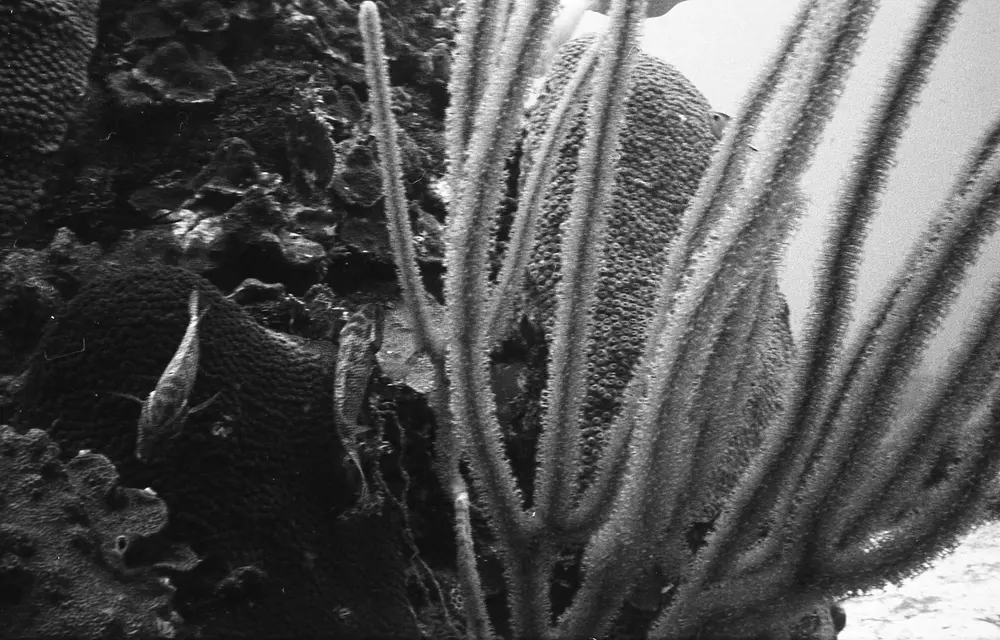{.lightbox group="discovery-bay-1966" description="**UUID: **eb772ed6-ed59-4572-9ce9-cb85b9564412 **Date: **1966-06-07 **Location: **Jamaica | Discovery Bay | The Bull **Longitude: **77.38917ºW **Latitude: **18.46917ºN **Photographer: **Eileen Graham **Copyright: **Trustees of the Natural History Museum (London, UK), CC-BY-4.0" alt="**UUID: **eb772ed6-ed59-4572-9ce9-cb85b9564412 **Date: **1966-06-07 **Location: **Jamaica | Discovery Bay | The Bull **Longitude: **77.38917ºW **Latitude: **18.46917ºN **Photographer: **Eileen Graham **Copyright: **Trustees of the Natural History Museum (London, UK), CC-BY-4.0"}

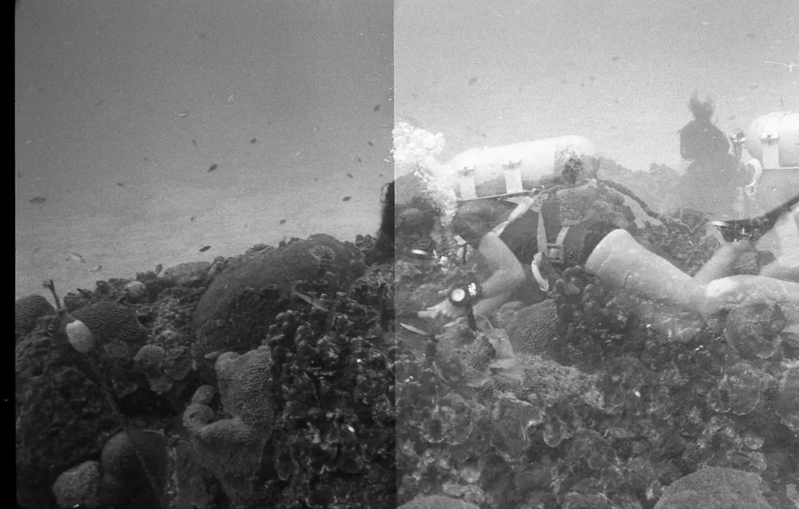{.lightbox group="discovery-bay-1966" description="**UUID: **1bb70d8a-72e4-42bc-8b00-c0ab9cdafdbb **Date: **1966-06-07 **Location: **Jamaica | Discovery Bay | The Bull **Longitude: **77.38917ºW **Latitude: **18.46917ºN **Photographer: **Eileen Graham **Copyright: **Trustees of the Natural History Museum (London, UK), CC-BY-4.0" alt="**UUID: **1bb70d8a-72e4-42bc-8b00-c0ab9cdafdbb **Date: **1966-06-07 **Location: **Jamaica | Discovery Bay | The Bull **Longitude: **77.38917ºW **Latitude: **18.46917ºN **Photographer: **Eileen Graham **Copyright: **Trustees of the Natural History Museum (London, UK), CC-BY-4.0"}

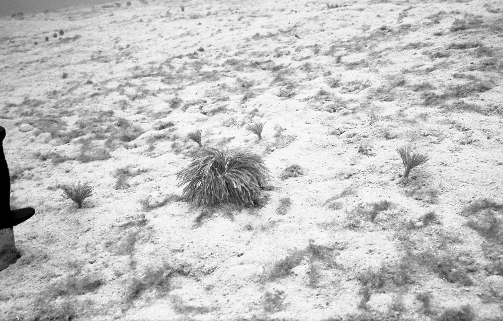{.lightbox group="discovery-bay-1966" description="**UUID: **7419d925-9364-4700-87cc-a06b3c9a2c73 **Date: **1966-06-07 **Location: **Jamaica | Discovery Bay | The Bull **Longitude: **77.38917ºW **Latitude: **18.46917ºN **Photographer: **Eileen Graham **Copyright: **Trustees of the Natural History Museum (London, UK), CC-BY-4.0" alt="**UUID: **7419d925-9364-4700-87cc-a06b3c9a2c73 **Date: **1966-06-07 **Location: **Jamaica | Discovery Bay | The Bull **Longitude: **77.38917ºW **Latitude: **18.46917ºN **Photographer: **Eileen Graham **Copyright: **Trustees of the Natural History Museum (London, UK), CC-BY-4.0"}

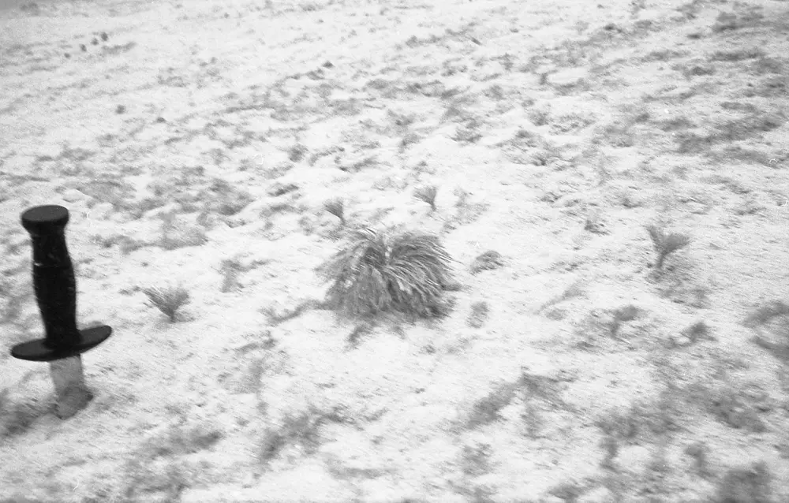{.lightbox group="discovery-bay-1966" description="**UUID: **5f90164e-422b-4a4e-b428-eff06b747d1d **Date: **1966-06-07 **Location: **Jamaica | Discovery Bay | The Bull **Longitude: **77.38917ºW **Latitude: **18.46917ºN **Photographer: **Eileen Graham **Copyright: **Trustees of the Natural History Museum (London, UK), CC-BY-4.0" alt="**UUID: **5f90164e-422b-4a4e-b428-eff06b747d1d **Date: **1966-06-07 **Location: **Jamaica | Discovery Bay | The Bull **Longitude: **77.38917ºW **Latitude: **18.46917ºN **Photographer: **Eileen Graham **Copyright: **Trustees of the Natural History Museum (London, UK), CC-BY-4.0"}

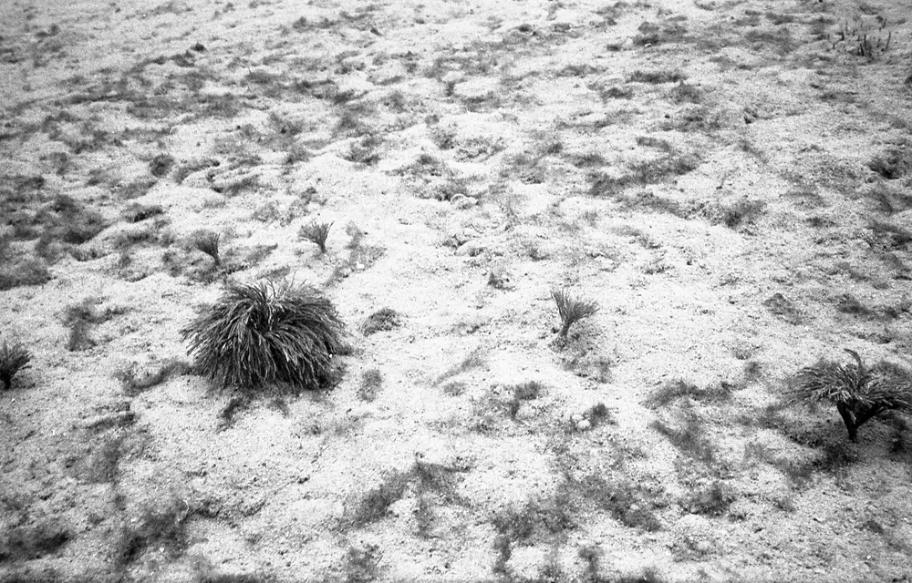{.lightbox group="discovery-bay-1966" description="**UUID: **9135d6dc-e3c7-4a6f-9ae8-acc83daea756 **Date: **1966-06-07 **Location: **Jamaica | Discovery Bay | The Bull **Longitude: **77.38917ºW **Latitude: **18.46917ºN **Photographer: **Eileen Graham **Copyright: **Trustees of the Natural History Museum (London, UK), CC-BY-4.0" alt="**UUID: **9135d6dc-e3c7-4a6f-9ae8-acc83daea756 **Date: **1966-06-07 **Location: **Jamaica | Discovery Bay | The Bull **Longitude: **77.38917ºW **Latitude: **18.46917ºN **Photographer: **Eileen Graham **Copyright: **Trustees of the Natural History Museum (London, UK), CC-BY-4.0"}

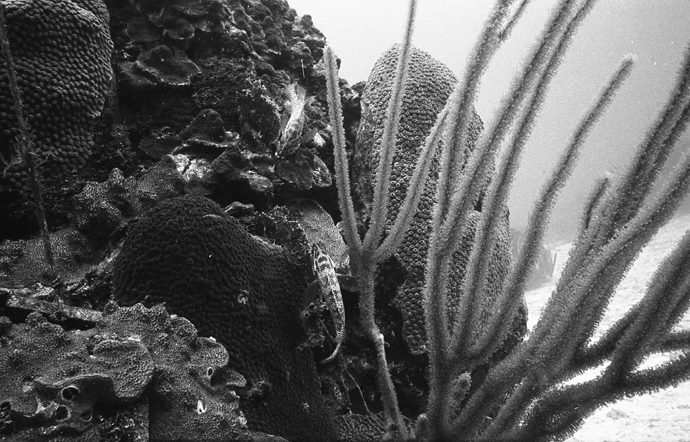{.lightbox group="discovery-bay-1966" description="**UUID: **6cb7c59b-53d0-4c47-b5ee-1d00de6e7b9b **Date: **1966-06-07 **Location: **Jamaica | Discovery Bay | The Bull **Longitude: **77.38917ºW **Latitude: **18.46917ºN **Photographer: **Eileen Graham **Copyright: **Trustees of the Natural History Museum (London, UK), CC-BY-4.0" alt="**UUID: **6cb7c59b-53d0-4c47-b5ee-1d00de6e7b9b **Date: **1966-06-07 **Location: **Jamaica | Discovery Bay | The Bull **Longitude: **77.38917ºW **Latitude: **18.46917ºN **Photographer: **Eileen Graham **Copyright: **Trustees of the Natural History Museum (London, UK), CC-BY-4.0"}

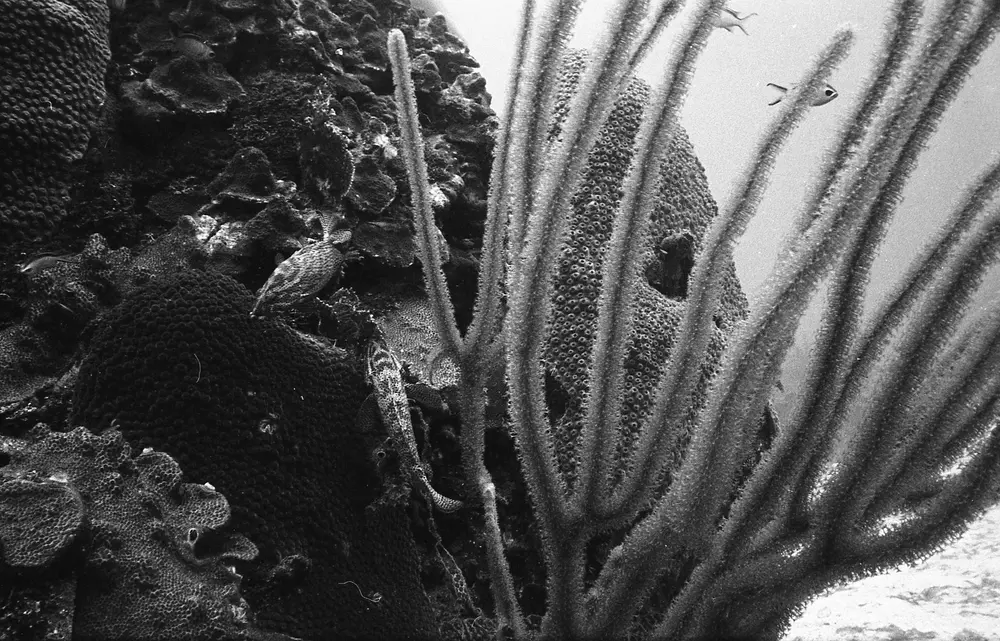{.lightbox group="discovery-bay-1966" description="**UUID: **3cf564d6-b607-4af2-b718-6f84e0db5cd5 **Date: **1966-06-07 **Location: **Jamaica | Discovery Bay | The Bull **Longitude: **77.38917ºW **Latitude: **18.46917ºN **Photographer: **Eileen Graham **Copyright: **Trustees of the Natural History Museum (London, UK), CC-BY-4.0" alt="**UUID: **3cf564d6-b607-4af2-b718-6f84e0db5cd5 **Date: **1966-06-07 **Location: **Jamaica | Discovery Bay | The Bull **Longitude: **77.38917ºW **Latitude: **18.46917ºN **Photographer: **Eileen Graham **Copyright: **Trustees of the Natural History Museum (London, UK), CC-BY-4.0"}

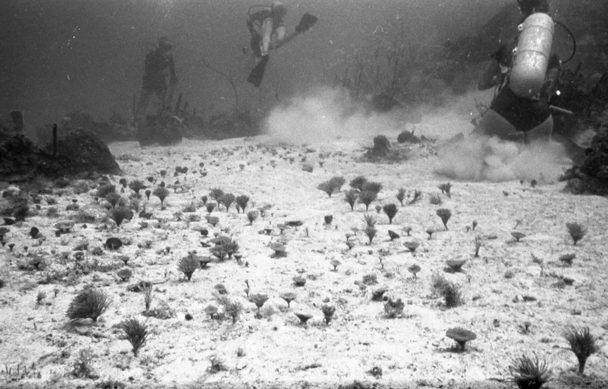{.lightbox group="discovery-bay-1966" description="**UUID: **4455f489-32e2-41a1-9581-2f8636490c95 **Date: **1966-07-07 **Location: **Jamaica | Discovery Bay | Eaton Hall **Longitude: **77.334ºW **Latitude: **18.467ºN **Photographer: **Eileen Graham **Copyright: **Trustees of the Natural History Museum (London, UK), CC-BY-4.0" alt="**UUID: **4455f489-32e2-41a1-9581-2f8636490c95 **Date: **1966-07-07 **Location: **Jamaica | Discovery Bay | Eaton Hall **Longitude: **77.334ºW **Latitude: **18.467ºN **Photographer: **Eileen Graham **Copyright: **Trustees of the Natural History Museum (London, UK), CC-BY-4.0"}

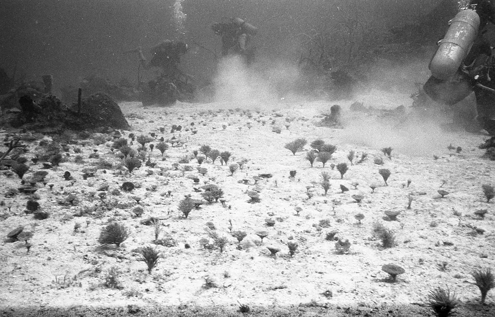{.lightbox group="discovery-bay-1966" description="**UUID: **e098cfc6-779d-4aff-81e1-d64c87d1ef63 **Date: **1966-07-07 **Location: **Jamaica | Discovery Bay | Eaton Hall **Longitude: **77.334ºW **Latitude: **18.467ºN **Photographer: **Eileen Graham **Copyright: **Trustees of the Natural History Museum (London, UK), CC-BY-4.0" alt="**UUID: **e098cfc6-779d-4aff-81e1-d64c87d1ef63 **Date: **1966-07-07 **Location: **Jamaica | Discovery Bay | Eaton Hall **Longitude: **77.334ºW **Latitude: **18.467ºN **Photographer: **Eileen Graham **Copyright: **Trustees of the Natural History Museum (London, UK), CC-BY-4.0"}

{.lightbox group="discovery-bay-1966" description="**UUID: **447c345b-0cd8-4a75-9831-a42aefa5b300 **Date: **NA **Location: **Jamaica | Discovery Bay **Longitude: **77.41543ºW **Latitude: **18.468618ºN **Photographer: **Eileen Graham **Copyright: **Trustees of the Natural History Museum (London, UK), CC-BY-4.0" alt="**UUID: **447c345b-0cd8-4a75-9831-a42aefa5b300 **Date: **NA **Location: **Jamaica | Discovery Bay **Longitude: **77.41543ºW **Latitude: **18.468618ºN **Photographer: **Eileen Graham **Copyright: **Trustees of the Natural History Museum (London, UK), CC-BY-4.0"}

{.lightbox group="discovery-bay-1966" description="**UUID: **8b79b7a9-05a6-4dec-ad83-9be89e681c2a **Date: **NA **Location: **Jamaica | Discovery Bay **Longitude: **77.41543ºW **Latitude: **18.468618ºN **Photographer: **Eileen Graham **Copyright: **Trustees of the Natural History Museum (London, UK), CC-BY-4.0" alt="**UUID: **8b79b7a9-05a6-4dec-ad83-9be89e681c2a **Date: **NA **Location: **Jamaica | Discovery Bay **Longitude: **77.41543ºW **Latitude: **18.468618ºN **Photographer: **Eileen Graham **Copyright: **Trustees of the Natural History Museum (London, UK), CC-BY-4.0"}

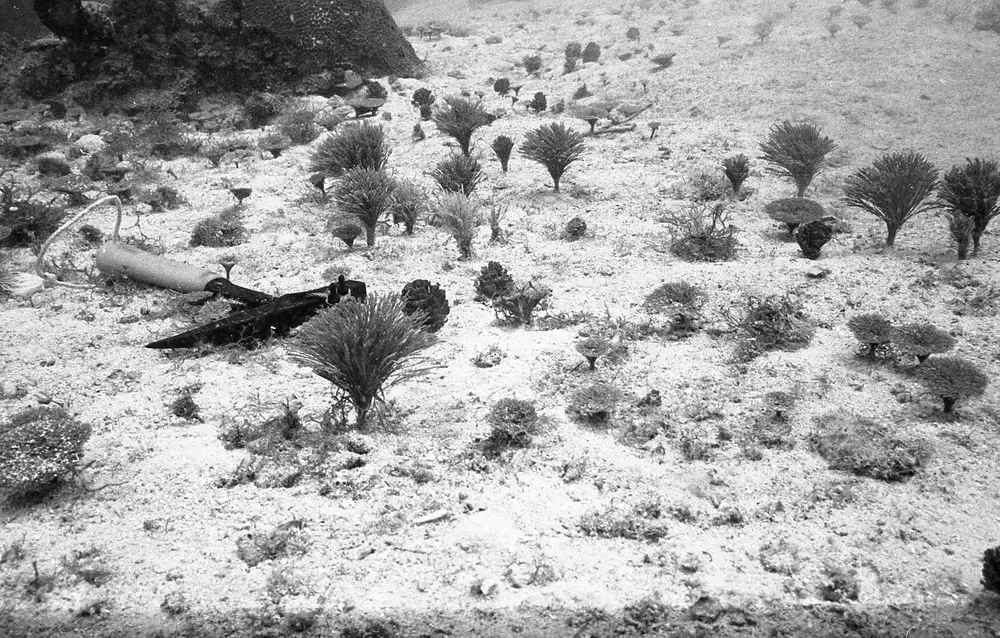{.lightbox group="discovery-bay-1966" description="**UUID: **b367d447-9e9d-4fea-9685-d95896d67bcb **Date: **1966-07-07 **Location: **Jamaica | Discovery Bay | Eaton Hall **Longitude: **77.334ºW **Latitude: **18.467ºN **Photographer: **Eileen Graham **Copyright: **Trustees of the Natural History Museum (London, UK), CC-BY-4.0" alt="**UUID: **b367d447-9e9d-4fea-9685-d95896d67bcb **Date: **1966-07-07 **Location: **Jamaica | Discovery Bay | Eaton Hall **Longitude: **77.334ºW **Latitude: **18.467ºN **Photographer: **Eileen Graham **Copyright: **Trustees of the Natural History Museum (London, UK), CC-BY-4.0"}

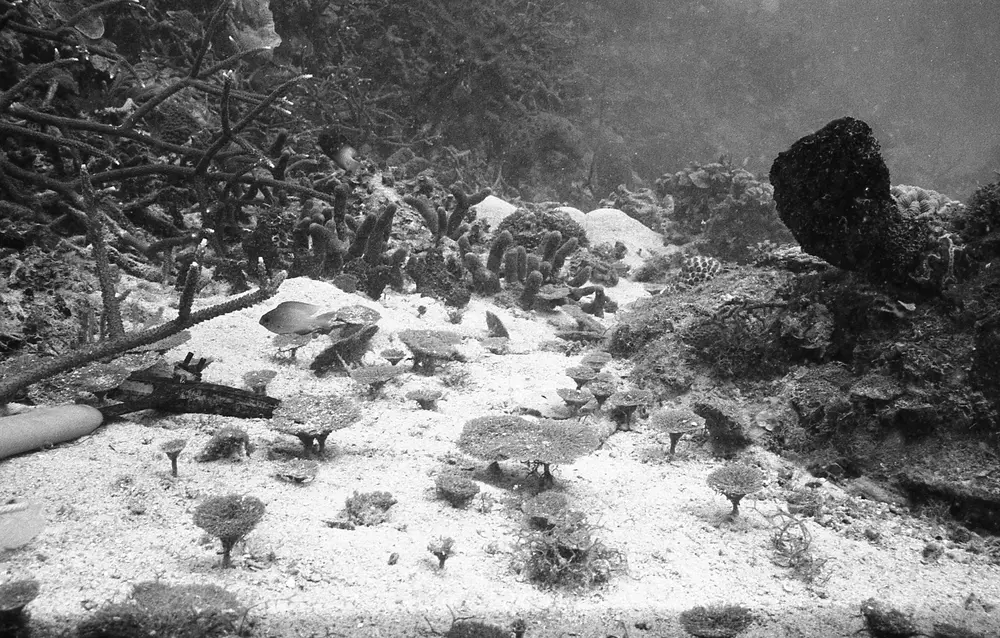{.lightbox group="discovery-bay-1966" description="**UUID: **0c7338de-2c2c-4e01-a8bc-6f590f6f08c1 **Date: **1966-07-07 **Location: **Jamaica | Discovery Bay | Eaton Hall **Longitude: **77.334ºW **Latitude: **18.467ºN **Photographer: **Eileen Graham **Copyright: **Trustees of the Natural History Museum (London, UK), CC-BY-4.0" alt="**UUID: **0c7338de-2c2c-4e01-a8bc-6f590f6f08c1 **Date: **1966-07-07 **Location: **Jamaica | Discovery Bay | Eaton Hall **Longitude: **77.334ºW **Latitude: **18.467ºN **Photographer: **Eileen Graham **Copyright: **Trustees of the Natural History Museum (London, UK), CC-BY-4.0"}

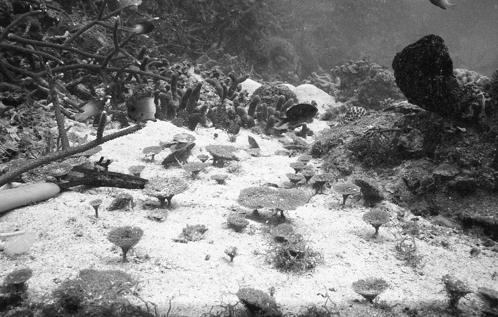{.lightbox group="discovery-bay-1966" description="**UUID: **d45c74ab-8785-47c8-96e4-a435c5fde573 **Date: **1966-07-07 **Location: **Jamaica | Discovery Bay | Eaton Hall **Longitude: **77.334ºW **Latitude: **18.467ºN **Photographer: **Eileen Graham **Copyright: **Trustees of the Natural History Museum (London, UK), CC-BY-4.0" alt="**UUID: **d45c74ab-8785-47c8-96e4-a435c5fde573 **Date: **1966-07-07 **Location: **Jamaica | Discovery Bay | Eaton Hall **Longitude: **77.334ºW **Latitude: **18.467ºN **Photographer: **Eileen Graham **Copyright: **Trustees of the Natural History Museum (London, UK), CC-BY-4.0"}

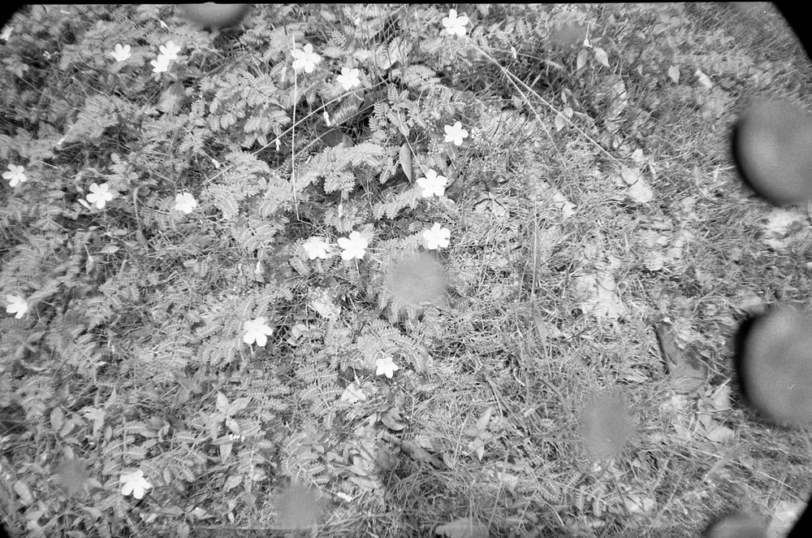{.lightbox group="discovery-bay-1966" description="**UUID: **479d96d4-5d62-4a68-97cc-8861977ef977 **Date: **1966-06-07 **Location: **Jamaica | Discovery Bay | Onshore **Longitude: **77.41543ºW **Latitude: **18.468618ºN **Photographer: **Eileen Graham **Copyright: **Trustees of the Natural History Museum (London, UK), CC-BY-4.0" alt="**UUID: **479d96d4-5d62-4a68-97cc-8861977ef977 **Date: **1966-06-07 **Location: **Jamaica | Discovery Bay | Onshore **Longitude: **77.41543ºW **Latitude: **18.468618ºN **Photographer: **Eileen Graham **Copyright: **Trustees of the Natural History Museum (London, UK), CC-BY-4.0"}

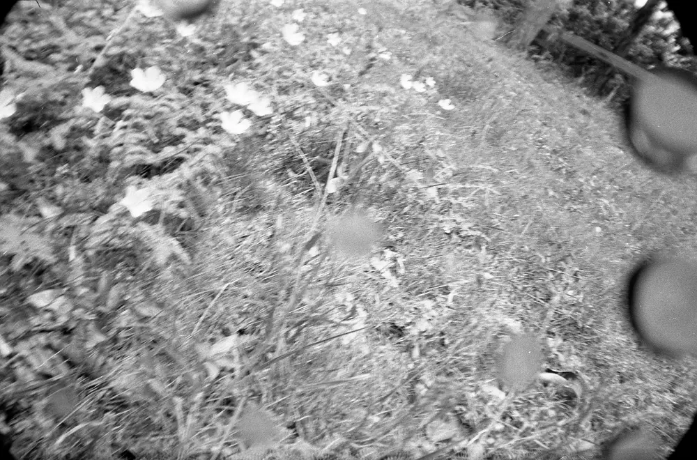{.lightbox group="discovery-bay-1966" description="**UUID: **1dbf330c-d641-47e4-86a2-8f62f3d5321d **Date: **1966-06-07 **Location: **Jamaica | Discovery Bay | Onshore **Longitude: **77.41543ºW **Latitude: **18.468618ºN **Photographer: **Eileen Graham **Copyright: **Trustees of the Natural History Museum (London, UK), CC-BY-4.0" alt="**UUID: **1dbf330c-d641-47e4-86a2-8f62f3d5321d **Date: **1966-06-07 **Location: **Jamaica | Discovery Bay | Onshore **Longitude: **77.41543ºW **Latitude: **18.468618ºN **Photographer: **Eileen Graham **Copyright: **Trustees of the Natural History Museum (London, UK), CC-BY-4.0"}

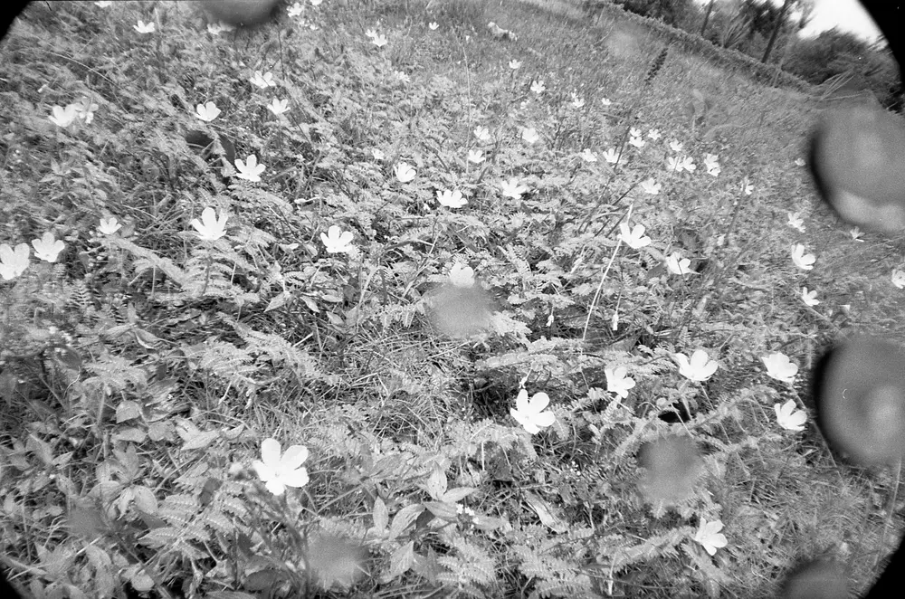{.lightbox group="discovery-bay-1966" description="**UUID: **d4e346f7-cbab-4c2f-9b0f-107bbe2741bf **Date: **1966-06-07 **Location: **Jamaica | Discovery Bay | Onshore **Longitude: **77.41543ºW **Latitude: **18.468618ºN **Photographer: **Eileen Graham **Copyright: **Trustees of the Natural History Museum (London, UK), CC-BY-4.0" alt="**UUID: **d4e346f7-cbab-4c2f-9b0f-107bbe2741bf **Date: **1966-06-07 **Location: **Jamaica | Discovery Bay | Onshore **Longitude: **77.41543ºW **Latitude: **18.468618ºN **Photographer: **Eileen Graham **Copyright: **Trustees of the Natural History Museum (London, UK), CC-BY-4.0"}

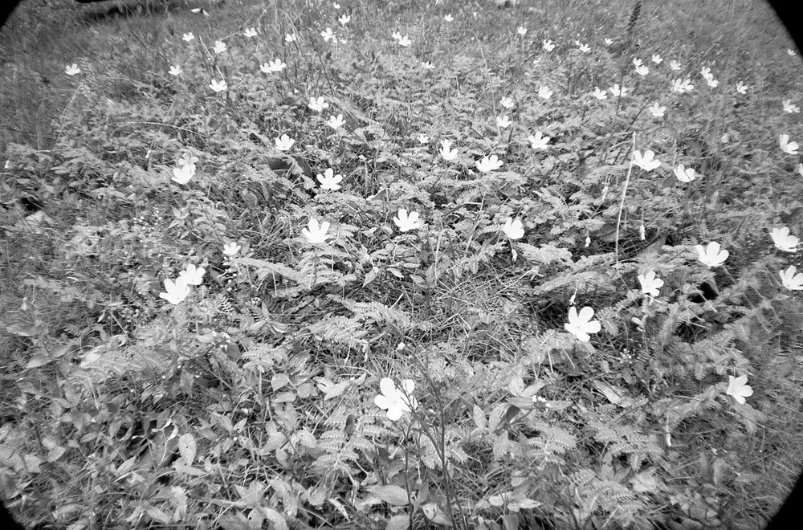{.lightbox group="discovery-bay-1966" description="**UUID: **7a6be3e3-e9db-4986-b7c0-d3ba93bab9a1 **Date: **1966-06-07 **Location: **Jamaica | Discovery Bay | Onshore **Longitude: **77.41543ºW **Latitude: **18.468618ºN **Photographer: **Eileen Graham **Copyright: **Trustees of the Natural History Museum (London, UK), CC-BY-4.0" alt="**UUID: **7a6be3e3-e9db-4986-b7c0-d3ba93bab9a1 **Date: **1966-06-07 **Location: **Jamaica | Discovery Bay | Onshore **Longitude: **77.41543ºW **Latitude: **18.468618ºN **Photographer: **Eileen Graham **Copyright: **Trustees of the Natural History Museum (London, UK), CC-BY-4.0"}

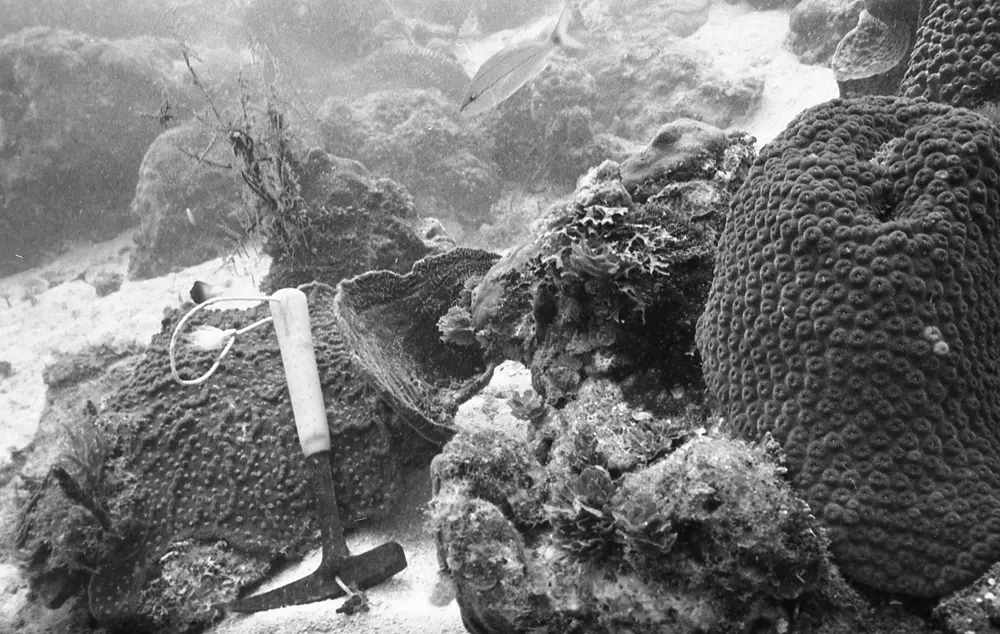{.lightbox group="discovery-bay-1966" description="**UUID: **cbe73898-79a4-481b-a030-99d222b74391 **Date: **1966-07-07 **Location: **Jamaica | Discovery Bay | Eaton Hall **Longitude: **77.334ºW **Latitude: **18.467ºN **Photographer: **Eileen Graham **Copyright: **Trustees of the Natural History Museum (London, UK), CC-BY-4.0" alt="**UUID: **cbe73898-79a4-481b-a030-99d222b74391 **Date: **1966-07-07 **Location: **Jamaica | Discovery Bay | Eaton Hall **Longitude: **77.334ºW **Latitude: **18.467ºN **Photographer: **Eileen Graham **Copyright: **Trustees of the Natural History Museum (London, UK), CC-BY-4.0"}

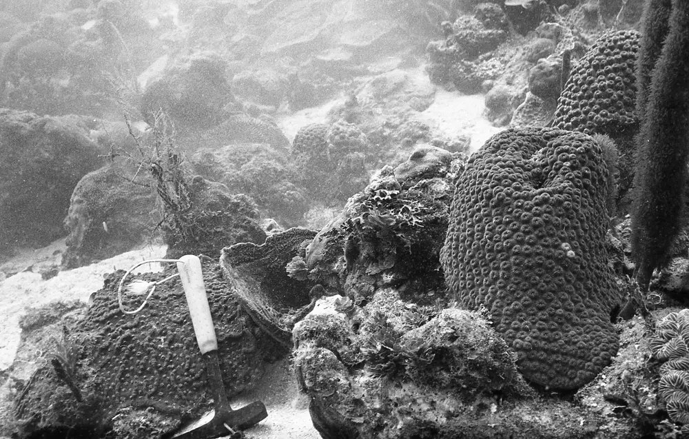{.lightbox group="discovery-bay-1966" description="**UUID: **172b7114-d38a-4dc0-9d2d-329c9fae5a09 **Date: **1966-07-07 **Location: **Jamaica | Discovery Bay | Eaton Hall **Longitude: **77.334ºW **Latitude: **18.467ºN **Photographer: **Eileen Graham **Copyright: **Trustees of the Natural History Museum (London, UK), CC-BY-4.0" alt="**UUID: **172b7114-d38a-4dc0-9d2d-329c9fae5a09 **Date: **1966-07-07 **Location: **Jamaica | Discovery Bay | Eaton Hall **Longitude: **77.334ºW **Latitude: **18.467ºN **Photographer: **Eileen Graham **Copyright: **Trustees of the Natural History Museum (London, UK), CC-BY-4.0"}

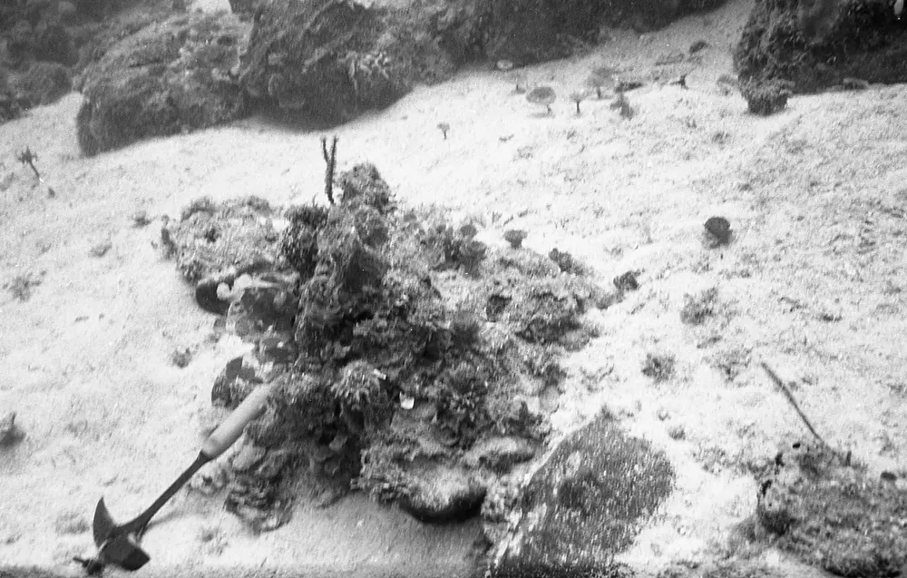{.lightbox group="discovery-bay-1966" description="**UUID: **50a691fc-b38d-41cf-8fec-41b240c24177 **Date: **1966-07-07 **Location: **Jamaica | Discovery Bay | Eaton Hall **Longitude: **77.334ºW **Latitude: **18.467ºN **Photographer: **Eileen Graham **Copyright: **Trustees of the Natural History Museum (London, UK), CC-BY-4.0" alt="**UUID: **50a691fc-b38d-41cf-8fec-41b240c24177 **Date: **1966-07-07 **Location: **Jamaica | Discovery Bay | Eaton Hall **Longitude: **77.334ºW **Latitude: **18.467ºN **Photographer: **Eileen Graham **Copyright: **Trustees of the Natural History Museum (London, UK), CC-BY-4.0"}

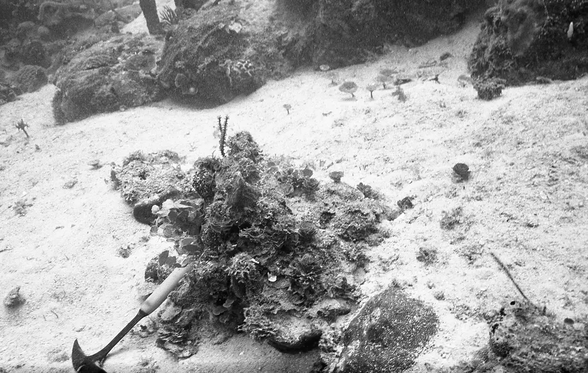{.lightbox group="discovery-bay-1966" description="**UUID: **b3a0a045-20c4-4a7d-b6e4-e6dd9d378273 **Date: **1966-07-07 **Location: **Jamaica | Discovery Bay | Eaton Hall **Longitude: **77.334ºW **Latitude: **18.467ºN **Photographer: **Eileen Graham **Copyright: **Trustees of the Natural History Museum (London, UK), CC-BY-4.0" alt="**UUID: **b3a0a045-20c4-4a7d-b6e4-e6dd9d378273 **Date: **1966-07-07 **Location: **Jamaica | Discovery Bay | Eaton Hall **Longitude: **77.334ºW **Latitude: **18.467ºN **Photographer: **Eileen Graham **Copyright: **Trustees of the Natural History Museum (London, UK), CC-BY-4.0"}

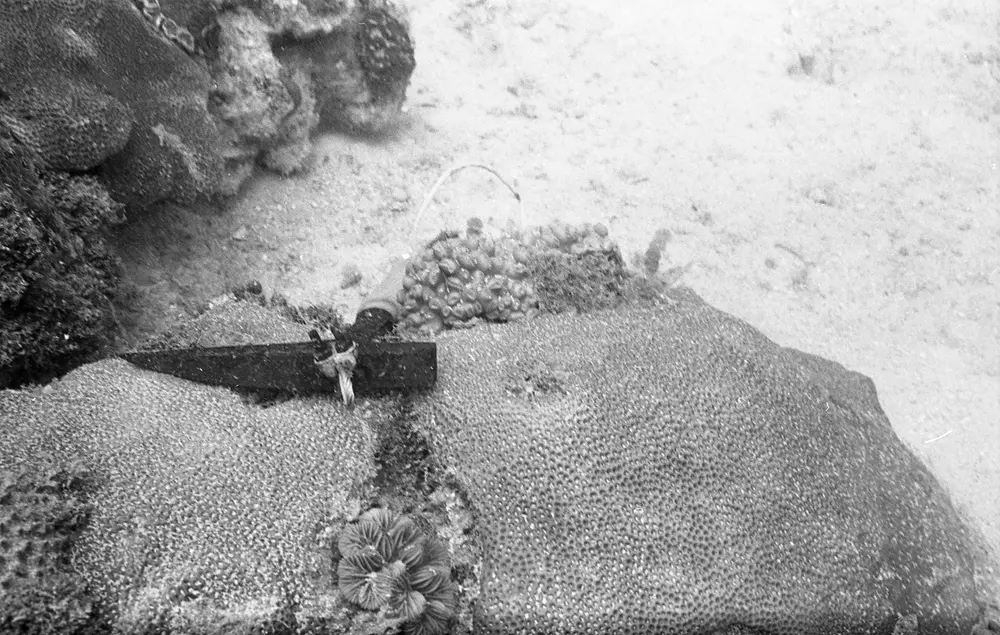{.lightbox group="discovery-bay-1966" description="**UUID: **3e04cd81-c11c-4231-9314-399a815d64de **Date: **1966-07-07 **Location: **Jamaica | Discovery Bay | Eaton Hall **Longitude: **77.334ºW **Latitude: **18.467ºN **Photographer: **Eileen Graham **Copyright: **Trustees of the Natural History Museum (London, UK), CC-BY-4.0" alt="**UUID: **3e04cd81-c11c-4231-9314-399a815d64de **Date: **1966-07-07 **Location: **Jamaica | Discovery Bay | Eaton Hall **Longitude: **77.334ºW **Latitude: **18.467ºN **Photographer: **Eileen Graham **Copyright: **Trustees of the Natural History Museum (London, UK), CC-BY-4.0"}

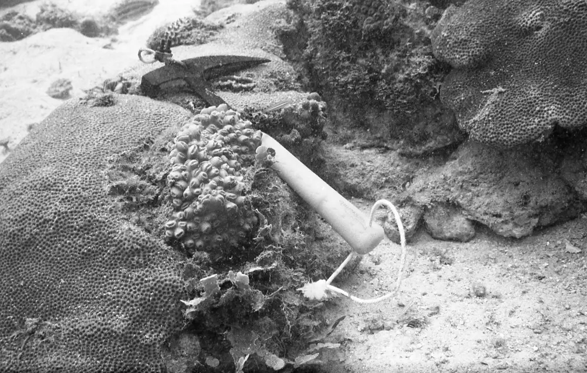{.lightbox group="discovery-bay-1966" description="**UUID: **044126d5-a611-4a2d-911f-bc51ab49ce5a **Date: **1966-07-07 **Location: **Jamaica | Discovery Bay | Eaton Hall **Longitude: **77.334ºW **Latitude: **18.467ºN **Photographer: **Eileen Graham **Copyright: **Trustees of the Natural History Museum (London, UK), CC-BY-4.0" alt="**UUID: **044126d5-a611-4a2d-911f-bc51ab49ce5a **Date: **1966-07-07 **Location: **Jamaica | Discovery Bay | Eaton Hall **Longitude: **77.334ºW **Latitude: **18.467ºN **Photographer: **Eileen Graham **Copyright: **Trustees of the Natural History Museum (London, UK), CC-BY-4.0"}

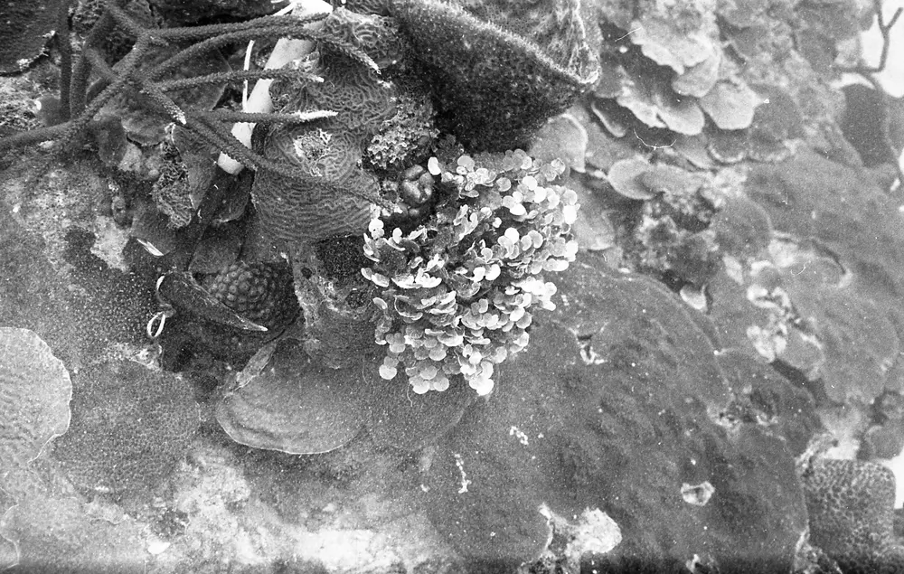{.lightbox group="discovery-bay-1966" description="**UUID: **74531b2d-1e8b-4fe1-9ae9-72460025e7a2 **Date: **1966-07-07 **Location: **Jamaica | Discovery Bay | Eaton Hall **Longitude: **77.334ºW **Latitude: **18.467ºN **Photographer: **Eileen Graham **Copyright: **Trustees of the Natural History Museum (London, UK), CC-BY-4.0" alt="**UUID: **74531b2d-1e8b-4fe1-9ae9-72460025e7a2 **Date: **1966-07-07 **Location: **Jamaica | Discovery Bay | Eaton Hall **Longitude: **77.334ºW **Latitude: **18.467ºN **Photographer: **Eileen Graham **Copyright: **Trustees of the Natural History Museum (London, UK), CC-BY-4.0"}

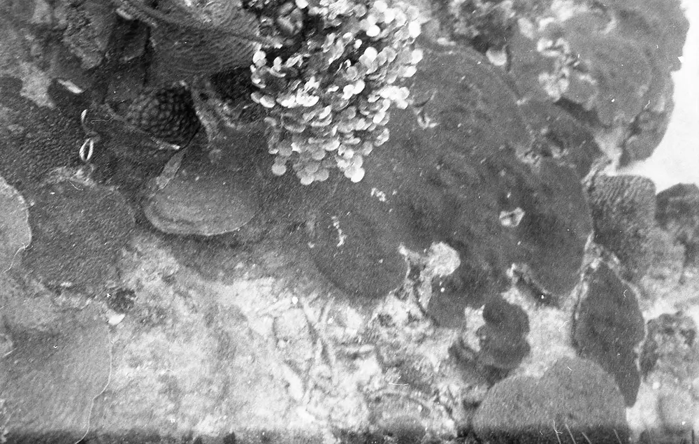{.lightbox group="discovery-bay-1966" description="**UUID: **cd536f3f-19ad-462a-b5e3-a9e8abdbfdd7 **Date: **1966-07-07 **Location: **Jamaica | Discovery Bay | Eaton Hall **Longitude: **77.334ºW **Latitude: **18.467ºN **Photographer: **Eileen Graham **Copyright: **Trustees of the Natural History Museum (London, UK), CC-BY-4.0" alt="**UUID: **cd536f3f-19ad-462a-b5e3-a9e8abdbfdd7 **Date: **1966-07-07 **Location: **Jamaica | Discovery Bay | Eaton Hall **Longitude: **77.334ºW **Latitude: **18.467ºN **Photographer: **Eileen Graham **Copyright: **Trustees of the Natural History Museum (London, UK), CC-BY-4.0"}

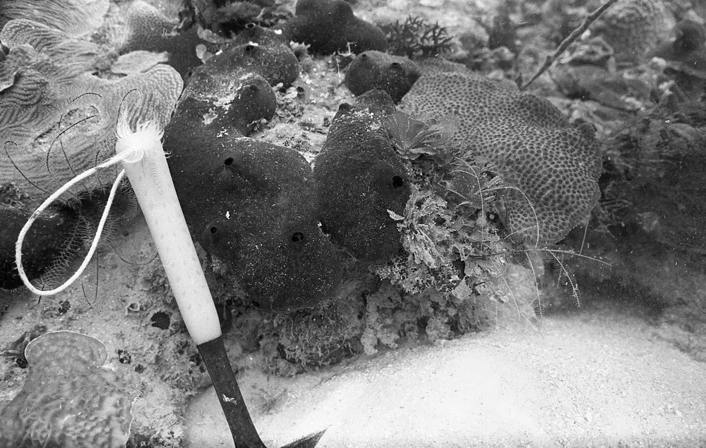{.lightbox group="discovery-bay-1966" description="**UUID: **63fba4c3-b0a9-429d-a8ee-0329a5caa9f3 **Date: **1966-07-07 **Location: **Jamaica | Discovery Bay | Eaton Hall **Longitude: **77.334ºW **Latitude: **18.467ºN **Photographer: **Eileen Graham **Copyright: **Trustees of the Natural History Museum (London, UK), CC-BY-4.0" alt="**UUID: **63fba4c3-b0a9-429d-a8ee-0329a5caa9f3 **Date: **1966-07-07 **Location: **Jamaica | Discovery Bay | Eaton Hall **Longitude: **77.334ºW **Latitude: **18.467ºN **Photographer: **Eileen Graham **Copyright: **Trustees of the Natural History Museum (London, UK), CC-BY-4.0"}

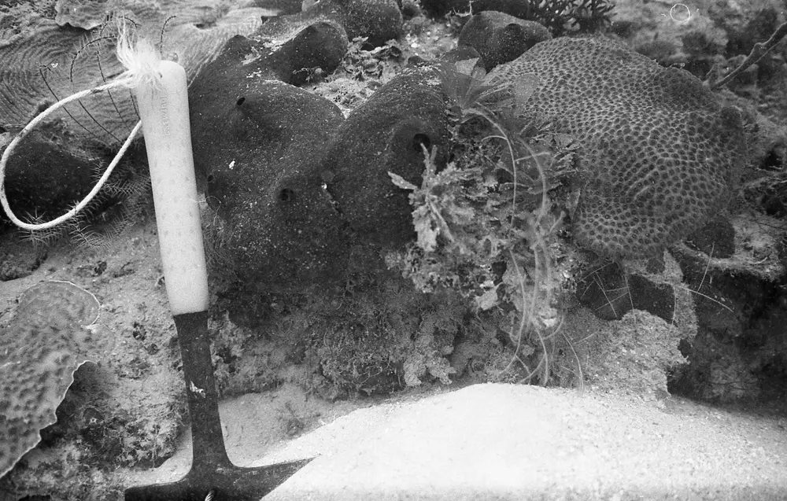{.lightbox group="discovery-bay-1966" description="**UUID: **cfb852eb-86bd-495a-a47e-465a535299c7 **Date: **1966-07-07 **Location: **Jamaica | Discovery Bay | Eaton Hall **Longitude: **77.334ºW **Latitude: **18.467ºN **Photographer: **Eileen Graham **Copyright: **Trustees of the Natural History Museum (London, UK), CC-BY-4.0" alt="**UUID: **cfb852eb-86bd-495a-a47e-465a535299c7 **Date: **1966-07-07 **Location: **Jamaica | Discovery Bay | Eaton Hall **Longitude: **77.334ºW **Latitude: **18.467ºN **Photographer: **Eileen Graham **Copyright: **Trustees of the Natural History Museum (London, UK), CC-BY-4.0"}

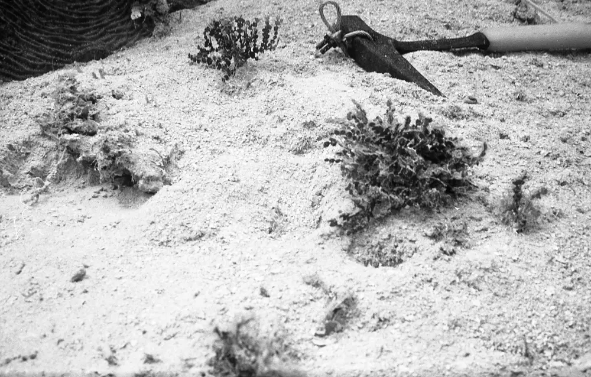{.lightbox group="discovery-bay-1966" description="**UUID: **c58405ab-88f5-403f-89a3-fe70255cda61 **Date: **1966-07-18 **Location: **Jamaica | Discovery Bay | Algal Plots **Longitude: **77.414ºW **Latitude: **18.473ºN **Photographer: **Eileen Graham **Copyright: **Trustees of the Natural History Museum (London, UK), CC-BY-4.0" alt="**UUID: **c58405ab-88f5-403f-89a3-fe70255cda61 **Date: **1966-07-18 **Location: **Jamaica | Discovery Bay | Algal Plots **Longitude: **77.414ºW **Latitude: **18.473ºN **Photographer: **Eileen Graham **Copyright: **Trustees of the Natural History Museum (London, UK), CC-BY-4.0"}

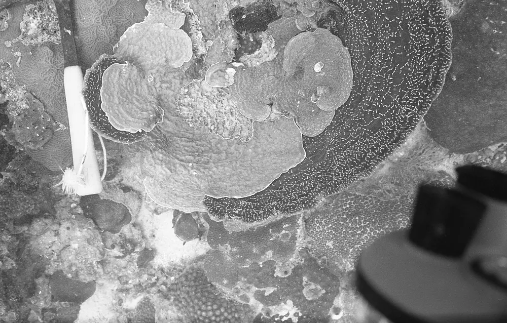{.lightbox group="discovery-bay-1966" description="**UUID: **3b45e2dd-1a3e-4da7-a97b-99f50187cd92 **Date: **1966-07-18 **Location: **Jamaica | Discovery Bay | Buoy Upper Slope **Longitude: **77.40908ºW **Latitude: **18.47322ºN **Photographer: **Eileen Graham **Copyright: **Trustees of the Natural History Museum (London, UK), CC-BY-4.0" alt="**UUID: **3b45e2dd-1a3e-4da7-a97b-99f50187cd92 **Date: **1966-07-18 **Location: **Jamaica | Discovery Bay | Buoy Upper Slope **Longitude: **77.40908ºW **Latitude: **18.47322ºN **Photographer: **Eileen Graham **Copyright: **Trustees of the Natural History Museum (London, UK), CC-BY-4.0"}

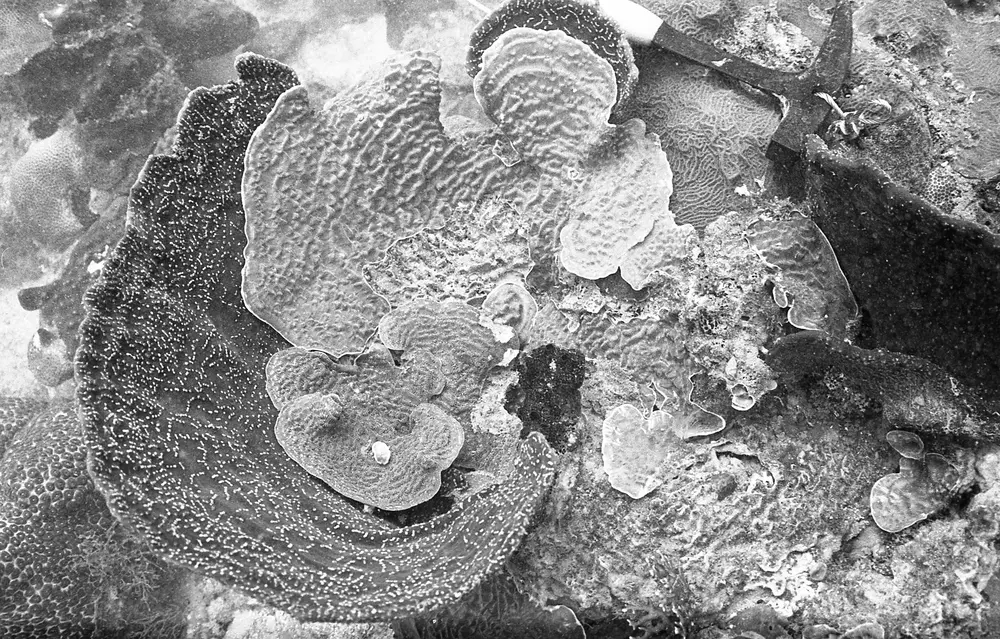{.lightbox group="discovery-bay-1966" description="**UUID: **de65871b-b3ad-40d9-b045-9f08dd6e345a **Date: **1966-07-18 **Location: **Jamaica | Discovery Bay | Buoy Upper Slope **Longitude: **77.40908ºW **Latitude: **18.47322ºN **Photographer: **Eileen Graham **Copyright: **Trustees of the Natural History Museum (London, UK), CC-BY-4.0" alt="**UUID: **de65871b-b3ad-40d9-b045-9f08dd6e345a **Date: **1966-07-18 **Location: **Jamaica | Discovery Bay | Buoy Upper Slope **Longitude: **77.40908ºW **Latitude: **18.47322ºN **Photographer: **Eileen Graham **Copyright: **Trustees of the Natural History Museum (London, UK), CC-BY-4.0"}

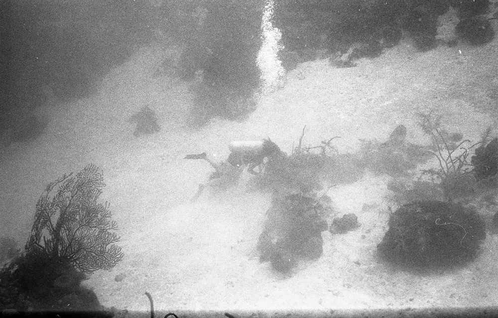{.lightbox group="discovery-bay-1966" description="**UUID: **cf0166c8-1bdd-47c1-82fd-ba4538c6f5b6 **Date: **1966-07-18 **Location: **Jamaica | Discovery Bay | Buoy West Sand Slope **Longitude: **77.41017ºW **Latitude: **18.47367ºN **Photographer: **Eileen Graham **Copyright: **Trustees of the Natural History Museum (London, UK), CC-BY-4.0" alt="**UUID: **cf0166c8-1bdd-47c1-82fd-ba4538c6f5b6 **Date: **1966-07-18 **Location: **Jamaica | Discovery Bay | Buoy West Sand Slope **Longitude: **77.41017ºW **Latitude: **18.47367ºN **Photographer: **Eileen Graham **Copyright: **Trustees of the Natural History Museum (London, UK), CC-BY-4.0"}

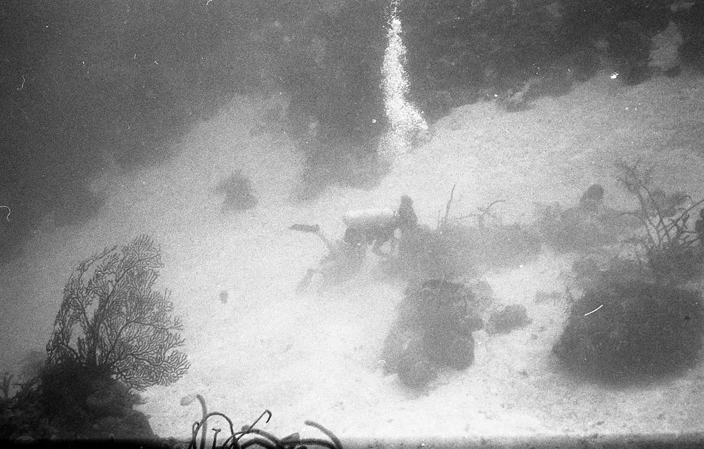{.lightbox group="discovery-bay-1966" description="**UUID: **d022c1f2-4110-4b59-9744-44063535f469 **Date: **1966-07-18 **Location: **Jamaica | Discovery Bay | Buoy West Sand Slope **Longitude: **77.41017ºW **Latitude: **18.47367ºN **Photographer: **Eileen Graham **Copyright: **Trustees of the Natural History Museum (London, UK), CC-BY-4.0" alt="**UUID: **d022c1f2-4110-4b59-9744-44063535f469 **Date: **1966-07-18 **Location: **Jamaica | Discovery Bay | Buoy West Sand Slope **Longitude: **77.41017ºW **Latitude: **18.47367ºN **Photographer: **Eileen Graham **Copyright: **Trustees of the Natural History Museum (London, UK), CC-BY-4.0"}

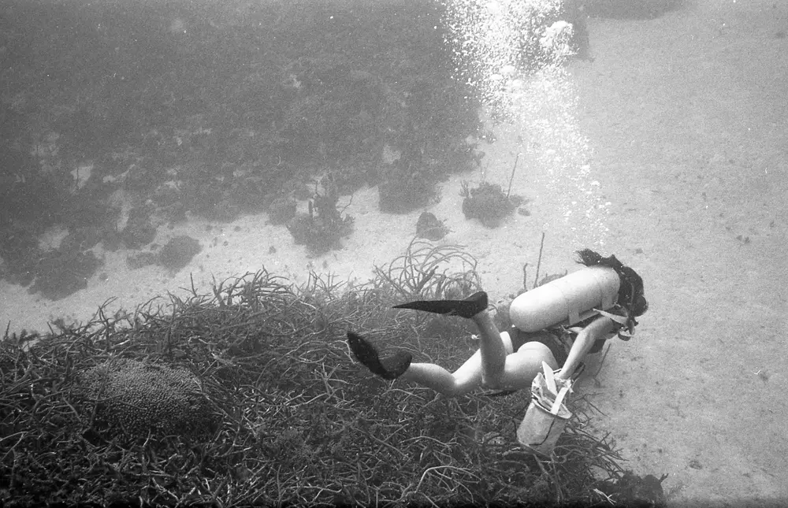{.lightbox group="discovery-bay-1966" description="**UUID: **15834a43-0b26-4e36-bdd8-f0c5649f96b5 **Date: **1966-07-24 **Location: **Jamaica | Discovery Bay | Buoy Sector Escarpment **Longitude: **77.4093ºW **Latitude: **18.4723ºN **Photographer: **Eileen Graham **Copyright: **Trustees of the Natural History Museum (London, UK), CC-BY-4.0" alt="**UUID: **15834a43-0b26-4e36-bdd8-f0c5649f96b5 **Date: **1966-07-24 **Location: **Jamaica | Discovery Bay | Buoy Sector Escarpment **Longitude: **77.4093ºW **Latitude: **18.4723ºN **Photographer: **Eileen Graham **Copyright: **Trustees of the Natural History Museum (London, UK), CC-BY-4.0"}

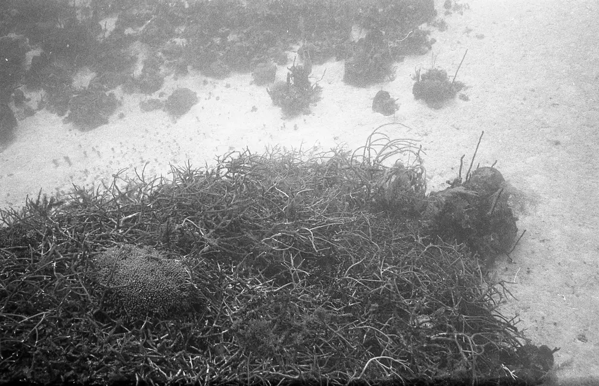{.lightbox group="discovery-bay-1966" description="**UUID: **8c32d505-32a1-4745-acb2-f89822fc458d **Date: **1966-07-24 **Location: **Jamaica | Discovery Bay | Buoy Sector Escarpment **Longitude: **77.4093ºW **Latitude: **18.4723ºN **Photographer: **Eileen Graham **Copyright: **Trustees of the Natural History Museum (London, UK), CC-BY-4.0" alt="**UUID: **8c32d505-32a1-4745-acb2-f89822fc458d **Date: **1966-07-24 **Location: **Jamaica | Discovery Bay | Buoy Sector Escarpment **Longitude: **77.4093ºW **Latitude: **18.4723ºN **Photographer: **Eileen Graham **Copyright: **Trustees of the Natural History Museum (London, UK), CC-BY-4.0"}

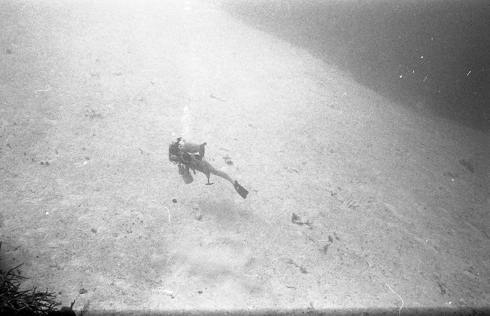{.lightbox group="discovery-bay-1966" description="**UUID: **b3f14208-2b58-4a1b-b6bc-4c3a9a0ea90b **Date: **1966-07-24 **Location: **Jamaica | Discovery Bay | Upper Buoy West Sand **Longitude: **77.40908ºW **Latitude: **18.47322ºN **Photographer: **Eileen Graham **Copyright: **Trustees of the Natural History Museum (London, UK), CC-BY-4.0" alt="**UUID: **b3f14208-2b58-4a1b-b6bc-4c3a9a0ea90b **Date: **1966-07-24 **Location: **Jamaica | Discovery Bay | Upper Buoy West Sand **Longitude: **77.40908ºW **Latitude: **18.47322ºN **Photographer: **Eileen Graham **Copyright: **Trustees of the Natural History Museum (London, UK), CC-BY-4.0"}

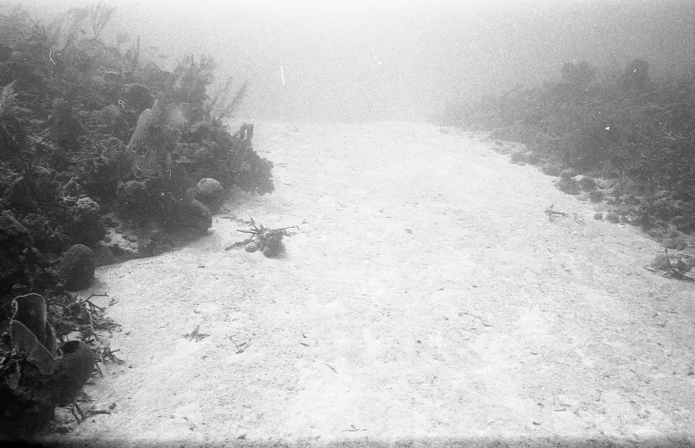{.lightbox group="discovery-bay-1966" description="**UUID: **fe9a6fab-359e-46c2-a0a8-e08706529922 **Date: **1966-07-22 **Location: **Jamaica | Discovery Bay | Upper Buoy West Sand **Longitude: **77.40908ºW **Latitude: **18.47322ºN **Photographer: **Eileen Graham **Copyright: **Trustees of the Natural History Museum (London, UK), CC-BY-4.0" alt="**UUID: **fe9a6fab-359e-46c2-a0a8-e08706529922 **Date: **1966-07-22 **Location: **Jamaica | Discovery Bay | Upper Buoy West Sand **Longitude: **77.40908ºW **Latitude: **18.47322ºN **Photographer: **Eileen Graham **Copyright: **Trustees of the Natural History Museum (London, UK), CC-BY-4.0"}

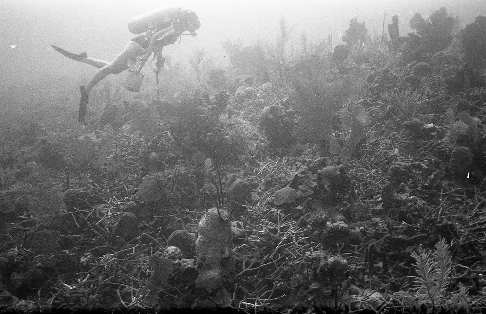{.lightbox group="discovery-bay-1966" description="**UUID: **e28b2c56-502e-4544-8b2f-ef00c60e3dcd **Date: **1966-07-24 **Location: **Jamaica | Discovery Bay | Upper Buoy Escarpment **Longitude: **77.409ºW **Latitude: **18.4726ºN **Photographer: **Eileen Graham **Copyright: **Trustees of the Natural History Museum (London, UK), CC-BY-4.0" alt="**UUID: **e28b2c56-502e-4544-8b2f-ef00c60e3dcd **Date: **1966-07-24 **Location: **Jamaica | Discovery Bay | Upper Buoy Escarpment **Longitude: **77.409ºW **Latitude: **18.4726ºN **Photographer: **Eileen Graham **Copyright: **Trustees of the Natural History Museum (London, UK), CC-BY-4.0"}

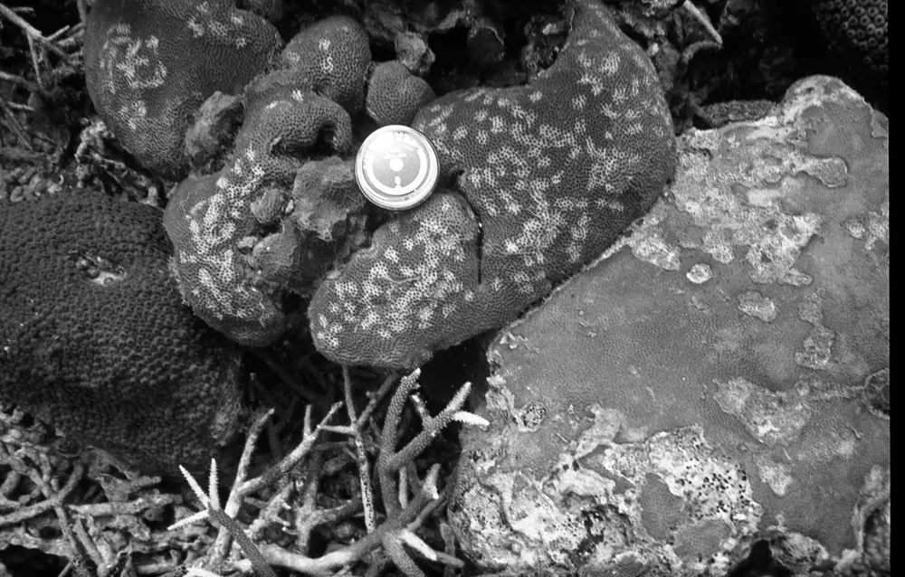{.lightbox group="discovery-bay-1966" description="**UUID: **7ad94ed7-190a-4338-afd5-d37bf341ab18 **Date: **1966-07-24 **Location: **Jamaica | Discovery Bay | Upper Buoy Terrace **Longitude: **77.40908ºW **Latitude: **18.47322ºN **Photographer: **Eileen Graham **Copyright: **Trustees of the Natural History Museum (London, UK), CC-BY-4.0" alt="**UUID: **7ad94ed7-190a-4338-afd5-d37bf341ab18 **Date: **1966-07-24 **Location: **Jamaica | Discovery Bay | Upper Buoy Terrace **Longitude: **77.40908ºW **Latitude: **18.47322ºN **Photographer: **Eileen Graham **Copyright: **Trustees of the Natural History Museum (London, UK), CC-BY-4.0"}

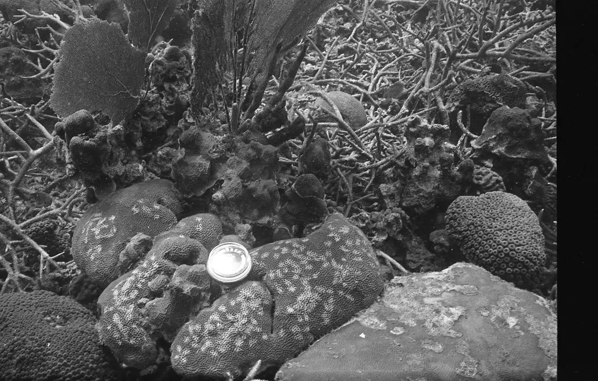{.lightbox group="discovery-bay-1966" description="**UUID: **3673689d-5b30-4c19-9e4a-28a27087cc18 **Date: **1966-07-24 **Location: **Jamaica | Discovery Bay | Upper Buoy Terrace **Longitude: **77.40908ºW **Latitude: **18.47322ºN **Photographer: **Eileen Graham **Copyright: **Trustees of the Natural History Museum (London, UK), CC-BY-4.0" alt="**UUID: **3673689d-5b30-4c19-9e4a-28a27087cc18 **Date: **1966-07-24 **Location: **Jamaica | Discovery Bay | Upper Buoy Terrace **Longitude: **77.40908ºW **Latitude: **18.47322ºN **Photographer: **Eileen Graham **Copyright: **Trustees of the Natural History Museum (London, UK), CC-BY-4.0"}

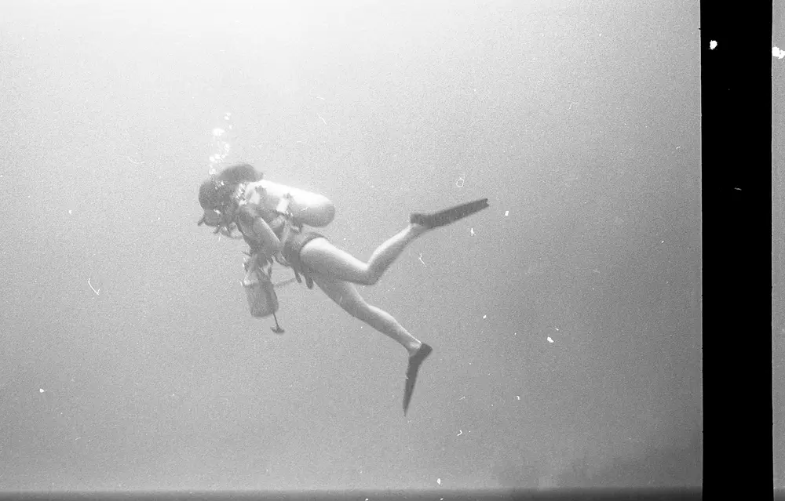{.lightbox group="discovery-bay-1966" description="**UUID: **bd29a250-a748-4cc0-8032-22d2b895666a **Date: **1966-07-24 **Location: **Jamaica | Discovery Bay | Upper Buoy Terrace **Longitude: **77.40908ºW **Latitude: **18.47322ºN **Photographer: **Eileen Graham **Copyright: **Trustees of the Natural History Museum (London, UK), CC-BY-4.0" alt="**UUID: **bd29a250-a748-4cc0-8032-22d2b895666a **Date: **1966-07-24 **Location: **Jamaica | Discovery Bay | Upper Buoy Terrace **Longitude: **77.40908ºW **Latitude: **18.47322ºN **Photographer: **Eileen Graham **Copyright: **Trustees of the Natural History Museum (London, UK), CC-BY-4.0"}

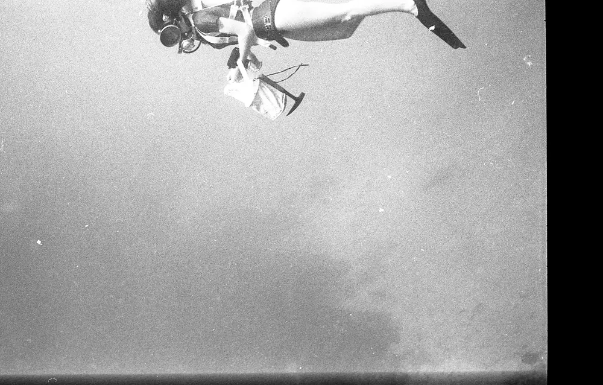{.lightbox group="discovery-bay-1966" description="**UUID: **ef55a9c0-5279-4b03-888b-d4bf4f6fef7c **Date: **1966-07-24 **Location: **Jamaica | Discovery Bay | Upper Buoy Terrace **Longitude: **77.40908ºW **Latitude: **18.47322ºN **Photographer: **Eileen Graham **Copyright: **Trustees of the Natural History Museum (London, UK), CC-BY-4.0" alt="**UUID: **ef55a9c0-5279-4b03-888b-d4bf4f6fef7c **Date: **1966-07-24 **Location: **Jamaica | Discovery Bay | Upper Buoy Terrace **Longitude: **77.40908ºW **Latitude: **18.47322ºN **Photographer: **Eileen Graham **Copyright: **Trustees of the Natural History Museum (London, UK), CC-BY-4.0"}

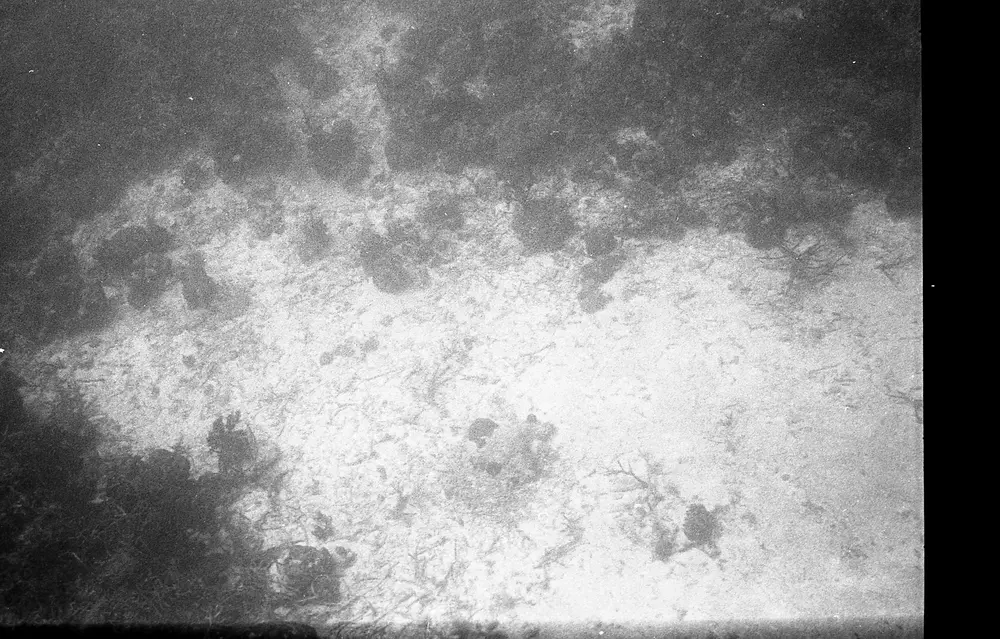{.lightbox group="discovery-bay-1966" description="**UUID: **d6ae7694-5281-477c-8690-6b9ee77520e2 **Date: **1966-07-25 **Location: **Jamaica | Discovery Bay | Upper Buoy Terrace **Longitude: **77.40908ºW **Latitude: **18.47322ºN **Photographer: **Eileen Graham **Copyright: **Trustees of the Natural History Museum (London, UK), CC-BY-4.0" alt="**UUID: **d6ae7694-5281-477c-8690-6b9ee77520e2 **Date: **1966-07-25 **Location: **Jamaica | Discovery Bay | Upper Buoy Terrace **Longitude: **77.40908ºW **Latitude: **18.47322ºN **Photographer: **Eileen Graham **Copyright: **Trustees of the Natural History Museum (London, UK), CC-BY-4.0"}

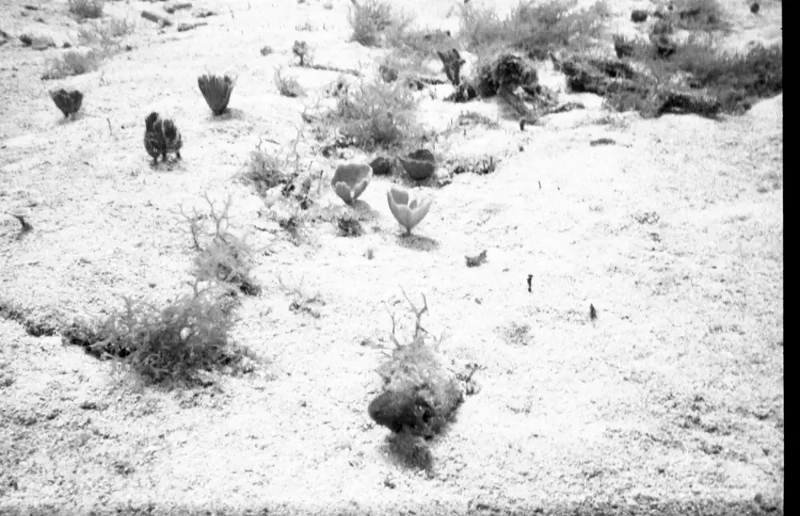{.lightbox group="discovery-bay-1966" description="**UUID: **0019234b-c155-440a-857f-54e75367d36e **Date: **1966-07-24 **Location: **Jamaica | Discovery Bay | Algal Plots **Longitude: **77.414ºW **Latitude: **18.473ºN **Photographer: **Eileen Graham **Copyright: **Trustees of the Natural History Museum (London, UK), CC-BY-4.0" alt="**UUID: **0019234b-c155-440a-857f-54e75367d36e **Date: **1966-07-24 **Location: **Jamaica | Discovery Bay | Algal Plots **Longitude: **77.414ºW **Latitude: **18.473ºN **Photographer: **Eileen Graham **Copyright: **Trustees of the Natural History Museum (London, UK), CC-BY-4.0"}

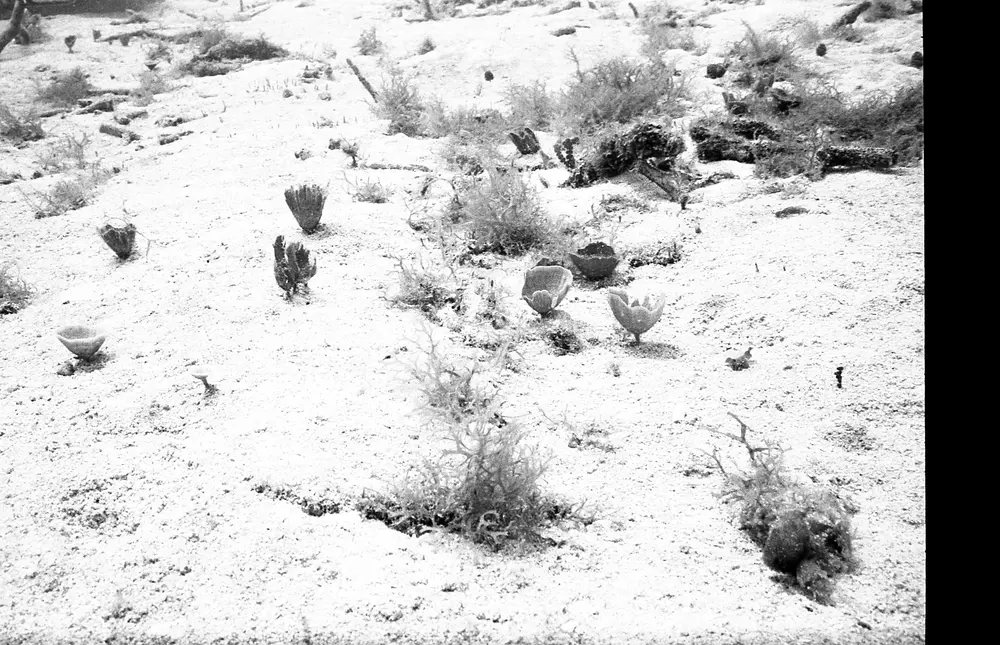{.lightbox group="discovery-bay-1966" description="**UUID: **70bba100-283b-4372-b658-b107f00fc66a **Date: **1966-07-24 **Location: **Jamaica | Discovery Bay | Algal Plots **Longitude: **77.414ºW **Latitude: **18.473ºN **Photographer: **Eileen Graham **Copyright: **Trustees of the Natural History Museum (London, UK), CC-BY-4.0" alt="**UUID: **70bba100-283b-4372-b658-b107f00fc66a **Date: **1966-07-24 **Location: **Jamaica | Discovery Bay | Algal Plots **Longitude: **77.414ºW **Latitude: **18.473ºN **Photographer: **Eileen Graham **Copyright: **Trustees of the Natural History Museum (London, UK), CC-BY-4.0"}

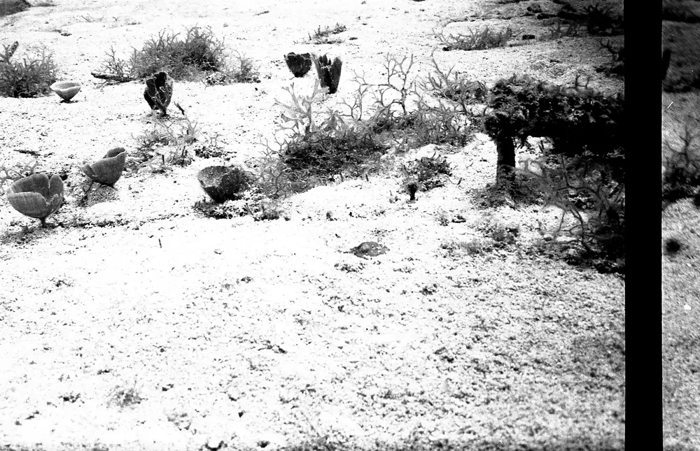{.lightbox group="discovery-bay-1966" description="**UUID: **19f8ea7b-dc90-4139-9d6f-3a9fbbccc447 **Date: **1966-07-24 **Location: **Jamaica | Discovery Bay | Algal Plots **Longitude: **77.414ºW **Latitude: **18.473ºN **Photographer: **Eileen Graham **Copyright: **Trustees of the Natural History Museum (London, UK), CC-BY-4.0" alt="**UUID: **19f8ea7b-dc90-4139-9d6f-3a9fbbccc447 **Date: **1966-07-24 **Location: **Jamaica | Discovery Bay | Algal Plots **Longitude: **77.414ºW **Latitude: **18.473ºN **Photographer: **Eileen Graham **Copyright: **Trustees of the Natural History Museum (London, UK), CC-BY-4.0"}

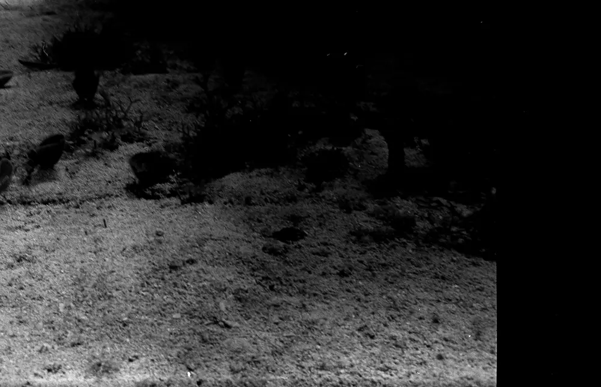{.lightbox group="discovery-bay-1966" description="**UUID: **44eead22-c92a-4b01-b5aa-65e9c98f381e **Date: **1966-07-24 **Location: **Jamaica | Discovery Bay | Algal Plots **Longitude: **77.414ºW **Latitude: **18.473ºN **Photographer: **Eileen Graham **Copyright: **Trustees of the Natural History Museum (London, UK), CC-BY-4.0" alt="**UUID: **44eead22-c92a-4b01-b5aa-65e9c98f381e **Date: **1966-07-24 **Location: **Jamaica | Discovery Bay | Algal Plots **Longitude: **77.414ºW **Latitude: **18.473ºN **Photographer: **Eileen Graham **Copyright: **Trustees of the Natural History Museum (London, UK), CC-BY-4.0"}

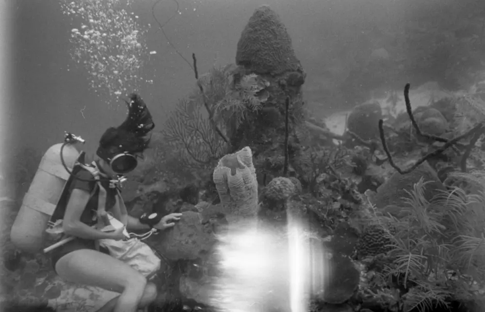{.lightbox group="discovery-bay-1966" description="**UUID: **859cbafb-772f-4b40-bc0a-ca24a9376fc8 **Date: **1966-08-24 **Location: **Jamaica | Discovery Bay | The Bull Tower **Longitude: **77.38917ºW **Latitude: **18.46917ºN **Photographer: **Eileen Graham **Copyright: **Trustees of the Natural History Museum (London, UK), CC-BY-4.0" alt="**UUID: **859cbafb-772f-4b40-bc0a-ca24a9376fc8 **Date: **1966-08-24 **Location: **Jamaica | Discovery Bay | The Bull Tower **Longitude: **77.38917ºW **Latitude: **18.46917ºN **Photographer: **Eileen Graham **Copyright: **Trustees of the Natural History Museum (London, UK), CC-BY-4.0"}

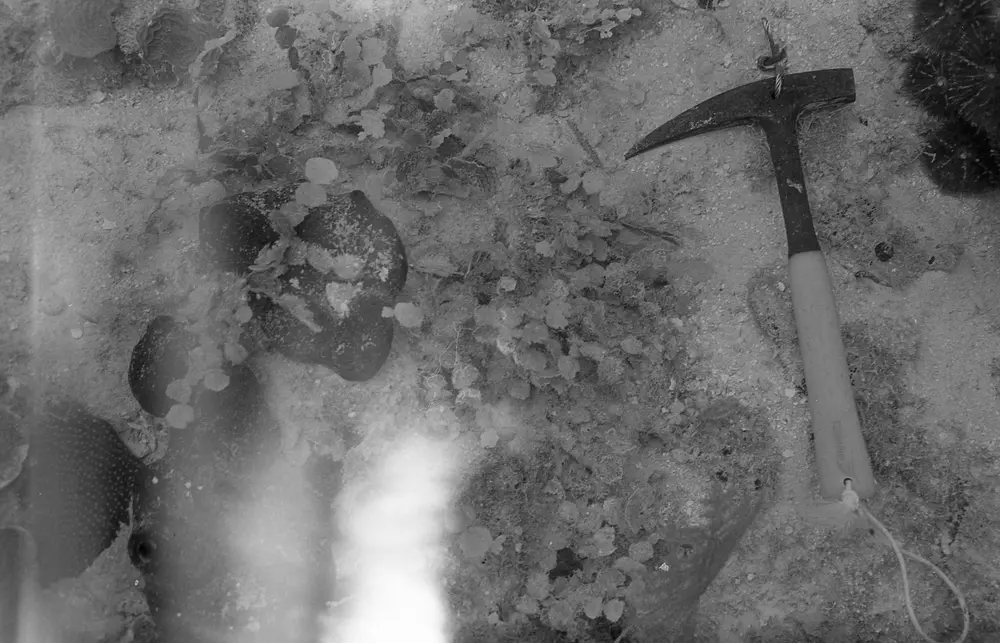{.lightbox group="discovery-bay-1966" description="**UUID: **e615a81b-99aa-4c38-9fe2-475b58c5104f **Date: **1966-08-24 **Location: **Jamaica | Discovery Bay | The Bull Tower **Longitude: **77.38917ºW **Latitude: **18.46917ºN **Photographer: **Eileen Graham **Copyright: **Trustees of the Natural History Museum (London, UK), CC-BY-4.0" alt="**UUID: **e615a81b-99aa-4c38-9fe2-475b58c5104f **Date: **1966-08-24 **Location: **Jamaica | Discovery Bay | The Bull Tower **Longitude: **77.38917ºW **Latitude: **18.46917ºN **Photographer: **Eileen Graham **Copyright: **Trustees of the Natural History Museum (London, UK), CC-BY-4.0"}

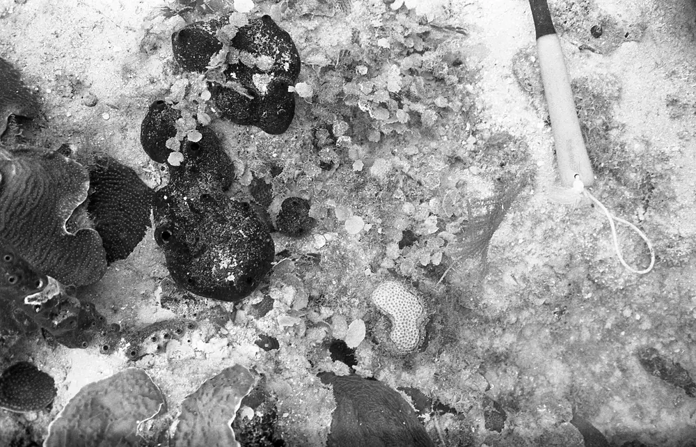{.lightbox group="discovery-bay-1966" description="**UUID: **5d7816e5-114b-4ba6-93d7-8d49e7769d5b **Date: **1966-08-24 **Location: **Jamaica | Discovery Bay | The Bull Tower **Longitude: **77.38917ºW **Latitude: **18.46917ºN **Photographer: **Eileen Graham **Copyright: **Trustees of the Natural History Museum (London, UK), CC-BY-4.0" alt="**UUID: **5d7816e5-114b-4ba6-93d7-8d49e7769d5b **Date: **1966-08-24 **Location: **Jamaica | Discovery Bay | The Bull Tower **Longitude: **77.38917ºW **Latitude: **18.46917ºN **Photographer: **Eileen Graham **Copyright: **Trustees of the Natural History Museum (London, UK), CC-BY-4.0"}

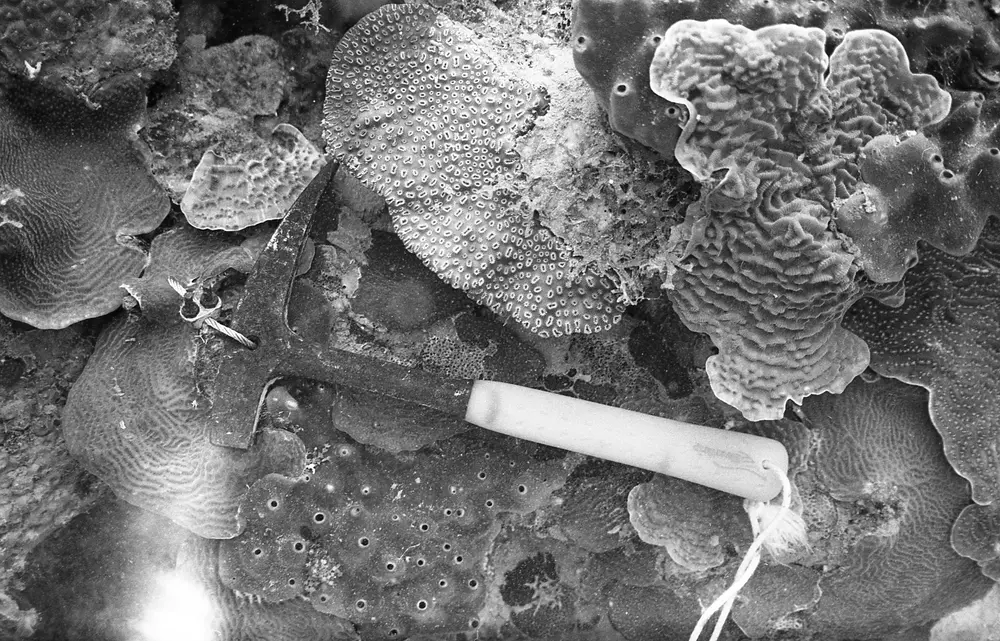{.lightbox group="discovery-bay-1966" description="**UUID: **7afdda25-863f-49c0-b084-617d790e6e34 **Date: **1966-08-24 **Location: **Jamaica | Discovery Bay | The Bull Tower **Longitude: **77.38917ºW **Latitude: **18.46917ºN **Photographer: **Eileen Graham **Copyright: **Trustees of the Natural History Museum (London, UK), CC-BY-4.0" alt="**UUID: **7afdda25-863f-49c0-b084-617d790e6e34 **Date: **1966-08-24 **Location: **Jamaica | Discovery Bay | The Bull Tower **Longitude: **77.38917ºW **Latitude: **18.46917ºN **Photographer: **Eileen Graham **Copyright: **Trustees of the Natural History Museum (London, UK), CC-BY-4.0"}

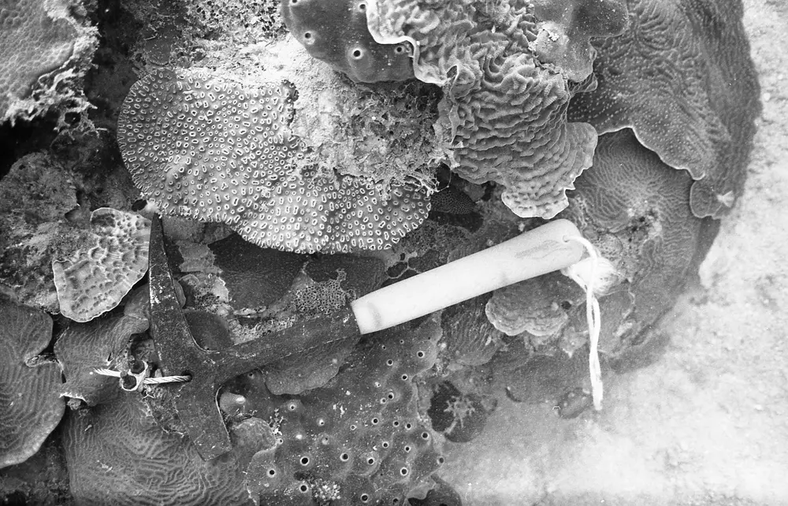{.lightbox group="discovery-bay-1966" description="**UUID: **4017ea1b-0025-432d-ae88-5cd30f140537 **Date: **1966-08-24 **Location: **Jamaica | Discovery Bay | The Bull Tower **Longitude: **77.38917ºW **Latitude: **18.46917ºN **Photographer: **Eileen Graham **Copyright: **Trustees of the Natural History Museum (London, UK), CC-BY-4.0" alt="**UUID: **4017ea1b-0025-432d-ae88-5cd30f140537 **Date: **1966-08-24 **Location: **Jamaica | Discovery Bay | The Bull Tower **Longitude: **77.38917ºW **Latitude: **18.46917ºN **Photographer: **Eileen Graham **Copyright: **Trustees of the Natural History Museum (London, UK), CC-BY-4.0"}

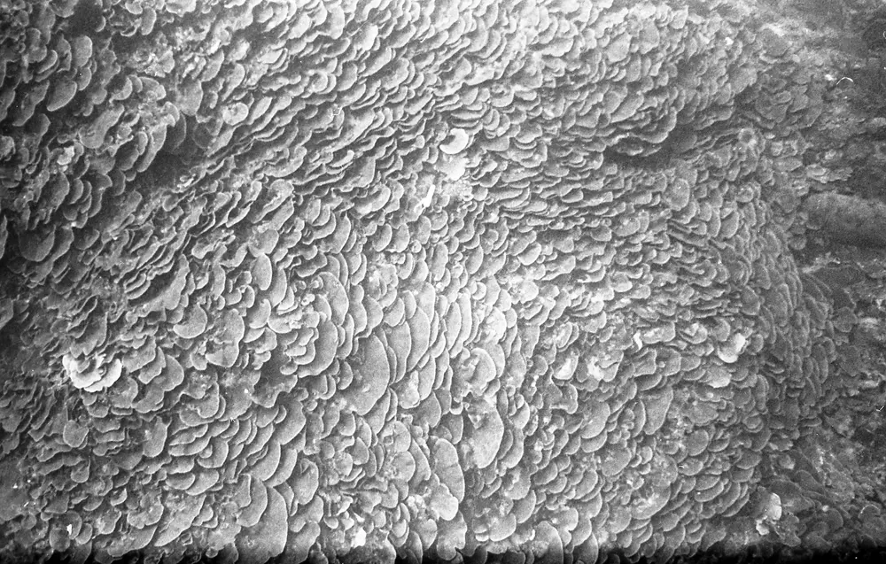{.lightbox group="discovery-bay-1966" description="**UUID: **24f8a7a7-db18-4ef4-a4bb-19abf10ffff6 **Date: **1966-08-24 **Location: **Jamaica | Discovery Bay | The Bull **Longitude: **77.38917ºW **Latitude: **18.46917ºN **Photographer: **Eileen Graham **Copyright: **Trustees of the Natural History Museum (London, UK), CC-BY-4.0" alt="**UUID: **24f8a7a7-db18-4ef4-a4bb-19abf10ffff6 **Date: **1966-08-24 **Location: **Jamaica | Discovery Bay | The Bull **Longitude: **77.38917ºW **Latitude: **18.46917ºN **Photographer: **Eileen Graham **Copyright: **Trustees of the Natural History Museum (London, UK), CC-BY-4.0"}

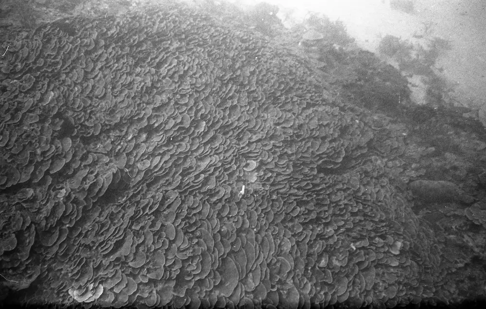{.lightbox group="discovery-bay-1966" description="**UUID: **14d9905d-e6e1-4270-92c3-3c75d41647fb **Date: **1966-08-24 **Location: **Jamaica | Discovery Bay | The Bull **Longitude: **77.38917ºW **Latitude: **18.46917ºN **Photographer: **Eileen Graham **Copyright: **Trustees of the Natural History Museum (London, UK), CC-BY-4.0" alt="**UUID: **14d9905d-e6e1-4270-92c3-3c75d41647fb **Date: **1966-08-24 **Location: **Jamaica | Discovery Bay | The Bull **Longitude: **77.38917ºW **Latitude: **18.46917ºN **Photographer: **Eileen Graham **Copyright: **Trustees of the Natural History Museum (London, UK), CC-BY-4.0"}

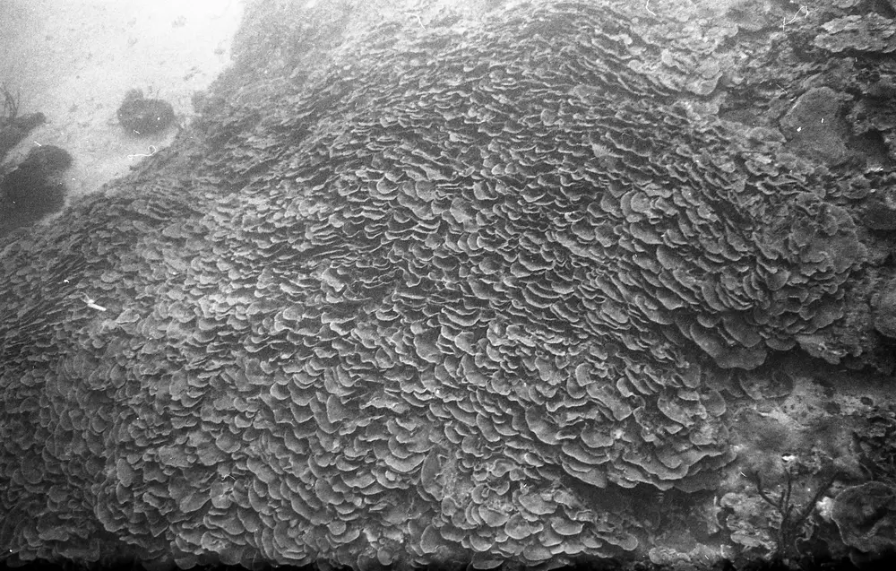{.lightbox group="discovery-bay-1966" description="**UUID: **cb19f597-c7aa-4a48-8a10-d1350e9e701f **Date: **1966-08-24 **Location: **Jamaica | Discovery Bay | The Bull **Longitude: **77.38917ºW **Latitude: **18.46917ºN **Photographer: **Eileen Graham **Copyright: **Trustees of the Natural History Museum (London, UK), CC-BY-4.0" alt="**UUID: **cb19f597-c7aa-4a48-8a10-d1350e9e701f **Date: **1966-08-24 **Location: **Jamaica | Discovery Bay | The Bull **Longitude: **77.38917ºW **Latitude: **18.46917ºN **Photographer: **Eileen Graham **Copyright: **Trustees of the Natural History Museum (London, UK), CC-BY-4.0"}

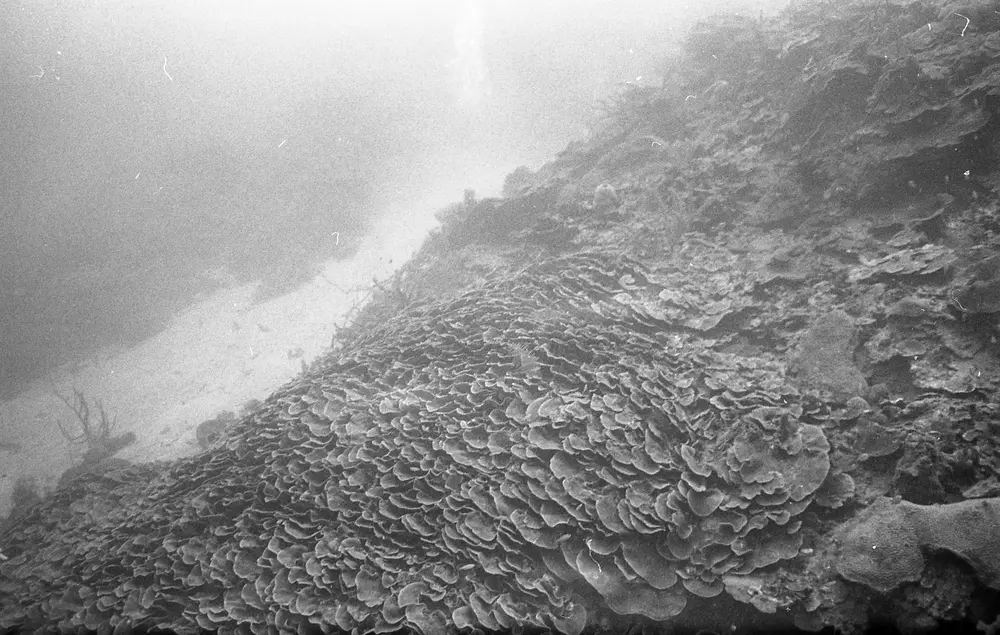{.lightbox group="discovery-bay-1966" description="**UUID: **fab0709c-67e7-421e-bd46-1e5ebf15fda3 **Date: **1966-08-24 **Location: **Jamaica | Discovery Bay | The Bull **Longitude: **77.38917ºW **Latitude: **18.46917ºN **Photographer: **Eileen Graham **Copyright: **Trustees of the Natural History Museum (London, UK), CC-BY-4.0" alt="**UUID: **fab0709c-67e7-421e-bd46-1e5ebf15fda3 **Date: **1966-08-24 **Location: **Jamaica | Discovery Bay | The Bull **Longitude: **77.38917ºW **Latitude: **18.46917ºN **Photographer: **Eileen Graham **Copyright: **Trustees of the Natural History Museum (London, UK), CC-BY-4.0"}

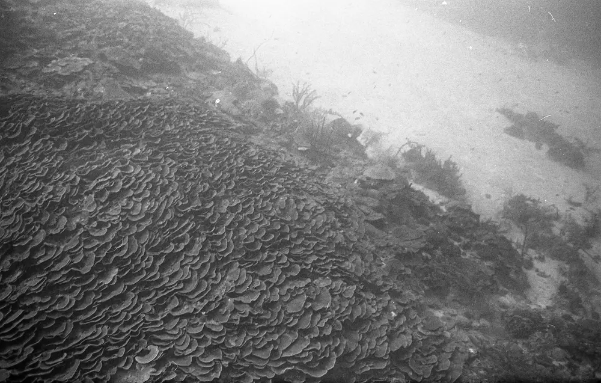{.lightbox group="discovery-bay-1966" description="**UUID: **6959ece0-f492-420a-9cb2-b3939c70b26d **Date: **1966-08-24 **Location: **Jamaica | Discovery Bay | The Bull **Longitude: **77.38917ºW **Latitude: **18.46917ºN **Photographer: **Eileen Graham **Copyright: **Trustees of the Natural History Museum (London, UK), CC-BY-4.0" alt="**UUID: **6959ece0-f492-420a-9cb2-b3939c70b26d **Date: **1966-08-24 **Location: **Jamaica | Discovery Bay | The Bull **Longitude: **77.38917ºW **Latitude: **18.46917ºN **Photographer: **Eileen Graham **Copyright: **Trustees of the Natural History Museum (London, UK), CC-BY-4.0"}

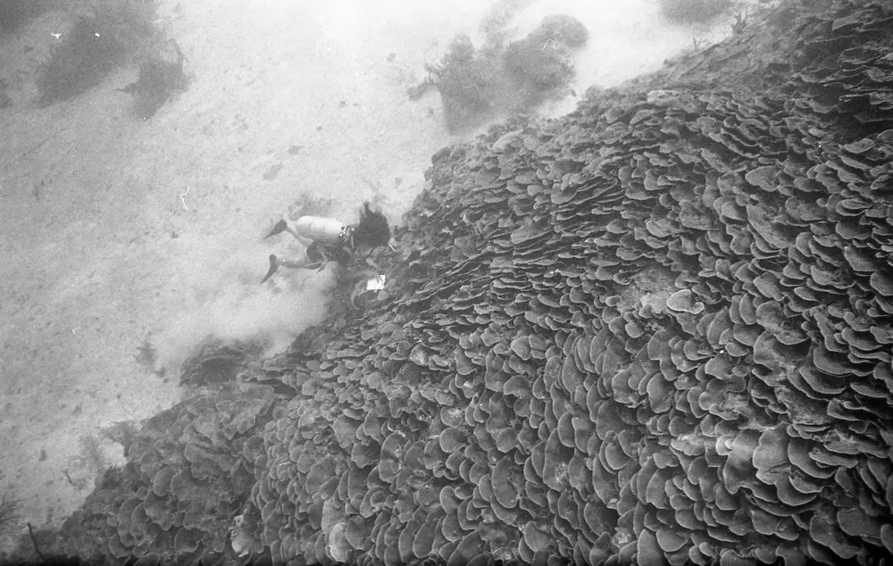{.lightbox group="discovery-bay-1966" description="**UUID: **e5fff417-1a7e-498a-9d9b-49df09a94288 **Date: **1966-08-24 **Location: **Jamaica | Discovery Bay | The Bull **Longitude: **77.38917ºW **Latitude: **18.46917ºN **Photographer: **Eileen Graham **Copyright: **Trustees of the Natural History Museum (London, UK), CC-BY-4.0" alt="**UUID: **e5fff417-1a7e-498a-9d9b-49df09a94288 **Date: **1966-08-24 **Location: **Jamaica | Discovery Bay | The Bull **Longitude: **77.38917ºW **Latitude: **18.46917ºN **Photographer: **Eileen Graham **Copyright: **Trustees of the Natural History Museum (London, UK), CC-BY-4.0"}

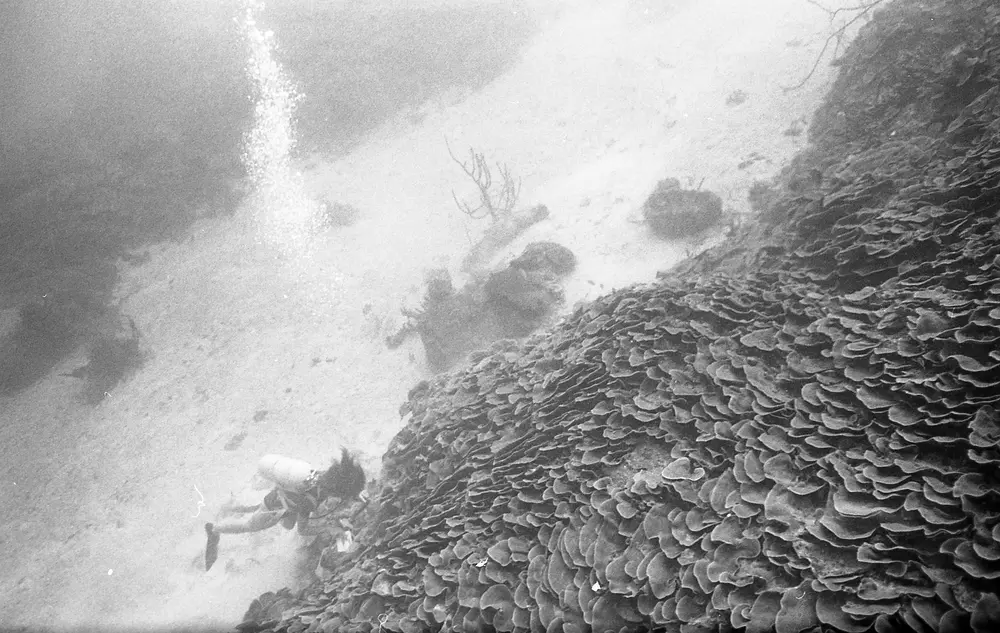{.lightbox group="discovery-bay-1966" description="**UUID: **6ef2a545-86c0-4b1e-8084-cdedf25155ee **Date: **1966-08-24 **Location: **Jamaica | Discovery Bay | The Bull **Longitude: **77.38917ºW **Latitude: **18.46917ºN **Photographer: **Eileen Graham **Copyright: **Trustees of the Natural History Museum (London, UK), CC-BY-4.0" alt="**UUID: **6ef2a545-86c0-4b1e-8084-cdedf25155ee **Date: **1966-08-24 **Location: **Jamaica | Discovery Bay | The Bull **Longitude: **77.38917ºW **Latitude: **18.46917ºN **Photographer: **Eileen Graham **Copyright: **Trustees of the Natural History Museum (London, UK), CC-BY-4.0"}

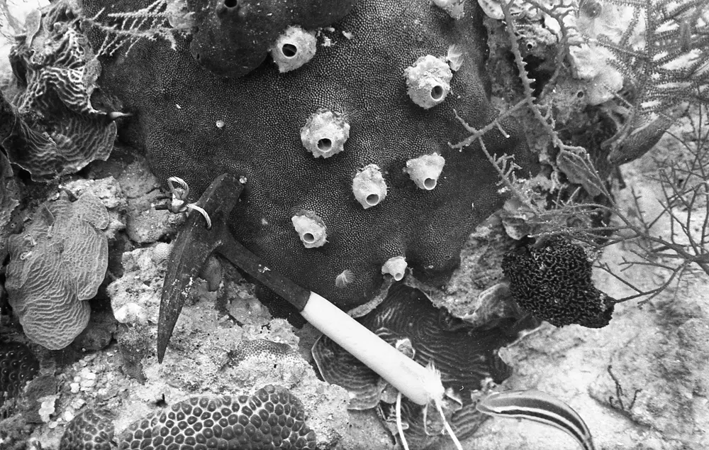{.lightbox group="discovery-bay-1966" description="**UUID: **6354585c-14b4-4ec7-8749-e0c93612431a **Date: **1966-08-24 **Location: **Jamaica | Discovery Bay | The Bull Tower **Longitude: **77.38917ºW **Latitude: **18.46917ºN **Photographer: **Eileen Graham **Copyright: **Trustees of the Natural History Museum (London, UK), CC-BY-4.0" alt="**UUID: **6354585c-14b4-4ec7-8749-e0c93612431a **Date: **1966-08-24 **Location: **Jamaica | Discovery Bay | The Bull Tower **Longitude: **77.38917ºW **Latitude: **18.46917ºN **Photographer: **Eileen Graham **Copyright: **Trustees of the Natural History Museum (London, UK), CC-BY-4.0"}

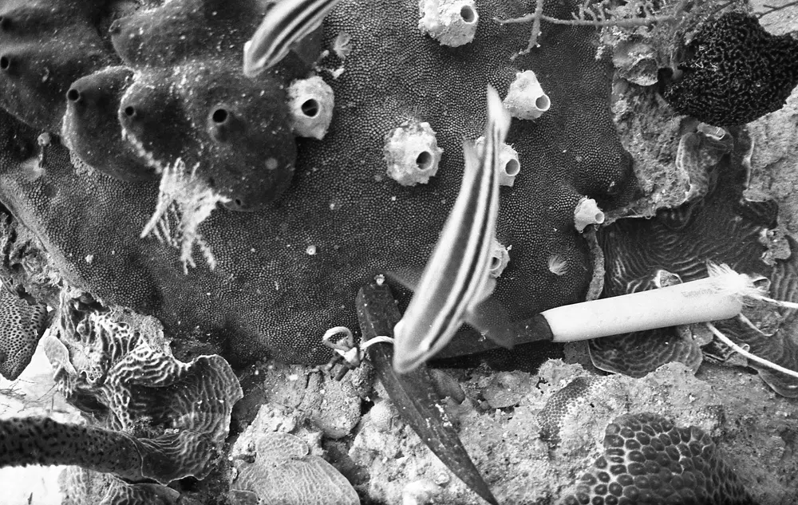{.lightbox group="discovery-bay-1966" description="**UUID: **217b0577-be02-402b-9f0e-a8c1c2900dda **Date: **1966-08-24 **Location: **Jamaica | Discovery Bay | The Bull Tower **Longitude: **77.38917ºW **Latitude: **18.46917ºN **Photographer: **Eileen Graham **Copyright: **Trustees of the Natural History Museum (London, UK), CC-BY-4.0" alt="**UUID: **217b0577-be02-402b-9f0e-a8c1c2900dda **Date: **1966-08-24 **Location: **Jamaica | Discovery Bay | The Bull Tower **Longitude: **77.38917ºW **Latitude: **18.46917ºN **Photographer: **Eileen Graham **Copyright: **Trustees of the Natural History Museum (London, UK), CC-BY-4.0"}

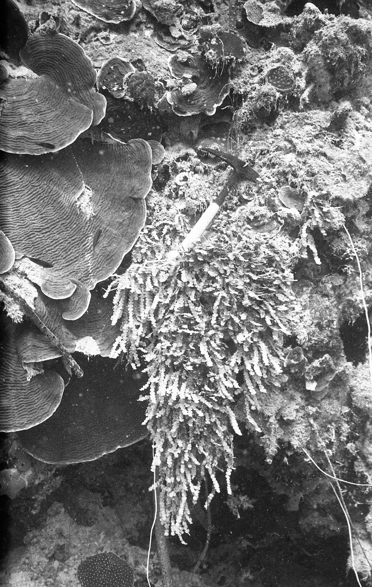{.lightbox group="discovery-bay-1966" description="**UUID: **74d9203d-d4fd-43f3-a61e-385315a1db8c **Date: **1966-08-24 **Location: **Jamaica | Discovery Bay | The Bull Tower **Longitude: **77.38917ºW **Latitude: **18.46917ºN **Photographer: **Eileen Graham **Copyright: **Trustees of the Natural History Museum (London, UK), CC-BY-4.0" alt="**UUID: **74d9203d-d4fd-43f3-a61e-385315a1db8c **Date: **1966-08-24 **Location: **Jamaica | Discovery Bay | The Bull Tower **Longitude: **77.38917ºW **Latitude: **18.46917ºN **Photographer: **Eileen Graham **Copyright: **Trustees of the Natural History Museum (London, UK), CC-BY-4.0"}

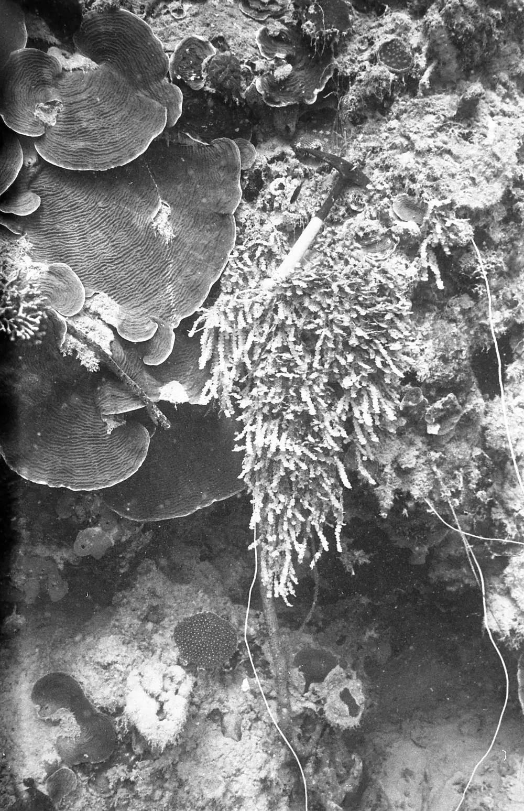{.lightbox group="discovery-bay-1966" description="**UUID: **98f466bd-97a9-4604-ab4d-b49f2a3e3494 **Date: **1966-08-24 **Location: **Jamaica | Discovery Bay | The Bull Tower **Longitude: **77.38917ºW **Latitude: **18.46917ºN **Photographer: **Eileen Graham **Copyright: **Trustees of the Natural History Museum (London, UK), CC-BY-4.0" alt="**UUID: **98f466bd-97a9-4604-ab4d-b49f2a3e3494 **Date: **1966-08-24 **Location: **Jamaica | Discovery Bay | The Bull Tower **Longitude: **77.38917ºW **Latitude: **18.46917ºN **Photographer: **Eileen Graham **Copyright: **Trustees of the Natural History Museum (London, UK), CC-BY-4.0"}

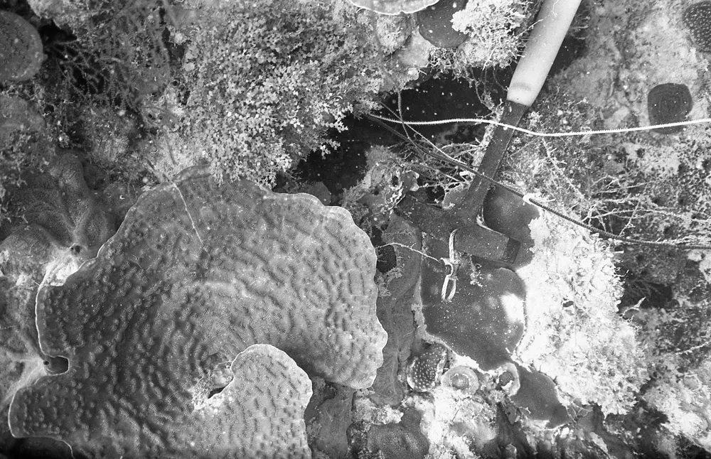{.lightbox group="discovery-bay-1966" description="**UUID: **cc9e1151-1eb6-48c9-a71d-ba953fdced5e **Date: **1966-08-24 **Location: **Jamaica | Discovery Bay | The Bull Tower **Longitude: **77.38917ºW **Latitude: **18.46917ºN **Photographer: **Eileen Graham **Copyright: **Trustees of the Natural History Museum (London, UK), CC-BY-4.0" alt="**UUID: **cc9e1151-1eb6-48c9-a71d-ba953fdced5e **Date: **1966-08-24 **Location: **Jamaica | Discovery Bay | The Bull Tower **Longitude: **77.38917ºW **Latitude: **18.46917ºN **Photographer: **Eileen Graham **Copyright: **Trustees of the Natural History Museum (London, UK), CC-BY-4.0"}

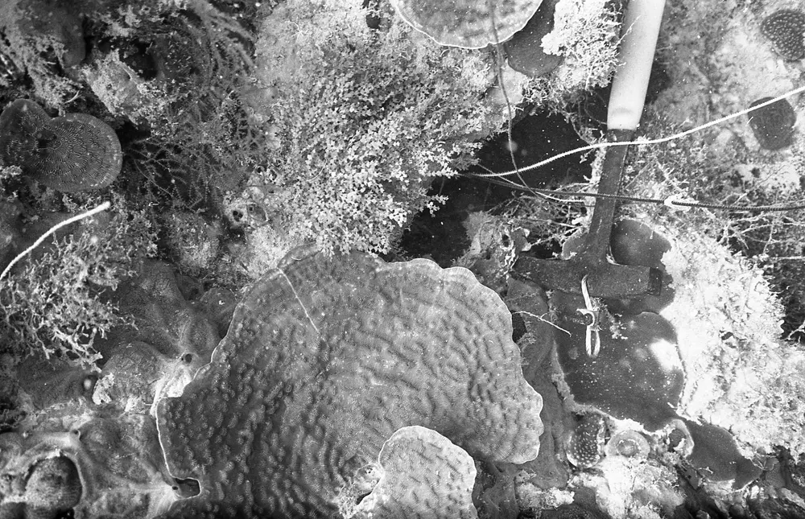{.lightbox group="discovery-bay-1966" description="**UUID: **896a67dc-bb21-4c87-933a-c658f16a8c22 **Date: **1966-08-24 **Location: **Jamaica | Discovery Bay | The Bull Tower **Longitude: **77.38917ºW **Latitude: **18.46917ºN **Photographer: **Eileen Graham **Copyright: **Trustees of the Natural History Museum (London, UK), CC-BY-4.0" alt="**UUID: **896a67dc-bb21-4c87-933a-c658f16a8c22 **Date: **1966-08-24 **Location: **Jamaica | Discovery Bay | The Bull Tower **Longitude: **77.38917ºW **Latitude: **18.46917ºN **Photographer: **Eileen Graham **Copyright: **Trustees of the Natural History Museum (London, UK), CC-BY-4.0"}

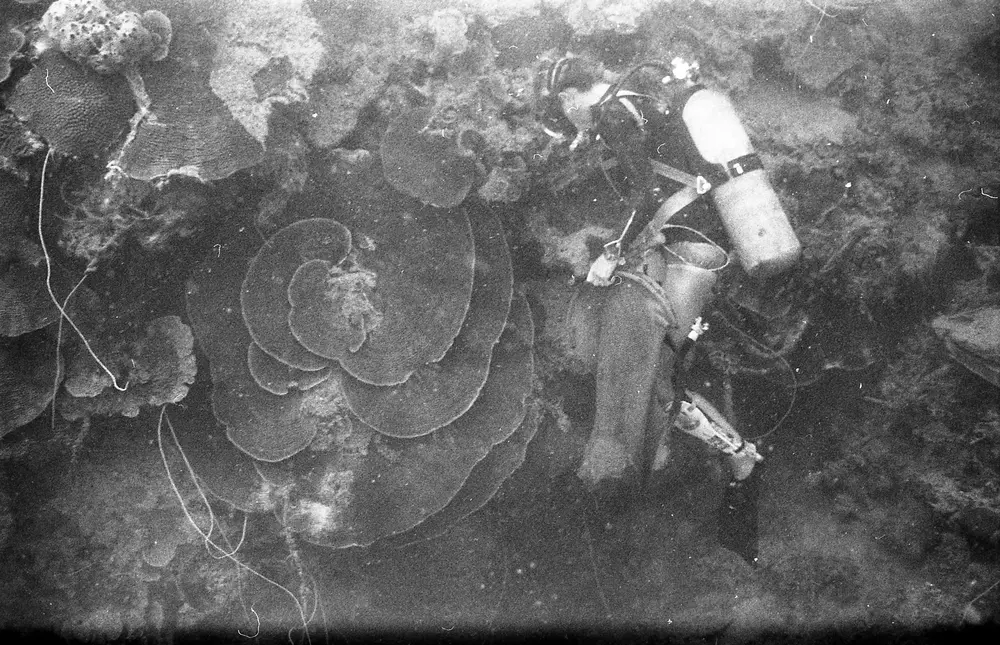{.lightbox group="discovery-bay-1966" description="**UUID: **7dd18f3d-e4d7-4c80-b41a-e549362bb316 **Date: **1966-08-24 **Location: **Jamaica | Discovery Bay | The Bull Tower **Longitude: **77.38917ºW **Latitude: **18.46917ºN **Photographer: **Eileen Graham **Copyright: **Trustees of the Natural History Museum (London, UK), CC-BY-4.0" alt="**UUID: **7dd18f3d-e4d7-4c80-b41a-e549362bb316 **Date: **1966-08-24 **Location: **Jamaica | Discovery Bay | The Bull Tower **Longitude: **77.38917ºW **Latitude: **18.46917ºN **Photographer: **Eileen Graham **Copyright: **Trustees of the Natural History Museum (London, UK), CC-BY-4.0"}

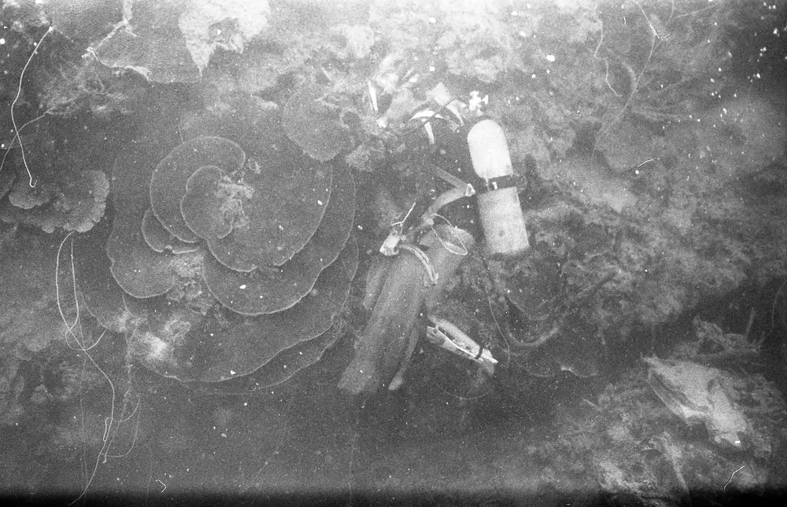{.lightbox group="discovery-bay-1966" description="**UUID: **75b61b0c-1dcf-474e-8f7e-c8288809c223 **Date: **1966-08-24 **Location: **Jamaica | Discovery Bay | The Bull Tower **Longitude: **77.38917ºW **Latitude: **18.46917ºN **Photographer: **Eileen Graham **Copyright: **Trustees of the Natural History Museum (London, UK), CC-BY-4.0" alt="**UUID: **75b61b0c-1dcf-474e-8f7e-c8288809c223 **Date: **1966-08-24 **Location: **Jamaica | Discovery Bay | The Bull Tower **Longitude: **77.38917ºW **Latitude: **18.46917ºN **Photographer: **Eileen Graham **Copyright: **Trustees of the Natural History Museum (London, UK), CC-BY-4.0"}

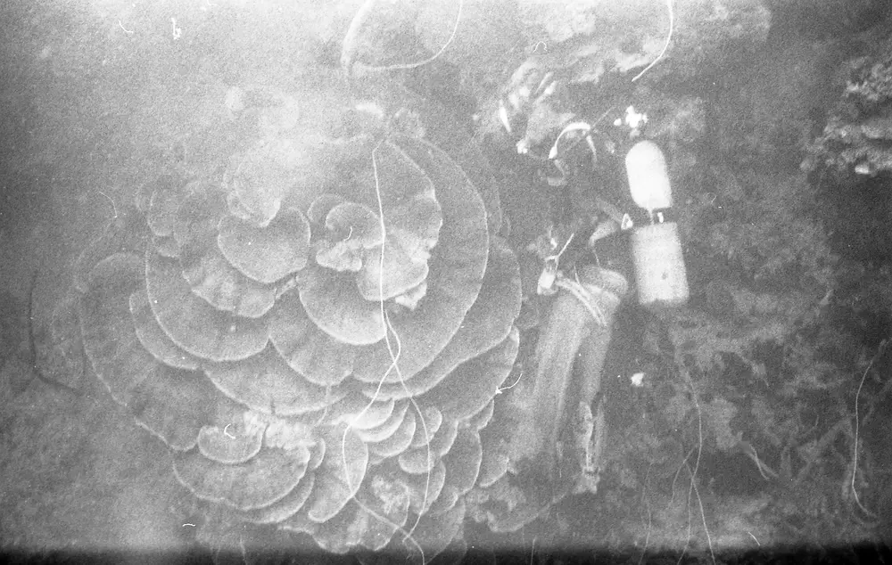{.lightbox group="discovery-bay-1966" description="**UUID: **5b97b885-aaaf-4947-83f4-05c30059da30 **Date: **1966-08-24 **Location: **Jamaica | Discovery Bay | The Bull Tower **Longitude: **77.38917ºW **Latitude: **18.46917ºN **Photographer: **Eileen Graham **Copyright: **Trustees of the Natural History Museum (London, UK), CC-BY-4.0" alt="**UUID: **5b97b885-aaaf-4947-83f4-05c30059da30 **Date: **1966-08-24 **Location: **Jamaica | Discovery Bay | The Bull Tower **Longitude: **77.38917ºW **Latitude: **18.46917ºN **Photographer: **Eileen Graham **Copyright: **Trustees of the Natural History Museum (London, UK), CC-BY-4.0"}

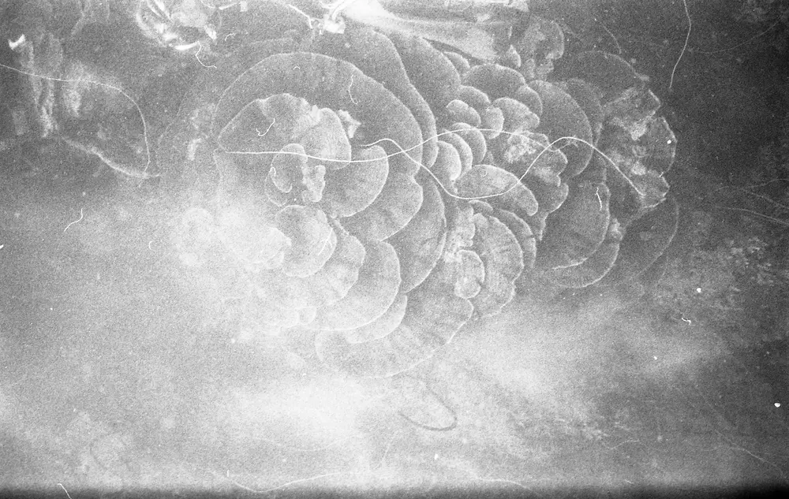{.lightbox group="discovery-bay-1966" description="**UUID: **645381db-415f-45a5-9ce0-ebcaf6052546 **Date: **1966-08-24 **Location: **Jamaica | Discovery Bay | The Bull Tower **Longitude: **77.38917ºW **Latitude: **18.46917ºN **Photographer: **Eileen Graham **Copyright: **Trustees of the Natural History Museum (London, UK), CC-BY-4.0" alt="**UUID: **645381db-415f-45a5-9ce0-ebcaf6052546 **Date: **1966-08-24 **Location: **Jamaica | Discovery Bay | The Bull Tower **Longitude: **77.38917ºW **Latitude: **18.46917ºN **Photographer: **Eileen Graham **Copyright: **Trustees of the Natural History Museum (London, UK), CC-BY-4.0"}

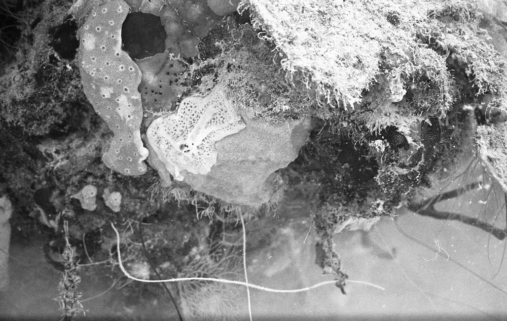{.lightbox group="discovery-bay-1966" description="**UUID: **61cffeab-1a90-46c2-8349-1bcf5a354fe5 **Date: **1966-08-24 **Location: **Jamaica | Discovery Bay | The Bull Tower **Longitude: **77.38917ºW **Latitude: **18.46917ºN **Photographer: **Eileen Graham **Copyright: **Trustees of the Natural History Museum (London, UK), CC-BY-4.0" alt="**UUID: **61cffeab-1a90-46c2-8349-1bcf5a354fe5 **Date: **1966-08-24 **Location: **Jamaica | Discovery Bay | The Bull Tower **Longitude: **77.38917ºW **Latitude: **18.46917ºN **Photographer: **Eileen Graham **Copyright: **Trustees of the Natural History Museum (London, UK), CC-BY-4.0"}

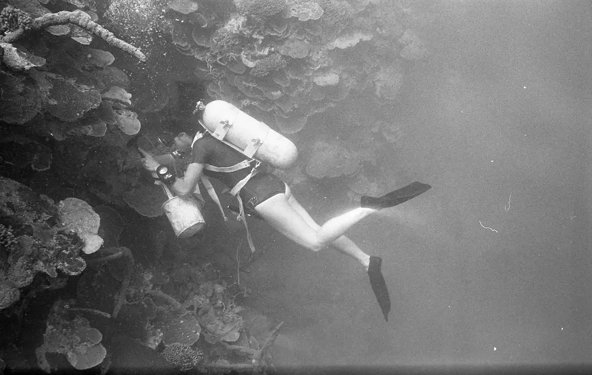{.lightbox group="discovery-bay-1966" description="**UUID: **27e563ad-68bf-471a-a8ee-824ffb427c9b **Date: **1966-08-24 **Location: **Jamaica | Discovery Bay | The Bull Tower **Longitude: **77.38917ºW **Latitude: **18.46917ºN **Photographer: **Eileen Graham **Copyright: **Trustees of the Natural History Museum (London, UK), CC-BY-4.0" alt="**UUID: **27e563ad-68bf-471a-a8ee-824ffb427c9b **Date: **1966-08-24 **Location: **Jamaica | Discovery Bay | The Bull Tower **Longitude: **77.38917ºW **Latitude: **18.46917ºN **Photographer: **Eileen Graham **Copyright: **Trustees of the Natural History Museum (London, UK), CC-BY-4.0"}

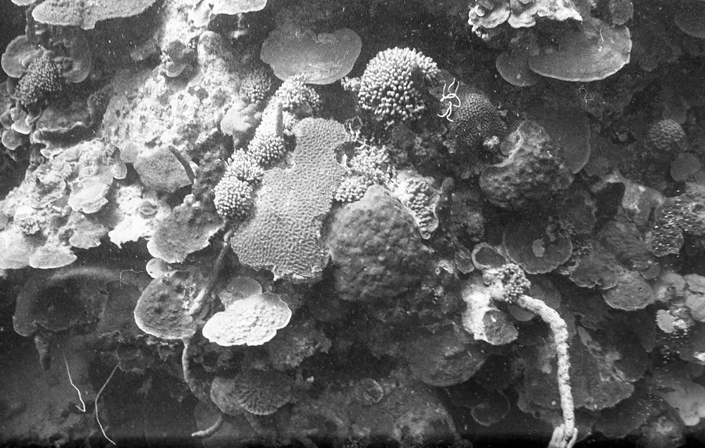{.lightbox group="discovery-bay-1966" description="**UUID: **d0a15475-e38b-4e72-92f5-ac130b2b4029 **Date: **1966-08-24 **Location: **Jamaica | Discovery Bay | The Bull Tower **Longitude: **77.38917ºW **Latitude: **18.46917ºN **Photographer: **Eileen Graham **Copyright: **Trustees of the Natural History Museum (London, UK), CC-BY-4.0" alt="**UUID: **d0a15475-e38b-4e72-92f5-ac130b2b4029 **Date: **1966-08-24 **Location: **Jamaica | Discovery Bay | The Bull Tower **Longitude: **77.38917ºW **Latitude: **18.46917ºN **Photographer: **Eileen Graham **Copyright: **Trustees of the Natural History Museum (London, UK), CC-BY-4.0"}

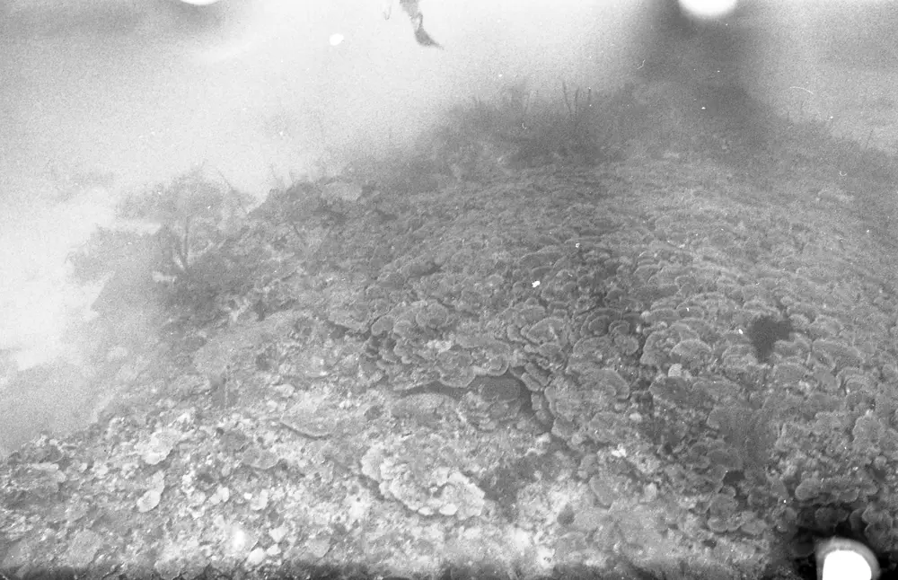{.lightbox group="discovery-bay-1966" description="**UUID: **791d0a98-ba70-4ddf-84e1-0673fbf8605e **Date: **1966-08-25 **Location: **Jamaica | Discovery Bay | Buoy Upper Slope **Longitude: **77.40908ºW **Latitude: **18.47322ºN **Photographer: **Eileen Graham **Copyright: **Trustees of the Natural History Museum (London, UK), CC-BY-4.0" alt="**UUID: **791d0a98-ba70-4ddf-84e1-0673fbf8605e **Date: **1966-08-25 **Location: **Jamaica | Discovery Bay | Buoy Upper Slope **Longitude: **77.40908ºW **Latitude: **18.47322ºN **Photographer: **Eileen Graham **Copyright: **Trustees of the Natural History Museum (London, UK), CC-BY-4.0"}

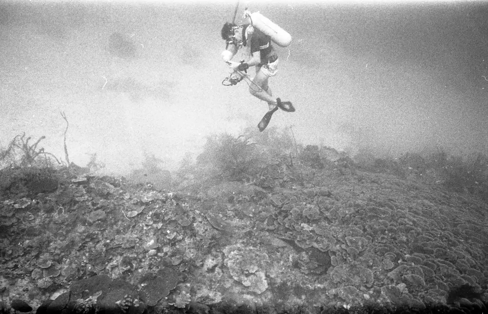{.lightbox group="discovery-bay-1966" description="**UUID: **745d86cf-fce7-40f2-b215-90ec88b73137 **Date: **1966-08-25 **Location: **Jamaica | Discovery Bay | Buoy Upper Slope **Longitude: **77.40908ºW **Latitude: **18.47322ºN **Photographer: **Eileen Graham **Copyright: **Trustees of the Natural History Museum (London, UK), CC-BY-4.0" alt="**UUID: **745d86cf-fce7-40f2-b215-90ec88b73137 **Date: **1966-08-25 **Location: **Jamaica | Discovery Bay | Buoy Upper Slope **Longitude: **77.40908ºW **Latitude: **18.47322ºN **Photographer: **Eileen Graham **Copyright: **Trustees of the Natural History Museum (London, UK), CC-BY-4.0"}

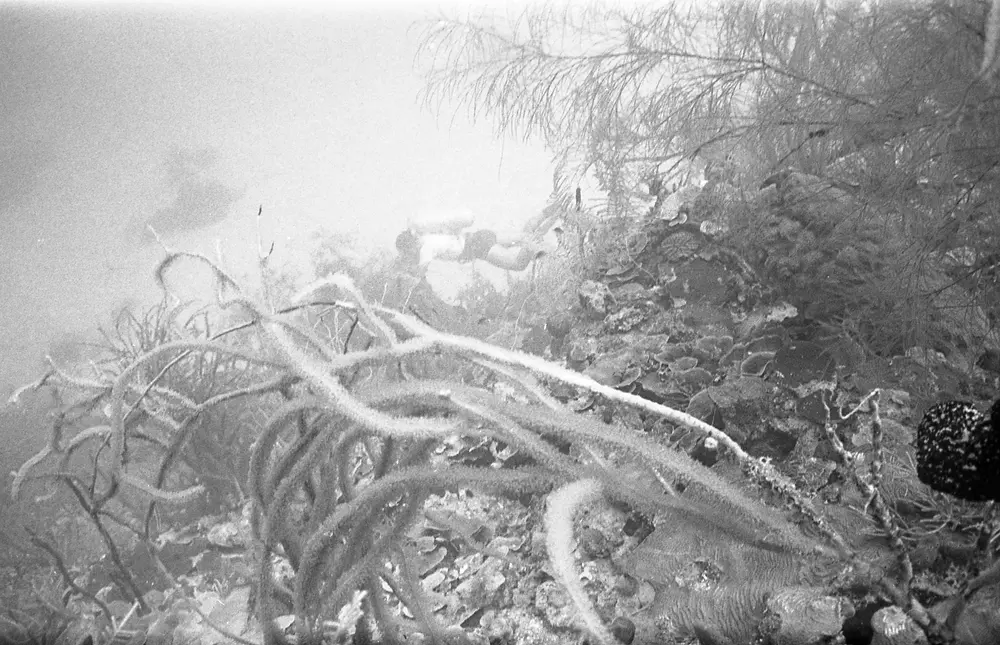{.lightbox group="discovery-bay-1966" description="**UUID: **481394a0-7da3-4f7e-9b3f-8efbe542c06a **Date: **1966-08-25 **Location: **Jamaica | Discovery Bay | Buoy Upper Slope **Longitude: **77.40908ºW **Latitude: **18.47322ºN **Photographer: **Eileen Graham **Copyright: **Trustees of the Natural History Museum (London, UK), CC-BY-4.0" alt="**UUID: **481394a0-7da3-4f7e-9b3f-8efbe542c06a **Date: **1966-08-25 **Location: **Jamaica | Discovery Bay | Buoy Upper Slope **Longitude: **77.40908ºW **Latitude: **18.47322ºN **Photographer: **Eileen Graham **Copyright: **Trustees of the Natural History Museum (London, UK), CC-BY-4.0"}

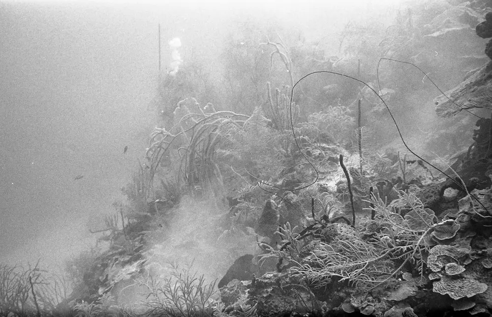{.lightbox group="discovery-bay-1966" description="**UUID: **36a3bdc6-5c48-4068-a50c-1c95001de0f4 **Date: **1966-08-25 **Location: **Jamaica | Discovery Bay | Buoy Upper Slope **Longitude: **77.40908ºW **Latitude: **18.47322ºN **Photographer: **Eileen Graham **Copyright: **Trustees of the Natural History Museum (London, UK), CC-BY-4.0" alt="**UUID: **36a3bdc6-5c48-4068-a50c-1c95001de0f4 **Date: **1966-08-25 **Location: **Jamaica | Discovery Bay | Buoy Upper Slope **Longitude: **77.40908ºW **Latitude: **18.47322ºN **Photographer: **Eileen Graham **Copyright: **Trustees of the Natural History Museum (London, UK), CC-BY-4.0"}

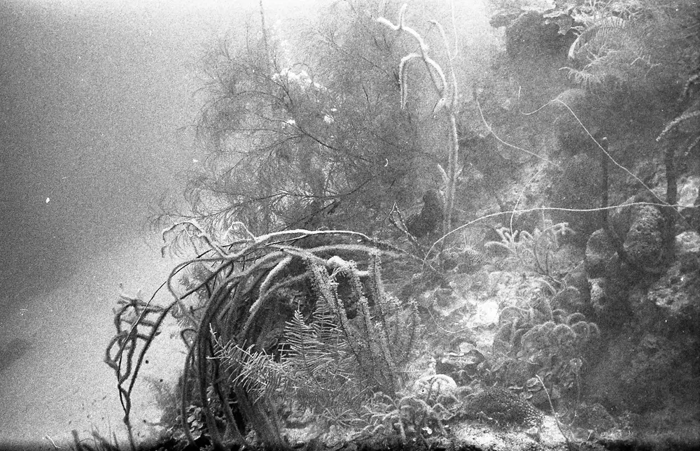{.lightbox group="discovery-bay-1966" description="**UUID: **12da001c-455c-44fa-a33b-405f1543819a **Date: **1966-08-25 **Location: **Jamaica | Discovery Bay | Buoy Upper Slope **Longitude: **77.40908ºW **Latitude: **18.47322ºN **Photographer: **Eileen Graham **Copyright: **Trustees of the Natural History Museum (London, UK), CC-BY-4.0" alt="**UUID: **12da001c-455c-44fa-a33b-405f1543819a **Date: **1966-08-25 **Location: **Jamaica | Discovery Bay | Buoy Upper Slope **Longitude: **77.40908ºW **Latitude: **18.47322ºN **Photographer: **Eileen Graham **Copyright: **Trustees of the Natural History Museum (London, UK), CC-BY-4.0"}

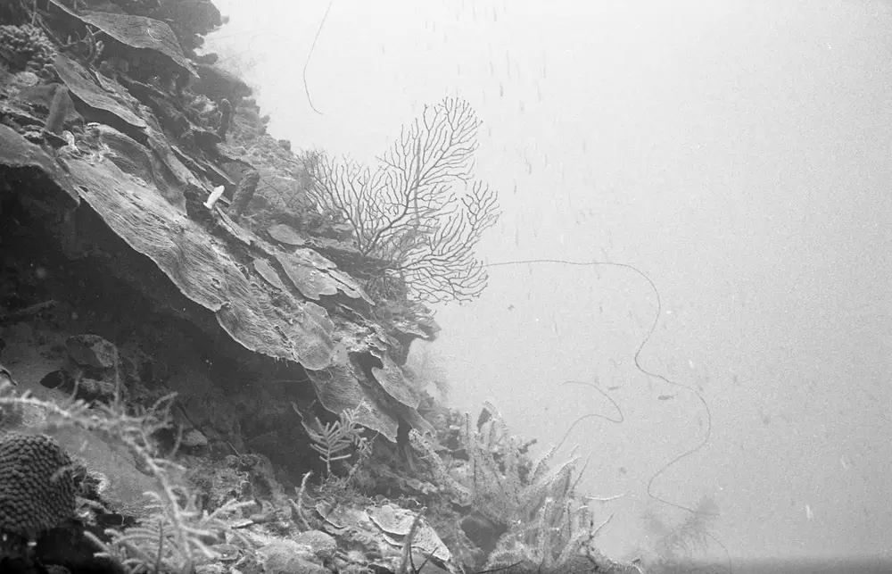{.lightbox group="discovery-bay-1966" description="**UUID: **84cc1774-5717-43fe-822f-3ef857618c2f **Date: **1966-08-25 **Location: **Jamaica | Discovery Bay | Buoy Upper Slope **Longitude: **77.40908ºW **Latitude: **18.47322ºN **Photographer: **Eileen Graham **Copyright: **Trustees of the Natural History Museum (London, UK), CC-BY-4.0" alt="**UUID: **84cc1774-5717-43fe-822f-3ef857618c2f **Date: **1966-08-25 **Location: **Jamaica | Discovery Bay | Buoy Upper Slope **Longitude: **77.40908ºW **Latitude: **18.47322ºN **Photographer: **Eileen Graham **Copyright: **Trustees of the Natural History Museum (London, UK), CC-BY-4.0"}

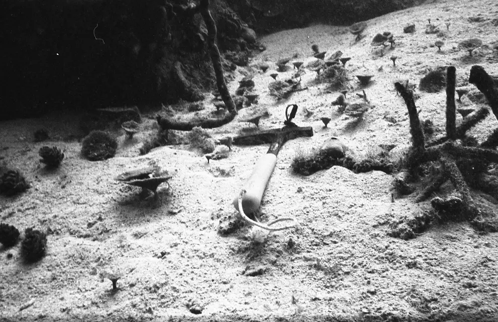{.lightbox group="discovery-bay-1966" description="**UUID: **c93733d6-0a95-4858-8662-5c84ebc69651 **Date: **1966-08-25 **Location: **Jamaica | Discovery Bay | Algal Plots **Longitude: **77.414ºW **Latitude: **18.473ºN **Photographer: **Eileen Graham **Copyright: **Trustees of the Natural History Museum (London, UK), CC-BY-4.0" alt="**UUID: **c93733d6-0a95-4858-8662-5c84ebc69651 **Date: **1966-08-25 **Location: **Jamaica | Discovery Bay | Algal Plots **Longitude: **77.414ºW **Latitude: **18.473ºN **Photographer: **Eileen Graham **Copyright: **Trustees of the Natural History Museum (London, UK), CC-BY-4.0"}

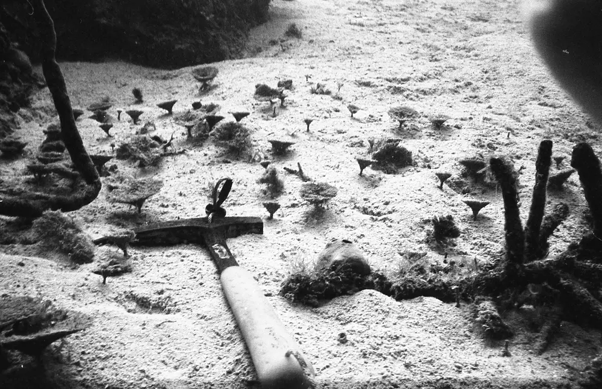{.lightbox group="discovery-bay-1966" description="**UUID: **ac792e35-3007-42b7-aff0-c2cb8b1fee49 **Date: **1966-08-25 **Location: **Jamaica | Discovery Bay | Algal Plots **Longitude: **77.414ºW **Latitude: **18.473ºN **Photographer: **Eileen Graham **Copyright: **Trustees of the Natural History Museum (London, UK), CC-BY-4.0" alt="**UUID: **ac792e35-3007-42b7-aff0-c2cb8b1fee49 **Date: **1966-08-25 **Location: **Jamaica | Discovery Bay | Algal Plots **Longitude: **77.414ºW **Latitude: **18.473ºN **Photographer: **Eileen Graham **Copyright: **Trustees of the Natural History Museum (London, UK), CC-BY-4.0"}

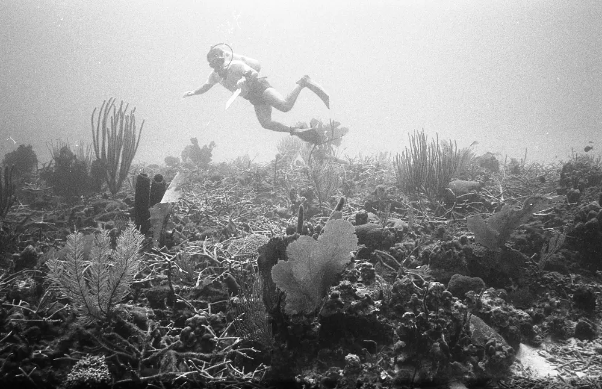{.lightbox group="discovery-bay-1966" description="**UUID: **780508f3-8123-4b36-bddb-7683832f4ba0 **Date: **1966-08-25 **Location: **Jamaica | Discovery Bay | Upper Buoy Terrace **Longitude: **77.40908ºW **Latitude: **18.47322ºN **Photographer: **Eileen Graham **Copyright: **Trustees of the Natural History Museum (London, UK), CC-BY-4.0" alt="**UUID: **780508f3-8123-4b36-bddb-7683832f4ba0 **Date: **1966-08-25 **Location: **Jamaica | Discovery Bay | Upper Buoy Terrace **Longitude: **77.40908ºW **Latitude: **18.47322ºN **Photographer: **Eileen Graham **Copyright: **Trustees of the Natural History Museum (London, UK), CC-BY-4.0"}

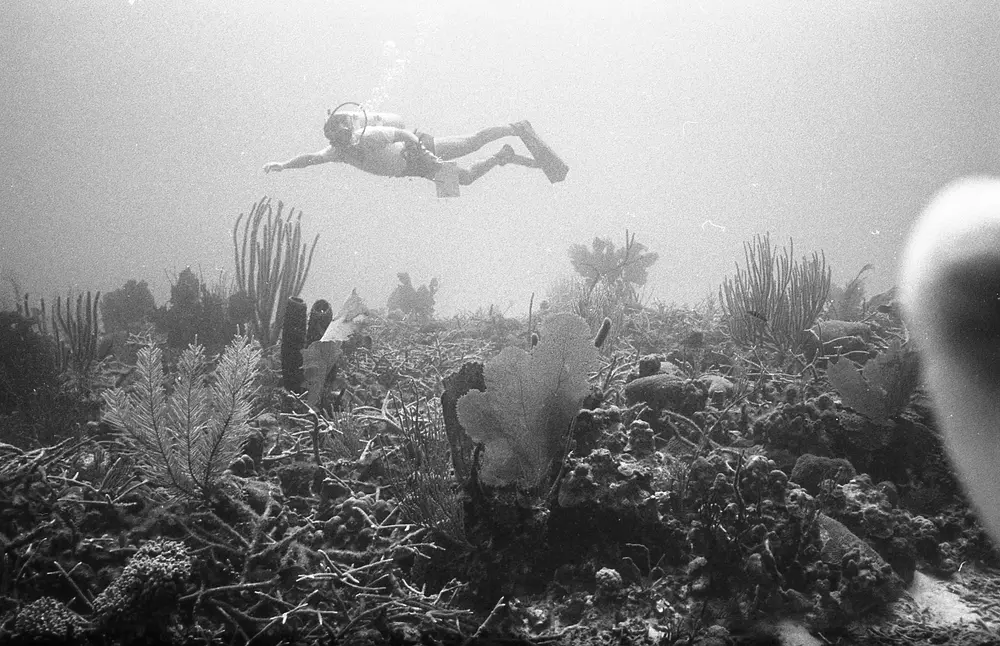{.lightbox group="discovery-bay-1966" description="**UUID: **85aa4aca-1783-4be9-ac83-c1d12cbd0c9b **Date: **1966-08-25 **Location: **Jamaica | Discovery Bay | Upper Buoy Terrace **Longitude: **77.40908ºW **Latitude: **18.47322ºN **Photographer: **Eileen Graham **Copyright: **Trustees of the Natural History Museum (London, UK), CC-BY-4.0" alt="**UUID: **85aa4aca-1783-4be9-ac83-c1d12cbd0c9b **Date: **1966-08-25 **Location: **Jamaica | Discovery Bay | Upper Buoy Terrace **Longitude: **77.40908ºW **Latitude: **18.47322ºN **Photographer: **Eileen Graham **Copyright: **Trustees of the Natural History Museum (London, UK), CC-BY-4.0"}

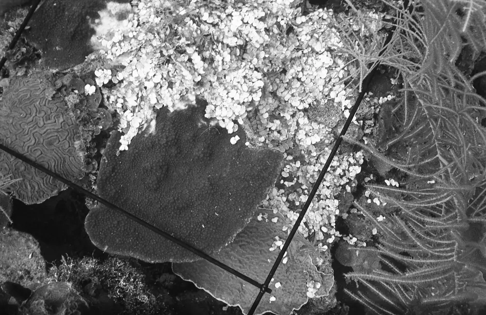{.lightbox group="discovery-bay-1966" description="**UUID: **b64d0a36-c241-4692-925c-9bfcd0ca8f67 **Date: **1966-08-25 **Location: **Jamaica | Discovery Bay | Buoy Upper Slope **Longitude: **77.40908ºW **Latitude: **18.47322ºN **Photographer: **Eileen Graham **Copyright: **Trustees of the Natural History Museum (London, UK), CC-BY-4.0" alt="**UUID: **b64d0a36-c241-4692-925c-9bfcd0ca8f67 **Date: **1966-08-25 **Location: **Jamaica | Discovery Bay | Buoy Upper Slope **Longitude: **77.40908ºW **Latitude: **18.47322ºN **Photographer: **Eileen Graham **Copyright: **Trustees of the Natural History Museum (London, UK), CC-BY-4.0"}

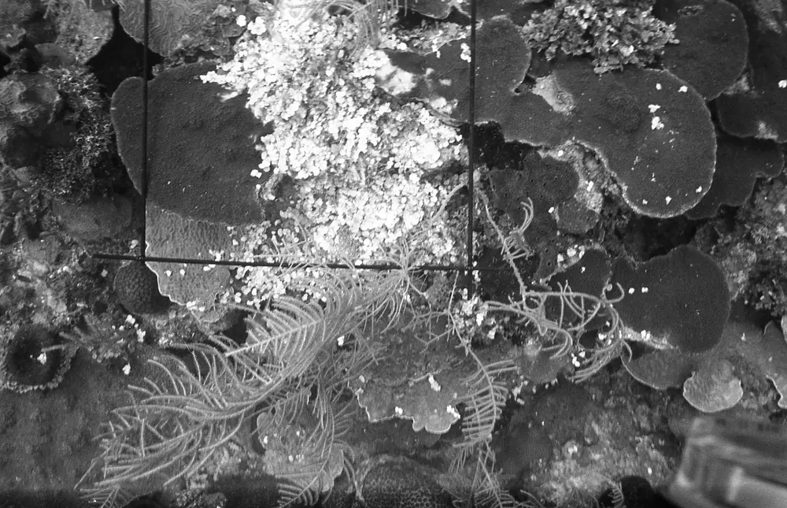{.lightbox group="discovery-bay-1966" description="**UUID: **76b98775-d0ef-4e5f-9b29-8f974f48dab4 **Date: **1966-08-25 **Location: **Jamaica | Discovery Bay | Buoy Upper Slope **Longitude: **77.40908ºW **Latitude: **18.47322ºN **Photographer: **Eileen Graham **Copyright: **Trustees of the Natural History Museum (London, UK), CC-BY-4.0" alt="**UUID: **76b98775-d0ef-4e5f-9b29-8f974f48dab4 **Date: **1966-08-25 **Location: **Jamaica | Discovery Bay | Buoy Upper Slope **Longitude: **77.40908ºW **Latitude: **18.47322ºN **Photographer: **Eileen Graham **Copyright: **Trustees of the Natural History Museum (London, UK), CC-BY-4.0"}

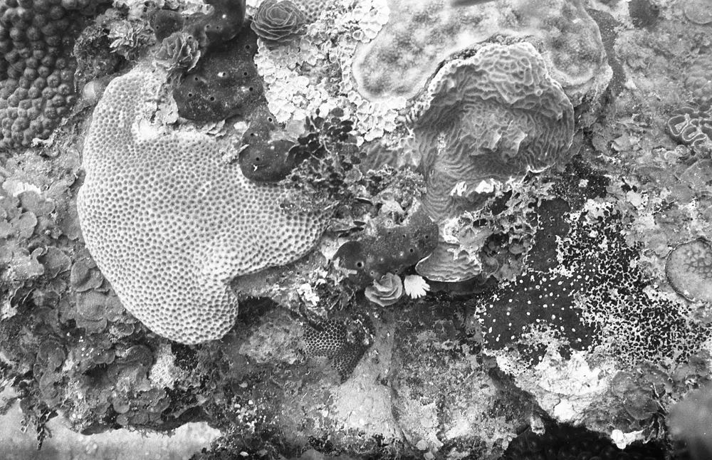{.lightbox group="discovery-bay-1966" description="**UUID: **5489bb49-af7d-470b-94a3-f31574e6bea6 **Date: **1966-08-25 **Location: **Jamaica | Discovery Bay | Buoy Upper Slope **Longitude: **77.40908ºW **Latitude: **18.47322ºN **Photographer: **Eileen Graham **Copyright: **Trustees of the Natural History Museum (London, UK), CC-BY-4.0" alt="**UUID: **5489bb49-af7d-470b-94a3-f31574e6bea6 **Date: **1966-08-25 **Location: **Jamaica | Discovery Bay | Buoy Upper Slope **Longitude: **77.40908ºW **Latitude: **18.47322ºN **Photographer: **Eileen Graham **Copyright: **Trustees of the Natural History Museum (London, UK), CC-BY-4.0"}

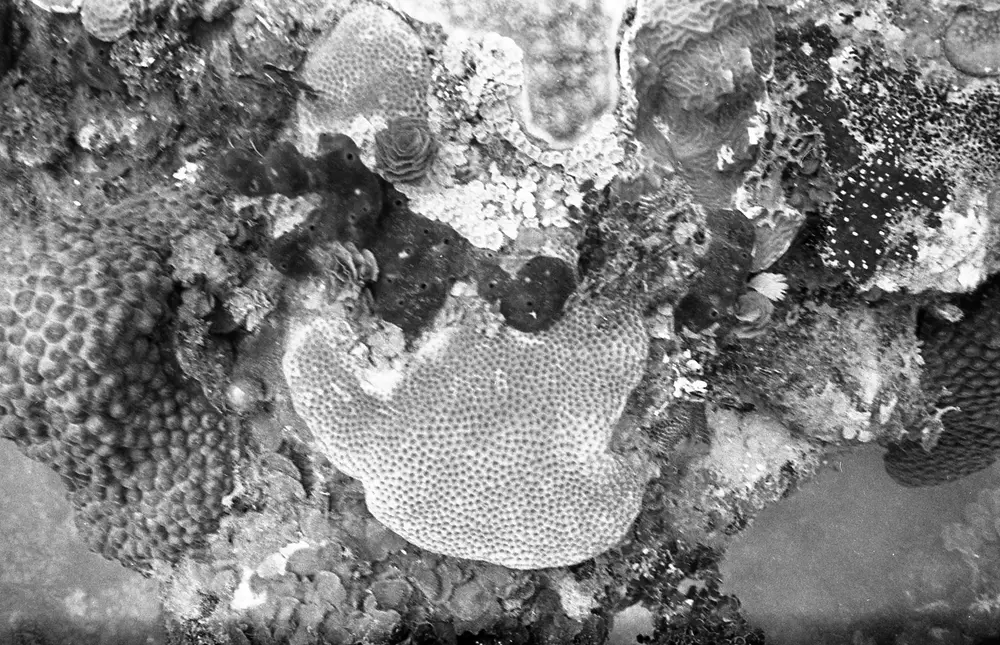{.lightbox group="discovery-bay-1966" description="**UUID: **edda284f-ff2e-4758-a0c7-7ffe3a286fed **Date: **1966-08-25 **Location: **Jamaica | Discovery Bay | Buoy Upper Slope **Longitude: **77.40908ºW **Latitude: **18.47322ºN **Photographer: **Eileen Graham **Copyright: **Trustees of the Natural History Museum (London, UK), CC-BY-4.0" alt="**UUID: **edda284f-ff2e-4758-a0c7-7ffe3a286fed **Date: **1966-08-25 **Location: **Jamaica | Discovery Bay | Buoy Upper Slope **Longitude: **77.40908ºW **Latitude: **18.47322ºN **Photographer: **Eileen Graham **Copyright: **Trustees of the Natural History Museum (London, UK), CC-BY-4.0"}

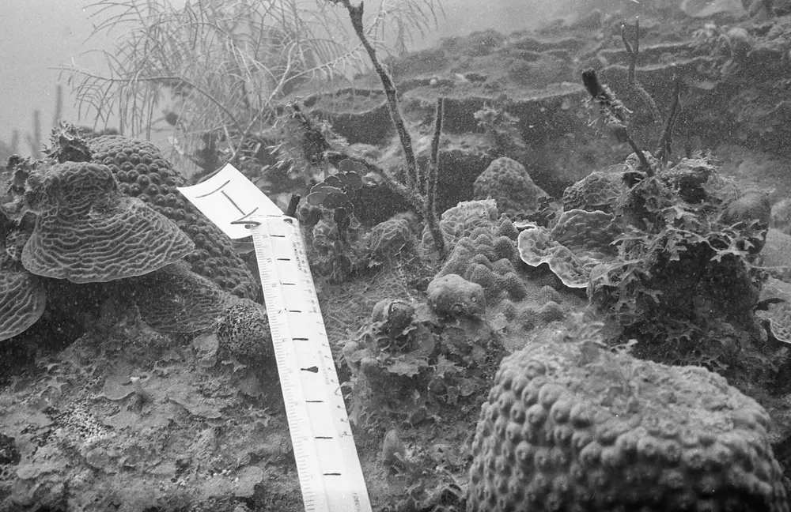{.lightbox group="discovery-bay-1966" description="**UUID: **6c9ba9d3-3ff6-4537-a17f-705a262331a1 **Date: **1966-08-25 **Location: **Jamaica | Discovery Bay | Buoy Upper Slope **Longitude: **77.40908ºW **Latitude: **18.47322ºN **Photographer: **Eileen Graham **Copyright: **Trustees of the Natural History Museum (London, UK), CC-BY-4.0" alt="**UUID: **6c9ba9d3-3ff6-4537-a17f-705a262331a1 **Date: **1966-08-25 **Location: **Jamaica | Discovery Bay | Buoy Upper Slope **Longitude: **77.40908ºW **Latitude: **18.47322ºN **Photographer: **Eileen Graham **Copyright: **Trustees of the Natural History Museum (London, UK), CC-BY-4.0"}

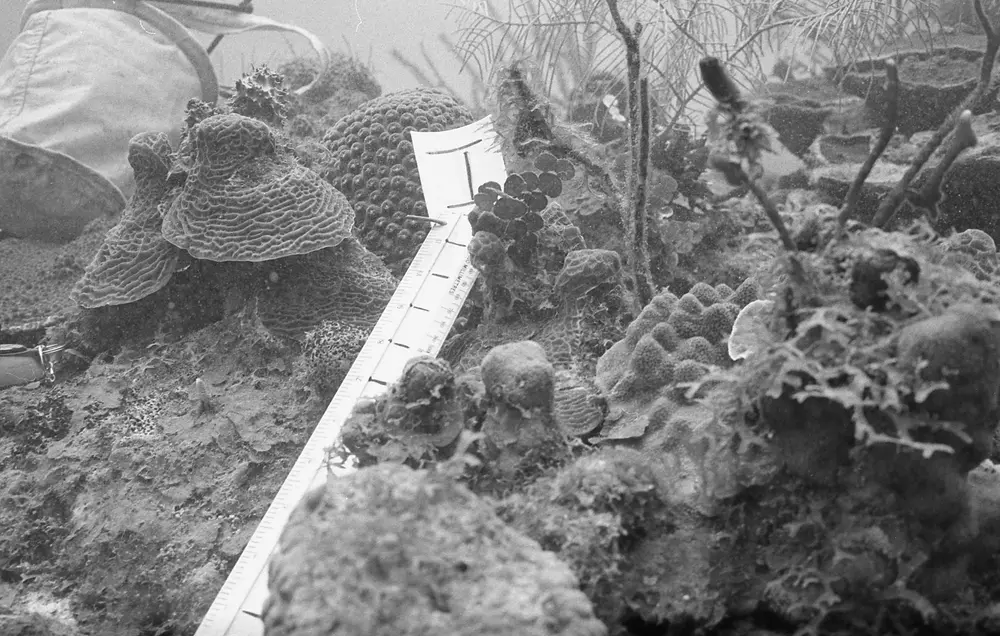{.lightbox group="discovery-bay-1966" description="**UUID: **a0ac0fd6-09f6-4a74-8d2f-2d14ef9e85b1 **Date: **1966-08-25 **Location: **Jamaica | Discovery Bay | Buoy Upper Slope **Longitude: **77.40908ºW **Latitude: **18.47322ºN **Photographer: **Eileen Graham **Copyright: **Trustees of the Natural History Museum (London, UK), CC-BY-4.0" alt="**UUID: **a0ac0fd6-09f6-4a74-8d2f-2d14ef9e85b1 **Date: **1966-08-25 **Location: **Jamaica | Discovery Bay | Buoy Upper Slope **Longitude: **77.40908ºW **Latitude: **18.47322ºN **Photographer: **Eileen Graham **Copyright: **Trustees of the Natural History Museum (London, UK), CC-BY-4.0"}

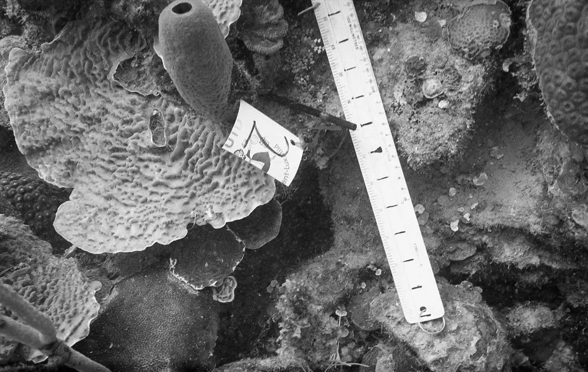{.lightbox group="discovery-bay-1966" description="**UUID: **18fe5b04-a505-428b-8a1d-61ce1b988361 **Date: **1966-08-25 **Location: **Jamaica | Discovery Bay | Buoy Upper Slope **Longitude: **77.40908ºW **Latitude: **18.47322ºN **Photographer: **Eileen Graham **Copyright: **Trustees of the Natural History Museum (London, UK), CC-BY-4.0" alt="**UUID: **18fe5b04-a505-428b-8a1d-61ce1b988361 **Date: **1966-08-25 **Location: **Jamaica | Discovery Bay | Buoy Upper Slope **Longitude: **77.40908ºW **Latitude: **18.47322ºN **Photographer: **Eileen Graham **Copyright: **Trustees of the Natural History Museum (London, UK), CC-BY-4.0"}

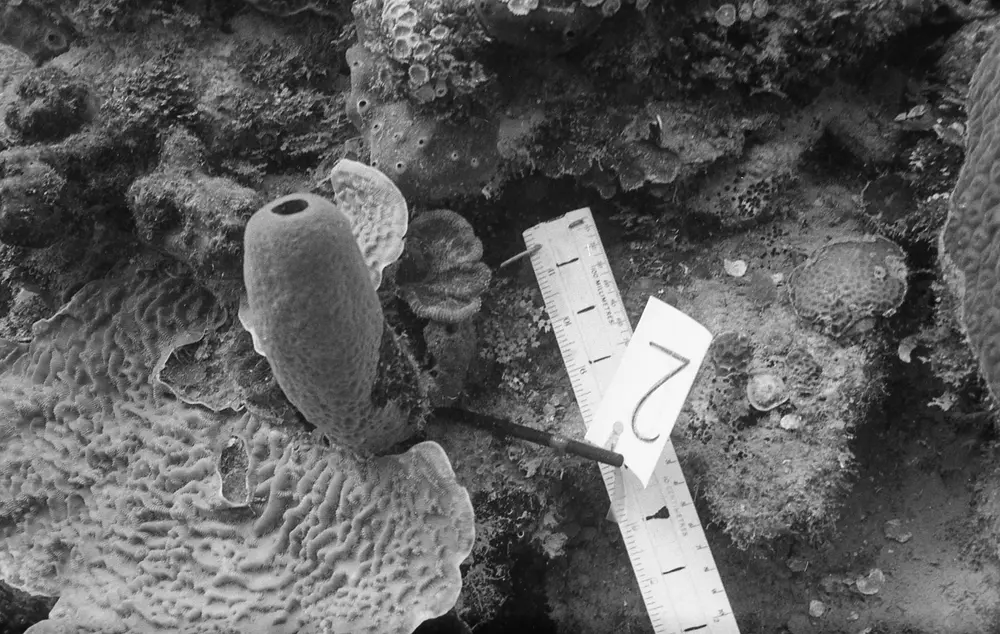{.lightbox group="discovery-bay-1966" description="**UUID: **27942c7c-1085-4bf7-b5ee-730801524d6d **Date: **1966-08-25 **Location: **Jamaica | Discovery Bay | Buoy Upper Slope **Longitude: **77.40908ºW **Latitude: **18.47322ºN **Photographer: **Eileen Graham **Copyright: **Trustees of the Natural History Museum (London, UK), CC-BY-4.0" alt="**UUID: **27942c7c-1085-4bf7-b5ee-730801524d6d **Date: **1966-08-25 **Location: **Jamaica | Discovery Bay | Buoy Upper Slope **Longitude: **77.40908ºW **Latitude: **18.47322ºN **Photographer: **Eileen Graham **Copyright: **Trustees of the Natural History Museum (London, UK), CC-BY-4.0"}

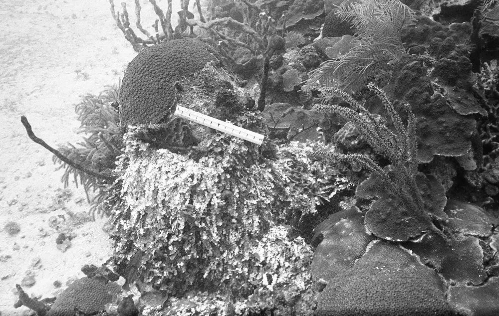{.lightbox group="discovery-bay-1966" description="**UUID: **ad371171-57ff-413d-a42f-3c9a5ff4132f **Date: **1966-08-25 **Location: **Jamaica | Discovery Bay | Buoy Upper Slope **Longitude: **77.40908ºW **Latitude: **18.47322ºN **Photographer: **Eileen Graham **Copyright: **Trustees of the Natural History Museum (London, UK), CC-BY-4.0" alt="**UUID: **ad371171-57ff-413d-a42f-3c9a5ff4132f **Date: **1966-08-25 **Location: **Jamaica | Discovery Bay | Buoy Upper Slope **Longitude: **77.40908ºW **Latitude: **18.47322ºN **Photographer: **Eileen Graham **Copyright: **Trustees of the Natural History Museum (London, UK), CC-BY-4.0"}

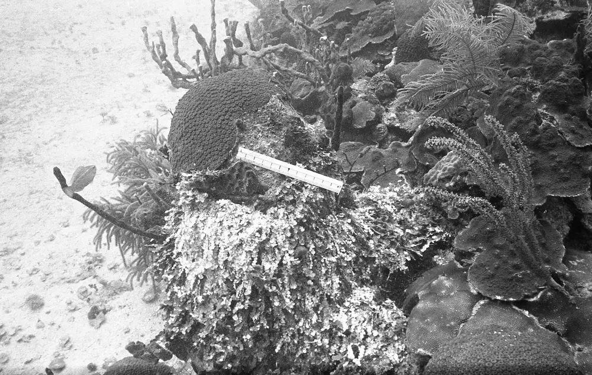{.lightbox group="discovery-bay-1966" description="**UUID: **9faf358e-1ad3-4628-8912-1dfc3b68a9ef **Date: **1966-08-25 **Location: **Jamaica | Discovery Bay | Buoy Upper Slope **Longitude: **77.40908ºW **Latitude: **18.47322ºN **Photographer: **Eileen Graham **Copyright: **Trustees of the Natural History Museum (London, UK), CC-BY-4.0" alt="**UUID: **9faf358e-1ad3-4628-8912-1dfc3b68a9ef **Date: **1966-08-25 **Location: **Jamaica | Discovery Bay | Buoy Upper Slope **Longitude: **77.40908ºW **Latitude: **18.47322ºN **Photographer: **Eileen Graham **Copyright: **Trustees of the Natural History Museum (London, UK), CC-BY-4.0"}

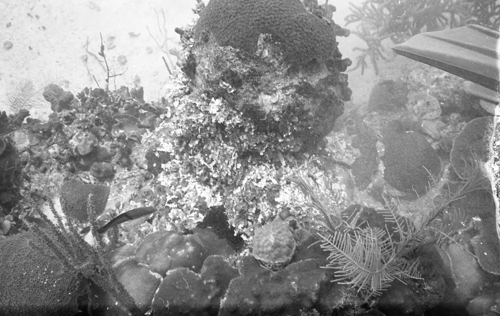{.lightbox group="discovery-bay-1966" description="**UUID: **90b8ef81-df2c-4ba2-b0fa-378bfe5f937b **Date: **1966-08-25 **Location: **Jamaica | Discovery Bay | Buoy Upper Slope **Longitude: **77.40908ºW **Latitude: **18.47322ºN **Photographer: **Eileen Graham **Copyright: **Trustees of the Natural History Museum (London, UK), CC-BY-4.0" alt="**UUID: **90b8ef81-df2c-4ba2-b0fa-378bfe5f937b **Date: **1966-08-25 **Location: **Jamaica | Discovery Bay | Buoy Upper Slope **Longitude: **77.40908ºW **Latitude: **18.47322ºN **Photographer: **Eileen Graham **Copyright: **Trustees of the Natural History Museum (London, UK), CC-BY-4.0"}

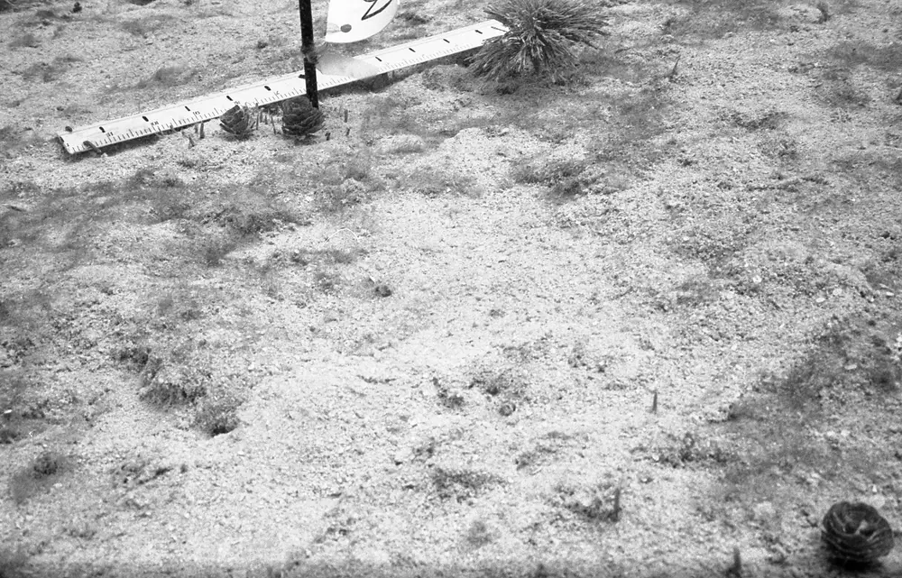{.lightbox group="discovery-bay-1966" description="**UUID: **5cf15ddf-2268-406d-a50f-53bd33d757bd **Date: **1966-08-25 **Location: **Jamaica | Discovery Bay | Algal Plots **Longitude: **77.414ºW **Latitude: **18.473ºN **Photographer: **Eileen Graham **Copyright: **Trustees of the Natural History Museum (London, UK), CC-BY-4.0" alt="**UUID: **5cf15ddf-2268-406d-a50f-53bd33d757bd **Date: **1966-08-25 **Location: **Jamaica | Discovery Bay | Algal Plots **Longitude: **77.414ºW **Latitude: **18.473ºN **Photographer: **Eileen Graham **Copyright: **Trustees of the Natural History Museum (London, UK), CC-BY-4.0"}

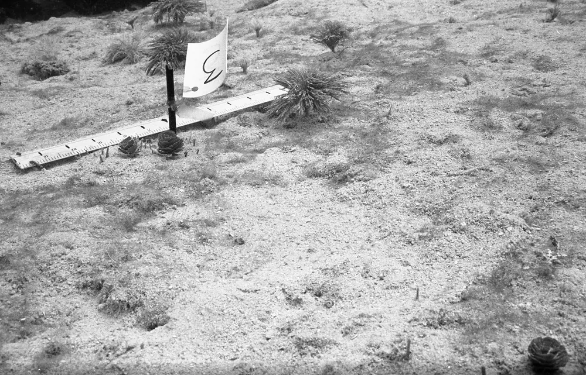{.lightbox group="discovery-bay-1966" description="**UUID: **b9b6f15c-edc4-428b-a579-6512f5903f71 **Date: **1966-08-25 **Location: **Jamaica | Discovery Bay | Algal Plots **Longitude: **77.414ºW **Latitude: **18.473ºN **Photographer: **Eileen Graham **Copyright: **Trustees of the Natural History Museum (London, UK), CC-BY-4.0" alt="**UUID: **b9b6f15c-edc4-428b-a579-6512f5903f71 **Date: **1966-08-25 **Location: **Jamaica | Discovery Bay | Algal Plots **Longitude: **77.414ºW **Latitude: **18.473ºN **Photographer: **Eileen Graham **Copyright: **Trustees of the Natural History Museum (London, UK), CC-BY-4.0"}

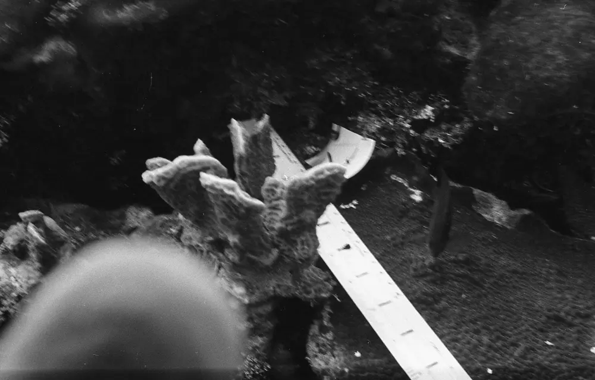{.lightbox group="discovery-bay-1966" description="**UUID: **c6c36df0-b01c-4262-bbd8-e63a664af4cb **Date: **1966-08-25 **Location: **Jamaica | Discovery Bay | Buoy Upper Slope **Longitude: **77.40908ºW **Latitude: **18.47322ºN **Photographer: **Eileen Graham **Copyright: **Trustees of the Natural History Museum (London, UK), CC-BY-4.0" alt="**UUID: **c6c36df0-b01c-4262-bbd8-e63a664af4cb **Date: **1966-08-25 **Location: **Jamaica | Discovery Bay | Buoy Upper Slope **Longitude: **77.40908ºW **Latitude: **18.47322ºN **Photographer: **Eileen Graham **Copyright: **Trustees of the Natural History Museum (London, UK), CC-BY-4.0"}

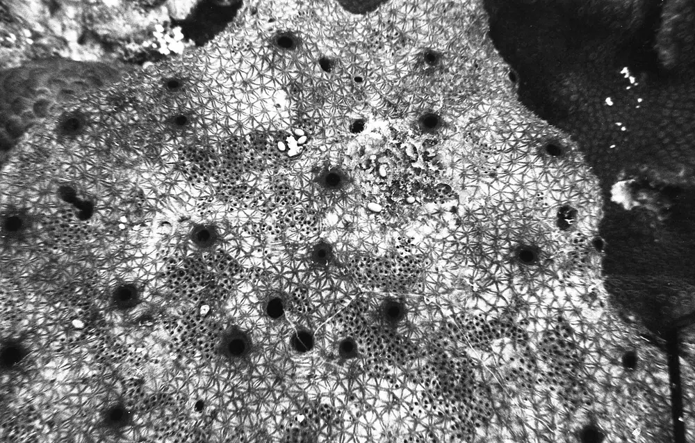{.lightbox group="discovery-bay-1966" description="**UUID: **9e8be2d3-e5a6-4c18-8c33-432987f46955 **Date: **1968-01-22 **Location: **Jamaica | Discovery Bay | Buoy Upper Slope **Longitude: **77.40908ºW **Latitude: **18.47322ºN **Photographer: **Eileen Graham **Copyright: **Trustees of the Natural History Museum (London, UK), CC-BY-4.0" alt="**UUID: **9e8be2d3-e5a6-4c18-8c33-432987f46955 **Date: **1968-01-22 **Location: **Jamaica | Discovery Bay | Buoy Upper Slope **Longitude: **77.40908ºW **Latitude: **18.47322ºN **Photographer: **Eileen Graham **Copyright: **Trustees of the Natural History Museum (London, UK), CC-BY-4.0"}

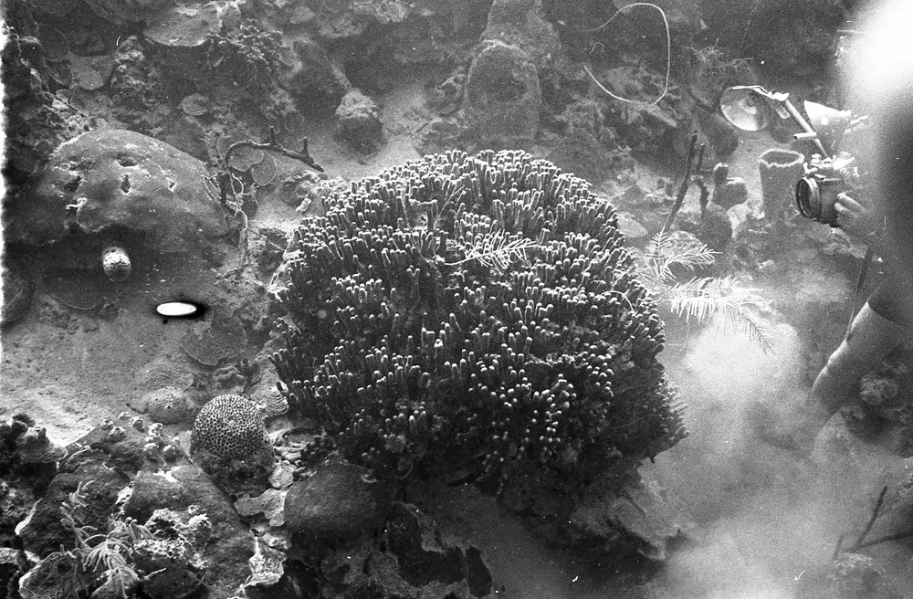{.lightbox group="discovery-bay-1966" description="**UUID: **4672f406-e903-40e9-bd07-642dd61a2ad7 **Date: **1968-01-23 **Location: **Jamaica | Discovery Bay | Pear Tree Bottom **Longitude: **77.35867ºW **Latitude: **18.4635ºN **Photographer: **Eileen Graham **Copyright: **Trustees of the Natural History Museum (London, UK), CC-BY-4.0" alt="**UUID: **4672f406-e903-40e9-bd07-642dd61a2ad7 **Date: **1968-01-23 **Location: **Jamaica | Discovery Bay | Pear Tree Bottom **Longitude: **77.35867ºW **Latitude: **18.4635ºN **Photographer: **Eileen Graham **Copyright: **Trustees of the Natural History Museum (London, UK), CC-BY-4.0"}

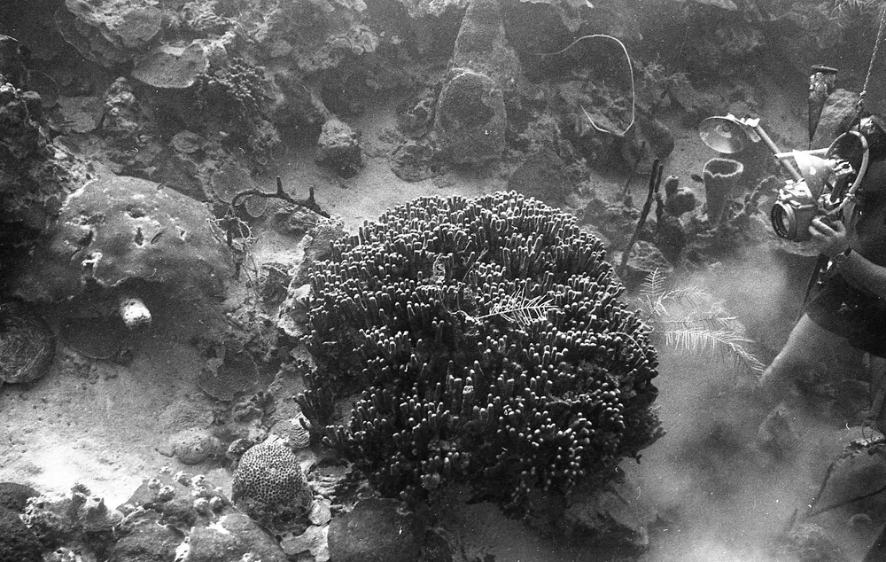{.lightbox group="discovery-bay-1966" description="**UUID: **a67f62c7-eacb-4ab1-b019-66522e17699b **Date: **1968-01-23 **Location: **Jamaica | Discovery Bay | Pear Tree Bottom **Longitude: **77.35867ºW **Latitude: **18.4635ºN **Photographer: **Eileen Graham **Copyright: **Trustees of the Natural History Museum (London, UK), CC-BY-4.0" alt="**UUID: **a67f62c7-eacb-4ab1-b019-66522e17699b **Date: **1968-01-23 **Location: **Jamaica | Discovery Bay | Pear Tree Bottom **Longitude: **77.35867ºW **Latitude: **18.4635ºN **Photographer: **Eileen Graham **Copyright: **Trustees of the Natural History Museum (London, UK), CC-BY-4.0"}

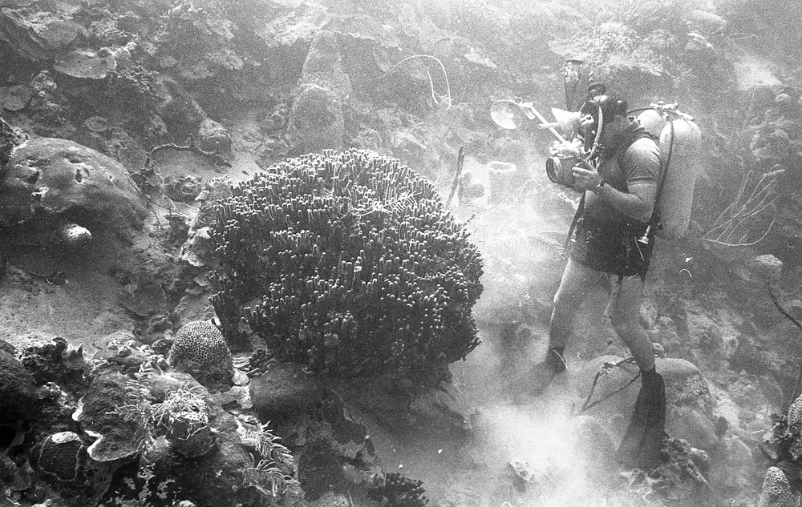{.lightbox group="discovery-bay-1966" description="**UUID: **afaee2ef-727c-4601-bfa7-14079c361018 **Date: **1968-01-23 **Location: **Jamaica | Discovery Bay | Pear Tree Bottom **Longitude: **77.35867ºW **Latitude: **18.4635ºN **Photographer: **Eileen Graham **Copyright: **Trustees of the Natural History Museum (London, UK), CC-BY-4.0" alt="**UUID: **afaee2ef-727c-4601-bfa7-14079c361018 **Date: **1968-01-23 **Location: **Jamaica | Discovery Bay | Pear Tree Bottom **Longitude: **77.35867ºW **Latitude: **18.4635ºN **Photographer: **Eileen Graham **Copyright: **Trustees of the Natural History Museum (London, UK), CC-BY-4.0"}

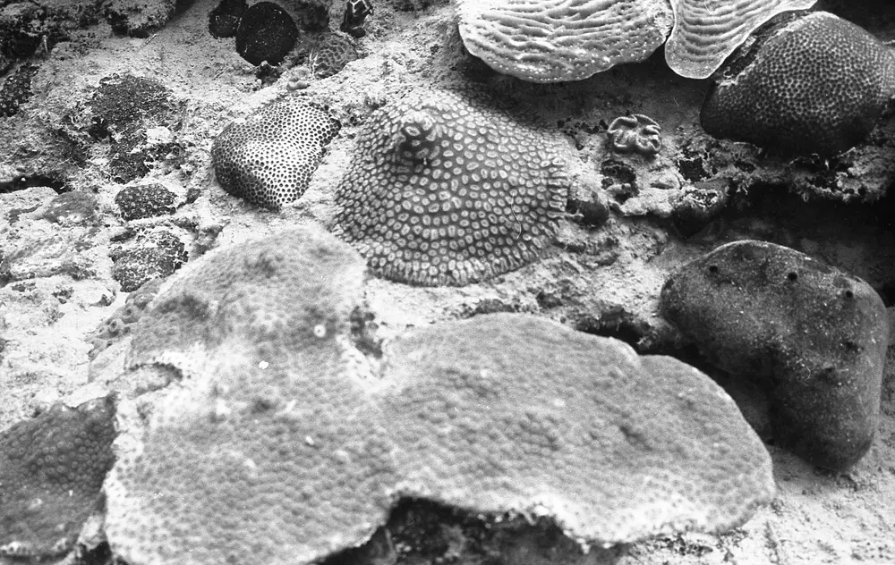{.lightbox group="discovery-bay-1966" description="**UUID: **70aa5926-8703-439a-9a9e-bfde21b67ed4 **Date: **1968-01-23 **Location: **Jamaica | Discovery Bay | Pear Tree Bottom **Longitude: **77.35867ºW **Latitude: **18.4635ºN **Photographer: **Eileen Graham **Copyright: **Trustees of the Natural History Museum (London, UK), CC-BY-4.0" alt="**UUID: **70aa5926-8703-439a-9a9e-bfde21b67ed4 **Date: **1968-01-23 **Location: **Jamaica | Discovery Bay | Pear Tree Bottom **Longitude: **77.35867ºW **Latitude: **18.4635ºN **Photographer: **Eileen Graham **Copyright: **Trustees of the Natural History Museum (London, UK), CC-BY-4.0"}

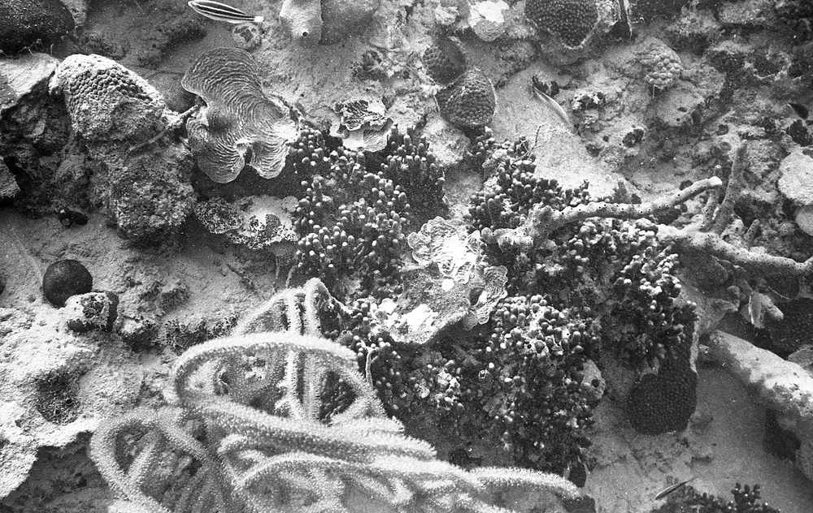{.lightbox group="discovery-bay-1966" description="**UUID: **a4fb9a2f-20cf-4b74-a46d-a01ee90b8f7b **Date: **1968-01-23 **Location: **Jamaica | Discovery Bay | Pear Tree Bottom **Longitude: **77.35867ºW **Latitude: **18.4635ºN **Photographer: **Eileen Graham **Copyright: **Trustees of the Natural History Museum (London, UK), CC-BY-4.0" alt="**UUID: **a4fb9a2f-20cf-4b74-a46d-a01ee90b8f7b **Date: **1968-01-23 **Location: **Jamaica | Discovery Bay | Pear Tree Bottom **Longitude: **77.35867ºW **Latitude: **18.4635ºN **Photographer: **Eileen Graham **Copyright: **Trustees of the Natural History Museum (London, UK), CC-BY-4.0"}

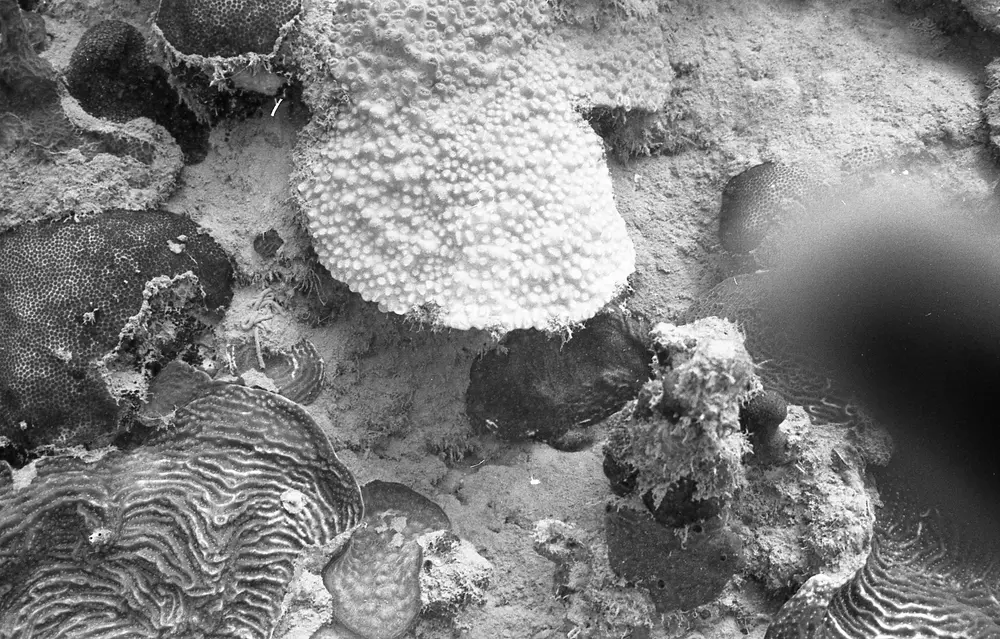{.lightbox group="discovery-bay-1966" description="**UUID: **a156f65d-c358-4de7-aff5-c66088c83a33 **Date: **1968-01-24 **Location: **Jamaica | Discovery Bay | Rio Bueno Cricket Pitch **Longitude: **77.4599ºW **Latitude: **18.4789ºN **Photographer: **Eileen Graham **Copyright: **Trustees of the Natural History Museum (London, UK), CC-BY-4.0" alt="**UUID: **a156f65d-c358-4de7-aff5-c66088c83a33 **Date: **1968-01-24 **Location: **Jamaica | Discovery Bay | Rio Bueno Cricket Pitch **Longitude: **77.4599ºW **Latitude: **18.4789ºN **Photographer: **Eileen Graham **Copyright: **Trustees of the Natural History Museum (London, UK), CC-BY-4.0"}

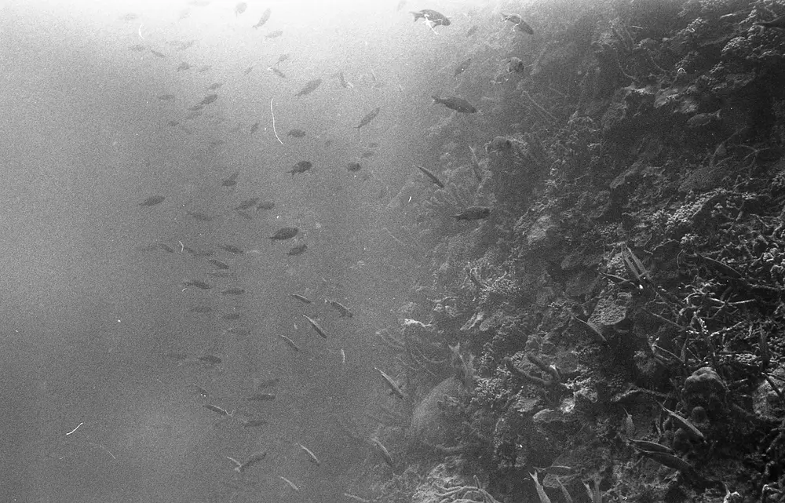{.lightbox group="discovery-bay-1966" description="**UUID: **df9ac706-fdc4-4209-94a1-742f27f89605 **Date: **1968-01-24 **Location: **Jamaica | Discovery Bay | Rio Bueno Cricket Pitch **Longitude: **77.4599ºW **Latitude: **18.4789ºN **Photographer: **Eileen Graham **Copyright: **Trustees of the Natural History Museum (London, UK), CC-BY-4.0" alt="**UUID: **df9ac706-fdc4-4209-94a1-742f27f89605 **Date: **1968-01-24 **Location: **Jamaica | Discovery Bay | Rio Bueno Cricket Pitch **Longitude: **77.4599ºW **Latitude: **18.4789ºN **Photographer: **Eileen Graham **Copyright: **Trustees of the Natural History Museum (London, UK), CC-BY-4.0"}

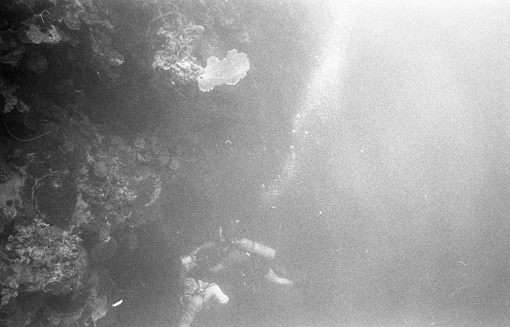{.lightbox group="discovery-bay-1966" description="**UUID: **bf4dedbe-9091-4b7d-9e2f-ec9404140986 **Date: **1968-01-24 **Location: **Jamaica | Discovery Bay | Rio Bueno Cricket Pitch **Longitude: **77.4599ºW **Latitude: **18.4789ºN **Photographer: **Eileen Graham **Copyright: **Trustees of the Natural History Museum (London, UK), CC-BY-4.0" alt="**UUID: **bf4dedbe-9091-4b7d-9e2f-ec9404140986 **Date: **1968-01-24 **Location: **Jamaica | Discovery Bay | Rio Bueno Cricket Pitch **Longitude: **77.4599ºW **Latitude: **18.4789ºN **Photographer: **Eileen Graham **Copyright: **Trustees of the Natural History Museum (London, UK), CC-BY-4.0"}

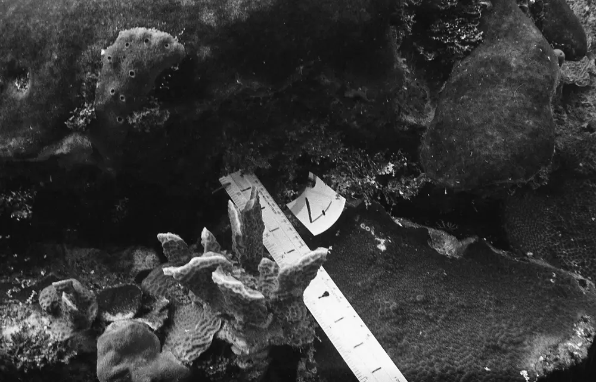{.lightbox group="discovery-bay-1966" description="**UUID: **8363ad50-07a6-4989-99d1-6b5e55fb58c1 **Date: **1966-08-25 **Location: **Jamaica | Discovery Bay | Buoy Upper Slope **Longitude: **77.40908ºW **Latitude: **18.47322ºN **Photographer: **Eileen Graham **Copyright: **Trustees of the Natural History Museum (London, UK), CC-BY-4.0" alt="**UUID: **8363ad50-07a6-4989-99d1-6b5e55fb58c1 **Date: **1966-08-25 **Location: **Jamaica | Discovery Bay | Buoy Upper Slope **Longitude: **77.40908ºW **Latitude: **18.47322ºN **Photographer: **Eileen Graham **Copyright: **Trustees of the Natural History Museum (London, UK), CC-BY-4.0"}

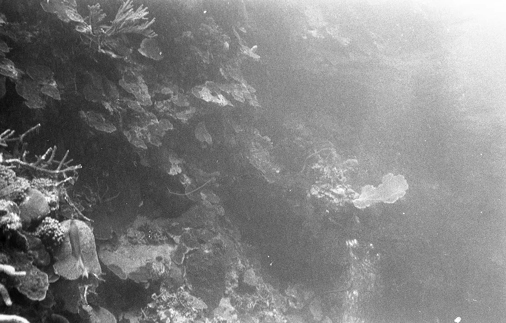{.lightbox group="discovery-bay-1966" description="**UUID: **98005889-39d1-4dc2-ba0e-a965fda3d15c **Date: **1968-01-24 **Location: **Jamaica | Discovery Bay | Rio Bueno Cricket Pitch **Longitude: **77.4599ºW **Latitude: **18.4789ºN **Photographer: **Eileen Graham **Copyright: **Trustees of the Natural History Museum (London, UK), CC-BY-4.0" alt="**UUID: **98005889-39d1-4dc2-ba0e-a965fda3d15c **Date: **1968-01-24 **Location: **Jamaica | Discovery Bay | Rio Bueno Cricket Pitch **Longitude: **77.4599ºW **Latitude: **18.4789ºN **Photographer: **Eileen Graham **Copyright: **Trustees of the Natural History Museum (London, UK), CC-BY-4.0"}

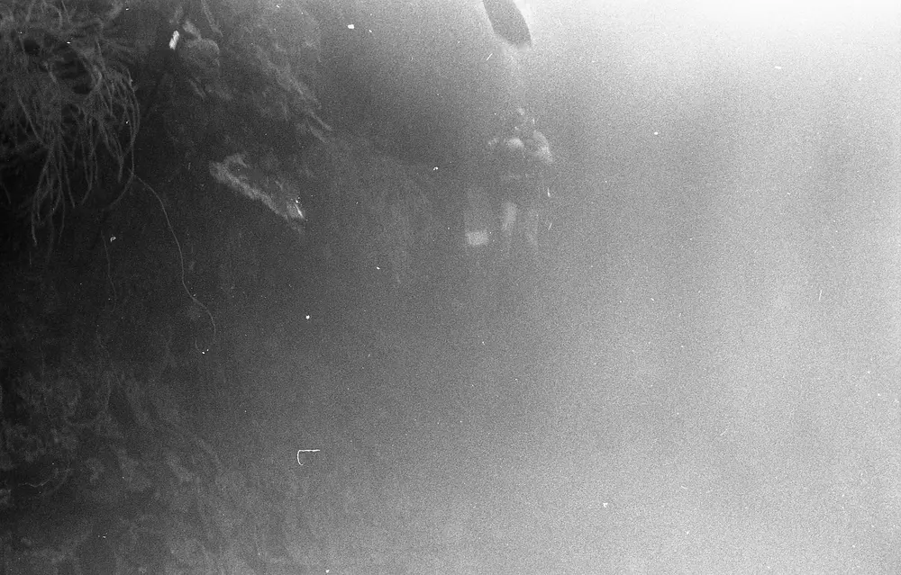{.lightbox group="discovery-bay-1966" description="**UUID: **84ae0ddf-47f4-420e-a35f-92781efbb876 **Date: **1968-01-24 **Location: **Jamaica | Discovery Bay | Rio Bueno Cricket Pitch **Longitude: **77.4599ºW **Latitude: **18.4789ºN **Photographer: **Eileen Graham **Copyright: **Trustees of the Natural History Museum (London, UK), CC-BY-4.0" alt="**UUID: **84ae0ddf-47f4-420e-a35f-92781efbb876 **Date: **1968-01-24 **Location: **Jamaica | Discovery Bay | Rio Bueno Cricket Pitch **Longitude: **77.4599ºW **Latitude: **18.4789ºN **Photographer: **Eileen Graham **Copyright: **Trustees of the Natural History Museum (London, UK), CC-BY-4.0"}

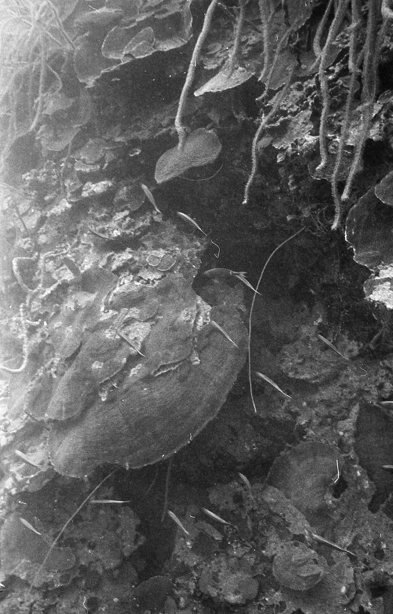{.lightbox group="discovery-bay-1966" description="**UUID: **3125a24b-3479-48a2-9901-23229409224f **Date: **1968-01-24 **Location: **Jamaica | Discovery Bay | Rio Bueno Cricket Pitch **Longitude: **77.4599ºW **Latitude: **18.4789ºN **Photographer: **Eileen Graham **Copyright: **Trustees of the Natural History Museum (London, UK), CC-BY-4.0" alt="**UUID: **3125a24b-3479-48a2-9901-23229409224f **Date: **1968-01-24 **Location: **Jamaica | Discovery Bay | Rio Bueno Cricket Pitch **Longitude: **77.4599ºW **Latitude: **18.4789ºN **Photographer: **Eileen Graham **Copyright: **Trustees of the Natural History Museum (London, UK), CC-BY-4.0"}

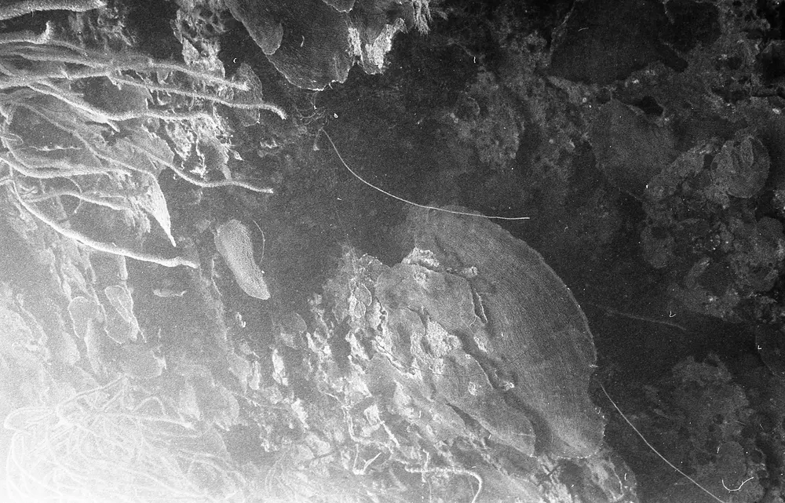{.lightbox group="discovery-bay-1966" description="**UUID: **85b352b3-e2b9-48f0-9ec3-f3b3b8781175 **Date: **1968-01-24 **Location: **Jamaica | Discovery Bay | Rio Bueno Cricket Pitch **Longitude: **77.4599ºW **Latitude: **18.4789ºN **Photographer: **Eileen Graham **Copyright: **Trustees of the Natural History Museum (London, UK), CC-BY-4.0" alt="**UUID: **85b352b3-e2b9-48f0-9ec3-f3b3b8781175 **Date: **1968-01-24 **Location: **Jamaica | Discovery Bay | Rio Bueno Cricket Pitch **Longitude: **77.4599ºW **Latitude: **18.4789ºN **Photographer: **Eileen Graham **Copyright: **Trustees of the Natural History Museum (London, UK), CC-BY-4.0"}

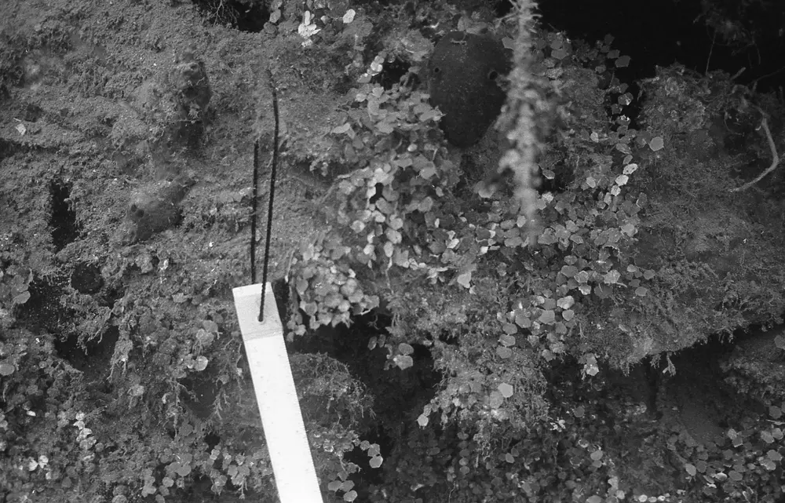{.lightbox group="discovery-bay-1966" description="**UUID: **c56c9ac0-e096-4aaa-b532-83d15d6e6de2 **Date: **1968-01-24 **Location: **Jamaica | Discovery Bay | Rio Bueno Cricket Pitch **Longitude: **77.4599ºW **Latitude: **18.4789ºN **Photographer: **Eileen Graham **Copyright: **Trustees of the Natural History Museum (London, UK), CC-BY-4.0" alt="**UUID: **c56c9ac0-e096-4aaa-b532-83d15d6e6de2 **Date: **1968-01-24 **Location: **Jamaica | Discovery Bay | Rio Bueno Cricket Pitch **Longitude: **77.4599ºW **Latitude: **18.4789ºN **Photographer: **Eileen Graham **Copyright: **Trustees of the Natural History Museum (London, UK), CC-BY-4.0"}

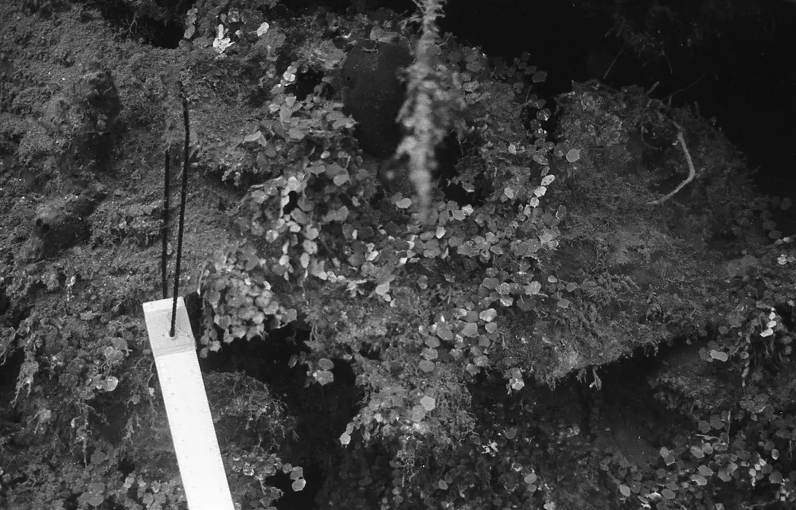{.lightbox group="discovery-bay-1966" description="**UUID: **4cc2e481-2205-4053-ad24-37e6bb450395 **Date: **1968-01-24 **Location: **Jamaica | Discovery Bay | Rio Bueno Cricket Pitch **Longitude: **77.4599ºW **Latitude: **18.4789ºN **Photographer: **Eileen Graham **Copyright: **Trustees of the Natural History Museum (London, UK), CC-BY-4.0" alt="**UUID: **4cc2e481-2205-4053-ad24-37e6bb450395 **Date: **1968-01-24 **Location: **Jamaica | Discovery Bay | Rio Bueno Cricket Pitch **Longitude: **77.4599ºW **Latitude: **18.4789ºN **Photographer: **Eileen Graham **Copyright: **Trustees of the Natural History Museum (London, UK), CC-BY-4.0"}

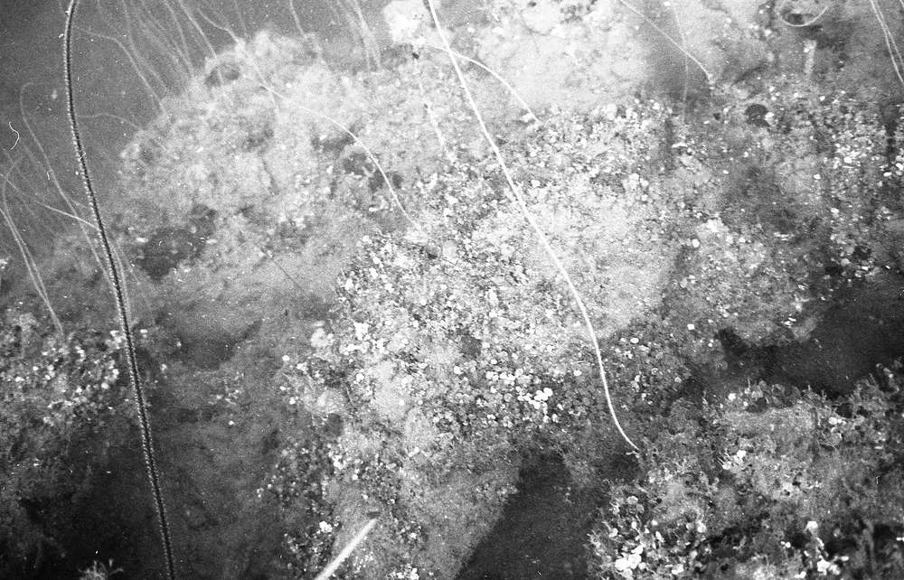{.lightbox group="discovery-bay-1966" description="**UUID: **a39d04f3-bb82-4ab5-b38a-159330755ced **Date: **1968-01-24 **Location: **Jamaica | Discovery Bay | Rio Bueno Cricket Pitch **Longitude: **77.4599ºW **Latitude: **18.4789ºN **Photographer: **Eileen Graham **Copyright: **Trustees of the Natural History Museum (London, UK), CC-BY-4.0" alt="**UUID: **a39d04f3-bb82-4ab5-b38a-159330755ced **Date: **1968-01-24 **Location: **Jamaica | Discovery Bay | Rio Bueno Cricket Pitch **Longitude: **77.4599ºW **Latitude: **18.4789ºN **Photographer: **Eileen Graham **Copyright: **Trustees of the Natural History Museum (London, UK), CC-BY-4.0"}

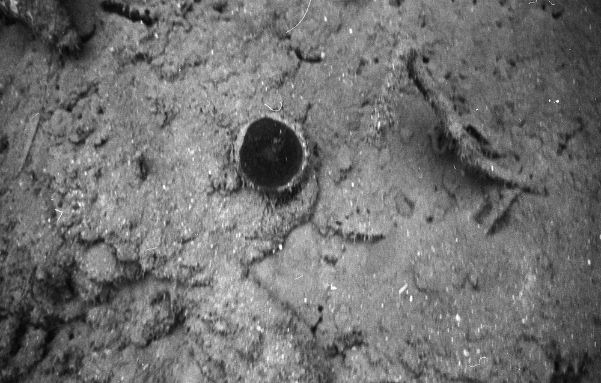{.lightbox group="discovery-bay-1966" description="**UUID: **afe1221b-827a-4a46-a769-385b9513ed5f **Date: **1968-01-24 **Location: **Jamaica | Discovery Bay | Rio Bueno Cricket Pitch **Longitude: **77.4599ºW **Latitude: **18.4789ºN **Photographer: **Eileen Graham **Copyright: **Trustees of the Natural History Museum (London, UK), CC-BY-4.0" alt="**UUID: **afe1221b-827a-4a46-a769-385b9513ed5f **Date: **1968-01-24 **Location: **Jamaica | Discovery Bay | Rio Bueno Cricket Pitch **Longitude: **77.4599ºW **Latitude: **18.4789ºN **Photographer: **Eileen Graham **Copyright: **Trustees of the Natural History Museum (London, UK), CC-BY-4.0"}

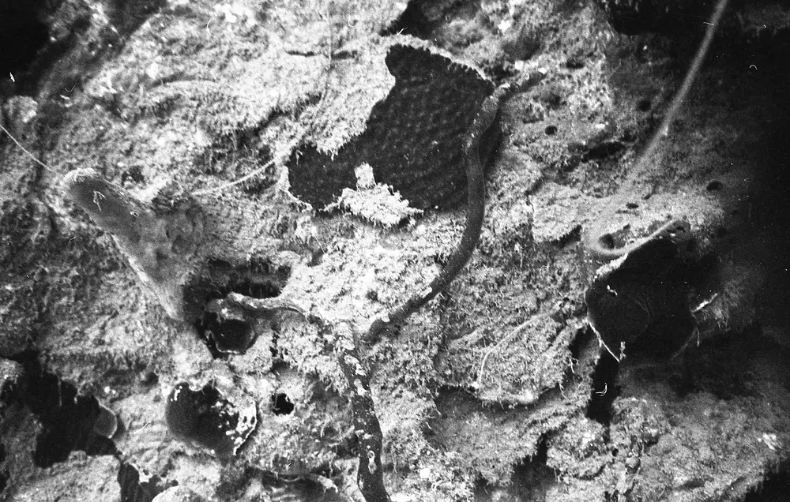{.lightbox group="discovery-bay-1966" description="**UUID: **87d7199f-3897-4900-b466-1a580f890cb4 **Date: **1968-01-24 **Location: **Jamaica | Discovery Bay | Rio Bueno Cricket Pitch **Longitude: **77.4599ºW **Latitude: **18.4789ºN **Photographer: **Eileen Graham **Copyright: **Trustees of the Natural History Museum (London, UK), CC-BY-4.0" alt="**UUID: **87d7199f-3897-4900-b466-1a580f890cb4 **Date: **1968-01-24 **Location: **Jamaica | Discovery Bay | Rio Bueno Cricket Pitch **Longitude: **77.4599ºW **Latitude: **18.4789ºN **Photographer: **Eileen Graham **Copyright: **Trustees of the Natural History Museum (London, UK), CC-BY-4.0"}

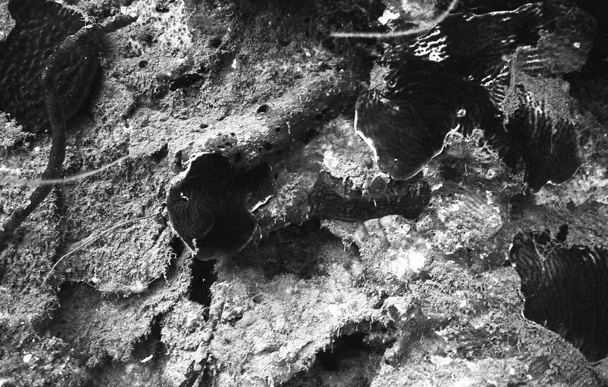{.lightbox group="discovery-bay-1966" description="**UUID: **4cb25189-7a3e-4a4f-860d-9598011192a7 **Date: **1968-01-24 **Location: **Jamaica | Discovery Bay | Rio Bueno Cricket Pitch **Longitude: **77.4599ºW **Latitude: **18.4789ºN **Photographer: **Eileen Graham **Copyright: **Trustees of the Natural History Museum (London, UK), CC-BY-4.0" alt="**UUID: **4cb25189-7a3e-4a4f-860d-9598011192a7 **Date: **1968-01-24 **Location: **Jamaica | Discovery Bay | Rio Bueno Cricket Pitch **Longitude: **77.4599ºW **Latitude: **18.4789ºN **Photographer: **Eileen Graham **Copyright: **Trustees of the Natural History Museum (London, UK), CC-BY-4.0"}

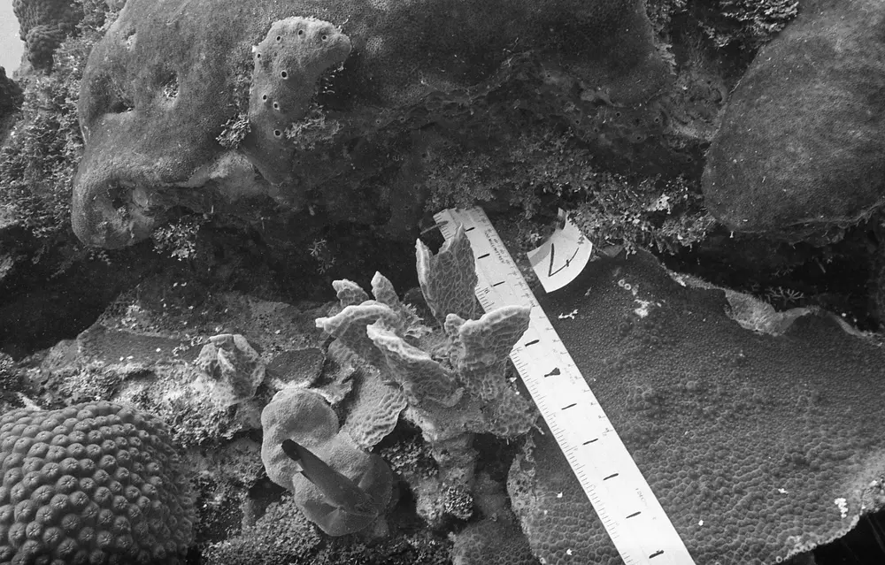{.lightbox group="discovery-bay-1966" description="**UUID: **83a4902e-6c53-4338-bddc-4875ec84d4cc **Date: **1966-08-25 **Location: **Jamaica | Discovery Bay | Buoy Upper Slope **Longitude: **77.40908ºW **Latitude: **18.47322ºN **Photographer: **Eileen Graham **Copyright: **Trustees of the Natural History Museum (London, UK), CC-BY-4.0" alt="**UUID: **83a4902e-6c53-4338-bddc-4875ec84d4cc **Date: **1966-08-25 **Location: **Jamaica | Discovery Bay | Buoy Upper Slope **Longitude: **77.40908ºW **Latitude: **18.47322ºN **Photographer: **Eileen Graham **Copyright: **Trustees of the Natural History Museum (London, UK), CC-BY-4.0"}

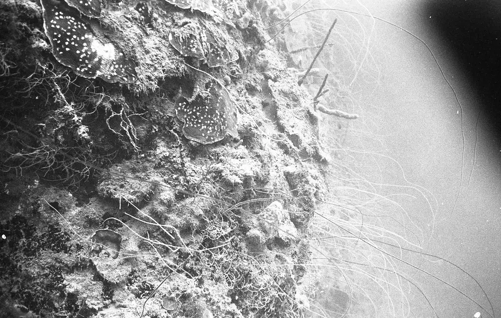{.lightbox group="discovery-bay-1966" description="**UUID: **a10029b0-5f73-4c53-a434-b9ce8a5debea **Date: **1968-01-24 **Location: **Jamaica | Discovery Bay | Rio Bueno Cricket Pitch **Longitude: **77.4599ºW **Latitude: **18.4789ºN **Photographer: **Eileen Graham **Copyright: **Trustees of the Natural History Museum (London, UK), CC-BY-4.0" alt="**UUID: **a10029b0-5f73-4c53-a434-b9ce8a5debea **Date: **1968-01-24 **Location: **Jamaica | Discovery Bay | Rio Bueno Cricket Pitch **Longitude: **77.4599ºW **Latitude: **18.4789ºN **Photographer: **Eileen Graham **Copyright: **Trustees of the Natural History Museum (London, UK), CC-BY-4.0"}

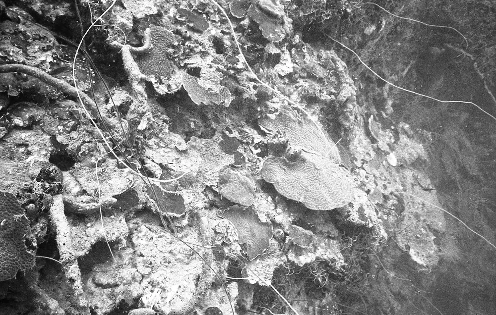{.lightbox group="discovery-bay-1966" description="**UUID: **2b188092-6690-4e1a-b5ba-f4c0ea86671a **Date: **1968-01-24 **Location: **Jamaica | Discovery Bay | Rio Bueno Cricket Pitch **Longitude: **77.4599ºW **Latitude: **18.4789ºN **Photographer: **Eileen Graham **Copyright: **Trustees of the Natural History Museum (London, UK), CC-BY-4.0" alt="**UUID: **2b188092-6690-4e1a-b5ba-f4c0ea86671a **Date: **1968-01-24 **Location: **Jamaica | Discovery Bay | Rio Bueno Cricket Pitch **Longitude: **77.4599ºW **Latitude: **18.4789ºN **Photographer: **Eileen Graham **Copyright: **Trustees of the Natural History Museum (London, UK), CC-BY-4.0"}

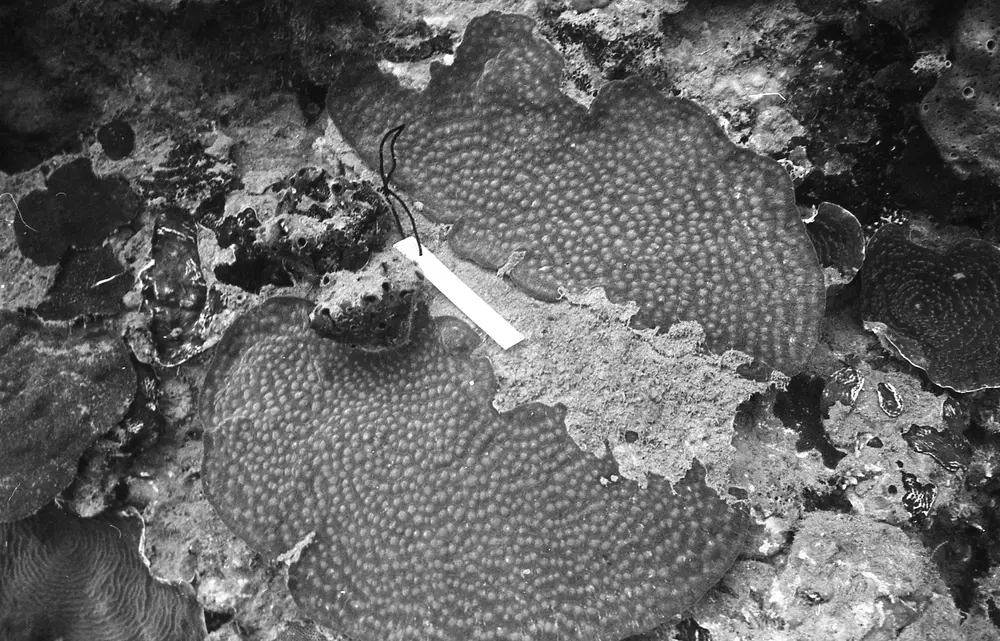{.lightbox group="discovery-bay-1966" description="**UUID: **f3b4598a-ac7f-444f-b1da-d4aad17ca177 **Date: **1968-01-24 **Location: **Jamaica | Discovery Bay | Rio Bueno Cricket Pitch **Longitude: **77.4599ºW **Latitude: **18.4789ºN **Photographer: **Eileen Graham **Copyright: **Trustees of the Natural History Museum (London, UK), CC-BY-4.0" alt="**UUID: **f3b4598a-ac7f-444f-b1da-d4aad17ca177 **Date: **1968-01-24 **Location: **Jamaica | Discovery Bay | Rio Bueno Cricket Pitch **Longitude: **77.4599ºW **Latitude: **18.4789ºN **Photographer: **Eileen Graham **Copyright: **Trustees of the Natural History Museum (London, UK), CC-BY-4.0"}

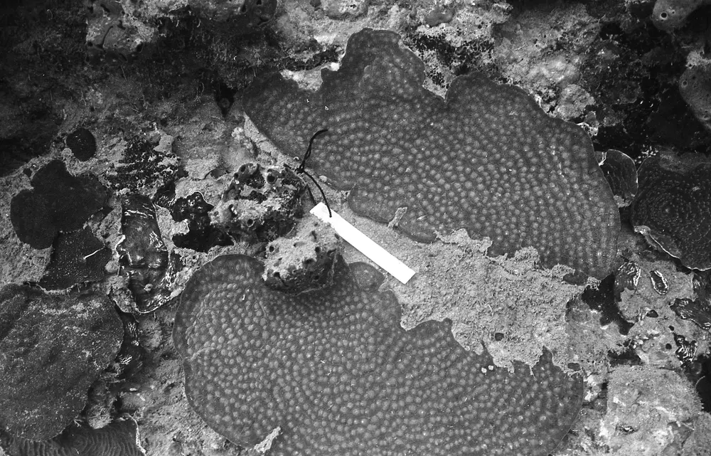{.lightbox group="discovery-bay-1966" description="**UUID: **075e66db-756f-4bae-8a4d-6386ec7b854f **Date: **1968-01-24 **Location: **Jamaica | Discovery Bay | Rio Bueno Cricket Pitch **Longitude: **77.4599ºW **Latitude: **18.4789ºN **Photographer: **Eileen Graham **Copyright: **Trustees of the Natural History Museum (London, UK), CC-BY-4.0" alt="**UUID: **075e66db-756f-4bae-8a4d-6386ec7b854f **Date: **1968-01-24 **Location: **Jamaica | Discovery Bay | Rio Bueno Cricket Pitch **Longitude: **77.4599ºW **Latitude: **18.4789ºN **Photographer: **Eileen Graham **Copyright: **Trustees of the Natural History Museum (London, UK), CC-BY-4.0"}

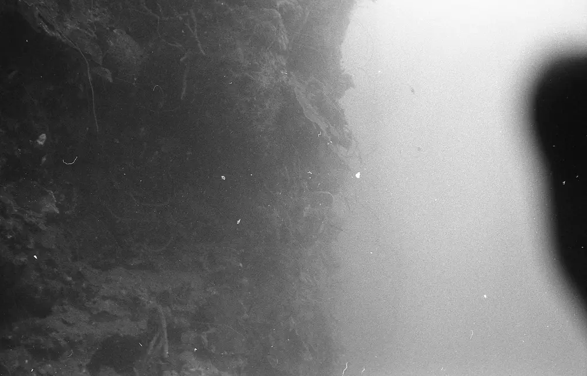{.lightbox group="discovery-bay-1966" description="**UUID: **b3c867da-ceba-4014-908c-817956e1c6bc **Date: **1968-01-24 **Location: **Jamaica | Discovery Bay | Rio Bueno Cricket Pitch **Longitude: **77.4599ºW **Latitude: **18.4789ºN **Photographer: **Eileen Graham **Copyright: **Trustees of the Natural History Museum (London, UK), CC-BY-4.0" alt="**UUID: **b3c867da-ceba-4014-908c-817956e1c6bc **Date: **1968-01-24 **Location: **Jamaica | Discovery Bay | Rio Bueno Cricket Pitch **Longitude: **77.4599ºW **Latitude: **18.4789ºN **Photographer: **Eileen Graham **Copyright: **Trustees of the Natural History Museum (London, UK), CC-BY-4.0"}

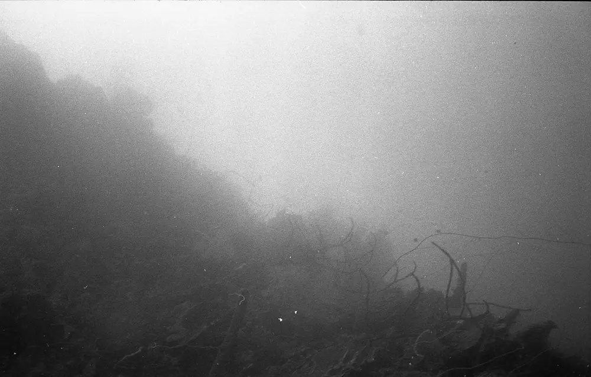{.lightbox group="discovery-bay-1966" description="**UUID: **b14220cb-5746-4392-b88e-9bdc460ce359 **Date: **1968-01-24 **Location: **Jamaica | Discovery Bay | Rio Bueno Cricket Pitch **Longitude: **77.4599ºW **Latitude: **18.4789ºN **Photographer: **Eileen Graham **Copyright: **Trustees of the Natural History Museum (London, UK), CC-BY-4.0" alt="**UUID: **b14220cb-5746-4392-b88e-9bdc460ce359 **Date: **1968-01-24 **Location: **Jamaica | Discovery Bay | Rio Bueno Cricket Pitch **Longitude: **77.4599ºW **Latitude: **18.4789ºN **Photographer: **Eileen Graham **Copyright: **Trustees of the Natural History Museum (London, UK), CC-BY-4.0"}

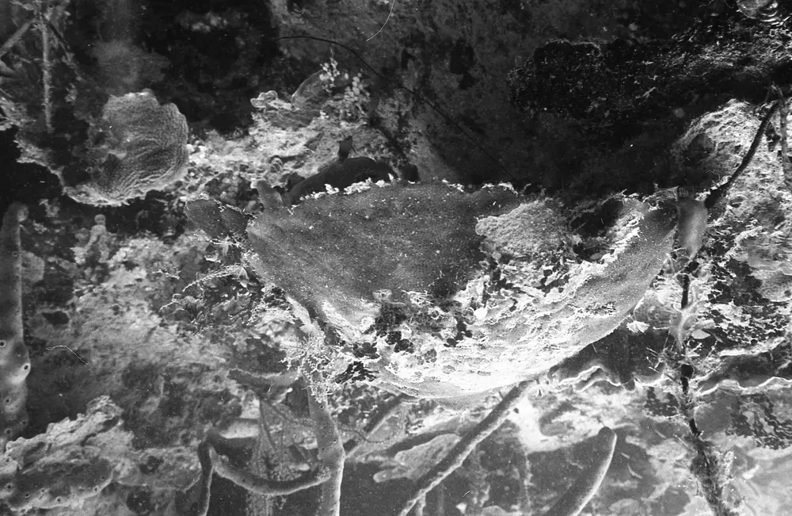{.lightbox group="discovery-bay-1966" description="**UUID: **a82376b0-14c1-4c35-a858-807a4a902a7b **Date: **1968-03-03 **Location: **Jamaica | Discovery Bay | East Mangrove Point **Longitude: **77.5037ºW **Latitude: **18.4862ºN **Photographer: **Eileen Graham **Copyright: **Trustees of the Natural History Museum (London, UK), CC-BY-4.0" alt="**UUID: **a82376b0-14c1-4c35-a858-807a4a902a7b **Date: **1968-03-03 **Location: **Jamaica | Discovery Bay | East Mangrove Point **Longitude: **77.5037ºW **Latitude: **18.4862ºN **Photographer: **Eileen Graham **Copyright: **Trustees of the Natural History Museum (London, UK), CC-BY-4.0"}

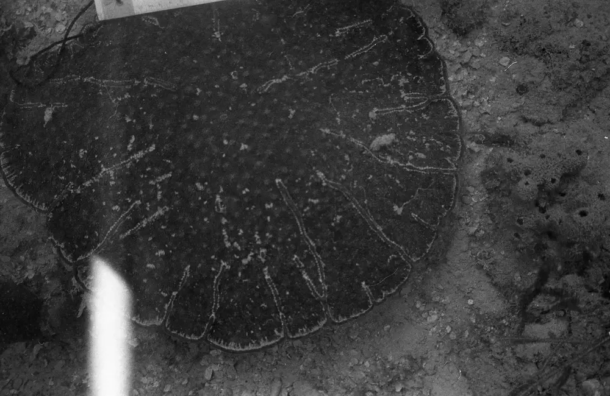{.lightbox group="discovery-bay-1966" description="**UUID: **c94ab7bd-ad1c-4233-913e-44bb1e6674e3 **Date: **1968-03-03 **Location: **Jamaica | Discovery Bay | East Mangrove Point **Longitude: **77.5037ºW **Latitude: **18.4862ºN **Photographer: **Eileen Graham **Copyright: **Trustees of the Natural History Museum (London, UK), CC-BY-4.0" alt="**UUID: **c94ab7bd-ad1c-4233-913e-44bb1e6674e3 **Date: **1968-03-03 **Location: **Jamaica | Discovery Bay | East Mangrove Point **Longitude: **77.5037ºW **Latitude: **18.4862ºN **Photographer: **Eileen Graham **Copyright: **Trustees of the Natural History Museum (London, UK), CC-BY-4.0"}

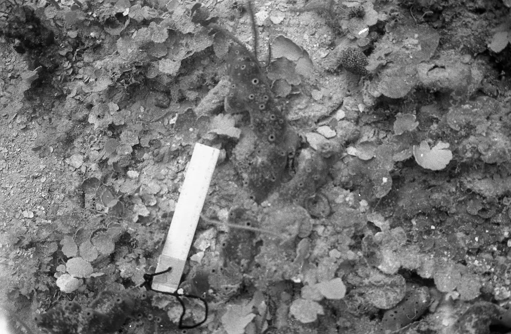{.lightbox group="discovery-bay-1966" description="**UUID: **fb68e77b-cb79-45e3-9a31-e0ff93967040 **Date: **1968-03-03 **Location: **Jamaica | Discovery Bay | East Mangrove Point **Longitude: **77.5037ºW **Latitude: **18.4862ºN **Photographer: **Eileen Graham **Copyright: **Trustees of the Natural History Museum (London, UK), CC-BY-4.0" alt="**UUID: **fb68e77b-cb79-45e3-9a31-e0ff93967040 **Date: **1968-03-03 **Location: **Jamaica | Discovery Bay | East Mangrove Point **Longitude: **77.5037ºW **Latitude: **18.4862ºN **Photographer: **Eileen Graham **Copyright: **Trustees of the Natural History Museum (London, UK), CC-BY-4.0"}

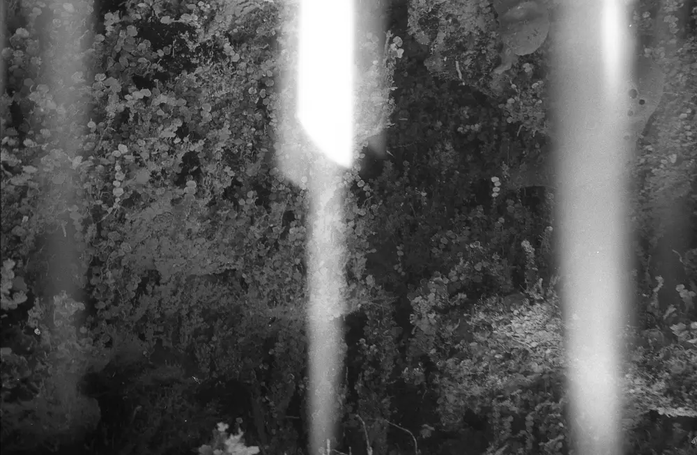{.lightbox group="discovery-bay-1966" description="**UUID: **285cfaa5-8593-4fba-985a-467335f519c0 **Date: **1968-03-03 **Location: **Jamaica | Discovery Bay | East Mangrove Point **Longitude: **77.5037ºW **Latitude: **18.4862ºN **Photographer: **Eileen Graham **Copyright: **Trustees of the Natural History Museum (London, UK), CC-BY-4.0" alt="**UUID: **285cfaa5-8593-4fba-985a-467335f519c0 **Date: **1968-03-03 **Location: **Jamaica | Discovery Bay | East Mangrove Point **Longitude: **77.5037ºW **Latitude: **18.4862ºN **Photographer: **Eileen Graham **Copyright: **Trustees of the Natural History Museum (London, UK), CC-BY-4.0"}

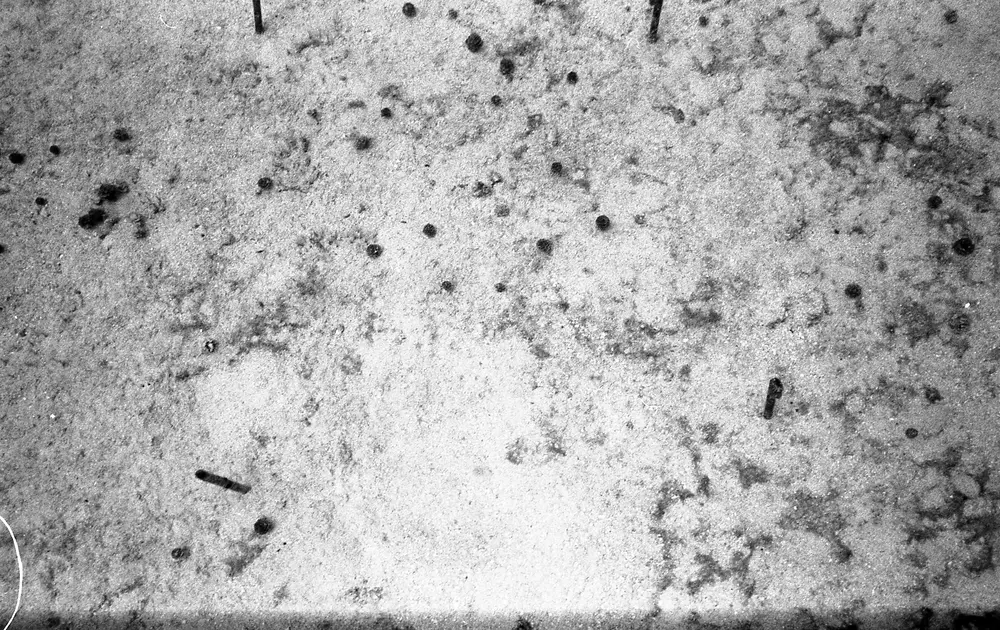{.lightbox group="discovery-bay-1966" description="**UUID: **03dd9100-6f8f-4d24-83a0-e858309e1d78 **Date: **1966-08-25 **Location: **Jamaica | Discovery Bay | Algal Plots **Longitude: **77.414ºW **Latitude: **18.473ºN **Photographer: **Eileen Graham **Copyright: **Trustees of the Natural History Museum (London, UK), CC-BY-4.0" alt="**UUID: **03dd9100-6f8f-4d24-83a0-e858309e1d78 **Date: **1966-08-25 **Location: **Jamaica | Discovery Bay | Algal Plots **Longitude: **77.414ºW **Latitude: **18.473ºN **Photographer: **Eileen Graham **Copyright: **Trustees of the Natural History Museum (London, UK), CC-BY-4.0"}

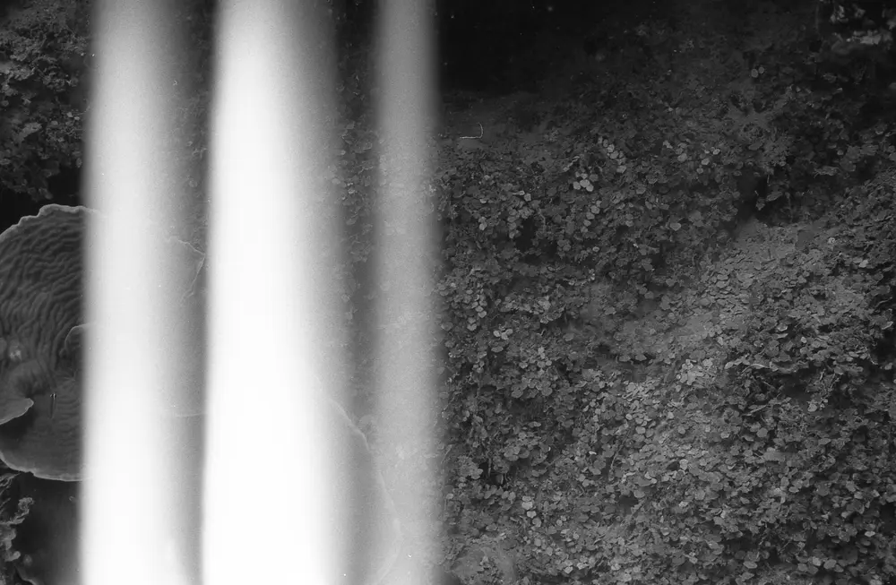{.lightbox group="discovery-bay-1966" description="**UUID: **dbc1786b-57be-4ece-95e8-d5e8caddb396 **Date: **1968-03-03 **Location: **Jamaica | Discovery Bay | East Mangrove Point **Longitude: **77.5037ºW **Latitude: **18.4862ºN **Photographer: **Eileen Graham **Copyright: **Trustees of the Natural History Museum (London, UK), CC-BY-4.0" alt="**UUID: **dbc1786b-57be-4ece-95e8-d5e8caddb396 **Date: **1968-03-03 **Location: **Jamaica | Discovery Bay | East Mangrove Point **Longitude: **77.5037ºW **Latitude: **18.4862ºN **Photographer: **Eileen Graham **Copyright: **Trustees of the Natural History Museum (London, UK), CC-BY-4.0"}

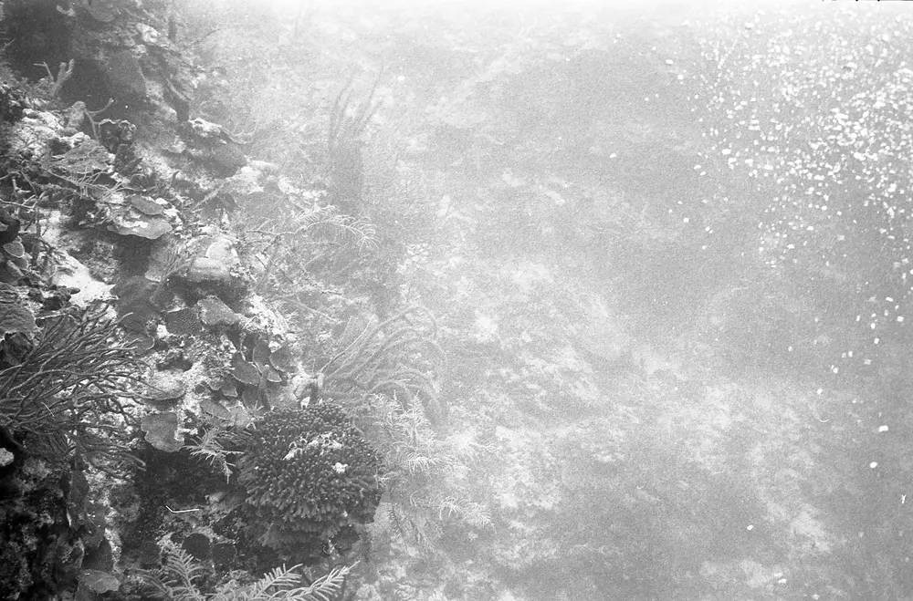{.lightbox group="discovery-bay-1966" description="**UUID: **489b7780-8901-495c-80d2-096d677df107 **Date: **1968-03-03 **Location: **Jamaica | Discovery Bay | East Mangrove Point **Longitude: **77.5037ºW **Latitude: **18.4862ºN **Photographer: **Eileen Graham **Copyright: **Trustees of the Natural History Museum (London, UK), CC-BY-4.0" alt="**UUID: **489b7780-8901-495c-80d2-096d677df107 **Date: **1968-03-03 **Location: **Jamaica | Discovery Bay | East Mangrove Point **Longitude: **77.5037ºW **Latitude: **18.4862ºN **Photographer: **Eileen Graham **Copyright: **Trustees of the Natural History Museum (London, UK), CC-BY-4.0"}

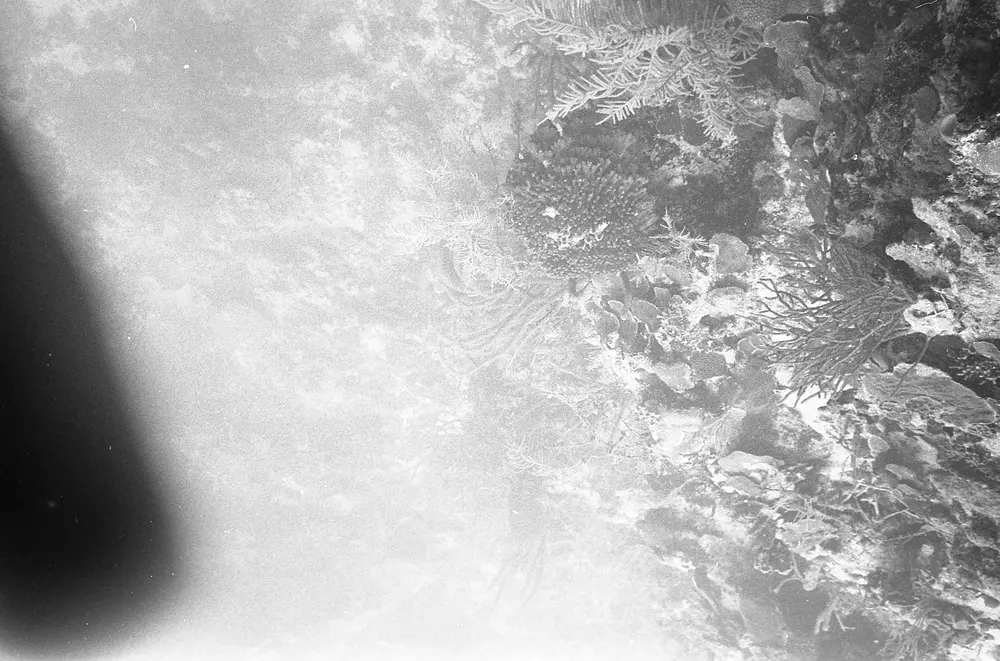{.lightbox group="discovery-bay-1966" description="**UUID: **3019b484-7be0-4702-8afd-1aa16d2b2624 **Date: **1968-03-03 **Location: **Jamaica | Discovery Bay | East Mangrove Point **Longitude: **77.5037ºW **Latitude: **18.4862ºN **Photographer: **Eileen Graham **Copyright: **Trustees of the Natural History Museum (London, UK), CC-BY-4.0" alt="**UUID: **3019b484-7be0-4702-8afd-1aa16d2b2624 **Date: **1968-03-03 **Location: **Jamaica | Discovery Bay | East Mangrove Point **Longitude: **77.5037ºW **Latitude: **18.4862ºN **Photographer: **Eileen Graham **Copyright: **Trustees of the Natural History Museum (London, UK), CC-BY-4.0"}

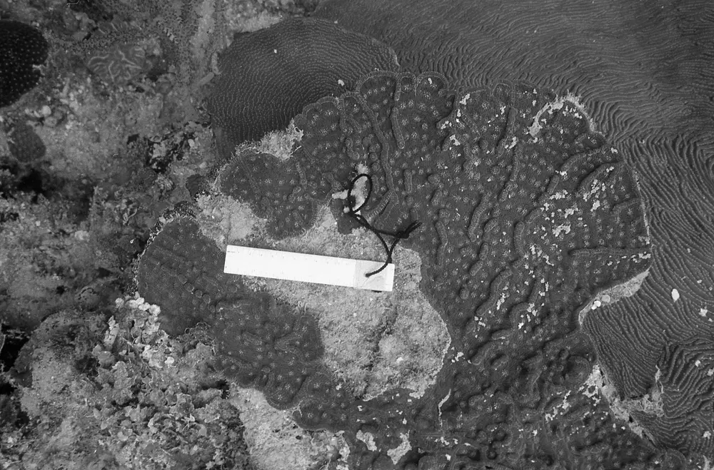{.lightbox group="discovery-bay-1966" description="**UUID: **50c7ab46-3b28-45f4-8bfe-d0843a5c1c23 **Date: **1968-03-03 **Location: **Jamaica | Discovery Bay | East Mangrove Point **Longitude: **77.5037ºW **Latitude: **18.4862ºN **Photographer: **Eileen Graham **Copyright: **Trustees of the Natural History Museum (London, UK), CC-BY-4.0" alt="**UUID: **50c7ab46-3b28-45f4-8bfe-d0843a5c1c23 **Date: **1968-03-03 **Location: **Jamaica | Discovery Bay | East Mangrove Point **Longitude: **77.5037ºW **Latitude: **18.4862ºN **Photographer: **Eileen Graham **Copyright: **Trustees of the Natural History Museum (London, UK), CC-BY-4.0"}

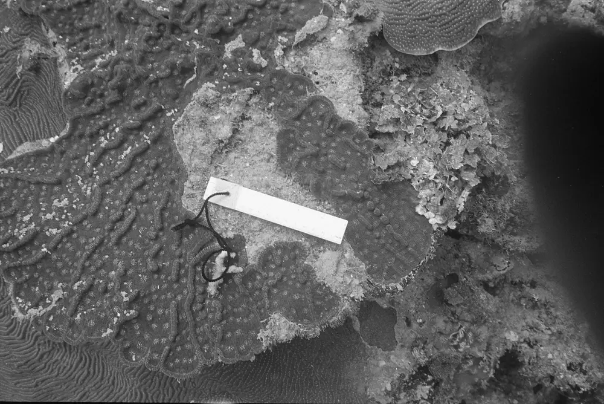{.lightbox group="discovery-bay-1966" description="**UUID: **e3aee951-531c-4dbd-8807-4615b28b8e9f **Date: **1968-03-03 **Location: **Jamaica | Discovery Bay | East Mangrove Point **Longitude: **77.5037ºW **Latitude: **18.4862ºN **Photographer: **Eileen Graham **Copyright: **Trustees of the Natural History Museum (London, UK), CC-BY-4.0" alt="**UUID: **e3aee951-531c-4dbd-8807-4615b28b8e9f **Date: **1968-03-03 **Location: **Jamaica | Discovery Bay | East Mangrove Point **Longitude: **77.5037ºW **Latitude: **18.4862ºN **Photographer: **Eileen Graham **Copyright: **Trustees of the Natural History Museum (London, UK), CC-BY-4.0"}

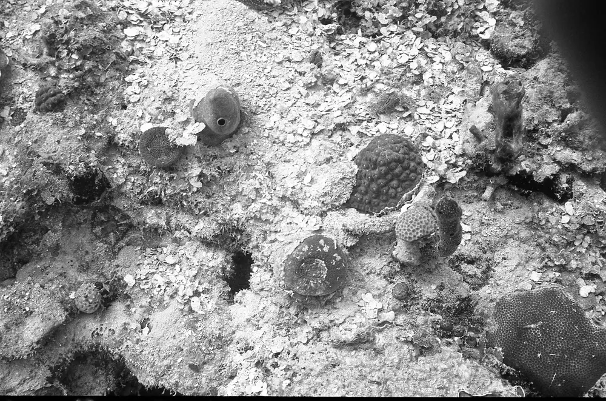{.lightbox group="discovery-bay-1966" description="**UUID: **93111c28-e1c6-433b-bca0-4110ec51d133 **Date: **1968-03-03 **Location: **Jamaica | Discovery Bay | East Mangrove Point **Longitude: **77.5037ºW **Latitude: **18.4862ºN **Photographer: **Eileen Graham **Copyright: **Trustees of the Natural History Museum (London, UK), CC-BY-4.0" alt="**UUID: **93111c28-e1c6-433b-bca0-4110ec51d133 **Date: **1968-03-03 **Location: **Jamaica | Discovery Bay | East Mangrove Point **Longitude: **77.5037ºW **Latitude: **18.4862ºN **Photographer: **Eileen Graham **Copyright: **Trustees of the Natural History Museum (London, UK), CC-BY-4.0"}

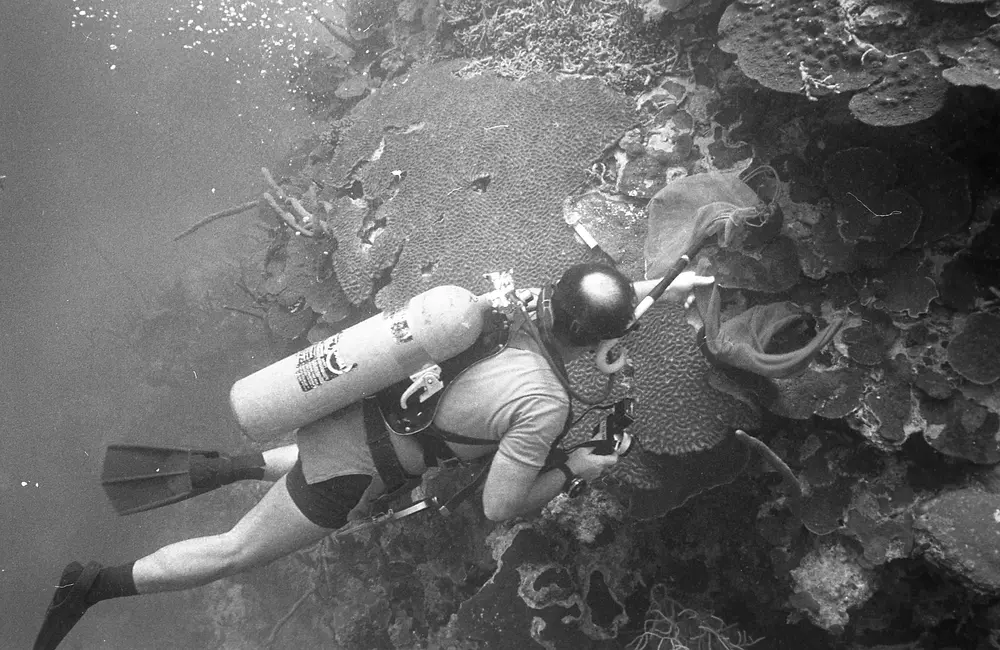{.lightbox group="discovery-bay-1966" description="**UUID: **132d6d6a-0b4c-4c75-90d6-2236c7d07393 **Date: **1968-03-03 **Location: **Jamaica | Discovery Bay | East Mangrove Point **Longitude: **77.5037ºW **Latitude: **18.4862ºN **Photographer: **Eileen Graham **Copyright: **Trustees of the Natural History Museum (London, UK), CC-BY-4.0" alt="**UUID: **132d6d6a-0b4c-4c75-90d6-2236c7d07393 **Date: **1968-03-03 **Location: **Jamaica | Discovery Bay | East Mangrove Point **Longitude: **77.5037ºW **Latitude: **18.4862ºN **Photographer: **Eileen Graham **Copyright: **Trustees of the Natural History Museum (London, UK), CC-BY-4.0"}

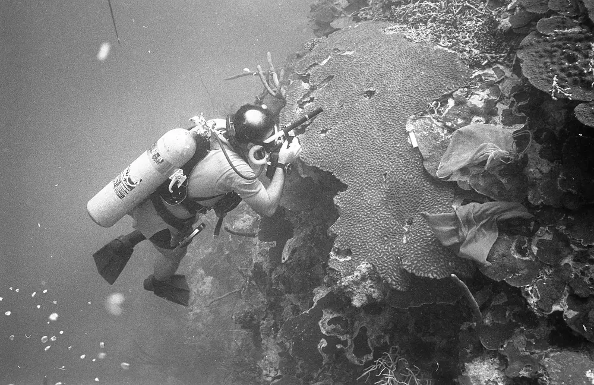{.lightbox group="discovery-bay-1966" description="**UUID: **384ffa3e-1dbc-4eae-859b-39cb20c8f21c **Date: **1968-03-03 **Location: **Jamaica | Discovery Bay | East Mangrove Point **Longitude: **77.5037ºW **Latitude: **18.4862ºN **Photographer: **Eileen Graham **Copyright: **Trustees of the Natural History Museum (London, UK), CC-BY-4.0" alt="**UUID: **384ffa3e-1dbc-4eae-859b-39cb20c8f21c **Date: **1968-03-03 **Location: **Jamaica | Discovery Bay | East Mangrove Point **Longitude: **77.5037ºW **Latitude: **18.4862ºN **Photographer: **Eileen Graham **Copyright: **Trustees of the Natural History Museum (London, UK), CC-BY-4.0"}

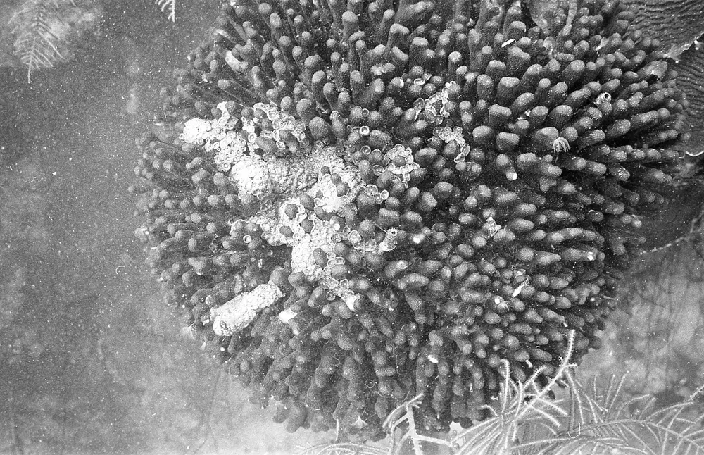{.lightbox group="discovery-bay-1966" description="**UUID: **9e601c7e-272f-497d-82d8-bc81201226ca **Date: **1968-03-03 **Location: **Jamaica | Discovery Bay | East Mangrove Point **Longitude: **77.5037ºW **Latitude: **18.4862ºN **Photographer: **Eileen Graham **Copyright: **Trustees of the Natural History Museum (London, UK), CC-BY-4.0" alt="**UUID: **9e601c7e-272f-497d-82d8-bc81201226ca **Date: **1968-03-03 **Location: **Jamaica | Discovery Bay | East Mangrove Point **Longitude: **77.5037ºW **Latitude: **18.4862ºN **Photographer: **Eileen Graham **Copyright: **Trustees of the Natural History Museum (London, UK), CC-BY-4.0"}

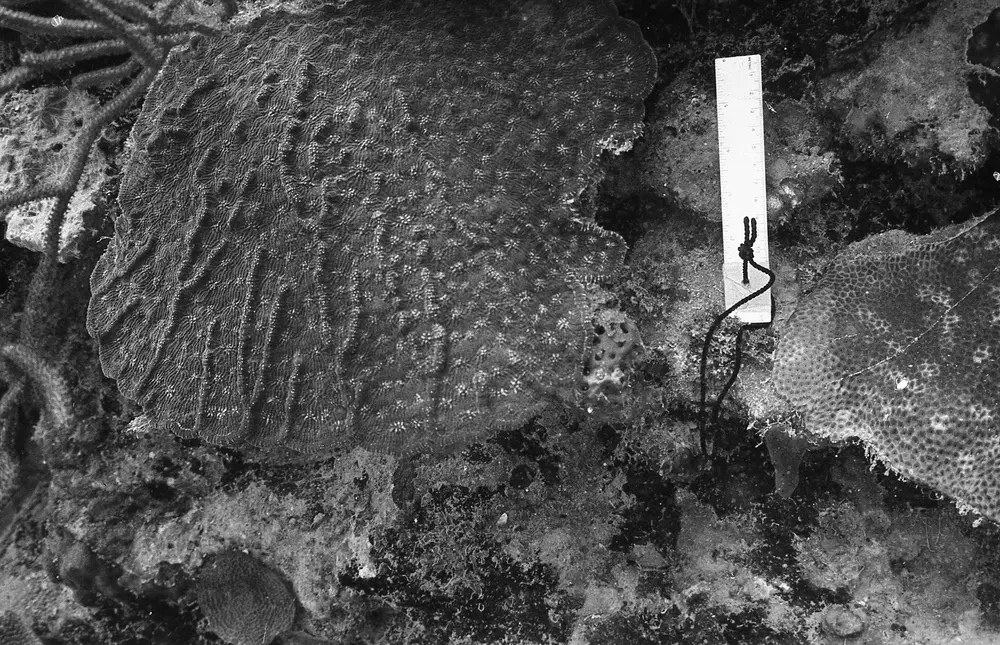{.lightbox group="discovery-bay-1966" description="**UUID: **21104bc1-5d45-41c7-98e1-0cb398ae62f5 **Date: **1968-03-03 **Location: **Jamaica | Discovery Bay | East Mangrove Point **Longitude: **77.5037ºW **Latitude: **18.4862ºN **Photographer: **Eileen Graham **Copyright: **Trustees of the Natural History Museum (London, UK), CC-BY-4.0" alt="**UUID: **21104bc1-5d45-41c7-98e1-0cb398ae62f5 **Date: **1968-03-03 **Location: **Jamaica | Discovery Bay | East Mangrove Point **Longitude: **77.5037ºW **Latitude: **18.4862ºN **Photographer: **Eileen Graham **Copyright: **Trustees of the Natural History Museum (London, UK), CC-BY-4.0"}

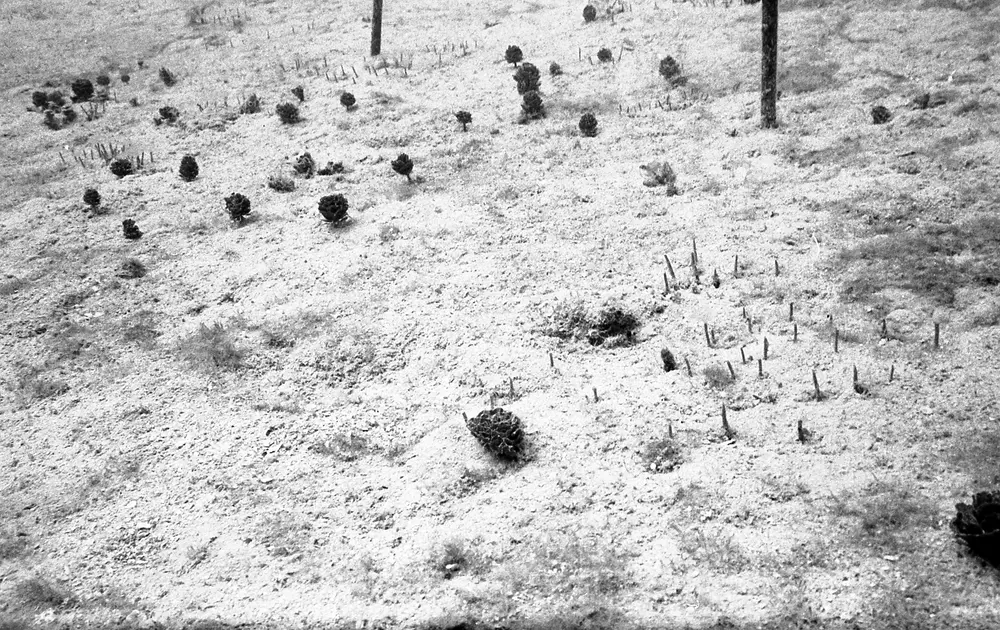{.lightbox group="discovery-bay-1966" description="**UUID: **1f85ce27-a4ab-4c1e-821c-6f1eccfc18d0 **Date: **1966-08-25 **Location: **Jamaica | Discovery Bay | Algal Plots **Longitude: **77.414ºW **Latitude: **18.473ºN **Photographer: **Eileen Graham **Copyright: **Trustees of the Natural History Museum (London, UK), CC-BY-4.0" alt="**UUID: **1f85ce27-a4ab-4c1e-821c-6f1eccfc18d0 **Date: **1966-08-25 **Location: **Jamaica | Discovery Bay | Algal Plots **Longitude: **77.414ºW **Latitude: **18.473ºN **Photographer: **Eileen Graham **Copyright: **Trustees of the Natural History Museum (London, UK), CC-BY-4.0"}

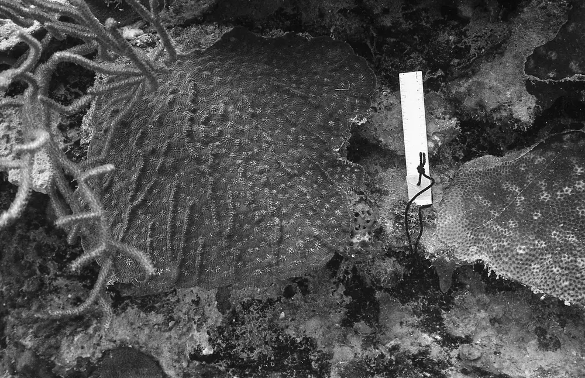{.lightbox group="discovery-bay-1966" description="**UUID: **8c30e77d-1e99-49b9-9639-061526012b9b **Date: **1968-03-03 **Location: **Jamaica | Discovery Bay | East Mangrove Point **Longitude: **77.5037ºW **Latitude: **18.4862ºN **Photographer: **Eileen Graham **Copyright: **Trustees of the Natural History Museum (London, UK), CC-BY-4.0" alt="**UUID: **8c30e77d-1e99-49b9-9639-061526012b9b **Date: **1968-03-03 **Location: **Jamaica | Discovery Bay | East Mangrove Point **Longitude: **77.5037ºW **Latitude: **18.4862ºN **Photographer: **Eileen Graham **Copyright: **Trustees of the Natural History Museum (London, UK), CC-BY-4.0"}

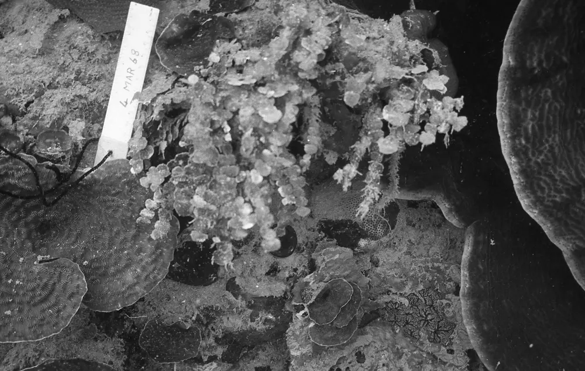{.lightbox group="discovery-bay-1966" description="**UUID: **2bafe97f-0cc9-4145-af95-8d486a1b5d03 **Date: **1968-03-03 **Location: **Jamaica | Discovery Bay | East Mangrove Point **Longitude: **77.5037ºW **Latitude: **18.4862ºN **Photographer: **Eileen Graham **Copyright: **Trustees of the Natural History Museum (London, UK), CC-BY-4.0" alt="**UUID: **2bafe97f-0cc9-4145-af95-8d486a1b5d03 **Date: **1968-03-03 **Location: **Jamaica | Discovery Bay | East Mangrove Point **Longitude: **77.5037ºW **Latitude: **18.4862ºN **Photographer: **Eileen Graham **Copyright: **Trustees of the Natural History Museum (London, UK), CC-BY-4.0"}

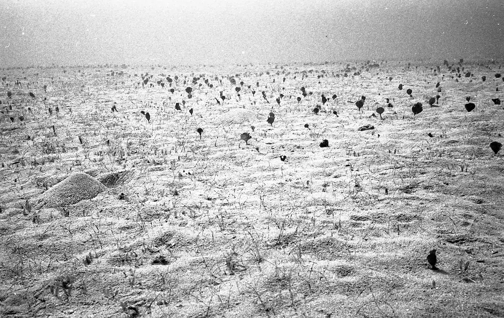{.lightbox group="discovery-bay-1966" description="**UUID: **f4ead215-06eb-4285-b26d-e3cafc762eb8 **Date: **1968-03-03 **Location: **Jamaica | Discovery Bay | East Mangrove Point **Longitude: **77.5037ºW **Latitude: **18.4862ºN **Photographer: **Eileen Graham **Copyright: **Trustees of the Natural History Museum (London, UK), CC-BY-4.0" alt="**UUID: **f4ead215-06eb-4285-b26d-e3cafc762eb8 **Date: **1968-03-03 **Location: **Jamaica | Discovery Bay | East Mangrove Point **Longitude: **77.5037ºW **Latitude: **18.4862ºN **Photographer: **Eileen Graham **Copyright: **Trustees of the Natural History Museum (London, UK), CC-BY-4.0"}

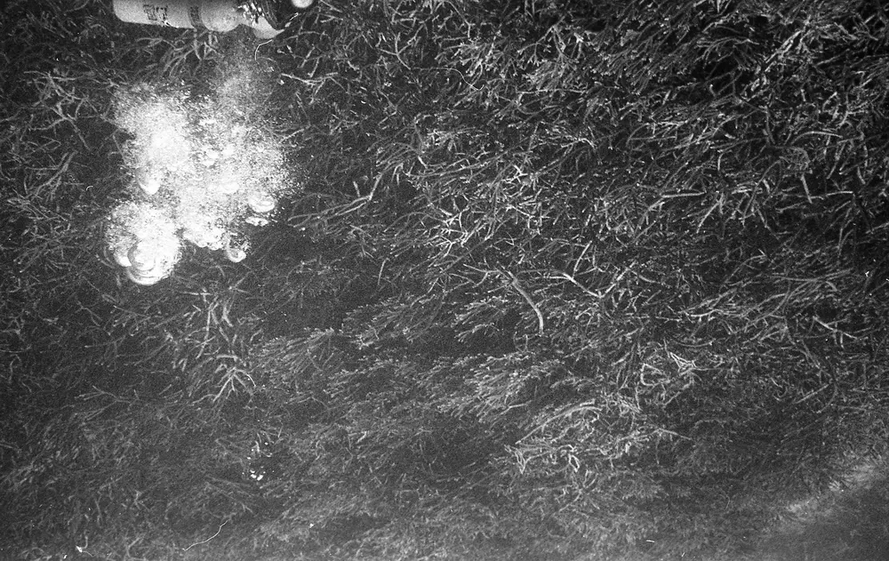{.lightbox group="discovery-bay-1966" description="**UUID: **566fd82d-9c00-486b-93ee-658f6ec3bb45 **Date: **1968-03-03 **Location: **Jamaica | Discovery Bay | East Mangrove Point **Longitude: **77.5037ºW **Latitude: **18.4862ºN **Photographer: **Eileen Graham **Copyright: **Trustees of the Natural History Museum (London, UK), CC-BY-4.0" alt="**UUID: **566fd82d-9c00-486b-93ee-658f6ec3bb45 **Date: **1968-03-03 **Location: **Jamaica | Discovery Bay | East Mangrove Point **Longitude: **77.5037ºW **Latitude: **18.4862ºN **Photographer: **Eileen Graham **Copyright: **Trustees of the Natural History Museum (London, UK), CC-BY-4.0"}

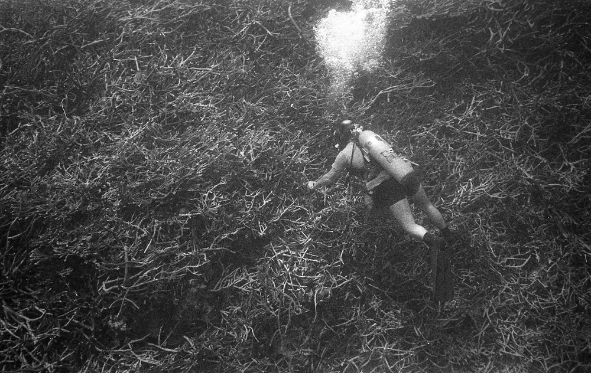{.lightbox group="discovery-bay-1966" description="**UUID: **cd62b5f7-6fc9-4e81-9455-42ae1773e689 **Date: **1968-03-03 **Location: **Jamaica | Discovery Bay | East Mangrove Point **Longitude: **77.5037ºW **Latitude: **18.4862ºN **Photographer: **Eileen Graham **Copyright: **Trustees of the Natural History Museum (London, UK), CC-BY-4.0" alt="**UUID: **cd62b5f7-6fc9-4e81-9455-42ae1773e689 **Date: **1968-03-03 **Location: **Jamaica | Discovery Bay | East Mangrove Point **Longitude: **77.5037ºW **Latitude: **18.4862ºN **Photographer: **Eileen Graham **Copyright: **Trustees of the Natural History Museum (London, UK), CC-BY-4.0"}

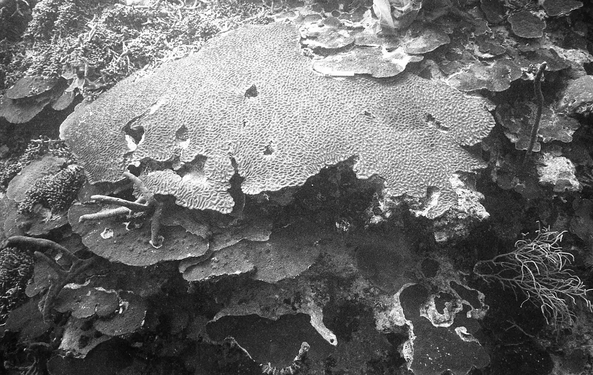{.lightbox group="discovery-bay-1966" description="**UUID: **59425385-7302-400f-9166-97ca80f2138a **Date: **1968-03-03 **Location: **Jamaica | Discovery Bay | East Mangrove Point **Longitude: **77.5037ºW **Latitude: **18.4862ºN **Photographer: **Eileen Graham **Copyright: **Trustees of the Natural History Museum (London, UK), CC-BY-4.0" alt="**UUID: **59425385-7302-400f-9166-97ca80f2138a **Date: **1968-03-03 **Location: **Jamaica | Discovery Bay | East Mangrove Point **Longitude: **77.5037ºW **Latitude: **18.4862ºN **Photographer: **Eileen Graham **Copyright: **Trustees of the Natural History Museum (London, UK), CC-BY-4.0"}

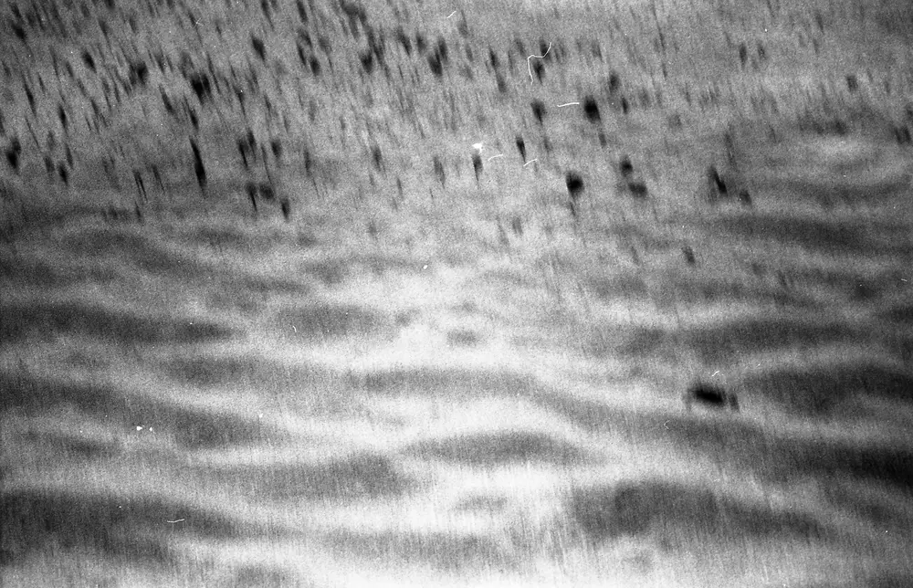{.lightbox group="discovery-bay-1966" description="**UUID: **cf0b5cc7-818a-4de5-bdd4-f5ae1c0082e7 **Date: **1968-03-03 **Location: **Jamaica | Discovery Bay | East Mangrove Point **Longitude: **77.5037ºW **Latitude: **18.4862ºN **Photographer: **Eileen Graham **Copyright: **Trustees of the Natural History Museum (London, UK), CC-BY-4.0" alt="**UUID: **cf0b5cc7-818a-4de5-bdd4-f5ae1c0082e7 **Date: **1968-03-03 **Location: **Jamaica | Discovery Bay | East Mangrove Point **Longitude: **77.5037ºW **Latitude: **18.4862ºN **Photographer: **Eileen Graham **Copyright: **Trustees of the Natural History Museum (London, UK), CC-BY-4.0"}

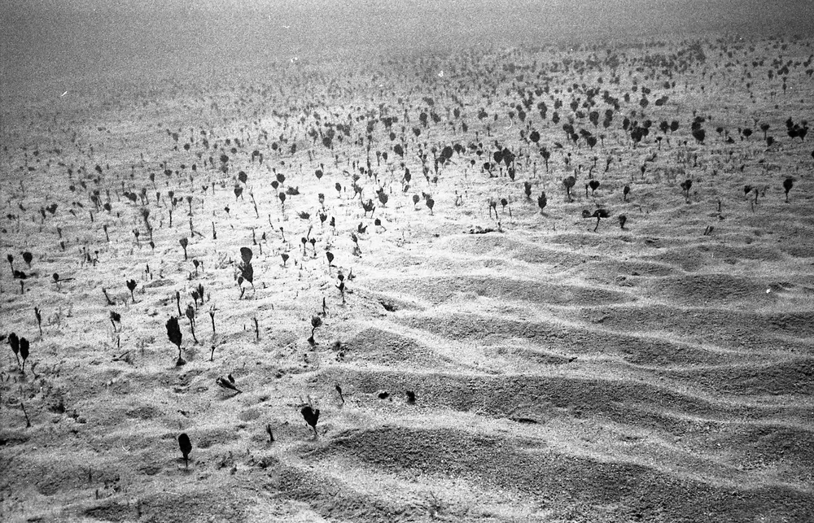{.lightbox group="discovery-bay-1966" description="**UUID: **82321769-cabd-4984-ba2f-362badfa25fe **Date: **1968-03-03 **Location: **Jamaica | Discovery Bay | East Mangrove Point **Longitude: **77.5037ºW **Latitude: **18.4862ºN **Photographer: **Eileen Graham **Copyright: **Trustees of the Natural History Museum (London, UK), CC-BY-4.0" alt="**UUID: **82321769-cabd-4984-ba2f-362badfa25fe **Date: **1968-03-03 **Location: **Jamaica | Discovery Bay | East Mangrove Point **Longitude: **77.5037ºW **Latitude: **18.4862ºN **Photographer: **Eileen Graham **Copyright: **Trustees of the Natural History Museum (London, UK), CC-BY-4.0"}

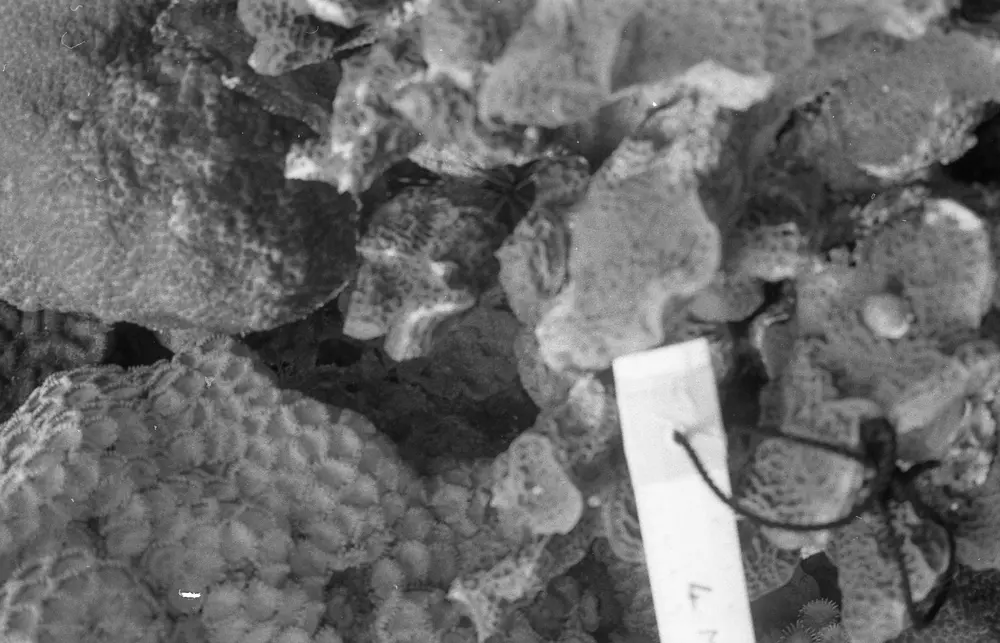{.lightbox group="discovery-bay-1966" description="**UUID: **4ffa434d-12a3-45ea-af85-07441b3a1e7e **Date: **1968-03-03 **Location: **Jamaica | Discovery Bay | East Mangrove Point **Longitude: **77.5037ºW **Latitude: **18.4862ºN **Photographer: **Eileen Graham **Copyright: **Trustees of the Natural History Museum (London, UK), CC-BY-4.0" alt="**UUID: **4ffa434d-12a3-45ea-af85-07441b3a1e7e **Date: **1968-03-03 **Location: **Jamaica | Discovery Bay | East Mangrove Point **Longitude: **77.5037ºW **Latitude: **18.4862ºN **Photographer: **Eileen Graham **Copyright: **Trustees of the Natural History Museum (London, UK), CC-BY-4.0"}

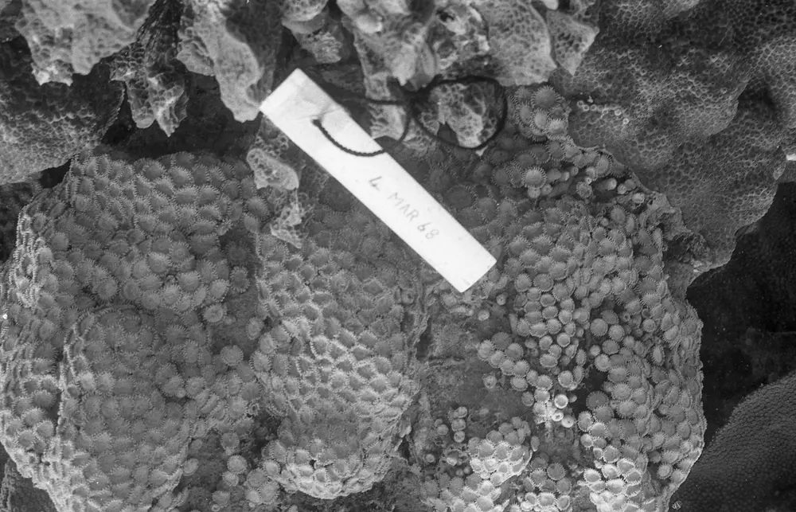{.lightbox group="discovery-bay-1966" description="**UUID: **519c983a-aea4-4c18-a62a-d695d7cc9b27 **Date: **1968-03-03 **Location: **Jamaica | Discovery Bay | East Mangrove Point **Longitude: **77.5037ºW **Latitude: **18.4862ºN **Photographer: **Eileen Graham **Copyright: **Trustees of the Natural History Museum (London, UK), CC-BY-4.0" alt="**UUID: **519c983a-aea4-4c18-a62a-d695d7cc9b27 **Date: **1968-03-03 **Location: **Jamaica | Discovery Bay | East Mangrove Point **Longitude: **77.5037ºW **Latitude: **18.4862ºN **Photographer: **Eileen Graham **Copyright: **Trustees of the Natural History Museum (London, UK), CC-BY-4.0"}

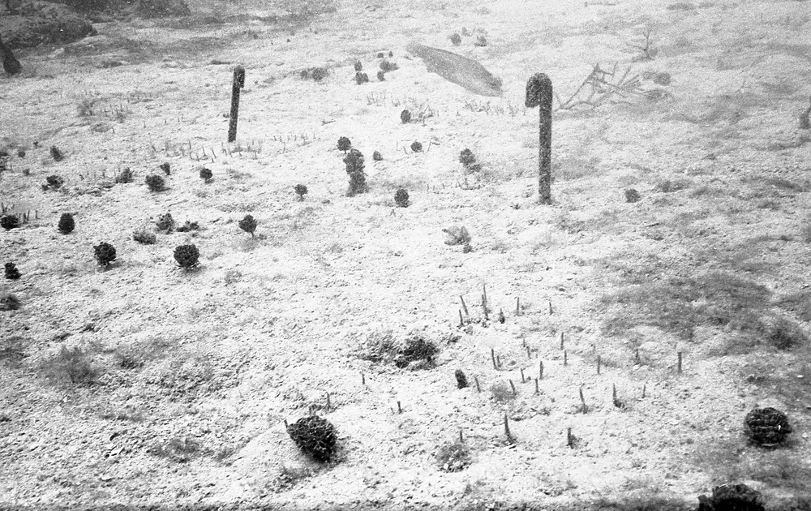{.lightbox group="discovery-bay-1966" description="**UUID: **6db8529d-bc01-4e2d-90c3-e9962b6cdcd4 **Date: **1966-08-25 **Location: **Jamaica | Discovery Bay | Algal Plots **Longitude: **77.414ºW **Latitude: **18.473ºN **Photographer: **Eileen Graham **Copyright: **Trustees of the Natural History Museum (London, UK), CC-BY-4.0" alt="**UUID: **6db8529d-bc01-4e2d-90c3-e9962b6cdcd4 **Date: **1966-08-25 **Location: **Jamaica | Discovery Bay | Algal Plots **Longitude: **77.414ºW **Latitude: **18.473ºN **Photographer: **Eileen Graham **Copyright: **Trustees of the Natural History Museum (London, UK), CC-BY-4.0"}

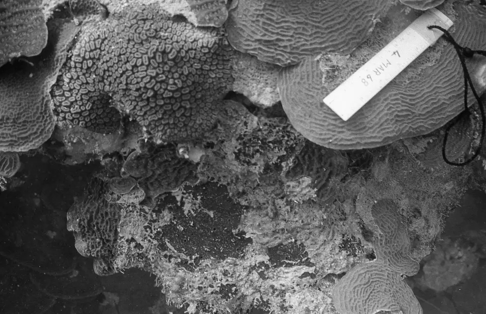{.lightbox group="discovery-bay-1966" description="**UUID: **6a9affa0-4144-4ec7-a322-d4a5bd4a1c3e **Date: **1968-03-03 **Location: **Jamaica | Discovery Bay | East Mangrove Point **Longitude: **77.5037ºW **Latitude: **18.4862ºN **Photographer: **Eileen Graham **Copyright: **Trustees of the Natural History Museum (London, UK), CC-BY-4.0" alt="**UUID: **6a9affa0-4144-4ec7-a322-d4a5bd4a1c3e **Date: **1968-03-03 **Location: **Jamaica | Discovery Bay | East Mangrove Point **Longitude: **77.5037ºW **Latitude: **18.4862ºN **Photographer: **Eileen Graham **Copyright: **Trustees of the Natural History Museum (London, UK), CC-BY-4.0"}

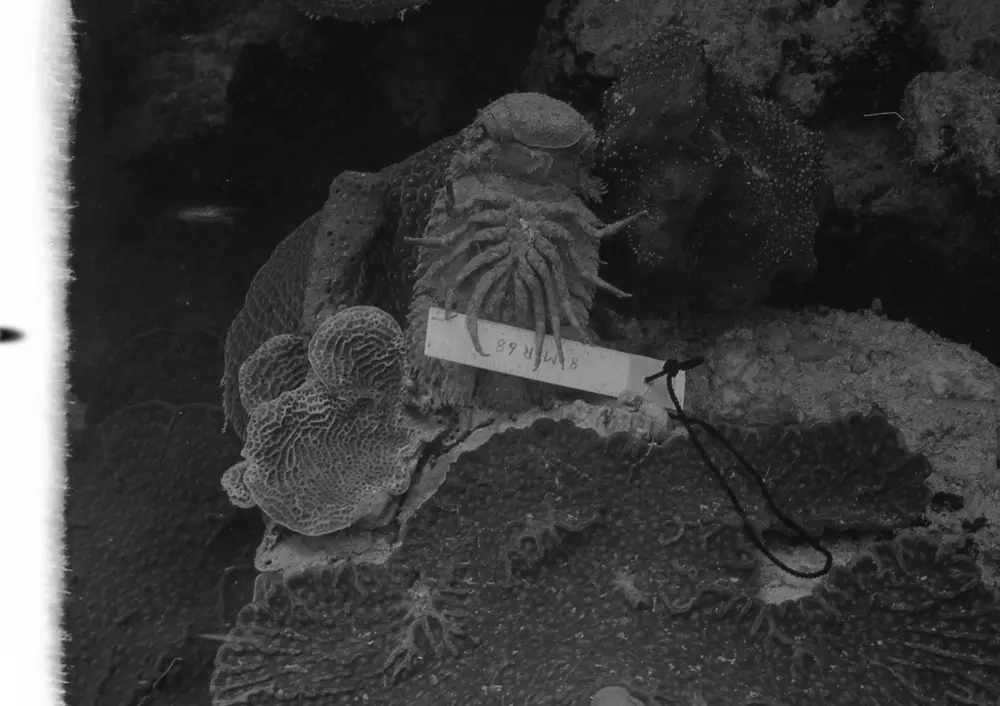{.lightbox group="discovery-bay-1966" description="**UUID: **cbbf7753-1d3e-4f78-b8c2-192df6ccfc81 **Date: **1968-08-03 **Location: **Jamaica | Discovery Bay | Pear Tree Bottom **Longitude: **77.35867ºW **Latitude: **18.4635ºN **Photographer: **Eileen Graham **Copyright: **Trustees of the Natural History Museum (London, UK), CC-BY-4.0" alt="**UUID: **cbbf7753-1d3e-4f78-b8c2-192df6ccfc81 **Date: **1968-08-03 **Location: **Jamaica | Discovery Bay | Pear Tree Bottom **Longitude: **77.35867ºW **Latitude: **18.4635ºN **Photographer: **Eileen Graham **Copyright: **Trustees of the Natural History Museum (London, UK), CC-BY-4.0"}

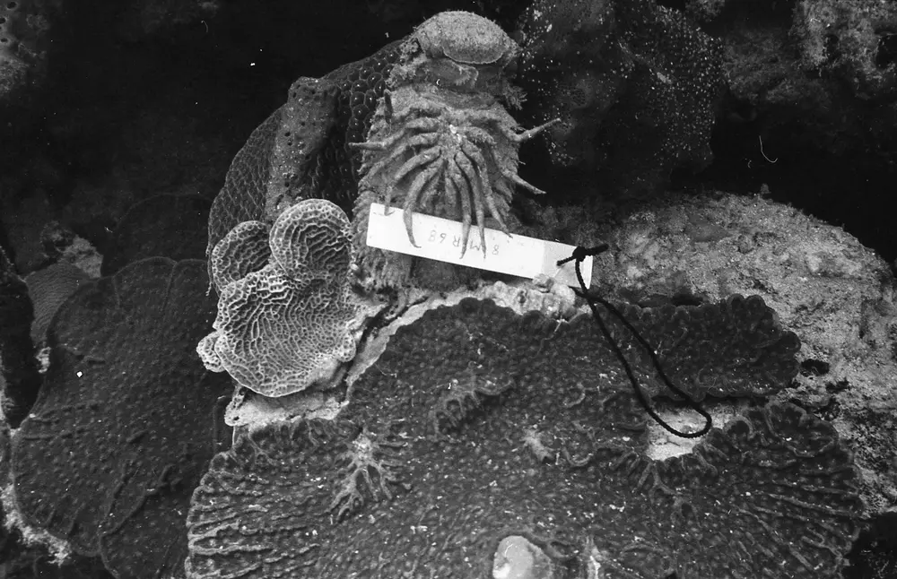{.lightbox group="discovery-bay-1966" description="**UUID: **d7b7c2a9-2443-4b0f-aa3c-ac5086c58ef1 **Date: **1968-08-03 **Location: **Jamaica | Discovery Bay | Pear Tree Bottom **Longitude: **77.35867ºW **Latitude: **18.4635ºN **Photographer: **Eileen Graham **Copyright: **Trustees of the Natural History Museum (London, UK), CC-BY-4.0" alt="**UUID: **d7b7c2a9-2443-4b0f-aa3c-ac5086c58ef1 **Date: **1968-08-03 **Location: **Jamaica | Discovery Bay | Pear Tree Bottom **Longitude: **77.35867ºW **Latitude: **18.4635ºN **Photographer: **Eileen Graham **Copyright: **Trustees of the Natural History Museum (London, UK), CC-BY-4.0"}

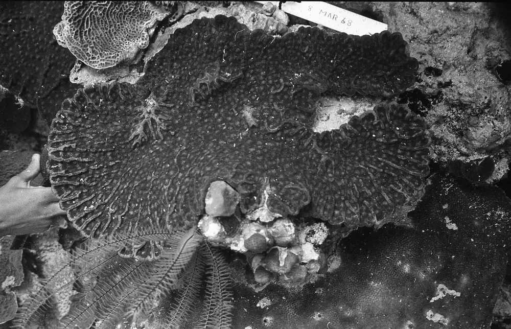{.lightbox group="discovery-bay-1966" description="**UUID: **682cc0f1-0926-4cf7-bbe0-2925a08eeb09 **Date: **1968-08-03 **Location: **Jamaica | Discovery Bay | Pear Tree Bottom **Longitude: **77.35867ºW **Latitude: **18.4635ºN **Photographer: **Eileen Graham **Copyright: **Trustees of the Natural History Museum (London, UK), CC-BY-4.0" alt="**UUID: **682cc0f1-0926-4cf7-bbe0-2925a08eeb09 **Date: **1968-08-03 **Location: **Jamaica | Discovery Bay | Pear Tree Bottom **Longitude: **77.35867ºW **Latitude: **18.4635ºN **Photographer: **Eileen Graham **Copyright: **Trustees of the Natural History Museum (London, UK), CC-BY-4.0"}

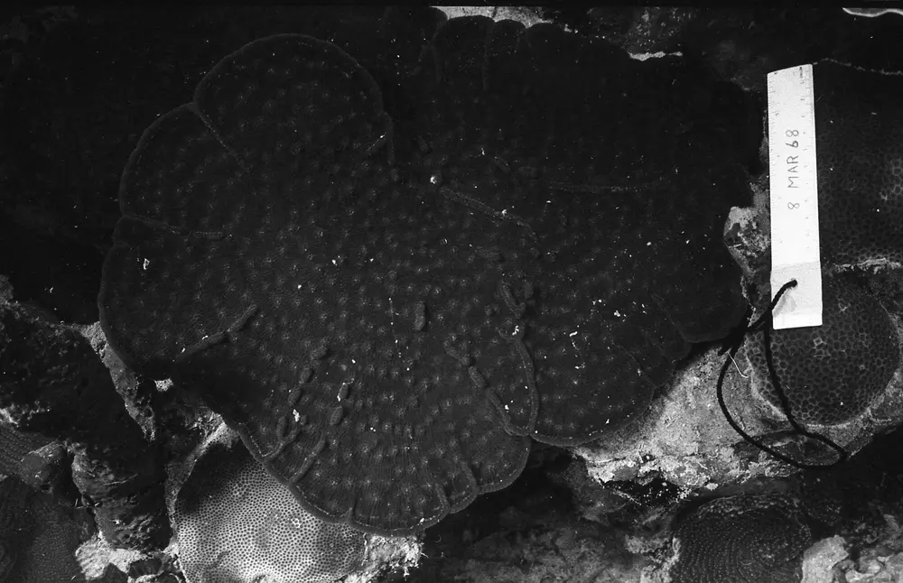{.lightbox group="discovery-bay-1966" description="**UUID: **46adb608-c515-4634-af6e-fe0170593d86 **Date: **1968-08-03 **Location: **Jamaica | Discovery Bay | Pear Tree Bottom **Longitude: **77.35867ºW **Latitude: **18.4635ºN **Photographer: **Eileen Graham **Copyright: **Trustees of the Natural History Museum (London, UK), CC-BY-4.0" alt="**UUID: **46adb608-c515-4634-af6e-fe0170593d86 **Date: **1968-08-03 **Location: **Jamaica | Discovery Bay | Pear Tree Bottom **Longitude: **77.35867ºW **Latitude: **18.4635ºN **Photographer: **Eileen Graham **Copyright: **Trustees of the Natural History Museum (London, UK), CC-BY-4.0"}

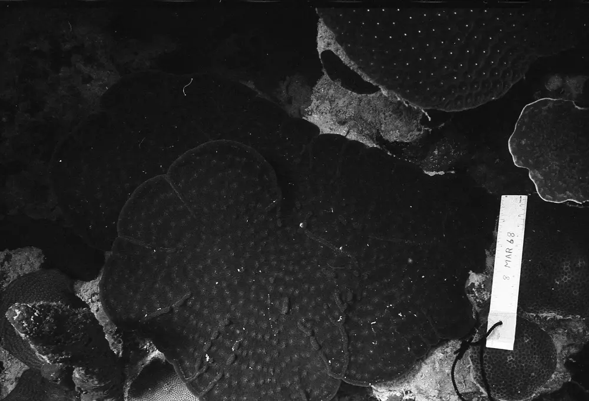{.lightbox group="discovery-bay-1966" description="**UUID: **89327416-aa95-4425-81b1-e7d2e943bf68 **Date: **1968-08-03 **Location: **Jamaica | Discovery Bay | Pear Tree Bottom **Longitude: **77.35867ºW **Latitude: **18.4635ºN **Photographer: **Eileen Graham **Copyright: **Trustees of the Natural History Museum (London, UK), CC-BY-4.0" alt="**UUID: **89327416-aa95-4425-81b1-e7d2e943bf68 **Date: **1968-08-03 **Location: **Jamaica | Discovery Bay | Pear Tree Bottom **Longitude: **77.35867ºW **Latitude: **18.4635ºN **Photographer: **Eileen Graham **Copyright: **Trustees of the Natural History Museum (London, UK), CC-BY-4.0"}

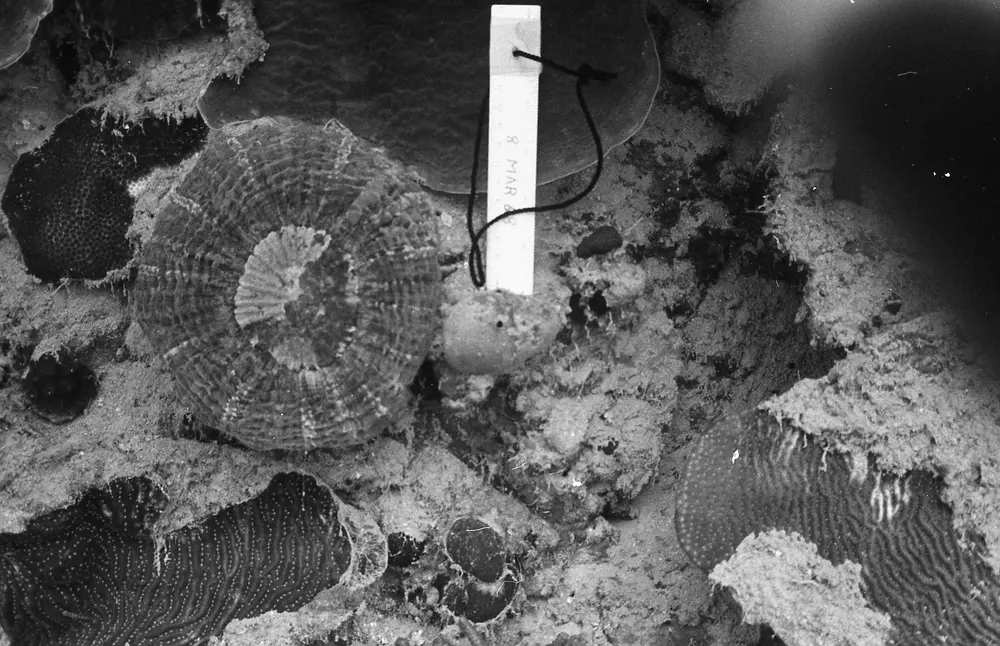{.lightbox group="discovery-bay-1966" description="**UUID: **534e4a01-beab-42ad-af36-4e733faecd01 **Date: **1968-08-03 **Location: **Jamaica | Discovery Bay | Pear Tree Bottom **Longitude: **77.35867ºW **Latitude: **18.4635ºN **Photographer: **Eileen Graham **Copyright: **Trustees of the Natural History Museum (London, UK), CC-BY-4.0" alt="**UUID: **534e4a01-beab-42ad-af36-4e733faecd01 **Date: **1968-08-03 **Location: **Jamaica | Discovery Bay | Pear Tree Bottom **Longitude: **77.35867ºW **Latitude: **18.4635ºN **Photographer: **Eileen Graham **Copyright: **Trustees of the Natural History Museum (London, UK), CC-BY-4.0"}

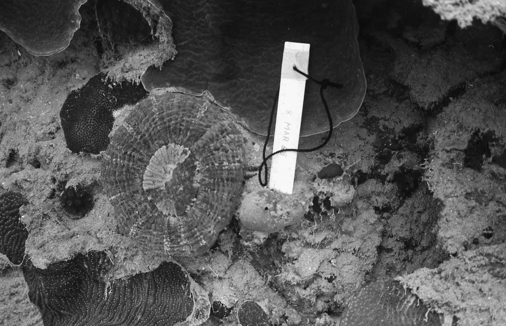{.lightbox group="discovery-bay-1966" description="**UUID: **640e2d26-3c49-4489-b96e-81d6bc755e31 **Date: **1968-08-03 **Location: **Jamaica | Discovery Bay | Pear Tree Bottom **Longitude: **77.35867ºW **Latitude: **18.4635ºN **Photographer: **Eileen Graham **Copyright: **Trustees of the Natural History Museum (London, UK), CC-BY-4.0" alt="**UUID: **640e2d26-3c49-4489-b96e-81d6bc755e31 **Date: **1968-08-03 **Location: **Jamaica | Discovery Bay | Pear Tree Bottom **Longitude: **77.35867ºW **Latitude: **18.4635ºN **Photographer: **Eileen Graham **Copyright: **Trustees of the Natural History Museum (London, UK), CC-BY-4.0"}

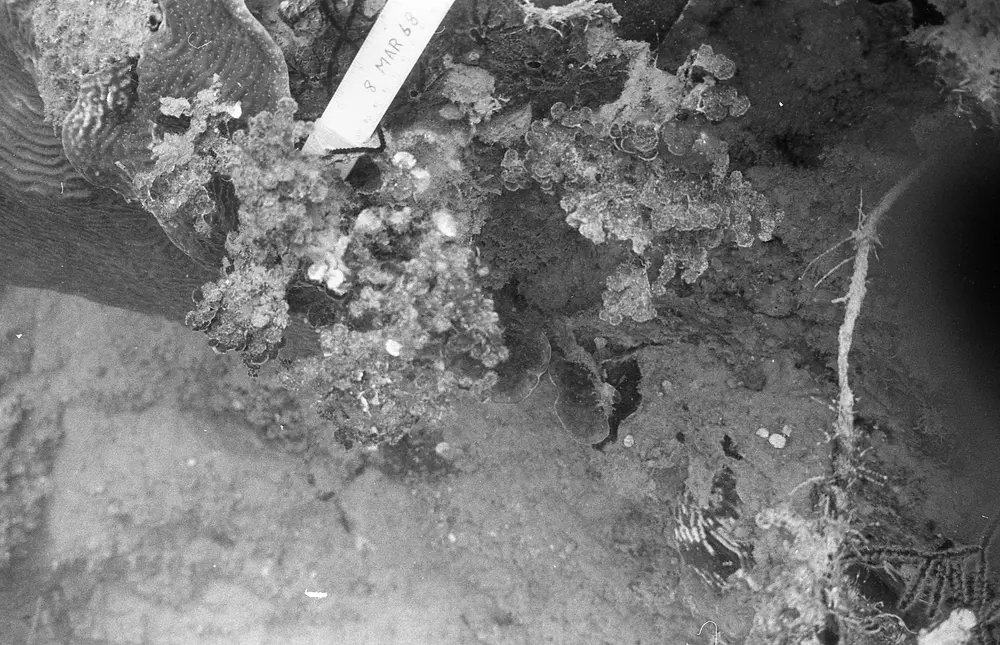{.lightbox group="discovery-bay-1966" description="**UUID: **3a7dd1c3-ad9d-451b-b551-896d9b29c99d **Date: **1968-08-03 **Location: **Jamaica | Discovery Bay | Pear Tree Bottom **Longitude: **77.35867ºW **Latitude: **18.4635ºN **Photographer: **Eileen Graham **Copyright: **Trustees of the Natural History Museum (London, UK), CC-BY-4.0" alt="**UUID: **3a7dd1c3-ad9d-451b-b551-896d9b29c99d **Date: **1968-08-03 **Location: **Jamaica | Discovery Bay | Pear Tree Bottom **Longitude: **77.35867ºW **Latitude: **18.4635ºN **Photographer: **Eileen Graham **Copyright: **Trustees of the Natural History Museum (London, UK), CC-BY-4.0"}

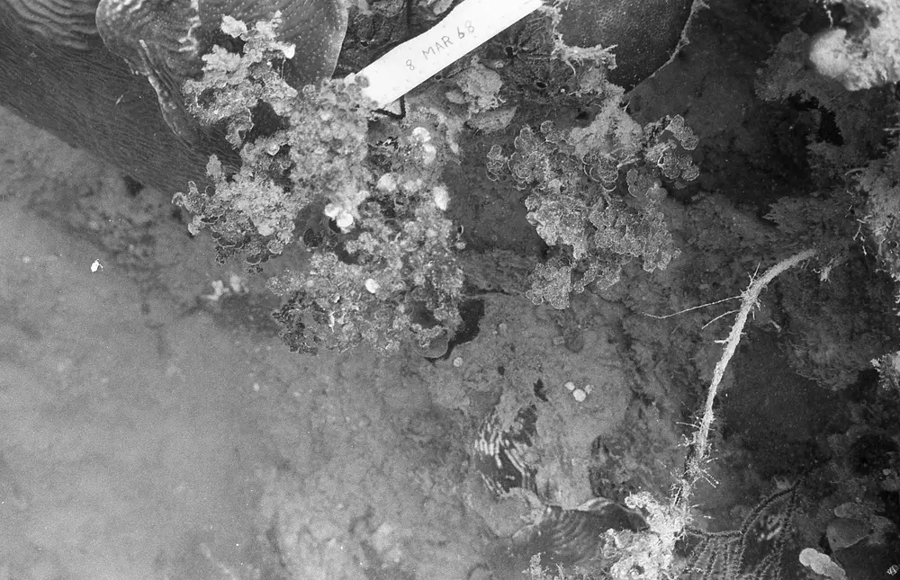{.lightbox group="discovery-bay-1966" description="**UUID: **b36810dd-4986-4860-b006-62c0f2ae8e1e **Date: **1968-08-03 **Location: **Jamaica | Discovery Bay | Pear Tree Bottom **Longitude: **77.35867ºW **Latitude: **18.4635ºN **Photographer: **Eileen Graham **Copyright: **Trustees of the Natural History Museum (London, UK), CC-BY-4.0" alt="**UUID: **b36810dd-4986-4860-b006-62c0f2ae8e1e **Date: **1968-08-03 **Location: **Jamaica | Discovery Bay | Pear Tree Bottom **Longitude: **77.35867ºW **Latitude: **18.4635ºN **Photographer: **Eileen Graham **Copyright: **Trustees of the Natural History Museum (London, UK), CC-BY-4.0"}

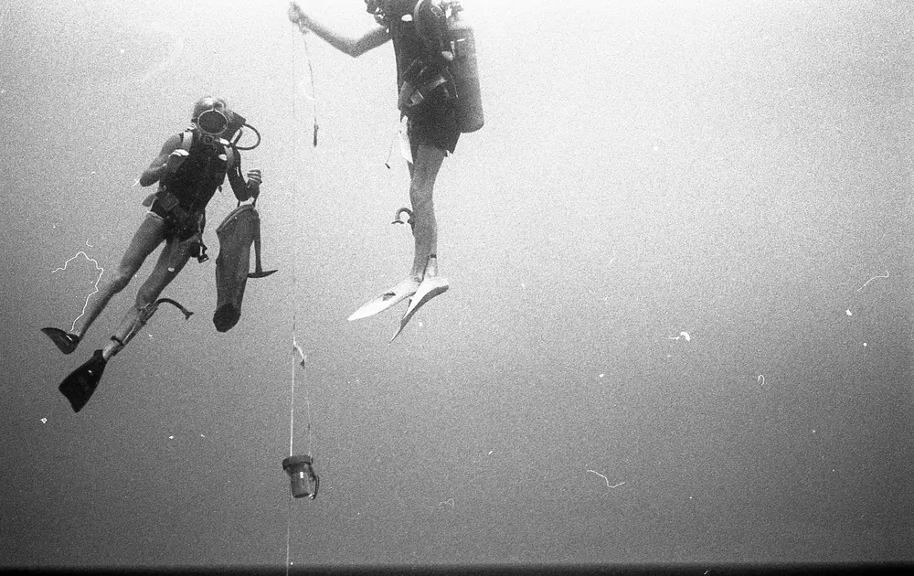{.lightbox group="discovery-bay-1966" description="**UUID: **02c048fd-8641-45ae-aac8-18d30fc58d83 **Date: **1966-08-25 **Location: **Jamaica | Discovery Bay | Buoy Mooring (1960s) **Longitude: **77.40908ºW **Latitude: **18.47322ºN **Photographer: **Eileen Graham **Copyright: **Trustees of the Natural History Museum (London, UK), CC-BY-4.0" alt="**UUID: **02c048fd-8641-45ae-aac8-18d30fc58d83 **Date: **1966-08-25 **Location: **Jamaica | Discovery Bay | Buoy Mooring (1960s) **Longitude: **77.40908ºW **Latitude: **18.47322ºN **Photographer: **Eileen Graham **Copyright: **Trustees of the Natural History Museum (London, UK), CC-BY-4.0"}

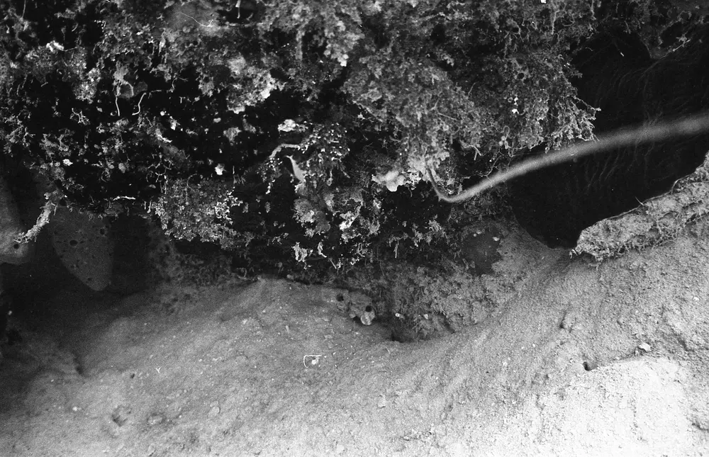{.lightbox group="discovery-bay-1966" description="**UUID: **2561d238-9978-4c65-9dd1-1cc9cbaf9990 **Date: **1968-08-03 **Location: **Jamaica | Discovery Bay | Pear Tree Bottom **Longitude: **77.35867ºW **Latitude: **18.4635ºN **Photographer: **Eileen Graham **Copyright: **Trustees of the Natural History Museum (London, UK), CC-BY-4.0" alt="**UUID: **2561d238-9978-4c65-9dd1-1cc9cbaf9990 **Date: **1968-08-03 **Location: **Jamaica | Discovery Bay | Pear Tree Bottom **Longitude: **77.35867ºW **Latitude: **18.4635ºN **Photographer: **Eileen Graham **Copyright: **Trustees of the Natural History Museum (London, UK), CC-BY-4.0"}

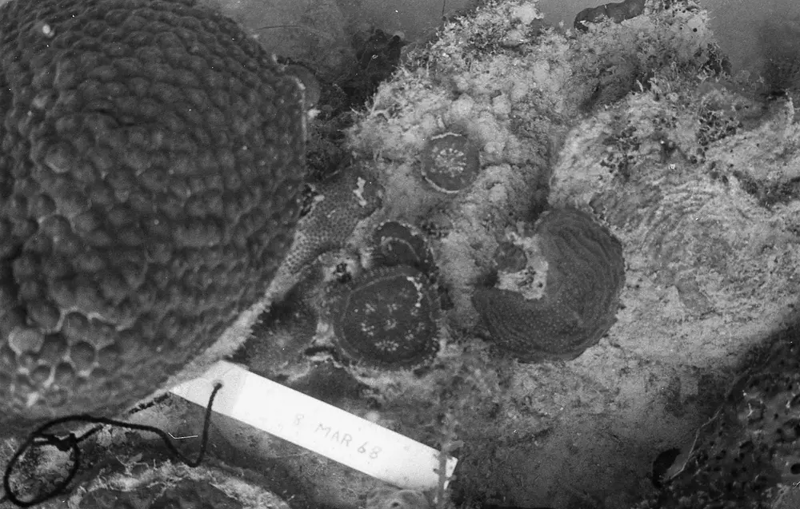{.lightbox group="discovery-bay-1966" description="**UUID: **2d9ccffe-5396-4363-b4a4-617ff6977869 **Date: **1968-08-03 **Location: **Jamaica | Discovery Bay | Pear Tree Bottom **Longitude: **77.35867ºW **Latitude: **18.4635ºN **Photographer: **Eileen Graham **Copyright: **Trustees of the Natural History Museum (London, UK), CC-BY-4.0" alt="**UUID: **2d9ccffe-5396-4363-b4a4-617ff6977869 **Date: **1968-08-03 **Location: **Jamaica | Discovery Bay | Pear Tree Bottom **Longitude: **77.35867ºW **Latitude: **18.4635ºN **Photographer: **Eileen Graham **Copyright: **Trustees of the Natural History Museum (London, UK), CC-BY-4.0"}

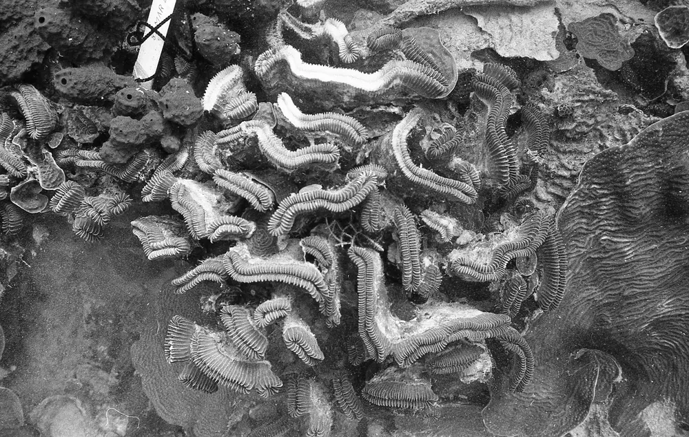{.lightbox group="discovery-bay-1966" description="**UUID: **a2ce082d-0001-48eb-90eb-3030df270025 **Date: **1968-08-03 **Location: **Jamaica | Discovery Bay | Pear Tree Bottom **Longitude: **77.35867ºW **Latitude: **18.4635ºN **Photographer: **Eileen Graham **Copyright: **Trustees of the Natural History Museum (London, UK), CC-BY-4.0" alt="**UUID: **a2ce082d-0001-48eb-90eb-3030df270025 **Date: **1968-08-03 **Location: **Jamaica | Discovery Bay | Pear Tree Bottom **Longitude: **77.35867ºW **Latitude: **18.4635ºN **Photographer: **Eileen Graham **Copyright: **Trustees of the Natural History Museum (London, UK), CC-BY-4.0"}

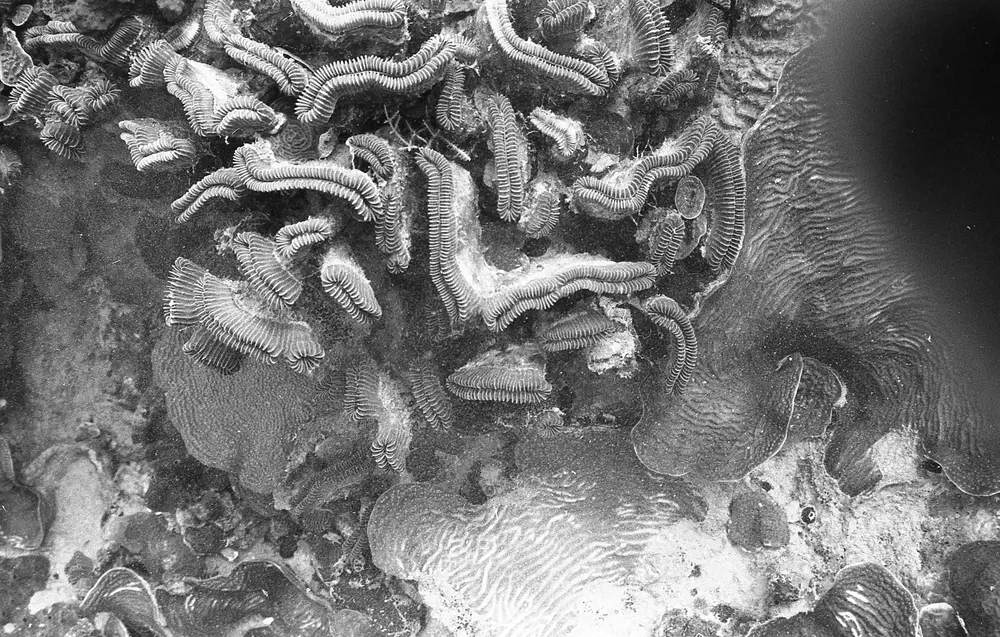{.lightbox group="discovery-bay-1966" description="**UUID: **733f2bf8-e215-45b8-99d3-86cde0f5dcdf **Date: **1968-08-03 **Location: **Jamaica | Discovery Bay | Pear Tree Bottom **Longitude: **77.35867ºW **Latitude: **18.4635ºN **Photographer: **Eileen Graham **Copyright: **Trustees of the Natural History Museum (London, UK), CC-BY-4.0" alt="**UUID: **733f2bf8-e215-45b8-99d3-86cde0f5dcdf **Date: **1968-08-03 **Location: **Jamaica | Discovery Bay | Pear Tree Bottom **Longitude: **77.35867ºW **Latitude: **18.4635ºN **Photographer: **Eileen Graham **Copyright: **Trustees of the Natural History Museum (London, UK), CC-BY-4.0"}

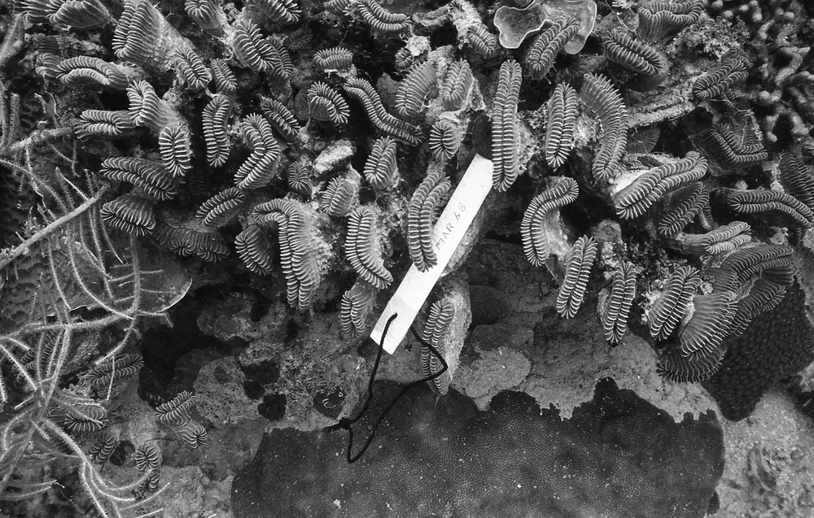{.lightbox group="discovery-bay-1966" description="**UUID: **8287e368-9e0f-48d9-8549-cdb8a6a2b469 **Date: **1968-08-03 **Location: **Jamaica | Discovery Bay | Pear Tree Bottom **Longitude: **77.35867ºW **Latitude: **18.4635ºN **Photographer: **Eileen Graham **Copyright: **Trustees of the Natural History Museum (London, UK), CC-BY-4.0" alt="**UUID: **8287e368-9e0f-48d9-8549-cdb8a6a2b469 **Date: **1968-08-03 **Location: **Jamaica | Discovery Bay | Pear Tree Bottom **Longitude: **77.35867ºW **Latitude: **18.4635ºN **Photographer: **Eileen Graham **Copyright: **Trustees of the Natural History Museum (London, UK), CC-BY-4.0"}

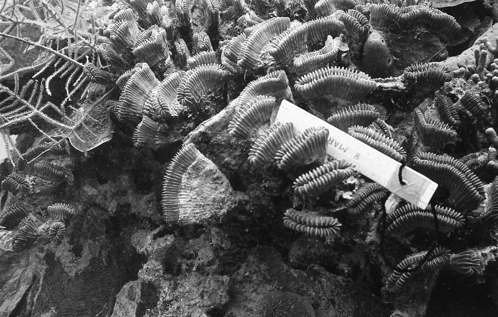{.lightbox group="discovery-bay-1966" description="**UUID: **9e11823c-9dcd-4c40-a55d-c86d3ad7b428 **Date: **1968-08-03 **Location: **Jamaica | Discovery Bay | Pear Tree Bottom **Longitude: **77.35867ºW **Latitude: **18.4635ºN **Photographer: **Eileen Graham **Copyright: **Trustees of the Natural History Museum (London, UK), CC-BY-4.0" alt="**UUID: **9e11823c-9dcd-4c40-a55d-c86d3ad7b428 **Date: **1968-08-03 **Location: **Jamaica | Discovery Bay | Pear Tree Bottom **Longitude: **77.35867ºW **Latitude: **18.4635ºN **Photographer: **Eileen Graham **Copyright: **Trustees of the Natural History Museum (London, UK), CC-BY-4.0"}

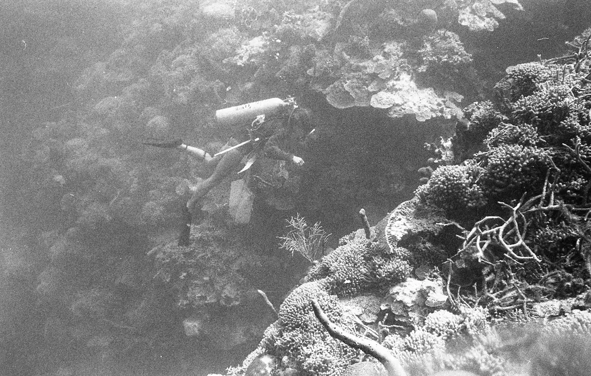{.lightbox group="discovery-bay-1966" description="**UUID: **dc28aac8-c349-41fa-8a62-0761906bd83f **Date: **1968-08-03 **Location: **Jamaica | Discovery Bay | Pear Tree Bottom **Longitude: **77.35867ºW **Latitude: **18.4635ºN **Photographer: **Eileen Graham **Copyright: **Trustees of the Natural History Museum (London, UK), CC-BY-4.0" alt="**UUID: **dc28aac8-c349-41fa-8a62-0761906bd83f **Date: **1968-08-03 **Location: **Jamaica | Discovery Bay | Pear Tree Bottom **Longitude: **77.35867ºW **Latitude: **18.4635ºN **Photographer: **Eileen Graham **Copyright: **Trustees of the Natural History Museum (London, UK), CC-BY-4.0"}

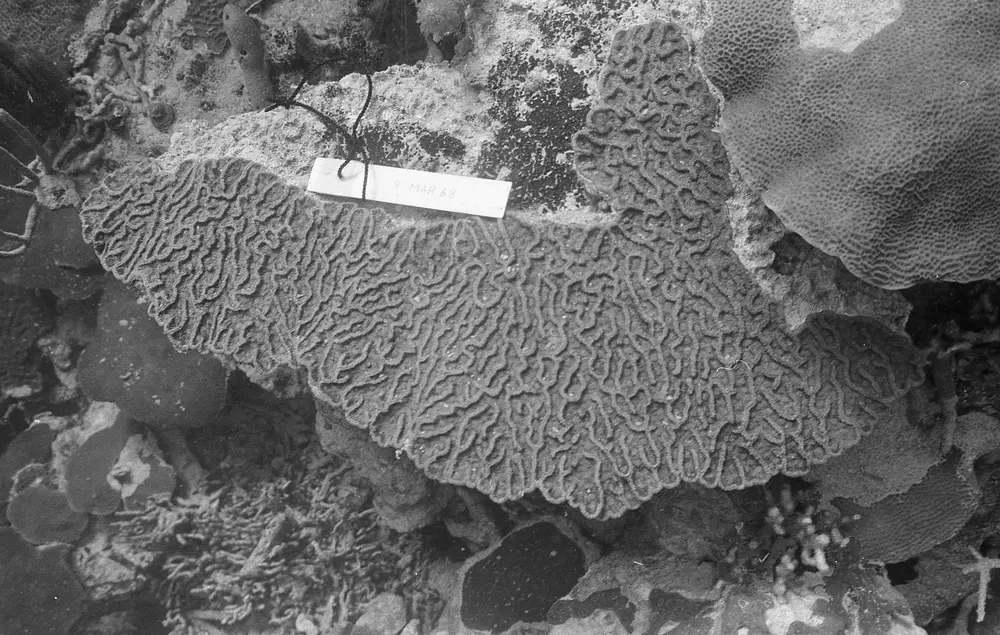{.lightbox group="discovery-bay-1966" description="**UUID: **ab5c0dbe-70a4-4573-9d50-5e4303976602 **Date: **1968-08-03 **Location: **Jamaica | Discovery Bay | Pear Tree Bottom **Longitude: **77.35867ºW **Latitude: **18.4635ºN **Photographer: **Eileen Graham **Copyright: **Trustees of the Natural History Museum (London, UK), CC-BY-4.0" alt="**UUID: **ab5c0dbe-70a4-4573-9d50-5e4303976602 **Date: **1968-08-03 **Location: **Jamaica | Discovery Bay | Pear Tree Bottom **Longitude: **77.35867ºW **Latitude: **18.4635ºN **Photographer: **Eileen Graham **Copyright: **Trustees of the Natural History Museum (London, UK), CC-BY-4.0"}

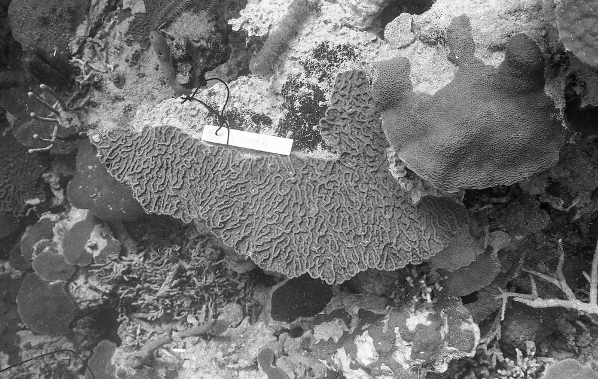{.lightbox group="discovery-bay-1966" description="**UUID: **37cb26dc-b2f0-4821-9543-ec27347a51a5 **Date: **1968-08-03 **Location: **Jamaica | Discovery Bay | Pear Tree Bottom **Longitude: **77.35867ºW **Latitude: **18.4635ºN **Photographer: **Eileen Graham **Copyright: **Trustees of the Natural History Museum (London, UK), CC-BY-4.0" alt="**UUID: **37cb26dc-b2f0-4821-9543-ec27347a51a5 **Date: **1968-08-03 **Location: **Jamaica | Discovery Bay | Pear Tree Bottom **Longitude: **77.35867ºW **Latitude: **18.4635ºN **Photographer: **Eileen Graham **Copyright: **Trustees of the Natural History Museum (London, UK), CC-BY-4.0"}

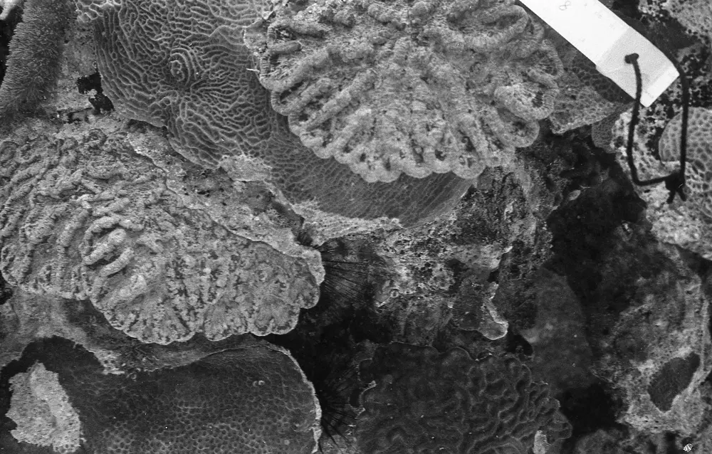{.lightbox group="discovery-bay-1966" description="**UUID: **88c7a8cc-7da4-40cc-ab51-cacef94e09e0 **Date: **1968-08-03 **Location: **Jamaica | Discovery Bay | Pear Tree Bottom **Longitude: **77.35867ºW **Latitude: **18.4635ºN **Photographer: **Eileen Graham **Copyright: **Trustees of the Natural History Museum (London, UK), CC-BY-4.0" alt="**UUID: **88c7a8cc-7da4-40cc-ab51-cacef94e09e0 **Date: **1968-08-03 **Location: **Jamaica | Discovery Bay | Pear Tree Bottom **Longitude: **77.35867ºW **Latitude: **18.4635ºN **Photographer: **Eileen Graham **Copyright: **Trustees of the Natural History Museum (London, UK), CC-BY-4.0"}

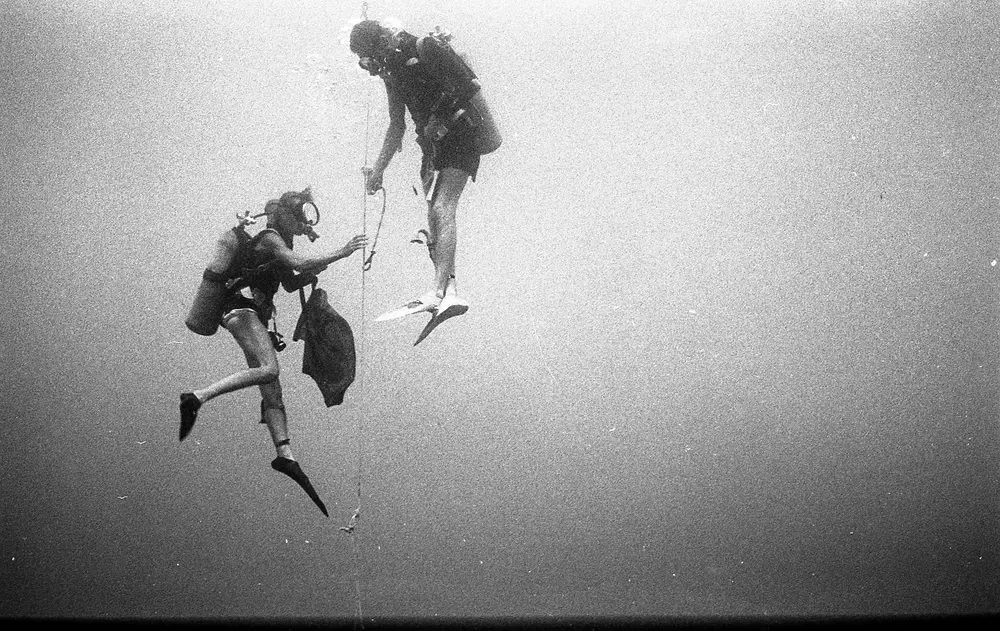{.lightbox group="discovery-bay-1966" description="**UUID: **739ef5cb-109a-420e-8020-82788bd3f4ff **Date: **1966-08-25 **Location: **Jamaica | Discovery Bay | Buoy Mooring (1960s) **Longitude: **77.40908ºW **Latitude: **18.47322ºN **Photographer: **Eileen Graham **Copyright: **Trustees of the Natural History Museum (London, UK), CC-BY-4.0" alt="**UUID: **739ef5cb-109a-420e-8020-82788bd3f4ff **Date: **1966-08-25 **Location: **Jamaica | Discovery Bay | Buoy Mooring (1960s) **Longitude: **77.40908ºW **Latitude: **18.47322ºN **Photographer: **Eileen Graham **Copyright: **Trustees of the Natural History Museum (London, UK), CC-BY-4.0"}

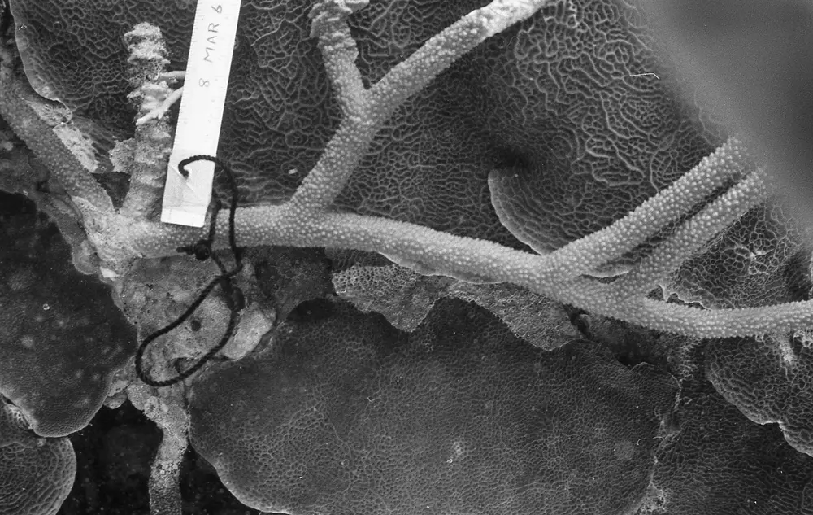{.lightbox group="discovery-bay-1966" description="**UUID: **30ec36cd-de88-4f87-ab24-e4636225377a **Date: **1968-08-03 **Location: **Jamaica | Discovery Bay | Pear Tree Bottom **Longitude: **77.35867ºW **Latitude: **18.4635ºN **Photographer: **Eileen Graham **Copyright: **Trustees of the Natural History Museum (London, UK), CC-BY-4.0" alt="**UUID: **30ec36cd-de88-4f87-ab24-e4636225377a **Date: **1968-08-03 **Location: **Jamaica | Discovery Bay | Pear Tree Bottom **Longitude: **77.35867ºW **Latitude: **18.4635ºN **Photographer: **Eileen Graham **Copyright: **Trustees of the Natural History Museum (London, UK), CC-BY-4.0"}

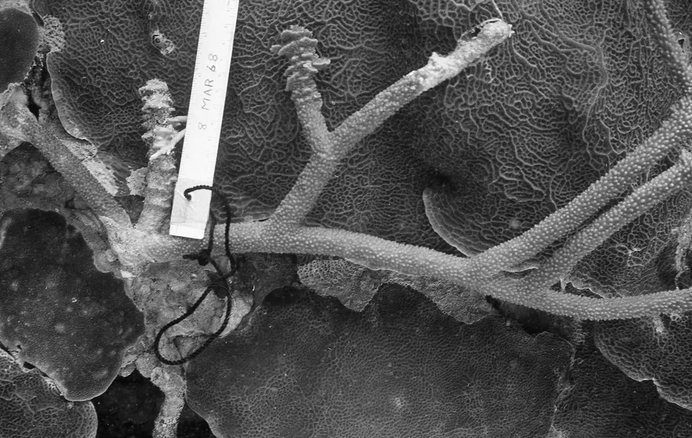{.lightbox group="discovery-bay-1966" description="**UUID: **142dd730-17a5-409c-a9fb-3e5c8367c29c **Date: **1968-08-03 **Location: **Jamaica | Discovery Bay | Pear Tree Bottom **Longitude: **77.35867ºW **Latitude: **18.4635ºN **Photographer: **Eileen Graham **Copyright: **Trustees of the Natural History Museum (London, UK), CC-BY-4.0" alt="**UUID: **142dd730-17a5-409c-a9fb-3e5c8367c29c **Date: **1968-08-03 **Location: **Jamaica | Discovery Bay | Pear Tree Bottom **Longitude: **77.35867ºW **Latitude: **18.4635ºN **Photographer: **Eileen Graham **Copyright: **Trustees of the Natural History Museum (London, UK), CC-BY-4.0"}

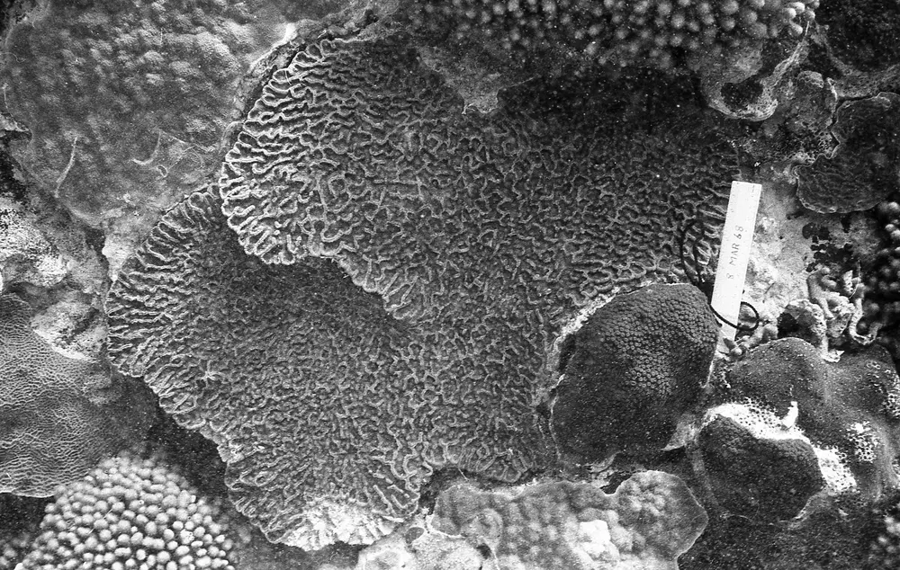{.lightbox group="discovery-bay-1966" description="**UUID: **48b16ae5-dcb5-431c-a571-83271f510700 **Date: **1968-08-03 **Location: **Jamaica | Discovery Bay | Pear Tree Bottom **Longitude: **77.35867ºW **Latitude: **18.4635ºN **Photographer: **Eileen Graham **Copyright: **Trustees of the Natural History Museum (London, UK), CC-BY-4.0" alt="**UUID: **48b16ae5-dcb5-431c-a571-83271f510700 **Date: **1968-08-03 **Location: **Jamaica | Discovery Bay | Pear Tree Bottom **Longitude: **77.35867ºW **Latitude: **18.4635ºN **Photographer: **Eileen Graham **Copyright: **Trustees of the Natural History Museum (London, UK), CC-BY-4.0"}

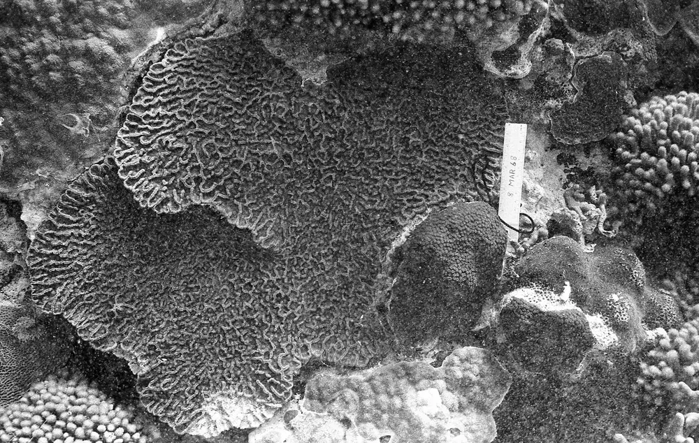{.lightbox group="discovery-bay-1966" description="**UUID: **2be599c0-75f0-4c6c-be60-d589a69688cf **Date: **1968-08-03 **Location: **Jamaica | Discovery Bay | Pear Tree Bottom **Longitude: **77.35867ºW **Latitude: **18.4635ºN **Photographer: **Eileen Graham **Copyright: **Trustees of the Natural History Museum (London, UK), CC-BY-4.0" alt="**UUID: **2be599c0-75f0-4c6c-be60-d589a69688cf **Date: **1968-08-03 **Location: **Jamaica | Discovery Bay | Pear Tree Bottom **Longitude: **77.35867ºW **Latitude: **18.4635ºN **Photographer: **Eileen Graham **Copyright: **Trustees of the Natural History Museum (London, UK), CC-BY-4.0"}

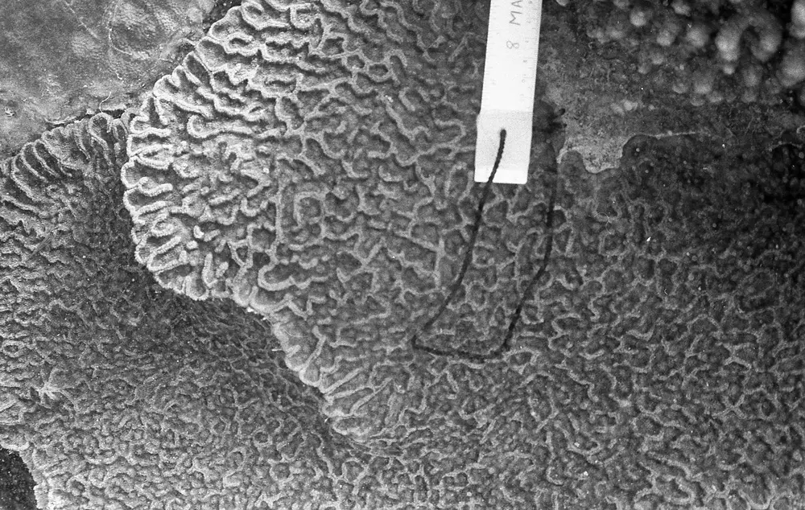{.lightbox group="discovery-bay-1966" description="**UUID: **125ceb2f-dc0d-4425-8852-7d736b1d04ac **Date: **1968-08-03 **Location: **Jamaica | Discovery Bay | Pear Tree Bottom **Longitude: **77.35867ºW **Latitude: **18.4635ºN **Photographer: **Eileen Graham **Copyright: **Trustees of the Natural History Museum (London, UK), CC-BY-4.0" alt="**UUID: **125ceb2f-dc0d-4425-8852-7d736b1d04ac **Date: **1968-08-03 **Location: **Jamaica | Discovery Bay | Pear Tree Bottom **Longitude: **77.35867ºW **Latitude: **18.4635ºN **Photographer: **Eileen Graham **Copyright: **Trustees of the Natural History Museum (London, UK), CC-BY-4.0"}

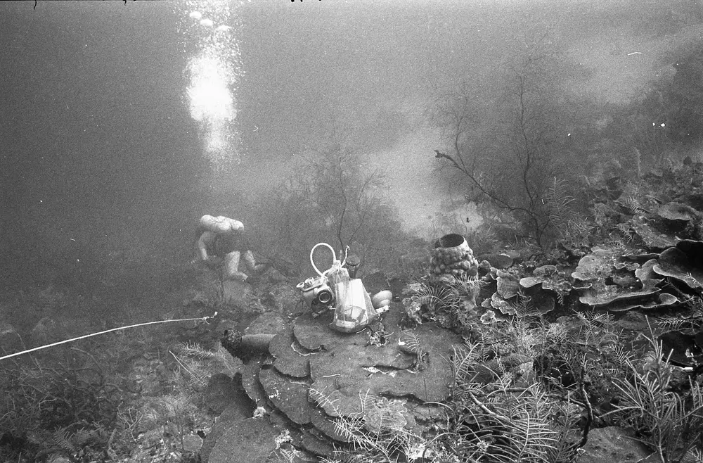{.lightbox group="discovery-bay-1966" description="**UUID: **af013777-fd8e-4f69-808d-48ad15c08074 **Date: **1967-12-30 **Location: **Jamaica | Discovery Bay | Pinnacle 2 Slope **Longitude: **77.414ºW **Latitude: **18.473ºN **Photographer: **Eileen Graham **Copyright: **Trustees of the Natural History Museum (London, UK), CC-BY-4.0" alt="**UUID: **af013777-fd8e-4f69-808d-48ad15c08074 **Date: **1967-12-30 **Location: **Jamaica | Discovery Bay | Pinnacle 2 Slope **Longitude: **77.414ºW **Latitude: **18.473ºN **Photographer: **Eileen Graham **Copyright: **Trustees of the Natural History Museum (London, UK), CC-BY-4.0"}

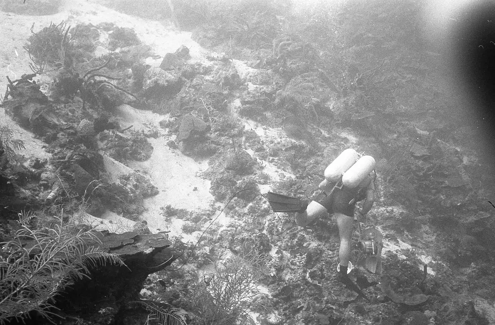{.lightbox group="discovery-bay-1966" description="**UUID: **87cc502d-aaba-438a-9224-23b97eff415c **Date: **1967-12-30 **Location: **Jamaica | Discovery Bay | Pinnacle 2 Slope **Longitude: **77.414ºW **Latitude: **18.473ºN **Photographer: **Eileen Graham **Copyright: **Trustees of the Natural History Museum (London, UK), CC-BY-4.0" alt="**UUID: **87cc502d-aaba-438a-9224-23b97eff415c **Date: **1967-12-30 **Location: **Jamaica | Discovery Bay | Pinnacle 2 Slope **Longitude: **77.414ºW **Latitude: **18.473ºN **Photographer: **Eileen Graham **Copyright: **Trustees of the Natural History Museum (London, UK), CC-BY-4.0"}

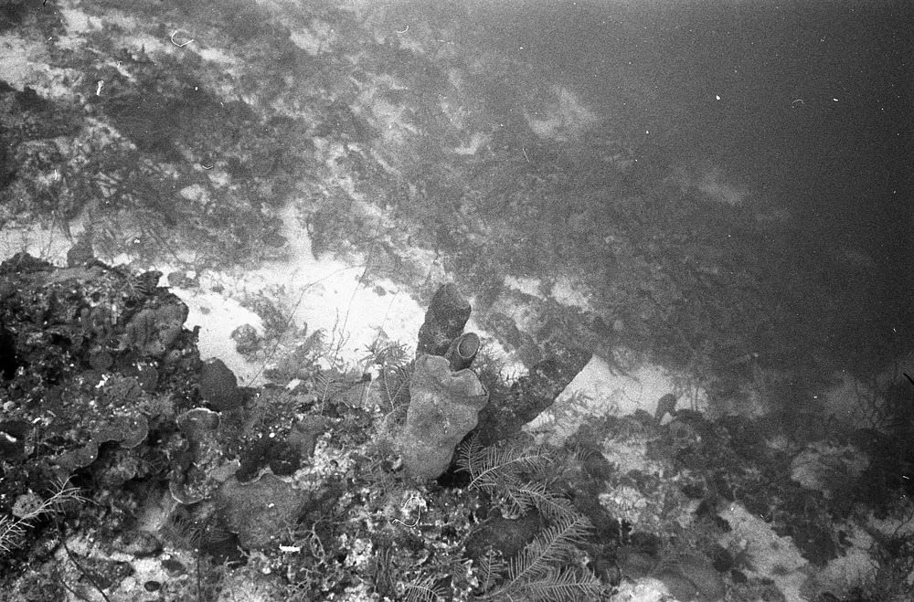{.lightbox group="discovery-bay-1966" description="**UUID: **62b6b641-35d1-4c64-a6e3-ed2c8f2810c8 **Date: **1967-12-30 **Location: **Jamaica | Discovery Bay | Pinnacle 2 Slope **Longitude: **77.414ºW **Latitude: **18.473ºN **Photographer: **Eileen Graham **Copyright: **Trustees of the Natural History Museum (London, UK), CC-BY-4.0" alt="**UUID: **62b6b641-35d1-4c64-a6e3-ed2c8f2810c8 **Date: **1967-12-30 **Location: **Jamaica | Discovery Bay | Pinnacle 2 Slope **Longitude: **77.414ºW **Latitude: **18.473ºN **Photographer: **Eileen Graham **Copyright: **Trustees of the Natural History Museum (London, UK), CC-BY-4.0"}

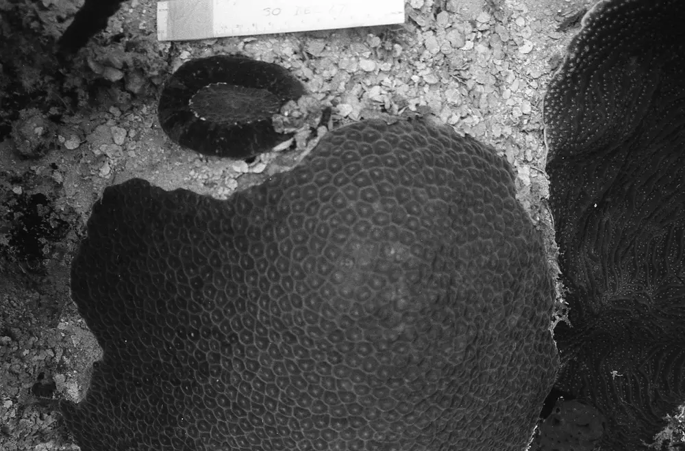{.lightbox group="discovery-bay-1966" description="**UUID: **b301f597-504b-4ea1-a983-bd19f56d6d79 **Date: **1967-12-30 **Location: **Jamaica | Discovery Bay | Pinnacle 2 Slope **Longitude: **77.414ºW **Latitude: **18.473ºN **Photographer: **Eileen Graham **Copyright: **Trustees of the Natural History Museum (London, UK), CC-BY-4.0" alt="**UUID: **b301f597-504b-4ea1-a983-bd19f56d6d79 **Date: **1967-12-30 **Location: **Jamaica | Discovery Bay | Pinnacle 2 Slope **Longitude: **77.414ºW **Latitude: **18.473ºN **Photographer: **Eileen Graham **Copyright: **Trustees of the Natural History Museum (London, UK), CC-BY-4.0"}

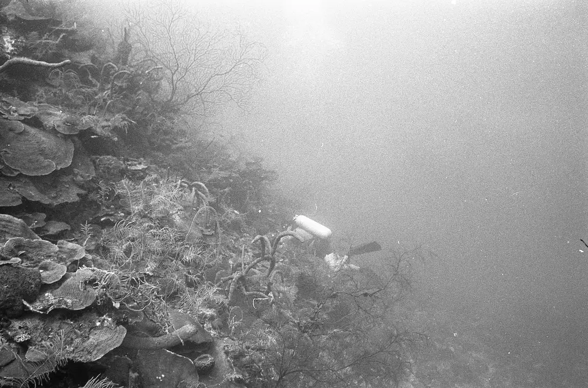{.lightbox group="discovery-bay-1966" description="**UUID: **d6433aee-efcf-4be2-b457-b2b99b5044f3 **Date: **1967-12-30 **Location: **Jamaica | Discovery Bay | Pinnacle 2 Deep **Longitude: **77.414ºW **Latitude: **18.474ºN **Photographer: **Eileen Graham **Copyright: **Trustees of the Natural History Museum (London, UK), CC-BY-4.0" alt="**UUID: **d6433aee-efcf-4be2-b457-b2b99b5044f3 **Date: **1967-12-30 **Location: **Jamaica | Discovery Bay | Pinnacle 2 Deep **Longitude: **77.414ºW **Latitude: **18.474ºN **Photographer: **Eileen Graham **Copyright: **Trustees of the Natural History Museum (London, UK), CC-BY-4.0"}

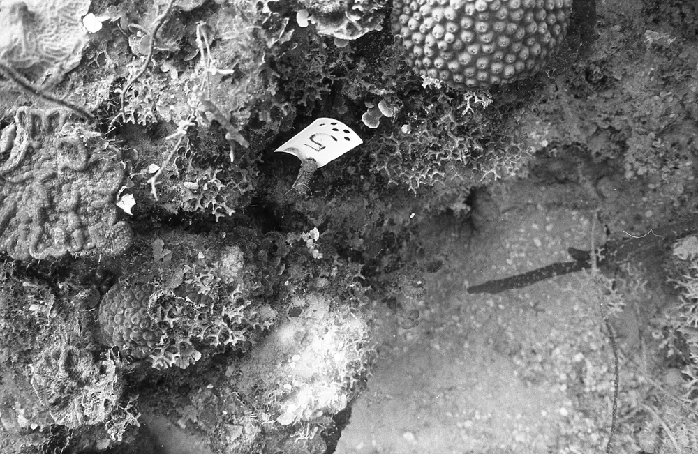{.lightbox group="discovery-bay-1966" description="**UUID: **2665c7df-ba25-481a-808c-2358afa835ac **Date: **1966-08-26 **Location: **Jamaica | Discovery Bay | Buoy Upper Slope **Longitude: **77.40908ºW **Latitude: **18.47322ºN **Photographer: **Eileen Graham **Copyright: **Trustees of the Natural History Museum (London, UK), CC-BY-4.0" alt="**UUID: **2665c7df-ba25-481a-808c-2358afa835ac **Date: **1966-08-26 **Location: **Jamaica | Discovery Bay | Buoy Upper Slope **Longitude: **77.40908ºW **Latitude: **18.47322ºN **Photographer: **Eileen Graham **Copyright: **Trustees of the Natural History Museum (London, UK), CC-BY-4.0"}

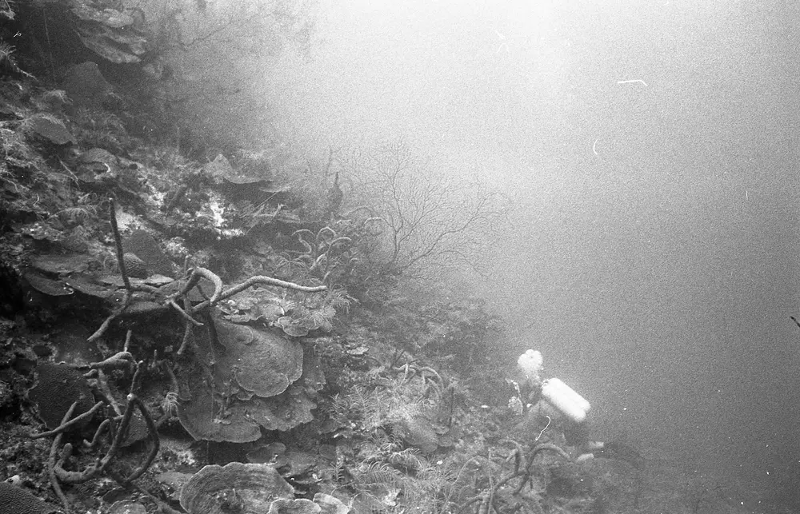{.lightbox group="discovery-bay-1966" description="**UUID: **736981e5-3362-469a-a980-ea22d5479177 **Date: **1967-12-30 **Location: **Jamaica | Discovery Bay | Pinnacle 2 Deep **Longitude: **77.414ºW **Latitude: **18.474ºN **Photographer: **Eileen Graham **Copyright: **Trustees of the Natural History Museum (London, UK), CC-BY-4.0" alt="**UUID: **736981e5-3362-469a-a980-ea22d5479177 **Date: **1967-12-30 **Location: **Jamaica | Discovery Bay | Pinnacle 2 Deep **Longitude: **77.414ºW **Latitude: **18.474ºN **Photographer: **Eileen Graham **Copyright: **Trustees of the Natural History Museum (London, UK), CC-BY-4.0"}

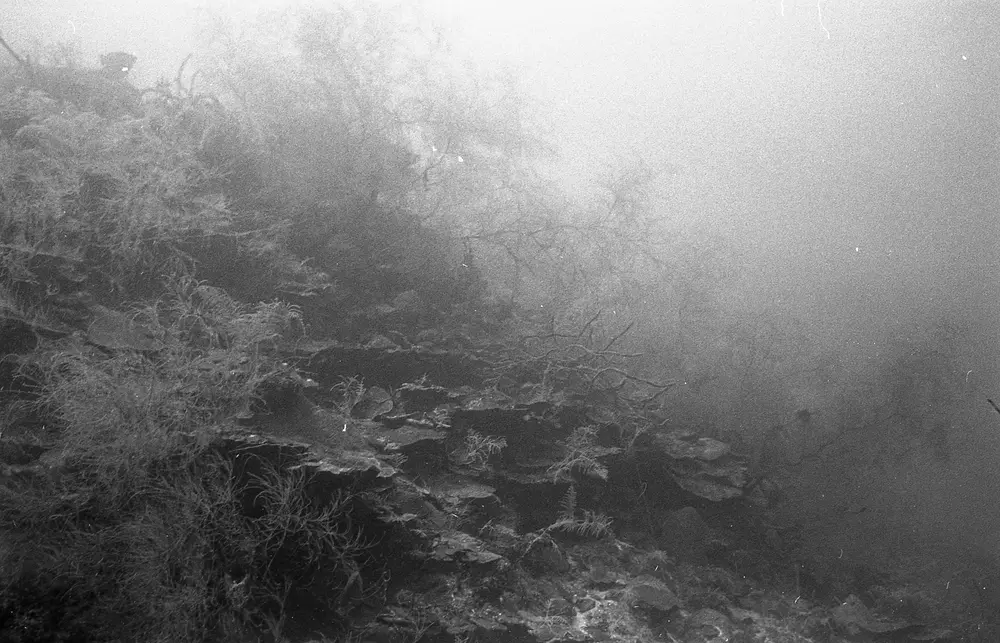{.lightbox group="discovery-bay-1966" description="**UUID: **e69c09de-2623-4506-bcdd-0a4e4e96499f **Date: **1967-12-30 **Location: **Jamaica | Discovery Bay | Pinnacle 2 Deep **Longitude: **77.414ºW **Latitude: **18.474ºN **Photographer: **Eileen Graham **Copyright: **Trustees of the Natural History Museum (London, UK), CC-BY-4.0" alt="**UUID: **e69c09de-2623-4506-bcdd-0a4e4e96499f **Date: **1967-12-30 **Location: **Jamaica | Discovery Bay | Pinnacle 2 Deep **Longitude: **77.414ºW **Latitude: **18.474ºN **Photographer: **Eileen Graham **Copyright: **Trustees of the Natural History Museum (London, UK), CC-BY-4.0"}

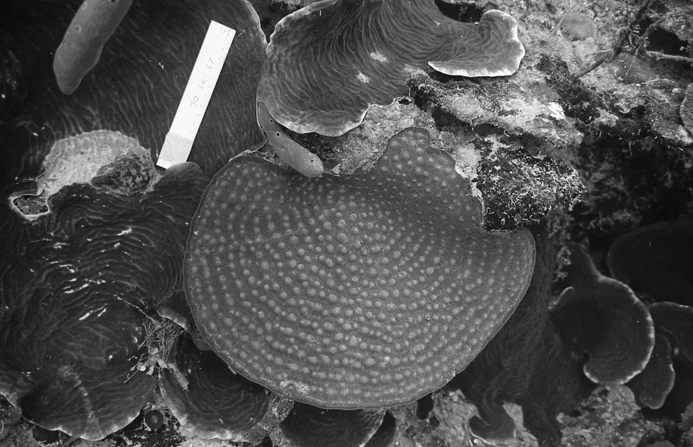{.lightbox group="discovery-bay-1966" description="**UUID: **46e86e30-48a5-4b15-a315-bf9f6d312bd1 **Date: **1967-12-30 **Location: **Jamaica | Discovery Bay | Pinnacle 2 Slope **Longitude: **77.414ºW **Latitude: **18.473ºN **Photographer: **Eileen Graham **Copyright: **Trustees of the Natural History Museum (London, UK), CC-BY-4.0" alt="**UUID: **46e86e30-48a5-4b15-a315-bf9f6d312bd1 **Date: **1967-12-30 **Location: **Jamaica | Discovery Bay | Pinnacle 2 Slope **Longitude: **77.414ºW **Latitude: **18.473ºN **Photographer: **Eileen Graham **Copyright: **Trustees of the Natural History Museum (London, UK), CC-BY-4.0"}

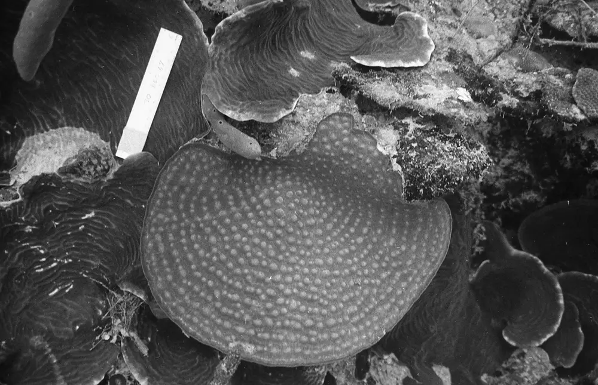{.lightbox group="discovery-bay-1966" description="**UUID: **875ce0f5-de08-4265-8087-b37aa90c7ebb **Date: **1967-12-30 **Location: **Jamaica | Discovery Bay | Pinnacle 2 Slope **Longitude: **77.414ºW **Latitude: **18.473ºN **Photographer: **Eileen Graham **Copyright: **Trustees of the Natural History Museum (London, UK), CC-BY-4.0" alt="**UUID: **875ce0f5-de08-4265-8087-b37aa90c7ebb **Date: **1967-12-30 **Location: **Jamaica | Discovery Bay | Pinnacle 2 Slope **Longitude: **77.414ºW **Latitude: **18.473ºN **Photographer: **Eileen Graham **Copyright: **Trustees of the Natural History Museum (London, UK), CC-BY-4.0"}

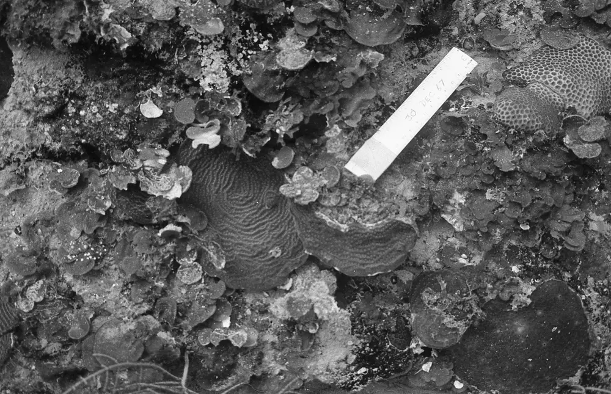{.lightbox group="discovery-bay-1966" description="**UUID: **dc606e36-3244-454d-a160-1abda3e9e291 **Date: **1967-12-30 **Location: **Jamaica | Discovery Bay | Pinnacle 2 Slope **Longitude: **77.414ºW **Latitude: **18.473ºN **Photographer: **Eileen Graham **Copyright: **Trustees of the Natural History Museum (London, UK), CC-BY-4.0" alt="**UUID: **dc606e36-3244-454d-a160-1abda3e9e291 **Date: **1967-12-30 **Location: **Jamaica | Discovery Bay | Pinnacle 2 Slope **Longitude: **77.414ºW **Latitude: **18.473ºN **Photographer: **Eileen Graham **Copyright: **Trustees of the Natural History Museum (London, UK), CC-BY-4.0"}

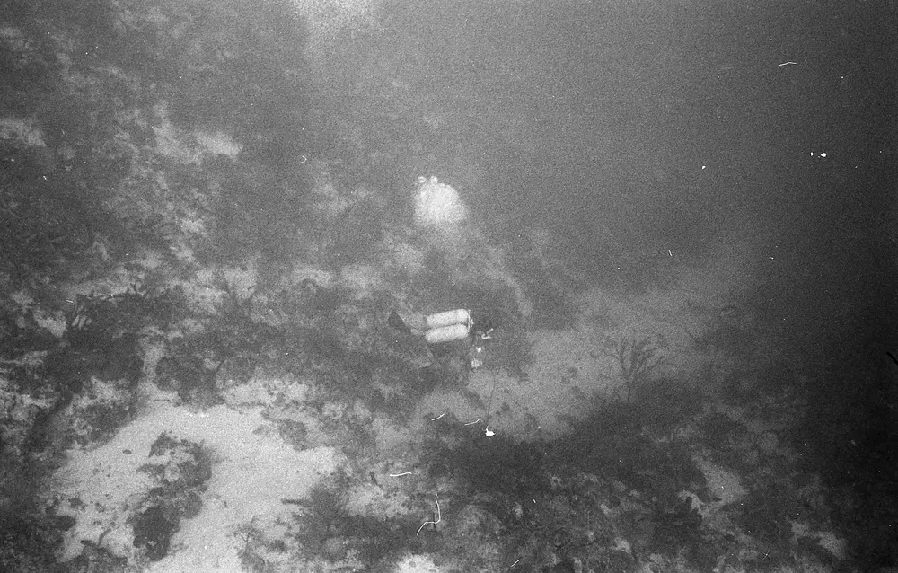{.lightbox group="discovery-bay-1966" description="**UUID: **c578e234-12b2-4570-9e16-8ed6c992839c **Date: **1967-12-30 **Location: **Jamaica | Discovery Bay | Pinnacle 2 Deep **Longitude: **77.414ºW **Latitude: **18.474ºN **Photographer: **Eileen Graham **Copyright: **Trustees of the Natural History Museum (London, UK), CC-BY-4.0" alt="**UUID: **c578e234-12b2-4570-9e16-8ed6c992839c **Date: **1967-12-30 **Location: **Jamaica | Discovery Bay | Pinnacle 2 Deep **Longitude: **77.414ºW **Latitude: **18.474ºN **Photographer: **Eileen Graham **Copyright: **Trustees of the Natural History Museum (London, UK), CC-BY-4.0"}

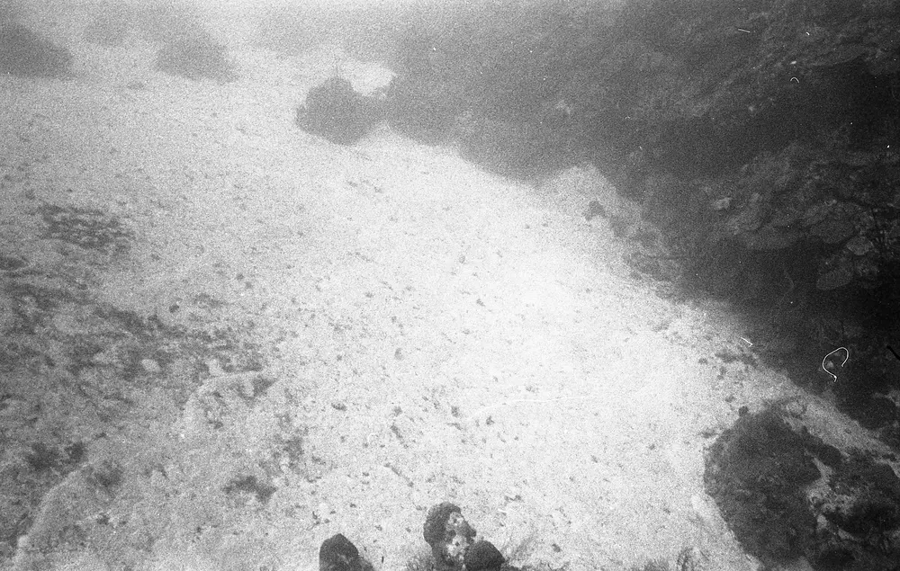{.lightbox group="discovery-bay-1966" description="**UUID: **fd4aa4da-8b07-4fc8-a2ed-9969de3bb022 **Date: **1968-05-25 **Location: **Jamaica | Discovery Bay | Eaton Hall **Longitude: **77.334ºW **Latitude: **18.467ºN **Photographer: **Eileen Graham **Copyright: **Trustees of the Natural History Museum (London, UK), CC-BY-4.0" alt="**UUID: **fd4aa4da-8b07-4fc8-a2ed-9969de3bb022 **Date: **1968-05-25 **Location: **Jamaica | Discovery Bay | Eaton Hall **Longitude: **77.334ºW **Latitude: **18.467ºN **Photographer: **Eileen Graham **Copyright: **Trustees of the Natural History Museum (London, UK), CC-BY-4.0"}

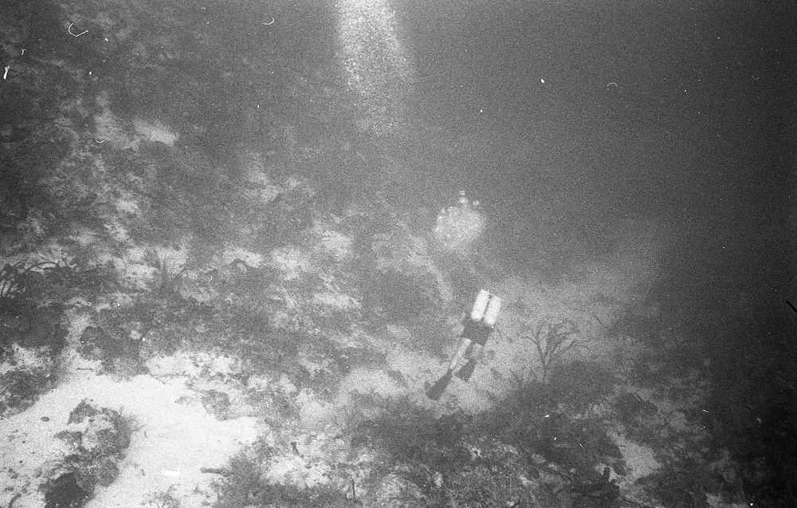{.lightbox group="discovery-bay-1966" description="**UUID: **2eb2b7bf-7709-4db7-8ff7-8c7869097cf1 **Date: **1968-05-25 **Location: **Jamaica | Discovery Bay | Eaton Hall **Longitude: **77.334ºW **Latitude: **18.467ºN **Photographer: **Eileen Graham **Copyright: **Trustees of the Natural History Museum (London, UK), CC-BY-4.0" alt="**UUID: **2eb2b7bf-7709-4db7-8ff7-8c7869097cf1 **Date: **1968-05-25 **Location: **Jamaica | Discovery Bay | Eaton Hall **Longitude: **77.334ºW **Latitude: **18.467ºN **Photographer: **Eileen Graham **Copyright: **Trustees of the Natural History Museum (London, UK), CC-BY-4.0"}

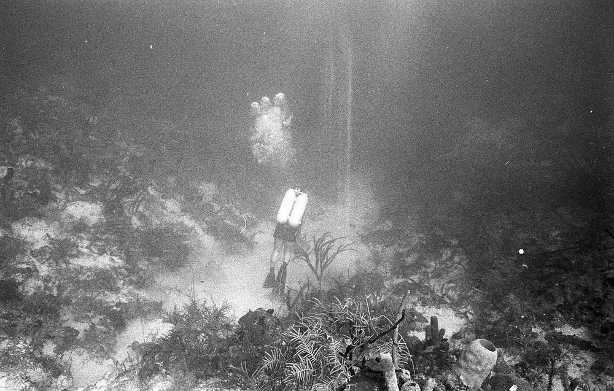{.lightbox group="discovery-bay-1966" description="**UUID: **c5d48af6-63d6-4f15-8447-1f50cff0fa9f **Date: **1968-05-25 **Location: **Jamaica | Discovery Bay | Eaton Hall **Longitude: **77.334ºW **Latitude: **18.467ºN **Photographer: **Eileen Graham **Copyright: **Trustees of the Natural History Museum (London, UK), CC-BY-4.0" alt="**UUID: **c5d48af6-63d6-4f15-8447-1f50cff0fa9f **Date: **1968-05-25 **Location: **Jamaica | Discovery Bay | Eaton Hall **Longitude: **77.334ºW **Latitude: **18.467ºN **Photographer: **Eileen Graham **Copyright: **Trustees of the Natural History Museum (London, UK), CC-BY-4.0"}

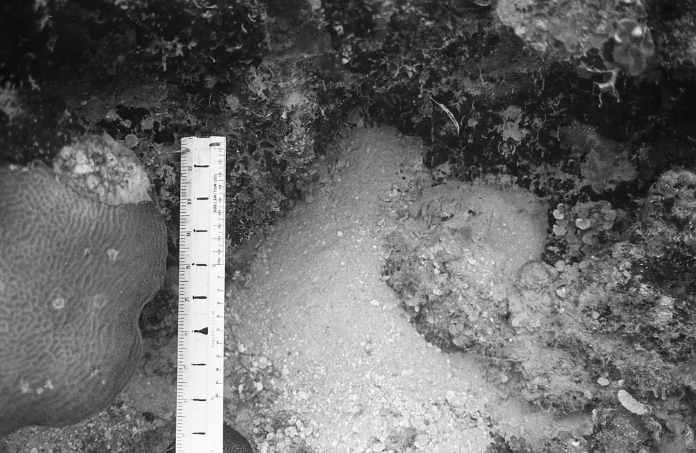{.lightbox group="discovery-bay-1966" description="**UUID: **23666851-0e47-4c45-b15a-d8ea517005d1 **Date: **1966-08-26 **Location: **Jamaica | Discovery Bay | Buoy Upper Slope **Longitude: **77.40908ºW **Latitude: **18.47322ºN **Photographer: **Eileen Graham **Copyright: **Trustees of the Natural History Museum (London, UK), CC-BY-4.0" alt="**UUID: **23666851-0e47-4c45-b15a-d8ea517005d1 **Date: **1966-08-26 **Location: **Jamaica | Discovery Bay | Buoy Upper Slope **Longitude: **77.40908ºW **Latitude: **18.47322ºN **Photographer: **Eileen Graham **Copyright: **Trustees of the Natural History Museum (London, UK), CC-BY-4.0"}

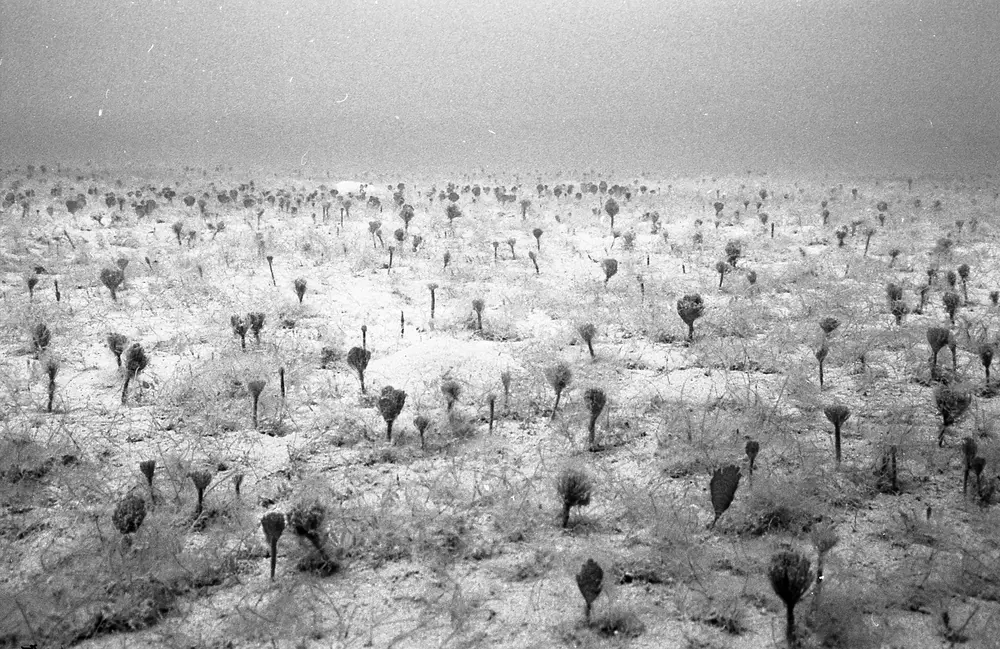{.lightbox group="discovery-bay-1966" description="**UUID: **7b857b7c-3b3a-4034-a1f3-aeeaf8f394b8 **Date: **1968-05-25 **Location: **Jamaica | Discovery Bay | Eaton Hall **Longitude: **77.334ºW **Latitude: **18.467ºN **Photographer: **Eileen Graham **Copyright: **Trustees of the Natural History Museum (London, UK), CC-BY-4.0" alt="**UUID: **7b857b7c-3b3a-4034-a1f3-aeeaf8f394b8 **Date: **1968-05-25 **Location: **Jamaica | Discovery Bay | Eaton Hall **Longitude: **77.334ºW **Latitude: **18.467ºN **Photographer: **Eileen Graham **Copyright: **Trustees of the Natural History Museum (London, UK), CC-BY-4.0"}

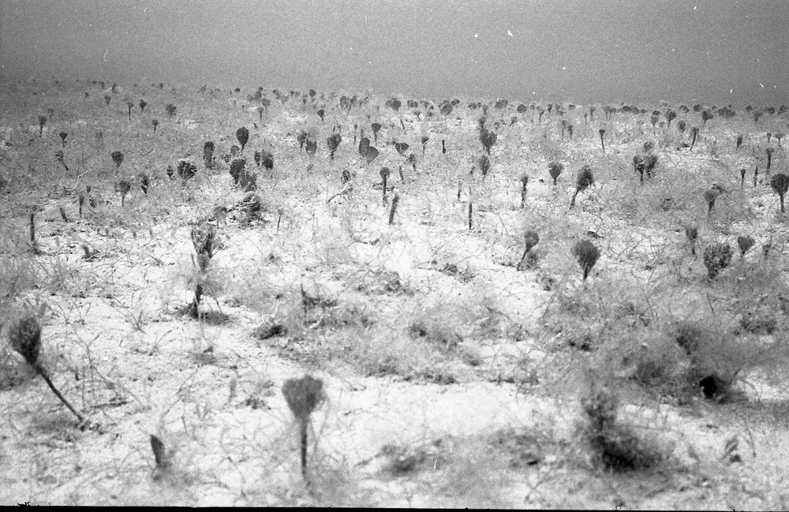{.lightbox group="discovery-bay-1966" description="**UUID: **210e7134-fb05-4314-916c-3eb4c3e30515 **Date: **1968-05-25 **Location: **Jamaica | Discovery Bay | Eaton Hall **Longitude: **77.334ºW **Latitude: **18.467ºN **Photographer: **Eileen Graham **Copyright: **Trustees of the Natural History Museum (London, UK), CC-BY-4.0" alt="**UUID: **210e7134-fb05-4314-916c-3eb4c3e30515 **Date: **1968-05-25 **Location: **Jamaica | Discovery Bay | Eaton Hall **Longitude: **77.334ºW **Latitude: **18.467ºN **Photographer: **Eileen Graham **Copyright: **Trustees of the Natural History Museum (London, UK), CC-BY-4.0"}

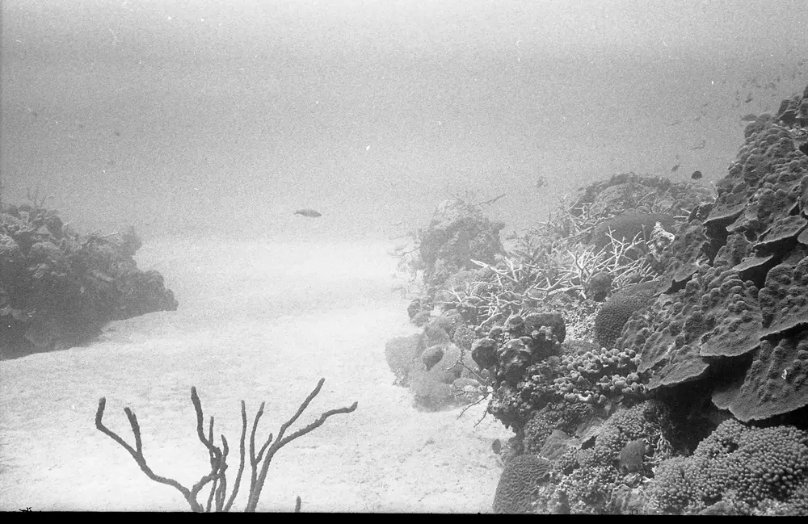{.lightbox group="discovery-bay-1966" description="**UUID: **17d8a3fc-9f68-4a22-bb26-8f7b9ec48f18 **Date: **1968-05-25 **Location: **Jamaica | Discovery Bay | Eaton Hall **Longitude: **77.334ºW **Latitude: **18.467ºN **Photographer: **Eileen Graham **Copyright: **Trustees of the Natural History Museum (London, UK), CC-BY-4.0" alt="**UUID: **17d8a3fc-9f68-4a22-bb26-8f7b9ec48f18 **Date: **1968-05-25 **Location: **Jamaica | Discovery Bay | Eaton Hall **Longitude: **77.334ºW **Latitude: **18.467ºN **Photographer: **Eileen Graham **Copyright: **Trustees of the Natural History Museum (London, UK), CC-BY-4.0"}

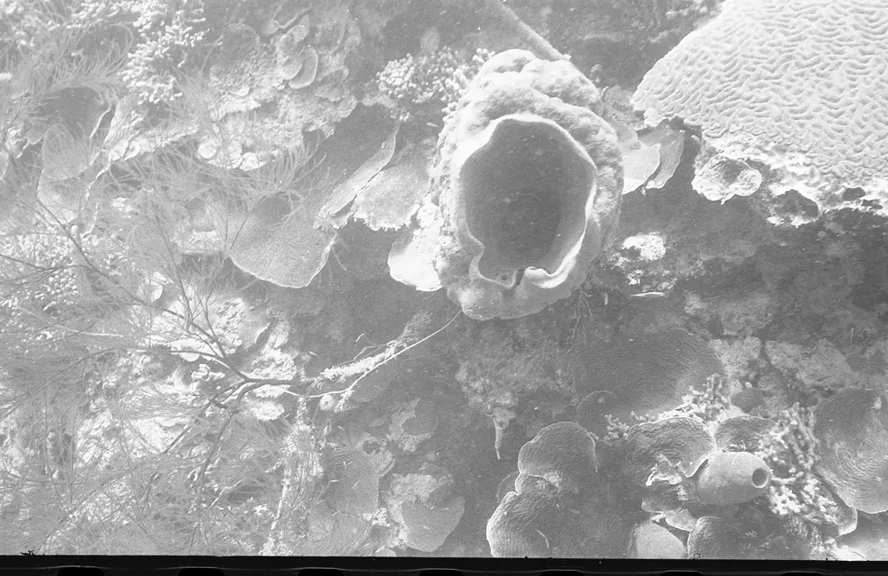{.lightbox group="discovery-bay-1966" description="**UUID: **579d64a8-5672-448d-9bba-e654267508e7 **Date: **1968-05-25 **Location: **Jamaica | Discovery Bay | Eaton Hall **Longitude: **77.334ºW **Latitude: **18.467ºN **Photographer: **Eileen Graham **Copyright: **Trustees of the Natural History Museum (London, UK), CC-BY-4.0" alt="**UUID: **579d64a8-5672-448d-9bba-e654267508e7 **Date: **1968-05-25 **Location: **Jamaica | Discovery Bay | Eaton Hall **Longitude: **77.334ºW **Latitude: **18.467ºN **Photographer: **Eileen Graham **Copyright: **Trustees of the Natural History Museum (London, UK), CC-BY-4.0"}

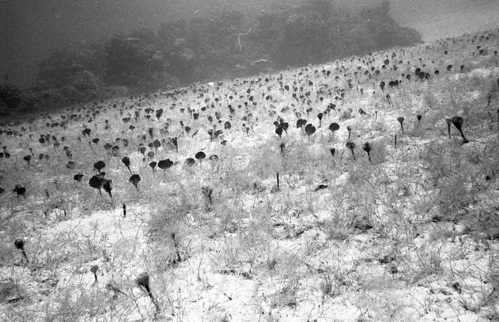{.lightbox group="discovery-bay-1966" description="**UUID: **21fd7b8e-e1f8-48a7-8618-a61a6ccc281d **Date: **1968-05-25 **Location: **Jamaica | Discovery Bay | Eaton Hall **Longitude: **77.334ºW **Latitude: **18.467ºN **Photographer: **Eileen Graham **Copyright: **Trustees of the Natural History Museum (London, UK), CC-BY-4.0" alt="**UUID: **21fd7b8e-e1f8-48a7-8618-a61a6ccc281d **Date: **1968-05-25 **Location: **Jamaica | Discovery Bay | Eaton Hall **Longitude: **77.334ºW **Latitude: **18.467ºN **Photographer: **Eileen Graham **Copyright: **Trustees of the Natural History Museum (London, UK), CC-BY-4.0"}

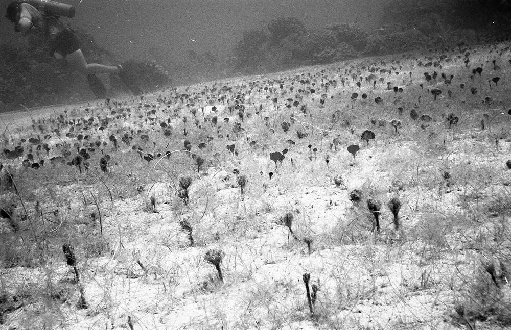{.lightbox group="discovery-bay-1966" description="**UUID: **d8db80c9-19b2-421f-a2d1-50a17357a472 **Date: **1968-05-25 **Location: **Jamaica | Discovery Bay | Eaton Hall **Longitude: **77.334ºW **Latitude: **18.467ºN **Photographer: **Eileen Graham **Copyright: **Trustees of the Natural History Museum (London, UK), CC-BY-4.0" alt="**UUID: **d8db80c9-19b2-421f-a2d1-50a17357a472 **Date: **1968-05-25 **Location: **Jamaica | Discovery Bay | Eaton Hall **Longitude: **77.334ºW **Latitude: **18.467ºN **Photographer: **Eileen Graham **Copyright: **Trustees of the Natural History Museum (London, UK), CC-BY-4.0"}

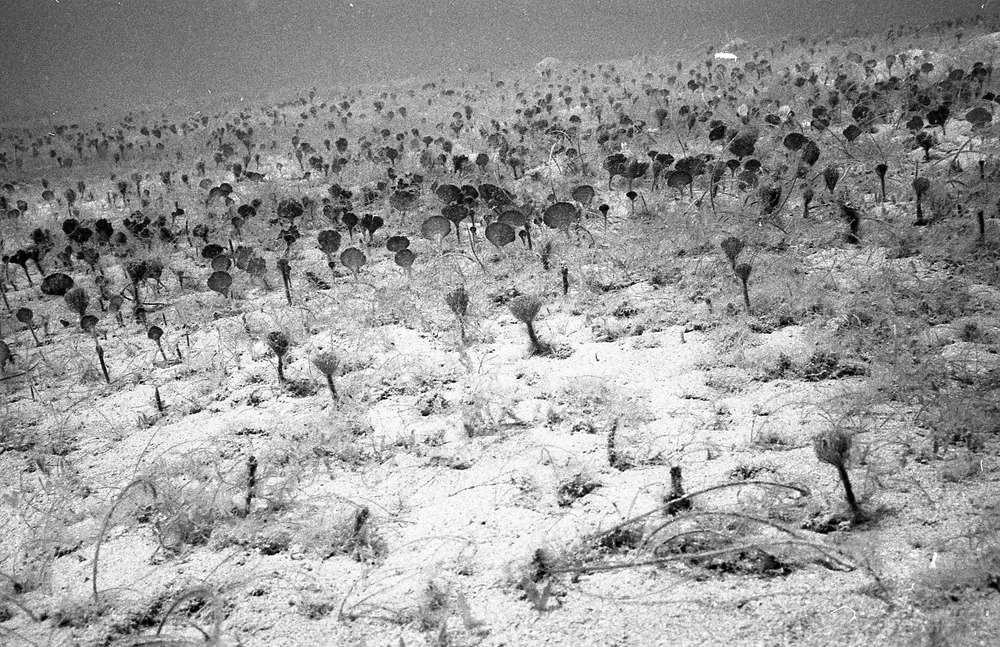{.lightbox group="discovery-bay-1966" description="**UUID: **5de8dce5-1b12-4c27-9136-26c8aae4cd60 **Date: **1968-05-25 **Location: **Jamaica | Discovery Bay | Eaton Hall **Longitude: **77.334ºW **Latitude: **18.467ºN **Photographer: **Eileen Graham **Copyright: **Trustees of the Natural History Museum (London, UK), CC-BY-4.0" alt="**UUID: **5de8dce5-1b12-4c27-9136-26c8aae4cd60 **Date: **1968-05-25 **Location: **Jamaica | Discovery Bay | Eaton Hall **Longitude: **77.334ºW **Latitude: **18.467ºN **Photographer: **Eileen Graham **Copyright: **Trustees of the Natural History Museum (London, UK), CC-BY-4.0"}

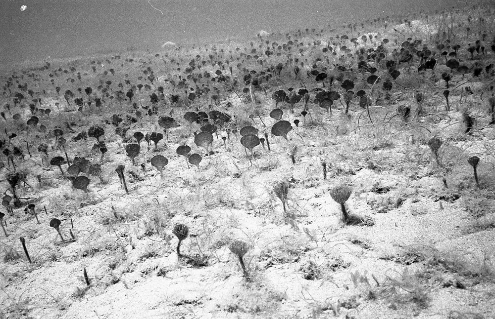{.lightbox group="discovery-bay-1966" description="**UUID: **e183f065-a1da-468a-8a1b-e7f8d8cf8640 **Date: **1968-05-25 **Location: **Jamaica | Discovery Bay | Eaton Hall **Longitude: **77.334ºW **Latitude: **18.467ºN **Photographer: **Eileen Graham **Copyright: **Trustees of the Natural History Museum (London, UK), CC-BY-4.0" alt="**UUID: **e183f065-a1da-468a-8a1b-e7f8d8cf8640 **Date: **1968-05-25 **Location: **Jamaica | Discovery Bay | Eaton Hall **Longitude: **77.334ºW **Latitude: **18.467ºN **Photographer: **Eileen Graham **Copyright: **Trustees of the Natural History Museum (London, UK), CC-BY-4.0"}

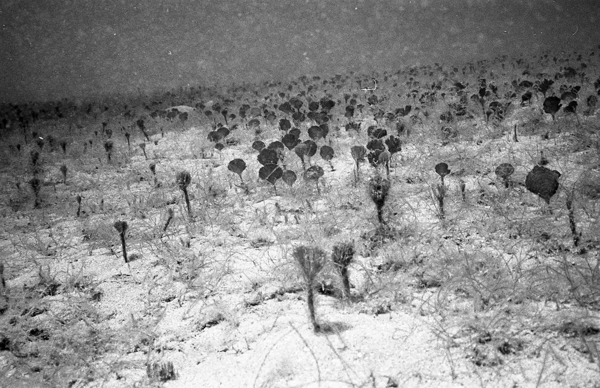{.lightbox group="discovery-bay-1966" description="**UUID: **1fc7f446-b342-469e-9190-7a0e5d5aab98 **Date: **1968-05-25 **Location: **Jamaica | Discovery Bay | Eaton Hall **Longitude: **77.334ºW **Latitude: **18.467ºN **Photographer: **Eileen Graham **Copyright: **Trustees of the Natural History Museum (London, UK), CC-BY-4.0" alt="**UUID: **1fc7f446-b342-469e-9190-7a0e5d5aab98 **Date: **1968-05-25 **Location: **Jamaica | Discovery Bay | Eaton Hall **Longitude: **77.334ºW **Latitude: **18.467ºN **Photographer: **Eileen Graham **Copyright: **Trustees of the Natural History Museum (London, UK), CC-BY-4.0"}

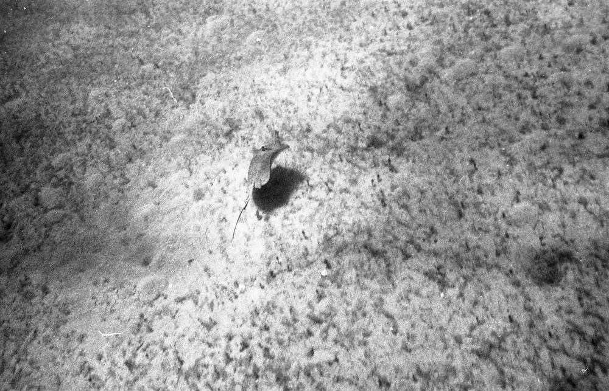{.lightbox group="discovery-bay-1966" description="**UUID: **1f5c93c4-5d80-44e1-b08a-10c5fc67de4d **Date: **1968-05-25 **Location: **Jamaica | Discovery Bay | Eaton Hall **Longitude: **77.334ºW **Latitude: **18.467ºN **Photographer: **Eileen Graham **Copyright: **Trustees of the Natural History Museum (London, UK), CC-BY-4.0" alt="**UUID: **1f5c93c4-5d80-44e1-b08a-10c5fc67de4d **Date: **1968-05-25 **Location: **Jamaica | Discovery Bay | Eaton Hall **Longitude: **77.334ºW **Latitude: **18.467ºN **Photographer: **Eileen Graham **Copyright: **Trustees of the Natural History Museum (London, UK), CC-BY-4.0"}

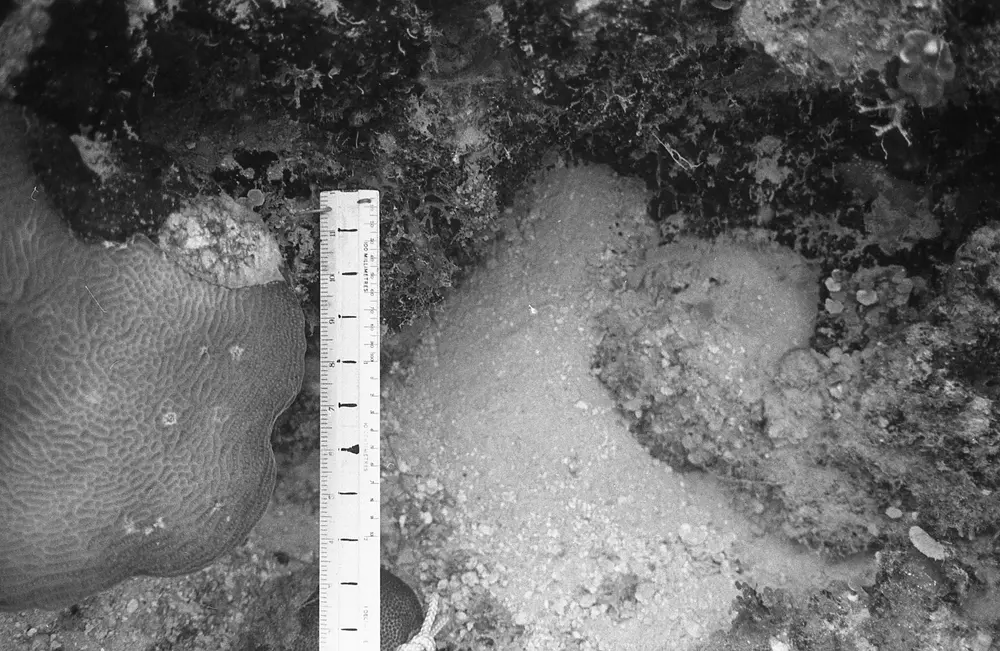{.lightbox group="discovery-bay-1966" description="**UUID: **2f4dbf10-ff9f-4b24-9cac-dd0705964f8c **Date: **1966-08-26 **Location: **Jamaica | Discovery Bay | Buoy Upper Slope **Longitude: **77.40908ºW **Latitude: **18.47322ºN **Photographer: **Eileen Graham **Copyright: **Trustees of the Natural History Museum (London, UK), CC-BY-4.0" alt="**UUID: **2f4dbf10-ff9f-4b24-9cac-dd0705964f8c **Date: **1966-08-26 **Location: **Jamaica | Discovery Bay | Buoy Upper Slope **Longitude: **77.40908ºW **Latitude: **18.47322ºN **Photographer: **Eileen Graham **Copyright: **Trustees of the Natural History Museum (London, UK), CC-BY-4.0"}

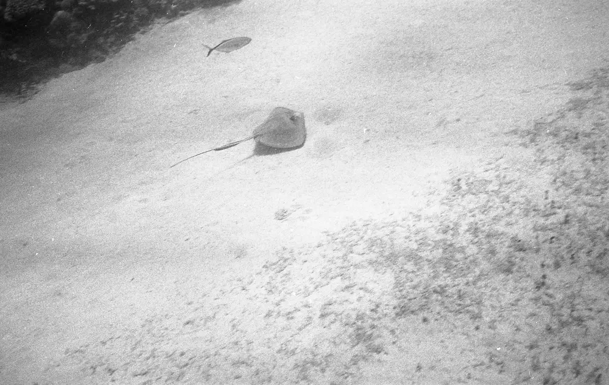{.lightbox group="discovery-bay-1966" description="**UUID: **93f62b69-e834-4183-bfe4-c649f0754fa9 **Date: **1968-05-25 **Location: **Jamaica | Discovery Bay | Eaton Hall **Longitude: **77.334ºW **Latitude: **18.467ºN **Photographer: **Eileen Graham **Copyright: **Trustees of the Natural History Museum (London, UK), CC-BY-4.0" alt="**UUID: **93f62b69-e834-4183-bfe4-c649f0754fa9 **Date: **1968-05-25 **Location: **Jamaica | Discovery Bay | Eaton Hall **Longitude: **77.334ºW **Latitude: **18.467ºN **Photographer: **Eileen Graham **Copyright: **Trustees of the Natural History Museum (London, UK), CC-BY-4.0"}

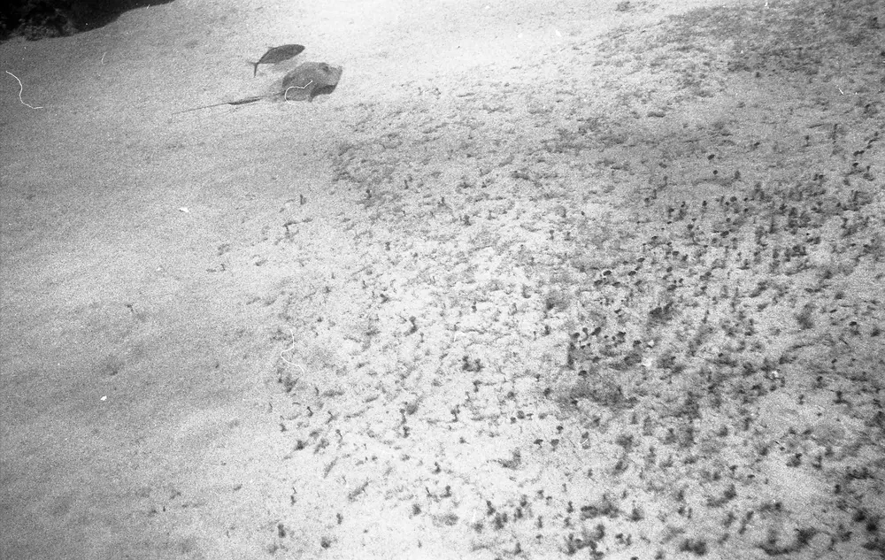{.lightbox group="discovery-bay-1966" description="**UUID: **f771b6be-72f2-446a-94e5-752d58aea77c **Date: **1968-05-25 **Location: **Jamaica | Discovery Bay | Eaton Hall **Longitude: **77.334ºW **Latitude: **18.467ºN **Photographer: **Eileen Graham **Copyright: **Trustees of the Natural History Museum (London, UK), CC-BY-4.0" alt="**UUID: **f771b6be-72f2-446a-94e5-752d58aea77c **Date: **1968-05-25 **Location: **Jamaica | Discovery Bay | Eaton Hall **Longitude: **77.334ºW **Latitude: **18.467ºN **Photographer: **Eileen Graham **Copyright: **Trustees of the Natural History Museum (London, UK), CC-BY-4.0"}

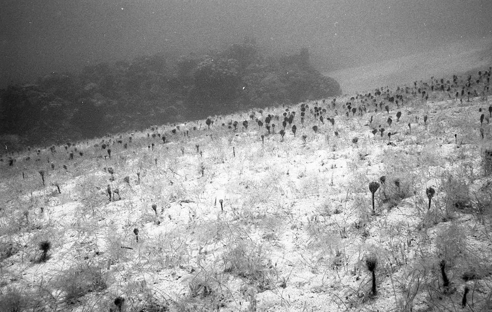{.lightbox group="discovery-bay-1966" description="**UUID: **fd96ffef-dc6e-4c0f-b49b-6734a7ba69e9 **Date: **1968-05-25 **Location: **Jamaica | Discovery Bay | Eaton Hall **Longitude: **77.334ºW **Latitude: **18.467ºN **Photographer: **Eileen Graham **Copyright: **Trustees of the Natural History Museum (London, UK), CC-BY-4.0" alt="**UUID: **fd96ffef-dc6e-4c0f-b49b-6734a7ba69e9 **Date: **1968-05-25 **Location: **Jamaica | Discovery Bay | Eaton Hall **Longitude: **77.334ºW **Latitude: **18.467ºN **Photographer: **Eileen Graham **Copyright: **Trustees of the Natural History Museum (London, UK), CC-BY-4.0"}

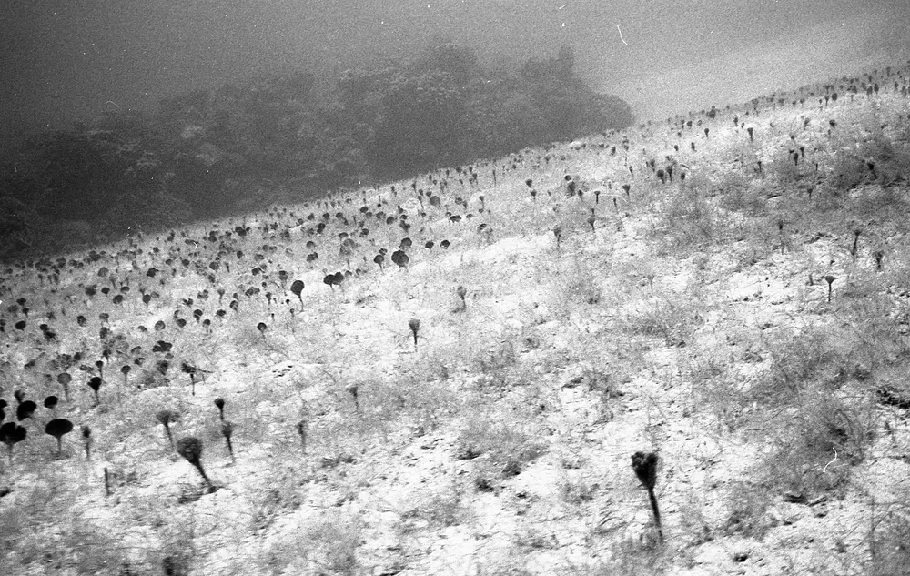{.lightbox group="discovery-bay-1966" description="**UUID: **ee629b2c-2d3c-4367-b641-95fde9728438 **Date: **1968-05-25 **Location: **Jamaica | Discovery Bay | Eaton Hall **Longitude: **77.334ºW **Latitude: **18.467ºN **Photographer: **Eileen Graham **Copyright: **Trustees of the Natural History Museum (London, UK), CC-BY-4.0" alt="**UUID: **ee629b2c-2d3c-4367-b641-95fde9728438 **Date: **1968-05-25 **Location: **Jamaica | Discovery Bay | Eaton Hall **Longitude: **77.334ºW **Latitude: **18.467ºN **Photographer: **Eileen Graham **Copyright: **Trustees of the Natural History Museum (London, UK), CC-BY-4.0"}

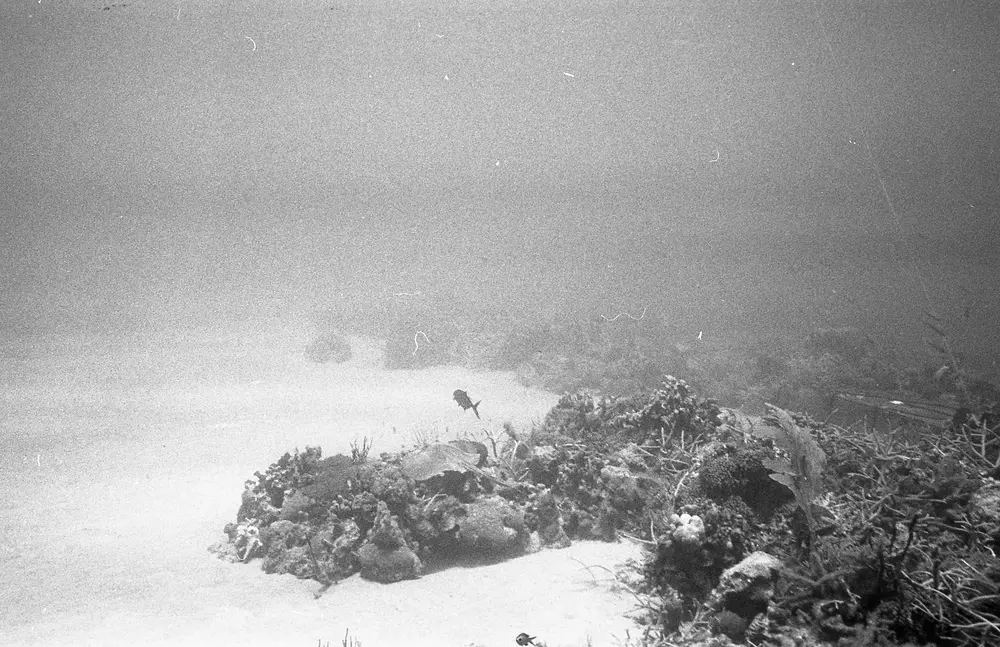{.lightbox group="discovery-bay-1966" description="**UUID: **f6919ec4-e746-49bb-b53b-f26c1c254180 **Date: **1968-05-25 **Location: **Jamaica | Discovery Bay | Eaton Hall **Longitude: **77.334ºW **Latitude: **18.467ºN **Photographer: **Eileen Graham **Copyright: **Trustees of the Natural History Museum (London, UK), CC-BY-4.0" alt="**UUID: **f6919ec4-e746-49bb-b53b-f26c1c254180 **Date: **1968-05-25 **Location: **Jamaica | Discovery Bay | Eaton Hall **Longitude: **77.334ºW **Latitude: **18.467ºN **Photographer: **Eileen Graham **Copyright: **Trustees of the Natural History Museum (London, UK), CC-BY-4.0"}

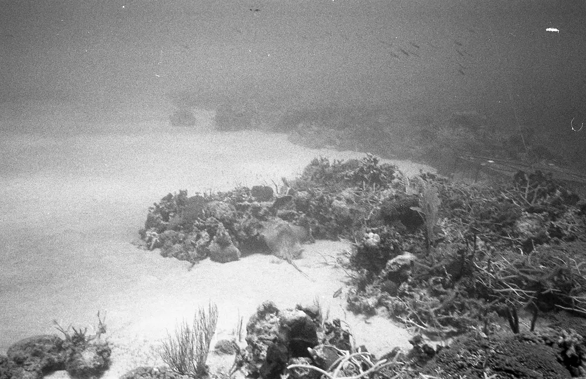{.lightbox group="discovery-bay-1966" description="**UUID: **7c1e5074-d6cd-481d-b51c-f65ea7250292 **Date: **1968-05-25 **Location: **Jamaica | Discovery Bay | Eaton Hall **Longitude: **77.334ºW **Latitude: **18.467ºN **Photographer: **Eileen Graham **Copyright: **Trustees of the Natural History Museum (London, UK), CC-BY-4.0" alt="**UUID: **7c1e5074-d6cd-481d-b51c-f65ea7250292 **Date: **1968-05-25 **Location: **Jamaica | Discovery Bay | Eaton Hall **Longitude: **77.334ºW **Latitude: **18.467ºN **Photographer: **Eileen Graham **Copyright: **Trustees of the Natural History Museum (London, UK), CC-BY-4.0"}

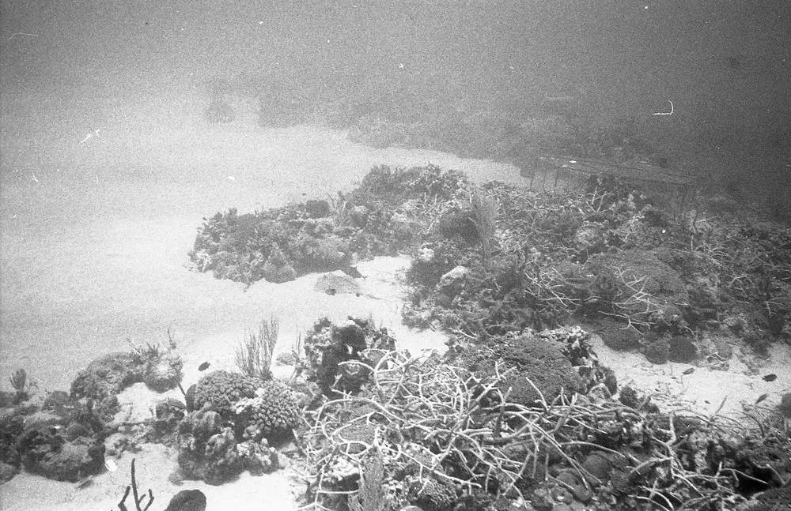{.lightbox group="discovery-bay-1966" description="**UUID: **4b37b6c6-0ec0-4fde-877e-380f777bbf19 **Date: **1968-05-25 **Location: **Jamaica | Discovery Bay | Eaton Hall **Longitude: **77.334ºW **Latitude: **18.467ºN **Photographer: **Eileen Graham **Copyright: **Trustees of the Natural History Museum (London, UK), CC-BY-4.0" alt="**UUID: **4b37b6c6-0ec0-4fde-877e-380f777bbf19 **Date: **1968-05-25 **Location: **Jamaica | Discovery Bay | Eaton Hall **Longitude: **77.334ºW **Latitude: **18.467ºN **Photographer: **Eileen Graham **Copyright: **Trustees of the Natural History Museum (London, UK), CC-BY-4.0"}

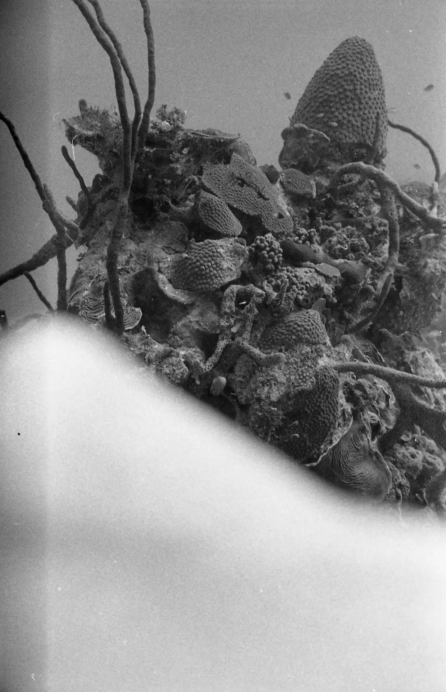{.lightbox group="discovery-bay-1966" description="**UUID: **d980baaf-745b-485a-90fa-53c05d1f2489 **Date: **1968-02-06 **Location: **Jamaica | Discovery Bay | Pear Tree Bottom **Longitude: **77.35867ºW **Latitude: **18.4635ºN **Photographer: **Eileen Graham **Copyright: **Trustees of the Natural History Museum (London, UK), CC-BY-4.0" alt="**UUID: **d980baaf-745b-485a-90fa-53c05d1f2489 **Date: **1968-02-06 **Location: **Jamaica | Discovery Bay | Pear Tree Bottom **Longitude: **77.35867ºW **Latitude: **18.4635ºN **Photographer: **Eileen Graham **Copyright: **Trustees of the Natural History Museum (London, UK), CC-BY-4.0"}

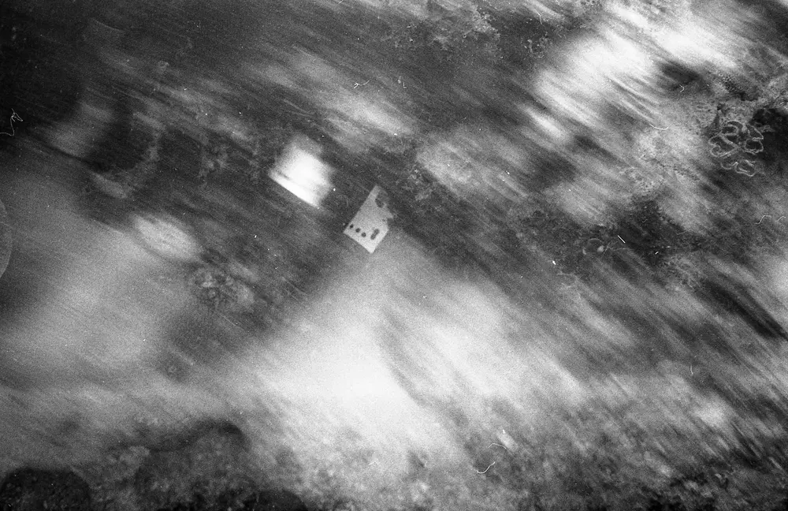{.lightbox group="discovery-bay-1966" description="**UUID: **da7d69aa-b99c-44a5-9458-69dfd840e3c3 **Date: **1966-08-26 **Location: **Jamaica | Discovery Bay | Buoy Upper Slope **Longitude: **77.40908ºW **Latitude: **18.47322ºN **Photographer: **Eileen Graham **Copyright: **Trustees of the Natural History Museum (London, UK), CC-BY-4.0" alt="**UUID: **da7d69aa-b99c-44a5-9458-69dfd840e3c3 **Date: **1966-08-26 **Location: **Jamaica | Discovery Bay | Buoy Upper Slope **Longitude: **77.40908ºW **Latitude: **18.47322ºN **Photographer: **Eileen Graham **Copyright: **Trustees of the Natural History Museum (London, UK), CC-BY-4.0"}

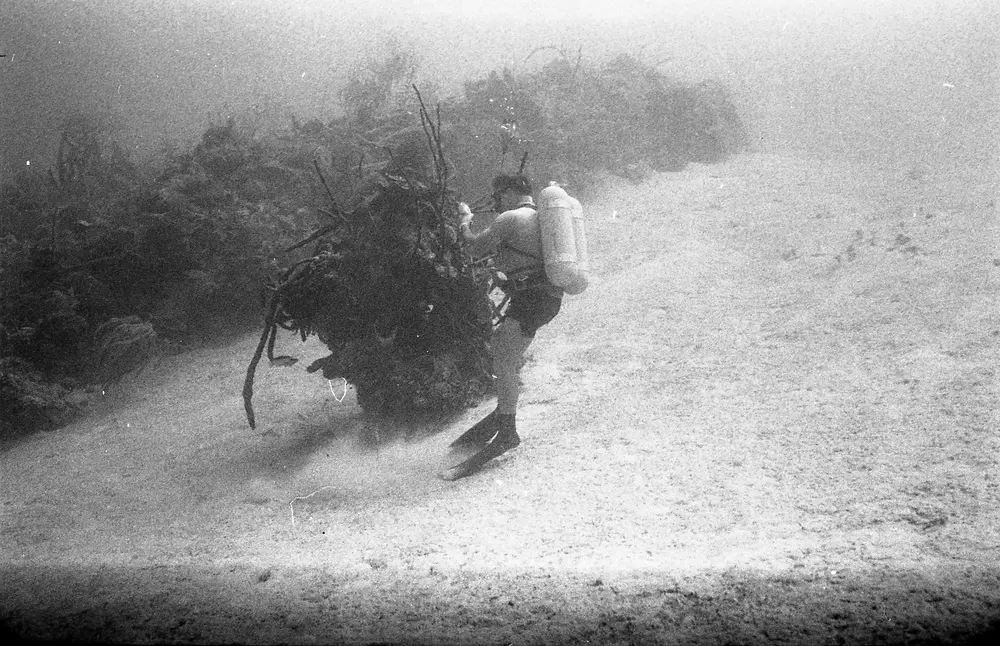{.lightbox group="discovery-bay-1966" description="**UUID: **dab8727d-2836-4305-b00a-1e1efb4d246f **Date: **1968-02-06 **Location: **Jamaica | Discovery Bay | Pear Tree Bottom **Longitude: **77.35867ºW **Latitude: **18.4635ºN **Photographer: **Eileen Graham **Copyright: **Trustees of the Natural History Museum (London, UK), CC-BY-4.0" alt="**UUID: **dab8727d-2836-4305-b00a-1e1efb4d246f **Date: **1968-02-06 **Location: **Jamaica | Discovery Bay | Pear Tree Bottom **Longitude: **77.35867ºW **Latitude: **18.4635ºN **Photographer: **Eileen Graham **Copyright: **Trustees of the Natural History Museum (London, UK), CC-BY-4.0"}

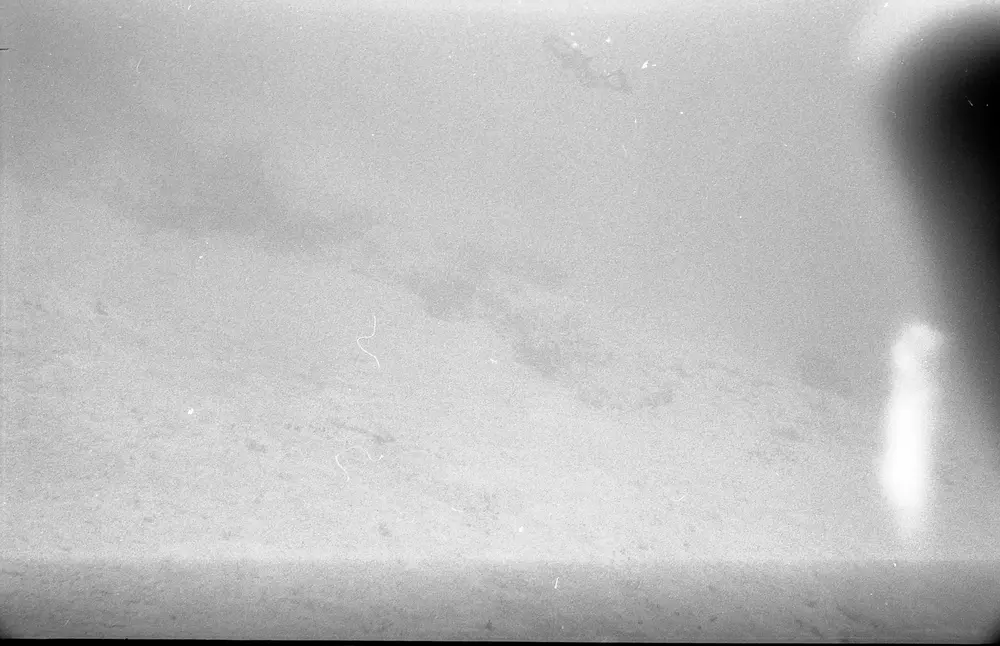{.lightbox group="discovery-bay-1966" description="**UUID: **21368cb9-8131-455f-9e01-9b3099d77790 **Date: **1968-02-06 **Location: **Jamaica | Discovery Bay | Pear Tree Bottom **Longitude: **77.35867ºW **Latitude: **18.4635ºN **Photographer: **Eileen Graham **Copyright: **Trustees of the Natural History Museum (London, UK), CC-BY-4.0" alt="**UUID: **21368cb9-8131-455f-9e01-9b3099d77790 **Date: **1968-02-06 **Location: **Jamaica | Discovery Bay | Pear Tree Bottom **Longitude: **77.35867ºW **Latitude: **18.4635ºN **Photographer: **Eileen Graham **Copyright: **Trustees of the Natural History Museum (London, UK), CC-BY-4.0"}

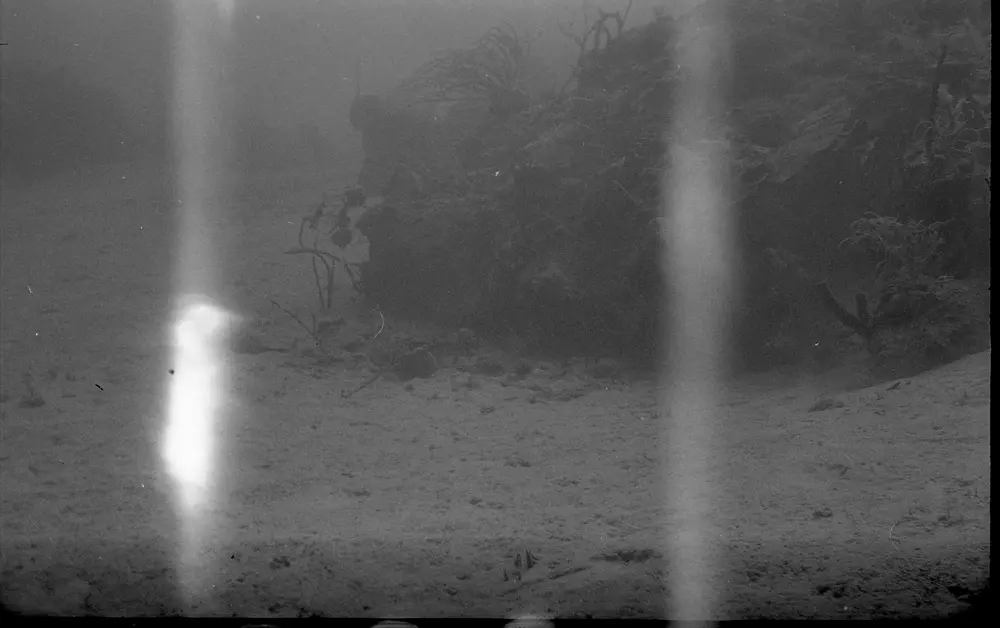{.lightbox group="discovery-bay-1966" description="**UUID: **2187df08-a1bf-41bc-a080-2b2ff1a8fc5d **Date: **1968-02-06 **Location: **Jamaica | Discovery Bay | Pear Tree Bottom **Longitude: **77.35867ºW **Latitude: **18.4635ºN **Photographer: **Eileen Graham **Copyright: **Trustees of the Natural History Museum (London, UK), CC-BY-4.0" alt="**UUID: **2187df08-a1bf-41bc-a080-2b2ff1a8fc5d **Date: **1968-02-06 **Location: **Jamaica | Discovery Bay | Pear Tree Bottom **Longitude: **77.35867ºW **Latitude: **18.4635ºN **Photographer: **Eileen Graham **Copyright: **Trustees of the Natural History Museum (London, UK), CC-BY-4.0"}

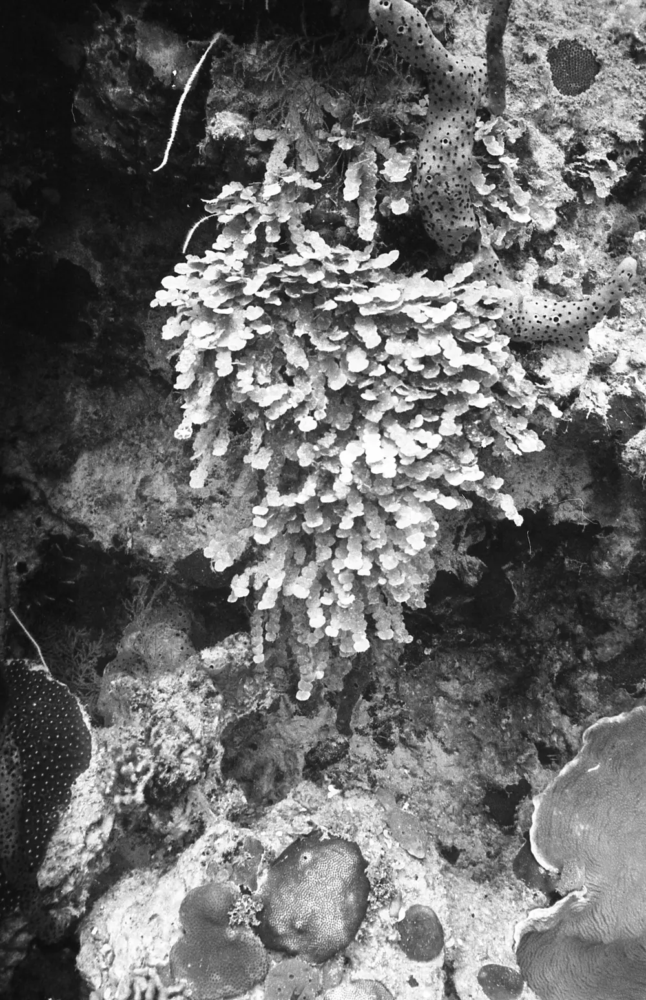{.lightbox group="discovery-bay-1966" description="**UUID: **2f2b58e2-6bb3-44b0-be9d-301ed68ece1b **Date: **1968-02-06 **Location: **Jamaica | Discovery Bay | Pear Tree Bottom **Longitude: **77.35867ºW **Latitude: **18.4635ºN **Photographer: **Eileen Graham **Copyright: **Trustees of the Natural History Museum (London, UK), CC-BY-4.0" alt="**UUID: **2f2b58e2-6bb3-44b0-be9d-301ed68ece1b **Date: **1968-02-06 **Location: **Jamaica | Discovery Bay | Pear Tree Bottom **Longitude: **77.35867ºW **Latitude: **18.4635ºN **Photographer: **Eileen Graham **Copyright: **Trustees of the Natural History Museum (London, UK), CC-BY-4.0"}

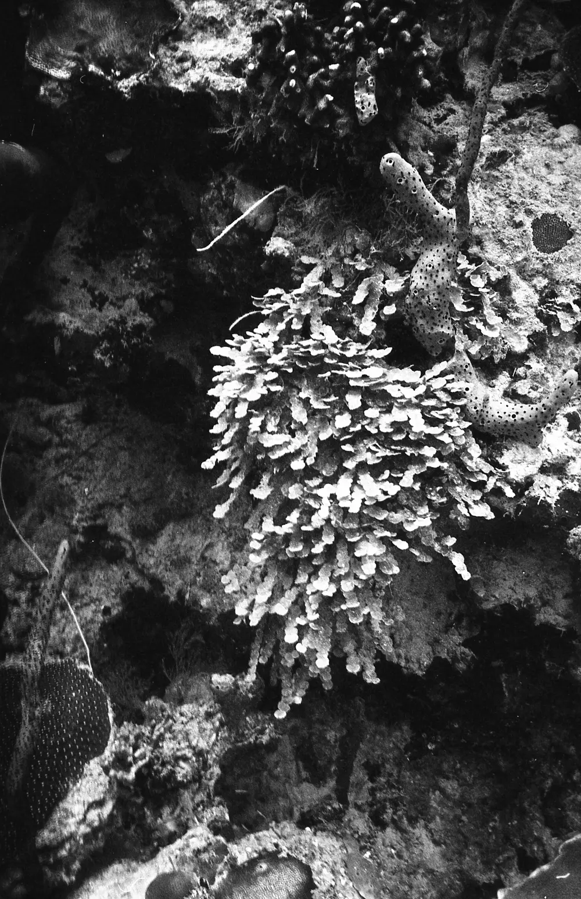{.lightbox group="discovery-bay-1966" description="**UUID: **c2dc2cb4-34b2-4aff-bbeb-bf6031b49204 **Date: **1968-02-06 **Location: **Jamaica | Discovery Bay | Pear Tree Bottom **Longitude: **77.35867ºW **Latitude: **18.4635ºN **Photographer: **Eileen Graham **Copyright: **Trustees of the Natural History Museum (London, UK), CC-BY-4.0" alt="**UUID: **c2dc2cb4-34b2-4aff-bbeb-bf6031b49204 **Date: **1968-02-06 **Location: **Jamaica | Discovery Bay | Pear Tree Bottom **Longitude: **77.35867ºW **Latitude: **18.4635ºN **Photographer: **Eileen Graham **Copyright: **Trustees of the Natural History Museum (London, UK), CC-BY-4.0"}

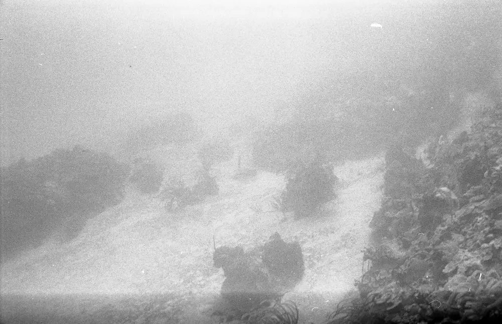{.lightbox group="discovery-bay-1966" description="**UUID: **79f63b2d-6c84-454a-b056-58d5ce3723f1 **Date: **1968-02-06 **Location: **Jamaica | Discovery Bay | Pear Tree Bottom **Longitude: **77.35867ºW **Latitude: **18.4635ºN **Photographer: **Eileen Graham **Copyright: **Trustees of the Natural History Museum (London, UK), CC-BY-4.0" alt="**UUID: **79f63b2d-6c84-454a-b056-58d5ce3723f1 **Date: **1968-02-06 **Location: **Jamaica | Discovery Bay | Pear Tree Bottom **Longitude: **77.35867ºW **Latitude: **18.4635ºN **Photographer: **Eileen Graham **Copyright: **Trustees of the Natural History Museum (London, UK), CC-BY-4.0"}

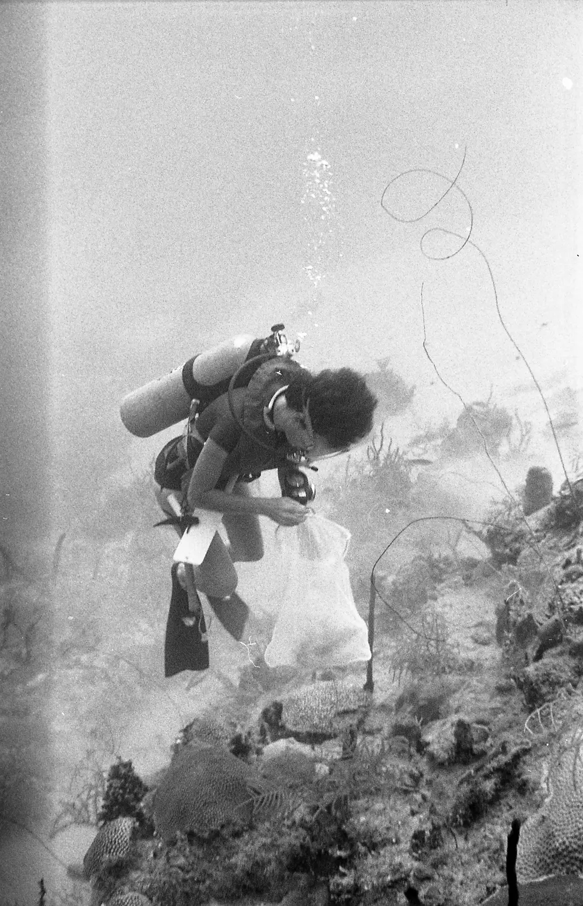{.lightbox group="discovery-bay-1966" description="**UUID: **69796190-3c17-4a21-a3e0-72d2b4d03197 **Date: **1968-02-06 **Location: **Jamaica | Discovery Bay | Pear Tree Bottom **Longitude: **77.35867ºW **Latitude: **18.4635ºN **Photographer: **Eileen Graham **Copyright: **Trustees of the Natural History Museum (London, UK), CC-BY-4.0" alt="**UUID: **69796190-3c17-4a21-a3e0-72d2b4d03197 **Date: **1968-02-06 **Location: **Jamaica | Discovery Bay | Pear Tree Bottom **Longitude: **77.35867ºW **Latitude: **18.4635ºN **Photographer: **Eileen Graham **Copyright: **Trustees of the Natural History Museum (London, UK), CC-BY-4.0"}

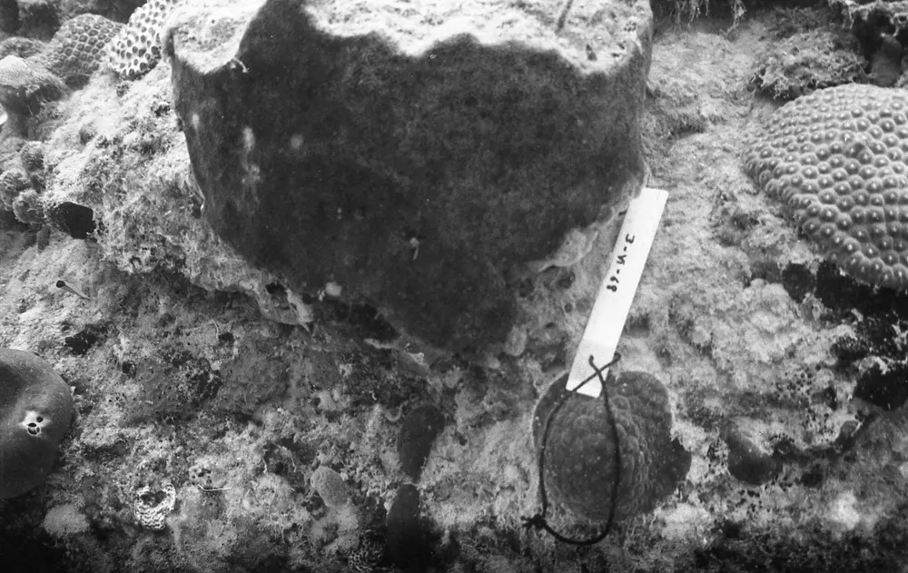{.lightbox group="discovery-bay-1966" description="**UUID: **4cd8ced7-04c9-4422-b29b-601003558e1b **Date: **1968-02-06 **Location: **Jamaica | Discovery Bay | Pear Tree Bottom **Longitude: **77.35867ºW **Latitude: **18.4635ºN **Photographer: **Eileen Graham **Copyright: **Trustees of the Natural History Museum (London, UK), CC-BY-4.0" alt="**UUID: **4cd8ced7-04c9-4422-b29b-601003558e1b **Date: **1968-02-06 **Location: **Jamaica | Discovery Bay | Pear Tree Bottom **Longitude: **77.35867ºW **Latitude: **18.4635ºN **Photographer: **Eileen Graham **Copyright: **Trustees of the Natural History Museum (London, UK), CC-BY-4.0"}

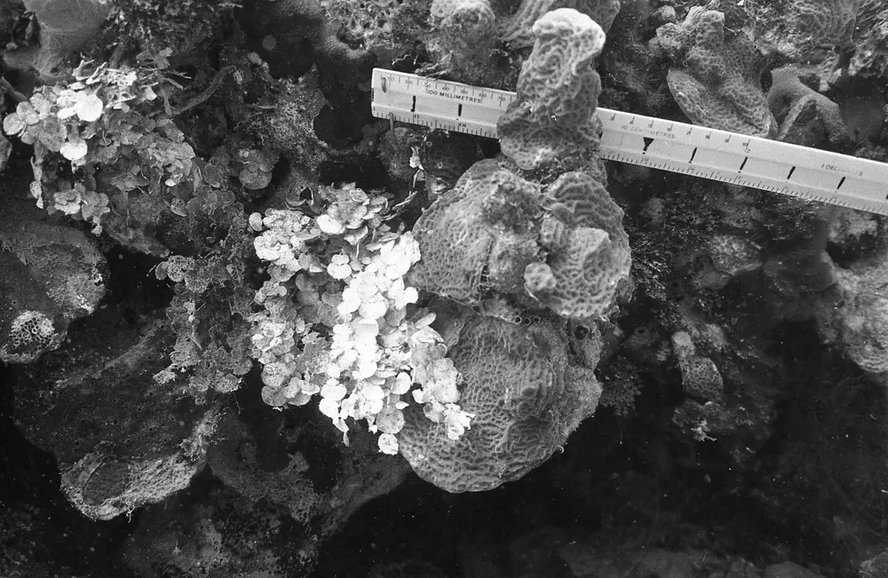{.lightbox group="discovery-bay-1966" description="**UUID: **123af891-c56b-42e1-9807-1ce87ec7509e **Date: **1966-08-26 **Location: **Jamaica | Discovery Bay | Buoy Upper Slope **Longitude: **77.40908ºW **Latitude: **18.47322ºN **Photographer: **Eileen Graham **Copyright: **Trustees of the Natural History Museum (London, UK), CC-BY-4.0" alt="**UUID: **123af891-c56b-42e1-9807-1ce87ec7509e **Date: **1966-08-26 **Location: **Jamaica | Discovery Bay | Buoy Upper Slope **Longitude: **77.40908ºW **Latitude: **18.47322ºN **Photographer: **Eileen Graham **Copyright: **Trustees of the Natural History Museum (London, UK), CC-BY-4.0"}

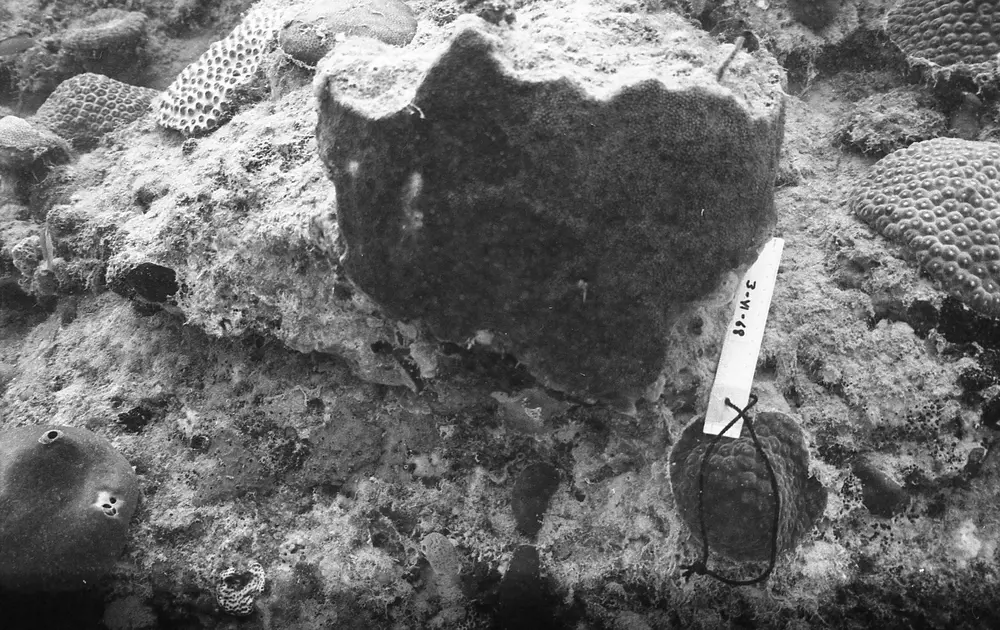{.lightbox group="discovery-bay-1966" description="**UUID: **ad2362e1-4cae-4c8d-93c3-fae61eee9a9f **Date: **1968-02-06 **Location: **Jamaica | Discovery Bay | Pear Tree Bottom **Longitude: **77.35867ºW **Latitude: **18.4635ºN **Photographer: **Eileen Graham **Copyright: **Trustees of the Natural History Museum (London, UK), CC-BY-4.0" alt="**UUID: **ad2362e1-4cae-4c8d-93c3-fae61eee9a9f **Date: **1968-02-06 **Location: **Jamaica | Discovery Bay | Pear Tree Bottom **Longitude: **77.35867ºW **Latitude: **18.4635ºN **Photographer: **Eileen Graham **Copyright: **Trustees of the Natural History Museum (London, UK), CC-BY-4.0"}

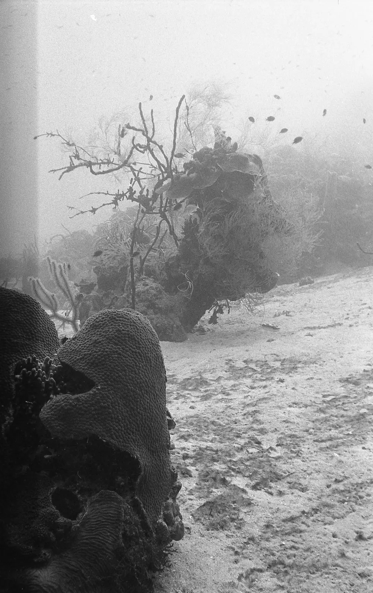{.lightbox group="discovery-bay-1966" description="**UUID: **d3f89703-1df8-41d0-a6d1-e5abc35d8ec5 **Date: **1968-02-06 **Location: **Jamaica | Discovery Bay | Pear Tree Bottom **Longitude: **77.35867ºW **Latitude: **18.4635ºN **Photographer: **Eileen Graham **Copyright: **Trustees of the Natural History Museum (London, UK), CC-BY-4.0" alt="**UUID: **d3f89703-1df8-41d0-a6d1-e5abc35d8ec5 **Date: **1968-02-06 **Location: **Jamaica | Discovery Bay | Pear Tree Bottom **Longitude: **77.35867ºW **Latitude: **18.4635ºN **Photographer: **Eileen Graham **Copyright: **Trustees of the Natural History Museum (London, UK), CC-BY-4.0"}

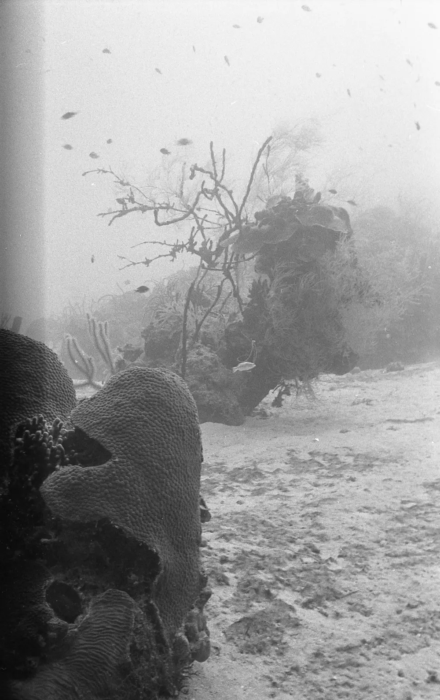{.lightbox group="discovery-bay-1966" description="**UUID: **7b93599f-bd4d-4201-877b-b67b24fe29f2 **Date: **1968-02-06 **Location: **Jamaica | Discovery Bay | Pear Tree Bottom **Longitude: **77.35867ºW **Latitude: **18.4635ºN **Photographer: **Eileen Graham **Copyright: **Trustees of the Natural History Museum (London, UK), CC-BY-4.0" alt="**UUID: **7b93599f-bd4d-4201-877b-b67b24fe29f2 **Date: **1968-02-06 **Location: **Jamaica | Discovery Bay | Pear Tree Bottom **Longitude: **77.35867ºW **Latitude: **18.4635ºN **Photographer: **Eileen Graham **Copyright: **Trustees of the Natural History Museum (London, UK), CC-BY-4.0"}

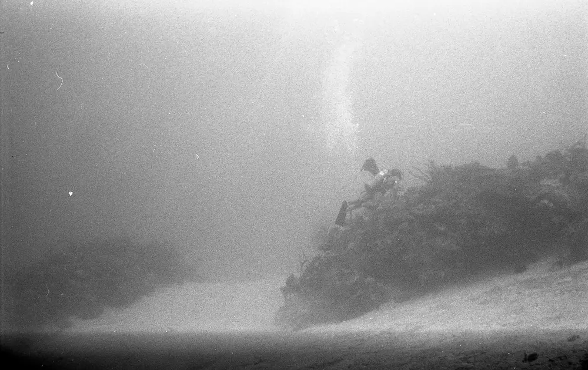{.lightbox group="discovery-bay-1966" description="**UUID: **eb176ec1-f573-45c6-8847-99c6a355d736 **Date: **1968-02-06 **Location: **Jamaica | Discovery Bay | Pear Tree Bottom **Longitude: **77.35867ºW **Latitude: **18.4635ºN **Photographer: **Eileen Graham **Copyright: **Trustees of the Natural History Museum (London, UK), CC-BY-4.0" alt="**UUID: **eb176ec1-f573-45c6-8847-99c6a355d736 **Date: **1968-02-06 **Location: **Jamaica | Discovery Bay | Pear Tree Bottom **Longitude: **77.35867ºW **Latitude: **18.4635ºN **Photographer: **Eileen Graham **Copyright: **Trustees of the Natural History Museum (London, UK), CC-BY-4.0"}

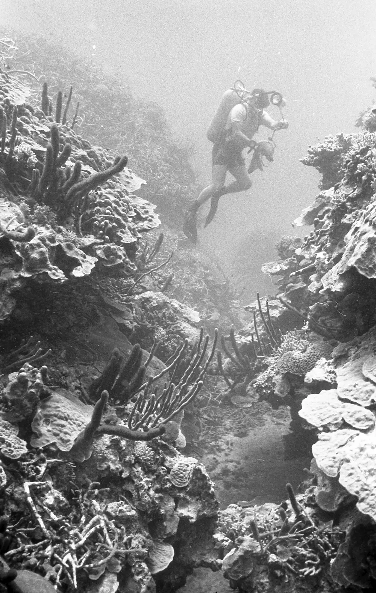{.lightbox group="discovery-bay-1966" description="**UUID: **cca422cf-3c4e-4d96-a14a-546512f06f7f **Date: **1968-02-06 **Location: **Jamaica | Discovery Bay | Pear Tree Bottom **Longitude: **77.35867ºW **Latitude: **18.4635ºN **Photographer: **Eileen Graham **Copyright: **Trustees of the Natural History Museum (London, UK), CC-BY-4.0" alt="**UUID: **cca422cf-3c4e-4d96-a14a-546512f06f7f **Date: **1968-02-06 **Location: **Jamaica | Discovery Bay | Pear Tree Bottom **Longitude: **77.35867ºW **Latitude: **18.4635ºN **Photographer: **Eileen Graham **Copyright: **Trustees of the Natural History Museum (London, UK), CC-BY-4.0"}

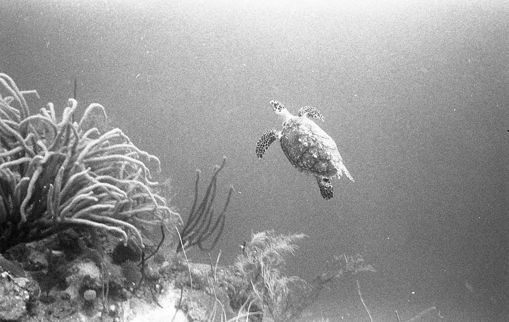{.lightbox group="discovery-bay-1966" description="**UUID: **95fb350d-35dd-47be-830e-ccc96995f347 **Date: **1968-02-06 **Location: **Jamaica | Discovery Bay | Pear Tree Bottom **Longitude: **77.35867ºW **Latitude: **18.4635ºN **Photographer: **Eileen Graham **Copyright: **Trustees of the Natural History Museum (London, UK), CC-BY-4.0" alt="**UUID: **95fb350d-35dd-47be-830e-ccc96995f347 **Date: **1968-02-06 **Location: **Jamaica | Discovery Bay | Pear Tree Bottom **Longitude: **77.35867ºW **Latitude: **18.4635ºN **Photographer: **Eileen Graham **Copyright: **Trustees of the Natural History Museum (London, UK), CC-BY-4.0"}

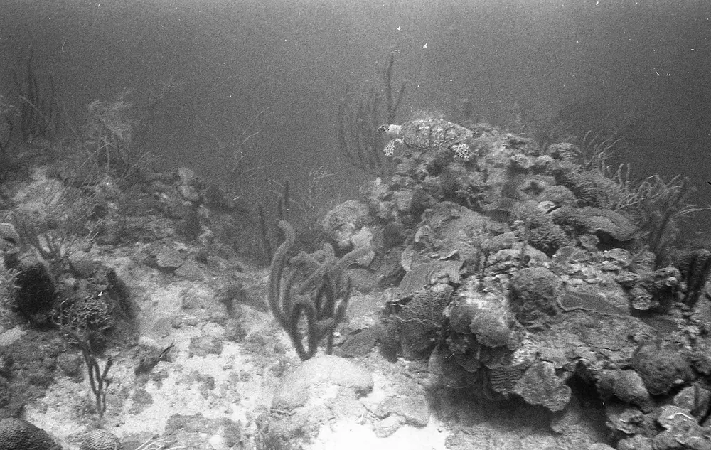{.lightbox group="discovery-bay-1966" description="**UUID: **f98235cc-9385-4095-8b37-f5fc0dc6c5c9 **Date: **1968-02-06 **Location: **Jamaica | Discovery Bay | Pear Tree Bottom **Longitude: **77.35867ºW **Latitude: **18.4635ºN **Photographer: **Eileen Graham **Copyright: **Trustees of the Natural History Museum (London, UK), CC-BY-4.0" alt="**UUID: **f98235cc-9385-4095-8b37-f5fc0dc6c5c9 **Date: **1968-02-06 **Location: **Jamaica | Discovery Bay | Pear Tree Bottom **Longitude: **77.35867ºW **Latitude: **18.4635ºN **Photographer: **Eileen Graham **Copyright: **Trustees of the Natural History Museum (London, UK), CC-BY-4.0"}

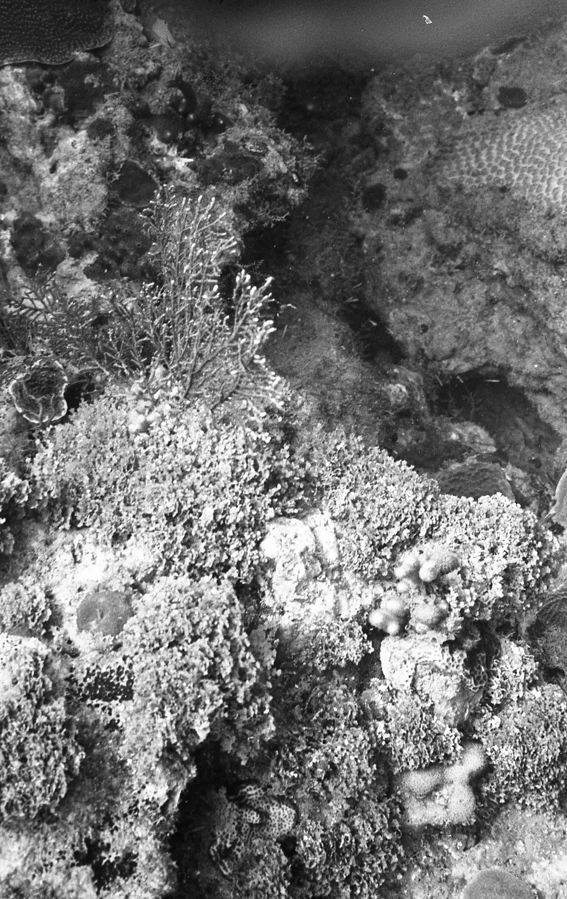{.lightbox group="discovery-bay-1966" description="**UUID: **3999656b-4529-465c-96f4-ade62275fd4a **Date: **1968-02-06 **Location: **Jamaica | Discovery Bay | Pear Tree Bottom **Longitude: **77.35867ºW **Latitude: **18.4635ºN **Photographer: **Eileen Graham **Copyright: **Trustees of the Natural History Museum (London, UK), CC-BY-4.0" alt="**UUID: **3999656b-4529-465c-96f4-ade62275fd4a **Date: **1968-02-06 **Location: **Jamaica | Discovery Bay | Pear Tree Bottom **Longitude: **77.35867ºW **Latitude: **18.4635ºN **Photographer: **Eileen Graham **Copyright: **Trustees of the Natural History Museum (London, UK), CC-BY-4.0"}

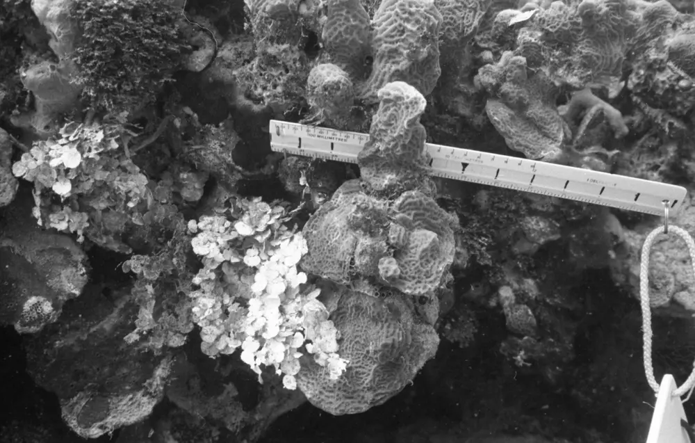{.lightbox group="discovery-bay-1966" description="**UUID: **df9fdfe5-09fb-43e5-b160-1049e43f894a **Date: **1966-08-26 **Location: **Jamaica | Discovery Bay | Buoy Upper Slope **Longitude: **77.40908ºW **Latitude: **18.47322ºN **Photographer: **Eileen Graham **Copyright: **Trustees of the Natural History Museum (London, UK), CC-BY-4.0" alt="**UUID: **df9fdfe5-09fb-43e5-b160-1049e43f894a **Date: **1966-08-26 **Location: **Jamaica | Discovery Bay | Buoy Upper Slope **Longitude: **77.40908ºW **Latitude: **18.47322ºN **Photographer: **Eileen Graham **Copyright: **Trustees of the Natural History Museum (London, UK), CC-BY-4.0"}

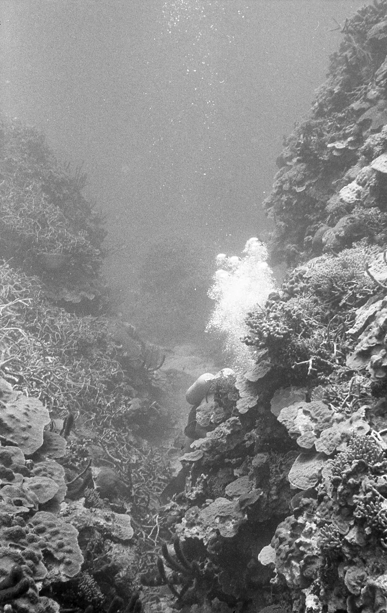{.lightbox group="discovery-bay-1966" description="**UUID: **6b71a82b-23c2-4a46-a495-f09ce1373361 **Date: **1968-02-06 **Location: **Jamaica | Discovery Bay | Pear Tree Bottom **Longitude: **77.35867ºW **Latitude: **18.4635ºN **Photographer: **Eileen Graham **Copyright: **Trustees of the Natural History Museum (London, UK), CC-BY-4.0" alt="**UUID: **6b71a82b-23c2-4a46-a495-f09ce1373361 **Date: **1968-02-06 **Location: **Jamaica | Discovery Bay | Pear Tree Bottom **Longitude: **77.35867ºW **Latitude: **18.4635ºN **Photographer: **Eileen Graham **Copyright: **Trustees of the Natural History Museum (London, UK), CC-BY-4.0"}

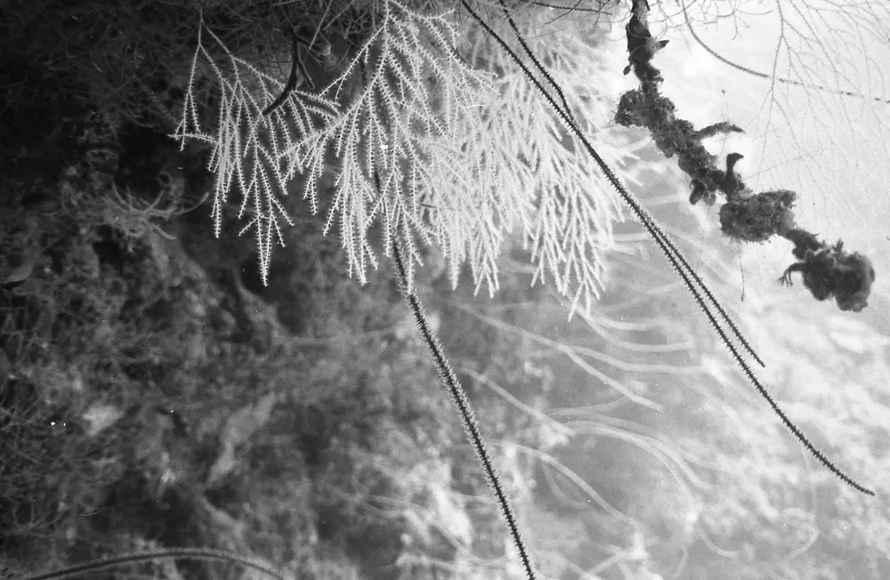{.lightbox group="discovery-bay-1966" description="**UUID: **879a2b7b-1769-4d37-8399-d74239c2e20c **Date: **1968-02-06 **Location: **Jamaica | Discovery Bay | Pear Tree Bottom **Longitude: **77.35867ºW **Latitude: **18.4635ºN **Photographer: **Eileen Graham **Copyright: **Trustees of the Natural History Museum (London, UK), CC-BY-4.0" alt="**UUID: **879a2b7b-1769-4d37-8399-d74239c2e20c **Date: **1968-02-06 **Location: **Jamaica | Discovery Bay | Pear Tree Bottom **Longitude: **77.35867ºW **Latitude: **18.4635ºN **Photographer: **Eileen Graham **Copyright: **Trustees of the Natural History Museum (London, UK), CC-BY-4.0"}

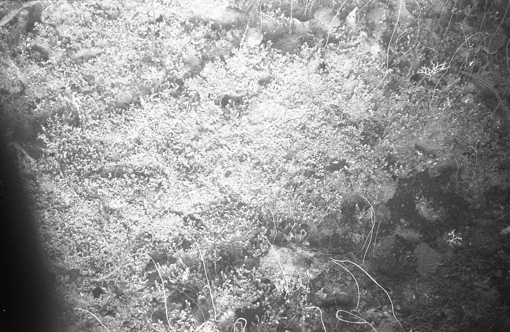{.lightbox group="discovery-bay-1966" description="**UUID: **238ea33d-88fc-498e-b0a5-1d36fb2b3c60 **Date: **1968-02-06 **Location: **Jamaica | Discovery Bay | Pear Tree Bottom **Longitude: **77.35867ºW **Latitude: **18.4635ºN **Photographer: **Eileen Graham **Copyright: **Trustees of the Natural History Museum (London, UK), CC-BY-4.0" alt="**UUID: **238ea33d-88fc-498e-b0a5-1d36fb2b3c60 **Date: **1968-02-06 **Location: **Jamaica | Discovery Bay | Pear Tree Bottom **Longitude: **77.35867ºW **Latitude: **18.4635ºN **Photographer: **Eileen Graham **Copyright: **Trustees of the Natural History Museum (London, UK), CC-BY-4.0"}

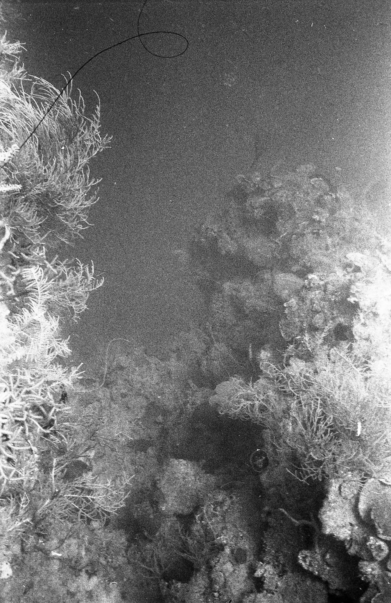{.lightbox group="discovery-bay-1966" description="**UUID: **859e5d41-75ec-4b12-83de-befb1e1dcb85 **Date: **1968-02-06 **Location: **Jamaica | Discovery Bay | Pear Tree Bottom **Longitude: **77.35867ºW **Latitude: **18.4635ºN **Photographer: **Eileen Graham **Copyright: **Trustees of the Natural History Museum (London, UK), CC-BY-4.0" alt="**UUID: **859e5d41-75ec-4b12-83de-befb1e1dcb85 **Date: **1968-02-06 **Location: **Jamaica | Discovery Bay | Pear Tree Bottom **Longitude: **77.35867ºW **Latitude: **18.4635ºN **Photographer: **Eileen Graham **Copyright: **Trustees of the Natural History Museum (London, UK), CC-BY-4.0"}

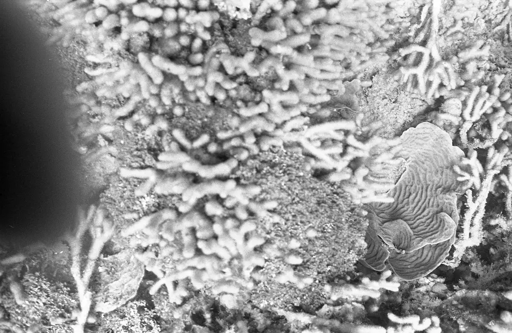{.lightbox group="discovery-bay-1966" description="**UUID: **8eae5949-238e-4094-b806-4cf4c538ee30 **Date: **1968-02-06 **Location: **Jamaica | Discovery Bay | Pear Tree Bottom **Longitude: **77.35867ºW **Latitude: **18.4635ºN **Photographer: **Eileen Graham **Copyright: **Trustees of the Natural History Museum (London, UK), CC-BY-4.0" alt="**UUID: **8eae5949-238e-4094-b806-4cf4c538ee30 **Date: **1968-02-06 **Location: **Jamaica | Discovery Bay | Pear Tree Bottom **Longitude: **77.35867ºW **Latitude: **18.4635ºN **Photographer: **Eileen Graham **Copyright: **Trustees of the Natural History Museum (London, UK), CC-BY-4.0"}

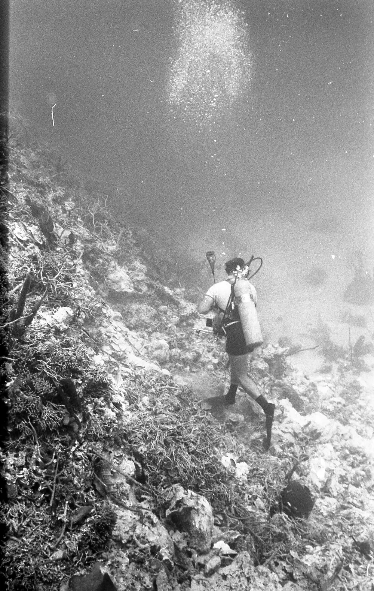{.lightbox group="discovery-bay-1966" description="**UUID: **51217715-d222-424b-aeca-c6358bc1c2f1 **Date: **1968-07-20 **Location: **Jamaica | Discovery Bay | Lyntons Mine Escarpment **Longitude: **77.41ºW **Latitude: **18.4728ºN **Photographer: **Eileen Graham **Copyright: **Trustees of the Natural History Museum (London, UK), CC-BY-4.0" alt="**UUID: **51217715-d222-424b-aeca-c6358bc1c2f1 **Date: **1968-07-20 **Location: **Jamaica | Discovery Bay | Lyntons Mine Escarpment **Longitude: **77.41ºW **Latitude: **18.4728ºN **Photographer: **Eileen Graham **Copyright: **Trustees of the Natural History Museum (London, UK), CC-BY-4.0"}

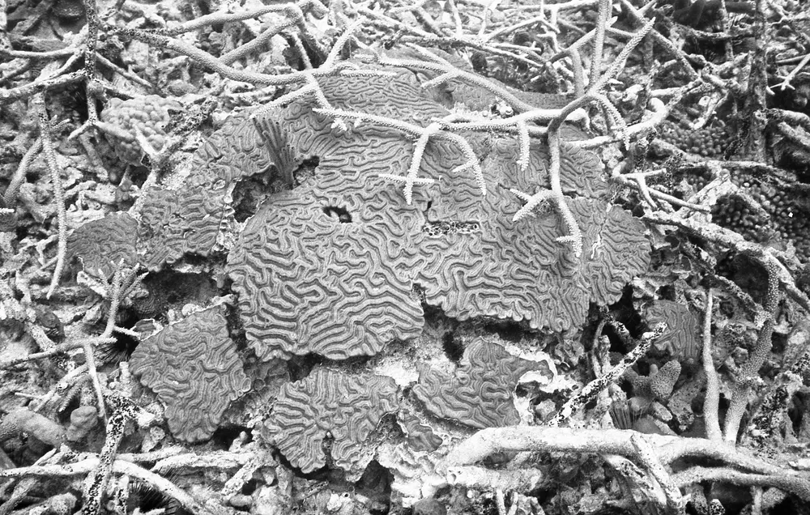{.lightbox group="discovery-bay-1966" description="**UUID: **04685f8d-35e7-4048-b9b5-3b08e31d6f67 **Date: **1968-07-20 **Location: **Jamaica | Discovery Bay | Lyntons Mine Escarpment **Longitude: **77.41ºW **Latitude: **18.4728ºN **Photographer: **Eileen Graham **Copyright: **Trustees of the Natural History Museum (London, UK), CC-BY-4.0" alt="**UUID: **04685f8d-35e7-4048-b9b5-3b08e31d6f67 **Date: **1968-07-20 **Location: **Jamaica | Discovery Bay | Lyntons Mine Escarpment **Longitude: **77.41ºW **Latitude: **18.4728ºN **Photographer: **Eileen Graham **Copyright: **Trustees of the Natural History Museum (London, UK), CC-BY-4.0"}

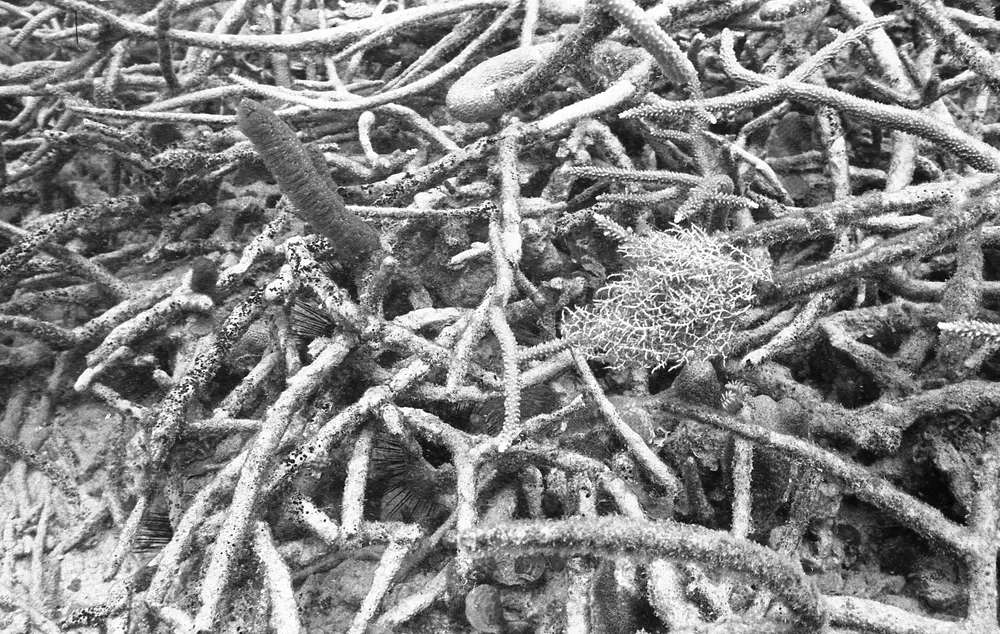{.lightbox group="discovery-bay-1966" description="**UUID: **dbe6dba6-9311-4ec7-b74f-c2caba3c7ea0 **Date: **1968-07-20 **Location: **Jamaica | Discovery Bay | Lyntons Mine Escarpment **Longitude: **77.41ºW **Latitude: **18.4728ºN **Photographer: **Eileen Graham **Copyright: **Trustees of the Natural History Museum (London, UK), CC-BY-4.0" alt="**UUID: **dbe6dba6-9311-4ec7-b74f-c2caba3c7ea0 **Date: **1968-07-20 **Location: **Jamaica | Discovery Bay | Lyntons Mine Escarpment **Longitude: **77.41ºW **Latitude: **18.4728ºN **Photographer: **Eileen Graham **Copyright: **Trustees of the Natural History Museum (London, UK), CC-BY-4.0"}

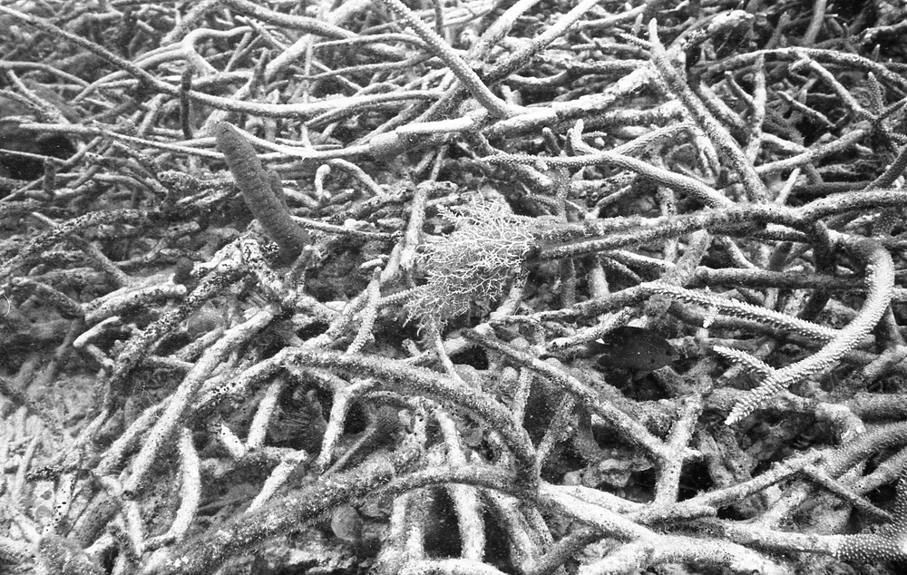{.lightbox group="discovery-bay-1966" description="**UUID: **04e77cbd-c7d0-47c9-82de-a05556b21385 **Date: **1968-07-20 **Location: **Jamaica | Discovery Bay | Lyntons Mine Escarpment **Longitude: **77.41ºW **Latitude: **18.4728ºN **Photographer: **Eileen Graham **Copyright: **Trustees of the Natural History Museum (London, UK), CC-BY-4.0" alt="**UUID: **04e77cbd-c7d0-47c9-82de-a05556b21385 **Date: **1968-07-20 **Location: **Jamaica | Discovery Bay | Lyntons Mine Escarpment **Longitude: **77.41ºW **Latitude: **18.4728ºN **Photographer: **Eileen Graham **Copyright: **Trustees of the Natural History Museum (London, UK), CC-BY-4.0"}

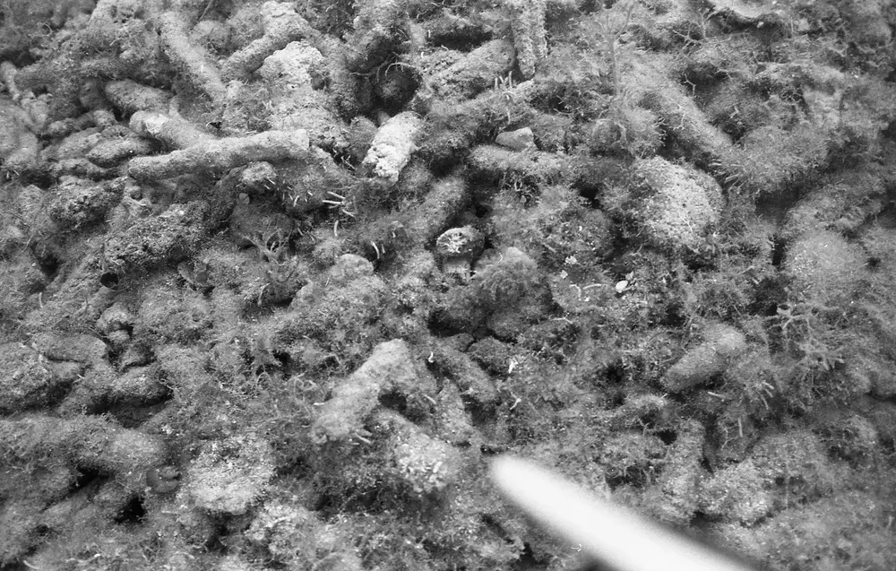{.lightbox group="discovery-bay-1966" description="**UUID: **17ff061c-6a1e-4c54-83dc-a7aef15e9540 **Date: **1966-08-26 **Location: **Jamaica | Discovery Bay | Algal Plots **Longitude: **77.414ºW **Latitude: **18.473ºN **Photographer: **Eileen Graham **Copyright: **Trustees of the Natural History Museum (London, UK), CC-BY-4.0" alt="**UUID: **17ff061c-6a1e-4c54-83dc-a7aef15e9540 **Date: **1966-08-26 **Location: **Jamaica | Discovery Bay | Algal Plots **Longitude: **77.414ºW **Latitude: **18.473ºN **Photographer: **Eileen Graham **Copyright: **Trustees of the Natural History Museum (London, UK), CC-BY-4.0"}

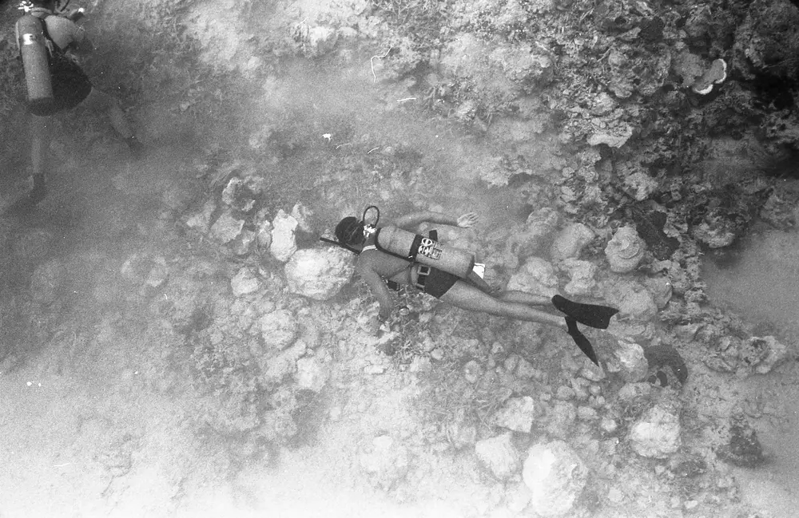{.lightbox group="discovery-bay-1966" description="**UUID: **98a2e29d-0697-419a-bd62-3efd591a04bd **Date: **1968-07-20 **Location: **Jamaica | Discovery Bay | Lyntons Mine Escarpment **Longitude: **77.41ºW **Latitude: **18.4728ºN **Photographer: **Eileen Graham **Copyright: **Trustees of the Natural History Museum (London, UK), CC-BY-4.0" alt="**UUID: **98a2e29d-0697-419a-bd62-3efd591a04bd **Date: **1968-07-20 **Location: **Jamaica | Discovery Bay | Lyntons Mine Escarpment **Longitude: **77.41ºW **Latitude: **18.4728ºN **Photographer: **Eileen Graham **Copyright: **Trustees of the Natural History Museum (London, UK), CC-BY-4.0"}

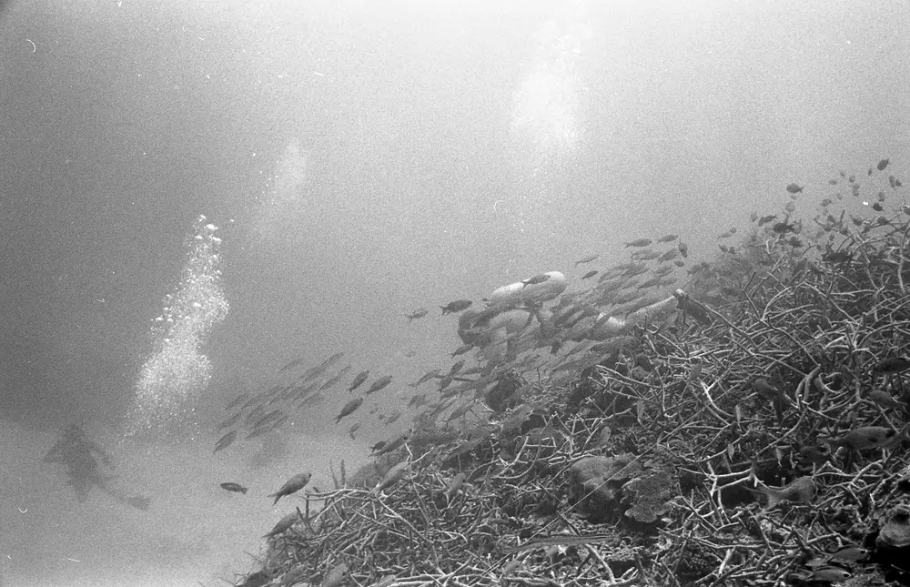{.lightbox group="discovery-bay-1966" description="**UUID: **2efcb05a-cbde-46b0-b1ce-c902721d3006 **Date: **1968-07-20 **Location: **Jamaica | Discovery Bay | Lyntons Mine Escarpment **Longitude: **77.41ºW **Latitude: **18.4728ºN **Photographer: **Eileen Graham **Copyright: **Trustees of the Natural History Museum (London, UK), CC-BY-4.0" alt="**UUID: **2efcb05a-cbde-46b0-b1ce-c902721d3006 **Date: **1968-07-20 **Location: **Jamaica | Discovery Bay | Lyntons Mine Escarpment **Longitude: **77.41ºW **Latitude: **18.4728ºN **Photographer: **Eileen Graham **Copyright: **Trustees of the Natural History Museum (London, UK), CC-BY-4.0"}

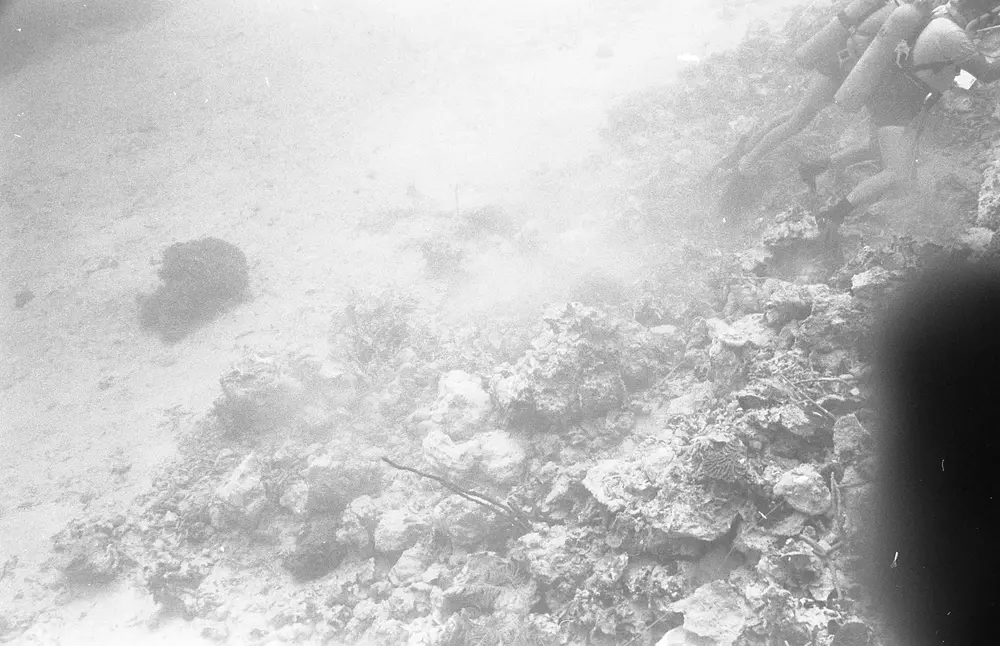{.lightbox group="discovery-bay-1966" description="**UUID: **25fc4998-f782-4f23-907b-72bf46116a74 **Date: **1968-07-20 **Location: **Jamaica | Discovery Bay | Lyntons Mine Escarpment **Longitude: **77.41ºW **Latitude: **18.4728ºN **Photographer: **Eileen Graham **Copyright: **Trustees of the Natural History Museum (London, UK), CC-BY-4.0" alt="**UUID: **25fc4998-f782-4f23-907b-72bf46116a74 **Date: **1968-07-20 **Location: **Jamaica | Discovery Bay | Lyntons Mine Escarpment **Longitude: **77.41ºW **Latitude: **18.4728ºN **Photographer: **Eileen Graham **Copyright: **Trustees of the Natural History Museum (London, UK), CC-BY-4.0"}

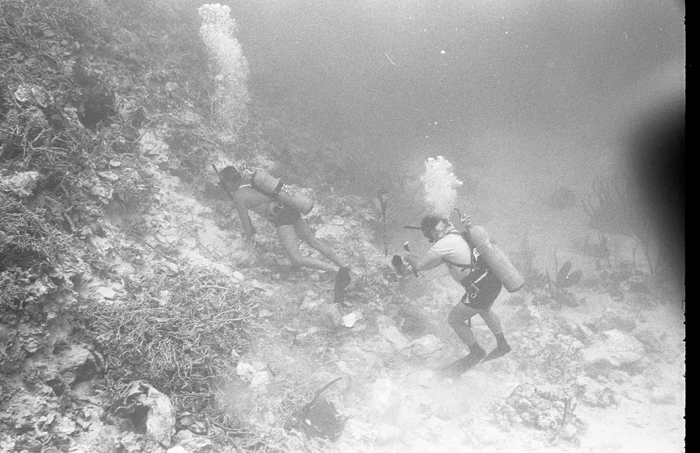{.lightbox group="discovery-bay-1966" description="**UUID: **1ff4f04d-b875-4b3c-8de7-c46c06d6b811 **Date: **1968-07-20 **Location: **Jamaica | Discovery Bay | Lyntons Mine Escarpment **Longitude: **77.41ºW **Latitude: **18.4728ºN **Photographer: **Eileen Graham **Copyright: **Trustees of the Natural History Museum (London, UK), CC-BY-4.0" alt="**UUID: **1ff4f04d-b875-4b3c-8de7-c46c06d6b811 **Date: **1968-07-20 **Location: **Jamaica | Discovery Bay | Lyntons Mine Escarpment **Longitude: **77.41ºW **Latitude: **18.4728ºN **Photographer: **Eileen Graham **Copyright: **Trustees of the Natural History Museum (London, UK), CC-BY-4.0"}

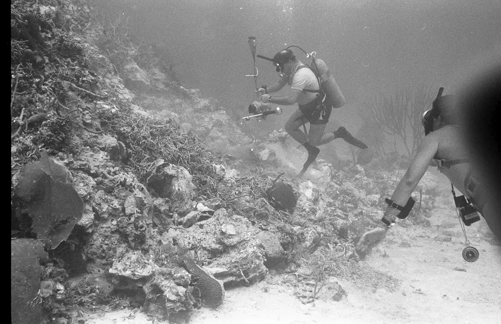{.lightbox group="discovery-bay-1966" description="**UUID: **7d084ddf-0d99-4e8a-b729-2e0caa55bcf1 **Date: **1968-07-20 **Location: **Jamaica | Discovery Bay | Lyntons Mine Escarpment **Longitude: **77.41ºW **Latitude: **18.4728ºN **Photographer: **Eileen Graham **Copyright: **Trustees of the Natural History Museum (London, UK), CC-BY-4.0" alt="**UUID: **7d084ddf-0d99-4e8a-b729-2e0caa55bcf1 **Date: **1968-07-20 **Location: **Jamaica | Discovery Bay | Lyntons Mine Escarpment **Longitude: **77.41ºW **Latitude: **18.4728ºN **Photographer: **Eileen Graham **Copyright: **Trustees of the Natural History Museum (London, UK), CC-BY-4.0"}

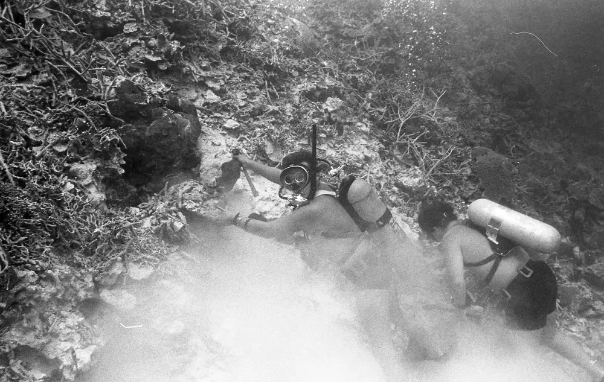{.lightbox group="discovery-bay-1966" description="**UUID: **a78fe96a-7084-4e8e-9230-5ecde6fb6694 **Date: **1968-07-20 **Location: **Jamaica | Discovery Bay | Lyntons Mine Escarpment **Longitude: **77.41ºW **Latitude: **18.4728ºN **Photographer: **Eileen Graham **Copyright: **Trustees of the Natural History Museum (London, UK), CC-BY-4.0" alt="**UUID: **a78fe96a-7084-4e8e-9230-5ecde6fb6694 **Date: **1968-07-20 **Location: **Jamaica | Discovery Bay | Lyntons Mine Escarpment **Longitude: **77.41ºW **Latitude: **18.4728ºN **Photographer: **Eileen Graham **Copyright: **Trustees of the Natural History Museum (London, UK), CC-BY-4.0"}

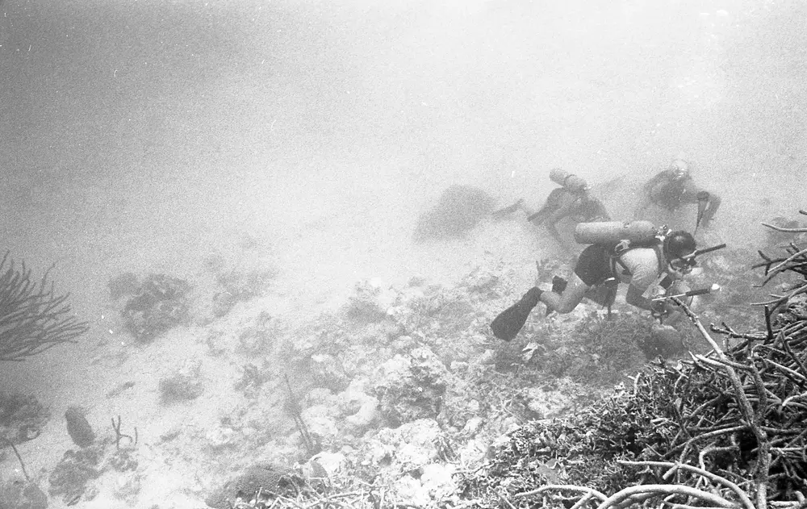{.lightbox group="discovery-bay-1966" description="**UUID: **b16d9aea-25ed-49f1-85f9-acba5f921069 **Date: **1968-07-20 **Location: **Jamaica | Discovery Bay | Lyntons Mine Escarpment **Longitude: **77.41ºW **Latitude: **18.4728ºN **Photographer: **Eileen Graham **Copyright: **Trustees of the Natural History Museum (London, UK), CC-BY-4.0" alt="**UUID: **b16d9aea-25ed-49f1-85f9-acba5f921069 **Date: **1968-07-20 **Location: **Jamaica | Discovery Bay | Lyntons Mine Escarpment **Longitude: **77.41ºW **Latitude: **18.4728ºN **Photographer: **Eileen Graham **Copyright: **Trustees of the Natural History Museum (London, UK), CC-BY-4.0"}

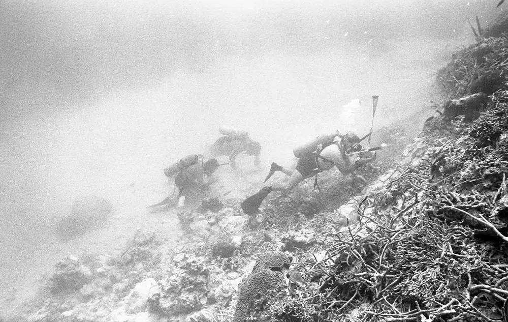{.lightbox group="discovery-bay-1966" description="**UUID: **327b29e3-40c7-4316-9d46-20ccad33e28d **Date: **1968-07-20 **Location: **Jamaica | Discovery Bay | Lyntons Mine Escarpment **Longitude: **77.41ºW **Latitude: **18.4728ºN **Photographer: **Eileen Graham **Copyright: **Trustees of the Natural History Museum (London, UK), CC-BY-4.0" alt="**UUID: **327b29e3-40c7-4316-9d46-20ccad33e28d **Date: **1968-07-20 **Location: **Jamaica | Discovery Bay | Lyntons Mine Escarpment **Longitude: **77.41ºW **Latitude: **18.4728ºN **Photographer: **Eileen Graham **Copyright: **Trustees of the Natural History Museum (London, UK), CC-BY-4.0"}

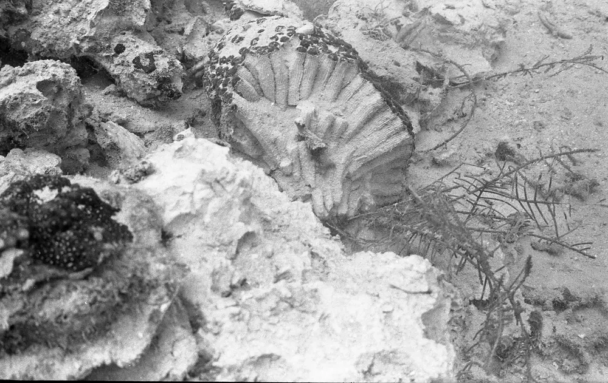{.lightbox group="discovery-bay-1966" description="**UUID: **929f6e8b-eaca-4b9c-a83d-e5d9e7bc3439 **Date: **1968-07-20 **Location: **Jamaica | Discovery Bay | Lyntons Mine Escarpment **Longitude: **77.41ºW **Latitude: **18.4728ºN **Photographer: **Eileen Graham **Copyright: **Trustees of the Natural History Museum (London, UK), CC-BY-4.0" alt="**UUID: **929f6e8b-eaca-4b9c-a83d-e5d9e7bc3439 **Date: **1968-07-20 **Location: **Jamaica | Discovery Bay | Lyntons Mine Escarpment **Longitude: **77.41ºW **Latitude: **18.4728ºN **Photographer: **Eileen Graham **Copyright: **Trustees of the Natural History Museum (London, UK), CC-BY-4.0"}

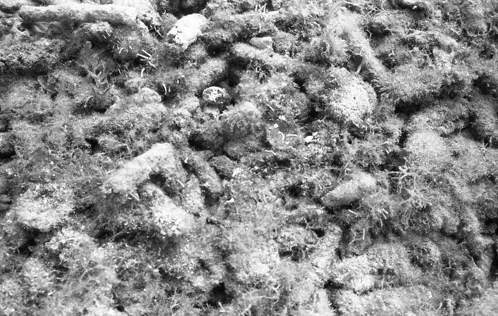{.lightbox group="discovery-bay-1966" description="**UUID: **b4278f55-0270-408c-a8d0-796a2136c9da **Date: **1966-08-26 **Location: **Jamaica | Discovery Bay | Algal Plots **Longitude: **77.414ºW **Latitude: **18.473ºN **Photographer: **Eileen Graham **Copyright: **Trustees of the Natural History Museum (London, UK), CC-BY-4.0" alt="**UUID: **b4278f55-0270-408c-a8d0-796a2136c9da **Date: **1966-08-26 **Location: **Jamaica | Discovery Bay | Algal Plots **Longitude: **77.414ºW **Latitude: **18.473ºN **Photographer: **Eileen Graham **Copyright: **Trustees of the Natural History Museum (London, UK), CC-BY-4.0"}

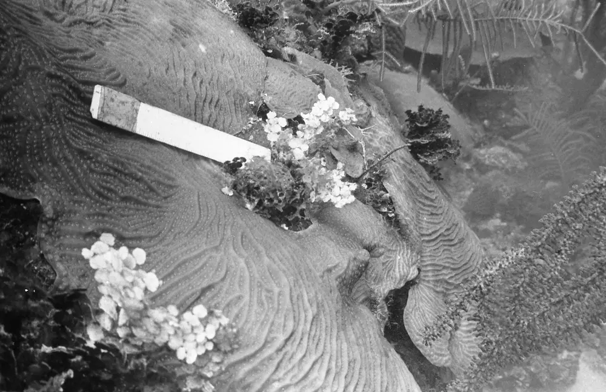{.lightbox group="discovery-bay-1966" description="**UUID: **6d5f5fb2-119d-4724-86cc-6269b916464a **Date: **1968-07-20 **Location: **Jamaica | Discovery Bay | Lyntons Mine Escarpment **Longitude: **77.41ºW **Latitude: **18.4728ºN **Photographer: **Eileen Graham **Copyright: **Trustees of the Natural History Museum (London, UK), CC-BY-4.0" alt="**UUID: **6d5f5fb2-119d-4724-86cc-6269b916464a **Date: **1968-07-20 **Location: **Jamaica | Discovery Bay | Lyntons Mine Escarpment **Longitude: **77.41ºW **Latitude: **18.4728ºN **Photographer: **Eileen Graham **Copyright: **Trustees of the Natural History Museum (London, UK), CC-BY-4.0"}

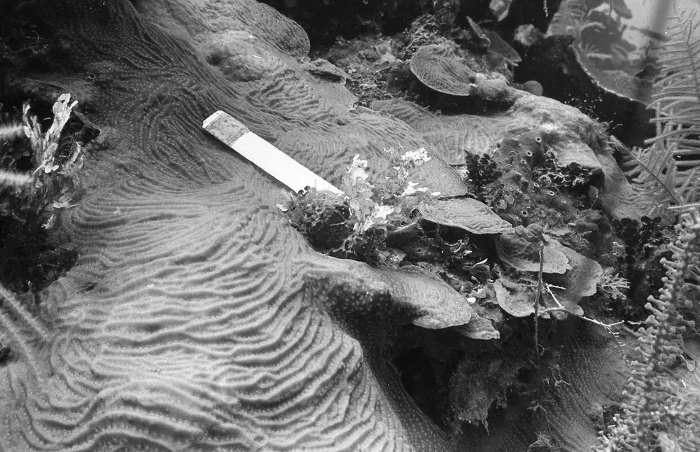{.lightbox group="discovery-bay-1966" description="**UUID: **0672da6e-0c03-4fa0-b045-10c6df86b3c5 **Date: **1968-07-20 **Location: **Jamaica | Discovery Bay | Lyntons Mine Escarpment **Longitude: **77.41ºW **Latitude: **18.4728ºN **Photographer: **Eileen Graham **Copyright: **Trustees of the Natural History Museum (London, UK), CC-BY-4.0" alt="**UUID: **0672da6e-0c03-4fa0-b045-10c6df86b3c5 **Date: **1968-07-20 **Location: **Jamaica | Discovery Bay | Lyntons Mine Escarpment **Longitude: **77.41ºW **Latitude: **18.4728ºN **Photographer: **Eileen Graham **Copyright: **Trustees of the Natural History Museum (London, UK), CC-BY-4.0"}

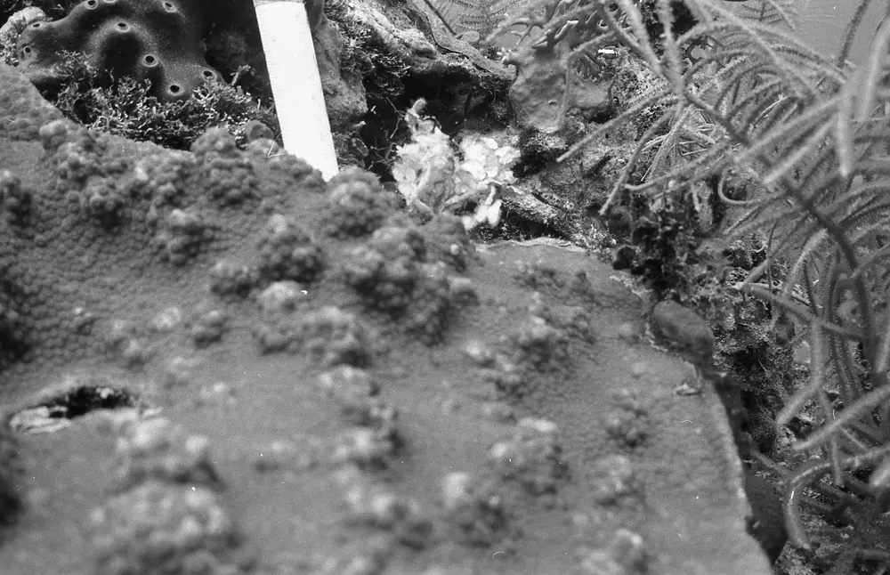{.lightbox group="discovery-bay-1966" description="**UUID: **6dd37b93-48f8-4176-a7b4-09d9684befd2 **Date: **1968-07-20 **Location: **Jamaica | Discovery Bay | Lyntons Mine Escarpment **Longitude: **77.41ºW **Latitude: **18.4728ºN **Photographer: **Eileen Graham **Copyright: **Trustees of the Natural History Museum (London, UK), CC-BY-4.0" alt="**UUID: **6dd37b93-48f8-4176-a7b4-09d9684befd2 **Date: **1968-07-20 **Location: **Jamaica | Discovery Bay | Lyntons Mine Escarpment **Longitude: **77.41ºW **Latitude: **18.4728ºN **Photographer: **Eileen Graham **Copyright: **Trustees of the Natural History Museum (London, UK), CC-BY-4.0"}

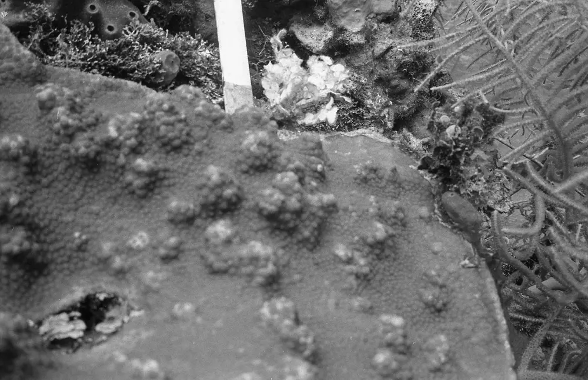{.lightbox group="discovery-bay-1966" description="**UUID: **330e2d11-277e-4cb7-9366-25a632bb56c4 **Date: **1968-07-20 **Location: **Jamaica | Discovery Bay | Lyntons Mine Escarpment **Longitude: **77.41ºW **Latitude: **18.4728ºN **Photographer: **Eileen Graham **Copyright: **Trustees of the Natural History Museum (London, UK), CC-BY-4.0" alt="**UUID: **330e2d11-277e-4cb7-9366-25a632bb56c4 **Date: **1968-07-20 **Location: **Jamaica | Discovery Bay | Lyntons Mine Escarpment **Longitude: **77.41ºW **Latitude: **18.4728ºN **Photographer: **Eileen Graham **Copyright: **Trustees of the Natural History Museum (London, UK), CC-BY-4.0"}

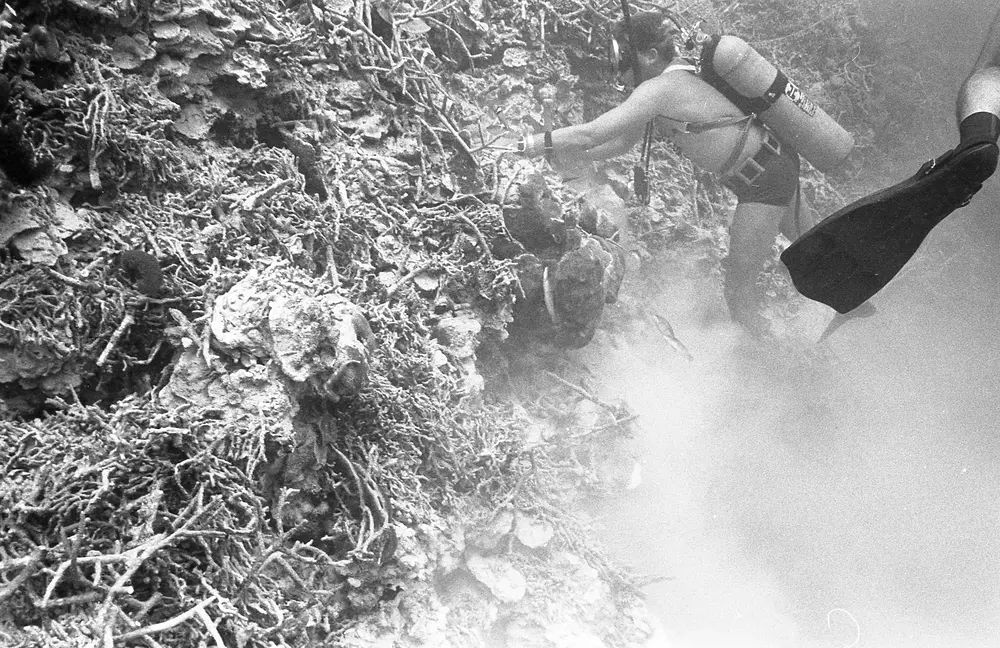{.lightbox group="discovery-bay-1966" description="**UUID: **b440582b-2665-4309-85c1-ad8392b1eeb6 **Date: **1968-07-20 **Location: **Jamaica | Discovery Bay | Lyntons Mine Escarpment **Longitude: **77.41ºW **Latitude: **18.4728ºN **Photographer: **Eileen Graham **Copyright: **Trustees of the Natural History Museum (London, UK), CC-BY-4.0" alt="**UUID: **b440582b-2665-4309-85c1-ad8392b1eeb6 **Date: **1968-07-20 **Location: **Jamaica | Discovery Bay | Lyntons Mine Escarpment **Longitude: **77.41ºW **Latitude: **18.4728ºN **Photographer: **Eileen Graham **Copyright: **Trustees of the Natural History Museum (London, UK), CC-BY-4.0"}

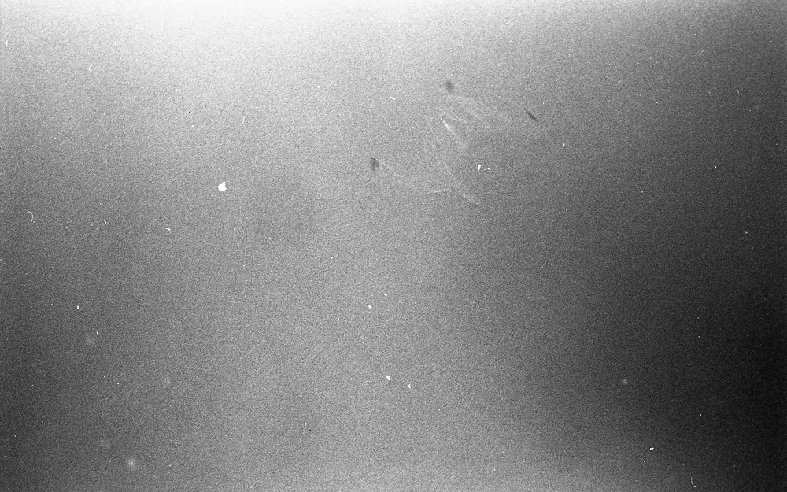{.lightbox group="discovery-bay-1966" description="**UUID: **d75de820-a978-41df-a058-7d30f72c15bd **Date: **1968-07-20 **Location: **Jamaica | Discovery Bay | Lyntons Mine Escarpment **Longitude: **77.41ºW **Latitude: **18.4728ºN **Photographer: **Eileen Graham **Copyright: **Trustees of the Natural History Museum (London, UK), CC-BY-4.0" alt="**UUID: **d75de820-a978-41df-a058-7d30f72c15bd **Date: **1968-07-20 **Location: **Jamaica | Discovery Bay | Lyntons Mine Escarpment **Longitude: **77.41ºW **Latitude: **18.4728ºN **Photographer: **Eileen Graham **Copyright: **Trustees of the Natural History Museum (London, UK), CC-BY-4.0"}

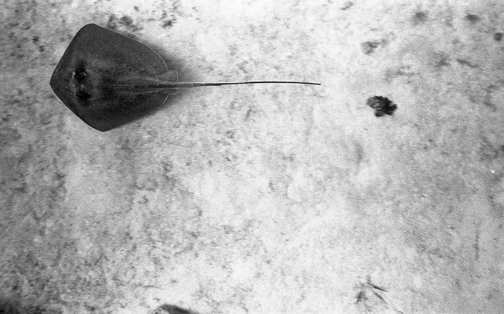{.lightbox group="discovery-bay-1966" description="**UUID: **925749ea-63e9-4a2d-a0d8-e4224dbd3ca7 **Date: **1968-07-20 **Location: **Jamaica | Discovery Bay | Lyntons Mine Escarpment **Longitude: **77.41ºW **Latitude: **18.4728ºN **Photographer: **Eileen Graham **Copyright: **Trustees of the Natural History Museum (London, UK), CC-BY-4.0" alt="**UUID: **925749ea-63e9-4a2d-a0d8-e4224dbd3ca7 **Date: **1968-07-20 **Location: **Jamaica | Discovery Bay | Lyntons Mine Escarpment **Longitude: **77.41ºW **Latitude: **18.4728ºN **Photographer: **Eileen Graham **Copyright: **Trustees of the Natural History Museum (London, UK), CC-BY-4.0"}

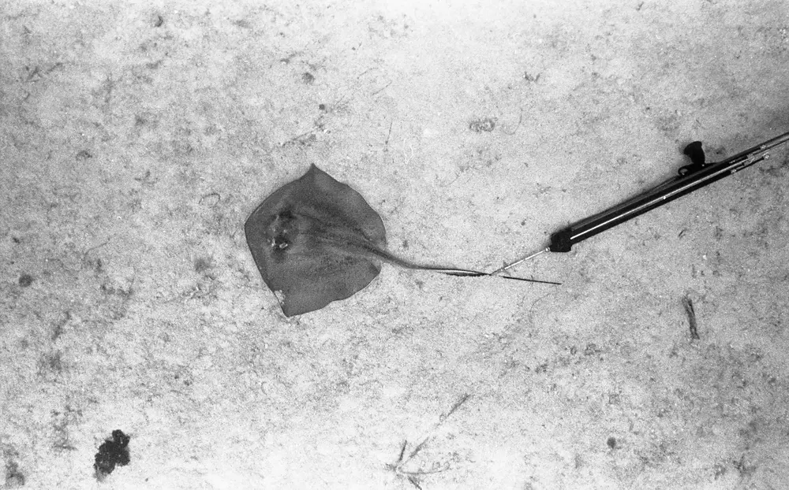{.lightbox group="discovery-bay-1966" description="**UUID: **018e041e-3ff4-4792-a5fa-aecb79876d78 **Date: **1968-07-20 **Location: **Jamaica | Discovery Bay | Lyntons Mine Escarpment **Longitude: **77.41ºW **Latitude: **18.4728ºN **Photographer: **Eileen Graham **Copyright: **Trustees of the Natural History Museum (London, UK), CC-BY-4.0" alt="**UUID: **018e041e-3ff4-4792-a5fa-aecb79876d78 **Date: **1968-07-20 **Location: **Jamaica | Discovery Bay | Lyntons Mine Escarpment **Longitude: **77.41ºW **Latitude: **18.4728ºN **Photographer: **Eileen Graham **Copyright: **Trustees of the Natural History Museum (London, UK), CC-BY-4.0"}

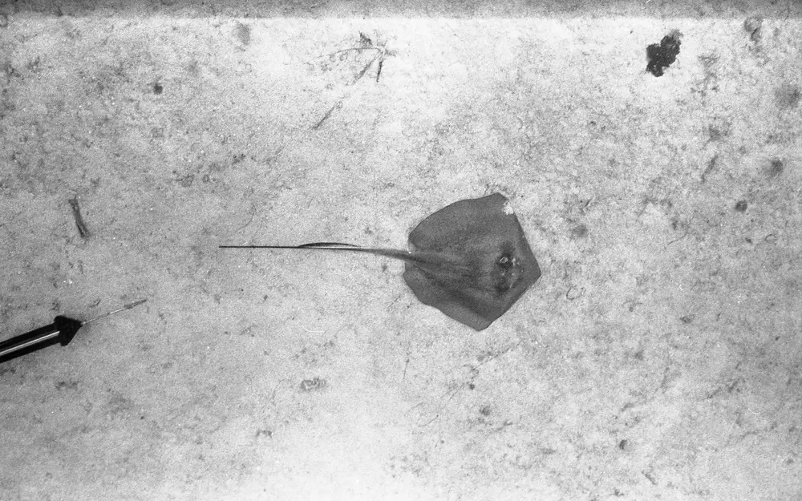{.lightbox group="discovery-bay-1966" description="**UUID: **0f27f2ff-053a-46bf-9478-b70a7a49e7f3 **Date: **1968-07-20 **Location: **Jamaica | Discovery Bay | Lyntons Mine Escarpment **Longitude: **77.41ºW **Latitude: **18.4728ºN **Photographer: **Eileen Graham **Copyright: **Trustees of the Natural History Museum (London, UK), CC-BY-4.0" alt="**UUID: **0f27f2ff-053a-46bf-9478-b70a7a49e7f3 **Date: **1968-07-20 **Location: **Jamaica | Discovery Bay | Lyntons Mine Escarpment **Longitude: **77.41ºW **Latitude: **18.4728ºN **Photographer: **Eileen Graham **Copyright: **Trustees of the Natural History Museum (London, UK), CC-BY-4.0"}

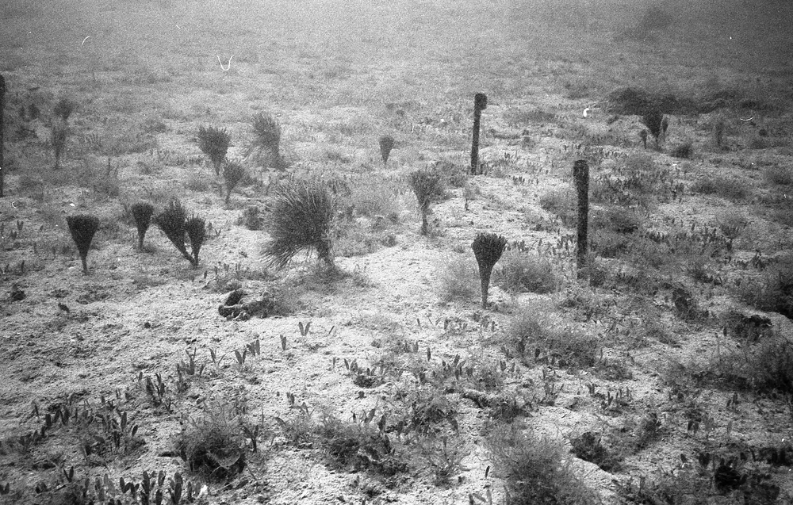{.lightbox group="discovery-bay-1966" description="**UUID: **1459ebe0-4a59-4efc-9798-5d36fc45566b **Date: **1966-08-26 **Location: **Jamaica | Discovery Bay | Algal Plots **Longitude: **77.414ºW **Latitude: **18.473ºN **Photographer: **Eileen Graham **Copyright: **Trustees of the Natural History Museum (London, UK), CC-BY-4.0" alt="**UUID: **1459ebe0-4a59-4efc-9798-5d36fc45566b **Date: **1966-08-26 **Location: **Jamaica | Discovery Bay | Algal Plots **Longitude: **77.414ºW **Latitude: **18.473ºN **Photographer: **Eileen Graham **Copyright: **Trustees of the Natural History Museum (London, UK), CC-BY-4.0"}

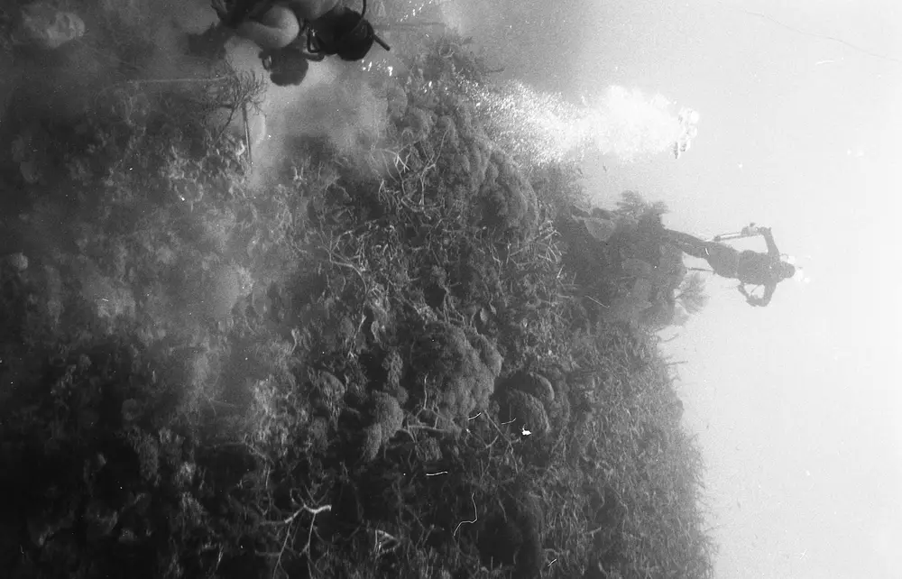{.lightbox group="discovery-bay-1966" description="**UUID: **13c6bfcc-bf15-4fa6-921d-50c80dd30d8e **Date: **1968-07-21 **Location: **Jamaica | Discovery Bay | Lyntons Mine Escarpment **Longitude: **77.41ºW **Latitude: **18.4728ºN **Photographer: **Eileen Graham **Copyright: **Trustees of the Natural History Museum (London, UK), CC-BY-4.0" alt="**UUID: **13c6bfcc-bf15-4fa6-921d-50c80dd30d8e **Date: **1968-07-21 **Location: **Jamaica | Discovery Bay | Lyntons Mine Escarpment **Longitude: **77.41ºW **Latitude: **18.4728ºN **Photographer: **Eileen Graham **Copyright: **Trustees of the Natural History Museum (London, UK), CC-BY-4.0"}

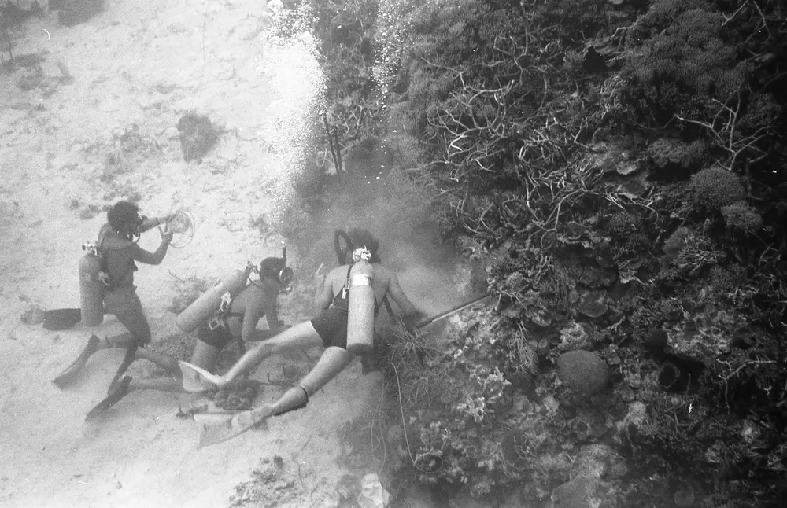{.lightbox group="discovery-bay-1966" description="**UUID: **c482a49a-ae5b-4d60-9fff-21ebbf8a8119 **Date: **1968-07-21 **Location: **Jamaica | Discovery Bay | Lyntons Mine Escarpment **Longitude: **77.41ºW **Latitude: **18.4728ºN **Photographer: **Eileen Graham **Copyright: **Trustees of the Natural History Museum (London, UK), CC-BY-4.0" alt="**UUID: **c482a49a-ae5b-4d60-9fff-21ebbf8a8119 **Date: **1968-07-21 **Location: **Jamaica | Discovery Bay | Lyntons Mine Escarpment **Longitude: **77.41ºW **Latitude: **18.4728ºN **Photographer: **Eileen Graham **Copyright: **Trustees of the Natural History Museum (London, UK), CC-BY-4.0"}

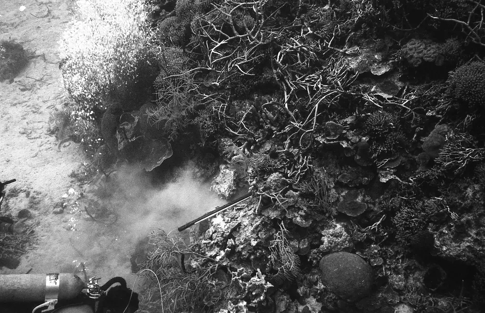{.lightbox group="discovery-bay-1966" description="**UUID: **3eed075b-d16f-4975-9584-5492996c56d8 **Date: **1968-07-21 **Location: **Jamaica | Discovery Bay | Lyntons Mine Escarpment **Longitude: **77.41ºW **Latitude: **18.4728ºN **Photographer: **Eileen Graham **Copyright: **Trustees of the Natural History Museum (London, UK), CC-BY-4.0" alt="**UUID: **3eed075b-d16f-4975-9584-5492996c56d8 **Date: **1968-07-21 **Location: **Jamaica | Discovery Bay | Lyntons Mine Escarpment **Longitude: **77.41ºW **Latitude: **18.4728ºN **Photographer: **Eileen Graham **Copyright: **Trustees of the Natural History Museum (London, UK), CC-BY-4.0"}

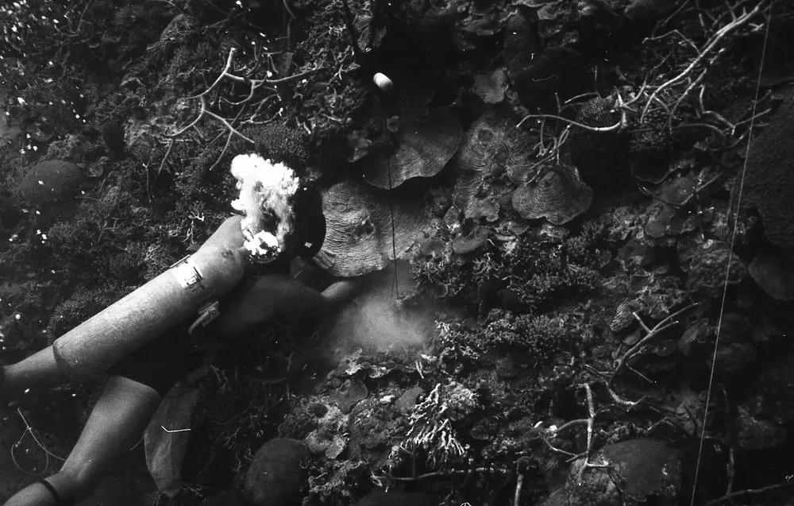{.lightbox group="discovery-bay-1966" description="**UUID: **c5ef445e-9efb-4502-88ab-4105474f30fe **Date: **1968-07-21 **Location: **Jamaica | Discovery Bay | Lyntons Mine Escarpment **Longitude: **77.41ºW **Latitude: **18.4728ºN **Photographer: **Eileen Graham **Copyright: **Trustees of the Natural History Museum (London, UK), CC-BY-4.0" alt="**UUID: **c5ef445e-9efb-4502-88ab-4105474f30fe **Date: **1968-07-21 **Location: **Jamaica | Discovery Bay | Lyntons Mine Escarpment **Longitude: **77.41ºW **Latitude: **18.4728ºN **Photographer: **Eileen Graham **Copyright: **Trustees of the Natural History Museum (London, UK), CC-BY-4.0"}

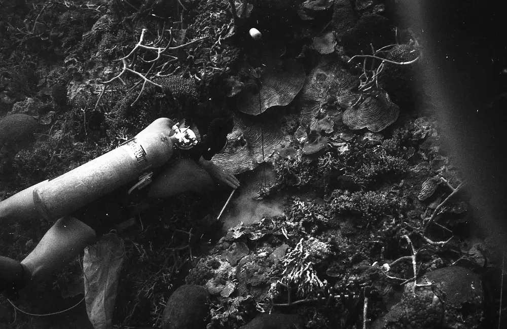{.lightbox group="discovery-bay-1966" description="**UUID: **ea823e11-b630-4755-8a2c-a1032d11027c **Date: **1968-07-21 **Location: **Jamaica | Discovery Bay | Lyntons Mine Escarpment **Longitude: **77.41ºW **Latitude: **18.4728ºN **Photographer: **Eileen Graham **Copyright: **Trustees of the Natural History Museum (London, UK), CC-BY-4.0" alt="**UUID: **ea823e11-b630-4755-8a2c-a1032d11027c **Date: **1968-07-21 **Location: **Jamaica | Discovery Bay | Lyntons Mine Escarpment **Longitude: **77.41ºW **Latitude: **18.4728ºN **Photographer: **Eileen Graham **Copyright: **Trustees of the Natural History Museum (London, UK), CC-BY-4.0"}

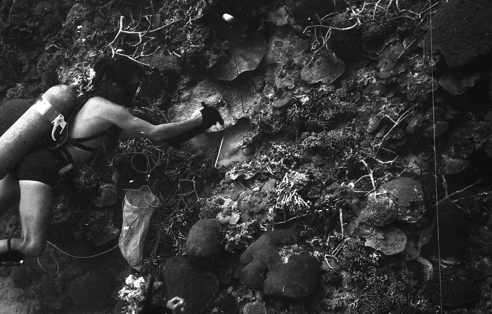{.lightbox group="discovery-bay-1966" description="**UUID: **9dea72d7-da93-4502-8933-a726c02567a7 **Date: **1968-07-21 **Location: **Jamaica | Discovery Bay | Lyntons Mine Escarpment **Longitude: **77.41ºW **Latitude: **18.4728ºN **Photographer: **Eileen Graham **Copyright: **Trustees of the Natural History Museum (London, UK), CC-BY-4.0" alt="**UUID: **9dea72d7-da93-4502-8933-a726c02567a7 **Date: **1968-07-21 **Location: **Jamaica | Discovery Bay | Lyntons Mine Escarpment **Longitude: **77.41ºW **Latitude: **18.4728ºN **Photographer: **Eileen Graham **Copyright: **Trustees of the Natural History Museum (London, UK), CC-BY-4.0"}

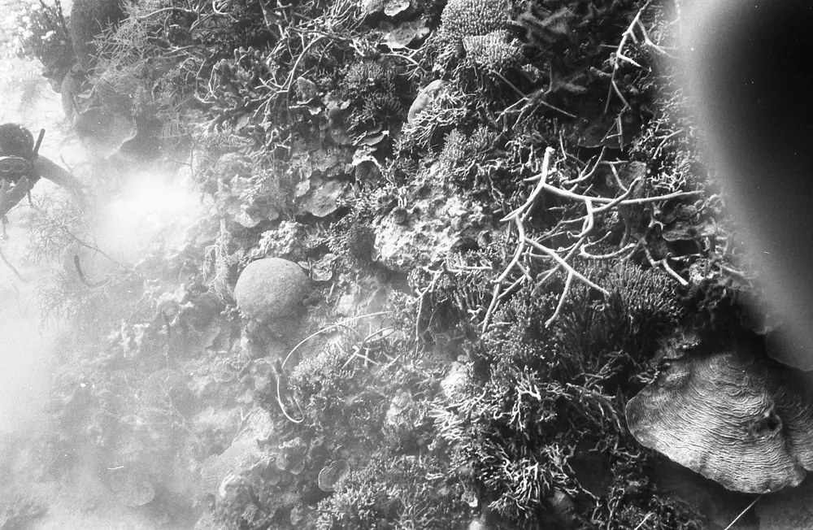{.lightbox group="discovery-bay-1966" description="**UUID: **ebe9a542-b544-4e93-8445-37edf53e5ed5 **Date: **1968-07-21 **Location: **Jamaica | Discovery Bay | Lyntons Mine Escarpment **Longitude: **77.41ºW **Latitude: **18.4728ºN **Photographer: **Eileen Graham **Copyright: **Trustees of the Natural History Museum (London, UK), CC-BY-4.0" alt="**UUID: **ebe9a542-b544-4e93-8445-37edf53e5ed5 **Date: **1968-07-21 **Location: **Jamaica | Discovery Bay | Lyntons Mine Escarpment **Longitude: **77.41ºW **Latitude: **18.4728ºN **Photographer: **Eileen Graham **Copyright: **Trustees of the Natural History Museum (London, UK), CC-BY-4.0"}

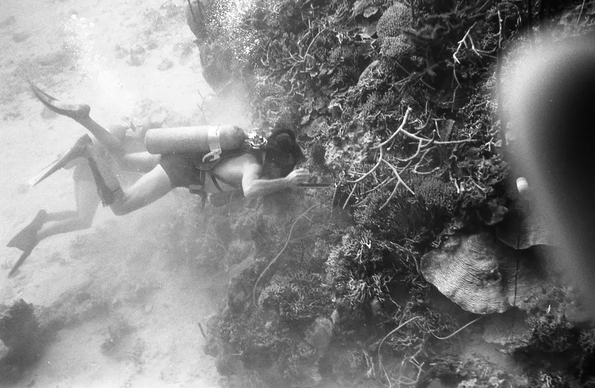{.lightbox group="discovery-bay-1966" description="**UUID: **aca07630-57d6-43bc-9e74-3469a6273c67 **Date: **1968-07-21 **Location: **Jamaica | Discovery Bay | Lyntons Mine Escarpment **Longitude: **77.41ºW **Latitude: **18.4728ºN **Photographer: **Eileen Graham **Copyright: **Trustees of the Natural History Museum (London, UK), CC-BY-4.0" alt="**UUID: **aca07630-57d6-43bc-9e74-3469a6273c67 **Date: **1968-07-21 **Location: **Jamaica | Discovery Bay | Lyntons Mine Escarpment **Longitude: **77.41ºW **Latitude: **18.4728ºN **Photographer: **Eileen Graham **Copyright: **Trustees of the Natural History Museum (London, UK), CC-BY-4.0"}

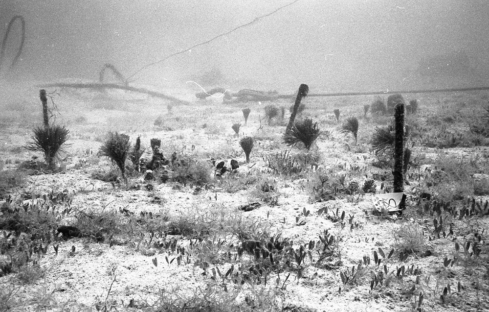{.lightbox group="discovery-bay-1966" description="**UUID: **cf7ebbb1-c962-4863-b1df-78ed4fcfddf9 **Date: **1966-08-26 **Location: **Jamaica | Discovery Bay | Algal Plots **Longitude: **77.414ºW **Latitude: **18.473ºN **Photographer: **Eileen Graham **Copyright: **Trustees of the Natural History Museum (London, UK), CC-BY-4.0" alt="**UUID: **cf7ebbb1-c962-4863-b1df-78ed4fcfddf9 **Date: **1966-08-26 **Location: **Jamaica | Discovery Bay | Algal Plots **Longitude: **77.414ºW **Latitude: **18.473ºN **Photographer: **Eileen Graham **Copyright: **Trustees of the Natural History Museum (London, UK), CC-BY-4.0"}

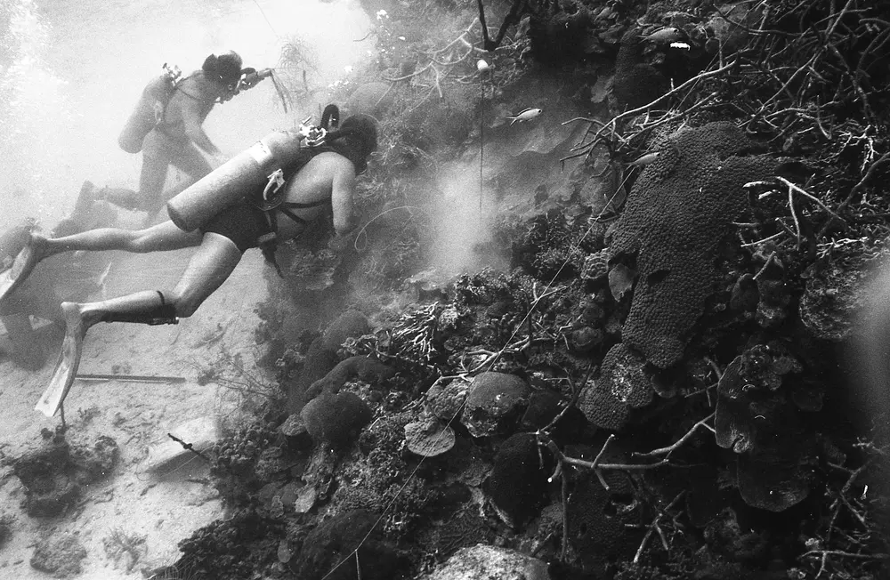{.lightbox group="discovery-bay-1966" description="**UUID: **f646c7ae-3654-45a0-bca5-8edb2d19acda **Date: **1968-07-21 **Location: **Jamaica | Discovery Bay | Lyntons Mine Escarpment **Longitude: **77.41ºW **Latitude: **18.4728ºN **Photographer: **Eileen Graham **Copyright: **Trustees of the Natural History Museum (London, UK), CC-BY-4.0" alt="**UUID: **f646c7ae-3654-45a0-bca5-8edb2d19acda **Date: **1968-07-21 **Location: **Jamaica | Discovery Bay | Lyntons Mine Escarpment **Longitude: **77.41ºW **Latitude: **18.4728ºN **Photographer: **Eileen Graham **Copyright: **Trustees of the Natural History Museum (London, UK), CC-BY-4.0"}

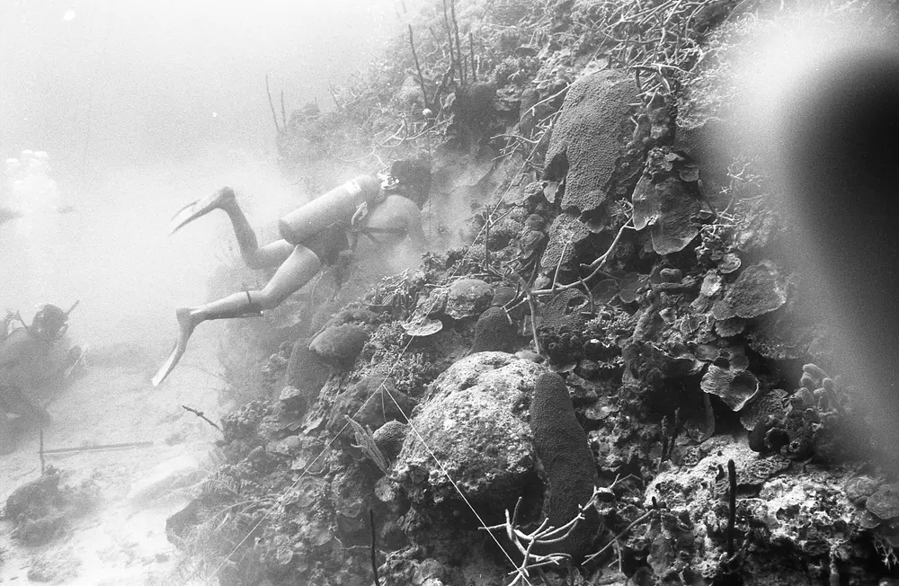{.lightbox group="discovery-bay-1966" description="**UUID: **596fc584-d217-459c-8c95-bb283c7d911d **Date: **1968-07-21 **Location: **Jamaica | Discovery Bay | Lyntons Mine Escarpment **Longitude: **77.41ºW **Latitude: **18.4728ºN **Photographer: **Eileen Graham **Copyright: **Trustees of the Natural History Museum (London, UK), CC-BY-4.0" alt="**UUID: **596fc584-d217-459c-8c95-bb283c7d911d **Date: **1968-07-21 **Location: **Jamaica | Discovery Bay | Lyntons Mine Escarpment **Longitude: **77.41ºW **Latitude: **18.4728ºN **Photographer: **Eileen Graham **Copyright: **Trustees of the Natural History Museum (London, UK), CC-BY-4.0"}

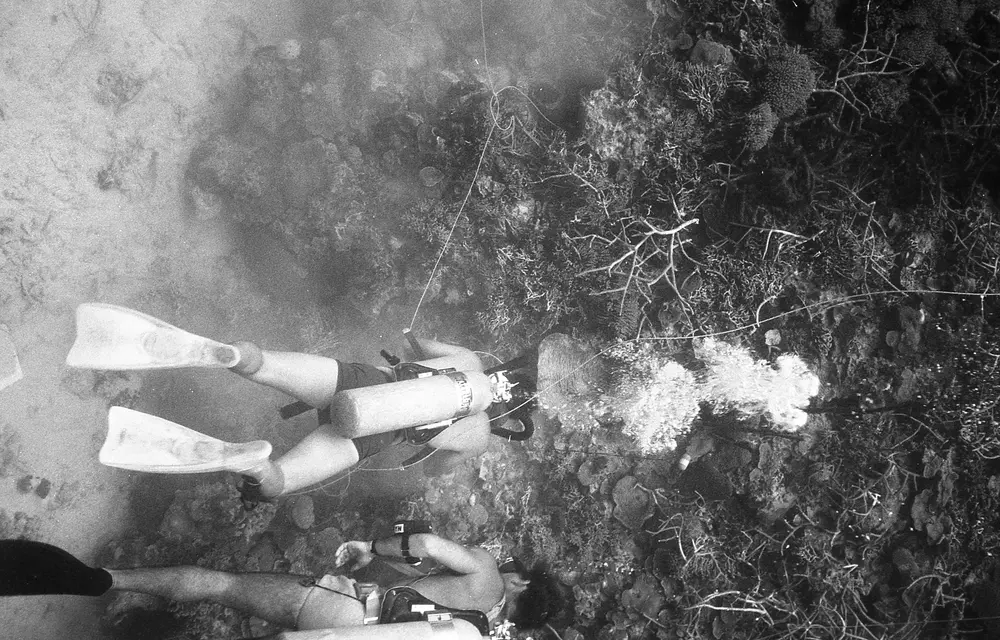{.lightbox group="discovery-bay-1966" description="**UUID: **28b86965-10e6-4aa3-89bc-6d3348a4592e **Date: **1968-07-21 **Location: **Jamaica | Discovery Bay | Lyntons Mine Escarpment **Longitude: **77.41ºW **Latitude: **18.4728ºN **Photographer: **Eileen Graham **Copyright: **Trustees of the Natural History Museum (London, UK), CC-BY-4.0" alt="**UUID: **28b86965-10e6-4aa3-89bc-6d3348a4592e **Date: **1968-07-21 **Location: **Jamaica | Discovery Bay | Lyntons Mine Escarpment **Longitude: **77.41ºW **Latitude: **18.4728ºN **Photographer: **Eileen Graham **Copyright: **Trustees of the Natural History Museum (London, UK), CC-BY-4.0"}

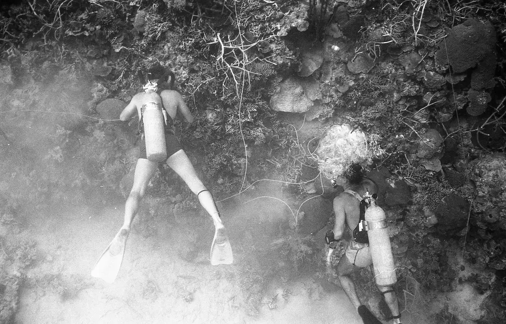{.lightbox group="discovery-bay-1966" description="**UUID: **25bf9b3c-6919-465f-8c43-649eb4cd1f76 **Date: **1968-07-21 **Location: **Jamaica | Discovery Bay | Lyntons Mine Escarpment **Longitude: **77.41ºW **Latitude: **18.4728ºN **Photographer: **Eileen Graham **Copyright: **Trustees of the Natural History Museum (London, UK), CC-BY-4.0" alt="**UUID: **25bf9b3c-6919-465f-8c43-649eb4cd1f76 **Date: **1968-07-21 **Location: **Jamaica | Discovery Bay | Lyntons Mine Escarpment **Longitude: **77.41ºW **Latitude: **18.4728ºN **Photographer: **Eileen Graham **Copyright: **Trustees of the Natural History Museum (London, UK), CC-BY-4.0"}

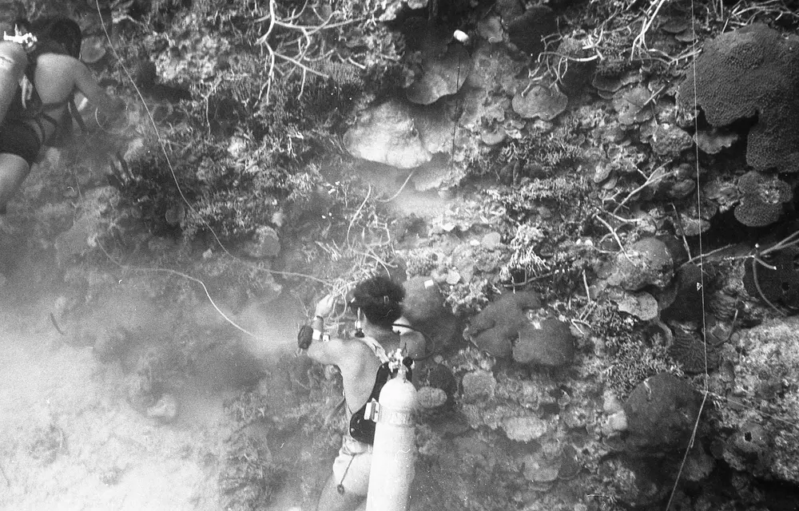{.lightbox group="discovery-bay-1966" description="**UUID: **ad03d9d8-8891-455c-bfa2-ba6b68468d89 **Date: **1968-07-21 **Location: **Jamaica | Discovery Bay | Lyntons Mine Escarpment **Longitude: **77.41ºW **Latitude: **18.4728ºN **Photographer: **Eileen Graham **Copyright: **Trustees of the Natural History Museum (London, UK), CC-BY-4.0" alt="**UUID: **ad03d9d8-8891-455c-bfa2-ba6b68468d89 **Date: **1968-07-21 **Location: **Jamaica | Discovery Bay | Lyntons Mine Escarpment **Longitude: **77.41ºW **Latitude: **18.4728ºN **Photographer: **Eileen Graham **Copyright: **Trustees of the Natural History Museum (London, UK), CC-BY-4.0"}

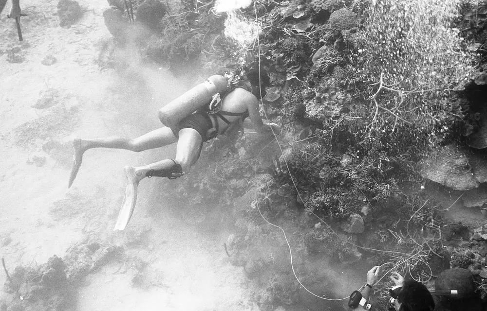{.lightbox group="discovery-bay-1966" description="**UUID: **7f137e2d-52d3-41dc-b44a-cc94b925bdd3 **Date: **1968-07-21 **Location: **Jamaica | Discovery Bay | Lyntons Mine Escarpment **Longitude: **77.41ºW **Latitude: **18.4728ºN **Photographer: **Eileen Graham **Copyright: **Trustees of the Natural History Museum (London, UK), CC-BY-4.0" alt="**UUID: **7f137e2d-52d3-41dc-b44a-cc94b925bdd3 **Date: **1968-07-21 **Location: **Jamaica | Discovery Bay | Lyntons Mine Escarpment **Longitude: **77.41ºW **Latitude: **18.4728ºN **Photographer: **Eileen Graham **Copyright: **Trustees of the Natural History Museum (London, UK), CC-BY-4.0"}

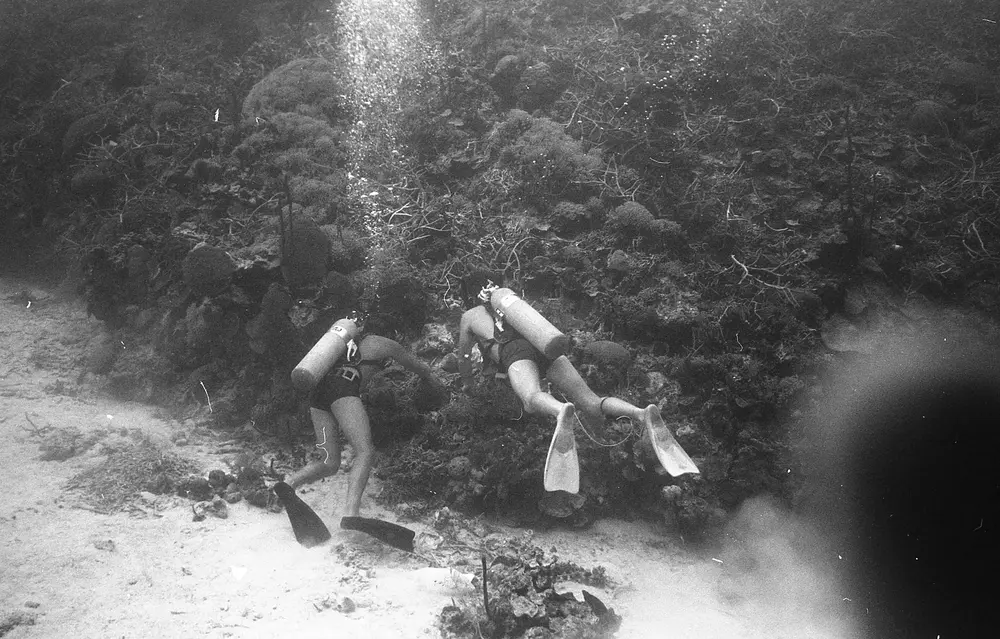{.lightbox group="discovery-bay-1966" description="**UUID: **7e9c8e47-ac4a-4ba8-9f4b-a03d0215c108 **Date: **1968-07-21 **Location: **Jamaica | Discovery Bay | Lyntons Mine Escarpment **Longitude: **77.41ºW **Latitude: **18.4728ºN **Photographer: **Eileen Graham **Copyright: **Trustees of the Natural History Museum (London, UK), CC-BY-4.0" alt="**UUID: **7e9c8e47-ac4a-4ba8-9f4b-a03d0215c108 **Date: **1968-07-21 **Location: **Jamaica | Discovery Bay | Lyntons Mine Escarpment **Longitude: **77.41ºW **Latitude: **18.4728ºN **Photographer: **Eileen Graham **Copyright: **Trustees of the Natural History Museum (London, UK), CC-BY-4.0"}

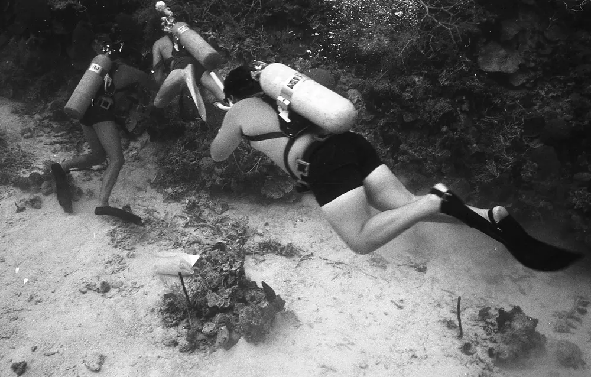{.lightbox group="discovery-bay-1966" description="**UUID: **a305d634-f21c-4cfb-8a76-874032e8abbd **Date: **1968-07-21 **Location: **Jamaica | Discovery Bay | Lyntons Mine Escarpment **Longitude: **77.41ºW **Latitude: **18.4728ºN **Photographer: **Eileen Graham **Copyright: **Trustees of the Natural History Museum (London, UK), CC-BY-4.0" alt="**UUID: **a305d634-f21c-4cfb-8a76-874032e8abbd **Date: **1968-07-21 **Location: **Jamaica | Discovery Bay | Lyntons Mine Escarpment **Longitude: **77.41ºW **Latitude: **18.4728ºN **Photographer: **Eileen Graham **Copyright: **Trustees of the Natural History Museum (London, UK), CC-BY-4.0"}

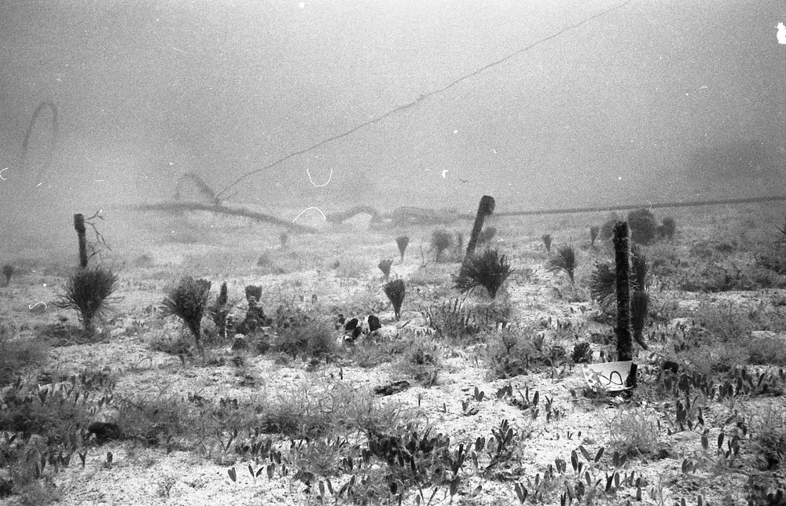{.lightbox group="discovery-bay-1966" description="**UUID: **729d26c0-238b-4dae-9e8c-387dea08014b **Date: **1966-08-26 **Location: **Jamaica | Discovery Bay | Algal Plots **Longitude: **77.414ºW **Latitude: **18.473ºN **Photographer: **Eileen Graham **Copyright: **Trustees of the Natural History Museum (London, UK), CC-BY-4.0" alt="**UUID: **729d26c0-238b-4dae-9e8c-387dea08014b **Date: **1966-08-26 **Location: **Jamaica | Discovery Bay | Algal Plots **Longitude: **77.414ºW **Latitude: **18.473ºN **Photographer: **Eileen Graham **Copyright: **Trustees of the Natural History Museum (London, UK), CC-BY-4.0"}

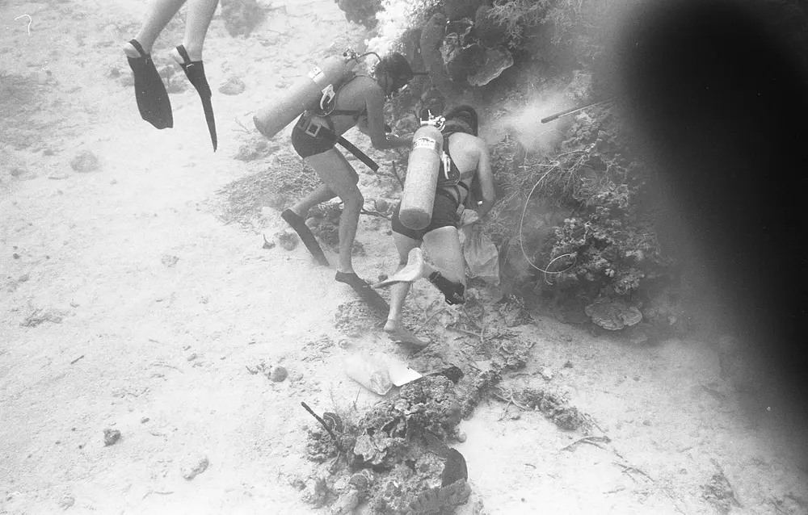{.lightbox group="discovery-bay-1966" description="**UUID: **631b42d2-a31d-4f2a-ad6c-218a9fa81510 **Date: **1968-07-21 **Location: **Jamaica | Discovery Bay | Lyntons Mine Escarpment **Longitude: **77.41ºW **Latitude: **18.4728ºN **Photographer: **Eileen Graham **Copyright: **Trustees of the Natural History Museum (London, UK), CC-BY-4.0" alt="**UUID: **631b42d2-a31d-4f2a-ad6c-218a9fa81510 **Date: **1968-07-21 **Location: **Jamaica | Discovery Bay | Lyntons Mine Escarpment **Longitude: **77.41ºW **Latitude: **18.4728ºN **Photographer: **Eileen Graham **Copyright: **Trustees of the Natural History Museum (London, UK), CC-BY-4.0"}

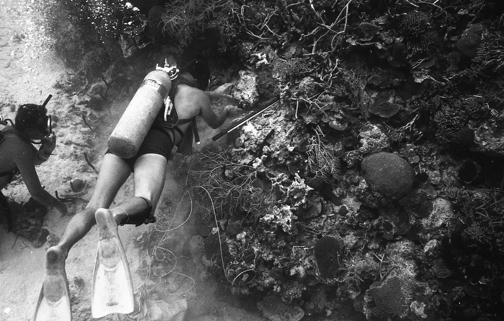{.lightbox group="discovery-bay-1966" description="**UUID: **e8049a3c-de25-4114-a03d-f5357be6d145 **Date: **1968-07-21 **Location: **Jamaica | Discovery Bay | Lyntons Mine Escarpment **Longitude: **77.41ºW **Latitude: **18.4728ºN **Photographer: **Eileen Graham **Copyright: **Trustees of the Natural History Museum (London, UK), CC-BY-4.0" alt="**UUID: **e8049a3c-de25-4114-a03d-f5357be6d145 **Date: **1968-07-21 **Location: **Jamaica | Discovery Bay | Lyntons Mine Escarpment **Longitude: **77.41ºW **Latitude: **18.4728ºN **Photographer: **Eileen Graham **Copyright: **Trustees of the Natural History Museum (London, UK), CC-BY-4.0"}

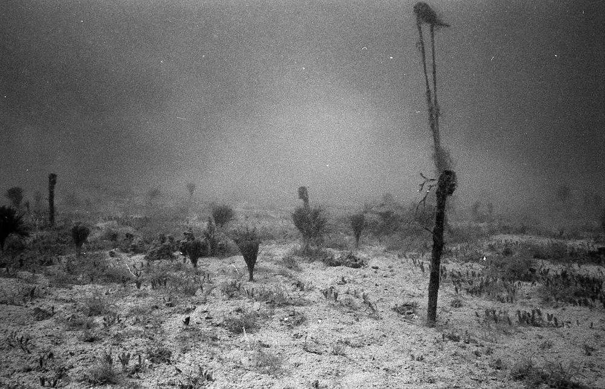{.lightbox group="discovery-bay-1966" description="**UUID: **c64f3874-a864-4859-a4f4-026ceeb4654f **Date: **1966-08-26 **Location: **Jamaica | Discovery Bay | Algal Plots **Longitude: **77.414ºW **Latitude: **18.473ºN **Photographer: **Eileen Graham **Copyright: **Trustees of the Natural History Museum (London, UK), CC-BY-4.0" alt="**UUID: **c64f3874-a864-4859-a4f4-026ceeb4654f **Date: **1966-08-26 **Location: **Jamaica | Discovery Bay | Algal Plots **Longitude: **77.414ºW **Latitude: **18.473ºN **Photographer: **Eileen Graham **Copyright: **Trustees of the Natural History Museum (London, UK), CC-BY-4.0"}

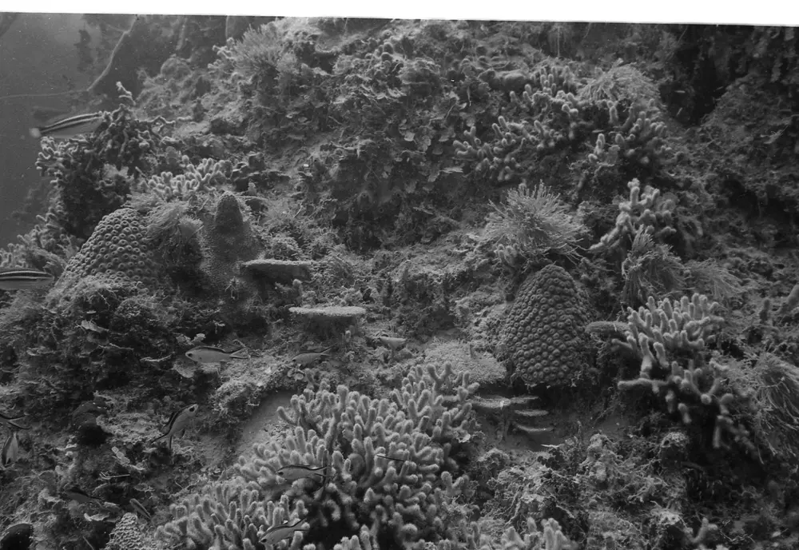{.lightbox group="discovery-bay-1966" description="**UUID: **60d3de28-7b6a-4a67-b9a3-01b6eda15712 **Date: **NA **Location: **Jamaica | Discovery Bay | Pear Tree Bottom **Longitude: **77.35867ºW **Latitude: **18.4635ºN **Photographer: **Eileen Graham **Copyright: **Trustees of the Natural History Museum (London, UK), CC-BY-4.0" alt="**UUID: **60d3de28-7b6a-4a67-b9a3-01b6eda15712 **Date: **NA **Location: **Jamaica | Discovery Bay | Pear Tree Bottom **Longitude: **77.35867ºW **Latitude: **18.4635ºN **Photographer: **Eileen Graham **Copyright: **Trustees of the Natural History Museum (London, UK), CC-BY-4.0"}

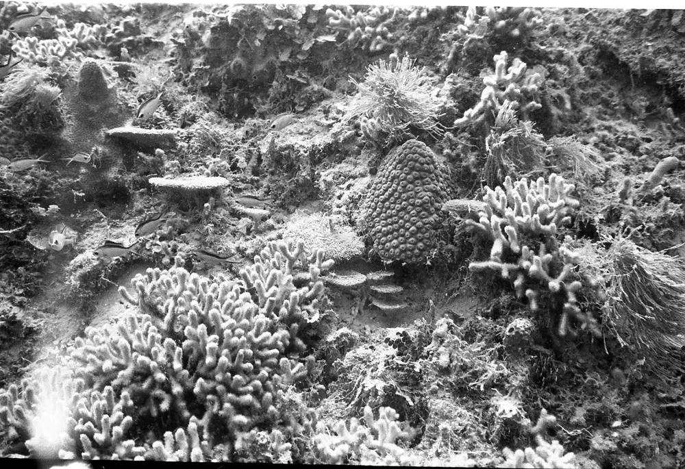{.lightbox group="discovery-bay-1966" description="**UUID: **1051c50e-9ce9-4467-9309-a2c105330ea3 **Date: **NA **Location: **Jamaica | Discovery Bay | Pear Tree Bottom **Longitude: **77.35867ºW **Latitude: **18.4635ºN **Photographer: **Eileen Graham **Copyright: **Trustees of the Natural History Museum (London, UK), CC-BY-4.0" alt="**UUID: **1051c50e-9ce9-4467-9309-a2c105330ea3 **Date: **NA **Location: **Jamaica | Discovery Bay | Pear Tree Bottom **Longitude: **77.35867ºW **Latitude: **18.4635ºN **Photographer: **Eileen Graham **Copyright: **Trustees of the Natural History Museum (London, UK), CC-BY-4.0"}

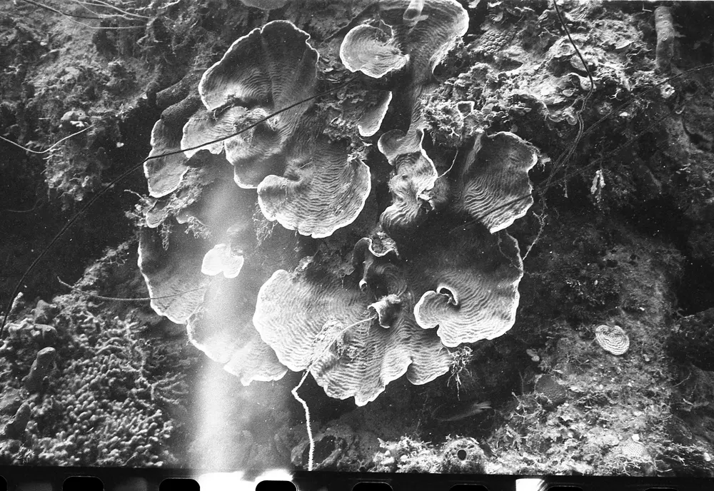{.lightbox group="discovery-bay-1966" description="**UUID: **299471e4-9ab8-4c0d-bc6d-9a8afbfc0fdc **Date: **NA **Location: **Jamaica | Discovery Bay | Pear Tree Bottom **Longitude: **77.35867ºW **Latitude: **18.4635ºN **Photographer: **Eileen Graham **Copyright: **Trustees of the Natural History Museum (London, UK), CC-BY-4.0" alt="**UUID: **299471e4-9ab8-4c0d-bc6d-9a8afbfc0fdc **Date: **NA **Location: **Jamaica | Discovery Bay | Pear Tree Bottom **Longitude: **77.35867ºW **Latitude: **18.4635ºN **Photographer: **Eileen Graham **Copyright: **Trustees of the Natural History Museum (London, UK), CC-BY-4.0"}

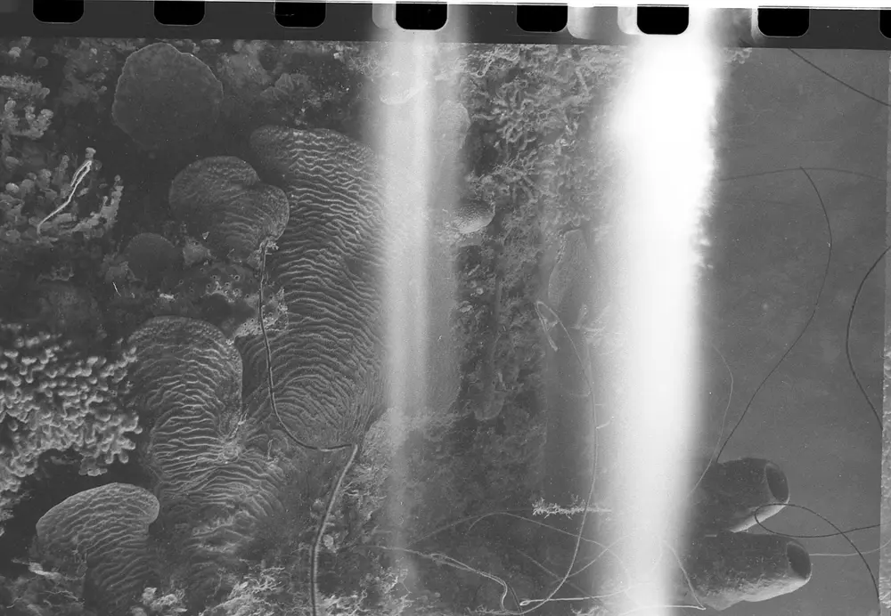{.lightbox group="discovery-bay-1966" description="**UUID: **7b737b2b-1379-4c0b-a9fa-5decb19fe3f0 **Date: **NA **Location: **Jamaica | Discovery Bay | Pear Tree Bottom **Longitude: **77.35867ºW **Latitude: **18.4635ºN **Photographer: **Eileen Graham **Copyright: **Trustees of the Natural History Museum (London, UK), CC-BY-4.0" alt="**UUID: **7b737b2b-1379-4c0b-a9fa-5decb19fe3f0 **Date: **NA **Location: **Jamaica | Discovery Bay | Pear Tree Bottom **Longitude: **77.35867ºW **Latitude: **18.4635ºN **Photographer: **Eileen Graham **Copyright: **Trustees of the Natural History Museum (London, UK), CC-BY-4.0"}

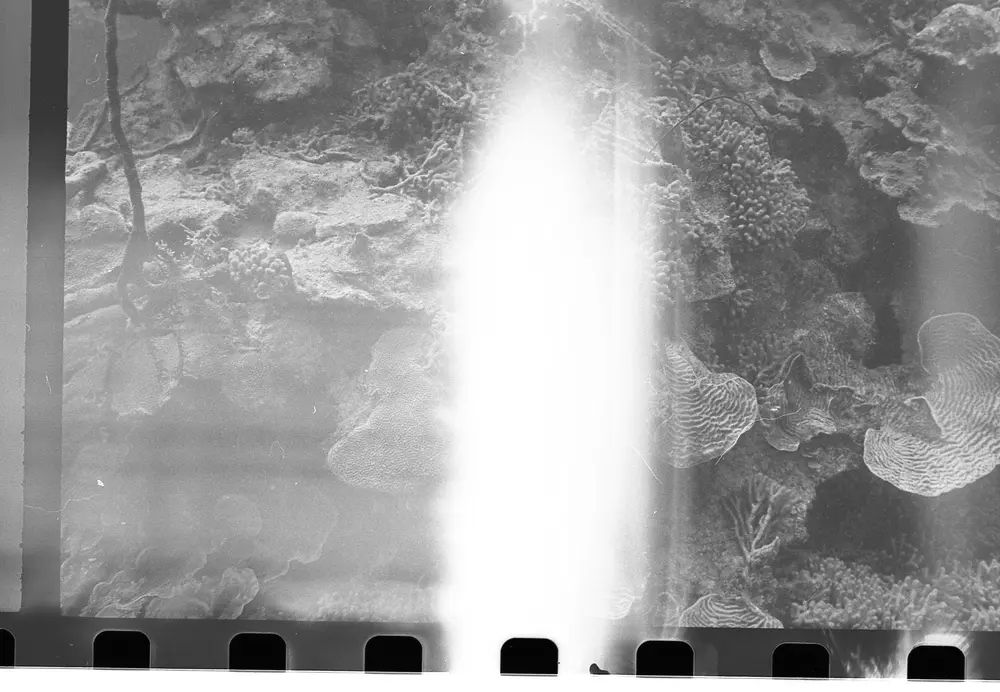{.lightbox group="discovery-bay-1966" description="**UUID: **c64e9395-11d4-4e67-ab88-1386e41c52a7 **Date: **NA **Location: **Jamaica | Discovery Bay | Pear Tree Bottom **Longitude: **77.35867ºW **Latitude: **18.4635ºN **Photographer: **Eileen Graham **Copyright: **Trustees of the Natural History Museum (London, UK), CC-BY-4.0" alt="**UUID: **c64e9395-11d4-4e67-ab88-1386e41c52a7 **Date: **NA **Location: **Jamaica | Discovery Bay | Pear Tree Bottom **Longitude: **77.35867ºW **Latitude: **18.4635ºN **Photographer: **Eileen Graham **Copyright: **Trustees of the Natural History Museum (London, UK), CC-BY-4.0"}

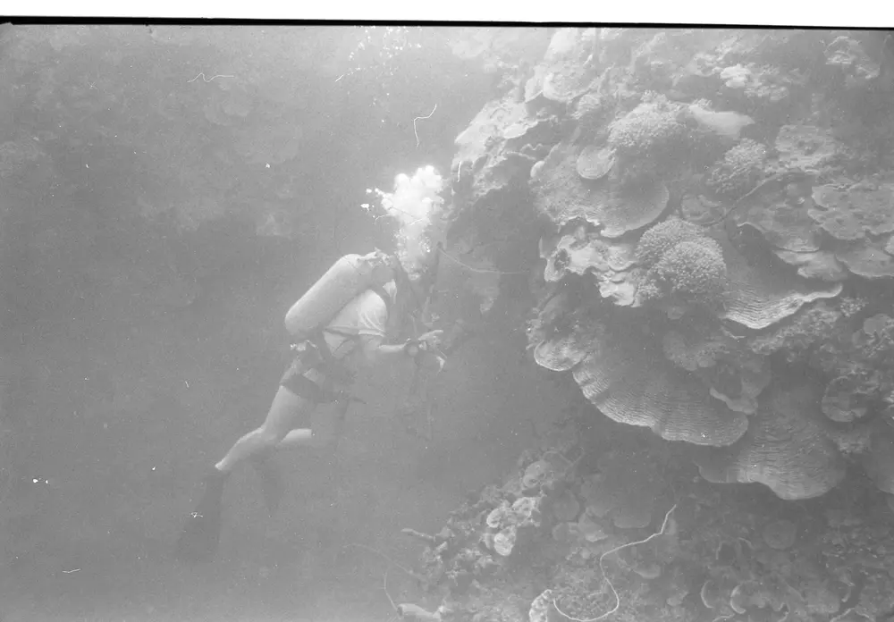{.lightbox group="discovery-bay-1966" description="**UUID: **dea833bb-dde0-46c1-b4ff-9360d3a47a49 **Date: **NA **Location: **Jamaica | Discovery Bay | Pear Tree Bottom **Longitude: **77.35867ºW **Latitude: **18.4635ºN **Photographer: **Eileen Graham **Copyright: **Trustees of the Natural History Museum (London, UK), CC-BY-4.0" alt="**UUID: **dea833bb-dde0-46c1-b4ff-9360d3a47a49 **Date: **NA **Location: **Jamaica | Discovery Bay | Pear Tree Bottom **Longitude: **77.35867ºW **Latitude: **18.4635ºN **Photographer: **Eileen Graham **Copyright: **Trustees of the Natural History Museum (London, UK), CC-BY-4.0"}

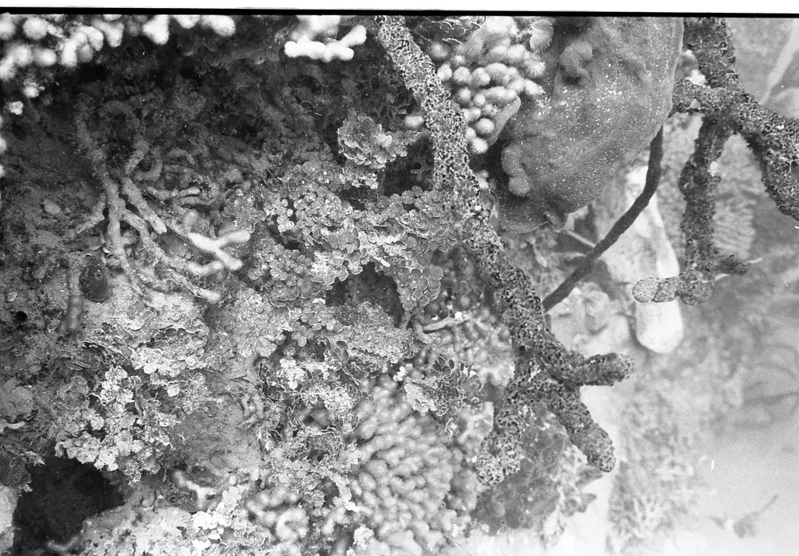{.lightbox group="discovery-bay-1966" description="**UUID: **0556c205-12d1-4afc-9048-2f428403389a **Date: **NA **Location: **Jamaica | Discovery Bay | Pear Tree Bottom **Longitude: **77.35867ºW **Latitude: **18.4635ºN **Photographer: **Eileen Graham **Copyright: **Trustees of the Natural History Museum (London, UK), CC-BY-4.0" alt="**UUID: **0556c205-12d1-4afc-9048-2f428403389a **Date: **NA **Location: **Jamaica | Discovery Bay | Pear Tree Bottom **Longitude: **77.35867ºW **Latitude: **18.4635ºN **Photographer: **Eileen Graham **Copyright: **Trustees of the Natural History Museum (London, UK), CC-BY-4.0"}

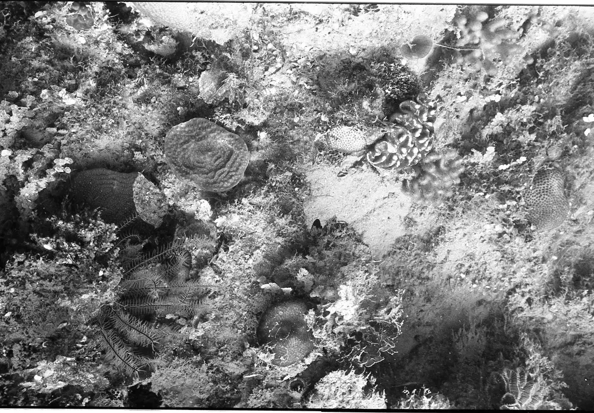{.lightbox group="discovery-bay-1966" description="**UUID: **82c9f84a-6ac5-4253-aeec-d1134d249bed **Date: **NA **Location: **Jamaica | Discovery Bay | Pear Tree Bottom **Longitude: **77.35867ºW **Latitude: **18.4635ºN **Photographer: **Eileen Graham **Copyright: **Trustees of the Natural History Museum (London, UK), CC-BY-4.0" alt="**UUID: **82c9f84a-6ac5-4253-aeec-d1134d249bed **Date: **NA **Location: **Jamaica | Discovery Bay | Pear Tree Bottom **Longitude: **77.35867ºW **Latitude: **18.4635ºN **Photographer: **Eileen Graham **Copyright: **Trustees of the Natural History Museum (London, UK), CC-BY-4.0"}

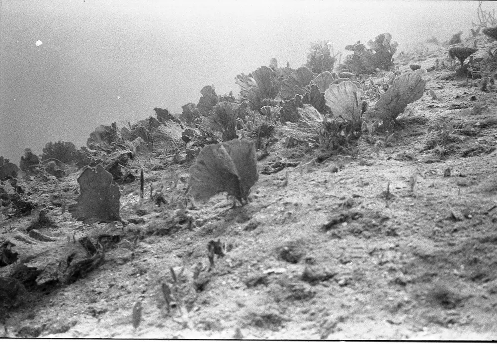{.lightbox group="discovery-bay-1966" description="**UUID: **1bad6e9a-d062-492c-9d45-43983b12315c **Date: **NA **Location: **Jamaica | Discovery Bay | Pear Tree Bottom **Longitude: **77.35867ºW **Latitude: **18.4635ºN **Photographer: **Eileen Graham **Copyright: **Trustees of the Natural History Museum (London, UK), CC-BY-4.0" alt="**UUID: **1bad6e9a-d062-492c-9d45-43983b12315c **Date: **NA **Location: **Jamaica | Discovery Bay | Pear Tree Bottom **Longitude: **77.35867ºW **Latitude: **18.4635ºN **Photographer: **Eileen Graham **Copyright: **Trustees of the Natural History Museum (London, UK), CC-BY-4.0"}

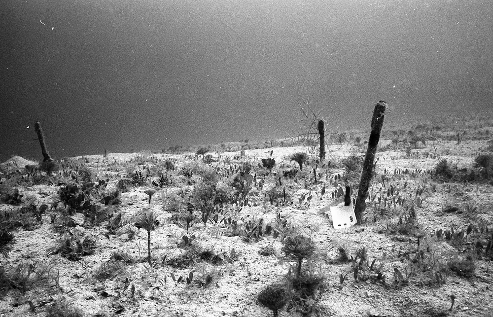{.lightbox group="discovery-bay-1966" description="**UUID: **ed4b2f1a-2b38-440e-9dcf-443e024e673b **Date: **1966-08-26 **Location: **Jamaica | Discovery Bay | Algal Plots **Longitude: **77.414ºW **Latitude: **18.473ºN **Photographer: **Eileen Graham **Copyright: **Trustees of the Natural History Museum (London, UK), CC-BY-4.0" alt="**UUID: **ed4b2f1a-2b38-440e-9dcf-443e024e673b **Date: **1966-08-26 **Location: **Jamaica | Discovery Bay | Algal Plots **Longitude: **77.414ºW **Latitude: **18.473ºN **Photographer: **Eileen Graham **Copyright: **Trustees of the Natural History Museum (London, UK), CC-BY-4.0"}

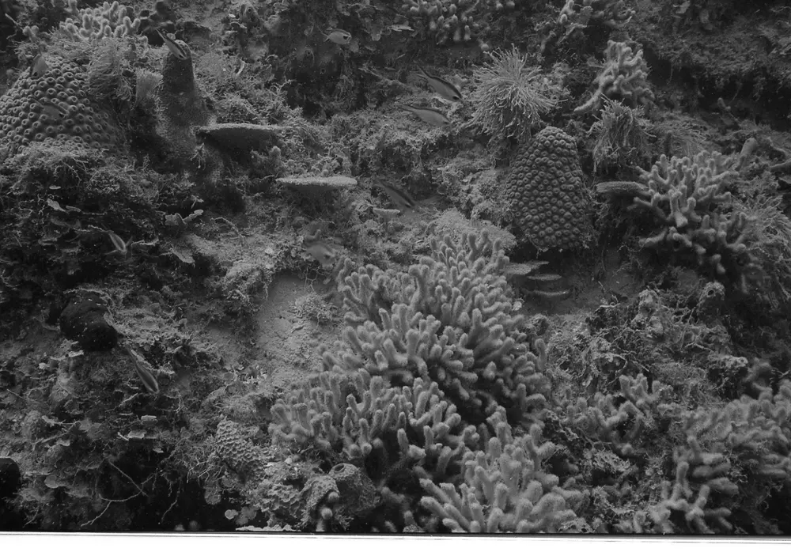{.lightbox group="discovery-bay-1966" description="**UUID: **b71e0808-60a7-44e2-bda0-8fb7e4837694 **Date: **NA **Location: **Jamaica | Discovery Bay | Pear Tree Bottom **Longitude: **77.35867ºW **Latitude: **18.4635ºN **Photographer: **Eileen Graham **Copyright: **Trustees of the Natural History Museum (London, UK), CC-BY-4.0" alt="**UUID: **b71e0808-60a7-44e2-bda0-8fb7e4837694 **Date: **NA **Location: **Jamaica | Discovery Bay | Pear Tree Bottom **Longitude: **77.35867ºW **Latitude: **18.4635ºN **Photographer: **Eileen Graham **Copyright: **Trustees of the Natural History Museum (London, UK), CC-BY-4.0"}

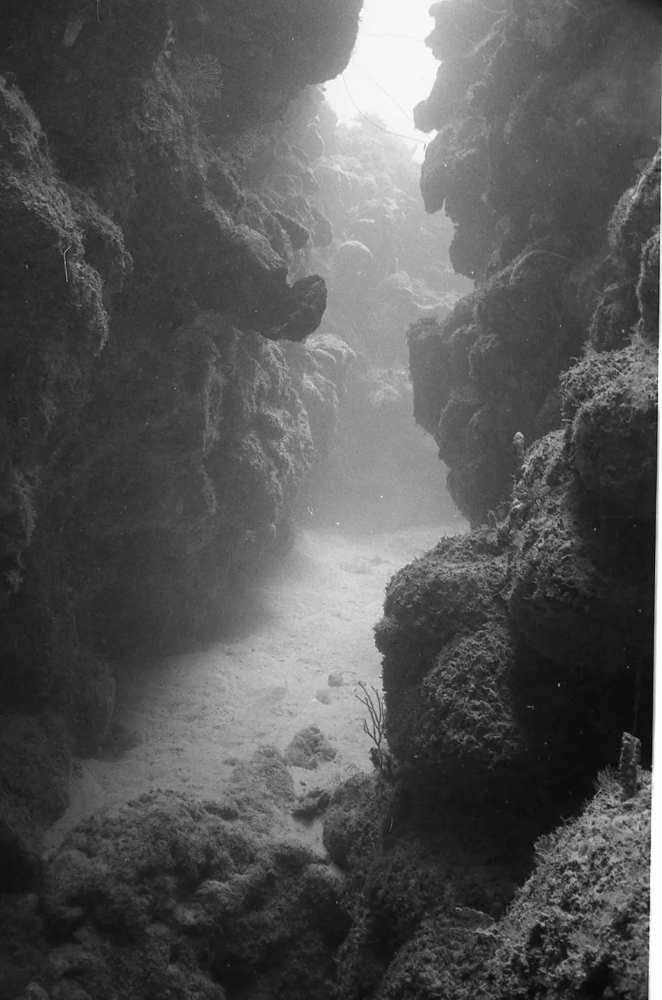{.lightbox group="discovery-bay-1966" description="**UUID: **dbd8b2eb-27e2-4b85-a38c-adb2acbba8ea **Date: **NA **Location: **Jamaica | Discovery Bay | Pear Tree Bottom **Longitude: **77.35867ºW **Latitude: **18.4635ºN **Photographer: **Eileen Graham **Copyright: **Trustees of the Natural History Museum (London, UK), CC-BY-4.0" alt="**UUID: **dbd8b2eb-27e2-4b85-a38c-adb2acbba8ea **Date: **NA **Location: **Jamaica | Discovery Bay | Pear Tree Bottom **Longitude: **77.35867ºW **Latitude: **18.4635ºN **Photographer: **Eileen Graham **Copyright: **Trustees of the Natural History Museum (London, UK), CC-BY-4.0"}

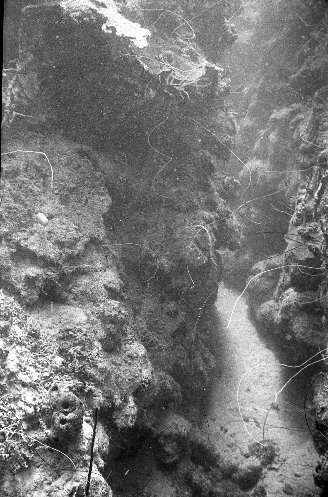{.lightbox group="discovery-bay-1966" description="**UUID: **e989a67f-e175-4452-9557-ef34139ef7dd **Date: **NA **Location: **Jamaica | Discovery Bay | Pear Tree Bottom **Longitude: **77.35867ºW **Latitude: **18.4635ºN **Photographer: **Eileen Graham **Copyright: **Trustees of the Natural History Museum (London, UK), CC-BY-4.0" alt="**UUID: **e989a67f-e175-4452-9557-ef34139ef7dd **Date: **NA **Location: **Jamaica | Discovery Bay | Pear Tree Bottom **Longitude: **77.35867ºW **Latitude: **18.4635ºN **Photographer: **Eileen Graham **Copyright: **Trustees of the Natural History Museum (London, UK), CC-BY-4.0"}

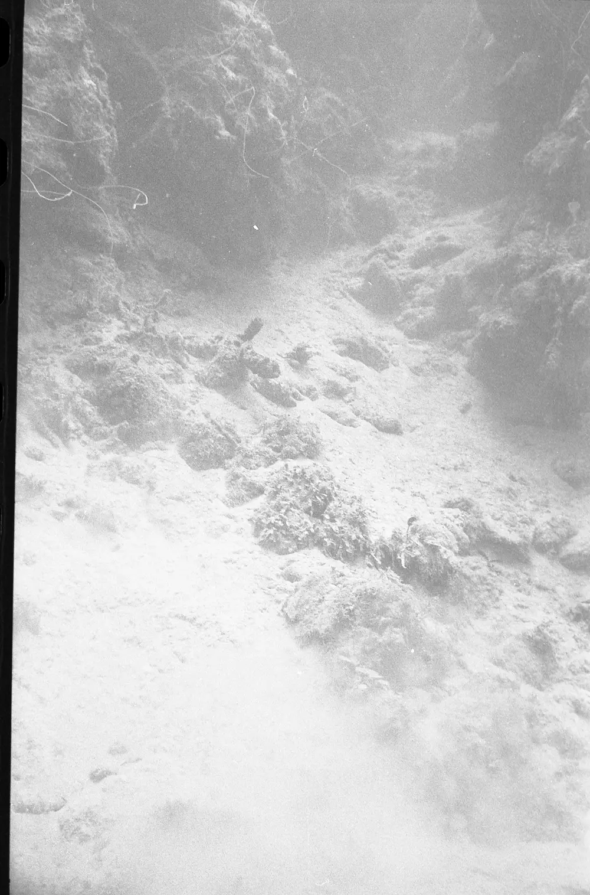{.lightbox group="discovery-bay-1966" description="**UUID: **0302f8dc-1dcb-4763-9787-fe71a9d37ada **Date: **NA **Location: **Jamaica | Discovery Bay | Pear Tree Bottom **Longitude: **77.35867ºW **Latitude: **18.4635ºN **Photographer: **Eileen Graham **Copyright: **Trustees of the Natural History Museum (London, UK), CC-BY-4.0" alt="**UUID: **0302f8dc-1dcb-4763-9787-fe71a9d37ada **Date: **NA **Location: **Jamaica | Discovery Bay | Pear Tree Bottom **Longitude: **77.35867ºW **Latitude: **18.4635ºN **Photographer: **Eileen Graham **Copyright: **Trustees of the Natural History Museum (London, UK), CC-BY-4.0"}

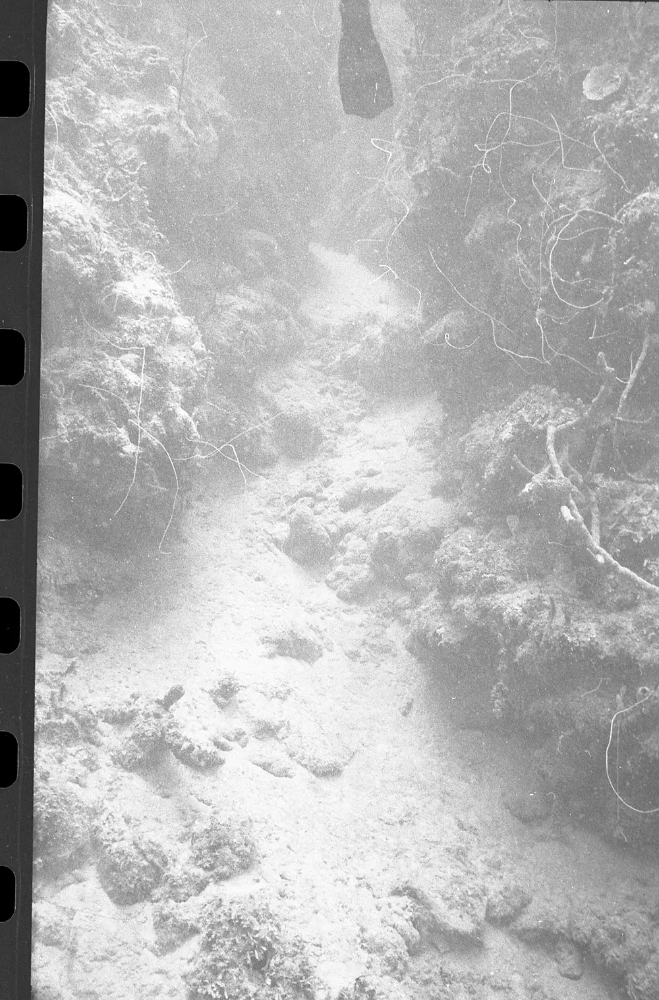{.lightbox group="discovery-bay-1966" description="**UUID: **4ae91c89-9077-4174-b95b-89f706f653c9 **Date: **NA **Location: **Jamaica | Discovery Bay | Pear Tree Bottom **Longitude: **77.35867ºW **Latitude: **18.4635ºN **Photographer: **Eileen Graham **Copyright: **Trustees of the Natural History Museum (London, UK), CC-BY-4.0" alt="**UUID: **4ae91c89-9077-4174-b95b-89f706f653c9 **Date: **NA **Location: **Jamaica | Discovery Bay | Pear Tree Bottom **Longitude: **77.35867ºW **Latitude: **18.4635ºN **Photographer: **Eileen Graham **Copyright: **Trustees of the Natural History Museum (London, UK), CC-BY-4.0"}

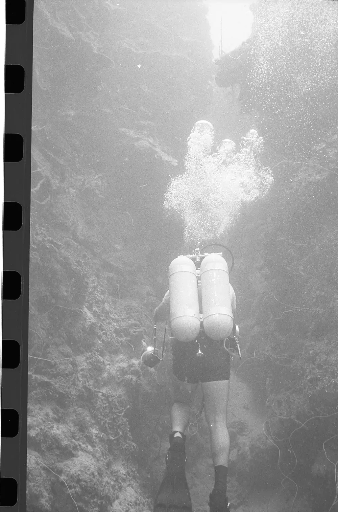{.lightbox group="discovery-bay-1966" description="**UUID: **5ae51f56-6eb9-4714-be22-b85bd933330f **Date: **NA **Location: **Jamaica | Discovery Bay | Pear Tree Bottom **Longitude: **77.35867ºW **Latitude: **18.4635ºN **Photographer: **Eileen Graham **Copyright: **Trustees of the Natural History Museum (London, UK), CC-BY-4.0" alt="**UUID: **5ae51f56-6eb9-4714-be22-b85bd933330f **Date: **NA **Location: **Jamaica | Discovery Bay | Pear Tree Bottom **Longitude: **77.35867ºW **Latitude: **18.4635ºN **Photographer: **Eileen Graham **Copyright: **Trustees of the Natural History Museum (London, UK), CC-BY-4.0"}

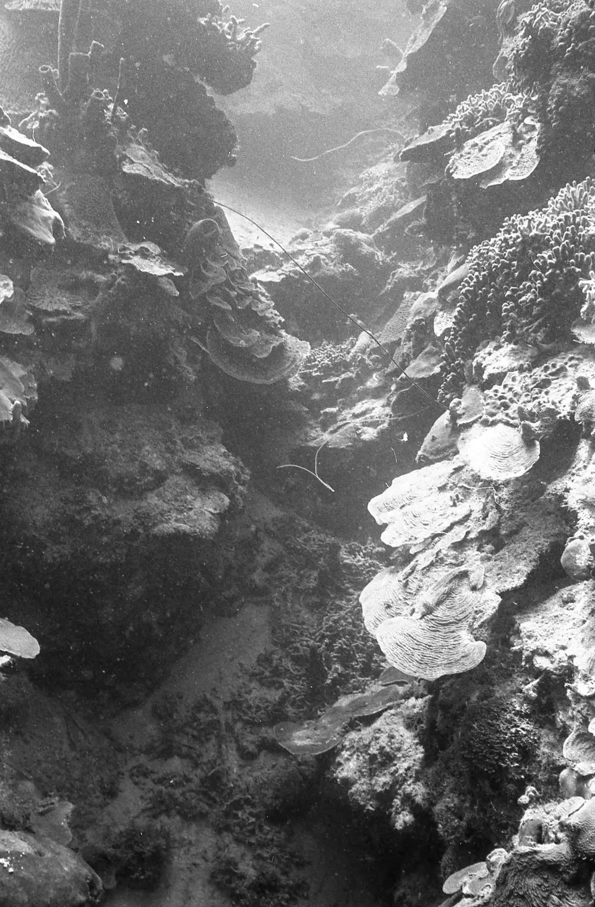{.lightbox group="discovery-bay-1966" description="**UUID: **c5d60003-692e-4880-9551-50b935822098 **Date: **NA **Location: **Jamaica | Discovery Bay | Pear Tree Bottom **Longitude: **77.35867ºW **Latitude: **18.4635ºN **Photographer: **Eileen Graham **Copyright: **Trustees of the Natural History Museum (London, UK), CC-BY-4.0" alt="**UUID: **c5d60003-692e-4880-9551-50b935822098 **Date: **NA **Location: **Jamaica | Discovery Bay | Pear Tree Bottom **Longitude: **77.35867ºW **Latitude: **18.4635ºN **Photographer: **Eileen Graham **Copyright: **Trustees of the Natural History Museum (London, UK), CC-BY-4.0"}

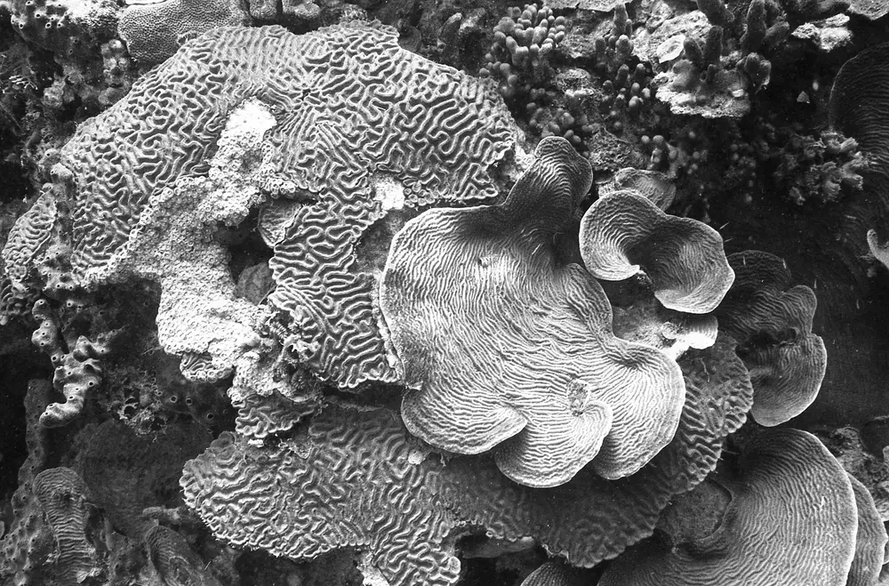{.lightbox group="discovery-bay-1966" description="**UUID: **84d66b26-4cab-474e-9f91-4ef904e5651c **Date: **NA **Location: **Jamaica | Discovery Bay | Pear Tree Bottom **Longitude: **77.35867ºW **Latitude: **18.4635ºN **Photographer: **Eileen Graham **Copyright: **Trustees of the Natural History Museum (London, UK), CC-BY-4.0" alt="**UUID: **84d66b26-4cab-474e-9f91-4ef904e5651c **Date: **NA **Location: **Jamaica | Discovery Bay | Pear Tree Bottom **Longitude: **77.35867ºW **Latitude: **18.4635ºN **Photographer: **Eileen Graham **Copyright: **Trustees of the Natural History Museum (London, UK), CC-BY-4.0"}

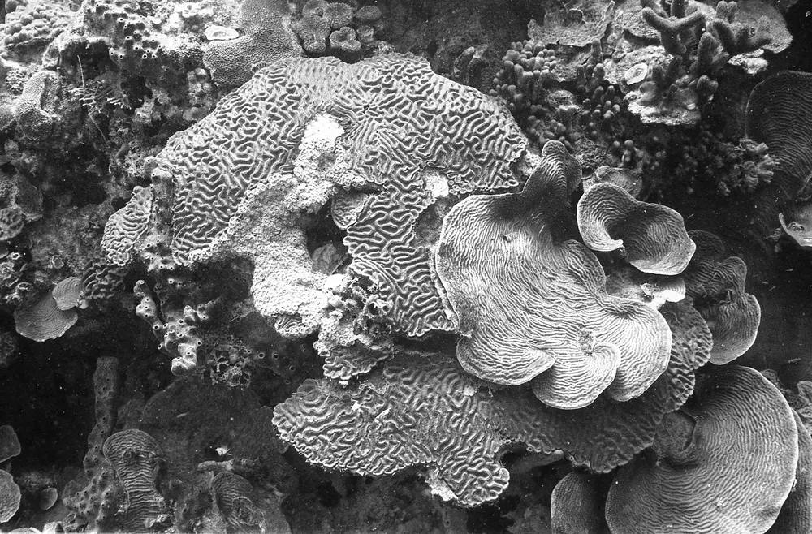{.lightbox group="discovery-bay-1966" description="**UUID: **d29103ee-83cb-4f97-8cf5-69a6a0d3c524 **Date: **NA **Location: **Jamaica | Discovery Bay | Pear Tree Bottom **Longitude: **77.35867ºW **Latitude: **18.4635ºN **Photographer: **Eileen Graham **Copyright: **Trustees of the Natural History Museum (London, UK), CC-BY-4.0" alt="**UUID: **d29103ee-83cb-4f97-8cf5-69a6a0d3c524 **Date: **NA **Location: **Jamaica | Discovery Bay | Pear Tree Bottom **Longitude: **77.35867ºW **Latitude: **18.4635ºN **Photographer: **Eileen Graham **Copyright: **Trustees of the Natural History Museum (London, UK), CC-BY-4.0"}

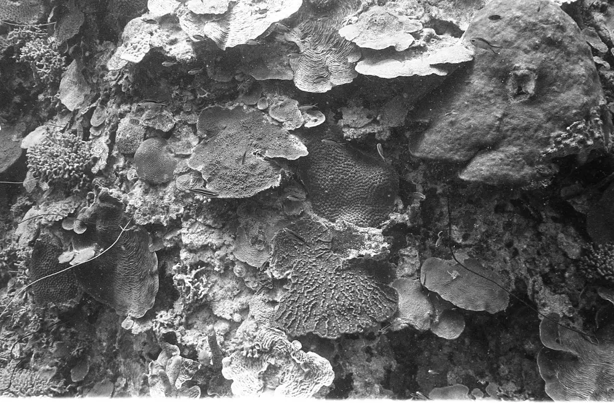{.lightbox group="discovery-bay-1966" description="**UUID: **7474719a-5a06-4cc0-b822-2517f02d9034 **Date: **NA **Location: **Jamaica | Discovery Bay | Pear Tree Bottom **Longitude: **77.35867ºW **Latitude: **18.4635ºN **Photographer: **Eileen Graham **Copyright: **Trustees of the Natural History Museum (London, UK), CC-BY-4.0" alt="**UUID: **7474719a-5a06-4cc0-b822-2517f02d9034 **Date: **NA **Location: **Jamaica | Discovery Bay | Pear Tree Bottom **Longitude: **77.35867ºW **Latitude: **18.4635ºN **Photographer: **Eileen Graham **Copyright: **Trustees of the Natural History Museum (London, UK), CC-BY-4.0"}

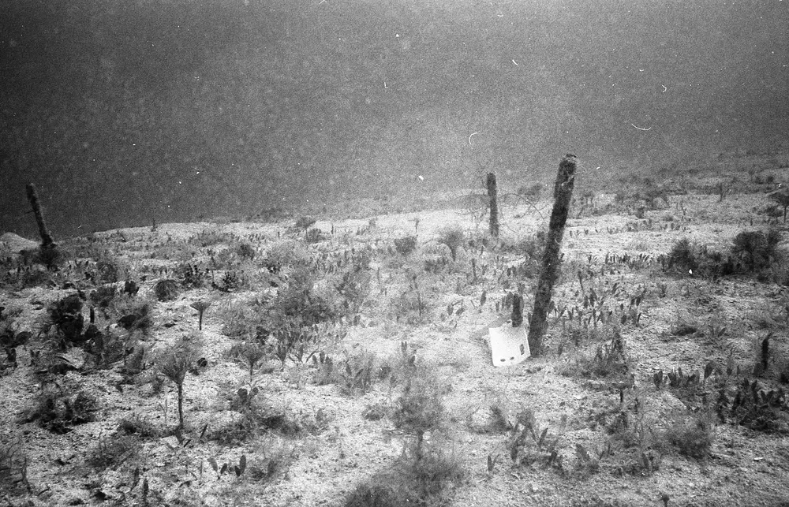{.lightbox group="discovery-bay-1966" description="**UUID: **b31eed80-a7d9-454c-91ae-21f68ee55997 **Date: **1966-08-26 **Location: **Jamaica | Discovery Bay | Algal Plots **Longitude: **77.414ºW **Latitude: **18.473ºN **Photographer: **Eileen Graham **Copyright: **Trustees of the Natural History Museum (London, UK), CC-BY-4.0" alt="**UUID: **b31eed80-a7d9-454c-91ae-21f68ee55997 **Date: **1966-08-26 **Location: **Jamaica | Discovery Bay | Algal Plots **Longitude: **77.414ºW **Latitude: **18.473ºN **Photographer: **Eileen Graham **Copyright: **Trustees of the Natural History Museum (London, UK), CC-BY-4.0"}

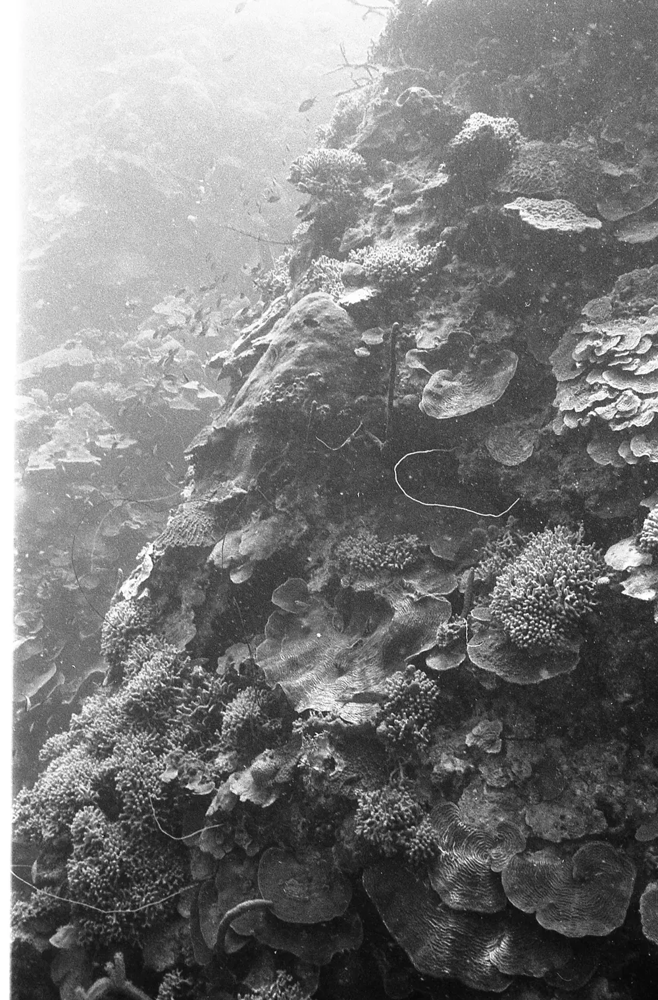{.lightbox group="discovery-bay-1966" description="**UUID: **b666a7aa-2b62-4b71-9d15-958b78df1c34 **Date: **NA **Location: **Jamaica | Discovery Bay | Pear Tree Bottom **Longitude: **77.35867ºW **Latitude: **18.4635ºN **Photographer: **Eileen Graham **Copyright: **Trustees of the Natural History Museum (London, UK), CC-BY-4.0" alt="**UUID: **b666a7aa-2b62-4b71-9d15-958b78df1c34 **Date: **NA **Location: **Jamaica | Discovery Bay | Pear Tree Bottom **Longitude: **77.35867ºW **Latitude: **18.4635ºN **Photographer: **Eileen Graham **Copyright: **Trustees of the Natural History Museum (London, UK), CC-BY-4.0"}

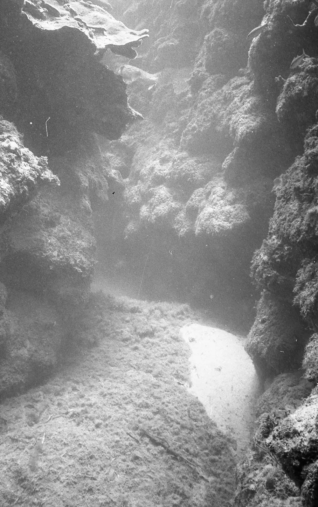{.lightbox group="discovery-bay-1966" description="**UUID: **e096767b-42f9-40eb-8910-fd42a0cda750 **Date: **NA **Location: **Jamaica | Discovery Bay | Pear Tree Bottom **Longitude: **77.35867ºW **Latitude: **18.4635ºN **Photographer: **Eileen Graham **Copyright: **Trustees of the Natural History Museum (London, UK), CC-BY-4.0" alt="**UUID: **e096767b-42f9-40eb-8910-fd42a0cda750 **Date: **NA **Location: **Jamaica | Discovery Bay | Pear Tree Bottom **Longitude: **77.35867ºW **Latitude: **18.4635ºN **Photographer: **Eileen Graham **Copyright: **Trustees of the Natural History Museum (London, UK), CC-BY-4.0"}

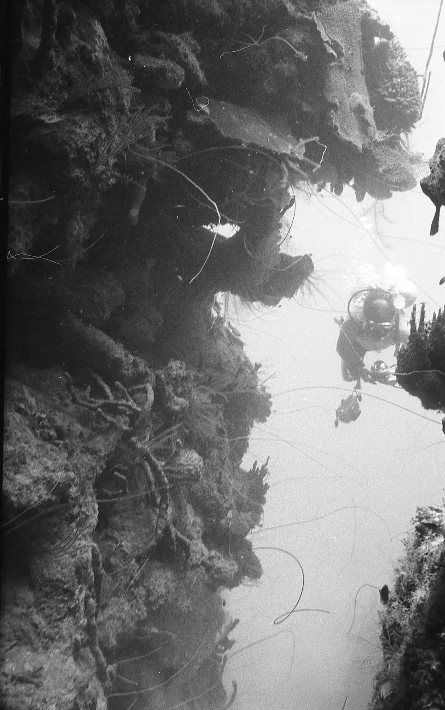{.lightbox group="discovery-bay-1966" description="**UUID: **03f5d75b-dd26-4719-bbfb-4920ae011bbc **Date: **NA **Location: **Jamaica | Discovery Bay | Pear Tree Bottom **Longitude: **77.35867ºW **Latitude: **18.4635ºN **Photographer: **Eileen Graham **Copyright: **Trustees of the Natural History Museum (London, UK), CC-BY-4.0" alt="**UUID: **03f5d75b-dd26-4719-bbfb-4920ae011bbc **Date: **NA **Location: **Jamaica | Discovery Bay | Pear Tree Bottom **Longitude: **77.35867ºW **Latitude: **18.4635ºN **Photographer: **Eileen Graham **Copyright: **Trustees of the Natural History Museum (London, UK), CC-BY-4.0"}

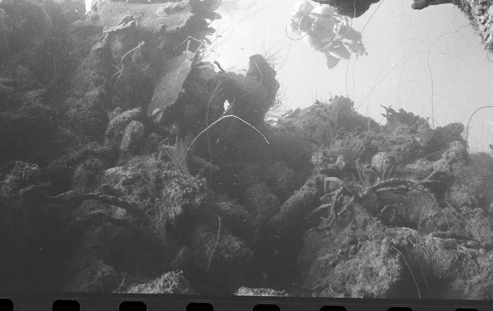{.lightbox group="discovery-bay-1966" description="**UUID: **ffb00c34-71bc-45bb-b168-4953f6aeea3e **Date: **NA **Location: **Jamaica | Discovery Bay | Pear Tree Bottom **Longitude: **77.35867ºW **Latitude: **18.4635ºN **Photographer: **Eileen Graham **Copyright: **Trustees of the Natural History Museum (London, UK), CC-BY-4.0" alt="**UUID: **ffb00c34-71bc-45bb-b168-4953f6aeea3e **Date: **NA **Location: **Jamaica | Discovery Bay | Pear Tree Bottom **Longitude: **77.35867ºW **Latitude: **18.4635ºN **Photographer: **Eileen Graham **Copyright: **Trustees of the Natural History Museum (London, UK), CC-BY-4.0"}

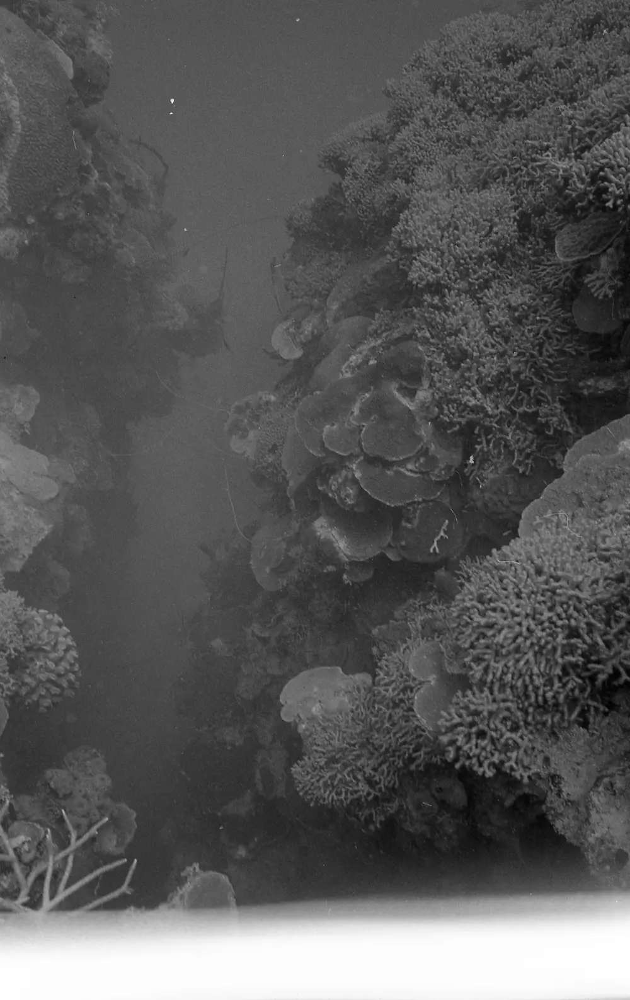{.lightbox group="discovery-bay-1966" description="**UUID: **43a9ab88-2a44-4830-9b95-09f6a223187f **Date: **NA **Location: **Jamaica | Discovery Bay | Pear Tree Bottom **Longitude: **77.35867ºW **Latitude: **18.4635ºN **Photographer: **Eileen Graham **Copyright: **Trustees of the Natural History Museum (London, UK), CC-BY-4.0" alt="**UUID: **43a9ab88-2a44-4830-9b95-09f6a223187f **Date: **NA **Location: **Jamaica | Discovery Bay | Pear Tree Bottom **Longitude: **77.35867ºW **Latitude: **18.4635ºN **Photographer: **Eileen Graham **Copyright: **Trustees of the Natural History Museum (London, UK), CC-BY-4.0"}

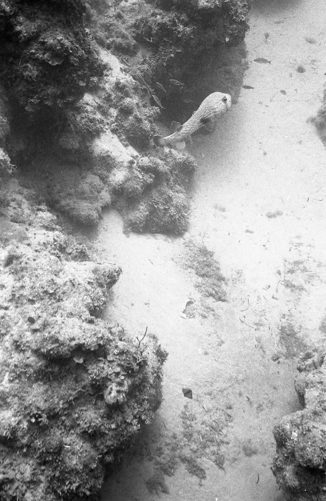{.lightbox group="discovery-bay-1966" description="**UUID: **68291372-3f61-470b-87de-73920d069df5 **Date: **NA **Location: **Jamaica | Discovery Bay | Pear Tree Bottom **Longitude: **77.35867ºW **Latitude: **18.4635ºN **Photographer: **Eileen Graham **Copyright: **Trustees of the Natural History Museum (London, UK), CC-BY-4.0" alt="**UUID: **68291372-3f61-470b-87de-73920d069df5 **Date: **NA **Location: **Jamaica | Discovery Bay | Pear Tree Bottom **Longitude: **77.35867ºW **Latitude: **18.4635ºN **Photographer: **Eileen Graham **Copyright: **Trustees of the Natural History Museum (London, UK), CC-BY-4.0"}

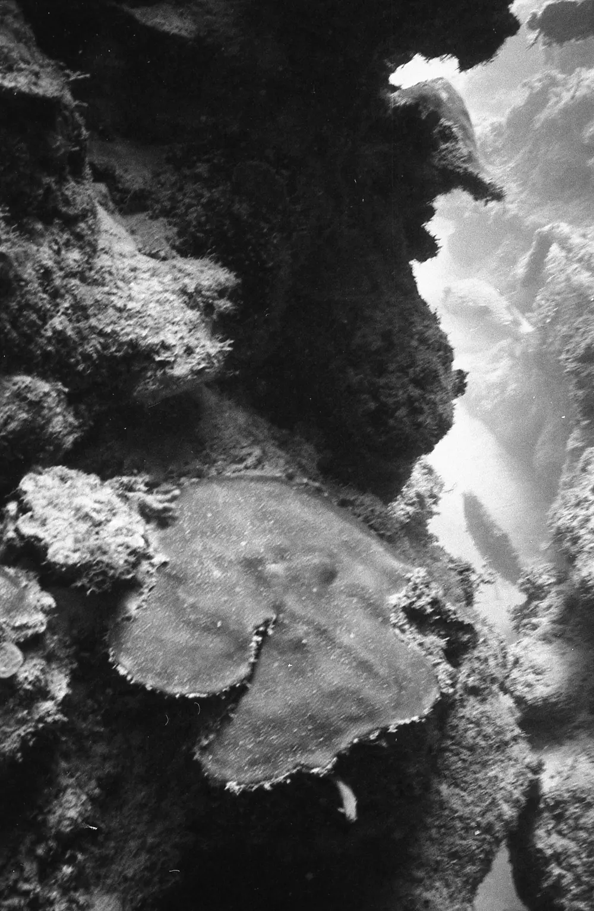{.lightbox group="discovery-bay-1966" description="**UUID: **84f14ed5-9d96-4e99-915c-11f6cc85383c **Date: **NA **Location: **Jamaica | Discovery Bay | Pear Tree Bottom **Longitude: **77.35867ºW **Latitude: **18.4635ºN **Photographer: **Eileen Graham **Copyright: **Trustees of the Natural History Museum (London, UK), CC-BY-4.0" alt="**UUID: **84f14ed5-9d96-4e99-915c-11f6cc85383c **Date: **NA **Location: **Jamaica | Discovery Bay | Pear Tree Bottom **Longitude: **77.35867ºW **Latitude: **18.4635ºN **Photographer: **Eileen Graham **Copyright: **Trustees of the Natural History Museum (London, UK), CC-BY-4.0"}

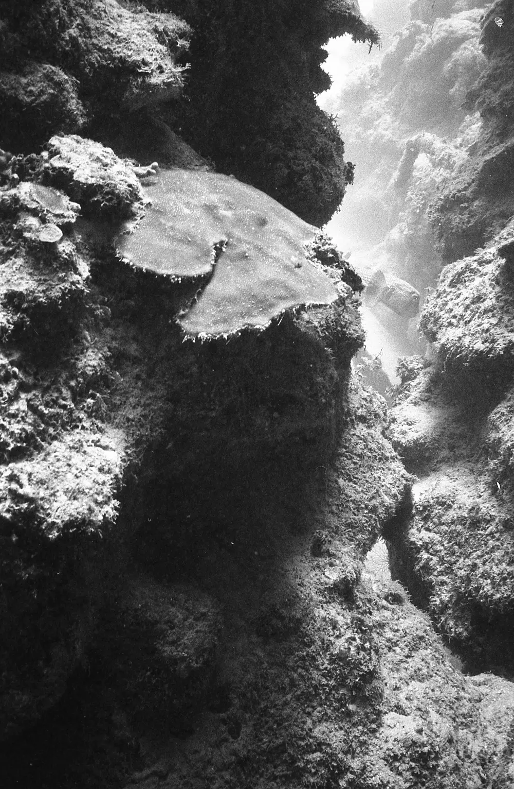{.lightbox group="discovery-bay-1966" description="**UUID: **bc137cc8-f3ec-4a27-a850-170739d84e8b **Date: **NA **Location: **Jamaica | Discovery Bay | Pear Tree Bottom **Longitude: **77.35867ºW **Latitude: **18.4635ºN **Photographer: **Eileen Graham **Copyright: **Trustees of the Natural History Museum (London, UK), CC-BY-4.0" alt="**UUID: **bc137cc8-f3ec-4a27-a850-170739d84e8b **Date: **NA **Location: **Jamaica | Discovery Bay | Pear Tree Bottom **Longitude: **77.35867ºW **Latitude: **18.4635ºN **Photographer: **Eileen Graham **Copyright: **Trustees of the Natural History Museum (London, UK), CC-BY-4.0"}

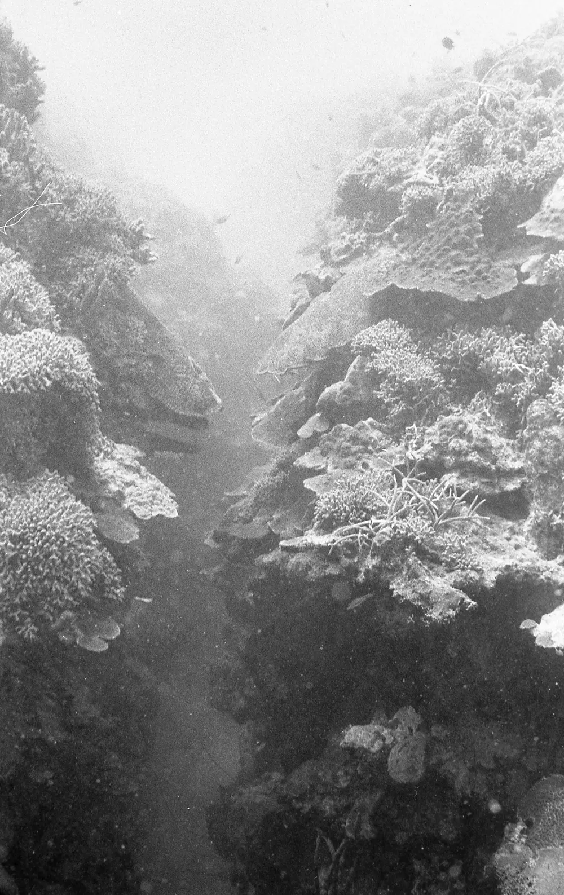{.lightbox group="discovery-bay-1966" description="**UUID: **ee29a8ea-ba20-4bb8-996d-05bfc364b144 **Date: **NA **Location: **Jamaica | Discovery Bay | Pear Tree Bottom **Longitude: **77.35867ºW **Latitude: **18.4635ºN **Photographer: **Eileen Graham **Copyright: **Trustees of the Natural History Museum (London, UK), CC-BY-4.0" alt="**UUID: **ee29a8ea-ba20-4bb8-996d-05bfc364b144 **Date: **NA **Location: **Jamaica | Discovery Bay | Pear Tree Bottom **Longitude: **77.35867ºW **Latitude: **18.4635ºN **Photographer: **Eileen Graham **Copyright: **Trustees of the Natural History Museum (London, UK), CC-BY-4.0"}

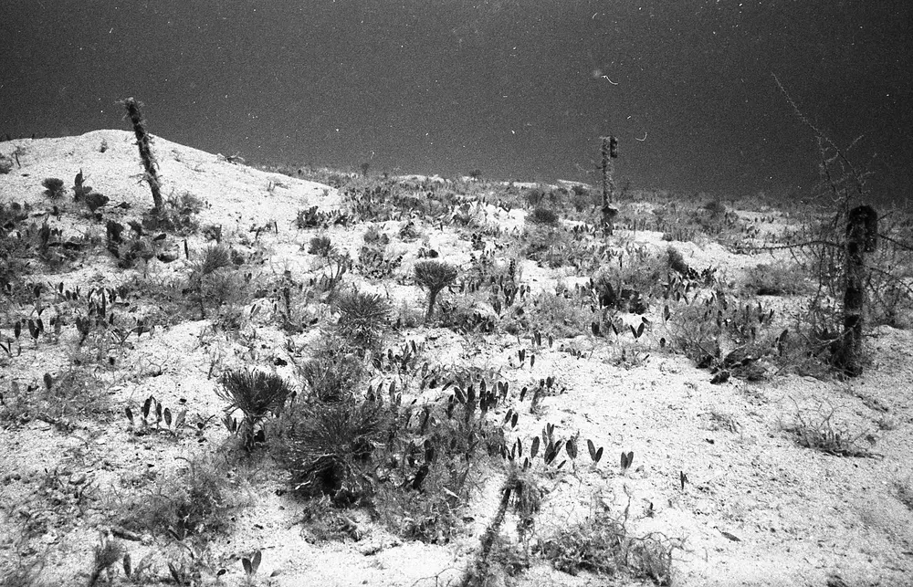{.lightbox group="discovery-bay-1966" description="**UUID: **2601ac5c-4964-4e38-9a31-6020d9d9d28f **Date: **1966-08-26 **Location: **Jamaica | Discovery Bay | Algal Plots **Longitude: **77.414ºW **Latitude: **18.473ºN **Photographer: **Eileen Graham **Copyright: **Trustees of the Natural History Museum (London, UK), CC-BY-4.0" alt="**UUID: **2601ac5c-4964-4e38-9a31-6020d9d9d28f **Date: **1966-08-26 **Location: **Jamaica | Discovery Bay | Algal Plots **Longitude: **77.414ºW **Latitude: **18.473ºN **Photographer: **Eileen Graham **Copyright: **Trustees of the Natural History Museum (London, UK), CC-BY-4.0"}

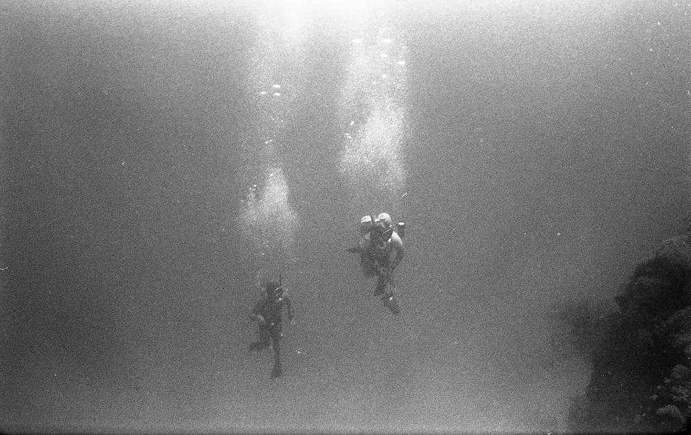{.lightbox group="discovery-bay-1966" description="**UUID: **df0ef2fa-dbea-4dac-a22d-1dd5211c44a6 **Date: **NA **Location: **Jamaica | Discovery Bay | Pear Tree Bottom **Longitude: **77.35867ºW **Latitude: **18.4635ºN **Photographer: **Eileen Graham **Copyright: **Trustees of the Natural History Museum (London, UK), CC-BY-4.0" alt="**UUID: **df0ef2fa-dbea-4dac-a22d-1dd5211c44a6 **Date: **NA **Location: **Jamaica | Discovery Bay | Pear Tree Bottom **Longitude: **77.35867ºW **Latitude: **18.4635ºN **Photographer: **Eileen Graham **Copyright: **Trustees of the Natural History Museum (London, UK), CC-BY-4.0"}

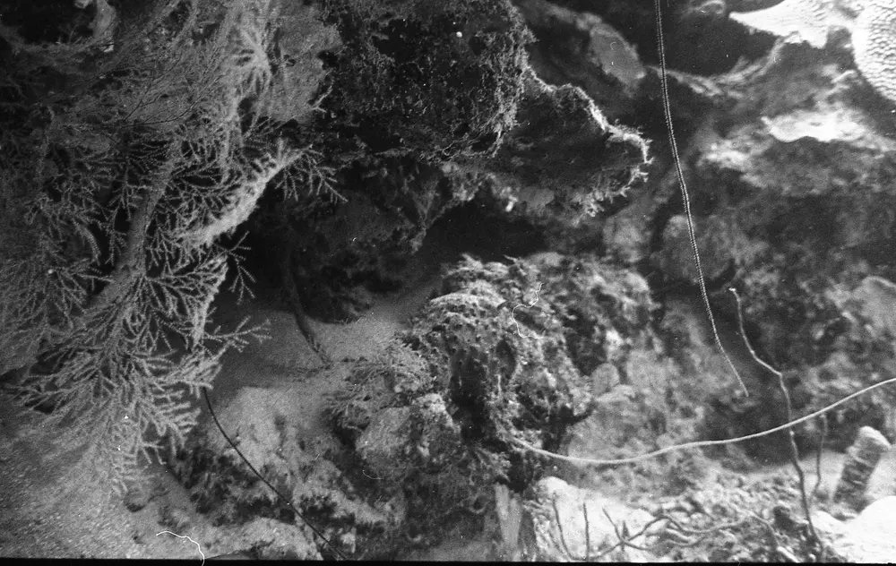{.lightbox group="discovery-bay-1966" description="**UUID: **d9bd27aa-8c60-45c1-affe-0d6acf3a790b **Date: **NA **Location: **Jamaica | Discovery Bay | Pear Tree Bottom **Longitude: **77.35867ºW **Latitude: **18.4635ºN **Photographer: **Eileen Graham **Copyright: **Trustees of the Natural History Museum (London, UK), CC-BY-4.0" alt="**UUID: **d9bd27aa-8c60-45c1-affe-0d6acf3a790b **Date: **NA **Location: **Jamaica | Discovery Bay | Pear Tree Bottom **Longitude: **77.35867ºW **Latitude: **18.4635ºN **Photographer: **Eileen Graham **Copyright: **Trustees of the Natural History Museum (London, UK), CC-BY-4.0"}

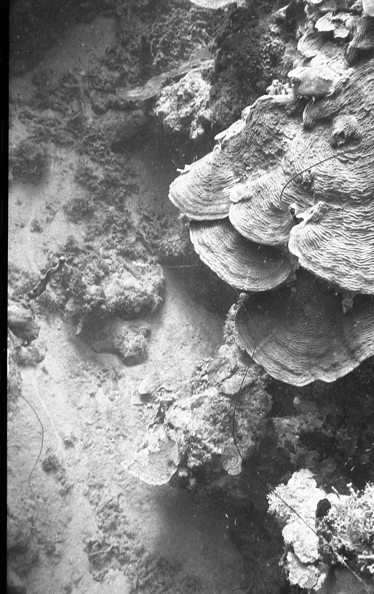{.lightbox group="discovery-bay-1966" description="**UUID: **9f38776d-d958-4518-b659-bcfba7c2364f **Date: **NA **Location: **Jamaica | Discovery Bay | Pear Tree Bottom **Longitude: **77.35867ºW **Latitude: **18.4635ºN **Photographer: **Eileen Graham **Copyright: **Trustees of the Natural History Museum (London, UK), CC-BY-4.0" alt="**UUID: **9f38776d-d958-4518-b659-bcfba7c2364f **Date: **NA **Location: **Jamaica | Discovery Bay | Pear Tree Bottom **Longitude: **77.35867ºW **Latitude: **18.4635ºN **Photographer: **Eileen Graham **Copyright: **Trustees of the Natural History Museum (London, UK), CC-BY-4.0"}

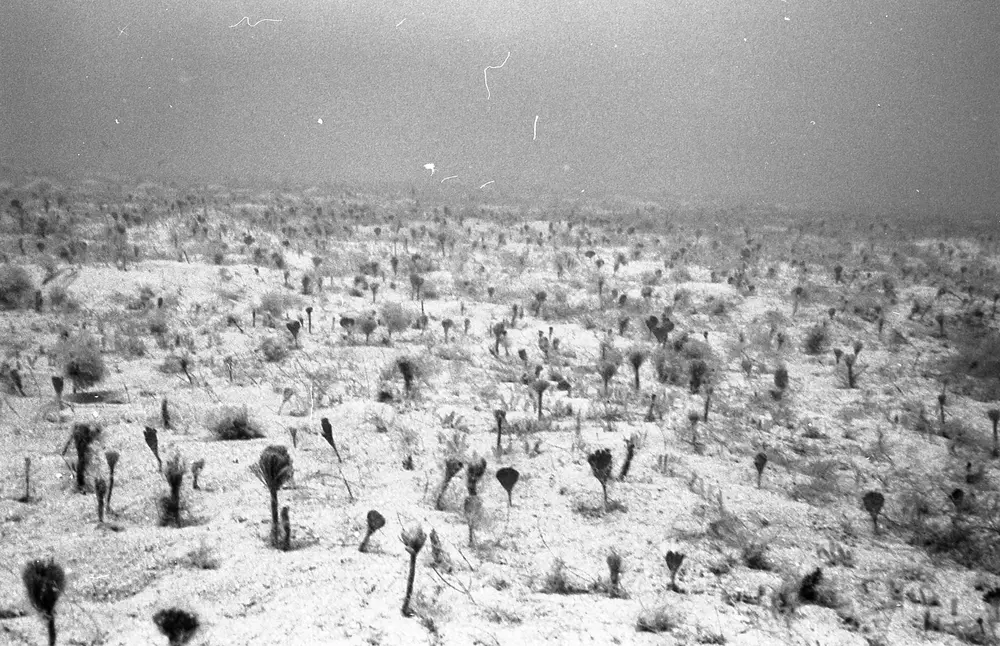{.lightbox group="discovery-bay-1966" description="**UUID: **d1917926-6706-40f3-a7c1-a9c2f2265c88 **Date: **NA **Location: **Jamaica | Discovery Bay | Algal Plots **Longitude: **77.414ºW **Latitude: **18.473ºN **Photographer: **Eileen Graham **Copyright: **Trustees of the Natural History Museum (London, UK), CC-BY-4.0" alt="**UUID: **d1917926-6706-40f3-a7c1-a9c2f2265c88 **Date: **NA **Location: **Jamaica | Discovery Bay | Algal Plots **Longitude: **77.414ºW **Latitude: **18.473ºN **Photographer: **Eileen Graham **Copyright: **Trustees of the Natural History Museum (London, UK), CC-BY-4.0"}

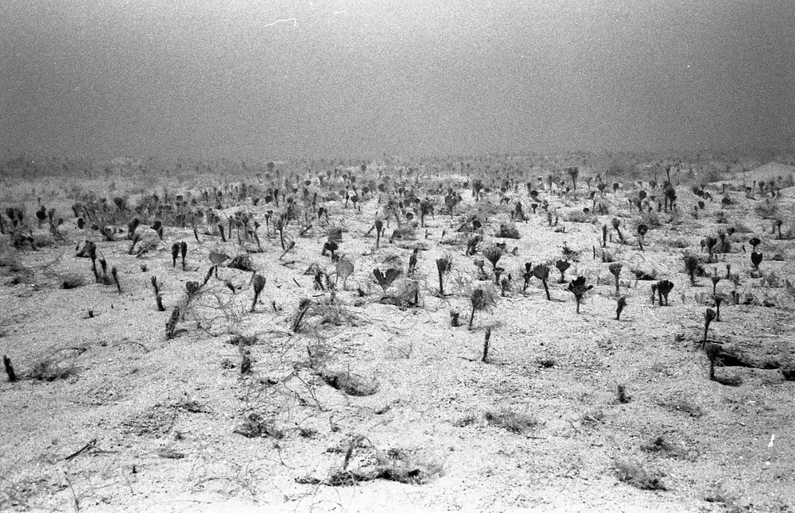{.lightbox group="discovery-bay-1966" description="**UUID: **491804a8-a7fd-4bfe-b3e7-4af799370051 **Date: **NA **Location: **Jamaica | Discovery Bay | Algal Plots **Longitude: **77.414ºW **Latitude: **18.473ºN **Photographer: **Eileen Graham **Copyright: **Trustees of the Natural History Museum (London, UK), CC-BY-4.0" alt="**UUID: **491804a8-a7fd-4bfe-b3e7-4af799370051 **Date: **NA **Location: **Jamaica | Discovery Bay | Algal Plots **Longitude: **77.414ºW **Latitude: **18.473ºN **Photographer: **Eileen Graham **Copyright: **Trustees of the Natural History Museum (London, UK), CC-BY-4.0"}

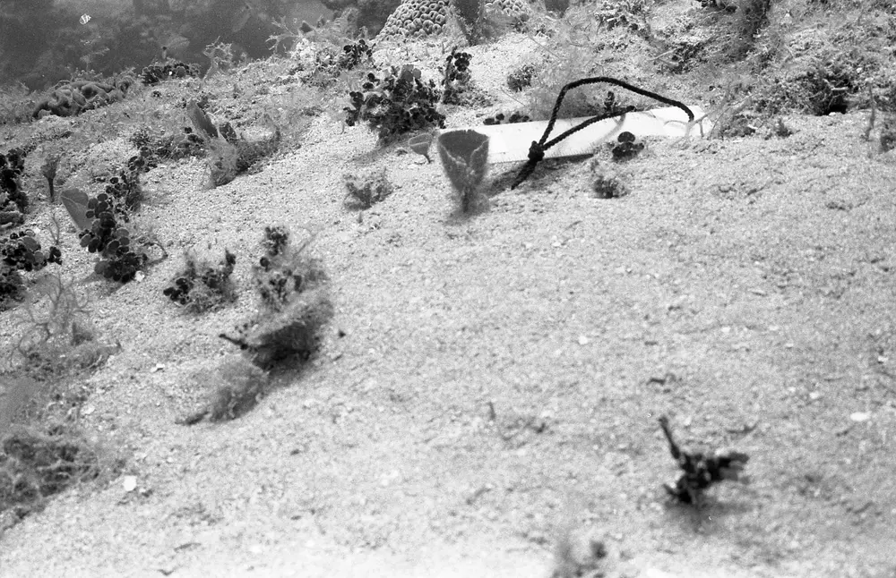{.lightbox group="discovery-bay-1966" description="**UUID: **2817db59-a7c9-4b2d-9e35-e16821956926 **Date: **NA **Location: **Jamaica | Discovery Bay | Algal Plots **Longitude: **77.414ºW **Latitude: **18.473ºN **Photographer: **Eileen Graham **Copyright: **Trustees of the Natural History Museum (London, UK), CC-BY-4.0" alt="**UUID: **2817db59-a7c9-4b2d-9e35-e16821956926 **Date: **NA **Location: **Jamaica | Discovery Bay | Algal Plots **Longitude: **77.414ºW **Latitude: **18.473ºN **Photographer: **Eileen Graham **Copyright: **Trustees of the Natural History Museum (London, UK), CC-BY-4.0"}

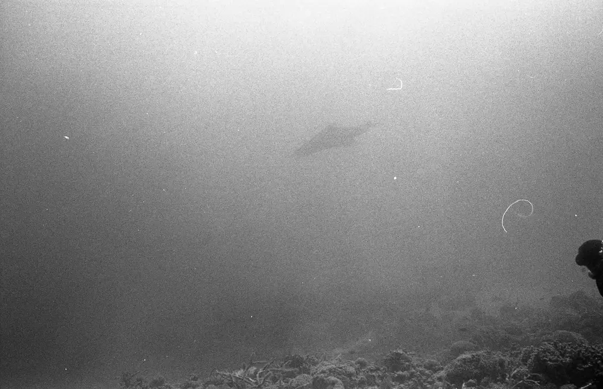{.lightbox group="discovery-bay-1966" description="**UUID: **a1945e65-ab26-4aee-b4f3-95f05d712069 **Date: **NA **Location: **Jamaica | Discovery Bay | Pear Tree Bottom **Longitude: **77.35867ºW **Latitude: **18.4635ºN **Photographer: **Eileen Graham **Copyright: **Trustees of the Natural History Museum (London, UK), CC-BY-4.0" alt="**UUID: **a1945e65-ab26-4aee-b4f3-95f05d712069 **Date: **NA **Location: **Jamaica | Discovery Bay | Pear Tree Bottom **Longitude: **77.35867ºW **Latitude: **18.4635ºN **Photographer: **Eileen Graham **Copyright: **Trustees of the Natural History Museum (London, UK), CC-BY-4.0"}

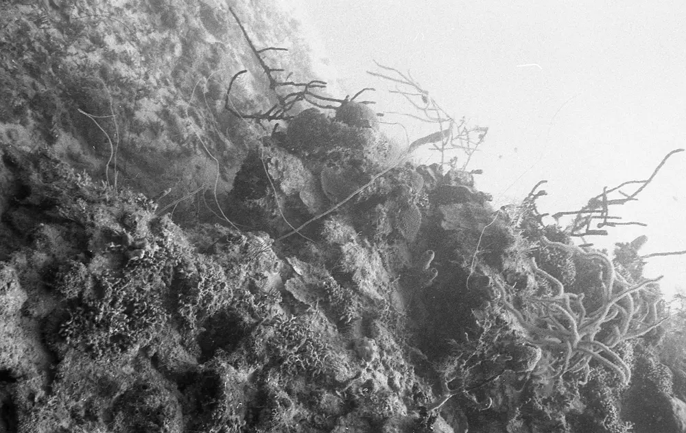{.lightbox group="discovery-bay-1966" description="**UUID: **ff5a9fd5-0f32-4705-b3c0-0979c8594646 **Date: **NA **Location: **Jamaica | Discovery Bay | Pear Tree Bottom **Longitude: **77.35867ºW **Latitude: **18.4635ºN **Photographer: **Eileen Graham **Copyright: **Trustees of the Natural History Museum (London, UK), CC-BY-4.0" alt="**UUID: **ff5a9fd5-0f32-4705-b3c0-0979c8594646 **Date: **NA **Location: **Jamaica | Discovery Bay | Pear Tree Bottom **Longitude: **77.35867ºW **Latitude: **18.4635ºN **Photographer: **Eileen Graham **Copyright: **Trustees of the Natural History Museum (London, UK), CC-BY-4.0"}

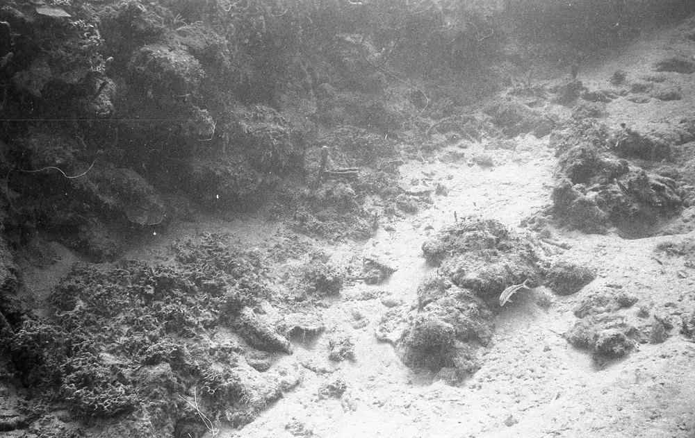{.lightbox group="discovery-bay-1966" description="**UUID: **78822a21-8bbe-4885-8c3a-7b24c06630ab **Date: **NA **Location: **Jamaica | Discovery Bay | Pear Tree Bottom **Longitude: **77.35867ºW **Latitude: **18.4635ºN **Photographer: **Eileen Graham **Copyright: **Trustees of the Natural History Museum (London, UK), CC-BY-4.0" alt="**UUID: **78822a21-8bbe-4885-8c3a-7b24c06630ab **Date: **NA **Location: **Jamaica | Discovery Bay | Pear Tree Bottom **Longitude: **77.35867ºW **Latitude: **18.4635ºN **Photographer: **Eileen Graham **Copyright: **Trustees of the Natural History Museum (London, UK), CC-BY-4.0"}

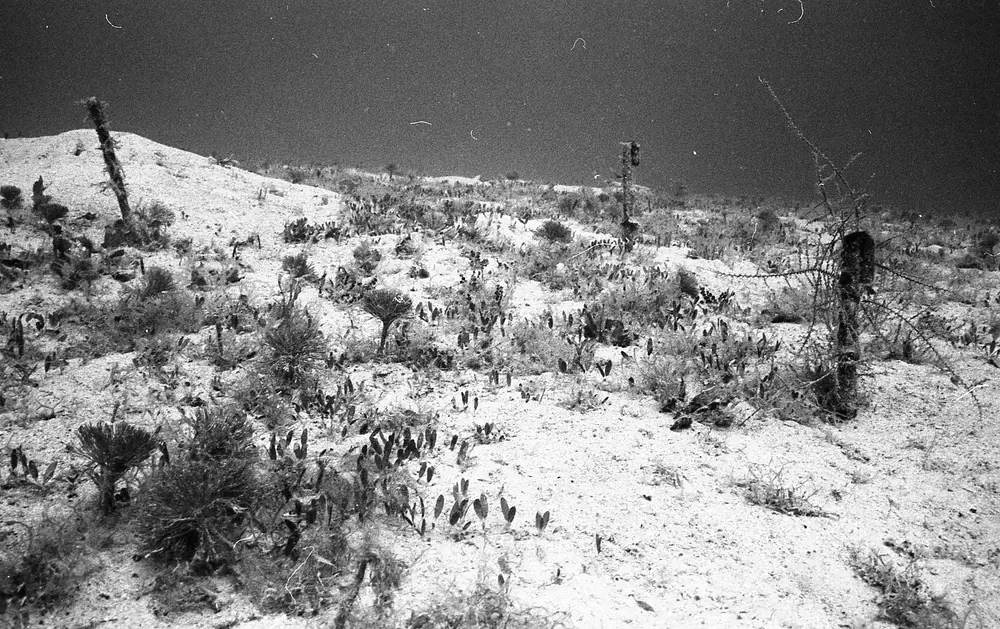{.lightbox group="discovery-bay-1966" description="**UUID: **3dc439e6-4aaf-413a-9a89-08ab5223c35a **Date: **1966-08-26 **Location: **Jamaica | Discovery Bay | Algal Plots **Longitude: **77.414ºW **Latitude: **18.473ºN **Photographer: **Eileen Graham **Copyright: **Trustees of the Natural History Museum (London, UK), CC-BY-4.0" alt="**UUID: **3dc439e6-4aaf-413a-9a89-08ab5223c35a **Date: **1966-08-26 **Location: **Jamaica | Discovery Bay | Algal Plots **Longitude: **77.414ºW **Latitude: **18.473ºN **Photographer: **Eileen Graham **Copyright: **Trustees of the Natural History Museum (London, UK), CC-BY-4.0"}

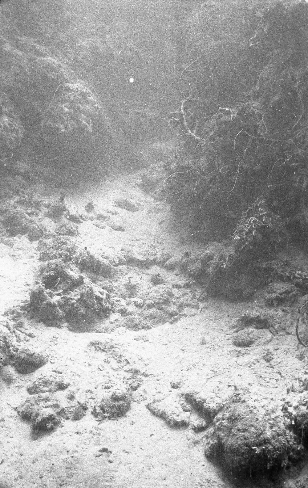{.lightbox group="discovery-bay-1966" description="**UUID: **55c952a5-cb78-4d2d-ae3c-77a08ac0640b **Date: **NA **Location: **Jamaica | Discovery Bay | Pear Tree Bottom **Longitude: **77.35867ºW **Latitude: **18.4635ºN **Photographer: **Eileen Graham **Copyright: **Trustees of the Natural History Museum (London, UK), CC-BY-4.0" alt="**UUID: **55c952a5-cb78-4d2d-ae3c-77a08ac0640b **Date: **NA **Location: **Jamaica | Discovery Bay | Pear Tree Bottom **Longitude: **77.35867ºW **Latitude: **18.4635ºN **Photographer: **Eileen Graham **Copyright: **Trustees of the Natural History Museum (London, UK), CC-BY-4.0"}

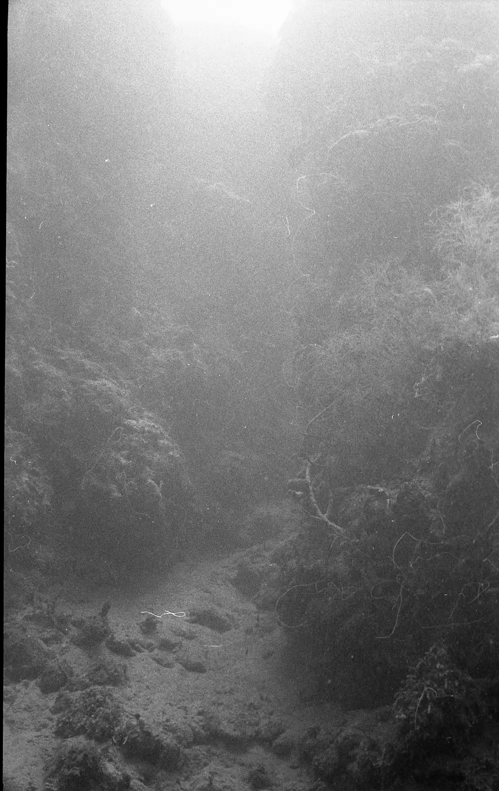{.lightbox group="discovery-bay-1966" description="**UUID: **cd2031af-1ca1-4514-8f89-3946c3ba5c26 **Date: **NA **Location: **Jamaica | Discovery Bay | Pear Tree Bottom **Longitude: **77.35867ºW **Latitude: **18.4635ºN **Photographer: **Eileen Graham **Copyright: **Trustees of the Natural History Museum (London, UK), CC-BY-4.0" alt="**UUID: **cd2031af-1ca1-4514-8f89-3946c3ba5c26 **Date: **NA **Location: **Jamaica | Discovery Bay | Pear Tree Bottom **Longitude: **77.35867ºW **Latitude: **18.4635ºN **Photographer: **Eileen Graham **Copyright: **Trustees of the Natural History Museum (London, UK), CC-BY-4.0"}

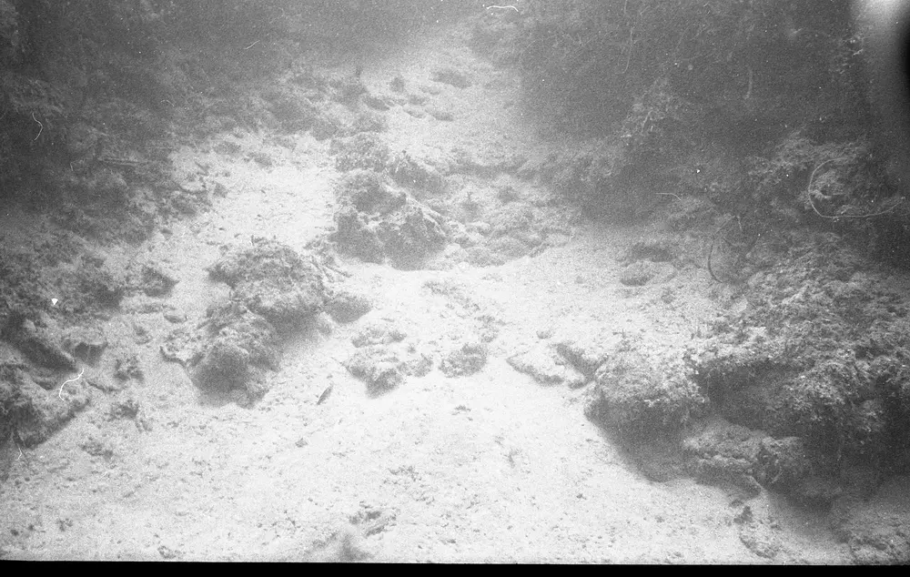{.lightbox group="discovery-bay-1966" description="**UUID: **ee245a7f-3ffc-4216-b8e0-328bb3f432b1 **Date: **NA **Location: **Jamaica | Discovery Bay | Pear Tree Bottom **Longitude: **77.35867ºW **Latitude: **18.4635ºN **Photographer: **Eileen Graham **Copyright: **Trustees of the Natural History Museum (London, UK), CC-BY-4.0" alt="**UUID: **ee245a7f-3ffc-4216-b8e0-328bb3f432b1 **Date: **NA **Location: **Jamaica | Discovery Bay | Pear Tree Bottom **Longitude: **77.35867ºW **Latitude: **18.4635ºN **Photographer: **Eileen Graham **Copyright: **Trustees of the Natural History Museum (London, UK), CC-BY-4.0"}

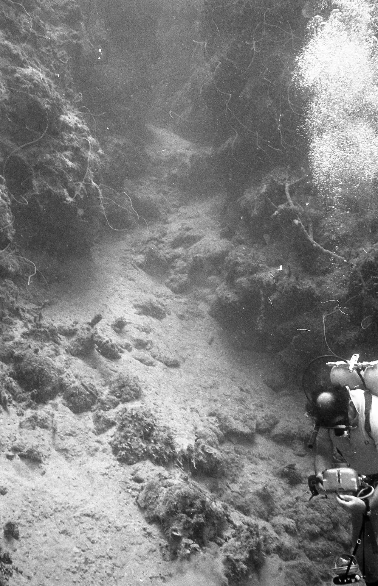{.lightbox group="discovery-bay-1966" description="**UUID: **e78ef3cf-4396-4138-8ef1-e1047a091836 **Date: **NA **Location: **Jamaica | Discovery Bay | Pear Tree Bottom **Longitude: **77.35867ºW **Latitude: **18.4635ºN **Photographer: **Eileen Graham **Copyright: **Trustees of the Natural History Museum (London, UK), CC-BY-4.0" alt="**UUID: **e78ef3cf-4396-4138-8ef1-e1047a091836 **Date: **NA **Location: **Jamaica | Discovery Bay | Pear Tree Bottom **Longitude: **77.35867ºW **Latitude: **18.4635ºN **Photographer: **Eileen Graham **Copyright: **Trustees of the Natural History Museum (London, UK), CC-BY-4.0"}

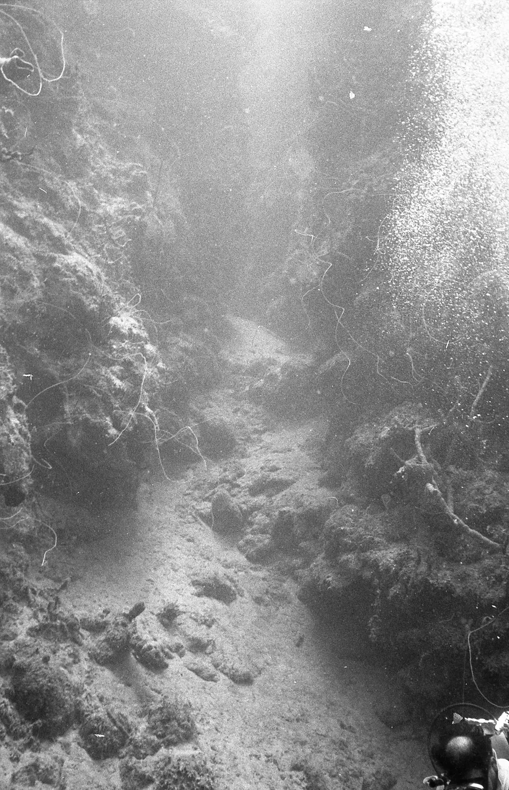{.lightbox group="discovery-bay-1966" description="**UUID: **31e36833-51cd-4590-bc89-e87ba20729c6 **Date: **NA **Location: **Jamaica | Discovery Bay | Pear Tree Bottom **Longitude: **77.35867ºW **Latitude: **18.4635ºN **Photographer: **Eileen Graham **Copyright: **Trustees of the Natural History Museum (London, UK), CC-BY-4.0" alt="**UUID: **31e36833-51cd-4590-bc89-e87ba20729c6 **Date: **NA **Location: **Jamaica | Discovery Bay | Pear Tree Bottom **Longitude: **77.35867ºW **Latitude: **18.4635ºN **Photographer: **Eileen Graham **Copyright: **Trustees of the Natural History Museum (London, UK), CC-BY-4.0"}

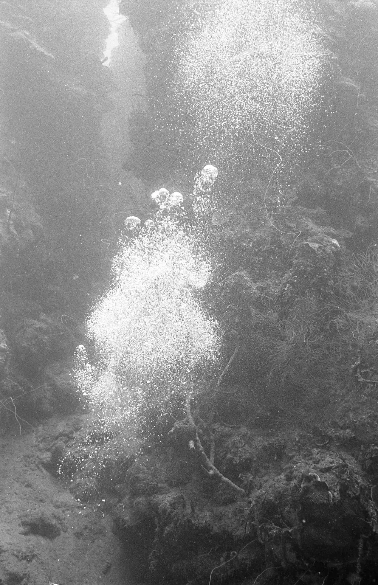{.lightbox group="discovery-bay-1966" description="**UUID: **ea98b8e9-4c5f-4e28-9632-8f5df6911536 **Date: **NA **Location: **Jamaica | Discovery Bay | Pear Tree Bottom **Longitude: **77.35867ºW **Latitude: **18.4635ºN **Photographer: **Eileen Graham **Copyright: **Trustees of the Natural History Museum (London, UK), CC-BY-4.0" alt="**UUID: **ea98b8e9-4c5f-4e28-9632-8f5df6911536 **Date: **NA **Location: **Jamaica | Discovery Bay | Pear Tree Bottom **Longitude: **77.35867ºW **Latitude: **18.4635ºN **Photographer: **Eileen Graham **Copyright: **Trustees of the Natural History Museum (London, UK), CC-BY-4.0"}

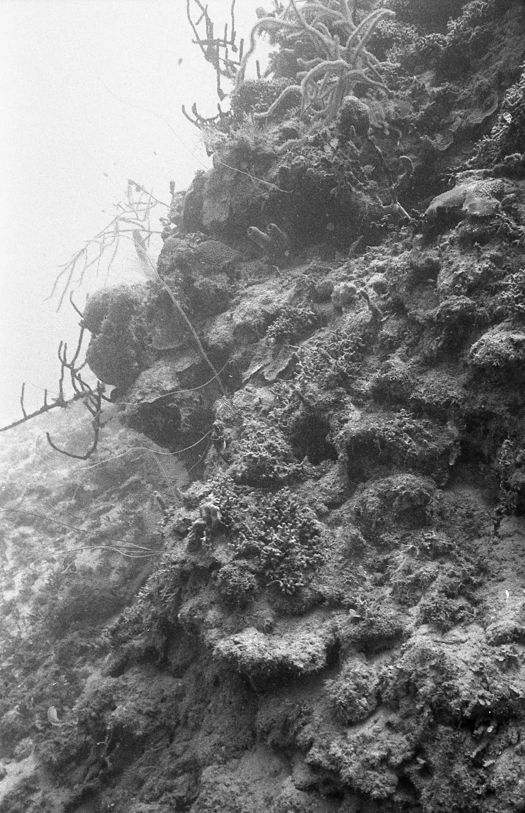{.lightbox group="discovery-bay-1966" description="**UUID: **c8f30183-bc12-441e-80fb-2e2cda2de8b2 **Date: **NA **Location: **Jamaica | Discovery Bay | Pear Tree Bottom **Longitude: **77.35867ºW **Latitude: **18.4635ºN **Photographer: **Eileen Graham **Copyright: **Trustees of the Natural History Museum (London, UK), CC-BY-4.0" alt="**UUID: **c8f30183-bc12-441e-80fb-2e2cda2de8b2 **Date: **NA **Location: **Jamaica | Discovery Bay | Pear Tree Bottom **Longitude: **77.35867ºW **Latitude: **18.4635ºN **Photographer: **Eileen Graham **Copyright: **Trustees of the Natural History Museum (London, UK), CC-BY-4.0"}

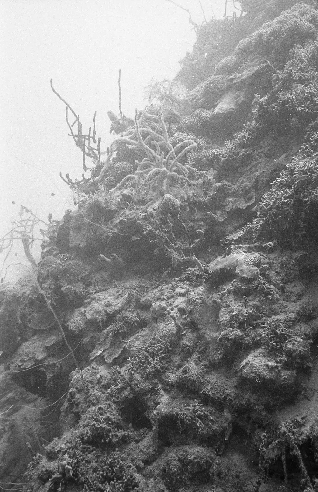{.lightbox group="discovery-bay-1966" description="**UUID: **b8950f5a-df17-40f3-86e8-c650de857aca **Date: **NA **Location: **Jamaica | Discovery Bay | Pear Tree Bottom **Longitude: **77.35867ºW **Latitude: **18.4635ºN **Photographer: **Eileen Graham **Copyright: **Trustees of the Natural History Museum (London, UK), CC-BY-4.0" alt="**UUID: **b8950f5a-df17-40f3-86e8-c650de857aca **Date: **NA **Location: **Jamaica | Discovery Bay | Pear Tree Bottom **Longitude: **77.35867ºW **Latitude: **18.4635ºN **Photographer: **Eileen Graham **Copyright: **Trustees of the Natural History Museum (London, UK), CC-BY-4.0"}

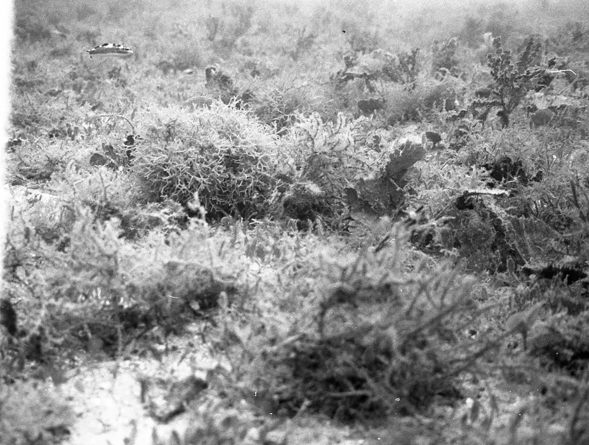{.lightbox group="discovery-bay-1966" description="**UUID: **568c6bf0-5e9e-4696-a4c7-9a9b552797bc **Date: **1967-07-08 **Location: **Jamaica | Discovery Bay | Rendezvous de Terrier **Longitude: **76.886ºW **Latitude: **18.399ºN **Photographer: **Eileen Graham **Copyright: **Trustees of the Natural History Museum (London, UK), CC-BY-4.0" alt="**UUID: **568c6bf0-5e9e-4696-a4c7-9a9b552797bc **Date: **1967-07-08 **Location: **Jamaica | Discovery Bay | Rendezvous de Terrier **Longitude: **76.886ºW **Latitude: **18.399ºN **Photographer: **Eileen Graham **Copyright: **Trustees of the Natural History Museum (London, UK), CC-BY-4.0"}

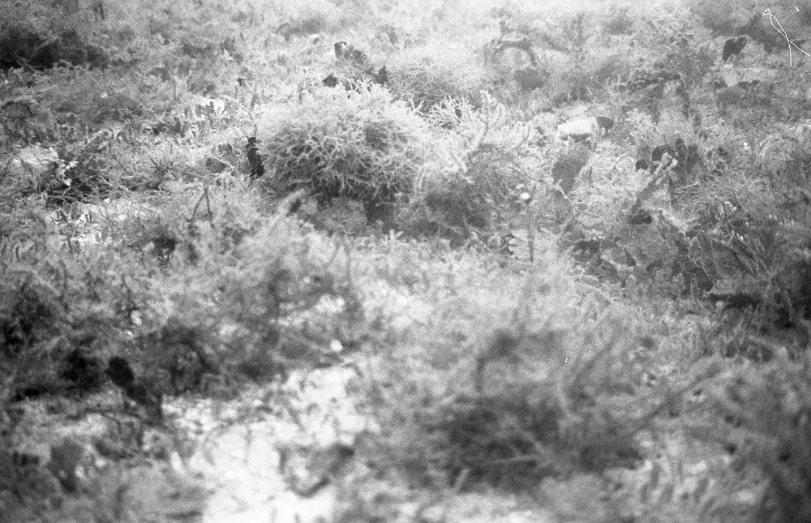{.lightbox group="discovery-bay-1966" description="**UUID: **4d2755a4-229d-4760-9ebf-ee377873ada5 **Date: **1967-07-08 **Location: **Jamaica | Discovery Bay | Rendezvous de Terrier **Longitude: **76.886ºW **Latitude: **18.399ºN **Photographer: **Eileen Graham **Copyright: **Trustees of the Natural History Museum (London, UK), CC-BY-4.0" alt="**UUID: **4d2755a4-229d-4760-9ebf-ee377873ada5 **Date: **1967-07-08 **Location: **Jamaica | Discovery Bay | Rendezvous de Terrier **Longitude: **76.886ºW **Latitude: **18.399ºN **Photographer: **Eileen Graham **Copyright: **Trustees of the Natural History Museum (London, UK), CC-BY-4.0"}

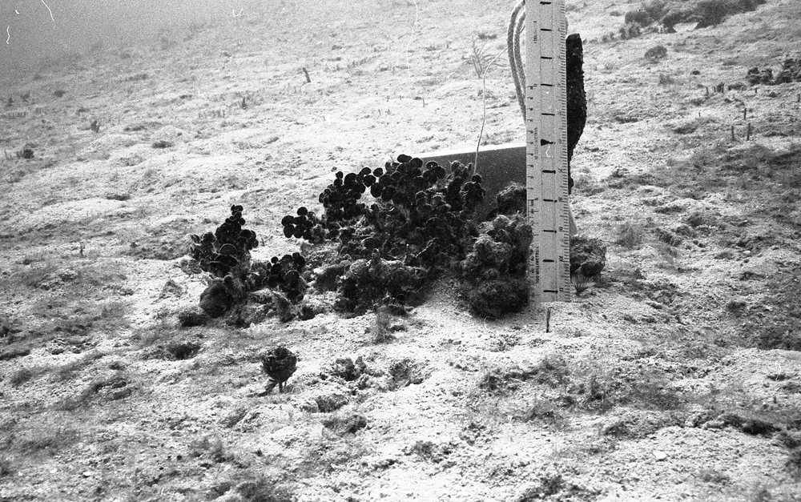{.lightbox group="discovery-bay-1966" description="**UUID: **aee8023a-ccac-47c4-8425-ada6a3a4b329 **Date: **1966-08-26 **Location: **Jamaica | Discovery Bay | Algal Plots **Longitude: **77.414ºW **Latitude: **18.473ºN **Photographer: **Eileen Graham **Copyright: **Trustees of the Natural History Museum (London, UK), CC-BY-4.0" alt="**UUID: **aee8023a-ccac-47c4-8425-ada6a3a4b329 **Date: **1966-08-26 **Location: **Jamaica | Discovery Bay | Algal Plots **Longitude: **77.414ºW **Latitude: **18.473ºN **Photographer: **Eileen Graham **Copyright: **Trustees of the Natural History Museum (London, UK), CC-BY-4.0"}

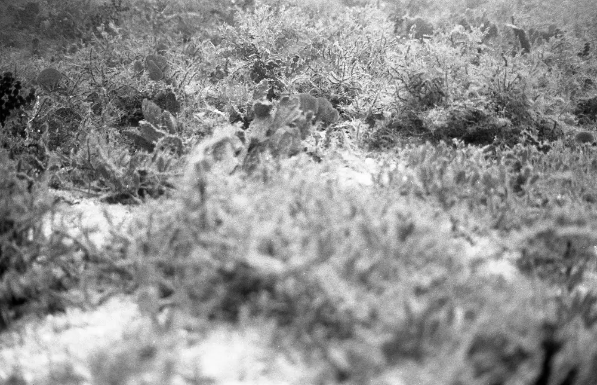{.lightbox group="discovery-bay-1966" description="**UUID: **6a779ea7-8f32-4d7d-95fd-76821408d7a0 **Date: **1967-07-08 **Location: **Jamaica | Discovery Bay | Rendezvous de Terrier **Longitude: **76.886ºW **Latitude: **18.399ºN **Photographer: **Eileen Graham **Copyright: **Trustees of the Natural History Museum (London, UK), CC-BY-4.0" alt="**UUID: **6a779ea7-8f32-4d7d-95fd-76821408d7a0 **Date: **1967-07-08 **Location: **Jamaica | Discovery Bay | Rendezvous de Terrier **Longitude: **76.886ºW **Latitude: **18.399ºN **Photographer: **Eileen Graham **Copyright: **Trustees of the Natural History Museum (London, UK), CC-BY-4.0"}

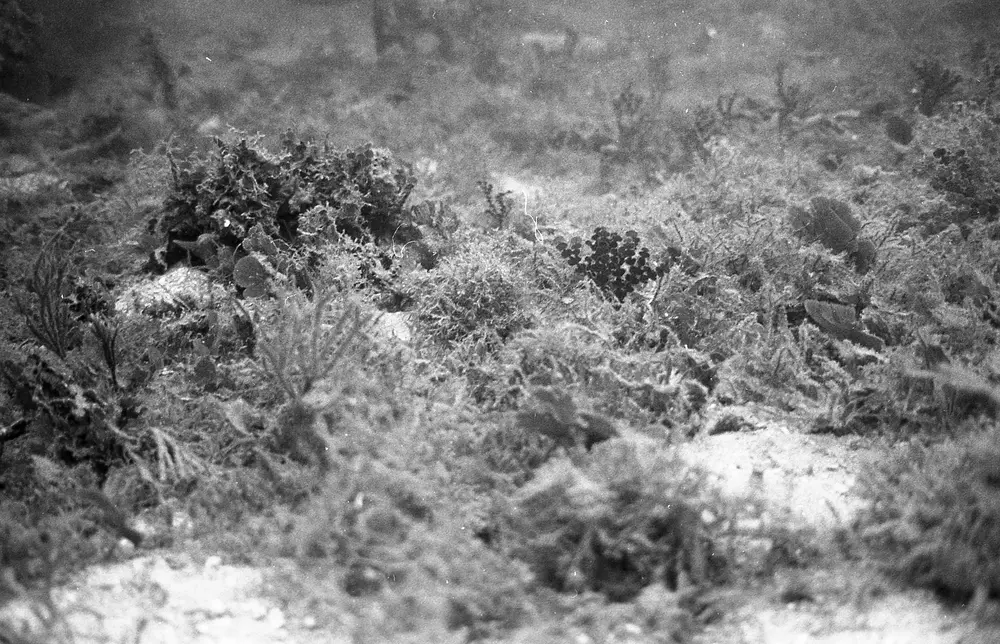{.lightbox group="discovery-bay-1966" description="**UUID: **c79ce2b6-a00f-4160-aac8-940d47d00363 **Date: **1967-07-08 **Location: **Jamaica | Discovery Bay | Rendezvous de Terrier **Longitude: **76.886ºW **Latitude: **18.399ºN **Photographer: **Eileen Graham **Copyright: **Trustees of the Natural History Museum (London, UK), CC-BY-4.0" alt="**UUID: **c79ce2b6-a00f-4160-aac8-940d47d00363 **Date: **1967-07-08 **Location: **Jamaica | Discovery Bay | Rendezvous de Terrier **Longitude: **76.886ºW **Latitude: **18.399ºN **Photographer: **Eileen Graham **Copyright: **Trustees of the Natural History Museum (London, UK), CC-BY-4.0"}

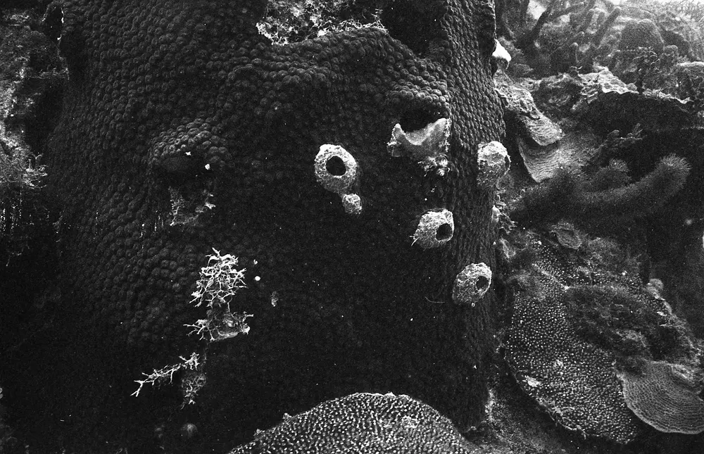{.lightbox group="discovery-bay-1966" description="**UUID: **85b01a39-ea90-4568-bebd-4c3f34ed2058 **Date: **1967-07-08 **Location: **Jamaica | Discovery Bay | Rendezvous de Terrier **Longitude: **76.886ºW **Latitude: **18.399ºN **Photographer: **Eileen Graham **Copyright: **Trustees of the Natural History Museum (London, UK), CC-BY-4.0" alt="**UUID: **85b01a39-ea90-4568-bebd-4c3f34ed2058 **Date: **1967-07-08 **Location: **Jamaica | Discovery Bay | Rendezvous de Terrier **Longitude: **76.886ºW **Latitude: **18.399ºN **Photographer: **Eileen Graham **Copyright: **Trustees of the Natural History Museum (London, UK), CC-BY-4.0"}

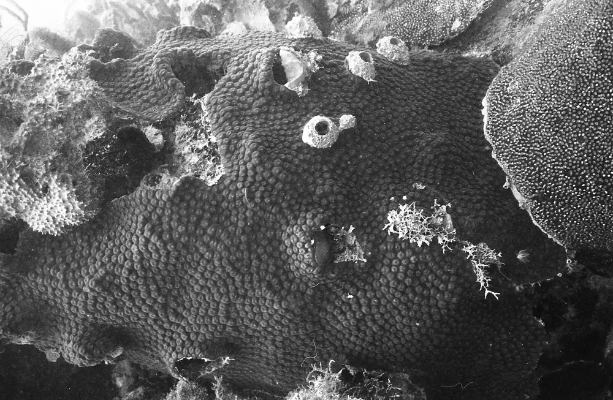{.lightbox group="discovery-bay-1966" description="**UUID: **645fc23e-9f01-4099-99bb-3e36a5978d68 **Date: **1967-07-08 **Location: **Jamaica | Discovery Bay | Rendezvous de Terrier **Longitude: **76.886ºW **Latitude: **18.399ºN **Photographer: **Eileen Graham **Copyright: **Trustees of the Natural History Museum (London, UK), CC-BY-4.0" alt="**UUID: **645fc23e-9f01-4099-99bb-3e36a5978d68 **Date: **1967-07-08 **Location: **Jamaica | Discovery Bay | Rendezvous de Terrier **Longitude: **76.886ºW **Latitude: **18.399ºN **Photographer: **Eileen Graham **Copyright: **Trustees of the Natural History Museum (London, UK), CC-BY-4.0"}

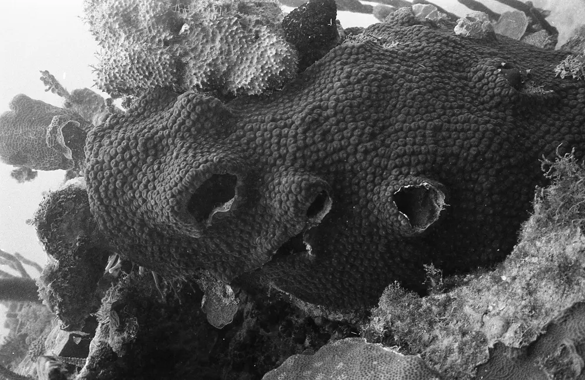{.lightbox group="discovery-bay-1966" description="**UUID: **b7e68e00-eb6a-49d1-8b46-a20500ebdf0b **Date: **1967-07-08 **Location: **Jamaica | Discovery Bay | Rendezvous de Terrier **Longitude: **76.886ºW **Latitude: **18.399ºN **Photographer: **Eileen Graham **Copyright: **Trustees of the Natural History Museum (London, UK), CC-BY-4.0" alt="**UUID: **b7e68e00-eb6a-49d1-8b46-a20500ebdf0b **Date: **1967-07-08 **Location: **Jamaica | Discovery Bay | Rendezvous de Terrier **Longitude: **76.886ºW **Latitude: **18.399ºN **Photographer: **Eileen Graham **Copyright: **Trustees of the Natural History Museum (London, UK), CC-BY-4.0"}

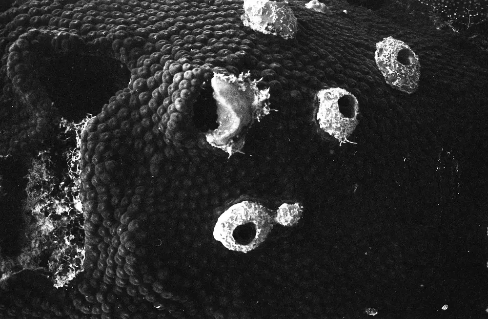{.lightbox group="discovery-bay-1966" description="**UUID: **080c762f-ec9c-4317-a340-dbfeed29ebaf **Date: **1967-07-08 **Location: **Jamaica | Discovery Bay | Rendezvous de Terrier **Longitude: **76.886ºW **Latitude: **18.399ºN **Photographer: **Eileen Graham **Copyright: **Trustees of the Natural History Museum (London, UK), CC-BY-4.0" alt="**UUID: **080c762f-ec9c-4317-a340-dbfeed29ebaf **Date: **1967-07-08 **Location: **Jamaica | Discovery Bay | Rendezvous de Terrier **Longitude: **76.886ºW **Latitude: **18.399ºN **Photographer: **Eileen Graham **Copyright: **Trustees of the Natural History Museum (London, UK), CC-BY-4.0"}

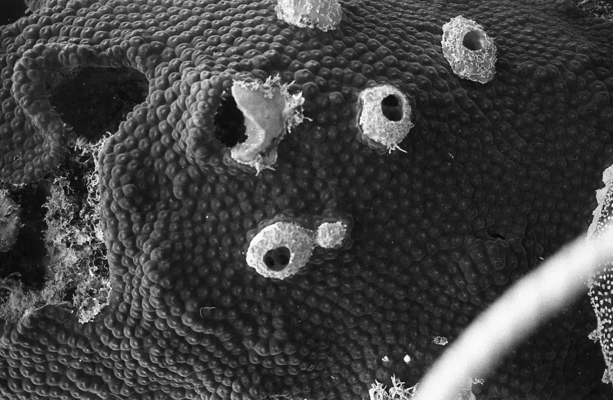{.lightbox group="discovery-bay-1966" description="**UUID: **17f7e8c8-85ee-47ab-a2e4-feca4385518a **Date: **1967-07-08 **Location: **Jamaica | Discovery Bay | Rendezvous de Terrier **Longitude: **76.886ºW **Latitude: **18.399ºN **Photographer: **Eileen Graham **Copyright: **Trustees of the Natural History Museum (London, UK), CC-BY-4.0" alt="**UUID: **17f7e8c8-85ee-47ab-a2e4-feca4385518a **Date: **1967-07-08 **Location: **Jamaica | Discovery Bay | Rendezvous de Terrier **Longitude: **76.886ºW **Latitude: **18.399ºN **Photographer: **Eileen Graham **Copyright: **Trustees of the Natural History Museum (London, UK), CC-BY-4.0"}

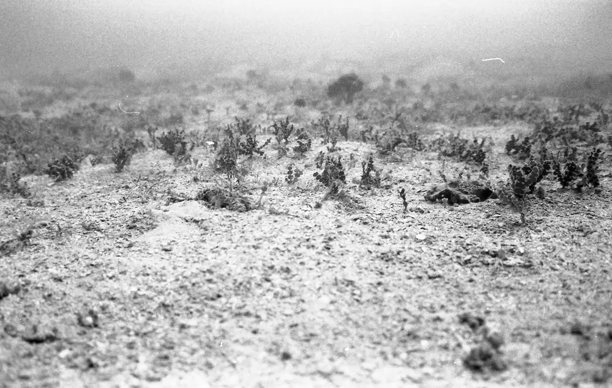{.lightbox group="discovery-bay-1966" description="**UUID: **298533ad-a1c0-4460-82b4-b3915bf9232d **Date: **1967-07-08 **Location: **Jamaica | Discovery Bay | Rendezvous de Terrier **Longitude: **76.886ºW **Latitude: **18.399ºN **Photographer: **Eileen Graham **Copyright: **Trustees of the Natural History Museum (London, UK), CC-BY-4.0" alt="**UUID: **298533ad-a1c0-4460-82b4-b3915bf9232d **Date: **1967-07-08 **Location: **Jamaica | Discovery Bay | Rendezvous de Terrier **Longitude: **76.886ºW **Latitude: **18.399ºN **Photographer: **Eileen Graham **Copyright: **Trustees of the Natural History Museum (London, UK), CC-BY-4.0"}

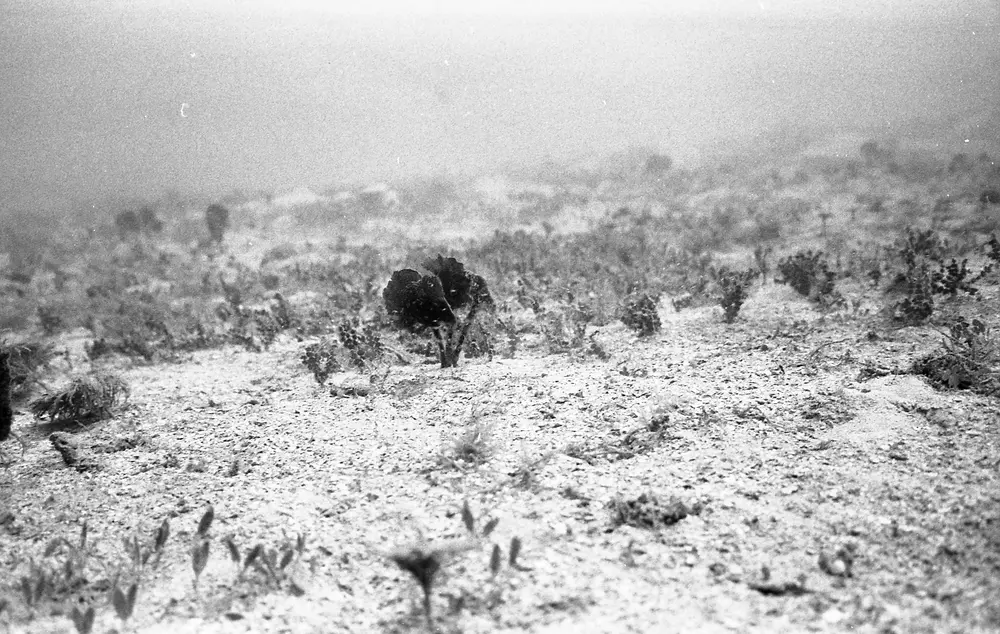{.lightbox group="discovery-bay-1966" description="**UUID: **6eec38ce-4fa7-4b34-8321-6ece1c1ccf10 **Date: **1967-07-08 **Location: **Jamaica | Discovery Bay | Rendezvous de Terrier **Longitude: **76.886ºW **Latitude: **18.399ºN **Photographer: **Eileen Graham **Copyright: **Trustees of the Natural History Museum (London, UK), CC-BY-4.0" alt="**UUID: **6eec38ce-4fa7-4b34-8321-6ece1c1ccf10 **Date: **1967-07-08 **Location: **Jamaica | Discovery Bay | Rendezvous de Terrier **Longitude: **76.886ºW **Latitude: **18.399ºN **Photographer: **Eileen Graham **Copyright: **Trustees of the Natural History Museum (London, UK), CC-BY-4.0"}

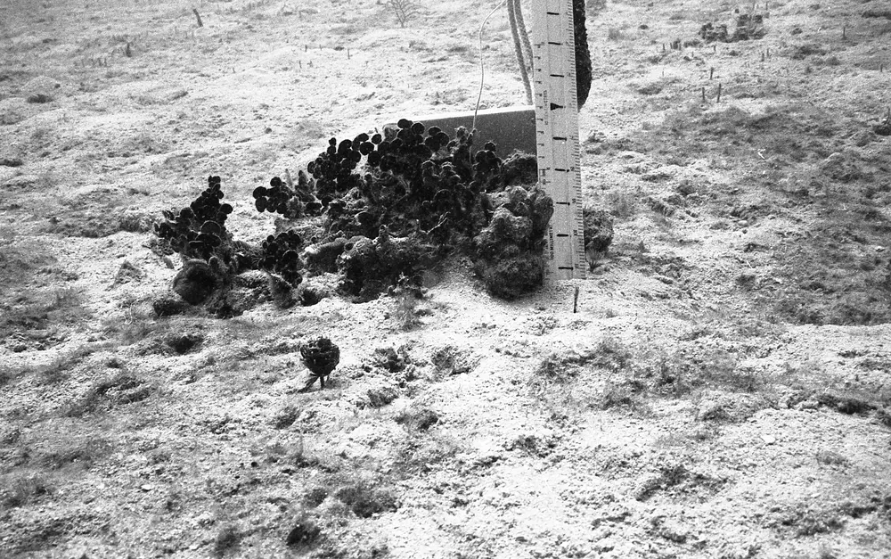{.lightbox group="discovery-bay-1966" description="**UUID: **c32fd272-0e7e-4ef8-b2de-a43146802f67 **Date: **1966-08-26 **Location: **Jamaica | Discovery Bay | Algal Plots **Longitude: **77.414ºW **Latitude: **18.473ºN **Photographer: **Eileen Graham **Copyright: **Trustees of the Natural History Museum (London, UK), CC-BY-4.0" alt="**UUID: **c32fd272-0e7e-4ef8-b2de-a43146802f67 **Date: **1966-08-26 **Location: **Jamaica | Discovery Bay | Algal Plots **Longitude: **77.414ºW **Latitude: **18.473ºN **Photographer: **Eileen Graham **Copyright: **Trustees of the Natural History Museum (London, UK), CC-BY-4.0"}

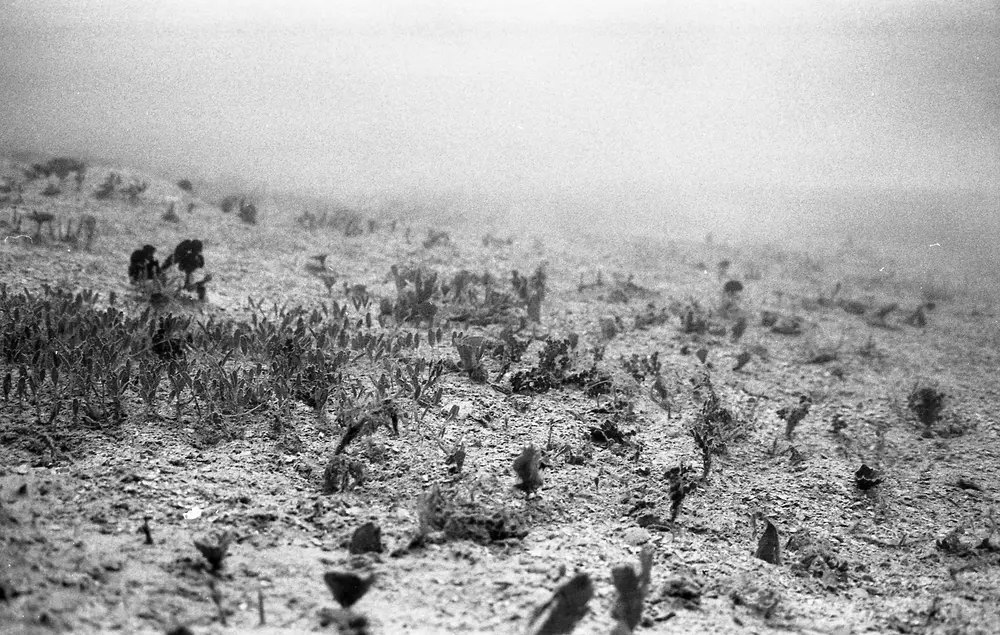{.lightbox group="discovery-bay-1966" description="**UUID: **a9349dbb-3d66-4f46-a7d5-5b07c9e97f33 **Date: **1967-07-08 **Location: **Jamaica | Discovery Bay | Rendezvous de Terrier **Longitude: **76.886ºW **Latitude: **18.399ºN **Photographer: **Eileen Graham **Copyright: **Trustees of the Natural History Museum (London, UK), CC-BY-4.0" alt="**UUID: **a9349dbb-3d66-4f46-a7d5-5b07c9e97f33 **Date: **1967-07-08 **Location: **Jamaica | Discovery Bay | Rendezvous de Terrier **Longitude: **76.886ºW **Latitude: **18.399ºN **Photographer: **Eileen Graham **Copyright: **Trustees of the Natural History Museum (London, UK), CC-BY-4.0"}

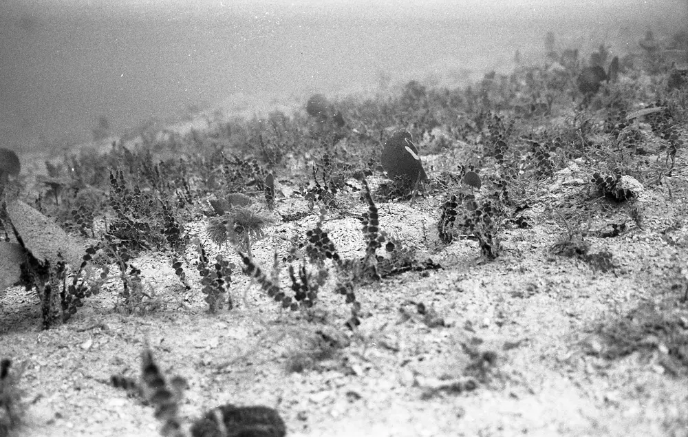{.lightbox group="discovery-bay-1966" description="**UUID: **38811da8-e848-49ef-bdff-9a051f8e0b50 **Date: **1967-07-08 **Location: **Jamaica | Discovery Bay | Rendezvous de Terrier **Longitude: **76.886ºW **Latitude: **18.399ºN **Photographer: **Eileen Graham **Copyright: **Trustees of the Natural History Museum (London, UK), CC-BY-4.0" alt="**UUID: **38811da8-e848-49ef-bdff-9a051f8e0b50 **Date: **1967-07-08 **Location: **Jamaica | Discovery Bay | Rendezvous de Terrier **Longitude: **76.886ºW **Latitude: **18.399ºN **Photographer: **Eileen Graham **Copyright: **Trustees of the Natural History Museum (London, UK), CC-BY-4.0"}

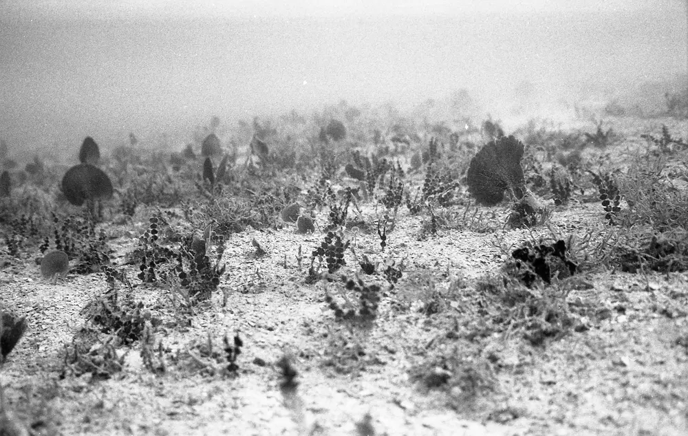{.lightbox group="discovery-bay-1966" description="**UUID: **0a7af55a-05bf-4561-a718-1750836a0da0 **Date: **1967-07-08 **Location: **Jamaica | Discovery Bay | Rendezvous de Terrier **Longitude: **76.886ºW **Latitude: **18.399ºN **Photographer: **Eileen Graham **Copyright: **Trustees of the Natural History Museum (London, UK), CC-BY-4.0" alt="**UUID: **0a7af55a-05bf-4561-a718-1750836a0da0 **Date: **1967-07-08 **Location: **Jamaica | Discovery Bay | Rendezvous de Terrier **Longitude: **76.886ºW **Latitude: **18.399ºN **Photographer: **Eileen Graham **Copyright: **Trustees of the Natural History Museum (London, UK), CC-BY-4.0"}

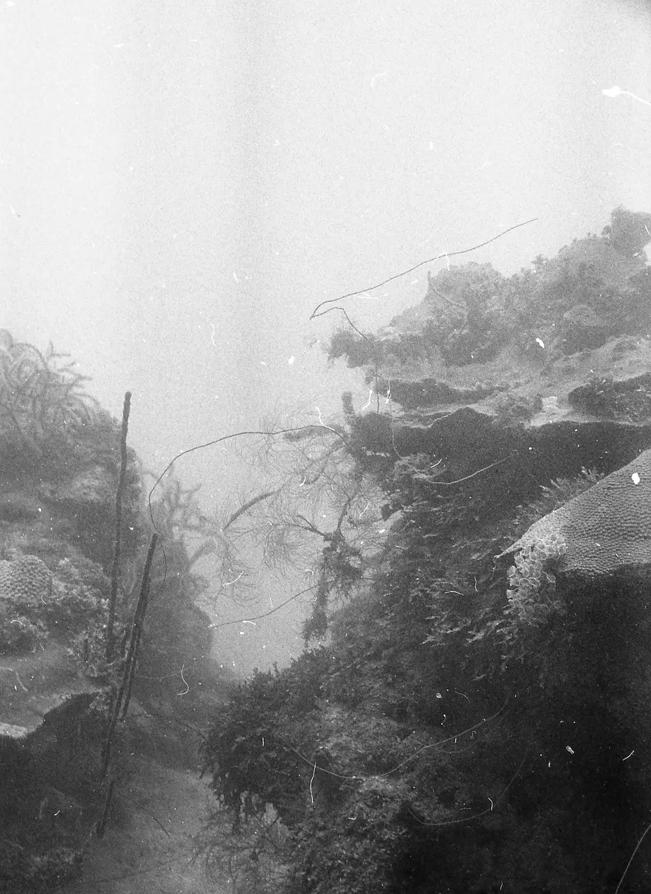{.lightbox group="discovery-bay-1966" description="**UUID: **24f7be34-2175-420b-acce-cefe657b75dd **Date: **1967-07-08 **Location: **Jamaica | Discovery Bay | Rendezvous de Terrier **Longitude: **76.886ºW **Latitude: **18.399ºN **Photographer: **Eileen Graham **Copyright: **Trustees of the Natural History Museum (London, UK), CC-BY-4.0" alt="**UUID: **24f7be34-2175-420b-acce-cefe657b75dd **Date: **1967-07-08 **Location: **Jamaica | Discovery Bay | Rendezvous de Terrier **Longitude: **76.886ºW **Latitude: **18.399ºN **Photographer: **Eileen Graham **Copyright: **Trustees of the Natural History Museum (London, UK), CC-BY-4.0"}

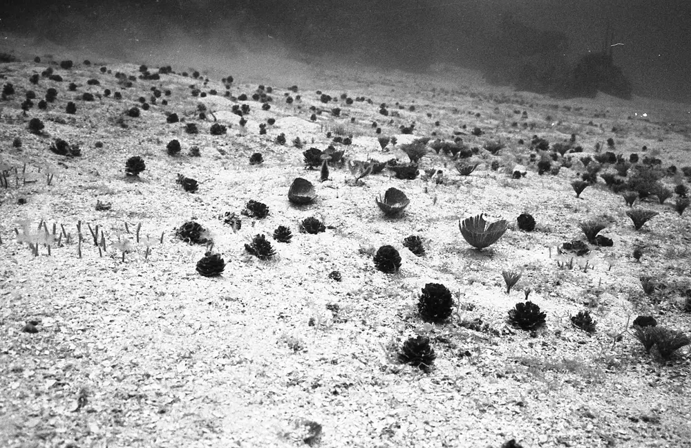{.lightbox group="discovery-bay-1966" description="**UUID: **a6ee7fae-d421-4439-a347-737b38a86e89 **Date: **1967-08-14 **Location: **Jamaica | Discovery Bay | Pinnacle 1 Sand Slope **Longitude: **77.41017ºW **Latitude: **18.47367ºN **Photographer: **Eileen Graham **Copyright: **Trustees of the Natural History Museum (London, UK), CC-BY-4.0" alt="**UUID: **a6ee7fae-d421-4439-a347-737b38a86e89 **Date: **1967-08-14 **Location: **Jamaica | Discovery Bay | Pinnacle 1 Sand Slope **Longitude: **77.41017ºW **Latitude: **18.47367ºN **Photographer: **Eileen Graham **Copyright: **Trustees of the Natural History Museum (London, UK), CC-BY-4.0"}

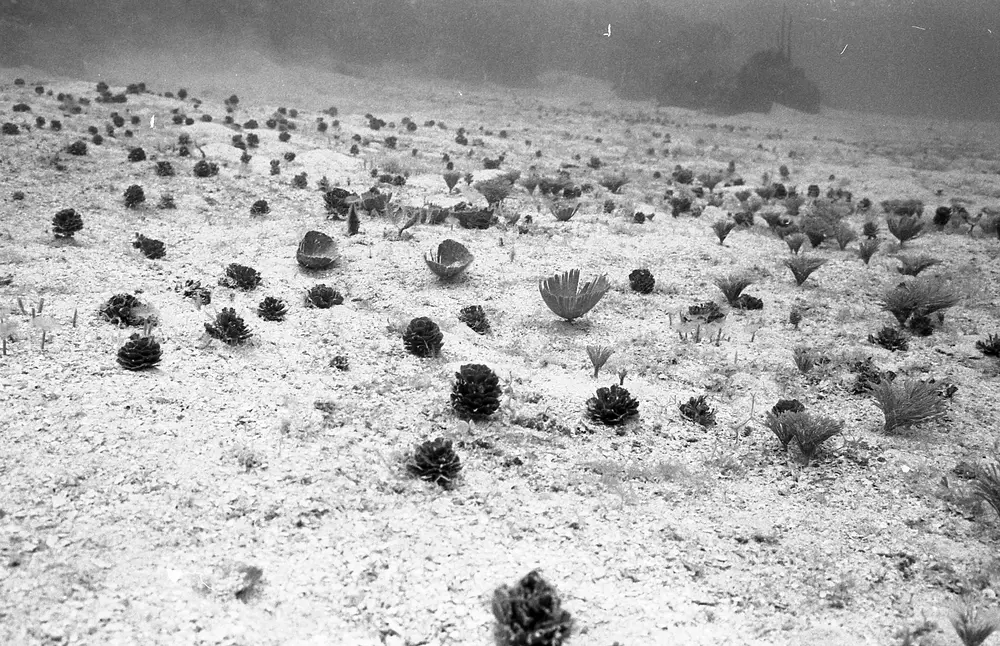{.lightbox group="discovery-bay-1966" description="**UUID: **ebf38610-ba68-4f0f-b479-2880cb62bec1 **Date: **1967-08-14 **Location: **Jamaica | Discovery Bay | Pinnacle 1 Sand Slope **Longitude: **77.41017ºW **Latitude: **18.47367ºN **Photographer: **Eileen Graham **Copyright: **Trustees of the Natural History Museum (London, UK), CC-BY-4.0" alt="**UUID: **ebf38610-ba68-4f0f-b479-2880cb62bec1 **Date: **1967-08-14 **Location: **Jamaica | Discovery Bay | Pinnacle 1 Sand Slope **Longitude: **77.41017ºW **Latitude: **18.47367ºN **Photographer: **Eileen Graham **Copyright: **Trustees of the Natural History Museum (London, UK), CC-BY-4.0"}

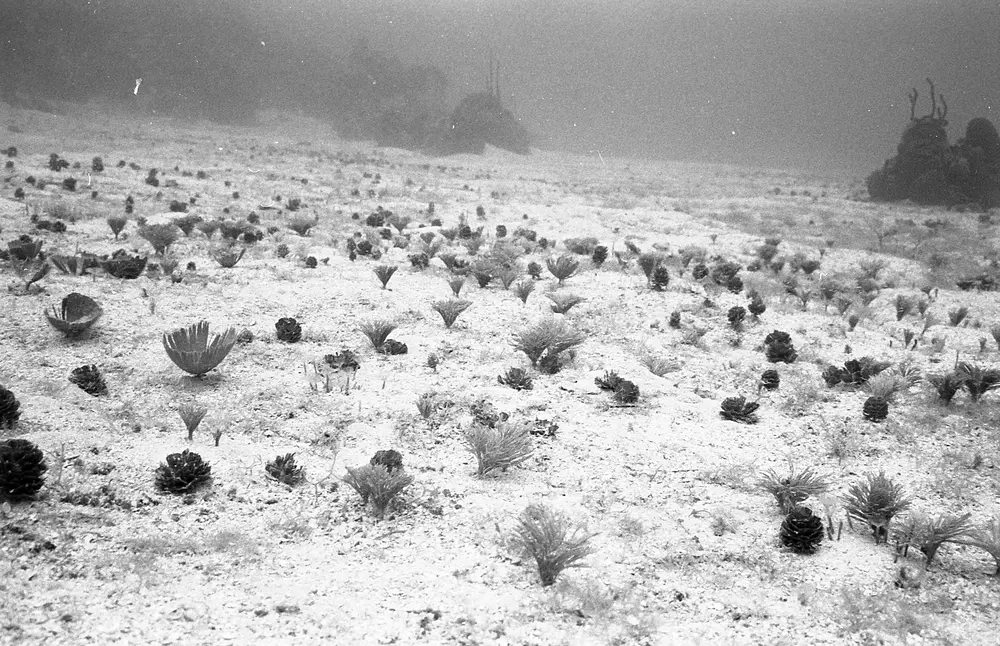{.lightbox group="discovery-bay-1966" description="**UUID: **e8061a9a-1ea9-4fd5-8475-0cedface61f1 **Date: **1967-08-14 **Location: **Jamaica | Discovery Bay | Pinnacle 1 Sand Slope **Longitude: **77.41017ºW **Latitude: **18.47367ºN **Photographer: **Eileen Graham **Copyright: **Trustees of the Natural History Museum (London, UK), CC-BY-4.0" alt="**UUID: **e8061a9a-1ea9-4fd5-8475-0cedface61f1 **Date: **1967-08-14 **Location: **Jamaica | Discovery Bay | Pinnacle 1 Sand Slope **Longitude: **77.41017ºW **Latitude: **18.47367ºN **Photographer: **Eileen Graham **Copyright: **Trustees of the Natural History Museum (London, UK), CC-BY-4.0"}

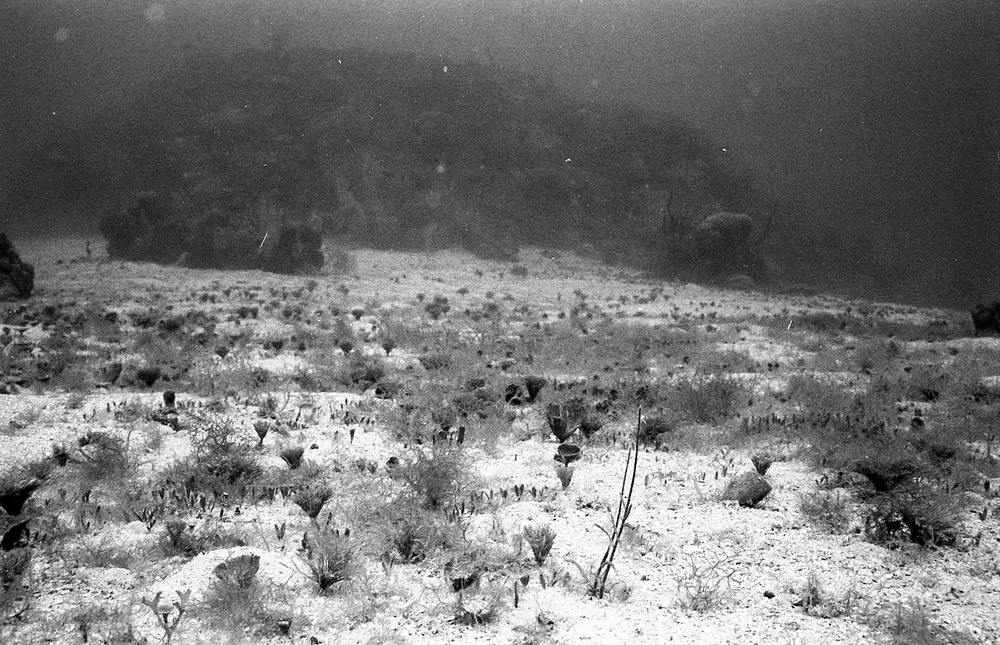{.lightbox group="discovery-bay-1966" description="**UUID: **286c06ad-43e9-493b-92e5-01267a6d267c **Date: **1967-08-14 **Location: **Jamaica | Discovery Bay | Pinnacle 1 Sand Slope **Longitude: **77.41017ºW **Latitude: **18.47367ºN **Photographer: **Eileen Graham **Copyright: **Trustees of the Natural History Museum (London, UK), CC-BY-4.0" alt="**UUID: **286c06ad-43e9-493b-92e5-01267a6d267c **Date: **1967-08-14 **Location: **Jamaica | Discovery Bay | Pinnacle 1 Sand Slope **Longitude: **77.41017ºW **Latitude: **18.47367ºN **Photographer: **Eileen Graham **Copyright: **Trustees of the Natural History Museum (London, UK), CC-BY-4.0"}

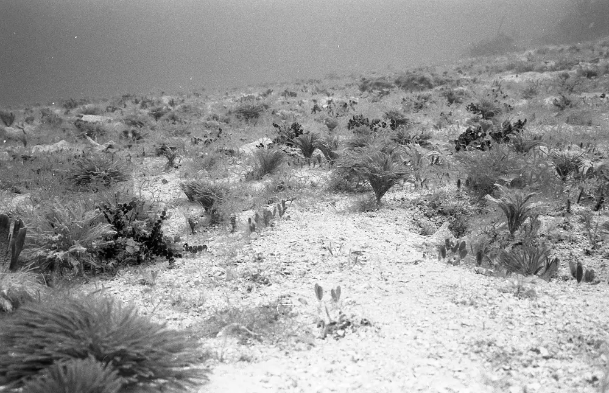{.lightbox group="discovery-bay-1966" description="**UUID: **e7f8ac2f-8dbb-4174-b924-052c78a7eb64 **Date: **1967-08-14 **Location: **Jamaica | Discovery Bay | Pinnacle 1 Sand Slope **Longitude: **77.41017ºW **Latitude: **18.47367ºN **Photographer: **Eileen Graham **Copyright: **Trustees of the Natural History Museum (London, UK), CC-BY-4.0" alt="**UUID: **e7f8ac2f-8dbb-4174-b924-052c78a7eb64 **Date: **1967-08-14 **Location: **Jamaica | Discovery Bay | Pinnacle 1 Sand Slope **Longitude: **77.41017ºW **Latitude: **18.47367ºN **Photographer: **Eileen Graham **Copyright: **Trustees of the Natural History Museum (London, UK), CC-BY-4.0"}

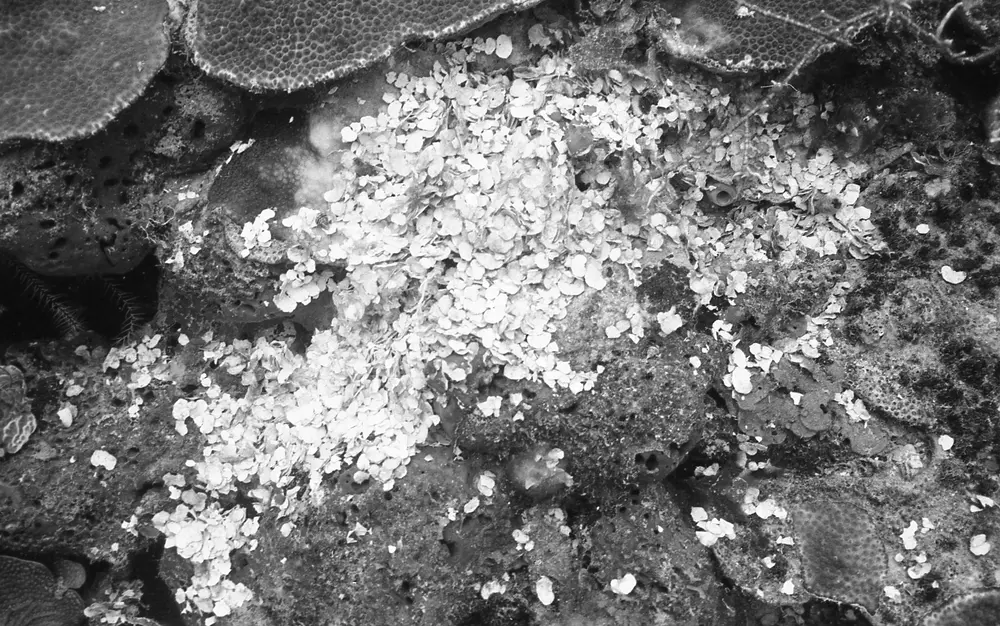{.lightbox group="discovery-bay-1966" description="**UUID: **5e693f6a-78a0-48b3-b71a-3c3c1bee3368 **Date: **1967-08-14 **Location: **Jamaica | Discovery Bay | Pinnacle 1 Slope **Longitude: **77.41017ºW **Latitude: **18.47367ºN **Photographer: **Eileen Graham **Copyright: **Trustees of the Natural History Museum (London, UK), CC-BY-4.0" alt="**UUID: **5e693f6a-78a0-48b3-b71a-3c3c1bee3368 **Date: **1967-08-14 **Location: **Jamaica | Discovery Bay | Pinnacle 1 Slope **Longitude: **77.41017ºW **Latitude: **18.47367ºN **Photographer: **Eileen Graham **Copyright: **Trustees of the Natural History Museum (London, UK), CC-BY-4.0"}

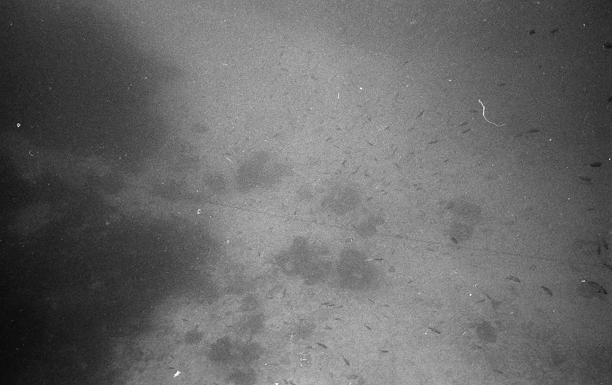{.lightbox group="discovery-bay-1966" description="**UUID: **3344090b-0b98-45f1-bba8-4123159256b1 **Date: **1966-08-26 **Location: **Jamaica | Discovery Bay | Algal Plots **Longitude: **77.414ºW **Latitude: **18.473ºN **Photographer: **Eileen Graham **Copyright: **Trustees of the Natural History Museum (London, UK), CC-BY-4.0" alt="**UUID: **3344090b-0b98-45f1-bba8-4123159256b1 **Date: **1966-08-26 **Location: **Jamaica | Discovery Bay | Algal Plots **Longitude: **77.414ºW **Latitude: **18.473ºN **Photographer: **Eileen Graham **Copyright: **Trustees of the Natural History Museum (London, UK), CC-BY-4.0"}

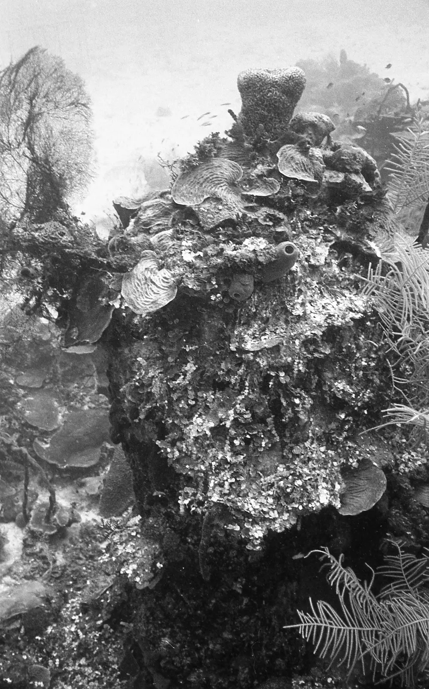{.lightbox group="discovery-bay-1966" description="**UUID: **aea149a9-b5f6-40a9-a3dd-4ec028efd479 **Date: **1967-08-14 **Location: **Jamaica | Discovery Bay | Pinnacle 1 Slope **Longitude: **77.41017ºW **Latitude: **18.47367ºN **Photographer: **Eileen Graham **Copyright: **Trustees of the Natural History Museum (London, UK), CC-BY-4.0" alt="**UUID: **aea149a9-b5f6-40a9-a3dd-4ec028efd479 **Date: **1967-08-14 **Location: **Jamaica | Discovery Bay | Pinnacle 1 Slope **Longitude: **77.41017ºW **Latitude: **18.47367ºN **Photographer: **Eileen Graham **Copyright: **Trustees of the Natural History Museum (London, UK), CC-BY-4.0"}

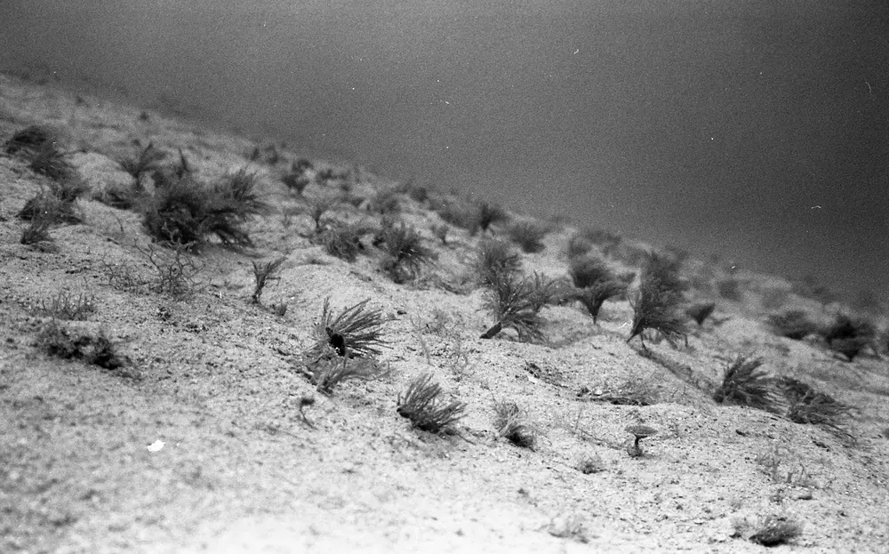{.lightbox group="discovery-bay-1966" description="**UUID: **63b0745c-5bbd-46b9-8b68-9ce99b8b1cbb **Date: **1967-08-14 **Location: **Jamaica | Discovery Bay | Pinnacle 1 Sand Slope **Longitude: **77.41017ºW **Latitude: **18.47367ºN **Photographer: **Eileen Graham **Copyright: **Trustees of the Natural History Museum (London, UK), CC-BY-4.0" alt="**UUID: **63b0745c-5bbd-46b9-8b68-9ce99b8b1cbb **Date: **1967-08-14 **Location: **Jamaica | Discovery Bay | Pinnacle 1 Sand Slope **Longitude: **77.41017ºW **Latitude: **18.47367ºN **Photographer: **Eileen Graham **Copyright: **Trustees of the Natural History Museum (London, UK), CC-BY-4.0"}

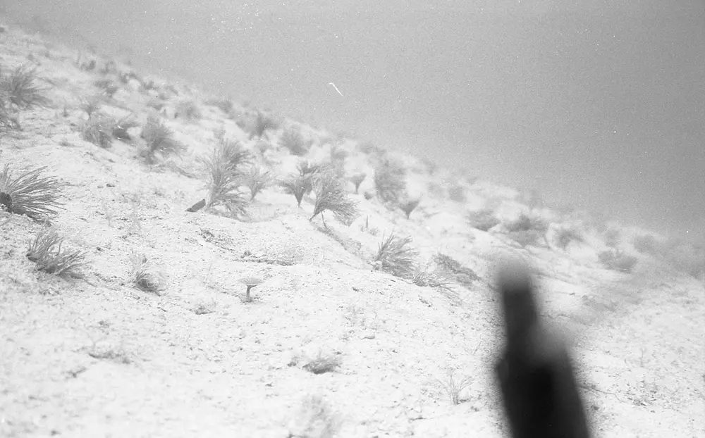{.lightbox group="discovery-bay-1966" description="**UUID: **8c2ec5e6-aada-4bba-88ca-888d23c28447 **Date: **1967-08-14 **Location: **Jamaica | Discovery Bay | Pinnacle 1 Sand Slope **Longitude: **77.41017ºW **Latitude: **18.47367ºN **Photographer: **Eileen Graham **Copyright: **Trustees of the Natural History Museum (London, UK), CC-BY-4.0" alt="**UUID: **8c2ec5e6-aada-4bba-88ca-888d23c28447 **Date: **1967-08-14 **Location: **Jamaica | Discovery Bay | Pinnacle 1 Sand Slope **Longitude: **77.41017ºW **Latitude: **18.47367ºN **Photographer: **Eileen Graham **Copyright: **Trustees of the Natural History Museum (London, UK), CC-BY-4.0"}

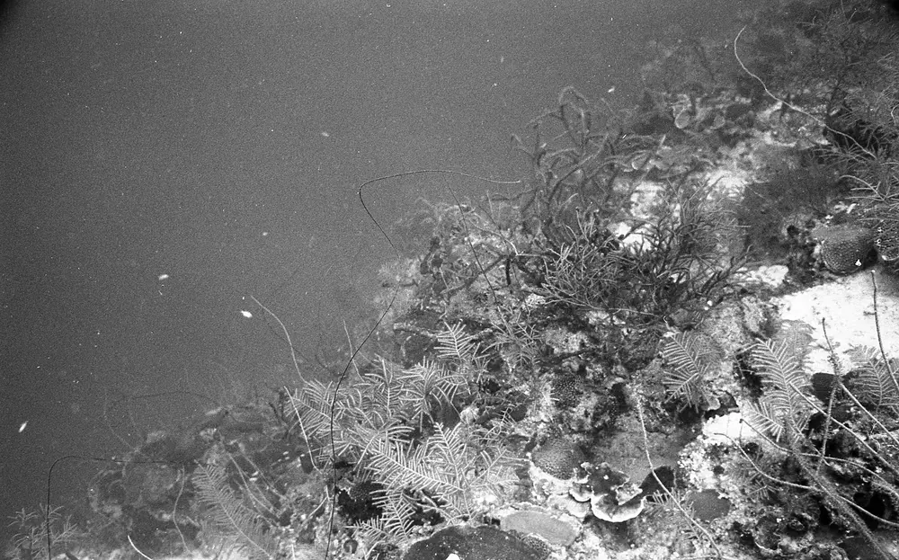{.lightbox group="discovery-bay-1966" description="**UUID: **e4c1e276-793a-450a-9d1d-83b05d622ca0 **Date: **1967-08-14 **Location: **Jamaica | Discovery Bay | Pinnacle 1 Deep **Longitude: **77.41017ºW **Latitude: **18.47367ºN **Photographer: **Eileen Graham **Copyright: **Trustees of the Natural History Museum (London, UK), CC-BY-4.0" alt="**UUID: **e4c1e276-793a-450a-9d1d-83b05d622ca0 **Date: **1967-08-14 **Location: **Jamaica | Discovery Bay | Pinnacle 1 Deep **Longitude: **77.41017ºW **Latitude: **18.47367ºN **Photographer: **Eileen Graham **Copyright: **Trustees of the Natural History Museum (London, UK), CC-BY-4.0"}

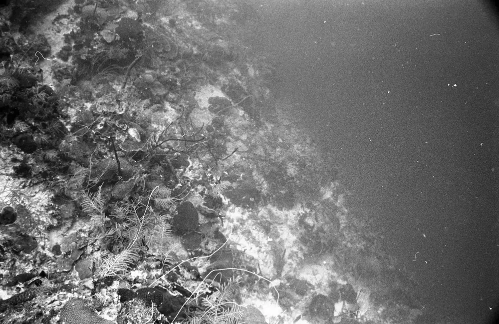{.lightbox group="discovery-bay-1966" description="**UUID: **586aa7fd-66fb-4638-9189-62cf25bd426a **Date: **1967-08-14 **Location: **Jamaica | Discovery Bay | Pinnacle 1 Deep **Longitude: **77.41017ºW **Latitude: **18.47367ºN **Photographer: **Eileen Graham **Copyright: **Trustees of the Natural History Museum (London, UK), CC-BY-4.0" alt="**UUID: **586aa7fd-66fb-4638-9189-62cf25bd426a **Date: **1967-08-14 **Location: **Jamaica | Discovery Bay | Pinnacle 1 Deep **Longitude: **77.41017ºW **Latitude: **18.47367ºN **Photographer: **Eileen Graham **Copyright: **Trustees of the Natural History Museum (London, UK), CC-BY-4.0"}

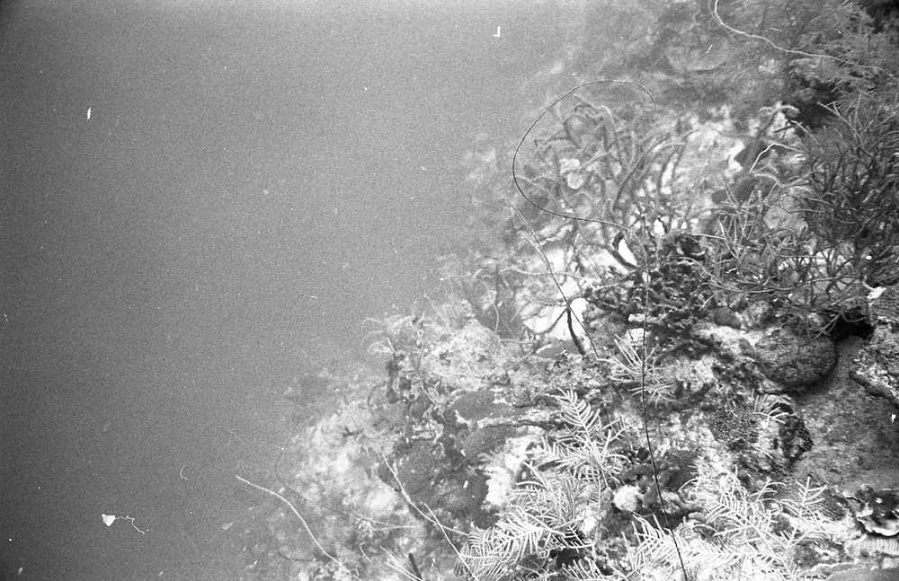{.lightbox group="discovery-bay-1966" description="**UUID: **aa920e96-7a78-471b-8973-59b479184582 **Date: **1967-08-14 **Location: **Jamaica | Discovery Bay | Pinnacle 1 Deep **Longitude: **77.41017ºW **Latitude: **18.47367ºN **Photographer: **Eileen Graham **Copyright: **Trustees of the Natural History Museum (London, UK), CC-BY-4.0" alt="**UUID: **aa920e96-7a78-471b-8973-59b479184582 **Date: **1967-08-14 **Location: **Jamaica | Discovery Bay | Pinnacle 1 Deep **Longitude: **77.41017ºW **Latitude: **18.47367ºN **Photographer: **Eileen Graham **Copyright: **Trustees of the Natural History Museum (London, UK), CC-BY-4.0"}

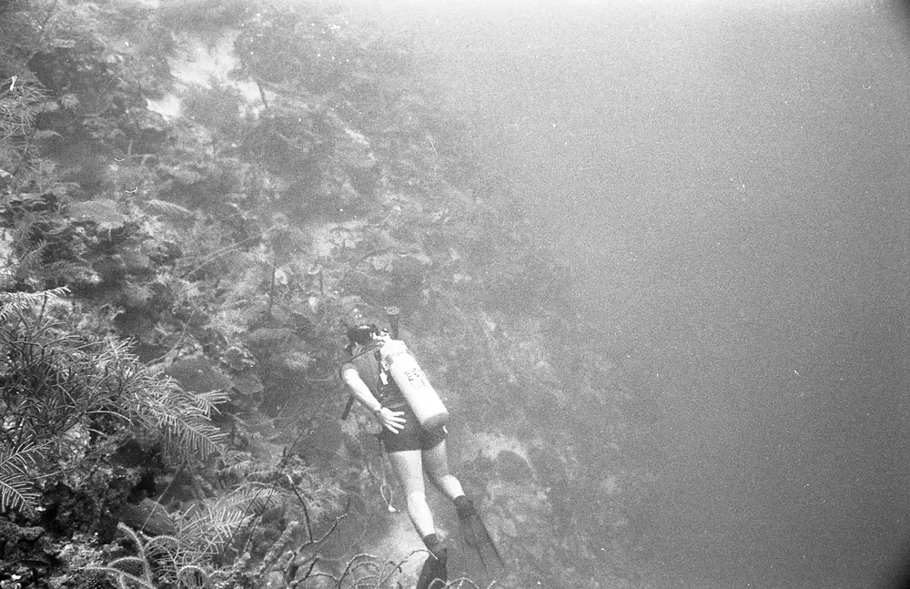{.lightbox group="discovery-bay-1966" description="**UUID: **3c15f7ea-956c-4332-b3d0-d1f5e41542e2 **Date: **1967-08-14 **Location: **Jamaica | Discovery Bay | Pinnacle 1 Deep **Longitude: **77.41017ºW **Latitude: **18.47367ºN **Photographer: **Eileen Graham **Copyright: **Trustees of the Natural History Museum (London, UK), CC-BY-4.0" alt="**UUID: **3c15f7ea-956c-4332-b3d0-d1f5e41542e2 **Date: **1967-08-14 **Location: **Jamaica | Discovery Bay | Pinnacle 1 Deep **Longitude: **77.41017ºW **Latitude: **18.47367ºN **Photographer: **Eileen Graham **Copyright: **Trustees of the Natural History Museum (London, UK), CC-BY-4.0"}

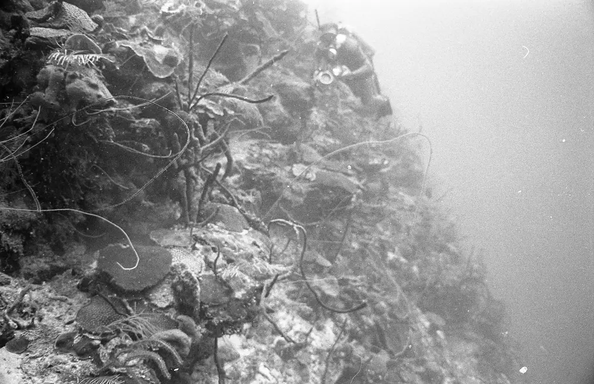{.lightbox group="discovery-bay-1966" description="**UUID: **b3a98b02-9a8e-47ab-82f0-9d4e97a25fde **Date: **1967-08-14 **Location: **Jamaica | Discovery Bay | Pinnacle 1 Deep **Longitude: **77.41017ºW **Latitude: **18.47367ºN **Photographer: **Eileen Graham **Copyright: **Trustees of the Natural History Museum (London, UK), CC-BY-4.0" alt="**UUID: **b3a98b02-9a8e-47ab-82f0-9d4e97a25fde **Date: **1967-08-14 **Location: **Jamaica | Discovery Bay | Pinnacle 1 Deep **Longitude: **77.41017ºW **Latitude: **18.47367ºN **Photographer: **Eileen Graham **Copyright: **Trustees of the Natural History Museum (London, UK), CC-BY-4.0"}

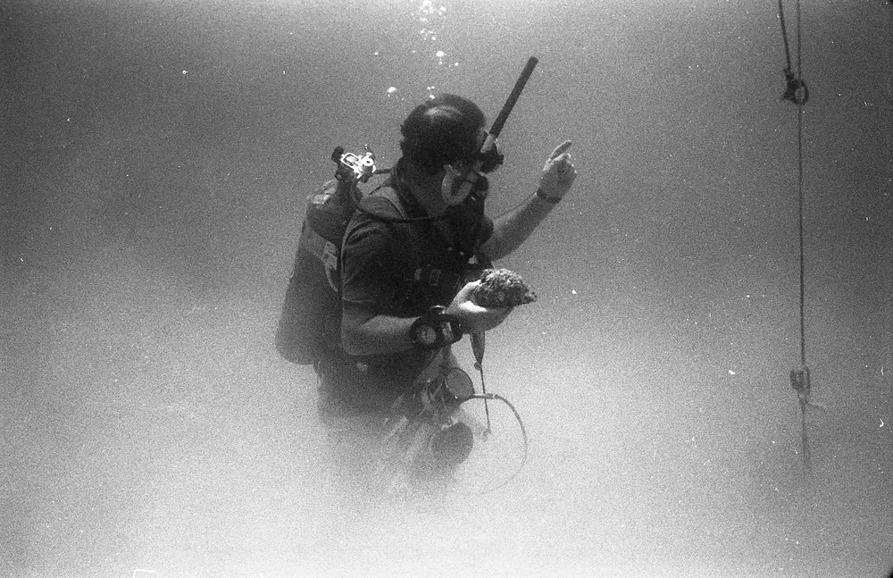{.lightbox group="discovery-bay-1966" description="**UUID: **e0ec45f0-7a58-4720-a6f7-71c3fc01561a **Date: **1967-08-14 **Location: **Jamaica | Discovery Bay | Buoy Mooring (1960s) **Longitude: **77.40908ºW **Latitude: **18.47322ºN **Photographer: **Eileen Graham **Copyright: **Trustees of the Natural History Museum (London, UK), CC-BY-4.0" alt="**UUID: **e0ec45f0-7a58-4720-a6f7-71c3fc01561a **Date: **1967-08-14 **Location: **Jamaica | Discovery Bay | Buoy Mooring (1960s) **Longitude: **77.40908ºW **Latitude: **18.47322ºN **Photographer: **Eileen Graham **Copyright: **Trustees of the Natural History Museum (London, UK), CC-BY-4.0"}

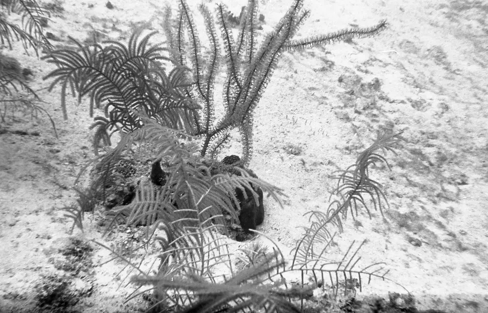{.lightbox group="discovery-bay-1966" description="**UUID: **62e400a3-7a7e-4b03-9a0d-52e07bb0fc61 **Date: **1967-08-18 **Location: **Jamaica | Discovery Bay | Buoy Upper Slope **Longitude: **77.40908ºW **Latitude: **18.47322ºN **Photographer: **Eileen Graham **Copyright: **Trustees of the Natural History Museum (London, UK), CC-BY-4.0" alt="**UUID: **62e400a3-7a7e-4b03-9a0d-52e07bb0fc61 **Date: **1967-08-18 **Location: **Jamaica | Discovery Bay | Buoy Upper Slope **Longitude: **77.40908ºW **Latitude: **18.47322ºN **Photographer: **Eileen Graham **Copyright: **Trustees of the Natural History Museum (London, UK), CC-BY-4.0"}

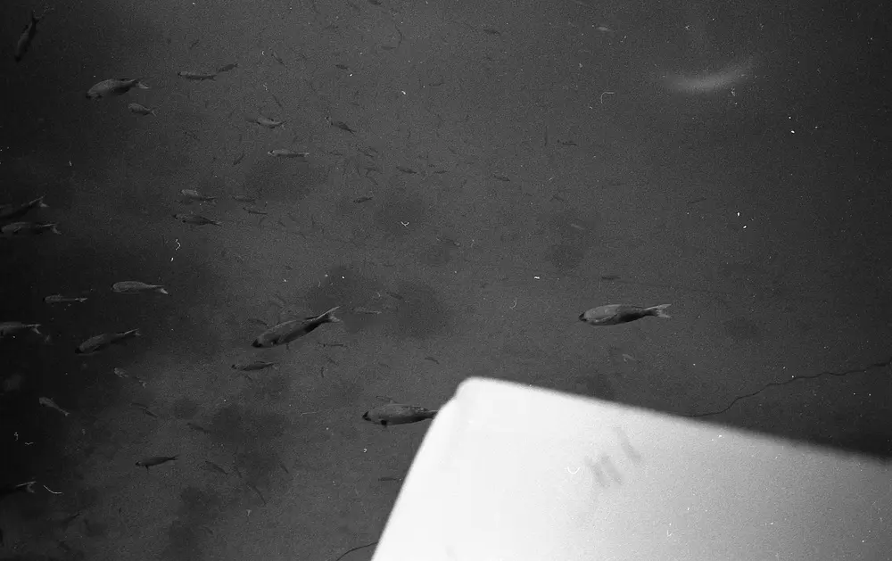{.lightbox group="discovery-bay-1966" description="**UUID: **1bd240c1-4a14-48ed-896b-669c00bd640a **Date: **1966-08-26 **Location: **Jamaica | Discovery Bay | Algal Plots **Longitude: **77.414ºW **Latitude: **18.473ºN **Photographer: **Eileen Graham **Copyright: **Trustees of the Natural History Museum (London, UK), CC-BY-4.0" alt="**UUID: **1bd240c1-4a14-48ed-896b-669c00bd640a **Date: **1966-08-26 **Location: **Jamaica | Discovery Bay | Algal Plots **Longitude: **77.414ºW **Latitude: **18.473ºN **Photographer: **Eileen Graham **Copyright: **Trustees of the Natural History Museum (London, UK), CC-BY-4.0"}

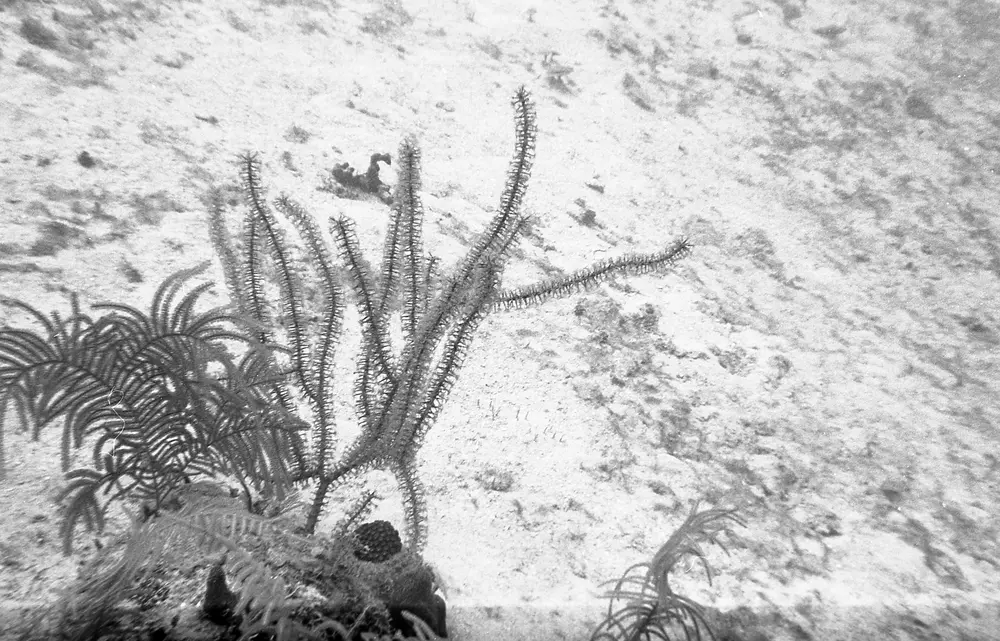{.lightbox group="discovery-bay-1966" description="**UUID: **d9ff65cb-9af4-419e-bc63-651a9c228743 **Date: **1967-08-18 **Location: **Jamaica | Discovery Bay | Buoy Upper Slope **Longitude: **77.40908ºW **Latitude: **18.47322ºN **Photographer: **Eileen Graham **Copyright: **Trustees of the Natural History Museum (London, UK), CC-BY-4.0" alt="**UUID: **d9ff65cb-9af4-419e-bc63-651a9c228743 **Date: **1967-08-18 **Location: **Jamaica | Discovery Bay | Buoy Upper Slope **Longitude: **77.40908ºW **Latitude: **18.47322ºN **Photographer: **Eileen Graham **Copyright: **Trustees of the Natural History Museum (London, UK), CC-BY-4.0"}

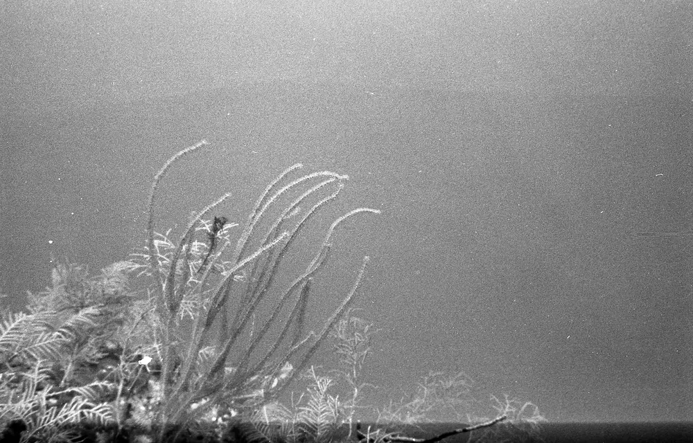{.lightbox group="discovery-bay-1966" description="**UUID: **2f12f20e-e853-42fc-8f74-9c47de9d01fa **Date: **1967-08-18 **Location: **Jamaica | Discovery Bay | Buoy Upper Slope **Longitude: **77.40908ºW **Latitude: **18.47322ºN **Photographer: **Eileen Graham **Copyright: **Trustees of the Natural History Museum (London, UK), CC-BY-4.0" alt="**UUID: **2f12f20e-e853-42fc-8f74-9c47de9d01fa **Date: **1967-08-18 **Location: **Jamaica | Discovery Bay | Buoy Upper Slope **Longitude: **77.40908ºW **Latitude: **18.47322ºN **Photographer: **Eileen Graham **Copyright: **Trustees of the Natural History Museum (London, UK), CC-BY-4.0"}

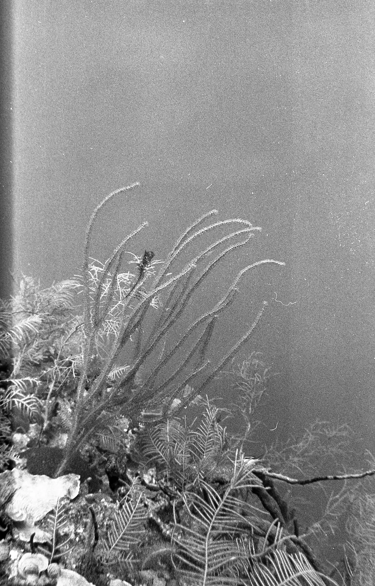{.lightbox group="discovery-bay-1966" description="**UUID: **dfaf67dc-d71a-4e7c-88ef-4abc0345f427 **Date: **1967-08-18 **Location: **Jamaica | Discovery Bay | Buoy Upper Slope **Longitude: **77.40908ºW **Latitude: **18.47322ºN **Photographer: **Eileen Graham **Copyright: **Trustees of the Natural History Museum (London, UK), CC-BY-4.0" alt="**UUID: **dfaf67dc-d71a-4e7c-88ef-4abc0345f427 **Date: **1967-08-18 **Location: **Jamaica | Discovery Bay | Buoy Upper Slope **Longitude: **77.40908ºW **Latitude: **18.47322ºN **Photographer: **Eileen Graham **Copyright: **Trustees of the Natural History Museum (London, UK), CC-BY-4.0"}

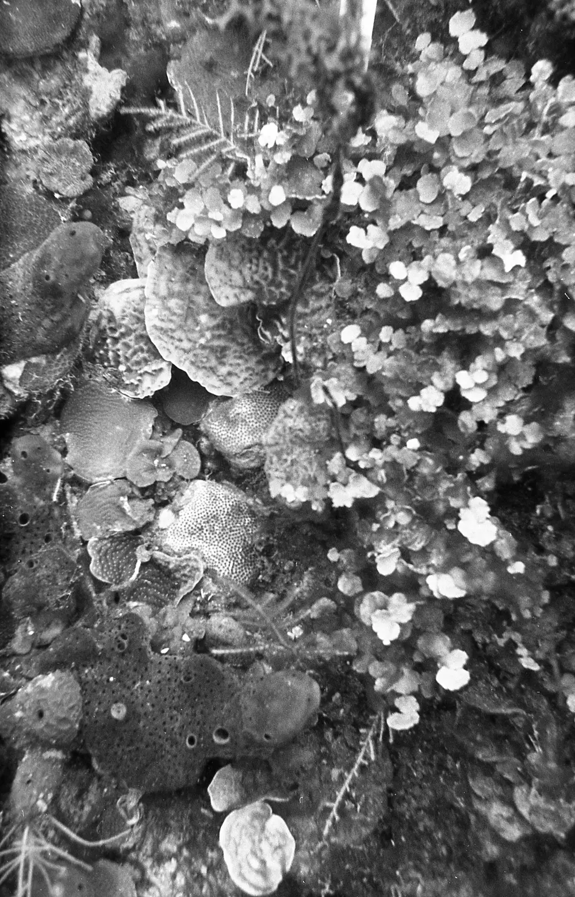{.lightbox group="discovery-bay-1966" description="**UUID: **affffcce-5a91-4ab8-be13-da0327ca78e6 **Date: **1967-08-18 **Location: **Jamaica | Discovery Bay | Buoy Upper Slope **Longitude: **77.40908ºW **Latitude: **18.47322ºN **Photographer: **Eileen Graham **Copyright: **Trustees of the Natural History Museum (London, UK), CC-BY-4.0" alt="**UUID: **affffcce-5a91-4ab8-be13-da0327ca78e6 **Date: **1967-08-18 **Location: **Jamaica | Discovery Bay | Buoy Upper Slope **Longitude: **77.40908ºW **Latitude: **18.47322ºN **Photographer: **Eileen Graham **Copyright: **Trustees of the Natural History Museum (London, UK), CC-BY-4.0"}

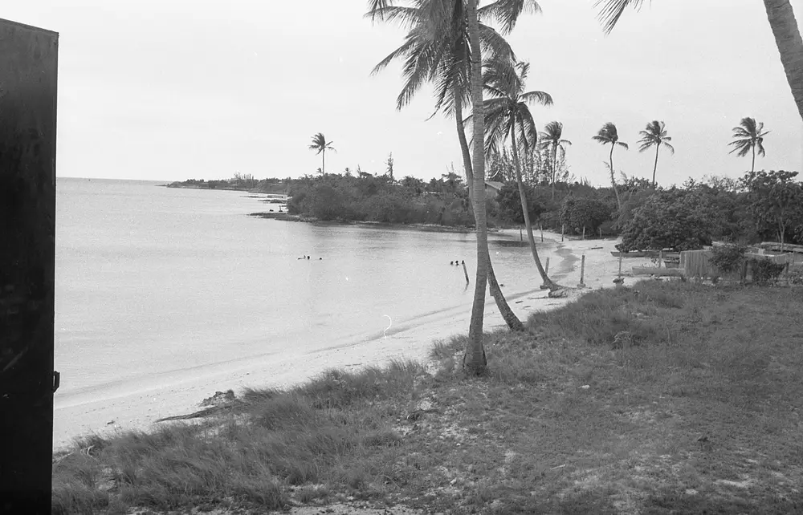{.lightbox group="discovery-bay-1966" description="**UUID: **be111ebc-7bff-4f76-9d30-8fe5fb105d72 **Date: **1967-08-18 **Location: **Jamaica | Discovery Bay | Onshore **Longitude: **77.41543ºW **Latitude: **18.468618ºN **Photographer: **Eileen Graham **Copyright: **Trustees of the Natural History Museum (London, UK), CC-BY-4.0" alt="**UUID: **be111ebc-7bff-4f76-9d30-8fe5fb105d72 **Date: **1967-08-18 **Location: **Jamaica | Discovery Bay | Onshore **Longitude: **77.41543ºW **Latitude: **18.468618ºN **Photographer: **Eileen Graham **Copyright: **Trustees of the Natural History Museum (London, UK), CC-BY-4.0"}

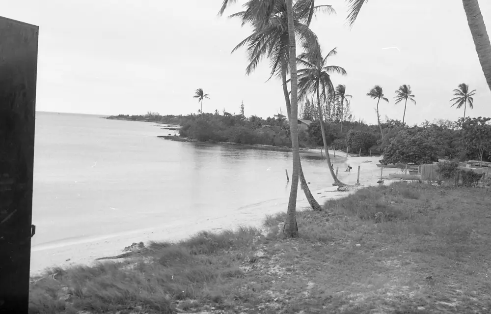{.lightbox group="discovery-bay-1966" description="**UUID: **04541556-c08e-43e1-b3ee-30cbf12ff2e6 **Date: **1967-08-18 **Location: **Jamaica | Discovery Bay | Onshore **Longitude: **77.41543ºW **Latitude: **18.468618ºN **Photographer: **Eileen Graham **Copyright: **Trustees of the Natural History Museum (London, UK), CC-BY-4.0" alt="**UUID: **04541556-c08e-43e1-b3ee-30cbf12ff2e6 **Date: **1967-08-18 **Location: **Jamaica | Discovery Bay | Onshore **Longitude: **77.41543ºW **Latitude: **18.468618ºN **Photographer: **Eileen Graham **Copyright: **Trustees of the Natural History Museum (London, UK), CC-BY-4.0"}

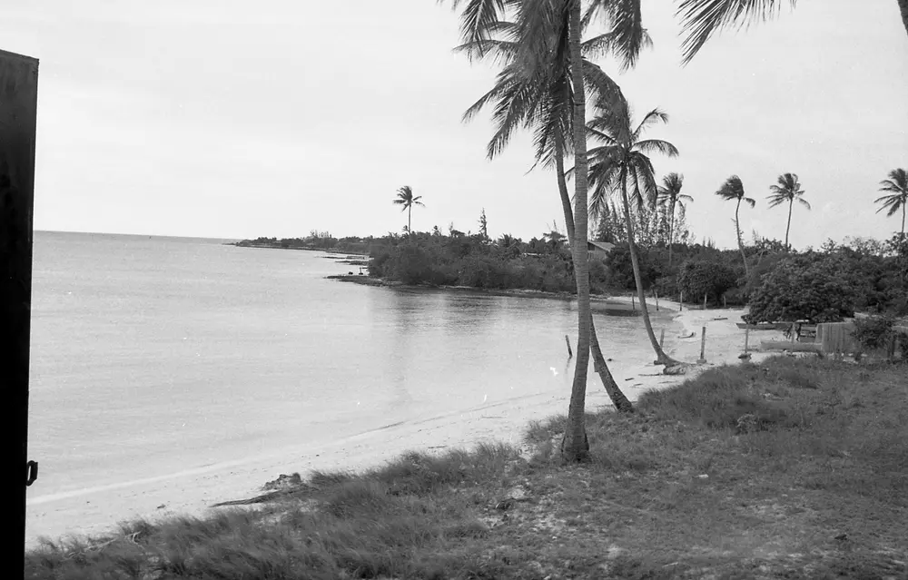{.lightbox group="discovery-bay-1966" description="**UUID: **96763f2c-eb54-4d5d-a257-2a124b5965c7 **Date: **1967-08-18 **Location: **Jamaica | Discovery Bay | Onshore **Longitude: **77.41543ºW **Latitude: **18.468618ºN **Photographer: **Eileen Graham **Copyright: **Trustees of the Natural History Museum (London, UK), CC-BY-4.0" alt="**UUID: **96763f2c-eb54-4d5d-a257-2a124b5965c7 **Date: **1967-08-18 **Location: **Jamaica | Discovery Bay | Onshore **Longitude: **77.41543ºW **Latitude: **18.468618ºN **Photographer: **Eileen Graham **Copyright: **Trustees of the Natural History Museum (London, UK), CC-BY-4.0"}

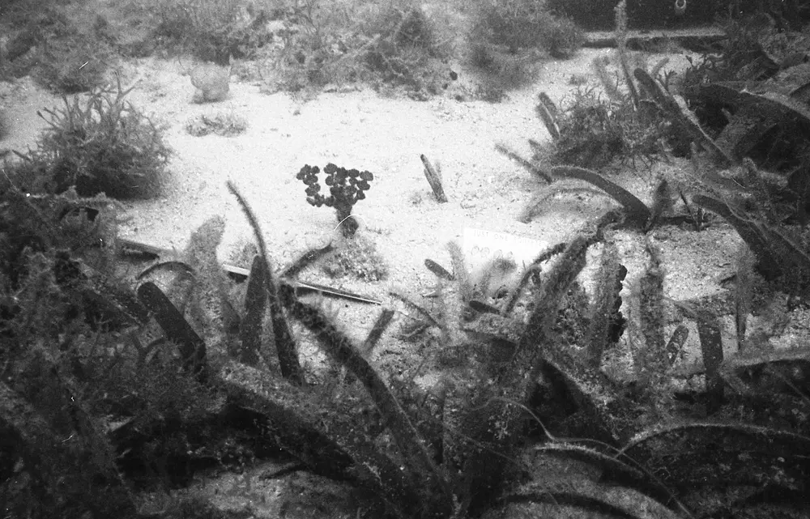{.lightbox group="discovery-bay-1966" description="**UUID: **553b171a-98f1-444b-ac1d-49e13657ef65 **Date: **1966-08-26 **Location: **Jamaica | Discovery Bay | Discovery Bay Purden House **Longitude: **77.40268ºW **Latitude: **18.46868ºN **Photographer: **Eileen Graham **Copyright: **Trustees of the Natural History Museum (London, UK), CC-BY-4.0" alt="**UUID: **553b171a-98f1-444b-ac1d-49e13657ef65 **Date: **1966-08-26 **Location: **Jamaica | Discovery Bay | Discovery Bay Purden House **Longitude: **77.40268ºW **Latitude: **18.46868ºN **Photographer: **Eileen Graham **Copyright: **Trustees of the Natural History Museum (London, UK), CC-BY-4.0"}

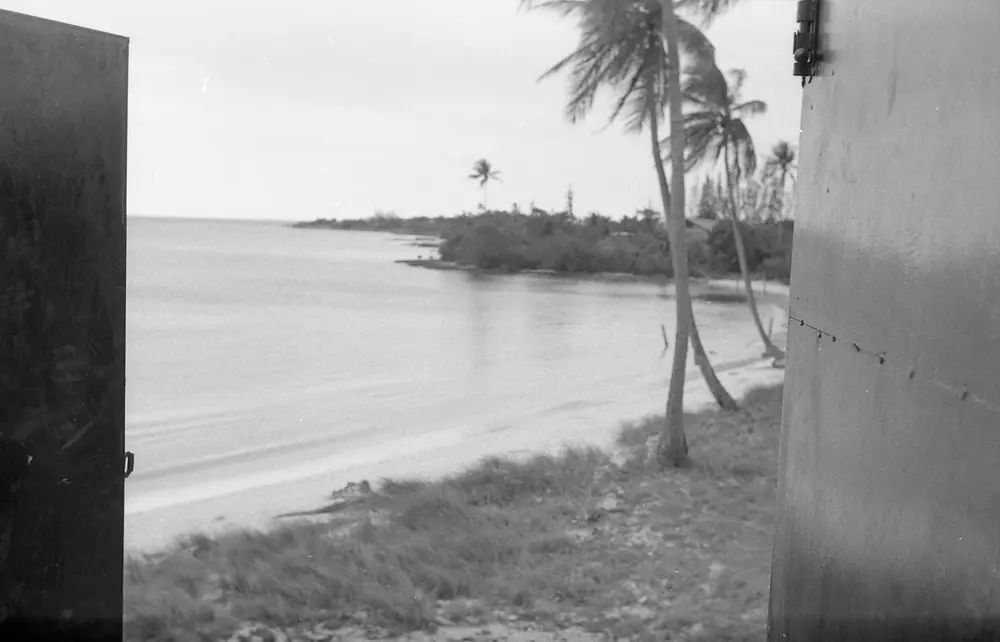{.lightbox group="discovery-bay-1966" description="**UUID: **fe70ee5b-5150-4539-9386-e77964cecedf **Date: **1967-08-18 **Location: **Jamaica | Discovery Bay | Onshore **Longitude: **77.41543ºW **Latitude: **18.468618ºN **Photographer: **Eileen Graham **Copyright: **Trustees of the Natural History Museum (London, UK), CC-BY-4.0" alt="**UUID: **fe70ee5b-5150-4539-9386-e77964cecedf **Date: **1967-08-18 **Location: **Jamaica | Discovery Bay | Onshore **Longitude: **77.41543ºW **Latitude: **18.468618ºN **Photographer: **Eileen Graham **Copyright: **Trustees of the Natural History Museum (London, UK), CC-BY-4.0"}

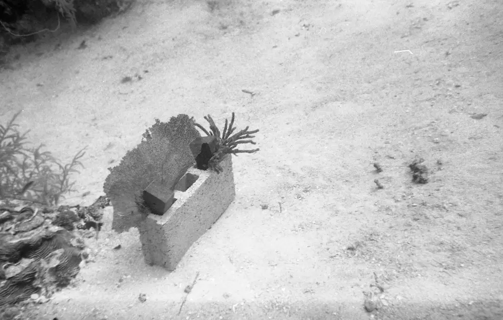{.lightbox group="discovery-bay-1966" description="**UUID: **00561041-9898-499c-acd1-5fc3eecac324 **Date: **1967-08-20 **Location: **Jamaica | Discovery Bay | Pinnacle 1 Slope **Longitude: **77.41017ºW **Latitude: **18.47367ºN **Photographer: **Eileen Graham **Copyright: **Trustees of the Natural History Museum (London, UK), CC-BY-4.0" alt="**UUID: **00561041-9898-499c-acd1-5fc3eecac324 **Date: **1967-08-20 **Location: **Jamaica | Discovery Bay | Pinnacle 1 Slope **Longitude: **77.41017ºW **Latitude: **18.47367ºN **Photographer: **Eileen Graham **Copyright: **Trustees of the Natural History Museum (London, UK), CC-BY-4.0"}

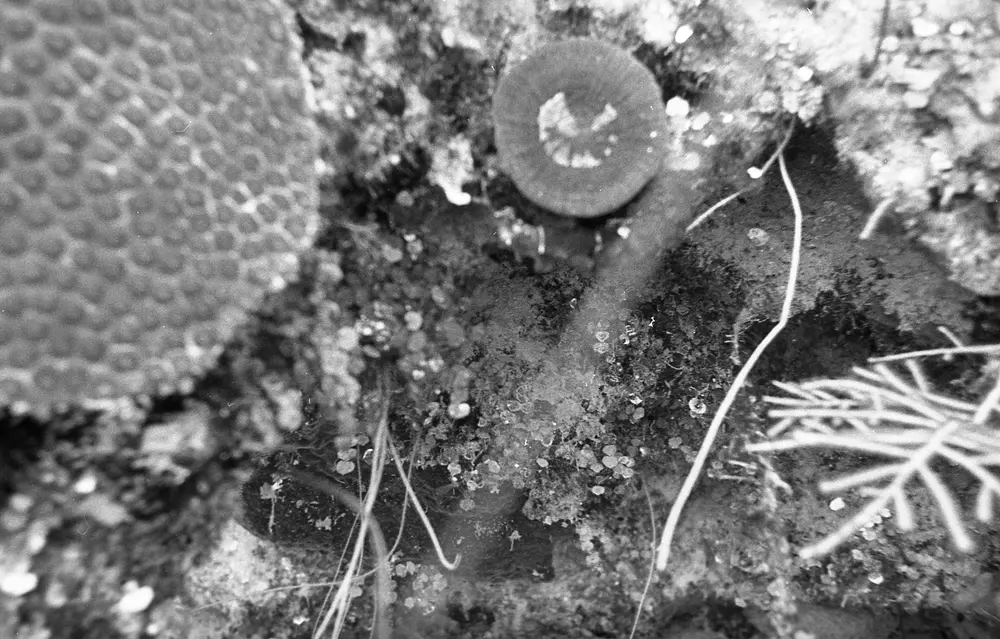{.lightbox group="discovery-bay-1966" description="**UUID: **09b40e84-21b4-4498-963d-6f357723d03e **Date: **1967-08-20 **Location: **Jamaica | Discovery Bay | Pinnacle 1 Slope **Longitude: **77.41017ºW **Latitude: **18.47367ºN **Photographer: **Eileen Graham **Copyright: **Trustees of the Natural History Museum (London, UK), CC-BY-4.0" alt="**UUID: **09b40e84-21b4-4498-963d-6f357723d03e **Date: **1967-08-20 **Location: **Jamaica | Discovery Bay | Pinnacle 1 Slope **Longitude: **77.41017ºW **Latitude: **18.47367ºN **Photographer: **Eileen Graham **Copyright: **Trustees of the Natural History Museum (London, UK), CC-BY-4.0"}

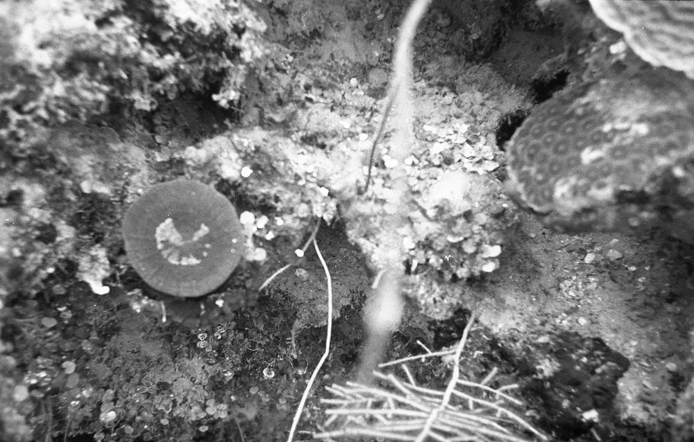{.lightbox group="discovery-bay-1966" description="**UUID: **f4e8d8bd-398b-4d9b-b109-8567ad6b01a0 **Date: **1967-08-20 **Location: **Jamaica | Discovery Bay | Pinnacle 1 Slope **Longitude: **77.41017ºW **Latitude: **18.47367ºN **Photographer: **Eileen Graham **Copyright: **Trustees of the Natural History Museum (London, UK), CC-BY-4.0" alt="**UUID: **f4e8d8bd-398b-4d9b-b109-8567ad6b01a0 **Date: **1967-08-20 **Location: **Jamaica | Discovery Bay | Pinnacle 1 Slope **Longitude: **77.41017ºW **Latitude: **18.47367ºN **Photographer: **Eileen Graham **Copyright: **Trustees of the Natural History Museum (London, UK), CC-BY-4.0"}

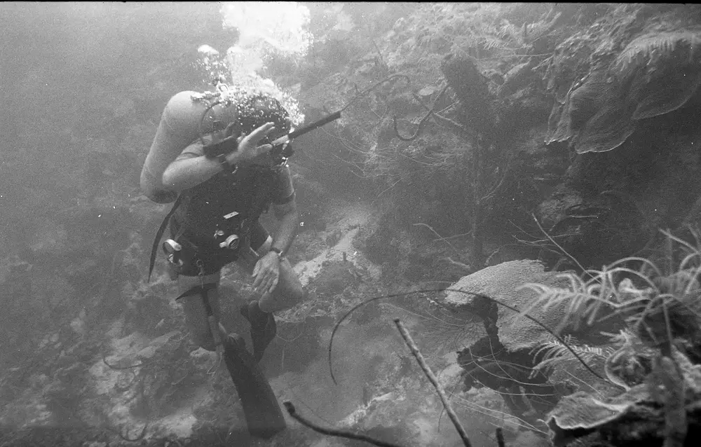{.lightbox group="discovery-bay-1966" description="**UUID: **70237718-e3d9-4c96-bed3-7d5de4986552 **Date: **1967-08-20 **Location: **Jamaica | Discovery Bay | Pinnacle 1 Deep **Longitude: **77.41017ºW **Latitude: **18.47367ºN **Photographer: **Eileen Graham **Copyright: **Trustees of the Natural History Museum (London, UK), CC-BY-4.0" alt="**UUID: **70237718-e3d9-4c96-bed3-7d5de4986552 **Date: **1967-08-20 **Location: **Jamaica | Discovery Bay | Pinnacle 1 Deep **Longitude: **77.41017ºW **Latitude: **18.47367ºN **Photographer: **Eileen Graham **Copyright: **Trustees of the Natural History Museum (London, UK), CC-BY-4.0"}

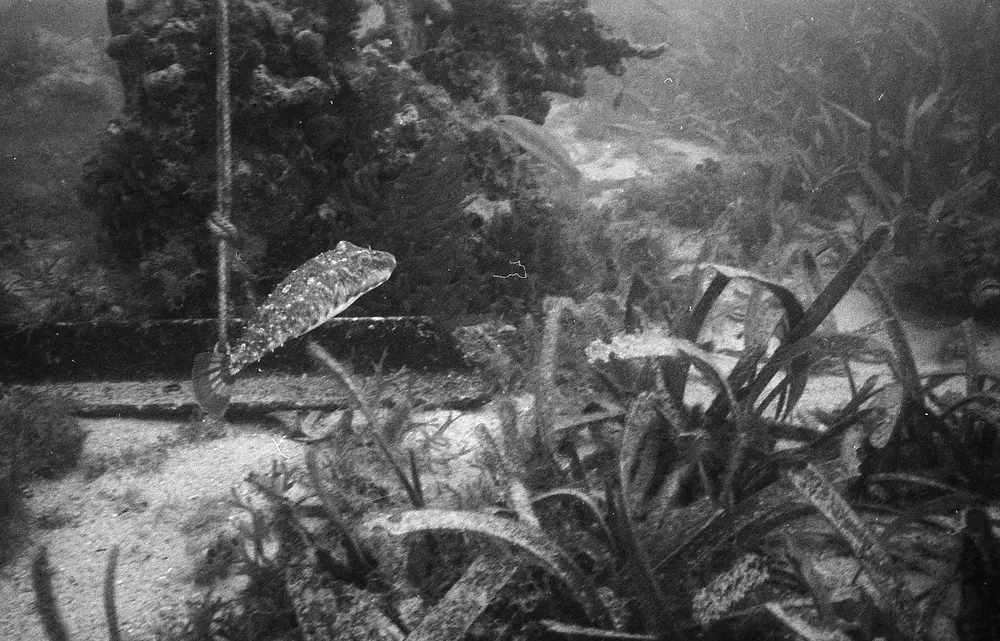{.lightbox group="discovery-bay-1966" description="**UUID: **d7eff174-ef14-4177-9ee4-61586e4c2100 **Date: **1966-08-26 **Location: **Jamaica | Discovery Bay | Discovery Bay Purden House **Longitude: **77.40268ºW **Latitude: **18.46868ºN **Photographer: **Eileen Graham **Copyright: **Trustees of the Natural History Museum (London, UK), CC-BY-4.0" alt="**UUID: **d7eff174-ef14-4177-9ee4-61586e4c2100 **Date: **1966-08-26 **Location: **Jamaica | Discovery Bay | Discovery Bay Purden House **Longitude: **77.40268ºW **Latitude: **18.46868ºN **Photographer: **Eileen Graham **Copyright: **Trustees of the Natural History Museum (London, UK), CC-BY-4.0"}

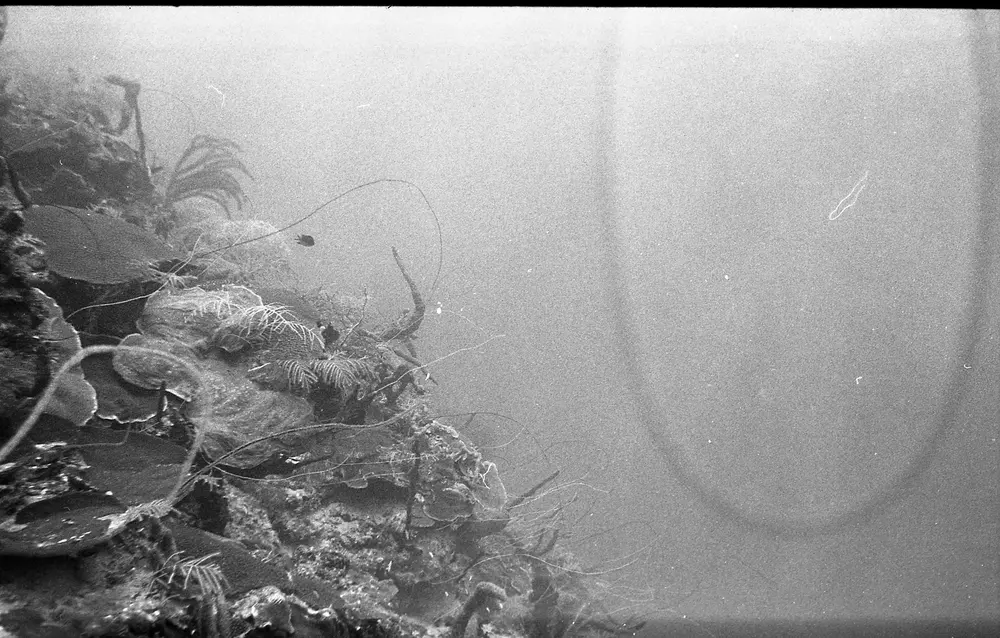{.lightbox group="discovery-bay-1966" description="**UUID: **ad170c06-7970-4e6d-a2eb-abfac5ce4738 **Date: **1967-08-20 **Location: **Jamaica | Discovery Bay | Pinnacle 1 Deep **Longitude: **77.41017ºW **Latitude: **18.47367ºN **Photographer: **Eileen Graham **Copyright: **Trustees of the Natural History Museum (London, UK), CC-BY-4.0" alt="**UUID: **ad170c06-7970-4e6d-a2eb-abfac5ce4738 **Date: **1967-08-20 **Location: **Jamaica | Discovery Bay | Pinnacle 1 Deep **Longitude: **77.41017ºW **Latitude: **18.47367ºN **Photographer: **Eileen Graham **Copyright: **Trustees of the Natural History Museum (London, UK), CC-BY-4.0"}

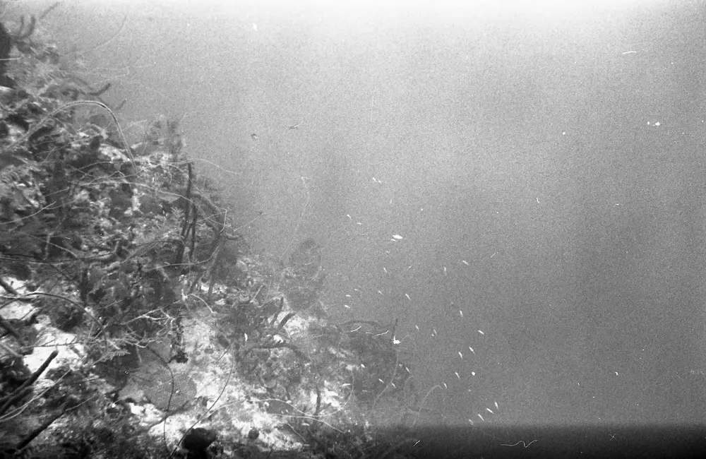{.lightbox group="discovery-bay-1966" description="**UUID: **78958f89-33e0-45f7-8f40-0cec417fdd4a **Date: **1967-08-20 **Location: **Jamaica | Discovery Bay | Pinnacle 1 Deep **Longitude: **77.41017ºW **Latitude: **18.47367ºN **Photographer: **Eileen Graham **Copyright: **Trustees of the Natural History Museum (London, UK), CC-BY-4.0" alt="**UUID: **78958f89-33e0-45f7-8f40-0cec417fdd4a **Date: **1967-08-20 **Location: **Jamaica | Discovery Bay | Pinnacle 1 Deep **Longitude: **77.41017ºW **Latitude: **18.47367ºN **Photographer: **Eileen Graham **Copyright: **Trustees of the Natural History Museum (London, UK), CC-BY-4.0"}

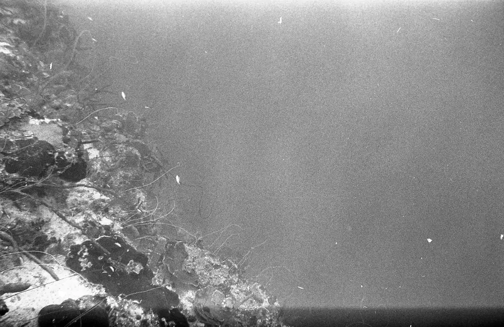{.lightbox group="discovery-bay-1966" description="**UUID: **7cd33ef1-f91f-475e-b420-9582b21c9a4e **Date: **1967-08-20 **Location: **Jamaica | Discovery Bay | Pinnacle 1 Deep **Longitude: **77.41017ºW **Latitude: **18.47367ºN **Photographer: **Eileen Graham **Copyright: **Trustees of the Natural History Museum (London, UK), CC-BY-4.0" alt="**UUID: **7cd33ef1-f91f-475e-b420-9582b21c9a4e **Date: **1967-08-20 **Location: **Jamaica | Discovery Bay | Pinnacle 1 Deep **Longitude: **77.41017ºW **Latitude: **18.47367ºN **Photographer: **Eileen Graham **Copyright: **Trustees of the Natural History Museum (London, UK), CC-BY-4.0"}

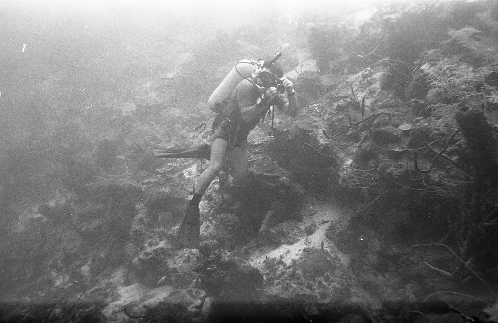{.lightbox group="discovery-bay-1966" description="**UUID: **45d339c1-9c84-41fd-b7b5-fc8baf6b2124 **Date: **1967-08-20 **Location: **Jamaica | Discovery Bay | Pinnacle 1 Deep **Longitude: **77.41017ºW **Latitude: **18.47367ºN **Photographer: **Eileen Graham **Copyright: **Trustees of the Natural History Museum (London, UK), CC-BY-4.0" alt="**UUID: **45d339c1-9c84-41fd-b7b5-fc8baf6b2124 **Date: **1967-08-20 **Location: **Jamaica | Discovery Bay | Pinnacle 1 Deep **Longitude: **77.41017ºW **Latitude: **18.47367ºN **Photographer: **Eileen Graham **Copyright: **Trustees of the Natural History Museum (London, UK), CC-BY-4.0"}

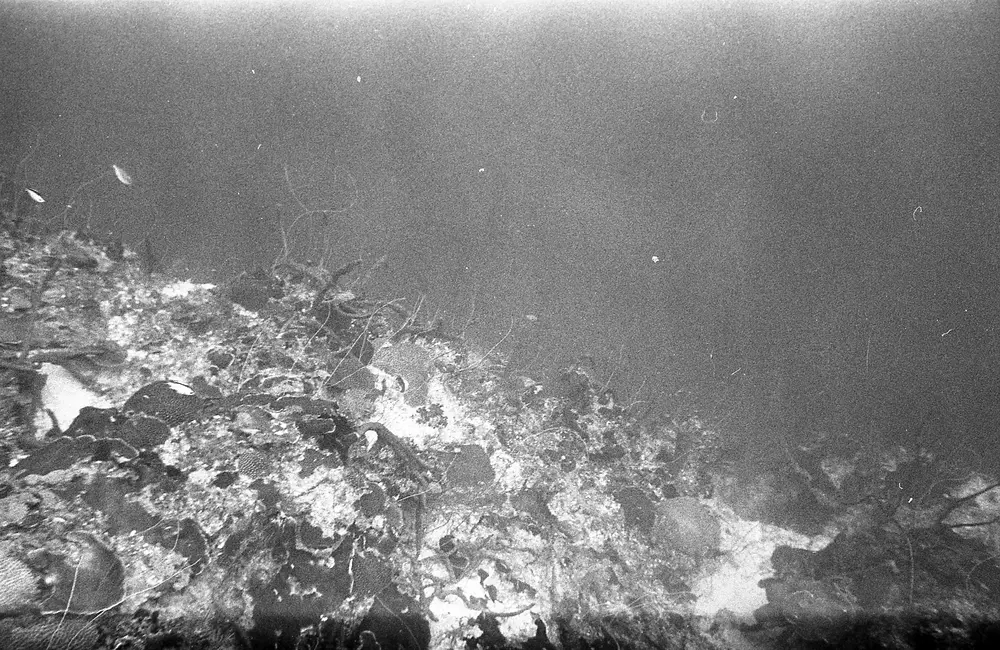{.lightbox group="discovery-bay-1966" description="**UUID: **28d16a73-896c-4c33-9807-edb60dba9c1d **Date: **1967-08-20 **Location: **Jamaica | Discovery Bay | Pinnacle 1 Deep **Longitude: **77.41017ºW **Latitude: **18.47367ºN **Photographer: **Eileen Graham **Copyright: **Trustees of the Natural History Museum (London, UK), CC-BY-4.0" alt="**UUID: **28d16a73-896c-4c33-9807-edb60dba9c1d **Date: **1967-08-20 **Location: **Jamaica | Discovery Bay | Pinnacle 1 Deep **Longitude: **77.41017ºW **Latitude: **18.47367ºN **Photographer: **Eileen Graham **Copyright: **Trustees of the Natural History Museum (London, UK), CC-BY-4.0"}

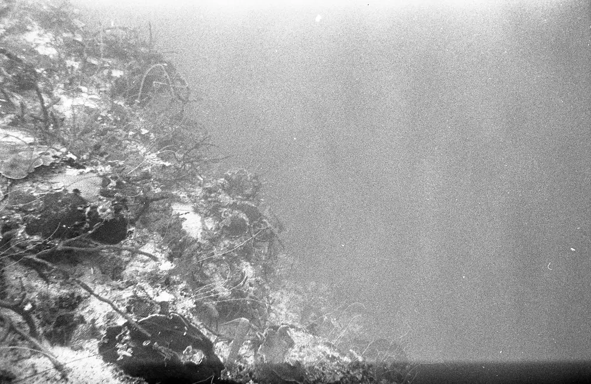{.lightbox group="discovery-bay-1966" description="**UUID: **7338c479-e506-4410-89f3-b9e542b95ced **Date: **1967-08-20 **Location: **Jamaica | Discovery Bay | Pinnacle 1 Deep **Longitude: **77.41017ºW **Latitude: **18.47367ºN **Photographer: **Eileen Graham **Copyright: **Trustees of the Natural History Museum (London, UK), CC-BY-4.0" alt="**UUID: **7338c479-e506-4410-89f3-b9e542b95ced **Date: **1967-08-20 **Location: **Jamaica | Discovery Bay | Pinnacle 1 Deep **Longitude: **77.41017ºW **Latitude: **18.47367ºN **Photographer: **Eileen Graham **Copyright: **Trustees of the Natural History Museum (London, UK), CC-BY-4.0"}

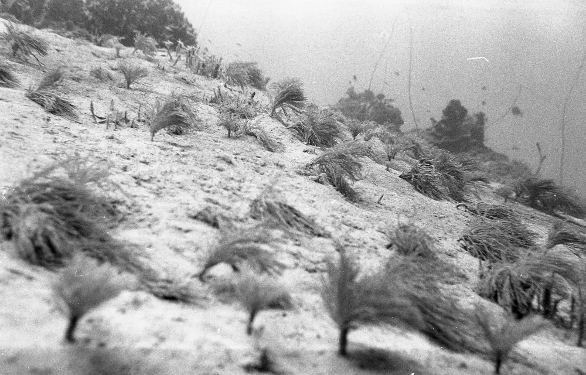{.lightbox group="discovery-bay-1966" description="**UUID: **8c5dfe14-0ec9-4d6e-b532-0870fb28ea27 **Date: **1967-08-20 **Location: **Jamaica | Discovery Bay | Pear Tree Bottom **Longitude: **77.35867ºW **Latitude: **18.4635ºN **Photographer: **Eileen Graham **Copyright: **Trustees of the Natural History Museum (London, UK), CC-BY-4.0" alt="**UUID: **8c5dfe14-0ec9-4d6e-b532-0870fb28ea27 **Date: **1967-08-20 **Location: **Jamaica | Discovery Bay | Pear Tree Bottom **Longitude: **77.35867ºW **Latitude: **18.4635ºN **Photographer: **Eileen Graham **Copyright: **Trustees of the Natural History Museum (London, UK), CC-BY-4.0"}

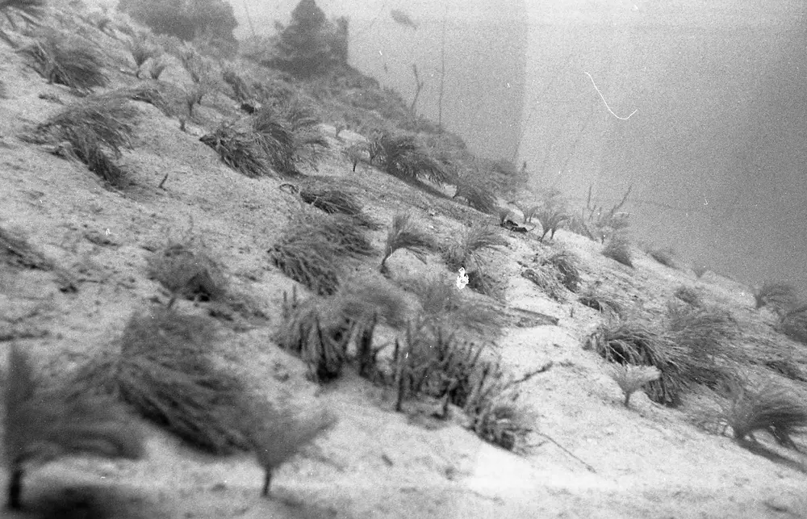{.lightbox group="discovery-bay-1966" description="**UUID: **df00eca8-5264-443b-bccd-47afa5967fe1 **Date: **1967-08-20 **Location: **Jamaica | Discovery Bay | Pear Tree Bottom **Longitude: **77.35867ºW **Latitude: **18.4635ºN **Photographer: **Eileen Graham **Copyright: **Trustees of the Natural History Museum (London, UK), CC-BY-4.0" alt="**UUID: **df00eca8-5264-443b-bccd-47afa5967fe1 **Date: **1967-08-20 **Location: **Jamaica | Discovery Bay | Pear Tree Bottom **Longitude: **77.35867ºW **Latitude: **18.4635ºN **Photographer: **Eileen Graham **Copyright: **Trustees of the Natural History Museum (London, UK), CC-BY-4.0"}

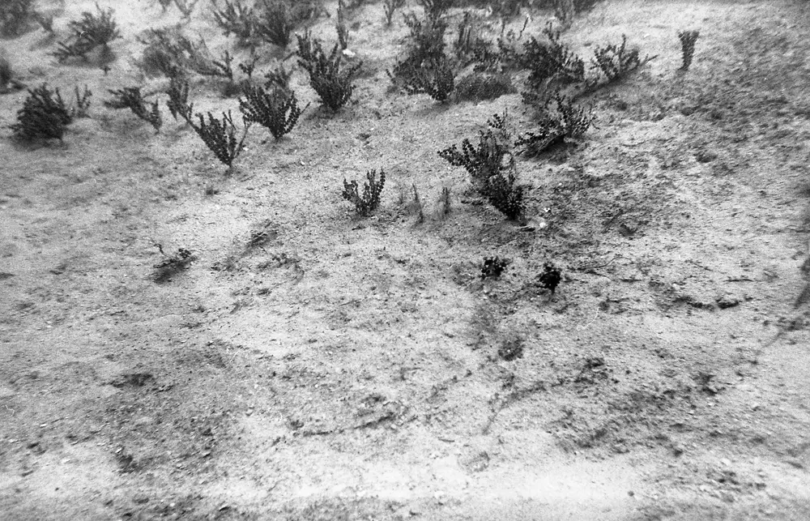{.lightbox group="discovery-bay-1966" description="**UUID: **667126e6-7511-42b7-a97f-79e246c9462e **Date: **1967-08-20 **Location: **Jamaica | Discovery Bay | Pear Tree Bottom **Longitude: **77.35867ºW **Latitude: **18.4635ºN **Photographer: **Eileen Graham **Copyright: **Trustees of the Natural History Museum (London, UK), CC-BY-4.0" alt="**UUID: **667126e6-7511-42b7-a97f-79e246c9462e **Date: **1967-08-20 **Location: **Jamaica | Discovery Bay | Pear Tree Bottom **Longitude: **77.35867ºW **Latitude: **18.4635ºN **Photographer: **Eileen Graham **Copyright: **Trustees of the Natural History Museum (London, UK), CC-BY-4.0"}

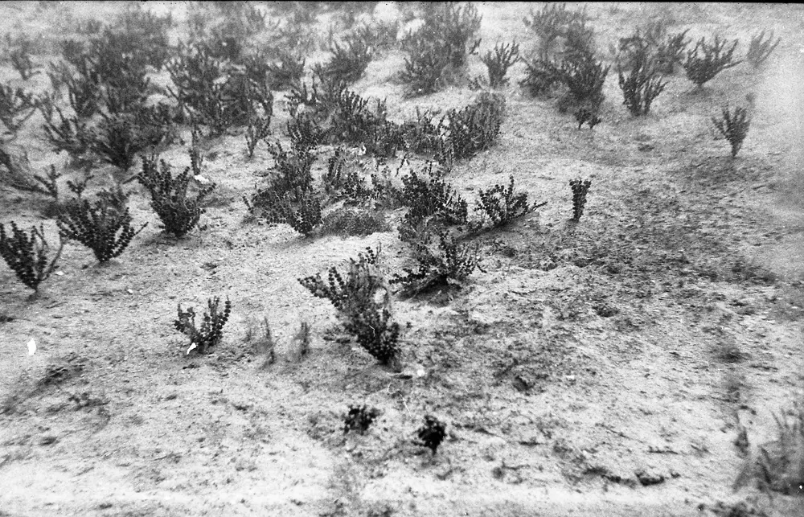{.lightbox group="discovery-bay-1966" description="**UUID: **6490426f-faa4-48d6-af75-13a816534c31 **Date: **1967-08-20 **Location: **Jamaica | Discovery Bay | Pear Tree Bottom **Longitude: **77.35867ºW **Latitude: **18.4635ºN **Photographer: **Eileen Graham **Copyright: **Trustees of the Natural History Museum (London, UK), CC-BY-4.0" alt="**UUID: **6490426f-faa4-48d6-af75-13a816534c31 **Date: **1967-08-20 **Location: **Jamaica | Discovery Bay | Pear Tree Bottom **Longitude: **77.35867ºW **Latitude: **18.4635ºN **Photographer: **Eileen Graham **Copyright: **Trustees of the Natural History Museum (London, UK), CC-BY-4.0"}

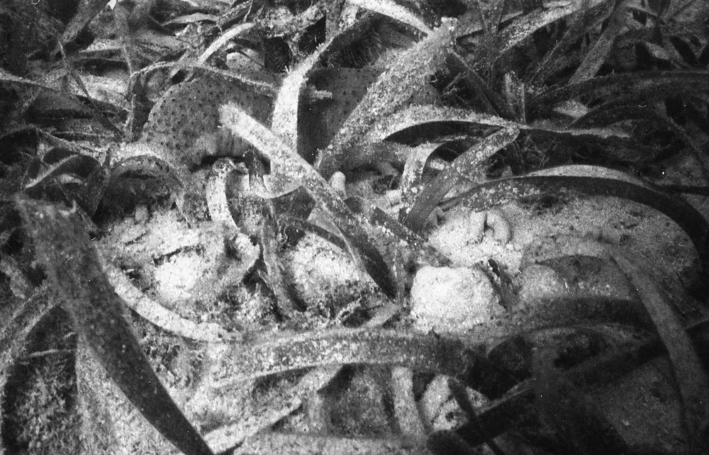{.lightbox group="discovery-bay-1966" description="**UUID: **707d8294-6b58-4e5f-aaf2-89c9567dfb8e **Date: **1966-08-26 **Location: **Jamaica | Discovery Bay | Discovery Bay Purden House **Longitude: **77.40268ºW **Latitude: **18.46868ºN **Photographer: **Eileen Graham **Copyright: **Trustees of the Natural History Museum (London, UK), CC-BY-4.0" alt="**UUID: **707d8294-6b58-4e5f-aaf2-89c9567dfb8e **Date: **1966-08-26 **Location: **Jamaica | Discovery Bay | Discovery Bay Purden House **Longitude: **77.40268ºW **Latitude: **18.46868ºN **Photographer: **Eileen Graham **Copyright: **Trustees of the Natural History Museum (London, UK), CC-BY-4.0"}

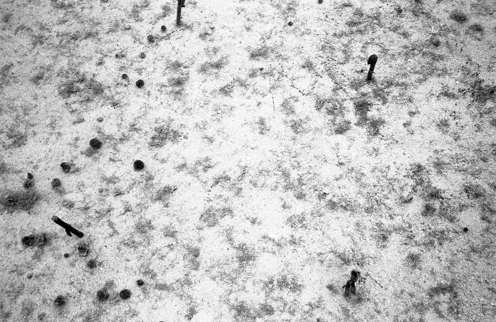{.lightbox group="discovery-bay-1966" description="**UUID: **30227668-033e-4d81-b7b0-0dd0232329f3 **Date: **1967-08-20 **Location: **Jamaica | Discovery Bay | Algal Plots **Longitude: **77.414ºW **Latitude: **18.473ºN **Photographer: **Eileen Graham **Copyright: **Trustees of the Natural History Museum (London, UK), CC-BY-4.0" alt="**UUID: **30227668-033e-4d81-b7b0-0dd0232329f3 **Date: **1967-08-20 **Location: **Jamaica | Discovery Bay | Algal Plots **Longitude: **77.414ºW **Latitude: **18.473ºN **Photographer: **Eileen Graham **Copyright: **Trustees of the Natural History Museum (London, UK), CC-BY-4.0"}

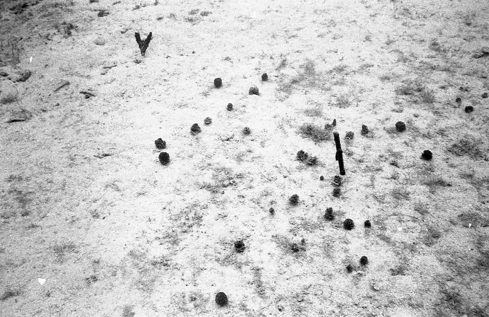{.lightbox group="discovery-bay-1966" description="**UUID: **a23ed777-2ba2-487c-adb7-53ba2a824a5a **Date: **1967-08-20 **Location: **Jamaica | Discovery Bay | Algal Plots **Longitude: **77.414ºW **Latitude: **18.473ºN **Photographer: **Eileen Graham **Copyright: **Trustees of the Natural History Museum (London, UK), CC-BY-4.0" alt="**UUID: **a23ed777-2ba2-487c-adb7-53ba2a824a5a **Date: **1967-08-20 **Location: **Jamaica | Discovery Bay | Algal Plots **Longitude: **77.414ºW **Latitude: **18.473ºN **Photographer: **Eileen Graham **Copyright: **Trustees of the Natural History Museum (London, UK), CC-BY-4.0"}

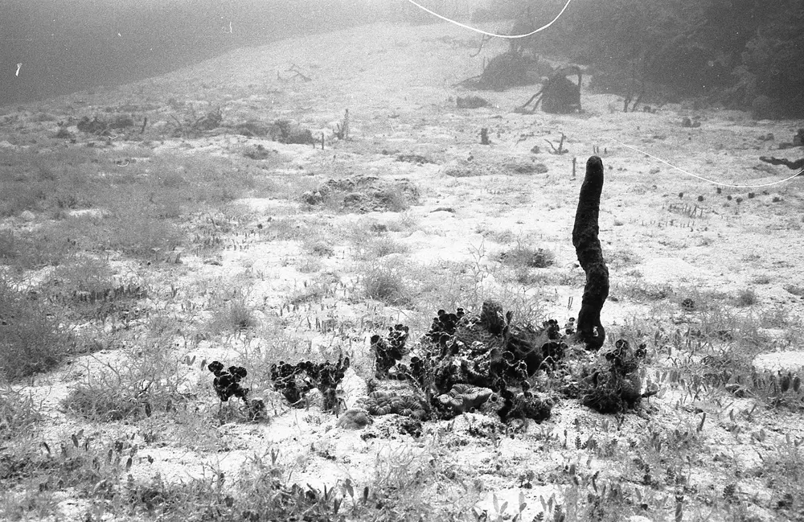{.lightbox group="discovery-bay-1966" description="**UUID: **8fd0d1ed-07b0-4f57-a47a-469c19a08ad2 **Date: **1967-08-20 **Location: **Jamaica | Discovery Bay | Algal Plots **Longitude: **77.414ºW **Latitude: **18.473ºN **Photographer: **Eileen Graham **Copyright: **Trustees of the Natural History Museum (London, UK), CC-BY-4.0" alt="**UUID: **8fd0d1ed-07b0-4f57-a47a-469c19a08ad2 **Date: **1967-08-20 **Location: **Jamaica | Discovery Bay | Algal Plots **Longitude: **77.414ºW **Latitude: **18.473ºN **Photographer: **Eileen Graham **Copyright: **Trustees of the Natural History Museum (London, UK), CC-BY-4.0"}

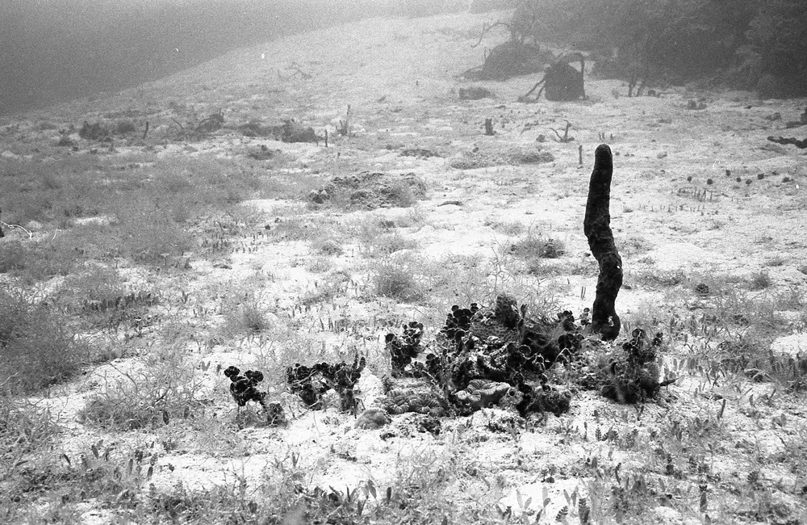{.lightbox group="discovery-bay-1966" description="**UUID: **f9fd3450-e055-49f5-88e4-b256cda341d9 **Date: **1967-08-20 **Location: **Jamaica | Discovery Bay | Algal Plots **Longitude: **77.414ºW **Latitude: **18.473ºN **Photographer: **Eileen Graham **Copyright: **Trustees of the Natural History Museum (London, UK), CC-BY-4.0" alt="**UUID: **f9fd3450-e055-49f5-88e4-b256cda341d9 **Date: **1967-08-20 **Location: **Jamaica | Discovery Bay | Algal Plots **Longitude: **77.414ºW **Latitude: **18.473ºN **Photographer: **Eileen Graham **Copyright: **Trustees of the Natural History Museum (London, UK), CC-BY-4.0"}

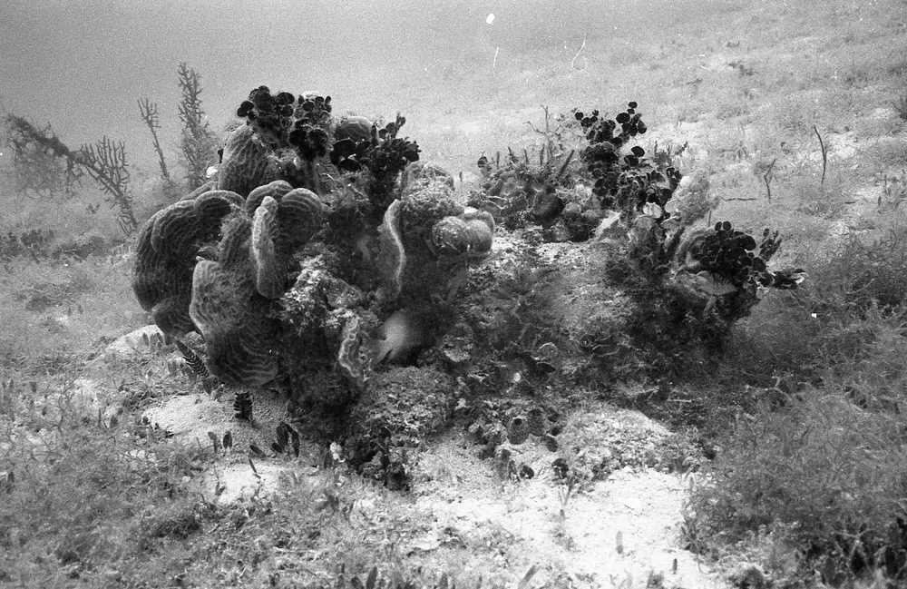{.lightbox group="discovery-bay-1966" description="**UUID: **0937d165-ac1d-4e19-b7e1-be3ab13a5e4e **Date: **1967-08-20 **Location: **Jamaica | Discovery Bay | Algal Plots **Longitude: **77.414ºW **Latitude: **18.473ºN **Photographer: **Eileen Graham **Copyright: **Trustees of the Natural History Museum (London, UK), CC-BY-4.0" alt="**UUID: **0937d165-ac1d-4e19-b7e1-be3ab13a5e4e **Date: **1967-08-20 **Location: **Jamaica | Discovery Bay | Algal Plots **Longitude: **77.414ºW **Latitude: **18.473ºN **Photographer: **Eileen Graham **Copyright: **Trustees of the Natural History Museum (London, UK), CC-BY-4.0"}

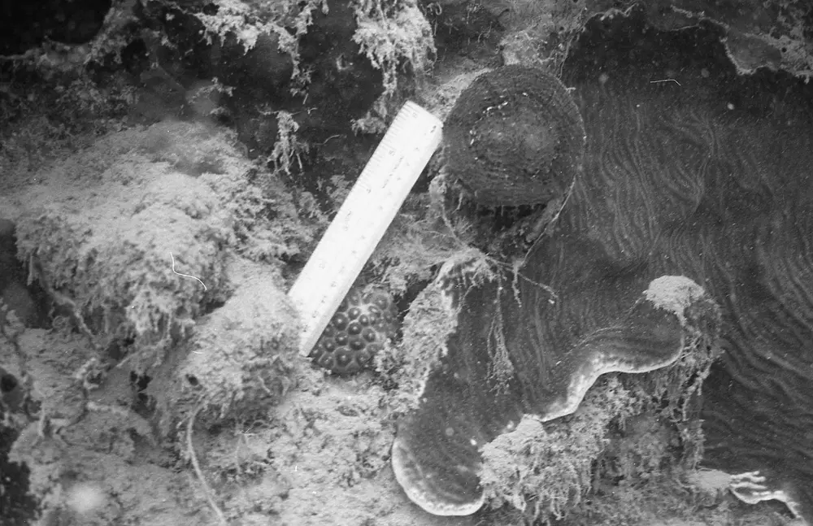{.lightbox group="discovery-bay-1966" description="**UUID: **fbc9203b-a8bb-4229-b329-c5b39ce6ecc0 **Date: **1967-05-08 **Location: **Jamaica | Discovery Bay | Rendezvous de Terrier **Longitude: **76.886ºW **Latitude: **18.399ºN **Photographer: **Eileen Graham **Copyright: **Trustees of the Natural History Museum (London, UK), CC-BY-4.0" alt="**UUID: **fbc9203b-a8bb-4229-b329-c5b39ce6ecc0 **Date: **1967-05-08 **Location: **Jamaica | Discovery Bay | Rendezvous de Terrier **Longitude: **76.886ºW **Latitude: **18.399ºN **Photographer: **Eileen Graham **Copyright: **Trustees of the Natural History Museum (London, UK), CC-BY-4.0"}

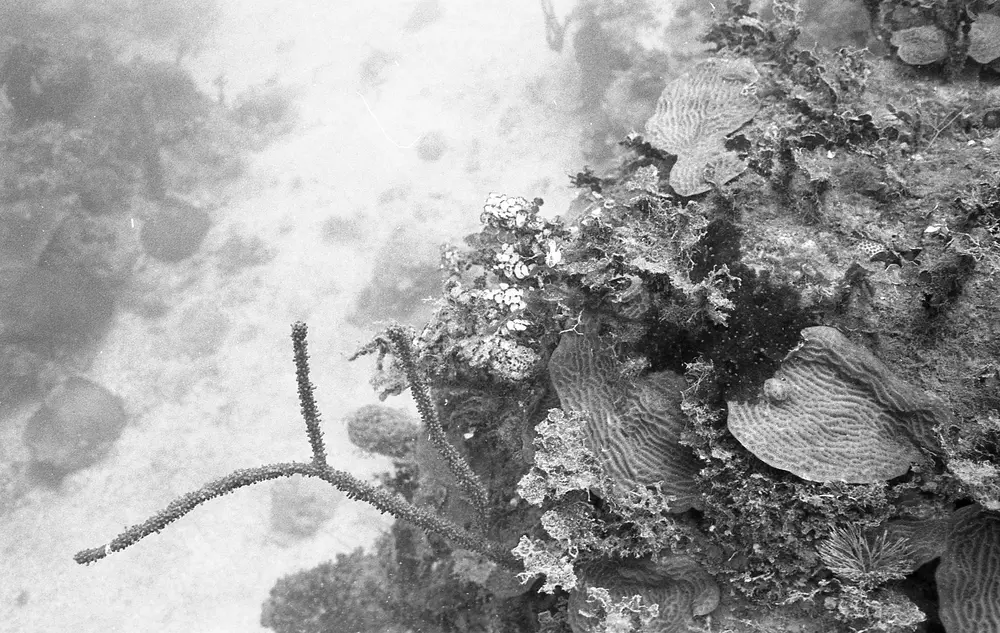{.lightbox group="discovery-bay-1966" description="**UUID: **b34f2474-3f81-45b5-b2a2-d4d2b58cc2a4 **Date: **1967-05-08 **Location: **Jamaica | Discovery Bay | Rendezvous de Terrier **Longitude: **76.886ºW **Latitude: **18.399ºN **Photographer: **Eileen Graham **Copyright: **Trustees of the Natural History Museum (London, UK), CC-BY-4.0" alt="**UUID: **b34f2474-3f81-45b5-b2a2-d4d2b58cc2a4 **Date: **1967-05-08 **Location: **Jamaica | Discovery Bay | Rendezvous de Terrier **Longitude: **76.886ºW **Latitude: **18.399ºN **Photographer: **Eileen Graham **Copyright: **Trustees of the Natural History Museum (London, UK), CC-BY-4.0"}

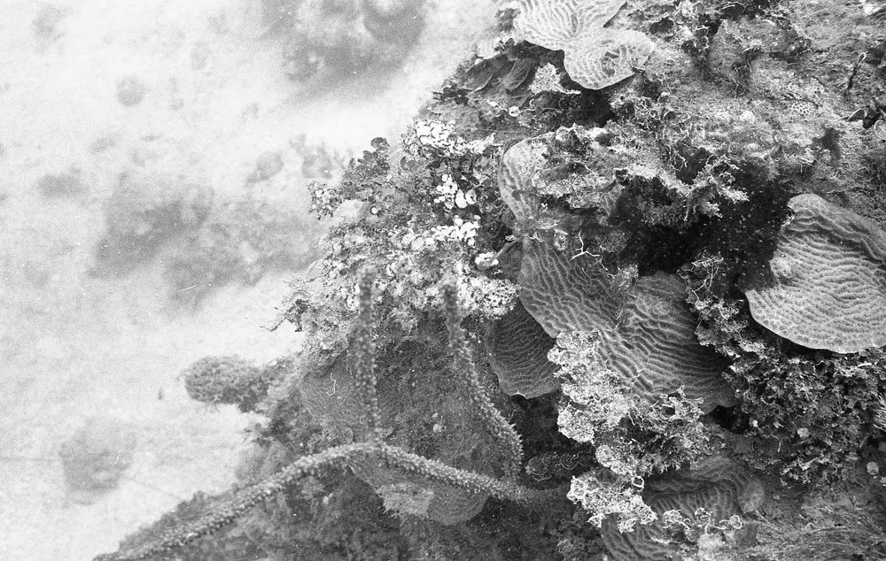{.lightbox group="discovery-bay-1966" description="**UUID: **c1ad9b29-deaa-4ab7-984c-45842964b91c **Date: **1967-05-08 **Location: **Jamaica | Discovery Bay | Rendezvous de Terrier **Longitude: **76.886ºW **Latitude: **18.399ºN **Photographer: **Eileen Graham **Copyright: **Trustees of the Natural History Museum (London, UK), CC-BY-4.0" alt="**UUID: **c1ad9b29-deaa-4ab7-984c-45842964b91c **Date: **1967-05-08 **Location: **Jamaica | Discovery Bay | Rendezvous de Terrier **Longitude: **76.886ºW **Latitude: **18.399ºN **Photographer: **Eileen Graham **Copyright: **Trustees of the Natural History Museum (London, UK), CC-BY-4.0"}

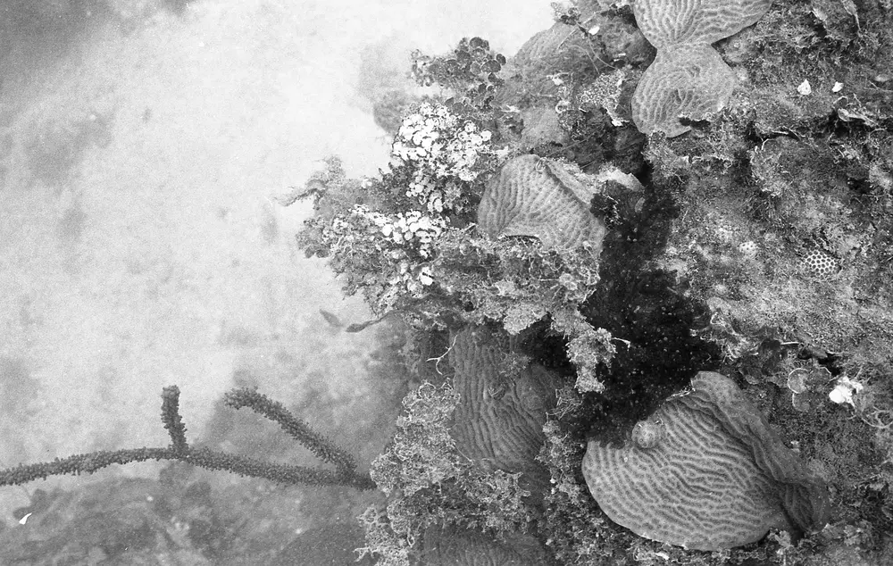{.lightbox group="discovery-bay-1966" description="**UUID: **691561c5-685e-4c69-b2fe-57865b149cc9 **Date: **1967-05-08 **Location: **Jamaica | Discovery Bay | Rendezvous de Terrier **Longitude: **76.886ºW **Latitude: **18.399ºN **Photographer: **Eileen Graham **Copyright: **Trustees of the Natural History Museum (London, UK), CC-BY-4.0" alt="**UUID: **691561c5-685e-4c69-b2fe-57865b149cc9 **Date: **1967-05-08 **Location: **Jamaica | Discovery Bay | Rendezvous de Terrier **Longitude: **76.886ºW **Latitude: **18.399ºN **Photographer: **Eileen Graham **Copyright: **Trustees of the Natural History Museum (London, UK), CC-BY-4.0"}

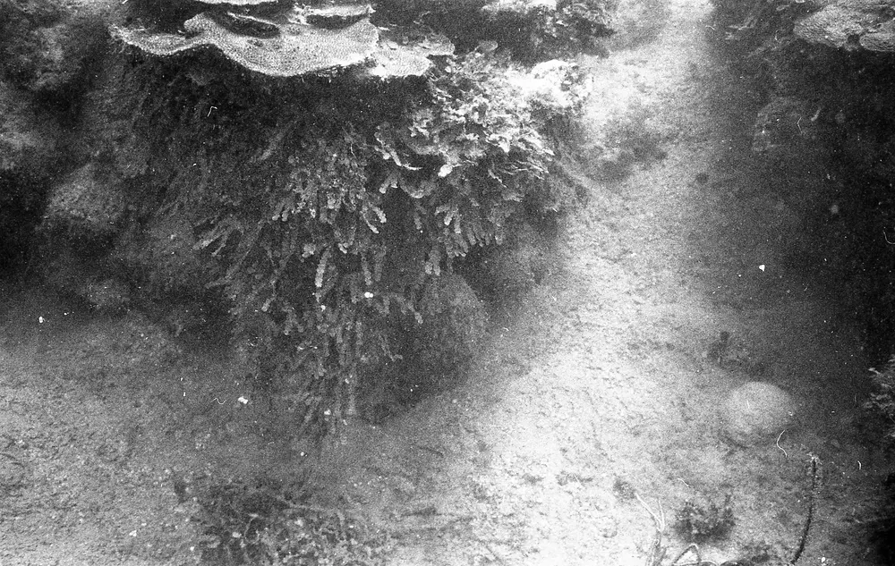{.lightbox group="discovery-bay-1966" description="**UUID: **9bda1a86-c54e-40ca-b6a9-2e71b40dfc4e **Date: **1967-05-08 **Location: **Jamaica | Discovery Bay | Rendezvous de Terrier **Longitude: **76.886ºW **Latitude: **18.399ºN **Photographer: **Eileen Graham **Copyright: **Trustees of the Natural History Museum (London, UK), CC-BY-4.0" alt="**UUID: **9bda1a86-c54e-40ca-b6a9-2e71b40dfc4e **Date: **1967-05-08 **Location: **Jamaica | Discovery Bay | Rendezvous de Terrier **Longitude: **76.886ºW **Latitude: **18.399ºN **Photographer: **Eileen Graham **Copyright: **Trustees of the Natural History Museum (London, UK), CC-BY-4.0"}

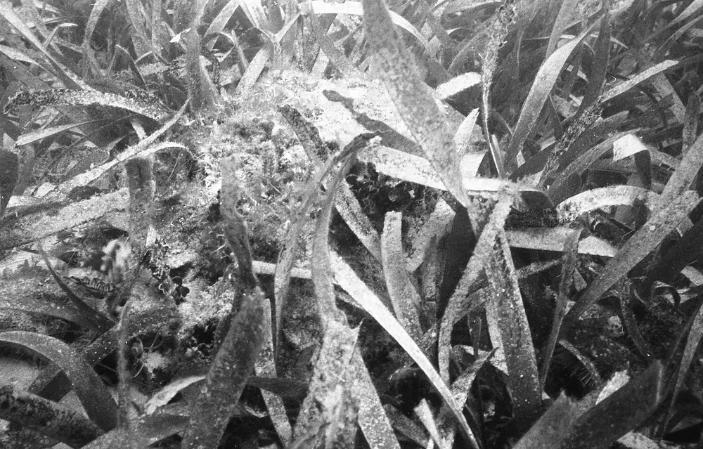{.lightbox group="discovery-bay-1966" description="**UUID: **af4172c6-877f-45e3-ac96-fdffc8e5ca57 **Date: **1966-08-26 **Location: **Jamaica | Discovery Bay | Discovery Bay Purden House **Longitude: **77.40268ºW **Latitude: **18.46868ºN **Photographer: **Eileen Graham **Copyright: **Trustees of the Natural History Museum (London, UK), CC-BY-4.0" alt="**UUID: **af4172c6-877f-45e3-ac96-fdffc8e5ca57 **Date: **1966-08-26 **Location: **Jamaica | Discovery Bay | Discovery Bay Purden House **Longitude: **77.40268ºW **Latitude: **18.46868ºN **Photographer: **Eileen Graham **Copyright: **Trustees of the Natural History Museum (London, UK), CC-BY-4.0"}

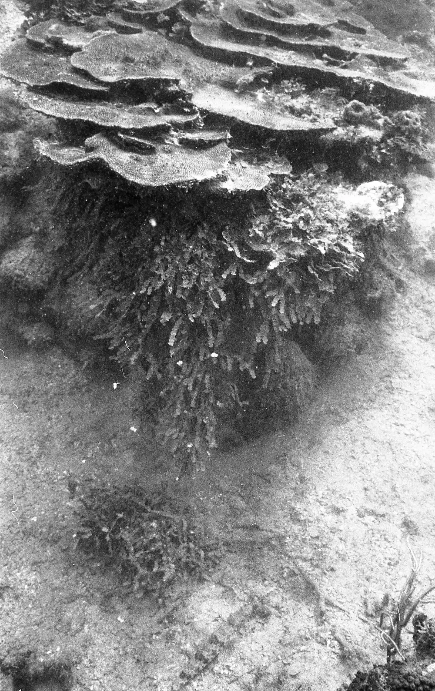{.lightbox group="discovery-bay-1966" description="**UUID: **fc10feb6-463c-4e2a-bfbc-103a991b63cb **Date: **1967-05-08 **Location: **Jamaica | Discovery Bay | Rendezvous de Terrier **Longitude: **76.886ºW **Latitude: **18.399ºN **Photographer: **Eileen Graham **Copyright: **Trustees of the Natural History Museum (London, UK), CC-BY-4.0" alt="**UUID: **fc10feb6-463c-4e2a-bfbc-103a991b63cb **Date: **1967-05-08 **Location: **Jamaica | Discovery Bay | Rendezvous de Terrier **Longitude: **76.886ºW **Latitude: **18.399ºN **Photographer: **Eileen Graham **Copyright: **Trustees of the Natural History Museum (London, UK), CC-BY-4.0"}

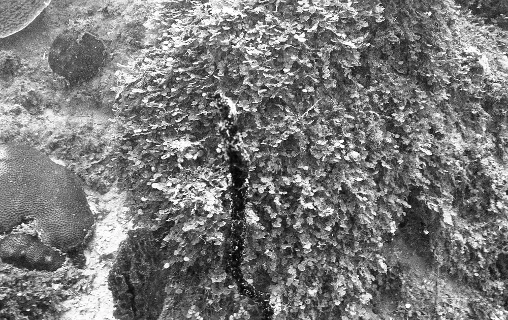{.lightbox group="discovery-bay-1966" description="**UUID: **8bf57265-41c9-4847-8eda-ce48f8ae23fa **Date: **1967-05-08 **Location: **Jamaica | Discovery Bay | Rendezvous de Terrier **Longitude: **76.886ºW **Latitude: **18.399ºN **Photographer: **Eileen Graham **Copyright: **Trustees of the Natural History Museum (London, UK), CC-BY-4.0" alt="**UUID: **8bf57265-41c9-4847-8eda-ce48f8ae23fa **Date: **1967-05-08 **Location: **Jamaica | Discovery Bay | Rendezvous de Terrier **Longitude: **76.886ºW **Latitude: **18.399ºN **Photographer: **Eileen Graham **Copyright: **Trustees of the Natural History Museum (London, UK), CC-BY-4.0"}

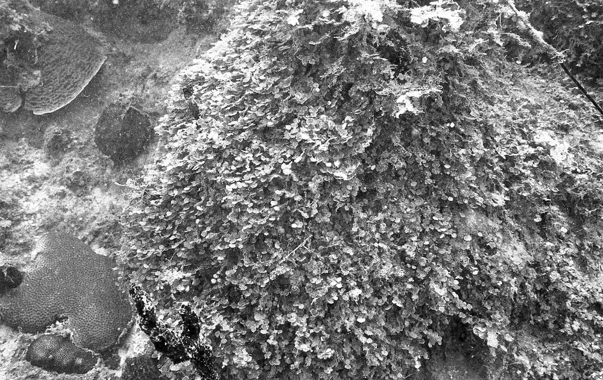{.lightbox group="discovery-bay-1966" description="**UUID: **cad426b5-5ffa-4cde-9f3e-fb4920d02b0c **Date: **1967-05-08 **Location: **Jamaica | Discovery Bay | Rendezvous de Terrier **Longitude: **76.886ºW **Latitude: **18.399ºN **Photographer: **Eileen Graham **Copyright: **Trustees of the Natural History Museum (London, UK), CC-BY-4.0" alt="**UUID: **cad426b5-5ffa-4cde-9f3e-fb4920d02b0c **Date: **1967-05-08 **Location: **Jamaica | Discovery Bay | Rendezvous de Terrier **Longitude: **76.886ºW **Latitude: **18.399ºN **Photographer: **Eileen Graham **Copyright: **Trustees of the Natural History Museum (London, UK), CC-BY-4.0"}

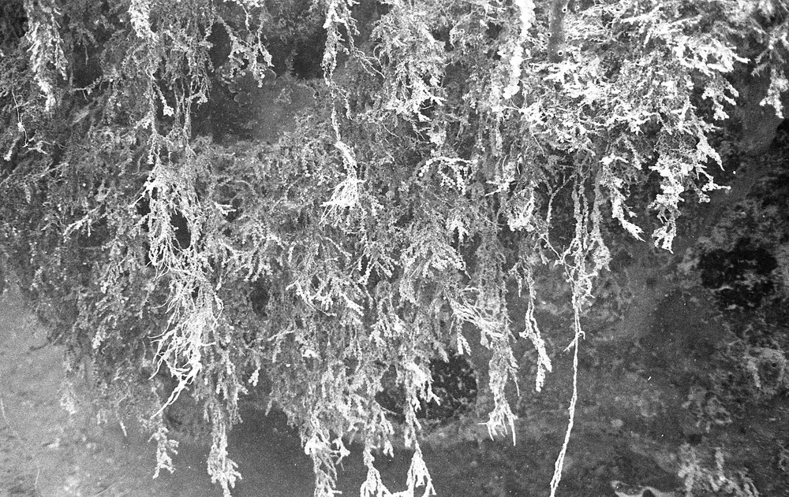{.lightbox group="discovery-bay-1966" description="**UUID: **863b004e-5084-4784-babe-5eeff255905c **Date: **1967-05-08 **Location: **Jamaica | Discovery Bay | Rendezvous de Terrier **Longitude: **76.886ºW **Latitude: **18.399ºN **Photographer: **Eileen Graham **Copyright: **Trustees of the Natural History Museum (London, UK), CC-BY-4.0" alt="**UUID: **863b004e-5084-4784-babe-5eeff255905c **Date: **1967-05-08 **Location: **Jamaica | Discovery Bay | Rendezvous de Terrier **Longitude: **76.886ºW **Latitude: **18.399ºN **Photographer: **Eileen Graham **Copyright: **Trustees of the Natural History Museum (London, UK), CC-BY-4.0"}

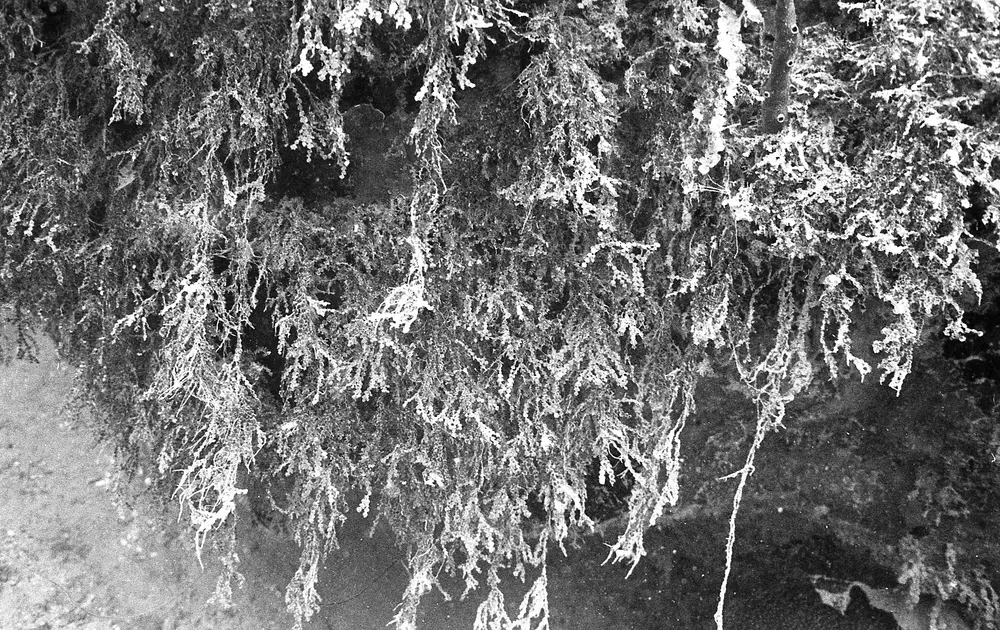{.lightbox group="discovery-bay-1966" description="**UUID: **7a4f2380-cf9d-4306-9e6d-1edf7ef1cd7a **Date: **1967-05-08 **Location: **Jamaica | Discovery Bay | Rendezvous de Terrier **Longitude: **76.886ºW **Latitude: **18.399ºN **Photographer: **Eileen Graham **Copyright: **Trustees of the Natural History Museum (London, UK), CC-BY-4.0" alt="**UUID: **7a4f2380-cf9d-4306-9e6d-1edf7ef1cd7a **Date: **1967-05-08 **Location: **Jamaica | Discovery Bay | Rendezvous de Terrier **Longitude: **76.886ºW **Latitude: **18.399ºN **Photographer: **Eileen Graham **Copyright: **Trustees of the Natural History Museum (London, UK), CC-BY-4.0"}

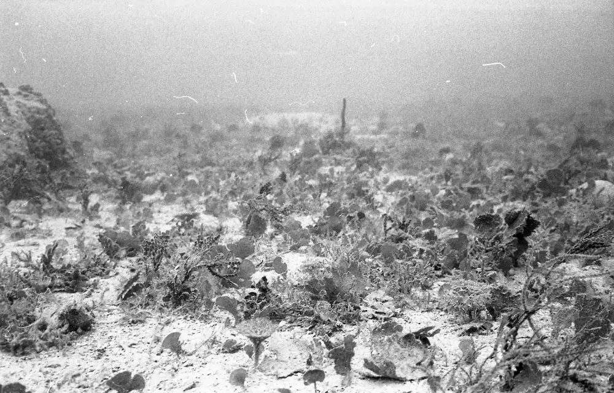{.lightbox group="discovery-bay-1966" description="**UUID: **8f8f09c1-d248-4b88-a185-cabe353a1644 **Date: **1967-05-08 **Location: **Jamaica | Discovery Bay | Rendezvous de Terrier **Longitude: **76.886ºW **Latitude: **18.399ºN **Photographer: **Eileen Graham **Copyright: **Trustees of the Natural History Museum (London, UK), CC-BY-4.0" alt="**UUID: **8f8f09c1-d248-4b88-a185-cabe353a1644 **Date: **1967-05-08 **Location: **Jamaica | Discovery Bay | Rendezvous de Terrier **Longitude: **76.886ºW **Latitude: **18.399ºN **Photographer: **Eileen Graham **Copyright: **Trustees of the Natural History Museum (London, UK), CC-BY-4.0"}

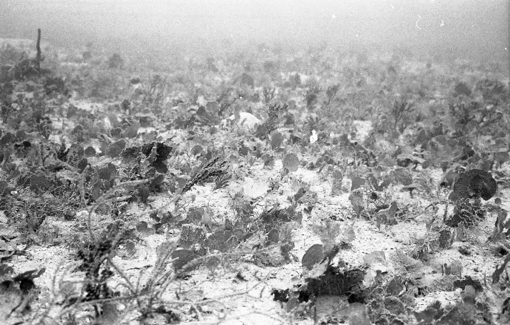{.lightbox group="discovery-bay-1966" description="**UUID: **de9e9796-f2af-429d-b82f-6350d9ad5194 **Date: **1967-05-08 **Location: **Jamaica | Discovery Bay | Rendezvous de Terrier **Longitude: **76.886ºW **Latitude: **18.399ºN **Photographer: **Eileen Graham **Copyright: **Trustees of the Natural History Museum (London, UK), CC-BY-4.0" alt="**UUID: **de9e9796-f2af-429d-b82f-6350d9ad5194 **Date: **1967-05-08 **Location: **Jamaica | Discovery Bay | Rendezvous de Terrier **Longitude: **76.886ºW **Latitude: **18.399ºN **Photographer: **Eileen Graham **Copyright: **Trustees of the Natural History Museum (London, UK), CC-BY-4.0"}

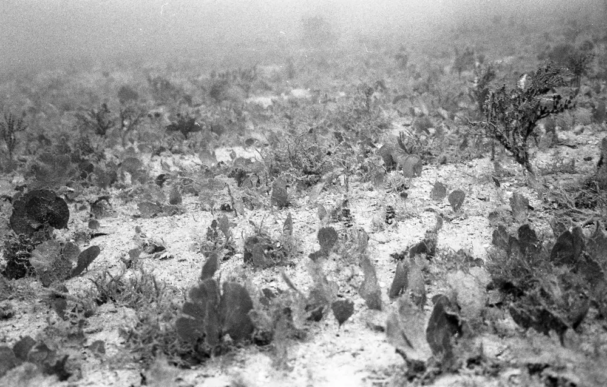{.lightbox group="discovery-bay-1966" description="**UUID: **b09db35e-da0b-4863-8315-d2f3ea3b5049 **Date: **1967-05-08 **Location: **Jamaica | Discovery Bay | Rendezvous de Terrier **Longitude: **76.886ºW **Latitude: **18.399ºN **Photographer: **Eileen Graham **Copyright: **Trustees of the Natural History Museum (London, UK), CC-BY-4.0" alt="**UUID: **b09db35e-da0b-4863-8315-d2f3ea3b5049 **Date: **1967-05-08 **Location: **Jamaica | Discovery Bay | Rendezvous de Terrier **Longitude: **76.886ºW **Latitude: **18.399ºN **Photographer: **Eileen Graham **Copyright: **Trustees of the Natural History Museum (London, UK), CC-BY-4.0"}

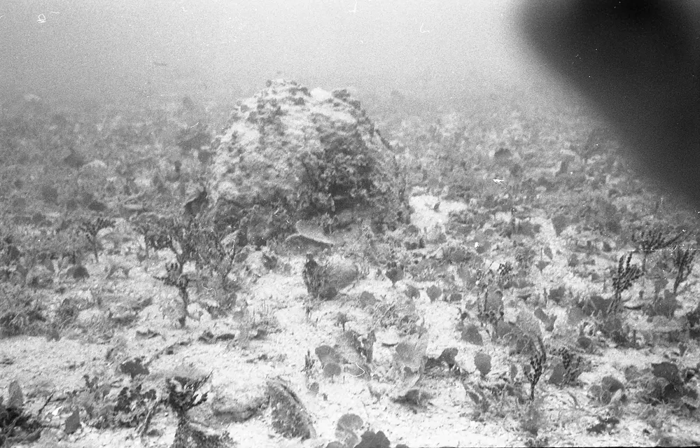{.lightbox group="discovery-bay-1966" description="**UUID: **3bbe62ac-cff7-407f-bc61-94a0f32ec0cc **Date: **1967-05-08 **Location: **Jamaica | Discovery Bay | Rendezvous de Terrier **Longitude: **76.886ºW **Latitude: **18.399ºN **Photographer: **Eileen Graham **Copyright: **Trustees of the Natural History Museum (London, UK), CC-BY-4.0" alt="**UUID: **3bbe62ac-cff7-407f-bc61-94a0f32ec0cc **Date: **1967-05-08 **Location: **Jamaica | Discovery Bay | Rendezvous de Terrier **Longitude: **76.886ºW **Latitude: **18.399ºN **Photographer: **Eileen Graham **Copyright: **Trustees of the Natural History Museum (London, UK), CC-BY-4.0"}

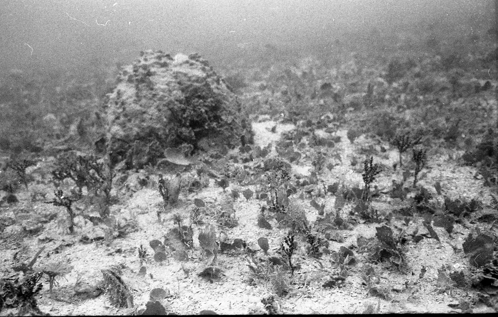{.lightbox group="discovery-bay-1966" description="**UUID: **192692cb-e2af-4e58-8615-5f45f9b27493 **Date: **1967-05-08 **Location: **Jamaica | Discovery Bay | Rendezvous de Terrier **Longitude: **76.886ºW **Latitude: **18.399ºN **Photographer: **Eileen Graham **Copyright: **Trustees of the Natural History Museum (London, UK), CC-BY-4.0" alt="**UUID: **192692cb-e2af-4e58-8615-5f45f9b27493 **Date: **1967-05-08 **Location: **Jamaica | Discovery Bay | Rendezvous de Terrier **Longitude: **76.886ºW **Latitude: **18.399ºN **Photographer: **Eileen Graham **Copyright: **Trustees of the Natural History Museum (London, UK), CC-BY-4.0"}

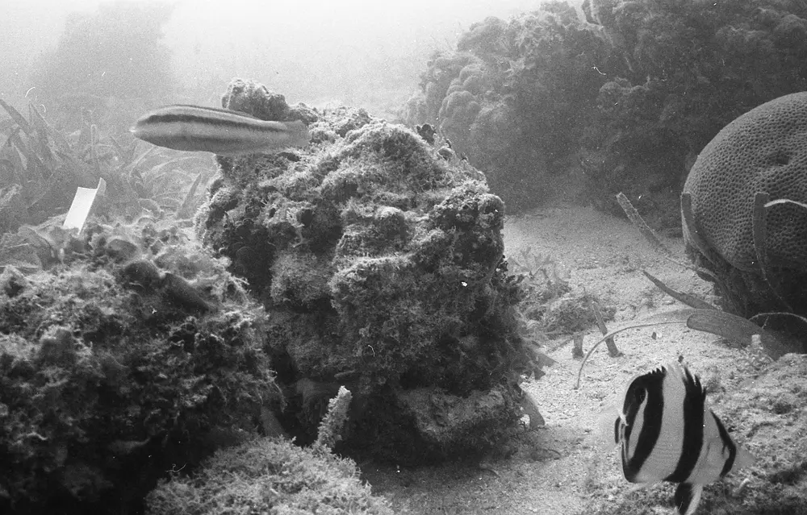{.lightbox group="discovery-bay-1966" description="**UUID: **57aec77e-af18-4930-ac21-90199ce93f01 **Date: **1966-08-26 **Location: **Jamaica | Discovery Bay | Discovery Bay Purden House **Longitude: **77.40268ºW **Latitude: **18.46868ºN **Photographer: **Eileen Graham **Copyright: **Trustees of the Natural History Museum (London, UK), CC-BY-4.0" alt="**UUID: **57aec77e-af18-4930-ac21-90199ce93f01 **Date: **1966-08-26 **Location: **Jamaica | Discovery Bay | Discovery Bay Purden House **Longitude: **77.40268ºW **Latitude: **18.46868ºN **Photographer: **Eileen Graham **Copyright: **Trustees of the Natural History Museum (London, UK), CC-BY-4.0"}

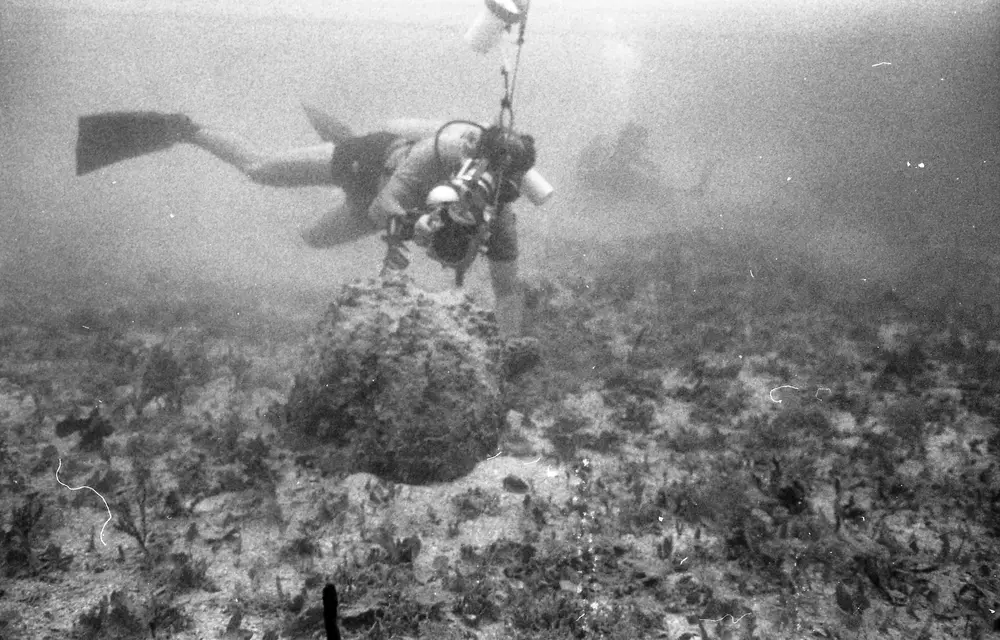{.lightbox group="discovery-bay-1966" description="**UUID: **87dce2b7-ff45-48e9-b71d-eebbb6bc19c2 **Date: **1967-05-08 **Location: **Jamaica | Discovery Bay | Rendezvous de Terrier **Longitude: **76.886ºW **Latitude: **18.399ºN **Photographer: **Eileen Graham **Copyright: **Trustees of the Natural History Museum (London, UK), CC-BY-4.0" alt="**UUID: **87dce2b7-ff45-48e9-b71d-eebbb6bc19c2 **Date: **1967-05-08 **Location: **Jamaica | Discovery Bay | Rendezvous de Terrier **Longitude: **76.886ºW **Latitude: **18.399ºN **Photographer: **Eileen Graham **Copyright: **Trustees of the Natural History Museum (London, UK), CC-BY-4.0"}

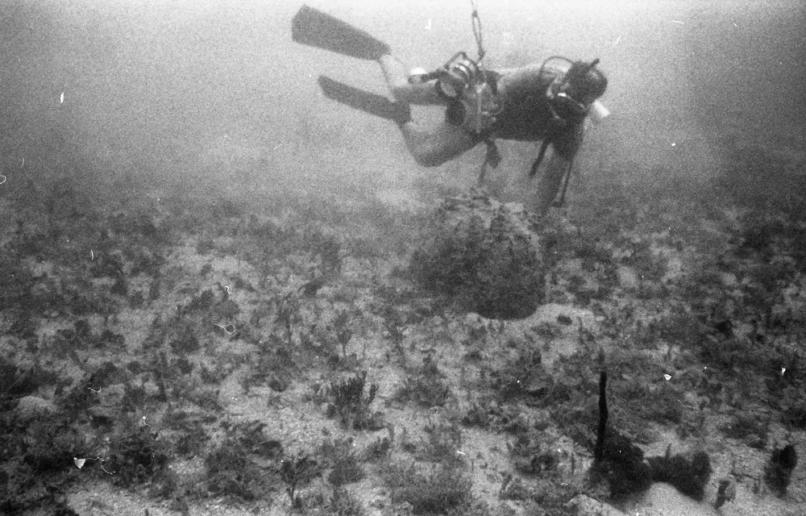{.lightbox group="discovery-bay-1966" description="**UUID: **4eb82557-27d5-4a1f-ad6a-063893dd8814 **Date: **1967-05-08 **Location: **Jamaica | Discovery Bay | Rendezvous de Terrier **Longitude: **76.886ºW **Latitude: **18.399ºN **Photographer: **Eileen Graham **Copyright: **Trustees of the Natural History Museum (London, UK), CC-BY-4.0" alt="**UUID: **4eb82557-27d5-4a1f-ad6a-063893dd8814 **Date: **1967-05-08 **Location: **Jamaica | Discovery Bay | Rendezvous de Terrier **Longitude: **76.886ºW **Latitude: **18.399ºN **Photographer: **Eileen Graham **Copyright: **Trustees of the Natural History Museum (London, UK), CC-BY-4.0"}

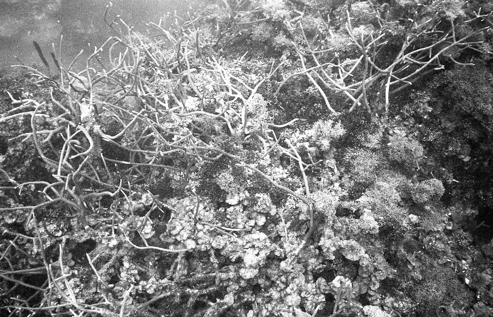{.lightbox group="discovery-bay-1966" description="**UUID: **2e933e84-0b55-4411-bd50-2bc1f729fff5 **Date: **1967-05-08 **Location: **Jamaica | Discovery Bay | Rendezvous de Terrier **Longitude: **76.886ºW **Latitude: **18.399ºN **Photographer: **Eileen Graham **Copyright: **Trustees of the Natural History Museum (London, UK), CC-BY-4.0" alt="**UUID: **2e933e84-0b55-4411-bd50-2bc1f729fff5 **Date: **1967-05-08 **Location: **Jamaica | Discovery Bay | Rendezvous de Terrier **Longitude: **76.886ºW **Latitude: **18.399ºN **Photographer: **Eileen Graham **Copyright: **Trustees of the Natural History Museum (London, UK), CC-BY-4.0"}

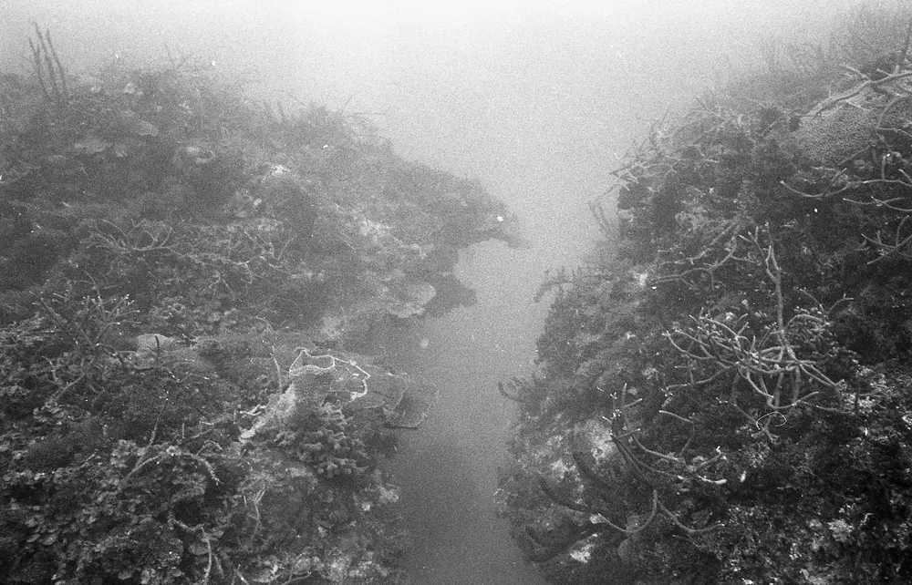{.lightbox group="discovery-bay-1966" description="**UUID: **6d96fbd7-69b2-4629-b391-729f087dc477 **Date: **1967-05-08 **Location: **Jamaica | Discovery Bay | Rendezvous de Terrier **Longitude: **76.886ºW **Latitude: **18.399ºN **Photographer: **Eileen Graham **Copyright: **Trustees of the Natural History Museum (London, UK), CC-BY-4.0" alt="**UUID: **6d96fbd7-69b2-4629-b391-729f087dc477 **Date: **1967-05-08 **Location: **Jamaica | Discovery Bay | Rendezvous de Terrier **Longitude: **76.886ºW **Latitude: **18.399ºN **Photographer: **Eileen Graham **Copyright: **Trustees of the Natural History Museum (London, UK), CC-BY-4.0"}

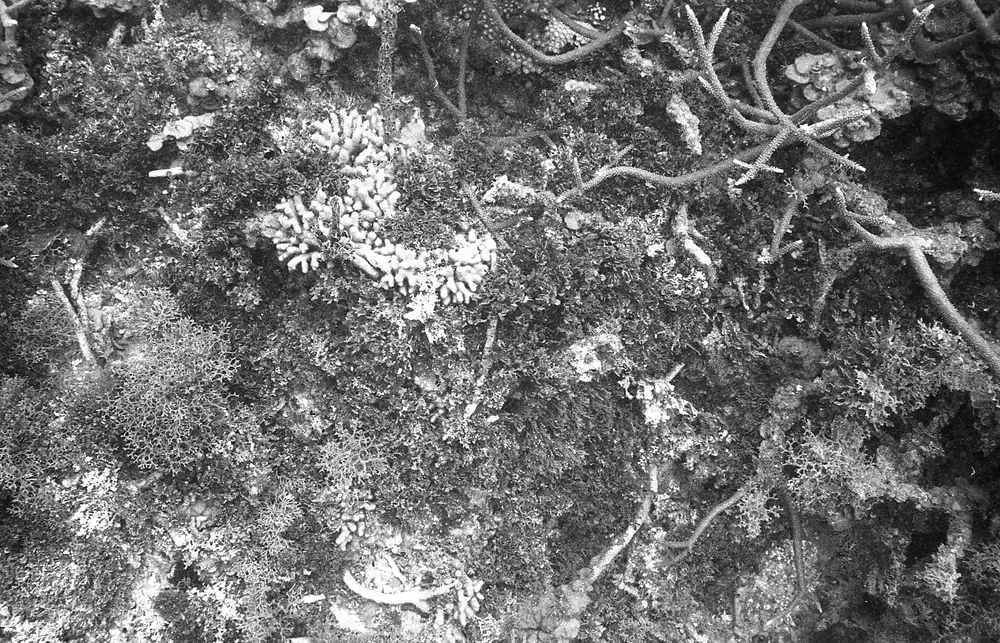{.lightbox group="discovery-bay-1966" description="**UUID: **b8acd91a-277b-448d-9d53-0a82b2b22262 **Date: **1967-05-08 **Location: **Jamaica | Discovery Bay | Rendezvous de Terrier **Longitude: **76.886ºW **Latitude: **18.399ºN **Photographer: **Eileen Graham **Copyright: **Trustees of the Natural History Museum (London, UK), CC-BY-4.0" alt="**UUID: **b8acd91a-277b-448d-9d53-0a82b2b22262 **Date: **1967-05-08 **Location: **Jamaica | Discovery Bay | Rendezvous de Terrier **Longitude: **76.886ºW **Latitude: **18.399ºN **Photographer: **Eileen Graham **Copyright: **Trustees of the Natural History Museum (London, UK), CC-BY-4.0"}

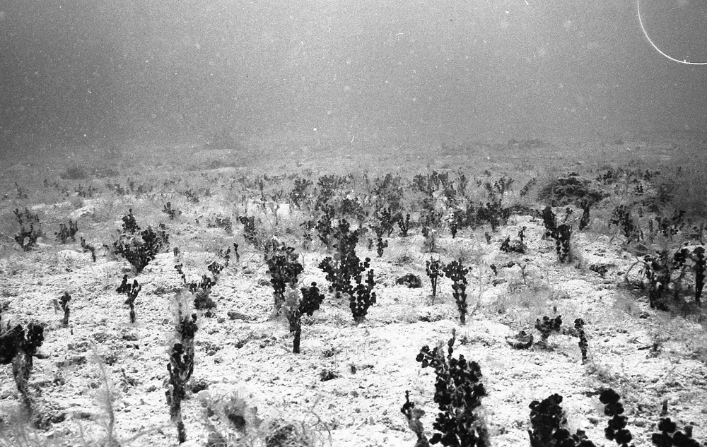{.lightbox group="discovery-bay-1966" description="**UUID: **936aadfd-d0bb-44f9-b5ed-5ec101d6b683 **Date: **1967-02-09 **Location: **Jamaica | Discovery Bay | Algal Plots **Longitude: **77.414ºW **Latitude: **18.473ºN **Photographer: **Eileen Graham **Copyright: **Trustees of the Natural History Museum (London, UK), CC-BY-4.0" alt="**UUID: **936aadfd-d0bb-44f9-b5ed-5ec101d6b683 **Date: **1967-02-09 **Location: **Jamaica | Discovery Bay | Algal Plots **Longitude: **77.414ºW **Latitude: **18.473ºN **Photographer: **Eileen Graham **Copyright: **Trustees of the Natural History Museum (London, UK), CC-BY-4.0"}

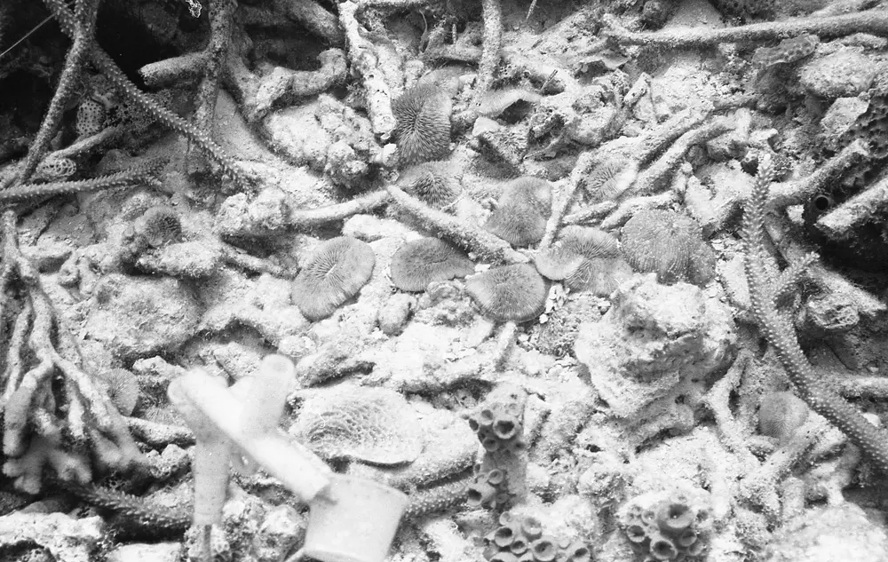{.lightbox group="discovery-bay-1966" description="**UUID: **6eac2a74-fa8a-4e18-9308-d9e83f63bbd7 **Date: **1967-02-09 **Location: **Jamaica | Discovery Bay | Buoy Upper Slope **Longitude: **77.40908ºW **Latitude: **18.47322ºN **Photographer: **Eileen Graham **Copyright: **Trustees of the Natural History Museum (London, UK), CC-BY-4.0" alt="**UUID: **6eac2a74-fa8a-4e18-9308-d9e83f63bbd7 **Date: **1967-02-09 **Location: **Jamaica | Discovery Bay | Buoy Upper Slope **Longitude: **77.40908ºW **Latitude: **18.47322ºN **Photographer: **Eileen Graham **Copyright: **Trustees of the Natural History Museum (London, UK), CC-BY-4.0"}

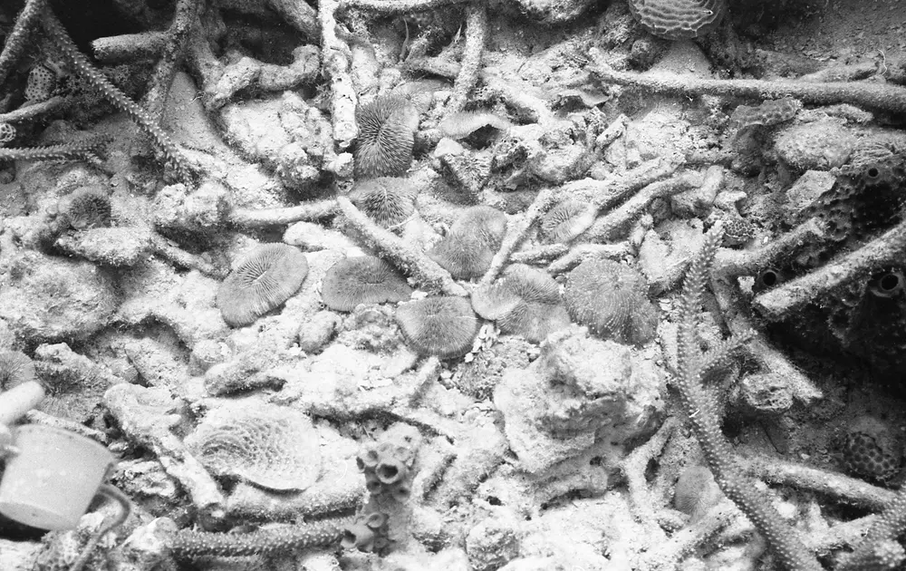{.lightbox group="discovery-bay-1966" description="**UUID: **f6b96088-8a15-430c-934a-9eef07596266 **Date: **1967-02-09 **Location: **Jamaica | Discovery Bay | Buoy Upper Slope **Longitude: **77.40908ºW **Latitude: **18.47322ºN **Photographer: **Eileen Graham **Copyright: **Trustees of the Natural History Museum (London, UK), CC-BY-4.0" alt="**UUID: **f6b96088-8a15-430c-934a-9eef07596266 **Date: **1967-02-09 **Location: **Jamaica | Discovery Bay | Buoy Upper Slope **Longitude: **77.40908ºW **Latitude: **18.47322ºN **Photographer: **Eileen Graham **Copyright: **Trustees of the Natural History Museum (London, UK), CC-BY-4.0"}

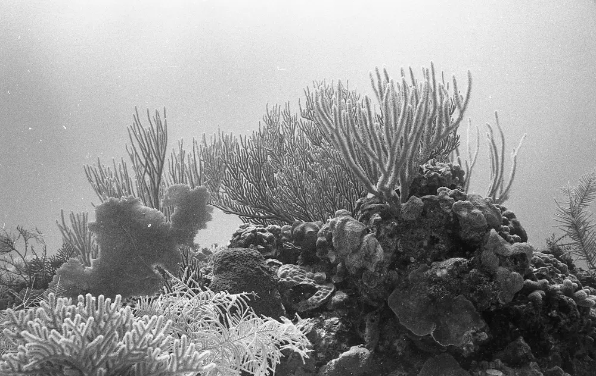{.lightbox group="discovery-bay-1966" description="**UUID: **eacb8255-efbc-44c4-a139-1193736e7ea3 **Date: **1967-02-09 **Location: **Jamaica | Discovery Bay | Buoy Upper Slope **Longitude: **77.40908ºW **Latitude: **18.47322ºN **Photographer: **Eileen Graham **Copyright: **Trustees of the Natural History Museum (London, UK), CC-BY-4.0" alt="**UUID: **eacb8255-efbc-44c4-a139-1193736e7ea3 **Date: **1967-02-09 **Location: **Jamaica | Discovery Bay | Buoy Upper Slope **Longitude: **77.40908ºW **Latitude: **18.47322ºN **Photographer: **Eileen Graham **Copyright: **Trustees of the Natural History Museum (London, UK), CC-BY-4.0"}

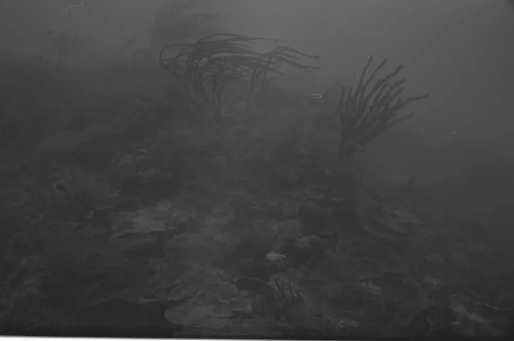{.lightbox group="discovery-bay-1966" description="**UUID: **6606676e-9b9a-47f3-ab15-0385cc311abf **Date: **1966-04-27 **Location: **Jamaica | Discovery Bay | Buoy Upper Slope **Longitude: **77.40908ºW **Latitude: **18.47322ºN **Photographer: **Eileen Graham **Copyright: **Trustees of the Natural History Museum (London, UK), CC-BY-4.0" alt="**UUID: **6606676e-9b9a-47f3-ab15-0385cc311abf **Date: **1966-04-27 **Location: **Jamaica | Discovery Bay | Buoy Upper Slope **Longitude: **77.40908ºW **Latitude: **18.47322ºN **Photographer: **Eileen Graham **Copyright: **Trustees of the Natural History Museum (London, UK), CC-BY-4.0"}

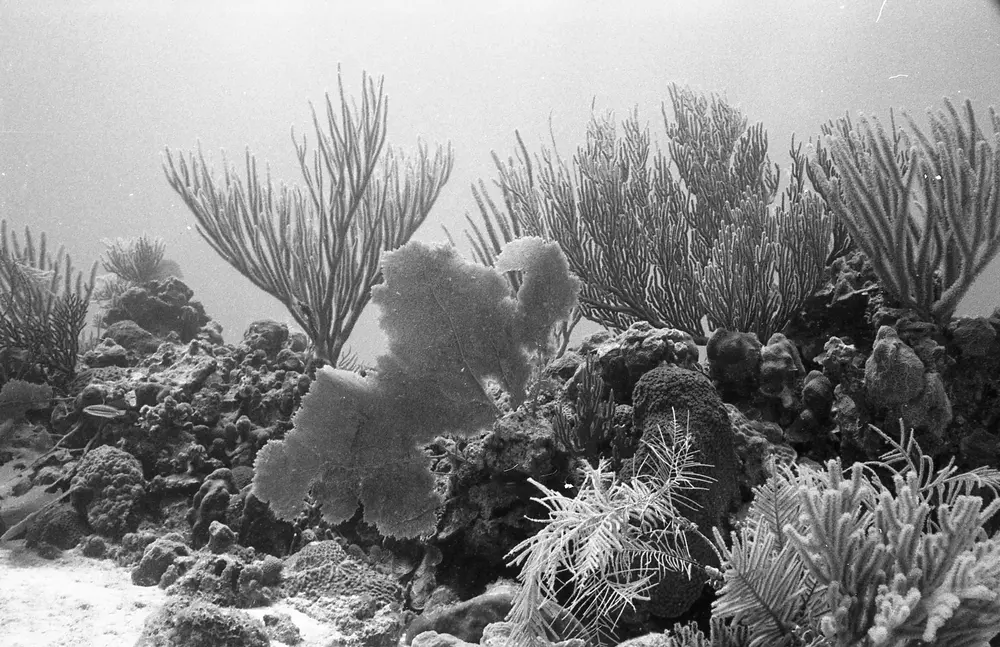{.lightbox group="discovery-bay-1966" description="**UUID: **0543b247-fb1f-4539-901f-fd75be6ad587 **Date: **1967-05-10 **Location: **Jamaica | Discovery Bay | Buoy Upper Slope **Longitude: **77.40908ºW **Latitude: **18.47322ºN **Photographer: **Eileen Graham **Copyright: **Trustees of the Natural History Museum (London, UK), CC-BY-4.0" alt="**UUID: **0543b247-fb1f-4539-901f-fd75be6ad587 **Date: **1967-05-10 **Location: **Jamaica | Discovery Bay | Buoy Upper Slope **Longitude: **77.40908ºW **Latitude: **18.47322ºN **Photographer: **Eileen Graham **Copyright: **Trustees of the Natural History Museum (London, UK), CC-BY-4.0"}

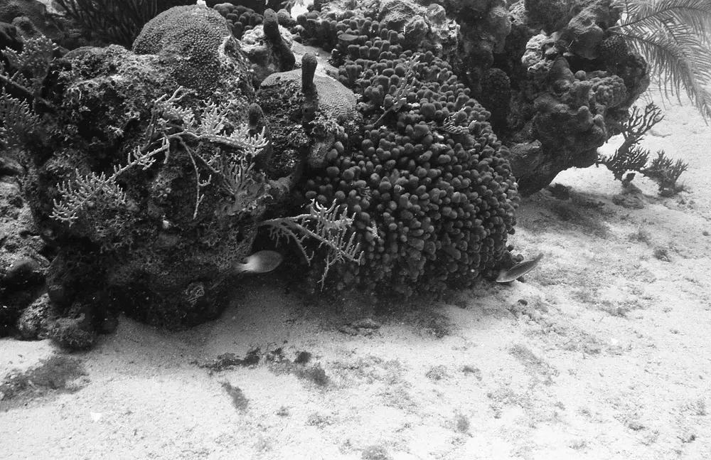{.lightbox group="discovery-bay-1966" description="**UUID: **e6cfa206-5519-4b06-afe6-48e515f3f98b **Date: **1967-05-10 **Location: **Jamaica | Discovery Bay | Buoy Upper Slope **Longitude: **77.40908ºW **Latitude: **18.47322ºN **Photographer: **Eileen Graham **Copyright: **Trustees of the Natural History Museum (London, UK), CC-BY-4.0" alt="**UUID: **e6cfa206-5519-4b06-afe6-48e515f3f98b **Date: **1967-05-10 **Location: **Jamaica | Discovery Bay | Buoy Upper Slope **Longitude: **77.40908ºW **Latitude: **18.47322ºN **Photographer: **Eileen Graham **Copyright: **Trustees of the Natural History Museum (London, UK), CC-BY-4.0"}

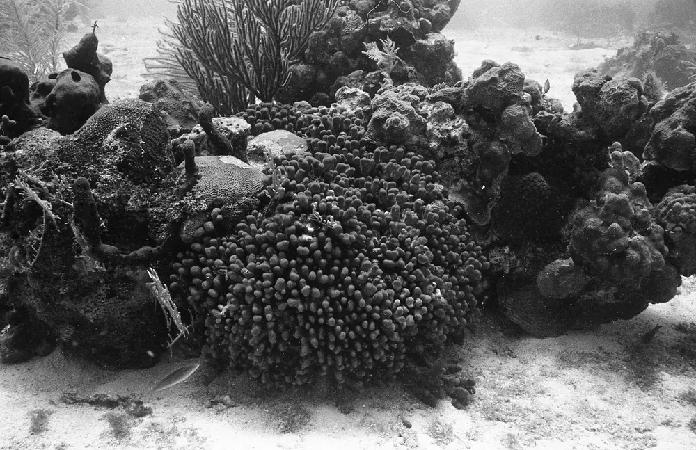{.lightbox group="discovery-bay-1966" description="**UUID: **8a419c6b-1722-4679-8596-a165da1fa574 **Date: **1967-05-10 **Location: **Jamaica | Discovery Bay | Buoy Upper Slope **Longitude: **77.40908ºW **Latitude: **18.47322ºN **Photographer: **Eileen Graham **Copyright: **Trustees of the Natural History Museum (London, UK), CC-BY-4.0" alt="**UUID: **8a419c6b-1722-4679-8596-a165da1fa574 **Date: **1967-05-10 **Location: **Jamaica | Discovery Bay | Buoy Upper Slope **Longitude: **77.40908ºW **Latitude: **18.47322ºN **Photographer: **Eileen Graham **Copyright: **Trustees of the Natural History Museum (London, UK), CC-BY-4.0"}

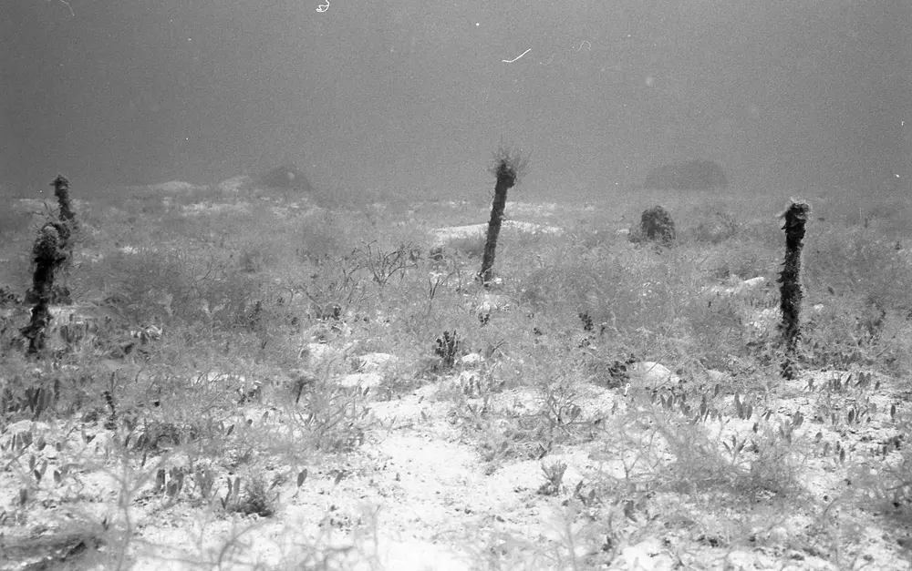{.lightbox group="discovery-bay-1966" description="**UUID: **58176b5f-d229-4679-9b2d-11c819e522e2 **Date: **1967-05-10 **Location: **Jamaica | Discovery Bay | Algal Plots **Longitude: **77.414ºW **Latitude: **18.473ºN **Photographer: **Eileen Graham **Copyright: **Trustees of the Natural History Museum (London, UK), CC-BY-4.0" alt="**UUID: **58176b5f-d229-4679-9b2d-11c819e522e2 **Date: **1967-05-10 **Location: **Jamaica | Discovery Bay | Algal Plots **Longitude: **77.414ºW **Latitude: **18.473ºN **Photographer: **Eileen Graham **Copyright: **Trustees of the Natural History Museum (London, UK), CC-BY-4.0"}

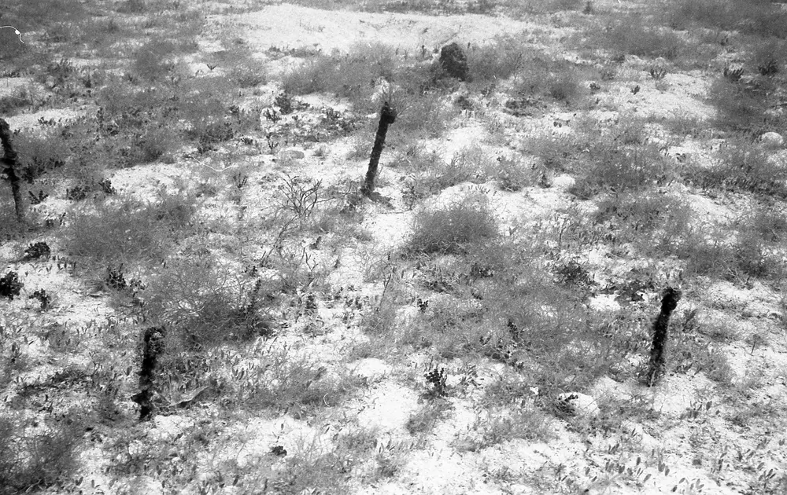{.lightbox group="discovery-bay-1966" description="**UUID: **7723fb16-2043-4e04-87a5-cd4a6a8f54b0 **Date: **1967-05-10 **Location: **Jamaica | Discovery Bay | Algal Plots **Longitude: **77.414ºW **Latitude: **18.473ºN **Photographer: **Eileen Graham **Copyright: **Trustees of the Natural History Museum (London, UK), CC-BY-4.0" alt="**UUID: **7723fb16-2043-4e04-87a5-cd4a6a8f54b0 **Date: **1967-05-10 **Location: **Jamaica | Discovery Bay | Algal Plots **Longitude: **77.414ºW **Latitude: **18.473ºN **Photographer: **Eileen Graham **Copyright: **Trustees of the Natural History Museum (London, UK), CC-BY-4.0"}

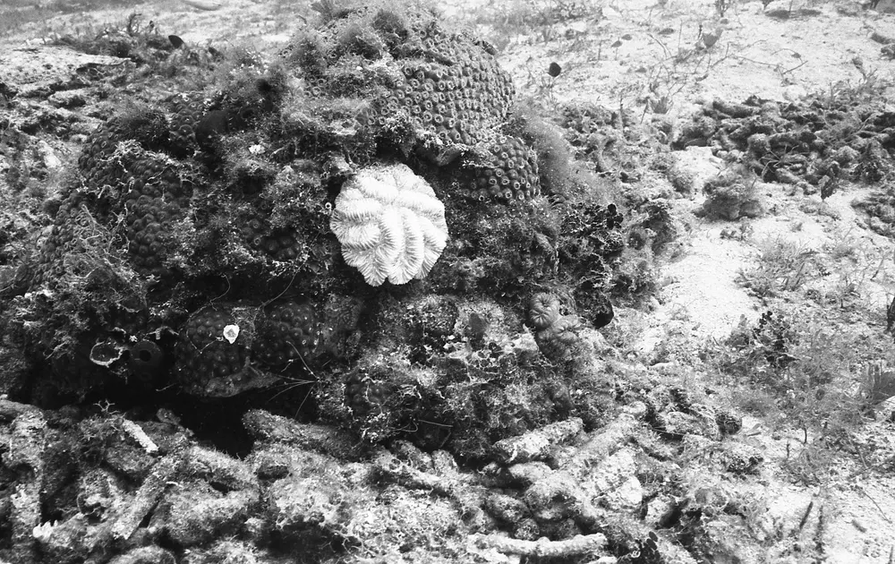{.lightbox group="discovery-bay-1966" description="**UUID: **1cc8e083-cc26-47bb-8d30-1e34ff08fcdc **Date: **1967-05-10 **Location: **Jamaica | Discovery Bay | Algal Plots **Longitude: **77.414ºW **Latitude: **18.473ºN **Photographer: **Eileen Graham **Copyright: **Trustees of the Natural History Museum (London, UK), CC-BY-4.0" alt="**UUID: **1cc8e083-cc26-47bb-8d30-1e34ff08fcdc **Date: **1967-05-10 **Location: **Jamaica | Discovery Bay | Algal Plots **Longitude: **77.414ºW **Latitude: **18.473ºN **Photographer: **Eileen Graham **Copyright: **Trustees of the Natural History Museum (London, UK), CC-BY-4.0"}

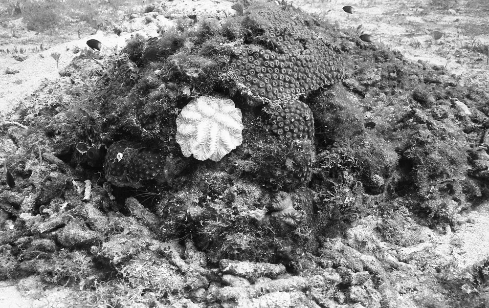{.lightbox group="discovery-bay-1966" description="**UUID: **72a9f608-3431-41fc-957f-f467586fb203 **Date: **1967-05-10 **Location: **Jamaica | Discovery Bay | Algal Plots **Longitude: **77.414ºW **Latitude: **18.473ºN **Photographer: **Eileen Graham **Copyright: **Trustees of the Natural History Museum (London, UK), CC-BY-4.0" alt="**UUID: **72a9f608-3431-41fc-957f-f467586fb203 **Date: **1967-05-10 **Location: **Jamaica | Discovery Bay | Algal Plots **Longitude: **77.414ºW **Latitude: **18.473ºN **Photographer: **Eileen Graham **Copyright: **Trustees of the Natural History Museum (London, UK), CC-BY-4.0"}

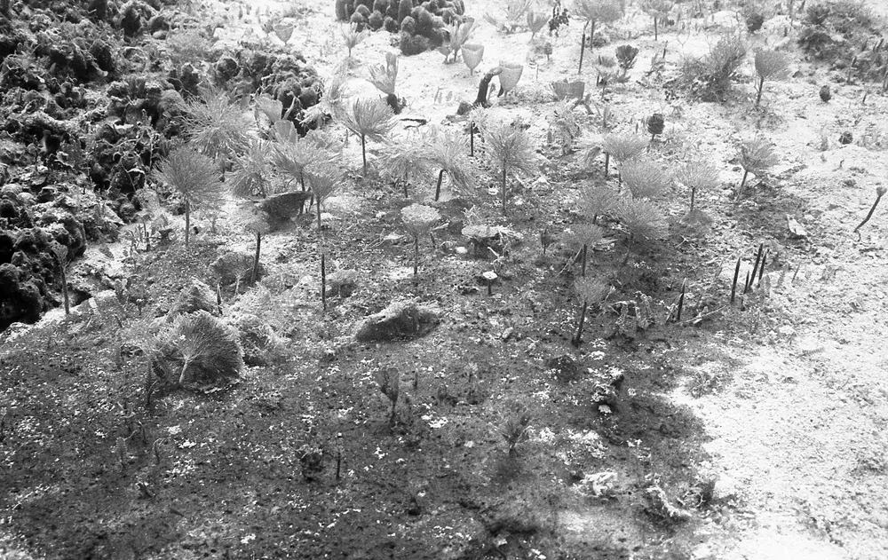{.lightbox group="discovery-bay-1966" description="**UUID: **aae87a40-3afb-4c94-bd5c-dd34e002c498 **Date: **1967-05-10 **Location: **Jamaica | Discovery Bay | Algal Plots **Longitude: **77.414ºW **Latitude: **18.473ºN **Photographer: **Eileen Graham **Copyright: **Trustees of the Natural History Museum (London, UK), CC-BY-4.0" alt="**UUID: **aae87a40-3afb-4c94-bd5c-dd34e002c498 **Date: **1967-05-10 **Location: **Jamaica | Discovery Bay | Algal Plots **Longitude: **77.414ºW **Latitude: **18.473ºN **Photographer: **Eileen Graham **Copyright: **Trustees of the Natural History Museum (London, UK), CC-BY-4.0"}

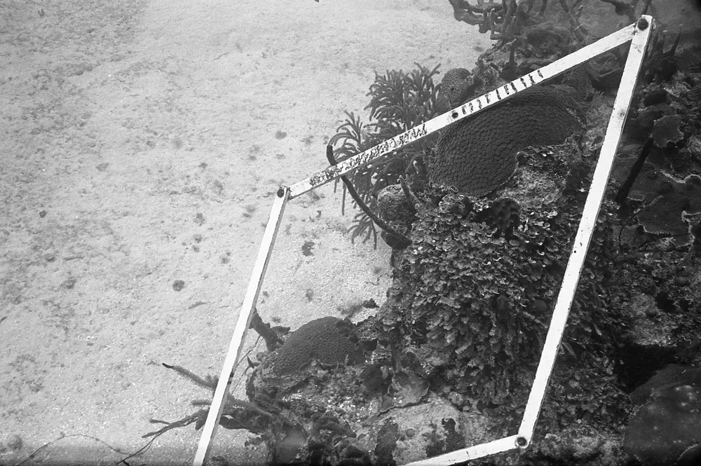{.lightbox group="discovery-bay-1966" description="**UUID: **75f926c4-b022-4ad9-b6f0-62484b0a5f6b **Date: **1966-04-27 **Location: **Jamaica | Discovery Bay | Buoy Upper Slope **Longitude: **77.40908ºW **Latitude: **18.47322ºN **Photographer: **Eileen Graham **Copyright: **Trustees of the Natural History Museum (London, UK), CC-BY-4.0" alt="**UUID: **75f926c4-b022-4ad9-b6f0-62484b0a5f6b **Date: **1966-04-27 **Location: **Jamaica | Discovery Bay | Buoy Upper Slope **Longitude: **77.40908ºW **Latitude: **18.47322ºN **Photographer: **Eileen Graham **Copyright: **Trustees of the Natural History Museum (London, UK), CC-BY-4.0"}

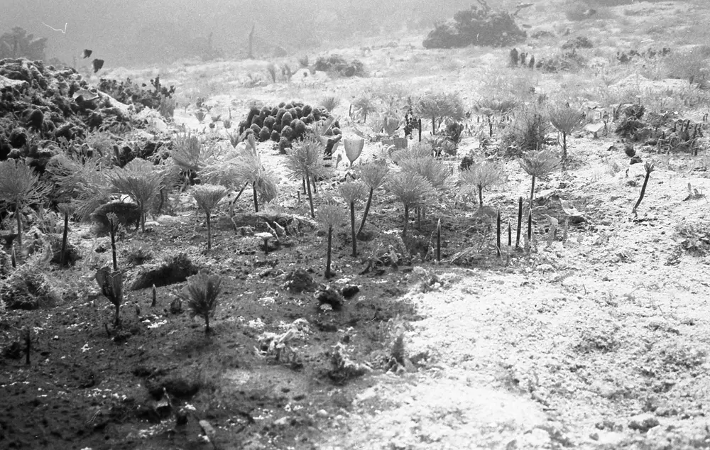{.lightbox group="discovery-bay-1966" description="**UUID: **26c0da4e-0d26-4ed7-ab81-1a0e07bfed68 **Date: **1967-05-10 **Location: **Jamaica | Discovery Bay | Algal Plots **Longitude: **77.414ºW **Latitude: **18.473ºN **Photographer: **Eileen Graham **Copyright: **Trustees of the Natural History Museum (London, UK), CC-BY-4.0" alt="**UUID: **26c0da4e-0d26-4ed7-ab81-1a0e07bfed68 **Date: **1967-05-10 **Location: **Jamaica | Discovery Bay | Algal Plots **Longitude: **77.414ºW **Latitude: **18.473ºN **Photographer: **Eileen Graham **Copyright: **Trustees of the Natural History Museum (London, UK), CC-BY-4.0"}

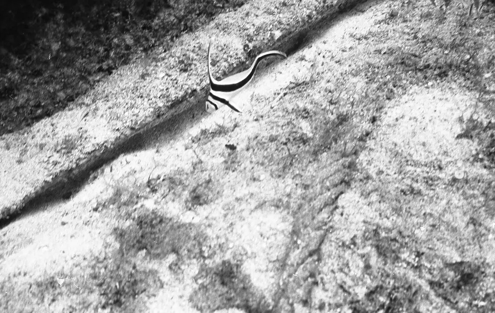{.lightbox group="discovery-bay-1966" description="**UUID: **c2c1aa1d-2761-4d62-b5ec-dc62f6b6723c **Date: **1967-05-10 **Location: **Jamaica | Discovery Bay | Algal Plots **Longitude: **77.414ºW **Latitude: **18.473ºN **Photographer: **Eileen Graham **Copyright: **Trustees of the Natural History Museum (London, UK), CC-BY-4.0" alt="**UUID: **c2c1aa1d-2761-4d62-b5ec-dc62f6b6723c **Date: **1967-05-10 **Location: **Jamaica | Discovery Bay | Algal Plots **Longitude: **77.414ºW **Latitude: **18.473ºN **Photographer: **Eileen Graham **Copyright: **Trustees of the Natural History Museum (London, UK), CC-BY-4.0"}

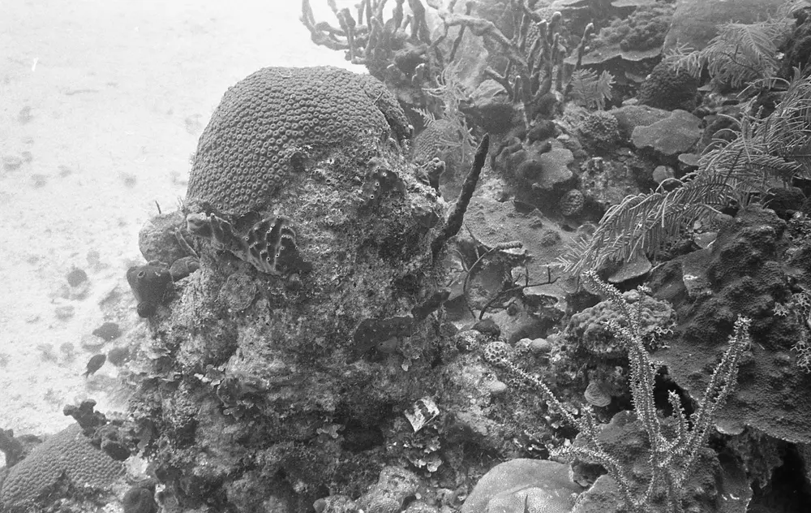{.lightbox group="discovery-bay-1966" description="**UUID: **640c1a90-29a4-4da0-8f3e-5d12b74f8d68 **Date: **1967-05-10 **Location: **Jamaica | Discovery Bay | Buoy Upper Slope **Longitude: **77.40908ºW **Latitude: **18.47322ºN **Photographer: **Eileen Graham **Copyright: **Trustees of the Natural History Museum (London, UK), CC-BY-4.0" alt="**UUID: **640c1a90-29a4-4da0-8f3e-5d12b74f8d68 **Date: **1967-05-10 **Location: **Jamaica | Discovery Bay | Buoy Upper Slope **Longitude: **77.40908ºW **Latitude: **18.47322ºN **Photographer: **Eileen Graham **Copyright: **Trustees of the Natural History Museum (London, UK), CC-BY-4.0"}

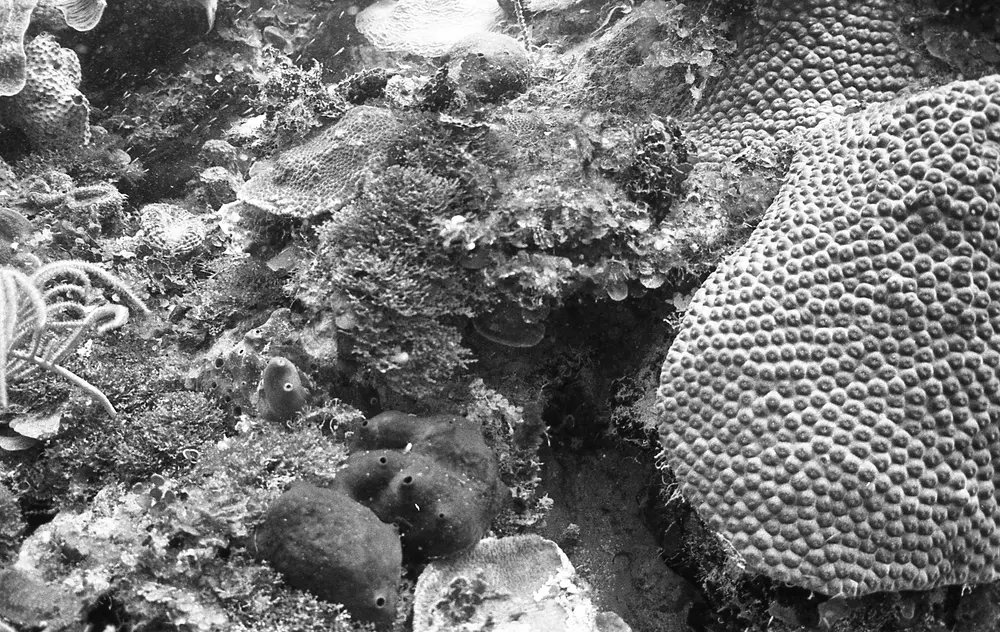{.lightbox group="discovery-bay-1966" description="**UUID: **83daa201-3b8d-4e55-a827-f3916dcb7907 **Date: **1967-05-10 **Location: **Jamaica | Discovery Bay | Buoy Upper Slope **Longitude: **77.40908ºW **Latitude: **18.47322ºN **Photographer: **Eileen Graham **Copyright: **Trustees of the Natural History Museum (London, UK), CC-BY-4.0" alt="**UUID: **83daa201-3b8d-4e55-a827-f3916dcb7907 **Date: **1967-05-10 **Location: **Jamaica | Discovery Bay | Buoy Upper Slope **Longitude: **77.40908ºW **Latitude: **18.47322ºN **Photographer: **Eileen Graham **Copyright: **Trustees of the Natural History Museum (London, UK), CC-BY-4.0"}

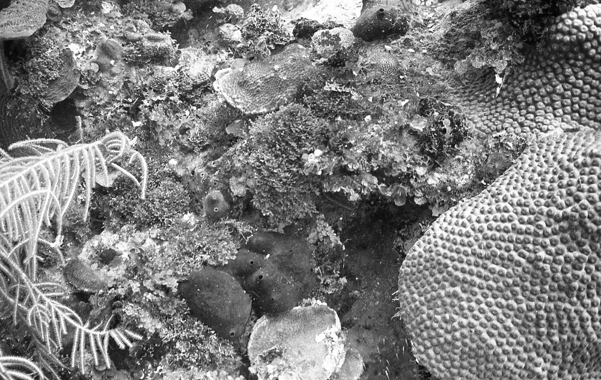{.lightbox group="discovery-bay-1966" description="**UUID: **6d0ed1ed-5aee-40ff-9c02-329fe8d59ba6 **Date: **1967-05-10 **Location: **Jamaica | Discovery Bay | Buoy Upper Slope **Longitude: **77.40908ºW **Latitude: **18.47322ºN **Photographer: **Eileen Graham **Copyright: **Trustees of the Natural History Museum (London, UK), CC-BY-4.0" alt="**UUID: **6d0ed1ed-5aee-40ff-9c02-329fe8d59ba6 **Date: **1967-05-10 **Location: **Jamaica | Discovery Bay | Buoy Upper Slope **Longitude: **77.40908ºW **Latitude: **18.47322ºN **Photographer: **Eileen Graham **Copyright: **Trustees of the Natural History Museum (London, UK), CC-BY-4.0"}

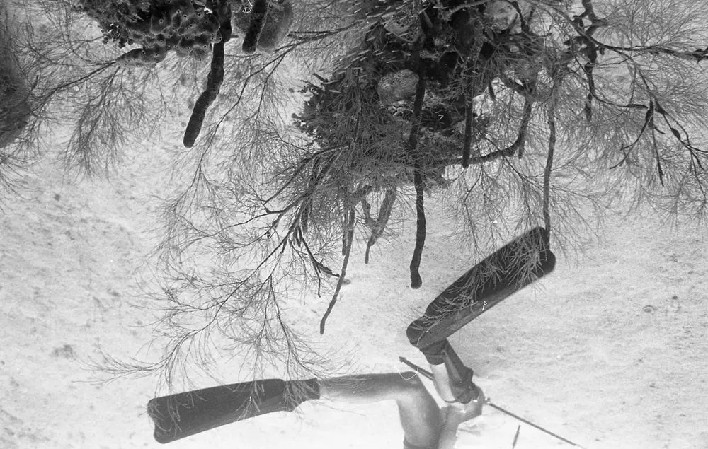{.lightbox group="discovery-bay-1966" description="**UUID: **2f674837-e6e3-4b40-86ed-c3b34b55f4b1 **Date: **1967-10-27 **Location: **Jamaica | Discovery Bay | Pinnacle 1 Sand Slope **Longitude: **77.41017ºW **Latitude: **18.47367ºN **Photographer: **Eileen Graham **Copyright: **Trustees of the Natural History Museum (London, UK), CC-BY-4.0" alt="**UUID: **2f674837-e6e3-4b40-86ed-c3b34b55f4b1 **Date: **1967-10-27 **Location: **Jamaica | Discovery Bay | Pinnacle 1 Sand Slope **Longitude: **77.41017ºW **Latitude: **18.47367ºN **Photographer: **Eileen Graham **Copyright: **Trustees of the Natural History Museum (London, UK), CC-BY-4.0"}

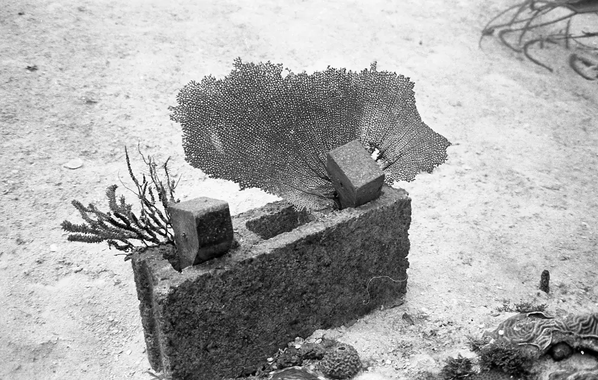{.lightbox group="discovery-bay-1966" description="**UUID: **09e3cb4f-0c32-43ac-a43f-12f8661b324d **Date: **1967-10-27 **Location: **Jamaica | Discovery Bay | Pinnacle 1 Sand Slope **Longitude: **77.41017ºW **Latitude: **18.47367ºN **Photographer: **Eileen Graham **Copyright: **Trustees of the Natural History Museum (London, UK), CC-BY-4.0" alt="**UUID: **09e3cb4f-0c32-43ac-a43f-12f8661b324d **Date: **1967-10-27 **Location: **Jamaica | Discovery Bay | Pinnacle 1 Sand Slope **Longitude: **77.41017ºW **Latitude: **18.47367ºN **Photographer: **Eileen Graham **Copyright: **Trustees of the Natural History Museum (London, UK), CC-BY-4.0"}

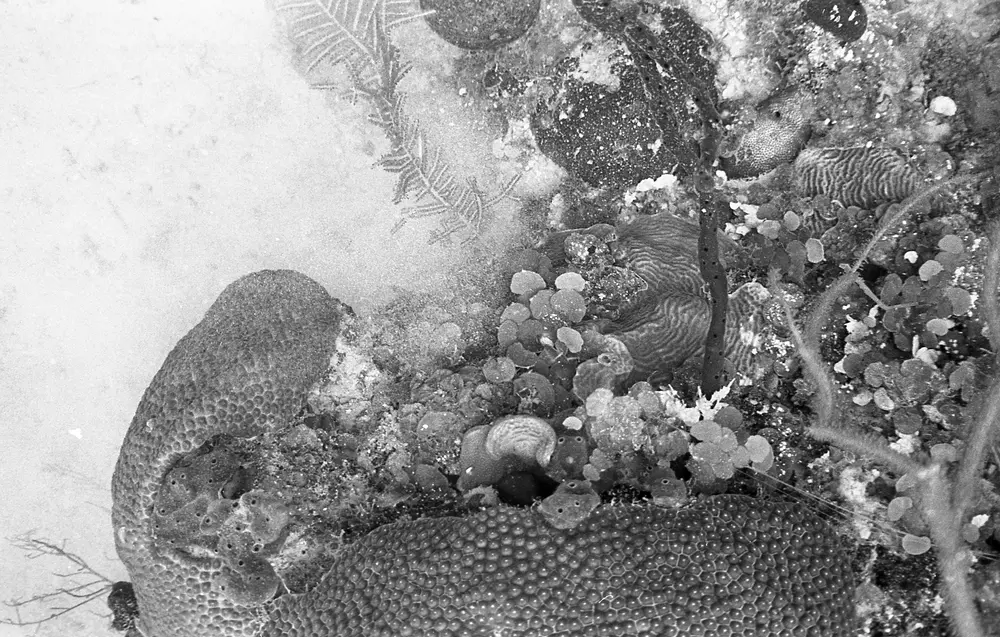{.lightbox group="discovery-bay-1966" description="**UUID: **6002458f-00d9-49eb-8dd1-2964b74fb459 **Date: **1967-10-27 **Location: **Jamaica | Discovery Bay | Pinnacle 1 Slope **Longitude: **77.41017ºW **Latitude: **18.47367ºN **Photographer: **Eileen Graham **Copyright: **Trustees of the Natural History Museum (London, UK), CC-BY-4.0" alt="**UUID: **6002458f-00d9-49eb-8dd1-2964b74fb459 **Date: **1967-10-27 **Location: **Jamaica | Discovery Bay | Pinnacle 1 Slope **Longitude: **77.41017ºW **Latitude: **18.47367ºN **Photographer: **Eileen Graham **Copyright: **Trustees of the Natural History Museum (London, UK), CC-BY-4.0"}

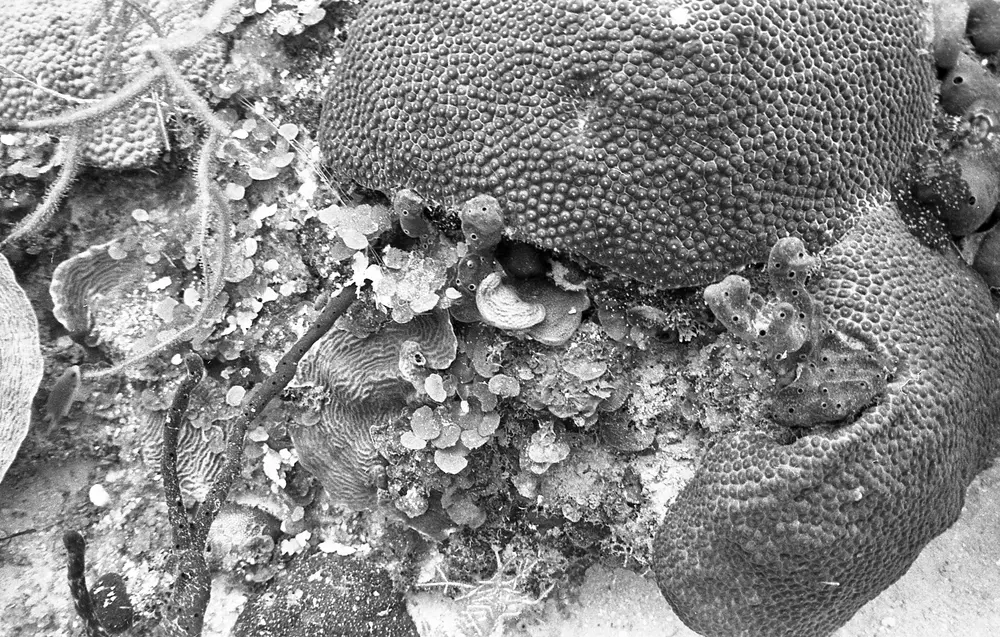{.lightbox group="discovery-bay-1966" description="**UUID: **7bebf0ac-67d5-4ca8-b154-f9e119999dc6 **Date: **1967-10-27 **Location: **Jamaica | Discovery Bay | Pinnacle 1 Slope **Longitude: **77.41017ºW **Latitude: **18.47367ºN **Photographer: **Eileen Graham **Copyright: **Trustees of the Natural History Museum (London, UK), CC-BY-4.0" alt="**UUID: **7bebf0ac-67d5-4ca8-b154-f9e119999dc6 **Date: **1967-10-27 **Location: **Jamaica | Discovery Bay | Pinnacle 1 Slope **Longitude: **77.41017ºW **Latitude: **18.47367ºN **Photographer: **Eileen Graham **Copyright: **Trustees of the Natural History Museum (London, UK), CC-BY-4.0"}

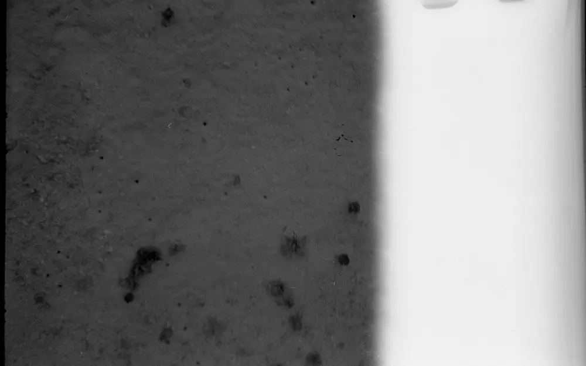{.lightbox group="discovery-bay-1966" description="**UUID: **f18c2b7a-3a97-44d3-8640-ae14ef49c314 **Date: **1967-10-27 **Location: **Jamaica | Discovery Bay | Pinnacle 1 Slope **Longitude: **77.41017ºW **Latitude: **18.47367ºN **Photographer: **Eileen Graham **Copyright: **Trustees of the Natural History Museum (London, UK), CC-BY-4.0" alt="**UUID: **f18c2b7a-3a97-44d3-8640-ae14ef49c314 **Date: **1967-10-27 **Location: **Jamaica | Discovery Bay | Pinnacle 1 Slope **Longitude: **77.41017ºW **Latitude: **18.47367ºN **Photographer: **Eileen Graham **Copyright: **Trustees of the Natural History Museum (London, UK), CC-BY-4.0"}

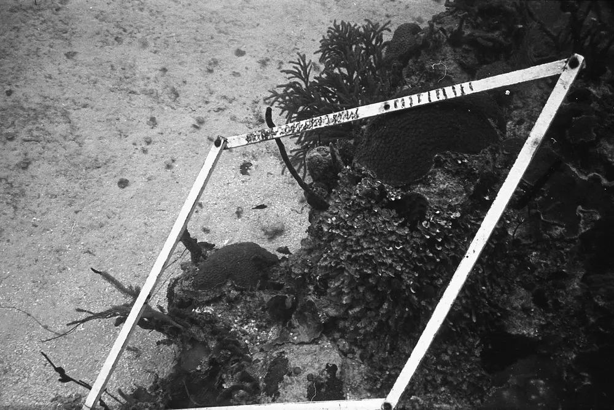{.lightbox group="discovery-bay-1966" description="**UUID: **cdd896c7-4ad8-4074-b95f-5e35cf0eecaa **Date: **1966-04-27 **Location: **Jamaica | Discovery Bay | Buoy Upper Slope **Longitude: **77.40908ºW **Latitude: **18.47322ºN **Photographer: **Eileen Graham **Copyright: **Trustees of the Natural History Museum (London, UK), CC-BY-4.0" alt="**UUID: **cdd896c7-4ad8-4074-b95f-5e35cf0eecaa **Date: **1966-04-27 **Location: **Jamaica | Discovery Bay | Buoy Upper Slope **Longitude: **77.40908ºW **Latitude: **18.47322ºN **Photographer: **Eileen Graham **Copyright: **Trustees of the Natural History Museum (London, UK), CC-BY-4.0"}

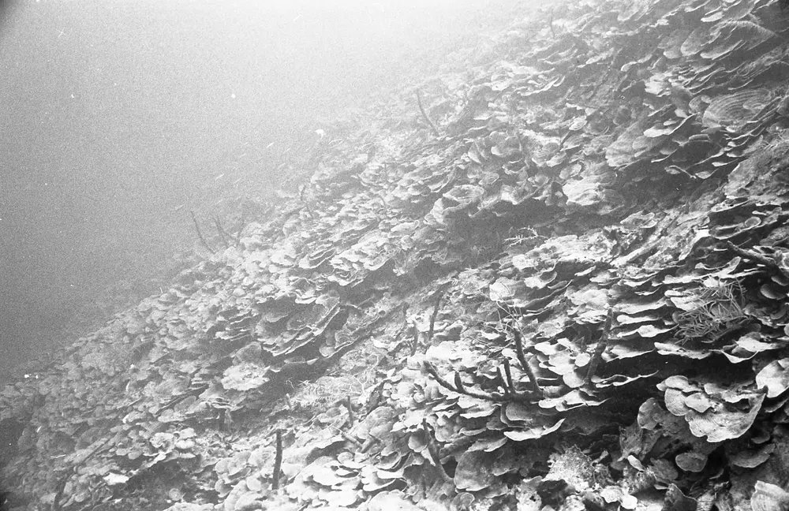{.lightbox group="discovery-bay-1966" description="**UUID: **6e3ae97e-022e-4d6c-bf3d-f47a49005423 **Date: **1967-10-28 **Location: **Jamaica | Discovery Bay | West Bull **Longitude: **77.39ºW **Latitude: **18.47167ºN **Photographer: **Eileen Graham **Copyright: **Trustees of the Natural History Museum (London, UK), CC-BY-4.0" alt="**UUID: **6e3ae97e-022e-4d6c-bf3d-f47a49005423 **Date: **1967-10-28 **Location: **Jamaica | Discovery Bay | West Bull **Longitude: **77.39ºW **Latitude: **18.47167ºN **Photographer: **Eileen Graham **Copyright: **Trustees of the Natural History Museum (London, UK), CC-BY-4.0"}

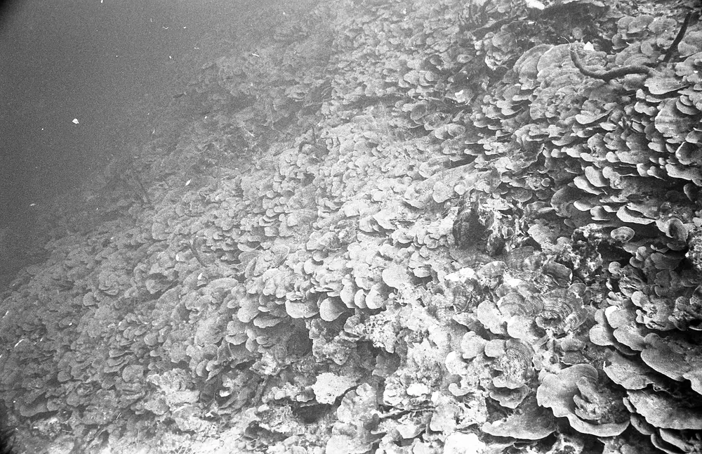{.lightbox group="discovery-bay-1966" description="**UUID: **2f75e1e5-dcb6-48b6-9b40-90f508675ab4 **Date: **1967-10-28 **Location: **Jamaica | Discovery Bay | West Bull **Longitude: **77.39ºW **Latitude: **18.47167ºN **Photographer: **Eileen Graham **Copyright: **Trustees of the Natural History Museum (London, UK), CC-BY-4.0" alt="**UUID: **2f75e1e5-dcb6-48b6-9b40-90f508675ab4 **Date: **1967-10-28 **Location: **Jamaica | Discovery Bay | West Bull **Longitude: **77.39ºW **Latitude: **18.47167ºN **Photographer: **Eileen Graham **Copyright: **Trustees of the Natural History Museum (London, UK), CC-BY-4.0"}

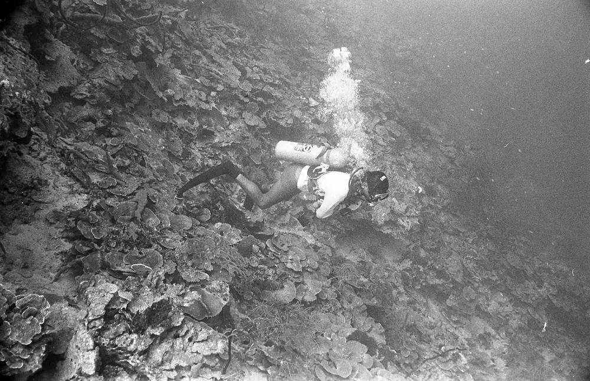{.lightbox group="discovery-bay-1966" description="**UUID: **8d4789bc-163c-444f-9c02-572804cbb807 **Date: **1967-10-28 **Location: **Jamaica | Discovery Bay | West Bull **Longitude: **77.39ºW **Latitude: **18.47167ºN **Photographer: **Eileen Graham **Copyright: **Trustees of the Natural History Museum (London, UK), CC-BY-4.0" alt="**UUID: **8d4789bc-163c-444f-9c02-572804cbb807 **Date: **1967-10-28 **Location: **Jamaica | Discovery Bay | West Bull **Longitude: **77.39ºW **Latitude: **18.47167ºN **Photographer: **Eileen Graham **Copyright: **Trustees of the Natural History Museum (London, UK), CC-BY-4.0"}

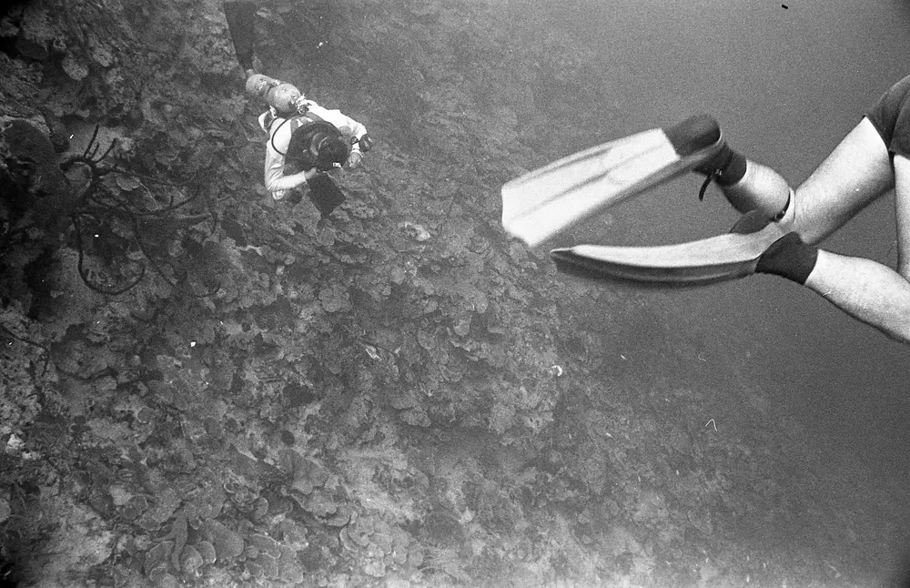{.lightbox group="discovery-bay-1966" description="**UUID: **a931e786-7962-4e20-aa2e-8ea91109748e **Date: **1967-10-28 **Location: **Jamaica | Discovery Bay | West Bull **Longitude: **77.39ºW **Latitude: **18.47167ºN **Photographer: **Eileen Graham **Copyright: **Trustees of the Natural History Museum (London, UK), CC-BY-4.0" alt="**UUID: **a931e786-7962-4e20-aa2e-8ea91109748e **Date: **1967-10-28 **Location: **Jamaica | Discovery Bay | West Bull **Longitude: **77.39ºW **Latitude: **18.47167ºN **Photographer: **Eileen Graham **Copyright: **Trustees of the Natural History Museum (London, UK), CC-BY-4.0"}

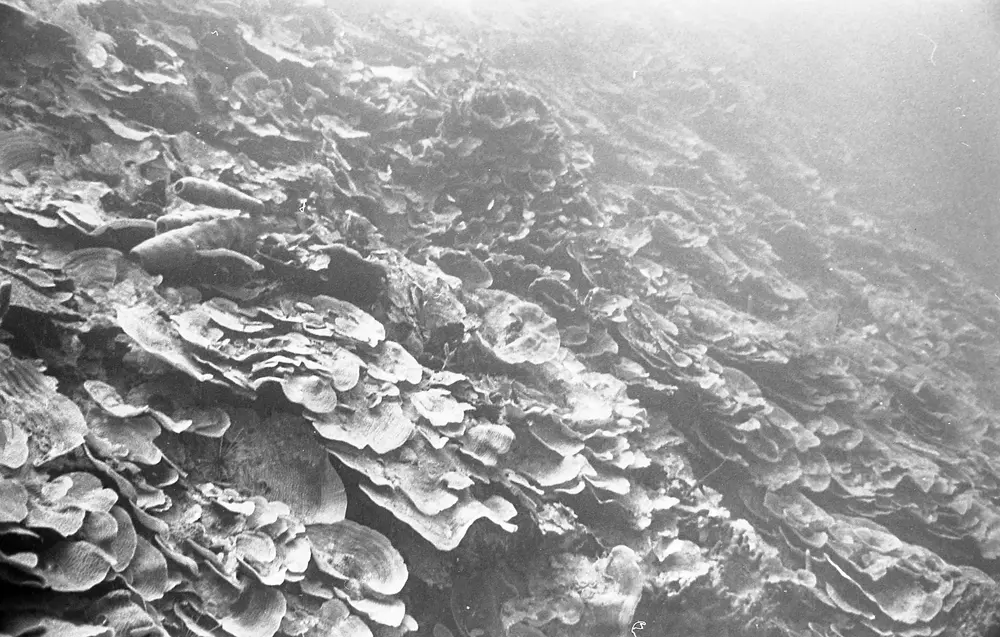{.lightbox group="discovery-bay-1966" description="**UUID: **cf7e081f-bfeb-40f1-9565-c95fee215435 **Date: **1967-10-28 **Location: **Jamaica | Discovery Bay | West Bull **Longitude: **77.39ºW **Latitude: **18.47167ºN **Photographer: **Eileen Graham **Copyright: **Trustees of the Natural History Museum (London, UK), CC-BY-4.0" alt="**UUID: **cf7e081f-bfeb-40f1-9565-c95fee215435 **Date: **1967-10-28 **Location: **Jamaica | Discovery Bay | West Bull **Longitude: **77.39ºW **Latitude: **18.47167ºN **Photographer: **Eileen Graham **Copyright: **Trustees of the Natural History Museum (London, UK), CC-BY-4.0"}

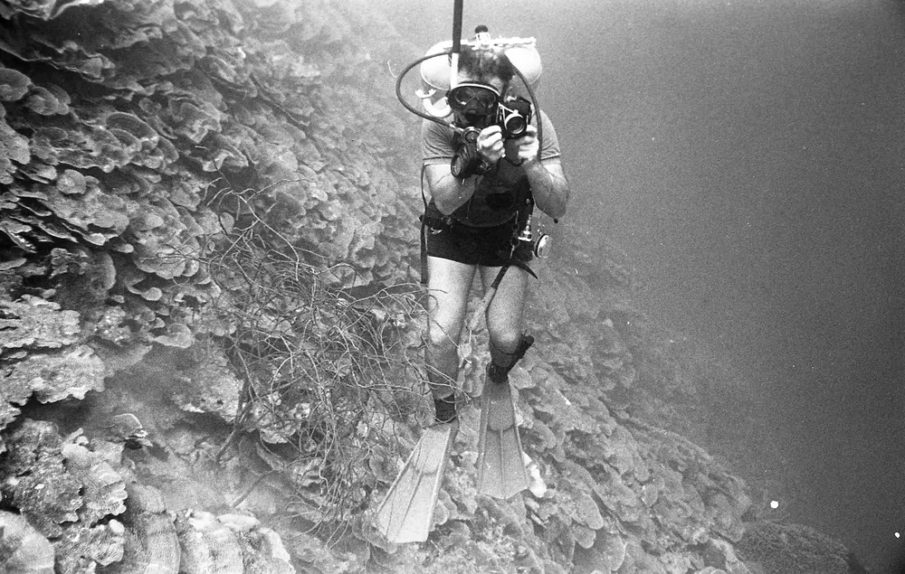{.lightbox group="discovery-bay-1966" description="**UUID: **67c321a9-185c-47c5-a11f-bc9e26918749 **Date: **1967-10-28 **Location: **Jamaica | Discovery Bay | West Bull **Longitude: **77.39ºW **Latitude: **18.47167ºN **Photographer: **Eileen Graham **Copyright: **Trustees of the Natural History Museum (London, UK), CC-BY-4.0" alt="**UUID: **67c321a9-185c-47c5-a11f-bc9e26918749 **Date: **1967-10-28 **Location: **Jamaica | Discovery Bay | West Bull **Longitude: **77.39ºW **Latitude: **18.47167ºN **Photographer: **Eileen Graham **Copyright: **Trustees of the Natural History Museum (London, UK), CC-BY-4.0"}

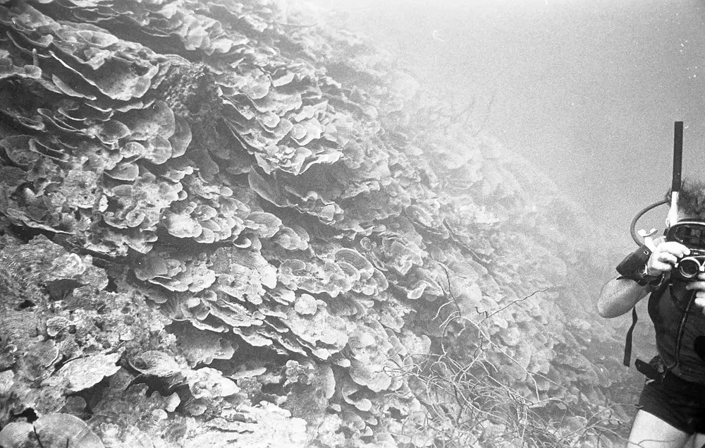{.lightbox group="discovery-bay-1966" description="**UUID: **25c4f39c-eafd-4c34-81cb-f4105a160f91 **Date: **1967-10-28 **Location: **Jamaica | Discovery Bay | West Bull **Longitude: **77.39ºW **Latitude: **18.47167ºN **Photographer: **Eileen Graham **Copyright: **Trustees of the Natural History Museum (London, UK), CC-BY-4.0" alt="**UUID: **25c4f39c-eafd-4c34-81cb-f4105a160f91 **Date: **1967-10-28 **Location: **Jamaica | Discovery Bay | West Bull **Longitude: **77.39ºW **Latitude: **18.47167ºN **Photographer: **Eileen Graham **Copyright: **Trustees of the Natural History Museum (London, UK), CC-BY-4.0"}

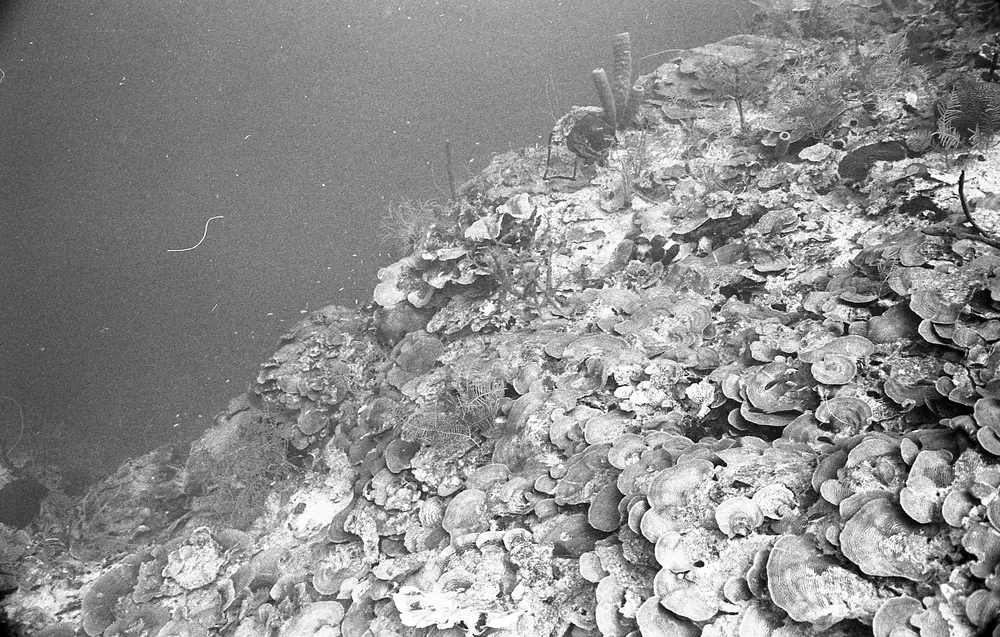{.lightbox group="discovery-bay-1966" description="**UUID: **a38b2c91-1f3f-454b-9ad7-bbc020e86c7e **Date: **1967-10-28 **Location: **Jamaica | Discovery Bay | West Bull **Longitude: **77.39ºW **Latitude: **18.47167ºN **Photographer: **Eileen Graham **Copyright: **Trustees of the Natural History Museum (London, UK), CC-BY-4.0" alt="**UUID: **a38b2c91-1f3f-454b-9ad7-bbc020e86c7e **Date: **1967-10-28 **Location: **Jamaica | Discovery Bay | West Bull **Longitude: **77.39ºW **Latitude: **18.47167ºN **Photographer: **Eileen Graham **Copyright: **Trustees of the Natural History Museum (London, UK), CC-BY-4.0"}

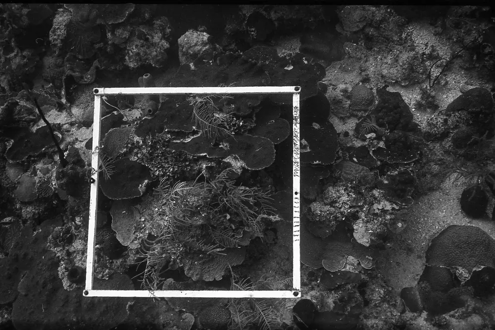{.lightbox group="discovery-bay-1966" description="**UUID: **e677e107-d046-4fa1-9949-c4b925d1390e **Date: **1966-04-27 **Location: **Jamaica | Discovery Bay | Buoy Upper Slope **Longitude: **77.40908ºW **Latitude: **18.47322ºN **Photographer: **Eileen Graham **Copyright: **Trustees of the Natural History Museum (London, UK), CC-BY-4.0" alt="**UUID: **e677e107-d046-4fa1-9949-c4b925d1390e **Date: **1966-04-27 **Location: **Jamaica | Discovery Bay | Buoy Upper Slope **Longitude: **77.40908ºW **Latitude: **18.47322ºN **Photographer: **Eileen Graham **Copyright: **Trustees of the Natural History Museum (London, UK), CC-BY-4.0"}

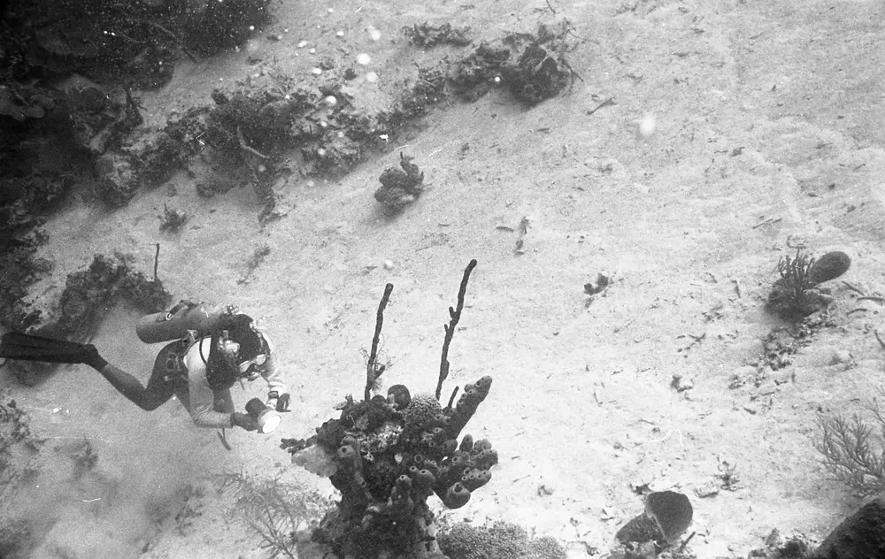{.lightbox group="discovery-bay-1966" description="**UUID: **02e29cda-73de-4656-a1e7-0c0b00a18cfc **Date: **1967-10-28 **Location: **Jamaica | Discovery Bay | West Bull **Longitude: **77.39ºW **Latitude: **18.47167ºN **Photographer: **Eileen Graham **Copyright: **Trustees of the Natural History Museum (London, UK), CC-BY-4.0" alt="**UUID: **02e29cda-73de-4656-a1e7-0c0b00a18cfc **Date: **1967-10-28 **Location: **Jamaica | Discovery Bay | West Bull **Longitude: **77.39ºW **Latitude: **18.47167ºN **Photographer: **Eileen Graham **Copyright: **Trustees of the Natural History Museum (London, UK), CC-BY-4.0"}

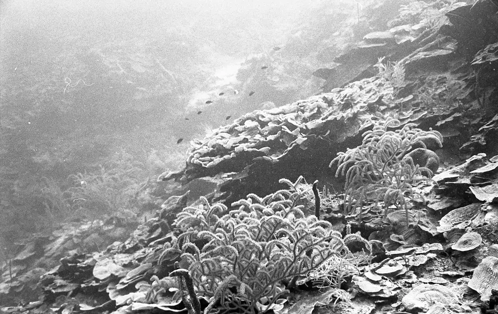{.lightbox group="discovery-bay-1966" description="**UUID: **6f8d3148-873c-4237-a0f2-ea1355f8c337 **Date: **1967-10-28 **Location: **Jamaica | Discovery Bay | West Bull **Longitude: **77.39ºW **Latitude: **18.47167ºN **Photographer: **Eileen Graham **Copyright: **Trustees of the Natural History Museum (London, UK), CC-BY-4.0" alt="**UUID: **6f8d3148-873c-4237-a0f2-ea1355f8c337 **Date: **1967-10-28 **Location: **Jamaica | Discovery Bay | West Bull **Longitude: **77.39ºW **Latitude: **18.47167ºN **Photographer: **Eileen Graham **Copyright: **Trustees of the Natural History Museum (London, UK), CC-BY-4.0"}

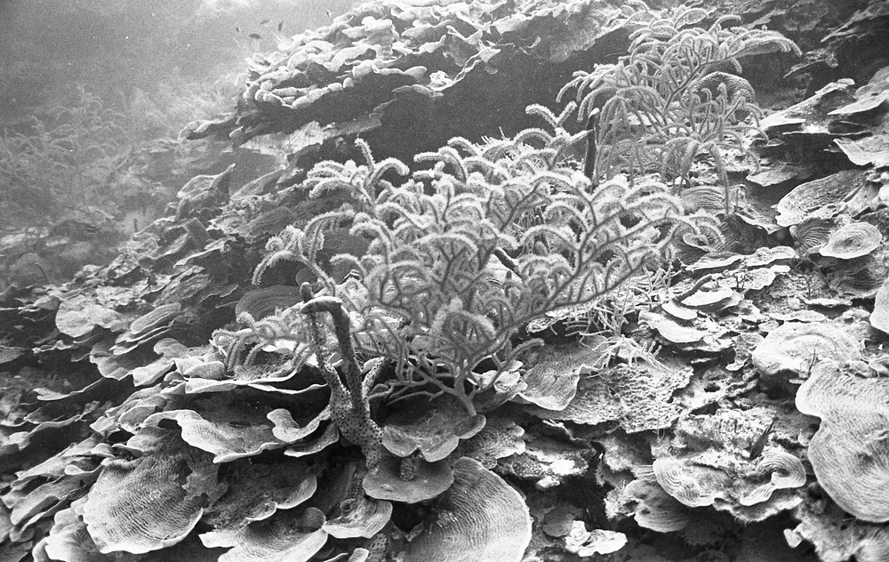{.lightbox group="discovery-bay-1966" description="**UUID: **c298c9dc-982a-4ea5-896a-bdb820b8abba **Date: **1967-10-28 **Location: **Jamaica | Discovery Bay | West Bull **Longitude: **77.39ºW **Latitude: **18.47167ºN **Photographer: **Eileen Graham **Copyright: **Trustees of the Natural History Museum (London, UK), CC-BY-4.0" alt="**UUID: **c298c9dc-982a-4ea5-896a-bdb820b8abba **Date: **1967-10-28 **Location: **Jamaica | Discovery Bay | West Bull **Longitude: **77.39ºW **Latitude: **18.47167ºN **Photographer: **Eileen Graham **Copyright: **Trustees of the Natural History Museum (London, UK), CC-BY-4.0"}

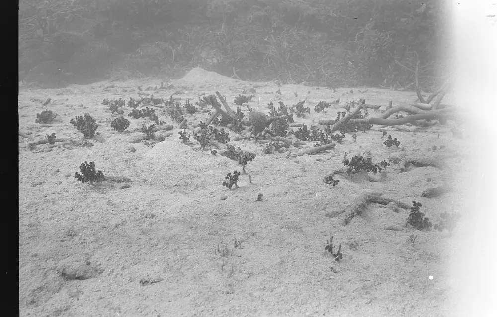{.lightbox group="discovery-bay-1966" description="**UUID: **58be669c-1bbf-4c66-8788-b780719d0cb0 **Date: **1967-10-29 **Location: **Jamaica | Discovery Bay | West Bull **Longitude: **77.39ºW **Latitude: **18.47167ºN **Photographer: **Eileen Graham **Copyright: **Trustees of the Natural History Museum (London, UK), CC-BY-4.0" alt="**UUID: **58be669c-1bbf-4c66-8788-b780719d0cb0 **Date: **1967-10-29 **Location: **Jamaica | Discovery Bay | West Bull **Longitude: **77.39ºW **Latitude: **18.47167ºN **Photographer: **Eileen Graham **Copyright: **Trustees of the Natural History Museum (London, UK), CC-BY-4.0"}

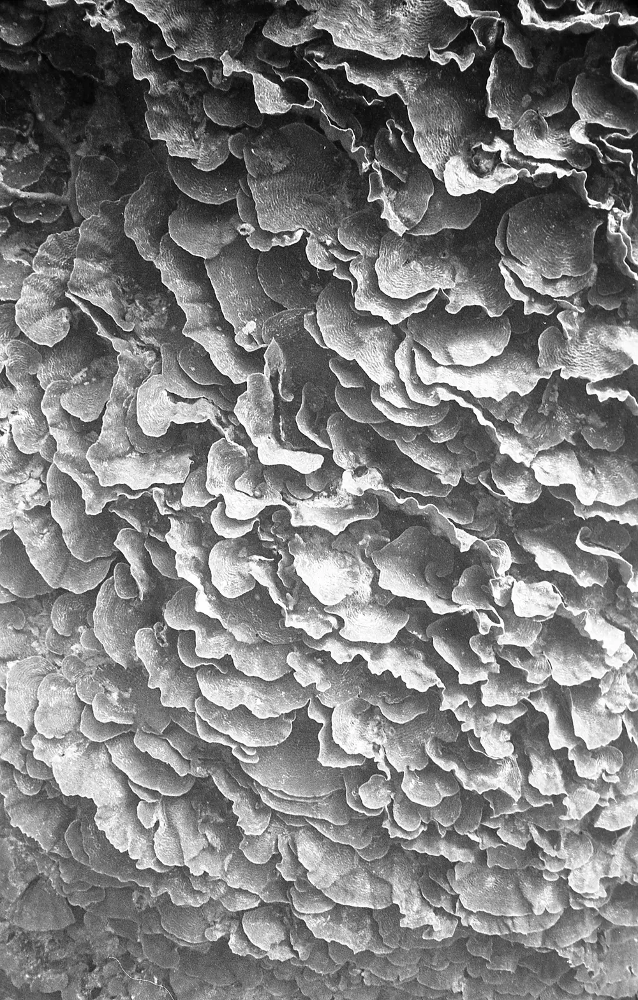{.lightbox group="discovery-bay-1966" description="**UUID: **29a03b2d-8206-431c-bdb2-9bc71953911d **Date: **1967-10-29 **Location: **Jamaica | Discovery Bay | West Bull **Longitude: **77.39ºW **Latitude: **18.47167ºN **Photographer: **Eileen Graham **Copyright: **Trustees of the Natural History Museum (London, UK), CC-BY-4.0" alt="**UUID: **29a03b2d-8206-431c-bdb2-9bc71953911d **Date: **1967-10-29 **Location: **Jamaica | Discovery Bay | West Bull **Longitude: **77.39ºW **Latitude: **18.47167ºN **Photographer: **Eileen Graham **Copyright: **Trustees of the Natural History Museum (London, UK), CC-BY-4.0"}

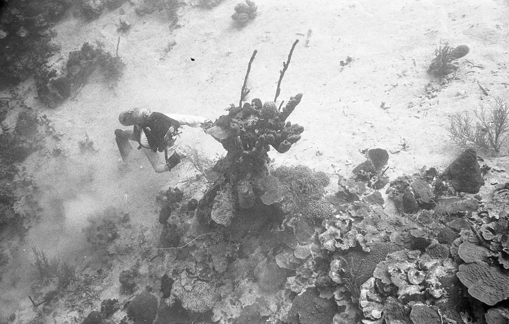{.lightbox group="discovery-bay-1966" description="**UUID: **fb8faa1c-c0db-48e8-b83d-97e956ab3846 **Date: **1967-10-29 **Location: **Jamaica | Discovery Bay | West Bull **Longitude: **77.39ºW **Latitude: **18.47167ºN **Photographer: **Eileen Graham **Copyright: **Trustees of the Natural History Museum (London, UK), CC-BY-4.0" alt="**UUID: **fb8faa1c-c0db-48e8-b83d-97e956ab3846 **Date: **1967-10-29 **Location: **Jamaica | Discovery Bay | West Bull **Longitude: **77.39ºW **Latitude: **18.47167ºN **Photographer: **Eileen Graham **Copyright: **Trustees of the Natural History Museum (London, UK), CC-BY-4.0"}

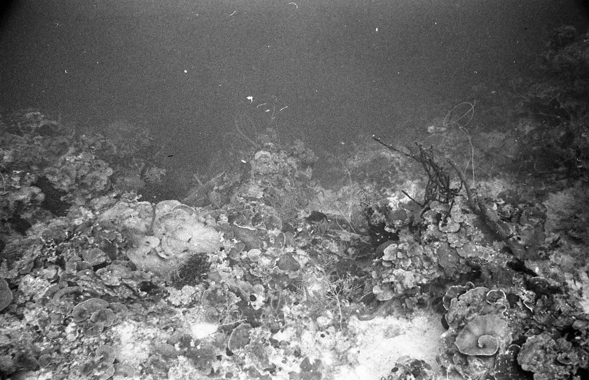{.lightbox group="discovery-bay-1966" description="**UUID: **e5069562-c9d8-4df8-ba58-b02c064863a6 **Date: **1967-10-29 **Location: **Jamaica | Discovery Bay | West Bull **Longitude: **77.39ºW **Latitude: **18.47167ºN **Photographer: **Eileen Graham **Copyright: **Trustees of the Natural History Museum (London, UK), CC-BY-4.0" alt="**UUID: **e5069562-c9d8-4df8-ba58-b02c064863a6 **Date: **1967-10-29 **Location: **Jamaica | Discovery Bay | West Bull **Longitude: **77.39ºW **Latitude: **18.47167ºN **Photographer: **Eileen Graham **Copyright: **Trustees of the Natural History Museum (London, UK), CC-BY-4.0"}

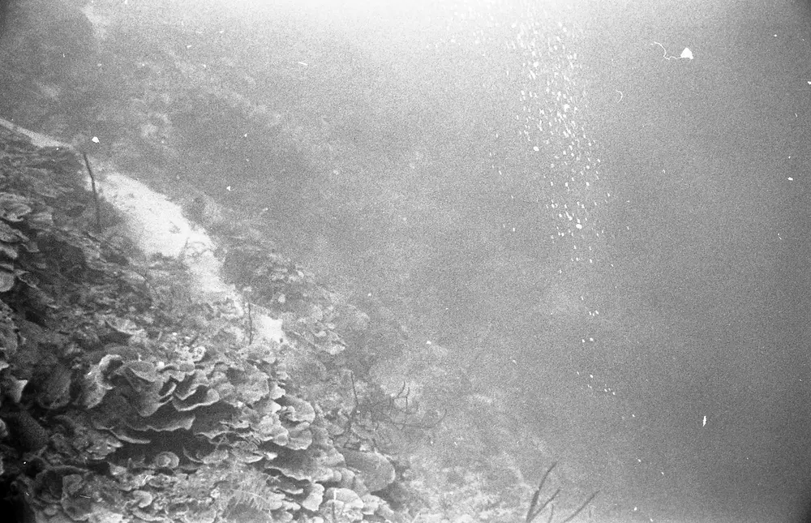{.lightbox group="discovery-bay-1966" description="**UUID: **a0625939-ca31-4d2c-9e71-1477b9ebf962 **Date: **1967-10-29 **Location: **Jamaica | Discovery Bay | West Bull **Longitude: **77.39ºW **Latitude: **18.47167ºN **Photographer: **Eileen Graham **Copyright: **Trustees of the Natural History Museum (London, UK), CC-BY-4.0" alt="**UUID: **a0625939-ca31-4d2c-9e71-1477b9ebf962 **Date: **1967-10-29 **Location: **Jamaica | Discovery Bay | West Bull **Longitude: **77.39ºW **Latitude: **18.47167ºN **Photographer: **Eileen Graham **Copyright: **Trustees of the Natural History Museum (London, UK), CC-BY-4.0"}

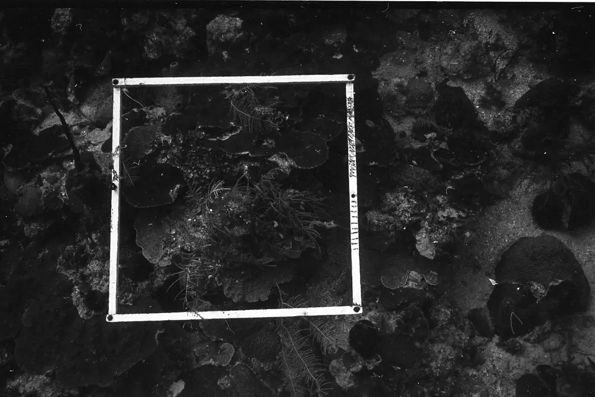{.lightbox group="discovery-bay-1966" description="**UUID: **b8dcc53a-1e03-48a0-9910-fdd0dcc6e6cf **Date: **1966-04-27 **Location: **Jamaica | Discovery Bay | Buoy Upper Slope **Longitude: **77.40908ºW **Latitude: **18.47322ºN **Photographer: **Eileen Graham **Copyright: **Trustees of the Natural History Museum (London, UK), CC-BY-4.0" alt="**UUID: **b8dcc53a-1e03-48a0-9910-fdd0dcc6e6cf **Date: **1966-04-27 **Location: **Jamaica | Discovery Bay | Buoy Upper Slope **Longitude: **77.40908ºW **Latitude: **18.47322ºN **Photographer: **Eileen Graham **Copyright: **Trustees of the Natural History Museum (London, UK), CC-BY-4.0"}

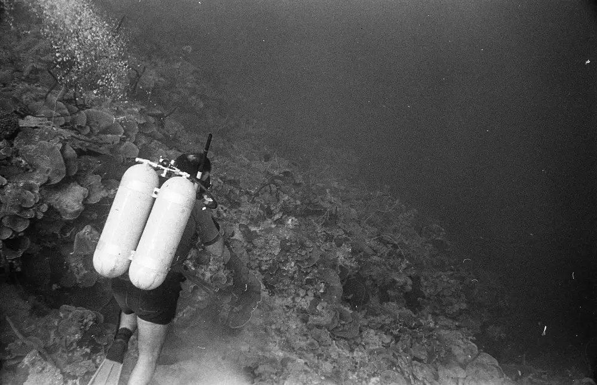{.lightbox group="discovery-bay-1966" description="**UUID: **f204bede-3fc7-427e-ae85-50eaf41aa021 **Date: **1967-10-29 **Location: **Jamaica | Discovery Bay | West Bull **Longitude: **77.39ºW **Latitude: **18.47167ºN **Photographer: **Eileen Graham **Copyright: **Trustees of the Natural History Museum (London, UK), CC-BY-4.0" alt="**UUID: **f204bede-3fc7-427e-ae85-50eaf41aa021 **Date: **1967-10-29 **Location: **Jamaica | Discovery Bay | West Bull **Longitude: **77.39ºW **Latitude: **18.47167ºN **Photographer: **Eileen Graham **Copyright: **Trustees of the Natural History Museum (London, UK), CC-BY-4.0"}

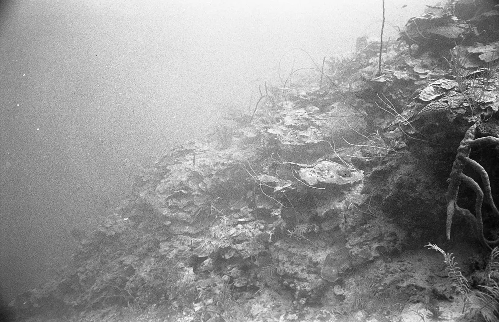{.lightbox group="discovery-bay-1966" description="**UUID: **94253d22-1959-4233-97d6-01708b563b3d **Date: **1967-10-29 **Location: **Jamaica | Discovery Bay | West Bull **Longitude: **77.39ºW **Latitude: **18.47167ºN **Photographer: **Eileen Graham **Copyright: **Trustees of the Natural History Museum (London, UK), CC-BY-4.0" alt="**UUID: **94253d22-1959-4233-97d6-01708b563b3d **Date: **1967-10-29 **Location: **Jamaica | Discovery Bay | West Bull **Longitude: **77.39ºW **Latitude: **18.47167ºN **Photographer: **Eileen Graham **Copyright: **Trustees of the Natural History Museum (London, UK), CC-BY-4.0"}

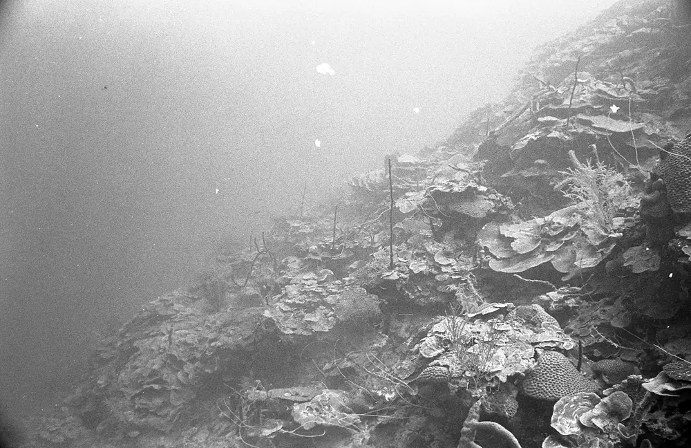{.lightbox group="discovery-bay-1966" description="**UUID: **ca890b58-e753-4fd9-b805-0e6c2c26c9fc **Date: **1967-10-29 **Location: **Jamaica | Discovery Bay | West Bull **Longitude: **77.39ºW **Latitude: **18.47167ºN **Photographer: **Eileen Graham **Copyright: **Trustees of the Natural History Museum (London, UK), CC-BY-4.0" alt="**UUID: **ca890b58-e753-4fd9-b805-0e6c2c26c9fc **Date: **1967-10-29 **Location: **Jamaica | Discovery Bay | West Bull **Longitude: **77.39ºW **Latitude: **18.47167ºN **Photographer: **Eileen Graham **Copyright: **Trustees of the Natural History Museum (London, UK), CC-BY-4.0"}

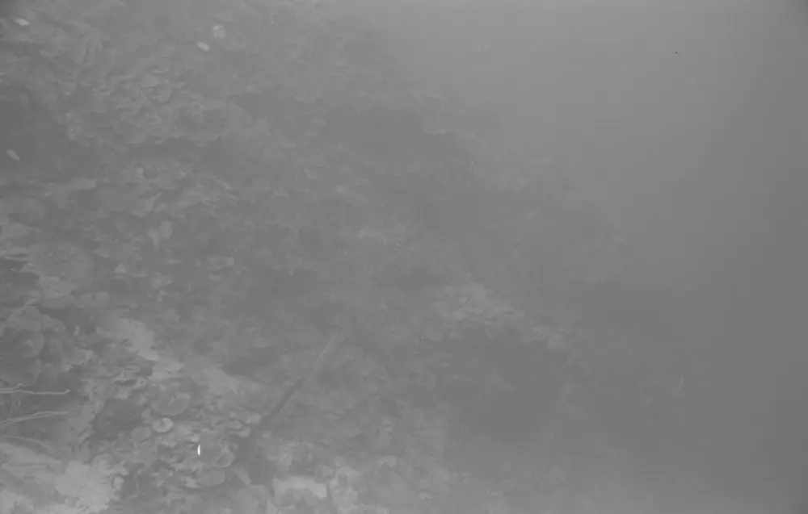{.lightbox group="discovery-bay-1966" description="**UUID: **02c81f00-2e57-4a1e-b00a-fa9e1a297568 **Date: **1967-10-29 **Location: **Jamaica | Discovery Bay | West Bull **Longitude: **77.39ºW **Latitude: **18.47167ºN **Photographer: **Eileen Graham **Copyright: **Trustees of the Natural History Museum (London, UK), CC-BY-4.0" alt="**UUID: **02c81f00-2e57-4a1e-b00a-fa9e1a297568 **Date: **1967-10-29 **Location: **Jamaica | Discovery Bay | West Bull **Longitude: **77.39ºW **Latitude: **18.47167ºN **Photographer: **Eileen Graham **Copyright: **Trustees of the Natural History Museum (London, UK), CC-BY-4.0"}

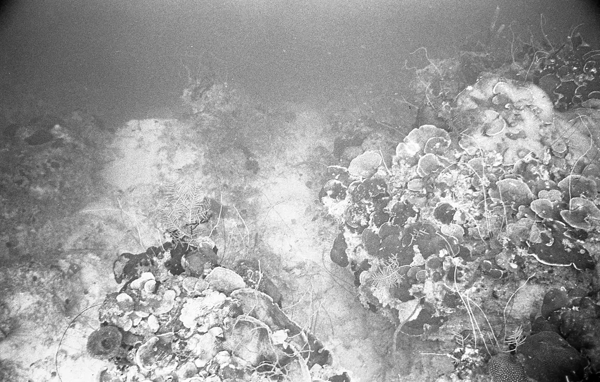{.lightbox group="discovery-bay-1966" description="**UUID: **b0db3731-2091-4e37-9658-6e91695bae32 **Date: **1967-10-29 **Location: **Jamaica | Discovery Bay | West Bull **Longitude: **77.39ºW **Latitude: **18.47167ºN **Photographer: **Eileen Graham **Copyright: **Trustees of the Natural History Museum (London, UK), CC-BY-4.0" alt="**UUID: **b0db3731-2091-4e37-9658-6e91695bae32 **Date: **1967-10-29 **Location: **Jamaica | Discovery Bay | West Bull **Longitude: **77.39ºW **Latitude: **18.47167ºN **Photographer: **Eileen Graham **Copyright: **Trustees of the Natural History Museum (London, UK), CC-BY-4.0"}

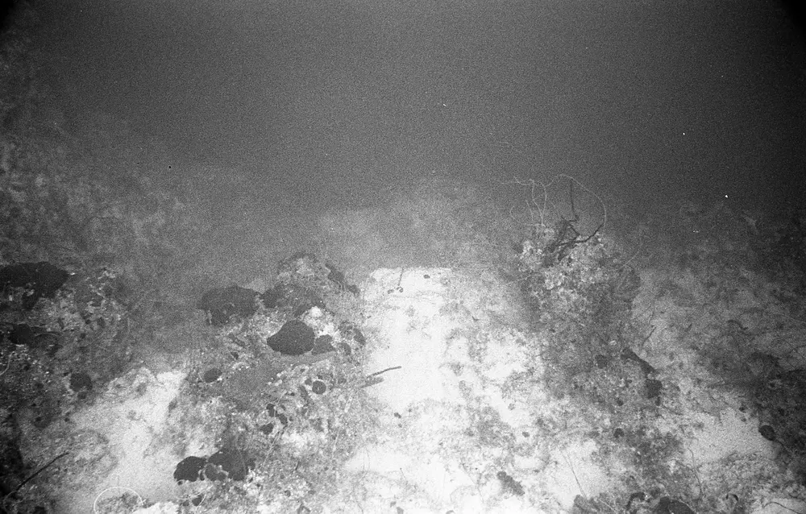{.lightbox group="discovery-bay-1966" description="**UUID: **38b2a1ba-f308-4154-8586-5cc25b98d765 **Date: **1967-10-29 **Location: **Jamaica | Discovery Bay | West Bull **Longitude: **77.39ºW **Latitude: **18.47167ºN **Photographer: **Eileen Graham **Copyright: **Trustees of the Natural History Museum (London, UK), CC-BY-4.0" alt="**UUID: **38b2a1ba-f308-4154-8586-5cc25b98d765 **Date: **1967-10-29 **Location: **Jamaica | Discovery Bay | West Bull **Longitude: **77.39ºW **Latitude: **18.47167ºN **Photographer: **Eileen Graham **Copyright: **Trustees of the Natural History Museum (London, UK), CC-BY-4.0"}

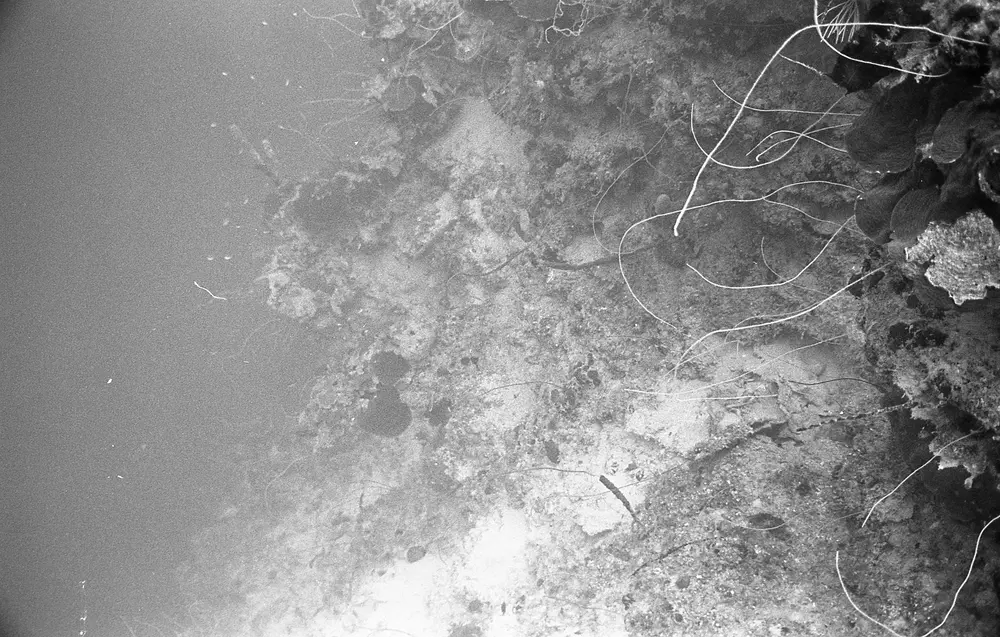{.lightbox group="discovery-bay-1966" description="**UUID: **1bea139d-1ef4-405d-ad4e-838eade52db9 **Date: **1967-10-29 **Location: **Jamaica | Discovery Bay | West Bull **Longitude: **77.39ºW **Latitude: **18.47167ºN **Photographer: **Eileen Graham **Copyright: **Trustees of the Natural History Museum (London, UK), CC-BY-4.0" alt="**UUID: **1bea139d-1ef4-405d-ad4e-838eade52db9 **Date: **1967-10-29 **Location: **Jamaica | Discovery Bay | West Bull **Longitude: **77.39ºW **Latitude: **18.47167ºN **Photographer: **Eileen Graham **Copyright: **Trustees of the Natural History Museum (London, UK), CC-BY-4.0"}

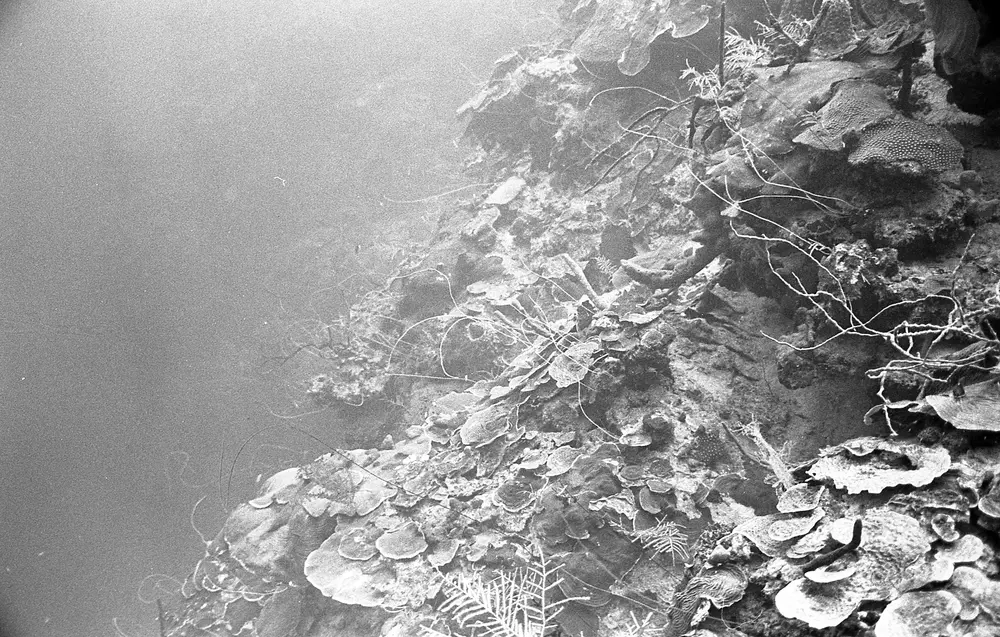{.lightbox group="discovery-bay-1966" description="**UUID: **c6448d43-cff5-4abd-82ca-bf191dac0d2a **Date: **1967-10-29 **Location: **Jamaica | Discovery Bay | West Bull **Longitude: **77.39ºW **Latitude: **18.47167ºN **Photographer: **Eileen Graham **Copyright: **Trustees of the Natural History Museum (London, UK), CC-BY-4.0" alt="**UUID: **c6448d43-cff5-4abd-82ca-bf191dac0d2a **Date: **1967-10-29 **Location: **Jamaica | Discovery Bay | West Bull **Longitude: **77.39ºW **Latitude: **18.47167ºN **Photographer: **Eileen Graham **Copyright: **Trustees of the Natural History Museum (London, UK), CC-BY-4.0"}

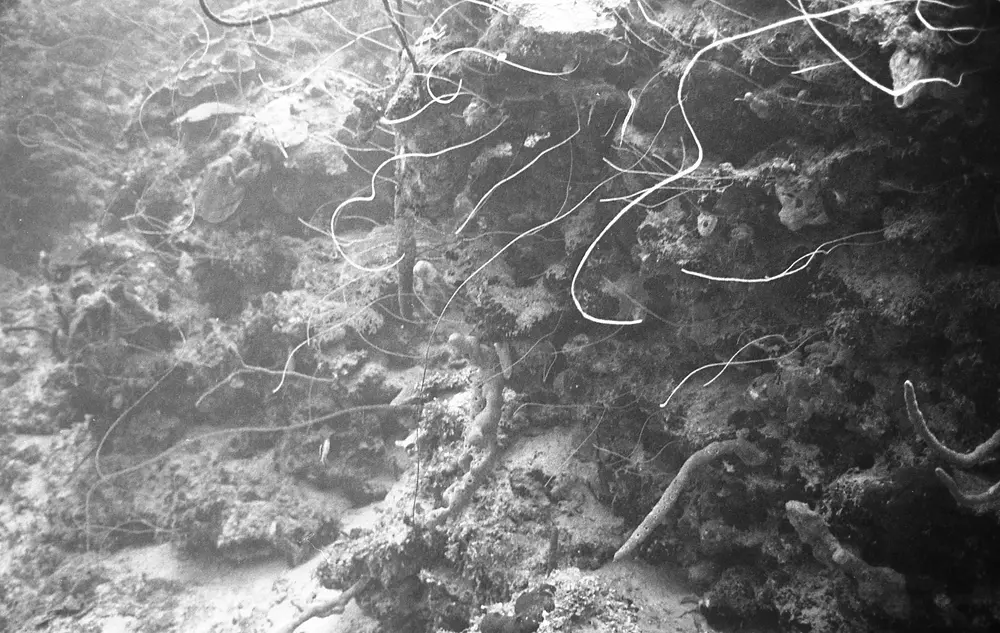{.lightbox group="discovery-bay-1966" description="**UUID: **d7f96a11-bbc3-4f8e-b21f-920061ac09b3 **Date: **1967-10-29 **Location: **Jamaica | Discovery Bay | West Bull **Longitude: **77.39ºW **Latitude: **18.47167ºN **Photographer: **Eileen Graham **Copyright: **Trustees of the Natural History Museum (London, UK), CC-BY-4.0" alt="**UUID: **d7f96a11-bbc3-4f8e-b21f-920061ac09b3 **Date: **1967-10-29 **Location: **Jamaica | Discovery Bay | West Bull **Longitude: **77.39ºW **Latitude: **18.47167ºN **Photographer: **Eileen Graham **Copyright: **Trustees of the Natural History Museum (London, UK), CC-BY-4.0"}

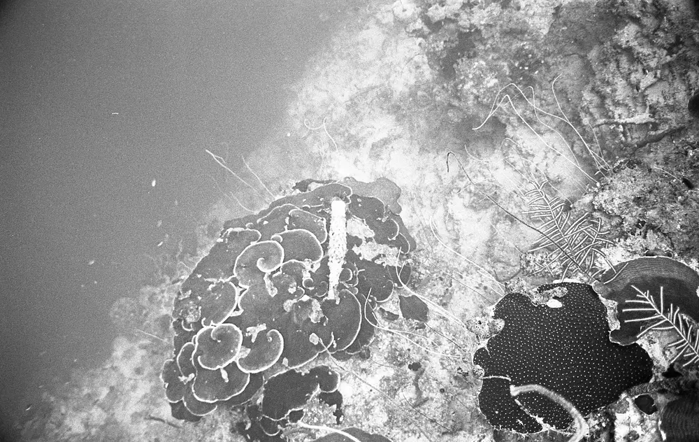{.lightbox group="discovery-bay-1966" description="**UUID: **7704455a-d32f-4d13-ae38-0bd8f94acee5 **Date: **1967-10-29 **Location: **Jamaica | Discovery Bay | West Bull **Longitude: **77.39ºW **Latitude: **18.47167ºN **Photographer: **Eileen Graham **Copyright: **Trustees of the Natural History Museum (London, UK), CC-BY-4.0" alt="**UUID: **7704455a-d32f-4d13-ae38-0bd8f94acee5 **Date: **1967-10-29 **Location: **Jamaica | Discovery Bay | West Bull **Longitude: **77.39ºW **Latitude: **18.47167ºN **Photographer: **Eileen Graham **Copyright: **Trustees of the Natural History Museum (London, UK), CC-BY-4.0"}

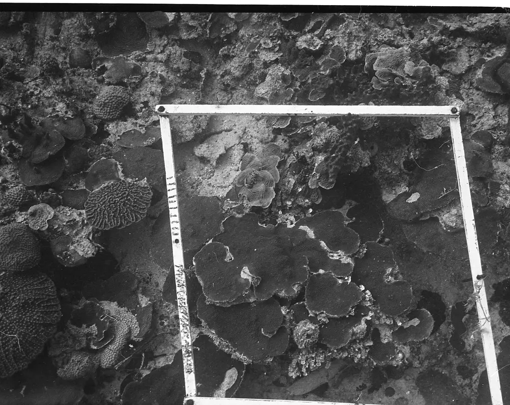{.lightbox group="discovery-bay-1966" description="**UUID: **e10a40cc-e566-4b0e-93b1-2b828e171ecb **Date: **1966-04-27 **Location: **Jamaica | Discovery Bay | Buoy Upper Slope **Longitude: **77.40908ºW **Latitude: **18.47322ºN **Photographer: **Eileen Graham **Copyright: **Trustees of the Natural History Museum (London, UK), CC-BY-4.0" alt="**UUID: **e10a40cc-e566-4b0e-93b1-2b828e171ecb **Date: **1966-04-27 **Location: **Jamaica | Discovery Bay | Buoy Upper Slope **Longitude: **77.40908ºW **Latitude: **18.47322ºN **Photographer: **Eileen Graham **Copyright: **Trustees of the Natural History Museum (London, UK), CC-BY-4.0"}

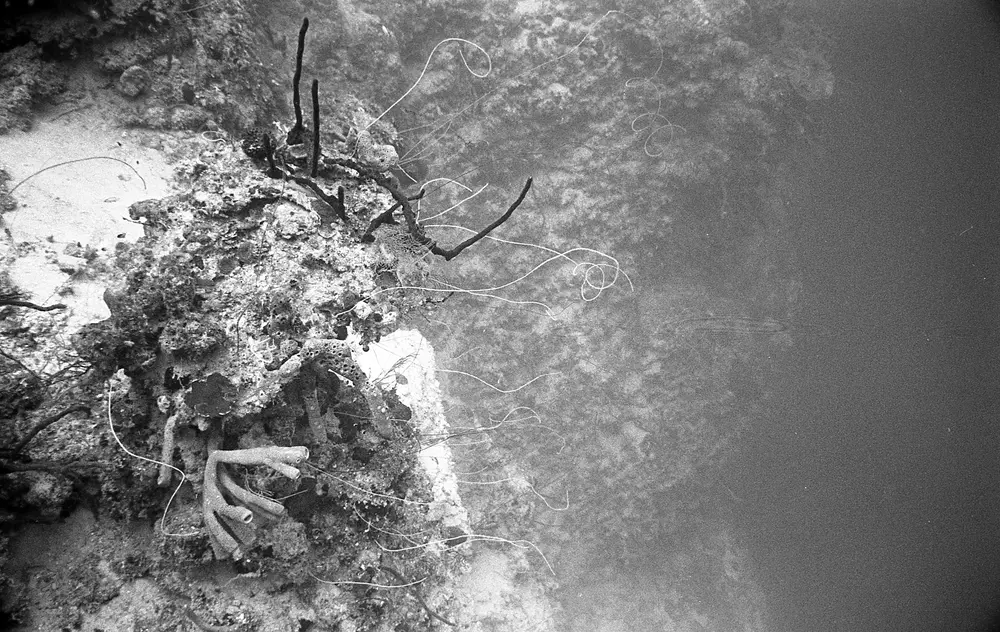{.lightbox group="discovery-bay-1966" description="**UUID: **84e7ab00-a56b-4560-9077-f8a03d4a3486 **Date: **1967-10-29 **Location: **Jamaica | Discovery Bay | West Bull **Longitude: **77.39ºW **Latitude: **18.47167ºN **Photographer: **Eileen Graham **Copyright: **Trustees of the Natural History Museum (London, UK), CC-BY-4.0" alt="**UUID: **84e7ab00-a56b-4560-9077-f8a03d4a3486 **Date: **1967-10-29 **Location: **Jamaica | Discovery Bay | West Bull **Longitude: **77.39ºW **Latitude: **18.47167ºN **Photographer: **Eileen Graham **Copyright: **Trustees of the Natural History Museum (London, UK), CC-BY-4.0"}

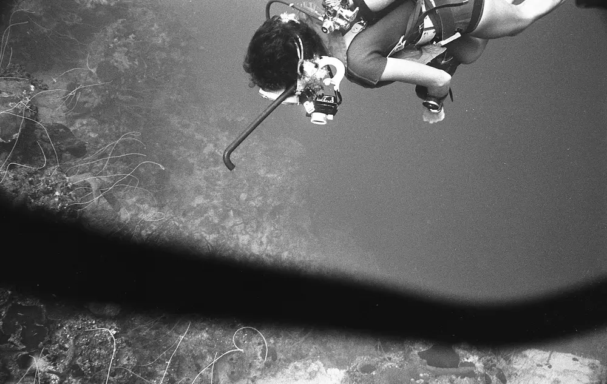{.lightbox group="discovery-bay-1966" description="**UUID: **aadba544-906c-4cf3-8c66-d06ed6ab324c **Date: **1967-10-29 **Location: **Jamaica | Discovery Bay | West Bull **Longitude: **77.39ºW **Latitude: **18.47167ºN **Photographer: **Eileen Graham **Copyright: **Trustees of the Natural History Museum (London, UK), CC-BY-4.0" alt="**UUID: **aadba544-906c-4cf3-8c66-d06ed6ab324c **Date: **1967-10-29 **Location: **Jamaica | Discovery Bay | West Bull **Longitude: **77.39ºW **Latitude: **18.47167ºN **Photographer: **Eileen Graham **Copyright: **Trustees of the Natural History Museum (London, UK), CC-BY-4.0"}

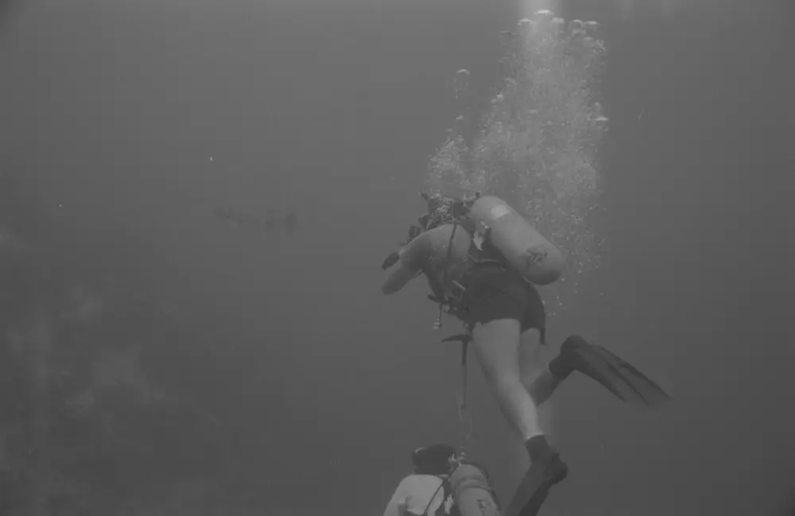{.lightbox group="discovery-bay-1966" description="**UUID: **00980ae0-4eab-4fbf-831b-c127ebde8423 **Date: **1967-05-11 **Location: **Jamaica | Discovery Bay | Buoy West Sand Slope **Longitude: **77.41017ºW **Latitude: **18.47367ºN **Photographer: **Eileen Graham **Copyright: **Trustees of the Natural History Museum (London, UK), CC-BY-4.0" alt="**UUID: **00980ae0-4eab-4fbf-831b-c127ebde8423 **Date: **1967-05-11 **Location: **Jamaica | Discovery Bay | Buoy West Sand Slope **Longitude: **77.41017ºW **Latitude: **18.47367ºN **Photographer: **Eileen Graham **Copyright: **Trustees of the Natural History Museum (London, UK), CC-BY-4.0"}

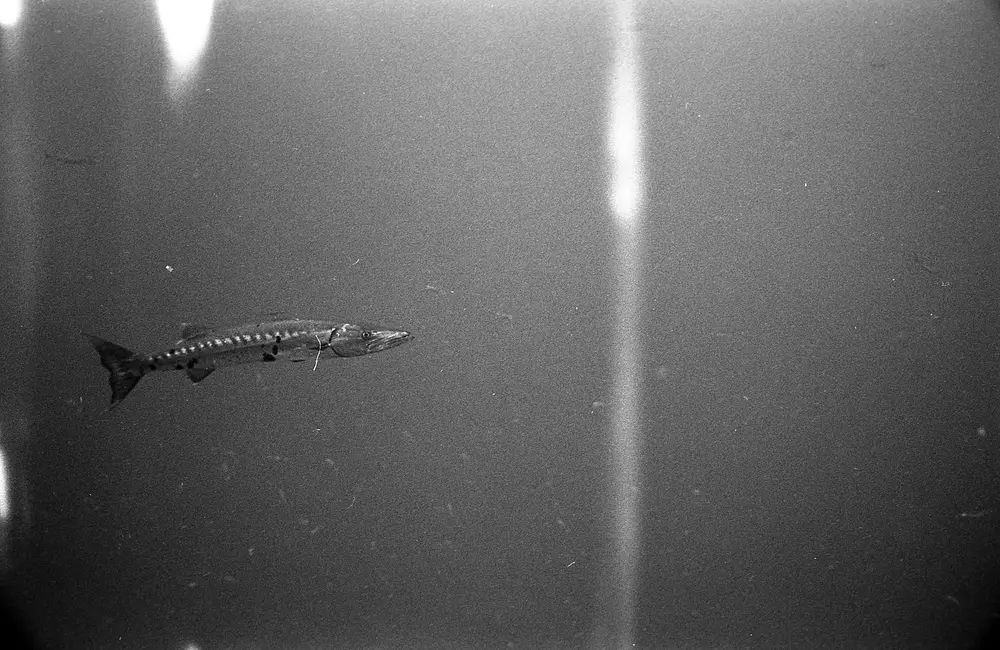{.lightbox group="discovery-bay-1966" description="**UUID: **895e1f69-0a05-40f3-9c92-2799dcfaa680 **Date: **1967-05-11 **Location: **Jamaica | Discovery Bay | Buoy West Sand Slope **Longitude: **77.41017ºW **Latitude: **18.47367ºN **Photographer: **Eileen Graham **Copyright: **Trustees of the Natural History Museum (London, UK), CC-BY-4.0" alt="**UUID: **895e1f69-0a05-40f3-9c92-2799dcfaa680 **Date: **1967-05-11 **Location: **Jamaica | Discovery Bay | Buoy West Sand Slope **Longitude: **77.41017ºW **Latitude: **18.47367ºN **Photographer: **Eileen Graham **Copyright: **Trustees of the Natural History Museum (London, UK), CC-BY-4.0"}

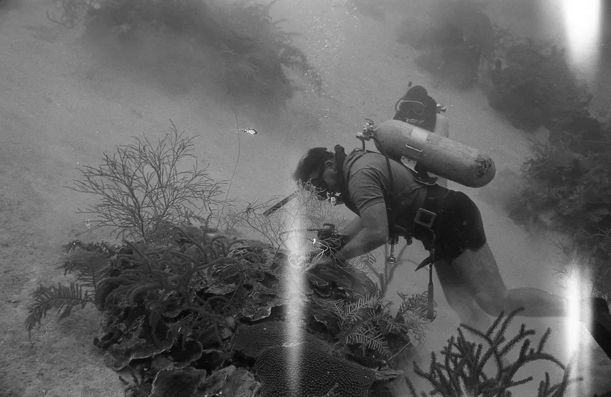{.lightbox group="discovery-bay-1966" description="**UUID: **0342f842-c9e9-44ce-a7da-3d54fcb18952 **Date: **1967-05-11 **Location: **Jamaica | Discovery Bay | Buoy West Sand Slope **Longitude: **77.41017ºW **Latitude: **18.47367ºN **Photographer: **Eileen Graham **Copyright: **Trustees of the Natural History Museum (London, UK), CC-BY-4.0" alt="**UUID: **0342f842-c9e9-44ce-a7da-3d54fcb18952 **Date: **1967-05-11 **Location: **Jamaica | Discovery Bay | Buoy West Sand Slope **Longitude: **77.41017ºW **Latitude: **18.47367ºN **Photographer: **Eileen Graham **Copyright: **Trustees of the Natural History Museum (London, UK), CC-BY-4.0"}

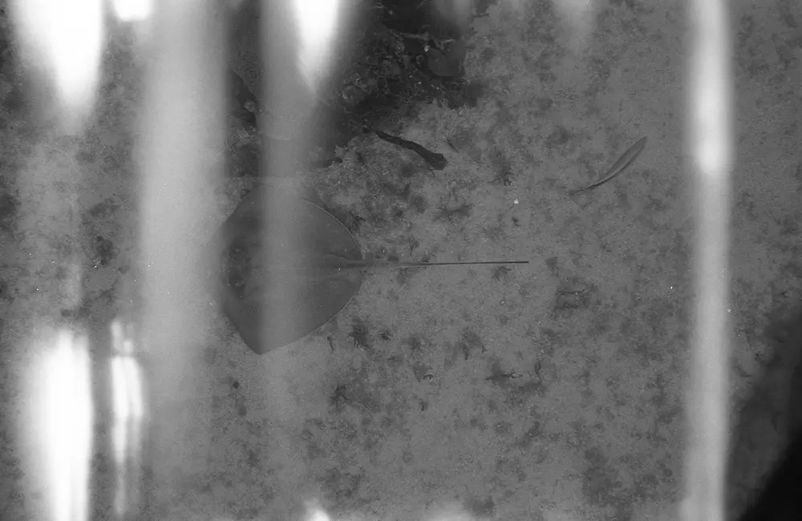{.lightbox group="discovery-bay-1966" description="**UUID: **613dc42e-fdf0-43b6-b921-d69661e33c37 **Date: **1967-05-11 **Location: **Jamaica | Discovery Bay | Buoy West Sand Slope **Longitude: **77.41017ºW **Latitude: **18.47367ºN **Photographer: **Eileen Graham **Copyright: **Trustees of the Natural History Museum (London, UK), CC-BY-4.0" alt="**UUID: **613dc42e-fdf0-43b6-b921-d69661e33c37 **Date: **1967-05-11 **Location: **Jamaica | Discovery Bay | Buoy West Sand Slope **Longitude: **77.41017ºW **Latitude: **18.47367ºN **Photographer: **Eileen Graham **Copyright: **Trustees of the Natural History Museum (London, UK), CC-BY-4.0"}

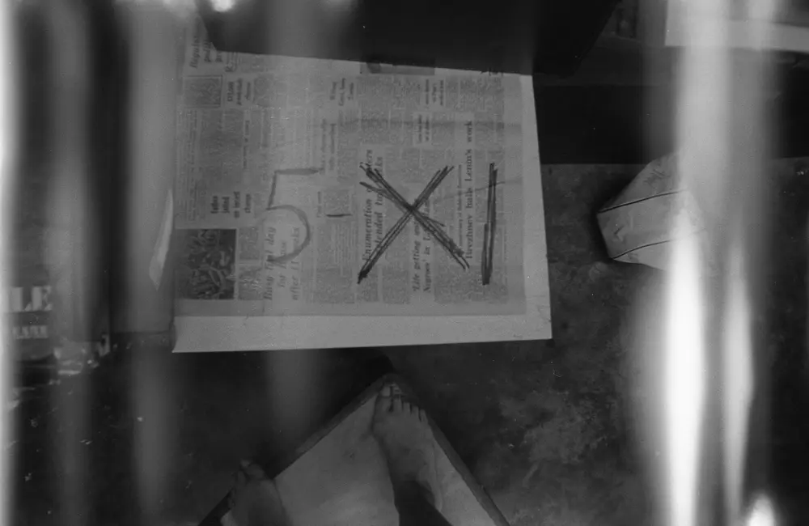{.lightbox group="discovery-bay-1966" description="**UUID: **ad8c2f41-baf5-499a-80b5-9363cb7cab40 **Date: **1967-05-11 **Location: **Jamaica | Discovery Bay | Buoy West Sand Slope **Longitude: **77.41017ºW **Latitude: **18.47367ºN **Photographer: **Eileen Graham **Copyright: **Trustees of the Natural History Museum (London, UK), CC-BY-4.0" alt="**UUID: **ad8c2f41-baf5-499a-80b5-9363cb7cab40 **Date: **1967-05-11 **Location: **Jamaica | Discovery Bay | Buoy West Sand Slope **Longitude: **77.41017ºW **Latitude: **18.47367ºN **Photographer: **Eileen Graham **Copyright: **Trustees of the Natural History Museum (London, UK), CC-BY-4.0"}

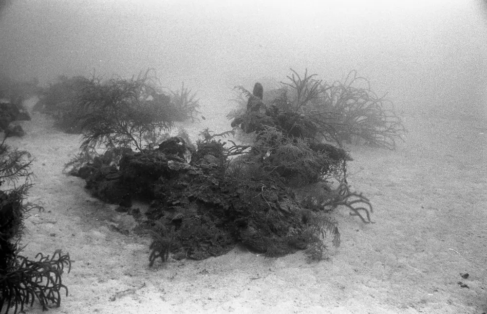{.lightbox group="discovery-bay-1966" description="**UUID: **9e77cf32-9ce9-4a98-82b3-34024fcfe261 **Date: **1967-05-11 **Location: **Jamaica | Discovery Bay | Buoy West Sand Slope **Longitude: **77.41017ºW **Latitude: **18.47367ºN **Photographer: **Eileen Graham **Copyright: **Trustees of the Natural History Museum (London, UK), CC-BY-4.0" alt="**UUID: **9e77cf32-9ce9-4a98-82b3-34024fcfe261 **Date: **1967-05-11 **Location: **Jamaica | Discovery Bay | Buoy West Sand Slope **Longitude: **77.41017ºW **Latitude: **18.47367ºN **Photographer: **Eileen Graham **Copyright: **Trustees of the Natural History Museum (London, UK), CC-BY-4.0"}

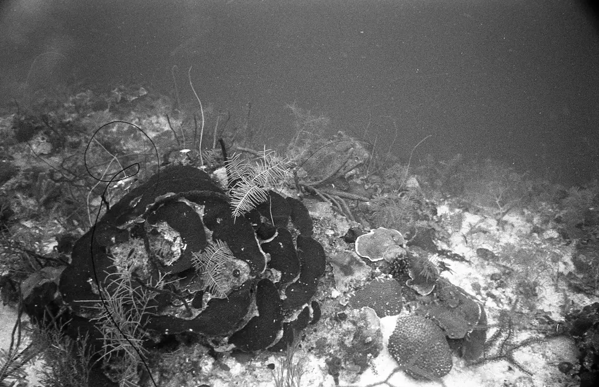{.lightbox group="discovery-bay-1966" description="**UUID: **848f07ac-ca8e-40dc-bbf5-cd03e0abaf99 **Date: **1967-05-11 **Location: **Jamaica | Discovery Bay | Buoy West Sand Deep **Longitude: **77.41017ºW **Latitude: **18.47367ºN **Photographer: **Eileen Graham **Copyright: **Trustees of the Natural History Museum (London, UK), CC-BY-4.0" alt="**UUID: **848f07ac-ca8e-40dc-bbf5-cd03e0abaf99 **Date: **1967-05-11 **Location: **Jamaica | Discovery Bay | Buoy West Sand Deep **Longitude: **77.41017ºW **Latitude: **18.47367ºN **Photographer: **Eileen Graham **Copyright: **Trustees of the Natural History Museum (London, UK), CC-BY-4.0"}

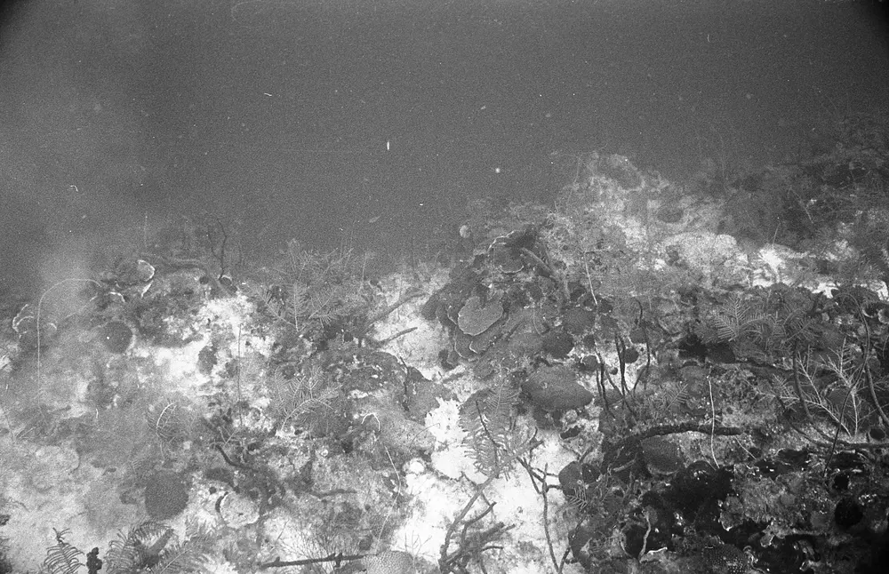{.lightbox group="discovery-bay-1966" description="**UUID: **4e00fb24-db2f-4401-a232-2c85a8a2f2a6 **Date: **1967-05-11 **Location: **Jamaica | Discovery Bay | Buoy West Sand Deep **Longitude: **77.41017ºW **Latitude: **18.47367ºN **Photographer: **Eileen Graham **Copyright: **Trustees of the Natural History Museum (London, UK), CC-BY-4.0" alt="**UUID: **4e00fb24-db2f-4401-a232-2c85a8a2f2a6 **Date: **1967-05-11 **Location: **Jamaica | Discovery Bay | Buoy West Sand Deep **Longitude: **77.41017ºW **Latitude: **18.47367ºN **Photographer: **Eileen Graham **Copyright: **Trustees of the Natural History Museum (London, UK), CC-BY-4.0"}

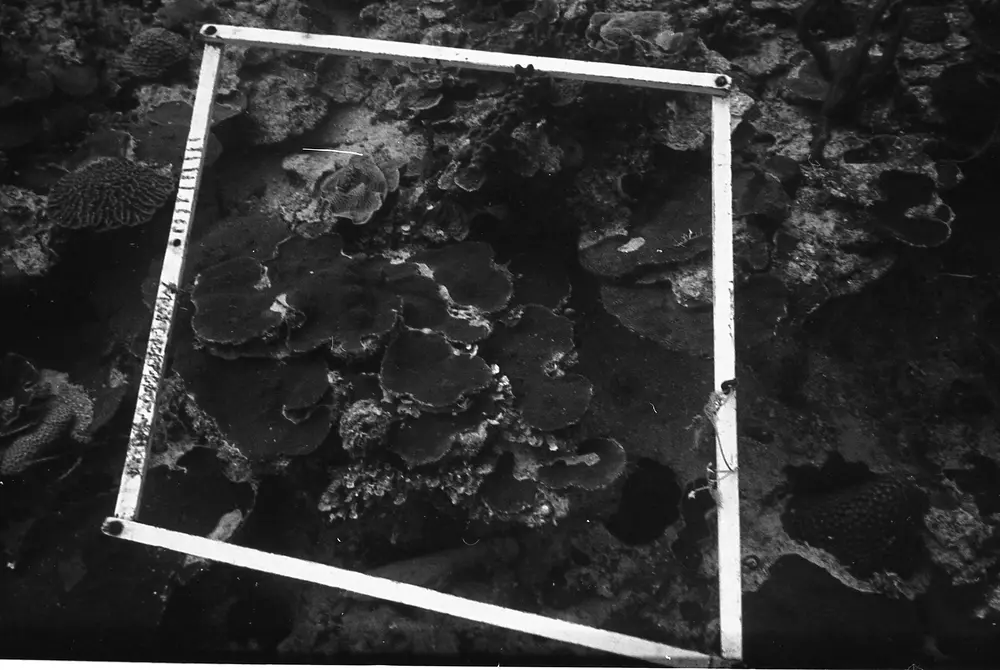{.lightbox group="discovery-bay-1966" description="**UUID: **e68ac153-bc1b-43d8-80b4-1bc68859a6c2 **Date: **1966-04-27 **Location: **Jamaica | Discovery Bay | Buoy Upper Slope **Longitude: **77.40908ºW **Latitude: **18.47322ºN **Photographer: **Eileen Graham **Copyright: **Trustees of the Natural History Museum (London, UK), CC-BY-4.0" alt="**UUID: **e68ac153-bc1b-43d8-80b4-1bc68859a6c2 **Date: **1966-04-27 **Location: **Jamaica | Discovery Bay | Buoy Upper Slope **Longitude: **77.40908ºW **Latitude: **18.47322ºN **Photographer: **Eileen Graham **Copyright: **Trustees of the Natural History Museum (London, UK), CC-BY-4.0"}

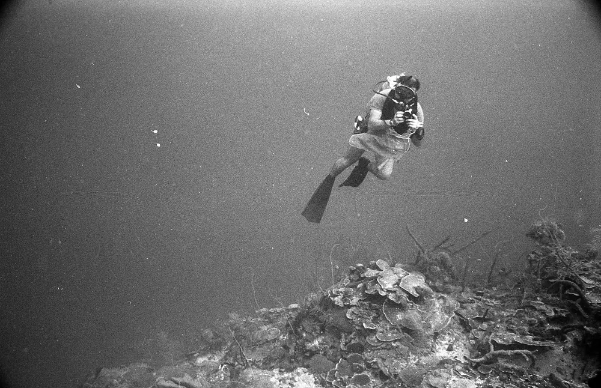{.lightbox group="discovery-bay-1966" description="**UUID: **e60b2e65-9511-4459-9051-a8eda4e4eb93 **Date: **1967-05-11 **Location: **Jamaica | Discovery Bay | Buoy West Sand Deep **Longitude: **77.41017ºW **Latitude: **18.47367ºN **Photographer: **Eileen Graham **Copyright: **Trustees of the Natural History Museum (London, UK), CC-BY-4.0" alt="**UUID: **e60b2e65-9511-4459-9051-a8eda4e4eb93 **Date: **1967-05-11 **Location: **Jamaica | Discovery Bay | Buoy West Sand Deep **Longitude: **77.41017ºW **Latitude: **18.47367ºN **Photographer: **Eileen Graham **Copyright: **Trustees of the Natural History Museum (London, UK), CC-BY-4.0"}

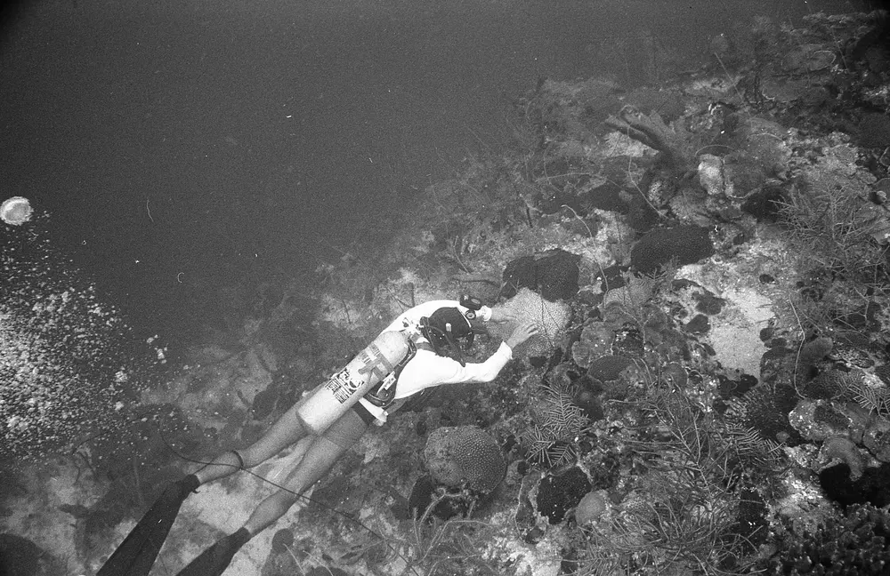{.lightbox group="discovery-bay-1966" description="**UUID: **0e8cd777-4376-46ae-b54f-65699a0d6667 **Date: **1967-05-11 **Location: **Jamaica | Discovery Bay | Buoy West Sand Deep **Longitude: **77.41017ºW **Latitude: **18.47367ºN **Photographer: **Eileen Graham **Copyright: **Trustees of the Natural History Museum (London, UK), CC-BY-4.0" alt="**UUID: **0e8cd777-4376-46ae-b54f-65699a0d6667 **Date: **1967-05-11 **Location: **Jamaica | Discovery Bay | Buoy West Sand Deep **Longitude: **77.41017ºW **Latitude: **18.47367ºN **Photographer: **Eileen Graham **Copyright: **Trustees of the Natural History Museum (London, UK), CC-BY-4.0"}

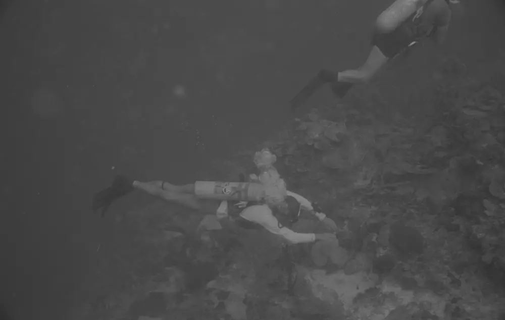{.lightbox group="discovery-bay-1966" description="**UUID: **7b3fa396-b9fe-4450-9fa5-daaac3e69a0a **Date: **1967-05-11 **Location: **Jamaica | Discovery Bay | Buoy West Sand Deep **Longitude: **77.41017ºW **Latitude: **18.47367ºN **Photographer: **Eileen Graham **Copyright: **Trustees of the Natural History Museum (London, UK), CC-BY-4.0" alt="**UUID: **7b3fa396-b9fe-4450-9fa5-daaac3e69a0a **Date: **1967-05-11 **Location: **Jamaica | Discovery Bay | Buoy West Sand Deep **Longitude: **77.41017ºW **Latitude: **18.47367ºN **Photographer: **Eileen Graham **Copyright: **Trustees of the Natural History Museum (London, UK), CC-BY-4.0"}

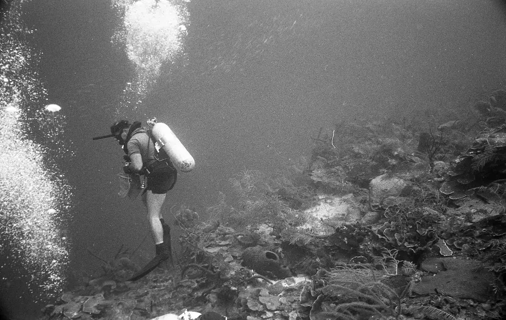{.lightbox group="discovery-bay-1966" description="**UUID: **fc519fd5-b5de-46fc-94cc-54e83a6d4237 **Date: **1967-05-11 **Location: **Jamaica | Discovery Bay | Buoy West Sand Deep **Longitude: **77.41017ºW **Latitude: **18.47367ºN **Photographer: **Eileen Graham **Copyright: **Trustees of the Natural History Museum (London, UK), CC-BY-4.0" alt="**UUID: **fc519fd5-b5de-46fc-94cc-54e83a6d4237 **Date: **1967-05-11 **Location: **Jamaica | Discovery Bay | Buoy West Sand Deep **Longitude: **77.41017ºW **Latitude: **18.47367ºN **Photographer: **Eileen Graham **Copyright: **Trustees of the Natural History Museum (London, UK), CC-BY-4.0"}

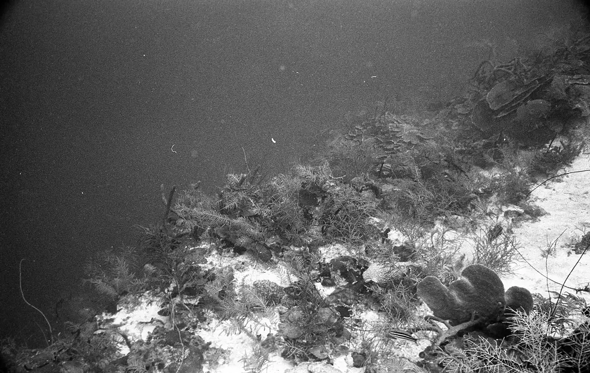{.lightbox group="discovery-bay-1966" description="**UUID: **a2f09a71-5bc7-4f13-b1ff-95f623cedc01 **Date: **1967-05-11 **Location: **Jamaica | Discovery Bay | Buoy West Sand Deep **Longitude: **77.41017ºW **Latitude: **18.47367ºN **Photographer: **Eileen Graham **Copyright: **Trustees of the Natural History Museum (London, UK), CC-BY-4.0" alt="**UUID: **a2f09a71-5bc7-4f13-b1ff-95f623cedc01 **Date: **1967-05-11 **Location: **Jamaica | Discovery Bay | Buoy West Sand Deep **Longitude: **77.41017ºW **Latitude: **18.47367ºN **Photographer: **Eileen Graham **Copyright: **Trustees of the Natural History Museum (London, UK), CC-BY-4.0"}

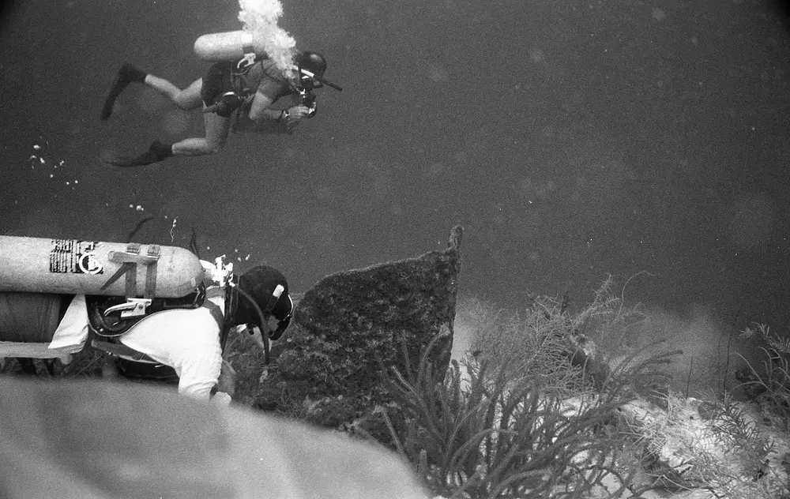{.lightbox group="discovery-bay-1966" description="**UUID: **f1390c86-25a0-4e53-869e-9a012014485e **Date: **1967-05-11 **Location: **Jamaica | Discovery Bay | Buoy West Sand Slope **Longitude: **77.41017ºW **Latitude: **18.47367ºN **Photographer: **Eileen Graham **Copyright: **Trustees of the Natural History Museum (London, UK), CC-BY-4.0" alt="**UUID: **f1390c86-25a0-4e53-869e-9a012014485e **Date: **1967-05-11 **Location: **Jamaica | Discovery Bay | Buoy West Sand Slope **Longitude: **77.41017ºW **Latitude: **18.47367ºN **Photographer: **Eileen Graham **Copyright: **Trustees of the Natural History Museum (London, UK), CC-BY-4.0"}

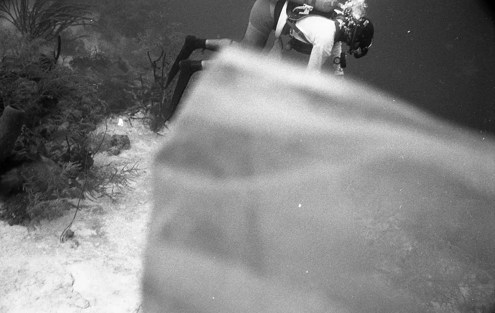{.lightbox group="discovery-bay-1966" description="**UUID: **72c43347-d271-4919-bd7d-e9cb84f9fa29 **Date: **1967-05-11 **Location: **Jamaica | Discovery Bay | Buoy West Sand Slope **Longitude: **77.41017ºW **Latitude: **18.47367ºN **Photographer: **Eileen Graham **Copyright: **Trustees of the Natural History Museum (London, UK), CC-BY-4.0" alt="**UUID: **72c43347-d271-4919-bd7d-e9cb84f9fa29 **Date: **1967-05-11 **Location: **Jamaica | Discovery Bay | Buoy West Sand Slope **Longitude: **77.41017ºW **Latitude: **18.47367ºN **Photographer: **Eileen Graham **Copyright: **Trustees of the Natural History Museum (London, UK), CC-BY-4.0"}

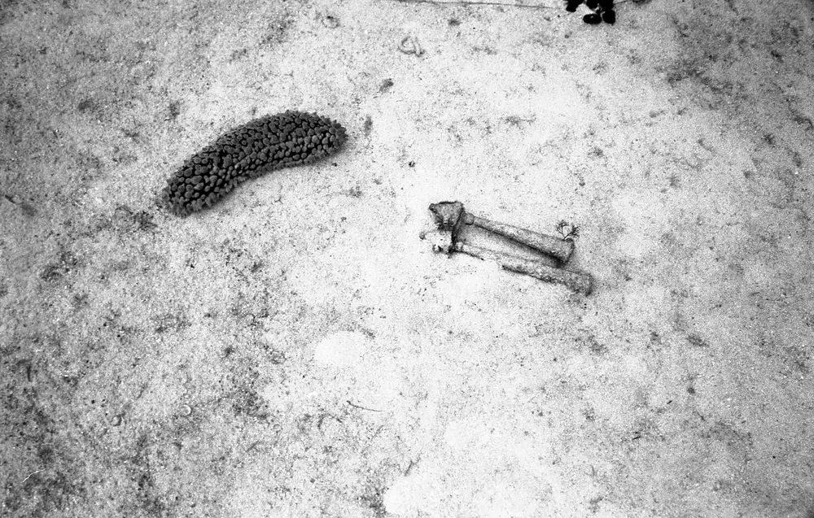{.lightbox group="discovery-bay-1966" description="**UUID: **f6830b7c-1a86-4da9-b98a-fe7ce7f146ea **Date: **1967-05-11 **Location: **Jamaica | Discovery Bay | Buoy West Sand Slope **Longitude: **77.41017ºW **Latitude: **18.47367ºN **Photographer: **Eileen Graham **Copyright: **Trustees of the Natural History Museum (London, UK), CC-BY-4.0" alt="**UUID: **f6830b7c-1a86-4da9-b98a-fe7ce7f146ea **Date: **1967-05-11 **Location: **Jamaica | Discovery Bay | Buoy West Sand Slope **Longitude: **77.41017ºW **Latitude: **18.47367ºN **Photographer: **Eileen Graham **Copyright: **Trustees of the Natural History Museum (London, UK), CC-BY-4.0"}

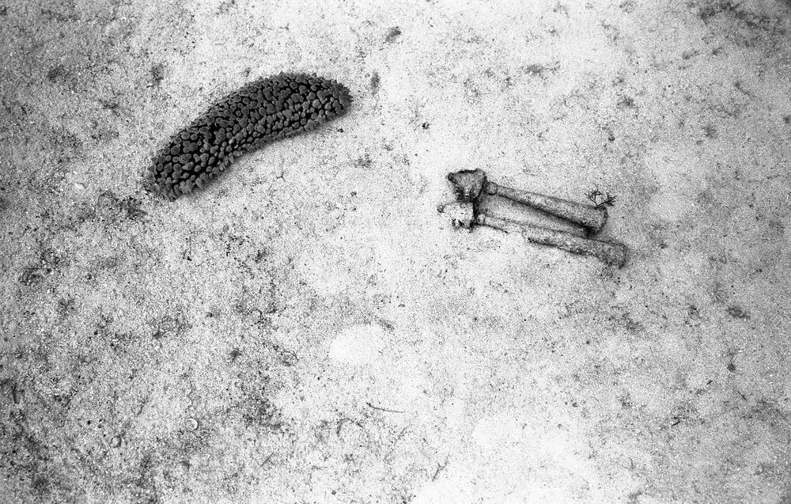{.lightbox group="discovery-bay-1966" description="**UUID: **665d67d8-9922-42fb-bcbb-452f5742e86d **Date: **1967-05-11 **Location: **Jamaica | Discovery Bay | Buoy West Sand Slope **Longitude: **77.41017ºW **Latitude: **18.47367ºN **Photographer: **Eileen Graham **Copyright: **Trustees of the Natural History Museum (London, UK), CC-BY-4.0" alt="**UUID: **665d67d8-9922-42fb-bcbb-452f5742e86d **Date: **1967-05-11 **Location: **Jamaica | Discovery Bay | Buoy West Sand Slope **Longitude: **77.41017ºW **Latitude: **18.47367ºN **Photographer: **Eileen Graham **Copyright: **Trustees of the Natural History Museum (London, UK), CC-BY-4.0"}

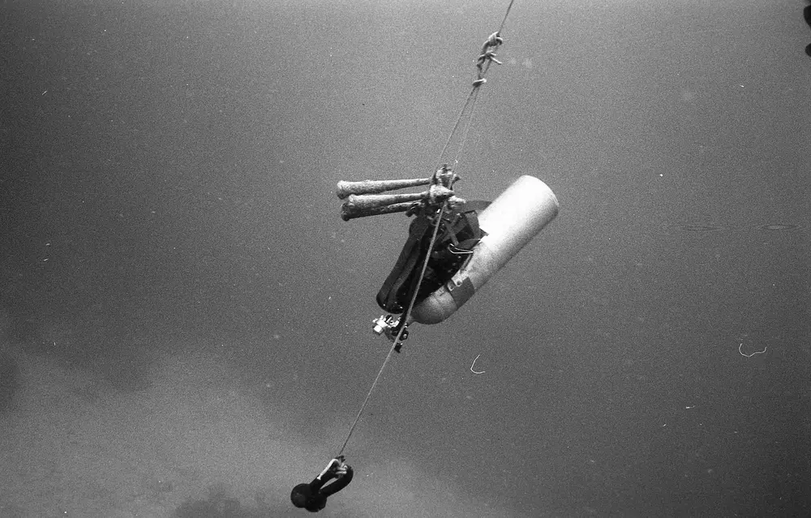{.lightbox group="discovery-bay-1966" description="**UUID: **9354d1f0-6ea7-4fe9-827d-f04ef12ff3d0 **Date: **1967-05-11 **Location: **Jamaica | Discovery Bay | Buoy Mooring (1960s) **Longitude: **77.40908ºW **Latitude: **18.47322ºN **Photographer: **Eileen Graham **Copyright: **Trustees of the Natural History Museum (London, UK), CC-BY-4.0" alt="**UUID: **9354d1f0-6ea7-4fe9-827d-f04ef12ff3d0 **Date: **1967-05-11 **Location: **Jamaica | Discovery Bay | Buoy Mooring (1960s) **Longitude: **77.40908ºW **Latitude: **18.47322ºN **Photographer: **Eileen Graham **Copyright: **Trustees of the Natural History Museum (London, UK), CC-BY-4.0"}

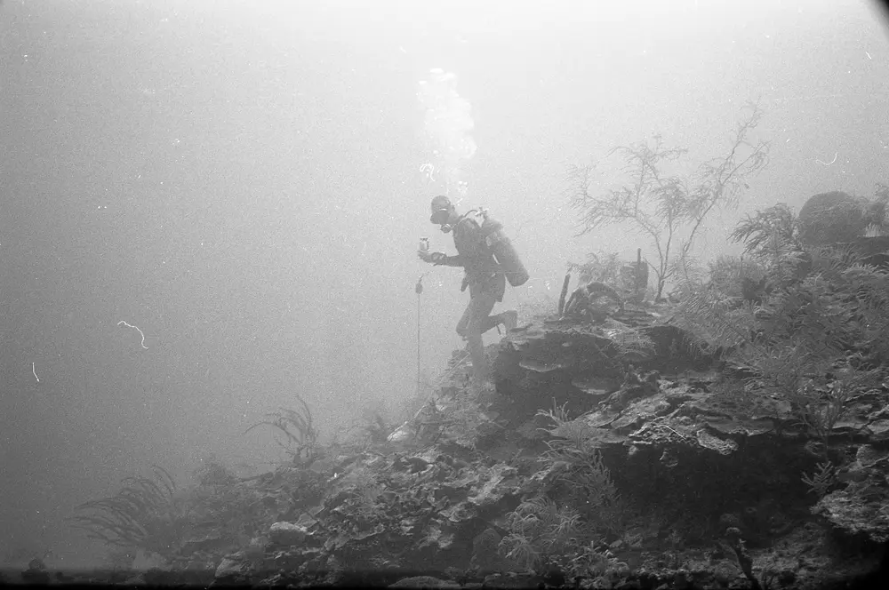{.lightbox group="discovery-bay-1966" description="**UUID: **ef8a7a7f-9097-4098-8793-d07ee7f1e687 **Date: **1966-04-27 **Location: **Jamaica | Discovery Bay | Buoy Upper Slope **Longitude: **77.40908ºW **Latitude: **18.47322ºN **Photographer: **Eileen Graham **Copyright: **Trustees of the Natural History Museum (London, UK), CC-BY-4.0" alt="**UUID: **ef8a7a7f-9097-4098-8793-d07ee7f1e687 **Date: **1966-04-27 **Location: **Jamaica | Discovery Bay | Buoy Upper Slope **Longitude: **77.40908ºW **Latitude: **18.47322ºN **Photographer: **Eileen Graham **Copyright: **Trustees of the Natural History Museum (London, UK), CC-BY-4.0"}

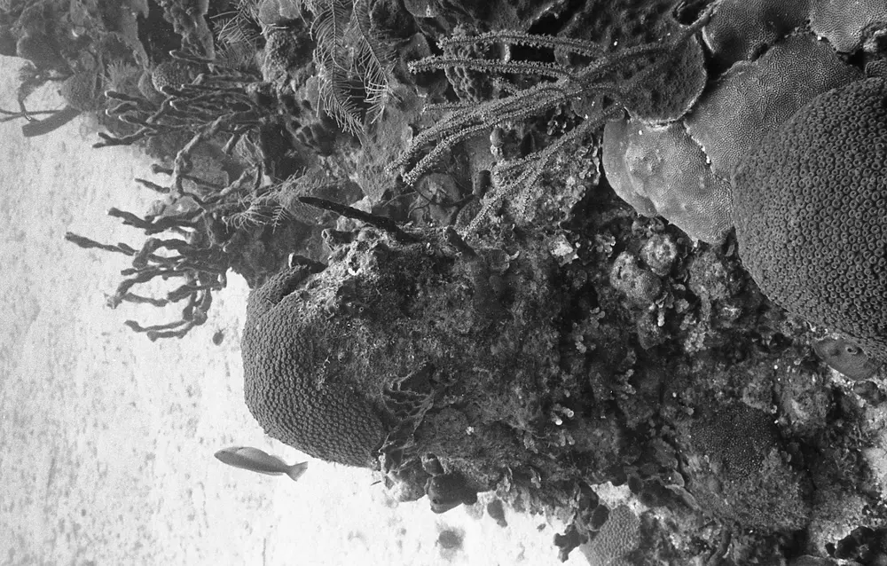{.lightbox group="discovery-bay-1966" description="**UUID: **b89eb7d7-f1ff-458a-8f5f-777bf6efb10e **Date: **1967-05-11 **Location: **Jamaica | Discovery Bay | Buoy Upper Slope **Longitude: **77.40908ºW **Latitude: **18.47322ºN **Photographer: **Eileen Graham **Copyright: **Trustees of the Natural History Museum (London, UK), CC-BY-4.0" alt="**UUID: **b89eb7d7-f1ff-458a-8f5f-777bf6efb10e **Date: **1967-05-11 **Location: **Jamaica | Discovery Bay | Buoy Upper Slope **Longitude: **77.40908ºW **Latitude: **18.47322ºN **Photographer: **Eileen Graham **Copyright: **Trustees of the Natural History Museum (London, UK), CC-BY-4.0"}

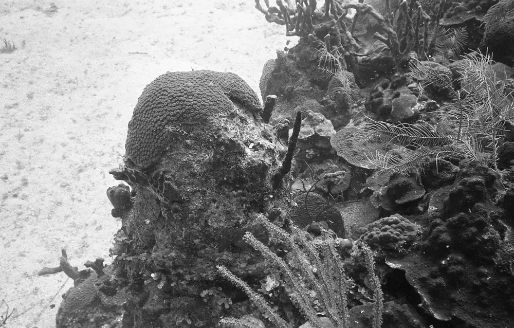{.lightbox group="discovery-bay-1966" description="**UUID: **e5a69a3e-9d38-4386-9301-d686cf0c7059 **Date: **1967-05-11 **Location: **Jamaica | Discovery Bay | Buoy Upper Slope **Longitude: **77.40908ºW **Latitude: **18.47322ºN **Photographer: **Eileen Graham **Copyright: **Trustees of the Natural History Museum (London, UK), CC-BY-4.0" alt="**UUID: **e5a69a3e-9d38-4386-9301-d686cf0c7059 **Date: **1967-05-11 **Location: **Jamaica | Discovery Bay | Buoy Upper Slope **Longitude: **77.40908ºW **Latitude: **18.47322ºN **Photographer: **Eileen Graham **Copyright: **Trustees of the Natural History Museum (London, UK), CC-BY-4.0"}

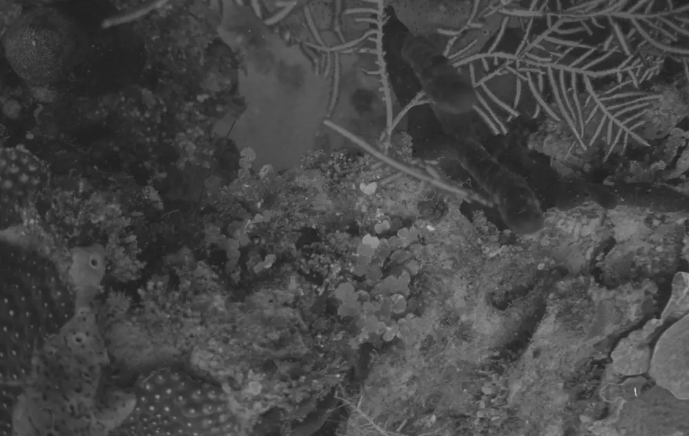{.lightbox group="discovery-bay-1966" description="**UUID: **c75f8f60-1eee-4a5f-a6b2-8e5ed7a3f2be **Date: **1967-05-11 **Location: **Jamaica | Discovery Bay | Buoy Upper Slope **Longitude: **77.40908ºW **Latitude: **18.47322ºN **Photographer: **Eileen Graham **Copyright: **Trustees of the Natural History Museum (London, UK), CC-BY-4.0" alt="**UUID: **c75f8f60-1eee-4a5f-a6b2-8e5ed7a3f2be **Date: **1967-05-11 **Location: **Jamaica | Discovery Bay | Buoy Upper Slope **Longitude: **77.40908ºW **Latitude: **18.47322ºN **Photographer: **Eileen Graham **Copyright: **Trustees of the Natural History Museum (London, UK), CC-BY-4.0"}

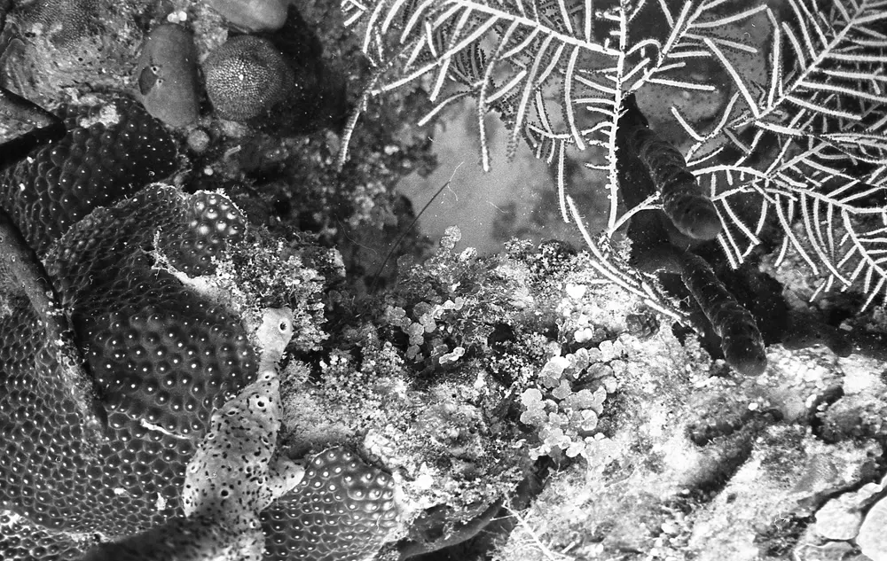{.lightbox group="discovery-bay-1966" description="**UUID: **1f946e63-e268-4ac1-b36a-7aca04e0a930 **Date: **1967-05-11 **Location: **Jamaica | Discovery Bay | Buoy Upper Slope **Longitude: **77.40908ºW **Latitude: **18.47322ºN **Photographer: **Eileen Graham **Copyright: **Trustees of the Natural History Museum (London, UK), CC-BY-4.0" alt="**UUID: **1f946e63-e268-4ac1-b36a-7aca04e0a930 **Date: **1967-05-11 **Location: **Jamaica | Discovery Bay | Buoy Upper Slope **Longitude: **77.40908ºW **Latitude: **18.47322ºN **Photographer: **Eileen Graham **Copyright: **Trustees of the Natural History Museum (London, UK), CC-BY-4.0"}

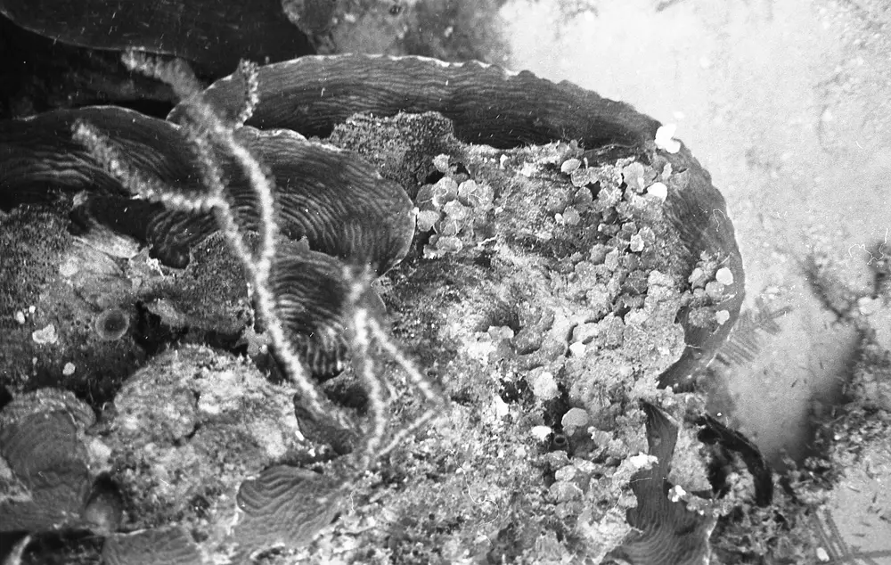{.lightbox group="discovery-bay-1966" description="**UUID: **0a579a9c-8bda-41b3-95dd-ba5bbc681857 **Date: **1967-05-11 **Location: **Jamaica | Discovery Bay | Buoy Upper Slope **Longitude: **77.40908ºW **Latitude: **18.47322ºN **Photographer: **Eileen Graham **Copyright: **Trustees of the Natural History Museum (London, UK), CC-BY-4.0" alt="**UUID: **0a579a9c-8bda-41b3-95dd-ba5bbc681857 **Date: **1967-05-11 **Location: **Jamaica | Discovery Bay | Buoy Upper Slope **Longitude: **77.40908ºW **Latitude: **18.47322ºN **Photographer: **Eileen Graham **Copyright: **Trustees of the Natural History Museum (London, UK), CC-BY-4.0"}

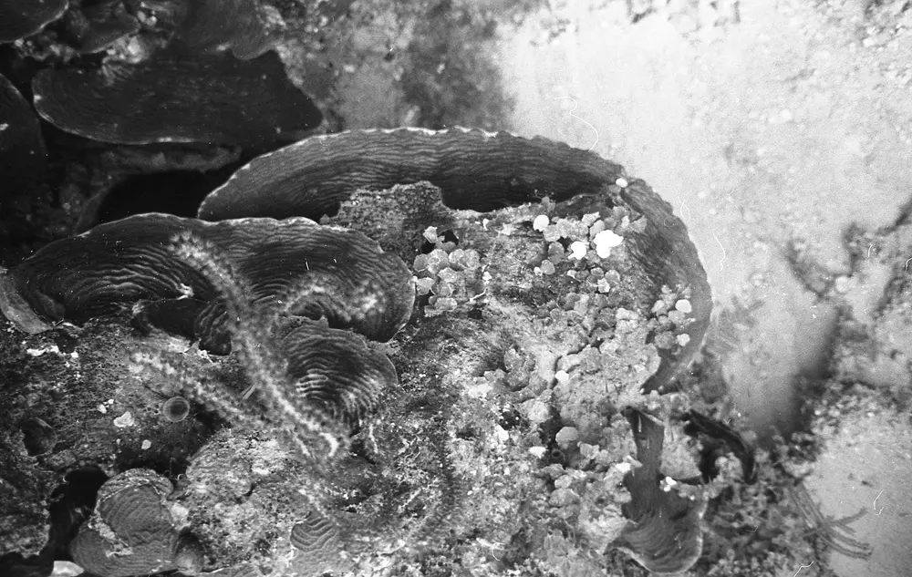{.lightbox group="discovery-bay-1966" description="**UUID: **fa702bca-72f6-4d30-83e6-9ac33561fd1d **Date: **1967-05-11 **Location: **Jamaica | Discovery Bay | Buoy Upper Slope **Longitude: **77.40908ºW **Latitude: **18.47322ºN **Photographer: **Eileen Graham **Copyright: **Trustees of the Natural History Museum (London, UK), CC-BY-4.0" alt="**UUID: **fa702bca-72f6-4d30-83e6-9ac33561fd1d **Date: **1967-05-11 **Location: **Jamaica | Discovery Bay | Buoy Upper Slope **Longitude: **77.40908ºW **Latitude: **18.47322ºN **Photographer: **Eileen Graham **Copyright: **Trustees of the Natural History Museum (London, UK), CC-BY-4.0"}

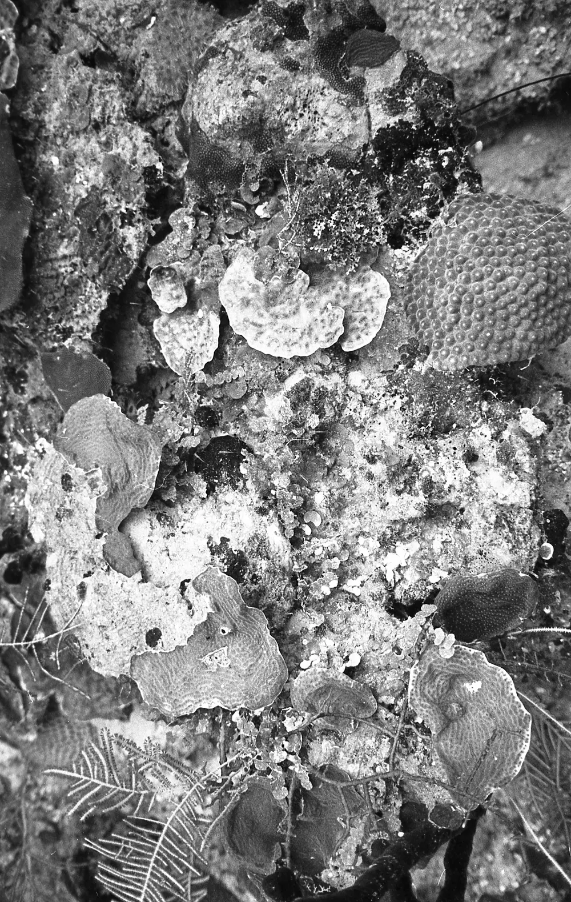{.lightbox group="discovery-bay-1966" description="**UUID: **128c80c0-6343-44ca-8cc4-d92557a0d9f9 **Date: **1967-05-11 **Location: **Jamaica | Discovery Bay | Buoy Upper Slope **Longitude: **77.40908ºW **Latitude: **18.47322ºN **Photographer: **Eileen Graham **Copyright: **Trustees of the Natural History Museum (London, UK), CC-BY-4.0" alt="**UUID: **128c80c0-6343-44ca-8cc4-d92557a0d9f9 **Date: **1967-05-11 **Location: **Jamaica | Discovery Bay | Buoy Upper Slope **Longitude: **77.40908ºW **Latitude: **18.47322ºN **Photographer: **Eileen Graham **Copyright: **Trustees of the Natural History Museum (London, UK), CC-BY-4.0"}

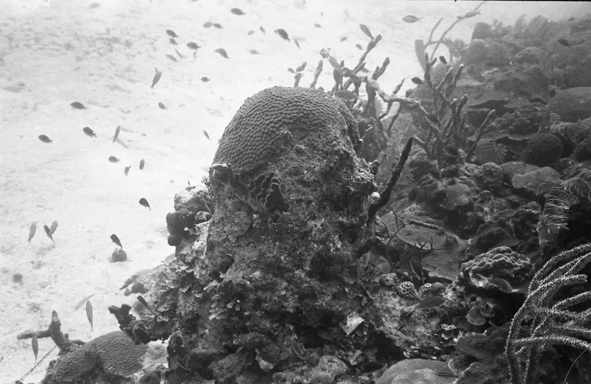{.lightbox group="discovery-bay-1966" description="**UUID: **74356237-99e2-4393-be39-015f8fbeecf6 **Date: **1967-10-12 **Location: **Jamaica | Discovery Bay | Buoy Upper Slope **Longitude: **77.40908ºW **Latitude: **18.47322ºN **Photographer: **Eileen Graham **Copyright: **Trustees of the Natural History Museum (London, UK), CC-BY-4.0" alt="**UUID: **74356237-99e2-4393-be39-015f8fbeecf6 **Date: **1967-10-12 **Location: **Jamaica | Discovery Bay | Buoy Upper Slope **Longitude: **77.40908ºW **Latitude: **18.47322ºN **Photographer: **Eileen Graham **Copyright: **Trustees of the Natural History Museum (London, UK), CC-BY-4.0"}

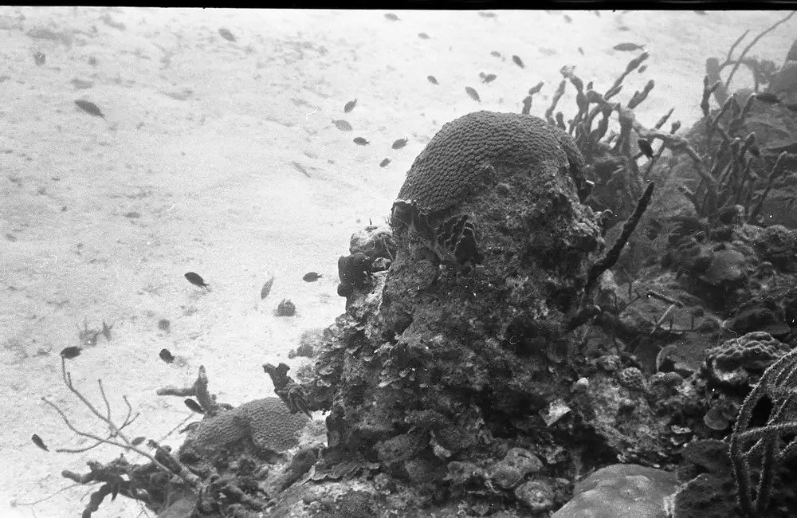{.lightbox group="discovery-bay-1966" description="**UUID: **90792321-ee04-4f80-a131-13f6de6a8e7e **Date: **1967-10-12 **Location: **Jamaica | Discovery Bay | Buoy Upper Slope **Longitude: **77.40908ºW **Latitude: **18.47322ºN **Photographer: **Eileen Graham **Copyright: **Trustees of the Natural History Museum (London, UK), CC-BY-4.0" alt="**UUID: **90792321-ee04-4f80-a131-13f6de6a8e7e **Date: **1967-10-12 **Location: **Jamaica | Discovery Bay | Buoy Upper Slope **Longitude: **77.40908ºW **Latitude: **18.47322ºN **Photographer: **Eileen Graham **Copyright: **Trustees of the Natural History Museum (London, UK), CC-BY-4.0"}

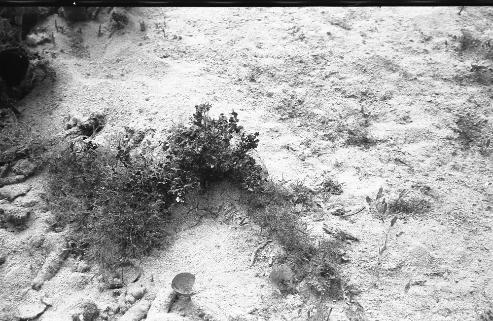{.lightbox group="discovery-bay-1966" description="**UUID: **effd5870-72eb-4d20-a2be-526bf8bb8744 **Date: **1967-10-12 **Location: **Jamaica | Discovery Bay | Buoy Upper Slope **Longitude: **77.40908ºW **Latitude: **18.47322ºN **Photographer: **Eileen Graham **Copyright: **Trustees of the Natural History Museum (London, UK), CC-BY-4.0" alt="**UUID: **effd5870-72eb-4d20-a2be-526bf8bb8744 **Date: **1967-10-12 **Location: **Jamaica | Discovery Bay | Buoy Upper Slope **Longitude: **77.40908ºW **Latitude: **18.47322ºN **Photographer: **Eileen Graham **Copyright: **Trustees of the Natural History Museum (London, UK), CC-BY-4.0"}

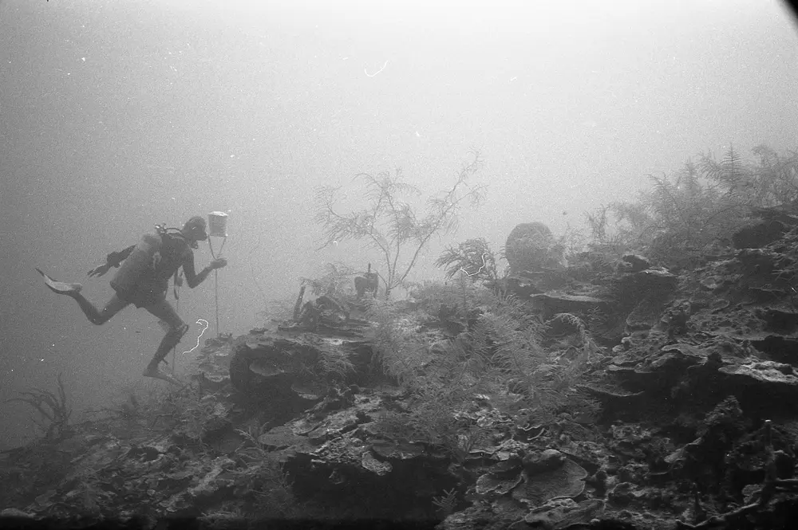{.lightbox group="discovery-bay-1966" description="**UUID: **f27e4b89-f6e5-4bd8-9941-2de67e8c8424 **Date: **1966-04-27 **Location: **Jamaica | Discovery Bay | Buoy Upper Slope **Longitude: **77.40908ºW **Latitude: **18.47322ºN **Photographer: **Eileen Graham **Copyright: **Trustees of the Natural History Museum (London, UK), CC-BY-4.0" alt="**UUID: **f27e4b89-f6e5-4bd8-9941-2de67e8c8424 **Date: **1966-04-27 **Location: **Jamaica | Discovery Bay | Buoy Upper Slope **Longitude: **77.40908ºW **Latitude: **18.47322ºN **Photographer: **Eileen Graham **Copyright: **Trustees of the Natural History Museum (London, UK), CC-BY-4.0"}

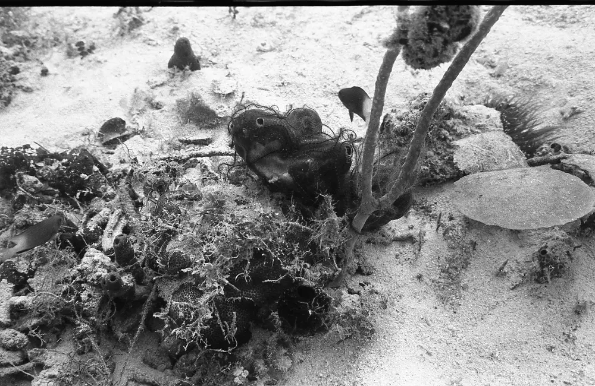{.lightbox group="discovery-bay-1966" description="**UUID: **e86586b4-6581-4c00-a7b0-4e4820c24d83 **Date: **1967-10-12 **Location: **Jamaica | Discovery Bay | Buoy Upper Slope **Longitude: **77.40908ºW **Latitude: **18.47322ºN **Photographer: **Eileen Graham **Copyright: **Trustees of the Natural History Museum (London, UK), CC-BY-4.0" alt="**UUID: **e86586b4-6581-4c00-a7b0-4e4820c24d83 **Date: **1967-10-12 **Location: **Jamaica | Discovery Bay | Buoy Upper Slope **Longitude: **77.40908ºW **Latitude: **18.47322ºN **Photographer: **Eileen Graham **Copyright: **Trustees of the Natural History Museum (London, UK), CC-BY-4.0"}

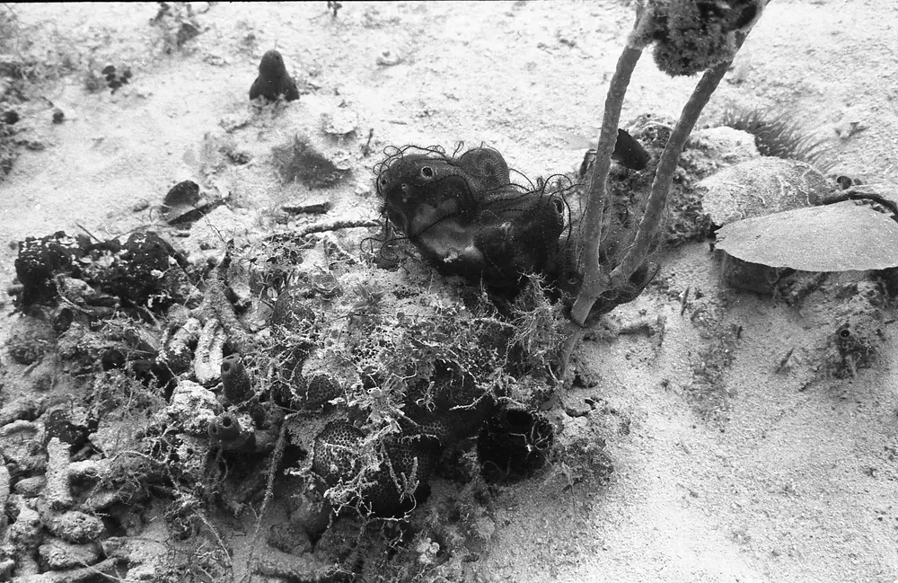{.lightbox group="discovery-bay-1966" description="**UUID: **c6a371f4-d647-49d2-9607-3e0908537d10 **Date: **1967-10-12 **Location: **Jamaica | Discovery Bay | Buoy Upper Slope **Longitude: **77.40908ºW **Latitude: **18.47322ºN **Photographer: **Eileen Graham **Copyright: **Trustees of the Natural History Museum (London, UK), CC-BY-4.0" alt="**UUID: **c6a371f4-d647-49d2-9607-3e0908537d10 **Date: **1967-10-12 **Location: **Jamaica | Discovery Bay | Buoy Upper Slope **Longitude: **77.40908ºW **Latitude: **18.47322ºN **Photographer: **Eileen Graham **Copyright: **Trustees of the Natural History Museum (London, UK), CC-BY-4.0"}

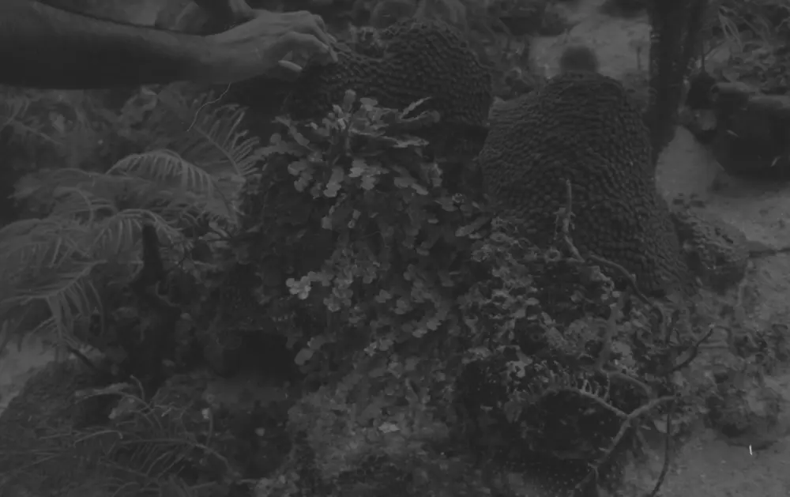{.lightbox group="discovery-bay-1966" description="**UUID: **e5d3e689-ed4b-4863-9284-6137a17cf1f5 **Date: **1967-12-28 **Location: **Jamaica | Discovery Bay | Pinnacle 2 Slope **Longitude: **77.414ºW **Latitude: **18.473ºN **Photographer: **Eileen Graham **Copyright: **Trustees of the Natural History Museum (London, UK), CC-BY-4.0" alt="**UUID: **e5d3e689-ed4b-4863-9284-6137a17cf1f5 **Date: **1967-12-28 **Location: **Jamaica | Discovery Bay | Pinnacle 2 Slope **Longitude: **77.414ºW **Latitude: **18.473ºN **Photographer: **Eileen Graham **Copyright: **Trustees of the Natural History Museum (London, UK), CC-BY-4.0"}

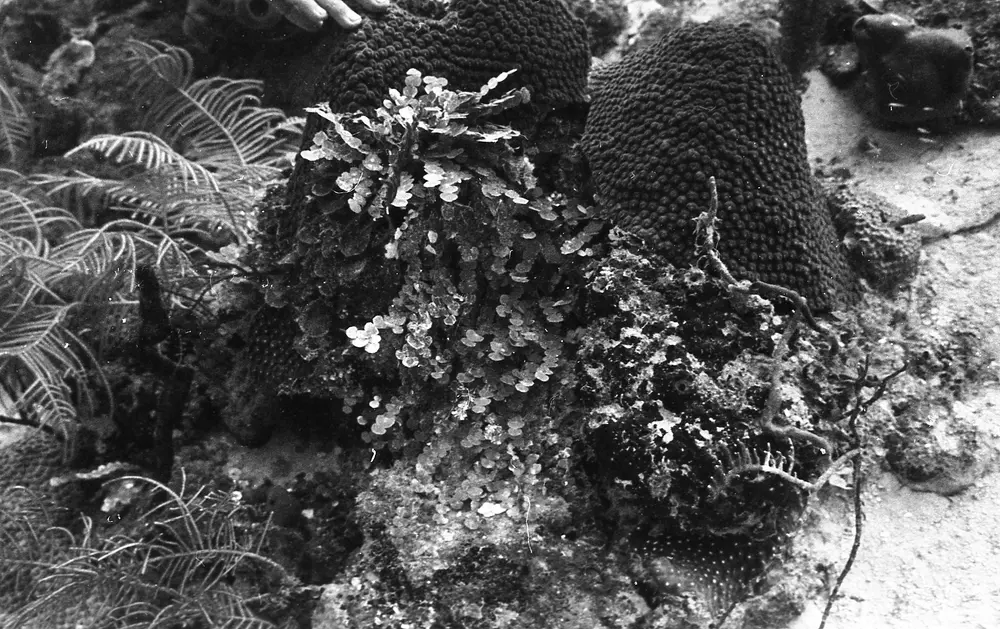{.lightbox group="discovery-bay-1966" description="**UUID: **4f46707f-ca9c-4160-8ec3-0c2a58aab73f **Date: **1967-12-28 **Location: **Jamaica | Discovery Bay | Pinnacle 2 Slope **Longitude: **77.414ºW **Latitude: **18.473ºN **Photographer: **Eileen Graham **Copyright: **Trustees of the Natural History Museum (London, UK), CC-BY-4.0" alt="**UUID: **4f46707f-ca9c-4160-8ec3-0c2a58aab73f **Date: **1967-12-28 **Location: **Jamaica | Discovery Bay | Pinnacle 2 Slope **Longitude: **77.414ºW **Latitude: **18.473ºN **Photographer: **Eileen Graham **Copyright: **Trustees of the Natural History Museum (London, UK), CC-BY-4.0"}

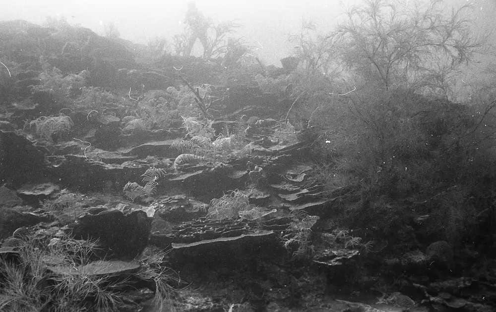{.lightbox group="discovery-bay-1966" description="**UUID: **05e57bfd-3481-42ad-8286-684c453971c6 **Date: **1967-12-28 **Location: **Jamaica | Discovery Bay | Pinnacle 2 Slope **Longitude: **77.414ºW **Latitude: **18.473ºN **Photographer: **Eileen Graham **Copyright: **Trustees of the Natural History Museum (London, UK), CC-BY-4.0" alt="**UUID: **05e57bfd-3481-42ad-8286-684c453971c6 **Date: **1967-12-28 **Location: **Jamaica | Discovery Bay | Pinnacle 2 Slope **Longitude: **77.414ºW **Latitude: **18.473ºN **Photographer: **Eileen Graham **Copyright: **Trustees of the Natural History Museum (London, UK), CC-BY-4.0"}

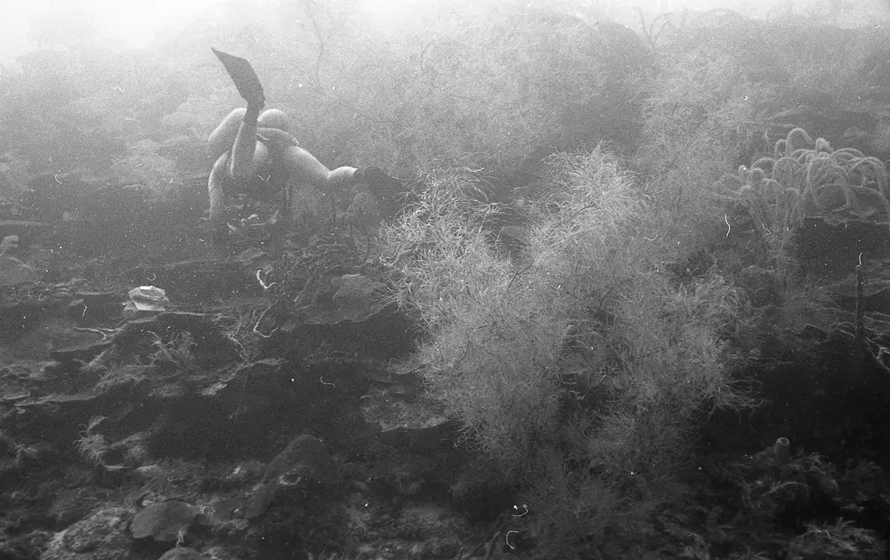{.lightbox group="discovery-bay-1966" description="**UUID: **193e5783-3aee-4874-a538-0f34fe456704 **Date: **1967-12-28 **Location: **Jamaica | Discovery Bay | Pinnacle 2 Slope **Longitude: **77.414ºW **Latitude: **18.473ºN **Photographer: **Eileen Graham **Copyright: **Trustees of the Natural History Museum (London, UK), CC-BY-4.0" alt="**UUID: **193e5783-3aee-4874-a538-0f34fe456704 **Date: **1967-12-28 **Location: **Jamaica | Discovery Bay | Pinnacle 2 Slope **Longitude: **77.414ºW **Latitude: **18.473ºN **Photographer: **Eileen Graham **Copyright: **Trustees of the Natural History Museum (London, UK), CC-BY-4.0"}

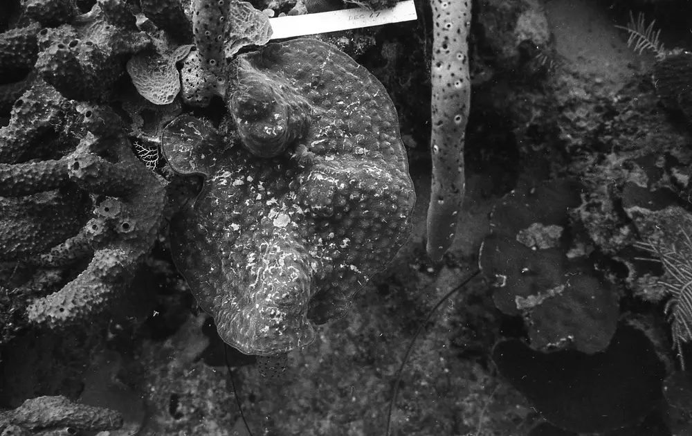{.lightbox group="discovery-bay-1966" description="**UUID: **88bfedd6-d292-4b17-bad4-73315621bfda **Date: **1967-12-28 **Location: **Jamaica | Discovery Bay | Pinnacle 2 Slope **Longitude: **77.414ºW **Latitude: **18.473ºN **Photographer: **Eileen Graham **Copyright: **Trustees of the Natural History Museum (London, UK), CC-BY-4.0" alt="**UUID: **88bfedd6-d292-4b17-bad4-73315621bfda **Date: **1967-12-28 **Location: **Jamaica | Discovery Bay | Pinnacle 2 Slope **Longitude: **77.414ºW **Latitude: **18.473ºN **Photographer: **Eileen Graham **Copyright: **Trustees of the Natural History Museum (London, UK), CC-BY-4.0"}

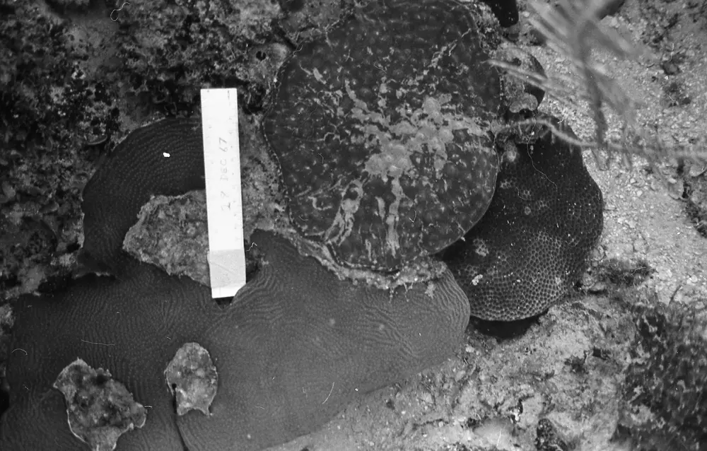{.lightbox group="discovery-bay-1966" description="**UUID: **068266d9-c404-410c-a76b-bfde09e8406b **Date: **1967-12-28 **Location: **Jamaica | Discovery Bay | Pinnacle 2 Slope **Longitude: **77.414ºW **Latitude: **18.473ºN **Photographer: **Eileen Graham **Copyright: **Trustees of the Natural History Museum (London, UK), CC-BY-4.0" alt="**UUID: **068266d9-c404-410c-a76b-bfde09e8406b **Date: **1967-12-28 **Location: **Jamaica | Discovery Bay | Pinnacle 2 Slope **Longitude: **77.414ºW **Latitude: **18.473ºN **Photographer: **Eileen Graham **Copyright: **Trustees of the Natural History Museum (London, UK), CC-BY-4.0"}

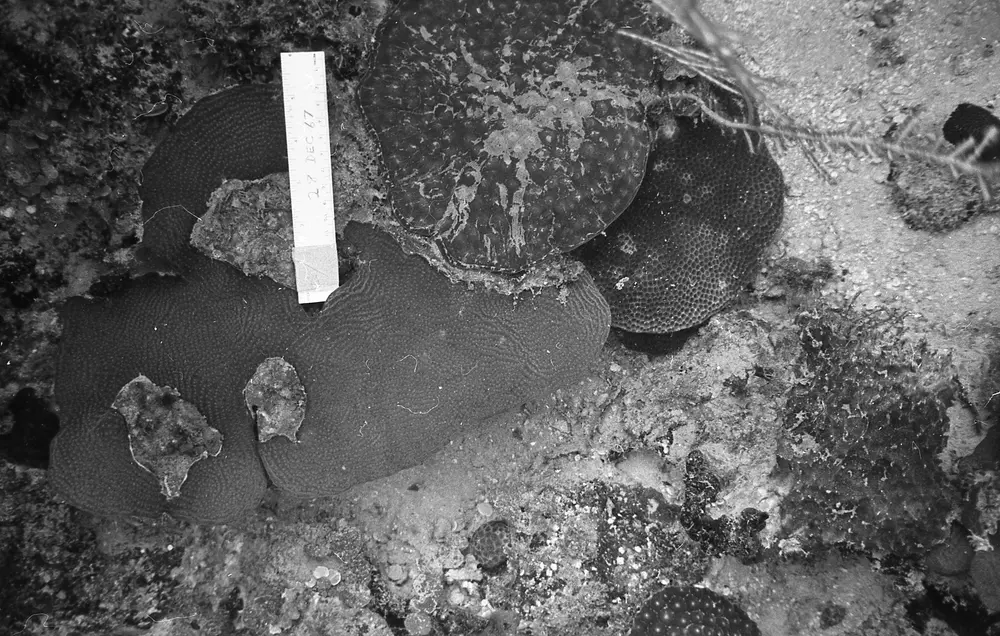{.lightbox group="discovery-bay-1966" description="**UUID: **2e9f299f-5ba5-4fcb-a00c-9e069c9766d1 **Date: **1967-12-28 **Location: **Jamaica | Discovery Bay | Pinnacle 2 Slope **Longitude: **77.414ºW **Latitude: **18.473ºN **Photographer: **Eileen Graham **Copyright: **Trustees of the Natural History Museum (London, UK), CC-BY-4.0" alt="**UUID: **2e9f299f-5ba5-4fcb-a00c-9e069c9766d1 **Date: **1967-12-28 **Location: **Jamaica | Discovery Bay | Pinnacle 2 Slope **Longitude: **77.414ºW **Latitude: **18.473ºN **Photographer: **Eileen Graham **Copyright: **Trustees of the Natural History Museum (London, UK), CC-BY-4.0"}

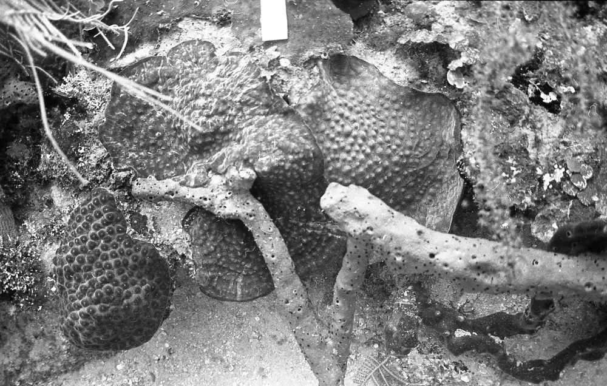{.lightbox group="discovery-bay-1966" description="**UUID: **d0b39ffe-a6aa-4ce2-8331-5cf4ac7bc633 **Date: **1967-12-28 **Location: **Jamaica | Discovery Bay | Pinnacle 2 Slope **Longitude: **77.414ºW **Latitude: **18.473ºN **Photographer: **Eileen Graham **Copyright: **Trustees of the Natural History Museum (London, UK), CC-BY-4.0" alt="**UUID: **d0b39ffe-a6aa-4ce2-8331-5cf4ac7bc633 **Date: **1967-12-28 **Location: **Jamaica | Discovery Bay | Pinnacle 2 Slope **Longitude: **77.414ºW **Latitude: **18.473ºN **Photographer: **Eileen Graham **Copyright: **Trustees of the Natural History Museum (London, UK), CC-BY-4.0"}

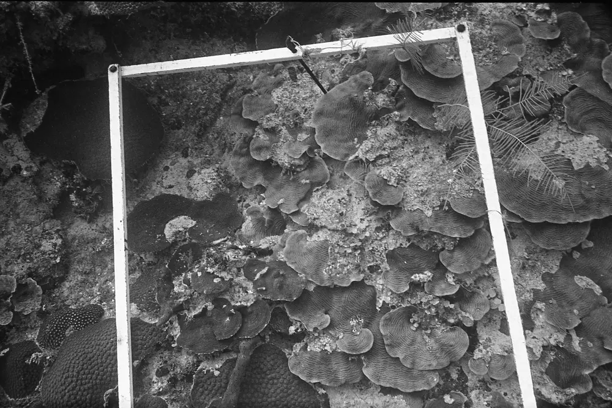{.lightbox group="discovery-bay-1966" description="**UUID: **c377942b-7e1b-44d2-852b-3b1b73364be9 **Date: **1966-04-27 **Location: **Jamaica | Discovery Bay | Buoy Upper Slope **Longitude: **77.40908ºW **Latitude: **18.47322ºN **Photographer: **Eileen Graham **Copyright: **Trustees of the Natural History Museum (London, UK), CC-BY-4.0" alt="**UUID: **c377942b-7e1b-44d2-852b-3b1b73364be9 **Date: **1966-04-27 **Location: **Jamaica | Discovery Bay | Buoy Upper Slope **Longitude: **77.40908ºW **Latitude: **18.47322ºN **Photographer: **Eileen Graham **Copyright: **Trustees of the Natural History Museum (London, UK), CC-BY-4.0"}

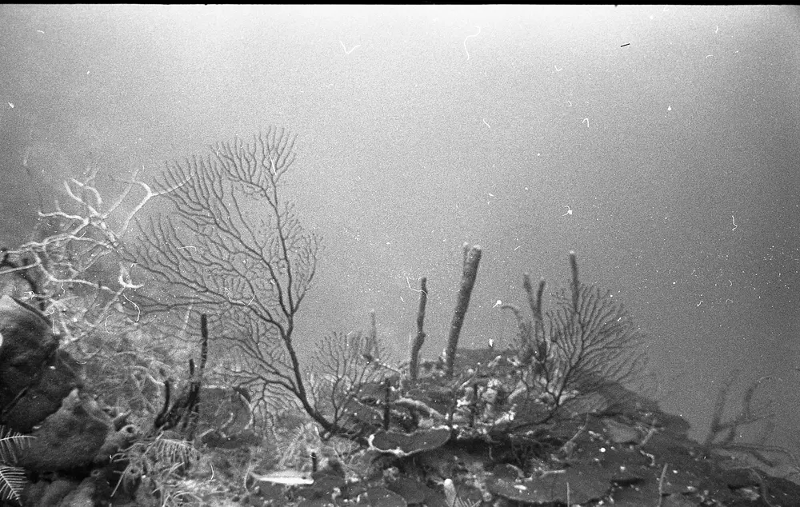{.lightbox group="discovery-bay-1966" description="**UUID: **01776ddd-0d3a-474d-862b-382362b5f363 **Date: **1967-12-28 **Location: **Jamaica | Discovery Bay | Pinnacle 2 Slope **Longitude: **77.414ºW **Latitude: **18.473ºN **Photographer: **Eileen Graham **Copyright: **Trustees of the Natural History Museum (London, UK), CC-BY-4.0" alt="**UUID: **01776ddd-0d3a-474d-862b-382362b5f363 **Date: **1967-12-28 **Location: **Jamaica | Discovery Bay | Pinnacle 2 Slope **Longitude: **77.414ºW **Latitude: **18.473ºN **Photographer: **Eileen Graham **Copyright: **Trustees of the Natural History Museum (London, UK), CC-BY-4.0"}

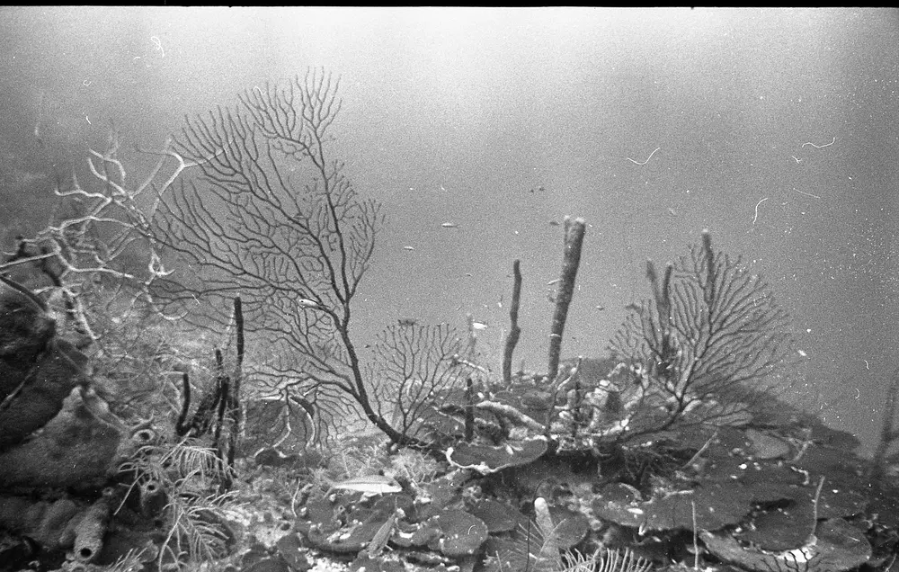{.lightbox group="discovery-bay-1966" description="**UUID: **8d68b4d9-4114-4da7-8366-5ab188cd124f **Date: **1967-12-28 **Location: **Jamaica | Discovery Bay | Pinnacle 2 Slope **Longitude: **77.414ºW **Latitude: **18.473ºN **Photographer: **Eileen Graham **Copyright: **Trustees of the Natural History Museum (London, UK), CC-BY-4.0" alt="**UUID: **8d68b4d9-4114-4da7-8366-5ab188cd124f **Date: **1967-12-28 **Location: **Jamaica | Discovery Bay | Pinnacle 2 Slope **Longitude: **77.414ºW **Latitude: **18.473ºN **Photographer: **Eileen Graham **Copyright: **Trustees of the Natural History Museum (London, UK), CC-BY-4.0"}

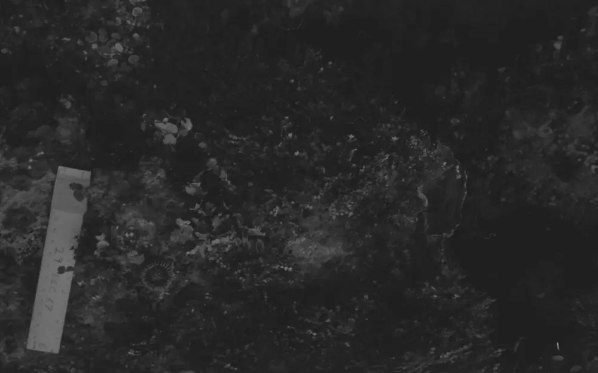{.lightbox group="discovery-bay-1966" description="**UUID: **b9f069b1-d28f-47e3-8e02-5641c29ff3f1 **Date: **1967-12-28 **Location: **Jamaica | Discovery Bay | Pinnacle 2 Slope **Longitude: **77.414ºW **Latitude: **18.473ºN **Photographer: **Eileen Graham **Copyright: **Trustees of the Natural History Museum (London, UK), CC-BY-4.0" alt="**UUID: **b9f069b1-d28f-47e3-8e02-5641c29ff3f1 **Date: **1967-12-28 **Location: **Jamaica | Discovery Bay | Pinnacle 2 Slope **Longitude: **77.414ºW **Latitude: **18.473ºN **Photographer: **Eileen Graham **Copyright: **Trustees of the Natural History Museum (London, UK), CC-BY-4.0"}

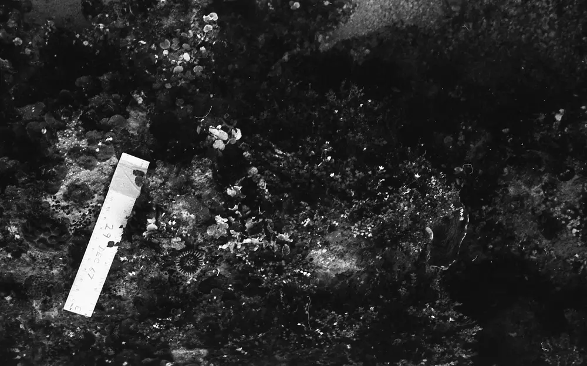{.lightbox group="discovery-bay-1966" description="**UUID: **94ebb1ef-2e7f-4f3c-ba59-ed0913a8b664 **Date: **1967-12-28 **Location: **Jamaica | Discovery Bay | Pinnacle 2 Slope **Longitude: **77.414ºW **Latitude: **18.473ºN **Photographer: **Eileen Graham **Copyright: **Trustees of the Natural History Museum (London, UK), CC-BY-4.0" alt="**UUID: **94ebb1ef-2e7f-4f3c-ba59-ed0913a8b664 **Date: **1967-12-28 **Location: **Jamaica | Discovery Bay | Pinnacle 2 Slope **Longitude: **77.414ºW **Latitude: **18.473ºN **Photographer: **Eileen Graham **Copyright: **Trustees of the Natural History Museum (London, UK), CC-BY-4.0"}

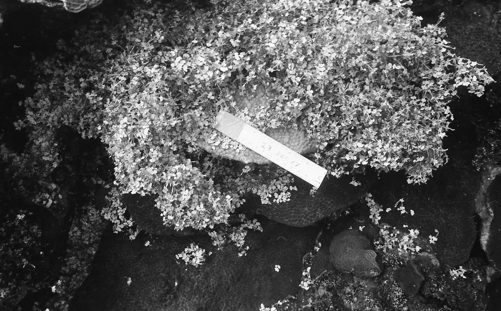{.lightbox group="discovery-bay-1966" description="**UUID: **1c00281e-22a7-4d8b-b48a-8a033f09b374 **Date: **1967-12-28 **Location: **Jamaica | Discovery Bay | Pinnacle 2 Slope **Longitude: **77.414ºW **Latitude: **18.473ºN **Photographer: **Eileen Graham **Copyright: **Trustees of the Natural History Museum (London, UK), CC-BY-4.0" alt="**UUID: **1c00281e-22a7-4d8b-b48a-8a033f09b374 **Date: **1967-12-28 **Location: **Jamaica | Discovery Bay | Pinnacle 2 Slope **Longitude: **77.414ºW **Latitude: **18.473ºN **Photographer: **Eileen Graham **Copyright: **Trustees of the Natural History Museum (London, UK), CC-BY-4.0"}

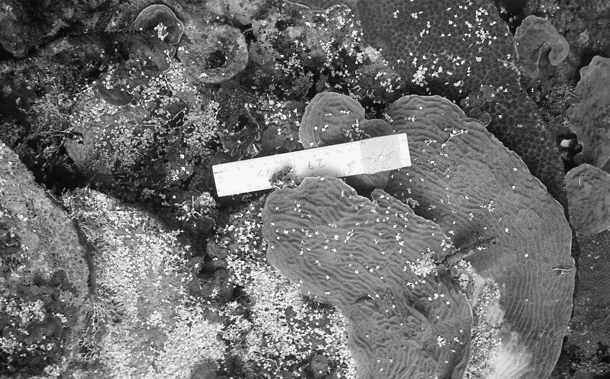{.lightbox group="discovery-bay-1966" description="**UUID: **f4e1eb39-7b1f-4d22-857a-afc86a7fa92a **Date: **1967-12-28 **Location: **Jamaica | Discovery Bay | Pinnacle 2 Slope **Longitude: **77.414ºW **Latitude: **18.473ºN **Photographer: **Eileen Graham **Copyright: **Trustees of the Natural History Museum (London, UK), CC-BY-4.0" alt="**UUID: **f4e1eb39-7b1f-4d22-857a-afc86a7fa92a **Date: **1967-12-28 **Location: **Jamaica | Discovery Bay | Pinnacle 2 Slope **Longitude: **77.414ºW **Latitude: **18.473ºN **Photographer: **Eileen Graham **Copyright: **Trustees of the Natural History Museum (London, UK), CC-BY-4.0"}

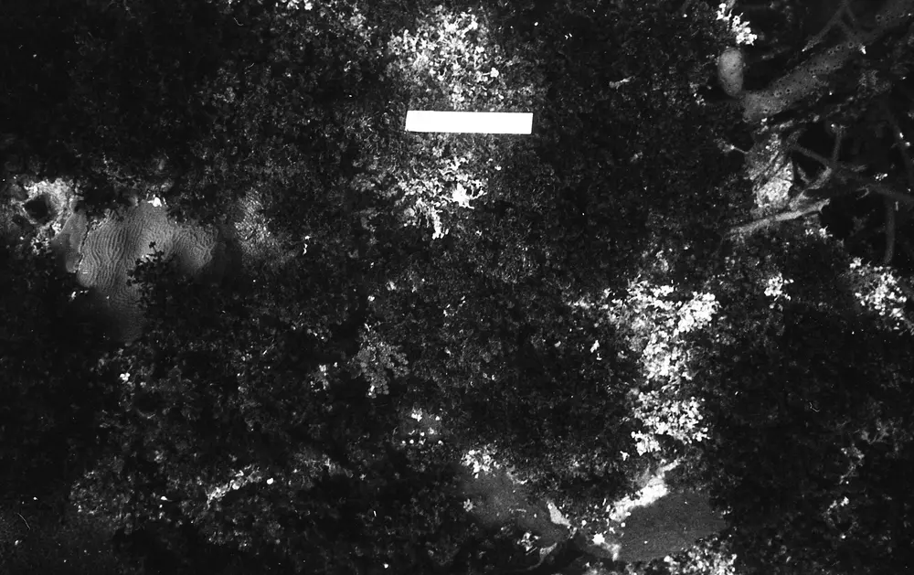{.lightbox group="discovery-bay-1966" description="**UUID: **d9574bbd-fd76-4593-b7eb-7a53e0931870 **Date: **1967-12-28 **Location: **Jamaica | Discovery Bay | Pinnacle 2 Slope **Longitude: **77.414ºW **Latitude: **18.473ºN **Photographer: **Eileen Graham **Copyright: **Trustees of the Natural History Museum (London, UK), CC-BY-4.0" alt="**UUID: **d9574bbd-fd76-4593-b7eb-7a53e0931870 **Date: **1967-12-28 **Location: **Jamaica | Discovery Bay | Pinnacle 2 Slope **Longitude: **77.414ºW **Latitude: **18.473ºN **Photographer: **Eileen Graham **Copyright: **Trustees of the Natural History Museum (London, UK), CC-BY-4.0"}

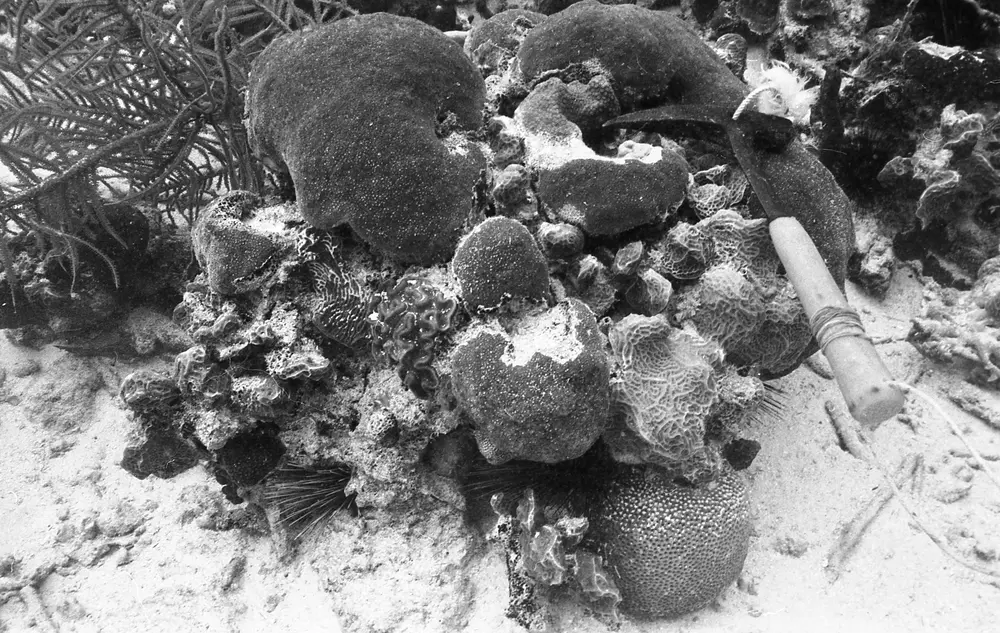{.lightbox group="discovery-bay-1966" description="**UUID: **592864f7-c3d9-4144-a712-401e2c35cfe4 **Date: **1968-01-18 **Location: **Jamaica | Discovery Bay | Upper Buoy Terrace **Longitude: **77.40908ºW **Latitude: **18.47322ºN **Photographer: **Eileen Graham **Copyright: **Trustees of the Natural History Museum (London, UK), CC-BY-4.0" alt="**UUID: **592864f7-c3d9-4144-a712-401e2c35cfe4 **Date: **1968-01-18 **Location: **Jamaica | Discovery Bay | Upper Buoy Terrace **Longitude: **77.40908ºW **Latitude: **18.47322ºN **Photographer: **Eileen Graham **Copyright: **Trustees of the Natural History Museum (London, UK), CC-BY-4.0"}

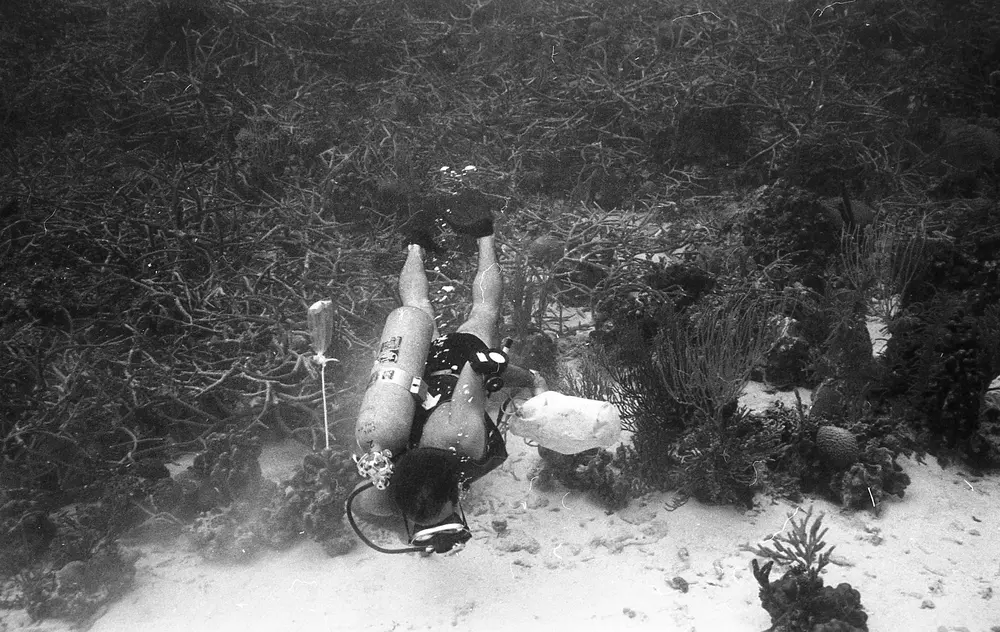{.lightbox group="discovery-bay-1966" description="**UUID: **9cf67ebc-8f93-491a-88ac-601142736461 **Date: **1968-01-18 **Location: **Jamaica | Discovery Bay | Upper Buoy Terrace **Longitude: **77.40908ºW **Latitude: **18.47322ºN **Photographer: **Eileen Graham **Copyright: **Trustees of the Natural History Museum (London, UK), CC-BY-4.0" alt="**UUID: **9cf67ebc-8f93-491a-88ac-601142736461 **Date: **1968-01-18 **Location: **Jamaica | Discovery Bay | Upper Buoy Terrace **Longitude: **77.40908ºW **Latitude: **18.47322ºN **Photographer: **Eileen Graham **Copyright: **Trustees of the Natural History Museum (London, UK), CC-BY-4.0"}

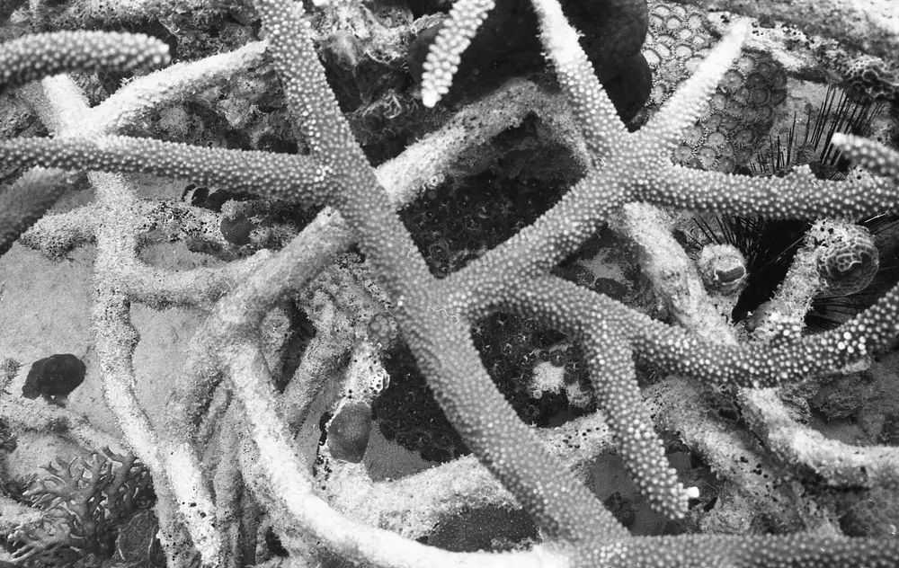{.lightbox group="discovery-bay-1966" description="**UUID: **514be498-f9a4-4f0b-8566-8cb978707816 **Date: **1968-01-18 **Location: **Jamaica | Discovery Bay | Upper Buoy Terrace **Longitude: **77.40908ºW **Latitude: **18.47322ºN **Photographer: **Eileen Graham **Copyright: **Trustees of the Natural History Museum (London, UK), CC-BY-4.0" alt="**UUID: **514be498-f9a4-4f0b-8566-8cb978707816 **Date: **1968-01-18 **Location: **Jamaica | Discovery Bay | Upper Buoy Terrace **Longitude: **77.40908ºW **Latitude: **18.47322ºN **Photographer: **Eileen Graham **Copyright: **Trustees of the Natural History Museum (London, UK), CC-BY-4.0"}

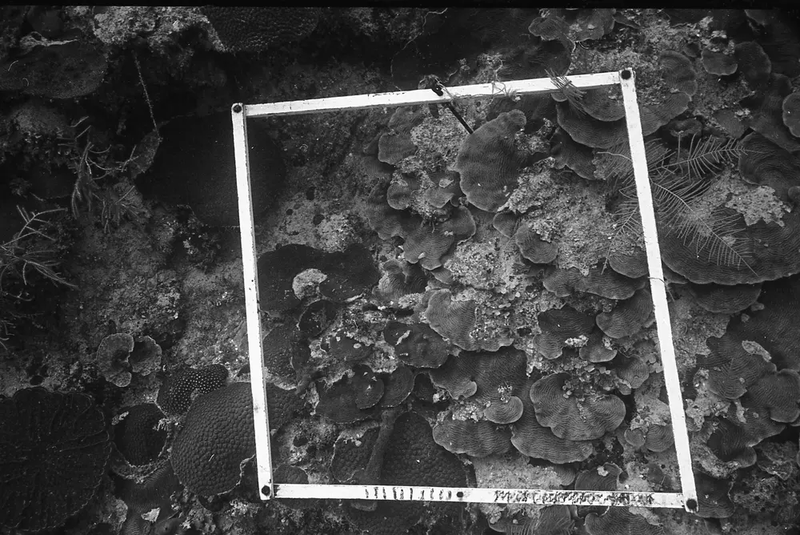{.lightbox group="discovery-bay-1966" description="**UUID: **f8e263c3-0157-4bd1-a2b7-1e1f2541f959 **Date: **1966-04-27 **Location: **Jamaica | Discovery Bay | Buoy Upper Slope **Longitude: **77.40908ºW **Latitude: **18.47322ºN **Photographer: **Eileen Graham **Copyright: **Trustees of the Natural History Museum (London, UK), CC-BY-4.0" alt="**UUID: **f8e263c3-0157-4bd1-a2b7-1e1f2541f959 **Date: **1966-04-27 **Location: **Jamaica | Discovery Bay | Buoy Upper Slope **Longitude: **77.40908ºW **Latitude: **18.47322ºN **Photographer: **Eileen Graham **Copyright: **Trustees of the Natural History Museum (London, UK), CC-BY-4.0"}

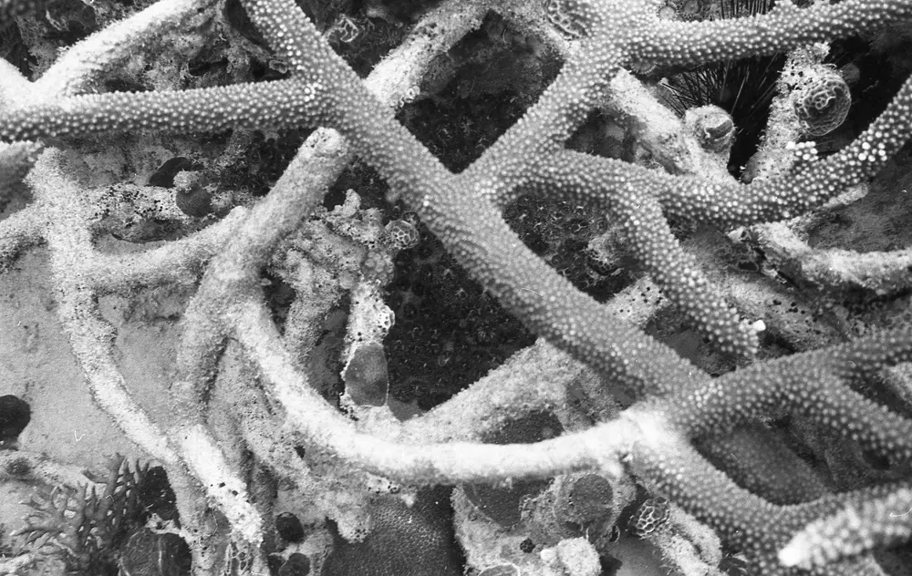{.lightbox group="discovery-bay-1966" description="**UUID: **af6e73c5-ca48-4bc1-a7b7-90e68abdb4b9 **Date: **1968-01-18 **Location: **Jamaica | Discovery Bay | Upper Buoy Terrace **Longitude: **77.40908ºW **Latitude: **18.47322ºN **Photographer: **Eileen Graham **Copyright: **Trustees of the Natural History Museum (London, UK), CC-BY-4.0" alt="**UUID: **af6e73c5-ca48-4bc1-a7b7-90e68abdb4b9 **Date: **1968-01-18 **Location: **Jamaica | Discovery Bay | Upper Buoy Terrace **Longitude: **77.40908ºW **Latitude: **18.47322ºN **Photographer: **Eileen Graham **Copyright: **Trustees of the Natural History Museum (London, UK), CC-BY-4.0"}

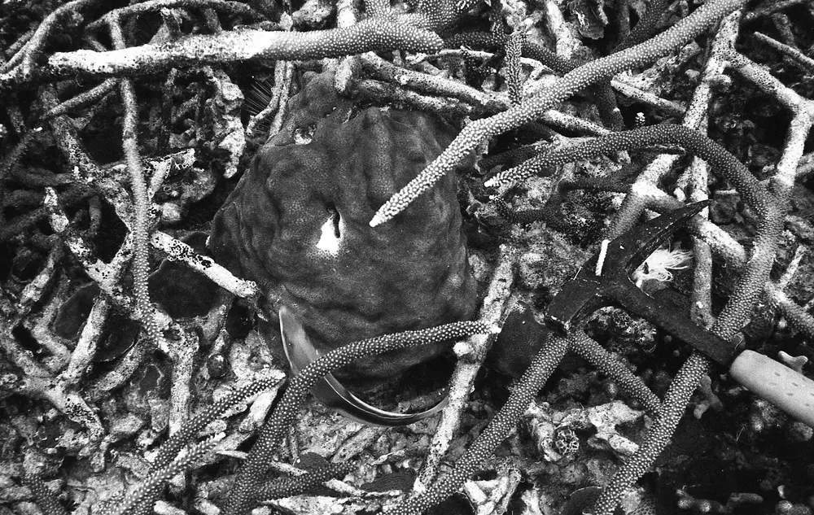{.lightbox group="discovery-bay-1966" description="**UUID: **4005226c-5c3b-4bdf-8488-85384c718fb8 **Date: **1968-01-18 **Location: **Jamaica | Discovery Bay | Upper Buoy Terrace **Longitude: **77.40908ºW **Latitude: **18.47322ºN **Photographer: **Eileen Graham **Copyright: **Trustees of the Natural History Museum (London, UK), CC-BY-4.0" alt="**UUID: **4005226c-5c3b-4bdf-8488-85384c718fb8 **Date: **1968-01-18 **Location: **Jamaica | Discovery Bay | Upper Buoy Terrace **Longitude: **77.40908ºW **Latitude: **18.47322ºN **Photographer: **Eileen Graham **Copyright: **Trustees of the Natural History Museum (London, UK), CC-BY-4.0"}

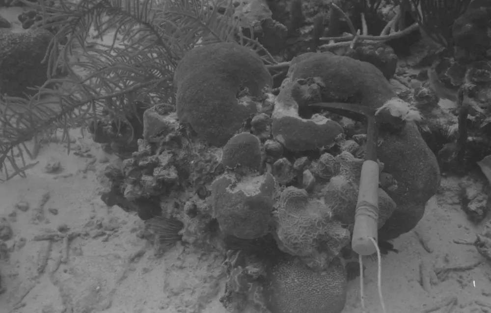{.lightbox group="discovery-bay-1966" description="**UUID: **f2552fd1-f2e4-4b46-963e-964cd722e214 **Date: **1968-01-18 **Location: **Jamaica | Discovery Bay | Upper Buoy Terrace **Longitude: **77.40908ºW **Latitude: **18.47322ºN **Photographer: **Eileen Graham **Copyright: **Trustees of the Natural History Museum (London, UK), CC-BY-4.0" alt="**UUID: **f2552fd1-f2e4-4b46-963e-964cd722e214 **Date: **1968-01-18 **Location: **Jamaica | Discovery Bay | Upper Buoy Terrace **Longitude: **77.40908ºW **Latitude: **18.47322ºN **Photographer: **Eileen Graham **Copyright: **Trustees of the Natural History Museum (London, UK), CC-BY-4.0"}

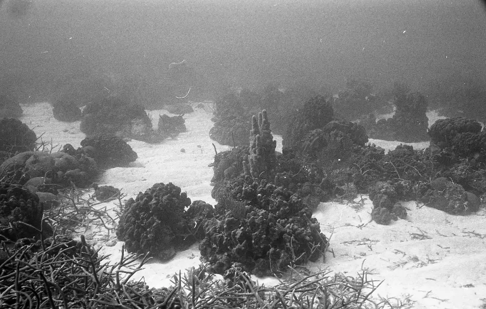{.lightbox group="discovery-bay-1966" description="**UUID: **600dc1d4-d21b-4f4c-8668-cac5aafc55df **Date: **1968-01-18 **Location: **Jamaica | Discovery Bay | Upper Buoy Terrace **Longitude: **77.40908ºW **Latitude: **18.47322ºN **Photographer: **Eileen Graham **Copyright: **Trustees of the Natural History Museum (London, UK), CC-BY-4.0" alt="**UUID: **600dc1d4-d21b-4f4c-8668-cac5aafc55df **Date: **1968-01-18 **Location: **Jamaica | Discovery Bay | Upper Buoy Terrace **Longitude: **77.40908ºW **Latitude: **18.47322ºN **Photographer: **Eileen Graham **Copyright: **Trustees of the Natural History Museum (London, UK), CC-BY-4.0"}

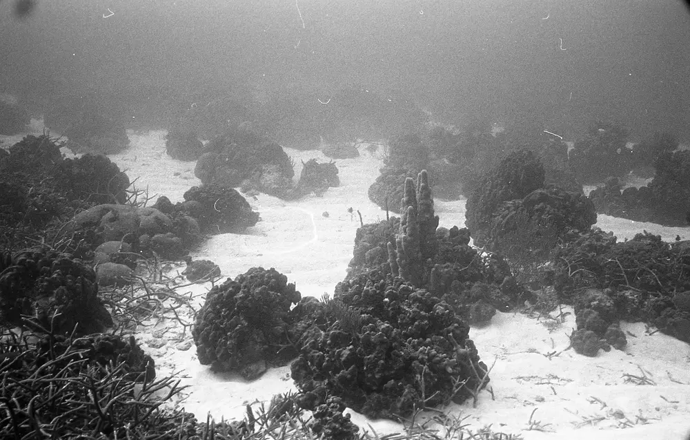{.lightbox group="discovery-bay-1966" description="**UUID: **dc8483e2-0000-46f3-865a-38f8c9b6c9b6 **Date: **1968-01-18 **Location: **Jamaica | Discovery Bay | Upper Buoy Terrace **Longitude: **77.40908ºW **Latitude: **18.47322ºN **Photographer: **Eileen Graham **Copyright: **Trustees of the Natural History Museum (London, UK), CC-BY-4.0" alt="**UUID: **dc8483e2-0000-46f3-865a-38f8c9b6c9b6 **Date: **1968-01-18 **Location: **Jamaica | Discovery Bay | Upper Buoy Terrace **Longitude: **77.40908ºW **Latitude: **18.47322ºN **Photographer: **Eileen Graham **Copyright: **Trustees of the Natural History Museum (London, UK), CC-BY-4.0"}

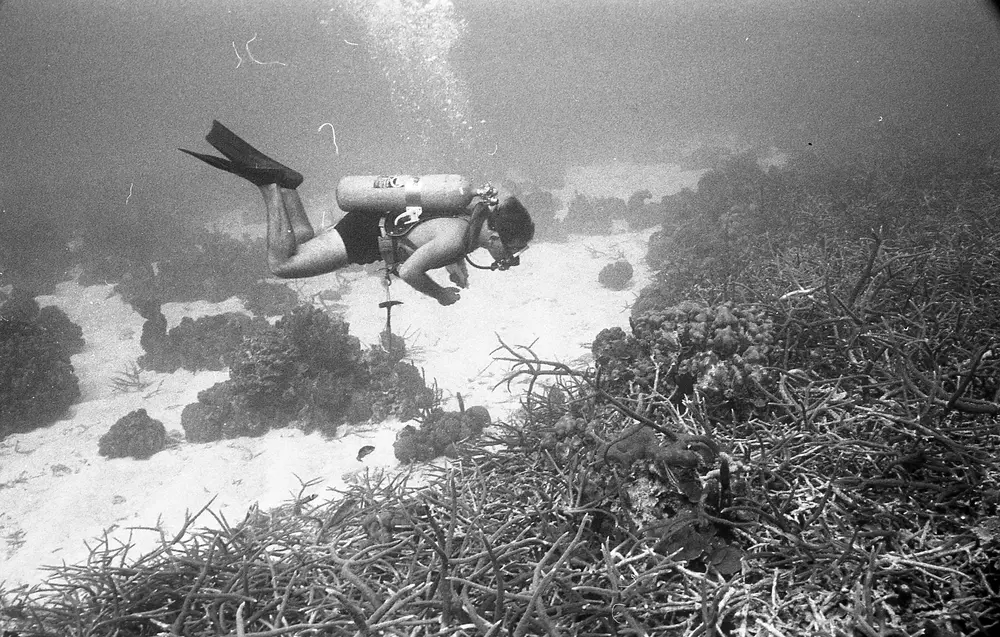{.lightbox group="discovery-bay-1966" description="**UUID: **441a64b4-e688-433f-81d3-cdce17c308fe **Date: **1968-01-18 **Location: **Jamaica | Discovery Bay | Upper Buoy Terrace **Longitude: **77.40908ºW **Latitude: **18.47322ºN **Photographer: **Eileen Graham **Copyright: **Trustees of the Natural History Museum (London, UK), CC-BY-4.0" alt="**UUID: **441a64b4-e688-433f-81d3-cdce17c308fe **Date: **1968-01-18 **Location: **Jamaica | Discovery Bay | Upper Buoy Terrace **Longitude: **77.40908ºW **Latitude: **18.47322ºN **Photographer: **Eileen Graham **Copyright: **Trustees of the Natural History Museum (London, UK), CC-BY-4.0"}

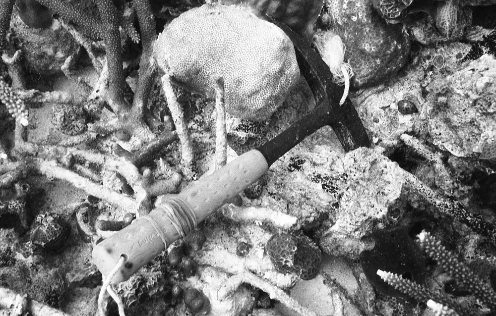{.lightbox group="discovery-bay-1966" description="**UUID: **357eaafb-8219-4503-8826-bef5de6b4c8e **Date: **1968-01-18 **Location: **Jamaica | Discovery Bay | Upper Buoy Terrace **Longitude: **77.40908ºW **Latitude: **18.47322ºN **Photographer: **Eileen Graham **Copyright: **Trustees of the Natural History Museum (London, UK), CC-BY-4.0" alt="**UUID: **357eaafb-8219-4503-8826-bef5de6b4c8e **Date: **1968-01-18 **Location: **Jamaica | Discovery Bay | Upper Buoy Terrace **Longitude: **77.40908ºW **Latitude: **18.47322ºN **Photographer: **Eileen Graham **Copyright: **Trustees of the Natural History Museum (London, UK), CC-BY-4.0"}

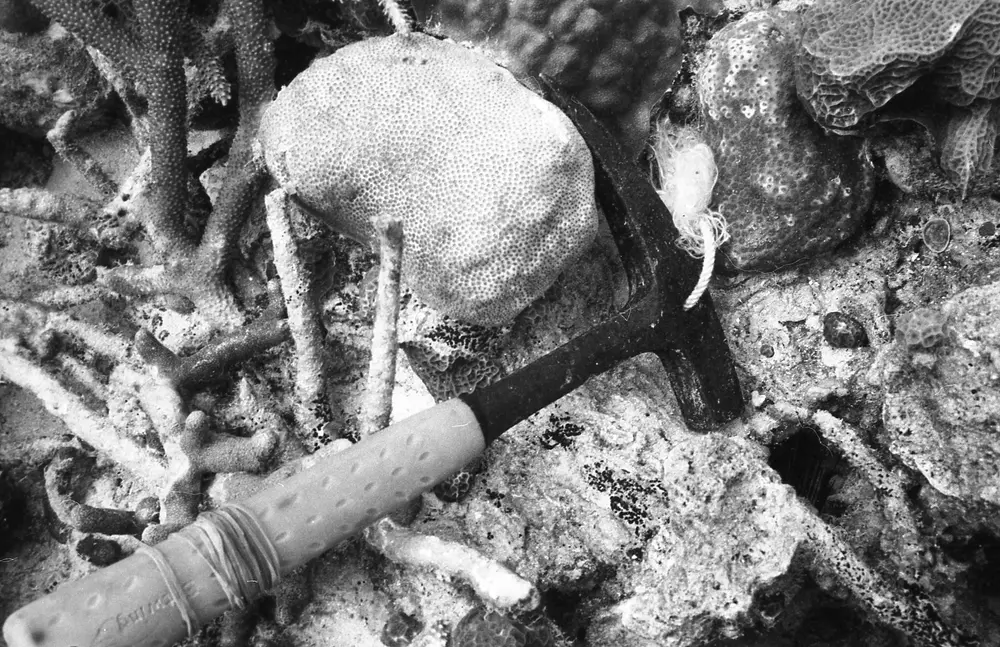{.lightbox group="discovery-bay-1966" description="**UUID: **44ff2302-3884-4fff-b19f-8c3f91e74a1e **Date: **1968-01-18 **Location: **Jamaica | Discovery Bay | Upper Buoy Terrace **Longitude: **77.40908ºW **Latitude: **18.47322ºN **Photographer: **Eileen Graham **Copyright: **Trustees of the Natural History Museum (London, UK), CC-BY-4.0" alt="**UUID: **44ff2302-3884-4fff-b19f-8c3f91e74a1e **Date: **1968-01-18 **Location: **Jamaica | Discovery Bay | Upper Buoy Terrace **Longitude: **77.40908ºW **Latitude: **18.47322ºN **Photographer: **Eileen Graham **Copyright: **Trustees of the Natural History Museum (London, UK), CC-BY-4.0"}

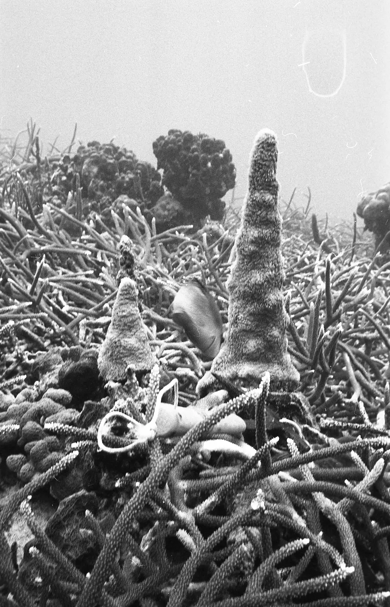{.lightbox group="discovery-bay-1966" description="**UUID: **dca25abb-d7ad-4cbd-ad8c-a78219a11f42 **Date: **1968-01-18 **Location: **Jamaica | Discovery Bay | Upper Buoy Terrace **Longitude: **77.40908ºW **Latitude: **18.47322ºN **Photographer: **Eileen Graham **Copyright: **Trustees of the Natural History Museum (London, UK), CC-BY-4.0" alt="**UUID: **dca25abb-d7ad-4cbd-ad8c-a78219a11f42 **Date: **1968-01-18 **Location: **Jamaica | Discovery Bay | Upper Buoy Terrace **Longitude: **77.40908ºW **Latitude: **18.47322ºN **Photographer: **Eileen Graham **Copyright: **Trustees of the Natural History Museum (London, UK), CC-BY-4.0"}

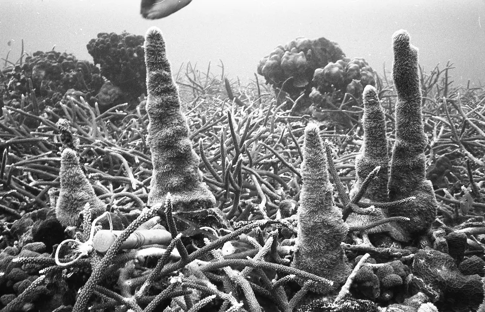{.lightbox group="discovery-bay-1966" description="**UUID: **5a437c73-ceb9-4fc1-9fcf-20a7f4630c07 **Date: **1968-01-18 **Location: **Jamaica | Discovery Bay | Upper Buoy Terrace **Longitude: **77.40908ºW **Latitude: **18.47322ºN **Photographer: **Eileen Graham **Copyright: **Trustees of the Natural History Museum (London, UK), CC-BY-4.0" alt="**UUID: **5a437c73-ceb9-4fc1-9fcf-20a7f4630c07 **Date: **1968-01-18 **Location: **Jamaica | Discovery Bay | Upper Buoy Terrace **Longitude: **77.40908ºW **Latitude: **18.47322ºN **Photographer: **Eileen Graham **Copyright: **Trustees of the Natural History Museum (London, UK), CC-BY-4.0"}

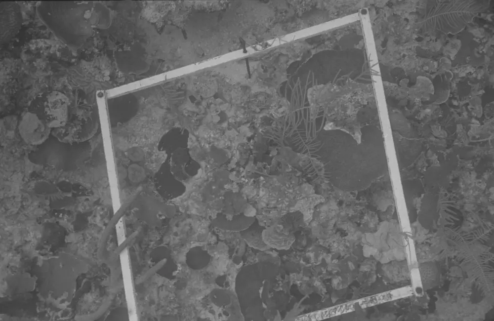{.lightbox group="discovery-bay-1966" description="**UUID: **9de470e5-0380-47dc-a504-676284f0ae6c **Date: **1966-04-27 **Location: **Jamaica | Discovery Bay | Buoy Upper Slope **Longitude: **77.40908ºW **Latitude: **18.47322ºN **Photographer: **Eileen Graham **Copyright: **Trustees of the Natural History Museum (London, UK), CC-BY-4.0" alt="**UUID: **9de470e5-0380-47dc-a504-676284f0ae6c **Date: **1966-04-27 **Location: **Jamaica | Discovery Bay | Buoy Upper Slope **Longitude: **77.40908ºW **Latitude: **18.47322ºN **Photographer: **Eileen Graham **Copyright: **Trustees of the Natural History Museum (London, UK), CC-BY-4.0"}

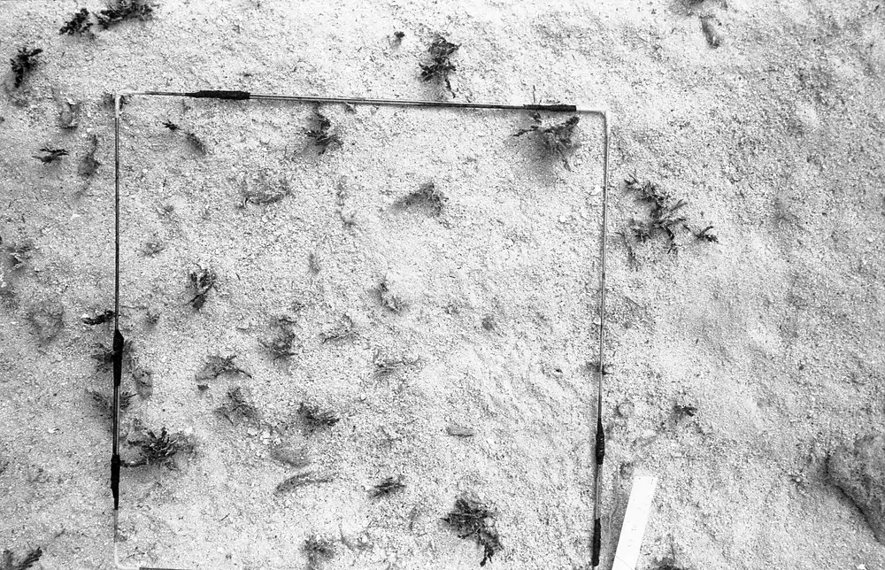{.lightbox group="discovery-bay-1966" description="**UUID: **6abcd917-643c-4769-8f90-da18cd18819b **Date: **1968-01-18 **Location: **Jamaica | Discovery Bay | Algal Plots **Longitude: **77.414ºW **Latitude: **18.473ºN **Photographer: **Eileen Graham **Copyright: **Trustees of the Natural History Museum (London, UK), CC-BY-4.0" alt="**UUID: **6abcd917-643c-4769-8f90-da18cd18819b **Date: **1968-01-18 **Location: **Jamaica | Discovery Bay | Algal Plots **Longitude: **77.414ºW **Latitude: **18.473ºN **Photographer: **Eileen Graham **Copyright: **Trustees of the Natural History Museum (London, UK), CC-BY-4.0"}

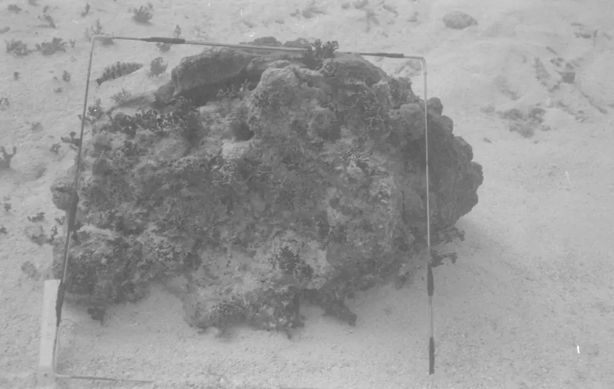{.lightbox group="discovery-bay-1966" description="**UUID: **92f73a0e-4307-4711-ba09-e11fc88fa537 **Date: **1968-01-18 **Location: **Jamaica | Discovery Bay | Algal Plots **Longitude: **77.414ºW **Latitude: **18.473ºN **Photographer: **Eileen Graham **Copyright: **Trustees of the Natural History Museum (London, UK), CC-BY-4.0" alt="**UUID: **92f73a0e-4307-4711-ba09-e11fc88fa537 **Date: **1968-01-18 **Location: **Jamaica | Discovery Bay | Algal Plots **Longitude: **77.414ºW **Latitude: **18.473ºN **Photographer: **Eileen Graham **Copyright: **Trustees of the Natural History Museum (London, UK), CC-BY-4.0"}

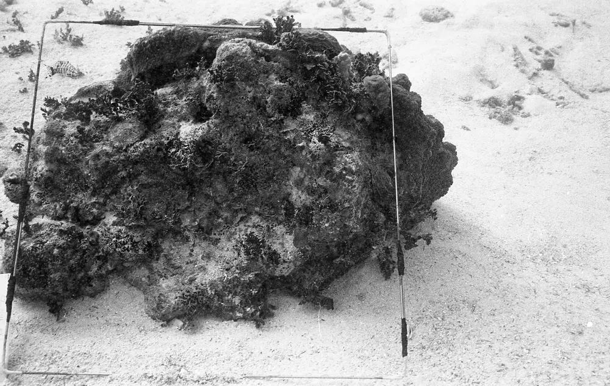{.lightbox group="discovery-bay-1966" description="**UUID: **6a52badb-2a28-420f-8c6d-04e5f779795e **Date: **1968-01-18 **Location: **Jamaica | Discovery Bay | Algal Plots **Longitude: **77.414ºW **Latitude: **18.473ºN **Photographer: **Eileen Graham **Copyright: **Trustees of the Natural History Museum (London, UK), CC-BY-4.0" alt="**UUID: **6a52badb-2a28-420f-8c6d-04e5f779795e **Date: **1968-01-18 **Location: **Jamaica | Discovery Bay | Algal Plots **Longitude: **77.414ºW **Latitude: **18.473ºN **Photographer: **Eileen Graham **Copyright: **Trustees of the Natural History Museum (London, UK), CC-BY-4.0"}

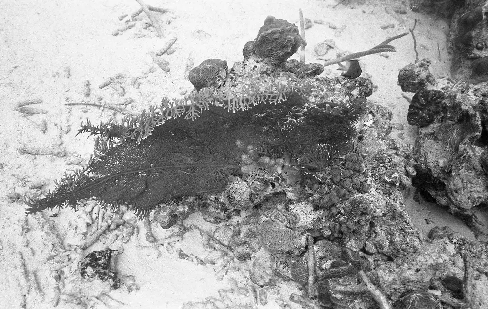{.lightbox group="discovery-bay-1966" description="**UUID: **92f4c33a-6f6c-4dde-857a-9a8dc08c2319 **Date: **1968-01-18 **Location: **Jamaica | Discovery Bay | Algal Plots **Longitude: **77.414ºW **Latitude: **18.473ºN **Photographer: **Eileen Graham **Copyright: **Trustees of the Natural History Museum (London, UK), CC-BY-4.0" alt="**UUID: **92f4c33a-6f6c-4dde-857a-9a8dc08c2319 **Date: **1968-01-18 **Location: **Jamaica | Discovery Bay | Algal Plots **Longitude: **77.414ºW **Latitude: **18.473ºN **Photographer: **Eileen Graham **Copyright: **Trustees of the Natural History Museum (London, UK), CC-BY-4.0"}

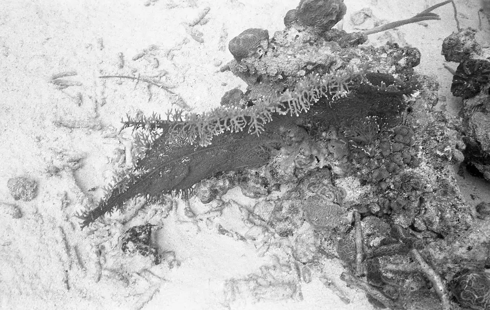{.lightbox group="discovery-bay-1966" description="**UUID: **159f4419-2f84-4265-8588-5894aae3164e **Date: **1968-01-18 **Location: **Jamaica | Discovery Bay | Algal Plots **Longitude: **77.414ºW **Latitude: **18.473ºN **Photographer: **Eileen Graham **Copyright: **Trustees of the Natural History Museum (London, UK), CC-BY-4.0" alt="**UUID: **159f4419-2f84-4265-8588-5894aae3164e **Date: **1968-01-18 **Location: **Jamaica | Discovery Bay | Algal Plots **Longitude: **77.414ºW **Latitude: **18.473ºN **Photographer: **Eileen Graham **Copyright: **Trustees of the Natural History Museum (London, UK), CC-BY-4.0"}

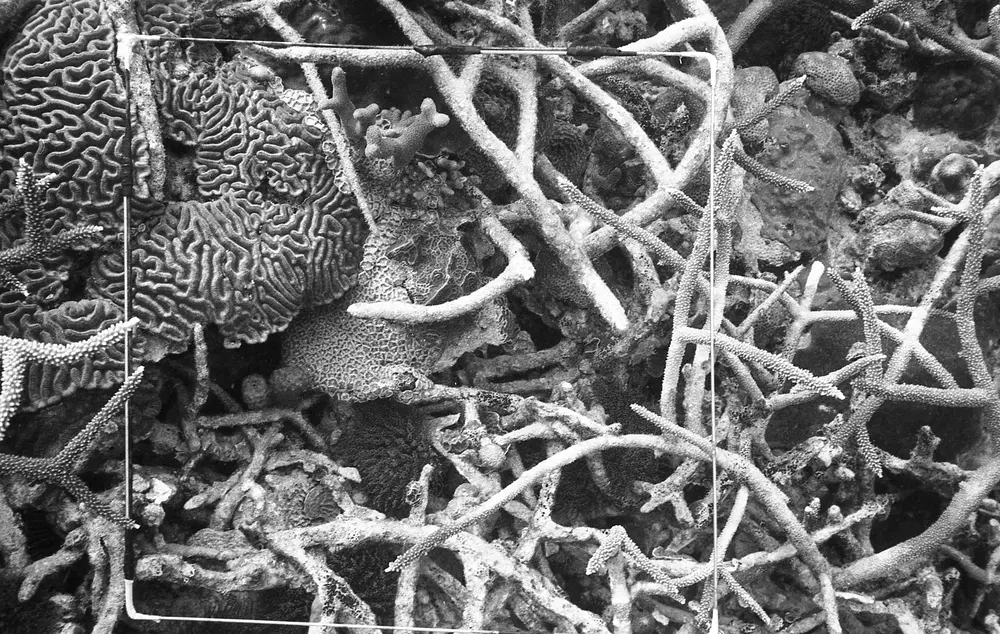{.lightbox group="discovery-bay-1966" description="**UUID: **6e0f1a32-991b-467e-ba36-50ec30f89e1c **Date: **1968-01-18 **Location: **Jamaica | Discovery Bay | Upper Buoy Terrace **Longitude: **77.40908ºW **Latitude: **18.47322ºN **Photographer: **Eileen Graham **Copyright: **Trustees of the Natural History Museum (London, UK), CC-BY-4.0" alt="**UUID: **6e0f1a32-991b-467e-ba36-50ec30f89e1c **Date: **1968-01-18 **Location: **Jamaica | Discovery Bay | Upper Buoy Terrace **Longitude: **77.40908ºW **Latitude: **18.47322ºN **Photographer: **Eileen Graham **Copyright: **Trustees of the Natural History Museum (London, UK), CC-BY-4.0"}

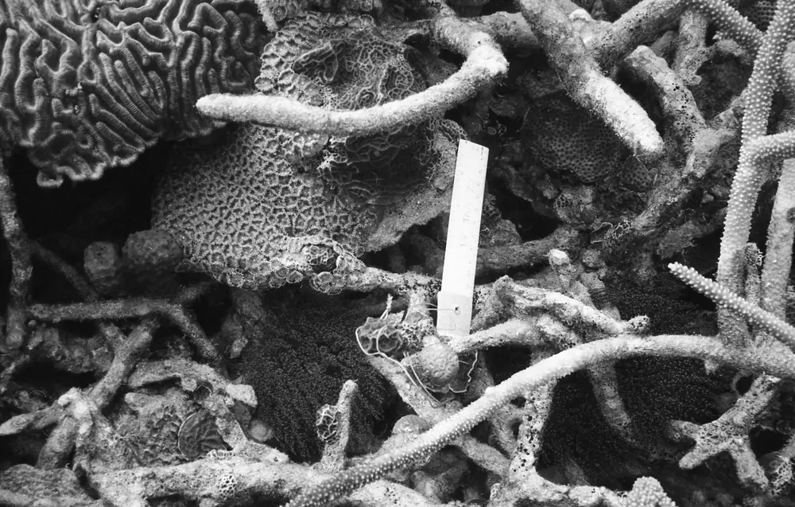{.lightbox group="discovery-bay-1966" description="**UUID: **f8216cf4-c5a2-4cc3-a8f5-53f4252e2249 **Date: **1968-01-18 **Location: **Jamaica | Discovery Bay | Upper Buoy Terrace **Longitude: **77.40908ºW **Latitude: **18.47322ºN **Photographer: **Eileen Graham **Copyright: **Trustees of the Natural History Museum (London, UK), CC-BY-4.0" alt="**UUID: **f8216cf4-c5a2-4cc3-a8f5-53f4252e2249 **Date: **1968-01-18 **Location: **Jamaica | Discovery Bay | Upper Buoy Terrace **Longitude: **77.40908ºW **Latitude: **18.47322ºN **Photographer: **Eileen Graham **Copyright: **Trustees of the Natural History Museum (London, UK), CC-BY-4.0"}

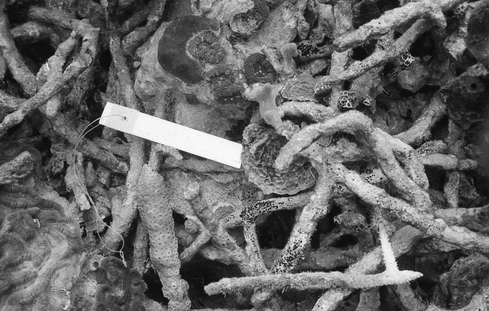{.lightbox group="discovery-bay-1966" description="**UUID: **c1111672-03b9-4cf0-8fdf-d4940f26165e **Date: **1968-01-18 **Location: **Jamaica | Discovery Bay | Upper Buoy Terrace **Longitude: **77.40908ºW **Latitude: **18.47322ºN **Photographer: **Eileen Graham **Copyright: **Trustees of the Natural History Museum (London, UK), CC-BY-4.0" alt="**UUID: **c1111672-03b9-4cf0-8fdf-d4940f26165e **Date: **1968-01-18 **Location: **Jamaica | Discovery Bay | Upper Buoy Terrace **Longitude: **77.40908ºW **Latitude: **18.47322ºN **Photographer: **Eileen Graham **Copyright: **Trustees of the Natural History Museum (London, UK), CC-BY-4.0"}

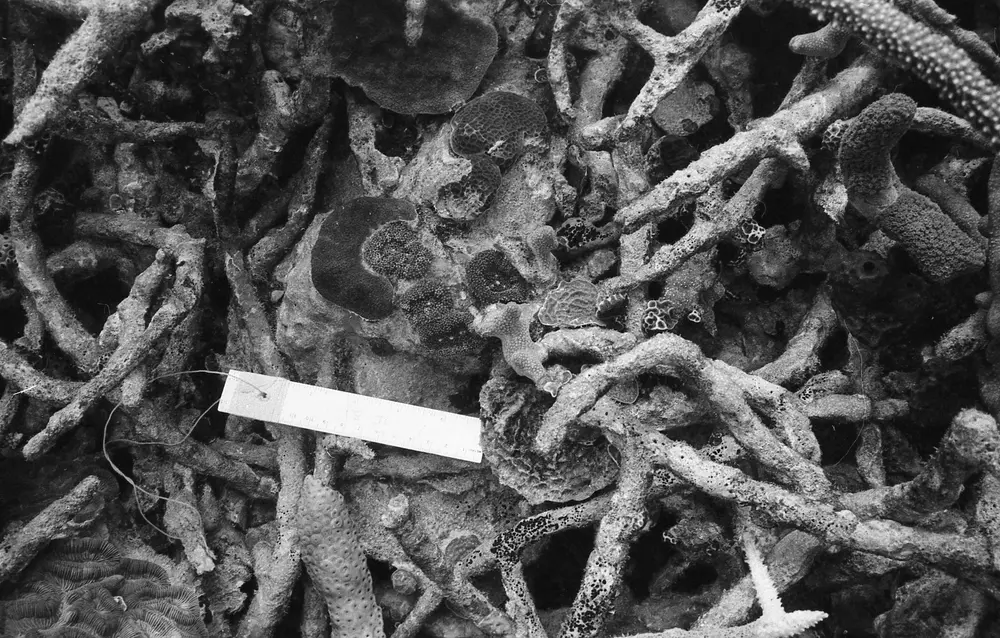{.lightbox group="discovery-bay-1966" description="**UUID: **0013ebfb-21e6-49fd-b5f0-acde82093f44 **Date: **1968-01-18 **Location: **Jamaica | Discovery Bay | Upper Buoy Terrace **Longitude: **77.40908ºW **Latitude: **18.47322ºN **Photographer: **Eileen Graham **Copyright: **Trustees of the Natural History Museum (London, UK), CC-BY-4.0" alt="**UUID: **0013ebfb-21e6-49fd-b5f0-acde82093f44 **Date: **1968-01-18 **Location: **Jamaica | Discovery Bay | Upper Buoy Terrace **Longitude: **77.40908ºW **Latitude: **18.47322ºN **Photographer: **Eileen Graham **Copyright: **Trustees of the Natural History Museum (London, UK), CC-BY-4.0"}

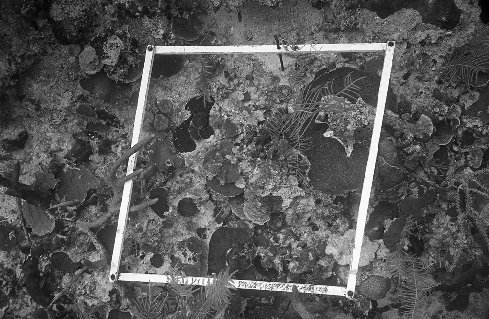{.lightbox group="discovery-bay-1966" description="**UUID: **27e10304-819d-45ec-b2e1-5f86cb8092f6 **Date: **1966-04-27 **Location: **Jamaica | Discovery Bay | Buoy Upper Slope **Longitude: **77.40908ºW **Latitude: **18.47322ºN **Photographer: **Eileen Graham **Copyright: **Trustees of the Natural History Museum (London, UK), CC-BY-4.0" alt="**UUID: **27e10304-819d-45ec-b2e1-5f86cb8092f6 **Date: **1966-04-27 **Location: **Jamaica | Discovery Bay | Buoy Upper Slope **Longitude: **77.40908ºW **Latitude: **18.47322ºN **Photographer: **Eileen Graham **Copyright: **Trustees of the Natural History Museum (London, UK), CC-BY-4.0"}

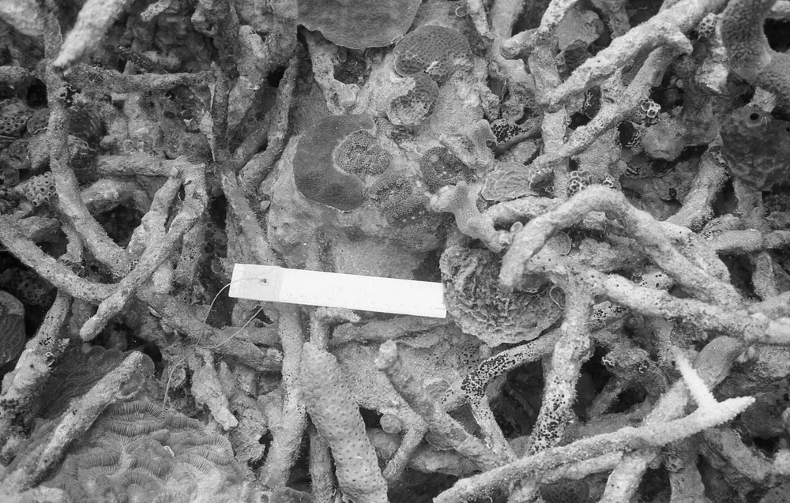{.lightbox group="discovery-bay-1966" description="**UUID: **55307cec-33a3-4955-b079-37a326d3549d **Date: **1968-01-18 **Location: **Jamaica | Discovery Bay | Upper Buoy Terrace **Longitude: **77.40908ºW **Latitude: **18.47322ºN **Photographer: **Eileen Graham **Copyright: **Trustees of the Natural History Museum (London, UK), CC-BY-4.0" alt="**UUID: **55307cec-33a3-4955-b079-37a326d3549d **Date: **1968-01-18 **Location: **Jamaica | Discovery Bay | Upper Buoy Terrace **Longitude: **77.40908ºW **Latitude: **18.47322ºN **Photographer: **Eileen Graham **Copyright: **Trustees of the Natural History Museum (London, UK), CC-BY-4.0"}

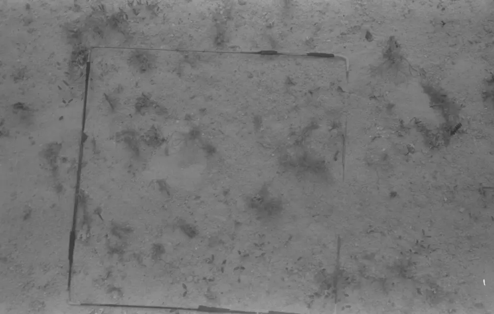{.lightbox group="discovery-bay-1966" description="**UUID: **9faae28b-e80f-49ce-b454-336b03cba13d **Date: **1968-01-19 **Location: **Jamaica | Discovery Bay | Pinnacle 1 Sand Slope **Longitude: **77.41017ºW **Latitude: **18.47367ºN **Photographer: **Eileen Graham **Copyright: **Trustees of the Natural History Museum (London, UK), CC-BY-4.0" alt="**UUID: **9faae28b-e80f-49ce-b454-336b03cba13d **Date: **1968-01-19 **Location: **Jamaica | Discovery Bay | Pinnacle 1 Sand Slope **Longitude: **77.41017ºW **Latitude: **18.47367ºN **Photographer: **Eileen Graham **Copyright: **Trustees of the Natural History Museum (London, UK), CC-BY-4.0"}

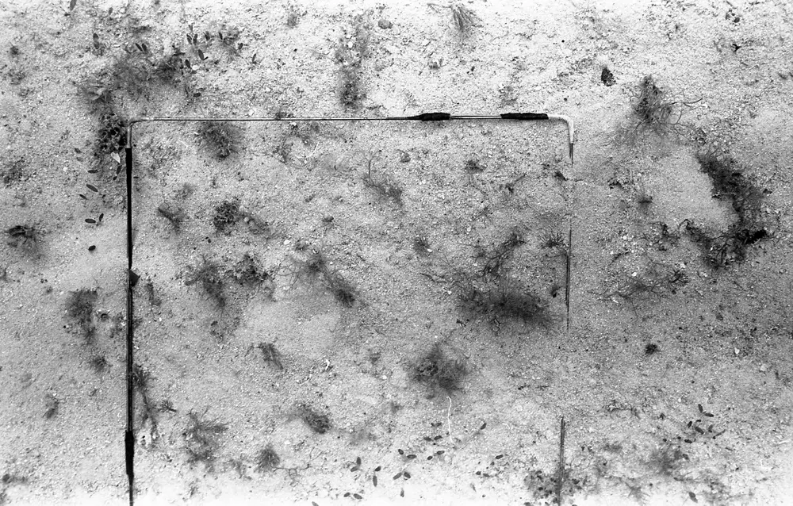{.lightbox group="discovery-bay-1966" description="**UUID: **ab6f9040-0443-4df0-9f55-97a6ba894f87 **Date: **1968-01-19 **Location: **Jamaica | Discovery Bay | Pinnacle 1 Sand Slope **Longitude: **77.41017ºW **Latitude: **18.47367ºN **Photographer: **Eileen Graham **Copyright: **Trustees of the Natural History Museum (London, UK), CC-BY-4.0" alt="**UUID: **ab6f9040-0443-4df0-9f55-97a6ba894f87 **Date: **1968-01-19 **Location: **Jamaica | Discovery Bay | Pinnacle 1 Sand Slope **Longitude: **77.41017ºW **Latitude: **18.47367ºN **Photographer: **Eileen Graham **Copyright: **Trustees of the Natural History Museum (London, UK), CC-BY-4.0"}

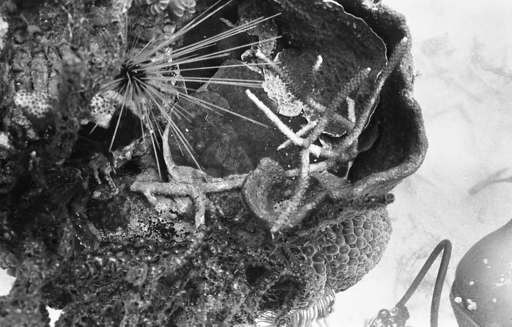{.lightbox group="discovery-bay-1966" description="**UUID: **1e5bc45e-a35b-4b25-a0f0-0f01afa76f1b **Date: **1968-01-19 **Location: **Jamaica | Discovery Bay | Pinnacle 1 Sand Slope **Longitude: **77.41017ºW **Latitude: **18.47367ºN **Photographer: **Eileen Graham **Copyright: **Trustees of the Natural History Museum (London, UK), CC-BY-4.0" alt="**UUID: **1e5bc45e-a35b-4b25-a0f0-0f01afa76f1b **Date: **1968-01-19 **Location: **Jamaica | Discovery Bay | Pinnacle 1 Sand Slope **Longitude: **77.41017ºW **Latitude: **18.47367ºN **Photographer: **Eileen Graham **Copyright: **Trustees of the Natural History Museum (London, UK), CC-BY-4.0"}

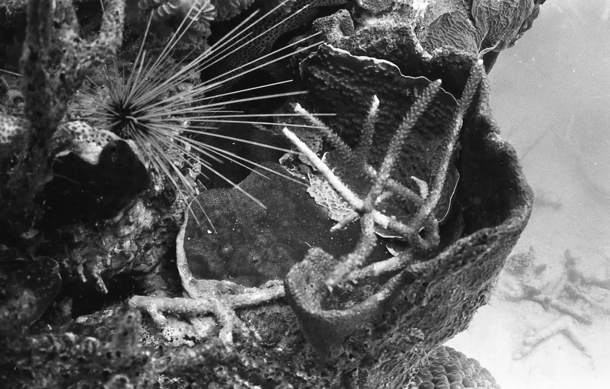{.lightbox group="discovery-bay-1966" description="**UUID: **da5eff60-d275-41ab-8338-b39ddd4fd992 **Date: **1968-01-19 **Location: **Jamaica | Discovery Bay | Pinnacle 1 Sand Slope **Longitude: **77.41017ºW **Latitude: **18.47367ºN **Photographer: **Eileen Graham **Copyright: **Trustees of the Natural History Museum (London, UK), CC-BY-4.0" alt="**UUID: **da5eff60-d275-41ab-8338-b39ddd4fd992 **Date: **1968-01-19 **Location: **Jamaica | Discovery Bay | Pinnacle 1 Sand Slope **Longitude: **77.41017ºW **Latitude: **18.47367ºN **Photographer: **Eileen Graham **Copyright: **Trustees of the Natural History Museum (London, UK), CC-BY-4.0"}

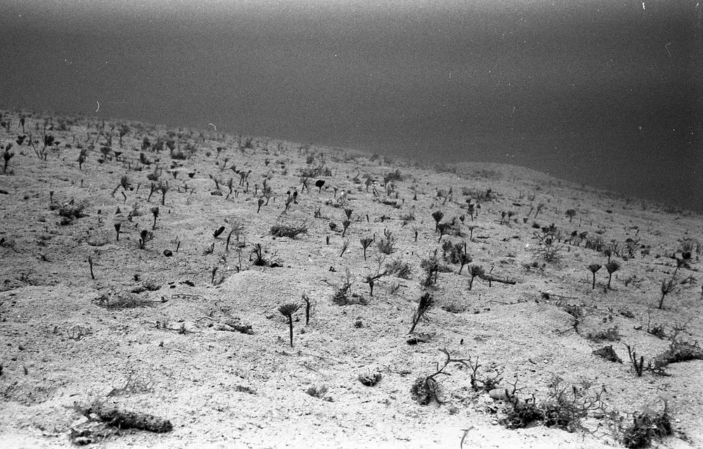{.lightbox group="discovery-bay-1966" description="**UUID: **c851db35-7140-49c3-9a76-dff37b6ad5e8 **Date: **1968-01-19 **Location: **Jamaica | Discovery Bay | Pinnacle 1 Sand Slope **Longitude: **77.41017ºW **Latitude: **18.47367ºN **Photographer: **Eileen Graham **Copyright: **Trustees of the Natural History Museum (London, UK), CC-BY-4.0" alt="**UUID: **c851db35-7140-49c3-9a76-dff37b6ad5e8 **Date: **1968-01-19 **Location: **Jamaica | Discovery Bay | Pinnacle 1 Sand Slope **Longitude: **77.41017ºW **Latitude: **18.47367ºN **Photographer: **Eileen Graham **Copyright: **Trustees of the Natural History Museum (London, UK), CC-BY-4.0"}

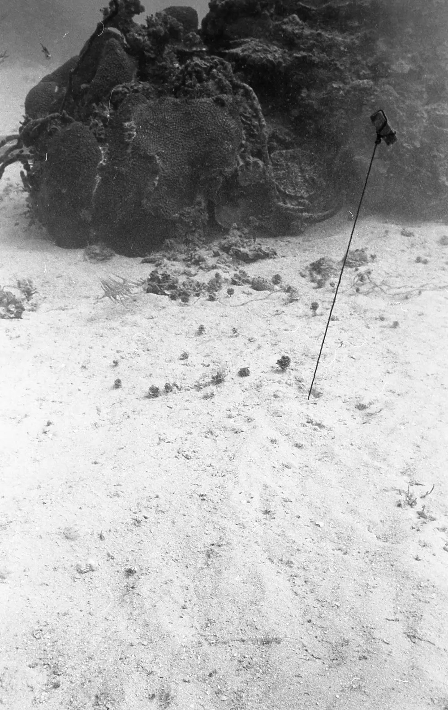{.lightbox group="discovery-bay-1966" description="**UUID: **8db9951a-2e21-4a9b-964d-0b8e51e82e27 **Date: **1968-01-19 **Location: **Jamaica | Discovery Bay | Pinnacle 1 Sand Slope **Longitude: **77.41017ºW **Latitude: **18.47367ºN **Photographer: **Eileen Graham **Copyright: **Trustees of the Natural History Museum (London, UK), CC-BY-4.0" alt="**UUID: **8db9951a-2e21-4a9b-964d-0b8e51e82e27 **Date: **1968-01-19 **Location: **Jamaica | Discovery Bay | Pinnacle 1 Sand Slope **Longitude: **77.41017ºW **Latitude: **18.47367ºN **Photographer: **Eileen Graham **Copyright: **Trustees of the Natural History Museum (London, UK), CC-BY-4.0"}

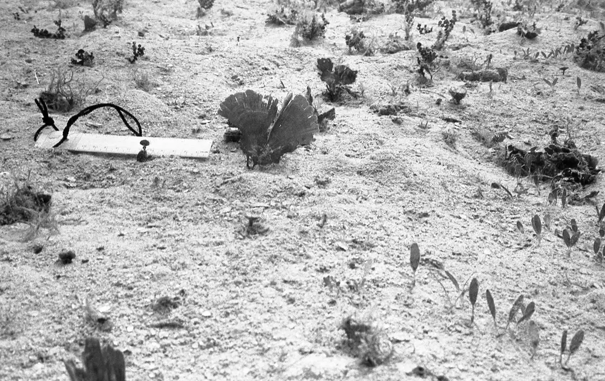{.lightbox group="discovery-bay-1966" description="**UUID: **811f4105-bef8-42c9-a7f8-6fe4b30a61d9 **Date: **1968-01-19 **Location: **Jamaica | Discovery Bay | Pinnacle 1 Sand Slope **Longitude: **77.41017ºW **Latitude: **18.47367ºN **Photographer: **Eileen Graham **Copyright: **Trustees of the Natural History Museum (London, UK), CC-BY-4.0" alt="**UUID: **811f4105-bef8-42c9-a7f8-6fe4b30a61d9 **Date: **1968-01-19 **Location: **Jamaica | Discovery Bay | Pinnacle 1 Sand Slope **Longitude: **77.41017ºW **Latitude: **18.47367ºN **Photographer: **Eileen Graham **Copyright: **Trustees of the Natural History Museum (London, UK), CC-BY-4.0"}

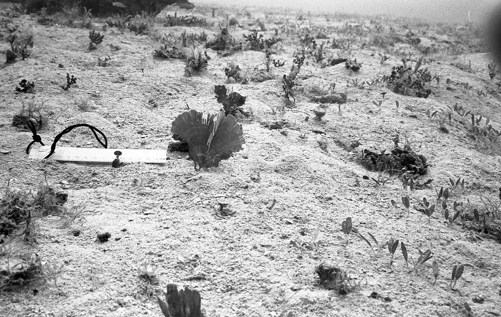{.lightbox group="discovery-bay-1966" description="**UUID: **2159498d-991d-4f0a-bd71-24d9a597f3d4 **Date: **1968-01-19 **Location: **Jamaica | Discovery Bay | Pinnacle 1 Sand Slope **Longitude: **77.41017ºW **Latitude: **18.47367ºN **Photographer: **Eileen Graham **Copyright: **Trustees of the Natural History Museum (London, UK), CC-BY-4.0" alt="**UUID: **2159498d-991d-4f0a-bd71-24d9a597f3d4 **Date: **1968-01-19 **Location: **Jamaica | Discovery Bay | Pinnacle 1 Sand Slope **Longitude: **77.41017ºW **Latitude: **18.47367ºN **Photographer: **Eileen Graham **Copyright: **Trustees of the Natural History Museum (London, UK), CC-BY-4.0"}

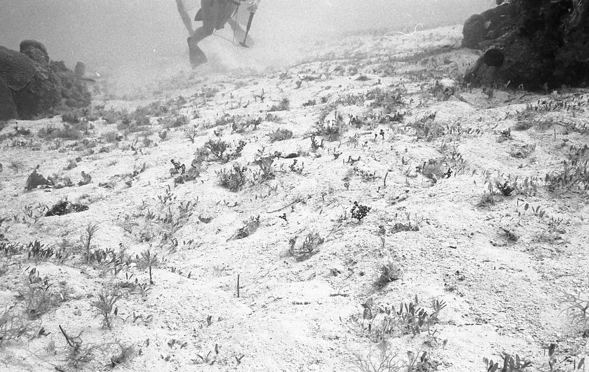{.lightbox group="discovery-bay-1966" description="**UUID: **960a060b-dda9-4ffc-8f61-2cc9609228b5 **Date: **1968-01-19 **Location: **Jamaica | Discovery Bay | Pinnacle 1 Sand Slope **Longitude: **77.41017ºW **Latitude: **18.47367ºN **Photographer: **Eileen Graham **Copyright: **Trustees of the Natural History Museum (London, UK), CC-BY-4.0" alt="**UUID: **960a060b-dda9-4ffc-8f61-2cc9609228b5 **Date: **1968-01-19 **Location: **Jamaica | Discovery Bay | Pinnacle 1 Sand Slope **Longitude: **77.41017ºW **Latitude: **18.47367ºN **Photographer: **Eileen Graham **Copyright: **Trustees of the Natural History Museum (London, UK), CC-BY-4.0"}

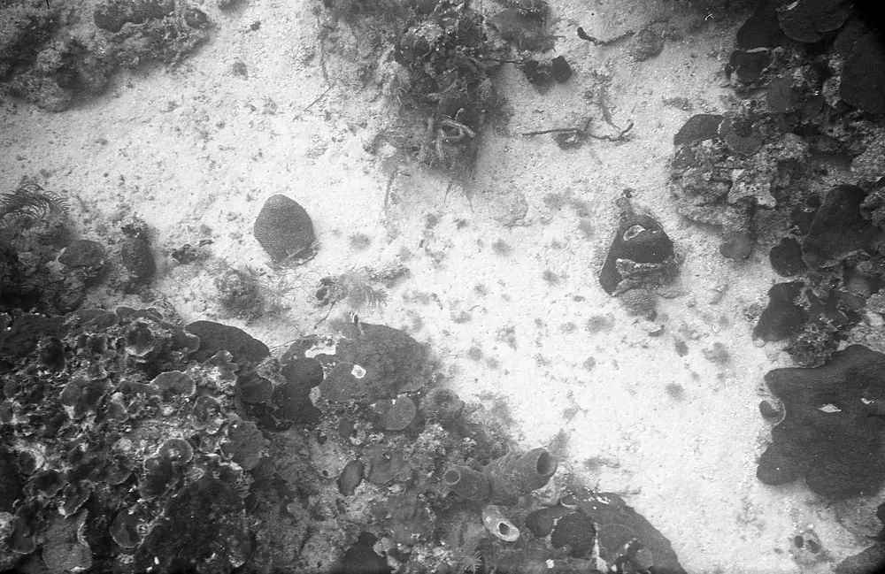{.lightbox group="discovery-bay-1966" description="**UUID: **0a50e6ff-8521-497d-9b74-8769c0c49401 **Date: **1966-04-27 **Location: **Jamaica | Discovery Bay | Buoy Upper Slope **Longitude: **77.40908ºW **Latitude: **18.47322ºN **Photographer: **Eileen Graham **Copyright: **Trustees of the Natural History Museum (London, UK), CC-BY-4.0" alt="**UUID: **0a50e6ff-8521-497d-9b74-8769c0c49401 **Date: **1966-04-27 **Location: **Jamaica | Discovery Bay | Buoy Upper Slope **Longitude: **77.40908ºW **Latitude: **18.47322ºN **Photographer: **Eileen Graham **Copyright: **Trustees of the Natural History Museum (London, UK), CC-BY-4.0"}

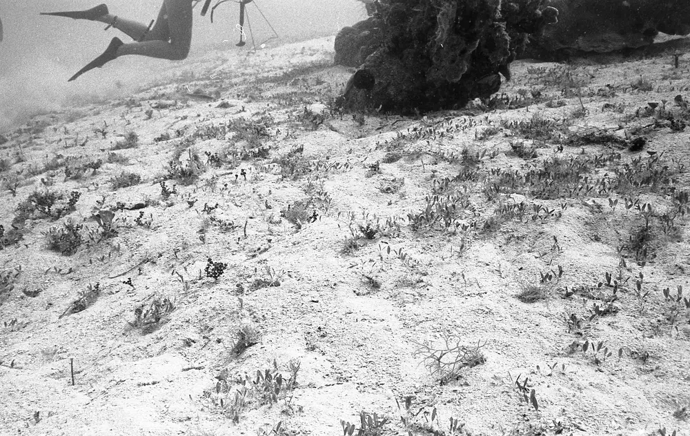{.lightbox group="discovery-bay-1966" description="**UUID: **db4592f5-7488-4fa4-a04c-95721d9c089f **Date: **1968-01-19 **Location: **Jamaica | Discovery Bay | Pinnacle 1 Sand Slope **Longitude: **77.41017ºW **Latitude: **18.47367ºN **Photographer: **Eileen Graham **Copyright: **Trustees of the Natural History Museum (London, UK), CC-BY-4.0" alt="**UUID: **db4592f5-7488-4fa4-a04c-95721d9c089f **Date: **1968-01-19 **Location: **Jamaica | Discovery Bay | Pinnacle 1 Sand Slope **Longitude: **77.41017ºW **Latitude: **18.47367ºN **Photographer: **Eileen Graham **Copyright: **Trustees of the Natural History Museum (London, UK), CC-BY-4.0"}

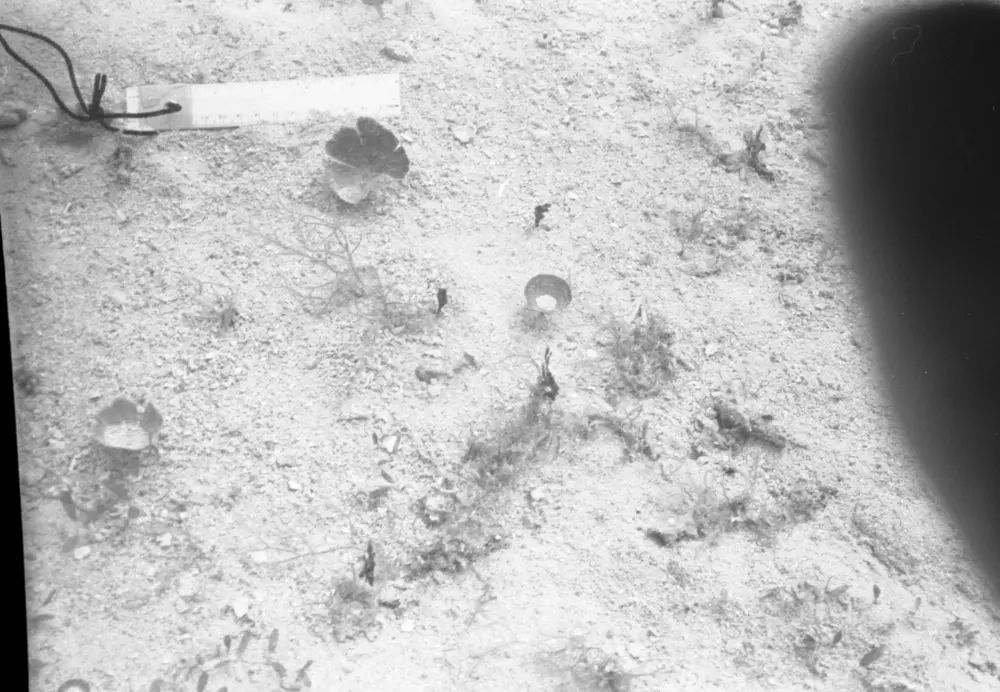{.lightbox group="discovery-bay-1966" description="**UUID: **dd19f6b0-3cd5-47fa-848e-636f51718cc3 **Date: **1968-01-19 **Location: **Jamaica | Discovery Bay | Pinnacle 1 Sand Slope **Longitude: **77.41017ºW **Latitude: **18.47367ºN **Photographer: **Eileen Graham **Copyright: **Trustees of the Natural History Museum (London, UK), CC-BY-4.0" alt="**UUID: **dd19f6b0-3cd5-47fa-848e-636f51718cc3 **Date: **1968-01-19 **Location: **Jamaica | Discovery Bay | Pinnacle 1 Sand Slope **Longitude: **77.41017ºW **Latitude: **18.47367ºN **Photographer: **Eileen Graham **Copyright: **Trustees of the Natural History Museum (London, UK), CC-BY-4.0"}

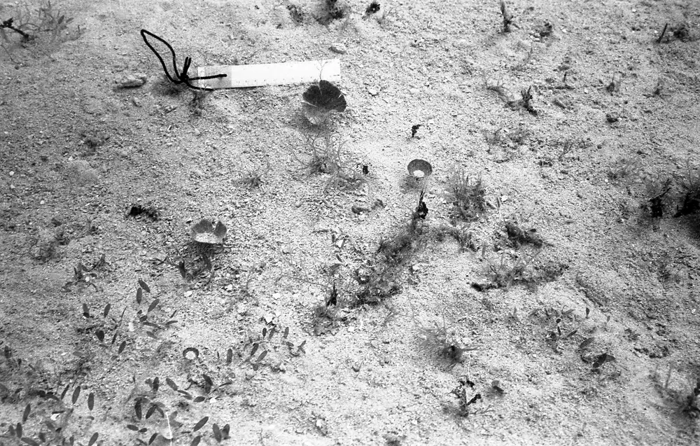{.lightbox group="discovery-bay-1966" description="**UUID: **108e7635-c49d-49bf-be52-100252d05903 **Date: **1968-01-19 **Location: **Jamaica | Discovery Bay | Pinnacle 1 Sand Slope **Longitude: **77.41017ºW **Latitude: **18.47367ºN **Photographer: **Eileen Graham **Copyright: **Trustees of the Natural History Museum (London, UK), CC-BY-4.0" alt="**UUID: **108e7635-c49d-49bf-be52-100252d05903 **Date: **1968-01-19 **Location: **Jamaica | Discovery Bay | Pinnacle 1 Sand Slope **Longitude: **77.41017ºW **Latitude: **18.47367ºN **Photographer: **Eileen Graham **Copyright: **Trustees of the Natural History Museum (London, UK), CC-BY-4.0"}

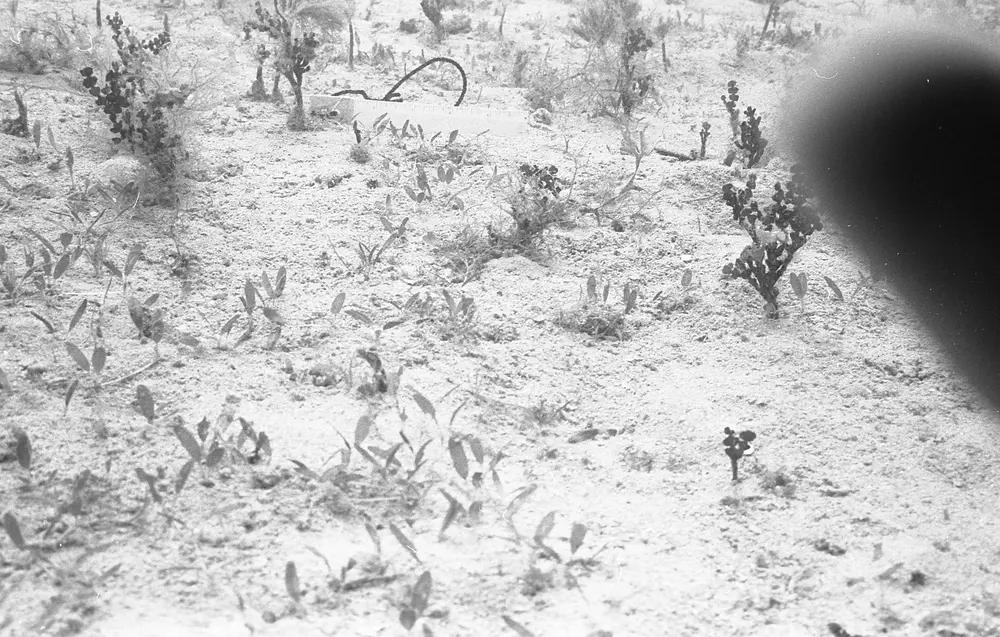{.lightbox group="discovery-bay-1966" description="**UUID: **9bde1f29-df98-433d-be4f-7c344df6b4d3 **Date: **1968-01-19 **Location: **Jamaica | Discovery Bay | Pinnacle 1 Sand Slope **Longitude: **77.41017ºW **Latitude: **18.47367ºN **Photographer: **Eileen Graham **Copyright: **Trustees of the Natural History Museum (London, UK), CC-BY-4.0" alt="**UUID: **9bde1f29-df98-433d-be4f-7c344df6b4d3 **Date: **1968-01-19 **Location: **Jamaica | Discovery Bay | Pinnacle 1 Sand Slope **Longitude: **77.41017ºW **Latitude: **18.47367ºN **Photographer: **Eileen Graham **Copyright: **Trustees of the Natural History Museum (London, UK), CC-BY-4.0"}

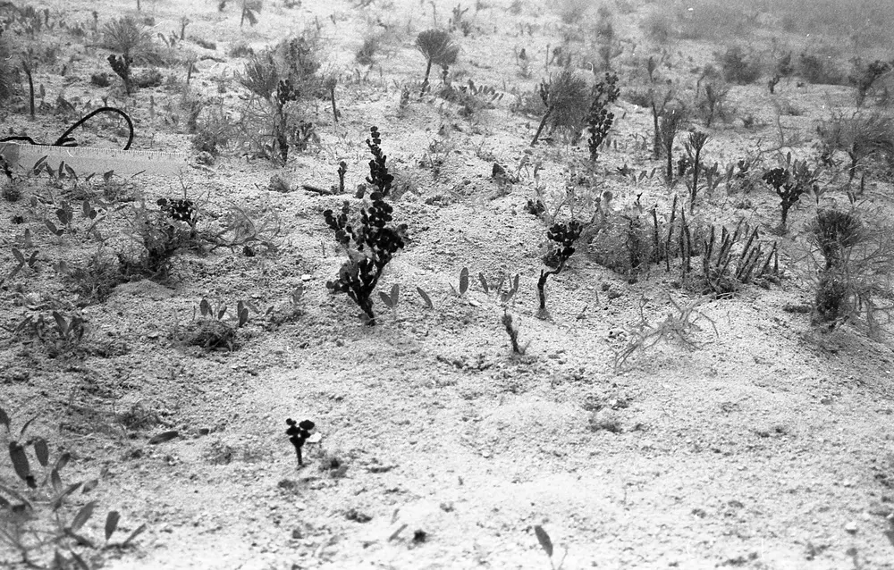{.lightbox group="discovery-bay-1966" description="**UUID: **2fcd3d0a-d6d1-45ae-865a-6e743c33f50d **Date: **1968-01-19 **Location: **Jamaica | Discovery Bay | Pinnacle 1 Sand Slope **Longitude: **77.41017ºW **Latitude: **18.47367ºN **Photographer: **Eileen Graham **Copyright: **Trustees of the Natural History Museum (London, UK), CC-BY-4.0" alt="**UUID: **2fcd3d0a-d6d1-45ae-865a-6e743c33f50d **Date: **1968-01-19 **Location: **Jamaica | Discovery Bay | Pinnacle 1 Sand Slope **Longitude: **77.41017ºW **Latitude: **18.47367ºN **Photographer: **Eileen Graham **Copyright: **Trustees of the Natural History Museum (London, UK), CC-BY-4.0"}

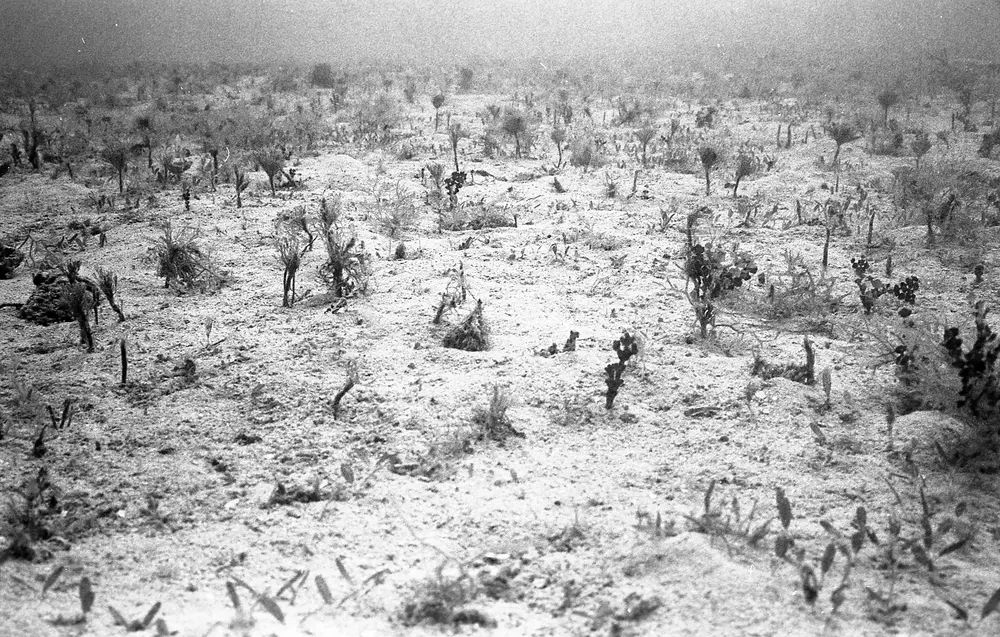{.lightbox group="discovery-bay-1966" description="**UUID: **7104f4e9-52f8-49ee-8a66-d1007c2a5f24 **Date: **1968-01-19 **Location: **Jamaica | Discovery Bay | Pinnacle 1 Sand Slope **Longitude: **77.41017ºW **Latitude: **18.47367ºN **Photographer: **Eileen Graham **Copyright: **Trustees of the Natural History Museum (London, UK), CC-BY-4.0" alt="**UUID: **7104f4e9-52f8-49ee-8a66-d1007c2a5f24 **Date: **1968-01-19 **Location: **Jamaica | Discovery Bay | Pinnacle 1 Sand Slope **Longitude: **77.41017ºW **Latitude: **18.47367ºN **Photographer: **Eileen Graham **Copyright: **Trustees of the Natural History Museum (London, UK), CC-BY-4.0"}

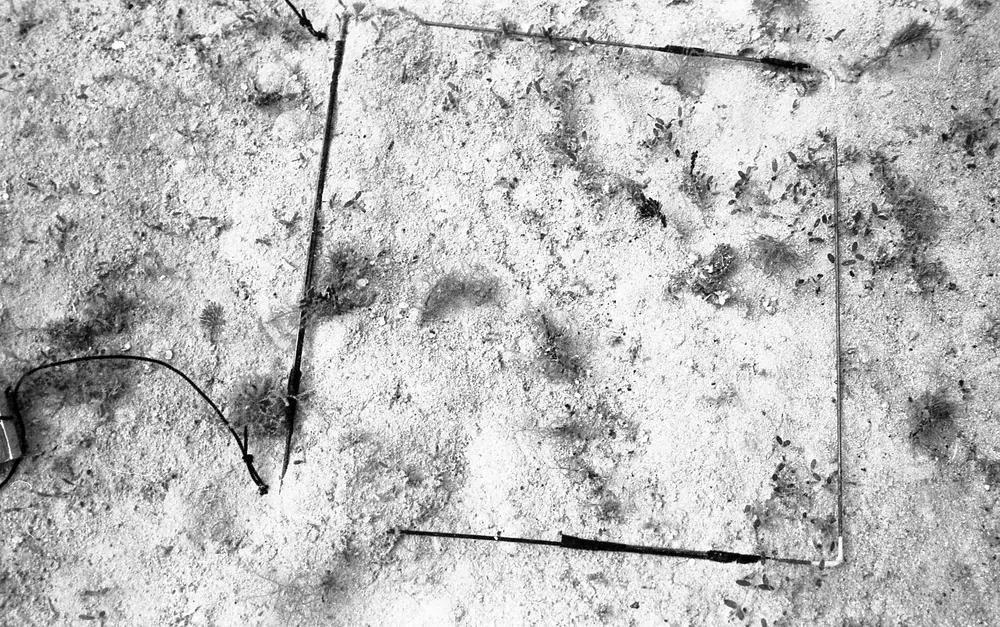{.lightbox group="discovery-bay-1966" description="**UUID: **5949931b-2fc7-44c0-a9b8-94a1a52bd93c **Date: **1968-01-20 **Location: **Jamaica | Discovery Bay | Algal Plots **Longitude: **77.414ºW **Latitude: **18.473ºN **Photographer: **Eileen Graham **Copyright: **Trustees of the Natural History Museum (London, UK), CC-BY-4.0" alt="**UUID: **5949931b-2fc7-44c0-a9b8-94a1a52bd93c **Date: **1968-01-20 **Location: **Jamaica | Discovery Bay | Algal Plots **Longitude: **77.414ºW **Latitude: **18.473ºN **Photographer: **Eileen Graham **Copyright: **Trustees of the Natural History Museum (London, UK), CC-BY-4.0"}

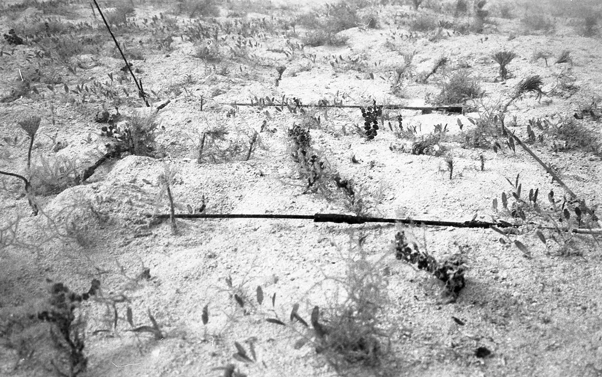{.lightbox group="discovery-bay-1966" description="**UUID: **dd1cf292-a10f-4300-8070-4641c9f863f3 **Date: **1968-01-20 **Location: **Jamaica | Discovery Bay | Algal Plots **Longitude: **77.414ºW **Latitude: **18.473ºN **Photographer: **Eileen Graham **Copyright: **Trustees of the Natural History Museum (London, UK), CC-BY-4.0" alt="**UUID: **dd1cf292-a10f-4300-8070-4641c9f863f3 **Date: **1968-01-20 **Location: **Jamaica | Discovery Bay | Algal Plots **Longitude: **77.414ºW **Latitude: **18.473ºN **Photographer: **Eileen Graham **Copyright: **Trustees of the Natural History Museum (London, UK), CC-BY-4.0"}

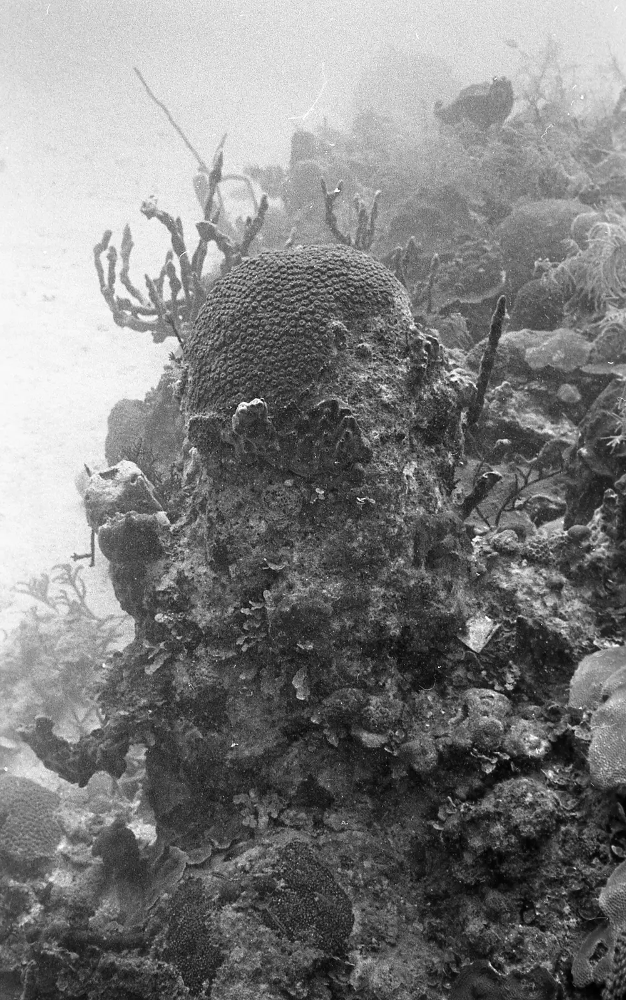{.lightbox group="discovery-bay-1966" description="**UUID: **65d282be-c78e-48e3-b70c-0893f3a81723 **Date: **1968-01-20 **Location: **Jamaica | Discovery Bay | Buoy Upper Slope **Longitude: **77.40908ºW **Latitude: **18.47322ºN **Photographer: **Eileen Graham **Copyright: **Trustees of the Natural History Museum (London, UK), CC-BY-4.0" alt="**UUID: **65d282be-c78e-48e3-b70c-0893f3a81723 **Date: **1968-01-20 **Location: **Jamaica | Discovery Bay | Buoy Upper Slope **Longitude: **77.40908ºW **Latitude: **18.47322ºN **Photographer: **Eileen Graham **Copyright: **Trustees of the Natural History Museum (London, UK), CC-BY-4.0"}

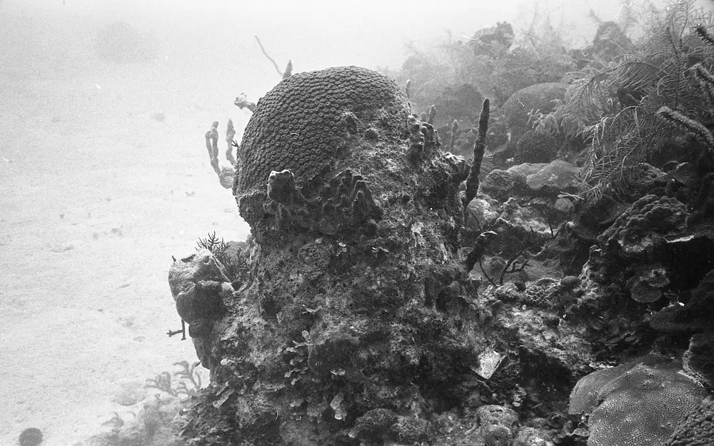{.lightbox group="discovery-bay-1966" description="**UUID: **1320368c-7933-4852-94f9-45d3b4b90908 **Date: **1968-01-20 **Location: **Jamaica | Discovery Bay | Buoy Upper Slope **Longitude: **77.40908ºW **Latitude: **18.47322ºN **Photographer: **Eileen Graham **Copyright: **Trustees of the Natural History Museum (London, UK), CC-BY-4.0" alt="**UUID: **1320368c-7933-4852-94f9-45d3b4b90908 **Date: **1968-01-20 **Location: **Jamaica | Discovery Bay | Buoy Upper Slope **Longitude: **77.40908ºW **Latitude: **18.47322ºN **Photographer: **Eileen Graham **Copyright: **Trustees of the Natural History Museum (London, UK), CC-BY-4.0"}

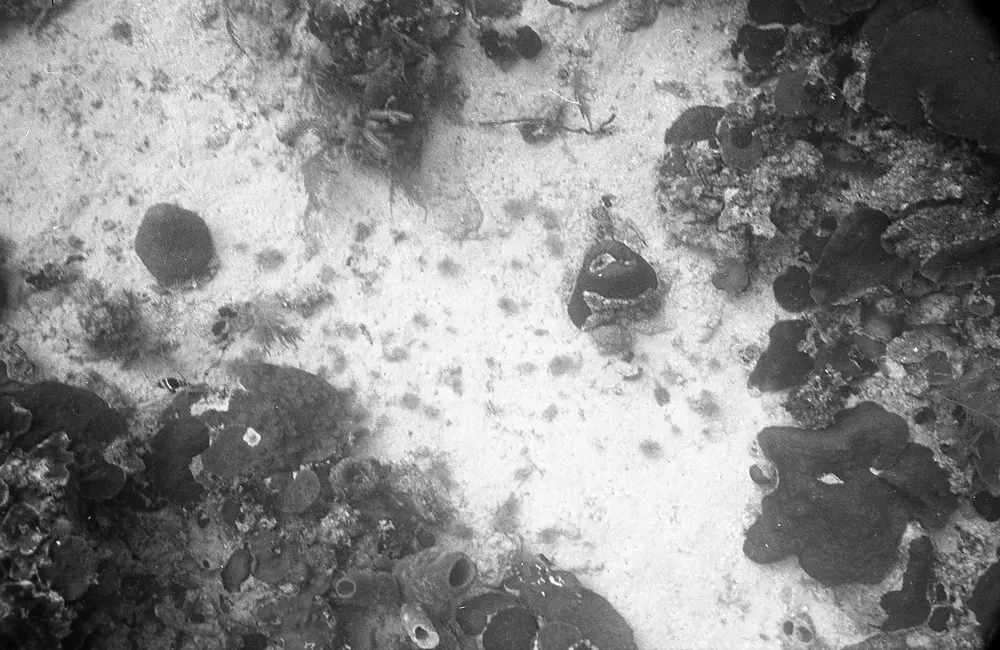{.lightbox group="discovery-bay-1966" description="**UUID: **be334792-8812-4495-8310-38f40b2fb140 **Date: **1966-04-27 **Location: **Jamaica | Discovery Bay | Buoy Upper Slope **Longitude: **77.40908ºW **Latitude: **18.47322ºN **Photographer: **Eileen Graham **Copyright: **Trustees of the Natural History Museum (London, UK), CC-BY-4.0" alt="**UUID: **be334792-8812-4495-8310-38f40b2fb140 **Date: **1966-04-27 **Location: **Jamaica | Discovery Bay | Buoy Upper Slope **Longitude: **77.40908ºW **Latitude: **18.47322ºN **Photographer: **Eileen Graham **Copyright: **Trustees of the Natural History Museum (London, UK), CC-BY-4.0"}

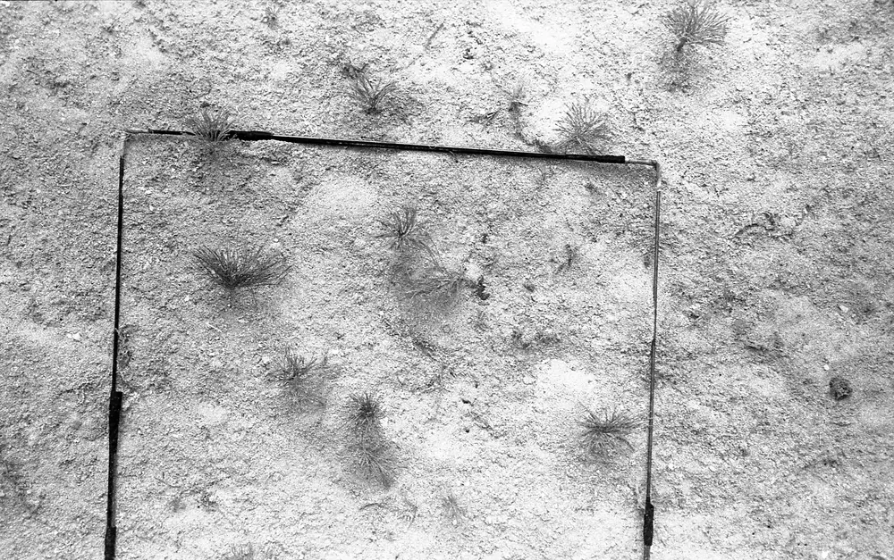{.lightbox group="discovery-bay-1966" description="**UUID: **38162019-3322-48fa-a1e6-5c782a9dcba0 **Date: **1968-01-20 **Location: **Jamaica | Discovery Bay | Algal Plots **Longitude: **77.414ºW **Latitude: **18.473ºN **Photographer: **Eileen Graham **Copyright: **Trustees of the Natural History Museum (London, UK), CC-BY-4.0" alt="**UUID: **38162019-3322-48fa-a1e6-5c782a9dcba0 **Date: **1968-01-20 **Location: **Jamaica | Discovery Bay | Algal Plots **Longitude: **77.414ºW **Latitude: **18.473ºN **Photographer: **Eileen Graham **Copyright: **Trustees of the Natural History Museum (London, UK), CC-BY-4.0"}

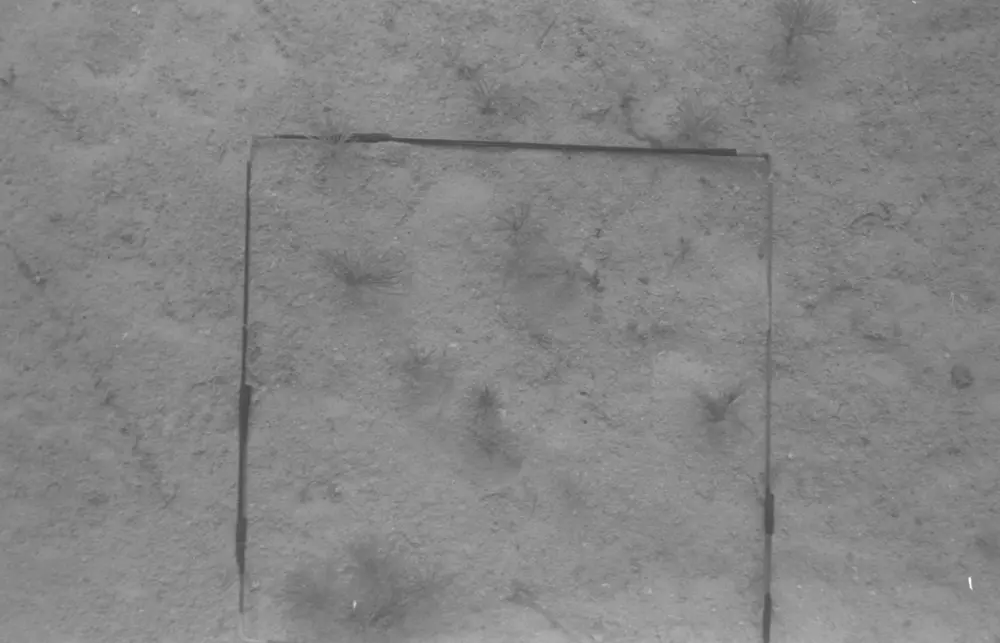{.lightbox group="discovery-bay-1966" description="**UUID: **806468ec-04d3-4464-8bd4-3d0b62672eb1 **Date: **1968-01-20 **Location: **Jamaica | Discovery Bay | Algal Plots **Longitude: **77.414ºW **Latitude: **18.473ºN **Photographer: **Eileen Graham **Copyright: **Trustees of the Natural History Museum (London, UK), CC-BY-4.0" alt="**UUID: **806468ec-04d3-4464-8bd4-3d0b62672eb1 **Date: **1968-01-20 **Location: **Jamaica | Discovery Bay | Algal Plots **Longitude: **77.414ºW **Latitude: **18.473ºN **Photographer: **Eileen Graham **Copyright: **Trustees of the Natural History Museum (London, UK), CC-BY-4.0"}

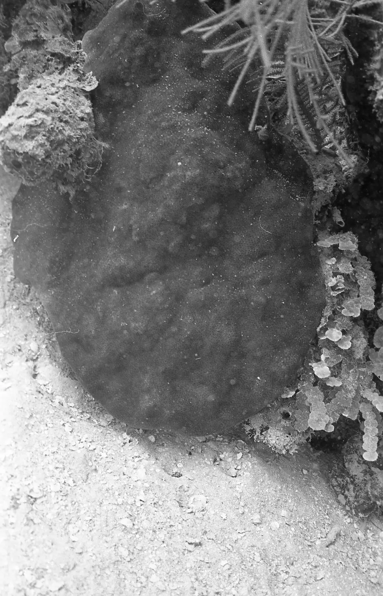{.lightbox group="discovery-bay-1966" description="**UUID: **67d5b44a-5690-4886-a970-47c4a11fb8f7 **Date: **1968-01-20 **Location: **Jamaica | Discovery Bay | Buoy Upper Slope **Longitude: **77.40908ºW **Latitude: **18.47322ºN **Photographer: **Eileen Graham **Copyright: **Trustees of the Natural History Museum (London, UK), CC-BY-4.0" alt="**UUID: **67d5b44a-5690-4886-a970-47c4a11fb8f7 **Date: **1968-01-20 **Location: **Jamaica | Discovery Bay | Buoy Upper Slope **Longitude: **77.40908ºW **Latitude: **18.47322ºN **Photographer: **Eileen Graham **Copyright: **Trustees of the Natural History Museum (London, UK), CC-BY-4.0"}

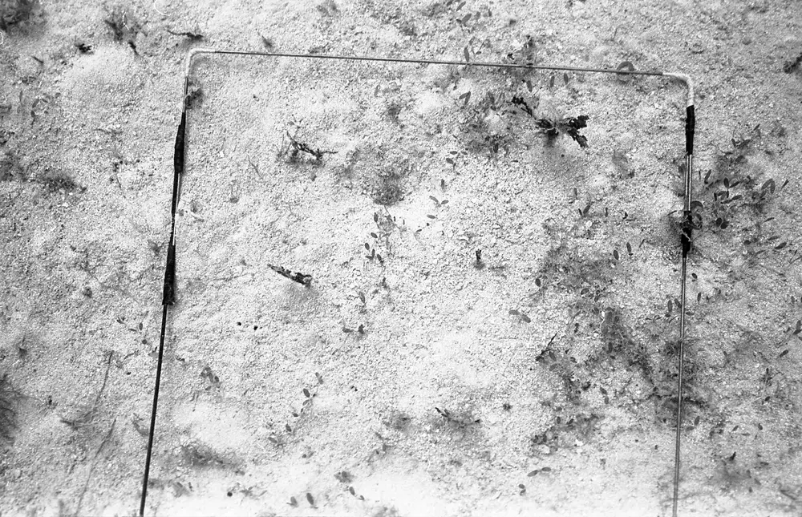{.lightbox group="discovery-bay-1966" description="**UUID: **f35aff1e-e3a7-488e-93f1-0ef1cf6027b7 **Date: **1968-01-20 **Location: **Jamaica | Discovery Bay | Algal Plots **Longitude: **77.414ºW **Latitude: **18.473ºN **Photographer: **Eileen Graham **Copyright: **Trustees of the Natural History Museum (London, UK), CC-BY-4.0" alt="**UUID: **f35aff1e-e3a7-488e-93f1-0ef1cf6027b7 **Date: **1968-01-20 **Location: **Jamaica | Discovery Bay | Algal Plots **Longitude: **77.414ºW **Latitude: **18.473ºN **Photographer: **Eileen Graham **Copyright: **Trustees of the Natural History Museum (London, UK), CC-BY-4.0"}

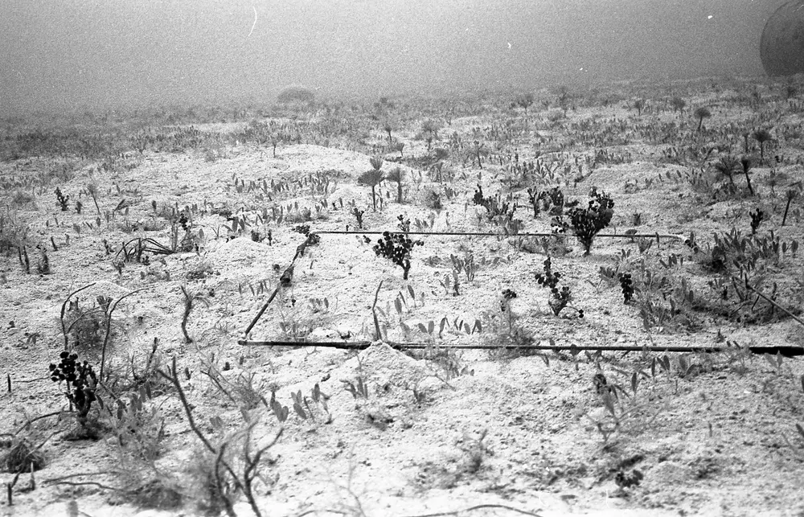{.lightbox group="discovery-bay-1966" description="**UUID: **a57df719-303a-4ed6-a28a-210462026988 **Date: **1968-01-20 **Location: **Jamaica | Discovery Bay | Algal Plots **Longitude: **77.414ºW **Latitude: **18.473ºN **Photographer: **Eileen Graham **Copyright: **Trustees of the Natural History Museum (London, UK), CC-BY-4.0" alt="**UUID: **a57df719-303a-4ed6-a28a-210462026988 **Date: **1968-01-20 **Location: **Jamaica | Discovery Bay | Algal Plots **Longitude: **77.414ºW **Latitude: **18.473ºN **Photographer: **Eileen Graham **Copyright: **Trustees of the Natural History Museum (London, UK), CC-BY-4.0"}

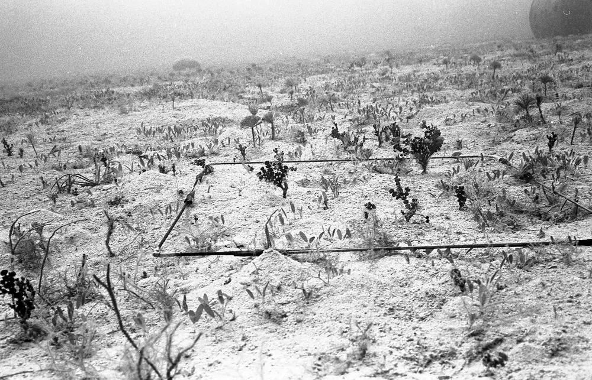{.lightbox group="discovery-bay-1966" description="**UUID: **a54a1813-99d6-485e-810c-f1696b61e05b **Date: **1968-01-20 **Location: **Jamaica | Discovery Bay | Algal Plots **Longitude: **77.414ºW **Latitude: **18.473ºN **Photographer: **Eileen Graham **Copyright: **Trustees of the Natural History Museum (London, UK), CC-BY-4.0" alt="**UUID: **a54a1813-99d6-485e-810c-f1696b61e05b **Date: **1968-01-20 **Location: **Jamaica | Discovery Bay | Algal Plots **Longitude: **77.414ºW **Latitude: **18.473ºN **Photographer: **Eileen Graham **Copyright: **Trustees of the Natural History Museum (London, UK), CC-BY-4.0"}

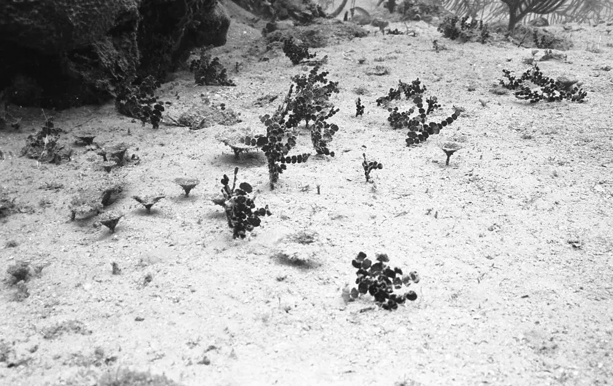{.lightbox group="discovery-bay-1966" description="**UUID: **59738e79-3e03-450b-a1e7-b37fd1f64f78 **Date: **1968-01-20 **Location: **Jamaica | Discovery Bay | Algal Plots **Longitude: **77.414ºW **Latitude: **18.473ºN **Photographer: **Eileen Graham **Copyright: **Trustees of the Natural History Museum (London, UK), CC-BY-4.0" alt="**UUID: **59738e79-3e03-450b-a1e7-b37fd1f64f78 **Date: **1968-01-20 **Location: **Jamaica | Discovery Bay | Algal Plots **Longitude: **77.414ºW **Latitude: **18.473ºN **Photographer: **Eileen Graham **Copyright: **Trustees of the Natural History Museum (London, UK), CC-BY-4.0"}

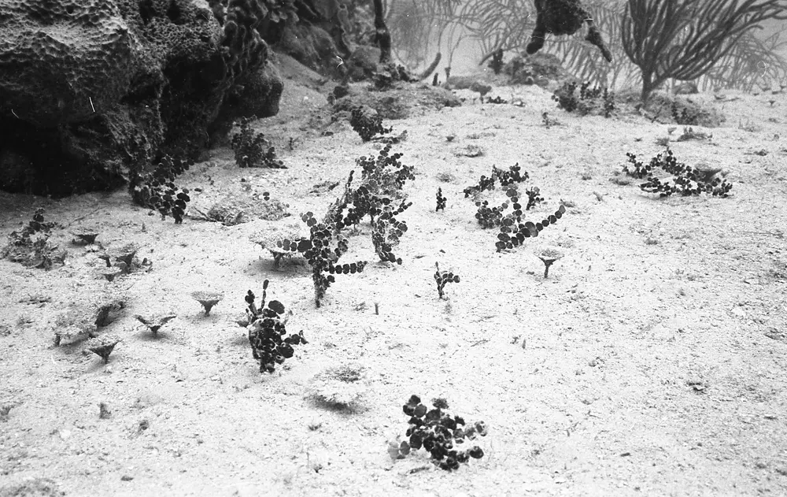{.lightbox group="discovery-bay-1966" description="**UUID: **a065d614-0c4c-4339-88c5-09da572321ec **Date: **1968-01-20 **Location: **Jamaica | Discovery Bay | Algal Plots **Longitude: **77.414ºW **Latitude: **18.473ºN **Photographer: **Eileen Graham **Copyright: **Trustees of the Natural History Museum (London, UK), CC-BY-4.0" alt="**UUID: **a065d614-0c4c-4339-88c5-09da572321ec **Date: **1968-01-20 **Location: **Jamaica | Discovery Bay | Algal Plots **Longitude: **77.414ºW **Latitude: **18.473ºN **Photographer: **Eileen Graham **Copyright: **Trustees of the Natural History Museum (London, UK), CC-BY-4.0"}

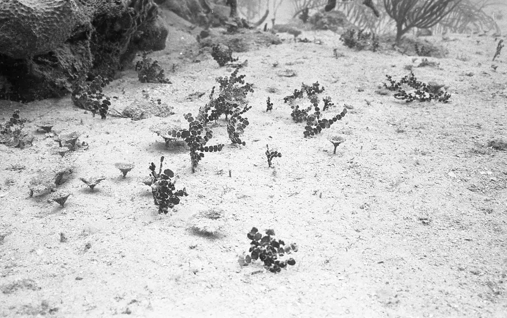{.lightbox group="discovery-bay-1966" description="**UUID: **c72ff882-c9e5-4b02-8f89-a8b32f10da8d **Date: **1968-01-20 **Location: **Jamaica | Discovery Bay | Algal Plots **Longitude: **77.414ºW **Latitude: **18.473ºN **Photographer: **Eileen Graham **Copyright: **Trustees of the Natural History Museum (London, UK), CC-BY-4.0" alt="**UUID: **c72ff882-c9e5-4b02-8f89-a8b32f10da8d **Date: **1968-01-20 **Location: **Jamaica | Discovery Bay | Algal Plots **Longitude: **77.414ºW **Latitude: **18.473ºN **Photographer: **Eileen Graham **Copyright: **Trustees of the Natural History Museum (London, UK), CC-BY-4.0"}

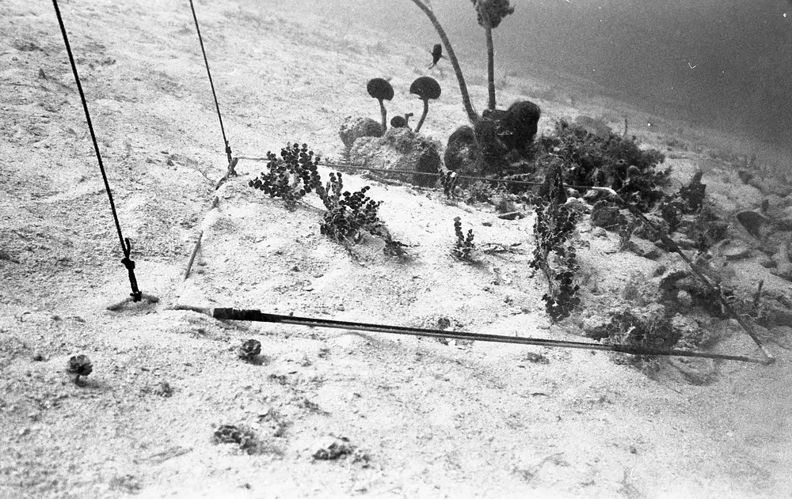{.lightbox group="discovery-bay-1966" description="**UUID: **b31c4f4c-c343-49ef-b431-95d8f082f0a0 **Date: **1968-01-20 **Location: **Jamaica | Discovery Bay | Algal Plots **Longitude: **77.414ºW **Latitude: **18.473ºN **Photographer: **Eileen Graham **Copyright: **Trustees of the Natural History Museum (London, UK), CC-BY-4.0" alt="**UUID: **b31c4f4c-c343-49ef-b431-95d8f082f0a0 **Date: **1968-01-20 **Location: **Jamaica | Discovery Bay | Algal Plots **Longitude: **77.414ºW **Latitude: **18.473ºN **Photographer: **Eileen Graham **Copyright: **Trustees of the Natural History Museum (London, UK), CC-BY-4.0"}

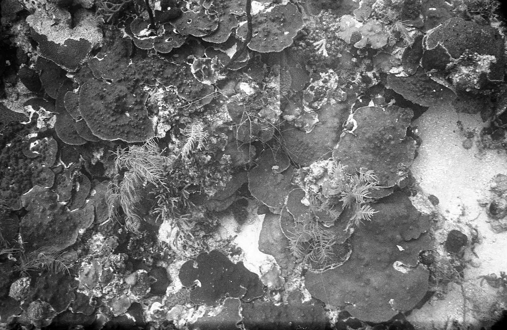{.lightbox group="discovery-bay-1966" description="**UUID: **9f155b01-72d8-4c8e-9db2-4b2172f66051 **Date: **1966-04-27 **Location: **Jamaica | Discovery Bay | Buoy Upper Slope **Longitude: **77.40908ºW **Latitude: **18.47322ºN **Photographer: **Eileen Graham **Copyright: **Trustees of the Natural History Museum (London, UK), CC-BY-4.0" alt="**UUID: **9f155b01-72d8-4c8e-9db2-4b2172f66051 **Date: **1966-04-27 **Location: **Jamaica | Discovery Bay | Buoy Upper Slope **Longitude: **77.40908ºW **Latitude: **18.47322ºN **Photographer: **Eileen Graham **Copyright: **Trustees of the Natural History Museum (London, UK), CC-BY-4.0"}

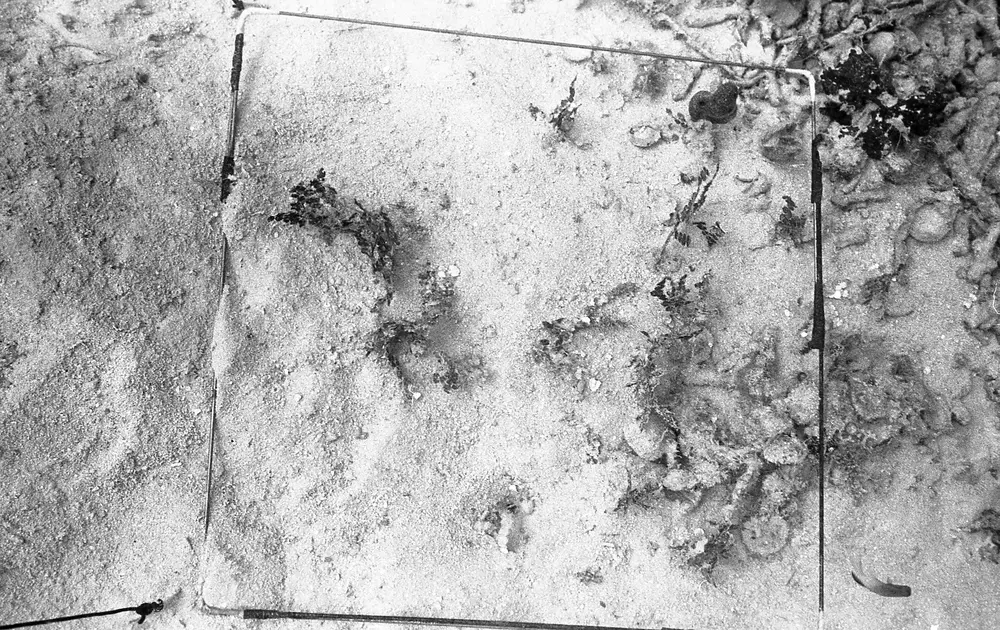{.lightbox group="discovery-bay-1966" description="**UUID: **e1b3b51a-c851-4bbf-917f-88d1f036b3ff **Date: **1968-01-20 **Location: **Jamaica | Discovery Bay | Algal Plots **Longitude: **77.414ºW **Latitude: **18.473ºN **Photographer: **Eileen Graham **Copyright: **Trustees of the Natural History Museum (London, UK), CC-BY-4.0" alt="**UUID: **e1b3b51a-c851-4bbf-917f-88d1f036b3ff **Date: **1968-01-20 **Location: **Jamaica | Discovery Bay | Algal Plots **Longitude: **77.414ºW **Latitude: **18.473ºN **Photographer: **Eileen Graham **Copyright: **Trustees of the Natural History Museum (London, UK), CC-BY-4.0"}

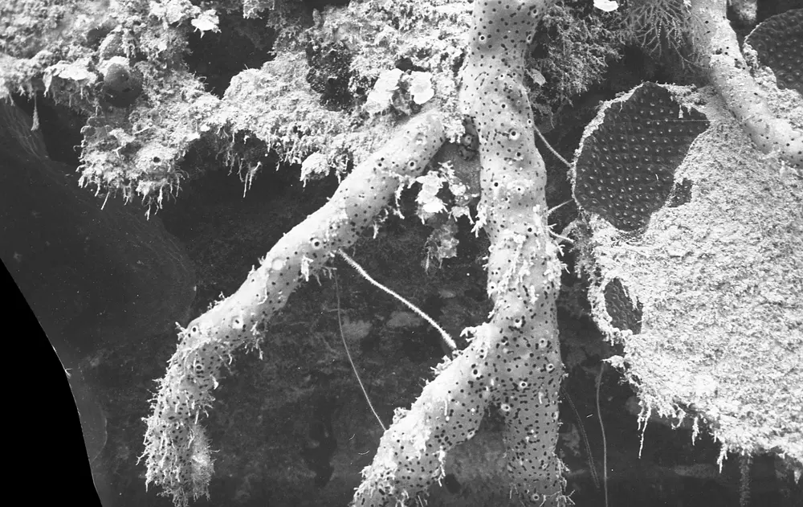{.lightbox group="discovery-bay-1966" description="**UUID: **241eb04a-491b-468e-8e73-b925bdf8ade4 **Date: **1967-12-02 **Location: **Jamaica | Discovery Bay | Eaton Hall **Longitude: **77.334ºW **Latitude: **18.467ºN **Photographer: **Eileen Graham **Copyright: **Trustees of the Natural History Museum (London, UK), CC-BY-4.0" alt="**UUID: **241eb04a-491b-468e-8e73-b925bdf8ade4 **Date: **1967-12-02 **Location: **Jamaica | Discovery Bay | Eaton Hall **Longitude: **77.334ºW **Latitude: **18.467ºN **Photographer: **Eileen Graham **Copyright: **Trustees of the Natural History Museum (London, UK), CC-BY-4.0"}

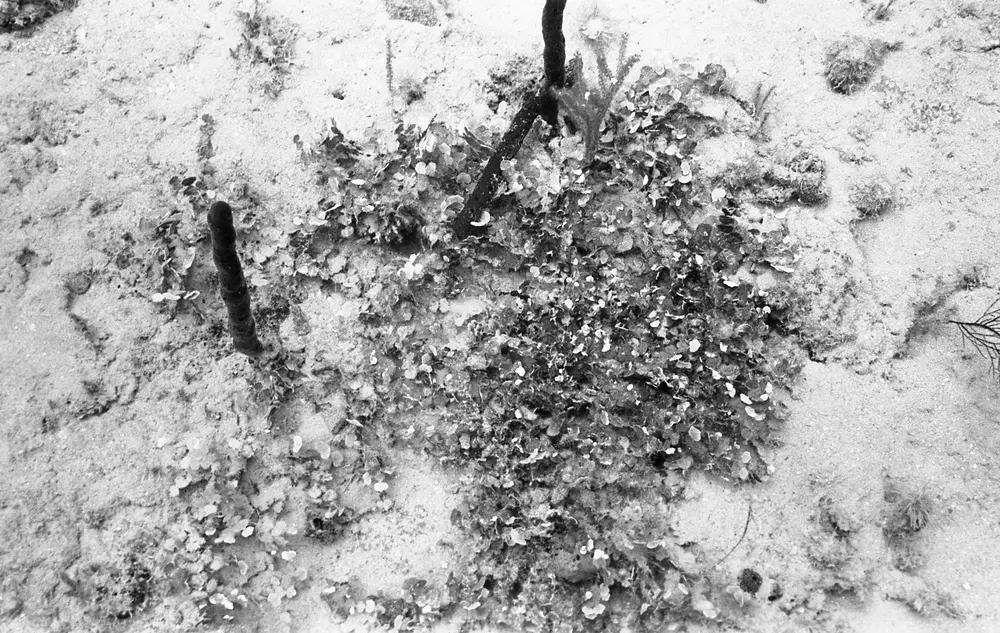{.lightbox group="discovery-bay-1966" description="**UUID: **e921c7c3-95b5-4726-83f8-51ed42f564a2 **Date: **1967-06-16 **Location: **Jamaica | Discovery Bay | Pear Tree Bottom **Longitude: **77.35867ºW **Latitude: **18.4635ºN **Photographer: **Eileen Graham **Copyright: **Trustees of the Natural History Museum (London, UK), CC-BY-4.0" alt="**UUID: **e921c7c3-95b5-4726-83f8-51ed42f564a2 **Date: **1967-06-16 **Location: **Jamaica | Discovery Bay | Pear Tree Bottom **Longitude: **77.35867ºW **Latitude: **18.4635ºN **Photographer: **Eileen Graham **Copyright: **Trustees of the Natural History Museum (London, UK), CC-BY-4.0"}

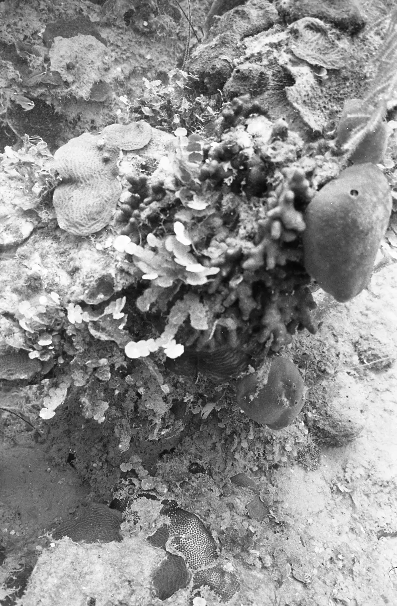{.lightbox group="discovery-bay-1966" description="**UUID: **799c5254-bf7a-4d5e-bb4a-428ce1a4cb53 **Date: **1967-06-16 **Location: **Jamaica | Discovery Bay | Pear Tree Bottom **Longitude: **77.35867ºW **Latitude: **18.4635ºN **Photographer: **Eileen Graham **Copyright: **Trustees of the Natural History Museum (London, UK), CC-BY-4.0" alt="**UUID: **799c5254-bf7a-4d5e-bb4a-428ce1a4cb53 **Date: **1967-06-16 **Location: **Jamaica | Discovery Bay | Pear Tree Bottom **Longitude: **77.35867ºW **Latitude: **18.4635ºN **Photographer: **Eileen Graham **Copyright: **Trustees of the Natural History Museum (London, UK), CC-BY-4.0"}

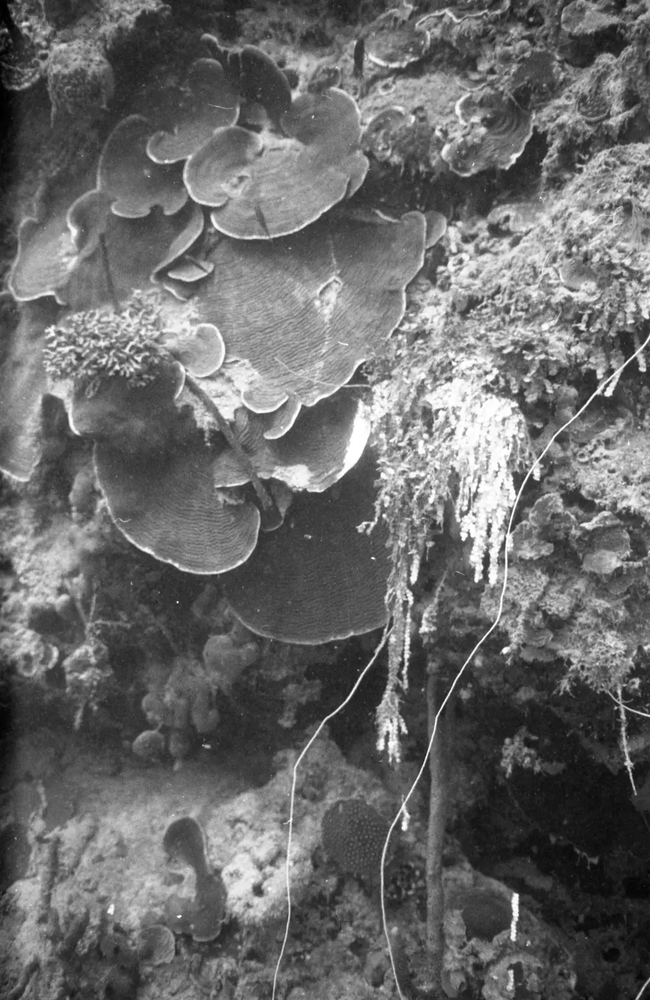{.lightbox group="discovery-bay-1966" description="**UUID: **fd790dd1-f95f-452e-8deb-97dbf1a24250 **Date: **1966-12-06 **Location: **Jamaica | Discovery Bay | Eaton Hall **Longitude: **77.334ºW **Latitude: **18.467ºN **Photographer: **Eileen Graham **Copyright: **Trustees of the Natural History Museum (London, UK), CC-BY-4.0" alt="**UUID: **fd790dd1-f95f-452e-8deb-97dbf1a24250 **Date: **1966-12-06 **Location: **Jamaica | Discovery Bay | Eaton Hall **Longitude: **77.334ºW **Latitude: **18.467ºN **Photographer: **Eileen Graham **Copyright: **Trustees of the Natural History Museum (London, UK), CC-BY-4.0"}

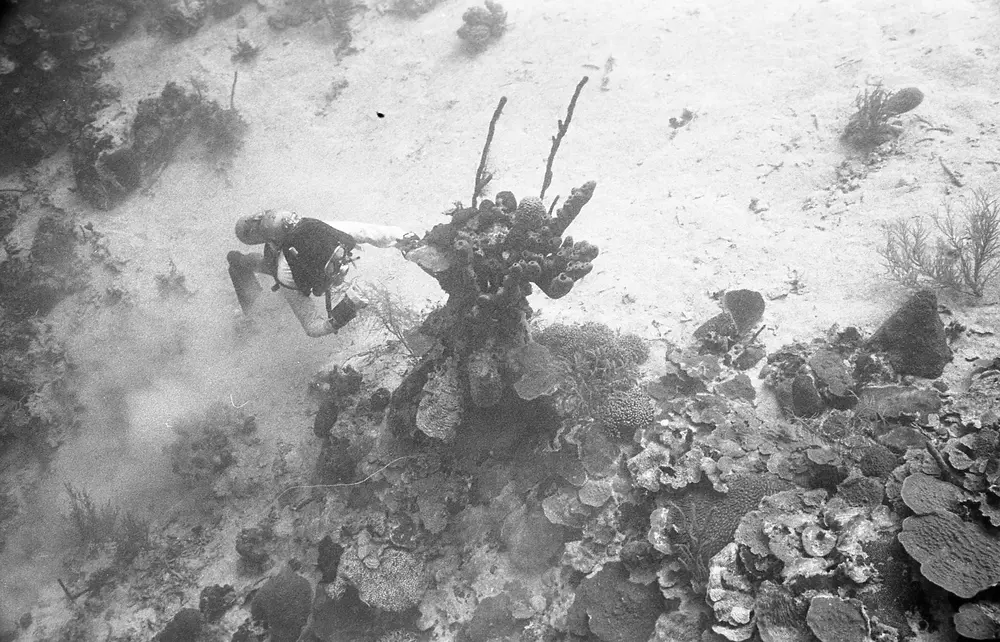{.lightbox group="discovery-bay-1966" description="**UUID: **587e201c-cf59-4121-9686-1b5525146376 **Date: **1967-10-28 **Location: **Jamaica | Discovery Bay | West Bull **Longitude: **77.39ºW **Latitude: **18.47167ºN **Photographer: **Eileen Graham **Copyright: **Trustees of the Natural History Museum (London, UK), CC-BY-4.0" alt="**UUID: **587e201c-cf59-4121-9686-1b5525146376 **Date: **1967-10-28 **Location: **Jamaica | Discovery Bay | West Bull **Longitude: **77.39ºW **Latitude: **18.47167ºN **Photographer: **Eileen Graham **Copyright: **Trustees of the Natural History Museum (London, UK), CC-BY-4.0"}

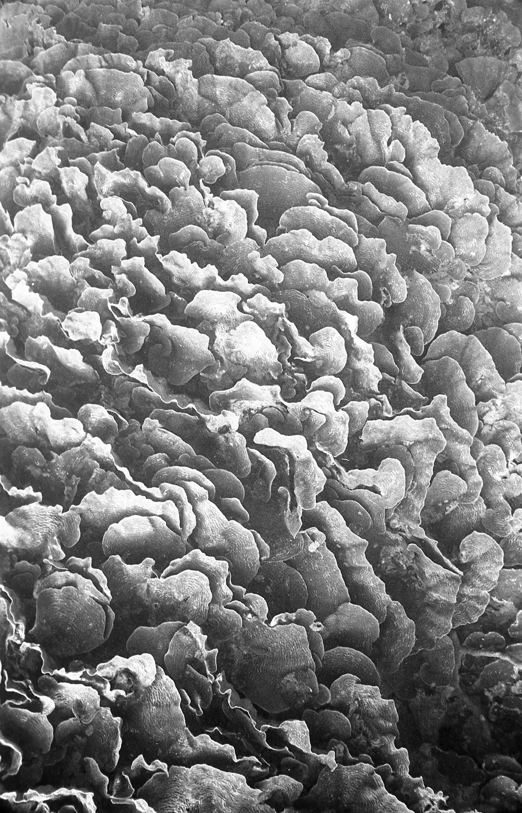{.lightbox group="discovery-bay-1966" description="**UUID: **1ea7b7c8-1bcd-4d3d-9dc4-70abfc137056 **Date: **1967-10-28 **Location: **Jamaica | Discovery Bay | West Bull **Longitude: **77.39ºW **Latitude: **18.47167ºN **Photographer: **Eileen Graham **Copyright: **Trustees of the Natural History Museum (London, UK), CC-BY-4.0" alt="**UUID: **1ea7b7c8-1bcd-4d3d-9dc4-70abfc137056 **Date: **1967-10-28 **Location: **Jamaica | Discovery Bay | West Bull **Longitude: **77.39ºW **Latitude: **18.47167ºN **Photographer: **Eileen Graham **Copyright: **Trustees of the Natural History Museum (London, UK), CC-BY-4.0"}

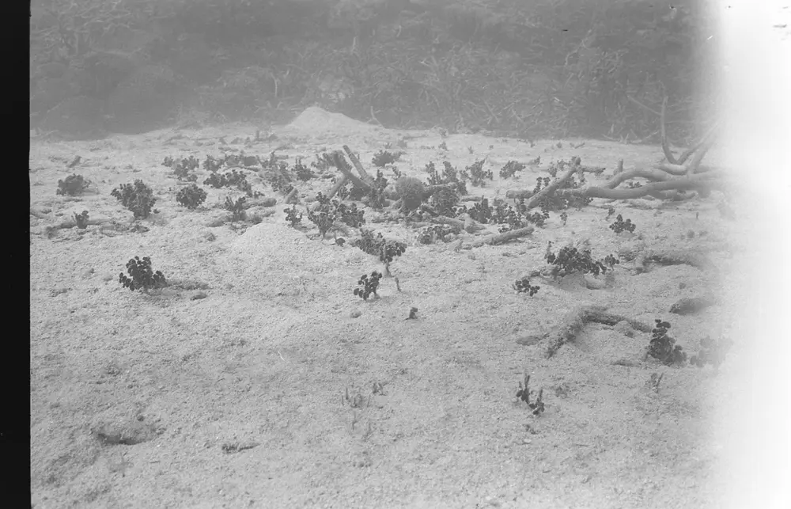{.lightbox group="discovery-bay-1966" description="**UUID: **33ffcc63-7a7b-4520-a0f2-138fd089b8d9 **Date: **1967-10-28 **Location: **Jamaica | Discovery Bay | West Bull **Longitude: **77.39ºW **Latitude: **18.47167ºN **Photographer: **Eileen Graham **Copyright: **Trustees of the Natural History Museum (London, UK), CC-BY-4.0" alt="**UUID: **33ffcc63-7a7b-4520-a0f2-138fd089b8d9 **Date: **1967-10-28 **Location: **Jamaica | Discovery Bay | West Bull **Longitude: **77.39ºW **Latitude: **18.47167ºN **Photographer: **Eileen Graham **Copyright: **Trustees of the Natural History Museum (London, UK), CC-BY-4.0"}

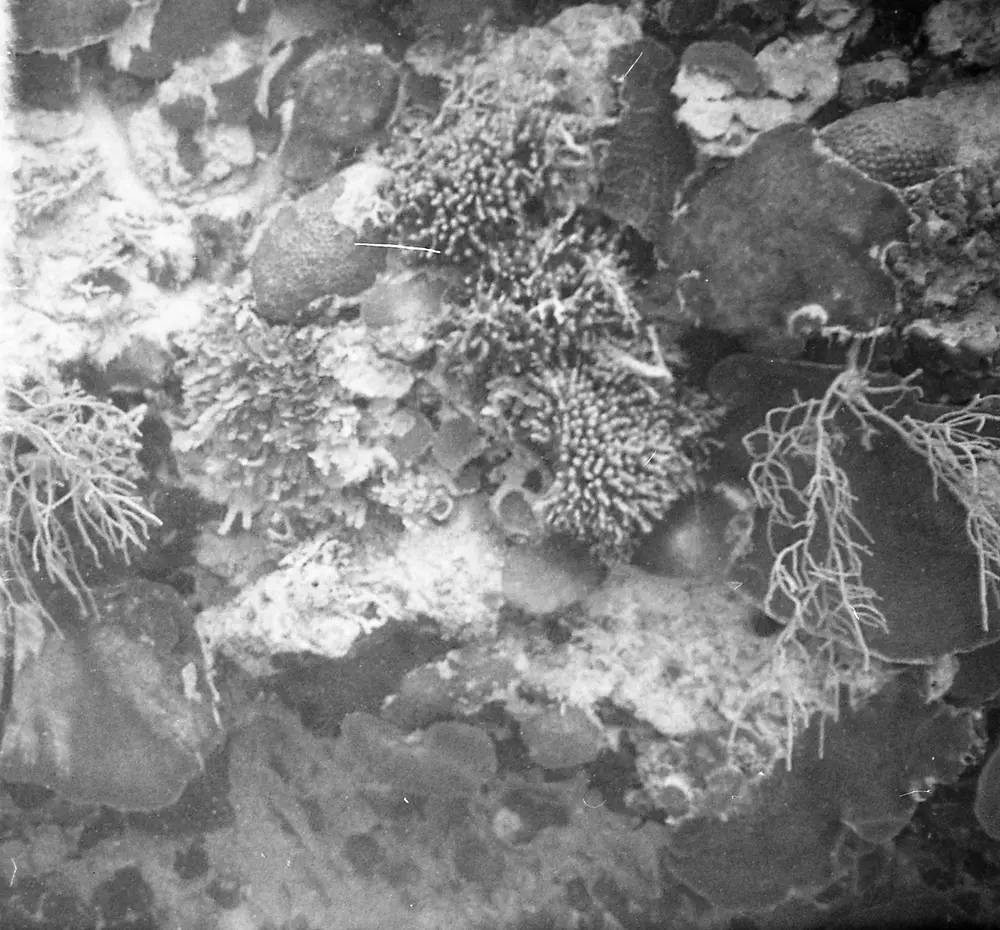{.lightbox group="discovery-bay-1966" description="**UUID: **5be6fe23-d048-440d-83da-c9f78b426d4e **Date: **1966-05-30 **Location: **Jamaica | Discovery Bay | Pear Tree Bottom **Longitude: **77.35867ºW **Latitude: **18.4635ºN **Photographer: **Eileen Graham **Copyright: **Trustees of the Natural History Museum (London, UK), CC-BY-4.0" alt="**UUID: **5be6fe23-d048-440d-83da-c9f78b426d4e **Date: **1966-05-30 **Location: **Jamaica | Discovery Bay | Pear Tree Bottom **Longitude: **77.35867ºW **Latitude: **18.4635ºN **Photographer: **Eileen Graham **Copyright: **Trustees of the Natural History Museum (London, UK), CC-BY-4.0"}

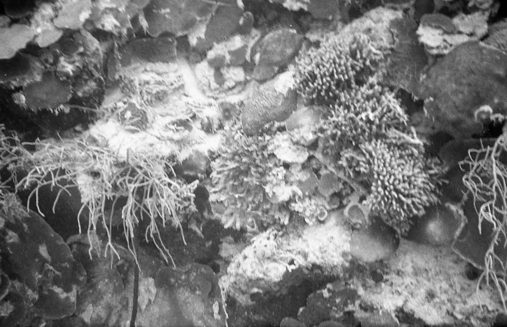{.lightbox group="discovery-bay-1966" description="**UUID: **bf66db1c-8a5a-42d8-a9e5-fd38f5b397f2 **Date: **1966-05-30 **Location: **Jamaica | Discovery Bay | Pear Tree Bottom **Longitude: **77.35867ºW **Latitude: **18.4635ºN **Photographer: **Eileen Graham **Copyright: **Trustees of the Natural History Museum (London, UK), CC-BY-4.0" alt="**UUID: **bf66db1c-8a5a-42d8-a9e5-fd38f5b397f2 **Date: **1966-05-30 **Location: **Jamaica | Discovery Bay | Pear Tree Bottom **Longitude: **77.35867ºW **Latitude: **18.4635ºN **Photographer: **Eileen Graham **Copyright: **Trustees of the Natural History Museum (London, UK), CC-BY-4.0"}

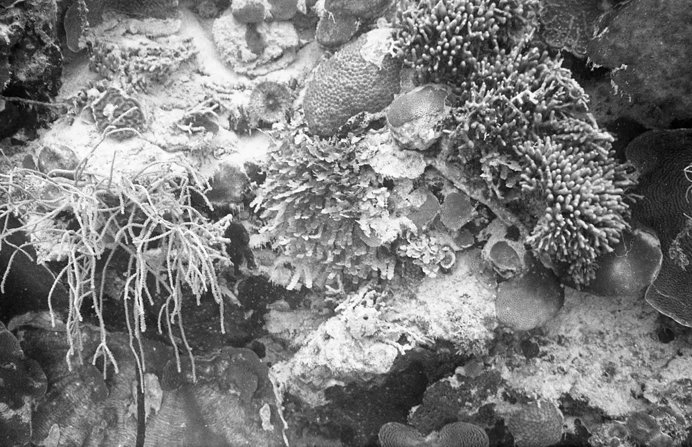{.lightbox group="discovery-bay-1966" description="**UUID: **3f283879-f215-4c69-94b7-9ab08ce6dd5e **Date: **1966-05-30 **Location: **Jamaica | Discovery Bay | Pear Tree Bottom **Longitude: **77.35867ºW **Latitude: **18.4635ºN **Photographer: **Eileen Graham **Copyright: **Trustees of the Natural History Museum (London, UK), CC-BY-4.0" alt="**UUID: **3f283879-f215-4c69-94b7-9ab08ce6dd5e **Date: **1966-05-30 **Location: **Jamaica | Discovery Bay | Pear Tree Bottom **Longitude: **77.35867ºW **Latitude: **18.4635ºN **Photographer: **Eileen Graham **Copyright: **Trustees of the Natural History Museum (London, UK), CC-BY-4.0"}

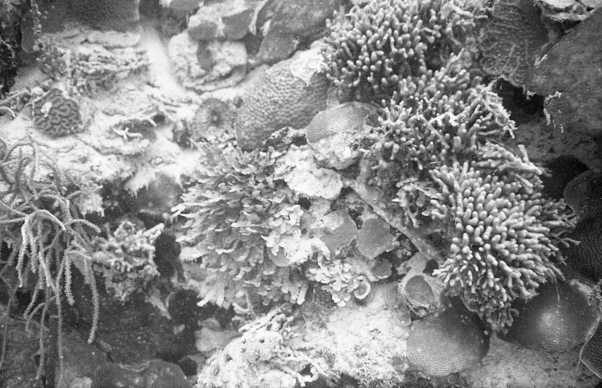{.lightbox group="discovery-bay-1966" description="**UUID: **24bd6d30-b063-4f5c-8e85-af1f6062477e **Date: **1966-05-30 **Location: **Jamaica | Discovery Bay | Pear Tree Bottom **Longitude: **77.35867ºW **Latitude: **18.4635ºN **Photographer: **Eileen Graham **Copyright: **Trustees of the Natural History Museum (London, UK), CC-BY-4.0" alt="**UUID: **24bd6d30-b063-4f5c-8e85-af1f6062477e **Date: **1966-05-30 **Location: **Jamaica | Discovery Bay | Pear Tree Bottom **Longitude: **77.35867ºW **Latitude: **18.4635ºN **Photographer: **Eileen Graham **Copyright: **Trustees of the Natural History Museum (London, UK), CC-BY-4.0"}

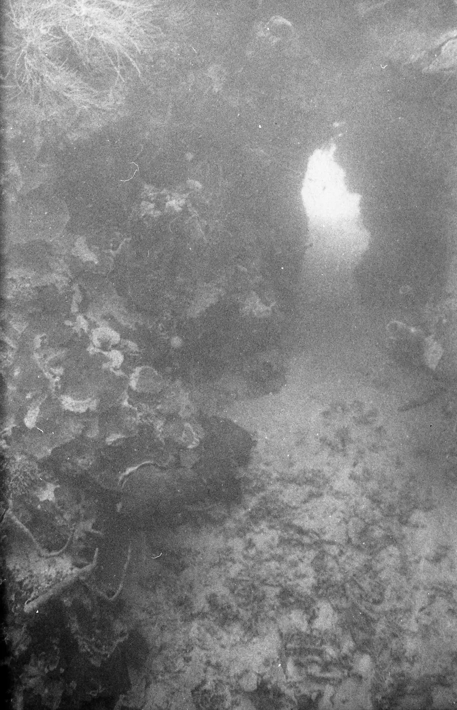{.lightbox group="discovery-bay-1966" description="**UUID: **a096fc54-1807-4095-b94d-2a7216f890b9 **Date: **1966-05-30 **Location: **Jamaica | Discovery Bay | Pear Tree Bottom **Longitude: **77.35867ºW **Latitude: **18.4635ºN **Photographer: **Eileen Graham **Copyright: **Trustees of the Natural History Museum (London, UK), CC-BY-4.0" alt="**UUID: **a096fc54-1807-4095-b94d-2a7216f890b9 **Date: **1966-05-30 **Location: **Jamaica | Discovery Bay | Pear Tree Bottom **Longitude: **77.35867ºW **Latitude: **18.4635ºN **Photographer: **Eileen Graham **Copyright: **Trustees of the Natural History Museum (London, UK), CC-BY-4.0"}

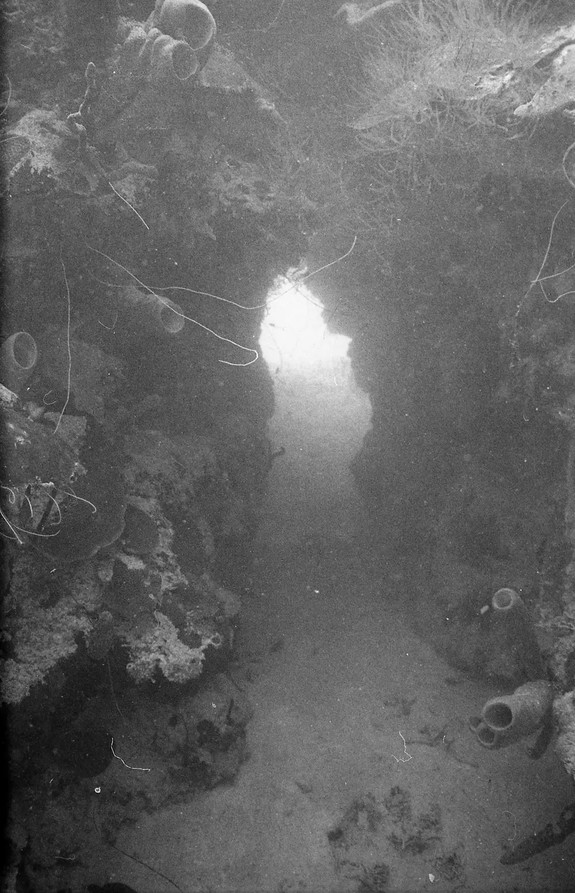{.lightbox group="discovery-bay-1966" description="**UUID: **15694975-3bef-4817-8cee-955cdab10e66 **Date: **1966-05-30 **Location: **Jamaica | Discovery Bay | Pear Tree Bottom **Longitude: **77.35867ºW **Latitude: **18.4635ºN **Photographer: **Eileen Graham **Copyright: **Trustees of the Natural History Museum (London, UK), CC-BY-4.0" alt="**UUID: **15694975-3bef-4817-8cee-955cdab10e66 **Date: **1966-05-30 **Location: **Jamaica | Discovery Bay | Pear Tree Bottom **Longitude: **77.35867ºW **Latitude: **18.4635ºN **Photographer: **Eileen Graham **Copyright: **Trustees of the Natural History Museum (London, UK), CC-BY-4.0"}

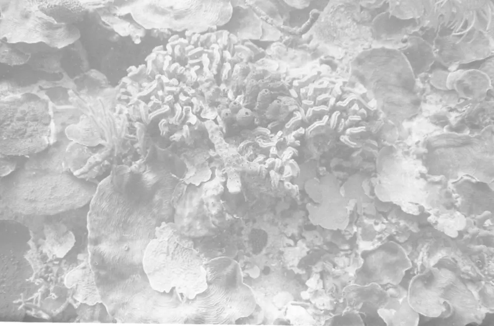{.lightbox group="discovery-bay-1966" description="**UUID: **a37c6b8b-f309-472a-b01e-f2235c28d125 **Date: **1966-05-30 **Location: **Jamaica | Discovery Bay | Pear Tree Bottom **Longitude: **77.35867ºW **Latitude: **18.4635ºN **Photographer: **Eileen Graham **Copyright: **Trustees of the Natural History Museum (London, UK), CC-BY-4.0" alt="**UUID: **a37c6b8b-f309-472a-b01e-f2235c28d125 **Date: **1966-05-30 **Location: **Jamaica | Discovery Bay | Pear Tree Bottom **Longitude: **77.35867ºW **Latitude: **18.4635ºN **Photographer: **Eileen Graham **Copyright: **Trustees of the Natural History Museum (London, UK), CC-BY-4.0"}

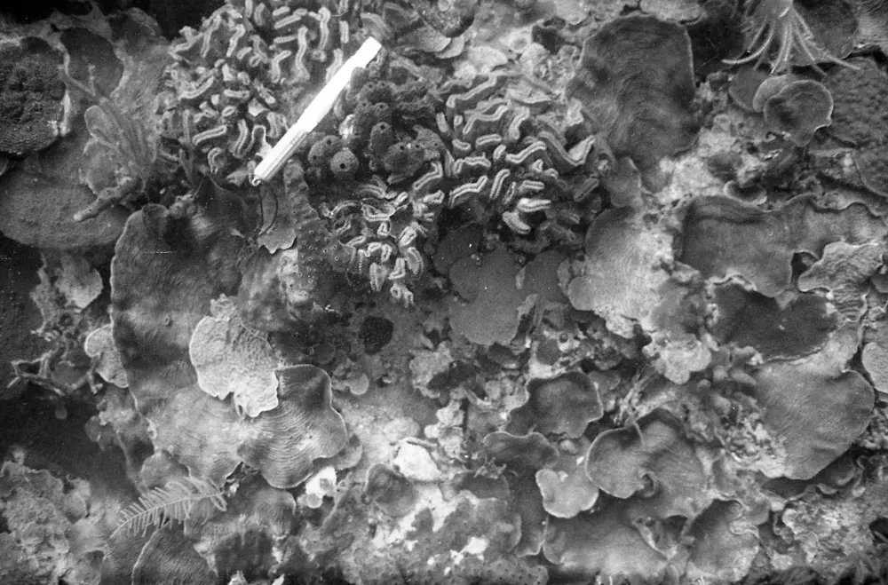{.lightbox group="discovery-bay-1966" description="**UUID: **c2be50d0-7d86-44e1-8af8-4c9b9ec74c5d **Date: **1966-05-30 **Location: **Jamaica | Discovery Bay | Pear Tree Bottom **Longitude: **77.35867ºW **Latitude: **18.4635ºN **Photographer: **Eileen Graham **Copyright: **Trustees of the Natural History Museum (London, UK), CC-BY-4.0" alt="**UUID: **c2be50d0-7d86-44e1-8af8-4c9b9ec74c5d **Date: **1966-05-30 **Location: **Jamaica | Discovery Bay | Pear Tree Bottom **Longitude: **77.35867ºW **Latitude: **18.4635ºN **Photographer: **Eileen Graham **Copyright: **Trustees of the Natural History Museum (London, UK), CC-BY-4.0"}

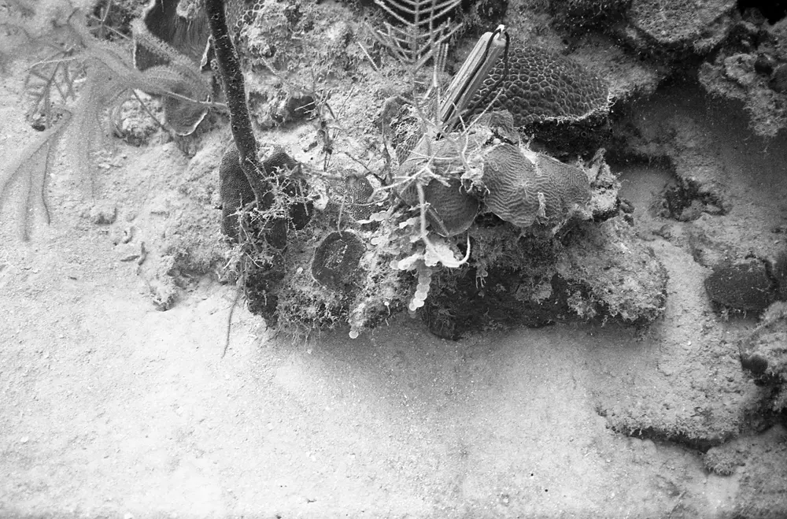{.lightbox group="discovery-bay-1966" description="**UUID: **385dc92c-9538-4d1f-b087-3d44b6483a3f **Date: **1966-05-30 **Location: **Jamaica | Discovery Bay | Pear Tree Bottom **Longitude: **77.35867ºW **Latitude: **18.4635ºN **Photographer: **Eileen Graham **Copyright: **Trustees of the Natural History Museum (London, UK), CC-BY-4.0" alt="**UUID: **385dc92c-9538-4d1f-b087-3d44b6483a3f **Date: **1966-05-30 **Location: **Jamaica | Discovery Bay | Pear Tree Bottom **Longitude: **77.35867ºW **Latitude: **18.4635ºN **Photographer: **Eileen Graham **Copyright: **Trustees of the Natural History Museum (London, UK), CC-BY-4.0"}

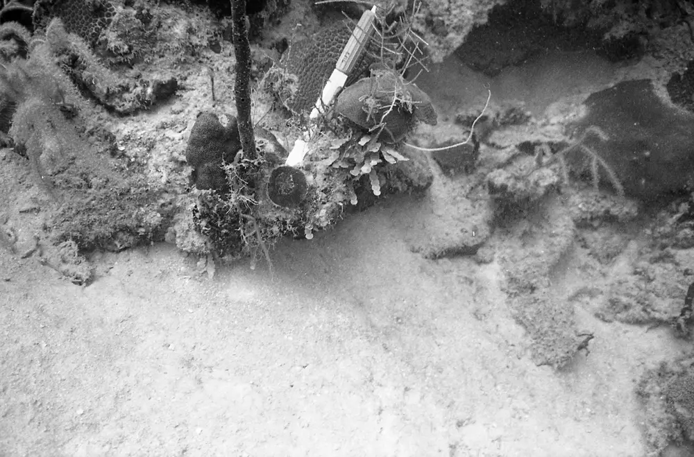{.lightbox group="discovery-bay-1966" description="**UUID: **86a3daae-b9d6-4b97-999f-0b98ef69617e **Date: **1966-05-30 **Location: **Jamaica | Discovery Bay | Pear Tree Bottom **Longitude: **77.35867ºW **Latitude: **18.4635ºN **Photographer: **Eileen Graham **Copyright: **Trustees of the Natural History Museum (London, UK), CC-BY-4.0" alt="**UUID: **86a3daae-b9d6-4b97-999f-0b98ef69617e **Date: **1966-05-30 **Location: **Jamaica | Discovery Bay | Pear Tree Bottom **Longitude: **77.35867ºW **Latitude: **18.4635ºN **Photographer: **Eileen Graham **Copyright: **Trustees of the Natural History Museum (London, UK), CC-BY-4.0"}

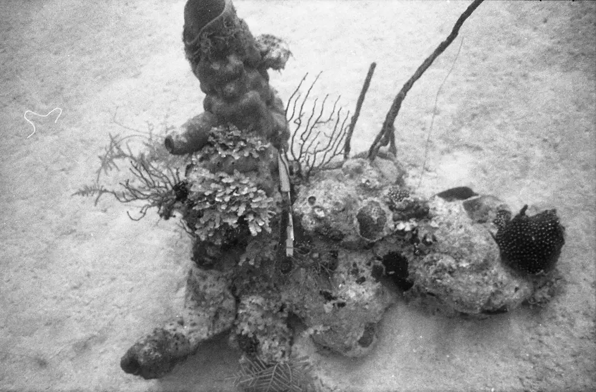{.lightbox group="discovery-bay-1966" description="**UUID: **69886d48-88a1-4209-bbde-8e3027f2ba15 **Date: **1966-05-30 **Location: **Jamaica | Discovery Bay | Pear Tree Bottom **Longitude: **77.35867ºW **Latitude: **18.4635ºN **Photographer: **Eileen Graham **Copyright: **Trustees of the Natural History Museum (London, UK), CC-BY-4.0" alt="**UUID: **69886d48-88a1-4209-bbde-8e3027f2ba15 **Date: **1966-05-30 **Location: **Jamaica | Discovery Bay | Pear Tree Bottom **Longitude: **77.35867ºW **Latitude: **18.4635ºN **Photographer: **Eileen Graham **Copyright: **Trustees of the Natural History Museum (London, UK), CC-BY-4.0"}

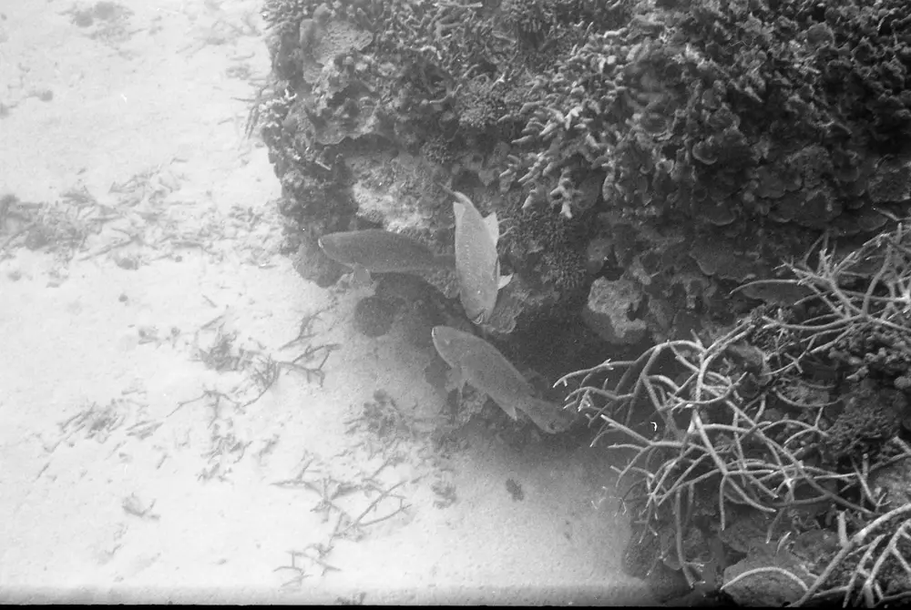{.lightbox group="discovery-bay-1966" description="**UUID: **72d63a3b-145e-4357-b75d-6171ba9c1018 **Date: **1966-05-30 **Location: **Jamaica | Discovery Bay | Pear Tree Bottom **Longitude: **77.35867ºW **Latitude: **18.4635ºN **Photographer: **Eileen Graham **Copyright: **Trustees of the Natural History Museum (London, UK), CC-BY-4.0" alt="**UUID: **72d63a3b-145e-4357-b75d-6171ba9c1018 **Date: **1966-05-30 **Location: **Jamaica | Discovery Bay | Pear Tree Bottom **Longitude: **77.35867ºW **Latitude: **18.4635ºN **Photographer: **Eileen Graham **Copyright: **Trustees of the Natural History Museum (London, UK), CC-BY-4.0"}

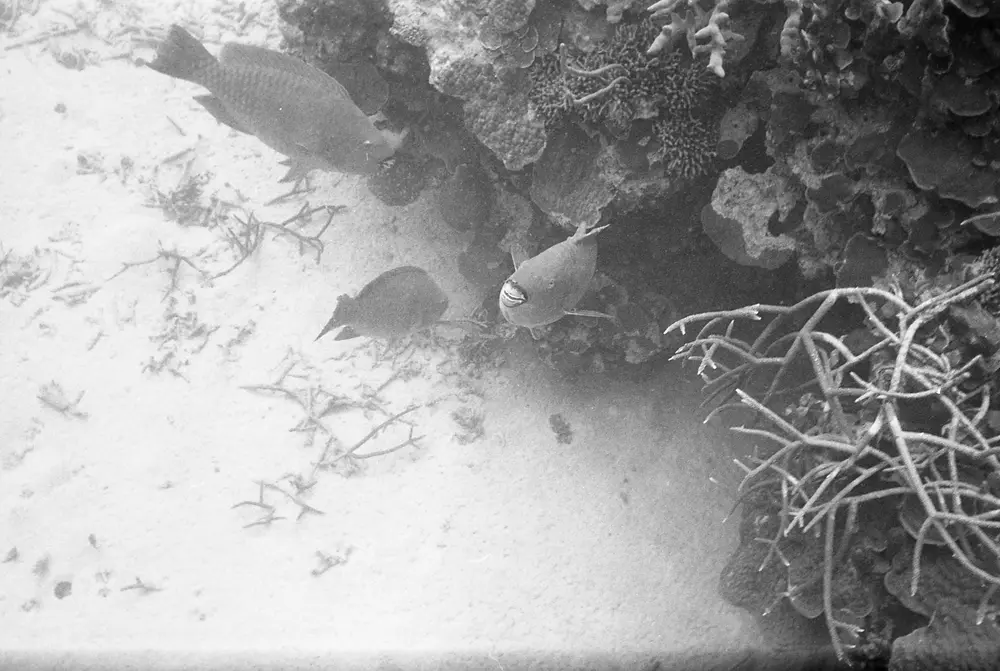{.lightbox group="discovery-bay-1966" description="**UUID: **6ec8d11a-a30a-4c44-8eb1-d4e6eb31809c **Date: **1966-05-30 **Location: **Jamaica | Discovery Bay | Pear Tree Bottom **Longitude: **77.35867ºW **Latitude: **18.4635ºN **Photographer: **Eileen Graham **Copyright: **Trustees of the Natural History Museum (London, UK), CC-BY-4.0" alt="**UUID: **6ec8d11a-a30a-4c44-8eb1-d4e6eb31809c **Date: **1966-05-30 **Location: **Jamaica | Discovery Bay | Pear Tree Bottom **Longitude: **77.35867ºW **Latitude: **18.4635ºN **Photographer: **Eileen Graham **Copyright: **Trustees of the Natural History Museum (London, UK), CC-BY-4.0"}

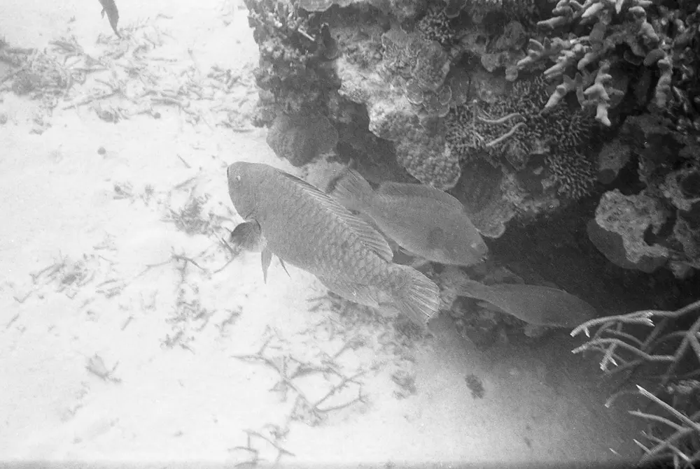{.lightbox group="discovery-bay-1966" description="**UUID: **c971b855-0167-4e48-a2cc-0cd4ef7b808c **Date: **1966-05-30 **Location: **Jamaica | Discovery Bay | Pear Tree Bottom **Longitude: **77.35867ºW **Latitude: **18.4635ºN **Photographer: **Eileen Graham **Copyright: **Trustees of the Natural History Museum (London, UK), CC-BY-4.0" alt="**UUID: **c971b855-0167-4e48-a2cc-0cd4ef7b808c **Date: **1966-05-30 **Location: **Jamaica | Discovery Bay | Pear Tree Bottom **Longitude: **77.35867ºW **Latitude: **18.4635ºN **Photographer: **Eileen Graham **Copyright: **Trustees of the Natural History Museum (London, UK), CC-BY-4.0"}

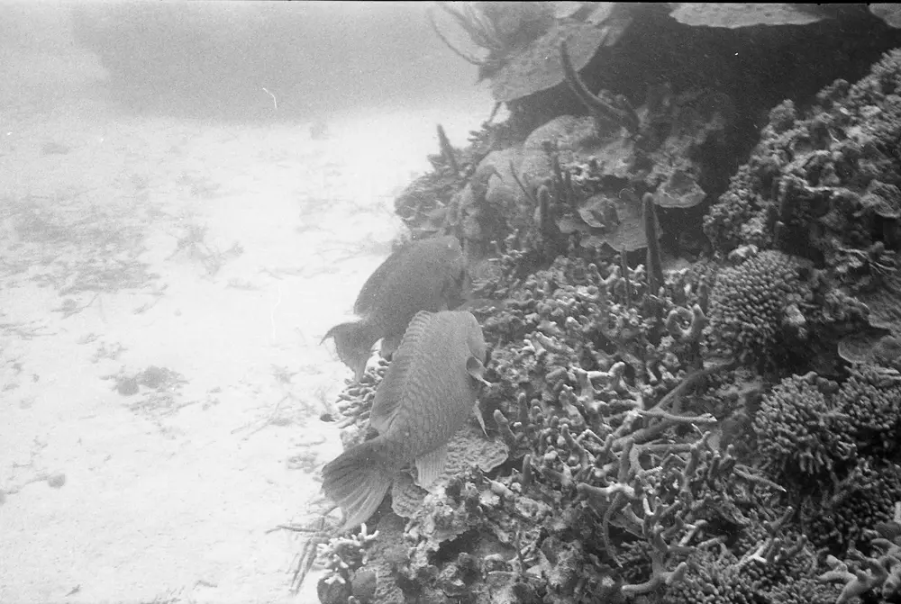{.lightbox group="discovery-bay-1966" description="**UUID: **cc86ed4e-26cc-4217-9d1d-ec32ec8d3e1d **Date: **1966-05-30 **Location: **Jamaica | Discovery Bay | Pear Tree Bottom **Longitude: **77.35867ºW **Latitude: **18.4635ºN **Photographer: **Eileen Graham **Copyright: **Trustees of the Natural History Museum (London, UK), CC-BY-4.0" alt="**UUID: **cc86ed4e-26cc-4217-9d1d-ec32ec8d3e1d **Date: **1966-05-30 **Location: **Jamaica | Discovery Bay | Pear Tree Bottom **Longitude: **77.35867ºW **Latitude: **18.4635ºN **Photographer: **Eileen Graham **Copyright: **Trustees of the Natural History Museum (London, UK), CC-BY-4.0"}

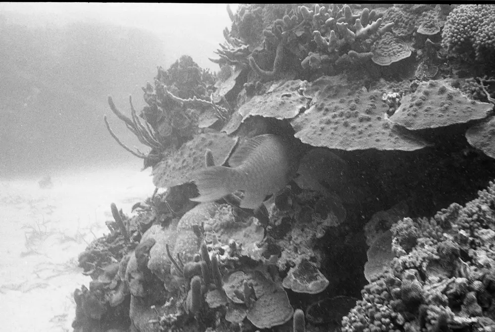{.lightbox group="discovery-bay-1966" description="**UUID: **7cb5013f-f9ee-4a1e-b29c-a608963e9ba2 **Date: **1966-05-30 **Location: **Jamaica | Discovery Bay | Pear Tree Bottom **Longitude: **77.35867ºW **Latitude: **18.4635ºN **Photographer: **Eileen Graham **Copyright: **Trustees of the Natural History Museum (London, UK), CC-BY-4.0" alt="**UUID: **7cb5013f-f9ee-4a1e-b29c-a608963e9ba2 **Date: **1966-05-30 **Location: **Jamaica | Discovery Bay | Pear Tree Bottom **Longitude: **77.35867ºW **Latitude: **18.4635ºN **Photographer: **Eileen Graham **Copyright: **Trustees of the Natural History Museum (London, UK), CC-BY-4.0"}

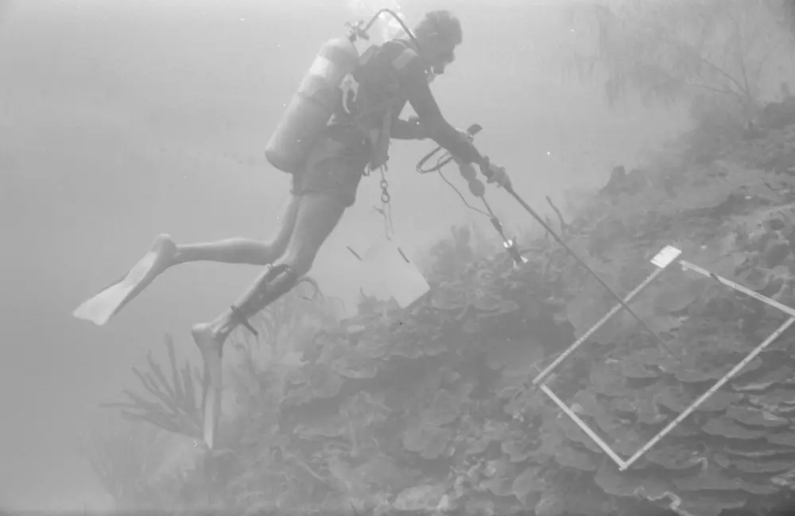{.lightbox group="discovery-bay-1966" description="**UUID: **55b47d42-1c20-4a51-aa6d-f81f22441b92 **Date: **1966-05-31 **Location: **Jamaica | Discovery Bay | Buoy Upper Slope **Longitude: **77.40908ºW **Latitude: **18.47322ºN **Photographer: **Eileen Graham **Copyright: **Trustees of the Natural History Museum (London, UK), CC-BY-4.0" alt="**UUID: **55b47d42-1c20-4a51-aa6d-f81f22441b92 **Date: **1966-05-31 **Location: **Jamaica | Discovery Bay | Buoy Upper Slope **Longitude: **77.40908ºW **Latitude: **18.47322ºN **Photographer: **Eileen Graham **Copyright: **Trustees of the Natural History Museum (London, UK), CC-BY-4.0"}

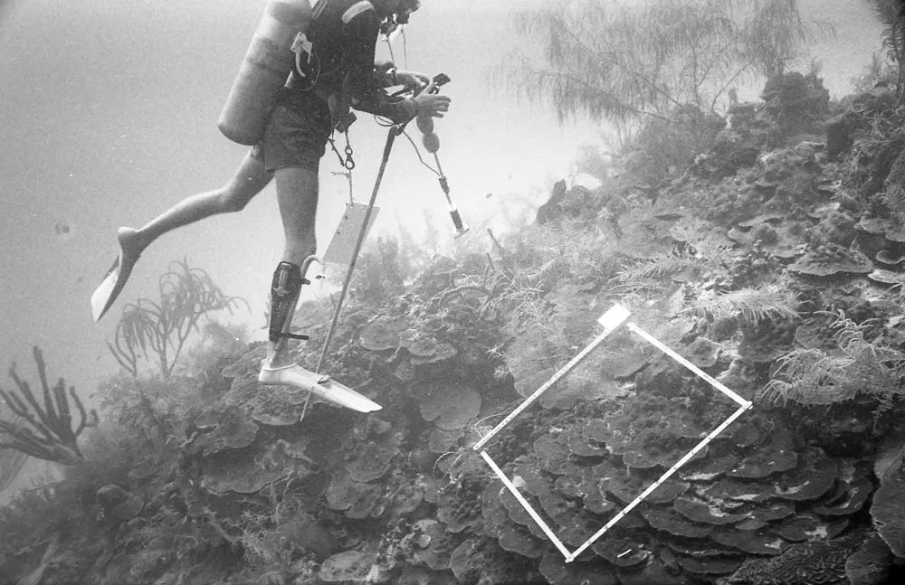{.lightbox group="discovery-bay-1966" description="**UUID: **7a0d488d-69f8-4b53-9e16-00c6eb3292e0 **Date: **1966-05-31 **Location: **Jamaica | Discovery Bay | Buoy Upper Slope **Longitude: **77.40908ºW **Latitude: **18.47322ºN **Photographer: **Eileen Graham **Copyright: **Trustees of the Natural History Museum (London, UK), CC-BY-4.0" alt="**UUID: **7a0d488d-69f8-4b53-9e16-00c6eb3292e0 **Date: **1966-05-31 **Location: **Jamaica | Discovery Bay | Buoy Upper Slope **Longitude: **77.40908ºW **Latitude: **18.47322ºN **Photographer: **Eileen Graham **Copyright: **Trustees of the Natural History Museum (London, UK), CC-BY-4.0"}

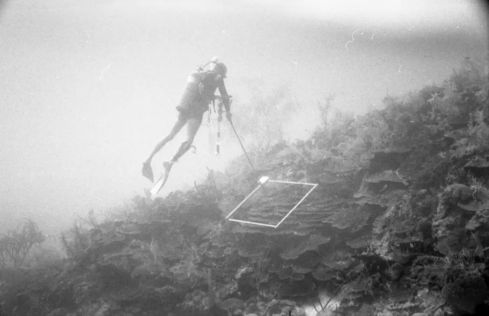{.lightbox group="discovery-bay-1966" description="**UUID: **942cf44e-7fc1-49f3-9cc2-5a306215486a **Date: **1966-05-31 **Location: **Jamaica | Discovery Bay | Buoy Upper Slope **Longitude: **77.40908ºW **Latitude: **18.47322ºN **Photographer: **Eileen Graham **Copyright: **Trustees of the Natural History Museum (London, UK), CC-BY-4.0" alt="**UUID: **942cf44e-7fc1-49f3-9cc2-5a306215486a **Date: **1966-05-31 **Location: **Jamaica | Discovery Bay | Buoy Upper Slope **Longitude: **77.40908ºW **Latitude: **18.47322ºN **Photographer: **Eileen Graham **Copyright: **Trustees of the Natural History Museum (London, UK), CC-BY-4.0"}

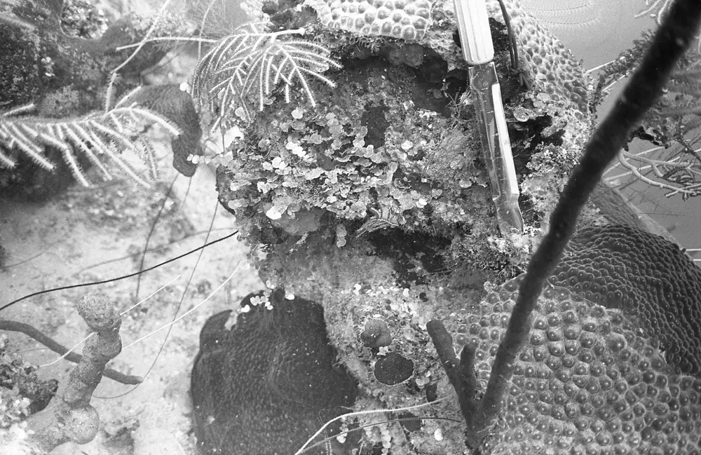{.lightbox group="discovery-bay-1966" description="**UUID: **893f4c45-558a-472f-aaa1-3d019340eeef **Date: **1966-05-31 **Location: **Jamaica | Discovery Bay | Buoy Upper Slope **Longitude: **77.40908ºW **Latitude: **18.47322ºN **Photographer: **Eileen Graham **Copyright: **Trustees of the Natural History Museum (London, UK), CC-BY-4.0" alt="**UUID: **893f4c45-558a-472f-aaa1-3d019340eeef **Date: **1966-05-31 **Location: **Jamaica | Discovery Bay | Buoy Upper Slope **Longitude: **77.40908ºW **Latitude: **18.47322ºN **Photographer: **Eileen Graham **Copyright: **Trustees of the Natural History Museum (London, UK), CC-BY-4.0"}

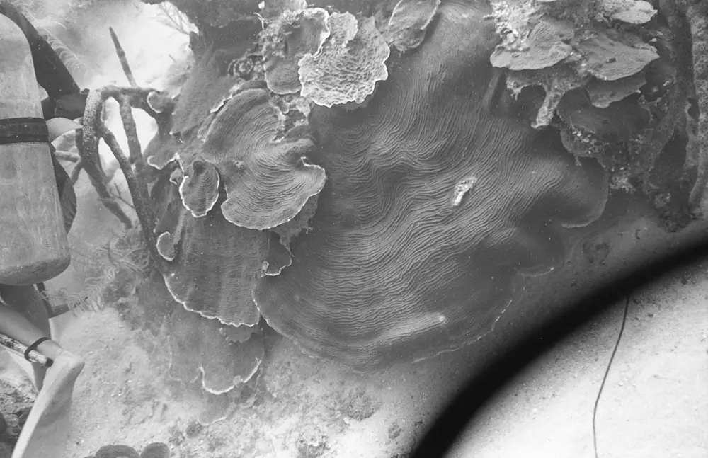{.lightbox group="discovery-bay-1966" description="**UUID: **1a809609-222e-4760-830d-ec51fb877ab5 **Date: **1966-05-31 **Location: **Jamaica | Discovery Bay | Buoy Upper Slope **Longitude: **77.40908ºW **Latitude: **18.47322ºN **Photographer: **Eileen Graham **Copyright: **Trustees of the Natural History Museum (London, UK), CC-BY-4.0" alt="**UUID: **1a809609-222e-4760-830d-ec51fb877ab5 **Date: **1966-05-31 **Location: **Jamaica | Discovery Bay | Buoy Upper Slope **Longitude: **77.40908ºW **Latitude: **18.47322ºN **Photographer: **Eileen Graham **Copyright: **Trustees of the Natural History Museum (London, UK), CC-BY-4.0"}

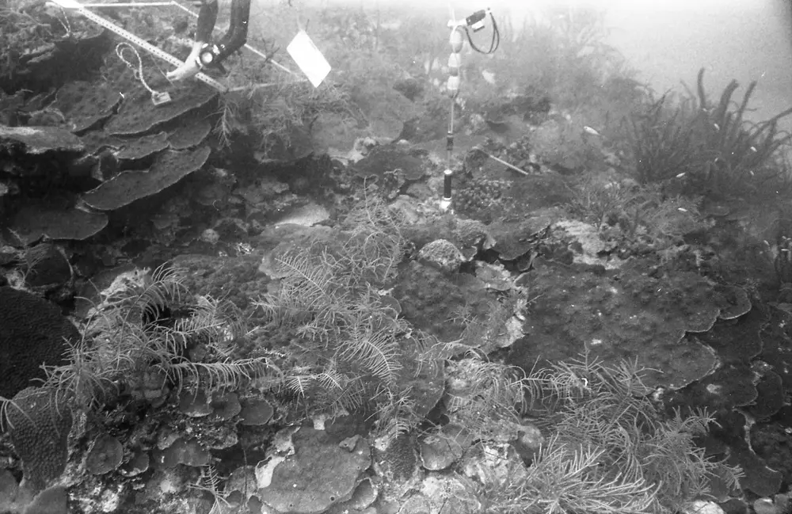{.lightbox group="discovery-bay-1966" description="**UUID: **635c78fb-e80a-452f-aaf0-dfa5a06ac928 **Date: **1966-05-31 **Location: **Jamaica | Discovery Bay | Buoy Upper Slope **Longitude: **77.40908ºW **Latitude: **18.47322ºN **Photographer: **Eileen Graham **Copyright: **Trustees of the Natural History Museum (London, UK), CC-BY-4.0" alt="**UUID: **635c78fb-e80a-452f-aaf0-dfa5a06ac928 **Date: **1966-05-31 **Location: **Jamaica | Discovery Bay | Buoy Upper Slope **Longitude: **77.40908ºW **Latitude: **18.47322ºN **Photographer: **Eileen Graham **Copyright: **Trustees of the Natural History Museum (London, UK), CC-BY-4.0"}

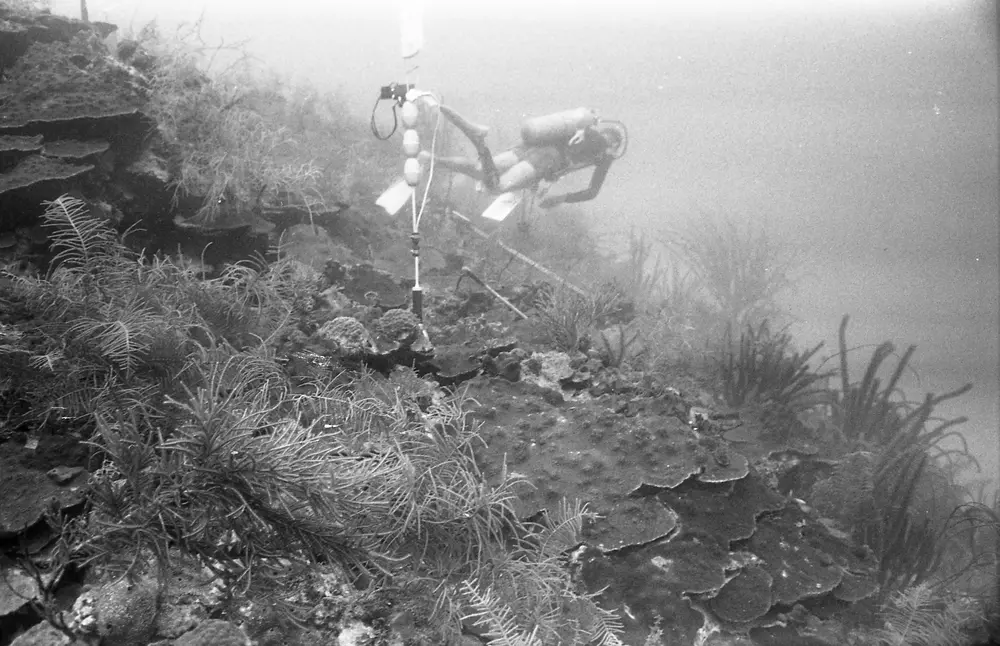{.lightbox group="discovery-bay-1966" description="**UUID: **0f7135c9-4f3b-48aa-949f-e5c1a9b551ab **Date: **1966-05-31 **Location: **Jamaica | Discovery Bay | Buoy Upper Slope **Longitude: **77.40908ºW **Latitude: **18.47322ºN **Photographer: **Eileen Graham **Copyright: **Trustees of the Natural History Museum (London, UK), CC-BY-4.0" alt="**UUID: **0f7135c9-4f3b-48aa-949f-e5c1a9b551ab **Date: **1966-05-31 **Location: **Jamaica | Discovery Bay | Buoy Upper Slope **Longitude: **77.40908ºW **Latitude: **18.47322ºN **Photographer: **Eileen Graham **Copyright: **Trustees of the Natural History Museum (London, UK), CC-BY-4.0"}

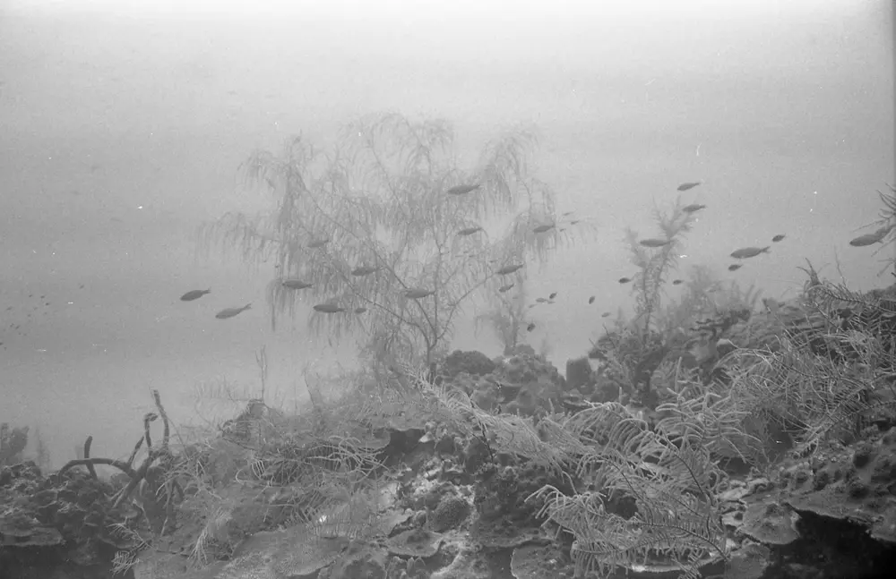{.lightbox group="discovery-bay-1966" description="**UUID: **db425185-87b2-41df-ab5e-3d4498214bc4 **Date: **1966-05-31 **Location: **Jamaica | Discovery Bay | Buoy Upper Slope **Longitude: **77.40908ºW **Latitude: **18.47322ºN **Photographer: **Eileen Graham **Copyright: **Trustees of the Natural History Museum (London, UK), CC-BY-4.0" alt="**UUID: **db425185-87b2-41df-ab5e-3d4498214bc4 **Date: **1966-05-31 **Location: **Jamaica | Discovery Bay | Buoy Upper Slope **Longitude: **77.40908ºW **Latitude: **18.47322ºN **Photographer: **Eileen Graham **Copyright: **Trustees of the Natural History Museum (London, UK), CC-BY-4.0"}

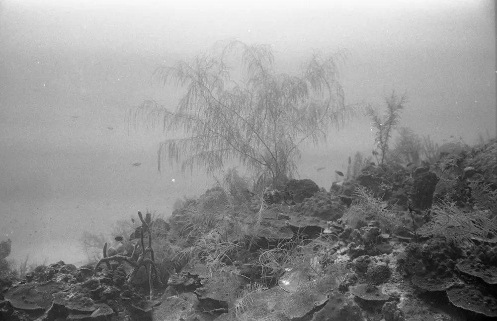{.lightbox group="discovery-bay-1966" description="**UUID: **ac447f2f-8196-4067-b697-26619e04cef2 **Date: **1966-05-31 **Location: **Jamaica | Discovery Bay | Buoy Upper Slope **Longitude: **77.40908ºW **Latitude: **18.47322ºN **Photographer: **Eileen Graham **Copyright: **Trustees of the Natural History Museum (London, UK), CC-BY-4.0" alt="**UUID: **ac447f2f-8196-4067-b697-26619e04cef2 **Date: **1966-05-31 **Location: **Jamaica | Discovery Bay | Buoy Upper Slope **Longitude: **77.40908ºW **Latitude: **18.47322ºN **Photographer: **Eileen Graham **Copyright: **Trustees of the Natural History Museum (London, UK), CC-BY-4.0"}

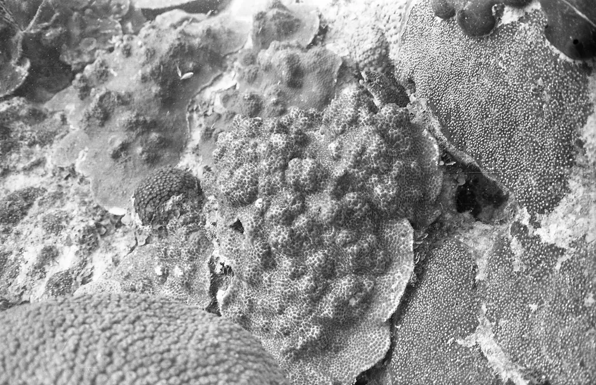{.lightbox group="discovery-bay-1966" description="**UUID: **cf35f3a9-5b1d-49fb-922d-851e8ac81a9b **Date: **1966-05-31 **Location: **Jamaica | Discovery Bay | Buoy Upper Slope **Longitude: **77.40908ºW **Latitude: **18.47322ºN **Photographer: **Eileen Graham **Copyright: **Trustees of the Natural History Museum (London, UK), CC-BY-4.0" alt="**UUID: **cf35f3a9-5b1d-49fb-922d-851e8ac81a9b **Date: **1966-05-31 **Location: **Jamaica | Discovery Bay | Buoy Upper Slope **Longitude: **77.40908ºW **Latitude: **18.47322ºN **Photographer: **Eileen Graham **Copyright: **Trustees of the Natural History Museum (London, UK), CC-BY-4.0"}

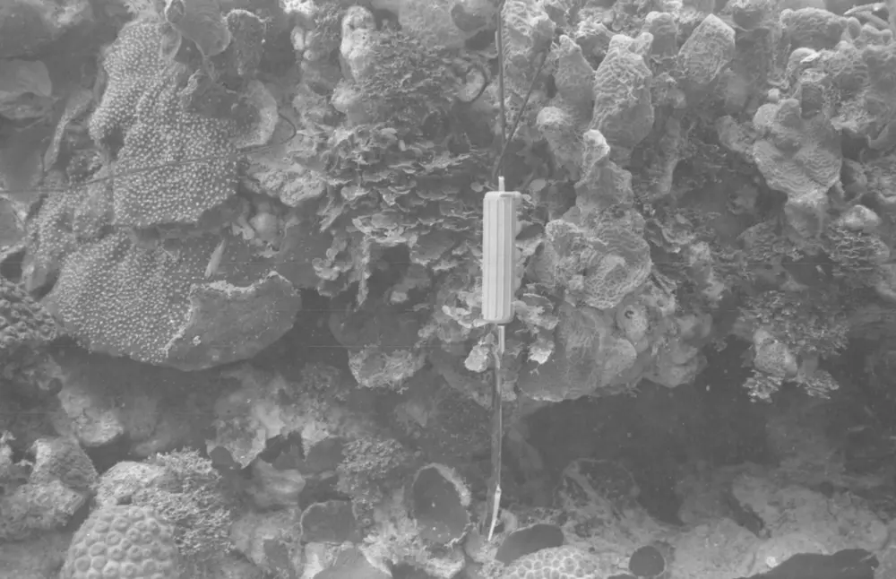{.lightbox group="discovery-bay-1966" description="**UUID: **f27c4d36-c913-42f6-8ec9-d13addea981e **Date: **1966-05-31 **Location: **Jamaica | Discovery Bay | Buoy Upper Slope **Longitude: **77.40908ºW **Latitude: **18.47322ºN **Photographer: **Eileen Graham **Copyright: **Trustees of the Natural History Museum (London, UK), CC-BY-4.0" alt="**UUID: **f27c4d36-c913-42f6-8ec9-d13addea981e **Date: **1966-05-31 **Location: **Jamaica | Discovery Bay | Buoy Upper Slope **Longitude: **77.40908ºW **Latitude: **18.47322ºN **Photographer: **Eileen Graham **Copyright: **Trustees of the Natural History Museum (London, UK), CC-BY-4.0"}

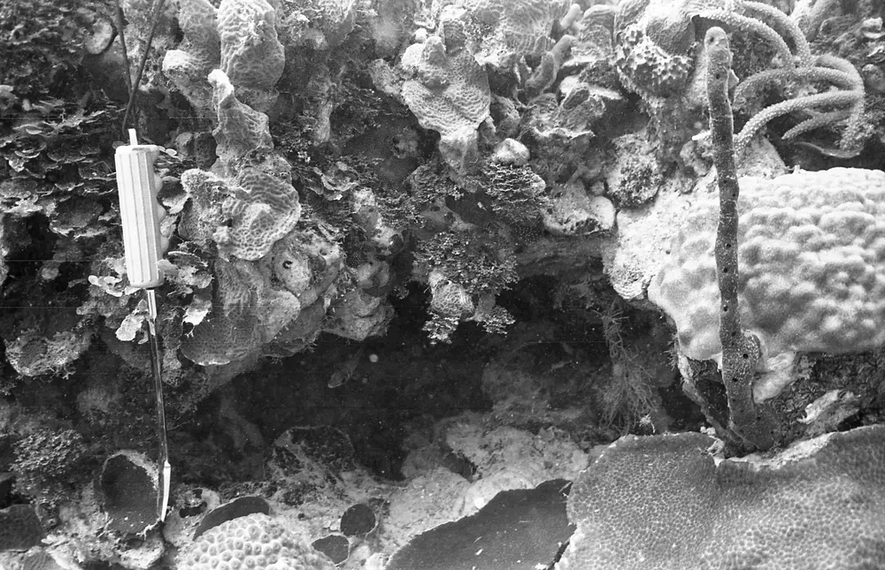{.lightbox group="discovery-bay-1966" description="**UUID: **2a00bd47-3006-434f-9c8d-da146817b159 **Date: **1966-05-31 **Location: **Jamaica | Discovery Bay | Buoy Upper Slope **Longitude: **77.40908ºW **Latitude: **18.47322ºN **Photographer: **Eileen Graham **Copyright: **Trustees of the Natural History Museum (London, UK), CC-BY-4.0" alt="**UUID: **2a00bd47-3006-434f-9c8d-da146817b159 **Date: **1966-05-31 **Location: **Jamaica | Discovery Bay | Buoy Upper Slope **Longitude: **77.40908ºW **Latitude: **18.47322ºN **Photographer: **Eileen Graham **Copyright: **Trustees of the Natural History Museum (London, UK), CC-BY-4.0"}

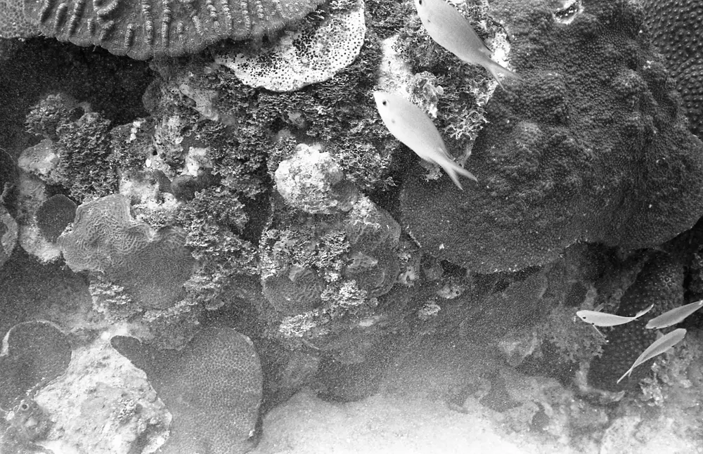{.lightbox group="discovery-bay-1966" description="**UUID: **e4830812-ec2b-4107-896b-e0f0e3dd8a83 **Date: **1966-05-31 **Location: **Jamaica | Discovery Bay | Buoy Upper Slope **Longitude: **77.40908ºW **Latitude: **18.47322ºN **Photographer: **Eileen Graham **Copyright: **Trustees of the Natural History Museum (London, UK), CC-BY-4.0" alt="**UUID: **e4830812-ec2b-4107-896b-e0f0e3dd8a83 **Date: **1966-05-31 **Location: **Jamaica | Discovery Bay | Buoy Upper Slope **Longitude: **77.40908ºW **Latitude: **18.47322ºN **Photographer: **Eileen Graham **Copyright: **Trustees of the Natural History Museum (London, UK), CC-BY-4.0"}

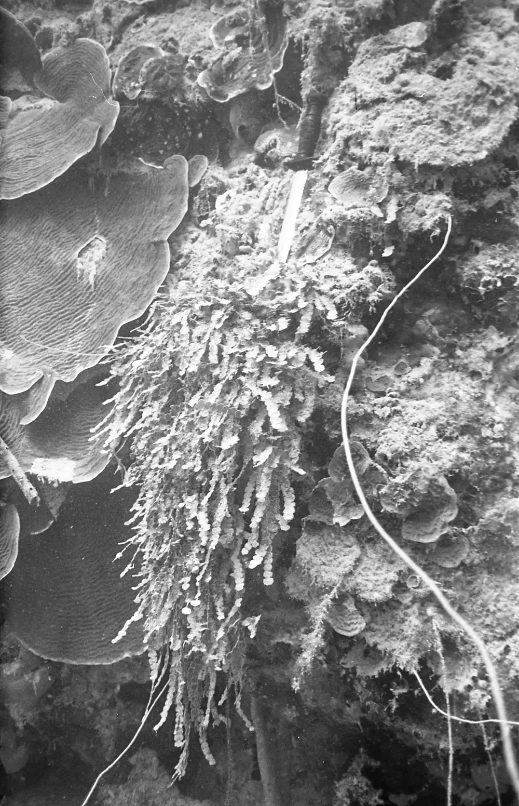{.lightbox group="discovery-bay-1966" description="**UUID: **e6d6dbab-e616-4cec-84ba-ea0df3321b52 **Date: **1966-12-06 **Location: **Jamaica | Discovery Bay | Eaton Hall **Longitude: **77.334ºW **Latitude: **18.467ºN **Photographer: **Eileen Graham **Copyright: **Trustees of the Natural History Museum (London, UK), CC-BY-4.0" alt="**UUID: **e6d6dbab-e616-4cec-84ba-ea0df3321b52 **Date: **1966-12-06 **Location: **Jamaica | Discovery Bay | Eaton Hall **Longitude: **77.334ºW **Latitude: **18.467ºN **Photographer: **Eileen Graham **Copyright: **Trustees of the Natural History Museum (London, UK), CC-BY-4.0"}

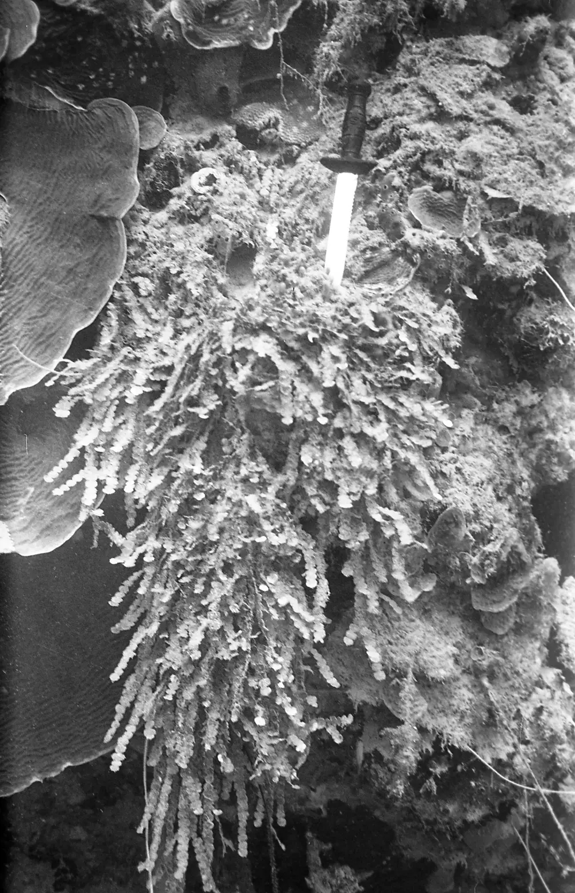{.lightbox group="discovery-bay-1966" description="**UUID: **47619f3b-4171-4ae5-8fc0-e43b5b64f560 **Date: **1966-12-06 **Location: **Jamaica | Discovery Bay | Eaton Hall **Longitude: **77.334ºW **Latitude: **18.467ºN **Photographer: **Eileen Graham **Copyright: **Trustees of the Natural History Museum (London, UK), CC-BY-4.0" alt="**UUID: **47619f3b-4171-4ae5-8fc0-e43b5b64f560 **Date: **1966-12-06 **Location: **Jamaica | Discovery Bay | Eaton Hall **Longitude: **77.334ºW **Latitude: **18.467ºN **Photographer: **Eileen Graham **Copyright: **Trustees of the Natural History Museum (London, UK), CC-BY-4.0"}

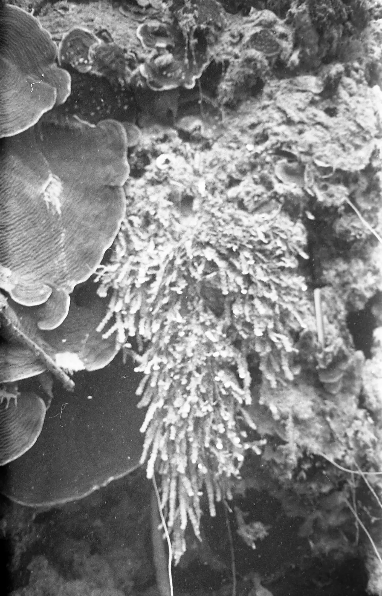{.lightbox group="discovery-bay-1966" description="**UUID: **38714dc0-521b-4250-9d31-8a6a0dc88d55 **Date: **1966-12-06 **Location: **Jamaica | Discovery Bay | Eaton Hall **Longitude: **77.334ºW **Latitude: **18.467ºN **Photographer: **Eileen Graham **Copyright: **Trustees of the Natural History Museum (London, UK), CC-BY-4.0" alt="**UUID: **38714dc0-521b-4250-9d31-8a6a0dc88d55 **Date: **1966-12-06 **Location: **Jamaica | Discovery Bay | Eaton Hall **Longitude: **77.334ºW **Latitude: **18.467ºN **Photographer: **Eileen Graham **Copyright: **Trustees of the Natural History Museum (London, UK), CC-BY-4.0"}

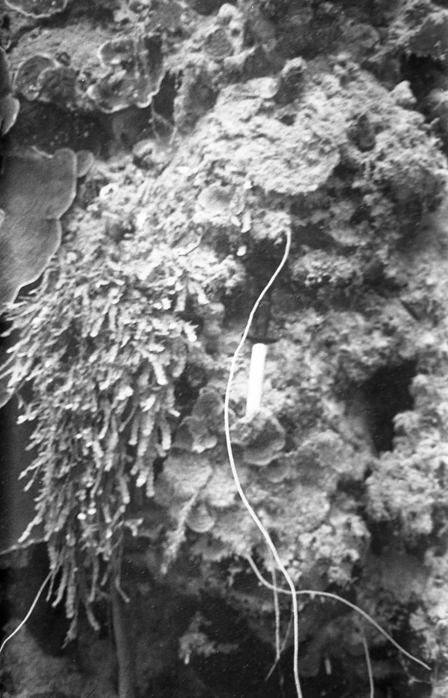{.lightbox group="discovery-bay-1966" description="**UUID: **989f6408-7d51-439c-af67-e92c8d2c3955 **Date: **1966-12-06 **Location: **Jamaica | Discovery Bay | Eaton Hall **Longitude: **77.334ºW **Latitude: **18.467ºN **Photographer: **Eileen Graham **Copyright: **Trustees of the Natural History Museum (London, UK), CC-BY-4.0" alt="**UUID: **989f6408-7d51-439c-af67-e92c8d2c3955 **Date: **1966-12-06 **Location: **Jamaica | Discovery Bay | Eaton Hall **Longitude: **77.334ºW **Latitude: **18.467ºN **Photographer: **Eileen Graham **Copyright: **Trustees of the Natural History Museum (London, UK), CC-BY-4.0"}

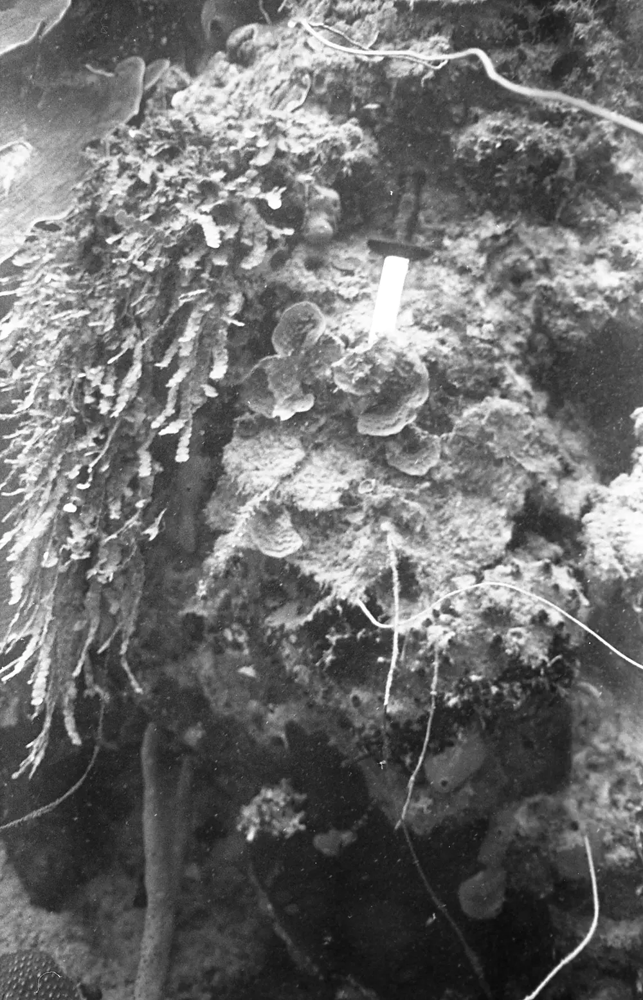{.lightbox group="discovery-bay-1966" description="**UUID: **114ea9ac-7c34-43c1-83e2-041fd99b7b78 **Date: **1966-12-06 **Location: **Jamaica | Discovery Bay | Eaton Hall **Longitude: **77.334ºW **Latitude: **18.467ºN **Photographer: **Eileen Graham **Copyright: **Trustees of the Natural History Museum (London, UK), CC-BY-4.0" alt="**UUID: **114ea9ac-7c34-43c1-83e2-041fd99b7b78 **Date: **1966-12-06 **Location: **Jamaica | Discovery Bay | Eaton Hall **Longitude: **77.334ºW **Latitude: **18.467ºN **Photographer: **Eileen Graham **Copyright: **Trustees of the Natural History Museum (London, UK), CC-BY-4.0"}

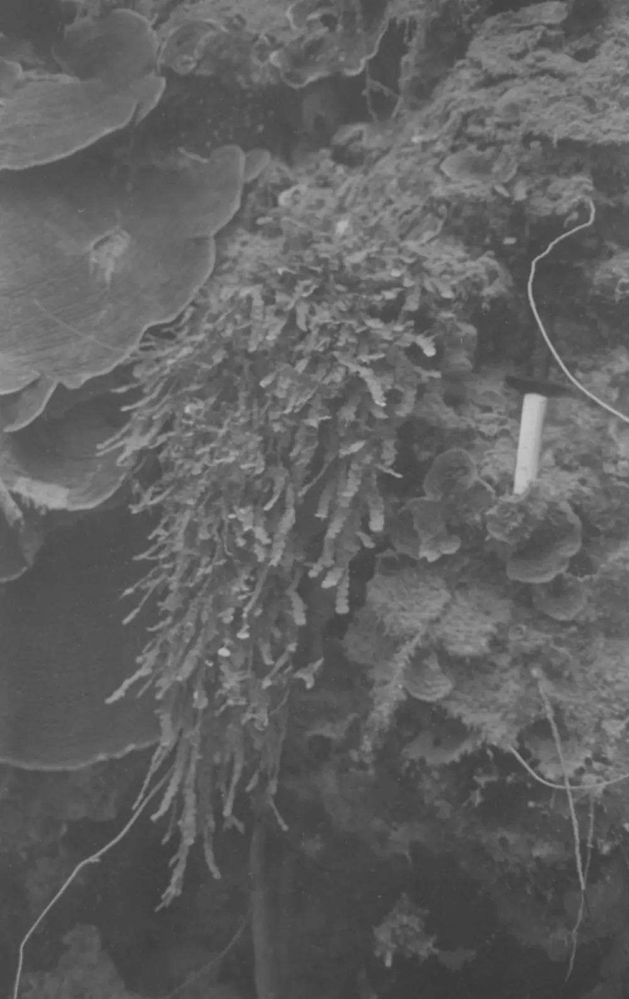{.lightbox group="discovery-bay-1966" description="**UUID: **ce33178f-5283-4179-8b7b-8b6f9f521216 **Date: **1966-12-06 **Location: **Jamaica | Discovery Bay | Eaton Hall **Longitude: **77.334ºW **Latitude: **18.467ºN **Photographer: **Eileen Graham **Copyright: **Trustees of the Natural History Museum (London, UK), CC-BY-4.0" alt="**UUID: **ce33178f-5283-4179-8b7b-8b6f9f521216 **Date: **1966-12-06 **Location: **Jamaica | Discovery Bay | Eaton Hall **Longitude: **77.334ºW **Latitude: **18.467ºN **Photographer: **Eileen Graham **Copyright: **Trustees of the Natural History Museum (London, UK), CC-BY-4.0"}

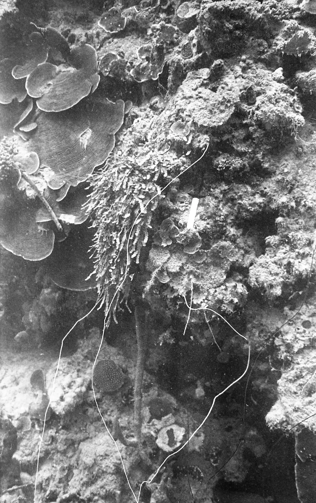{.lightbox group="discovery-bay-1966" description="**UUID: **4aa92322-64e8-4839-9c7c-068a591158fe **Date: **1966-12-06 **Location: **Jamaica | Discovery Bay | Eaton Hall **Longitude: **77.334ºW **Latitude: **18.467ºN **Photographer: **Eileen Graham **Copyright: **Trustees of the Natural History Museum (London, UK), CC-BY-4.0" alt="**UUID: **4aa92322-64e8-4839-9c7c-068a591158fe **Date: **1966-12-06 **Location: **Jamaica | Discovery Bay | Eaton Hall **Longitude: **77.334ºW **Latitude: **18.467ºN **Photographer: **Eileen Graham **Copyright: **Trustees of the Natural History Museum (London, UK), CC-BY-4.0"}

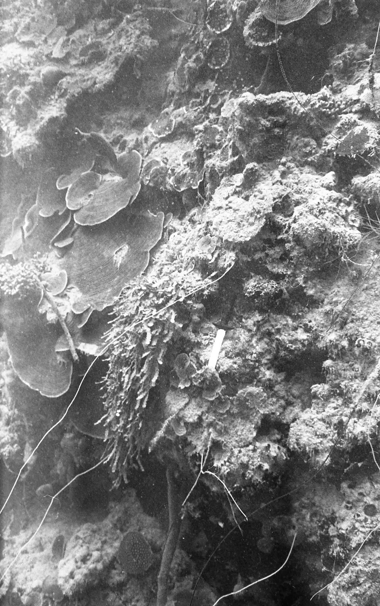{.lightbox group="discovery-bay-1966" description="**UUID: **3365c9ed-06ee-4a16-9622-ad88e542d958 **Date: **1966-12-06 **Location: **Jamaica | Discovery Bay | Eaton Hall **Longitude: **77.334ºW **Latitude: **18.467ºN **Photographer: **Eileen Graham **Copyright: **Trustees of the Natural History Museum (London, UK), CC-BY-4.0" alt="**UUID: **3365c9ed-06ee-4a16-9622-ad88e542d958 **Date: **1966-12-06 **Location: **Jamaica | Discovery Bay | Eaton Hall **Longitude: **77.334ºW **Latitude: **18.467ºN **Photographer: **Eileen Graham **Copyright: **Trustees of the Natural History Museum (London, UK), CC-BY-4.0"}

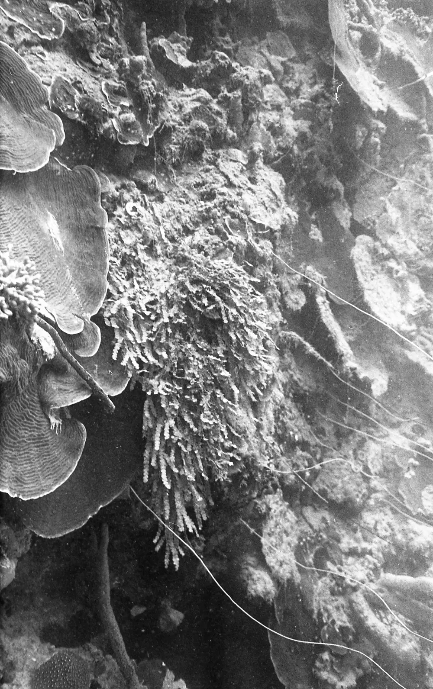{.lightbox group="discovery-bay-1966" description="**UUID: **d0ecf66e-0ed6-4443-8f6c-e134166e762f **Date: **1966-12-06 **Location: **Jamaica | Discovery Bay | Eaton Hall **Longitude: **77.334ºW **Latitude: **18.467ºN **Photographer: **Eileen Graham **Copyright: **Trustees of the Natural History Museum (London, UK), CC-BY-4.0" alt="**UUID: **d0ecf66e-0ed6-4443-8f6c-e134166e762f **Date: **1966-12-06 **Location: **Jamaica | Discovery Bay | Eaton Hall **Longitude: **77.334ºW **Latitude: **18.467ºN **Photographer: **Eileen Graham **Copyright: **Trustees of the Natural History Museum (London, UK), CC-BY-4.0"}

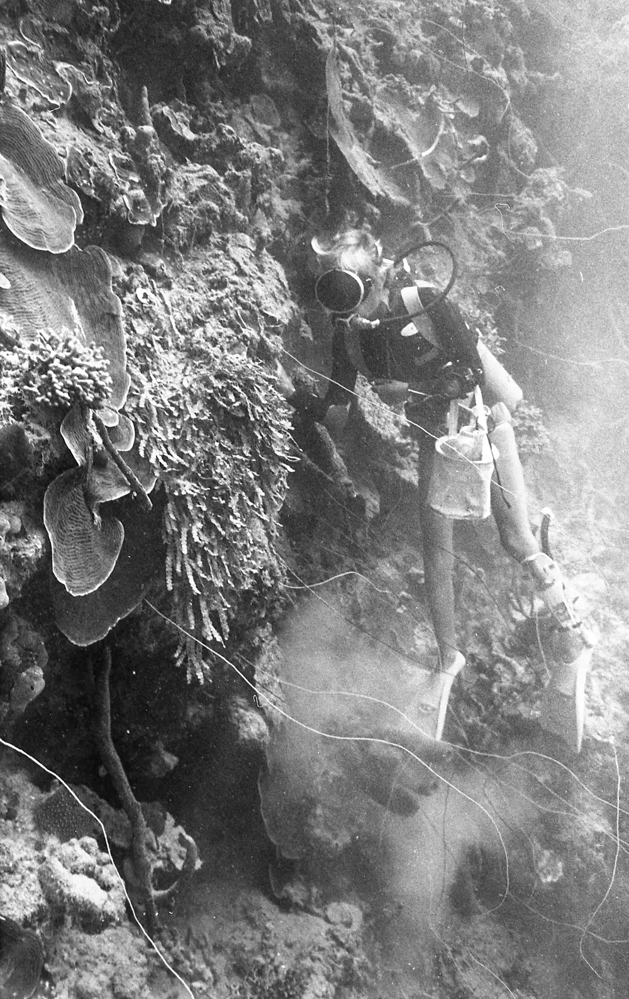{.lightbox group="discovery-bay-1966" description="**UUID: **88441b0b-988e-40b6-b63f-2698d33b78ff **Date: **1966-12-06 **Location: **Jamaica | Discovery Bay | Eaton Hall **Longitude: **77.334ºW **Latitude: **18.467ºN **Photographer: **Eileen Graham **Copyright: **Trustees of the Natural History Museum (London, UK), CC-BY-4.0" alt="**UUID: **88441b0b-988e-40b6-b63f-2698d33b78ff **Date: **1966-12-06 **Location: **Jamaica | Discovery Bay | Eaton Hall **Longitude: **77.334ºW **Latitude: **18.467ºN **Photographer: **Eileen Graham **Copyright: **Trustees of the Natural History Museum (London, UK), CC-BY-4.0"}

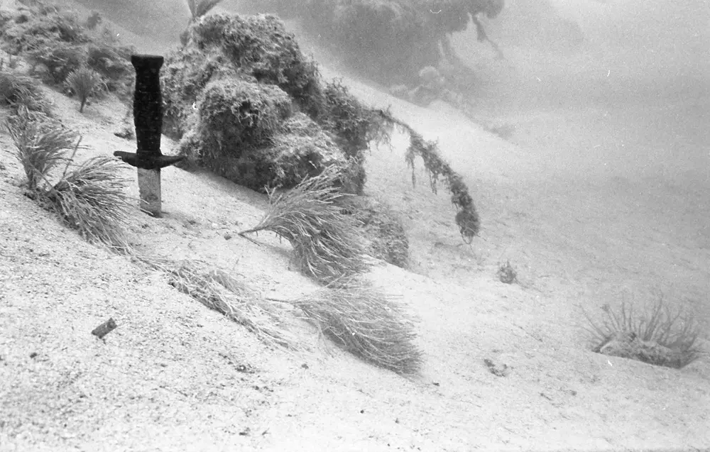{.lightbox group="discovery-bay-1966" description="**UUID: **6df5b505-6593-490e-926e-f8de4eaea2d2 **Date: **1966-12-06 **Location: **Jamaica | Discovery Bay | Eaton Hall **Longitude: **77.334ºW **Latitude: **18.467ºN **Photographer: **Eileen Graham **Copyright: **Trustees of the Natural History Museum (London, UK), CC-BY-4.0" alt="**UUID: **6df5b505-6593-490e-926e-f8de4eaea2d2 **Date: **1966-12-06 **Location: **Jamaica | Discovery Bay | Eaton Hall **Longitude: **77.334ºW **Latitude: **18.467ºN **Photographer: **Eileen Graham **Copyright: **Trustees of the Natural History Museum (London, UK), CC-BY-4.0"}

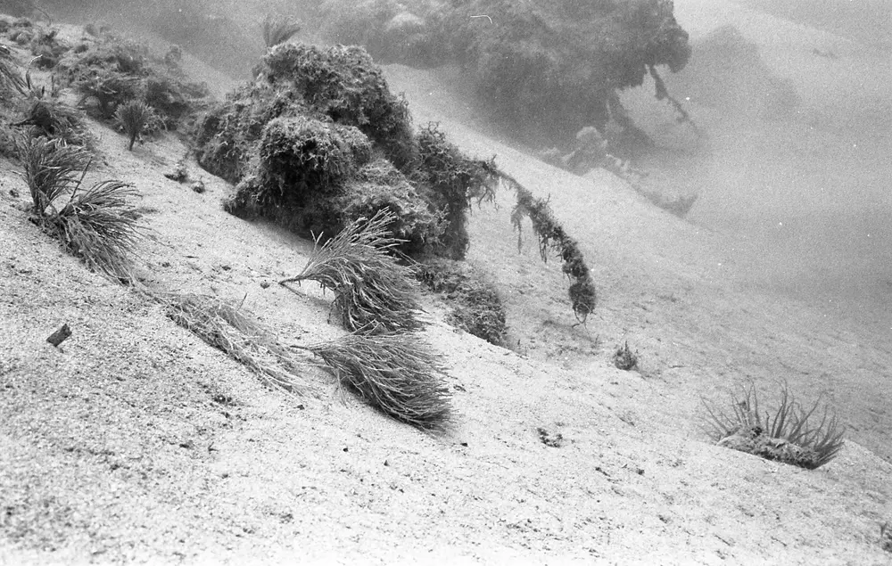{.lightbox group="discovery-bay-1966" description="**UUID: **7af52596-a75b-483c-9660-76add2549e27 **Date: **1966-12-06 **Location: **Jamaica | Discovery Bay | Eaton Hall **Longitude: **77.334ºW **Latitude: **18.467ºN **Photographer: **Eileen Graham **Copyright: **Trustees of the Natural History Museum (London, UK), CC-BY-4.0" alt="**UUID: **7af52596-a75b-483c-9660-76add2549e27 **Date: **1966-12-06 **Location: **Jamaica | Discovery Bay | Eaton Hall **Longitude: **77.334ºW **Latitude: **18.467ºN **Photographer: **Eileen Graham **Copyright: **Trustees of the Natural History Museum (London, UK), CC-BY-4.0"}

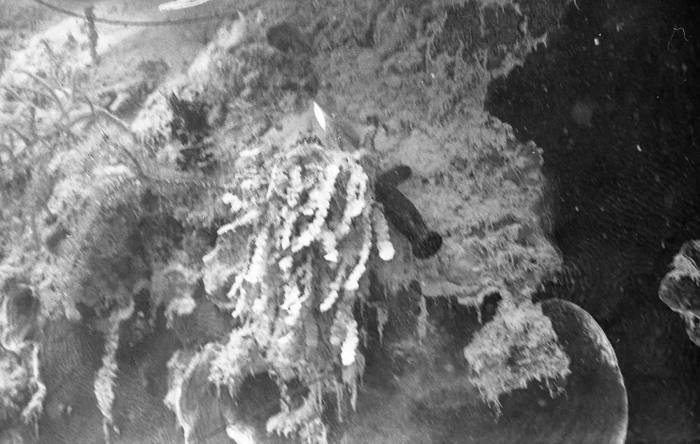{.lightbox group="discovery-bay-1966" description="**UUID: **9bbfb3f6-e344-4002-9fff-8f547412fc3d **Date: **1966-12-06 **Location: **Jamaica | Discovery Bay | Eaton Hall **Longitude: **77.334ºW **Latitude: **18.467ºN **Photographer: **Eileen Graham **Copyright: **Trustees of the Natural History Museum (London, UK), CC-BY-4.0" alt="**UUID: **9bbfb3f6-e344-4002-9fff-8f547412fc3d **Date: **1966-12-06 **Location: **Jamaica | Discovery Bay | Eaton Hall **Longitude: **77.334ºW **Latitude: **18.467ºN **Photographer: **Eileen Graham **Copyright: **Trustees of the Natural History Museum (London, UK), CC-BY-4.0"}

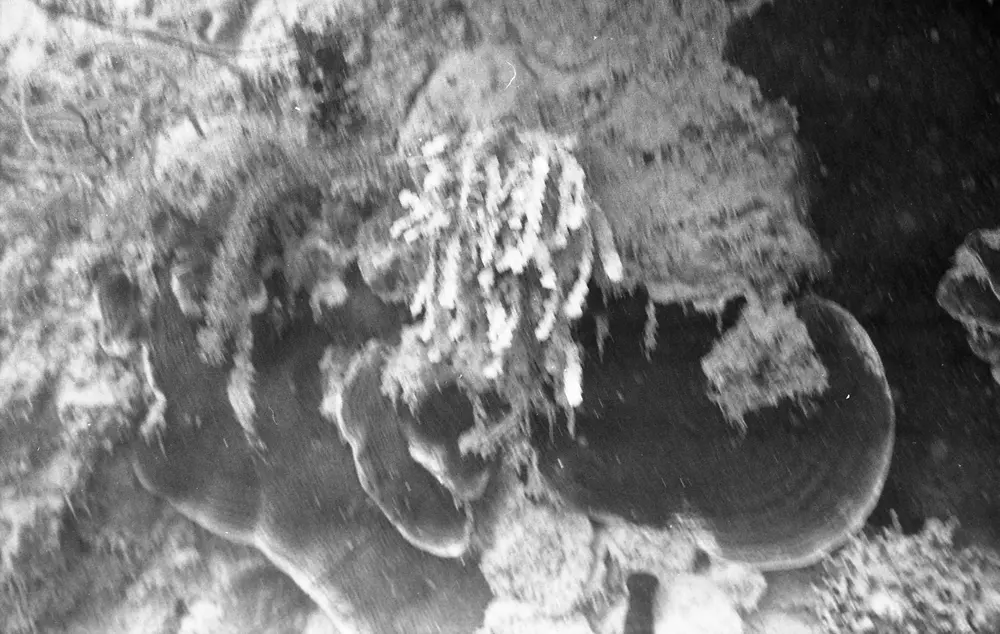{.lightbox group="discovery-bay-1966" description="**UUID: **61e3dbef-54e2-4be8-aed4-763cd0d71ee8 **Date: **1966-12-06 **Location: **Jamaica | Discovery Bay | Eaton Hall **Longitude: **77.334ºW **Latitude: **18.467ºN **Photographer: **Eileen Graham **Copyright: **Trustees of the Natural History Museum (London, UK), CC-BY-4.0" alt="**UUID: **61e3dbef-54e2-4be8-aed4-763cd0d71ee8 **Date: **1966-12-06 **Location: **Jamaica | Discovery Bay | Eaton Hall **Longitude: **77.334ºW **Latitude: **18.467ºN **Photographer: **Eileen Graham **Copyright: **Trustees of the Natural History Museum (London, UK), CC-BY-4.0"}

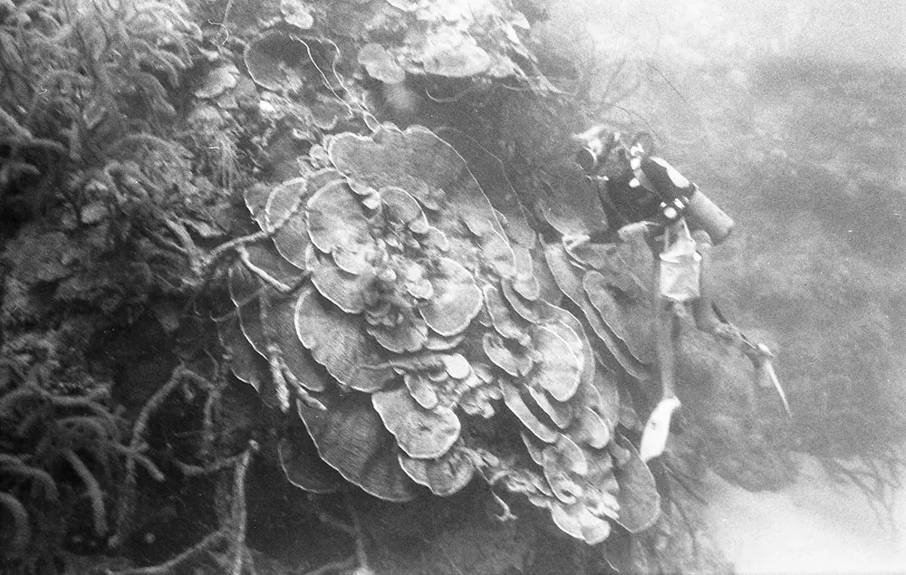{.lightbox group="discovery-bay-1966" description="**UUID: **b4d5b481-9124-4b8f-978d-16b3f3b50556 **Date: **1966-12-06 **Location: **Jamaica | Discovery Bay | Eaton Hall **Longitude: **77.334ºW **Latitude: **18.467ºN **Photographer: **Eileen Graham **Copyright: **Trustees of the Natural History Museum (London, UK), CC-BY-4.0" alt="**UUID: **b4d5b481-9124-4b8f-978d-16b3f3b50556 **Date: **1966-12-06 **Location: **Jamaica | Discovery Bay | Eaton Hall **Longitude: **77.334ºW **Latitude: **18.467ºN **Photographer: **Eileen Graham **Copyright: **Trustees of the Natural History Museum (London, UK), CC-BY-4.0"}

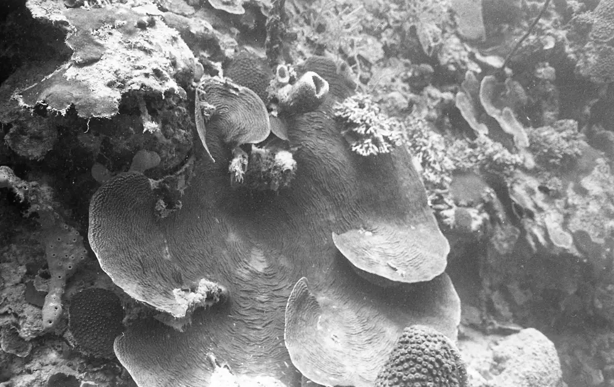{.lightbox group="discovery-bay-1966" description="**UUID: **0b32d217-e6c3-4974-9b68-f3b0d4d65fe8 **Date: **1966-12-06 **Location: **Jamaica | Discovery Bay | Eaton Hall **Longitude: **77.334ºW **Latitude: **18.467ºN **Photographer: **Eileen Graham **Copyright: **Trustees of the Natural History Museum (London, UK), CC-BY-4.0" alt="**UUID: **0b32d217-e6c3-4974-9b68-f3b0d4d65fe8 **Date: **1966-12-06 **Location: **Jamaica | Discovery Bay | Eaton Hall **Longitude: **77.334ºW **Latitude: **18.467ºN **Photographer: **Eileen Graham **Copyright: **Trustees of the Natural History Museum (London, UK), CC-BY-4.0"}

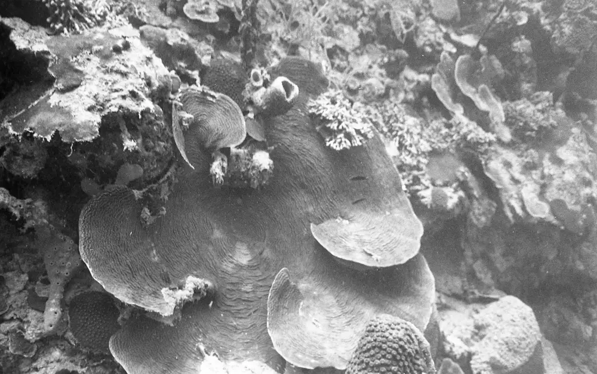{.lightbox group="discovery-bay-1966" description="**UUID: **53c69e18-998f-4000-a47a-0dc54922c596 **Date: **1966-12-06 **Location: **Jamaica | Discovery Bay | Eaton Hall **Longitude: **77.334ºW **Latitude: **18.467ºN **Photographer: **Eileen Graham **Copyright: **Trustees of the Natural History Museum (London, UK), CC-BY-4.0" alt="**UUID: **53c69e18-998f-4000-a47a-0dc54922c596 **Date: **1966-12-06 **Location: **Jamaica | Discovery Bay | Eaton Hall **Longitude: **77.334ºW **Latitude: **18.467ºN **Photographer: **Eileen Graham **Copyright: **Trustees of the Natural History Museum (London, UK), CC-BY-4.0"}

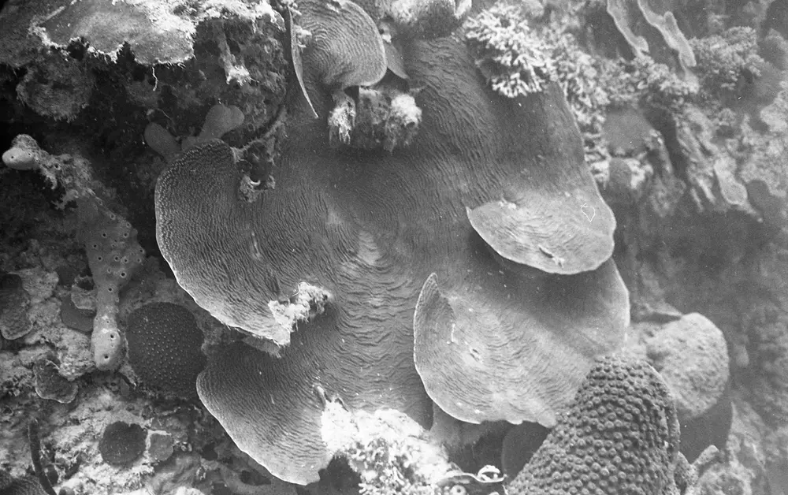{.lightbox group="discovery-bay-1966" description="**UUID: **6ce906e2-7a10-4da3-b205-4530a2bfb6df **Date: **1966-12-06 **Location: **Jamaica | Discovery Bay | Eaton Hall **Longitude: **77.334ºW **Latitude: **18.467ºN **Photographer: **Eileen Graham **Copyright: **Trustees of the Natural History Museum (London, UK), CC-BY-4.0" alt="**UUID: **6ce906e2-7a10-4da3-b205-4530a2bfb6df **Date: **1966-12-06 **Location: **Jamaica | Discovery Bay | Eaton Hall **Longitude: **77.334ºW **Latitude: **18.467ºN **Photographer: **Eileen Graham **Copyright: **Trustees of the Natural History Museum (London, UK), CC-BY-4.0"}

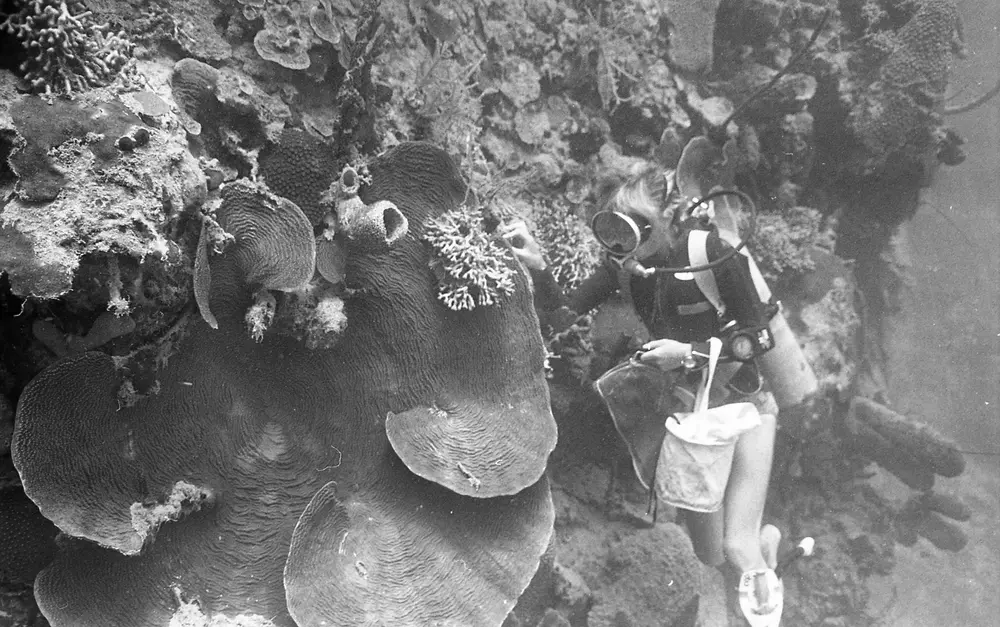{.lightbox group="discovery-bay-1966" description="**UUID: **32b001d5-e36d-4619-b856-f6a128b8cc46 **Date: **1966-12-06 **Location: **Jamaica | Discovery Bay | Eaton Hall **Longitude: **77.334ºW **Latitude: **18.467ºN **Photographer: **Eileen Graham **Copyright: **Trustees of the Natural History Museum (London, UK), CC-BY-4.0" alt="**UUID: **32b001d5-e36d-4619-b856-f6a128b8cc46 **Date: **1966-12-06 **Location: **Jamaica | Discovery Bay | Eaton Hall **Longitude: **77.334ºW **Latitude: **18.467ºN **Photographer: **Eileen Graham **Copyright: **Trustees of the Natural History Museum (London, UK), CC-BY-4.0"}

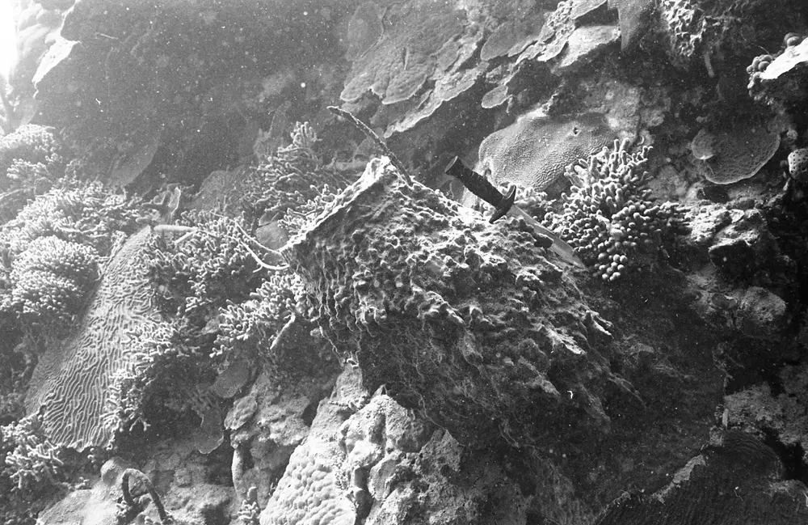{.lightbox group="discovery-bay-1966" description="**UUID: **efad839e-91b6-4c79-98a9-a0f0dc7b22e9 **Date: **1966-12-06 **Location: **Jamaica | Discovery Bay | Eaton Hall **Longitude: **77.334ºW **Latitude: **18.467ºN **Photographer: **Eileen Graham **Copyright: **Trustees of the Natural History Museum (London, UK), CC-BY-4.0" alt="**UUID: **efad839e-91b6-4c79-98a9-a0f0dc7b22e9 **Date: **1966-12-06 **Location: **Jamaica | Discovery Bay | Eaton Hall **Longitude: **77.334ºW **Latitude: **18.467ºN **Photographer: **Eileen Graham **Copyright: **Trustees of the Natural History Museum (London, UK), CC-BY-4.0"}

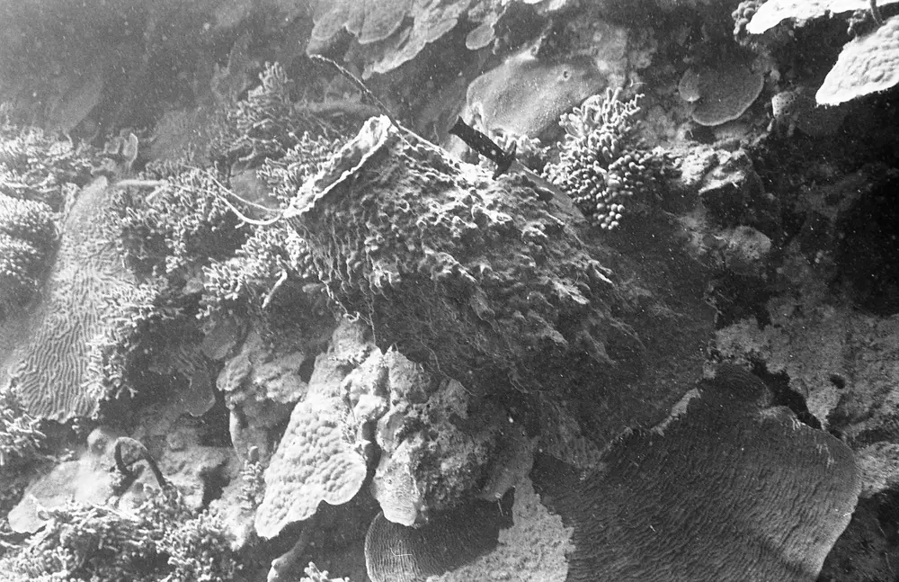{.lightbox group="discovery-bay-1966" description="**UUID: **7a988bdb-ecdb-49d6-898b-fac15778bde6 **Date: **1966-12-06 **Location: **Jamaica | Discovery Bay | Eaton Hall **Longitude: **77.334ºW **Latitude: **18.467ºN **Photographer: **Eileen Graham **Copyright: **Trustees of the Natural History Museum (London, UK), CC-BY-4.0" alt="**UUID: **7a988bdb-ecdb-49d6-898b-fac15778bde6 **Date: **1966-12-06 **Location: **Jamaica | Discovery Bay | Eaton Hall **Longitude: **77.334ºW **Latitude: **18.467ºN **Photographer: **Eileen Graham **Copyright: **Trustees of the Natural History Museum (London, UK), CC-BY-4.0"}

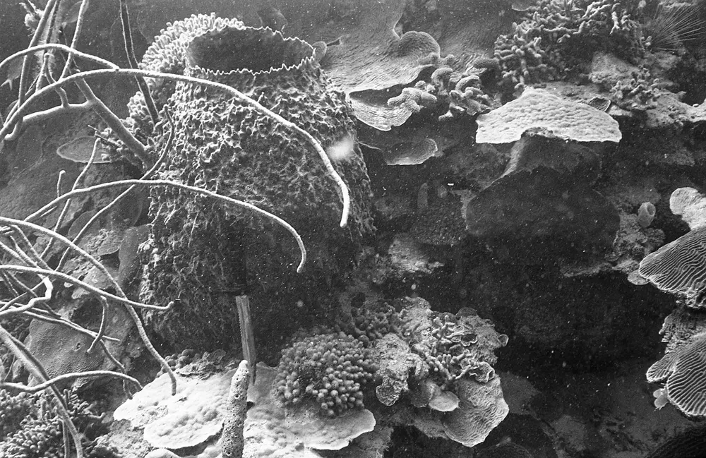{.lightbox group="discovery-bay-1966" description="**UUID: **4bdd4724-0f99-4c55-b75e-988a6a262da1 **Date: **1966-12-06 **Location: **Jamaica | Discovery Bay | Eaton Hall **Longitude: **77.334ºW **Latitude: **18.467ºN **Photographer: **Eileen Graham **Copyright: **Trustees of the Natural History Museum (London, UK), CC-BY-4.0" alt="**UUID: **4bdd4724-0f99-4c55-b75e-988a6a262da1 **Date: **1966-12-06 **Location: **Jamaica | Discovery Bay | Eaton Hall **Longitude: **77.334ºW **Latitude: **18.467ºN **Photographer: **Eileen Graham **Copyright: **Trustees of the Natural History Museum (London, UK), CC-BY-4.0"}

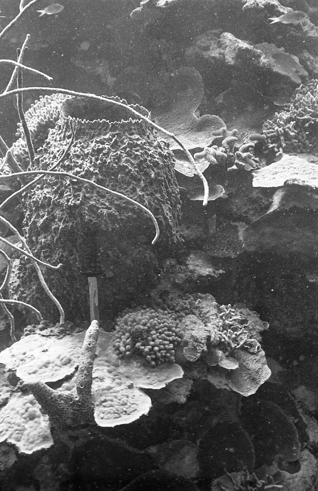{.lightbox group="discovery-bay-1966" description="**UUID: **0709a89e-a2ec-4311-846f-58aaf3092017 **Date: **1966-12-06 **Location: **Jamaica | Discovery Bay | Eaton Hall **Longitude: **77.334ºW **Latitude: **18.467ºN **Photographer: **Eileen Graham **Copyright: **Trustees of the Natural History Museum (London, UK), CC-BY-4.0" alt="**UUID: **0709a89e-a2ec-4311-846f-58aaf3092017 **Date: **1966-12-06 **Location: **Jamaica | Discovery Bay | Eaton Hall **Longitude: **77.334ºW **Latitude: **18.467ºN **Photographer: **Eileen Graham **Copyright: **Trustees of the Natural History Museum (London, UK), CC-BY-4.0"}

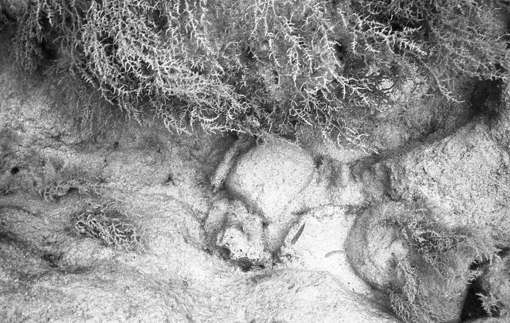{.lightbox group="discovery-bay-1966" description="**UUID: **5dd7a549-934a-4380-a580-cf6a66e65376 **Date: **1966-12-06 **Location: **Jamaica | Discovery Bay | Eaton Hall **Longitude: **77.334ºW **Latitude: **18.467ºN **Photographer: **Eileen Graham **Copyright: **Trustees of the Natural History Museum (London, UK), CC-BY-4.0" alt="**UUID: **5dd7a549-934a-4380-a580-cf6a66e65376 **Date: **1966-12-06 **Location: **Jamaica | Discovery Bay | Eaton Hall **Longitude: **77.334ºW **Latitude: **18.467ºN **Photographer: **Eileen Graham **Copyright: **Trustees of the Natural History Museum (London, UK), CC-BY-4.0"}

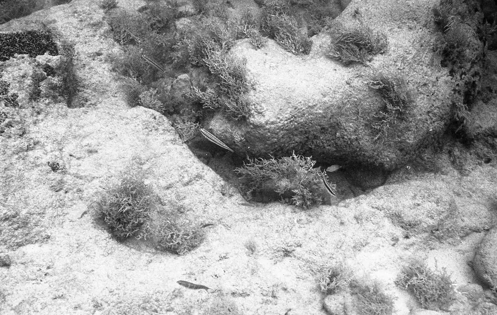{.lightbox group="discovery-bay-1966" description="**UUID: **24c1b607-9029-48dd-9ca3-b123da8e6de3 **Date: **1966-12-06 **Location: **Jamaica | Discovery Bay | Eaton Hall **Longitude: **77.334ºW **Latitude: **18.467ºN **Photographer: **Eileen Graham **Copyright: **Trustees of the Natural History Museum (London, UK), CC-BY-4.0" alt="**UUID: **24c1b607-9029-48dd-9ca3-b123da8e6de3 **Date: **1966-12-06 **Location: **Jamaica | Discovery Bay | Eaton Hall **Longitude: **77.334ºW **Latitude: **18.467ºN **Photographer: **Eileen Graham **Copyright: **Trustees of the Natural History Museum (London, UK), CC-BY-4.0"}

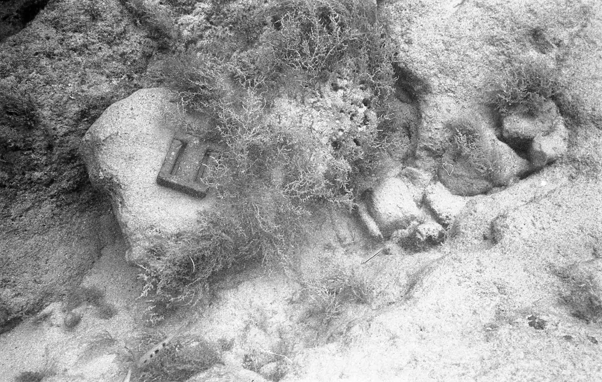{.lightbox group="discovery-bay-1966" description="**UUID: **f22b085e-80f7-445b-8342-cde66326bc7a **Date: **1966-12-06 **Location: **Jamaica | Discovery Bay | Eaton Hall **Longitude: **77.334ºW **Latitude: **18.467ºN **Photographer: **Eileen Graham **Copyright: **Trustees of the Natural History Museum (London, UK), CC-BY-4.0" alt="**UUID: **f22b085e-80f7-445b-8342-cde66326bc7a **Date: **1966-12-06 **Location: **Jamaica | Discovery Bay | Eaton Hall **Longitude: **77.334ºW **Latitude: **18.467ºN **Photographer: **Eileen Graham **Copyright: **Trustees of the Natural History Museum (London, UK), CC-BY-4.0"}

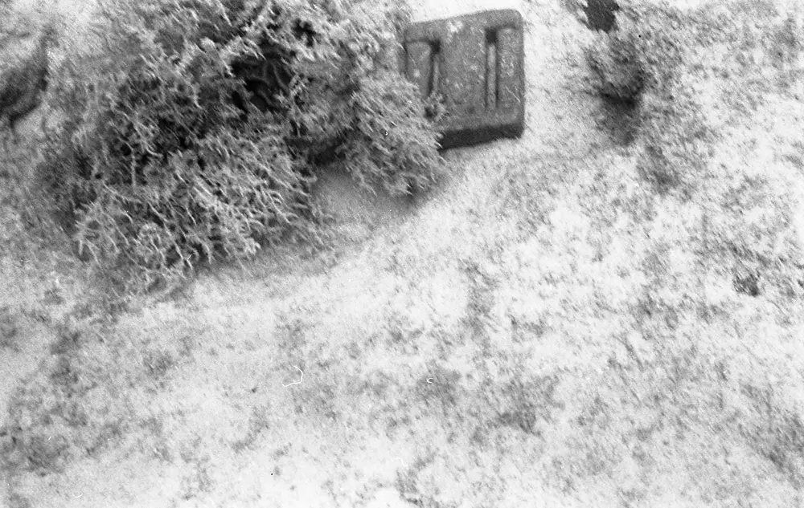{.lightbox group="discovery-bay-1966" description="**UUID: **240b9cfc-192f-431c-ba5b-1659a321fdd3 **Date: **1966-12-06 **Location: **Jamaica | Discovery Bay | Eaton Hall **Longitude: **77.334ºW **Latitude: **18.467ºN **Photographer: **Eileen Graham **Copyright: **Trustees of the Natural History Museum (London, UK), CC-BY-4.0" alt="**UUID: **240b9cfc-192f-431c-ba5b-1659a321fdd3 **Date: **1966-12-06 **Location: **Jamaica | Discovery Bay | Eaton Hall **Longitude: **77.334ºW **Latitude: **18.467ºN **Photographer: **Eileen Graham **Copyright: **Trustees of the Natural History Museum (London, UK), CC-BY-4.0"}

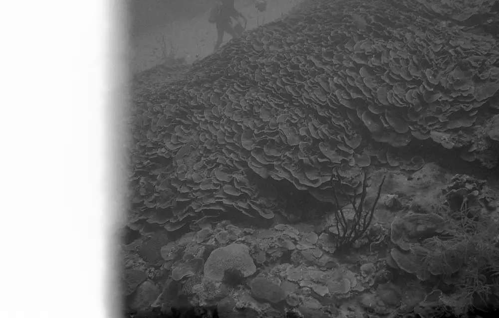{.lightbox group="discovery-bay-1966" description="**UUID: **7b6ed5cc-78b9-4222-8d81-a118f85458cf **Date: **1966-01-06 **Location: **Jamaica | Discovery Bay | The Bull **Longitude: **77.38917ºW **Latitude: **18.46917ºN **Photographer: **Eileen Graham **Copyright: **Trustees of the Natural History Museum (London, UK), CC-BY-4.0" alt="**UUID: **7b6ed5cc-78b9-4222-8d81-a118f85458cf **Date: **1966-01-06 **Location: **Jamaica | Discovery Bay | The Bull **Longitude: **77.38917ºW **Latitude: **18.46917ºN **Photographer: **Eileen Graham **Copyright: **Trustees of the Natural History Museum (London, UK), CC-BY-4.0"}

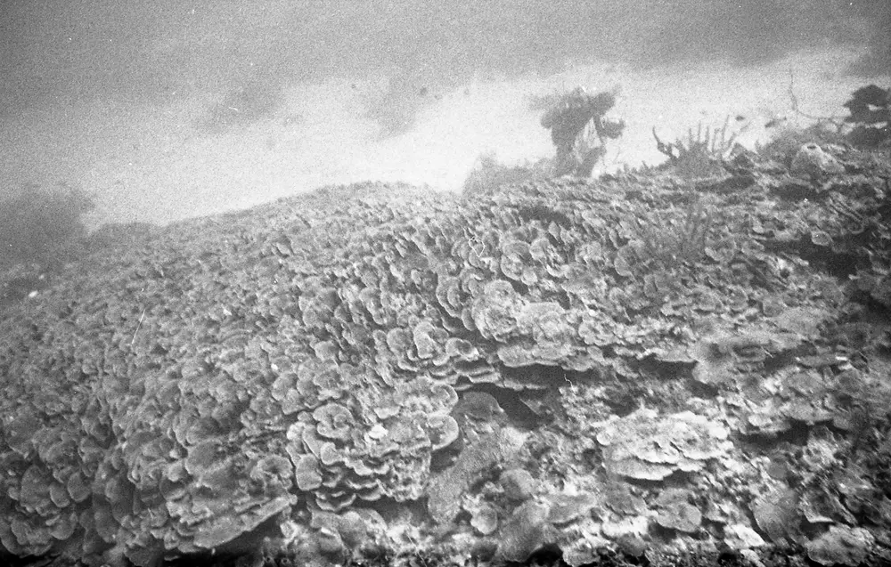{.lightbox group="discovery-bay-1966" description="**UUID: **139d7c08-70ad-4781-95f8-14dc87a6346c **Date: **1966-01-06 **Location: **Jamaica | Discovery Bay | The Bull **Longitude: **77.38917ºW **Latitude: **18.46917ºN **Photographer: **Eileen Graham **Copyright: **Trustees of the Natural History Museum (London, UK), CC-BY-4.0" alt="**UUID: **139d7c08-70ad-4781-95f8-14dc87a6346c **Date: **1966-01-06 **Location: **Jamaica | Discovery Bay | The Bull **Longitude: **77.38917ºW **Latitude: **18.46917ºN **Photographer: **Eileen Graham **Copyright: **Trustees of the Natural History Museum (London, UK), CC-BY-4.0"}

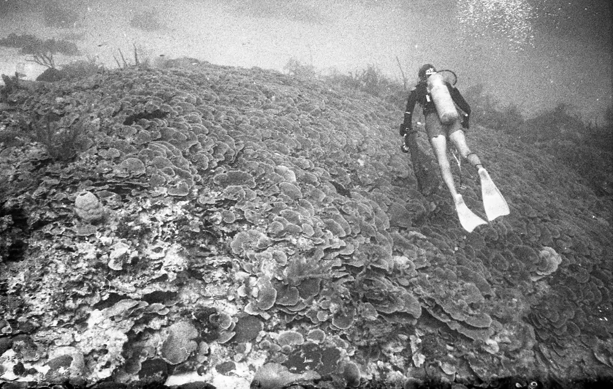{.lightbox group="discovery-bay-1966" description="**UUID: **fedff53b-17a8-4080-b9fa-a47dca0cbfab **Date: **1966-01-06 **Location: **Jamaica | Discovery Bay | The Bull **Longitude: **77.38917ºW **Latitude: **18.46917ºN **Photographer: **Eileen Graham **Copyright: **Trustees of the Natural History Museum (London, UK), CC-BY-4.0" alt="**UUID: **fedff53b-17a8-4080-b9fa-a47dca0cbfab **Date: **1966-01-06 **Location: **Jamaica | Discovery Bay | The Bull **Longitude: **77.38917ºW **Latitude: **18.46917ºN **Photographer: **Eileen Graham **Copyright: **Trustees of the Natural History Museum (London, UK), CC-BY-4.0"}

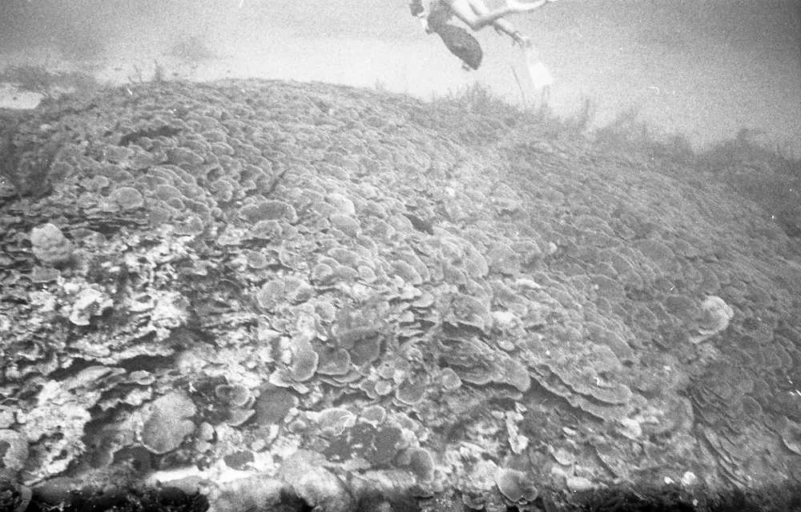{.lightbox group="discovery-bay-1966" description="**UUID: **b70b819e-e9bb-4338-95cd-a76f3becc357 **Date: **1966-01-06 **Location: **Jamaica | Discovery Bay | The Bull **Longitude: **77.38917ºW **Latitude: **18.46917ºN **Photographer: **Eileen Graham **Copyright: **Trustees of the Natural History Museum (London, UK), CC-BY-4.0" alt="**UUID: **b70b819e-e9bb-4338-95cd-a76f3becc357 **Date: **1966-01-06 **Location: **Jamaica | Discovery Bay | The Bull **Longitude: **77.38917ºW **Latitude: **18.46917ºN **Photographer: **Eileen Graham **Copyright: **Trustees of the Natural History Museum (London, UK), CC-BY-4.0"}

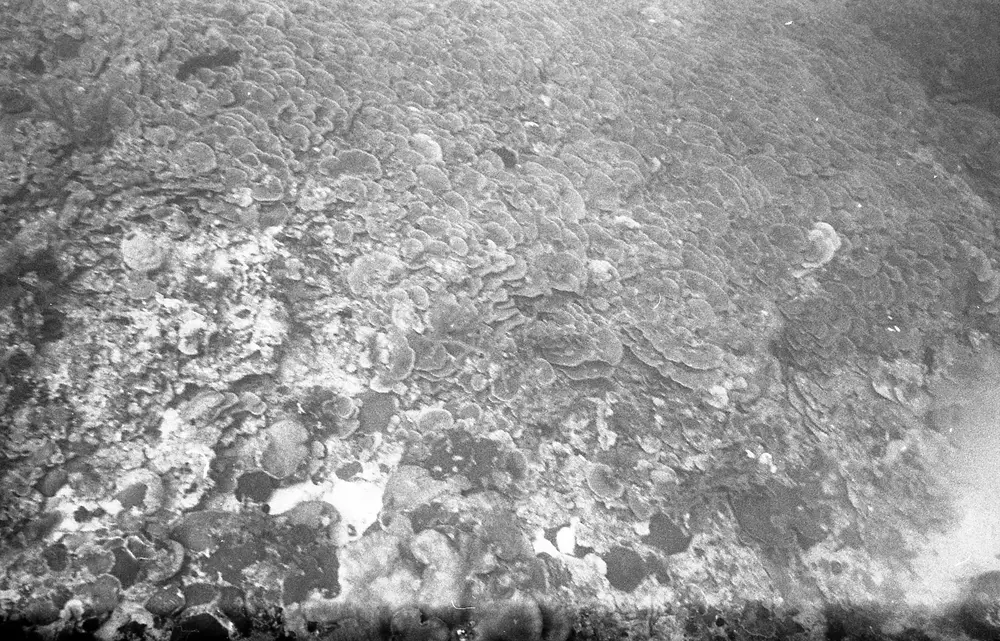{.lightbox group="discovery-bay-1966" description="**UUID: **2df33195-b9cc-4ac7-81be-3c820e8af806 **Date: **1966-01-06 **Location: **Jamaica | Discovery Bay | The Bull **Longitude: **77.38917ºW **Latitude: **18.46917ºN **Photographer: **Eileen Graham **Copyright: **Trustees of the Natural History Museum (London, UK), CC-BY-4.0" alt="**UUID: **2df33195-b9cc-4ac7-81be-3c820e8af806 **Date: **1966-01-06 **Location: **Jamaica | Discovery Bay | The Bull **Longitude: **77.38917ºW **Latitude: **18.46917ºN **Photographer: **Eileen Graham **Copyright: **Trustees of the Natural History Museum (London, UK), CC-BY-4.0"}

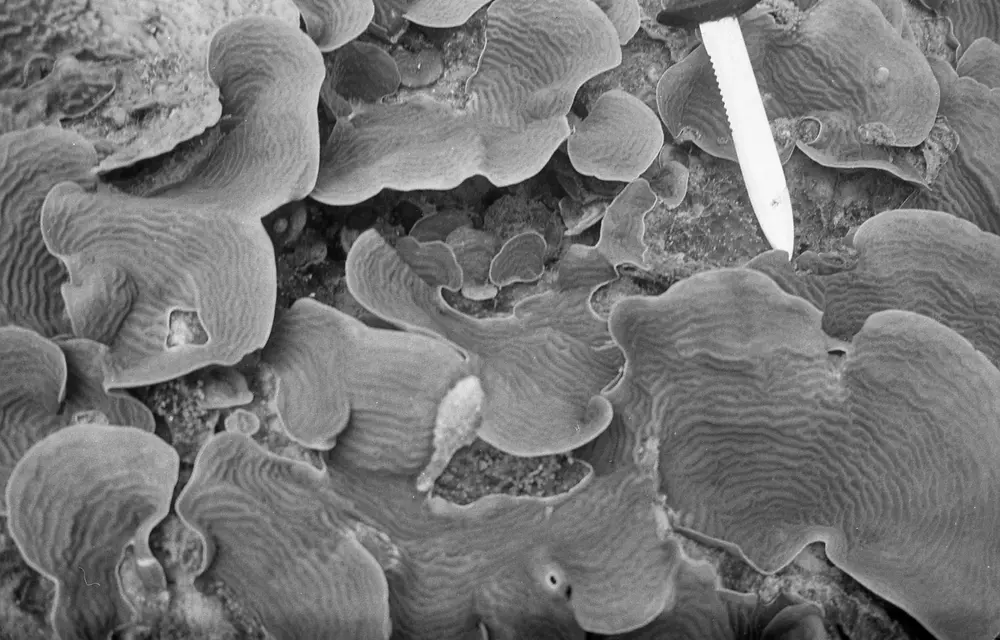{.lightbox group="discovery-bay-1966" description="**UUID: **eb63e1e3-8423-49a0-90a7-2a108f417cf8 **Date: **1966-01-06 **Location: **Jamaica | Discovery Bay | The Bull **Longitude: **77.38917ºW **Latitude: **18.46917ºN **Photographer: **Eileen Graham **Copyright: **Trustees of the Natural History Museum (London, UK), CC-BY-4.0" alt="**UUID: **eb63e1e3-8423-49a0-90a7-2a108f417cf8 **Date: **1966-01-06 **Location: **Jamaica | Discovery Bay | The Bull **Longitude: **77.38917ºW **Latitude: **18.46917ºN **Photographer: **Eileen Graham **Copyright: **Trustees of the Natural History Museum (London, UK), CC-BY-4.0"}

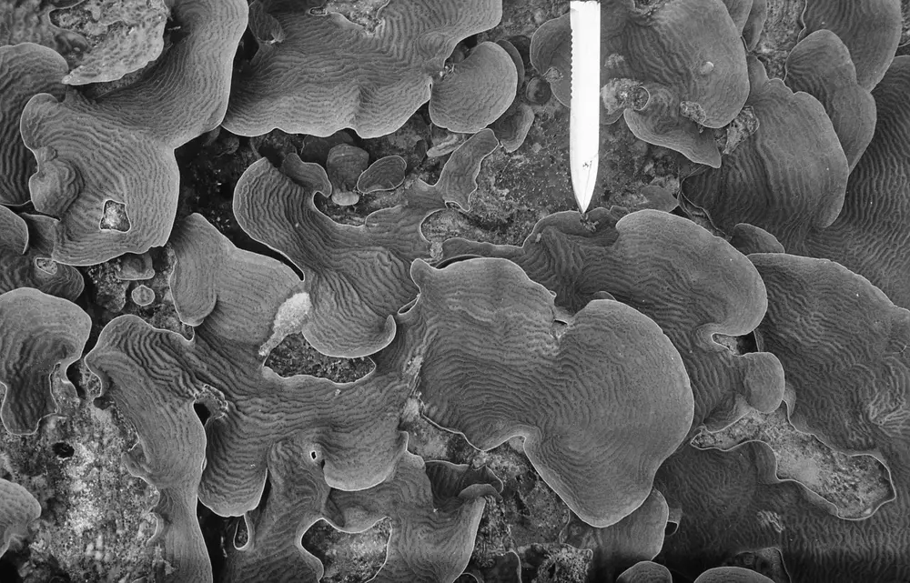{.lightbox group="discovery-bay-1966" description="**UUID: **ac04855a-3bf3-4ae8-87e8-7ef086bd48ab **Date: **1966-01-06 **Location: **Jamaica | Discovery Bay | The Bull **Longitude: **77.38917ºW **Latitude: **18.46917ºN **Photographer: **Eileen Graham **Copyright: **Trustees of the Natural History Museum (London, UK), CC-BY-4.0" alt="**UUID: **ac04855a-3bf3-4ae8-87e8-7ef086bd48ab **Date: **1966-01-06 **Location: **Jamaica | Discovery Bay | The Bull **Longitude: **77.38917ºW **Latitude: **18.46917ºN **Photographer: **Eileen Graham **Copyright: **Trustees of the Natural History Museum (London, UK), CC-BY-4.0"}

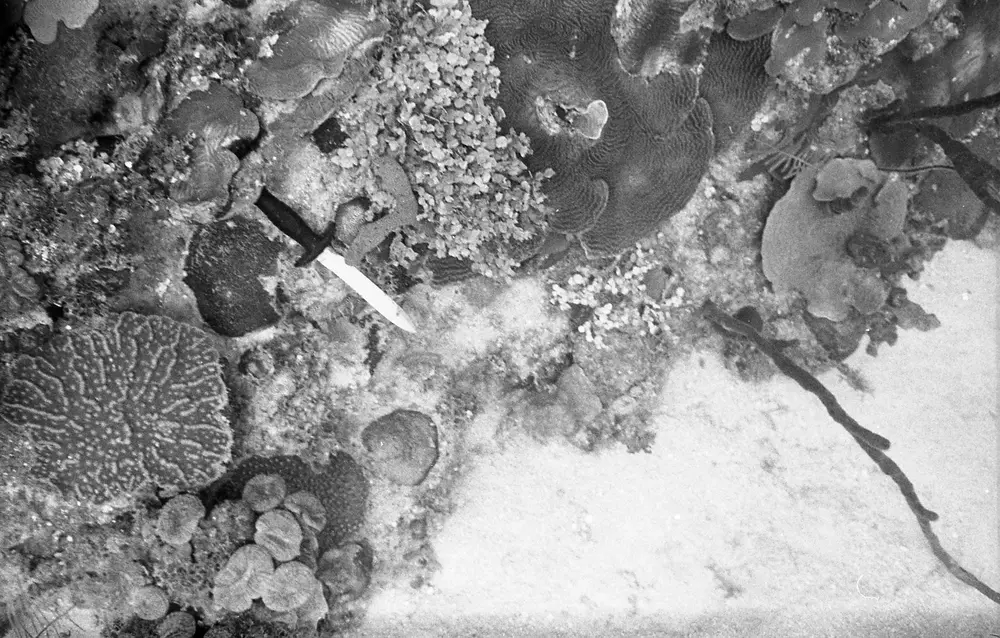{.lightbox group="discovery-bay-1966" description="**UUID: **d2e44ea7-88ea-4667-bf16-faedc231e27b **Date: **1966-01-06 **Location: **Jamaica | Discovery Bay | The Bull **Longitude: **77.38917ºW **Latitude: **18.46917ºN **Photographer: **Eileen Graham **Copyright: **Trustees of the Natural History Museum (London, UK), CC-BY-4.0" alt="**UUID: **d2e44ea7-88ea-4667-bf16-faedc231e27b **Date: **1966-01-06 **Location: **Jamaica | Discovery Bay | The Bull **Longitude: **77.38917ºW **Latitude: **18.46917ºN **Photographer: **Eileen Graham **Copyright: **Trustees of the Natural History Museum (London, UK), CC-BY-4.0"}

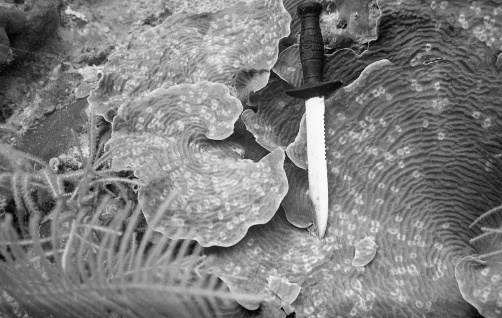{.lightbox group="discovery-bay-1966" description="**UUID: **66738654-3ea7-41fc-81a0-fefa032611ba **Date: **1966-01-06 **Location: **Jamaica | Discovery Bay | The Bull **Longitude: **77.38917ºW **Latitude: **18.46917ºN **Photographer: **Eileen Graham **Copyright: **Trustees of the Natural History Museum (London, UK), CC-BY-4.0" alt="**UUID: **66738654-3ea7-41fc-81a0-fefa032611ba **Date: **1966-01-06 **Location: **Jamaica | Discovery Bay | The Bull **Longitude: **77.38917ºW **Latitude: **18.46917ºN **Photographer: **Eileen Graham **Copyright: **Trustees of the Natural History Museum (London, UK), CC-BY-4.0"}

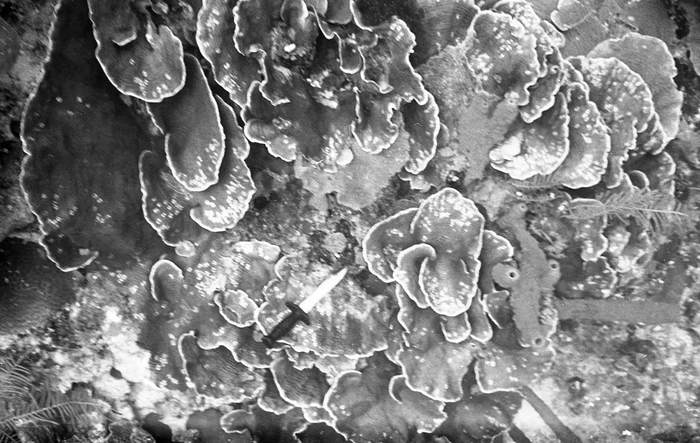{.lightbox group="discovery-bay-1966" description="**UUID: **bc614f64-b1e6-447b-8ef0-54a0a063d0a2 **Date: **1966-01-06 **Location: **Jamaica | Discovery Bay | The Bull **Longitude: **77.38917ºW **Latitude: **18.46917ºN **Photographer: **Eileen Graham **Copyright: **Trustees of the Natural History Museum (London, UK), CC-BY-4.0" alt="**UUID: **bc614f64-b1e6-447b-8ef0-54a0a063d0a2 **Date: **1966-01-06 **Location: **Jamaica | Discovery Bay | The Bull **Longitude: **77.38917ºW **Latitude: **18.46917ºN **Photographer: **Eileen Graham **Copyright: **Trustees of the Natural History Museum (London, UK), CC-BY-4.0"}

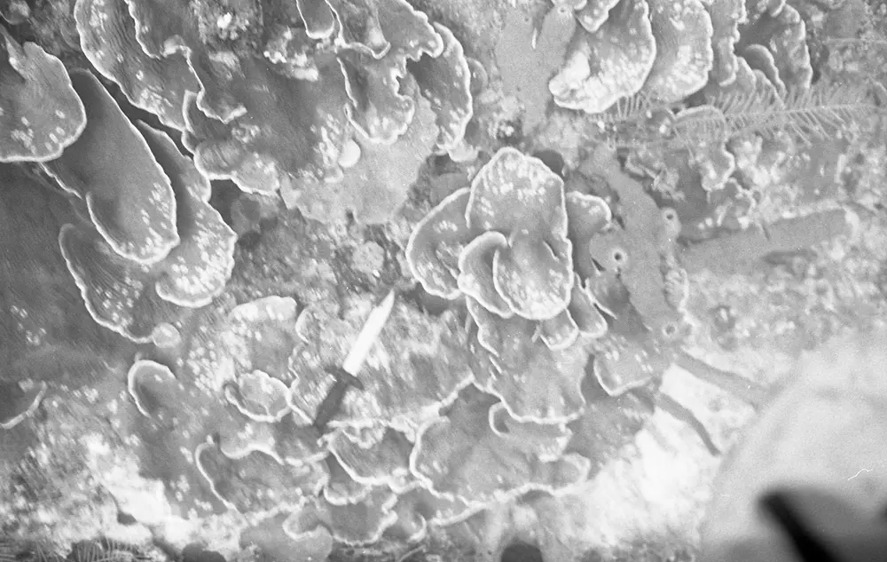{.lightbox group="discovery-bay-1966" description="**UUID: **fc2dce4f-98bb-4f87-a9b2-e0ded3edaae8 **Date: **1966-01-06 **Location: **Jamaica | Discovery Bay | The Bull **Longitude: **77.38917ºW **Latitude: **18.46917ºN **Photographer: **Eileen Graham **Copyright: **Trustees of the Natural History Museum (London, UK), CC-BY-4.0" alt="**UUID: **fc2dce4f-98bb-4f87-a9b2-e0ded3edaae8 **Date: **1966-01-06 **Location: **Jamaica | Discovery Bay | The Bull **Longitude: **77.38917ºW **Latitude: **18.46917ºN **Photographer: **Eileen Graham **Copyright: **Trustees of the Natural History Museum (London, UK), CC-BY-4.0"}

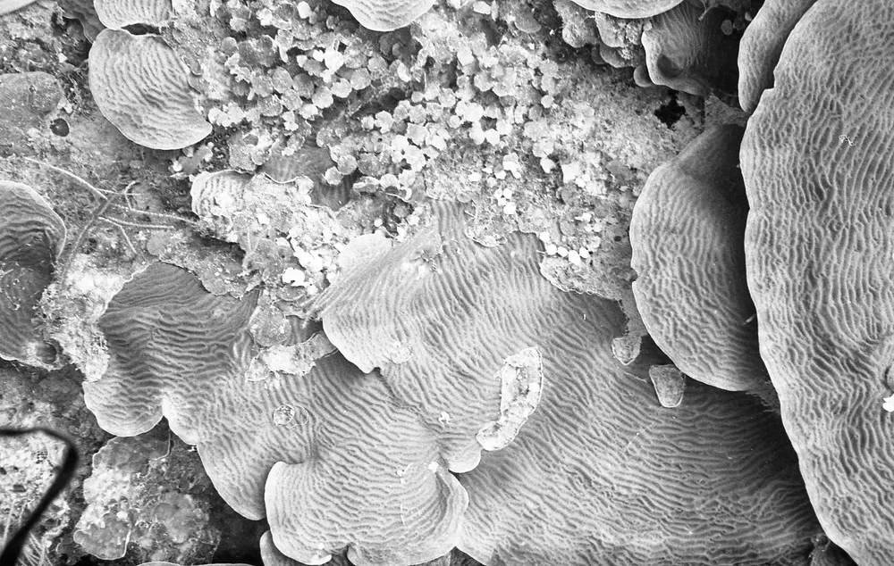{.lightbox group="discovery-bay-1966" description="**UUID: **2bc04fdb-a1f3-403f-84cb-9ccb5bd0b00d **Date: **1966-01-06 **Location: **Jamaica | Discovery Bay | The Bull **Longitude: **77.38917ºW **Latitude: **18.46917ºN **Photographer: **Eileen Graham **Copyright: **Trustees of the Natural History Museum (London, UK), CC-BY-4.0" alt="**UUID: **2bc04fdb-a1f3-403f-84cb-9ccb5bd0b00d **Date: **1966-01-06 **Location: **Jamaica | Discovery Bay | The Bull **Longitude: **77.38917ºW **Latitude: **18.46917ºN **Photographer: **Eileen Graham **Copyright: **Trustees of the Natural History Museum (London, UK), CC-BY-4.0"}

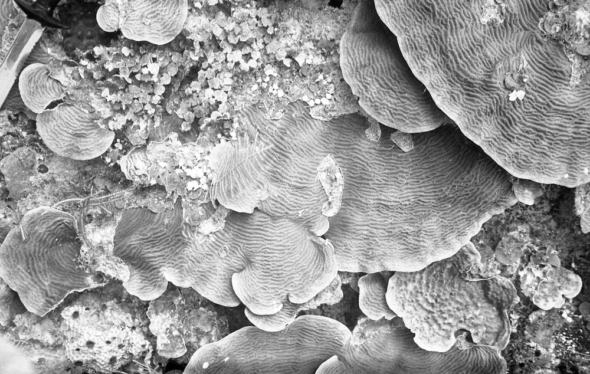{.lightbox group="discovery-bay-1966" description="**UUID: **f3645bbc-63fb-4f8b-9ef1-9c12b11d82d4 **Date: **1966-01-06 **Location: **Jamaica | Discovery Bay | The Bull **Longitude: **77.38917ºW **Latitude: **18.46917ºN **Photographer: **Eileen Graham **Copyright: **Trustees of the Natural History Museum (London, UK), CC-BY-4.0" alt="**UUID: **f3645bbc-63fb-4f8b-9ef1-9c12b11d82d4 **Date: **1966-01-06 **Location: **Jamaica | Discovery Bay | The Bull **Longitude: **77.38917ºW **Latitude: **18.46917ºN **Photographer: **Eileen Graham **Copyright: **Trustees of the Natural History Museum (London, UK), CC-BY-4.0"}

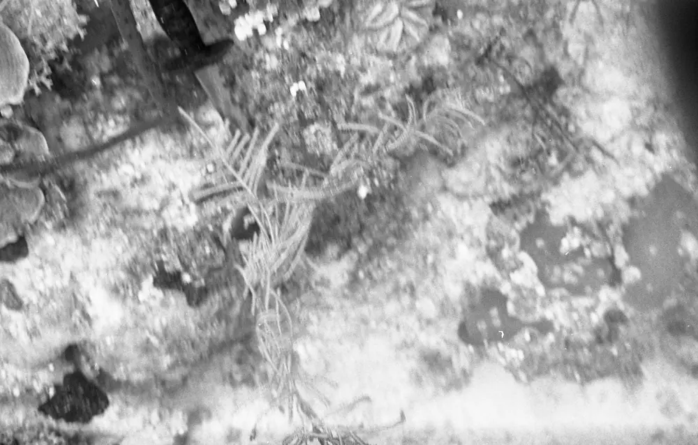{.lightbox group="discovery-bay-1966" description="**UUID: **ffd1e897-03ec-499f-96d0-c618225df890 **Date: **1966-01-06 **Location: **Jamaica | Discovery Bay | The Bull **Longitude: **77.38917ºW **Latitude: **18.46917ºN **Photographer: **Eileen Graham **Copyright: **Trustees of the Natural History Museum (London, UK), CC-BY-4.0" alt="**UUID: **ffd1e897-03ec-499f-96d0-c618225df890 **Date: **1966-01-06 **Location: **Jamaica | Discovery Bay | The Bull **Longitude: **77.38917ºW **Latitude: **18.46917ºN **Photographer: **Eileen Graham **Copyright: **Trustees of the Natural History Museum (London, UK), CC-BY-4.0"}

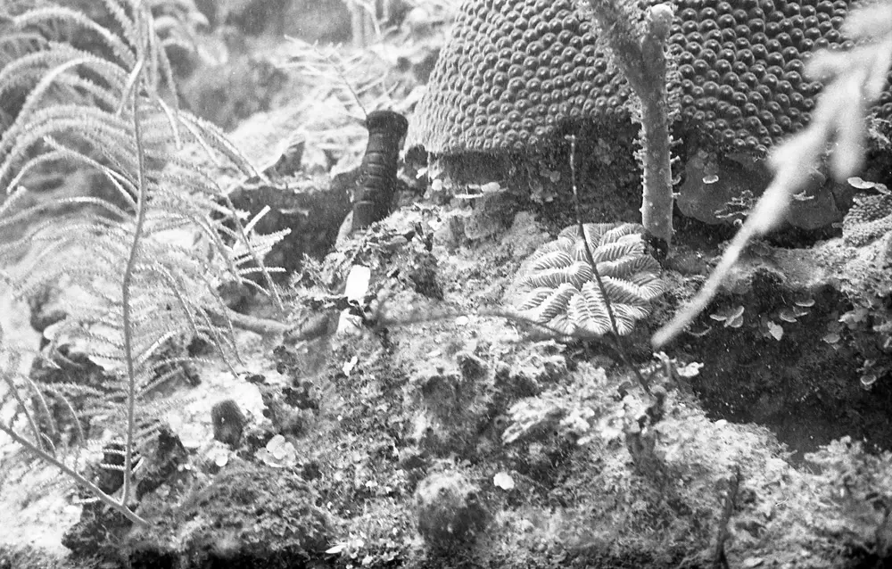{.lightbox group="discovery-bay-1966" description="**UUID: **d47262b1-70bd-49a0-912a-849896a728b7 **Date: **1966-01-06 **Location: **Jamaica | Discovery Bay | The Bull **Longitude: **77.38917ºW **Latitude: **18.46917ºN **Photographer: **Eileen Graham **Copyright: **Trustees of the Natural History Museum (London, UK), CC-BY-4.0" alt="**UUID: **d47262b1-70bd-49a0-912a-849896a728b7 **Date: **1966-01-06 **Location: **Jamaica | Discovery Bay | The Bull **Longitude: **77.38917ºW **Latitude: **18.46917ºN **Photographer: **Eileen Graham **Copyright: **Trustees of the Natural History Museum (London, UK), CC-BY-4.0"}

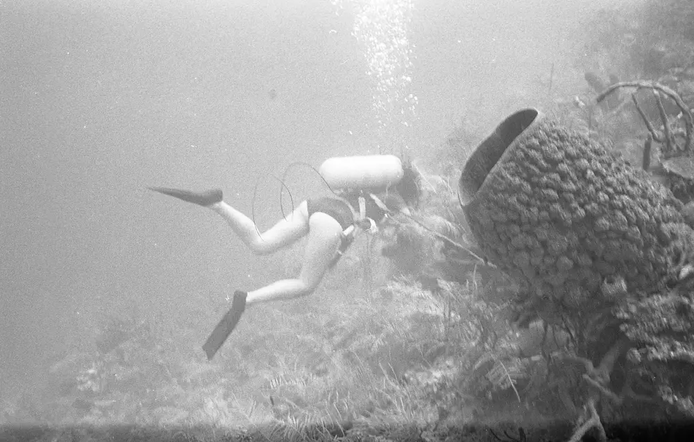{.lightbox group="discovery-bay-1966" description="**UUID: **746e0a3b-faba-4657-b677-5f4a502c3b09 **Date: **1966-01-06 **Location: **Jamaica | Discovery Bay | The Bull **Longitude: **77.38917ºW **Latitude: **18.46917ºN **Photographer: **Eileen Graham **Copyright: **Trustees of the Natural History Museum (London, UK), CC-BY-4.0" alt="**UUID: **746e0a3b-faba-4657-b677-5f4a502c3b09 **Date: **1966-01-06 **Location: **Jamaica | Discovery Bay | The Bull **Longitude: **77.38917ºW **Latitude: **18.46917ºN **Photographer: **Eileen Graham **Copyright: **Trustees of the Natural History Museum (London, UK), CC-BY-4.0"}

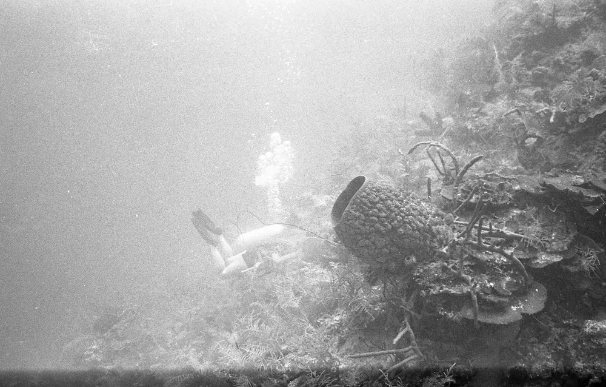{.lightbox group="discovery-bay-1966" description="**UUID: **93eb60e2-75da-4a79-b811-65a5016567b0 **Date: **1966-01-06 **Location: **Jamaica | Discovery Bay | The Bull **Longitude: **77.38917ºW **Latitude: **18.46917ºN **Photographer: **Eileen Graham **Copyright: **Trustees of the Natural History Museum (London, UK), CC-BY-4.0" alt="**UUID: **93eb60e2-75da-4a79-b811-65a5016567b0 **Date: **1966-01-06 **Location: **Jamaica | Discovery Bay | The Bull **Longitude: **77.38917ºW **Latitude: **18.46917ºN **Photographer: **Eileen Graham **Copyright: **Trustees of the Natural History Museum (London, UK), CC-BY-4.0"}

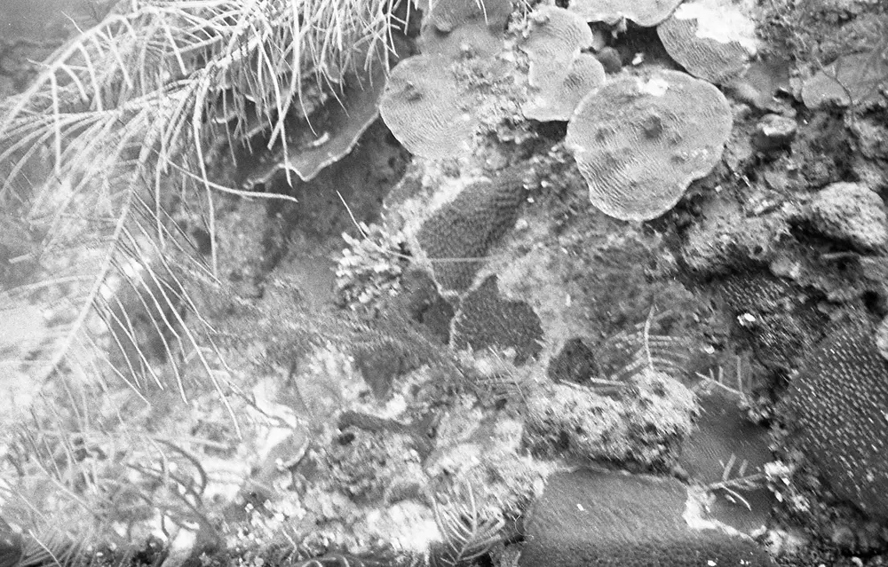{.lightbox group="discovery-bay-1966" description="**UUID: **581a11ba-38c7-4d26-95d3-cefd34739400 **Date: **1966-01-06 **Location: **Jamaica | Discovery Bay | The Bull **Longitude: **77.38917ºW **Latitude: **18.46917ºN **Photographer: **Eileen Graham **Copyright: **Trustees of the Natural History Museum (London, UK), CC-BY-4.0" alt="**UUID: **581a11ba-38c7-4d26-95d3-cefd34739400 **Date: **1966-01-06 **Location: **Jamaica | Discovery Bay | The Bull **Longitude: **77.38917ºW **Latitude: **18.46917ºN **Photographer: **Eileen Graham **Copyright: **Trustees of the Natural History Museum (London, UK), CC-BY-4.0"}

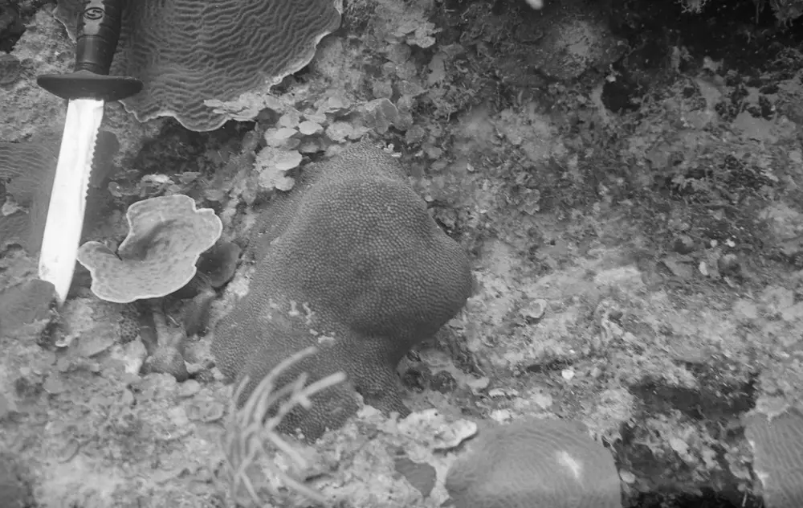{.lightbox group="discovery-bay-1966" description="**UUID: **33b04aac-c418-4f85-aca9-fbd3b70d7cdd **Date: **1966-01-06 **Location: **Jamaica | Discovery Bay | The Bull **Longitude: **77.38917ºW **Latitude: **18.46917ºN **Photographer: **Eileen Graham **Copyright: **Trustees of the Natural History Museum (London, UK), CC-BY-4.0" alt="**UUID: **33b04aac-c418-4f85-aca9-fbd3b70d7cdd **Date: **1966-01-06 **Location: **Jamaica | Discovery Bay | The Bull **Longitude: **77.38917ºW **Latitude: **18.46917ºN **Photographer: **Eileen Graham **Copyright: **Trustees of the Natural History Museum (London, UK), CC-BY-4.0"}

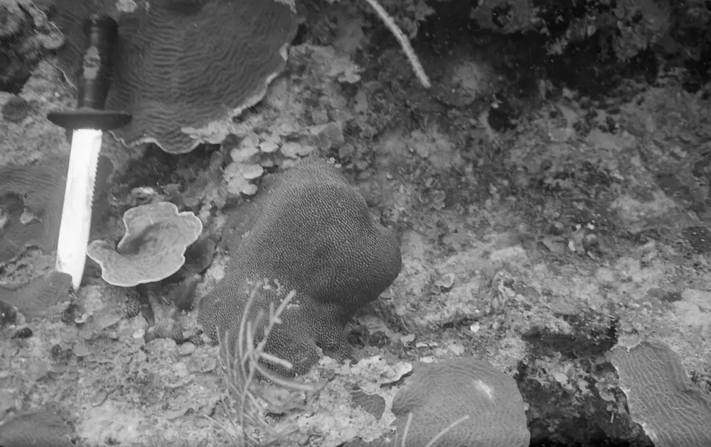{.lightbox group="discovery-bay-1966" description="**UUID: **449bec5a-cb14-43d7-bd54-044f2a210863 **Date: **1966-01-06 **Location: **Jamaica | Discovery Bay | The Bull **Longitude: **77.38917ºW **Latitude: **18.46917ºN **Photographer: **Eileen Graham **Copyright: **Trustees of the Natural History Museum (London, UK), CC-BY-4.0" alt="**UUID: **449bec5a-cb14-43d7-bd54-044f2a210863 **Date: **1966-01-06 **Location: **Jamaica | Discovery Bay | The Bull **Longitude: **77.38917ºW **Latitude: **18.46917ºN **Photographer: **Eileen Graham **Copyright: **Trustees of the Natural History Museum (London, UK), CC-BY-4.0"}

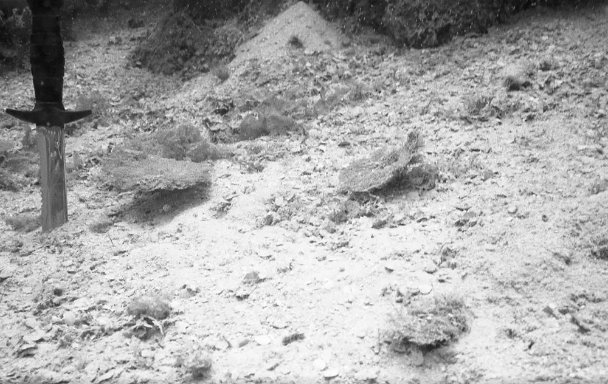{.lightbox group="discovery-bay-1966" description="**UUID: **6ad9f994-612d-40fa-b3b5-bff2d505f2bf **Date: **1966-01-06 **Location: **Jamaica | Discovery Bay | The Bull **Longitude: **77.38917ºW **Latitude: **18.46917ºN **Photographer: **Eileen Graham **Copyright: **Trustees of the Natural History Museum (London, UK), CC-BY-4.0" alt="**UUID: **6ad9f994-612d-40fa-b3b5-bff2d505f2bf **Date: **1966-01-06 **Location: **Jamaica | Discovery Bay | The Bull **Longitude: **77.38917ºW **Latitude: **18.46917ºN **Photographer: **Eileen Graham **Copyright: **Trustees of the Natural History Museum (London, UK), CC-BY-4.0"}

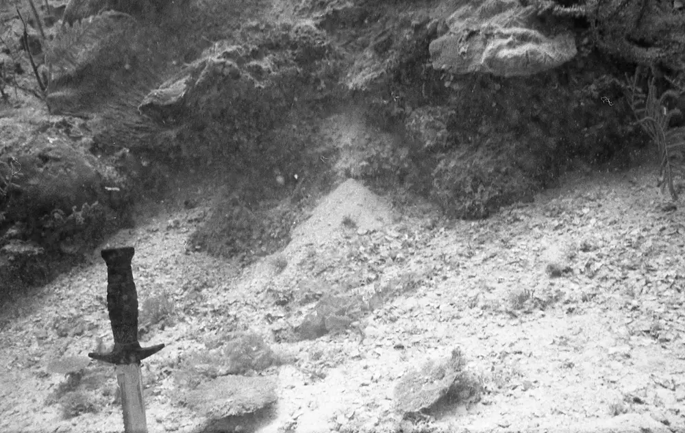{.lightbox group="discovery-bay-1966" description="**UUID: **fb8329c6-aa99-4b1a-ac73-c8316068a1c1 **Date: **1966-01-06 **Location: **Jamaica | Discovery Bay | The Bull **Longitude: **77.38917ºW **Latitude: **18.46917ºN **Photographer: **Eileen Graham **Copyright: **Trustees of the Natural History Museum (London, UK), CC-BY-4.0" alt="**UUID: **fb8329c6-aa99-4b1a-ac73-c8316068a1c1 **Date: **1966-01-06 **Location: **Jamaica | Discovery Bay | The Bull **Longitude: **77.38917ºW **Latitude: **18.46917ºN **Photographer: **Eileen Graham **Copyright: **Trustees of the Natural History Museum (London, UK), CC-BY-4.0"}

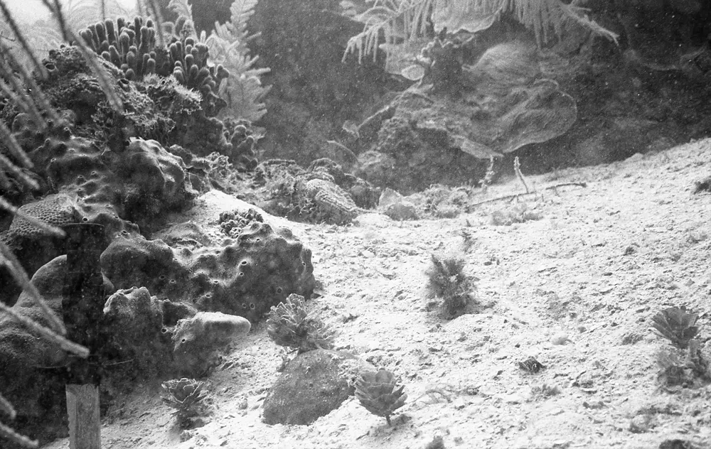{.lightbox group="discovery-bay-1966" description="**UUID: **5c88ea21-f1e1-47c0-bcc7-d87ee061f683 **Date: **1966-01-06 **Location: **Jamaica | Discovery Bay | The Bull **Longitude: **77.38917ºW **Latitude: **18.46917ºN **Photographer: **Eileen Graham **Copyright: **Trustees of the Natural History Museum (London, UK), CC-BY-4.0" alt="**UUID: **5c88ea21-f1e1-47c0-bcc7-d87ee061f683 **Date: **1966-01-06 **Location: **Jamaica | Discovery Bay | The Bull **Longitude: **77.38917ºW **Latitude: **18.46917ºN **Photographer: **Eileen Graham **Copyright: **Trustees of the Natural History Museum (London, UK), CC-BY-4.0"}

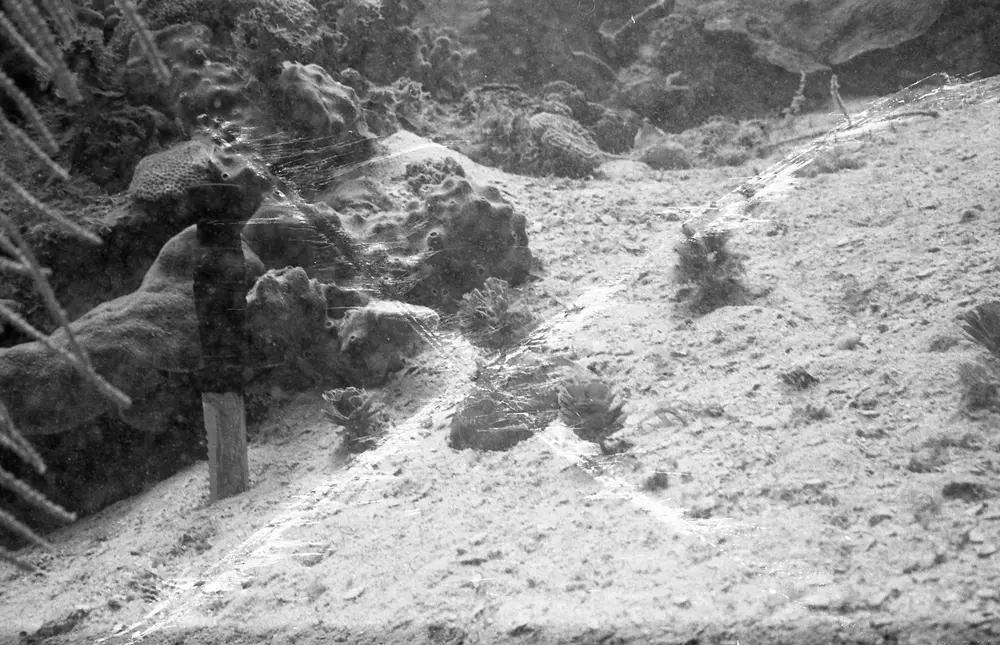{.lightbox group="discovery-bay-1966" description="**UUID: **ccdaa3a2-299f-42cc-a708-1a7b483a7a76 **Date: **1966-01-06 **Location: **Jamaica | Discovery Bay | The Bull **Longitude: **77.38917ºW **Latitude: **18.46917ºN **Photographer: **Eileen Graham **Copyright: **Trustees of the Natural History Museum (London, UK), CC-BY-4.0" alt="**UUID: **ccdaa3a2-299f-42cc-a708-1a7b483a7a76 **Date: **1966-01-06 **Location: **Jamaica | Discovery Bay | The Bull **Longitude: **77.38917ºW **Latitude: **18.46917ºN **Photographer: **Eileen Graham **Copyright: **Trustees of the Natural History Museum (London, UK), CC-BY-4.0"}

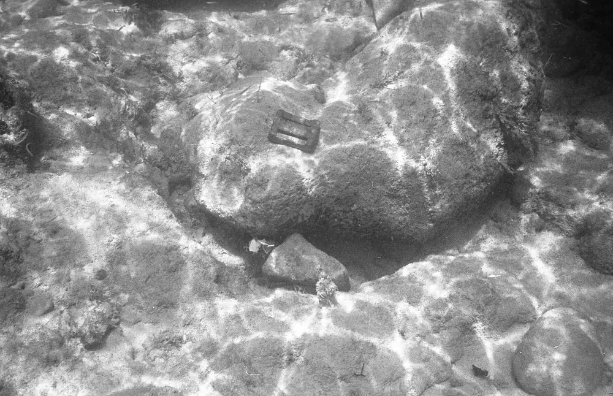{.lightbox group="discovery-bay-1966" description="**UUID: **df80603d-a22d-47fa-8525-074e3f3452ad **Date: **1966-01-06 **Location: **Jamaica | Discovery Bay | The Bull **Longitude: **77.38917ºW **Latitude: **18.46917ºN **Photographer: **Eileen Graham **Copyright: **Trustees of the Natural History Museum (London, UK), CC-BY-4.0" alt="**UUID: **df80603d-a22d-47fa-8525-074e3f3452ad **Date: **1966-01-06 **Location: **Jamaica | Discovery Bay | The Bull **Longitude: **77.38917ºW **Latitude: **18.46917ºN **Photographer: **Eileen Graham **Copyright: **Trustees of the Natural History Museum (London, UK), CC-BY-4.0"}

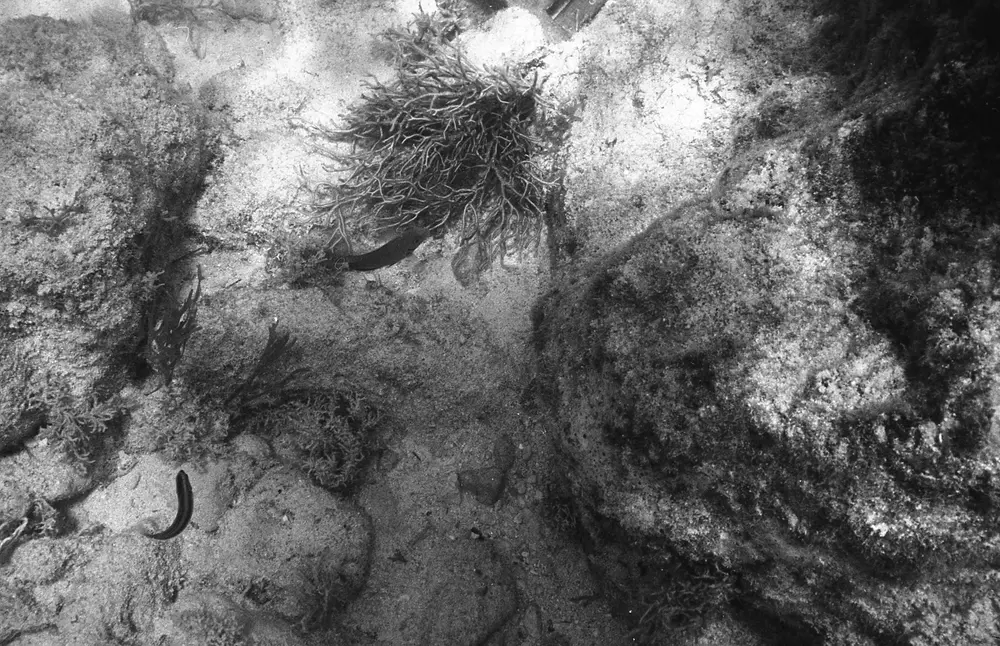{.lightbox group="discovery-bay-1966" description="**UUID: **38559a18-d22e-4537-8fd2-ae4f44840e77 **Date: **1966-01-06 **Location: **Jamaica | Discovery Bay | The Bull **Longitude: **77.38917ºW **Latitude: **18.46917ºN **Photographer: **Eileen Graham **Copyright: **Trustees of the Natural History Museum (London, UK), CC-BY-4.0" alt="**UUID: **38559a18-d22e-4537-8fd2-ae4f44840e77 **Date: **1966-01-06 **Location: **Jamaica | Discovery Bay | The Bull **Longitude: **77.38917ºW **Latitude: **18.46917ºN **Photographer: **Eileen Graham **Copyright: **Trustees of the Natural History Museum (London, UK), CC-BY-4.0"}

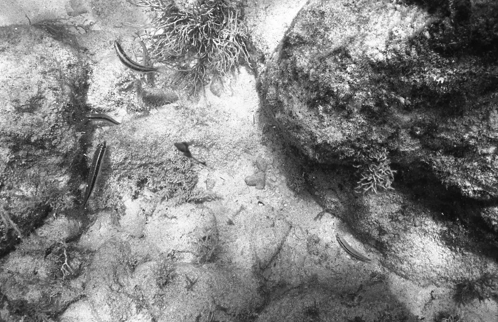{.lightbox group="discovery-bay-1966" description="**UUID: **c2d7bfff-d757-44e5-8b72-4637289eb3f9 **Date: **1966-01-06 **Location: **Jamaica | Discovery Bay | The Bull **Longitude: **77.38917ºW **Latitude: **18.46917ºN **Photographer: **Eileen Graham **Copyright: **Trustees of the Natural History Museum (London, UK), CC-BY-4.0" alt="**UUID: **c2d7bfff-d757-44e5-8b72-4637289eb3f9 **Date: **1966-01-06 **Location: **Jamaica | Discovery Bay | The Bull **Longitude: **77.38917ºW **Latitude: **18.46917ºN **Photographer: **Eileen Graham **Copyright: **Trustees of the Natural History Museum (London, UK), CC-BY-4.0"}

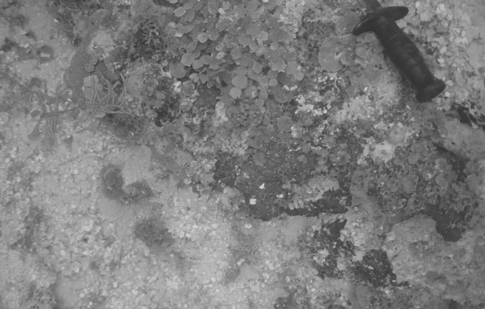{.lightbox group="discovery-bay-1966" description="**UUID: **a9a566c7-d828-4d81-9314-a8c98d4e4c84 **Date: **1966-06-07 **Location: **Jamaica | Discovery Bay | The Bull **Longitude: **77.38917ºW **Latitude: **18.46917ºN **Photographer: **Eileen Graham **Copyright: **Trustees of the Natural History Museum (London, UK), CC-BY-4.0" alt="**UUID: **a9a566c7-d828-4d81-9314-a8c98d4e4c84 **Date: **1966-06-07 **Location: **Jamaica | Discovery Bay | The Bull **Longitude: **77.38917ºW **Latitude: **18.46917ºN **Photographer: **Eileen Graham **Copyright: **Trustees of the Natural History Museum (London, UK), CC-BY-4.0"}

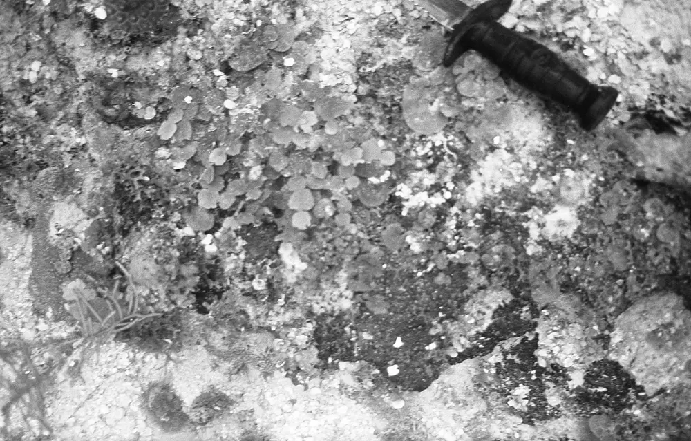{.lightbox group="discovery-bay-1966" description="**UUID: **72f22602-5cbd-4b8a-b8d9-a97786939d40 **Date: **1966-06-07 **Location: **Jamaica | Discovery Bay | The Bull **Longitude: **77.38917ºW **Latitude: **18.46917ºN **Photographer: **Eileen Graham **Copyright: **Trustees of the Natural History Museum (London, UK), CC-BY-4.0" alt="**UUID: **72f22602-5cbd-4b8a-b8d9-a97786939d40 **Date: **1966-06-07 **Location: **Jamaica | Discovery Bay | The Bull **Longitude: **77.38917ºW **Latitude: **18.46917ºN **Photographer: **Eileen Graham **Copyright: **Trustees of the Natural History Museum (London, UK), CC-BY-4.0"}

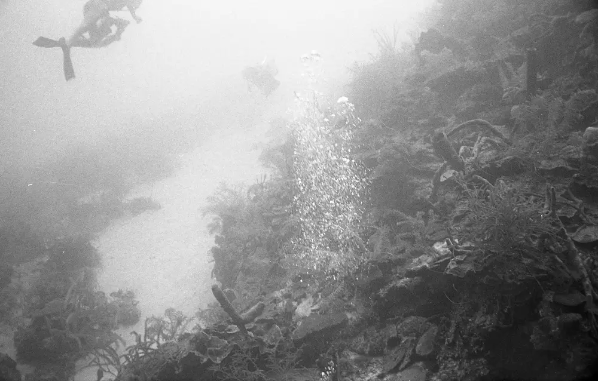{.lightbox group="discovery-bay-1966" description="**UUID: **3c780e26-3a65-43a6-9ea6-0eb9a725cf7c **Date: **1966-06-07 **Location: **Jamaica | Discovery Bay | The Bull **Longitude: **77.38917ºW **Latitude: **18.46917ºN **Photographer: **Eileen Graham **Copyright: **Trustees of the Natural History Museum (London, UK), CC-BY-4.0" alt="**UUID: **3c780e26-3a65-43a6-9ea6-0eb9a725cf7c **Date: **1966-06-07 **Location: **Jamaica | Discovery Bay | The Bull **Longitude: **77.38917ºW **Latitude: **18.46917ºN **Photographer: **Eileen Graham **Copyright: **Trustees of the Natural History Museum (London, UK), CC-BY-4.0"}

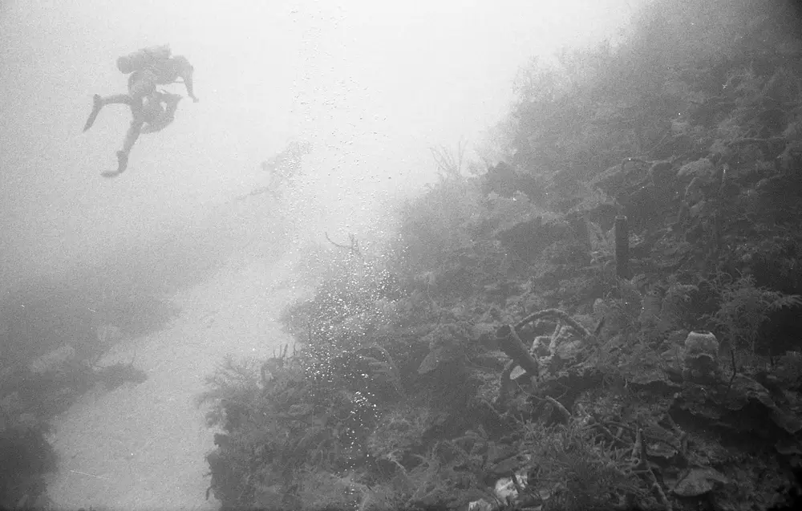{.lightbox group="discovery-bay-1966" description="**UUID: **bb8aa8cf-bab9-4540-bb6e-1377eeac6e4b **Date: **1966-06-07 **Location: **Jamaica | Discovery Bay | The Bull **Longitude: **77.38917ºW **Latitude: **18.46917ºN **Photographer: **Eileen Graham **Copyright: **Trustees of the Natural History Museum (London, UK), CC-BY-4.0" alt="**UUID: **bb8aa8cf-bab9-4540-bb6e-1377eeac6e4b **Date: **1966-06-07 **Location: **Jamaica | Discovery Bay | The Bull **Longitude: **77.38917ºW **Latitude: **18.46917ºN **Photographer: **Eileen Graham **Copyright: **Trustees of the Natural History Museum (London, UK), CC-BY-4.0"}

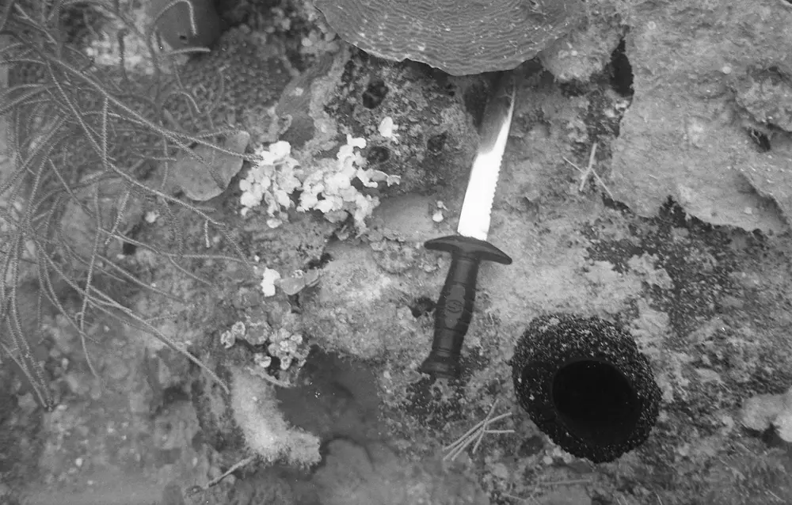{.lightbox group="discovery-bay-1966" description="**UUID: **8c8be037-4135-43ef-8676-f384f76abf8c **Date: **1966-06-07 **Location: **Jamaica | Discovery Bay | The Bull **Longitude: **77.38917ºW **Latitude: **18.46917ºN **Photographer: **Eileen Graham **Copyright: **Trustees of the Natural History Museum (London, UK), CC-BY-4.0" alt="**UUID: **8c8be037-4135-43ef-8676-f384f76abf8c **Date: **1966-06-07 **Location: **Jamaica | Discovery Bay | The Bull **Longitude: **77.38917ºW **Latitude: **18.46917ºN **Photographer: **Eileen Graham **Copyright: **Trustees of the Natural History Museum (London, UK), CC-BY-4.0"}

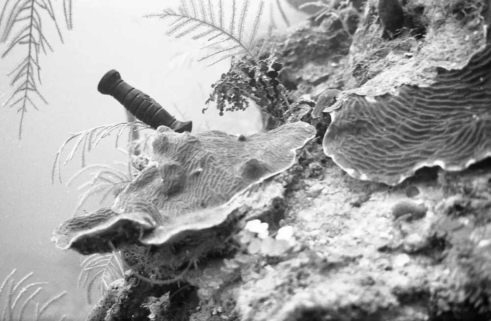{.lightbox group="discovery-bay-1966" description="**UUID: **0b26e3ca-c419-41c4-881a-ce31e323b0a4 **Date: **1966-06-07 **Location: **Jamaica | Discovery Bay | The Bull **Longitude: **77.38917ºW **Latitude: **18.46917ºN **Photographer: **Eileen Graham **Copyright: **Trustees of the Natural History Museum (London, UK), CC-BY-4.0" alt="**UUID: **0b26e3ca-c419-41c4-881a-ce31e323b0a4 **Date: **1966-06-07 **Location: **Jamaica | Discovery Bay | The Bull **Longitude: **77.38917ºW **Latitude: **18.46917ºN **Photographer: **Eileen Graham **Copyright: **Trustees of the Natural History Museum (London, UK), CC-BY-4.0"}

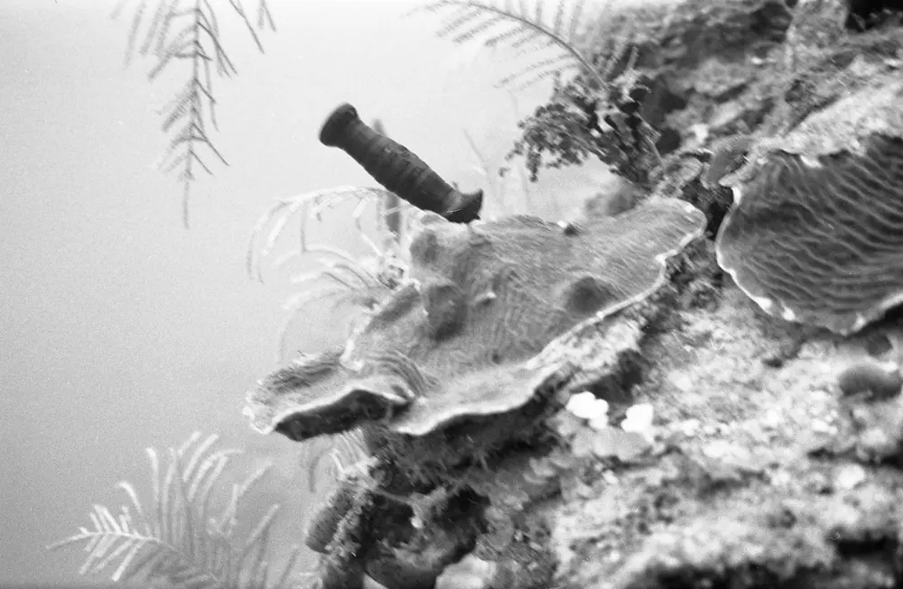{.lightbox group="discovery-bay-1966" description="**UUID: **ba407029-fb3c-41e0-82db-ae15d4fc639d **Date: **1966-06-07 **Location: **Jamaica | Discovery Bay | The Bull **Longitude: **77.38917ºW **Latitude: **18.46917ºN **Photographer: **Eileen Graham **Copyright: **Trustees of the Natural History Museum (London, UK), CC-BY-4.0" alt="**UUID: **ba407029-fb3c-41e0-82db-ae15d4fc639d **Date: **1966-06-07 **Location: **Jamaica | Discovery Bay | The Bull **Longitude: **77.38917ºW **Latitude: **18.46917ºN **Photographer: **Eileen Graham **Copyright: **Trustees of the Natural History Museum (London, UK), CC-BY-4.0"}

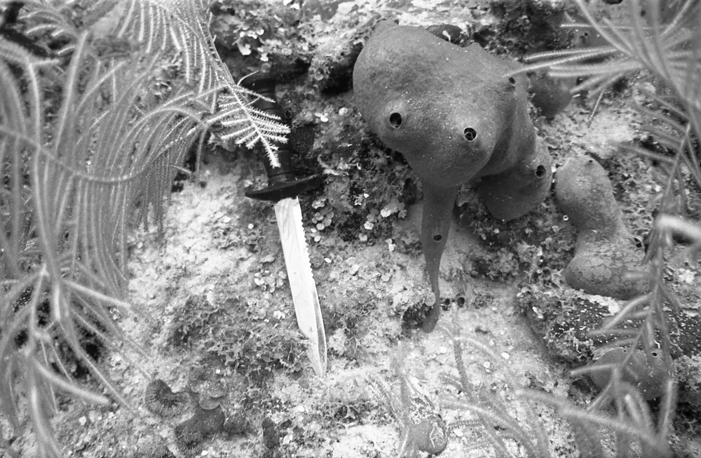{.lightbox group="discovery-bay-1966" description="**UUID: **8905cf21-5fc4-497e-855a-42e6353bbc85 **Date: **1966-06-07 **Location: **Jamaica | Discovery Bay | The Bull **Longitude: **77.38917ºW **Latitude: **18.46917ºN **Photographer: **Eileen Graham **Copyright: **Trustees of the Natural History Museum (London, UK), CC-BY-4.0" alt="**UUID: **8905cf21-5fc4-497e-855a-42e6353bbc85 **Date: **1966-06-07 **Location: **Jamaica | Discovery Bay | The Bull **Longitude: **77.38917ºW **Latitude: **18.46917ºN **Photographer: **Eileen Graham **Copyright: **Trustees of the Natural History Museum (London, UK), CC-BY-4.0"}

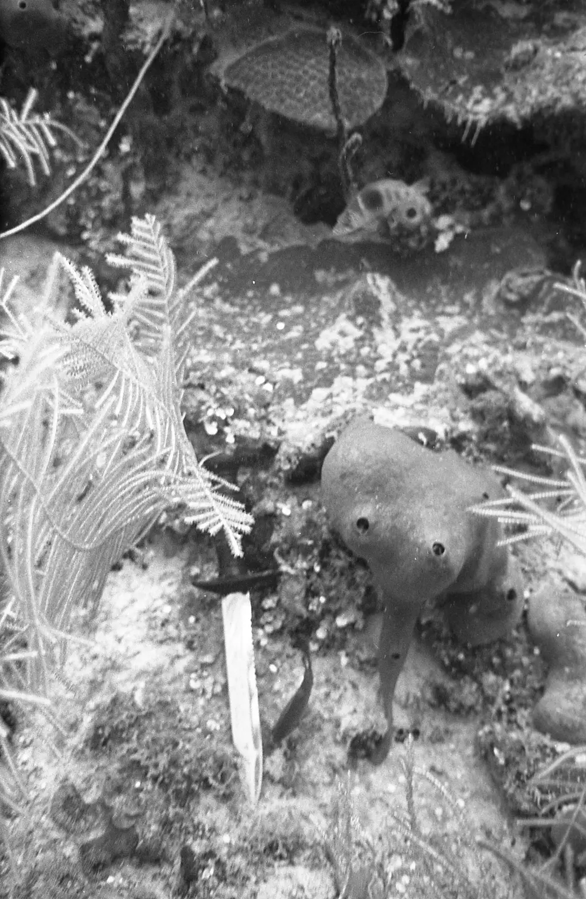{.lightbox group="discovery-bay-1966" description="**UUID: **5989e1fa-aab2-43e0-91cd-9ec140c6ade3 **Date: **1966-06-07 **Location: **Jamaica | Discovery Bay | The Bull **Longitude: **77.38917ºW **Latitude: **18.46917ºN **Photographer: **Eileen Graham **Copyright: **Trustees of the Natural History Museum (London, UK), CC-BY-4.0" alt="**UUID: **5989e1fa-aab2-43e0-91cd-9ec140c6ade3 **Date: **1966-06-07 **Location: **Jamaica | Discovery Bay | The Bull **Longitude: **77.38917ºW **Latitude: **18.46917ºN **Photographer: **Eileen Graham **Copyright: **Trustees of the Natural History Museum (London, UK), CC-BY-4.0"}

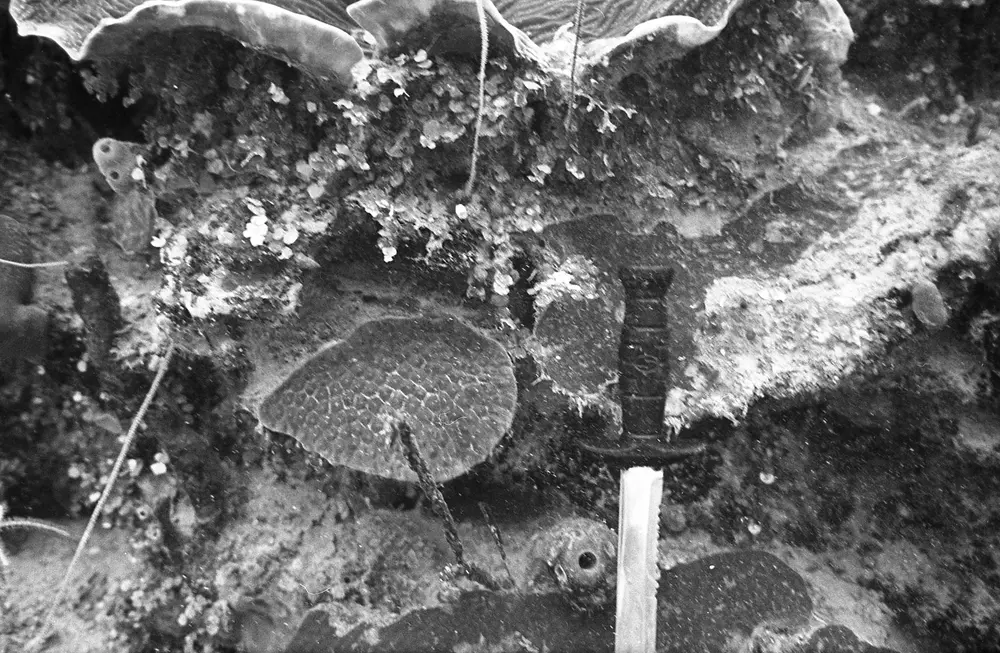{.lightbox group="discovery-bay-1966" description="**UUID: **92635cbc-606e-47df-981f-f4e9f368bb39 **Date: **1966-06-07 **Location: **Jamaica | Discovery Bay | The Bull **Longitude: **77.38917ºW **Latitude: **18.46917ºN **Photographer: **Eileen Graham **Copyright: **Trustees of the Natural History Museum (London, UK), CC-BY-4.0" alt="**UUID: **92635cbc-606e-47df-981f-f4e9f368bb39 **Date: **1966-06-07 **Location: **Jamaica | Discovery Bay | The Bull **Longitude: **77.38917ºW **Latitude: **18.46917ºN **Photographer: **Eileen Graham **Copyright: **Trustees of the Natural History Museum (London, UK), CC-BY-4.0"}

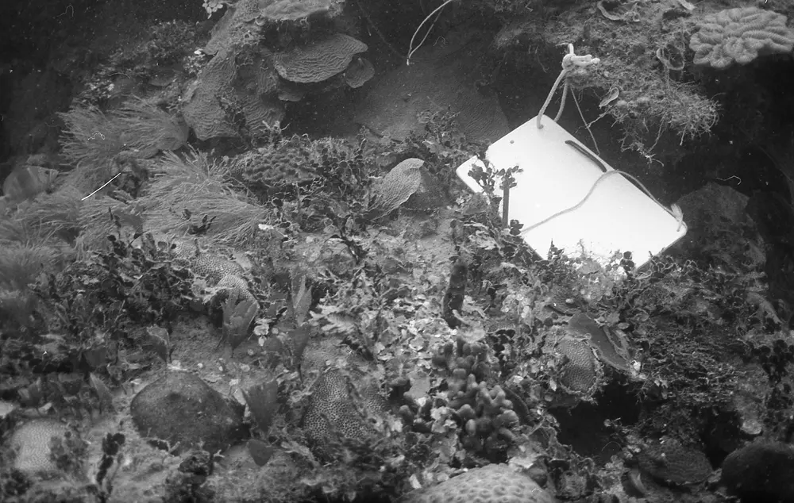{.lightbox group="discovery-bay-1966" description="**UUID: **84164e3e-a6b9-454f-842f-2f02a320e9e6 **Date: **1966-08-28 **Location: **Jamaica | Discovery Bay | Eaton Hall **Longitude: **77.334ºW **Latitude: **18.467ºN **Photographer: **Eileen Graham **Copyright: **Trustees of the Natural History Museum (London, UK), CC-BY-4.0" alt="**UUID: **84164e3e-a6b9-454f-842f-2f02a320e9e6 **Date: **1966-08-28 **Location: **Jamaica | Discovery Bay | Eaton Hall **Longitude: **77.334ºW **Latitude: **18.467ºN **Photographer: **Eileen Graham **Copyright: **Trustees of the Natural History Museum (London, UK), CC-BY-4.0"}

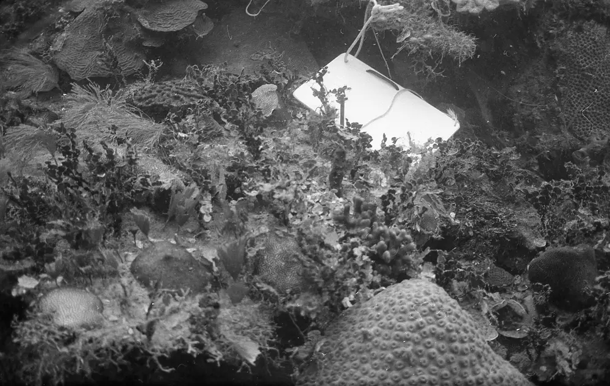{.lightbox group="discovery-bay-1966" description="**UUID: **f34f192c-90f8-4a7e-b967-8280ed219e1e **Date: **1966-08-28 **Location: **Jamaica | Discovery Bay | Eaton Hall **Longitude: **77.334ºW **Latitude: **18.467ºN **Photographer: **Eileen Graham **Copyright: **Trustees of the Natural History Museum (London, UK), CC-BY-4.0" alt="**UUID: **f34f192c-90f8-4a7e-b967-8280ed219e1e **Date: **1966-08-28 **Location: **Jamaica | Discovery Bay | Eaton Hall **Longitude: **77.334ºW **Latitude: **18.467ºN **Photographer: **Eileen Graham **Copyright: **Trustees of the Natural History Museum (London, UK), CC-BY-4.0"}

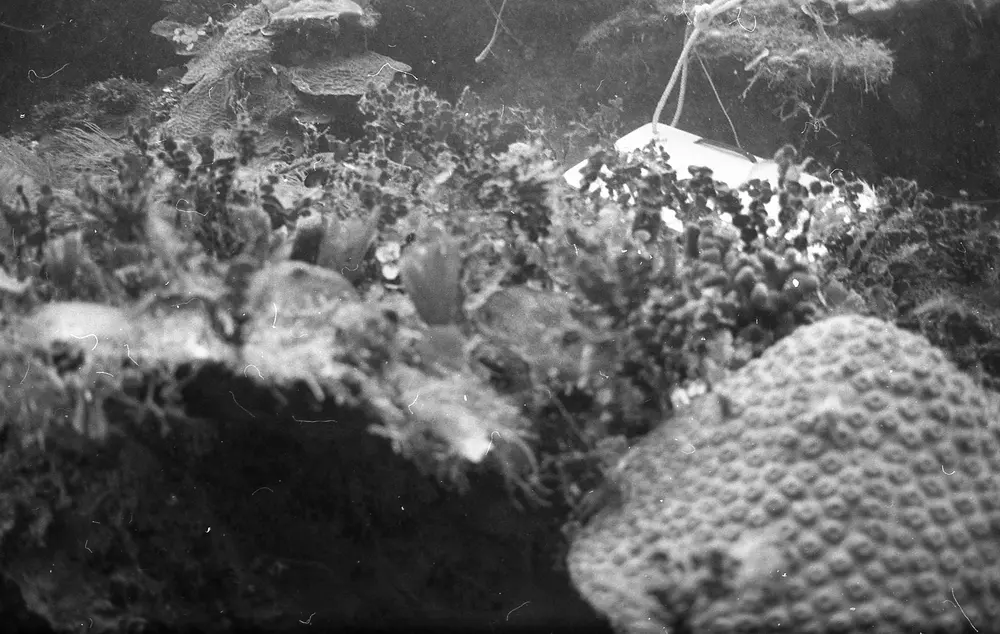{.lightbox group="discovery-bay-1966" description="**UUID: **042ed5e0-ea96-4248-830f-056b8f4ecaf9 **Date: **1966-08-28 **Location: **Jamaica | Discovery Bay | Eaton Hall **Longitude: **77.334ºW **Latitude: **18.467ºN **Photographer: **Eileen Graham **Copyright: **Trustees of the Natural History Museum (London, UK), CC-BY-4.0" alt="**UUID: **042ed5e0-ea96-4248-830f-056b8f4ecaf9 **Date: **1966-08-28 **Location: **Jamaica | Discovery Bay | Eaton Hall **Longitude: **77.334ºW **Latitude: **18.467ºN **Photographer: **Eileen Graham **Copyright: **Trustees of the Natural History Museum (London, UK), CC-BY-4.0"}

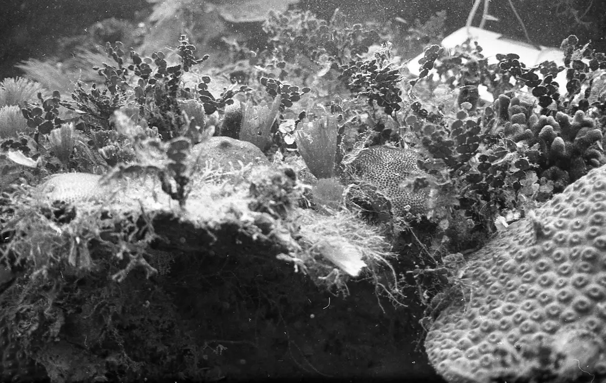{.lightbox group="discovery-bay-1966" description="**UUID: **1ffc94f3-eddd-4cfc-9545-4ccc81f39fea **Date: **1966-08-28 **Location: **Jamaica | Discovery Bay | Eaton Hall **Longitude: **77.334ºW **Latitude: **18.467ºN **Photographer: **Eileen Graham **Copyright: **Trustees of the Natural History Museum (London, UK), CC-BY-4.0" alt="**UUID: **1ffc94f3-eddd-4cfc-9545-4ccc81f39fea **Date: **1966-08-28 **Location: **Jamaica | Discovery Bay | Eaton Hall **Longitude: **77.334ºW **Latitude: **18.467ºN **Photographer: **Eileen Graham **Copyright: **Trustees of the Natural History Museum (London, UK), CC-BY-4.0"}

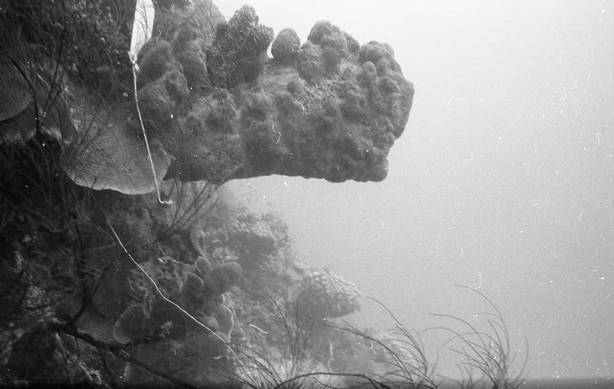{.lightbox group="discovery-bay-1966" description="**UUID: **2864a163-8d1a-4805-b534-638c5bc6201d **Date: **1966-08-28 **Location: **Jamaica | Discovery Bay | Eaton Hall **Longitude: **77.334ºW **Latitude: **18.467ºN **Photographer: **Eileen Graham **Copyright: **Trustees of the Natural History Museum (London, UK), CC-BY-4.0" alt="**UUID: **2864a163-8d1a-4805-b534-638c5bc6201d **Date: **1966-08-28 **Location: **Jamaica | Discovery Bay | Eaton Hall **Longitude: **77.334ºW **Latitude: **18.467ºN **Photographer: **Eileen Graham **Copyright: **Trustees of the Natural History Museum (London, UK), CC-BY-4.0"}

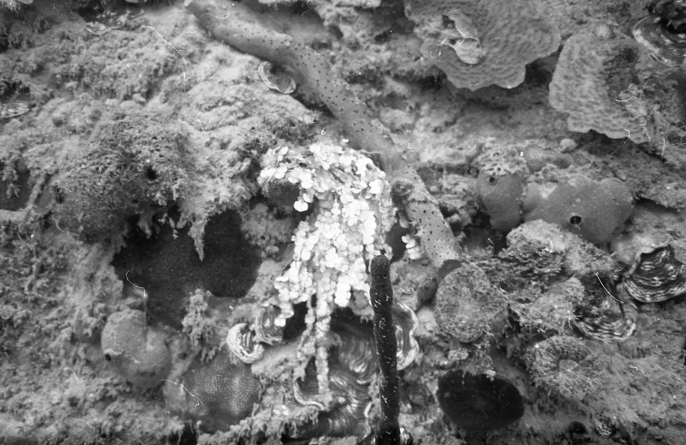{.lightbox group="discovery-bay-1966" description="**UUID: **d487159c-5cae-46e6-9322-1b4e1b9f8cc8 **Date: **1966-08-28 **Location: **Jamaica | Discovery Bay | Eaton Hall **Longitude: **77.334ºW **Latitude: **18.467ºN **Photographer: **Eileen Graham **Copyright: **Trustees of the Natural History Museum (London, UK), CC-BY-4.0" alt="**UUID: **d487159c-5cae-46e6-9322-1b4e1b9f8cc8 **Date: **1966-08-28 **Location: **Jamaica | Discovery Bay | Eaton Hall **Longitude: **77.334ºW **Latitude: **18.467ºN **Photographer: **Eileen Graham **Copyright: **Trustees of the Natural History Museum (London, UK), CC-BY-4.0"}

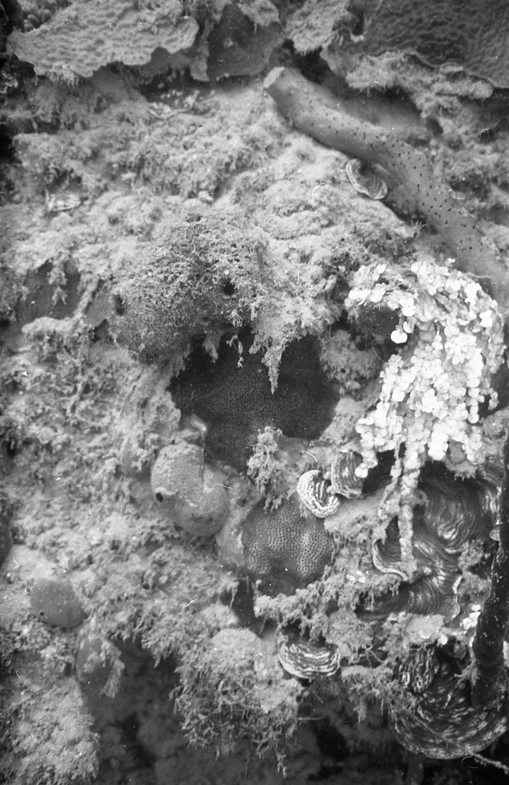{.lightbox group="discovery-bay-1966" description="**UUID: **2537b806-c870-4a7c-8eea-5b819f0f734e **Date: **1966-08-28 **Location: **Jamaica | Discovery Bay | Eaton Hall **Longitude: **77.334ºW **Latitude: **18.467ºN **Photographer: **Eileen Graham **Copyright: **Trustees of the Natural History Museum (London, UK), CC-BY-4.0" alt="**UUID: **2537b806-c870-4a7c-8eea-5b819f0f734e **Date: **1966-08-28 **Location: **Jamaica | Discovery Bay | Eaton Hall **Longitude: **77.334ºW **Latitude: **18.467ºN **Photographer: **Eileen Graham **Copyright: **Trustees of the Natural History Museum (London, UK), CC-BY-4.0"}

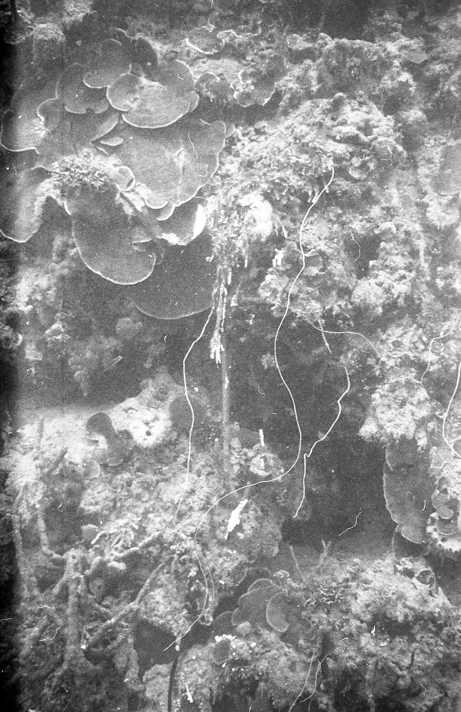{.lightbox group="discovery-bay-1966" description="**UUID: **cfe6adbd-ff6e-4142-ae9e-93d98739d04f **Date: **1966-08-28 **Location: **Jamaica | Discovery Bay | Eaton Hall **Longitude: **77.334ºW **Latitude: **18.467ºN **Photographer: **Eileen Graham **Copyright: **Trustees of the Natural History Museum (London, UK), CC-BY-4.0" alt="**UUID: **cfe6adbd-ff6e-4142-ae9e-93d98739d04f **Date: **1966-08-28 **Location: **Jamaica | Discovery Bay | Eaton Hall **Longitude: **77.334ºW **Latitude: **18.467ºN **Photographer: **Eileen Graham **Copyright: **Trustees of the Natural History Museum (London, UK), CC-BY-4.0"}

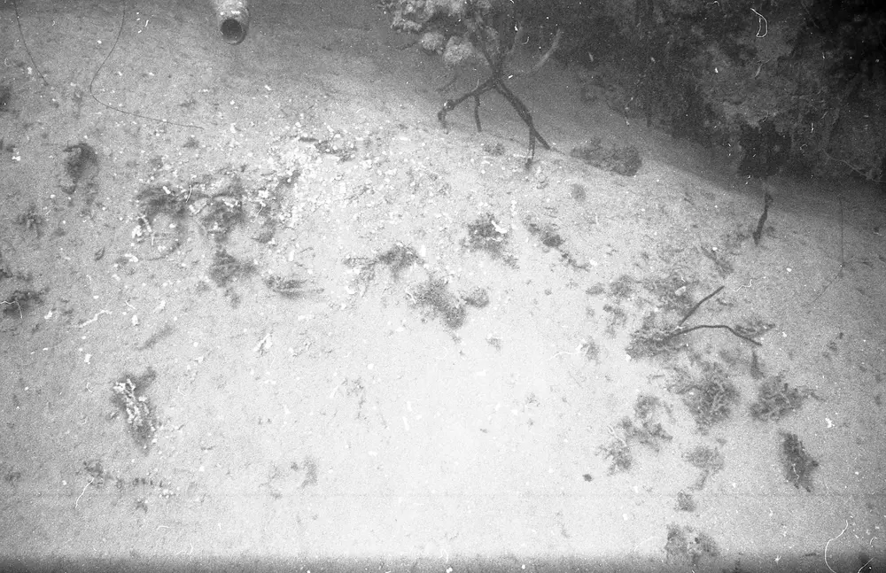{.lightbox group="discovery-bay-1966" description="**UUID: **bbdab103-9a46-4e0b-a27c-2882b85a9ffb **Date: **1966-08-28 **Location: **Jamaica | Discovery Bay | Eaton Hall **Longitude: **77.334ºW **Latitude: **18.467ºN **Photographer: **Eileen Graham **Copyright: **Trustees of the Natural History Museum (London, UK), CC-BY-4.0" alt="**UUID: **bbdab103-9a46-4e0b-a27c-2882b85a9ffb **Date: **1966-08-28 **Location: **Jamaica | Discovery Bay | Eaton Hall **Longitude: **77.334ºW **Latitude: **18.467ºN **Photographer: **Eileen Graham **Copyright: **Trustees of the Natural History Museum (London, UK), CC-BY-4.0"}

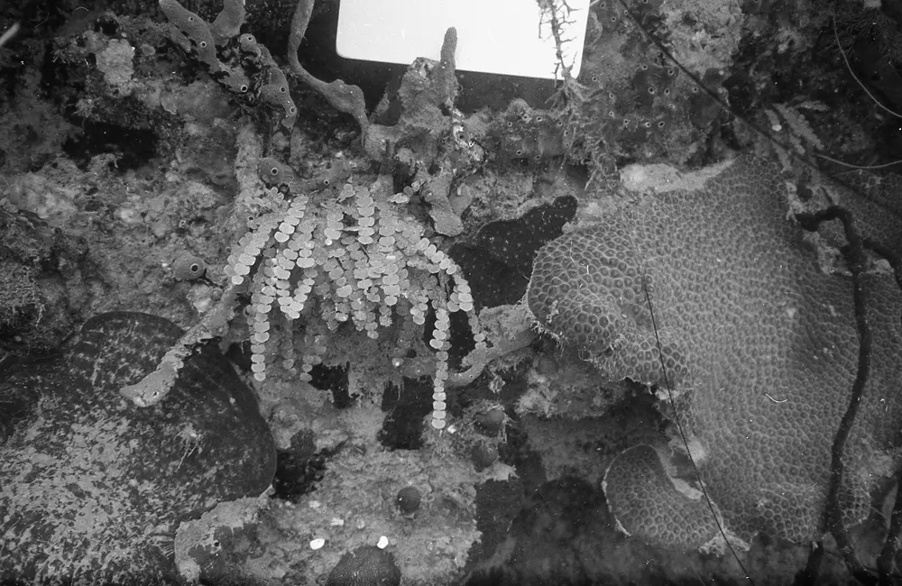{.lightbox group="discovery-bay-1966" description="**UUID: **1fc95ee5-96d7-4024-b64d-195bc5ee5d68 **Date: **1966-08-28 **Location: **Jamaica | Discovery Bay | Eaton Hall **Longitude: **77.334ºW **Latitude: **18.467ºN **Photographer: **Eileen Graham **Copyright: **Trustees of the Natural History Museum (London, UK), CC-BY-4.0" alt="**UUID: **1fc95ee5-96d7-4024-b64d-195bc5ee5d68 **Date: **1966-08-28 **Location: **Jamaica | Discovery Bay | Eaton Hall **Longitude: **77.334ºW **Latitude: **18.467ºN **Photographer: **Eileen Graham **Copyright: **Trustees of the Natural History Museum (London, UK), CC-BY-4.0"}

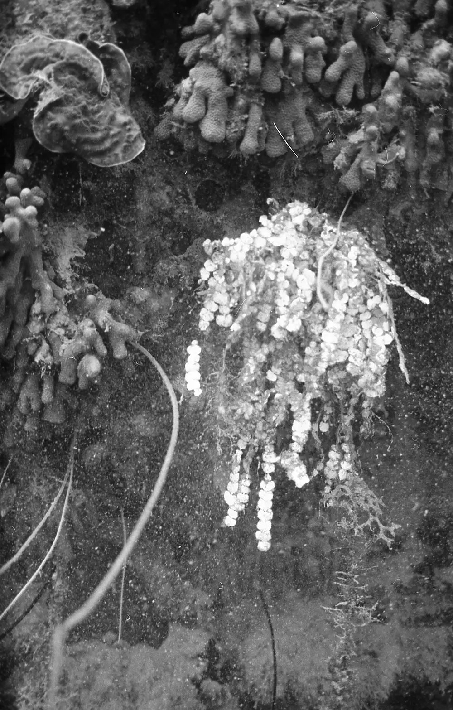{.lightbox group="discovery-bay-1966" description="**UUID: **1602e376-9212-4e10-b005-eabd6d746491 **Date: **1966-08-28 **Location: **Jamaica | Discovery Bay | Eaton Hall **Longitude: **77.334ºW **Latitude: **18.467ºN **Photographer: **Eileen Graham **Copyright: **Trustees of the Natural History Museum (London, UK), CC-BY-4.0" alt="**UUID: **1602e376-9212-4e10-b005-eabd6d746491 **Date: **1966-08-28 **Location: **Jamaica | Discovery Bay | Eaton Hall **Longitude: **77.334ºW **Latitude: **18.467ºN **Photographer: **Eileen Graham **Copyright: **Trustees of the Natural History Museum (London, UK), CC-BY-4.0"}

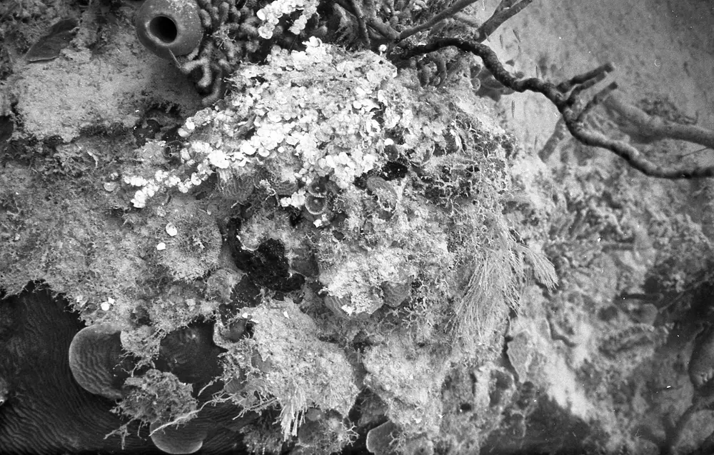{.lightbox group="discovery-bay-1966" description="**UUID: **3b09bea4-8ea6-40fe-b3ce-3a78c3fd6f27 **Date: **1966-08-28 **Location: **Jamaica | Discovery Bay | Eaton Hall **Longitude: **77.334ºW **Latitude: **18.467ºN **Photographer: **Eileen Graham **Copyright: **Trustees of the Natural History Museum (London, UK), CC-BY-4.0" alt="**UUID: **3b09bea4-8ea6-40fe-b3ce-3a78c3fd6f27 **Date: **1966-08-28 **Location: **Jamaica | Discovery Bay | Eaton Hall **Longitude: **77.334ºW **Latitude: **18.467ºN **Photographer: **Eileen Graham **Copyright: **Trustees of the Natural History Museum (London, UK), CC-BY-4.0"}

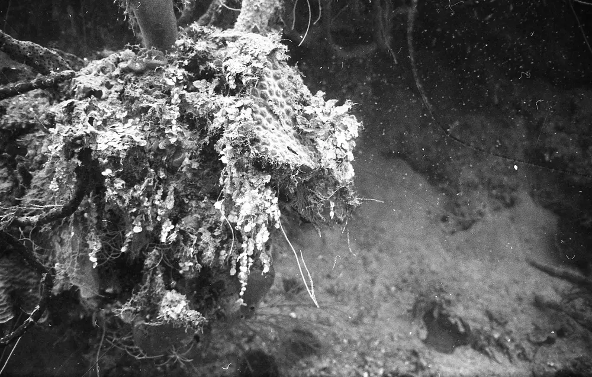{.lightbox group="discovery-bay-1966" description="**UUID: **69b6b31e-e3d2-47be-965b-9dcd7ba61386 **Date: **1966-08-28 **Location: **Jamaica | Discovery Bay | Eaton Hall **Longitude: **77.334ºW **Latitude: **18.467ºN **Photographer: **Eileen Graham **Copyright: **Trustees of the Natural History Museum (London, UK), CC-BY-4.0" alt="**UUID: **69b6b31e-e3d2-47be-965b-9dcd7ba61386 **Date: **1966-08-28 **Location: **Jamaica | Discovery Bay | Eaton Hall **Longitude: **77.334ºW **Latitude: **18.467ºN **Photographer: **Eileen Graham **Copyright: **Trustees of the Natural History Museum (London, UK), CC-BY-4.0"}

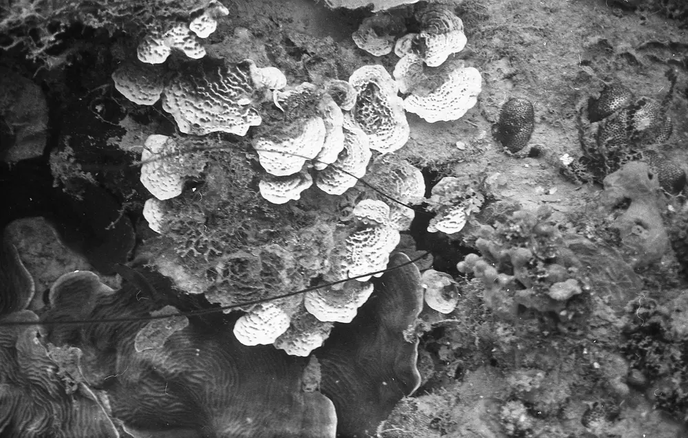{.lightbox group="discovery-bay-1966" description="**UUID: **4c41c49d-7fd7-456c-bc1f-10912316cb4f **Date: **1966-08-28 **Location: **Jamaica | Discovery Bay | Eaton Hall **Longitude: **77.334ºW **Latitude: **18.467ºN **Photographer: **Eileen Graham **Copyright: **Trustees of the Natural History Museum (London, UK), CC-BY-4.0" alt="**UUID: **4c41c49d-7fd7-456c-bc1f-10912316cb4f **Date: **1966-08-28 **Location: **Jamaica | Discovery Bay | Eaton Hall **Longitude: **77.334ºW **Latitude: **18.467ºN **Photographer: **Eileen Graham **Copyright: **Trustees of the Natural History Museum (London, UK), CC-BY-4.0"}

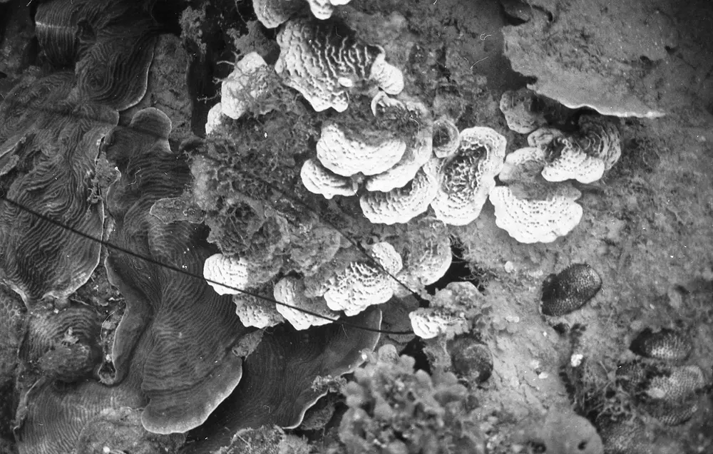{.lightbox group="discovery-bay-1966" description="**UUID: **49fc025c-72b2-4528-ad3e-770d8e090638 **Date: **1966-08-28 **Location: **Jamaica | Discovery Bay | Eaton Hall **Longitude: **77.334ºW **Latitude: **18.467ºN **Photographer: **Eileen Graham **Copyright: **Trustees of the Natural History Museum (London, UK), CC-BY-4.0" alt="**UUID: **49fc025c-72b2-4528-ad3e-770d8e090638 **Date: **1966-08-28 **Location: **Jamaica | Discovery Bay | Eaton Hall **Longitude: **77.334ºW **Latitude: **18.467ºN **Photographer: **Eileen Graham **Copyright: **Trustees of the Natural History Museum (London, UK), CC-BY-4.0"}

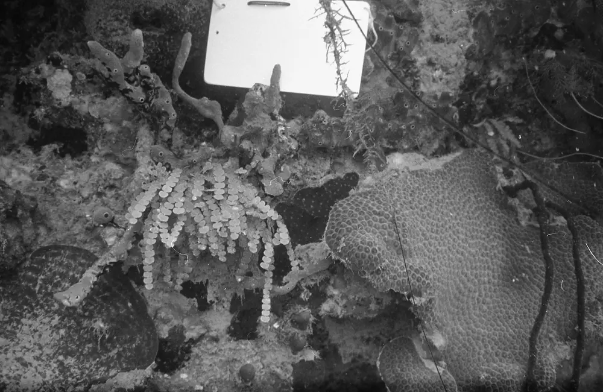{.lightbox group="discovery-bay-1966" description="**UUID: **04009203-410b-420a-bbf7-d00eac4211a4 **Date: **1966-08-28 **Location: **Jamaica | Discovery Bay | Eaton Hall **Longitude: **77.334ºW **Latitude: **18.467ºN **Photographer: **Eileen Graham **Copyright: **Trustees of the Natural History Museum (London, UK), CC-BY-4.0" alt="**UUID: **04009203-410b-420a-bbf7-d00eac4211a4 **Date: **1966-08-28 **Location: **Jamaica | Discovery Bay | Eaton Hall **Longitude: **77.334ºW **Latitude: **18.467ºN **Photographer: **Eileen Graham **Copyright: **Trustees of the Natural History Museum (London, UK), CC-BY-4.0"}

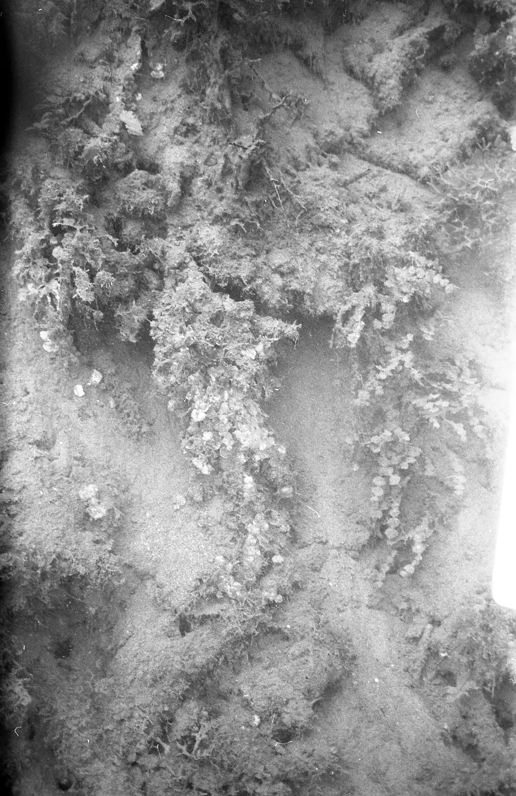{.lightbox group="discovery-bay-1966" description="**UUID: **1b58630f-acd3-457f-a22e-7d68ea4abbb0 **Date: **1966-08-28 **Location: **Jamaica | Discovery Bay | Eaton Hall **Longitude: **77.334ºW **Latitude: **18.467ºN **Photographer: **Eileen Graham **Copyright: **Trustees of the Natural History Museum (London, UK), CC-BY-4.0" alt="**UUID: **1b58630f-acd3-457f-a22e-7d68ea4abbb0 **Date: **1966-08-28 **Location: **Jamaica | Discovery Bay | Eaton Hall **Longitude: **77.334ºW **Latitude: **18.467ºN **Photographer: **Eileen Graham **Copyright: **Trustees of the Natural History Museum (London, UK), CC-BY-4.0"}

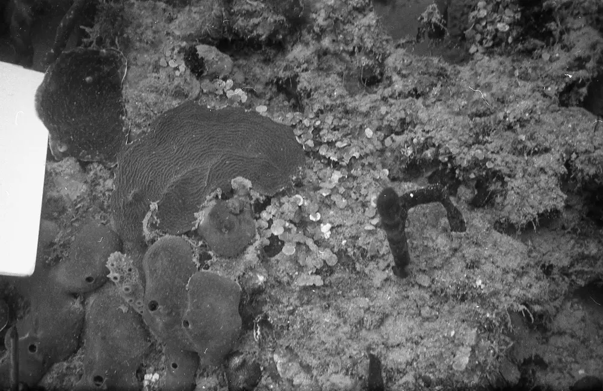{.lightbox group="discovery-bay-1966" description="**UUID: **fb6794f2-2e3d-4934-b2f0-4242ca4a6957 **Date: **1966-08-28 **Location: **Jamaica | Discovery Bay | Eaton Hall **Longitude: **77.334ºW **Latitude: **18.467ºN **Photographer: **Eileen Graham **Copyright: **Trustees of the Natural History Museum (London, UK), CC-BY-4.0" alt="**UUID: **fb6794f2-2e3d-4934-b2f0-4242ca4a6957 **Date: **1966-08-28 **Location: **Jamaica | Discovery Bay | Eaton Hall **Longitude: **77.334ºW **Latitude: **18.467ºN **Photographer: **Eileen Graham **Copyright: **Trustees of the Natural History Museum (London, UK), CC-BY-4.0"}

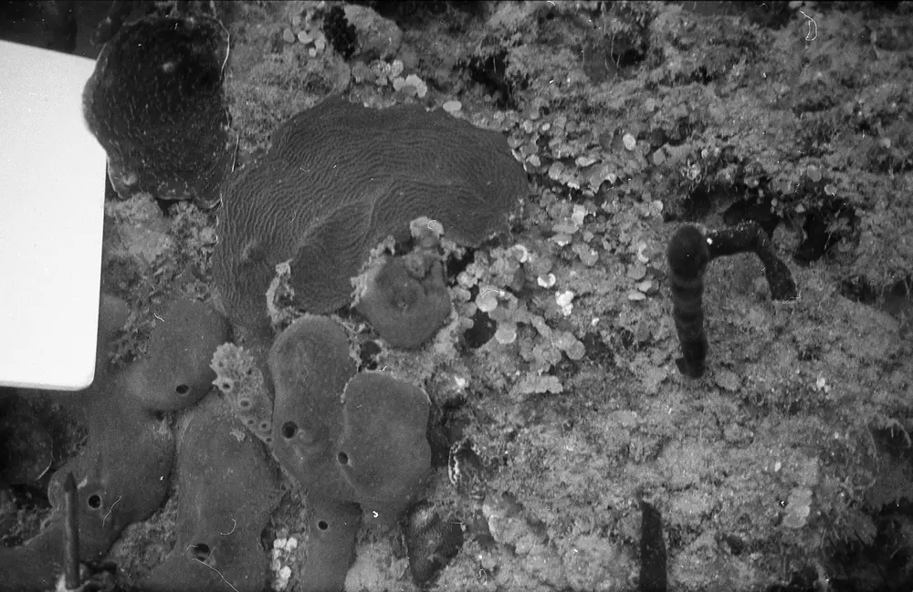{.lightbox group="discovery-bay-1966" description="**UUID: **9e799679-08e2-4bc3-9243-8617e6c19349 **Date: **1966-08-28 **Location: **Jamaica | Discovery Bay | Eaton Hall **Longitude: **77.334ºW **Latitude: **18.467ºN **Photographer: **Eileen Graham **Copyright: **Trustees of the Natural History Museum (London, UK), CC-BY-4.0" alt="**UUID: **9e799679-08e2-4bc3-9243-8617e6c19349 **Date: **1966-08-28 **Location: **Jamaica | Discovery Bay | Eaton Hall **Longitude: **77.334ºW **Latitude: **18.467ºN **Photographer: **Eileen Graham **Copyright: **Trustees of the Natural History Museum (London, UK), CC-BY-4.0"}

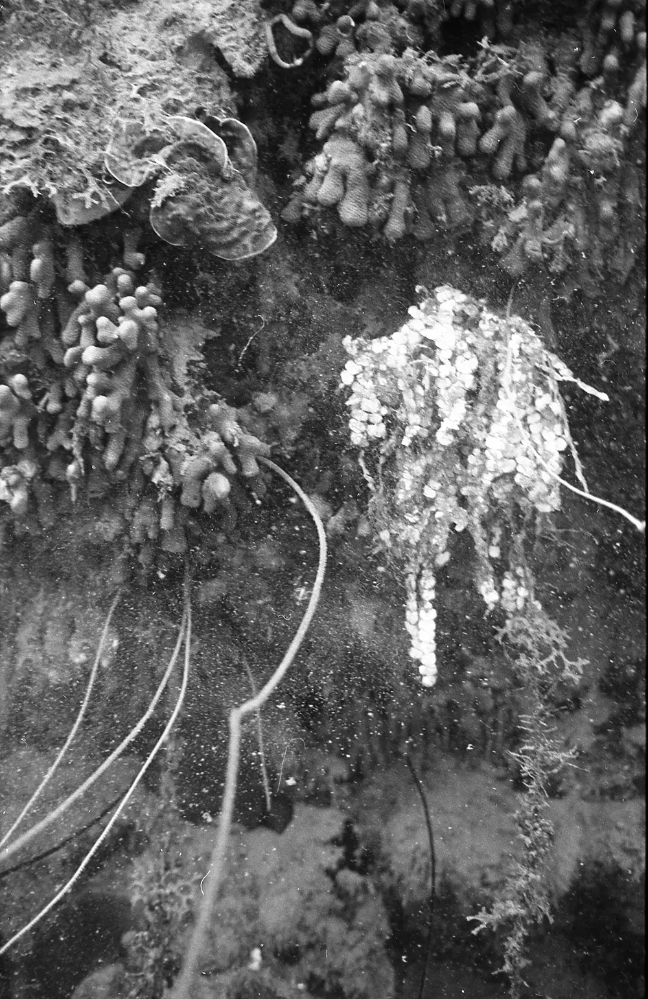{.lightbox group="discovery-bay-1966" description="**UUID: **b4a8cd6e-057f-4e3a-ad38-adc6bfc72e7f **Date: **1966-08-28 **Location: **Jamaica | Discovery Bay | Eaton Hall **Longitude: **77.334ºW **Latitude: **18.467ºN **Photographer: **Eileen Graham **Copyright: **Trustees of the Natural History Museum (London, UK), CC-BY-4.0" alt="**UUID: **b4a8cd6e-057f-4e3a-ad38-adc6bfc72e7f **Date: **1966-08-28 **Location: **Jamaica | Discovery Bay | Eaton Hall **Longitude: **77.334ºW **Latitude: **18.467ºN **Photographer: **Eileen Graham **Copyright: **Trustees of the Natural History Museum (London, UK), CC-BY-4.0"}

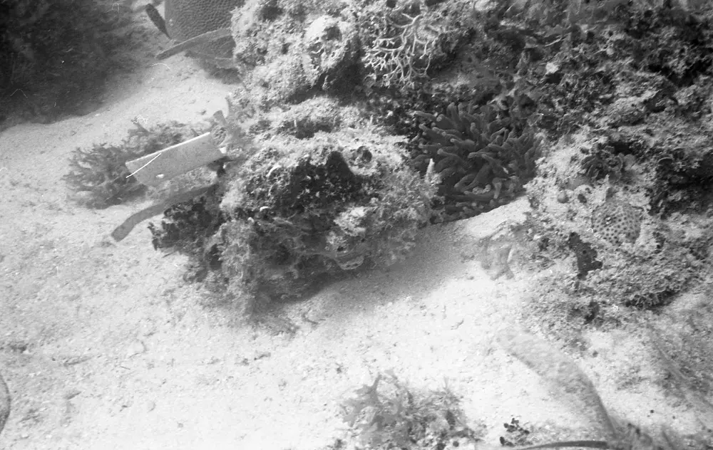{.lightbox group="discovery-bay-1966" description="**UUID: **e43c3428-55da-472e-abbc-af7066d3cb66 **Date: **1966-09-14 **Location: **Jamaica | Discovery Bay | Discovery Bay Purden House **Longitude: **77.40268ºW **Latitude: **18.46868ºN **Photographer: **Eileen Graham **Copyright: **Trustees of the Natural History Museum (London, UK), CC-BY-4.0" alt="**UUID: **e43c3428-55da-472e-abbc-af7066d3cb66 **Date: **1966-09-14 **Location: **Jamaica | Discovery Bay | Discovery Bay Purden House **Longitude: **77.40268ºW **Latitude: **18.46868ºN **Photographer: **Eileen Graham **Copyright: **Trustees of the Natural History Museum (London, UK), CC-BY-4.0"}

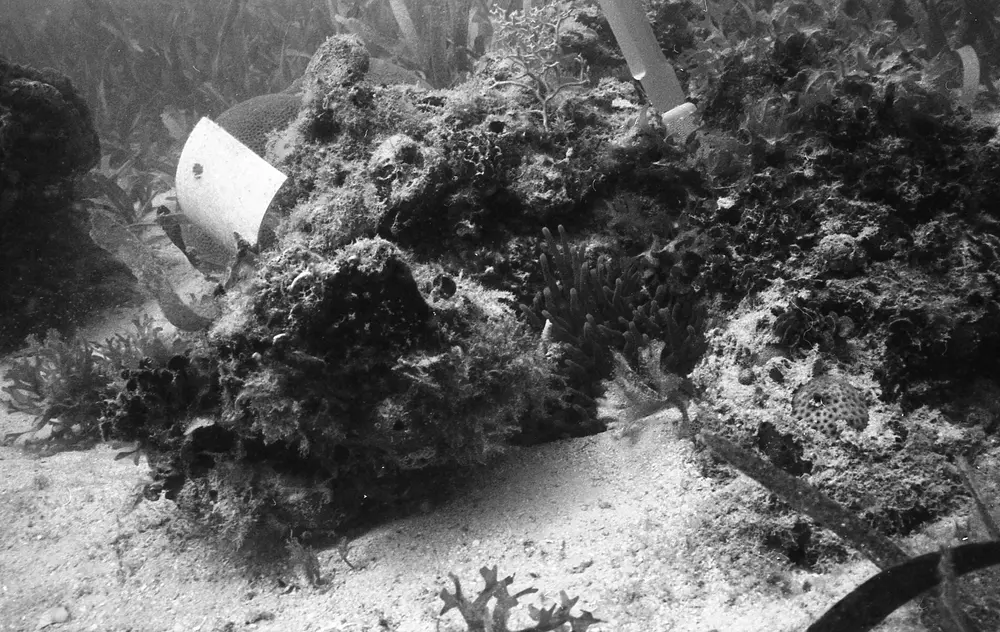{.lightbox group="discovery-bay-1966" description="**UUID: **a6e6c874-4400-4645-ab5e-76addba6a5b9 **Date: **1966-09-14 **Location: **Jamaica | Discovery Bay | Discovery Bay Purden House **Longitude: **77.40268ºW **Latitude: **18.46868ºN **Photographer: **Eileen Graham **Copyright: **Trustees of the Natural History Museum (London, UK), CC-BY-4.0" alt="**UUID: **a6e6c874-4400-4645-ab5e-76addba6a5b9 **Date: **1966-09-14 **Location: **Jamaica | Discovery Bay | Discovery Bay Purden House **Longitude: **77.40268ºW **Latitude: **18.46868ºN **Photographer: **Eileen Graham **Copyright: **Trustees of the Natural History Museum (London, UK), CC-BY-4.0"}

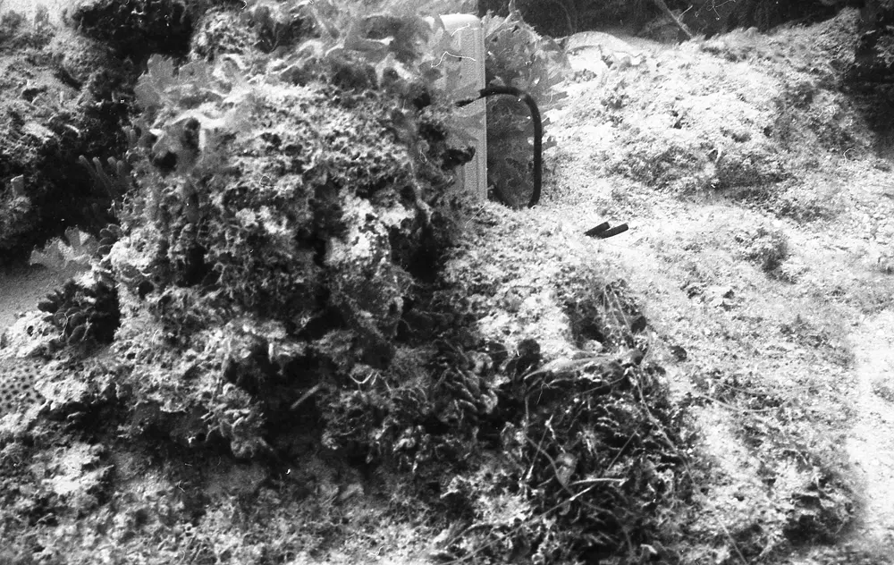{.lightbox group="discovery-bay-1966" description="**UUID: **031752e6-96b3-465f-a82b-d78c230ecea7 **Date: **1966-09-14 **Location: **Jamaica | Discovery Bay | Discovery Bay Purden House **Longitude: **77.40268ºW **Latitude: **18.46868ºN **Photographer: **Eileen Graham **Copyright: **Trustees of the Natural History Museum (London, UK), CC-BY-4.0" alt="**UUID: **031752e6-96b3-465f-a82b-d78c230ecea7 **Date: **1966-09-14 **Location: **Jamaica | Discovery Bay | Discovery Bay Purden House **Longitude: **77.40268ºW **Latitude: **18.46868ºN **Photographer: **Eileen Graham **Copyright: **Trustees of the Natural History Museum (London, UK), CC-BY-4.0"}

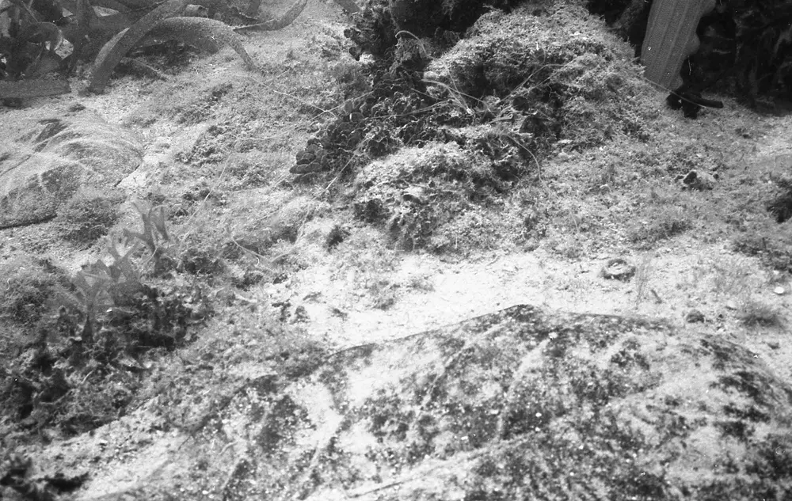{.lightbox group="discovery-bay-1966" description="**UUID: **964b8076-9365-4249-a728-b8632a8345e7 **Date: **1966-09-14 **Location: **Jamaica | Discovery Bay | Discovery Bay Purden House **Longitude: **77.40268ºW **Latitude: **18.46868ºN **Photographer: **Eileen Graham **Copyright: **Trustees of the Natural History Museum (London, UK), CC-BY-4.0" alt="**UUID: **964b8076-9365-4249-a728-b8632a8345e7 **Date: **1966-09-14 **Location: **Jamaica | Discovery Bay | Discovery Bay Purden House **Longitude: **77.40268ºW **Latitude: **18.46868ºN **Photographer: **Eileen Graham **Copyright: **Trustees of the Natural History Museum (London, UK), CC-BY-4.0"}

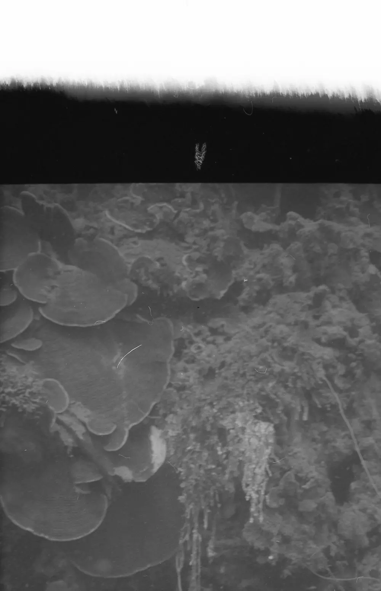{.lightbox group="discovery-bay-1966" description="**UUID: **bbf12e9f-503f-44a3-8862-c3f29fb08478 **Date: **1966-08-28 **Location: **Jamaica | Discovery Bay | Eaton Hall **Longitude: **77.334ºW **Latitude: **18.467ºN **Photographer: **Eileen Graham **Copyright: **Trustees of the Natural History Museum (London, UK), CC-BY-4.0" alt="**UUID: **bbf12e9f-503f-44a3-8862-c3f29fb08478 **Date: **1966-08-28 **Location: **Jamaica | Discovery Bay | Eaton Hall **Longitude: **77.334ºW **Latitude: **18.467ºN **Photographer: **Eileen Graham **Copyright: **Trustees of the Natural History Museum (London, UK), CC-BY-4.0"}

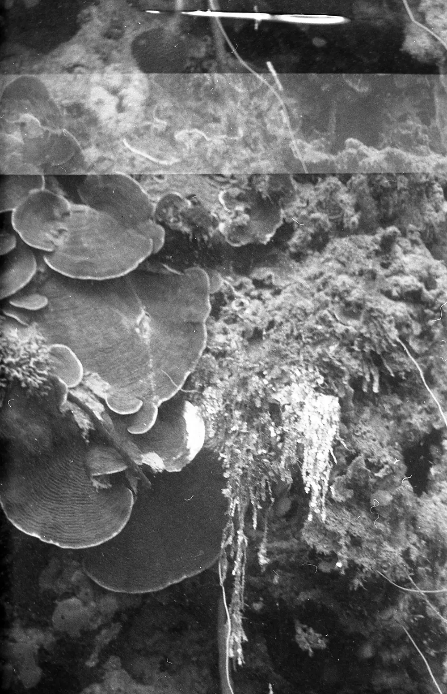{.lightbox group="discovery-bay-1966" description="**UUID: **8084feba-7185-4840-98a3-935ee1a87f44 **Date: **1966-08-28 **Location: **Jamaica | Discovery Bay | Eaton Hall **Longitude: **77.334ºW **Latitude: **18.467ºN **Photographer: **Eileen Graham **Copyright: **Trustees of the Natural History Museum (London, UK), CC-BY-4.0" alt="**UUID: **8084feba-7185-4840-98a3-935ee1a87f44 **Date: **1966-08-28 **Location: **Jamaica | Discovery Bay | Eaton Hall **Longitude: **77.334ºW **Latitude: **18.467ºN **Photographer: **Eileen Graham **Copyright: **Trustees of the Natural History Museum (London, UK), CC-BY-4.0"}

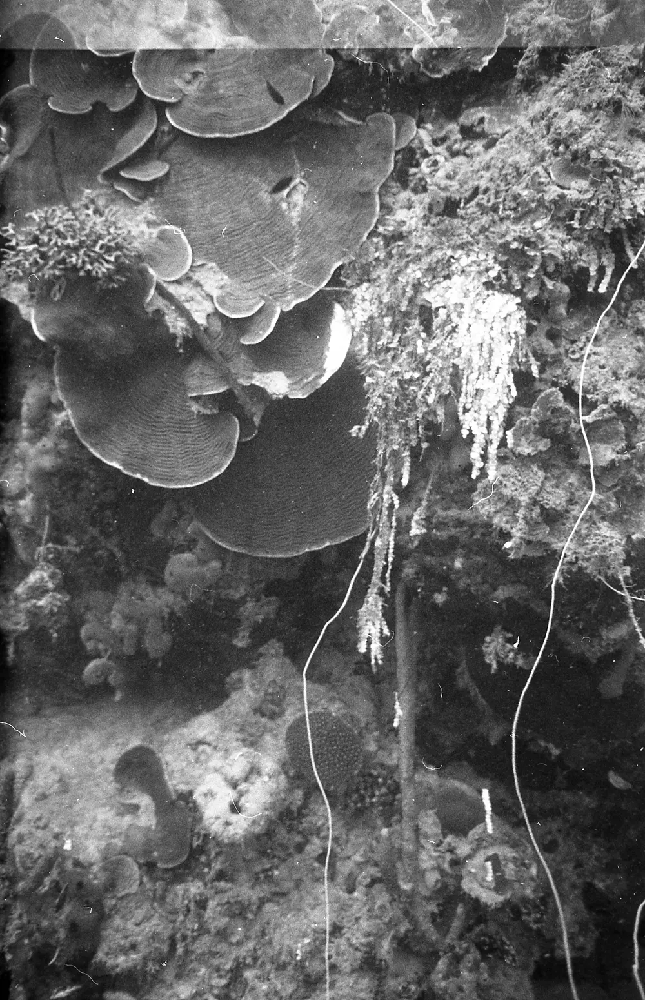{.lightbox group="discovery-bay-1966" description="**UUID: **4b00f679-00c5-4fa7-96d9-4f08a859caaf **Date: **1966-08-28 **Location: **Jamaica | Discovery Bay | Eaton Hall **Longitude: **77.334ºW **Latitude: **18.467ºN **Photographer: **Eileen Graham **Copyright: **Trustees of the Natural History Museum (London, UK), CC-BY-4.0" alt="**UUID: **4b00f679-00c5-4fa7-96d9-4f08a859caaf **Date: **1966-08-28 **Location: **Jamaica | Discovery Bay | Eaton Hall **Longitude: **77.334ºW **Latitude: **18.467ºN **Photographer: **Eileen Graham **Copyright: **Trustees of the Natural History Museum (London, UK), CC-BY-4.0"}

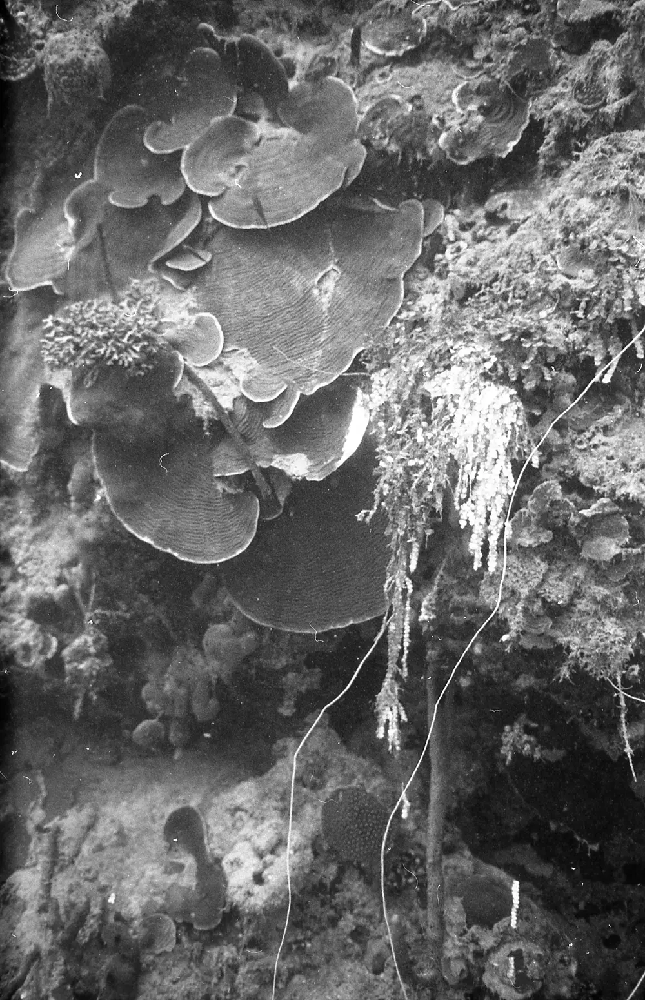{.lightbox group="discovery-bay-1966" description="**UUID: **6f85fdf8-a670-4b96-93ea-9dc3dd9f1739 **Date: **1966-08-28 **Location: **Jamaica | Discovery Bay | Eaton Hall **Longitude: **77.334ºW **Latitude: **18.467ºN **Photographer: **Eileen Graham **Copyright: **Trustees of the Natural History Museum (London, UK), CC-BY-4.0" alt="**UUID: **6f85fdf8-a670-4b96-93ea-9dc3dd9f1739 **Date: **1966-08-28 **Location: **Jamaica | Discovery Bay | Eaton Hall **Longitude: **77.334ºW **Latitude: **18.467ºN **Photographer: **Eileen Graham **Copyright: **Trustees of the Natural History Museum (London, UK), CC-BY-4.0"}

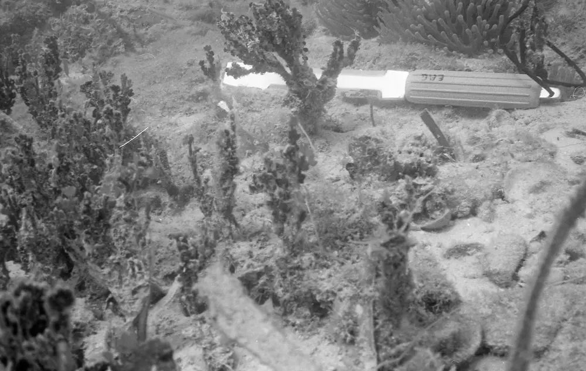{.lightbox group="discovery-bay-1966" description="**UUID: **affb73d5-c8fb-40a5-841c-b2e7b8e5d57e **Date: **1966-09-14 **Location: **Jamaica | Discovery Bay | Discovery Bay Purden House **Longitude: **77.40268ºW **Latitude: **18.46868ºN **Photographer: **Eileen Graham **Copyright: **Trustees of the Natural History Museum (London, UK), CC-BY-4.0" alt="**UUID: **affb73d5-c8fb-40a5-841c-b2e7b8e5d57e **Date: **1966-09-14 **Location: **Jamaica | Discovery Bay | Discovery Bay Purden House **Longitude: **77.40268ºW **Latitude: **18.46868ºN **Photographer: **Eileen Graham **Copyright: **Trustees of the Natural History Museum (London, UK), CC-BY-4.0"}

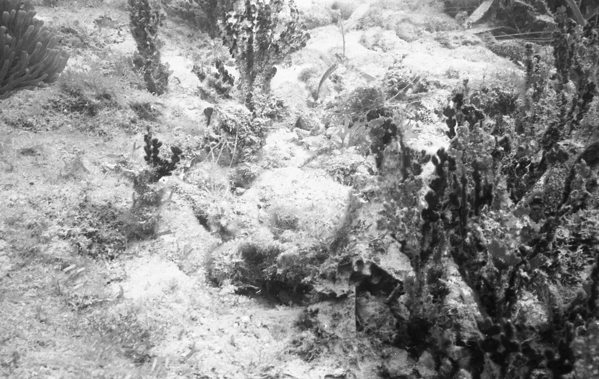{.lightbox group="discovery-bay-1966" description="**UUID: **f538161e-0d44-4973-b21c-d1d83c9e696f **Date: **1966-09-14 **Location: **Jamaica | Discovery Bay | Discovery Bay Purden House **Longitude: **77.40268ºW **Latitude: **18.46868ºN **Photographer: **Eileen Graham **Copyright: **Trustees of the Natural History Museum (London, UK), CC-BY-4.0" alt="**UUID: **f538161e-0d44-4973-b21c-d1d83c9e696f **Date: **1966-09-14 **Location: **Jamaica | Discovery Bay | Discovery Bay Purden House **Longitude: **77.40268ºW **Latitude: **18.46868ºN **Photographer: **Eileen Graham **Copyright: **Trustees of the Natural History Museum (London, UK), CC-BY-4.0"}

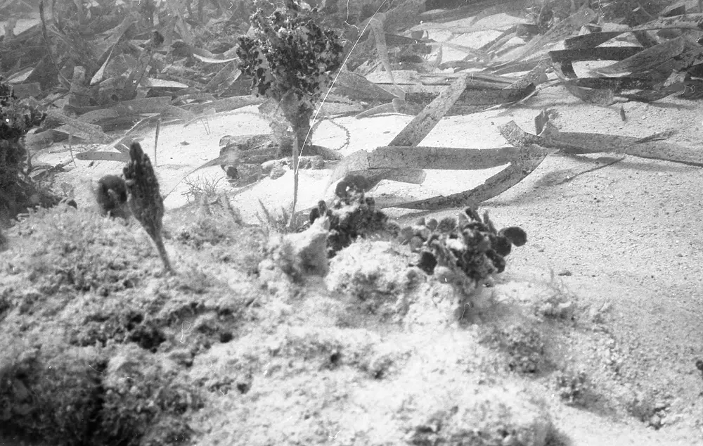{.lightbox group="discovery-bay-1966" description="**UUID: **4f2ec543-37a3-41d4-9e50-8076dadba714 **Date: **1966-09-14 **Location: **Jamaica | Discovery Bay | Discovery Bay Purden House **Longitude: **77.40268ºW **Latitude: **18.46868ºN **Photographer: **Eileen Graham **Copyright: **Trustees of the Natural History Museum (London, UK), CC-BY-4.0" alt="**UUID: **4f2ec543-37a3-41d4-9e50-8076dadba714 **Date: **1966-09-14 **Location: **Jamaica | Discovery Bay | Discovery Bay Purden House **Longitude: **77.40268ºW **Latitude: **18.46868ºN **Photographer: **Eileen Graham **Copyright: **Trustees of the Natural History Museum (London, UK), CC-BY-4.0"}

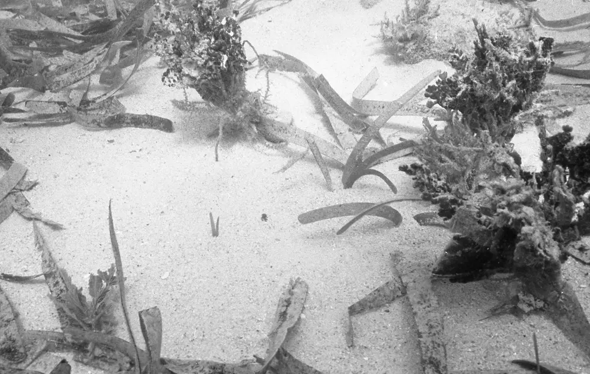{.lightbox group="discovery-bay-1966" description="**UUID: **a7b92f98-4abb-4896-b24e-fdf6858f3ad4 **Date: **1966-09-14 **Location: **Jamaica | Discovery Bay | Discovery Bay Purden House **Longitude: **77.40268ºW **Latitude: **18.46868ºN **Photographer: **Eileen Graham **Copyright: **Trustees of the Natural History Museum (London, UK), CC-BY-4.0" alt="**UUID: **a7b92f98-4abb-4896-b24e-fdf6858f3ad4 **Date: **1966-09-14 **Location: **Jamaica | Discovery Bay | Discovery Bay Purden House **Longitude: **77.40268ºW **Latitude: **18.46868ºN **Photographer: **Eileen Graham **Copyright: **Trustees of the Natural History Museum (London, UK), CC-BY-4.0"}

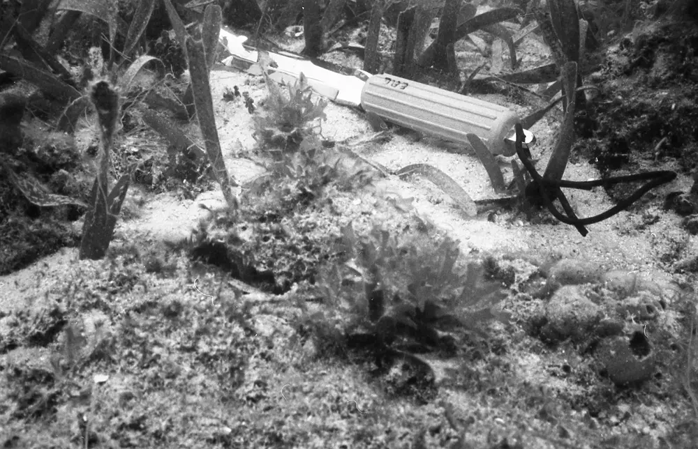{.lightbox group="discovery-bay-1966" description="**UUID: **8bc5cbe2-c3db-4f0d-bd7d-95fdac1082d7 **Date: **1966-09-14 **Location: **Jamaica | Discovery Bay | Discovery Bay Purden House **Longitude: **77.40268ºW **Latitude: **18.46868ºN **Photographer: **Eileen Graham **Copyright: **Trustees of the Natural History Museum (London, UK), CC-BY-4.0" alt="**UUID: **8bc5cbe2-c3db-4f0d-bd7d-95fdac1082d7 **Date: **1966-09-14 **Location: **Jamaica | Discovery Bay | Discovery Bay Purden House **Longitude: **77.40268ºW **Latitude: **18.46868ºN **Photographer: **Eileen Graham **Copyright: **Trustees of the Natural History Museum (London, UK), CC-BY-4.0"}

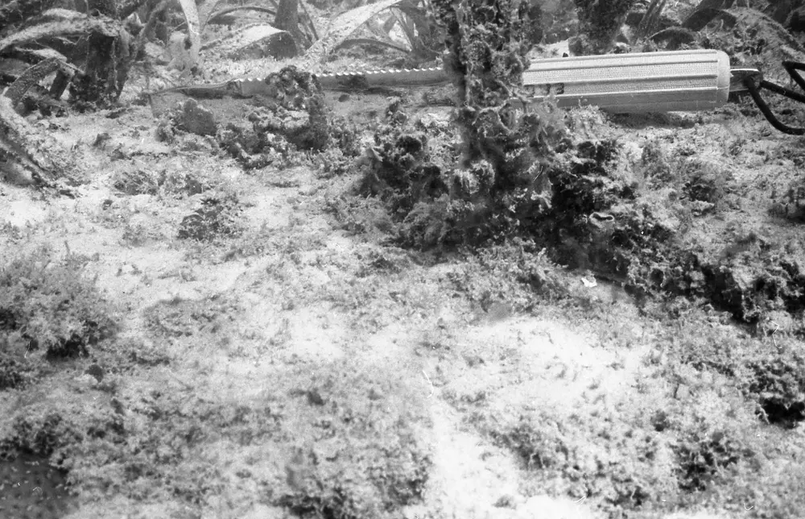{.lightbox group="discovery-bay-1966" description="**UUID: **2e0183d1-7ceb-4920-abfd-faf88f8f374e **Date: **1966-09-14 **Location: **Jamaica | Discovery Bay | Discovery Bay Purden House **Longitude: **77.40268ºW **Latitude: **18.46868ºN **Photographer: **Eileen Graham **Copyright: **Trustees of the Natural History Museum (London, UK), CC-BY-4.0" alt="**UUID: **2e0183d1-7ceb-4920-abfd-faf88f8f374e **Date: **1966-09-14 **Location: **Jamaica | Discovery Bay | Discovery Bay Purden House **Longitude: **77.40268ºW **Latitude: **18.46868ºN **Photographer: **Eileen Graham **Copyright: **Trustees of the Natural History Museum (London, UK), CC-BY-4.0"}

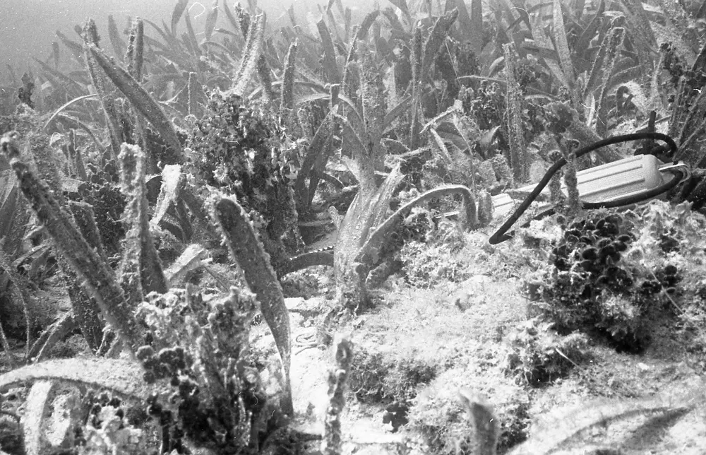{.lightbox group="discovery-bay-1966" description="**UUID: **9ddf9c01-687f-4152-9bbe-8c24be17e346 **Date: **1966-09-14 **Location: **Jamaica | Discovery Bay | Discovery Bay Purden House **Longitude: **77.40268ºW **Latitude: **18.46868ºN **Photographer: **Eileen Graham **Copyright: **Trustees of the Natural History Museum (London, UK), CC-BY-4.0" alt="**UUID: **9ddf9c01-687f-4152-9bbe-8c24be17e346 **Date: **1966-09-14 **Location: **Jamaica | Discovery Bay | Discovery Bay Purden House **Longitude: **77.40268ºW **Latitude: **18.46868ºN **Photographer: **Eileen Graham **Copyright: **Trustees of the Natural History Museum (London, UK), CC-BY-4.0"}

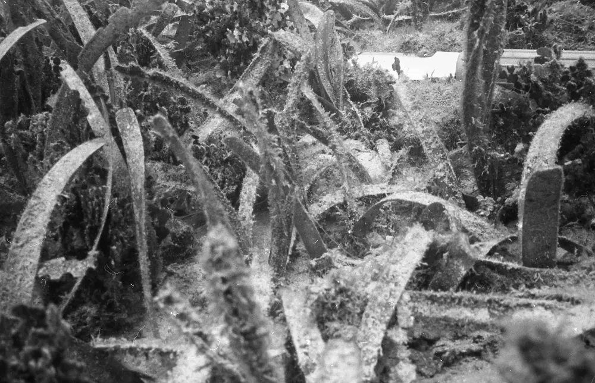{.lightbox group="discovery-bay-1966" description="**UUID: **ac46dff4-90d8-462a-b387-f1cc881abafc **Date: **1966-09-14 **Location: **Jamaica | Discovery Bay | Discovery Bay Purden House **Longitude: **77.40268ºW **Latitude: **18.46868ºN **Photographer: **Eileen Graham **Copyright: **Trustees of the Natural History Museum (London, UK), CC-BY-4.0" alt="**UUID: **ac46dff4-90d8-462a-b387-f1cc881abafc **Date: **1966-09-14 **Location: **Jamaica | Discovery Bay | Discovery Bay Purden House **Longitude: **77.40268ºW **Latitude: **18.46868ºN **Photographer: **Eileen Graham **Copyright: **Trustees of the Natural History Museum (London, UK), CC-BY-4.0"}

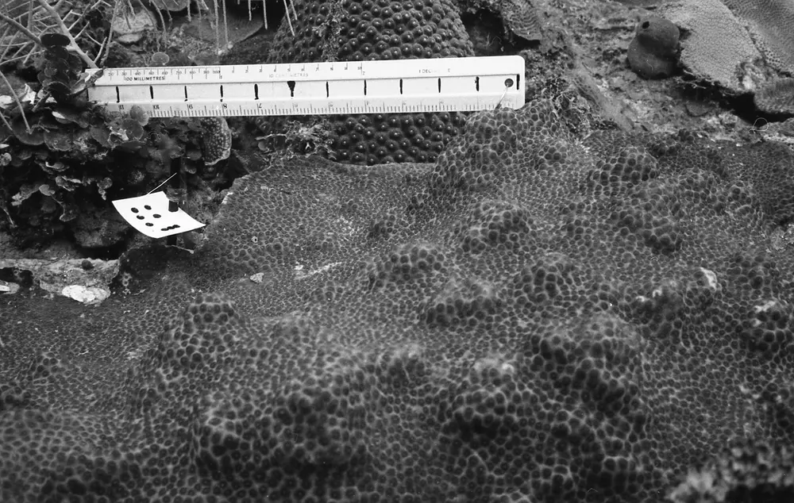{.lightbox group="discovery-bay-1966" description="**UUID: **3d312a5f-5cf7-4d98-8e47-f84bb99ca0b7 **Date: **1966-08-30 **Location: **Jamaica | Discovery Bay | Buoy Upper Slope **Longitude: **77.40908ºW **Latitude: **18.47322ºN **Photographer: **Eileen Graham **Copyright: **Trustees of the Natural History Museum (London, UK), CC-BY-4.0" alt="**UUID: **3d312a5f-5cf7-4d98-8e47-f84bb99ca0b7 **Date: **1966-08-30 **Location: **Jamaica | Discovery Bay | Buoy Upper Slope **Longitude: **77.40908ºW **Latitude: **18.47322ºN **Photographer: **Eileen Graham **Copyright: **Trustees of the Natural History Museum (London, UK), CC-BY-4.0"}

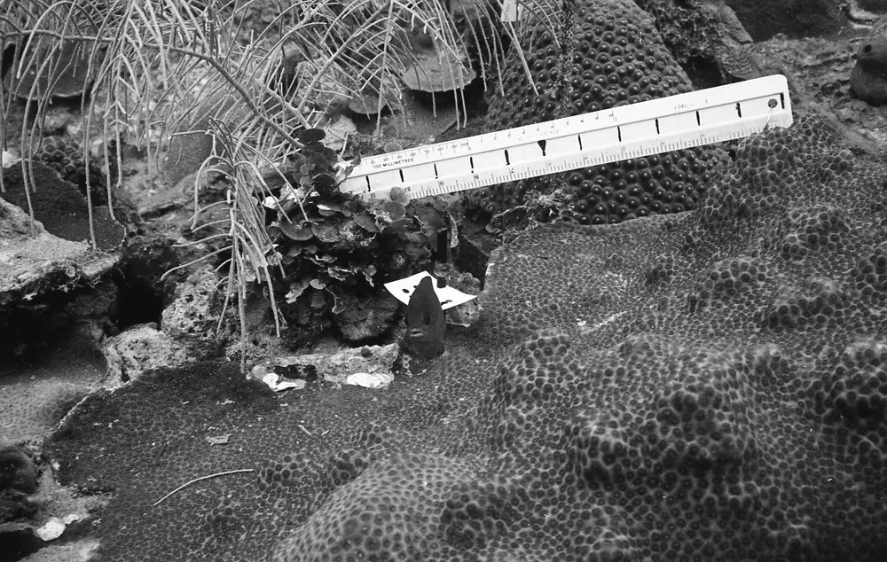{.lightbox group="discovery-bay-1966" description="**UUID: **8f5b8f4a-75e4-46cc-b718-294f2202b785 **Date: **1966-08-30 **Location: **Jamaica | Discovery Bay | Buoy Upper Slope **Longitude: **77.40908ºW **Latitude: **18.47322ºN **Photographer: **Eileen Graham **Copyright: **Trustees of the Natural History Museum (London, UK), CC-BY-4.0" alt="**UUID: **8f5b8f4a-75e4-46cc-b718-294f2202b785 **Date: **1966-08-30 **Location: **Jamaica | Discovery Bay | Buoy Upper Slope **Longitude: **77.40908ºW **Latitude: **18.47322ºN **Photographer: **Eileen Graham **Copyright: **Trustees of the Natural History Museum (London, UK), CC-BY-4.0"}

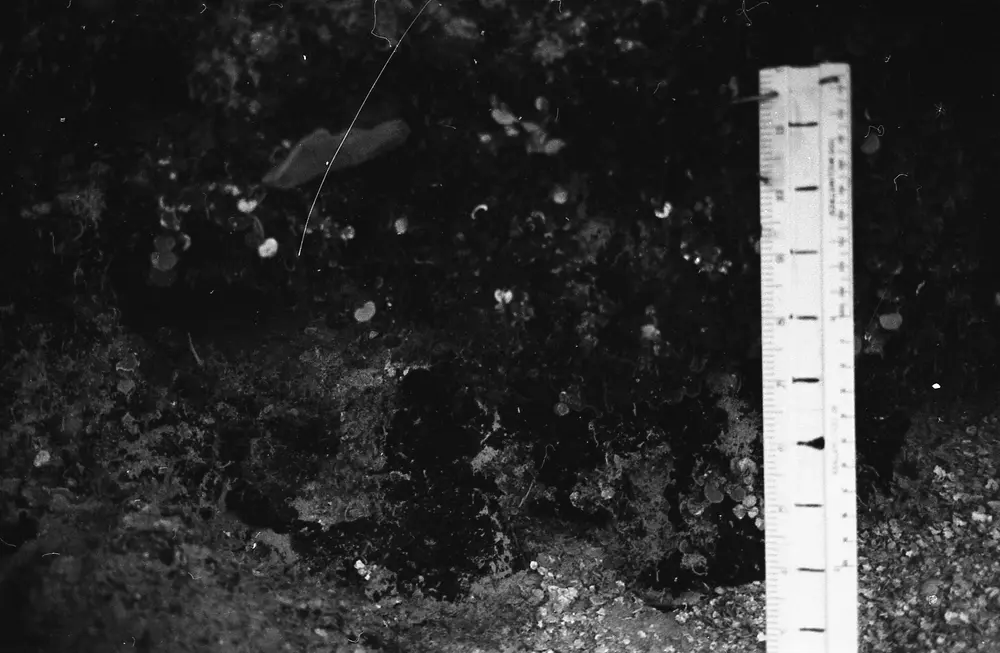{.lightbox group="discovery-bay-1966" description="**UUID: **e048fa4b-4c23-4fe5-af6b-b23a0f58eefc **Date: **1966-08-30 **Location: **Jamaica | Discovery Bay | Buoy Upper Slope **Longitude: **77.40908ºW **Latitude: **18.47322ºN **Photographer: **Eileen Graham **Copyright: **Trustees of the Natural History Museum (London, UK), CC-BY-4.0" alt="**UUID: **e048fa4b-4c23-4fe5-af6b-b23a0f58eefc **Date: **1966-08-30 **Location: **Jamaica | Discovery Bay | Buoy Upper Slope **Longitude: **77.40908ºW **Latitude: **18.47322ºN **Photographer: **Eileen Graham **Copyright: **Trustees of the Natural History Museum (London, UK), CC-BY-4.0"}

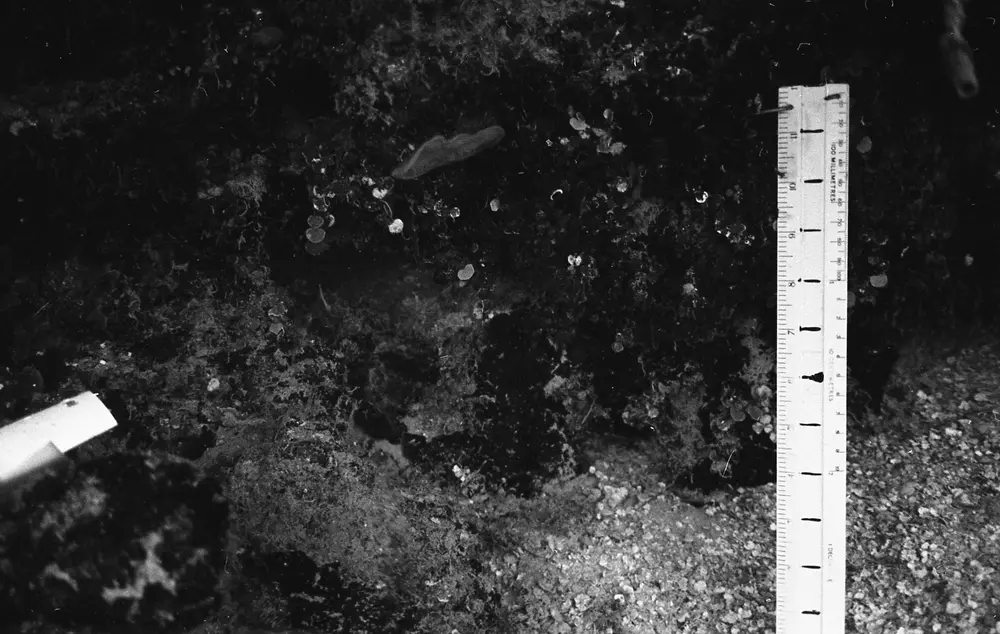{.lightbox group="discovery-bay-1966" description="**UUID: **41bf605d-ee9c-4018-9bbc-48b2bbb983b7 **Date: **1966-08-30 **Location: **Jamaica | Discovery Bay | Buoy Upper Slope **Longitude: **77.40908ºW **Latitude: **18.47322ºN **Photographer: **Eileen Graham **Copyright: **Trustees of the Natural History Museum (London, UK), CC-BY-4.0" alt="**UUID: **41bf605d-ee9c-4018-9bbc-48b2bbb983b7 **Date: **1966-08-30 **Location: **Jamaica | Discovery Bay | Buoy Upper Slope **Longitude: **77.40908ºW **Latitude: **18.47322ºN **Photographer: **Eileen Graham **Copyright: **Trustees of the Natural History Museum (London, UK), CC-BY-4.0"}

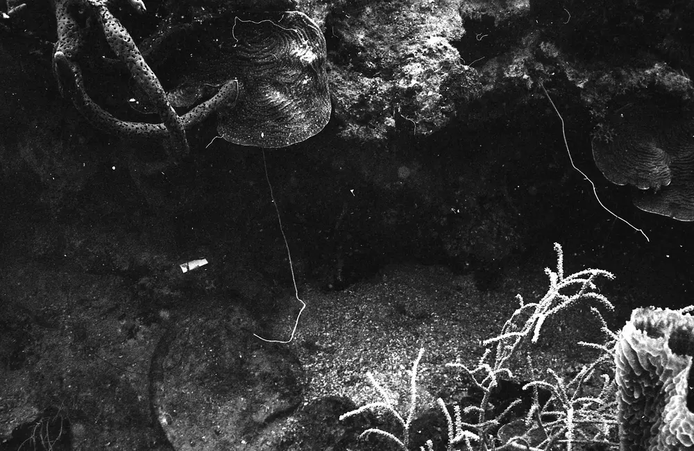{.lightbox group="discovery-bay-1966" description="**UUID: **89b16504-3e17-4a90-80a7-050268e7bdd6 **Date: **1966-08-30 **Location: **Jamaica | Discovery Bay | Buoy Upper Slope **Longitude: **77.40908ºW **Latitude: **18.47322ºN **Photographer: **Eileen Graham **Copyright: **Trustees of the Natural History Museum (London, UK), CC-BY-4.0" alt="**UUID: **89b16504-3e17-4a90-80a7-050268e7bdd6 **Date: **1966-08-30 **Location: **Jamaica | Discovery Bay | Buoy Upper Slope **Longitude: **77.40908ºW **Latitude: **18.47322ºN **Photographer: **Eileen Graham **Copyright: **Trustees of the Natural History Museum (London, UK), CC-BY-4.0"}

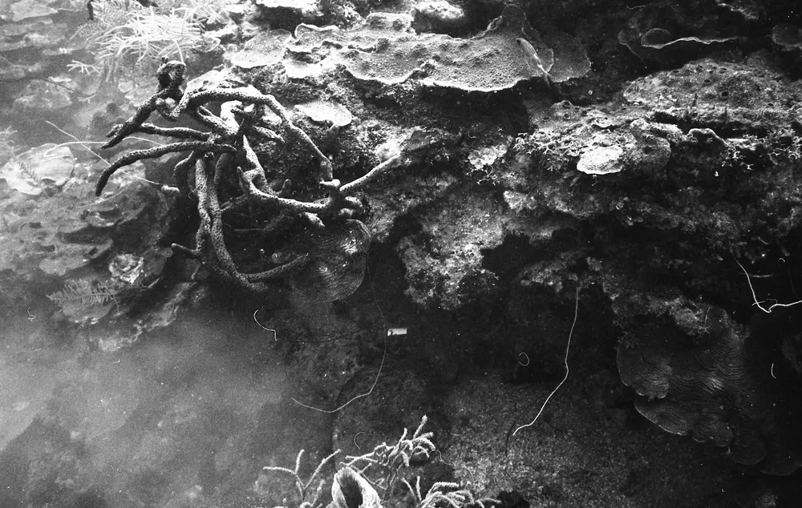{.lightbox group="discovery-bay-1966" description="**UUID: **0f4a6e6a-09e2-4600-9248-c4e4a8ed272a **Date: **1966-08-30 **Location: **Jamaica | Discovery Bay | Buoy Upper Slope **Longitude: **77.40908ºW **Latitude: **18.47322ºN **Photographer: **Eileen Graham **Copyright: **Trustees of the Natural History Museum (London, UK), CC-BY-4.0" alt="**UUID: **0f4a6e6a-09e2-4600-9248-c4e4a8ed272a **Date: **1966-08-30 **Location: **Jamaica | Discovery Bay | Buoy Upper Slope **Longitude: **77.40908ºW **Latitude: **18.47322ºN **Photographer: **Eileen Graham **Copyright: **Trustees of the Natural History Museum (London, UK), CC-BY-4.0"}

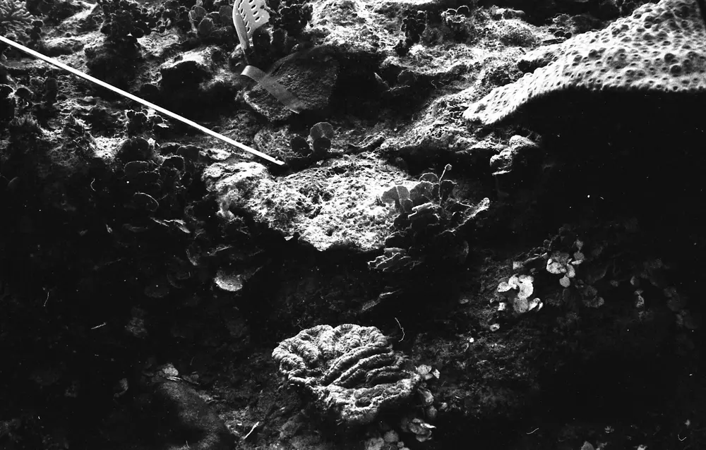{.lightbox group="discovery-bay-1966" description="**UUID: **de33214b-e43a-4719-84bf-769630d58a99 **Date: **1966-08-30 **Location: **Jamaica | Discovery Bay | Buoy Upper Slope **Longitude: **77.40908ºW **Latitude: **18.47322ºN **Photographer: **Eileen Graham **Copyright: **Trustees of the Natural History Museum (London, UK), CC-BY-4.0" alt="**UUID: **de33214b-e43a-4719-84bf-769630d58a99 **Date: **1966-08-30 **Location: **Jamaica | Discovery Bay | Buoy Upper Slope **Longitude: **77.40908ºW **Latitude: **18.47322ºN **Photographer: **Eileen Graham **Copyright: **Trustees of the Natural History Museum (London, UK), CC-BY-4.0"}

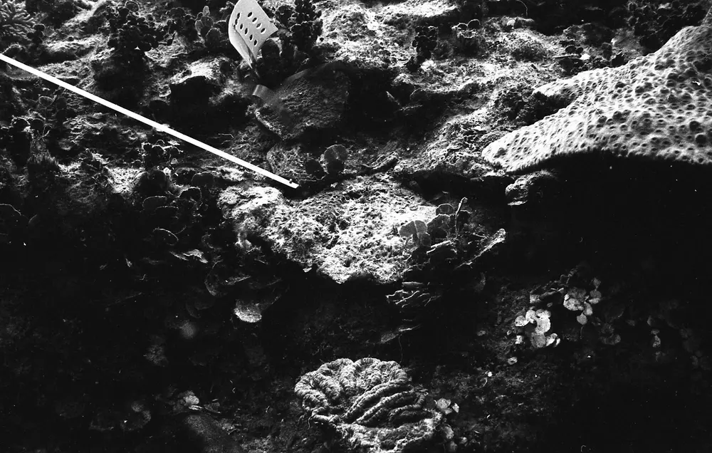{.lightbox group="discovery-bay-1966" description="**UUID: **2c95ed2c-a7aa-4a2b-892e-a61cd5f8438d **Date: **1966-08-30 **Location: **Jamaica | Discovery Bay | Buoy Upper Slope **Longitude: **77.40908ºW **Latitude: **18.47322ºN **Photographer: **Eileen Graham **Copyright: **Trustees of the Natural History Museum (London, UK), CC-BY-4.0" alt="**UUID: **2c95ed2c-a7aa-4a2b-892e-a61cd5f8438d **Date: **1966-08-30 **Location: **Jamaica | Discovery Bay | Buoy Upper Slope **Longitude: **77.40908ºW **Latitude: **18.47322ºN **Photographer: **Eileen Graham **Copyright: **Trustees of the Natural History Museum (London, UK), CC-BY-4.0"}

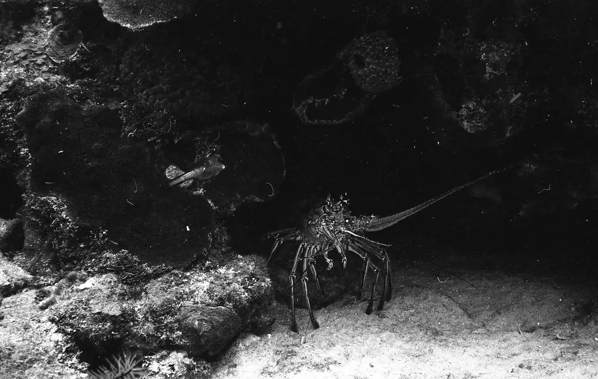{.lightbox group="discovery-bay-1966" description="**UUID: **702ac60b-18b9-4cf1-8e12-061b31802d72 **Date: **1966-08-30 **Location: **Jamaica | Discovery Bay | Buoy Upper Slope **Longitude: **77.40908ºW **Latitude: **18.47322ºN **Photographer: **Eileen Graham **Copyright: **Trustees of the Natural History Museum (London, UK), CC-BY-4.0" alt="**UUID: **702ac60b-18b9-4cf1-8e12-061b31802d72 **Date: **1966-08-30 **Location: **Jamaica | Discovery Bay | Buoy Upper Slope **Longitude: **77.40908ºW **Latitude: **18.47322ºN **Photographer: **Eileen Graham **Copyright: **Trustees of the Natural History Museum (London, UK), CC-BY-4.0"}

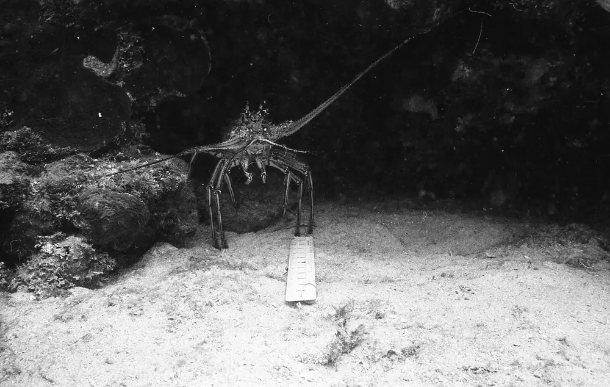{.lightbox group="discovery-bay-1966" description="**UUID: **e4163b90-b3b4-4a9f-8ee3-55780124522d **Date: **1966-08-30 **Location: **Jamaica | Discovery Bay | Buoy Upper Slope **Longitude: **77.40908ºW **Latitude: **18.47322ºN **Photographer: **Eileen Graham **Copyright: **Trustees of the Natural History Museum (London, UK), CC-BY-4.0" alt="**UUID: **e4163b90-b3b4-4a9f-8ee3-55780124522d **Date: **1966-08-30 **Location: **Jamaica | Discovery Bay | Buoy Upper Slope **Longitude: **77.40908ºW **Latitude: **18.47322ºN **Photographer: **Eileen Graham **Copyright: **Trustees of the Natural History Museum (London, UK), CC-BY-4.0"}

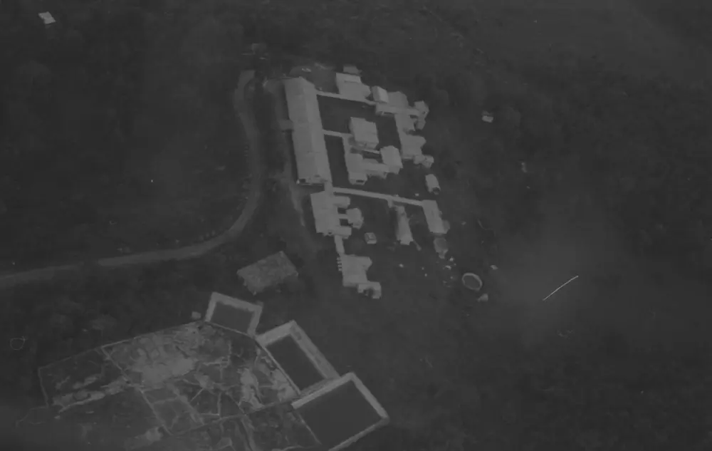{.lightbox group="discovery-bay-1966" description="**UUID: **16199c16-d7ed-46b6-842e-4053cb03cfc1 **Date: **1966-08-30 **Location: **Jamaica | Discovery Bay | Onshore **Longitude: **77.41543ºW **Latitude: **18.468618ºN **Photographer: **Eileen Graham **Copyright: **Trustees of the Natural History Museum (London, UK), CC-BY-4.0" alt="**UUID: **16199c16-d7ed-46b6-842e-4053cb03cfc1 **Date: **1966-08-30 **Location: **Jamaica | Discovery Bay | Onshore **Longitude: **77.41543ºW **Latitude: **18.468618ºN **Photographer: **Eileen Graham **Copyright: **Trustees of the Natural History Museum (London, UK), CC-BY-4.0"}

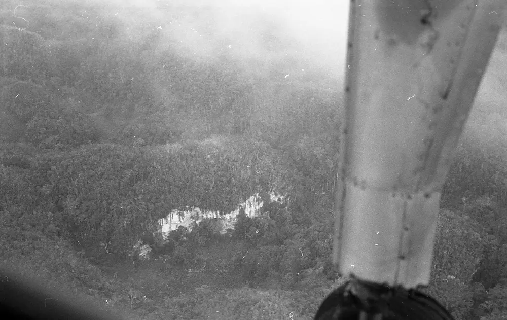{.lightbox group="discovery-bay-1966" description="**UUID: **75d27e24-1192-419f-b43f-ec92db48efb6 **Date: **1966-08-30 **Location: **Jamaica | Discovery Bay | Onshore **Longitude: **77.41543ºW **Latitude: **18.468618ºN **Photographer: **Eileen Graham **Copyright: **Trustees of the Natural History Museum (London, UK), CC-BY-4.0" alt="**UUID: **75d27e24-1192-419f-b43f-ec92db48efb6 **Date: **1966-08-30 **Location: **Jamaica | Discovery Bay | Onshore **Longitude: **77.41543ºW **Latitude: **18.468618ºN **Photographer: **Eileen Graham **Copyright: **Trustees of the Natural History Museum (London, UK), CC-BY-4.0"}

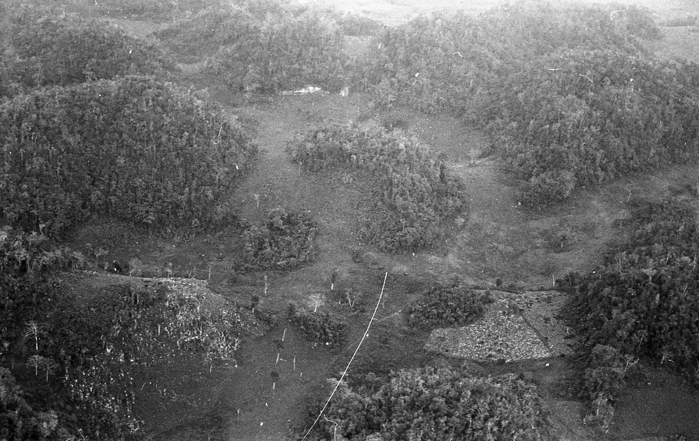{.lightbox group="discovery-bay-1966" description="**UUID: **7cc9bc50-1b41-449a-af69-4a2c6c49a35f **Date: **1966-08-30 **Location: **Jamaica | Discovery Bay | Onshore **Longitude: **77.41543ºW **Latitude: **18.468618ºN **Photographer: **Eileen Graham **Copyright: **Trustees of the Natural History Museum (London, UK), CC-BY-4.0" alt="**UUID: **7cc9bc50-1b41-449a-af69-4a2c6c49a35f **Date: **1966-08-30 **Location: **Jamaica | Discovery Bay | Onshore **Longitude: **77.41543ºW **Latitude: **18.468618ºN **Photographer: **Eileen Graham **Copyright: **Trustees of the Natural History Museum (London, UK), CC-BY-4.0"}

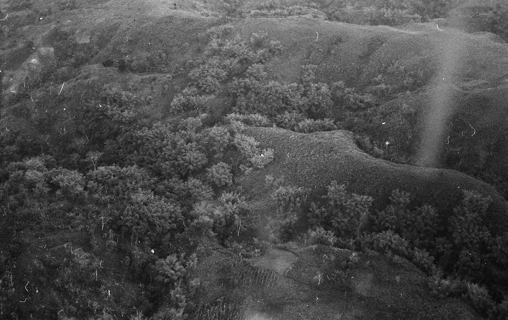{.lightbox group="discovery-bay-1966" description="**UUID: **b7fdce60-b23d-45f4-aba8-46291b6946e2 **Date: **1966-08-30 **Location: **Jamaica | Discovery Bay | Onshore **Longitude: **77.41543ºW **Latitude: **18.468618ºN **Photographer: **Eileen Graham **Copyright: **Trustees of the Natural History Museum (London, UK), CC-BY-4.0" alt="**UUID: **b7fdce60-b23d-45f4-aba8-46291b6946e2 **Date: **1966-08-30 **Location: **Jamaica | Discovery Bay | Onshore **Longitude: **77.41543ºW **Latitude: **18.468618ºN **Photographer: **Eileen Graham **Copyright: **Trustees of the Natural History Museum (London, UK), CC-BY-4.0"}

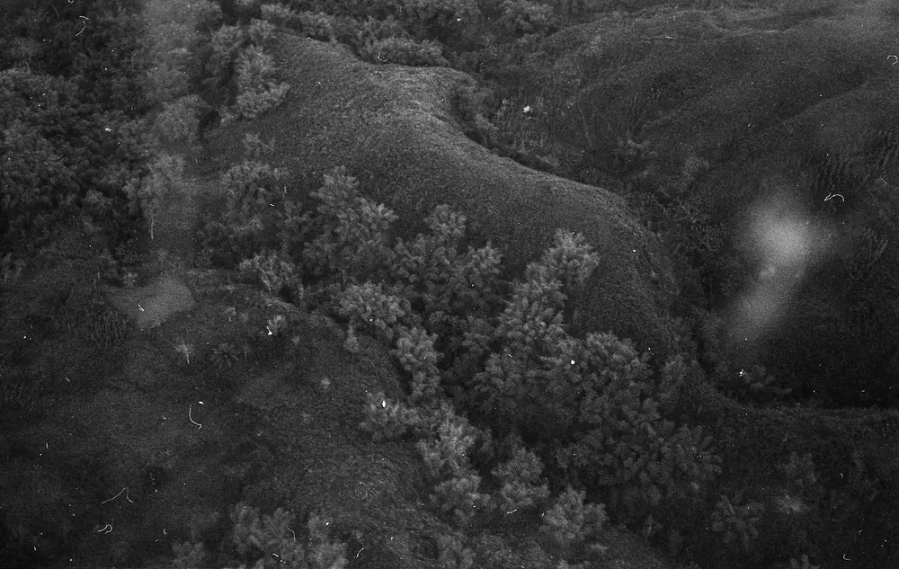{.lightbox group="discovery-bay-1966" description="**UUID: **938c9f79-beb5-4a30-9260-f99ae462a2f0 **Date: **1966-08-30 **Location: **Jamaica | Discovery Bay | Onshore **Longitude: **77.41543ºW **Latitude: **18.468618ºN **Photographer: **Eileen Graham **Copyright: **Trustees of the Natural History Museum (London, UK), CC-BY-4.0" alt="**UUID: **938c9f79-beb5-4a30-9260-f99ae462a2f0 **Date: **1966-08-30 **Location: **Jamaica | Discovery Bay | Onshore **Longitude: **77.41543ºW **Latitude: **18.468618ºN **Photographer: **Eileen Graham **Copyright: **Trustees of the Natural History Museum (London, UK), CC-BY-4.0"}

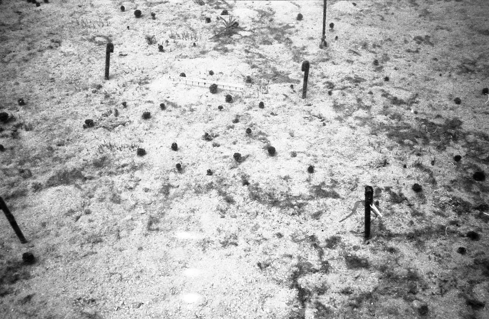{.lightbox group="discovery-bay-1966" description="**UUID: **ec914106-562e-43db-b090-e40e7aba4961 **Date: **1966-08-30 **Location: **Jamaica | Discovery Bay | Algal Plots **Longitude: **77.414ºW **Latitude: **18.473ºN **Photographer: **Eileen Graham **Copyright: **Trustees of the Natural History Museum (London, UK), CC-BY-4.0" alt="**UUID: **ec914106-562e-43db-b090-e40e7aba4961 **Date: **1966-08-30 **Location: **Jamaica | Discovery Bay | Algal Plots **Longitude: **77.414ºW **Latitude: **18.473ºN **Photographer: **Eileen Graham **Copyright: **Trustees of the Natural History Museum (London, UK), CC-BY-4.0"}

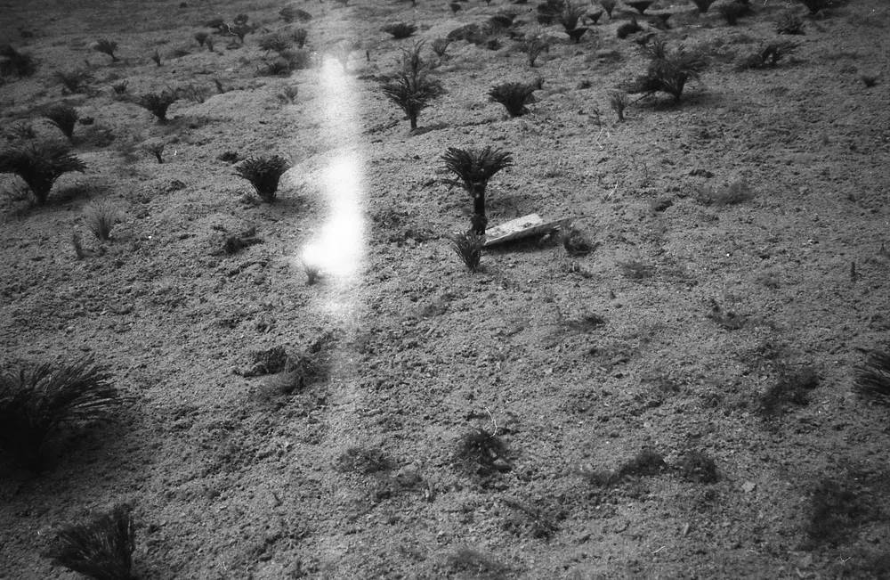{.lightbox group="discovery-bay-1966" description="**UUID: **027768b9-cda2-4230-9ca6-3195e0bbef9e **Date: **1966-08-30 **Location: **Jamaica | Discovery Bay | Algal Plots **Longitude: **77.414ºW **Latitude: **18.473ºN **Photographer: **Eileen Graham **Copyright: **Trustees of the Natural History Museum (London, UK), CC-BY-4.0" alt="**UUID: **027768b9-cda2-4230-9ca6-3195e0bbef9e **Date: **1966-08-30 **Location: **Jamaica | Discovery Bay | Algal Plots **Longitude: **77.414ºW **Latitude: **18.473ºN **Photographer: **Eileen Graham **Copyright: **Trustees of the Natural History Museum (London, UK), CC-BY-4.0"}

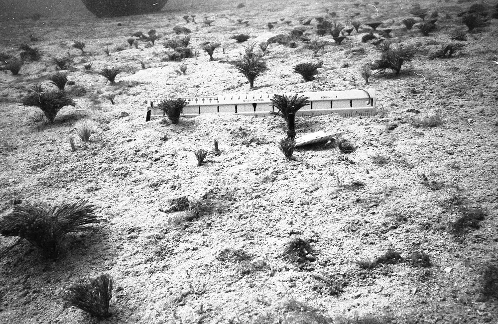{.lightbox group="discovery-bay-1966" description="**UUID: **a99e9c7b-6c2c-4e80-a382-de36eae72b43 **Date: **1966-08-30 **Location: **Jamaica | Discovery Bay | Algal Plots **Longitude: **77.414ºW **Latitude: **18.473ºN **Photographer: **Eileen Graham **Copyright: **Trustees of the Natural History Museum (London, UK), CC-BY-4.0" alt="**UUID: **a99e9c7b-6c2c-4e80-a382-de36eae72b43 **Date: **1966-08-30 **Location: **Jamaica | Discovery Bay | Algal Plots **Longitude: **77.414ºW **Latitude: **18.473ºN **Photographer: **Eileen Graham **Copyright: **Trustees of the Natural History Museum (London, UK), CC-BY-4.0"}

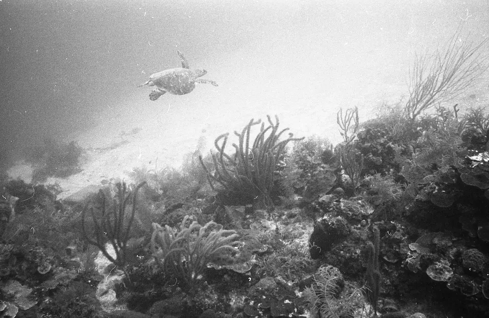{.lightbox group="discovery-bay-1966" description="**UUID: **1644fd34-4249-43ff-8520-5277b1a8bc5d **Date: **1966-08-30 **Location: **Jamaica | Discovery Bay | Buoy Upper Slope **Longitude: **77.40908ºW **Latitude: **18.47322ºN **Photographer: **Eileen Graham **Copyright: **Trustees of the Natural History Museum (London, UK), CC-BY-4.0" alt="**UUID: **1644fd34-4249-43ff-8520-5277b1a8bc5d **Date: **1966-08-30 **Location: **Jamaica | Discovery Bay | Buoy Upper Slope **Longitude: **77.40908ºW **Latitude: **18.47322ºN **Photographer: **Eileen Graham **Copyright: **Trustees of the Natural History Museum (London, UK), CC-BY-4.0"}

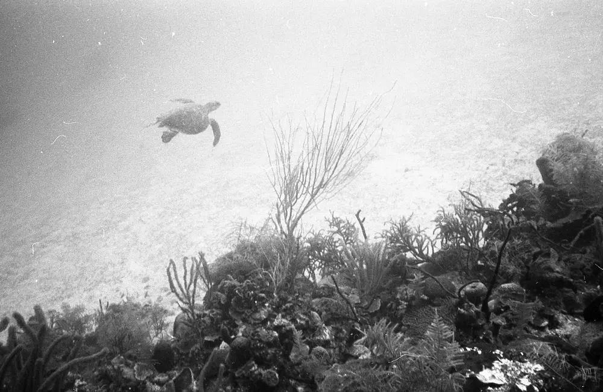{.lightbox group="discovery-bay-1966" description="**UUID: **c072fa02-3cbb-4fd7-9fc4-f51117b8f126 **Date: **1966-08-30 **Location: **Jamaica | Discovery Bay | Buoy Upper Slope **Longitude: **77.40908ºW **Latitude: **18.47322ºN **Photographer: **Eileen Graham **Copyright: **Trustees of the Natural History Museum (London, UK), CC-BY-4.0" alt="**UUID: **c072fa02-3cbb-4fd7-9fc4-f51117b8f126 **Date: **1966-08-30 **Location: **Jamaica | Discovery Bay | Buoy Upper Slope **Longitude: **77.40908ºW **Latitude: **18.47322ºN **Photographer: **Eileen Graham **Copyright: **Trustees of the Natural History Museum (London, UK), CC-BY-4.0"}

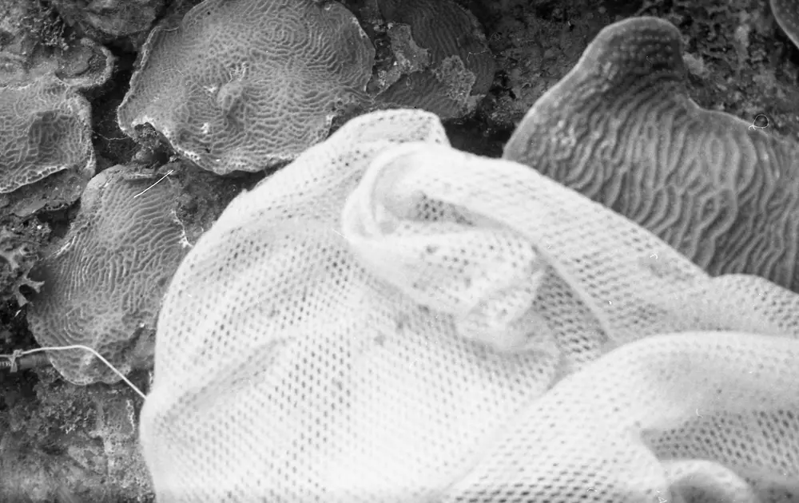{.lightbox group="discovery-bay-1966" description="**UUID: **adff5c10-d695-4d0b-8784-5311afeaeac3 **Date: **1966-09-14 **Location: **Jamaica | Discovery Bay | Buoy Upper Slope **Longitude: **77.40908ºW **Latitude: **18.47322ºN **Photographer: **Eileen Graham **Copyright: **Trustees of the Natural History Museum (London, UK), CC-BY-4.0" alt="**UUID: **adff5c10-d695-4d0b-8784-5311afeaeac3 **Date: **1966-09-14 **Location: **Jamaica | Discovery Bay | Buoy Upper Slope **Longitude: **77.40908ºW **Latitude: **18.47322ºN **Photographer: **Eileen Graham **Copyright: **Trustees of the Natural History Museum (London, UK), CC-BY-4.0"}

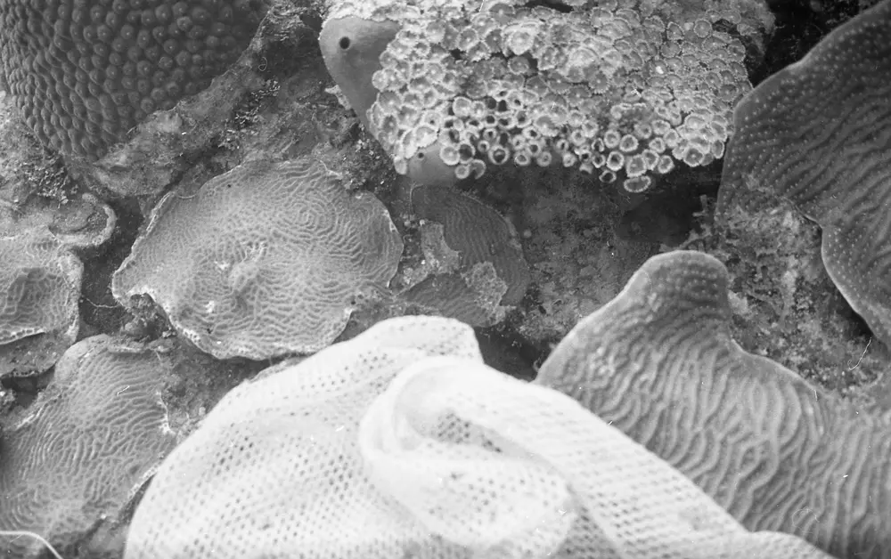{.lightbox group="discovery-bay-1966" description="**UUID: **6c210afc-0451-4684-8a1a-af9d6519931f **Date: **1966-09-14 **Location: **Jamaica | Discovery Bay | Buoy Upper Slope **Longitude: **77.40908ºW **Latitude: **18.47322ºN **Photographer: **Eileen Graham **Copyright: **Trustees of the Natural History Museum (London, UK), CC-BY-4.0" alt="**UUID: **6c210afc-0451-4684-8a1a-af9d6519931f **Date: **1966-09-14 **Location: **Jamaica | Discovery Bay | Buoy Upper Slope **Longitude: **77.40908ºW **Latitude: **18.47322ºN **Photographer: **Eileen Graham **Copyright: **Trustees of the Natural History Museum (London, UK), CC-BY-4.0"}

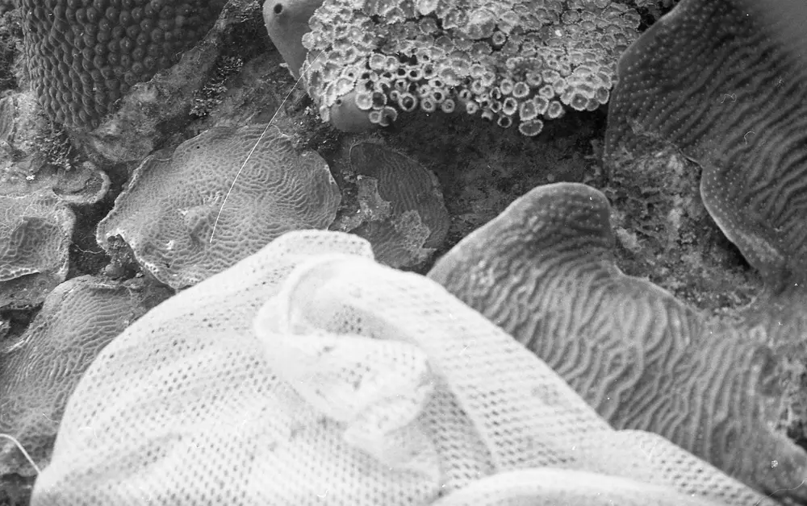{.lightbox group="discovery-bay-1966" description="**UUID: **316e3f8d-e097-4d12-9f98-98e3f8d34bb1 **Date: **1966-09-14 **Location: **Jamaica | Discovery Bay | Buoy Upper Slope **Longitude: **77.40908ºW **Latitude: **18.47322ºN **Photographer: **Eileen Graham **Copyright: **Trustees of the Natural History Museum (London, UK), CC-BY-4.0" alt="**UUID: **316e3f8d-e097-4d12-9f98-98e3f8d34bb1 **Date: **1966-09-14 **Location: **Jamaica | Discovery Bay | Buoy Upper Slope **Longitude: **77.40908ºW **Latitude: **18.47322ºN **Photographer: **Eileen Graham **Copyright: **Trustees of the Natural History Museum (London, UK), CC-BY-4.0"}

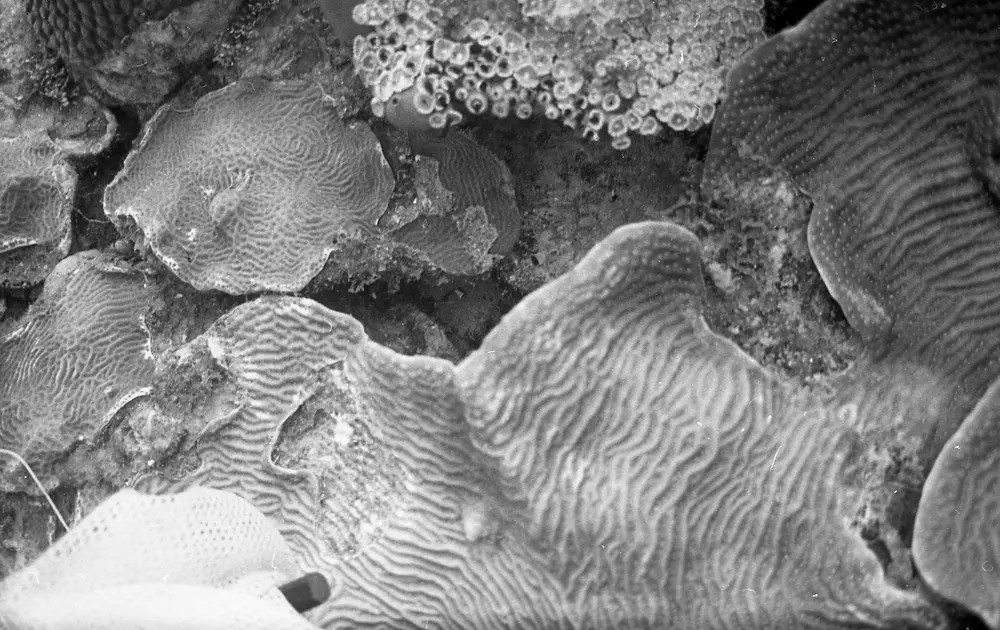{.lightbox group="discovery-bay-1966" description="**UUID: **ad068957-f811-415e-a54e-1dbbc91410a2 **Date: **1966-09-14 **Location: **Jamaica | Discovery Bay | Buoy Upper Slope **Longitude: **77.40908ºW **Latitude: **18.47322ºN **Photographer: **Eileen Graham **Copyright: **Trustees of the Natural History Museum (London, UK), CC-BY-4.0" alt="**UUID: **ad068957-f811-415e-a54e-1dbbc91410a2 **Date: **1966-09-14 **Location: **Jamaica | Discovery Bay | Buoy Upper Slope **Longitude: **77.40908ºW **Latitude: **18.47322ºN **Photographer: **Eileen Graham **Copyright: **Trustees of the Natural History Museum (London, UK), CC-BY-4.0"}

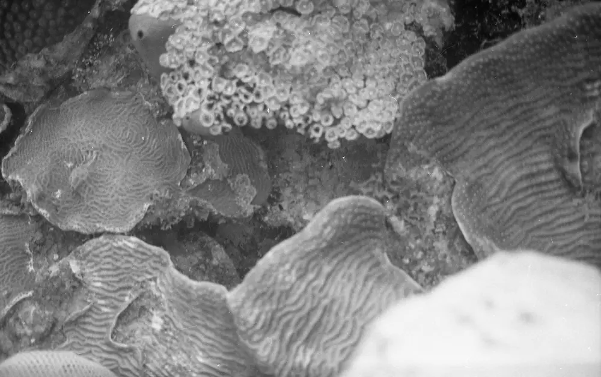{.lightbox group="discovery-bay-1966" description="**UUID: **0b83b73a-d4f4-4002-ac2a-afd79d6f0e62 **Date: **1966-09-14 **Location: **Jamaica | Discovery Bay | Buoy Upper Slope **Longitude: **77.40908ºW **Latitude: **18.47322ºN **Photographer: **Eileen Graham **Copyright: **Trustees of the Natural History Museum (London, UK), CC-BY-4.0" alt="**UUID: **0b83b73a-d4f4-4002-ac2a-afd79d6f0e62 **Date: **1966-09-14 **Location: **Jamaica | Discovery Bay | Buoy Upper Slope **Longitude: **77.40908ºW **Latitude: **18.47322ºN **Photographer: **Eileen Graham **Copyright: **Trustees of the Natural History Museum (London, UK), CC-BY-4.0"}

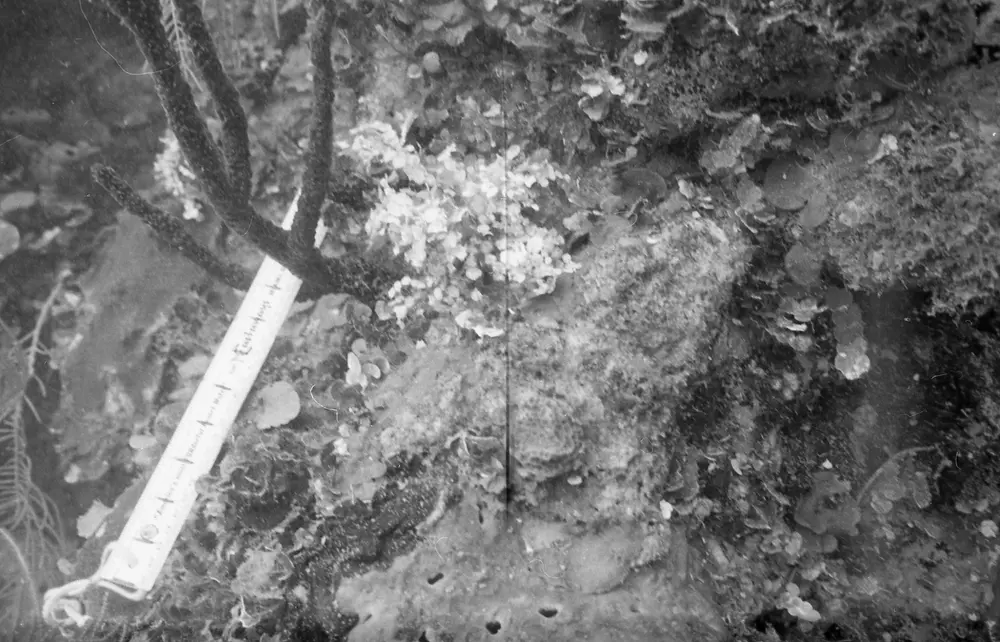{.lightbox group="discovery-bay-1966" description="**UUID: **113a1aa1-0f4b-42bb-812f-eac58862b957 **Date: **1966-09-14 **Location: **Jamaica | Discovery Bay | Buoy Upper Slope **Longitude: **77.40908ºW **Latitude: **18.47322ºN **Photographer: **Eileen Graham **Copyright: **Trustees of the Natural History Museum (London, UK), CC-BY-4.0" alt="**UUID: **113a1aa1-0f4b-42bb-812f-eac58862b957 **Date: **1966-09-14 **Location: **Jamaica | Discovery Bay | Buoy Upper Slope **Longitude: **77.40908ºW **Latitude: **18.47322ºN **Photographer: **Eileen Graham **Copyright: **Trustees of the Natural History Museum (London, UK), CC-BY-4.0"}

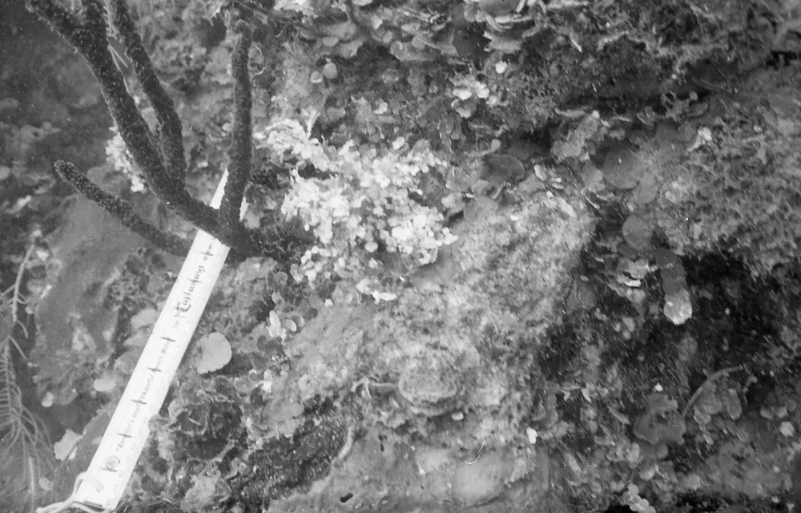{.lightbox group="discovery-bay-1966" description="**UUID: **e398f56d-7bb4-47e7-96ae-53c7d3a47132 **Date: **1966-09-14 **Location: **Jamaica | Discovery Bay | Buoy Upper Slope **Longitude: **77.40908ºW **Latitude: **18.47322ºN **Photographer: **Eileen Graham **Copyright: **Trustees of the Natural History Museum (London, UK), CC-BY-4.0" alt="**UUID: **e398f56d-7bb4-47e7-96ae-53c7d3a47132 **Date: **1966-09-14 **Location: **Jamaica | Discovery Bay | Buoy Upper Slope **Longitude: **77.40908ºW **Latitude: **18.47322ºN **Photographer: **Eileen Graham **Copyright: **Trustees of the Natural History Museum (London, UK), CC-BY-4.0"}

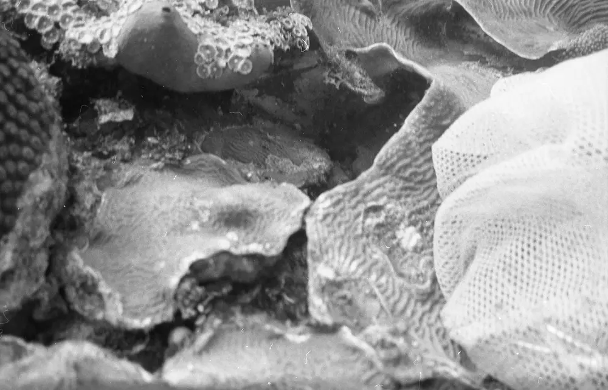{.lightbox group="discovery-bay-1966" description="**UUID: **d17b48bc-d26f-460b-bd52-e7aca0003a37 **Date: **1966-09-14 **Location: **Jamaica | Discovery Bay | Buoy Upper Slope **Longitude: **77.40908ºW **Latitude: **18.47322ºN **Photographer: **Eileen Graham **Copyright: **Trustees of the Natural History Museum (London, UK), CC-BY-4.0" alt="**UUID: **d17b48bc-d26f-460b-bd52-e7aca0003a37 **Date: **1966-09-14 **Location: **Jamaica | Discovery Bay | Buoy Upper Slope **Longitude: **77.40908ºW **Latitude: **18.47322ºN **Photographer: **Eileen Graham **Copyright: **Trustees of the Natural History Museum (London, UK), CC-BY-4.0"}

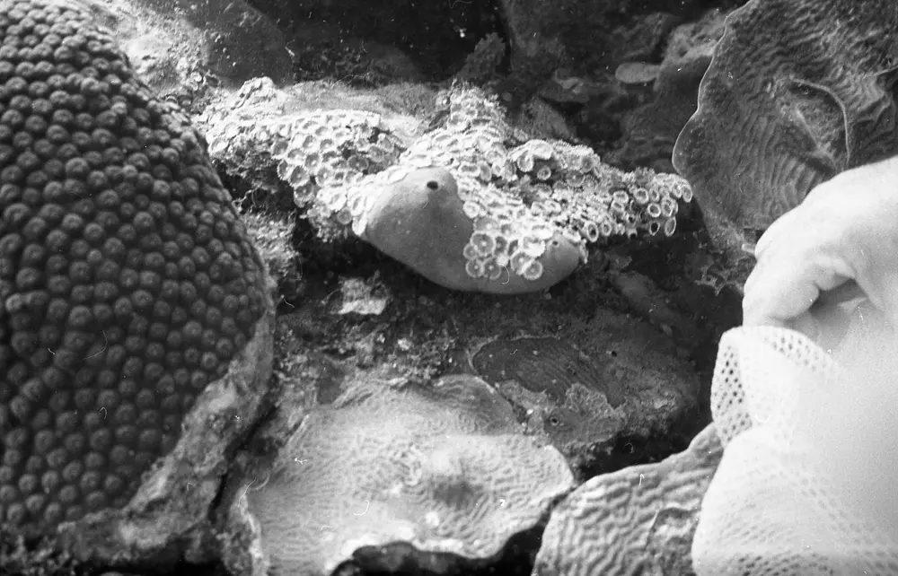{.lightbox group="discovery-bay-1966" description="**UUID: **a4c47436-c881-43a4-ba76-33dc15e9a4d7 **Date: **1966-09-14 **Location: **Jamaica | Discovery Bay | Buoy Upper Slope **Longitude: **77.40908ºW **Latitude: **18.47322ºN **Photographer: **Eileen Graham **Copyright: **Trustees of the Natural History Museum (London, UK), CC-BY-4.0" alt="**UUID: **a4c47436-c881-43a4-ba76-33dc15e9a4d7 **Date: **1966-09-14 **Location: **Jamaica | Discovery Bay | Buoy Upper Slope **Longitude: **77.40908ºW **Latitude: **18.47322ºN **Photographer: **Eileen Graham **Copyright: **Trustees of the Natural History Museum (London, UK), CC-BY-4.0"}

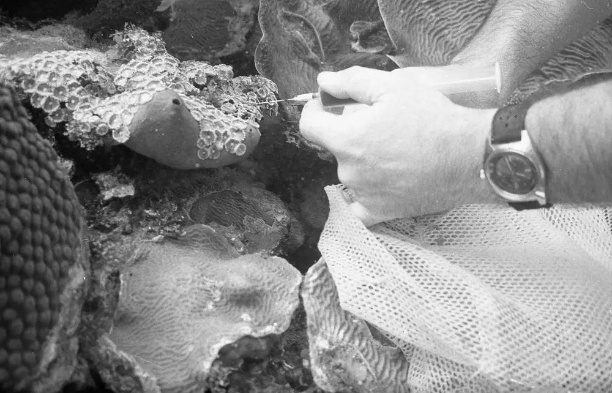{.lightbox group="discovery-bay-1966" description="**UUID: **7dc1640a-c2f5-428a-a343-c92534ed347e **Date: **1966-09-14 **Location: **Jamaica | Discovery Bay | Buoy Upper Slope **Longitude: **77.40908ºW **Latitude: **18.47322ºN **Photographer: **Eileen Graham **Copyright: **Trustees of the Natural History Museum (London, UK), CC-BY-4.0" alt="**UUID: **7dc1640a-c2f5-428a-a343-c92534ed347e **Date: **1966-09-14 **Location: **Jamaica | Discovery Bay | Buoy Upper Slope **Longitude: **77.40908ºW **Latitude: **18.47322ºN **Photographer: **Eileen Graham **Copyright: **Trustees of the Natural History Museum (London, UK), CC-BY-4.0"}

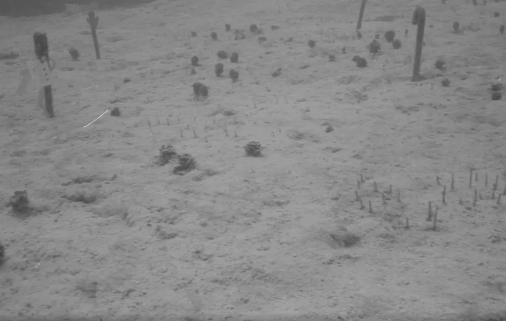{.lightbox group="discovery-bay-1966" description="**UUID: **36881d85-a3e4-4077-af8e-03cd1fbe856c **Date: **1966-09-14 **Location: **Jamaica | Discovery Bay | Algal Plots **Longitude: **77.414ºW **Latitude: **18.473ºN **Photographer: **Eileen Graham **Copyright: **Trustees of the Natural History Museum (London, UK), CC-BY-4.0" alt="**UUID: **36881d85-a3e4-4077-af8e-03cd1fbe856c **Date: **1966-09-14 **Location: **Jamaica | Discovery Bay | Algal Plots **Longitude: **77.414ºW **Latitude: **18.473ºN **Photographer: **Eileen Graham **Copyright: **Trustees of the Natural History Museum (London, UK), CC-BY-4.0"}

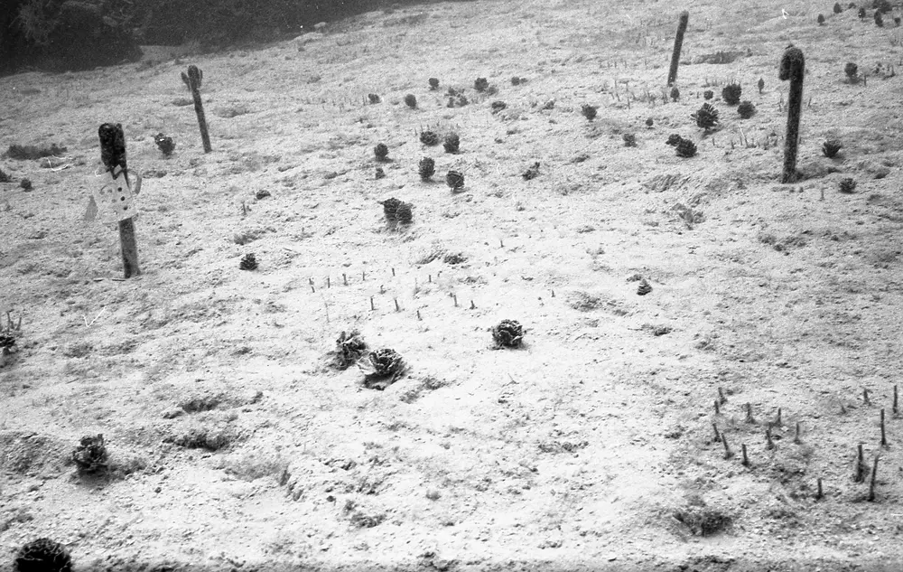{.lightbox group="discovery-bay-1966" description="**UUID: **d866ab91-cdbb-4993-a514-f90af92dd6d4 **Date: **1966-09-14 **Location: **Jamaica | Discovery Bay | Algal Plots **Longitude: **77.414ºW **Latitude: **18.473ºN **Photographer: **Eileen Graham **Copyright: **Trustees of the Natural History Museum (London, UK), CC-BY-4.0" alt="**UUID: **d866ab91-cdbb-4993-a514-f90af92dd6d4 **Date: **1966-09-14 **Location: **Jamaica | Discovery Bay | Algal Plots **Longitude: **77.414ºW **Latitude: **18.473ºN **Photographer: **Eileen Graham **Copyright: **Trustees of the Natural History Museum (London, UK), CC-BY-4.0"}

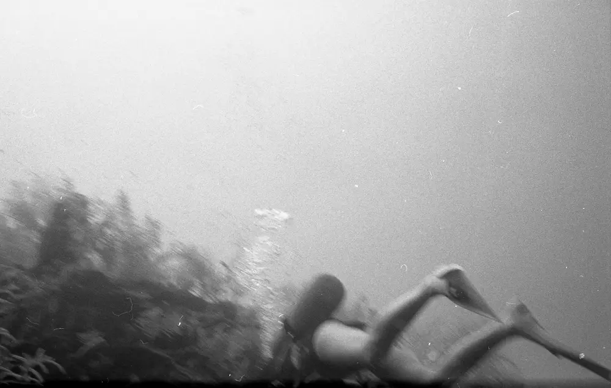{.lightbox group="discovery-bay-1966" description="**UUID: **a48c72b9-7563-4e08-be44-f11da82ab308 **Date: **1966-09-14 **Location: **Jamaica | Discovery Bay | Buoy Upper Slope **Longitude: **77.40908ºW **Latitude: **18.47322ºN **Photographer: **Eileen Graham **Copyright: **Trustees of the Natural History Museum (London, UK), CC-BY-4.0" alt="**UUID: **a48c72b9-7563-4e08-be44-f11da82ab308 **Date: **1966-09-14 **Location: **Jamaica | Discovery Bay | Buoy Upper Slope **Longitude: **77.40908ºW **Latitude: **18.47322ºN **Photographer: **Eileen Graham **Copyright: **Trustees of the Natural History Museum (London, UK), CC-BY-4.0"}

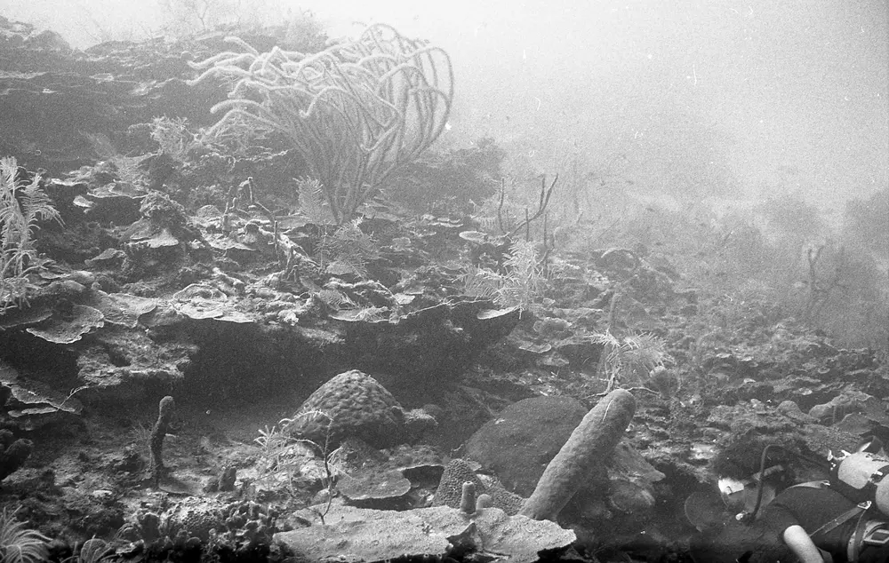{.lightbox group="discovery-bay-1966" description="**UUID: **0f086b5e-8851-432c-93c7-99c2244f04ae **Date: **1966-09-14 **Location: **Jamaica | Discovery Bay | Buoy Upper Slope **Longitude: **77.40908ºW **Latitude: **18.47322ºN **Photographer: **Eileen Graham **Copyright: **Trustees of the Natural History Museum (London, UK), CC-BY-4.0" alt="**UUID: **0f086b5e-8851-432c-93c7-99c2244f04ae **Date: **1966-09-14 **Location: **Jamaica | Discovery Bay | Buoy Upper Slope **Longitude: **77.40908ºW **Latitude: **18.47322ºN **Photographer: **Eileen Graham **Copyright: **Trustees of the Natural History Museum (London, UK), CC-BY-4.0"}

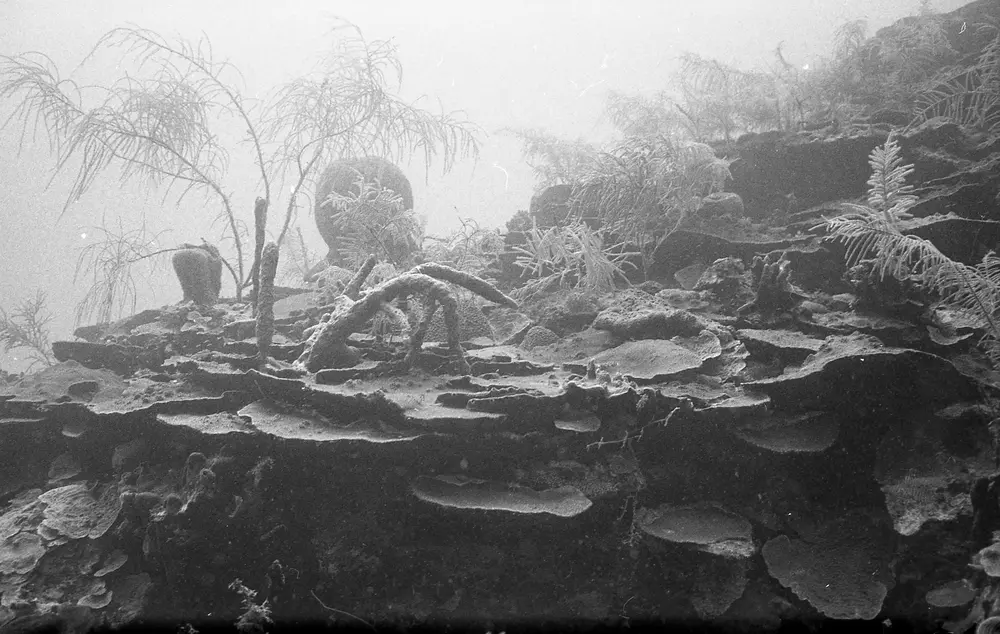{.lightbox group="discovery-bay-1966" description="**UUID: **c52b65e1-4f89-466c-89d2-6439c3bfa461 **Date: **1966-09-14 **Location: **Jamaica | Discovery Bay | Buoy Upper Slope **Longitude: **77.40908ºW **Latitude: **18.47322ºN **Photographer: **Eileen Graham **Copyright: **Trustees of the Natural History Museum (London, UK), CC-BY-4.0" alt="**UUID: **c52b65e1-4f89-466c-89d2-6439c3bfa461 **Date: **1966-09-14 **Location: **Jamaica | Discovery Bay | Buoy Upper Slope **Longitude: **77.40908ºW **Latitude: **18.47322ºN **Photographer: **Eileen Graham **Copyright: **Trustees of the Natural History Museum (London, UK), CC-BY-4.0"}

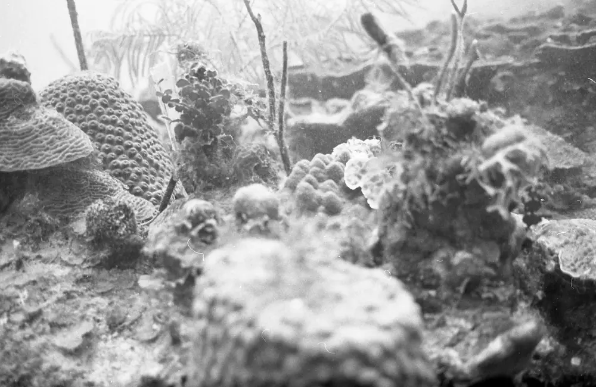{.lightbox group="discovery-bay-1966" description="**UUID: **27c58d22-7441-476b-b94a-70338bab1b4d **Date: **1966-09-14 **Location: **Jamaica | Discovery Bay | Buoy Upper Slope **Longitude: **77.40908ºW **Latitude: **18.47322ºN **Photographer: **Eileen Graham **Copyright: **Trustees of the Natural History Museum (London, UK), CC-BY-4.0" alt="**UUID: **27c58d22-7441-476b-b94a-70338bab1b4d **Date: **1966-09-14 **Location: **Jamaica | Discovery Bay | Buoy Upper Slope **Longitude: **77.40908ºW **Latitude: **18.47322ºN **Photographer: **Eileen Graham **Copyright: **Trustees of the Natural History Museum (London, UK), CC-BY-4.0"}

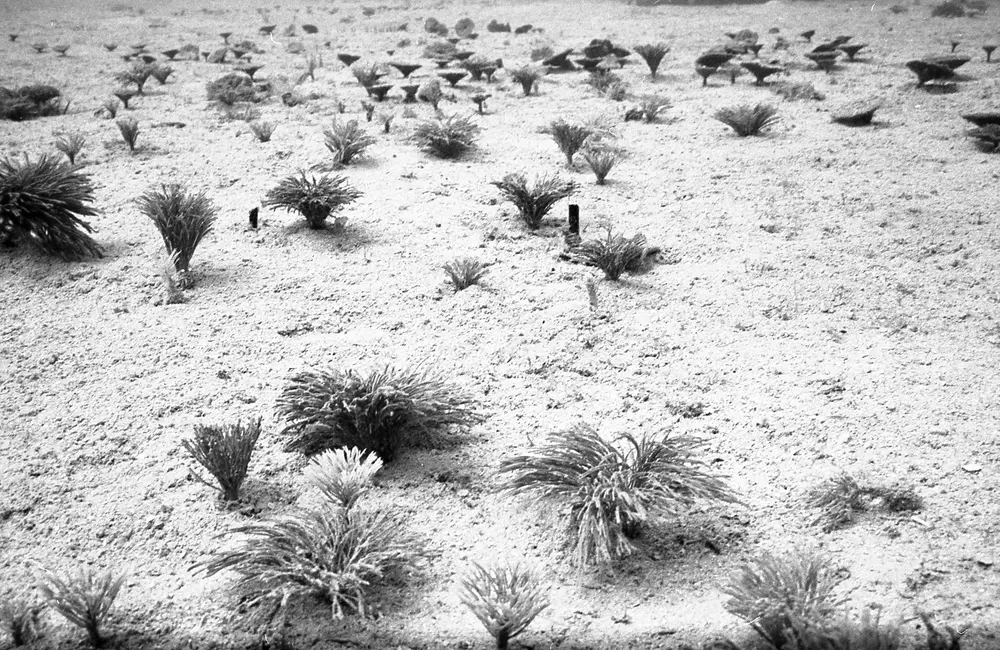{.lightbox group="discovery-bay-1966" description="**UUID: **107f3b56-3cca-48bc-a810-3d3f674758ed **Date: **1966-09-14 **Location: **Jamaica | Discovery Bay | Algal Plots **Longitude: **77.414ºW **Latitude: **18.473ºN **Photographer: **Eileen Graham **Copyright: **Trustees of the Natural History Museum (London, UK), CC-BY-4.0" alt="**UUID: **107f3b56-3cca-48bc-a810-3d3f674758ed **Date: **1966-09-14 **Location: **Jamaica | Discovery Bay | Algal Plots **Longitude: **77.414ºW **Latitude: **18.473ºN **Photographer: **Eileen Graham **Copyright: **Trustees of the Natural History Museum (London, UK), CC-BY-4.0"}

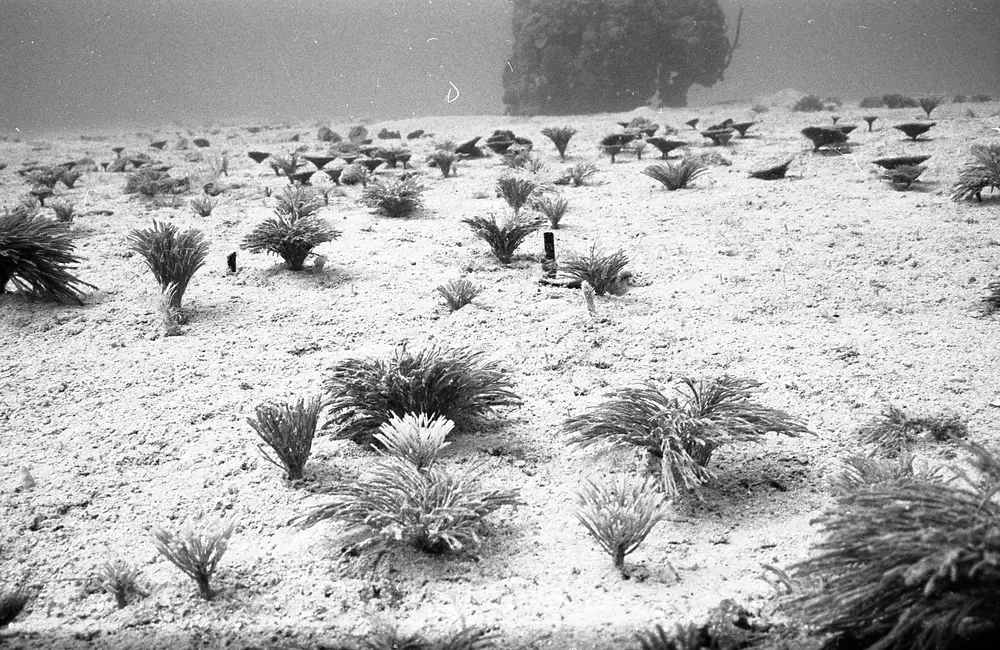{.lightbox group="discovery-bay-1966" description="**UUID: **43e0a313-ab0e-441c-bafb-1dfbd92f5e41 **Date: **1966-09-14 **Location: **Jamaica | Discovery Bay | Algal Plots **Longitude: **77.414ºW **Latitude: **18.473ºN **Photographer: **Eileen Graham **Copyright: **Trustees of the Natural History Museum (London, UK), CC-BY-4.0" alt="**UUID: **43e0a313-ab0e-441c-bafb-1dfbd92f5e41 **Date: **1966-09-14 **Location: **Jamaica | Discovery Bay | Algal Plots **Longitude: **77.414ºW **Latitude: **18.473ºN **Photographer: **Eileen Graham **Copyright: **Trustees of the Natural History Museum (London, UK), CC-BY-4.0"}

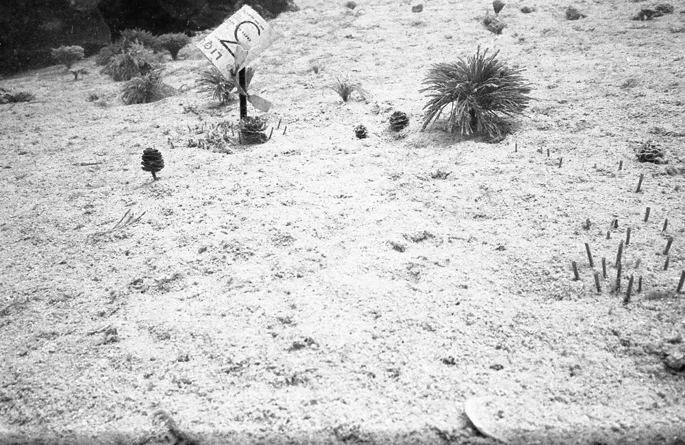{.lightbox group="discovery-bay-1966" description="**UUID: **7b9abd89-cfce-41c9-97fd-cb94d1bbfb65 **Date: **1966-09-14 **Location: **Jamaica | Discovery Bay | Algal Plots **Longitude: **77.414ºW **Latitude: **18.473ºN **Photographer: **Eileen Graham **Copyright: **Trustees of the Natural History Museum (London, UK), CC-BY-4.0" alt="**UUID: **7b9abd89-cfce-41c9-97fd-cb94d1bbfb65 **Date: **1966-09-14 **Location: **Jamaica | Discovery Bay | Algal Plots **Longitude: **77.414ºW **Latitude: **18.473ºN **Photographer: **Eileen Graham **Copyright: **Trustees of the Natural History Museum (London, UK), CC-BY-4.0"}

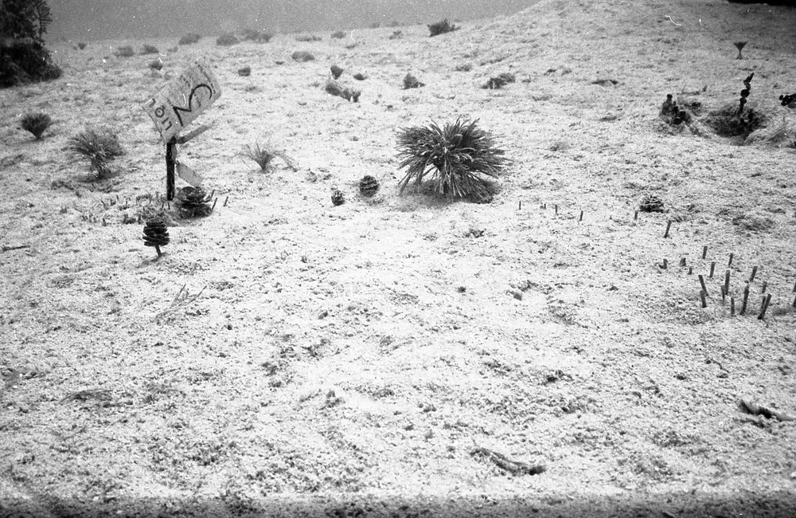{.lightbox group="discovery-bay-1966" description="**UUID: **bc0350ea-2336-427c-9386-2ea6b3f9c0c8 **Date: **1966-09-14 **Location: **Jamaica | Discovery Bay | Algal Plots **Longitude: **77.414ºW **Latitude: **18.473ºN **Photographer: **Eileen Graham **Copyright: **Trustees of the Natural History Museum (London, UK), CC-BY-4.0" alt="**UUID: **bc0350ea-2336-427c-9386-2ea6b3f9c0c8 **Date: **1966-09-14 **Location: **Jamaica | Discovery Bay | Algal Plots **Longitude: **77.414ºW **Latitude: **18.473ºN **Photographer: **Eileen Graham **Copyright: **Trustees of the Natural History Museum (London, UK), CC-BY-4.0"}

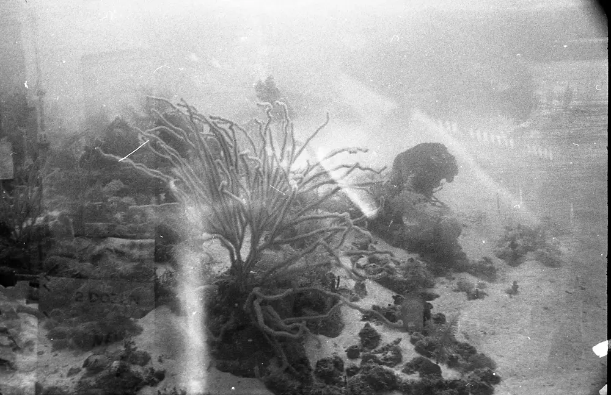{.lightbox group="discovery-bay-1966" description="**UUID: **824c1c1a-6622-4288-a39b-5394d51c2a08 **Date: **1966-09-25 **Location: **Jamaica | Discovery Bay | Buoy Upper Slope **Longitude: **77.40908ºW **Latitude: **18.47322ºN **Photographer: **Eileen Graham **Copyright: **Trustees of the Natural History Museum (London, UK), CC-BY-4.0" alt="**UUID: **824c1c1a-6622-4288-a39b-5394d51c2a08 **Date: **1966-09-25 **Location: **Jamaica | Discovery Bay | Buoy Upper Slope **Longitude: **77.40908ºW **Latitude: **18.47322ºN **Photographer: **Eileen Graham **Copyright: **Trustees of the Natural History Museum (London, UK), CC-BY-4.0"}

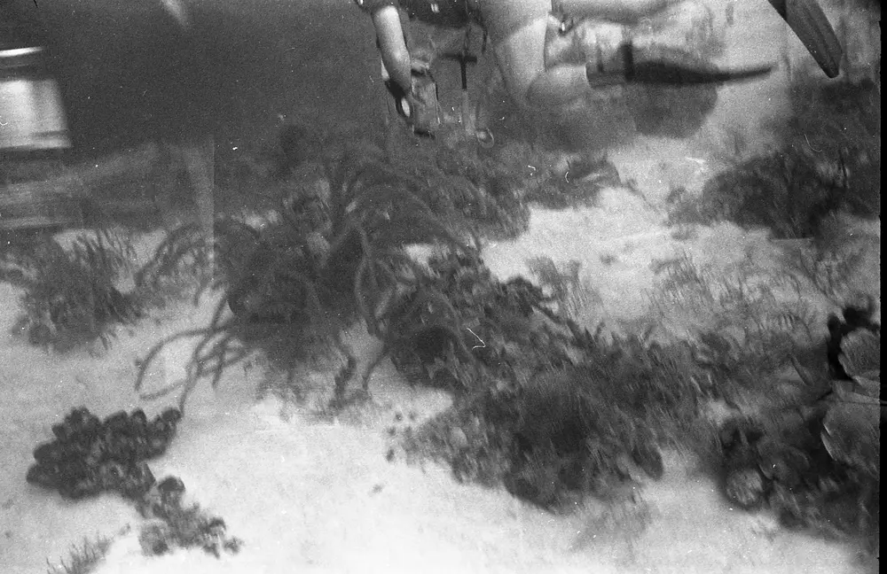{.lightbox group="discovery-bay-1966" description="**UUID: **c3495e1f-c1ad-4a77-9dab-a9c8173c0a5f **Date: **1966-09-25 **Location: **Jamaica | Discovery Bay | Buoy Upper Slope **Longitude: **77.40908ºW **Latitude: **18.47322ºN **Photographer: **Eileen Graham **Copyright: **Trustees of the Natural History Museum (London, UK), CC-BY-4.0" alt="**UUID: **c3495e1f-c1ad-4a77-9dab-a9c8173c0a5f **Date: **1966-09-25 **Location: **Jamaica | Discovery Bay | Buoy Upper Slope **Longitude: **77.40908ºW **Latitude: **18.47322ºN **Photographer: **Eileen Graham **Copyright: **Trustees of the Natural History Museum (London, UK), CC-BY-4.0"}

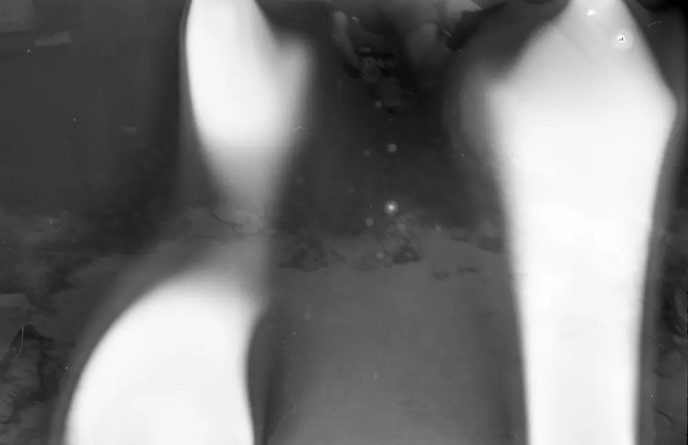{.lightbox group="discovery-bay-1966" description="**UUID: **27d853fb-c6f2-455c-963e-0e6b6396ec6d **Date: **1966-09-25 **Location: **Jamaica | Discovery Bay | Buoy Upper Slope **Longitude: **77.40908ºW **Latitude: **18.47322ºN **Photographer: **Eileen Graham **Copyright: **Trustees of the Natural History Museum (London, UK), CC-BY-4.0" alt="**UUID: **27d853fb-c6f2-455c-963e-0e6b6396ec6d **Date: **1966-09-25 **Location: **Jamaica | Discovery Bay | Buoy Upper Slope **Longitude: **77.40908ºW **Latitude: **18.47322ºN **Photographer: **Eileen Graham **Copyright: **Trustees of the Natural History Museum (London, UK), CC-BY-4.0"}

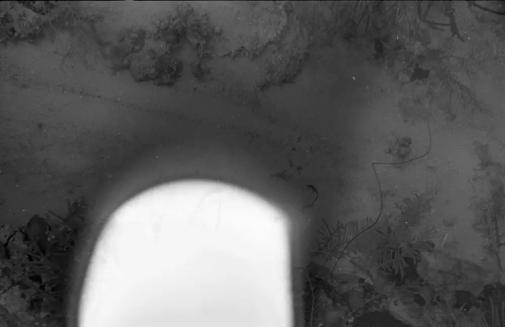{.lightbox group="discovery-bay-1966" description="**UUID: **47fd9ce8-092b-4cc1-a444-51f45050446c **Date: **1966-09-25 **Location: **Jamaica | Discovery Bay | Buoy Upper Slope **Longitude: **77.40908ºW **Latitude: **18.47322ºN **Photographer: **Eileen Graham **Copyright: **Trustees of the Natural History Museum (London, UK), CC-BY-4.0" alt="**UUID: **47fd9ce8-092b-4cc1-a444-51f45050446c **Date: **1966-09-25 **Location: **Jamaica | Discovery Bay | Buoy Upper Slope **Longitude: **77.40908ºW **Latitude: **18.47322ºN **Photographer: **Eileen Graham **Copyright: **Trustees of the Natural History Museum (London, UK), CC-BY-4.0"}

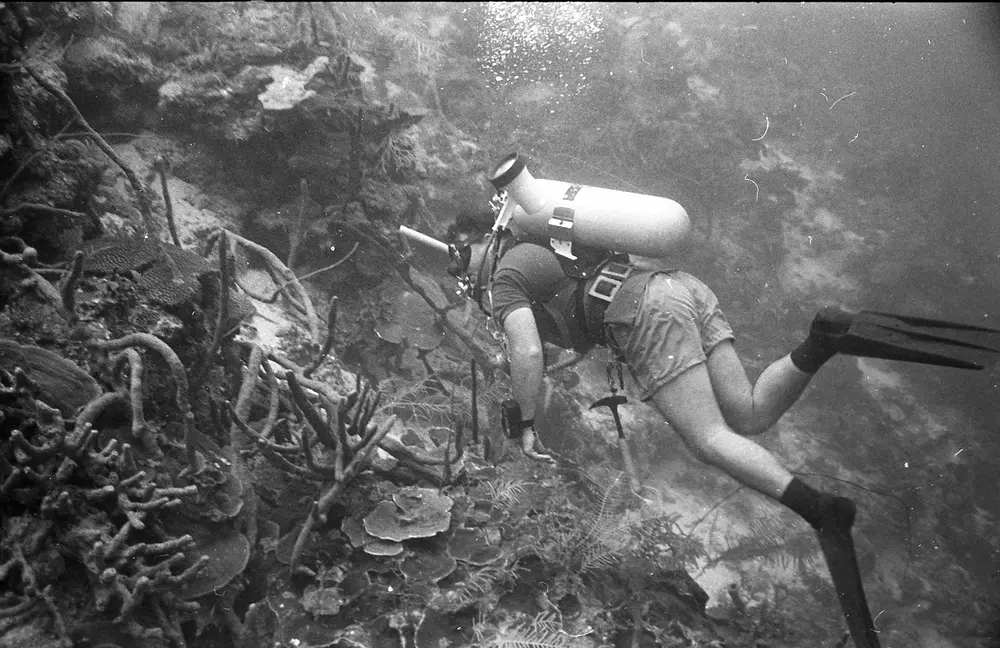{.lightbox group="discovery-bay-1966" description="**UUID: **f269deb6-ea6a-4a0f-b6ba-da64509b95bb **Date: **1966-09-25 **Location: **Jamaica | Discovery Bay | Buoy Deep **Longitude: **77.40908ºW **Latitude: **18.47325ºN **Photographer: **Eileen Graham **Copyright: **Trustees of the Natural History Museum (London, UK), CC-BY-4.0" alt="**UUID: **f269deb6-ea6a-4a0f-b6ba-da64509b95bb **Date: **1966-09-25 **Location: **Jamaica | Discovery Bay | Buoy Deep **Longitude: **77.40908ºW **Latitude: **18.47325ºN **Photographer: **Eileen Graham **Copyright: **Trustees of the Natural History Museum (London, UK), CC-BY-4.0"}

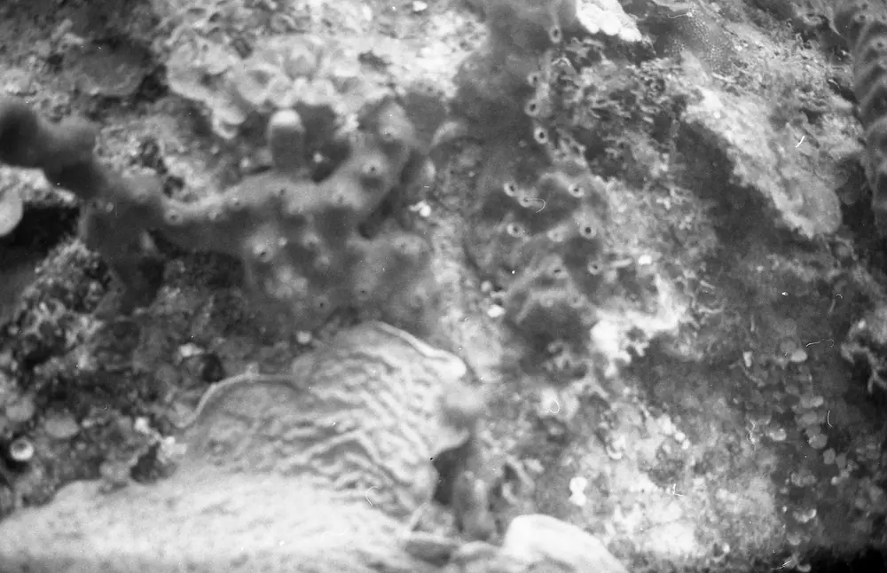{.lightbox group="discovery-bay-1966" description="**UUID: **9fa53f01-48bf-4fc2-9605-d3bceb280316 **Date: **1966-09-14 **Location: **Jamaica | Discovery Bay | Buoy Upper Slope **Longitude: **77.40908ºW **Latitude: **18.47322ºN **Photographer: **Eileen Graham **Copyright: **Trustees of the Natural History Museum (London, UK), CC-BY-4.0" alt="**UUID: **9fa53f01-48bf-4fc2-9605-d3bceb280316 **Date: **1966-09-14 **Location: **Jamaica | Discovery Bay | Buoy Upper Slope **Longitude: **77.40908ºW **Latitude: **18.47322ºN **Photographer: **Eileen Graham **Copyright: **Trustees of the Natural History Museum (London, UK), CC-BY-4.0"}

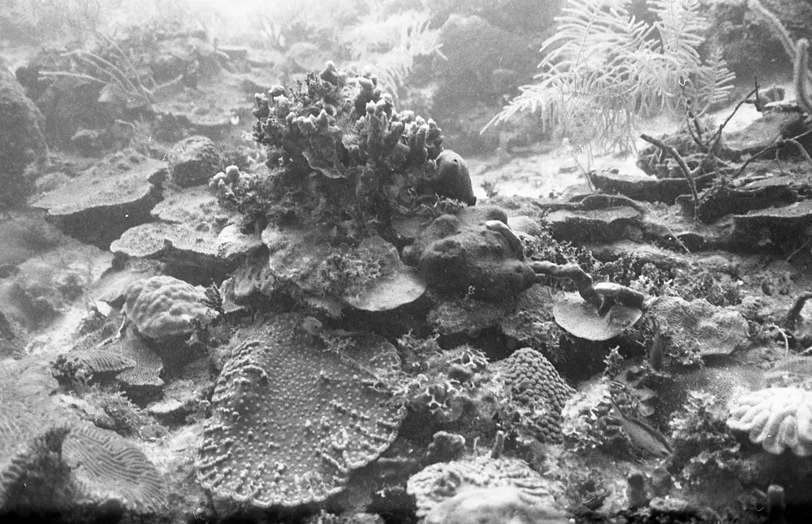{.lightbox group="discovery-bay-1966" description="**UUID: **f2ce172f-9510-4cd4-8829-c8e25784eb34 **Date: **1966-09-14 **Location: **Jamaica | Discovery Bay | Buoy Upper Slope **Longitude: **77.40908ºW **Latitude: **18.47322ºN **Photographer: **Eileen Graham **Copyright: **Trustees of the Natural History Museum (London, UK), CC-BY-4.0" alt="**UUID: **f2ce172f-9510-4cd4-8829-c8e25784eb34 **Date: **1966-09-14 **Location: **Jamaica | Discovery Bay | Buoy Upper Slope **Longitude: **77.40908ºW **Latitude: **18.47322ºN **Photographer: **Eileen Graham **Copyright: **Trustees of the Natural History Museum (London, UK), CC-BY-4.0"}

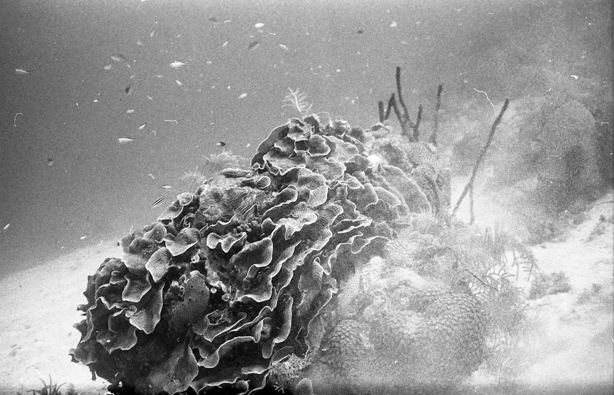{.lightbox group="discovery-bay-1966" description="**UUID: **cf0930e7-ec05-4dd7-8c60-8a6892cd5252 **Date: **1966-09-14 **Location: **Jamaica | Discovery Bay | Buoy Upper Slope **Longitude: **77.40908ºW **Latitude: **18.47322ºN **Photographer: **Eileen Graham **Copyright: **Trustees of the Natural History Museum (London, UK), CC-BY-4.0" alt="**UUID: **cf0930e7-ec05-4dd7-8c60-8a6892cd5252 **Date: **1966-09-14 **Location: **Jamaica | Discovery Bay | Buoy Upper Slope **Longitude: **77.40908ºW **Latitude: **18.47322ºN **Photographer: **Eileen Graham **Copyright: **Trustees of the Natural History Museum (London, UK), CC-BY-4.0"}

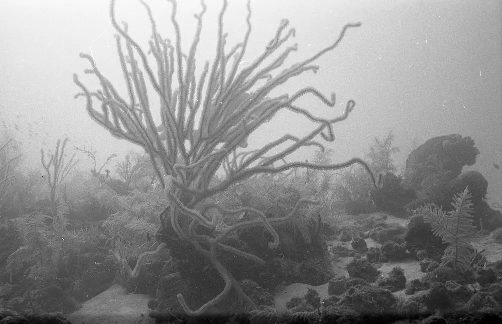{.lightbox group="discovery-bay-1966" description="**UUID: **ade7a64a-6dcc-4a25-85f4-2dda7b41de41 **Date: **1966-09-14 **Location: **Jamaica | Discovery Bay | Buoy Upper Slope **Longitude: **77.40908ºW **Latitude: **18.47322ºN **Photographer: **Eileen Graham **Copyright: **Trustees of the Natural History Museum (London, UK), CC-BY-4.0" alt="**UUID: **ade7a64a-6dcc-4a25-85f4-2dda7b41de41 **Date: **1966-09-14 **Location: **Jamaica | Discovery Bay | Buoy Upper Slope **Longitude: **77.40908ºW **Latitude: **18.47322ºN **Photographer: **Eileen Graham **Copyright: **Trustees of the Natural History Museum (London, UK), CC-BY-4.0"}

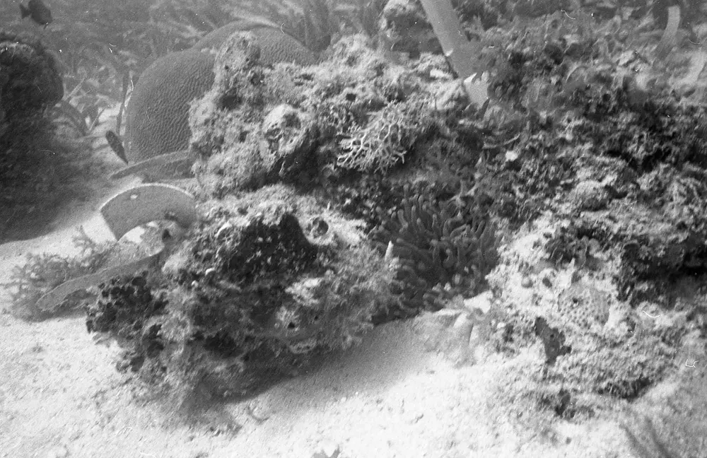{.lightbox group="discovery-bay-1966" description="**UUID: **f51e3e17-f2fa-414d-a4fb-ca4b3dd13551 **Date: **1966-09-14 **Location: **Jamaica | Discovery Bay | Discovery Bay Purden House **Longitude: **77.40268ºW **Latitude: **18.46868ºN **Photographer: **Eileen Graham **Copyright: **Trustees of the Natural History Museum (London, UK), CC-BY-4.0" alt="**UUID: **f51e3e17-f2fa-414d-a4fb-ca4b3dd13551 **Date: **1966-09-14 **Location: **Jamaica | Discovery Bay | Discovery Bay Purden House **Longitude: **77.40268ºW **Latitude: **18.46868ºN **Photographer: **Eileen Graham **Copyright: **Trustees of the Natural History Museum (London, UK), CC-BY-4.0"}

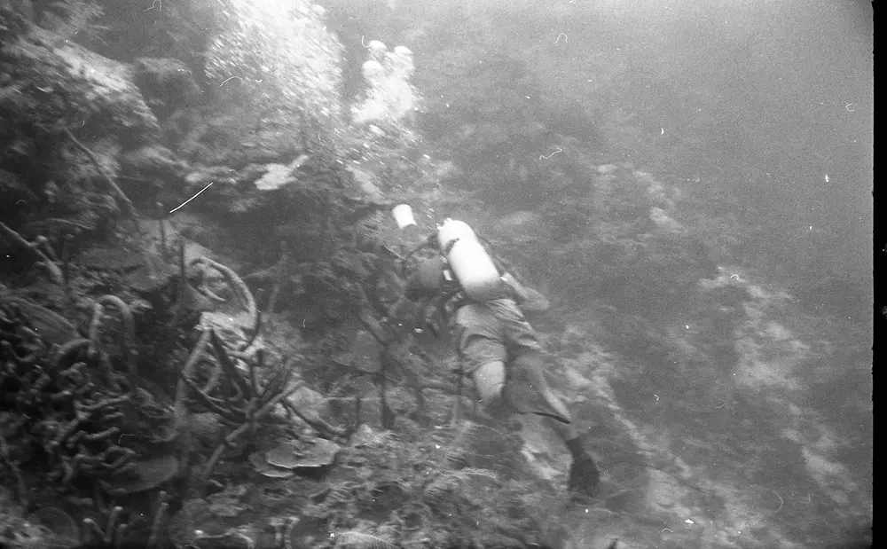{.lightbox group="discovery-bay-1966" description="**UUID: **5c10cd9f-0c77-47f3-9318-3c86a5bbb755 **Date: **1966-09-25 **Location: **Jamaica | Discovery Bay | Buoy Deep **Longitude: **77.40908ºW **Latitude: **18.47325ºN **Photographer: **Eileen Graham **Copyright: **Trustees of the Natural History Museum (London, UK), CC-BY-4.0" alt="**UUID: **5c10cd9f-0c77-47f3-9318-3c86a5bbb755 **Date: **1966-09-25 **Location: **Jamaica | Discovery Bay | Buoy Deep **Longitude: **77.40908ºW **Latitude: **18.47325ºN **Photographer: **Eileen Graham **Copyright: **Trustees of the Natural History Museum (London, UK), CC-BY-4.0"}

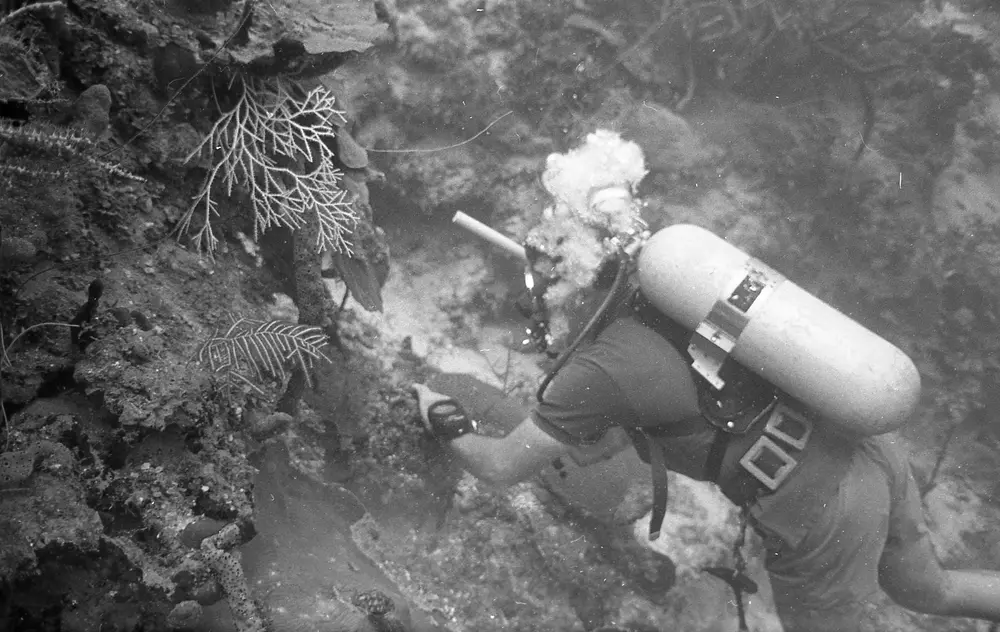{.lightbox group="discovery-bay-1966" description="**UUID: **7c0c76b1-3fea-4bea-bece-d68b5ea18870 **Date: **1966-09-25 **Location: **Jamaica | Discovery Bay | Buoy Deep **Longitude: **77.40908ºW **Latitude: **18.47325ºN **Photographer: **Eileen Graham **Copyright: **Trustees of the Natural History Museum (London, UK), CC-BY-4.0" alt="**UUID: **7c0c76b1-3fea-4bea-bece-d68b5ea18870 **Date: **1966-09-25 **Location: **Jamaica | Discovery Bay | Buoy Deep **Longitude: **77.40908ºW **Latitude: **18.47325ºN **Photographer: **Eileen Graham **Copyright: **Trustees of the Natural History Museum (London, UK), CC-BY-4.0"}

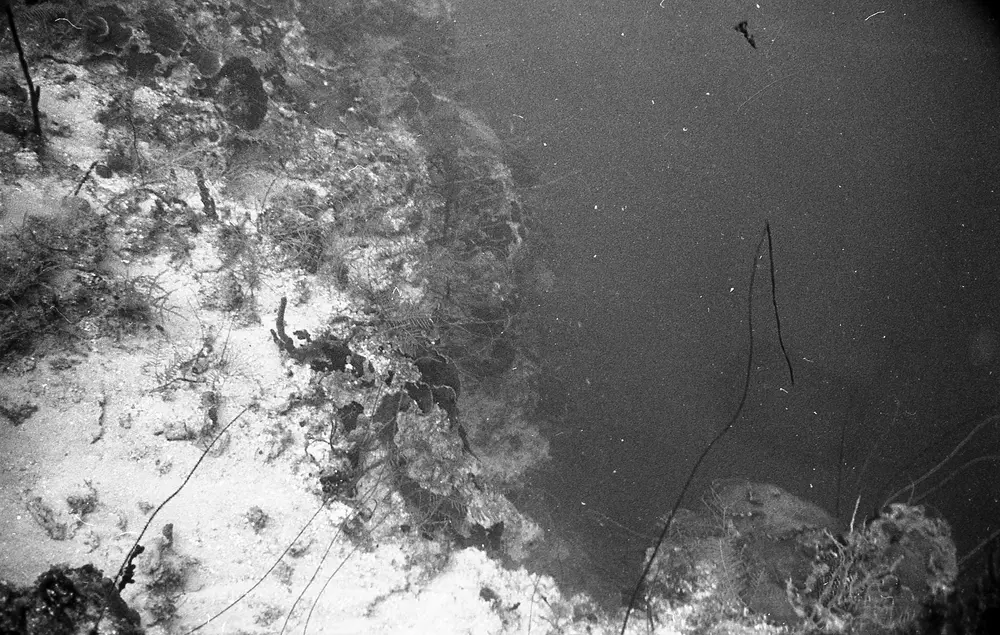{.lightbox group="discovery-bay-1966" description="**UUID: **723520e7-f6eb-4014-9c5b-499ec5a5b9ae **Date: **1966-09-25 **Location: **Jamaica | Discovery Bay | Buoy Deep **Longitude: **77.40908ºW **Latitude: **18.47325ºN **Photographer: **Eileen Graham **Copyright: **Trustees of the Natural History Museum (London, UK), CC-BY-4.0" alt="**UUID: **723520e7-f6eb-4014-9c5b-499ec5a5b9ae **Date: **1966-09-25 **Location: **Jamaica | Discovery Bay | Buoy Deep **Longitude: **77.40908ºW **Latitude: **18.47325ºN **Photographer: **Eileen Graham **Copyright: **Trustees of the Natural History Museum (London, UK), CC-BY-4.0"}

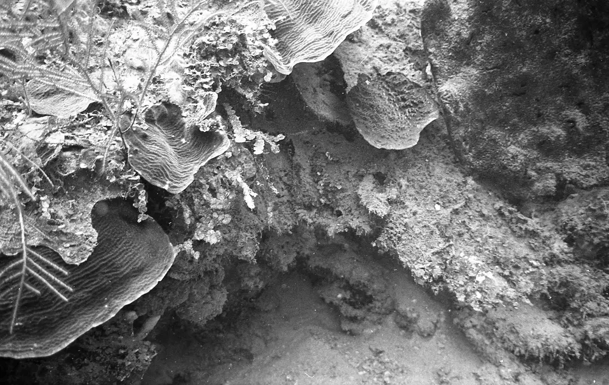{.lightbox group="discovery-bay-1966" description="**UUID: **ee9c8f7a-072d-42f6-a929-94bd87be6ba8 **Date: **1966-09-25 **Location: **Jamaica | Discovery Bay | Buoy Deep **Longitude: **77.40908ºW **Latitude: **18.47325ºN **Photographer: **Eileen Graham **Copyright: **Trustees of the Natural History Museum (London, UK), CC-BY-4.0" alt="**UUID: **ee9c8f7a-072d-42f6-a929-94bd87be6ba8 **Date: **1966-09-25 **Location: **Jamaica | Discovery Bay | Buoy Deep **Longitude: **77.40908ºW **Latitude: **18.47325ºN **Photographer: **Eileen Graham **Copyright: **Trustees of the Natural History Museum (London, UK), CC-BY-4.0"}

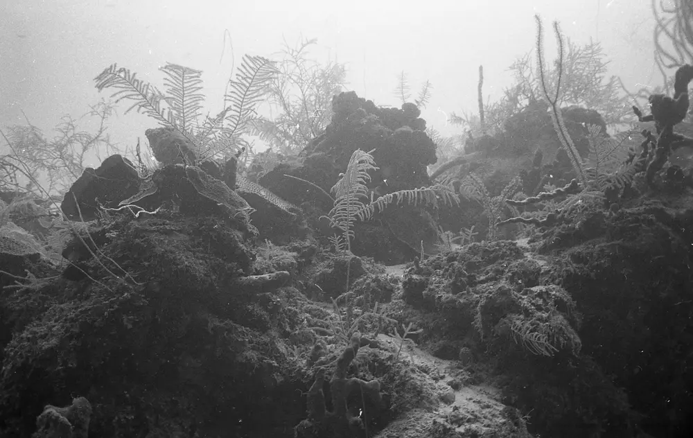{.lightbox group="discovery-bay-1966" description="**UUID: **7c86cd2f-de0e-4adc-b144-cf2ef06dd299 **Date: **1966-09-25 **Location: **Jamaica | Discovery Bay | Buoy Deep **Longitude: **77.40908ºW **Latitude: **18.47325ºN **Photographer: **Eileen Graham **Copyright: **Trustees of the Natural History Museum (London, UK), CC-BY-4.0" alt="**UUID: **7c86cd2f-de0e-4adc-b144-cf2ef06dd299 **Date: **1966-09-25 **Location: **Jamaica | Discovery Bay | Buoy Deep **Longitude: **77.40908ºW **Latitude: **18.47325ºN **Photographer: **Eileen Graham **Copyright: **Trustees of the Natural History Museum (London, UK), CC-BY-4.0"}

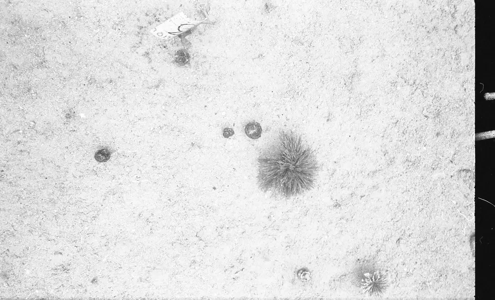{.lightbox group="discovery-bay-1966" description="**UUID: **3f405dd1-6394-4efd-ba27-04b6894cb190 **Date: **1966-09-25 **Location: **Jamaica | Discovery Bay | Algal Plots **Longitude: **77.414ºW **Latitude: **18.473ºN **Photographer: **Eileen Graham **Copyright: **Trustees of the Natural History Museum (London, UK), CC-BY-4.0" alt="**UUID: **3f405dd1-6394-4efd-ba27-04b6894cb190 **Date: **1966-09-25 **Location: **Jamaica | Discovery Bay | Algal Plots **Longitude: **77.414ºW **Latitude: **18.473ºN **Photographer: **Eileen Graham **Copyright: **Trustees of the Natural History Museum (London, UK), CC-BY-4.0"}

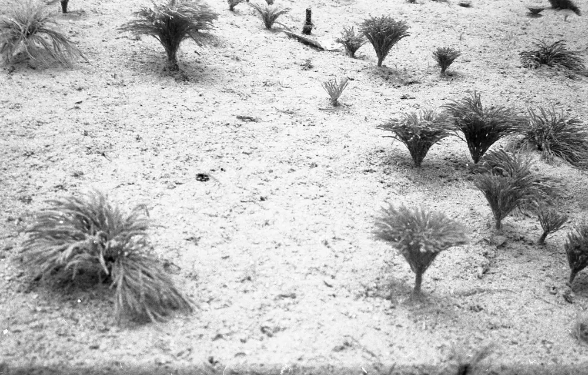{.lightbox group="discovery-bay-1966" description="**UUID: **fab0d9a9-779b-4650-947d-763235492aca **Date: **1966-09-25 **Location: **Jamaica | Discovery Bay | Algal Plots **Longitude: **77.414ºW **Latitude: **18.473ºN **Photographer: **Eileen Graham **Copyright: **Trustees of the Natural History Museum (London, UK), CC-BY-4.0" alt="**UUID: **fab0d9a9-779b-4650-947d-763235492aca **Date: **1966-09-25 **Location: **Jamaica | Discovery Bay | Algal Plots **Longitude: **77.414ºW **Latitude: **18.473ºN **Photographer: **Eileen Graham **Copyright: **Trustees of the Natural History Museum (London, UK), CC-BY-4.0"}

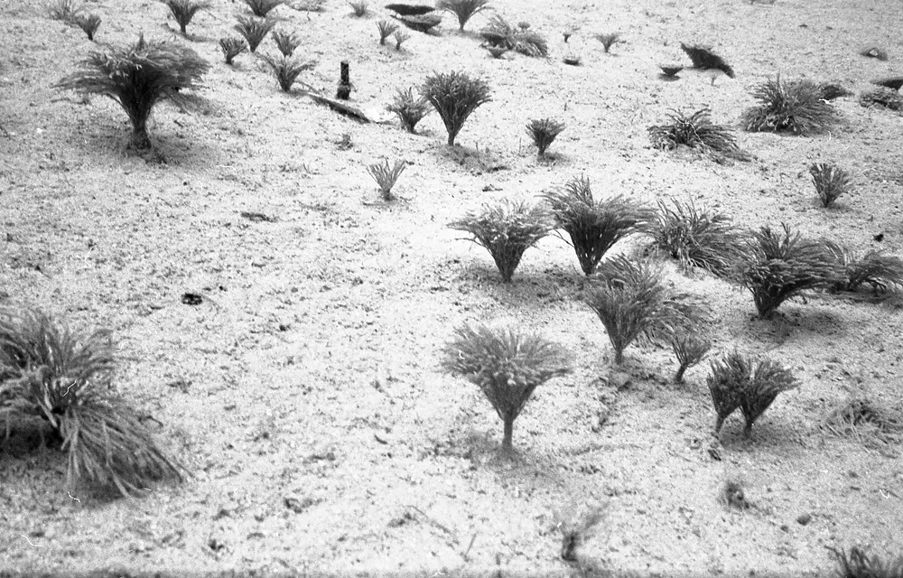{.lightbox group="discovery-bay-1966" description="**UUID: **d0e9584e-7627-4917-bfff-c8e8364ecbdf **Date: **1966-09-25 **Location: **Jamaica | Discovery Bay | Algal Plots **Longitude: **77.414ºW **Latitude: **18.473ºN **Photographer: **Eileen Graham **Copyright: **Trustees of the Natural History Museum (London, UK), CC-BY-4.0" alt="**UUID: **d0e9584e-7627-4917-bfff-c8e8364ecbdf **Date: **1966-09-25 **Location: **Jamaica | Discovery Bay | Algal Plots **Longitude: **77.414ºW **Latitude: **18.473ºN **Photographer: **Eileen Graham **Copyright: **Trustees of the Natural History Museum (London, UK), CC-BY-4.0"}

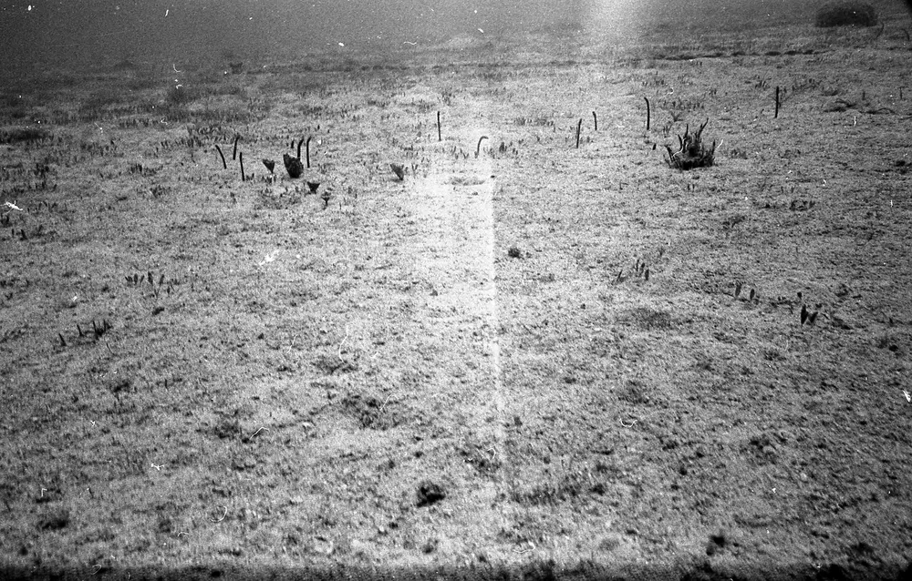{.lightbox group="discovery-bay-1966" description="**UUID: **c4b3ad58-9052-48de-b5fa-72bb1878cf35 **Date: **1966-09-25 **Location: **Jamaica | Discovery Bay | Algal Plots **Longitude: **77.414ºW **Latitude: **18.473ºN **Photographer: **Eileen Graham **Copyright: **Trustees of the Natural History Museum (London, UK), CC-BY-4.0" alt="**UUID: **c4b3ad58-9052-48de-b5fa-72bb1878cf35 **Date: **1966-09-25 **Location: **Jamaica | Discovery Bay | Algal Plots **Longitude: **77.414ºW **Latitude: **18.473ºN **Photographer: **Eileen Graham **Copyright: **Trustees of the Natural History Museum (London, UK), CC-BY-4.0"}

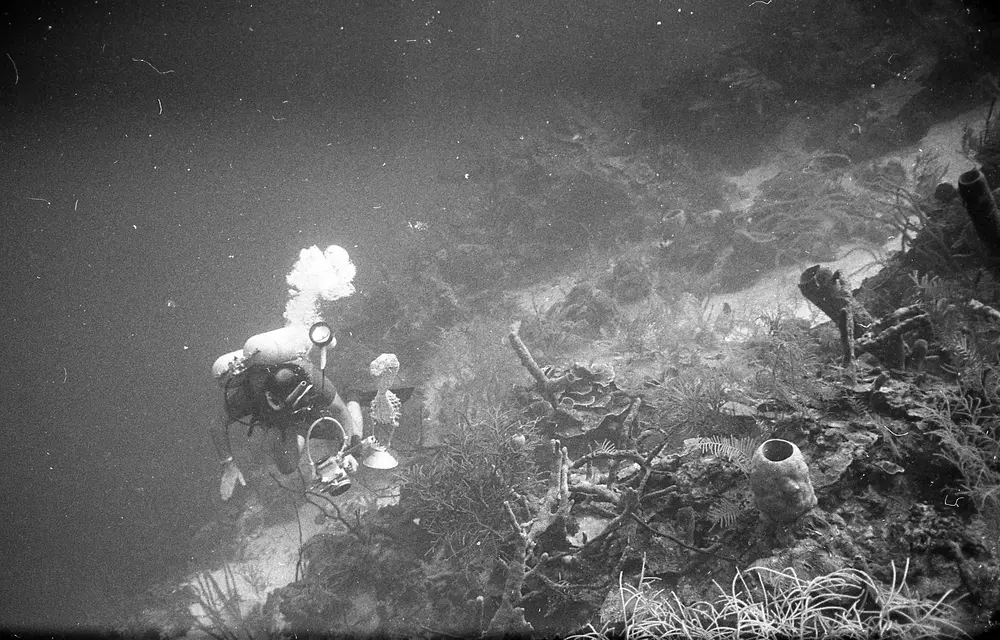{.lightbox group="discovery-bay-1966" description="**UUID: **16f4d7cb-94a6-41f4-b6a2-0f22bd231f96 **Date: **1966-09-25 **Location: **Jamaica | Discovery Bay | Buoy Deep **Longitude: **77.40908ºW **Latitude: **18.47325ºN **Photographer: **Eileen Graham **Copyright: **Trustees of the Natural History Museum (London, UK), CC-BY-4.0" alt="**UUID: **16f4d7cb-94a6-41f4-b6a2-0f22bd231f96 **Date: **1966-09-25 **Location: **Jamaica | Discovery Bay | Buoy Deep **Longitude: **77.40908ºW **Latitude: **18.47325ºN **Photographer: **Eileen Graham **Copyright: **Trustees of the Natural History Museum (London, UK), CC-BY-4.0"}

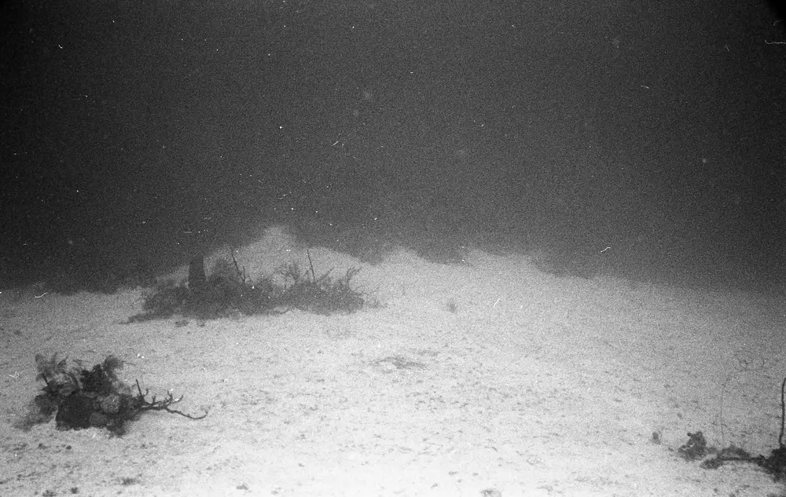{.lightbox group="discovery-bay-1966" description="**UUID: **75c34770-3887-4138-90e2-9c5c78a51b0b **Date: **1966-09-29 **Location: **Jamaica | Discovery Bay | The Bull **Longitude: **77.38917ºW **Latitude: **18.46917ºN **Photographer: **Eileen Graham **Copyright: **Trustees of the Natural History Museum (London, UK), CC-BY-4.0" alt="**UUID: **75c34770-3887-4138-90e2-9c5c78a51b0b **Date: **1966-09-29 **Location: **Jamaica | Discovery Bay | The Bull **Longitude: **77.38917ºW **Latitude: **18.46917ºN **Photographer: **Eileen Graham **Copyright: **Trustees of the Natural History Museum (London, UK), CC-BY-4.0"}

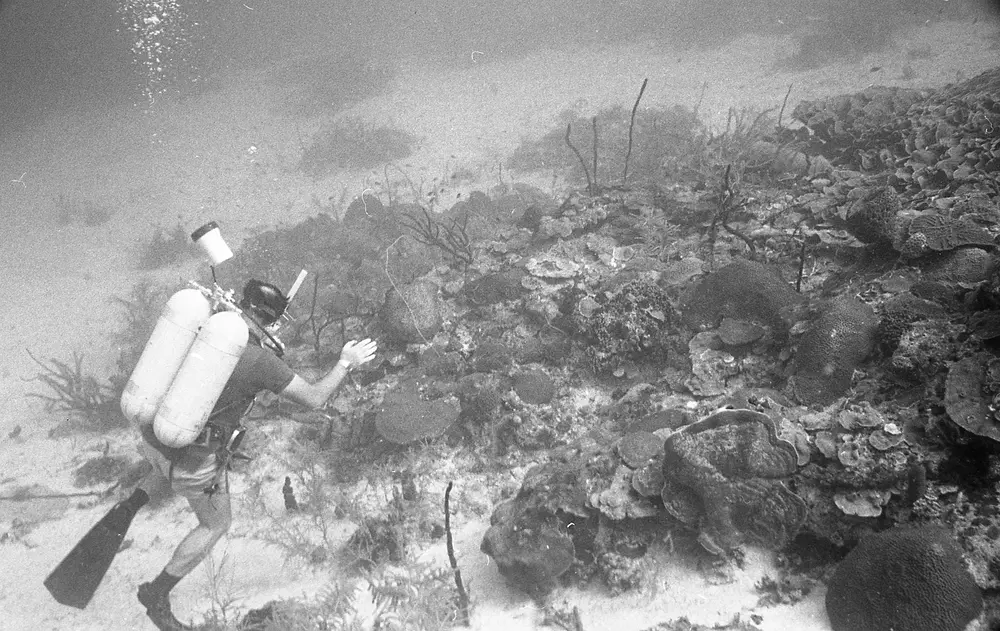{.lightbox group="discovery-bay-1966" description="**UUID: **a3503efd-dd42-4247-83a3-852c9e2e2770 **Date: **1966-09-29 **Location: **Jamaica | Discovery Bay | The Bull **Longitude: **77.38917ºW **Latitude: **18.46917ºN **Photographer: **Eileen Graham **Copyright: **Trustees of the Natural History Museum (London, UK), CC-BY-4.0" alt="**UUID: **a3503efd-dd42-4247-83a3-852c9e2e2770 **Date: **1966-09-29 **Location: **Jamaica | Discovery Bay | The Bull **Longitude: **77.38917ºW **Latitude: **18.46917ºN **Photographer: **Eileen Graham **Copyright: **Trustees of the Natural History Museum (London, UK), CC-BY-4.0"}

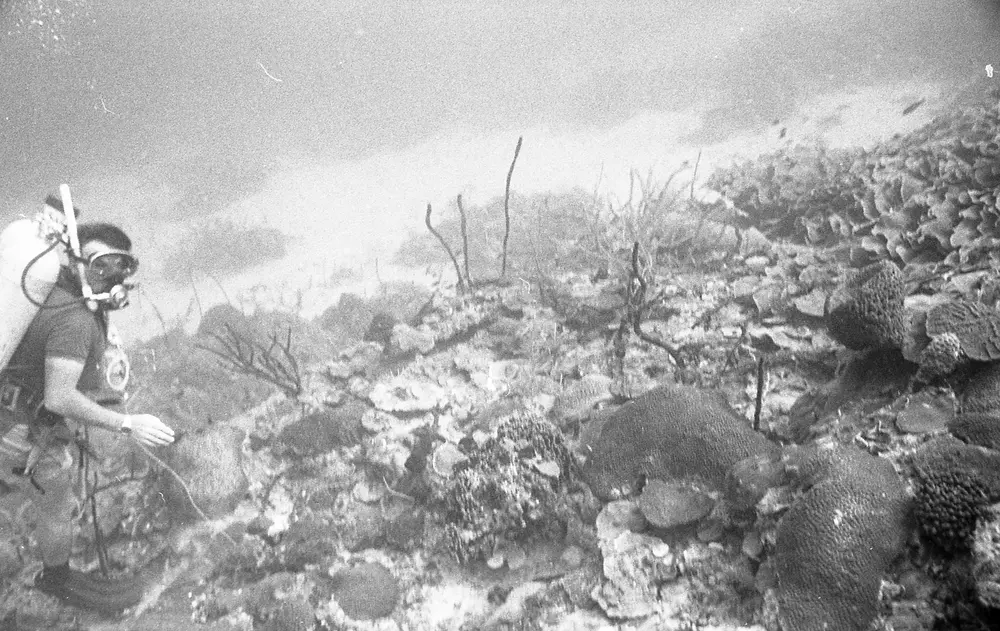{.lightbox group="discovery-bay-1966" description="**UUID: **381299d2-57de-49c3-82f4-405233146773 **Date: **1966-09-29 **Location: **Jamaica | Discovery Bay | The Bull **Longitude: **77.38917ºW **Latitude: **18.46917ºN **Photographer: **Eileen Graham **Copyright: **Trustees of the Natural History Museum (London, UK), CC-BY-4.0" alt="**UUID: **381299d2-57de-49c3-82f4-405233146773 **Date: **1966-09-29 **Location: **Jamaica | Discovery Bay | The Bull **Longitude: **77.38917ºW **Latitude: **18.46917ºN **Photographer: **Eileen Graham **Copyright: **Trustees of the Natural History Museum (London, UK), CC-BY-4.0"}

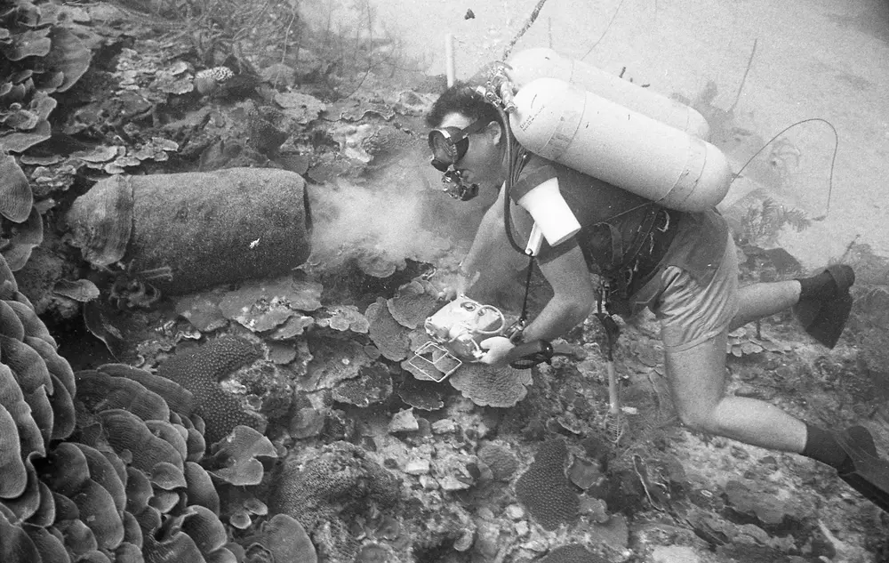{.lightbox group="discovery-bay-1966" description="**UUID: **07bf5f32-e797-4f53-bef3-63ce52a80362 **Date: **1966-09-29 **Location: **Jamaica | Discovery Bay | The Bull **Longitude: **77.38917ºW **Latitude: **18.46917ºN **Photographer: **Eileen Graham **Copyright: **Trustees of the Natural History Museum (London, UK), CC-BY-4.0" alt="**UUID: **07bf5f32-e797-4f53-bef3-63ce52a80362 **Date: **1966-09-29 **Location: **Jamaica | Discovery Bay | The Bull **Longitude: **77.38917ºW **Latitude: **18.46917ºN **Photographer: **Eileen Graham **Copyright: **Trustees of the Natural History Museum (London, UK), CC-BY-4.0"}

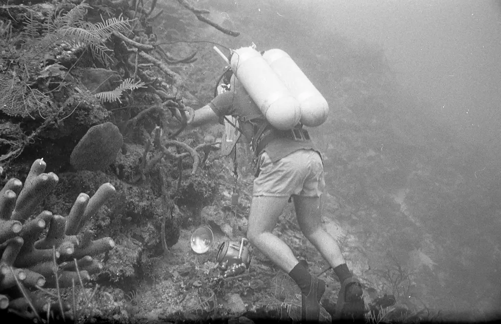{.lightbox group="discovery-bay-1966" description="**UUID: **a3cda84e-74b4-4fa4-94e6-f0238d75d670 **Date: **1966-09-29 **Location: **Jamaica | Discovery Bay | The Bull **Longitude: **77.38917ºW **Latitude: **18.46917ºN **Photographer: **Eileen Graham **Copyright: **Trustees of the Natural History Museum (London, UK), CC-BY-4.0" alt="**UUID: **a3cda84e-74b4-4fa4-94e6-f0238d75d670 **Date: **1966-09-29 **Location: **Jamaica | Discovery Bay | The Bull **Longitude: **77.38917ºW **Latitude: **18.46917ºN **Photographer: **Eileen Graham **Copyright: **Trustees of the Natural History Museum (London, UK), CC-BY-4.0"}

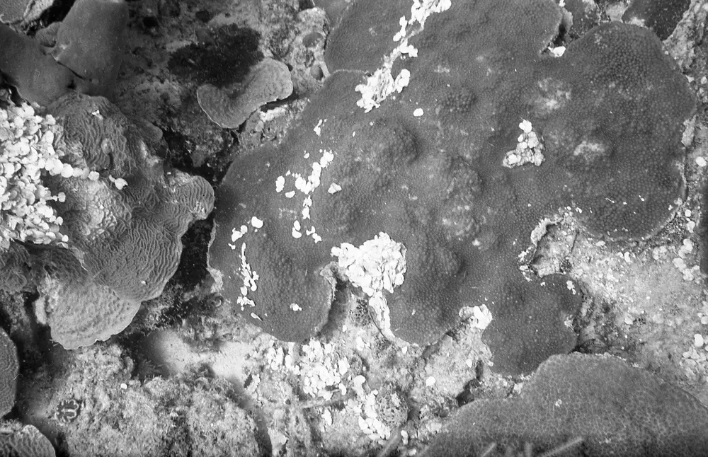{.lightbox group="discovery-bay-1966" description="**UUID: **de9730a3-b279-4e52-8e7e-915fb54f9da5 **Date: **1966-09-29 **Location: **Jamaica | Discovery Bay | The Bull **Longitude: **77.38917ºW **Latitude: **18.46917ºN **Photographer: **Eileen Graham **Copyright: **Trustees of the Natural History Museum (London, UK), CC-BY-4.0" alt="**UUID: **de9730a3-b279-4e52-8e7e-915fb54f9da5 **Date: **1966-09-29 **Location: **Jamaica | Discovery Bay | The Bull **Longitude: **77.38917ºW **Latitude: **18.46917ºN **Photographer: **Eileen Graham **Copyright: **Trustees of the Natural History Museum (London, UK), CC-BY-4.0"}

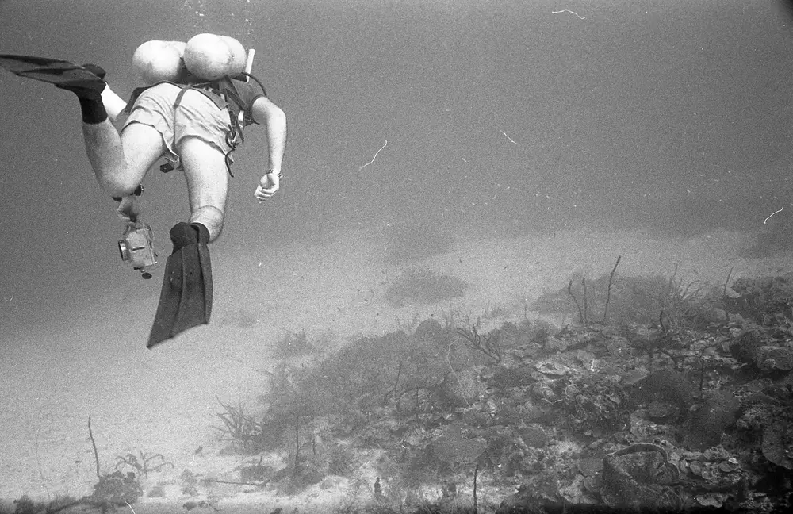{.lightbox group="discovery-bay-1966" description="**UUID: **aac7674a-264d-4b02-b068-0444fe0f94aa **Date: **1966-09-29 **Location: **Jamaica | Discovery Bay | The Bull **Longitude: **77.38917ºW **Latitude: **18.46917ºN **Photographer: **Eileen Graham **Copyright: **Trustees of the Natural History Museum (London, UK), CC-BY-4.0" alt="**UUID: **aac7674a-264d-4b02-b068-0444fe0f94aa **Date: **1966-09-29 **Location: **Jamaica | Discovery Bay | The Bull **Longitude: **77.38917ºW **Latitude: **18.46917ºN **Photographer: **Eileen Graham **Copyright: **Trustees of the Natural History Museum (London, UK), CC-BY-4.0"}

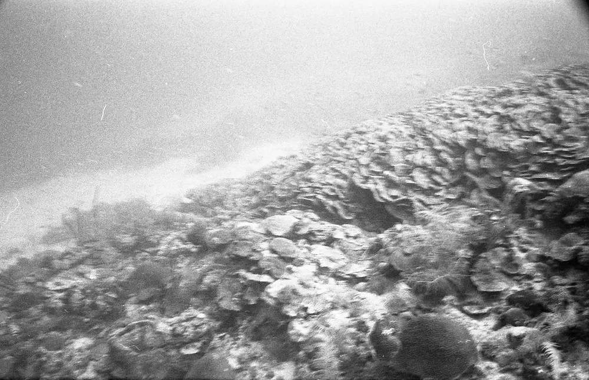{.lightbox group="discovery-bay-1966" description="**UUID: **569eaeab-7859-41b2-90e7-0436cb8d38ca **Date: **1966-09-29 **Location: **Jamaica | Discovery Bay | The Bull **Longitude: **77.38917ºW **Latitude: **18.46917ºN **Photographer: **Eileen Graham **Copyright: **Trustees of the Natural History Museum (London, UK), CC-BY-4.0" alt="**UUID: **569eaeab-7859-41b2-90e7-0436cb8d38ca **Date: **1966-09-29 **Location: **Jamaica | Discovery Bay | The Bull **Longitude: **77.38917ºW **Latitude: **18.46917ºN **Photographer: **Eileen Graham **Copyright: **Trustees of the Natural History Museum (London, UK), CC-BY-4.0"}

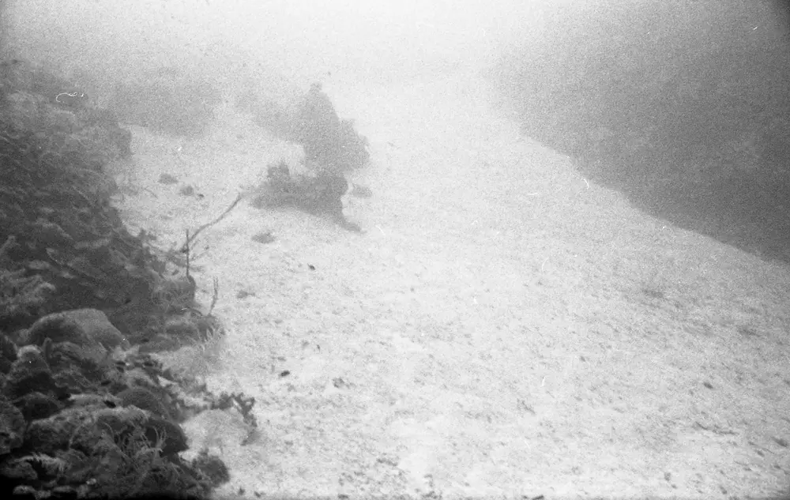{.lightbox group="discovery-bay-1966" description="**UUID: **d2c44562-4f39-423c-a4de-e154615890c7 **Date: **1966-09-29 **Location: **Jamaica | Discovery Bay | The Bull **Longitude: **77.38917ºW **Latitude: **18.46917ºN **Photographer: **Eileen Graham **Copyright: **Trustees of the Natural History Museum (London, UK), CC-BY-4.0" alt="**UUID: **d2c44562-4f39-423c-a4de-e154615890c7 **Date: **1966-09-29 **Location: **Jamaica | Discovery Bay | The Bull **Longitude: **77.38917ºW **Latitude: **18.46917ºN **Photographer: **Eileen Graham **Copyright: **Trustees of the Natural History Museum (London, UK), CC-BY-4.0"}

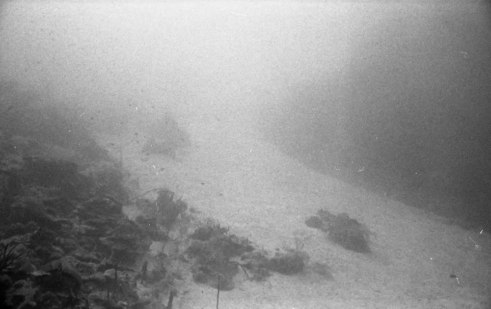{.lightbox group="discovery-bay-1966" description="**UUID: **60fd29ef-3c36-4922-96c6-a63c4012c0d4 **Date: **1966-09-29 **Location: **Jamaica | Discovery Bay | The Bull **Longitude: **77.38917ºW **Latitude: **18.46917ºN **Photographer: **Eileen Graham **Copyright: **Trustees of the Natural History Museum (London, UK), CC-BY-4.0" alt="**UUID: **60fd29ef-3c36-4922-96c6-a63c4012c0d4 **Date: **1966-09-29 **Location: **Jamaica | Discovery Bay | The Bull **Longitude: **77.38917ºW **Latitude: **18.46917ºN **Photographer: **Eileen Graham **Copyright: **Trustees of the Natural History Museum (London, UK), CC-BY-4.0"}

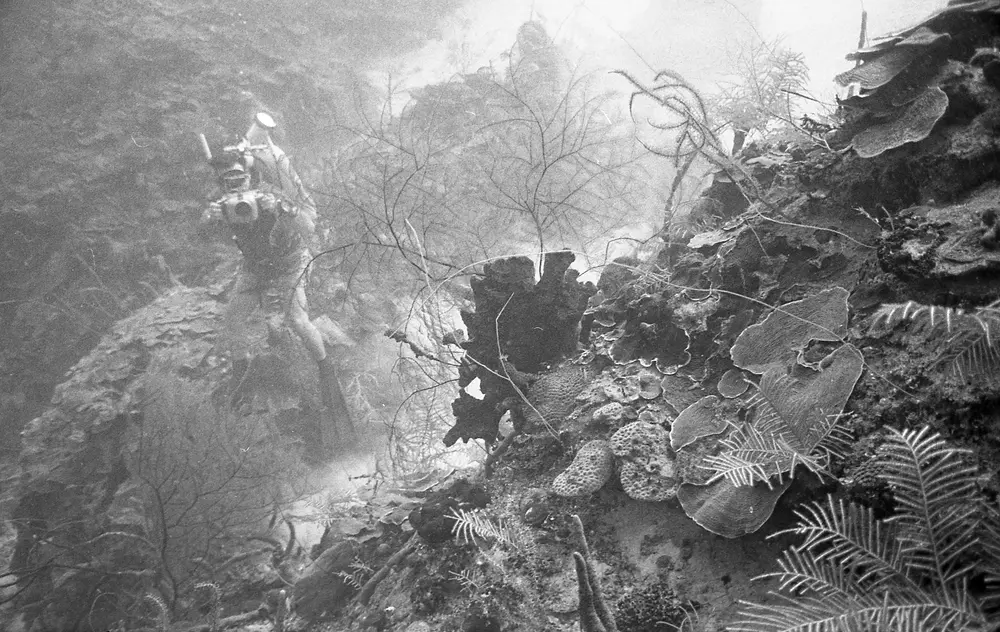{.lightbox group="discovery-bay-1966" description="**UUID: **0879a41d-6be5-40d3-b6ec-e9abc911c649 **Date: **1966-09-29 **Location: **Jamaica | Discovery Bay | The Bull **Longitude: **77.38917ºW **Latitude: **18.46917ºN **Photographer: **Eileen Graham **Copyright: **Trustees of the Natural History Museum (London, UK), CC-BY-4.0" alt="**UUID: **0879a41d-6be5-40d3-b6ec-e9abc911c649 **Date: **1966-09-29 **Location: **Jamaica | Discovery Bay | The Bull **Longitude: **77.38917ºW **Latitude: **18.46917ºN **Photographer: **Eileen Graham **Copyright: **Trustees of the Natural History Museum (London, UK), CC-BY-4.0"}

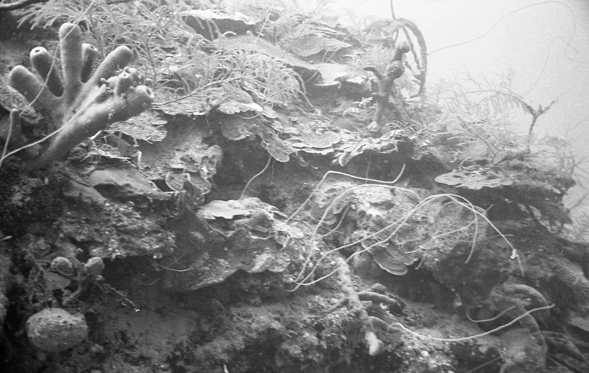{.lightbox group="discovery-bay-1966" description="**UUID: **306e0db9-c754-4120-a5a4-24576367e502 **Date: **1966-09-29 **Location: **Jamaica | Discovery Bay | The Bull **Longitude: **77.38917ºW **Latitude: **18.46917ºN **Photographer: **Eileen Graham **Copyright: **Trustees of the Natural History Museum (London, UK), CC-BY-4.0" alt="**UUID: **306e0db9-c754-4120-a5a4-24576367e502 **Date: **1966-09-29 **Location: **Jamaica | Discovery Bay | The Bull **Longitude: **77.38917ºW **Latitude: **18.46917ºN **Photographer: **Eileen Graham **Copyright: **Trustees of the Natural History Museum (London, UK), CC-BY-4.0"}

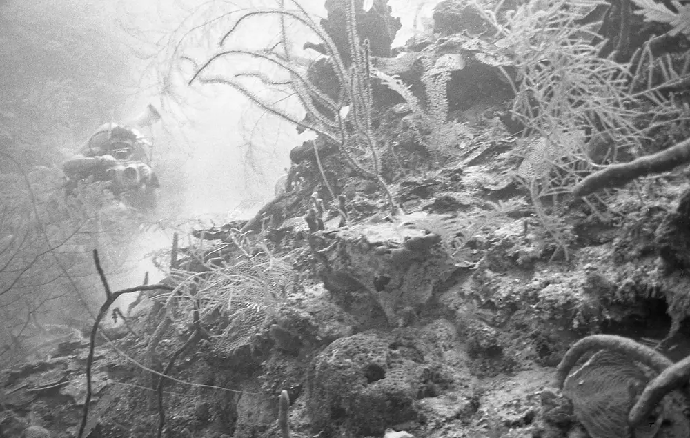{.lightbox group="discovery-bay-1966" description="**UUID: **9921fff8-0d2a-4771-8b62-3019269ef966 **Date: **1966-09-29 **Location: **Jamaica | Discovery Bay | The Bull **Longitude: **77.38917ºW **Latitude: **18.46917ºN **Photographer: **Eileen Graham **Copyright: **Trustees of the Natural History Museum (London, UK), CC-BY-4.0" alt="**UUID: **9921fff8-0d2a-4771-8b62-3019269ef966 **Date: **1966-09-29 **Location: **Jamaica | Discovery Bay | The Bull **Longitude: **77.38917ºW **Latitude: **18.46917ºN **Photographer: **Eileen Graham **Copyright: **Trustees of the Natural History Museum (London, UK), CC-BY-4.0"}

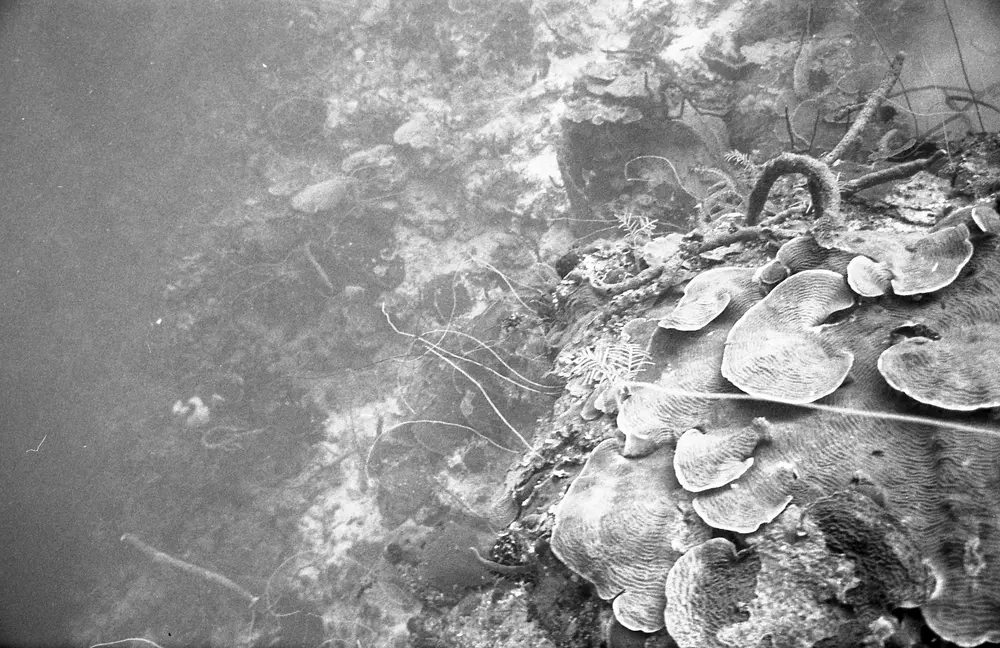{.lightbox group="discovery-bay-1966" description="**UUID: **bf5f31bb-ea66-479d-be57-dc4589fa9464 **Date: **1966-09-29 **Location: **Jamaica | Discovery Bay | The Bull **Longitude: **77.38917ºW **Latitude: **18.46917ºN **Photographer: **Eileen Graham **Copyright: **Trustees of the Natural History Museum (London, UK), CC-BY-4.0" alt="**UUID: **bf5f31bb-ea66-479d-be57-dc4589fa9464 **Date: **1966-09-29 **Location: **Jamaica | Discovery Bay | The Bull **Longitude: **77.38917ºW **Latitude: **18.46917ºN **Photographer: **Eileen Graham **Copyright: **Trustees of the Natural History Museum (London, UK), CC-BY-4.0"}

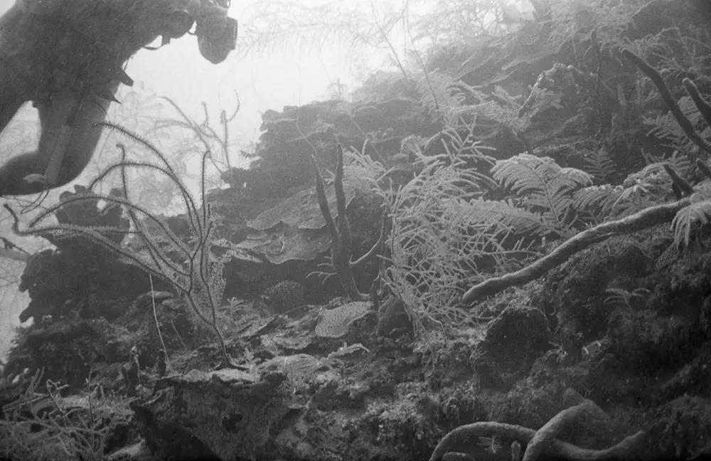{.lightbox group="discovery-bay-1966" description="**UUID: **115d27d8-e553-4a79-8e6d-577ddbffbe01 **Date: **1966-09-29 **Location: **Jamaica | Discovery Bay | The Bull **Longitude: **77.38917ºW **Latitude: **18.46917ºN **Photographer: **Eileen Graham **Copyright: **Trustees of the Natural History Museum (London, UK), CC-BY-4.0" alt="**UUID: **115d27d8-e553-4a79-8e6d-577ddbffbe01 **Date: **1966-09-29 **Location: **Jamaica | Discovery Bay | The Bull **Longitude: **77.38917ºW **Latitude: **18.46917ºN **Photographer: **Eileen Graham **Copyright: **Trustees of the Natural History Museum (London, UK), CC-BY-4.0"}

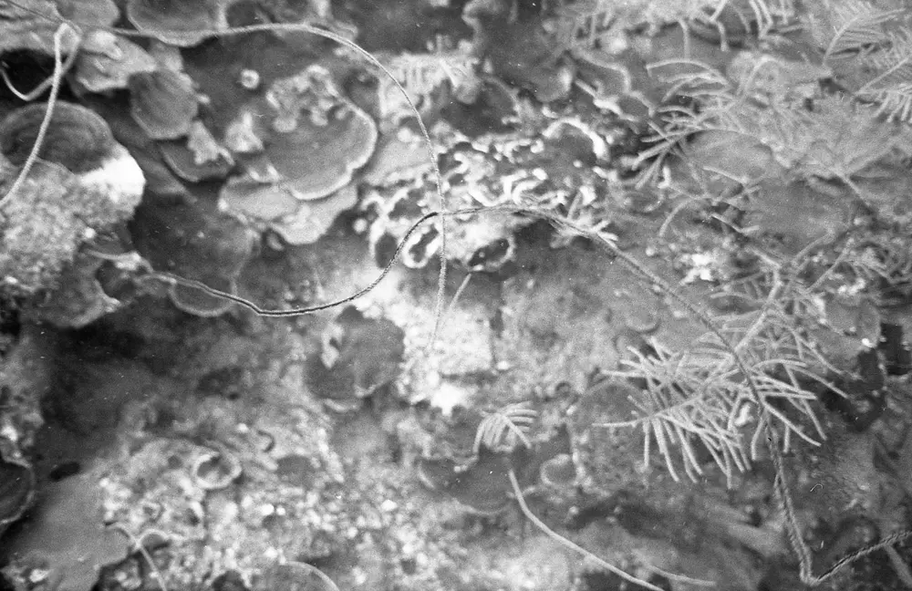{.lightbox group="discovery-bay-1966" description="**UUID: **261a199a-9e89-4620-9669-6700502b4560 **Date: **1966-09-29 **Location: **Jamaica | Discovery Bay | The Bull **Longitude: **77.38917ºW **Latitude: **18.46917ºN **Photographer: **Eileen Graham **Copyright: **Trustees of the Natural History Museum (London, UK), CC-BY-4.0" alt="**UUID: **261a199a-9e89-4620-9669-6700502b4560 **Date: **1966-09-29 **Location: **Jamaica | Discovery Bay | The Bull **Longitude: **77.38917ºW **Latitude: **18.46917ºN **Photographer: **Eileen Graham **Copyright: **Trustees of the Natural History Museum (London, UK), CC-BY-4.0"}

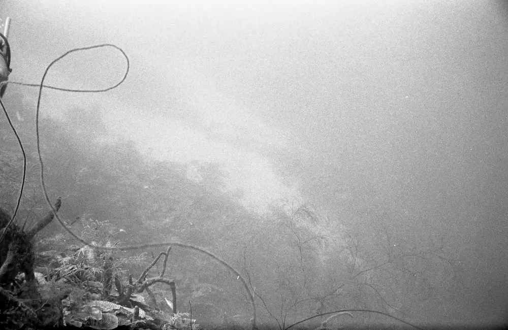{.lightbox group="discovery-bay-1966" description="**UUID: **8159de31-18dc-4c0a-8cba-1ae57cebb5e1 **Date: **1966-09-29 **Location: **Jamaica | Discovery Bay | The Bull **Longitude: **77.38917ºW **Latitude: **18.46917ºN **Photographer: **Eileen Graham **Copyright: **Trustees of the Natural History Museum (London, UK), CC-BY-4.0" alt="**UUID: **8159de31-18dc-4c0a-8cba-1ae57cebb5e1 **Date: **1966-09-29 **Location: **Jamaica | Discovery Bay | The Bull **Longitude: **77.38917ºW **Latitude: **18.46917ºN **Photographer: **Eileen Graham **Copyright: **Trustees of the Natural History Museum (London, UK), CC-BY-4.0"}

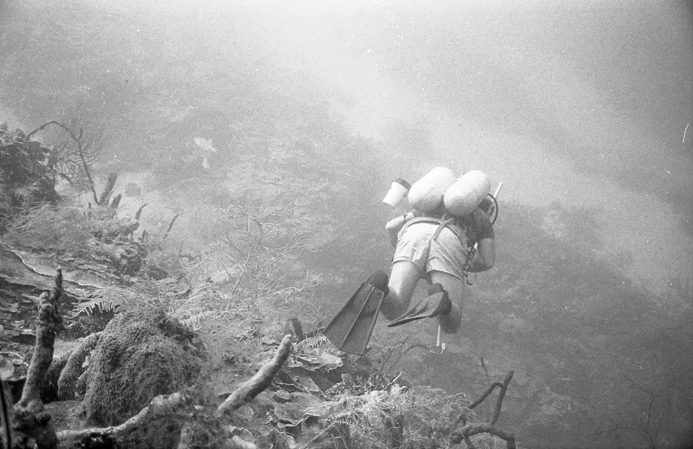{.lightbox group="discovery-bay-1966" description="**UUID: **0ebf04ac-2811-4f83-bbf7-e0e67ea49e08 **Date: **1966-09-29 **Location: **Jamaica | Discovery Bay | The Bull **Longitude: **77.38917ºW **Latitude: **18.46917ºN **Photographer: **Eileen Graham **Copyright: **Trustees of the Natural History Museum (London, UK), CC-BY-4.0" alt="**UUID: **0ebf04ac-2811-4f83-bbf7-e0e67ea49e08 **Date: **1966-09-29 **Location: **Jamaica | Discovery Bay | The Bull **Longitude: **77.38917ºW **Latitude: **18.46917ºN **Photographer: **Eileen Graham **Copyright: **Trustees of the Natural History Museum (London, UK), CC-BY-4.0"}

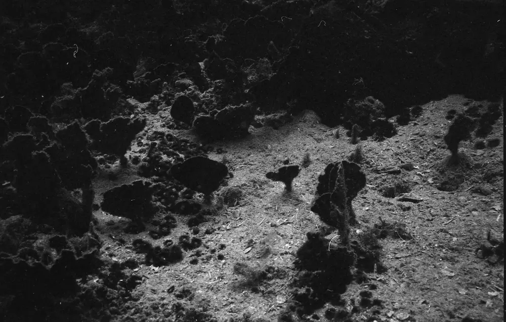{.lightbox group="discovery-bay-1966" description="**UUID: **e09d14e0-8f0a-4156-8ae4-abea9cf7d237 **Date: **1966-09-22 **Location: **Jamaica | Discovery Bay | Silver Seas **Longitude: **77.4599ºW **Latitude: **18.4789ºN **Photographer: **Eileen Graham **Copyright: **Trustees of the Natural History Museum (London, UK), CC-BY-4.0" alt="**UUID: **e09d14e0-8f0a-4156-8ae4-abea9cf7d237 **Date: **1966-09-22 **Location: **Jamaica | Discovery Bay | Silver Seas **Longitude: **77.4599ºW **Latitude: **18.4789ºN **Photographer: **Eileen Graham **Copyright: **Trustees of the Natural History Museum (London, UK), CC-BY-4.0"}

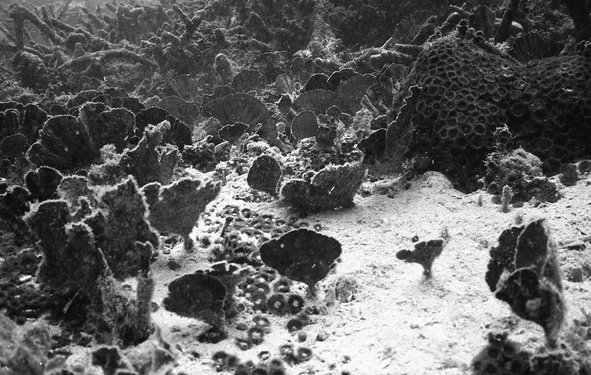{.lightbox group="discovery-bay-1966" description="**UUID: **137cb083-0b4c-4e2b-ada5-dafe68405b1e **Date: **1966-09-22 **Location: **Jamaica | Discovery Bay | Silver Seas **Longitude: **77.4599ºW **Latitude: **18.4789ºN **Photographer: **Eileen Graham **Copyright: **Trustees of the Natural History Museum (London, UK), CC-BY-4.0" alt="**UUID: **137cb083-0b4c-4e2b-ada5-dafe68405b1e **Date: **1966-09-22 **Location: **Jamaica | Discovery Bay | Silver Seas **Longitude: **77.4599ºW **Latitude: **18.4789ºN **Photographer: **Eileen Graham **Copyright: **Trustees of the Natural History Museum (London, UK), CC-BY-4.0"}

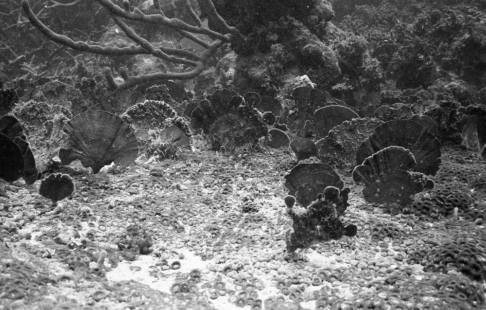{.lightbox group="discovery-bay-1966" description="**UUID: **967220f6-a01a-4597-b3a1-cab3c88408aa **Date: **1966-09-22 **Location: **Jamaica | Discovery Bay | Silver Seas **Longitude: **77.4599ºW **Latitude: **18.4789ºN **Photographer: **Eileen Graham **Copyright: **Trustees of the Natural History Museum (London, UK), CC-BY-4.0" alt="**UUID: **967220f6-a01a-4597-b3a1-cab3c88408aa **Date: **1966-09-22 **Location: **Jamaica | Discovery Bay | Silver Seas **Longitude: **77.4599ºW **Latitude: **18.4789ºN **Photographer: **Eileen Graham **Copyright: **Trustees of the Natural History Museum (London, UK), CC-BY-4.0"}

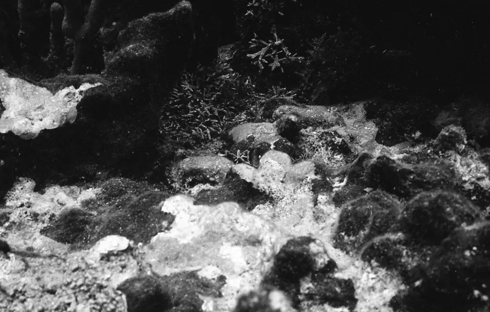{.lightbox group="discovery-bay-1966" description="**UUID: **07b9d556-c979-4cf0-8a2b-fdf1c9508d07 **Date: **1966-09-22 **Location: **Jamaica | Discovery Bay | Silver Seas **Longitude: **77.4599ºW **Latitude: **18.4789ºN **Photographer: **Eileen Graham **Copyright: **Trustees of the Natural History Museum (London, UK), CC-BY-4.0" alt="**UUID: **07b9d556-c979-4cf0-8a2b-fdf1c9508d07 **Date: **1966-09-22 **Location: **Jamaica | Discovery Bay | Silver Seas **Longitude: **77.4599ºW **Latitude: **18.4789ºN **Photographer: **Eileen Graham **Copyright: **Trustees of the Natural History Museum (London, UK), CC-BY-4.0"}

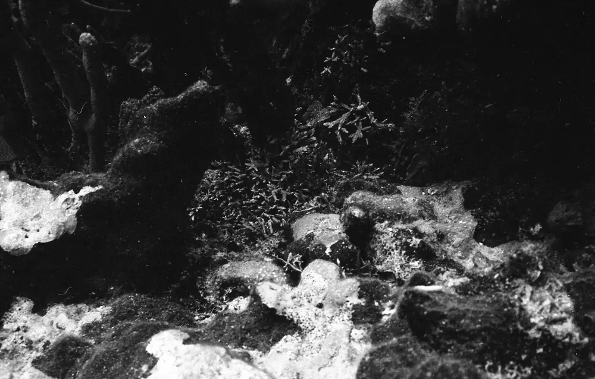{.lightbox group="discovery-bay-1966" description="**UUID: **e500d707-8793-4db1-820a-2c8c66bc9bd6 **Date: **1966-09-22 **Location: **Jamaica | Discovery Bay | Silver Seas **Longitude: **77.4599ºW **Latitude: **18.4789ºN **Photographer: **Eileen Graham **Copyright: **Trustees of the Natural History Museum (London, UK), CC-BY-4.0" alt="**UUID: **e500d707-8793-4db1-820a-2c8c66bc9bd6 **Date: **1966-09-22 **Location: **Jamaica | Discovery Bay | Silver Seas **Longitude: **77.4599ºW **Latitude: **18.4789ºN **Photographer: **Eileen Graham **Copyright: **Trustees of the Natural History Museum (London, UK), CC-BY-4.0"}

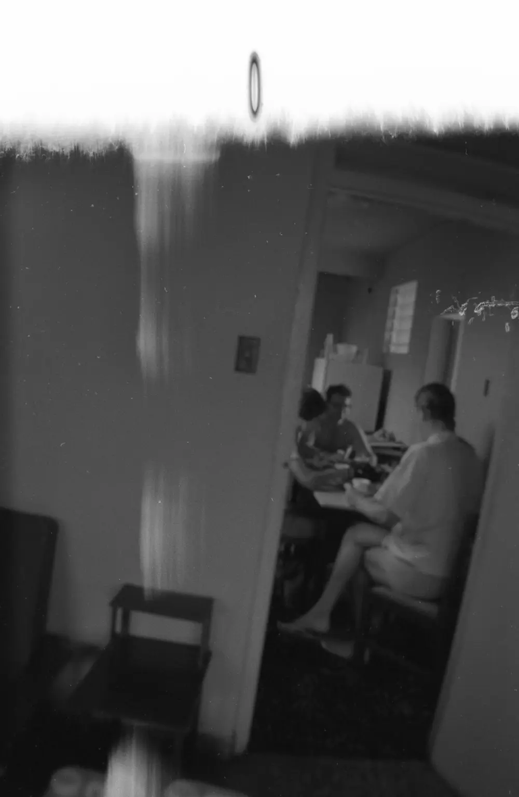{.lightbox group="discovery-bay-1966" description="**UUID: **4ae08805-6780-4798-8a7a-926c6897d994 **Date: **1966-09-22 **Location: **Jamaica | Discovery Bay | Onshore **Longitude: **77.41543ºW **Latitude: **18.468618ºN **Photographer: **Eileen Graham **Copyright: **Trustees of the Natural History Museum (London, UK), CC-BY-4.0" alt="**UUID: **4ae08805-6780-4798-8a7a-926c6897d994 **Date: **1966-09-22 **Location: **Jamaica | Discovery Bay | Onshore **Longitude: **77.41543ºW **Latitude: **18.468618ºN **Photographer: **Eileen Graham **Copyright: **Trustees of the Natural History Museum (London, UK), CC-BY-4.0"}

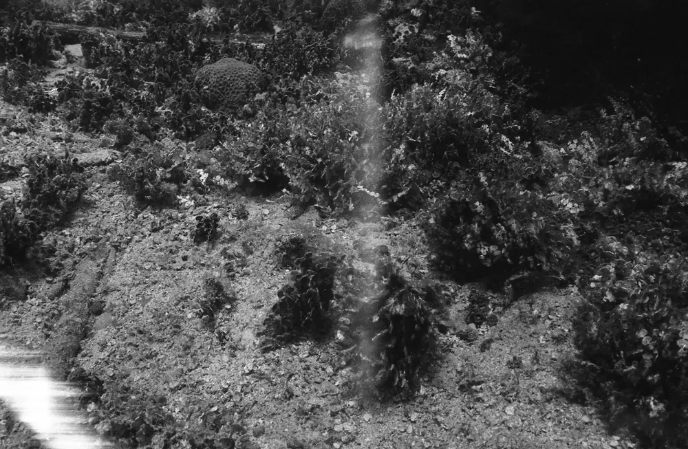{.lightbox group="discovery-bay-1966" description="**UUID: **2b70c412-ebb3-4eed-9ced-f01efa7d1baf **Date: **1966-09-22 **Location: **Jamaica | Discovery Bay | Silver Seas **Longitude: **77.4599ºW **Latitude: **18.4789ºN **Photographer: **Eileen Graham **Copyright: **Trustees of the Natural History Museum (London, UK), CC-BY-4.0" alt="**UUID: **2b70c412-ebb3-4eed-9ced-f01efa7d1baf **Date: **1966-09-22 **Location: **Jamaica | Discovery Bay | Silver Seas **Longitude: **77.4599ºW **Latitude: **18.4789ºN **Photographer: **Eileen Graham **Copyright: **Trustees of the Natural History Museum (London, UK), CC-BY-4.0"}

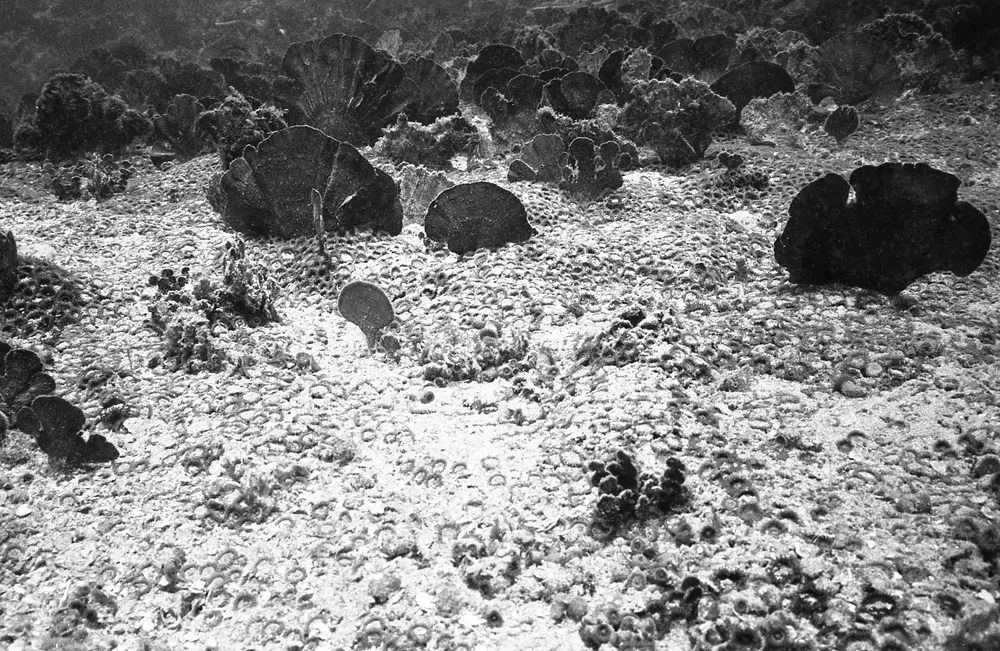{.lightbox group="discovery-bay-1966" description="**UUID: **43de6ad0-c055-4f67-8534-dbb949131dcd **Date: **1966-09-22 **Location: **Jamaica | Discovery Bay | Silver Seas **Longitude: **77.4599ºW **Latitude: **18.4789ºN **Photographer: **Eileen Graham **Copyright: **Trustees of the Natural History Museum (London, UK), CC-BY-4.0" alt="**UUID: **43de6ad0-c055-4f67-8534-dbb949131dcd **Date: **1966-09-22 **Location: **Jamaica | Discovery Bay | Silver Seas **Longitude: **77.4599ºW **Latitude: **18.4789ºN **Photographer: **Eileen Graham **Copyright: **Trustees of the Natural History Museum (London, UK), CC-BY-4.0"}

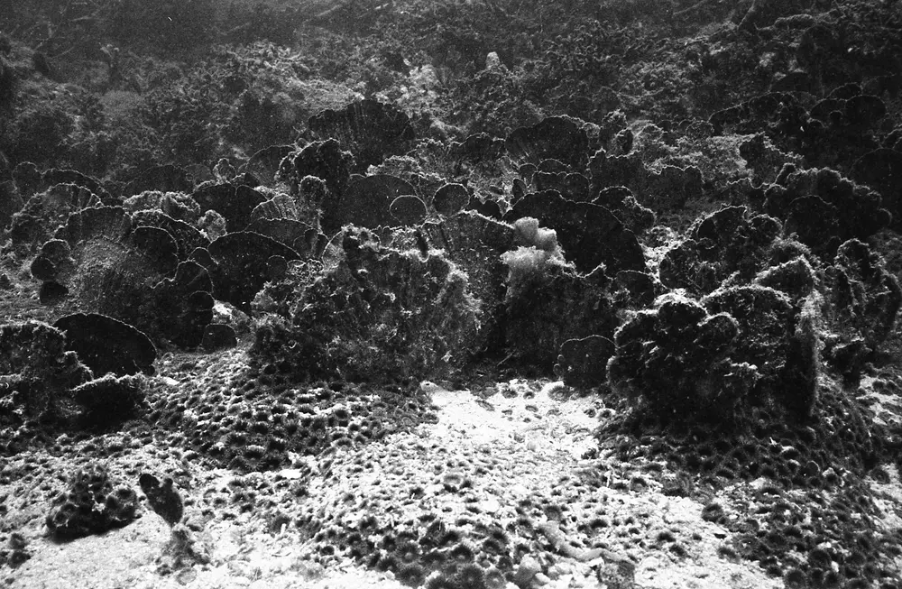{.lightbox group="discovery-bay-1966" description="**UUID: **eba8501e-d243-44f8-9a77-bf110573f2d0 **Date: **1966-09-22 **Location: **Jamaica | Discovery Bay | Silver Seas **Longitude: **77.4599ºW **Latitude: **18.4789ºN **Photographer: **Eileen Graham **Copyright: **Trustees of the Natural History Museum (London, UK), CC-BY-4.0" alt="**UUID: **eba8501e-d243-44f8-9a77-bf110573f2d0 **Date: **1966-09-22 **Location: **Jamaica | Discovery Bay | Silver Seas **Longitude: **77.4599ºW **Latitude: **18.4789ºN **Photographer: **Eileen Graham **Copyright: **Trustees of the Natural History Museum (London, UK), CC-BY-4.0"}

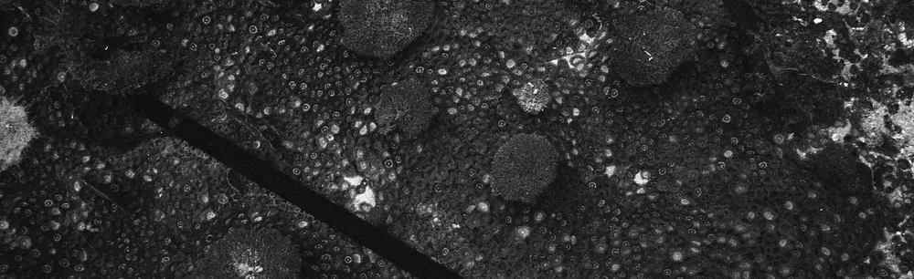{.lightbox group="discovery-bay-1966" description="**UUID: **b8730b38-8040-4b24-968e-f3aebfb817ed **Date: **1966-09-22 **Location: **Jamaica | Discovery Bay | Silver Seas **Longitude: **77.4599ºW **Latitude: **18.4789ºN **Photographer: **Eileen Graham **Copyright: **Trustees of the Natural History Museum (London, UK), CC-BY-4.0" alt="**UUID: **b8730b38-8040-4b24-968e-f3aebfb817ed **Date: **1966-09-22 **Location: **Jamaica | Discovery Bay | Silver Seas **Longitude: **77.4599ºW **Latitude: **18.4789ºN **Photographer: **Eileen Graham **Copyright: **Trustees of the Natural History Museum (London, UK), CC-BY-4.0"}

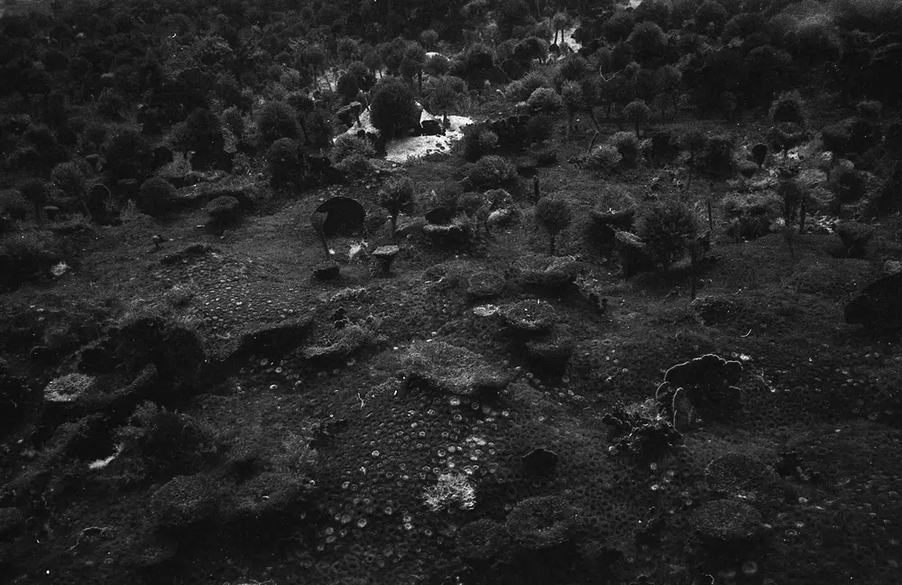{.lightbox group="discovery-bay-1966" description="**UUID: **016d34a6-9cc1-4827-9545-2b76af249e34 **Date: **1966-09-22 **Location: **Jamaica | Discovery Bay | Silver Seas **Longitude: **77.4599ºW **Latitude: **18.4789ºN **Photographer: **Eileen Graham **Copyright: **Trustees of the Natural History Museum (London, UK), CC-BY-4.0" alt="**UUID: **016d34a6-9cc1-4827-9545-2b76af249e34 **Date: **1966-09-22 **Location: **Jamaica | Discovery Bay | Silver Seas **Longitude: **77.4599ºW **Latitude: **18.4789ºN **Photographer: **Eileen Graham **Copyright: **Trustees of the Natural History Museum (London, UK), CC-BY-4.0"}

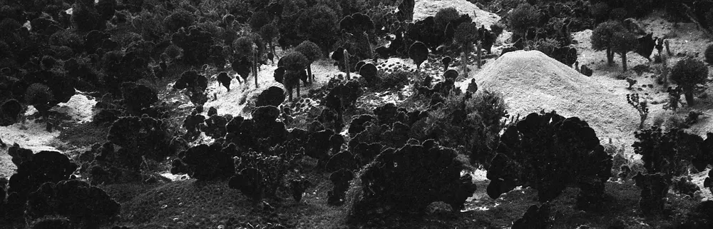{.lightbox group="discovery-bay-1966" description="**UUID: **0006c7f8-08b9-4b93-b4e6-eb42ba484d18 **Date: **1966-09-22 **Location: **Jamaica | Discovery Bay | Silver Seas **Longitude: **77.4599ºW **Latitude: **18.4789ºN **Photographer: **Eileen Graham **Copyright: **Trustees of the Natural History Museum (London, UK), CC-BY-4.0" alt="**UUID: **0006c7f8-08b9-4b93-b4e6-eb42ba484d18 **Date: **1966-09-22 **Location: **Jamaica | Discovery Bay | Silver Seas **Longitude: **77.4599ºW **Latitude: **18.4789ºN **Photographer: **Eileen Graham **Copyright: **Trustees of the Natural History Museum (London, UK), CC-BY-4.0"}

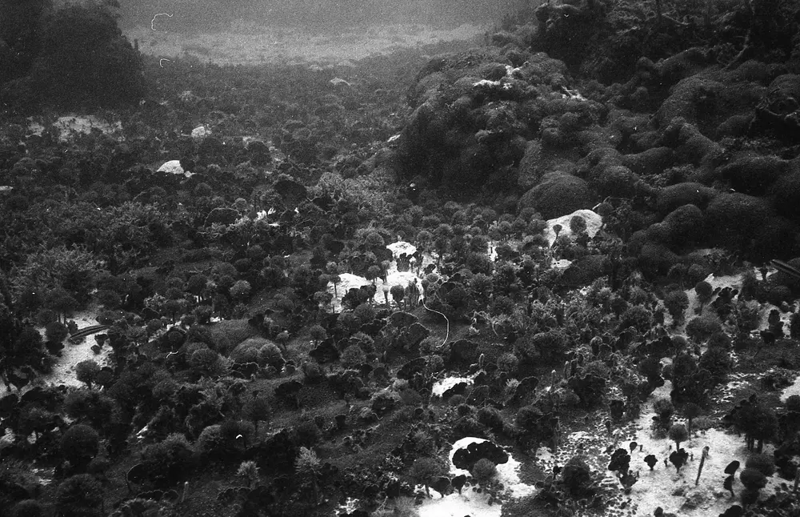{.lightbox group="discovery-bay-1966" description="**UUID: **01059edb-5c31-44d3-80f8-cca8e17eb538 **Date: **1966-09-22 **Location: **Jamaica | Discovery Bay | Silver Seas **Longitude: **77.4599ºW **Latitude: **18.4789ºN **Photographer: **Eileen Graham **Copyright: **Trustees of the Natural History Museum (London, UK), CC-BY-4.0" alt="**UUID: **01059edb-5c31-44d3-80f8-cca8e17eb538 **Date: **1966-09-22 **Location: **Jamaica | Discovery Bay | Silver Seas **Longitude: **77.4599ºW **Latitude: **18.4789ºN **Photographer: **Eileen Graham **Copyright: **Trustees of the Natural History Museum (London, UK), CC-BY-4.0"}

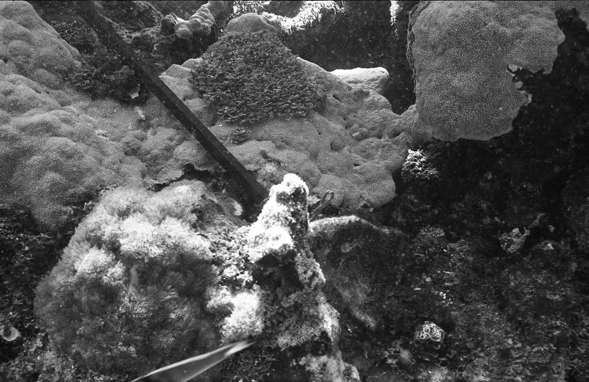{.lightbox group="discovery-bay-1966" description="**UUID: **057ff928-25b5-43a4-a616-260f3e131f5b **Date: **1966-09-22 **Location: **Jamaica | Discovery Bay | Silver Seas **Longitude: **77.4599ºW **Latitude: **18.4789ºN **Photographer: **Eileen Graham **Copyright: **Trustees of the Natural History Museum (London, UK), CC-BY-4.0" alt="**UUID: **057ff928-25b5-43a4-a616-260f3e131f5b **Date: **1966-09-22 **Location: **Jamaica | Discovery Bay | Silver Seas **Longitude: **77.4599ºW **Latitude: **18.4789ºN **Photographer: **Eileen Graham **Copyright: **Trustees of the Natural History Museum (London, UK), CC-BY-4.0"}

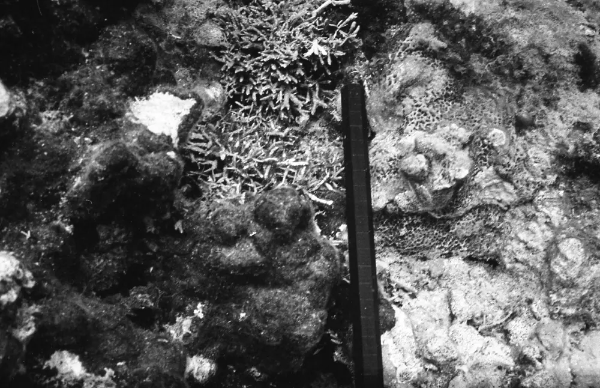{.lightbox group="discovery-bay-1966" description="**UUID: **e0cd785e-b477-41d0-aed0-0f1b721ac67e **Date: **1966-09-22 **Location: **Jamaica | Discovery Bay | Silver Seas **Longitude: **77.4599ºW **Latitude: **18.4789ºN **Photographer: **Eileen Graham **Copyright: **Trustees of the Natural History Museum (London, UK), CC-BY-4.0" alt="**UUID: **e0cd785e-b477-41d0-aed0-0f1b721ac67e **Date: **1966-09-22 **Location: **Jamaica | Discovery Bay | Silver Seas **Longitude: **77.4599ºW **Latitude: **18.4789ºN **Photographer: **Eileen Graham **Copyright: **Trustees of the Natural History Museum (London, UK), CC-BY-4.0"}

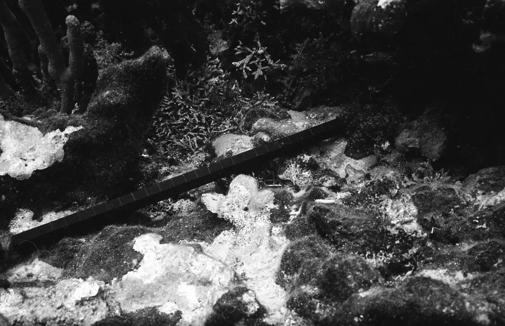{.lightbox group="discovery-bay-1966" description="**UUID: **4d9b7947-b30f-47df-b9d5-04e5945ec08f **Date: **1966-09-22 **Location: **Jamaica | Discovery Bay | Silver Seas **Longitude: **77.4599ºW **Latitude: **18.4789ºN **Photographer: **Eileen Graham **Copyright: **Trustees of the Natural History Museum (London, UK), CC-BY-4.0" alt="**UUID: **4d9b7947-b30f-47df-b9d5-04e5945ec08f **Date: **1966-09-22 **Location: **Jamaica | Discovery Bay | Silver Seas **Longitude: **77.4599ºW **Latitude: **18.4789ºN **Photographer: **Eileen Graham **Copyright: **Trustees of the Natural History Museum (London, UK), CC-BY-4.0"}

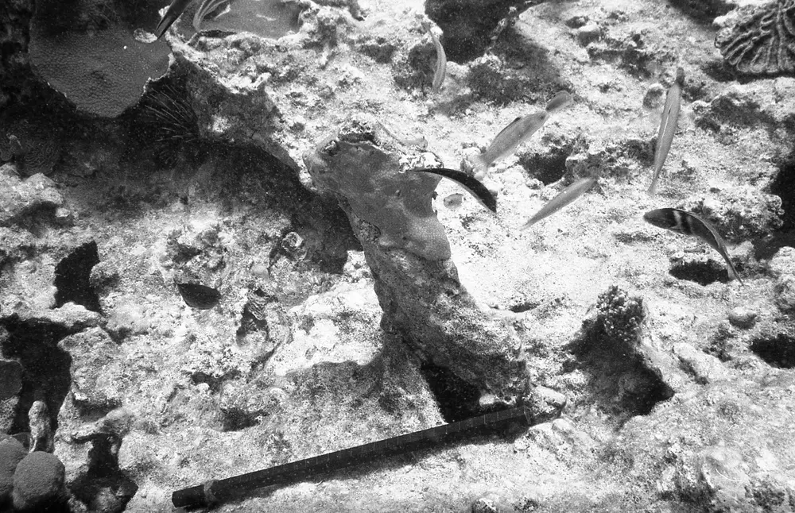{.lightbox group="discovery-bay-1966" description="**UUID: **c9df56ef-91a4-4d21-9a1b-9c6215df9e67 **Date: **1966-09-22 **Location: **Jamaica | Discovery Bay | Silver Seas **Longitude: **77.4599ºW **Latitude: **18.4789ºN **Photographer: **Eileen Graham **Copyright: **Trustees of the Natural History Museum (London, UK), CC-BY-4.0" alt="**UUID: **c9df56ef-91a4-4d21-9a1b-9c6215df9e67 **Date: **1966-09-22 **Location: **Jamaica | Discovery Bay | Silver Seas **Longitude: **77.4599ºW **Latitude: **18.4789ºN **Photographer: **Eileen Graham **Copyright: **Trustees of the Natural History Museum (London, UK), CC-BY-4.0"}

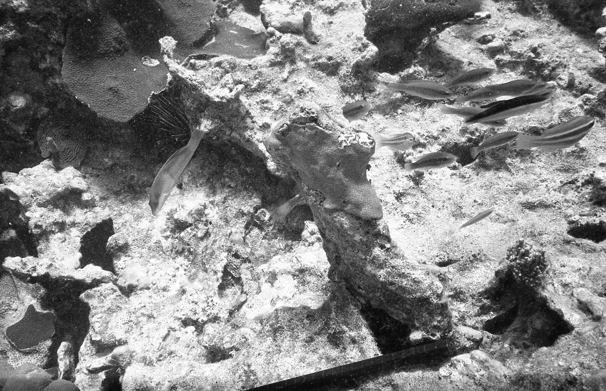{.lightbox group="discovery-bay-1966" description="**UUID: **ea7c27b5-5eff-43ee-a9ec-445dd8c135bf **Date: **1966-09-22 **Location: **Jamaica | Discovery Bay | Silver Seas **Longitude: **77.4599ºW **Latitude: **18.4789ºN **Photographer: **Eileen Graham **Copyright: **Trustees of the Natural History Museum (London, UK), CC-BY-4.0" alt="**UUID: **ea7c27b5-5eff-43ee-a9ec-445dd8c135bf **Date: **1966-09-22 **Location: **Jamaica | Discovery Bay | Silver Seas **Longitude: **77.4599ºW **Latitude: **18.4789ºN **Photographer: **Eileen Graham **Copyright: **Trustees of the Natural History Museum (London, UK), CC-BY-4.0"}

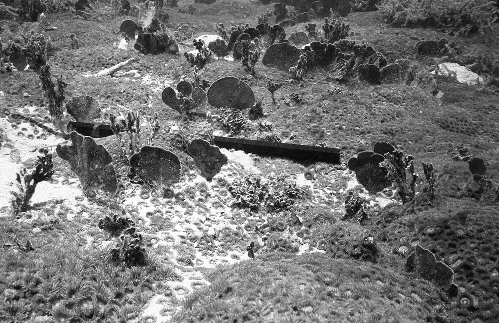{.lightbox group="discovery-bay-1966" description="**UUID: **5db8cbc6-1e66-4a9c-b556-4d12d8814d11 **Date: **1966-09-22 **Location: **Jamaica | Discovery Bay | Silver Seas **Longitude: **77.4599ºW **Latitude: **18.4789ºN **Photographer: **Eileen Graham **Copyright: **Trustees of the Natural History Museum (London, UK), CC-BY-4.0" alt="**UUID: **5db8cbc6-1e66-4a9c-b556-4d12d8814d11 **Date: **1966-09-22 **Location: **Jamaica | Discovery Bay | Silver Seas **Longitude: **77.4599ºW **Latitude: **18.4789ºN **Photographer: **Eileen Graham **Copyright: **Trustees of the Natural History Museum (London, UK), CC-BY-4.0"}

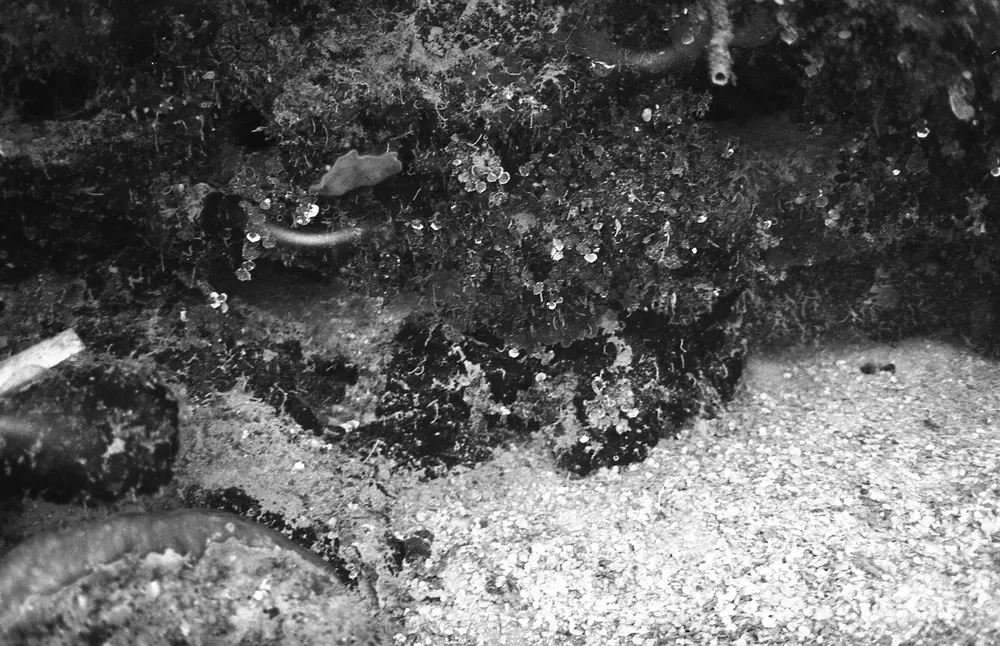{.lightbox group="discovery-bay-1966" description="**UUID: **89cacec4-53e7-44bf-80d0-3f255a577208 **Date: **1966-10-10 **Location: **Jamaica | Discovery Bay | Buoy Upper Slope **Longitude: **77.40908ºW **Latitude: **18.47322ºN **Photographer: **Eileen Graham **Copyright: **Trustees of the Natural History Museum (London, UK), CC-BY-4.0" alt="**UUID: **89cacec4-53e7-44bf-80d0-3f255a577208 **Date: **1966-10-10 **Location: **Jamaica | Discovery Bay | Buoy Upper Slope **Longitude: **77.40908ºW **Latitude: **18.47322ºN **Photographer: **Eileen Graham **Copyright: **Trustees of the Natural History Museum (London, UK), CC-BY-4.0"}

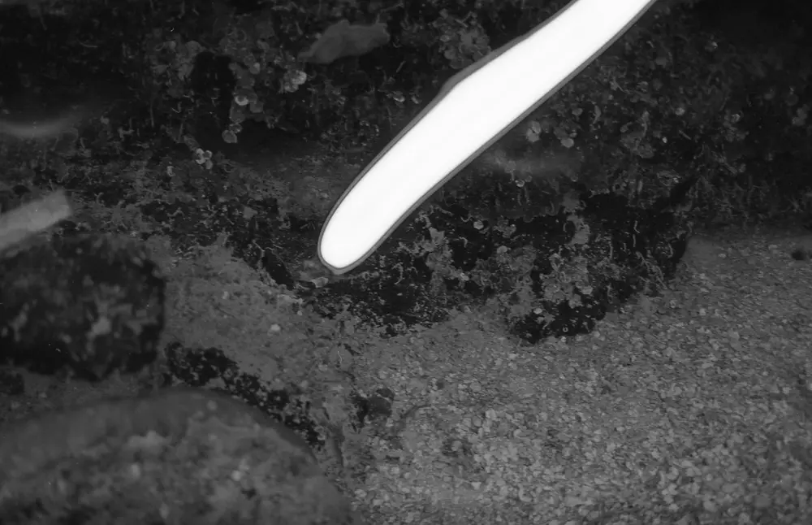{.lightbox group="discovery-bay-1966" description="**UUID: **d44db7ad-2313-4436-8c99-97071f98304a **Date: **1966-10-10 **Location: **Jamaica | Discovery Bay | Buoy Upper Slope **Longitude: **77.40908ºW **Latitude: **18.47322ºN **Photographer: **Eileen Graham **Copyright: **Trustees of the Natural History Museum (London, UK), CC-BY-4.0" alt="**UUID: **d44db7ad-2313-4436-8c99-97071f98304a **Date: **1966-10-10 **Location: **Jamaica | Discovery Bay | Buoy Upper Slope **Longitude: **77.40908ºW **Latitude: **18.47322ºN **Photographer: **Eileen Graham **Copyright: **Trustees of the Natural History Museum (London, UK), CC-BY-4.0"}

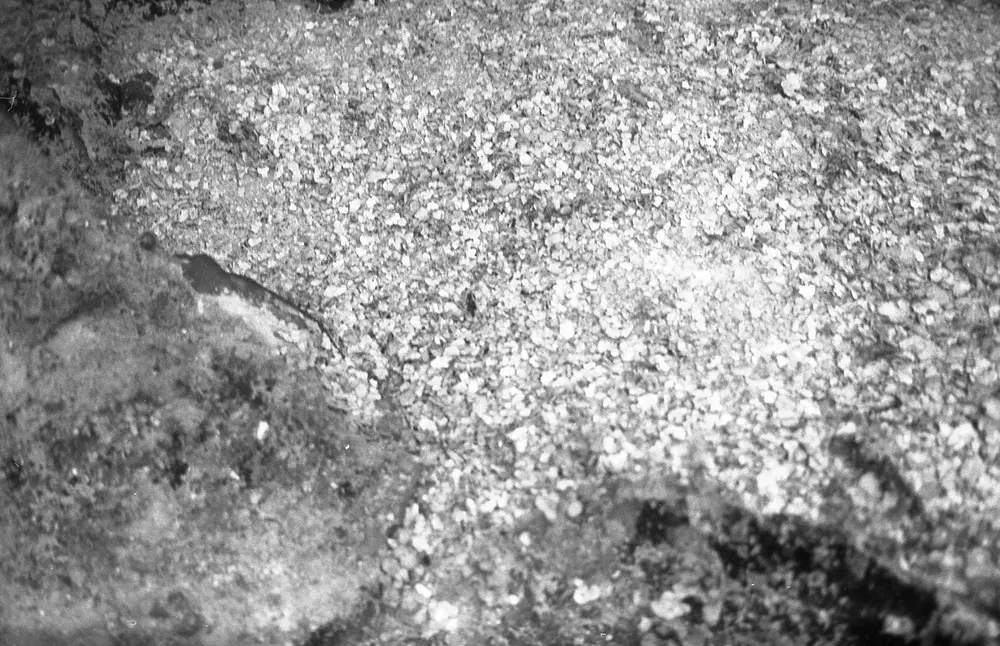{.lightbox group="discovery-bay-1966" description="**UUID: **c1aa43a4-7208-4d64-b4c6-a1e61d4153b0 **Date: **1966-10-10 **Location: **Jamaica | Discovery Bay | Buoy Upper Slope **Longitude: **77.40908ºW **Latitude: **18.47322ºN **Photographer: **Eileen Graham **Copyright: **Trustees of the Natural History Museum (London, UK), CC-BY-4.0" alt="**UUID: **c1aa43a4-7208-4d64-b4c6-a1e61d4153b0 **Date: **1966-10-10 **Location: **Jamaica | Discovery Bay | Buoy Upper Slope **Longitude: **77.40908ºW **Latitude: **18.47322ºN **Photographer: **Eileen Graham **Copyright: **Trustees of the Natural History Museum (London, UK), CC-BY-4.0"}

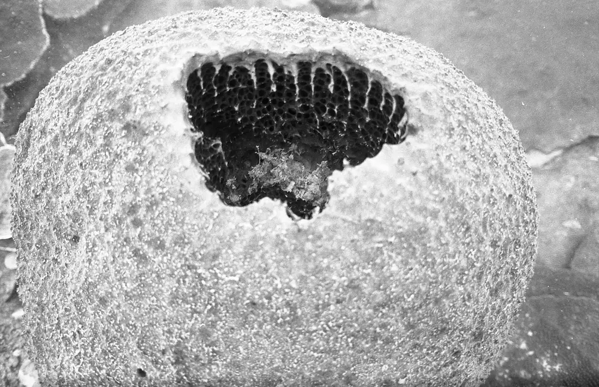{.lightbox group="discovery-bay-1966" description="**UUID: **fc5ff02d-1022-4515-a370-9106cb2c8be1 **Date: **1966-10-10 **Location: **Jamaica | Discovery Bay | Buoy Upper Slope **Longitude: **77.40908ºW **Latitude: **18.47322ºN **Photographer: **Eileen Graham **Copyright: **Trustees of the Natural History Museum (London, UK), CC-BY-4.0" alt="**UUID: **fc5ff02d-1022-4515-a370-9106cb2c8be1 **Date: **1966-10-10 **Location: **Jamaica | Discovery Bay | Buoy Upper Slope **Longitude: **77.40908ºW **Latitude: **18.47322ºN **Photographer: **Eileen Graham **Copyright: **Trustees of the Natural History Museum (London, UK), CC-BY-4.0"}

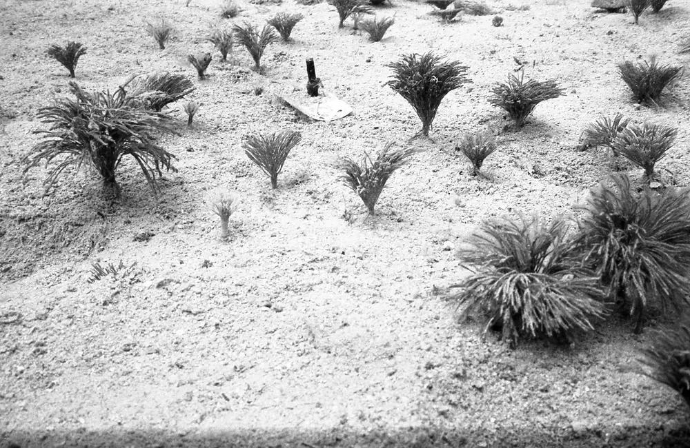{.lightbox group="discovery-bay-1966" description="**UUID: **7c3e36d4-fbfb-48a4-98a3-7995bbd9b595 **Date: **1966-10-10 **Location: **Jamaica | Discovery Bay | Algal Plots **Longitude: **77.414ºW **Latitude: **18.473ºN **Photographer: **Eileen Graham **Copyright: **Trustees of the Natural History Museum (London, UK), CC-BY-4.0" alt="**UUID: **7c3e36d4-fbfb-48a4-98a3-7995bbd9b595 **Date: **1966-10-10 **Location: **Jamaica | Discovery Bay | Algal Plots **Longitude: **77.414ºW **Latitude: **18.473ºN **Photographer: **Eileen Graham **Copyright: **Trustees of the Natural History Museum (London, UK), CC-BY-4.0"}

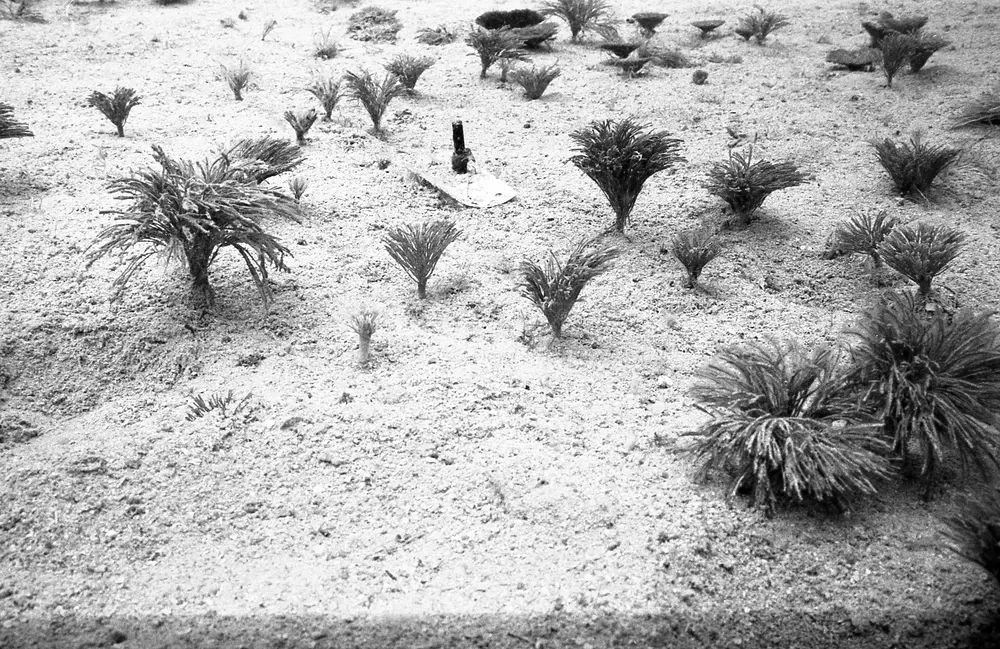{.lightbox group="discovery-bay-1966" description="**UUID: **1c2a86e6-8745-4501-94e7-c2b255e774c8 **Date: **1966-10-10 **Location: **Jamaica | Discovery Bay | Algal Plots **Longitude: **77.414ºW **Latitude: **18.473ºN **Photographer: **Eileen Graham **Copyright: **Trustees of the Natural History Museum (London, UK), CC-BY-4.0" alt="**UUID: **1c2a86e6-8745-4501-94e7-c2b255e774c8 **Date: **1966-10-10 **Location: **Jamaica | Discovery Bay | Algal Plots **Longitude: **77.414ºW **Latitude: **18.473ºN **Photographer: **Eileen Graham **Copyright: **Trustees of the Natural History Museum (London, UK), CC-BY-4.0"}

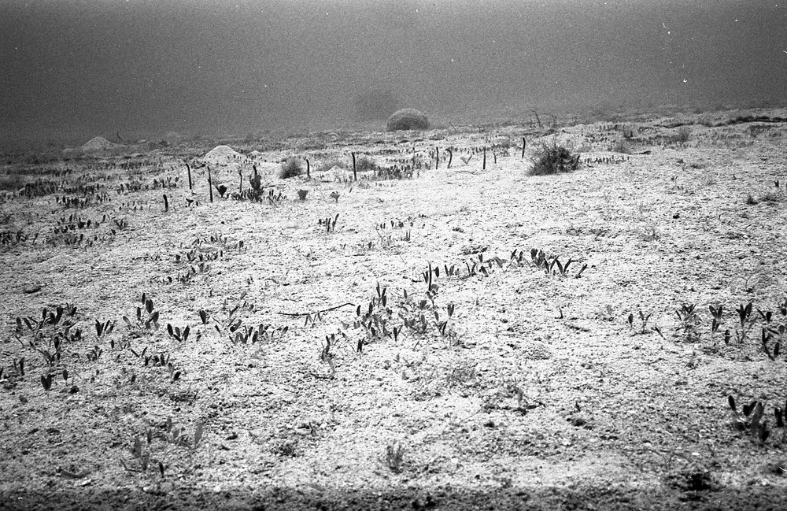{.lightbox group="discovery-bay-1966" description="**UUID: **1f78531f-5a0c-4a6c-b282-72ed791abe11 **Date: **1966-10-10 **Location: **Jamaica | Discovery Bay | Algal Plots **Longitude: **77.414ºW **Latitude: **18.473ºN **Photographer: **Eileen Graham **Copyright: **Trustees of the Natural History Museum (London, UK), CC-BY-4.0" alt="**UUID: **1f78531f-5a0c-4a6c-b282-72ed791abe11 **Date: **1966-10-10 **Location: **Jamaica | Discovery Bay | Algal Plots **Longitude: **77.414ºW **Latitude: **18.473ºN **Photographer: **Eileen Graham **Copyright: **Trustees of the Natural History Museum (London, UK), CC-BY-4.0"}

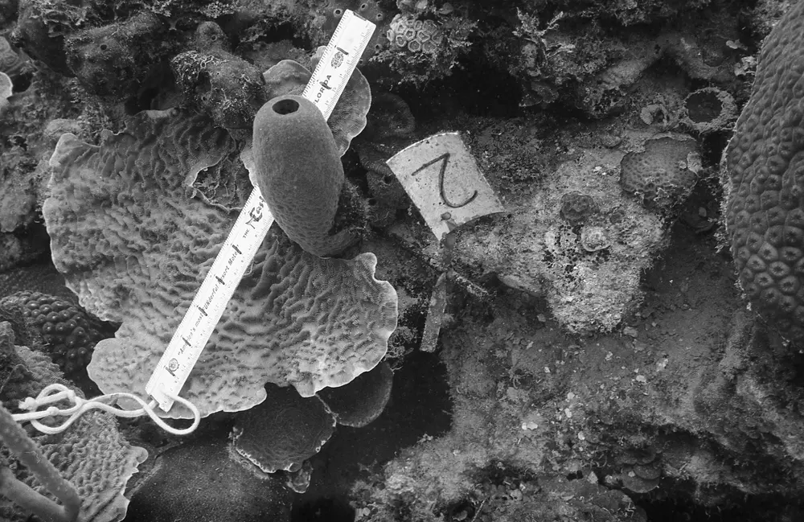{.lightbox group="discovery-bay-1966" description="**UUID: **c7164790-15c3-4bac-bcae-d990defbf368 **Date: **1966-10-10 **Location: **Jamaica | Discovery Bay | Buoy Upper Slope **Longitude: **77.40908ºW **Latitude: **18.47322ºN **Photographer: **Eileen Graham **Copyright: **Trustees of the Natural History Museum (London, UK), CC-BY-4.0" alt="**UUID: **c7164790-15c3-4bac-bcae-d990defbf368 **Date: **1966-10-10 **Location: **Jamaica | Discovery Bay | Buoy Upper Slope **Longitude: **77.40908ºW **Latitude: **18.47322ºN **Photographer: **Eileen Graham **Copyright: **Trustees of the Natural History Museum (London, UK), CC-BY-4.0"}

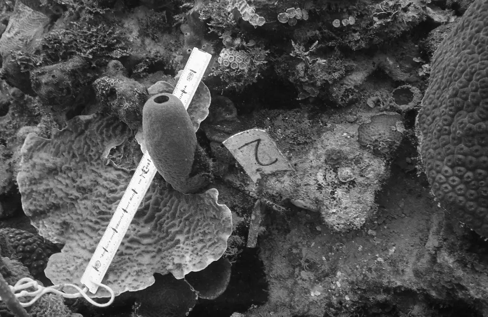{.lightbox group="discovery-bay-1966" description="**UUID: **eeb68371-6e3a-43ef-a63c-8f21386b654c **Date: **1966-10-10 **Location: **Jamaica | Discovery Bay | Buoy Upper Slope **Longitude: **77.40908ºW **Latitude: **18.47322ºN **Photographer: **Eileen Graham **Copyright: **Trustees of the Natural History Museum (London, UK), CC-BY-4.0" alt="**UUID: **eeb68371-6e3a-43ef-a63c-8f21386b654c **Date: **1966-10-10 **Location: **Jamaica | Discovery Bay | Buoy Upper Slope **Longitude: **77.40908ºW **Latitude: **18.47322ºN **Photographer: **Eileen Graham **Copyright: **Trustees of the Natural History Museum (London, UK), CC-BY-4.0"}

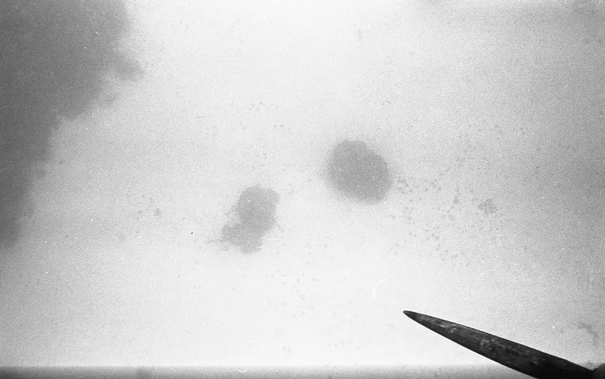{.lightbox group="discovery-bay-1966" description="**UUID: **aa24b21f-e3b7-4387-b6a1-903ad9218e50 **Date: **1966-10-10 **Location: **Jamaica | Discovery Bay | Buoy Mooring (1960s) **Longitude: **77.40908ºW **Latitude: **18.47322ºN **Photographer: **Eileen Graham **Copyright: **Trustees of the Natural History Museum (London, UK), CC-BY-4.0" alt="**UUID: **aa24b21f-e3b7-4387-b6a1-903ad9218e50 **Date: **1966-10-10 **Location: **Jamaica | Discovery Bay | Buoy Mooring (1960s) **Longitude: **77.40908ºW **Latitude: **18.47322ºN **Photographer: **Eileen Graham **Copyright: **Trustees of the Natural History Museum (London, UK), CC-BY-4.0"}

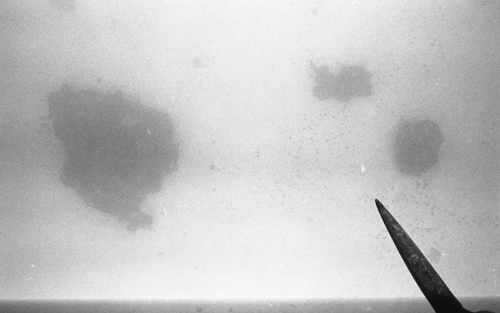{.lightbox group="discovery-bay-1966" description="**UUID: **ce15ad83-e2ec-46bb-b60f-219a1808b6d7 **Date: **1966-10-10 **Location: **Jamaica | Discovery Bay | Buoy Mooring (1960s) **Longitude: **77.40908ºW **Latitude: **18.47322ºN **Photographer: **Eileen Graham **Copyright: **Trustees of the Natural History Museum (London, UK), CC-BY-4.0" alt="**UUID: **ce15ad83-e2ec-46bb-b60f-219a1808b6d7 **Date: **1966-10-10 **Location: **Jamaica | Discovery Bay | Buoy Mooring (1960s) **Longitude: **77.40908ºW **Latitude: **18.47322ºN **Photographer: **Eileen Graham **Copyright: **Trustees of the Natural History Museum (London, UK), CC-BY-4.0"}

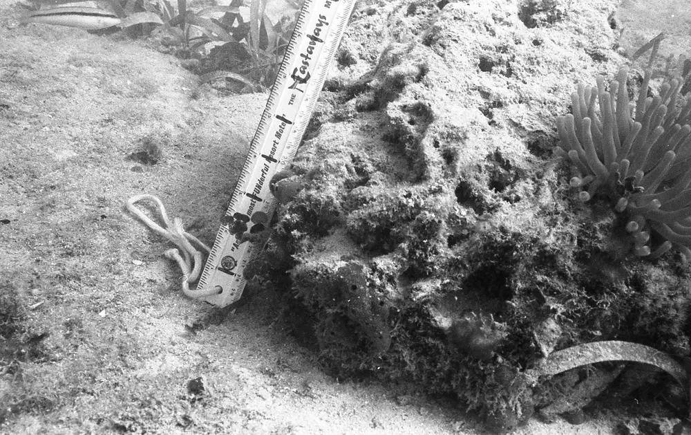{.lightbox group="discovery-bay-1966" description="**UUID: **ec224971-3aca-4d29-ad79-0316e7329525 **Date: **1966-10-10 **Location: **Jamaica | Discovery Bay | Discovery Bay Purden House **Longitude: **77.40268ºW **Latitude: **18.46868ºN **Photographer: **Eileen Graham **Copyright: **Trustees of the Natural History Museum (London, UK), CC-BY-4.0" alt="**UUID: **ec224971-3aca-4d29-ad79-0316e7329525 **Date: **1966-10-10 **Location: **Jamaica | Discovery Bay | Discovery Bay Purden House **Longitude: **77.40268ºW **Latitude: **18.46868ºN **Photographer: **Eileen Graham **Copyright: **Trustees of the Natural History Museum (London, UK), CC-BY-4.0"}

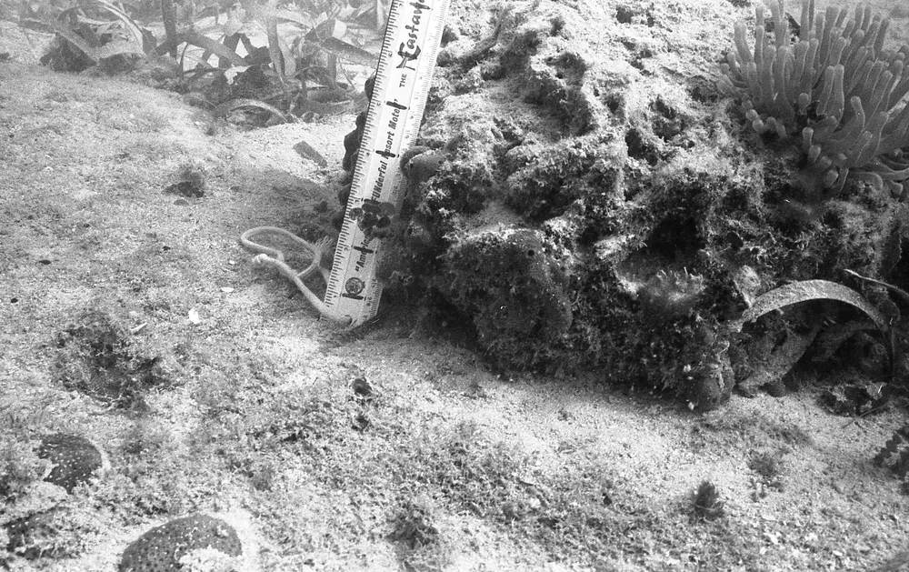{.lightbox group="discovery-bay-1966" description="**UUID: **f5be1740-26c7-40a8-a734-4f6eb77fb955 **Date: **1966-10-10 **Location: **Jamaica | Discovery Bay | Discovery Bay Purden House **Longitude: **77.40268ºW **Latitude: **18.46868ºN **Photographer: **Eileen Graham **Copyright: **Trustees of the Natural History Museum (London, UK), CC-BY-4.0" alt="**UUID: **f5be1740-26c7-40a8-a734-4f6eb77fb955 **Date: **1966-10-10 **Location: **Jamaica | Discovery Bay | Discovery Bay Purden House **Longitude: **77.40268ºW **Latitude: **18.46868ºN **Photographer: **Eileen Graham **Copyright: **Trustees of the Natural History Museum (London, UK), CC-BY-4.0"}

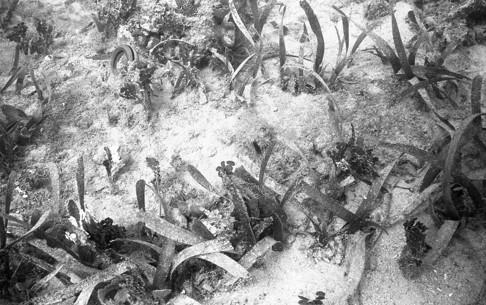{.lightbox group="discovery-bay-1966" description="**UUID: **7fce4eec-7c4c-4b5a-ae02-befa74e356df **Date: **1966-10-10 **Location: **Jamaica | Discovery Bay | Discovery Bay Purden House **Longitude: **77.40268ºW **Latitude: **18.46868ºN **Photographer: **Eileen Graham **Copyright: **Trustees of the Natural History Museum (London, UK), CC-BY-4.0" alt="**UUID: **7fce4eec-7c4c-4b5a-ae02-befa74e356df **Date: **1966-10-10 **Location: **Jamaica | Discovery Bay | Discovery Bay Purden House **Longitude: **77.40268ºW **Latitude: **18.46868ºN **Photographer: **Eileen Graham **Copyright: **Trustees of the Natural History Museum (London, UK), CC-BY-4.0"}

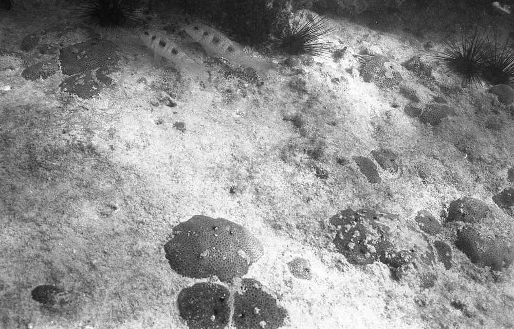{.lightbox group="discovery-bay-1966" description="**UUID: **2eb7bb32-2d4f-4b11-9bc5-bdf7ab232846 **Date: **1966-10-10 **Location: **Jamaica | Discovery Bay | Discovery Bay Purden House **Longitude: **77.40268ºW **Latitude: **18.46868ºN **Photographer: **Eileen Graham **Copyright: **Trustees of the Natural History Museum (London, UK), CC-BY-4.0" alt="**UUID: **2eb7bb32-2d4f-4b11-9bc5-bdf7ab232846 **Date: **1966-10-10 **Location: **Jamaica | Discovery Bay | Discovery Bay Purden House **Longitude: **77.40268ºW **Latitude: **18.46868ºN **Photographer: **Eileen Graham **Copyright: **Trustees of the Natural History Museum (London, UK), CC-BY-4.0"}

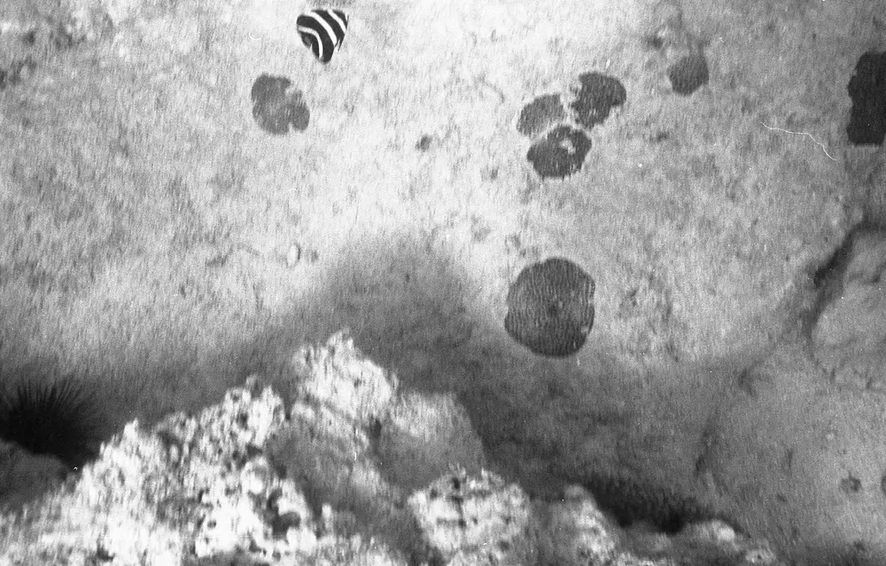{.lightbox group="discovery-bay-1966" description="**UUID: **d1daa445-ef11-4443-b8de-dc1f0dec126e **Date: **1966-10-10 **Location: **Jamaica | Discovery Bay | Discovery Bay Purden House **Longitude: **77.40268ºW **Latitude: **18.46868ºN **Photographer: **Eileen Graham **Copyright: **Trustees of the Natural History Museum (London, UK), CC-BY-4.0" alt="**UUID: **d1daa445-ef11-4443-b8de-dc1f0dec126e **Date: **1966-10-10 **Location: **Jamaica | Discovery Bay | Discovery Bay Purden House **Longitude: **77.40268ºW **Latitude: **18.46868ºN **Photographer: **Eileen Graham **Copyright: **Trustees of the Natural History Museum (London, UK), CC-BY-4.0"}

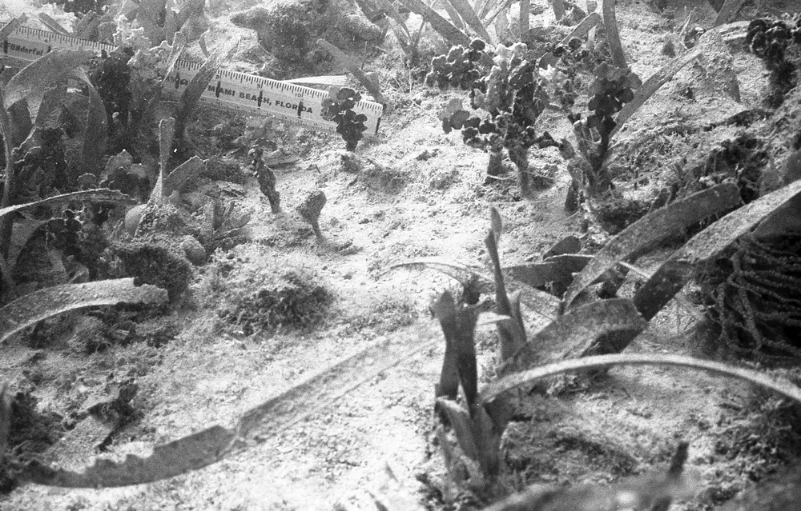{.lightbox group="discovery-bay-1966" description="**UUID: **b84ecc39-22f8-4fbf-aa5c-7db02025f27f **Date: **1966-10-10 **Location: **Jamaica | Discovery Bay | Discovery Bay Purden House **Longitude: **77.40268ºW **Latitude: **18.46868ºN **Photographer: **Eileen Graham **Copyright: **Trustees of the Natural History Museum (London, UK), CC-BY-4.0" alt="**UUID: **b84ecc39-22f8-4fbf-aa5c-7db02025f27f **Date: **1966-10-10 **Location: **Jamaica | Discovery Bay | Discovery Bay Purden House **Longitude: **77.40268ºW **Latitude: **18.46868ºN **Photographer: **Eileen Graham **Copyright: **Trustees of the Natural History Museum (London, UK), CC-BY-4.0"}

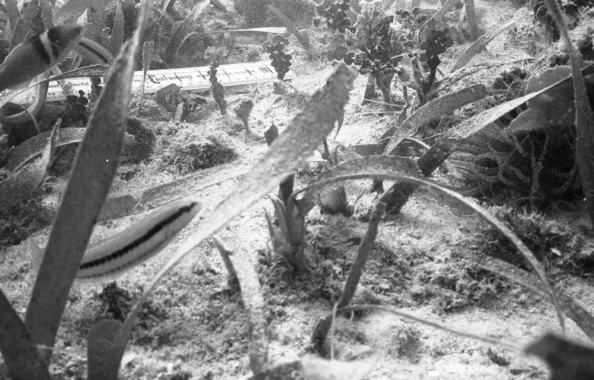{.lightbox group="discovery-bay-1966" description="**UUID: **0ae838ae-a58c-4a02-9d28-507f3323c866 **Date: **1966-10-10 **Location: **Jamaica | Discovery Bay | Discovery Bay Purden House **Longitude: **77.40268ºW **Latitude: **18.46868ºN **Photographer: **Eileen Graham **Copyright: **Trustees of the Natural History Museum (London, UK), CC-BY-4.0" alt="**UUID: **0ae838ae-a58c-4a02-9d28-507f3323c866 **Date: **1966-10-10 **Location: **Jamaica | Discovery Bay | Discovery Bay Purden House **Longitude: **77.40268ºW **Latitude: **18.46868ºN **Photographer: **Eileen Graham **Copyright: **Trustees of the Natural History Museum (London, UK), CC-BY-4.0"}

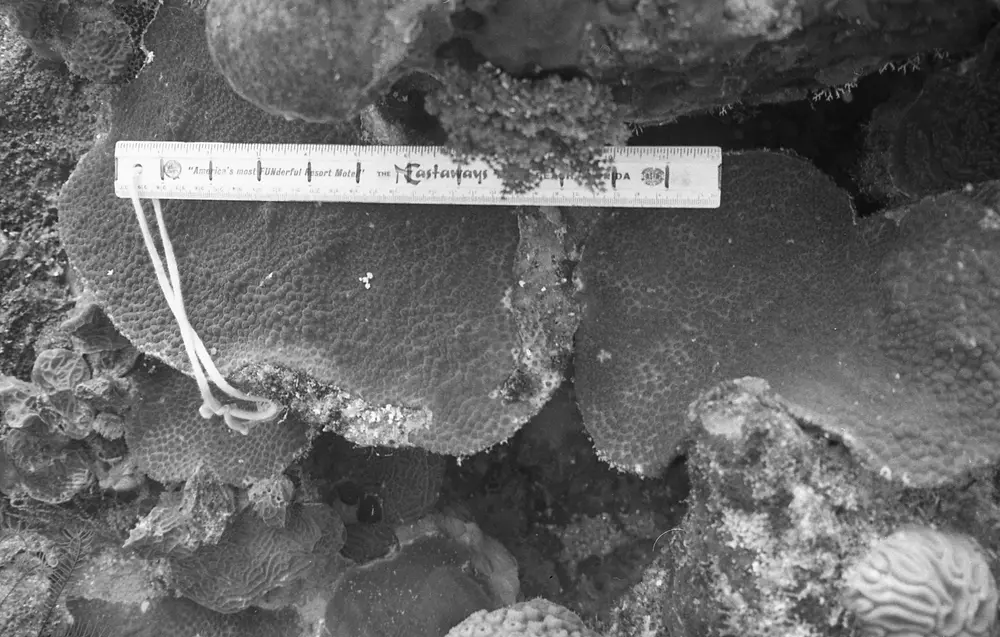{.lightbox group="discovery-bay-1966" description="**UUID: **bd9a2fef-1433-4afe-950a-03f0b141a0e7 **Date: **1966-11-10 **Location: **Jamaica | Discovery Bay | Buoy Upper Slope **Longitude: **77.40908ºW **Latitude: **18.47322ºN **Photographer: **Eileen Graham **Copyright: **Trustees of the Natural History Museum (London, UK), CC-BY-4.0" alt="**UUID: **bd9a2fef-1433-4afe-950a-03f0b141a0e7 **Date: **1966-11-10 **Location: **Jamaica | Discovery Bay | Buoy Upper Slope **Longitude: **77.40908ºW **Latitude: **18.47322ºN **Photographer: **Eileen Graham **Copyright: **Trustees of the Natural History Museum (London, UK), CC-BY-4.0"}

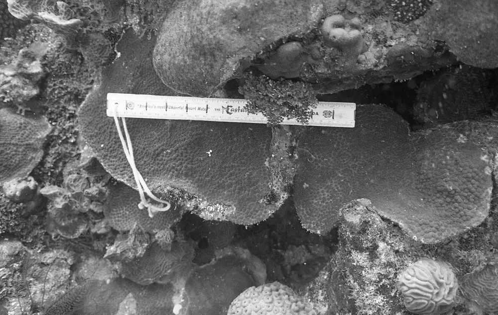{.lightbox group="discovery-bay-1966" description="**UUID: **c8b0671c-12bc-41f0-9a72-4751a6db7f07 **Date: **1966-11-10 **Location: **Jamaica | Discovery Bay | Buoy Upper Slope **Longitude: **77.40908ºW **Latitude: **18.47322ºN **Photographer: **Eileen Graham **Copyright: **Trustees of the Natural History Museum (London, UK), CC-BY-4.0" alt="**UUID: **c8b0671c-12bc-41f0-9a72-4751a6db7f07 **Date: **1966-11-10 **Location: **Jamaica | Discovery Bay | Buoy Upper Slope **Longitude: **77.40908ºW **Latitude: **18.47322ºN **Photographer: **Eileen Graham **Copyright: **Trustees of the Natural History Museum (London, UK), CC-BY-4.0"}

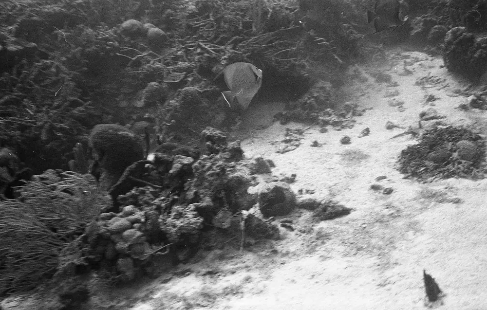{.lightbox group="discovery-bay-1966" description="**UUID: **fbb18cb0-ef9a-49a8-8bdb-1f8c4ce0279f **Date: **1966-11-10 **Location: **Jamaica | Discovery Bay | Upper Buoy Escarpment **Longitude: **77.409ºW **Latitude: **18.4726ºN **Photographer: **Eileen Graham **Copyright: **Trustees of the Natural History Museum (London, UK), CC-BY-4.0" alt="**UUID: **fbb18cb0-ef9a-49a8-8bdb-1f8c4ce0279f **Date: **1966-11-10 **Location: **Jamaica | Discovery Bay | Upper Buoy Escarpment **Longitude: **77.409ºW **Latitude: **18.4726ºN **Photographer: **Eileen Graham **Copyright: **Trustees of the Natural History Museum (London, UK), CC-BY-4.0"}

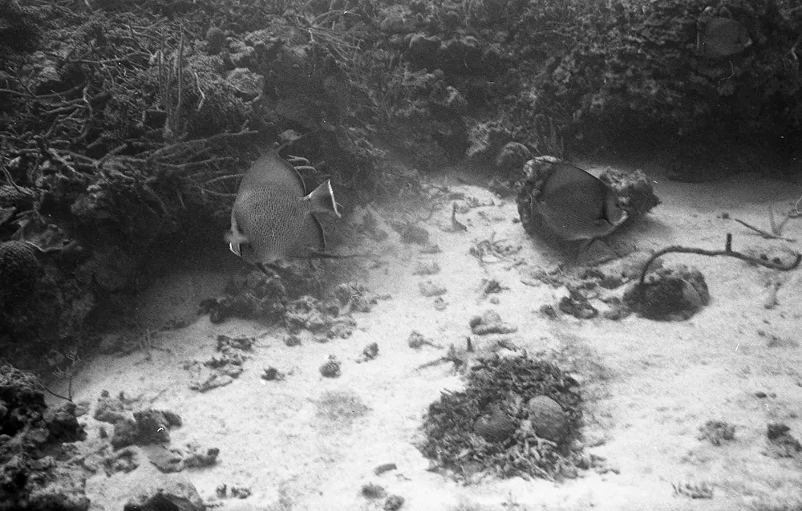{.lightbox group="discovery-bay-1966" description="**UUID: **1a6a613d-54e8-478e-b6f7-0f8d34247137 **Date: **1966-11-10 **Location: **Jamaica | Discovery Bay | Upper Buoy Escarpment **Longitude: **77.409ºW **Latitude: **18.4726ºN **Photographer: **Eileen Graham **Copyright: **Trustees of the Natural History Museum (London, UK), CC-BY-4.0" alt="**UUID: **1a6a613d-54e8-478e-b6f7-0f8d34247137 **Date: **1966-11-10 **Location: **Jamaica | Discovery Bay | Upper Buoy Escarpment **Longitude: **77.409ºW **Latitude: **18.4726ºN **Photographer: **Eileen Graham **Copyright: **Trustees of the Natural History Museum (London, UK), CC-BY-4.0"}

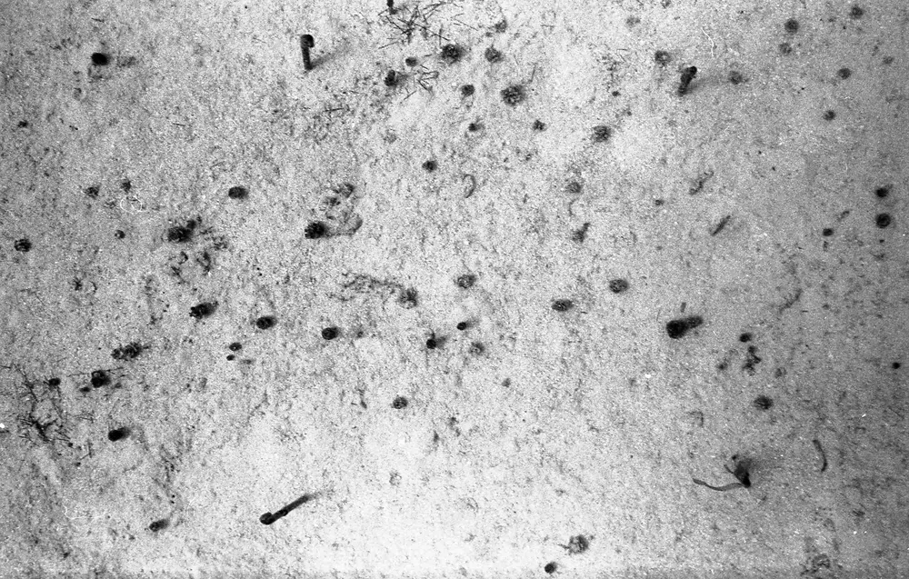{.lightbox group="discovery-bay-1966" description="**UUID: **082e6fc1-ae63-461c-90b1-179ee00f39d5 **Date: **1966-11-10 **Location: **Jamaica | Discovery Bay | Algal Plots **Longitude: **77.414ºW **Latitude: **18.473ºN **Photographer: **Eileen Graham **Copyright: **Trustees of the Natural History Museum (London, UK), CC-BY-4.0" alt="**UUID: **082e6fc1-ae63-461c-90b1-179ee00f39d5 **Date: **1966-11-10 **Location: **Jamaica | Discovery Bay | Algal Plots **Longitude: **77.414ºW **Latitude: **18.473ºN **Photographer: **Eileen Graham **Copyright: **Trustees of the Natural History Museum (London, UK), CC-BY-4.0"}

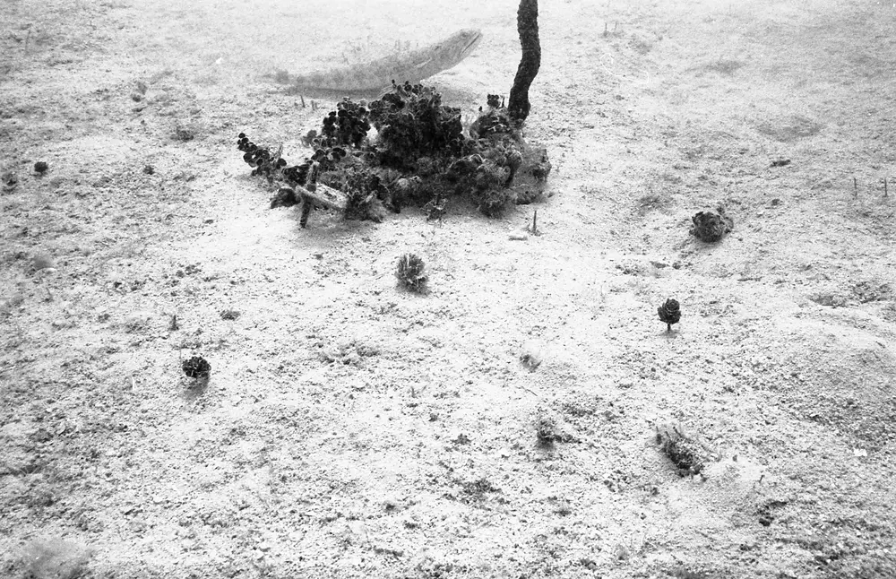{.lightbox group="discovery-bay-1966" description="**UUID: **025caede-e0fe-4430-b681-70e7b3fe214a **Date: **1966-11-10 **Location: **Jamaica | Discovery Bay | Algal Plots **Longitude: **77.414ºW **Latitude: **18.473ºN **Photographer: **Eileen Graham **Copyright: **Trustees of the Natural History Museum (London, UK), CC-BY-4.0" alt="**UUID: **025caede-e0fe-4430-b681-70e7b3fe214a **Date: **1966-11-10 **Location: **Jamaica | Discovery Bay | Algal Plots **Longitude: **77.414ºW **Latitude: **18.473ºN **Photographer: **Eileen Graham **Copyright: **Trustees of the Natural History Museum (London, UK), CC-BY-4.0"}

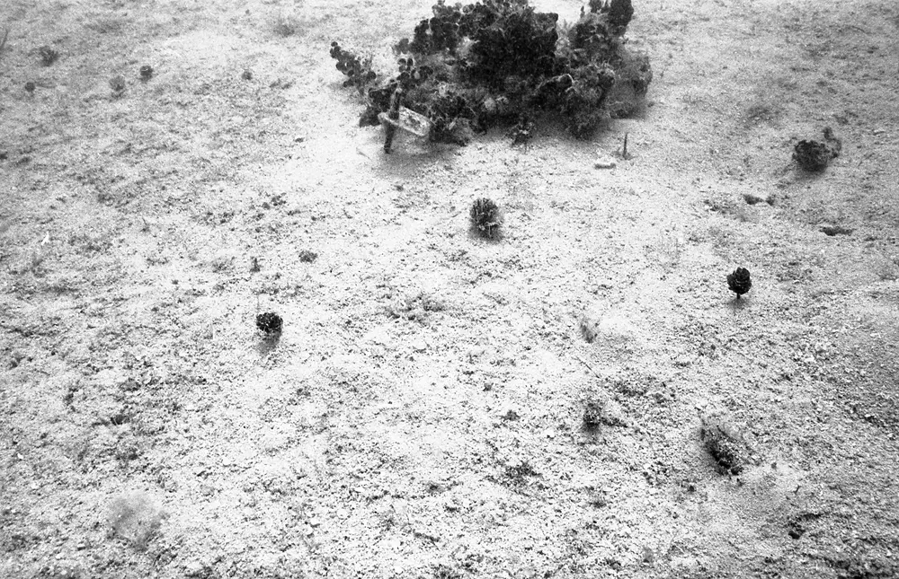{.lightbox group="discovery-bay-1966" description="**UUID: **d20383b9-a6c1-492f-9ef8-89733330d9cd **Date: **1966-11-10 **Location: **Jamaica | Discovery Bay | Algal Plots **Longitude: **77.414ºW **Latitude: **18.473ºN **Photographer: **Eileen Graham **Copyright: **Trustees of the Natural History Museum (London, UK), CC-BY-4.0" alt="**UUID: **d20383b9-a6c1-492f-9ef8-89733330d9cd **Date: **1966-11-10 **Location: **Jamaica | Discovery Bay | Algal Plots **Longitude: **77.414ºW **Latitude: **18.473ºN **Photographer: **Eileen Graham **Copyright: **Trustees of the Natural History Museum (London, UK), CC-BY-4.0"}

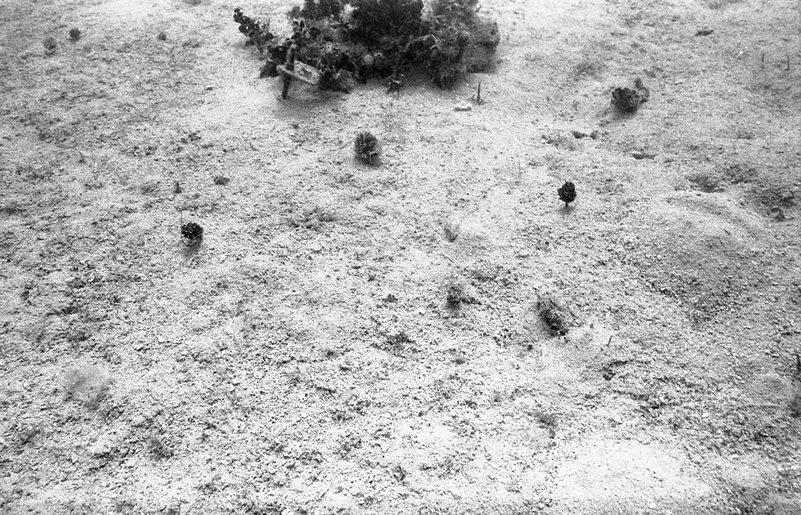{.lightbox group="discovery-bay-1966" description="**UUID: **22f83a93-dfae-426a-8075-6c7b419f8525 **Date: **1966-11-10 **Location: **Jamaica | Discovery Bay | Algal Plots **Longitude: **77.414ºW **Latitude: **18.473ºN **Photographer: **Eileen Graham **Copyright: **Trustees of the Natural History Museum (London, UK), CC-BY-4.0" alt="**UUID: **22f83a93-dfae-426a-8075-6c7b419f8525 **Date: **1966-11-10 **Location: **Jamaica | Discovery Bay | Algal Plots **Longitude: **77.414ºW **Latitude: **18.473ºN **Photographer: **Eileen Graham **Copyright: **Trustees of the Natural History Museum (London, UK), CC-BY-4.0"}

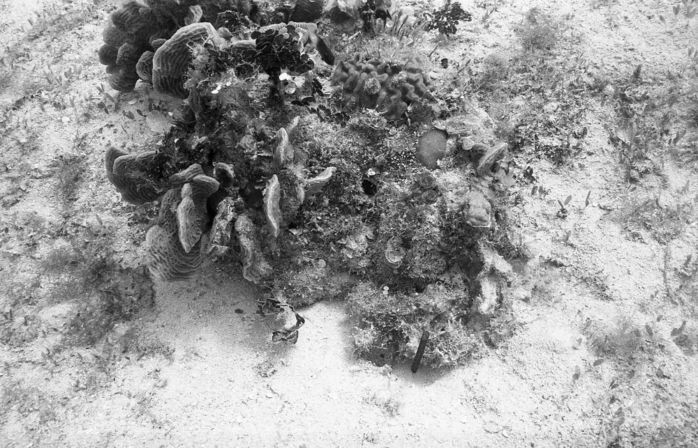{.lightbox group="discovery-bay-1966" description="**UUID: **e06cebdc-b2f4-458a-a49e-4af84a4c04bb **Date: **1966-11-10 **Location: **Jamaica | Discovery Bay | Algal Plots **Longitude: **77.414ºW **Latitude: **18.473ºN **Photographer: **Eileen Graham **Copyright: **Trustees of the Natural History Museum (London, UK), CC-BY-4.0" alt="**UUID: **e06cebdc-b2f4-458a-a49e-4af84a4c04bb **Date: **1966-11-10 **Location: **Jamaica | Discovery Bay | Algal Plots **Longitude: **77.414ºW **Latitude: **18.473ºN **Photographer: **Eileen Graham **Copyright: **Trustees of the Natural History Museum (London, UK), CC-BY-4.0"}

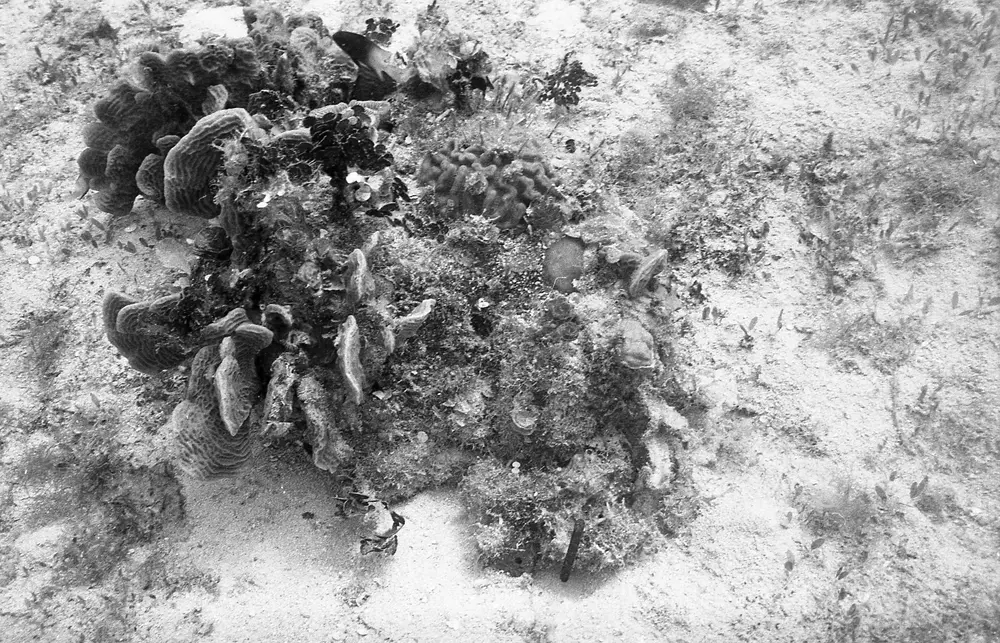{.lightbox group="discovery-bay-1966" description="**UUID: **2043b8b9-b455-4615-95ca-fec5bb956354 **Date: **1966-11-10 **Location: **Jamaica | Discovery Bay | Algal Plots **Longitude: **77.414ºW **Latitude: **18.473ºN **Photographer: **Eileen Graham **Copyright: **Trustees of the Natural History Museum (London, UK), CC-BY-4.0" alt="**UUID: **2043b8b9-b455-4615-95ca-fec5bb956354 **Date: **1966-11-10 **Location: **Jamaica | Discovery Bay | Algal Plots **Longitude: **77.414ºW **Latitude: **18.473ºN **Photographer: **Eileen Graham **Copyright: **Trustees of the Natural History Museum (London, UK), CC-BY-4.0"}

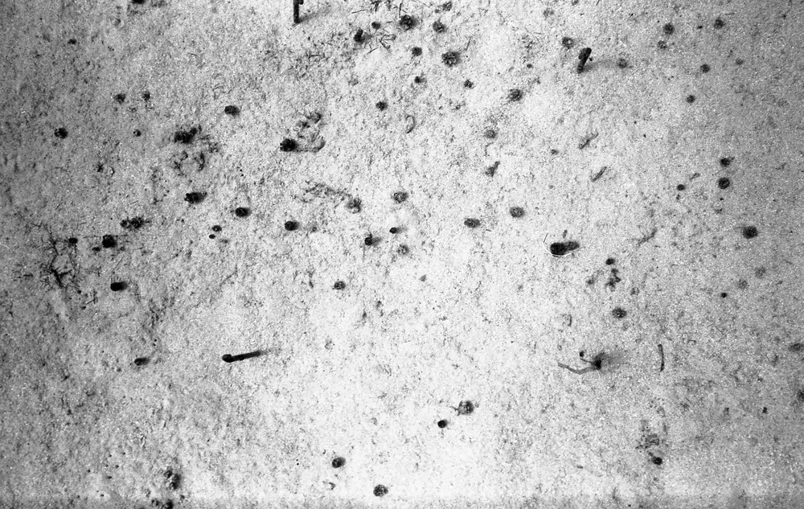{.lightbox group="discovery-bay-1966" description="**UUID: **38ffce68-b626-44af-99a5-3628fdd01be2 **Date: **1966-11-10 **Location: **Jamaica | Discovery Bay | Algal Plots **Longitude: **77.414ºW **Latitude: **18.473ºN **Photographer: **Eileen Graham **Copyright: **Trustees of the Natural History Museum (London, UK), CC-BY-4.0" alt="**UUID: **38ffce68-b626-44af-99a5-3628fdd01be2 **Date: **1966-11-10 **Location: **Jamaica | Discovery Bay | Algal Plots **Longitude: **77.414ºW **Latitude: **18.473ºN **Photographer: **Eileen Graham **Copyright: **Trustees of the Natural History Museum (London, UK), CC-BY-4.0"}

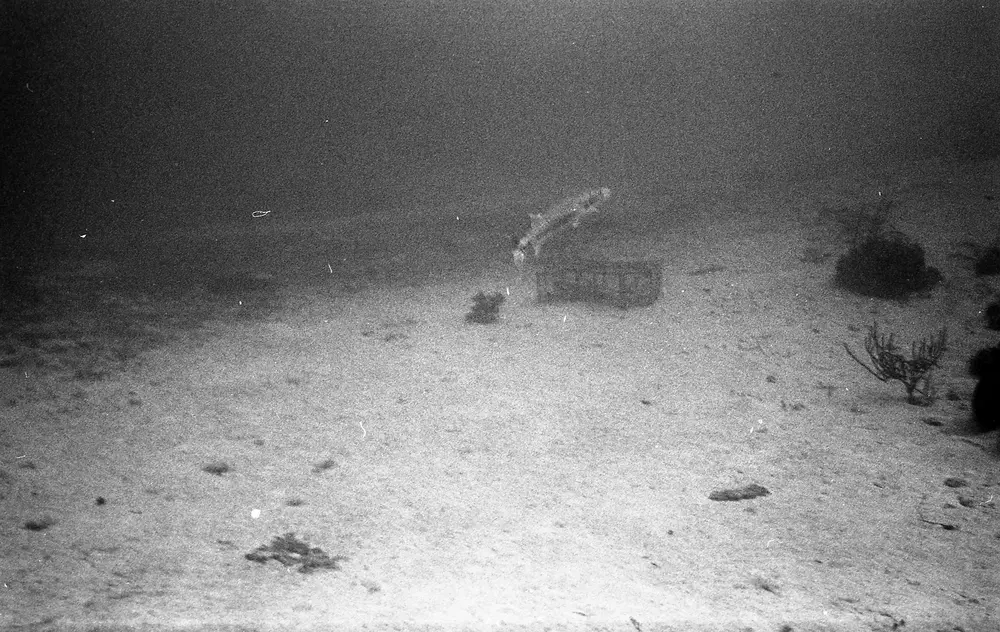{.lightbox group="discovery-bay-1966" description="**UUID: **5a0fe983-e11c-46cf-baef-70e01dd7aa4d **Date: **1966-11-10 **Location: **Jamaica | Discovery Bay | Algal Plots **Longitude: **77.414ºW **Latitude: **18.473ºN **Photographer: **Eileen Graham **Copyright: **Trustees of the Natural History Museum (London, UK), CC-BY-4.0" alt="**UUID: **5a0fe983-e11c-46cf-baef-70e01dd7aa4d **Date: **1966-11-10 **Location: **Jamaica | Discovery Bay | Algal Plots **Longitude: **77.414ºW **Latitude: **18.473ºN **Photographer: **Eileen Graham **Copyright: **Trustees of the Natural History Museum (London, UK), CC-BY-4.0"}

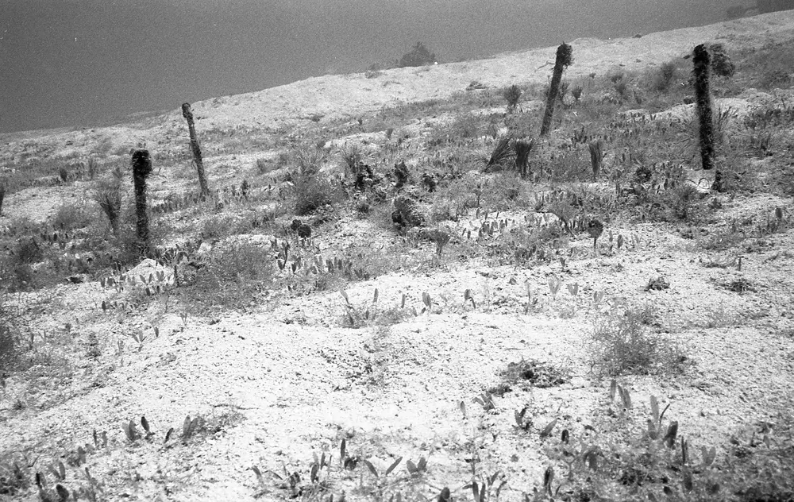{.lightbox group="discovery-bay-1966" description="**UUID: **22c8ae6f-398f-4a23-bcff-a094f3a4b452 **Date: **1966-11-10 **Location: **Jamaica | Discovery Bay | Algal Plots **Longitude: **77.414ºW **Latitude: **18.473ºN **Photographer: **Eileen Graham **Copyright: **Trustees of the Natural History Museum (London, UK), CC-BY-4.0" alt="**UUID: **22c8ae6f-398f-4a23-bcff-a094f3a4b452 **Date: **1966-11-10 **Location: **Jamaica | Discovery Bay | Algal Plots **Longitude: **77.414ºW **Latitude: **18.473ºN **Photographer: **Eileen Graham **Copyright: **Trustees of the Natural History Museum (London, UK), CC-BY-4.0"}

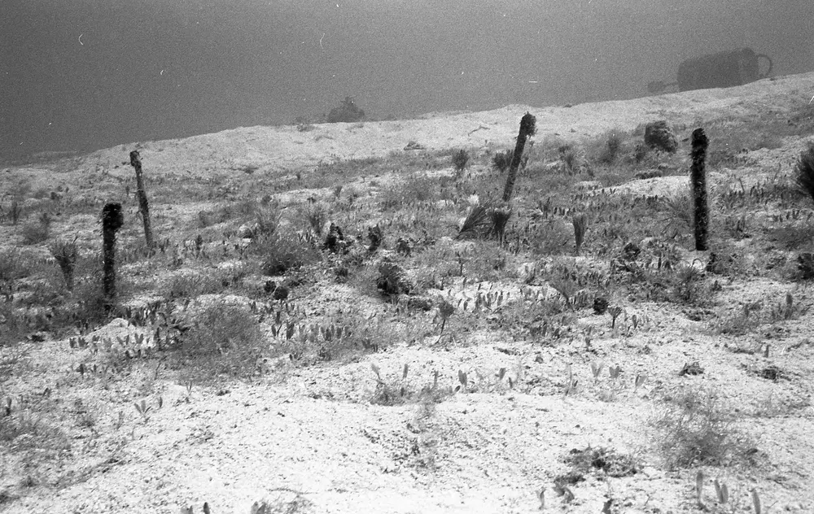{.lightbox group="discovery-bay-1966" description="**UUID: **943146dd-af99-42a0-a339-4907cac8d2ff **Date: **1966-11-10 **Location: **Jamaica | Discovery Bay | Algal Plots **Longitude: **77.414ºW **Latitude: **18.473ºN **Photographer: **Eileen Graham **Copyright: **Trustees of the Natural History Museum (London, UK), CC-BY-4.0" alt="**UUID: **943146dd-af99-42a0-a339-4907cac8d2ff **Date: **1966-11-10 **Location: **Jamaica | Discovery Bay | Algal Plots **Longitude: **77.414ºW **Latitude: **18.473ºN **Photographer: **Eileen Graham **Copyright: **Trustees of the Natural History Museum (London, UK), CC-BY-4.0"}

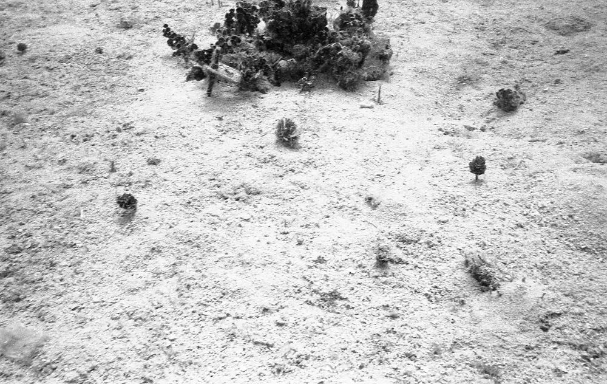{.lightbox group="discovery-bay-1966" description="**UUID: **39eafb2e-5786-44bb-81d4-d4cdcf1683a0 **Date: **1966-11-10 **Location: **Jamaica | Discovery Bay | Algal Plots **Longitude: **77.414ºW **Latitude: **18.473ºN **Photographer: **Eileen Graham **Copyright: **Trustees of the Natural History Museum (London, UK), CC-BY-4.0" alt="**UUID: **39eafb2e-5786-44bb-81d4-d4cdcf1683a0 **Date: **1966-11-10 **Location: **Jamaica | Discovery Bay | Algal Plots **Longitude: **77.414ºW **Latitude: **18.473ºN **Photographer: **Eileen Graham **Copyright: **Trustees of the Natural History Museum (London, UK), CC-BY-4.0"}

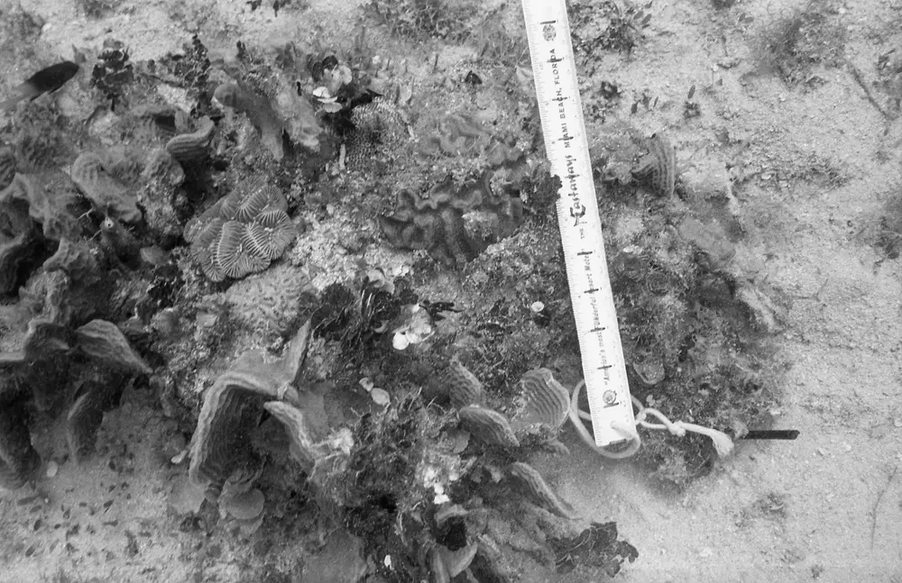{.lightbox group="discovery-bay-1966" description="**UUID: **b396a55c-6291-4b59-8872-7420d9229be4 **Date: **1966-11-10 **Location: **Jamaica | Discovery Bay | Algal Plots **Longitude: **77.414ºW **Latitude: **18.473ºN **Photographer: **Eileen Graham **Copyright: **Trustees of the Natural History Museum (London, UK), CC-BY-4.0" alt="**UUID: **b396a55c-6291-4b59-8872-7420d9229be4 **Date: **1966-11-10 **Location: **Jamaica | Discovery Bay | Algal Plots **Longitude: **77.414ºW **Latitude: **18.473ºN **Photographer: **Eileen Graham **Copyright: **Trustees of the Natural History Museum (London, UK), CC-BY-4.0"}

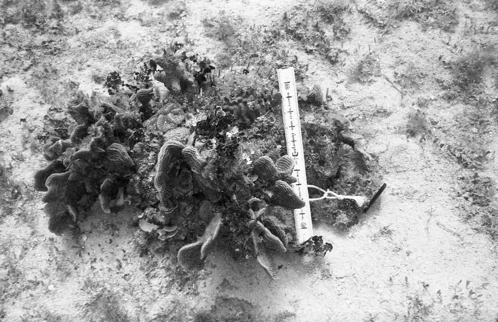{.lightbox group="discovery-bay-1966" description="**UUID: **eb6dd30b-214f-4869-b4e7-2487e6e63d4c **Date: **1966-11-10 **Location: **Jamaica | Discovery Bay | Algal Plots **Longitude: **77.414ºW **Latitude: **18.473ºN **Photographer: **Eileen Graham **Copyright: **Trustees of the Natural History Museum (London, UK), CC-BY-4.0" alt="**UUID: **eb6dd30b-214f-4869-b4e7-2487e6e63d4c **Date: **1966-11-10 **Location: **Jamaica | Discovery Bay | Algal Plots **Longitude: **77.414ºW **Latitude: **18.473ºN **Photographer: **Eileen Graham **Copyright: **Trustees of the Natural History Museum (London, UK), CC-BY-4.0"}

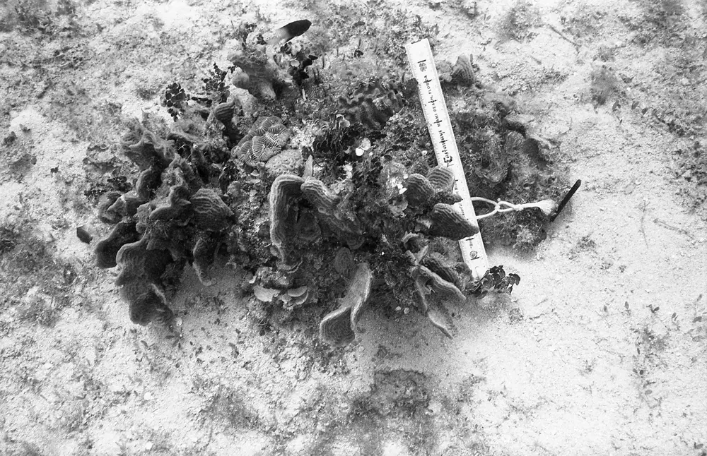{.lightbox group="discovery-bay-1966" description="**UUID: **0a2f177b-af53-4409-bd3a-2aa424a467e3 **Date: **1966-11-10 **Location: **Jamaica | Discovery Bay | Algal Plots **Longitude: **77.414ºW **Latitude: **18.473ºN **Photographer: **Eileen Graham **Copyright: **Trustees of the Natural History Museum (London, UK), CC-BY-4.0" alt="**UUID: **0a2f177b-af53-4409-bd3a-2aa424a467e3 **Date: **1966-11-10 **Location: **Jamaica | Discovery Bay | Algal Plots **Longitude: **77.414ºW **Latitude: **18.473ºN **Photographer: **Eileen Graham **Copyright: **Trustees of the Natural History Museum (London, UK), CC-BY-4.0"}

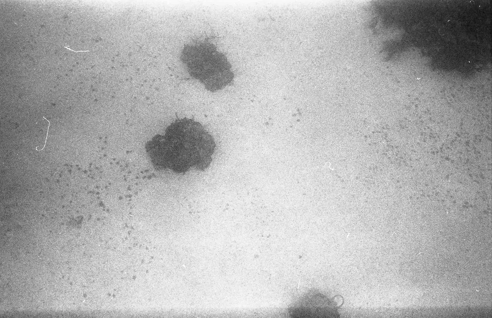{.lightbox group="discovery-bay-1966" description="**UUID: **cb9facfb-bfc5-4d70-8417-80550e6f1e03 **Date: **1966-11-10 **Location: **Jamaica | Discovery Bay | Buoy Mooring (1960s) **Longitude: **77.40908ºW **Latitude: **18.47322ºN **Photographer: **Eileen Graham **Copyright: **Trustees of the Natural History Museum (London, UK), CC-BY-4.0" alt="**UUID: **cb9facfb-bfc5-4d70-8417-80550e6f1e03 **Date: **1966-11-10 **Location: **Jamaica | Discovery Bay | Buoy Mooring (1960s) **Longitude: **77.40908ºW **Latitude: **18.47322ºN **Photographer: **Eileen Graham **Copyright: **Trustees of the Natural History Museum (London, UK), CC-BY-4.0"}

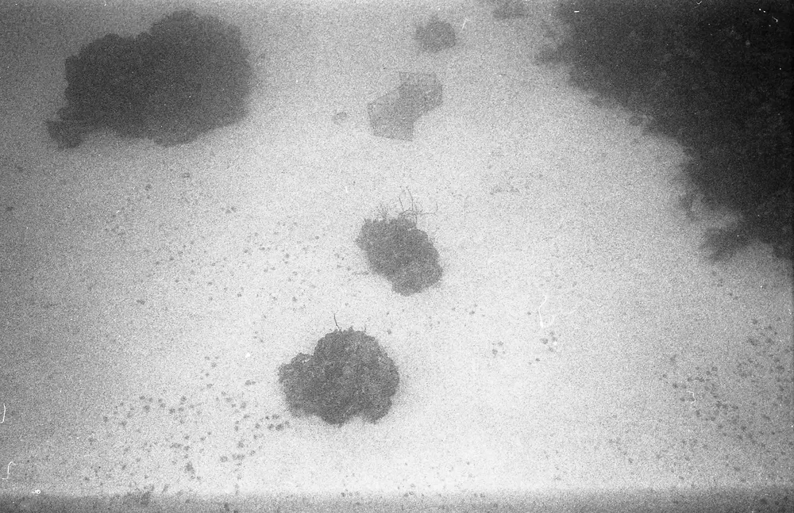{.lightbox group="discovery-bay-1966" description="**UUID: **7a8d3e28-2e1a-4100-bd9c-56d03122da99 **Date: **1966-11-10 **Location: **Jamaica | Discovery Bay | Buoy Mooring (1960s) **Longitude: **77.40908ºW **Latitude: **18.47322ºN **Photographer: **Eileen Graham **Copyright: **Trustees of the Natural History Museum (London, UK), CC-BY-4.0" alt="**UUID: **7a8d3e28-2e1a-4100-bd9c-56d03122da99 **Date: **1966-11-10 **Location: **Jamaica | Discovery Bay | Buoy Mooring (1960s) **Longitude: **77.40908ºW **Latitude: **18.47322ºN **Photographer: **Eileen Graham **Copyright: **Trustees of the Natural History Museum (London, UK), CC-BY-4.0"}

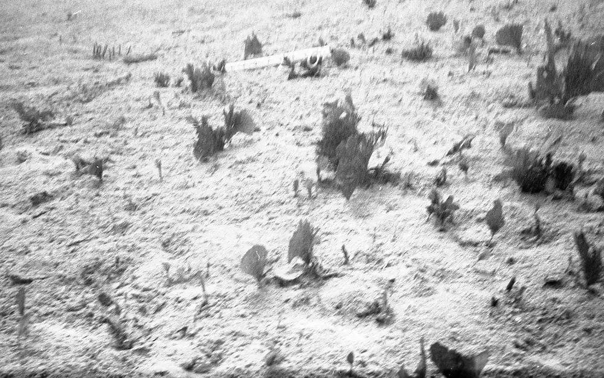{.lightbox group="discovery-bay-1966" description="**UUID: **b189e8ae-eaca-4de4-978c-ab8179ff09de **Date: **1966-12-10 **Location: **Jamaica | Discovery Bay | Algal Plots **Longitude: **77.414ºW **Latitude: **18.473ºN **Photographer: **Eileen Graham **Copyright: **Trustees of the Natural History Museum (London, UK), CC-BY-4.0" alt="**UUID: **b189e8ae-eaca-4de4-978c-ab8179ff09de **Date: **1966-12-10 **Location: **Jamaica | Discovery Bay | Algal Plots **Longitude: **77.414ºW **Latitude: **18.473ºN **Photographer: **Eileen Graham **Copyright: **Trustees of the Natural History Museum (London, UK), CC-BY-4.0"}

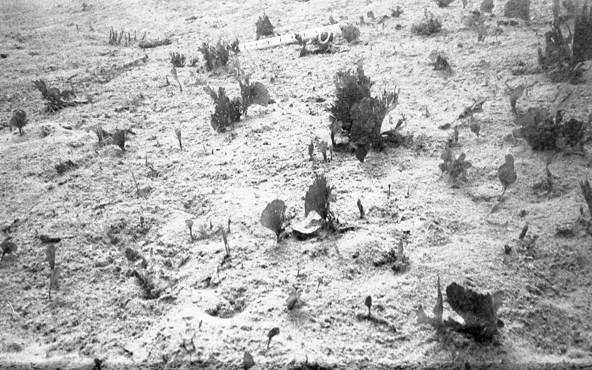{.lightbox group="discovery-bay-1966" description="**UUID: **97938057-6227-4b49-a5f5-3ee2bde943ad **Date: **1966-12-10 **Location: **Jamaica | Discovery Bay | Algal Plots **Longitude: **77.414ºW **Latitude: **18.473ºN **Photographer: **Eileen Graham **Copyright: **Trustees of the Natural History Museum (London, UK), CC-BY-4.0" alt="**UUID: **97938057-6227-4b49-a5f5-3ee2bde943ad **Date: **1966-12-10 **Location: **Jamaica | Discovery Bay | Algal Plots **Longitude: **77.414ºW **Latitude: **18.473ºN **Photographer: **Eileen Graham **Copyright: **Trustees of the Natural History Museum (London, UK), CC-BY-4.0"}

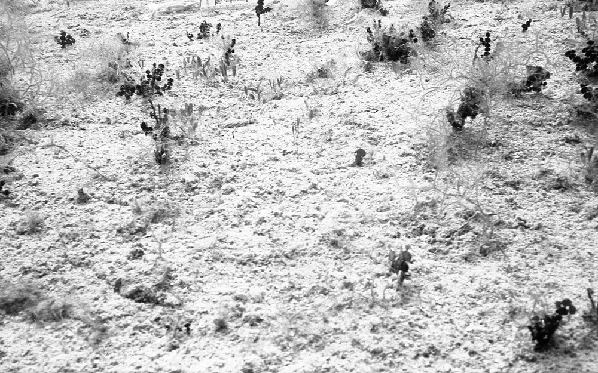{.lightbox group="discovery-bay-1966" description="**UUID: **1ecbec69-886d-48a8-9f63-d0fdcbea3b95 **Date: **1966-12-10 **Location: **Jamaica | Discovery Bay | Algal Plots **Longitude: **77.414ºW **Latitude: **18.473ºN **Photographer: **Eileen Graham **Copyright: **Trustees of the Natural History Museum (London, UK), CC-BY-4.0" alt="**UUID: **1ecbec69-886d-48a8-9f63-d0fdcbea3b95 **Date: **1966-12-10 **Location: **Jamaica | Discovery Bay | Algal Plots **Longitude: **77.414ºW **Latitude: **18.473ºN **Photographer: **Eileen Graham **Copyright: **Trustees of the Natural History Museum (London, UK), CC-BY-4.0"}

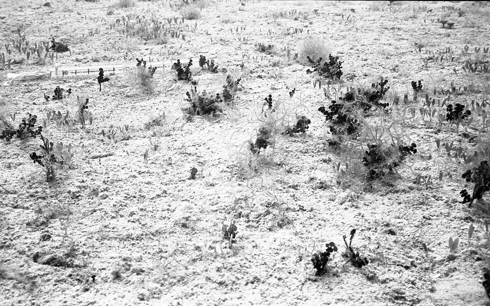{.lightbox group="discovery-bay-1966" description="**UUID: **db8dd605-d67e-4db4-bda9-1bce66823fc0 **Date: **1966-12-10 **Location: **Jamaica | Discovery Bay | Algal Plots **Longitude: **77.414ºW **Latitude: **18.473ºN **Photographer: **Eileen Graham **Copyright: **Trustees of the Natural History Museum (London, UK), CC-BY-4.0" alt="**UUID: **db8dd605-d67e-4db4-bda9-1bce66823fc0 **Date: **1966-12-10 **Location: **Jamaica | Discovery Bay | Algal Plots **Longitude: **77.414ºW **Latitude: **18.473ºN **Photographer: **Eileen Graham **Copyright: **Trustees of the Natural History Museum (London, UK), CC-BY-4.0"}

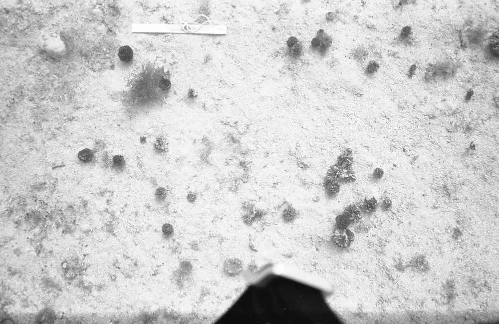{.lightbox group="discovery-bay-1966" description="**UUID: **cf4047af-6993-4978-afba-407a5a1cece7 **Date: **1966-12-10 **Location: **Jamaica | Discovery Bay | Algal Plots **Longitude: **77.414ºW **Latitude: **18.473ºN **Photographer: **Eileen Graham **Copyright: **Trustees of the Natural History Museum (London, UK), CC-BY-4.0" alt="**UUID: **cf4047af-6993-4978-afba-407a5a1cece7 **Date: **1966-12-10 **Location: **Jamaica | Discovery Bay | Algal Plots **Longitude: **77.414ºW **Latitude: **18.473ºN **Photographer: **Eileen Graham **Copyright: **Trustees of the Natural History Museum (London, UK), CC-BY-4.0"}

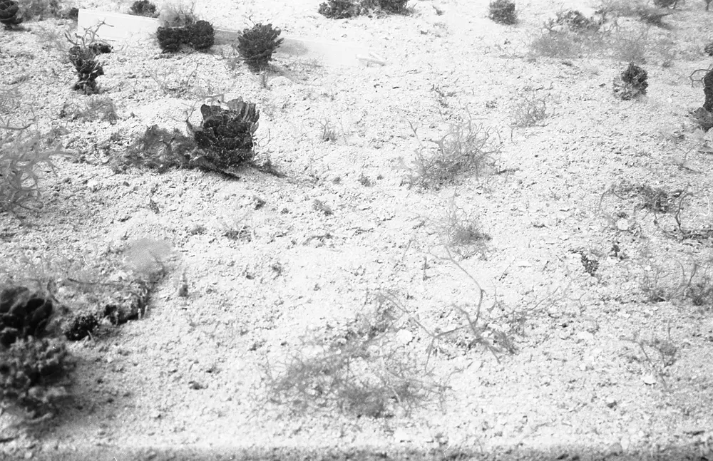{.lightbox group="discovery-bay-1966" description="**UUID: **b0a693a2-57eb-498b-981f-13cf6352ea75 **Date: **1966-12-10 **Location: **Jamaica | Discovery Bay | Algal Plots **Longitude: **77.414ºW **Latitude: **18.473ºN **Photographer: **Eileen Graham **Copyright: **Trustees of the Natural History Museum (London, UK), CC-BY-4.0" alt="**UUID: **b0a693a2-57eb-498b-981f-13cf6352ea75 **Date: **1966-12-10 **Location: **Jamaica | Discovery Bay | Algal Plots **Longitude: **77.414ºW **Latitude: **18.473ºN **Photographer: **Eileen Graham **Copyright: **Trustees of the Natural History Museum (London, UK), CC-BY-4.0"}

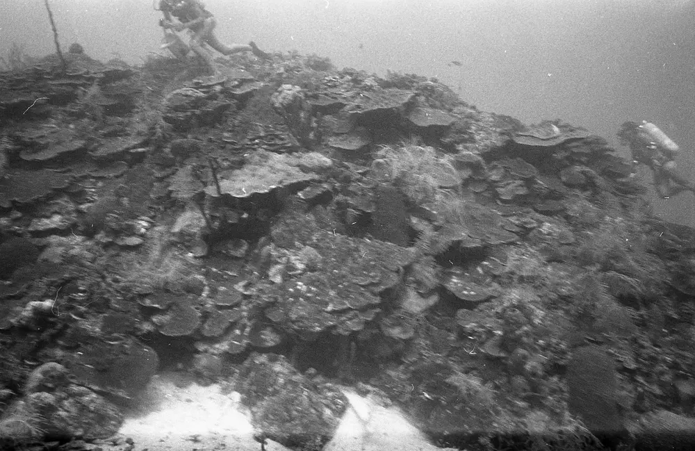{.lightbox group="discovery-bay-1966" description="**UUID: **2fef0474-9970-4e0e-9f85-13f42ffe8b61 **Date: **1966-12-10 **Location: **Jamaica | Discovery Bay | Pinnacle 1 Slope **Longitude: **77.41017ºW **Latitude: **18.47367ºN **Photographer: **Eileen Graham **Copyright: **Trustees of the Natural History Museum (London, UK), CC-BY-4.0" alt="**UUID: **2fef0474-9970-4e0e-9f85-13f42ffe8b61 **Date: **1966-12-10 **Location: **Jamaica | Discovery Bay | Pinnacle 1 Slope **Longitude: **77.41017ºW **Latitude: **18.47367ºN **Photographer: **Eileen Graham **Copyright: **Trustees of the Natural History Museum (London, UK), CC-BY-4.0"}

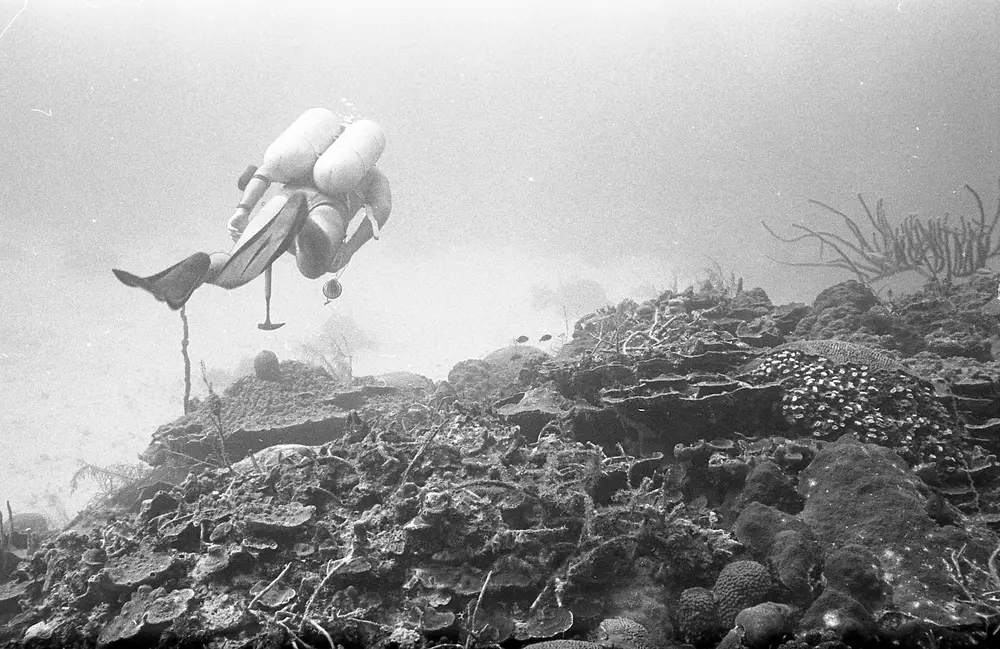{.lightbox group="discovery-bay-1966" description="**UUID: **33e268d8-e7d0-4a28-8fd2-0d67b7180a4f **Date: **1966-12-10 **Location: **Jamaica | Discovery Bay | Pinnacle 1 Slope **Longitude: **77.41017ºW **Latitude: **18.47367ºN **Photographer: **Eileen Graham **Copyright: **Trustees of the Natural History Museum (London, UK), CC-BY-4.0" alt="**UUID: **33e268d8-e7d0-4a28-8fd2-0d67b7180a4f **Date: **1966-12-10 **Location: **Jamaica | Discovery Bay | Pinnacle 1 Slope **Longitude: **77.41017ºW **Latitude: **18.47367ºN **Photographer: **Eileen Graham **Copyright: **Trustees of the Natural History Museum (London, UK), CC-BY-4.0"}

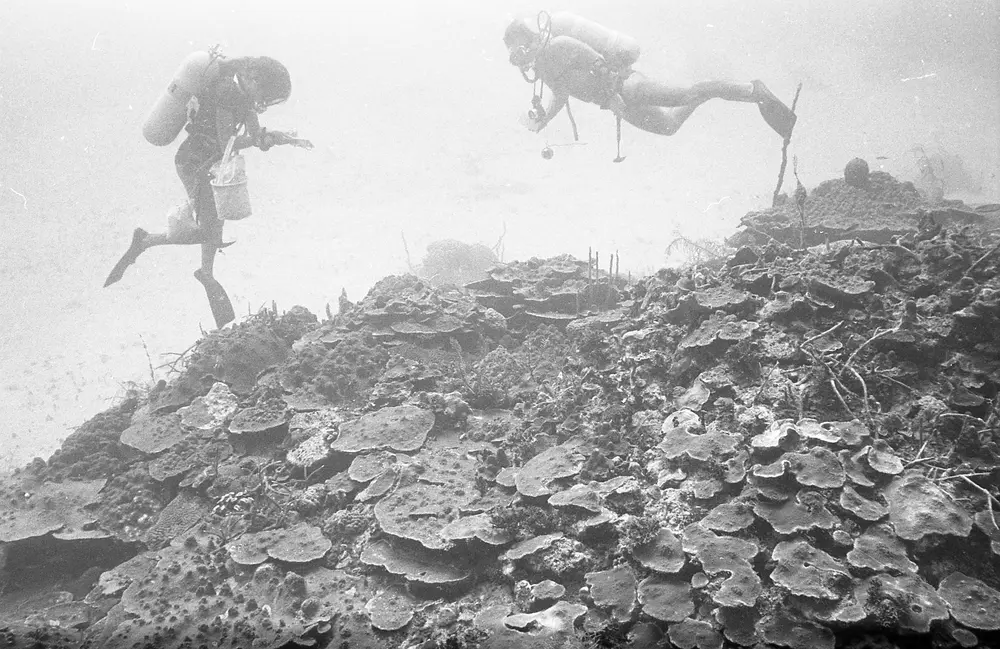{.lightbox group="discovery-bay-1966" description="**UUID: **1fde2e41-7766-42e7-8bcf-58e19712c724 **Date: **1966-12-10 **Location: **Jamaica | Discovery Bay | Pinnacle 1 Slope **Longitude: **77.41017ºW **Latitude: **18.47367ºN **Photographer: **Eileen Graham **Copyright: **Trustees of the Natural History Museum (London, UK), CC-BY-4.0" alt="**UUID: **1fde2e41-7766-42e7-8bcf-58e19712c724 **Date: **1966-12-10 **Location: **Jamaica | Discovery Bay | Pinnacle 1 Slope **Longitude: **77.41017ºW **Latitude: **18.47367ºN **Photographer: **Eileen Graham **Copyright: **Trustees of the Natural History Museum (London, UK), CC-BY-4.0"}

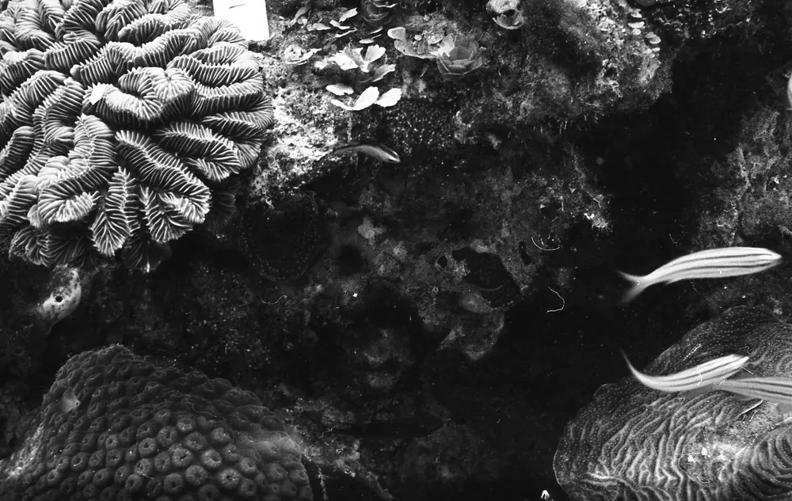{.lightbox group="discovery-bay-1966" description="**UUID: **f5700828-814a-48df-ac13-7cfd920fd79b **Date: **1966-12-10 **Location: **Jamaica | Discovery Bay | Pinnacle 1 Slope **Longitude: **77.41017ºW **Latitude: **18.47367ºN **Photographer: **Eileen Graham **Copyright: **Trustees of the Natural History Museum (London, UK), CC-BY-4.0" alt="**UUID: **f5700828-814a-48df-ac13-7cfd920fd79b **Date: **1966-12-10 **Location: **Jamaica | Discovery Bay | Pinnacle 1 Slope **Longitude: **77.41017ºW **Latitude: **18.47367ºN **Photographer: **Eileen Graham **Copyright: **Trustees of the Natural History Museum (London, UK), CC-BY-4.0"}

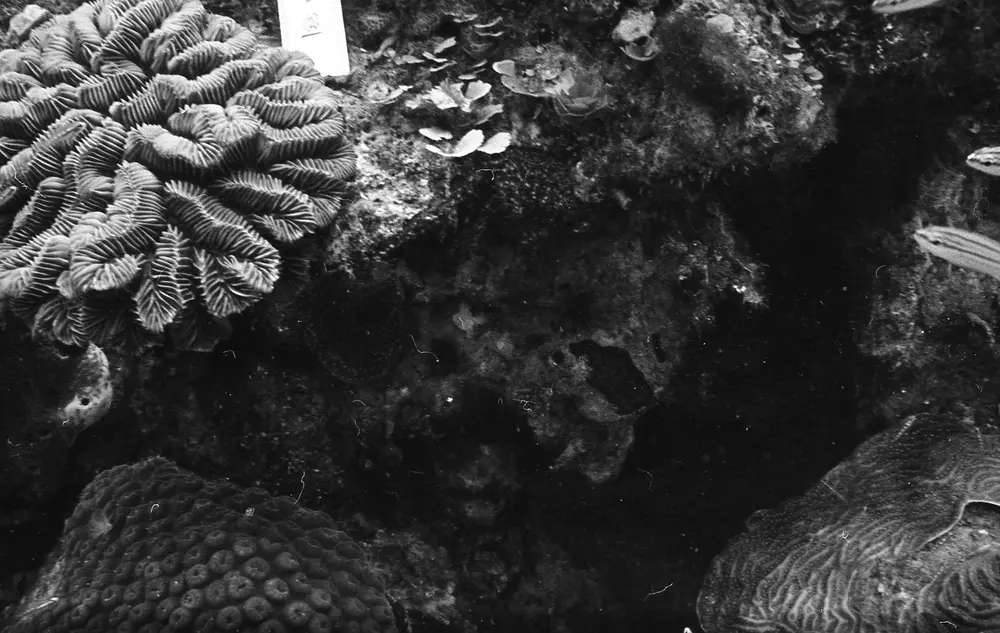{.lightbox group="discovery-bay-1966" description="**UUID: **fb1c9cef-5153-42c8-8be5-1b32d0e0bf91 **Date: **1966-12-10 **Location: **Jamaica | Discovery Bay | Pinnacle 1 Slope **Longitude: **77.41017ºW **Latitude: **18.47367ºN **Photographer: **Eileen Graham **Copyright: **Trustees of the Natural History Museum (London, UK), CC-BY-4.0" alt="**UUID: **fb1c9cef-5153-42c8-8be5-1b32d0e0bf91 **Date: **1966-12-10 **Location: **Jamaica | Discovery Bay | Pinnacle 1 Slope **Longitude: **77.41017ºW **Latitude: **18.47367ºN **Photographer: **Eileen Graham **Copyright: **Trustees of the Natural History Museum (London, UK), CC-BY-4.0"}

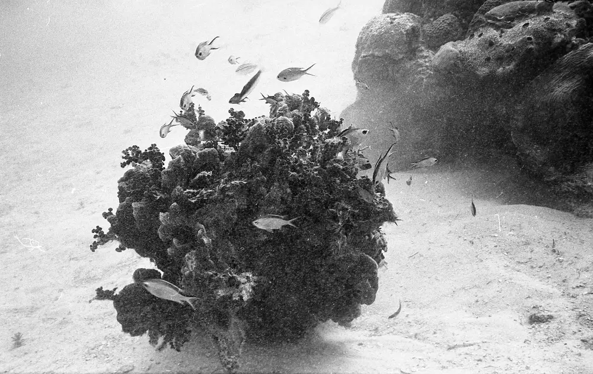{.lightbox group="discovery-bay-1966" description="**UUID: **df4f134c-4a85-4630-a2f1-6dcf3e27e47f **Date: **1966-12-10 **Location: **Jamaica | Discovery Bay | Pinnacle 1 Slope **Longitude: **77.41017ºW **Latitude: **18.47367ºN **Photographer: **Eileen Graham **Copyright: **Trustees of the Natural History Museum (London, UK), CC-BY-4.0" alt="**UUID: **df4f134c-4a85-4630-a2f1-6dcf3e27e47f **Date: **1966-12-10 **Location: **Jamaica | Discovery Bay | Pinnacle 1 Slope **Longitude: **77.41017ºW **Latitude: **18.47367ºN **Photographer: **Eileen Graham **Copyright: **Trustees of the Natural History Museum (London, UK), CC-BY-4.0"}

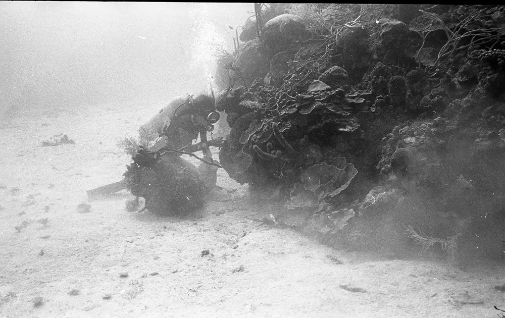{.lightbox group="discovery-bay-1966" description="**UUID: **67a56273-f7b4-42ea-b020-9545278cc9af **Date: **1966-12-10 **Location: **Jamaica | Discovery Bay | Pinnacle 1 Slope **Longitude: **77.41017ºW **Latitude: **18.47367ºN **Photographer: **Eileen Graham **Copyright: **Trustees of the Natural History Museum (London, UK), CC-BY-4.0" alt="**UUID: **67a56273-f7b4-42ea-b020-9545278cc9af **Date: **1966-12-10 **Location: **Jamaica | Discovery Bay | Pinnacle 1 Slope **Longitude: **77.41017ºW **Latitude: **18.47367ºN **Photographer: **Eileen Graham **Copyright: **Trustees of the Natural History Museum (London, UK), CC-BY-4.0"}

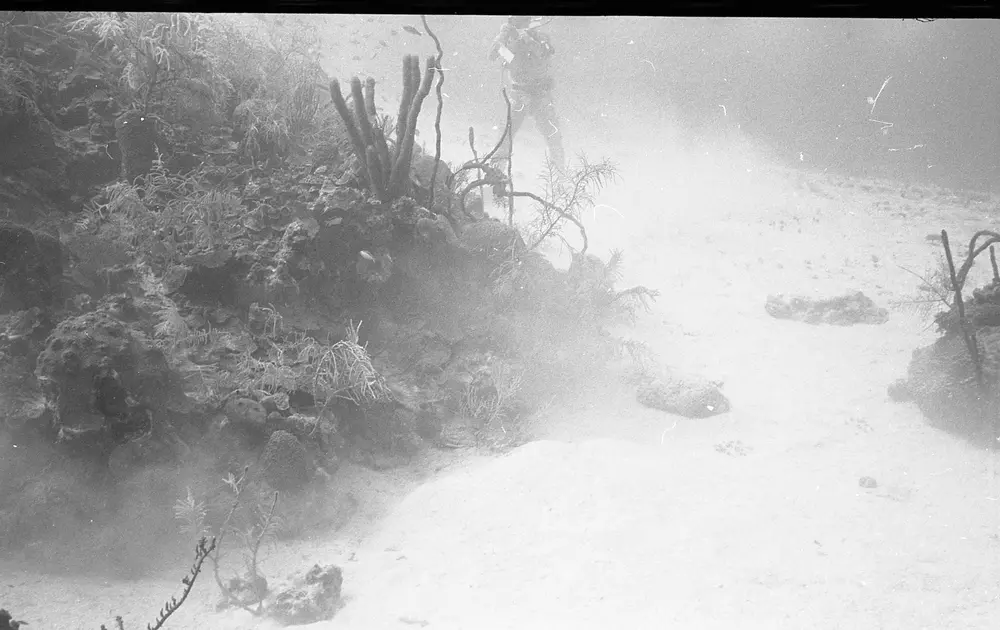{.lightbox group="discovery-bay-1966" description="**UUID: **d0d6adc0-0474-4bcf-9413-629a4e829c40 **Date: **1966-12-10 **Location: **Jamaica | Discovery Bay | Pinnacle 1 Slope **Longitude: **77.41017ºW **Latitude: **18.47367ºN **Photographer: **Eileen Graham **Copyright: **Trustees of the Natural History Museum (London, UK), CC-BY-4.0" alt="**UUID: **d0d6adc0-0474-4bcf-9413-629a4e829c40 **Date: **1966-12-10 **Location: **Jamaica | Discovery Bay | Pinnacle 1 Slope **Longitude: **77.41017ºW **Latitude: **18.47367ºN **Photographer: **Eileen Graham **Copyright: **Trustees of the Natural History Museum (London, UK), CC-BY-4.0"}

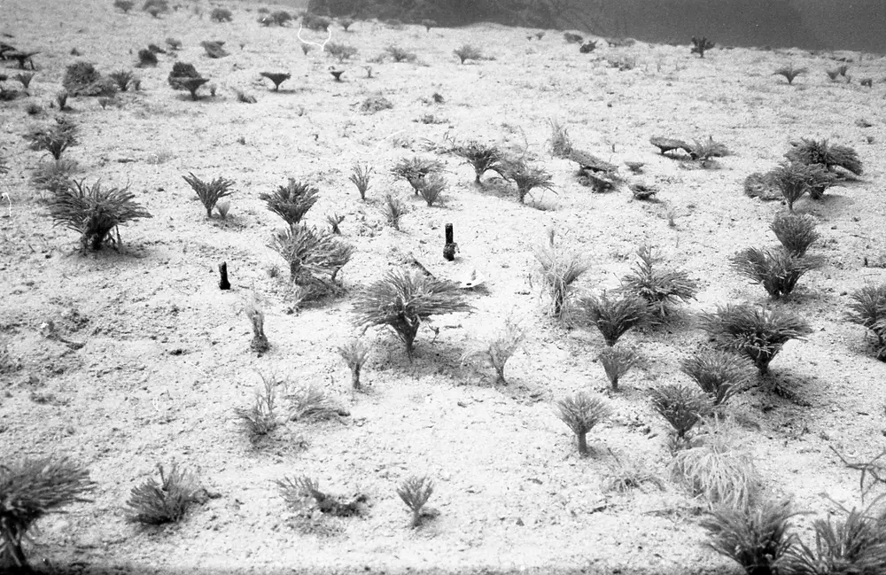{.lightbox group="discovery-bay-1966" description="**UUID: **9e3cf336-5ad0-4fba-a105-7af45c7d41a2 **Date: **1966-10-24 **Location: **Jamaica | Discovery Bay | Algal Plots **Longitude: **77.414ºW **Latitude: **18.473ºN **Photographer: **Eileen Graham **Copyright: **Trustees of the Natural History Museum (London, UK), CC-BY-4.0" alt="**UUID: **9e3cf336-5ad0-4fba-a105-7af45c7d41a2 **Date: **1966-10-24 **Location: **Jamaica | Discovery Bay | Algal Plots **Longitude: **77.414ºW **Latitude: **18.473ºN **Photographer: **Eileen Graham **Copyright: **Trustees of the Natural History Museum (London, UK), CC-BY-4.0"}

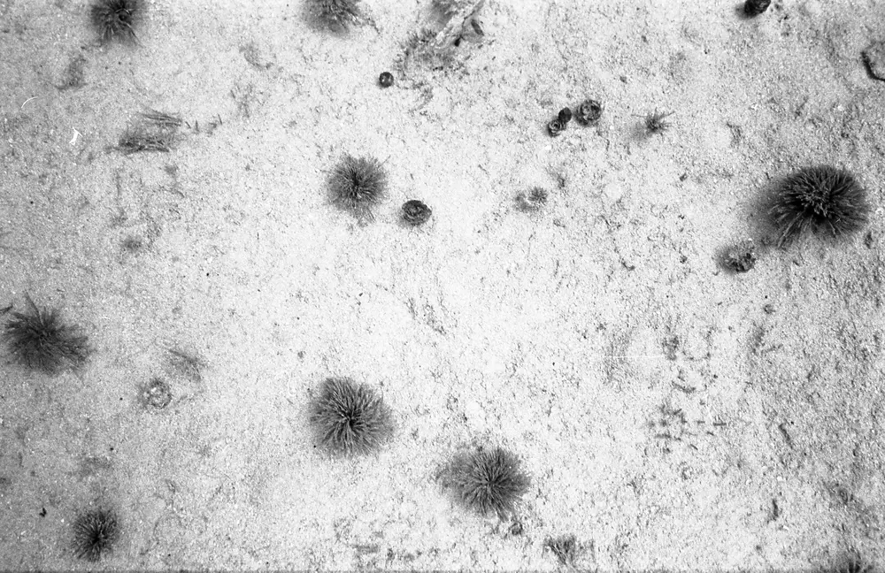{.lightbox group="discovery-bay-1966" description="**UUID: **9c3eda26-6495-4ac9-a461-a2991e2b92bf **Date: **1966-10-24 **Location: **Jamaica | Discovery Bay | Algal Plots **Longitude: **77.414ºW **Latitude: **18.473ºN **Photographer: **Eileen Graham **Copyright: **Trustees of the Natural History Museum (London, UK), CC-BY-4.0" alt="**UUID: **9c3eda26-6495-4ac9-a461-a2991e2b92bf **Date: **1966-10-24 **Location: **Jamaica | Discovery Bay | Algal Plots **Longitude: **77.414ºW **Latitude: **18.473ºN **Photographer: **Eileen Graham **Copyright: **Trustees of the Natural History Museum (London, UK), CC-BY-4.0"}

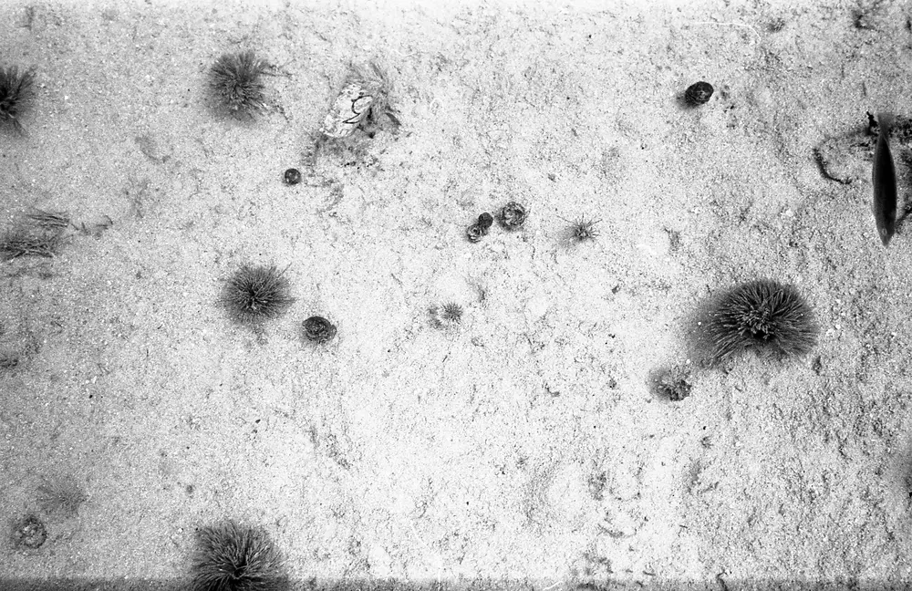{.lightbox group="discovery-bay-1966" description="**UUID: **ec16baa8-3505-40aa-97f5-cac9001fe770 **Date: **1966-10-24 **Location: **Jamaica | Discovery Bay | Algal Plots **Longitude: **77.414ºW **Latitude: **18.473ºN **Photographer: **Eileen Graham **Copyright: **Trustees of the Natural History Museum (London, UK), CC-BY-4.0" alt="**UUID: **ec16baa8-3505-40aa-97f5-cac9001fe770 **Date: **1966-10-24 **Location: **Jamaica | Discovery Bay | Algal Plots **Longitude: **77.414ºW **Latitude: **18.473ºN **Photographer: **Eileen Graham **Copyright: **Trustees of the Natural History Museum (London, UK), CC-BY-4.0"}

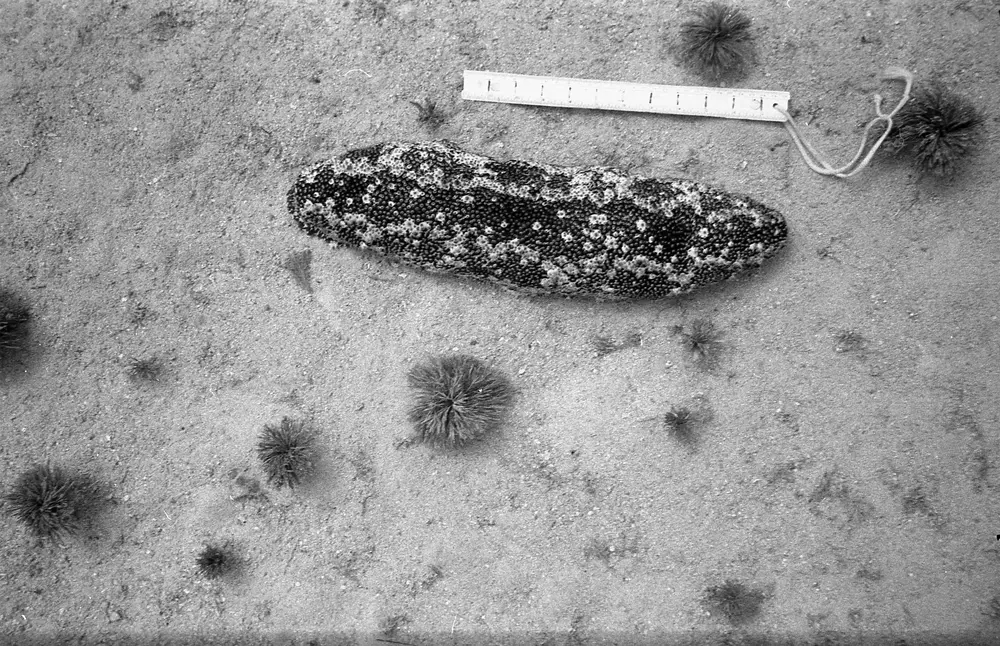{.lightbox group="discovery-bay-1966" description="**UUID: **03859285-7f5f-4dbd-b56f-cfef9e91ea32 **Date: **1966-10-24 **Location: **Jamaica | Discovery Bay | Algal Plots **Longitude: **77.414ºW **Latitude: **18.473ºN **Photographer: **Eileen Graham **Copyright: **Trustees of the Natural History Museum (London, UK), CC-BY-4.0" alt="**UUID: **03859285-7f5f-4dbd-b56f-cfef9e91ea32 **Date: **1966-10-24 **Location: **Jamaica | Discovery Bay | Algal Plots **Longitude: **77.414ºW **Latitude: **18.473ºN **Photographer: **Eileen Graham **Copyright: **Trustees of the Natural History Museum (London, UK), CC-BY-4.0"}

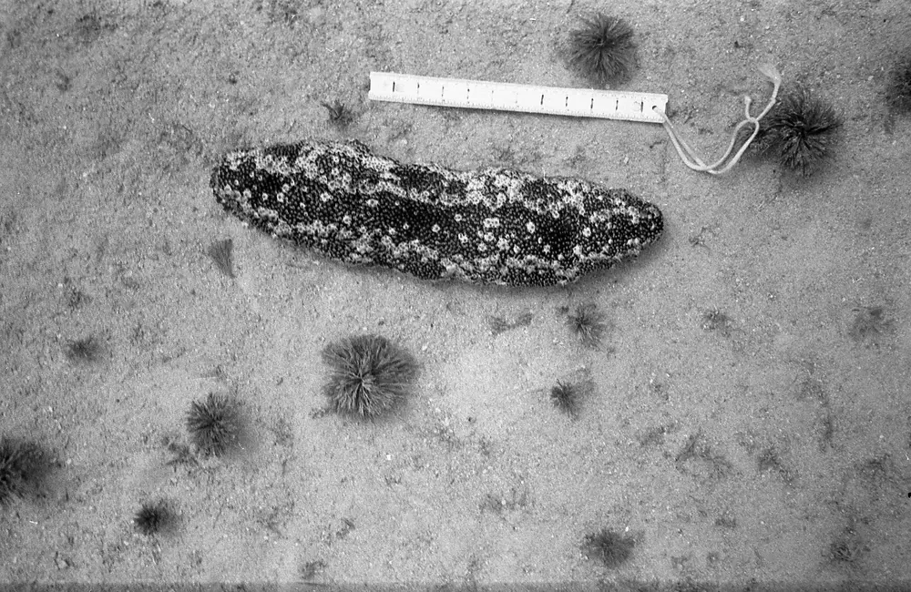{.lightbox group="discovery-bay-1966" description="**UUID: **e72bdbbd-28d1-4fca-a35d-0ab0b50bbf55 **Date: **1966-10-24 **Location: **Jamaica | Discovery Bay | Algal Plots **Longitude: **77.414ºW **Latitude: **18.473ºN **Photographer: **Eileen Graham **Copyright: **Trustees of the Natural History Museum (London, UK), CC-BY-4.0" alt="**UUID: **e72bdbbd-28d1-4fca-a35d-0ab0b50bbf55 **Date: **1966-10-24 **Location: **Jamaica | Discovery Bay | Algal Plots **Longitude: **77.414ºW **Latitude: **18.473ºN **Photographer: **Eileen Graham **Copyright: **Trustees of the Natural History Museum (London, UK), CC-BY-4.0"}

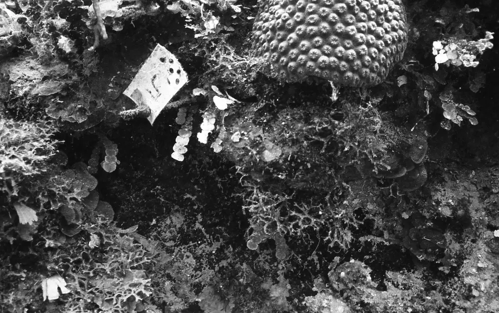{.lightbox group="discovery-bay-1966" description="**UUID: **bd6586b1-18c4-4ef4-aab7-0c7bb444ee2b **Date: **1966-10-24 **Location: **Jamaica | Discovery Bay | Upper Buoy Escarpment **Longitude: **77.409ºW **Latitude: **18.4726ºN **Photographer: **Eileen Graham **Copyright: **Trustees of the Natural History Museum (London, UK), CC-BY-4.0" alt="**UUID: **bd6586b1-18c4-4ef4-aab7-0c7bb444ee2b **Date: **1966-10-24 **Location: **Jamaica | Discovery Bay | Upper Buoy Escarpment **Longitude: **77.409ºW **Latitude: **18.4726ºN **Photographer: **Eileen Graham **Copyright: **Trustees of the Natural History Museum (London, UK), CC-BY-4.0"}

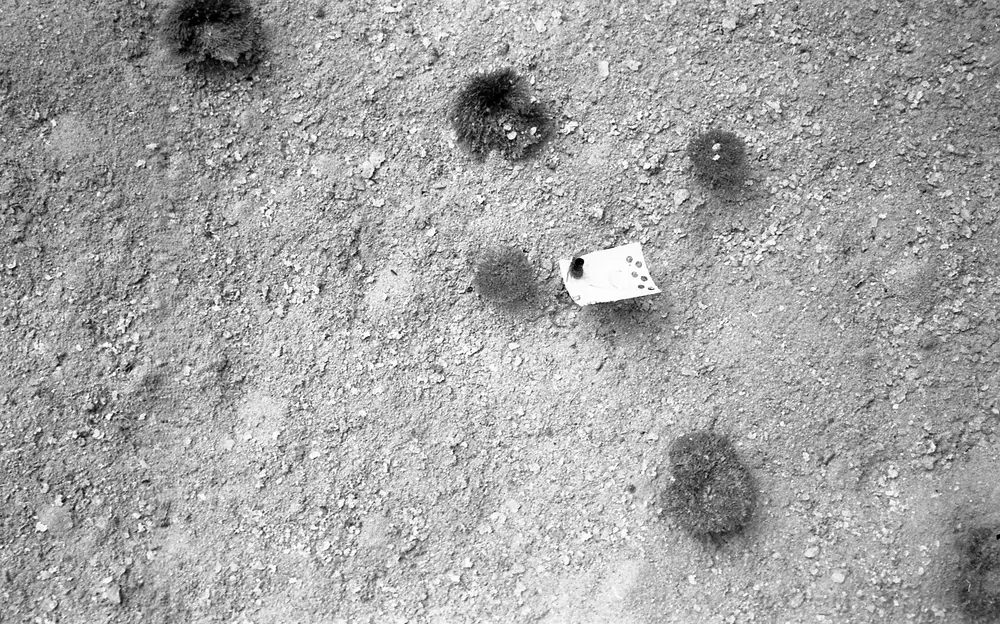{.lightbox group="discovery-bay-1966" description="**UUID: **6b81cb8c-6e40-461e-8110-605f2f630fb2 **Date: **1966-10-24 **Location: **Jamaica | Discovery Bay | Algal Plots **Longitude: **77.414ºW **Latitude: **18.473ºN **Photographer: **Eileen Graham **Copyright: **Trustees of the Natural History Museum (London, UK), CC-BY-4.0" alt="**UUID: **6b81cb8c-6e40-461e-8110-605f2f630fb2 **Date: **1966-10-24 **Location: **Jamaica | Discovery Bay | Algal Plots **Longitude: **77.414ºW **Latitude: **18.473ºN **Photographer: **Eileen Graham **Copyright: **Trustees of the Natural History Museum (London, UK), CC-BY-4.0"}

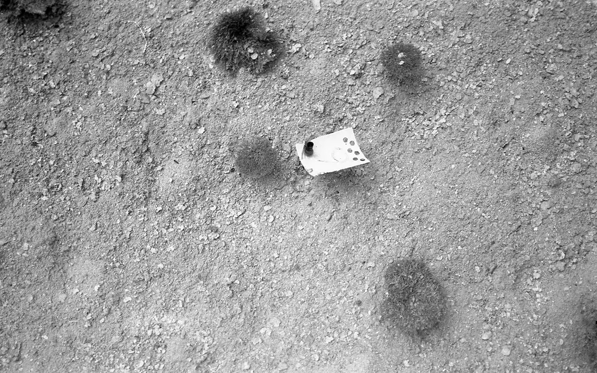{.lightbox group="discovery-bay-1966" description="**UUID: **dcfb1177-30c2-4207-811c-b9db41e39d30 **Date: **1966-10-24 **Location: **Jamaica | Discovery Bay | Algal Plots **Longitude: **77.414ºW **Latitude: **18.473ºN **Photographer: **Eileen Graham **Copyright: **Trustees of the Natural History Museum (London, UK), CC-BY-4.0" alt="**UUID: **dcfb1177-30c2-4207-811c-b9db41e39d30 **Date: **1966-10-24 **Location: **Jamaica | Discovery Bay | Algal Plots **Longitude: **77.414ºW **Latitude: **18.473ºN **Photographer: **Eileen Graham **Copyright: **Trustees of the Natural History Museum (London, UK), CC-BY-4.0"}

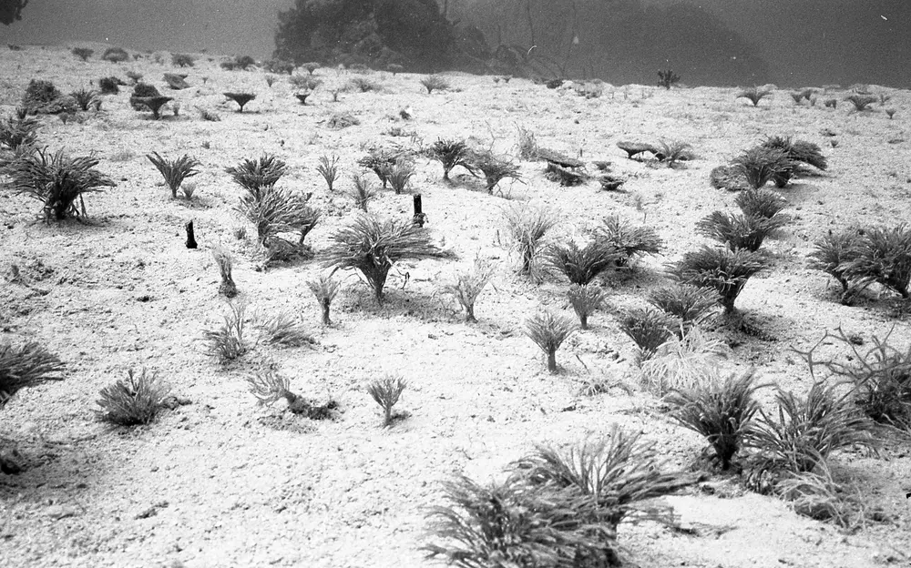{.lightbox group="discovery-bay-1966" description="**UUID: **39c73404-d74d-4abd-9c3f-53103dcd930e **Date: **1966-10-24 **Location: **Jamaica | Discovery Bay | Algal Plots **Longitude: **77.414ºW **Latitude: **18.473ºN **Photographer: **Eileen Graham **Copyright: **Trustees of the Natural History Museum (London, UK), CC-BY-4.0" alt="**UUID: **39c73404-d74d-4abd-9c3f-53103dcd930e **Date: **1966-10-24 **Location: **Jamaica | Discovery Bay | Algal Plots **Longitude: **77.414ºW **Latitude: **18.473ºN **Photographer: **Eileen Graham **Copyright: **Trustees of the Natural History Museum (London, UK), CC-BY-4.0"}

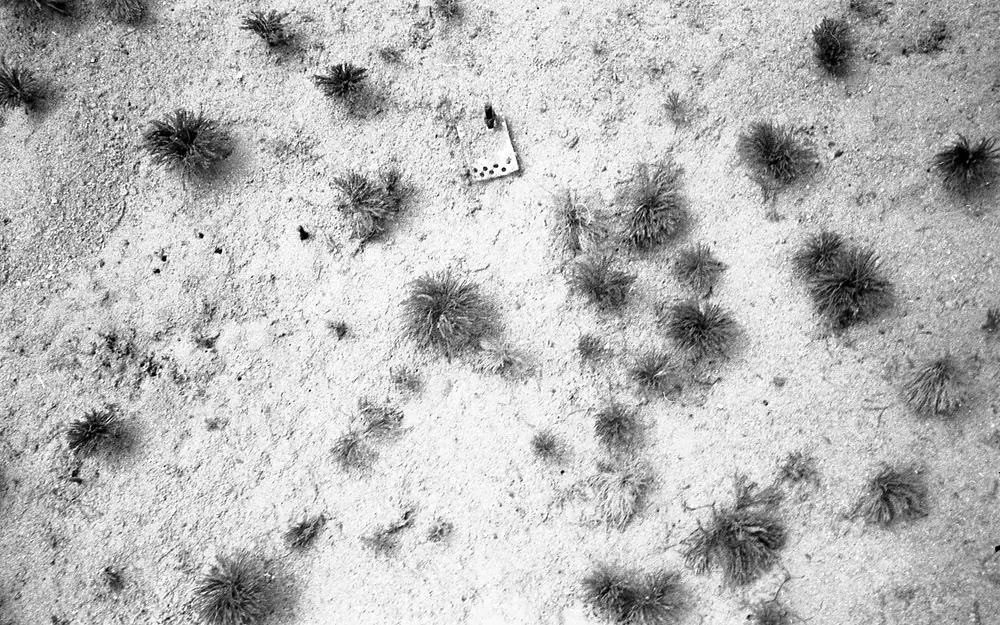{.lightbox group="discovery-bay-1966" description="**UUID: **a2ad3234-0b4d-4555-a2b2-03cabaa3d54b **Date: **1966-10-24 **Location: **Jamaica | Discovery Bay | Algal Plots **Longitude: **77.414ºW **Latitude: **18.473ºN **Photographer: **Eileen Graham **Copyright: **Trustees of the Natural History Museum (London, UK), CC-BY-4.0" alt="**UUID: **a2ad3234-0b4d-4555-a2b2-03cabaa3d54b **Date: **1966-10-24 **Location: **Jamaica | Discovery Bay | Algal Plots **Longitude: **77.414ºW **Latitude: **18.473ºN **Photographer: **Eileen Graham **Copyright: **Trustees of the Natural History Museum (London, UK), CC-BY-4.0"}

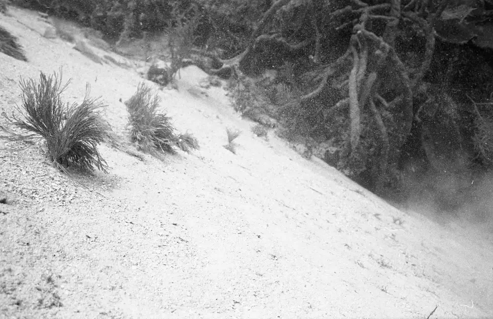{.lightbox group="discovery-bay-1966" description="**UUID: **73ee9fe0-fe24-434c-a725-8c7bcd44aed7 **Date: **1966-10-24 **Location: **Jamaica | Discovery Bay | Algal Plots **Longitude: **77.414ºW **Latitude: **18.473ºN **Photographer: **Eileen Graham **Copyright: **Trustees of the Natural History Museum (London, UK), CC-BY-4.0" alt="**UUID: **73ee9fe0-fe24-434c-a725-8c7bcd44aed7 **Date: **1966-10-24 **Location: **Jamaica | Discovery Bay | Algal Plots **Longitude: **77.414ºW **Latitude: **18.473ºN **Photographer: **Eileen Graham **Copyright: **Trustees of the Natural History Museum (London, UK), CC-BY-4.0"}

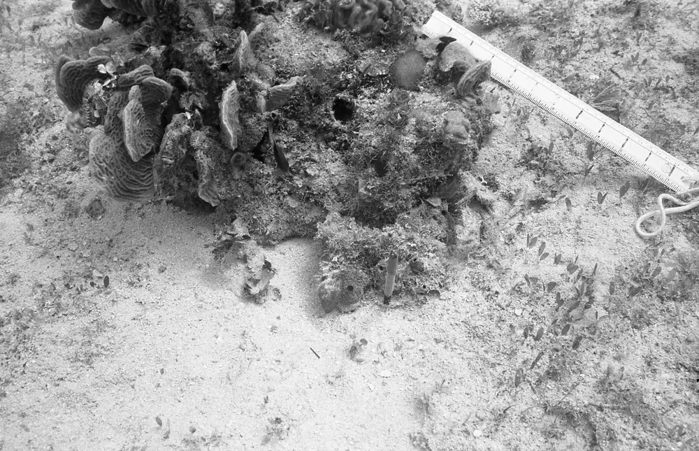{.lightbox group="discovery-bay-1966" description="**UUID: **316e2b86-dd97-442e-a7b6-819fd965c417 **Date: **1966-10-24 **Location: **Jamaica | Discovery Bay | Algal Plots **Longitude: **77.414ºW **Latitude: **18.473ºN **Photographer: **Eileen Graham **Copyright: **Trustees of the Natural History Museum (London, UK), CC-BY-4.0" alt="**UUID: **316e2b86-dd97-442e-a7b6-819fd965c417 **Date: **1966-10-24 **Location: **Jamaica | Discovery Bay | Algal Plots **Longitude: **77.414ºW **Latitude: **18.473ºN **Photographer: **Eileen Graham **Copyright: **Trustees of the Natural History Museum (London, UK), CC-BY-4.0"}

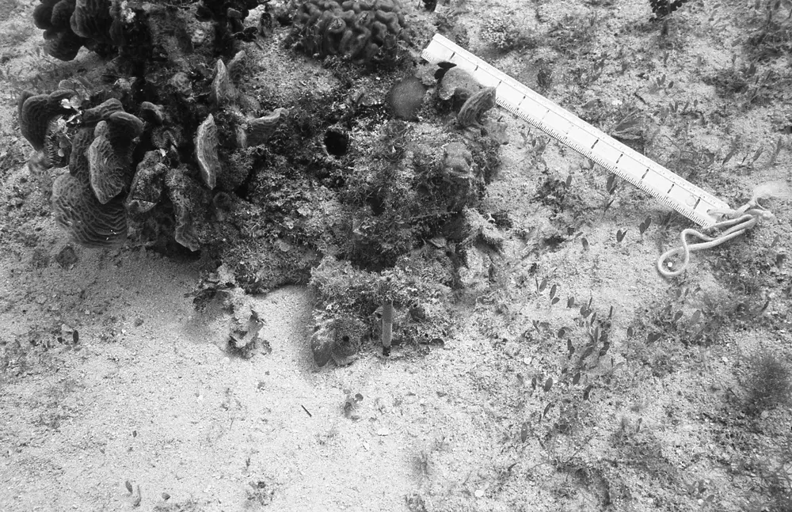{.lightbox group="discovery-bay-1966" description="**UUID: **8dc0c270-ff04-4e70-aea3-8125f787fefb **Date: **1966-10-24 **Location: **Jamaica | Discovery Bay | Algal Plots **Longitude: **77.414ºW **Latitude: **18.473ºN **Photographer: **Eileen Graham **Copyright: **Trustees of the Natural History Museum (London, UK), CC-BY-4.0" alt="**UUID: **8dc0c270-ff04-4e70-aea3-8125f787fefb **Date: **1966-10-24 **Location: **Jamaica | Discovery Bay | Algal Plots **Longitude: **77.414ºW **Latitude: **18.473ºN **Photographer: **Eileen Graham **Copyright: **Trustees of the Natural History Museum (London, UK), CC-BY-4.0"}

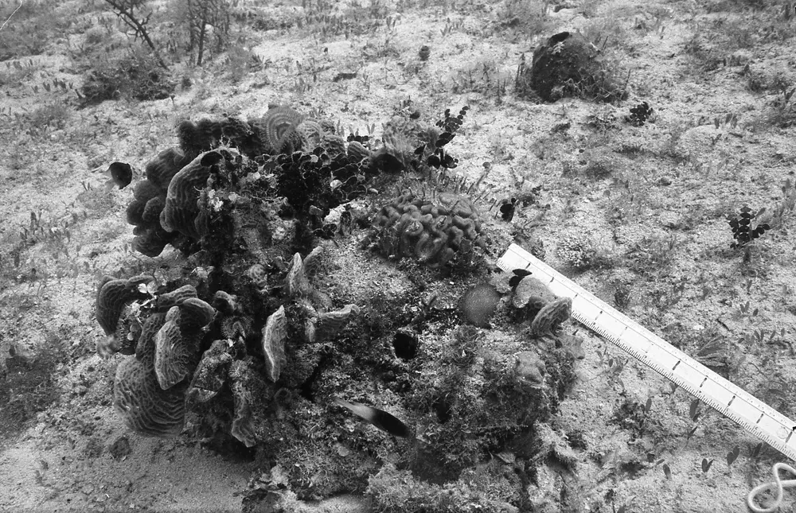{.lightbox group="discovery-bay-1966" description="**UUID: **258a9e45-804f-4b2a-bd32-b54e07bbf4eb **Date: **1966-10-24 **Location: **Jamaica | Discovery Bay | Algal Plots **Longitude: **77.414ºW **Latitude: **18.473ºN **Photographer: **Eileen Graham **Copyright: **Trustees of the Natural History Museum (London, UK), CC-BY-4.0" alt="**UUID: **258a9e45-804f-4b2a-bd32-b54e07bbf4eb **Date: **1966-10-24 **Location: **Jamaica | Discovery Bay | Algal Plots **Longitude: **77.414ºW **Latitude: **18.473ºN **Photographer: **Eileen Graham **Copyright: **Trustees of the Natural History Museum (London, UK), CC-BY-4.0"}

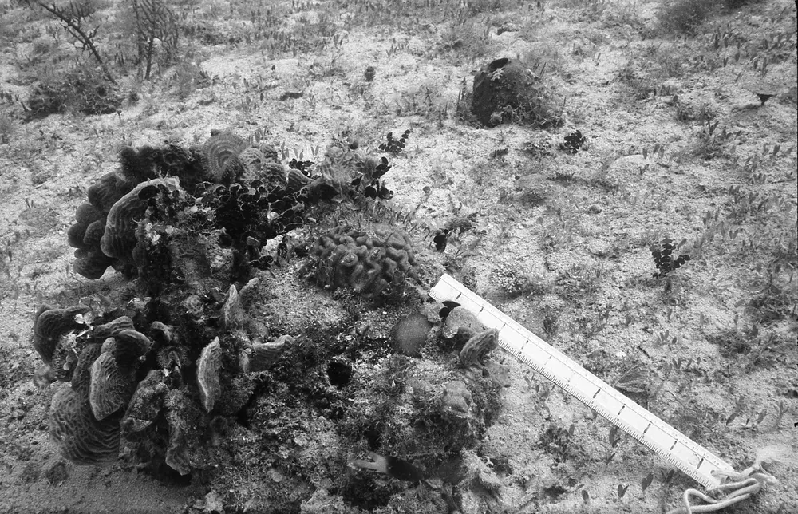{.lightbox group="discovery-bay-1966" description="**UUID: **f6a0f11b-92d5-46b7-ade7-8eeb7c44a7f7 **Date: **1966-10-24 **Location: **Jamaica | Discovery Bay | Algal Plots **Longitude: **77.414ºW **Latitude: **18.473ºN **Photographer: **Eileen Graham **Copyright: **Trustees of the Natural History Museum (London, UK), CC-BY-4.0" alt="**UUID: **f6a0f11b-92d5-46b7-ade7-8eeb7c44a7f7 **Date: **1966-10-24 **Location: **Jamaica | Discovery Bay | Algal Plots **Longitude: **77.414ºW **Latitude: **18.473ºN **Photographer: **Eileen Graham **Copyright: **Trustees of the Natural History Museum (London, UK), CC-BY-4.0"}

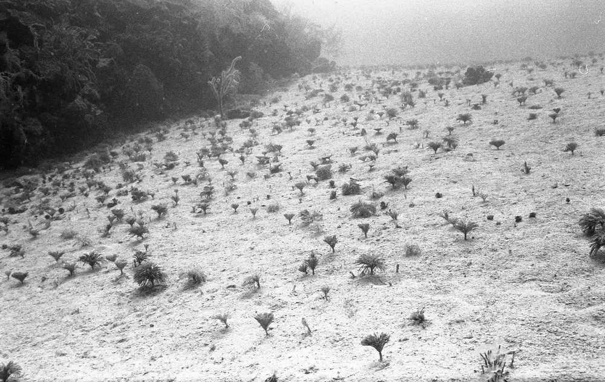{.lightbox group="discovery-bay-1966" description="**UUID: **395df266-6c09-4cc9-95f2-8531dc9230f2 **Date: **1966-10-26 **Location: **Jamaica | Discovery Bay | Algal Plots **Longitude: **77.414ºW **Latitude: **18.473ºN **Photographer: **Eileen Graham **Copyright: **Trustees of the Natural History Museum (London, UK), CC-BY-4.0" alt="**UUID: **395df266-6c09-4cc9-95f2-8531dc9230f2 **Date: **1966-10-26 **Location: **Jamaica | Discovery Bay | Algal Plots **Longitude: **77.414ºW **Latitude: **18.473ºN **Photographer: **Eileen Graham **Copyright: **Trustees of the Natural History Museum (London, UK), CC-BY-4.0"}

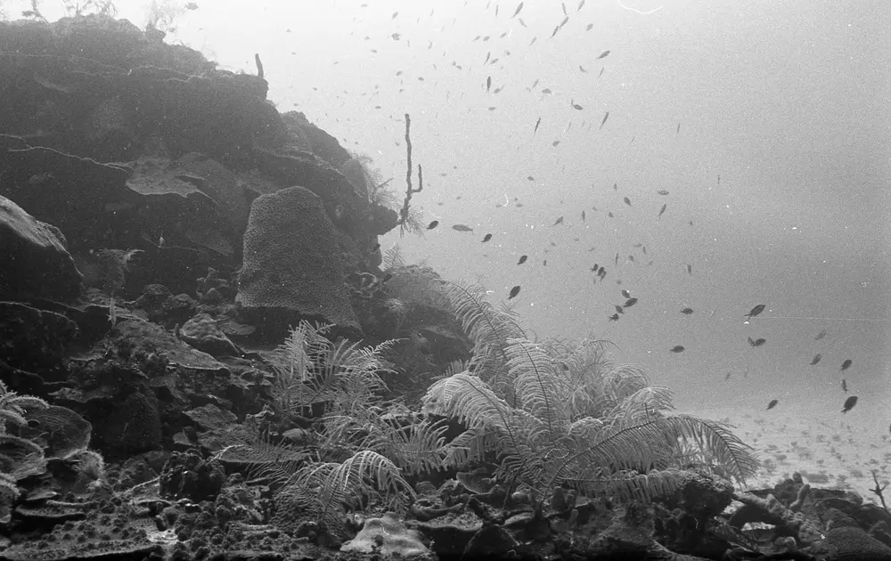{.lightbox group="discovery-bay-1966" description="**UUID: **6d7b4e76-db2c-45e8-a9d6-cea5fb2dbaf5 **Date: **1966-10-26 **Location: **Jamaica | Discovery Bay | Pinnacle 1 Slope **Longitude: **77.41017ºW **Latitude: **18.47367ºN **Photographer: **Eileen Graham **Copyright: **Trustees of the Natural History Museum (London, UK), CC-BY-4.0" alt="**UUID: **6d7b4e76-db2c-45e8-a9d6-cea5fb2dbaf5 **Date: **1966-10-26 **Location: **Jamaica | Discovery Bay | Pinnacle 1 Slope **Longitude: **77.41017ºW **Latitude: **18.47367ºN **Photographer: **Eileen Graham **Copyright: **Trustees of the Natural History Museum (London, UK), CC-BY-4.0"}

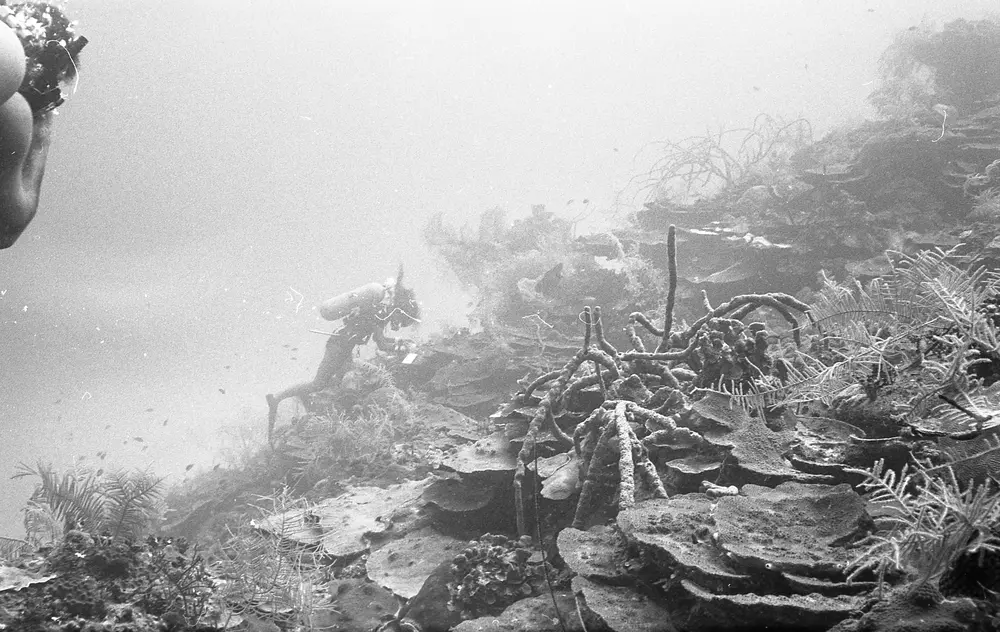{.lightbox group="discovery-bay-1966" description="**UUID: **8a320fac-d085-4ab3-909c-40fb5142fa7d **Date: **1966-10-26 **Location: **Jamaica | Discovery Bay | Pinnacle 1 Slope **Longitude: **77.41017ºW **Latitude: **18.47367ºN **Photographer: **Eileen Graham **Copyright: **Trustees of the Natural History Museum (London, UK), CC-BY-4.0" alt="**UUID: **8a320fac-d085-4ab3-909c-40fb5142fa7d **Date: **1966-10-26 **Location: **Jamaica | Discovery Bay | Pinnacle 1 Slope **Longitude: **77.41017ºW **Latitude: **18.47367ºN **Photographer: **Eileen Graham **Copyright: **Trustees of the Natural History Museum (London, UK), CC-BY-4.0"}

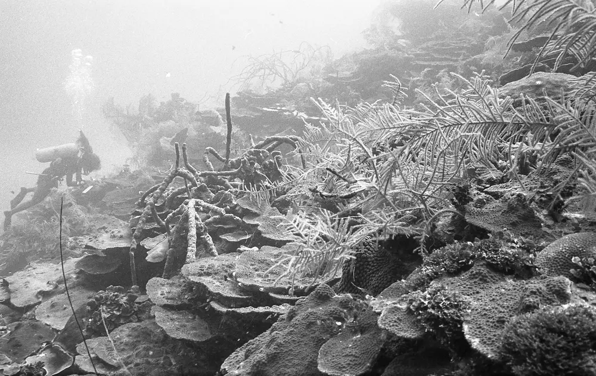{.lightbox group="discovery-bay-1966" description="**UUID: **b000d83a-b03c-4a3b-8a8b-21c5af0a6e59 **Date: **1966-10-26 **Location: **Jamaica | Discovery Bay | Pinnacle 1 Slope **Longitude: **77.41017ºW **Latitude: **18.47367ºN **Photographer: **Eileen Graham **Copyright: **Trustees of the Natural History Museum (London, UK), CC-BY-4.0" alt="**UUID: **b000d83a-b03c-4a3b-8a8b-21c5af0a6e59 **Date: **1966-10-26 **Location: **Jamaica | Discovery Bay | Pinnacle 1 Slope **Longitude: **77.41017ºW **Latitude: **18.47367ºN **Photographer: **Eileen Graham **Copyright: **Trustees of the Natural History Museum (London, UK), CC-BY-4.0"}

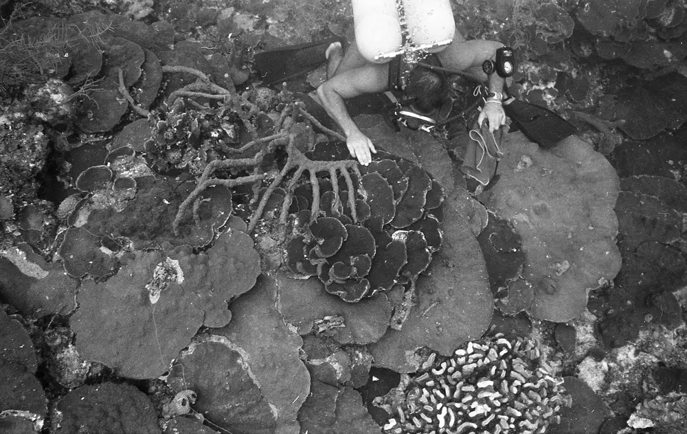{.lightbox group="discovery-bay-1966" description="**UUID: **2b467d97-4d51-4e0a-8dd0-b85851b97247 **Date: **1966-10-26 **Location: **Jamaica | Discovery Bay | Pinnacle 1 Slope **Longitude: **77.41017ºW **Latitude: **18.47367ºN **Photographer: **Eileen Graham **Copyright: **Trustees of the Natural History Museum (London, UK), CC-BY-4.0" alt="**UUID: **2b467d97-4d51-4e0a-8dd0-b85851b97247 **Date: **1966-10-26 **Location: **Jamaica | Discovery Bay | Pinnacle 1 Slope **Longitude: **77.41017ºW **Latitude: **18.47367ºN **Photographer: **Eileen Graham **Copyright: **Trustees of the Natural History Museum (London, UK), CC-BY-4.0"}

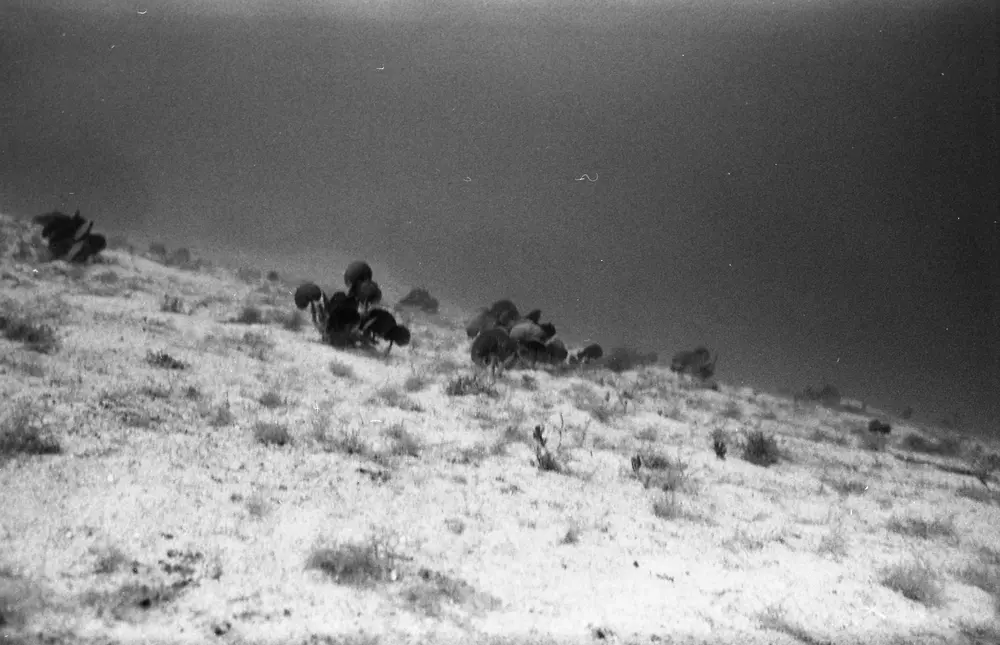{.lightbox group="discovery-bay-1966" description="**UUID: **85649864-8ddb-4e3d-8725-62aded099416 **Date: **1966-10-26 **Location: **Jamaica | Discovery Bay | Algal Plots **Longitude: **77.414ºW **Latitude: **18.473ºN **Photographer: **Eileen Graham **Copyright: **Trustees of the Natural History Museum (London, UK), CC-BY-4.0" alt="**UUID: **85649864-8ddb-4e3d-8725-62aded099416 **Date: **1966-10-26 **Location: **Jamaica | Discovery Bay | Algal Plots **Longitude: **77.414ºW **Latitude: **18.473ºN **Photographer: **Eileen Graham **Copyright: **Trustees of the Natural History Museum (London, UK), CC-BY-4.0"}

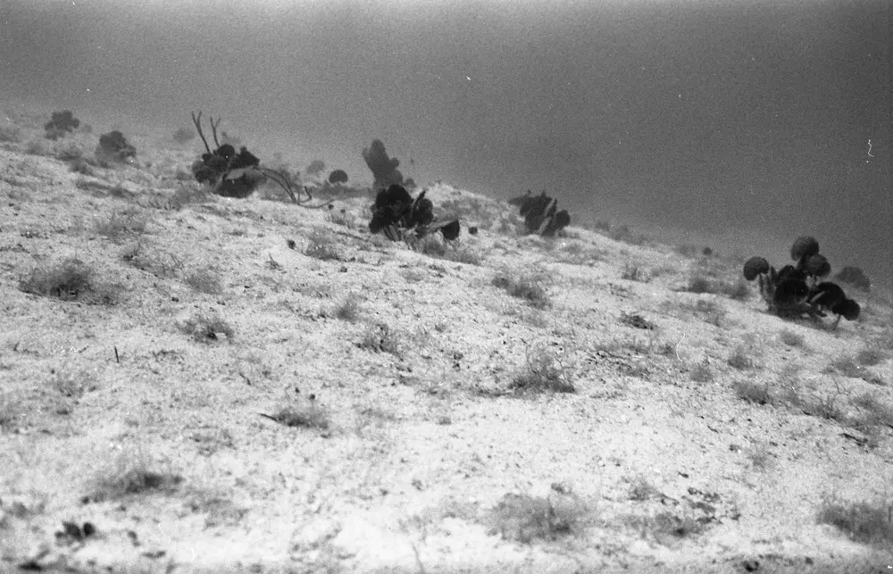{.lightbox group="discovery-bay-1966" description="**UUID: **b1212fdc-f99e-4097-922b-95eb854dc5f0 **Date: **1966-10-26 **Location: **Jamaica | Discovery Bay | Algal Plots **Longitude: **77.414ºW **Latitude: **18.473ºN **Photographer: **Eileen Graham **Copyright: **Trustees of the Natural History Museum (London, UK), CC-BY-4.0" alt="**UUID: **b1212fdc-f99e-4097-922b-95eb854dc5f0 **Date: **1966-10-26 **Location: **Jamaica | Discovery Bay | Algal Plots **Longitude: **77.414ºW **Latitude: **18.473ºN **Photographer: **Eileen Graham **Copyright: **Trustees of the Natural History Museum (London, UK), CC-BY-4.0"}

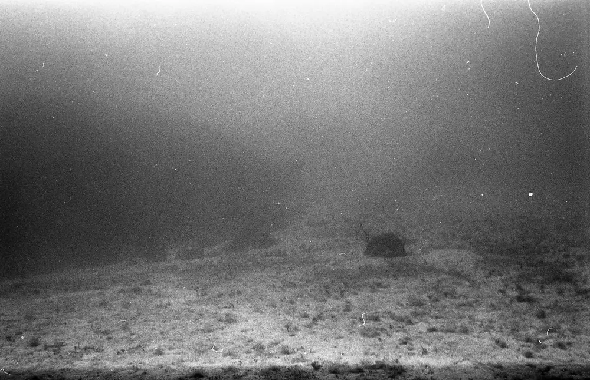{.lightbox group="discovery-bay-1966" description="**UUID: **41805532-d195-419b-bf59-6a4c4bfdd543 **Date: **1966-10-26 **Location: **Jamaica | Discovery Bay | Algal Plots **Longitude: **77.414ºW **Latitude: **18.473ºN **Photographer: **Eileen Graham **Copyright: **Trustees of the Natural History Museum (London, UK), CC-BY-4.0" alt="**UUID: **41805532-d195-419b-bf59-6a4c4bfdd543 **Date: **1966-10-26 **Location: **Jamaica | Discovery Bay | Algal Plots **Longitude: **77.414ºW **Latitude: **18.473ºN **Photographer: **Eileen Graham **Copyright: **Trustees of the Natural History Museum (London, UK), CC-BY-4.0"}

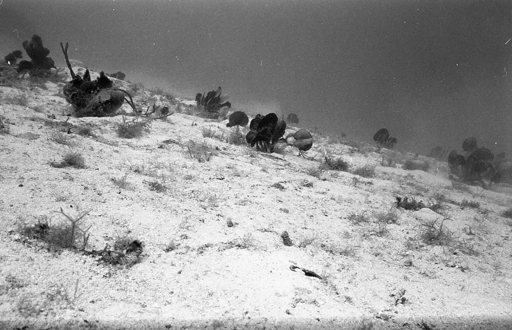{.lightbox group="discovery-bay-1966" description="**UUID: **402edb3e-6b95-4c5d-ae65-7f9bb5e04533 **Date: **1966-10-26 **Location: **Jamaica | Discovery Bay | Algal Plots **Longitude: **77.414ºW **Latitude: **18.473ºN **Photographer: **Eileen Graham **Copyright: **Trustees of the Natural History Museum (London, UK), CC-BY-4.0" alt="**UUID: **402edb3e-6b95-4c5d-ae65-7f9bb5e04533 **Date: **1966-10-26 **Location: **Jamaica | Discovery Bay | Algal Plots **Longitude: **77.414ºW **Latitude: **18.473ºN **Photographer: **Eileen Graham **Copyright: **Trustees of the Natural History Museum (London, UK), CC-BY-4.0"}

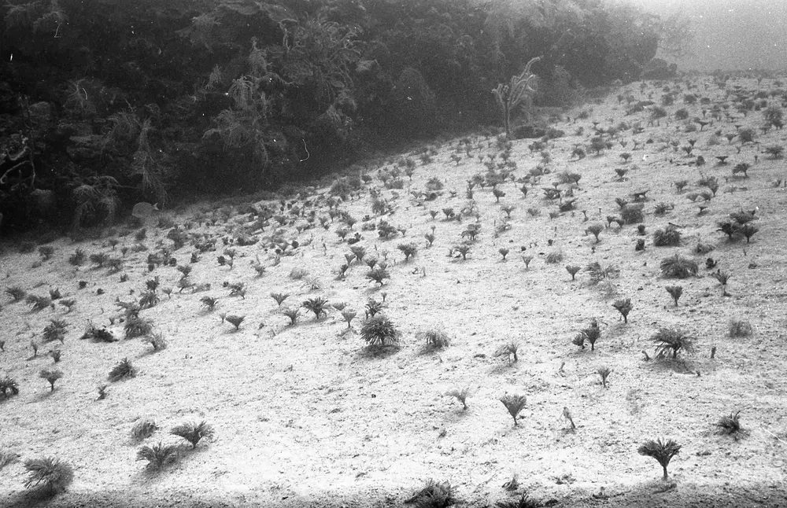{.lightbox group="discovery-bay-1966" description="**UUID: **00677c22-449b-460d-9bda-4d42f94c7d88 **Date: **1966-10-26 **Location: **Jamaica | Discovery Bay | Algal Plots **Longitude: **77.414ºW **Latitude: **18.473ºN **Photographer: **Eileen Graham **Copyright: **Trustees of the Natural History Museum (London, UK), CC-BY-4.0" alt="**UUID: **00677c22-449b-460d-9bda-4d42f94c7d88 **Date: **1966-10-26 **Location: **Jamaica | Discovery Bay | Algal Plots **Longitude: **77.414ºW **Latitude: **18.473ºN **Photographer: **Eileen Graham **Copyright: **Trustees of the Natural History Museum (London, UK), CC-BY-4.0"}

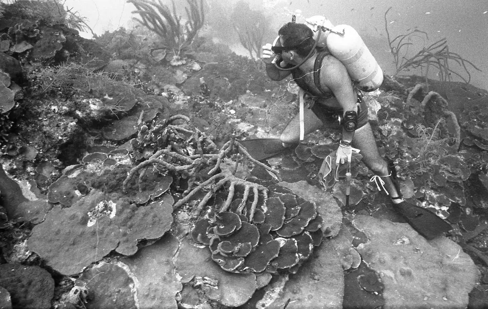{.lightbox group="discovery-bay-1966" description="**UUID: **6acf45eb-9775-4518-ba94-ac9457682615 **Date: **1966-10-26 **Location: **Jamaica | Discovery Bay | Pinnacle 1 Slope **Longitude: **77.41017ºW **Latitude: **18.47367ºN **Photographer: **Eileen Graham **Copyright: **Trustees of the Natural History Museum (London, UK), CC-BY-4.0" alt="**UUID: **6acf45eb-9775-4518-ba94-ac9457682615 **Date: **1966-10-26 **Location: **Jamaica | Discovery Bay | Pinnacle 1 Slope **Longitude: **77.41017ºW **Latitude: **18.47367ºN **Photographer: **Eileen Graham **Copyright: **Trustees of the Natural History Museum (London, UK), CC-BY-4.0"}

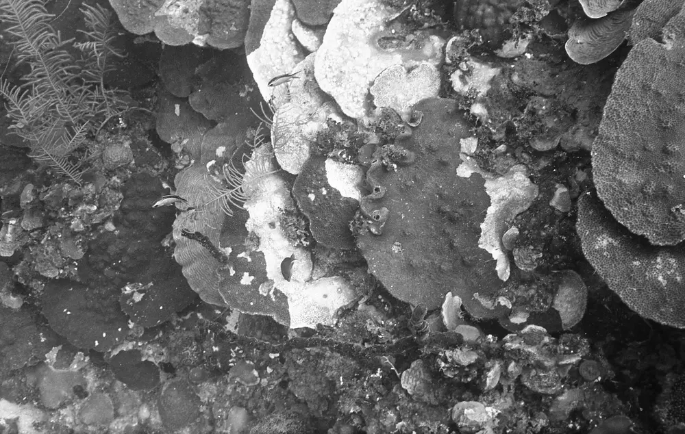{.lightbox group="discovery-bay-1966" description="**UUID: **dc237f85-123b-4ce7-8b9c-d28e7d743838 **Date: **1966-10-26 **Location: **Jamaica | Discovery Bay | Pinnacle 1 Slope **Longitude: **77.41017ºW **Latitude: **18.47367ºN **Photographer: **Eileen Graham **Copyright: **Trustees of the Natural History Museum (London, UK), CC-BY-4.0" alt="**UUID: **dc237f85-123b-4ce7-8b9c-d28e7d743838 **Date: **1966-10-26 **Location: **Jamaica | Discovery Bay | Pinnacle 1 Slope **Longitude: **77.41017ºW **Latitude: **18.47367ºN **Photographer: **Eileen Graham **Copyright: **Trustees of the Natural History Museum (London, UK), CC-BY-4.0"}

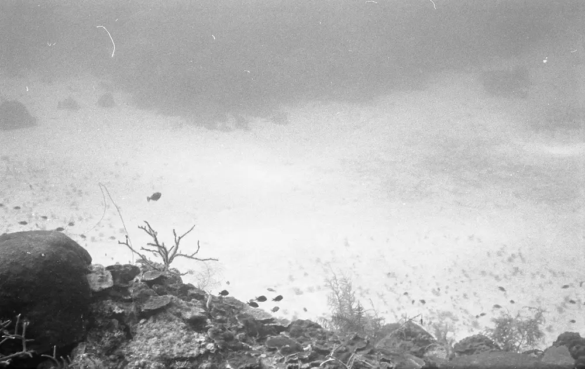{.lightbox group="discovery-bay-1966" description="**UUID: **950dbd4c-3ddd-42cc-beb1-91492b7f136f **Date: **1966-10-26 **Location: **Jamaica | Discovery Bay | Pinnacle 1 Slope **Longitude: **77.41017ºW **Latitude: **18.47367ºN **Photographer: **Eileen Graham **Copyright: **Trustees of the Natural History Museum (London, UK), CC-BY-4.0" alt="**UUID: **950dbd4c-3ddd-42cc-beb1-91492b7f136f **Date: **1966-10-26 **Location: **Jamaica | Discovery Bay | Pinnacle 1 Slope **Longitude: **77.41017ºW **Latitude: **18.47367ºN **Photographer: **Eileen Graham **Copyright: **Trustees of the Natural History Museum (London, UK), CC-BY-4.0"}

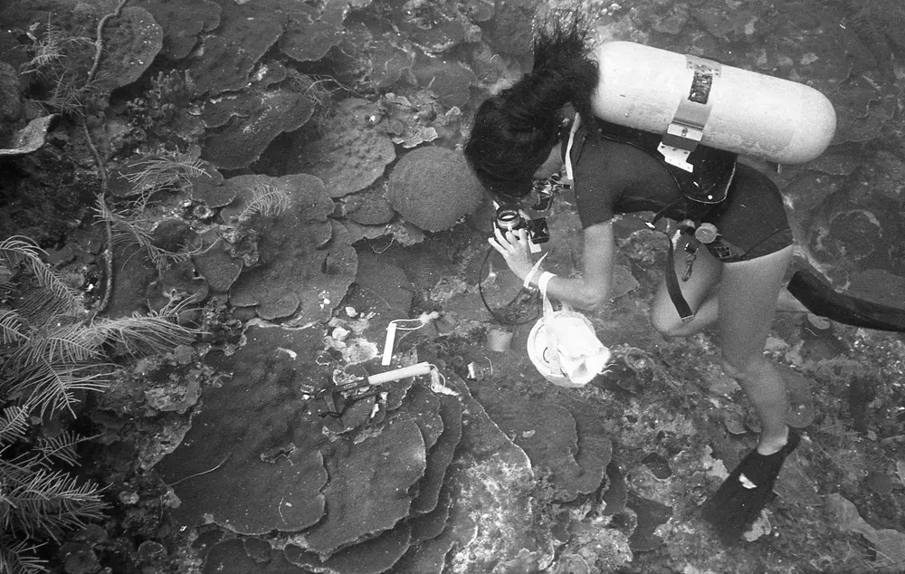{.lightbox group="discovery-bay-1966" description="**UUID: **2b122141-7d9a-40ff-b38d-cbf6701be93f **Date: **1966-10-26 **Location: **Jamaica | Discovery Bay | Pinnacle 1 Slope **Longitude: **77.41017ºW **Latitude: **18.47367ºN **Photographer: **Eileen Graham **Copyright: **Trustees of the Natural History Museum (London, UK), CC-BY-4.0" alt="**UUID: **2b122141-7d9a-40ff-b38d-cbf6701be93f **Date: **1966-10-26 **Location: **Jamaica | Discovery Bay | Pinnacle 1 Slope **Longitude: **77.41017ºW **Latitude: **18.47367ºN **Photographer: **Eileen Graham **Copyright: **Trustees of the Natural History Museum (London, UK), CC-BY-4.0"}

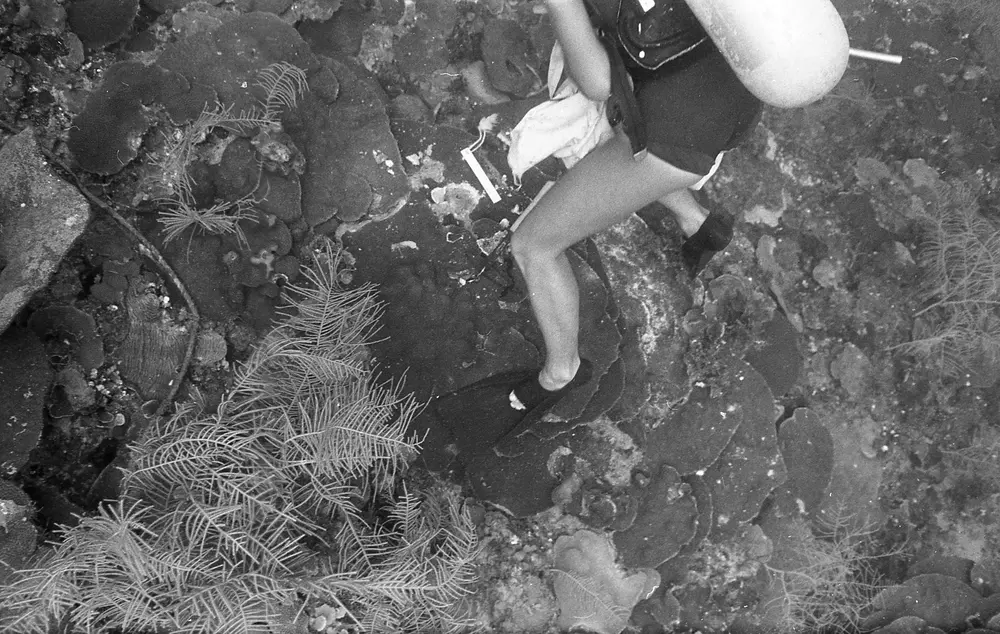{.lightbox group="discovery-bay-1966" description="**UUID: **63adbcdf-e6cd-4012-a775-5a2f09c73a3f **Date: **1966-10-26 **Location: **Jamaica | Discovery Bay | Pinnacle 1 Slope **Longitude: **77.41017ºW **Latitude: **18.47367ºN **Photographer: **Eileen Graham **Copyright: **Trustees of the Natural History Museum (London, UK), CC-BY-4.0" alt="**UUID: **63adbcdf-e6cd-4012-a775-5a2f09c73a3f **Date: **1966-10-26 **Location: **Jamaica | Discovery Bay | Pinnacle 1 Slope **Longitude: **77.41017ºW **Latitude: **18.47367ºN **Photographer: **Eileen Graham **Copyright: **Trustees of the Natural History Museum (London, UK), CC-BY-4.0"}

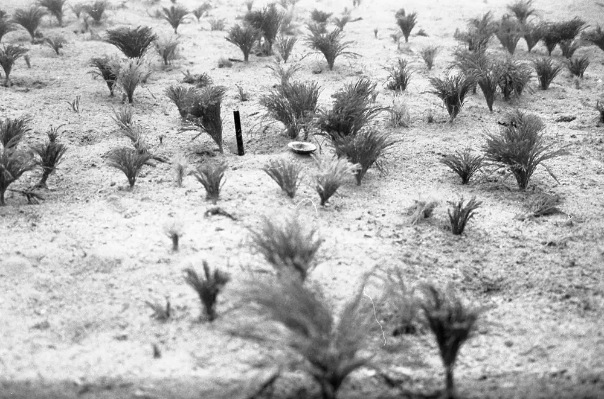{.lightbox group="discovery-bay-1966" description="**UUID: **d43a446b-b0c4-4ee3-af07-19ecd6983cc2 **Date: **1966-11-16 **Location: **Jamaica | Discovery Bay | Algal Plots **Longitude: **77.414ºW **Latitude: **18.473ºN **Photographer: **Eileen Graham **Copyright: **Trustees of the Natural History Museum (London, UK), CC-BY-4.0" alt="**UUID: **d43a446b-b0c4-4ee3-af07-19ecd6983cc2 **Date: **1966-11-16 **Location: **Jamaica | Discovery Bay | Algal Plots **Longitude: **77.414ºW **Latitude: **18.473ºN **Photographer: **Eileen Graham **Copyright: **Trustees of the Natural History Museum (London, UK), CC-BY-4.0"}

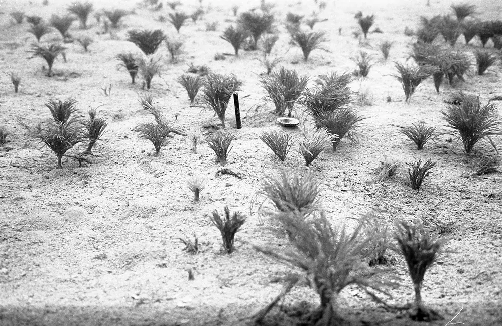{.lightbox group="discovery-bay-1966" description="**UUID: **a7a8f1dd-93c3-425f-bd52-f82dfb723578 **Date: **1966-11-16 **Location: **Jamaica | Discovery Bay | Algal Plots **Longitude: **77.414ºW **Latitude: **18.473ºN **Photographer: **Eileen Graham **Copyright: **Trustees of the Natural History Museum (London, UK), CC-BY-4.0" alt="**UUID: **a7a8f1dd-93c3-425f-bd52-f82dfb723578 **Date: **1966-11-16 **Location: **Jamaica | Discovery Bay | Algal Plots **Longitude: **77.414ºW **Latitude: **18.473ºN **Photographer: **Eileen Graham **Copyright: **Trustees of the Natural History Museum (London, UK), CC-BY-4.0"}

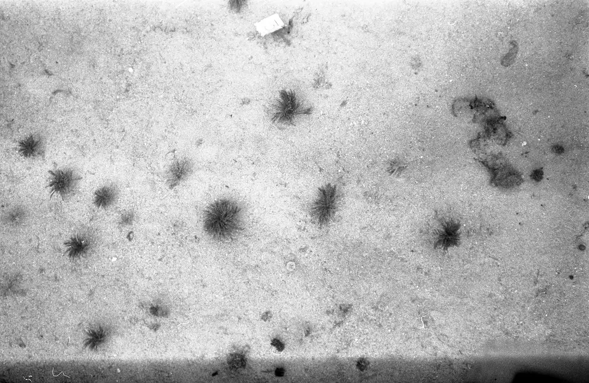{.lightbox group="discovery-bay-1966" description="**UUID: **81363a14-d1ae-486f-863f-8d3946367a6b **Date: **1966-11-16 **Location: **Jamaica | Discovery Bay | Algal Plots **Longitude: **77.414ºW **Latitude: **18.473ºN **Photographer: **Eileen Graham **Copyright: **Trustees of the Natural History Museum (London, UK), CC-BY-4.0" alt="**UUID: **81363a14-d1ae-486f-863f-8d3946367a6b **Date: **1966-11-16 **Location: **Jamaica | Discovery Bay | Algal Plots **Longitude: **77.414ºW **Latitude: **18.473ºN **Photographer: **Eileen Graham **Copyright: **Trustees of the Natural History Museum (London, UK), CC-BY-4.0"}

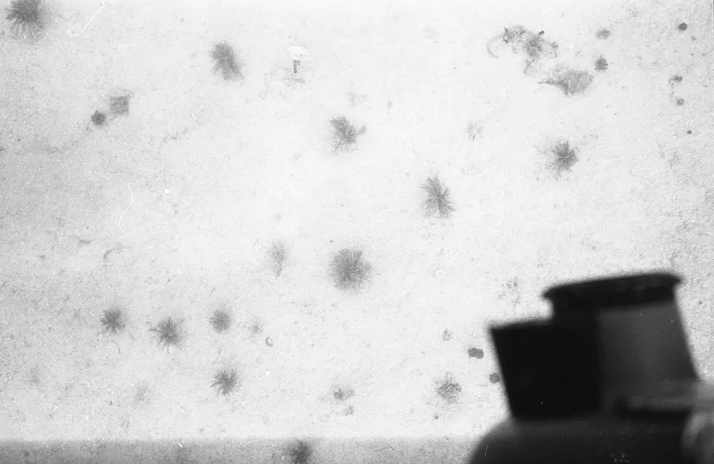{.lightbox group="discovery-bay-1966" description="**UUID: **66caac90-b294-4ece-b348-c7cae6b6fbef **Date: **1966-11-16 **Location: **Jamaica | Discovery Bay | Algal Plots **Longitude: **77.414ºW **Latitude: **18.473ºN **Photographer: **Eileen Graham **Copyright: **Trustees of the Natural History Museum (London, UK), CC-BY-4.0" alt="**UUID: **66caac90-b294-4ece-b348-c7cae6b6fbef **Date: **1966-11-16 **Location: **Jamaica | Discovery Bay | Algal Plots **Longitude: **77.414ºW **Latitude: **18.473ºN **Photographer: **Eileen Graham **Copyright: **Trustees of the Natural History Museum (London, UK), CC-BY-4.0"}

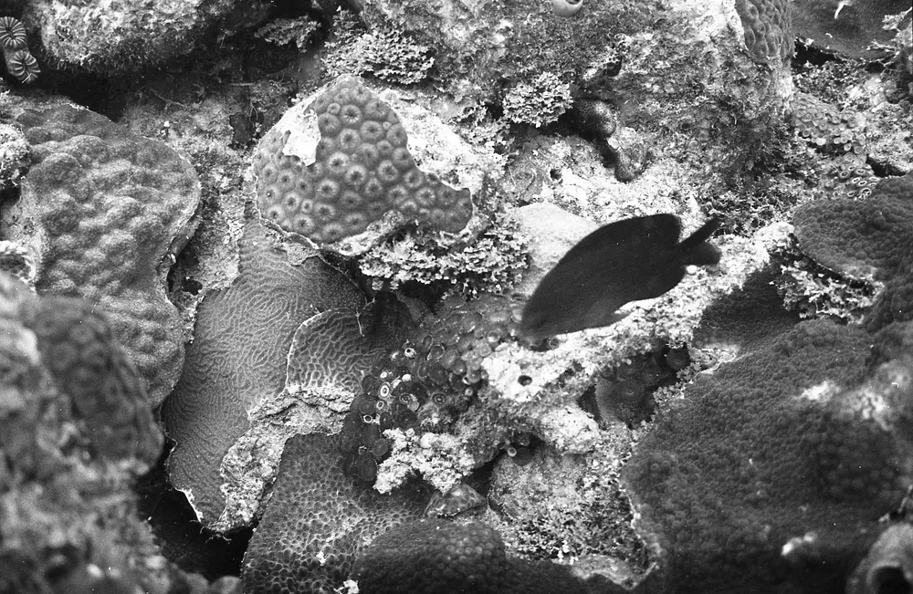{.lightbox group="discovery-bay-1966" description="**UUID: **fb247ca4-f292-44ac-803b-66f7f039c7d2 **Date: **1966-11-16 **Location: **Jamaica | Discovery Bay | Buoy Upper Slope **Longitude: **77.40908ºW **Latitude: **18.47322ºN **Photographer: **Eileen Graham **Copyright: **Trustees of the Natural History Museum (London, UK), CC-BY-4.0" alt="**UUID: **fb247ca4-f292-44ac-803b-66f7f039c7d2 **Date: **1966-11-16 **Location: **Jamaica | Discovery Bay | Buoy Upper Slope **Longitude: **77.40908ºW **Latitude: **18.47322ºN **Photographer: **Eileen Graham **Copyright: **Trustees of the Natural History Museum (London, UK), CC-BY-4.0"}

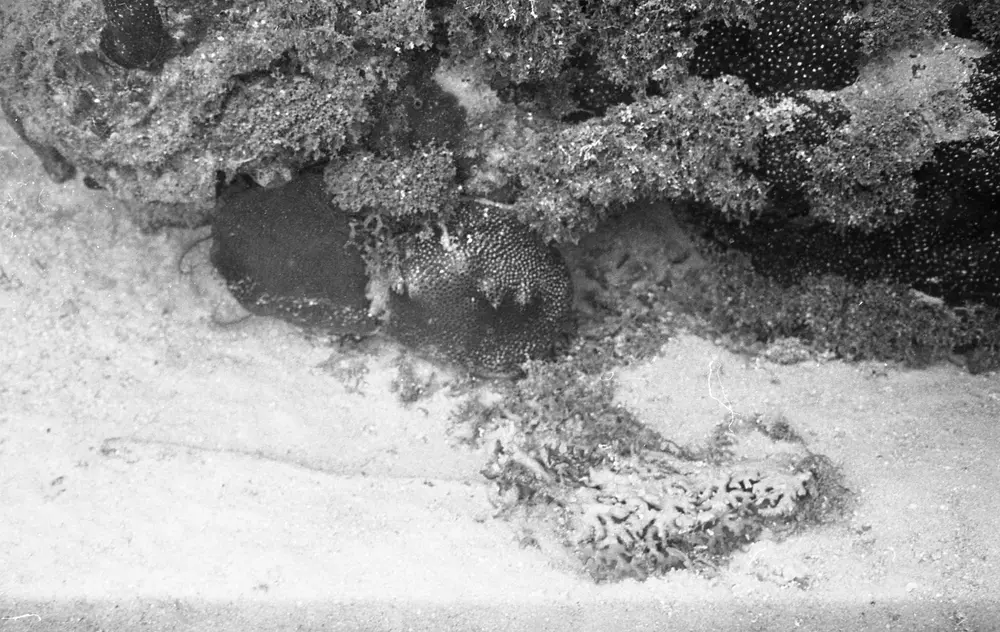{.lightbox group="discovery-bay-1966" description="**UUID: **28dbec06-72d2-4904-9373-5ed92b893a29 **Date: **1966-11-16 **Location: **Jamaica | Discovery Bay | Buoy Upper Slope **Longitude: **77.40908ºW **Latitude: **18.47322ºN **Photographer: **Eileen Graham **Copyright: **Trustees of the Natural History Museum (London, UK), CC-BY-4.0" alt="**UUID: **28dbec06-72d2-4904-9373-5ed92b893a29 **Date: **1966-11-16 **Location: **Jamaica | Discovery Bay | Buoy Upper Slope **Longitude: **77.40908ºW **Latitude: **18.47322ºN **Photographer: **Eileen Graham **Copyright: **Trustees of the Natural History Museum (London, UK), CC-BY-4.0"}

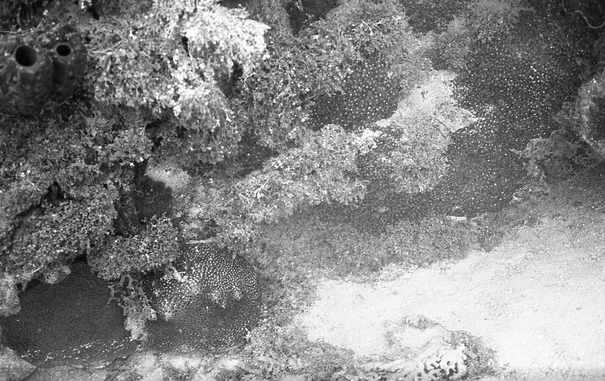{.lightbox group="discovery-bay-1966" description="**UUID: **f7fa6327-57e1-4b14-81a0-8bf4ee7591d4 **Date: **1966-11-16 **Location: **Jamaica | Discovery Bay | Buoy Upper Slope **Longitude: **77.40908ºW **Latitude: **18.47322ºN **Photographer: **Eileen Graham **Copyright: **Trustees of the Natural History Museum (London, UK), CC-BY-4.0" alt="**UUID: **f7fa6327-57e1-4b14-81a0-8bf4ee7591d4 **Date: **1966-11-16 **Location: **Jamaica | Discovery Bay | Buoy Upper Slope **Longitude: **77.40908ºW **Latitude: **18.47322ºN **Photographer: **Eileen Graham **Copyright: **Trustees of the Natural History Museum (London, UK), CC-BY-4.0"}

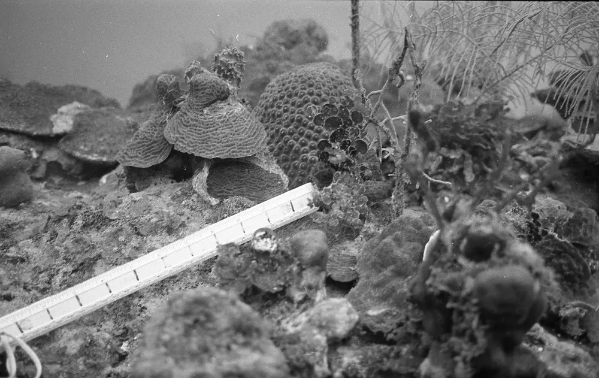{.lightbox group="discovery-bay-1966" description="**UUID: **76c7cfee-c112-4c9b-b599-322f89795fce **Date: **1966-11-16 **Location: **Jamaica | Discovery Bay | Buoy Upper Slope **Longitude: **77.40908ºW **Latitude: **18.47322ºN **Photographer: **Eileen Graham **Copyright: **Trustees of the Natural History Museum (London, UK), CC-BY-4.0" alt="**UUID: **76c7cfee-c112-4c9b-b599-322f89795fce **Date: **1966-11-16 **Location: **Jamaica | Discovery Bay | Buoy Upper Slope **Longitude: **77.40908ºW **Latitude: **18.47322ºN **Photographer: **Eileen Graham **Copyright: **Trustees of the Natural History Museum (London, UK), CC-BY-4.0"}

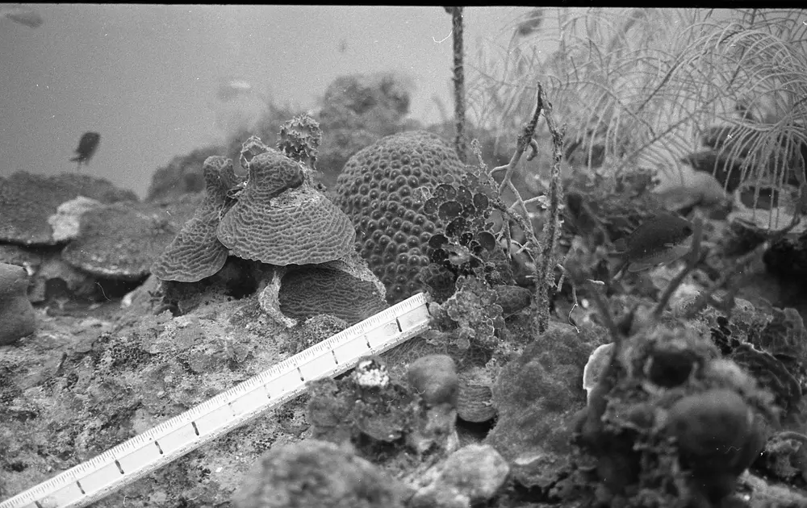{.lightbox group="discovery-bay-1966" description="**UUID: **d20dc77e-cd8e-48ff-91aa-c88fc111bab7 **Date: **1966-11-16 **Location: **Jamaica | Discovery Bay | Buoy Upper Slope **Longitude: **77.40908ºW **Latitude: **18.47322ºN **Photographer: **Eileen Graham **Copyright: **Trustees of the Natural History Museum (London, UK), CC-BY-4.0" alt="**UUID: **d20dc77e-cd8e-48ff-91aa-c88fc111bab7 **Date: **1966-11-16 **Location: **Jamaica | Discovery Bay | Buoy Upper Slope **Longitude: **77.40908ºW **Latitude: **18.47322ºN **Photographer: **Eileen Graham **Copyright: **Trustees of the Natural History Museum (London, UK), CC-BY-4.0"}

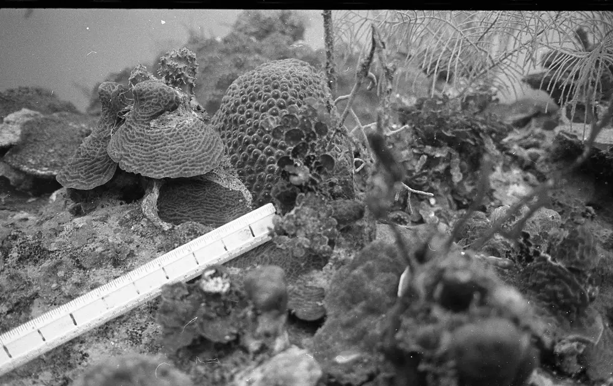{.lightbox group="discovery-bay-1966" description="**UUID: **520af077-f64a-4e11-9933-e9f1cb93970b **Date: **1966-11-16 **Location: **Jamaica | Discovery Bay | Buoy Upper Slope **Longitude: **77.40908ºW **Latitude: **18.47322ºN **Photographer: **Eileen Graham **Copyright: **Trustees of the Natural History Museum (London, UK), CC-BY-4.0" alt="**UUID: **520af077-f64a-4e11-9933-e9f1cb93970b **Date: **1966-11-16 **Location: **Jamaica | Discovery Bay | Buoy Upper Slope **Longitude: **77.40908ºW **Latitude: **18.47322ºN **Photographer: **Eileen Graham **Copyright: **Trustees of the Natural History Museum (London, UK), CC-BY-4.0"}

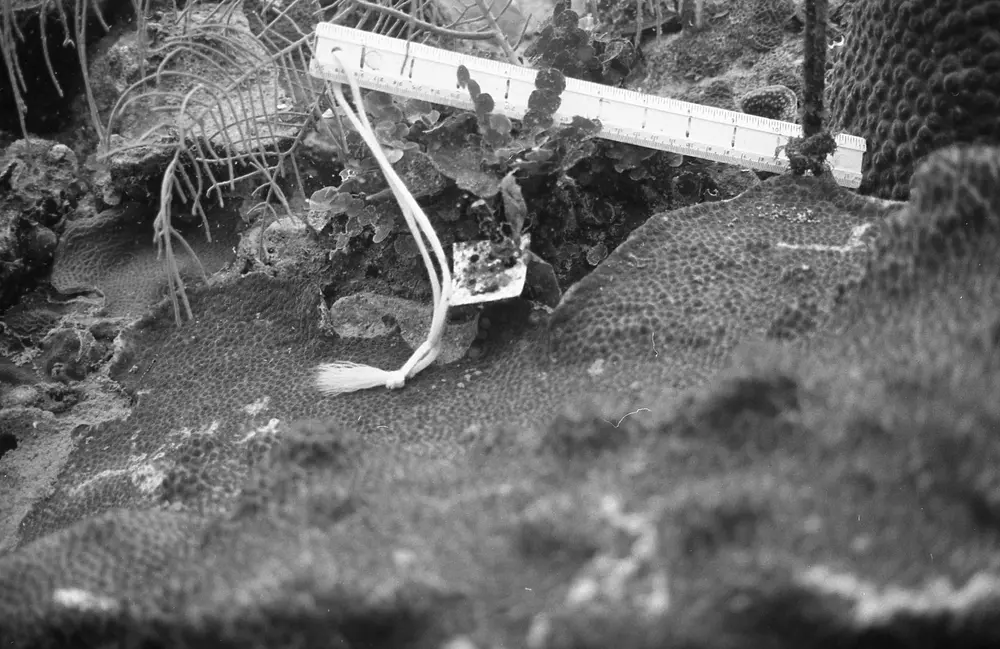{.lightbox group="discovery-bay-1966" description="**UUID: **4a457b28-fb99-4534-8677-3c3866450063 **Date: **1966-11-16 **Location: **Jamaica | Discovery Bay | Buoy Upper Slope **Longitude: **77.40908ºW **Latitude: **18.47322ºN **Photographer: **Eileen Graham **Copyright: **Trustees of the Natural History Museum (London, UK), CC-BY-4.0" alt="**UUID: **4a457b28-fb99-4534-8677-3c3866450063 **Date: **1966-11-16 **Location: **Jamaica | Discovery Bay | Buoy Upper Slope **Longitude: **77.40908ºW **Latitude: **18.47322ºN **Photographer: **Eileen Graham **Copyright: **Trustees of the Natural History Museum (London, UK), CC-BY-4.0"}

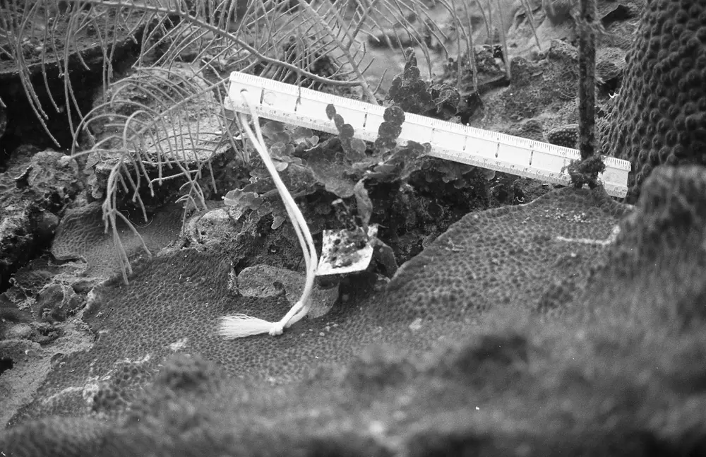{.lightbox group="discovery-bay-1966" description="**UUID: **face314e-9a6d-4cbd-9a14-69e679c00415 **Date: **1966-11-16 **Location: **Jamaica | Discovery Bay | Buoy Upper Slope **Longitude: **77.40908ºW **Latitude: **18.47322ºN **Photographer: **Eileen Graham **Copyright: **Trustees of the Natural History Museum (London, UK), CC-BY-4.0" alt="**UUID: **face314e-9a6d-4cbd-9a14-69e679c00415 **Date: **1966-11-16 **Location: **Jamaica | Discovery Bay | Buoy Upper Slope **Longitude: **77.40908ºW **Latitude: **18.47322ºN **Photographer: **Eileen Graham **Copyright: **Trustees of the Natural History Museum (London, UK), CC-BY-4.0"}

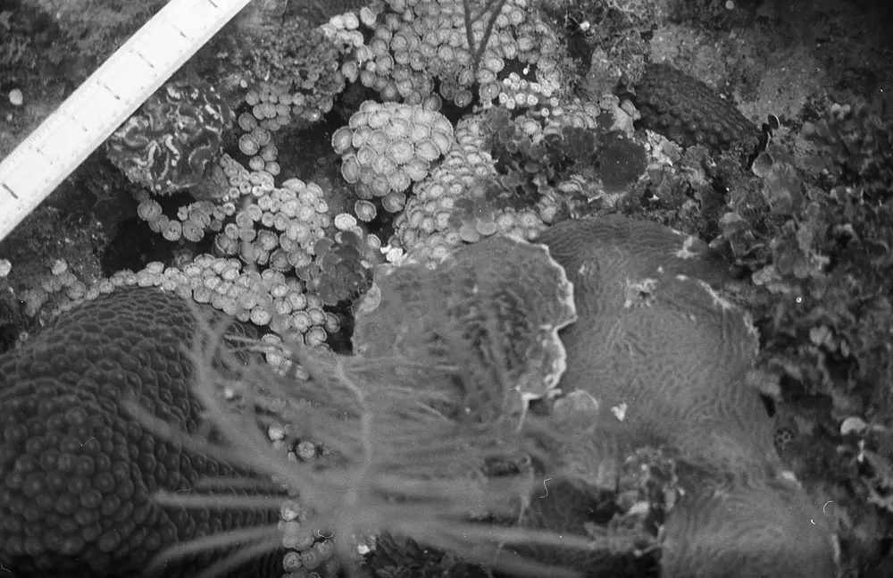{.lightbox group="discovery-bay-1966" description="**UUID: **febd0007-28b0-4c5b-9b49-e83dd51ae688 **Date: **1966-11-16 **Location: **Jamaica | Discovery Bay | Buoy Upper Slope **Longitude: **77.40908ºW **Latitude: **18.47322ºN **Photographer: **Eileen Graham **Copyright: **Trustees of the Natural History Museum (London, UK), CC-BY-4.0" alt="**UUID: **febd0007-28b0-4c5b-9b49-e83dd51ae688 **Date: **1966-11-16 **Location: **Jamaica | Discovery Bay | Buoy Upper Slope **Longitude: **77.40908ºW **Latitude: **18.47322ºN **Photographer: **Eileen Graham **Copyright: **Trustees of the Natural History Museum (London, UK), CC-BY-4.0"}

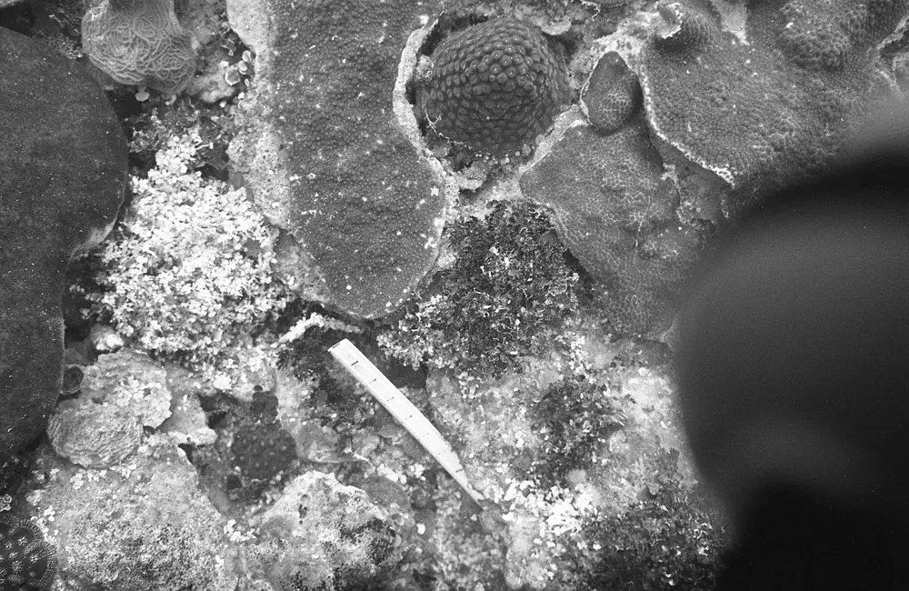{.lightbox group="discovery-bay-1966" description="**UUID: **8a9fdad4-3930-4ed4-a866-8a5a0ce15897 **Date: **1966-11-16 **Location: **Jamaica | Discovery Bay | Buoy Upper Slope **Longitude: **77.40908ºW **Latitude: **18.47322ºN **Photographer: **Eileen Graham **Copyright: **Trustees of the Natural History Museum (London, UK), CC-BY-4.0" alt="**UUID: **8a9fdad4-3930-4ed4-a866-8a5a0ce15897 **Date: **1966-11-16 **Location: **Jamaica | Discovery Bay | Buoy Upper Slope **Longitude: **77.40908ºW **Latitude: **18.47322ºN **Photographer: **Eileen Graham **Copyright: **Trustees of the Natural History Museum (London, UK), CC-BY-4.0"}

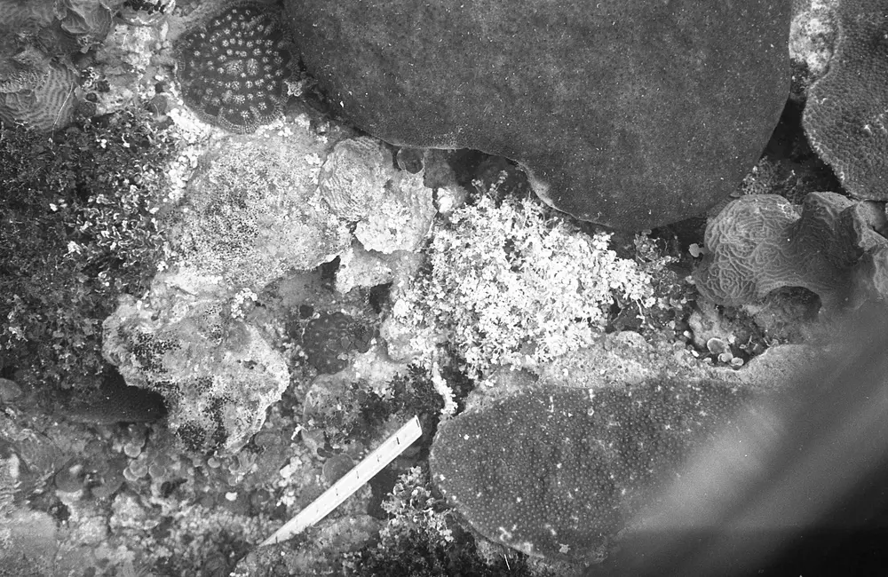{.lightbox group="discovery-bay-1966" description="**UUID: **710017b2-f464-4007-b443-f950f477e1dd **Date: **1966-11-16 **Location: **Jamaica | Discovery Bay | Buoy Upper Slope **Longitude: **77.40908ºW **Latitude: **18.47322ºN **Photographer: **Eileen Graham **Copyright: **Trustees of the Natural History Museum (London, UK), CC-BY-4.0" alt="**UUID: **710017b2-f464-4007-b443-f950f477e1dd **Date: **1966-11-16 **Location: **Jamaica | Discovery Bay | Buoy Upper Slope **Longitude: **77.40908ºW **Latitude: **18.47322ºN **Photographer: **Eileen Graham **Copyright: **Trustees of the Natural History Museum (London, UK), CC-BY-4.0"}

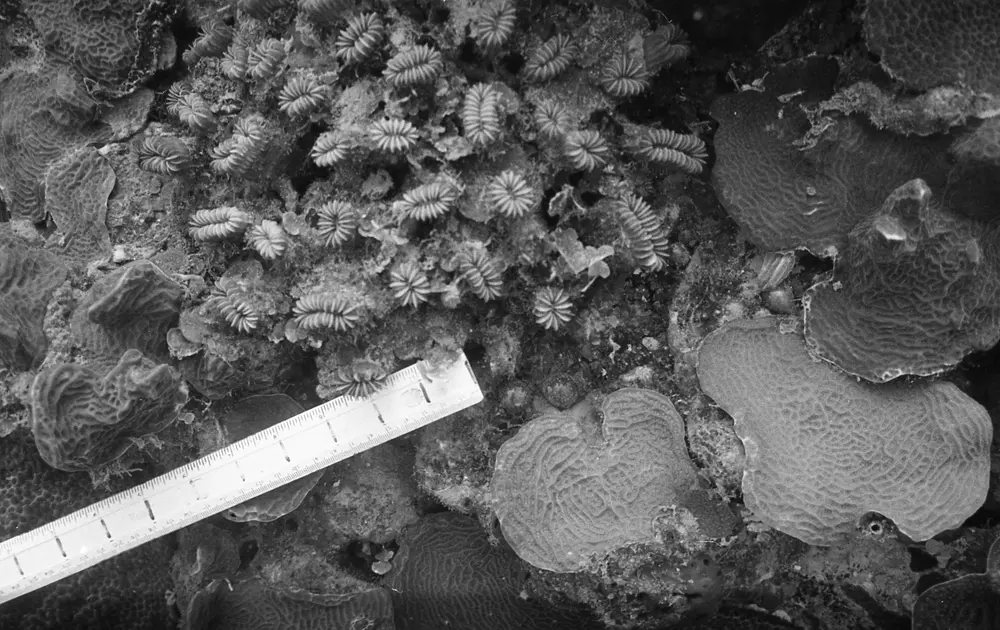{.lightbox group="discovery-bay-1966" description="**UUID: **64fce3ee-8c17-4b7f-949a-131f96b9e290 **Date: **1966-11-16 **Location: **Jamaica | Discovery Bay | Buoy Upper Slope **Longitude: **77.40908ºW **Latitude: **18.47322ºN **Photographer: **Eileen Graham **Copyright: **Trustees of the Natural History Museum (London, UK), CC-BY-4.0" alt="**UUID: **64fce3ee-8c17-4b7f-949a-131f96b9e290 **Date: **1966-11-16 **Location: **Jamaica | Discovery Bay | Buoy Upper Slope **Longitude: **77.40908ºW **Latitude: **18.47322ºN **Photographer: **Eileen Graham **Copyright: **Trustees of the Natural History Museum (London, UK), CC-BY-4.0"}

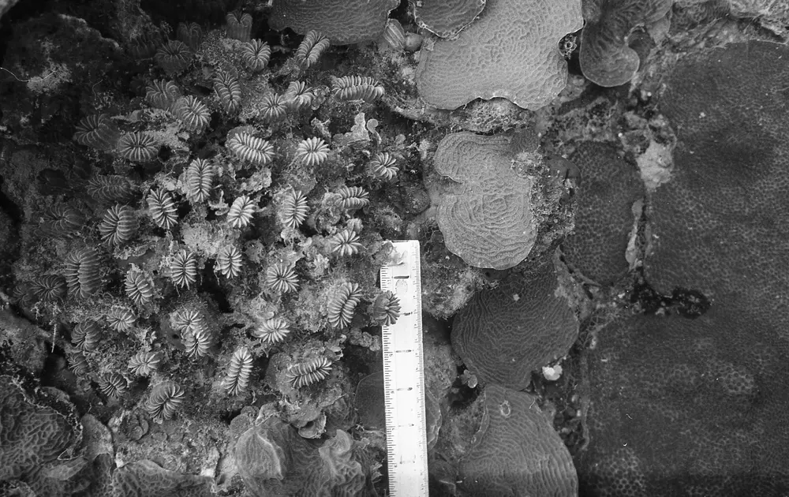{.lightbox group="discovery-bay-1966" description="**UUID: **7d1d865d-c1c4-4bc5-a290-d953bd853227 **Date: **1966-11-16 **Location: **Jamaica | Discovery Bay | Buoy Upper Slope **Longitude: **77.40908ºW **Latitude: **18.47322ºN **Photographer: **Eileen Graham **Copyright: **Trustees of the Natural History Museum (London, UK), CC-BY-4.0" alt="**UUID: **7d1d865d-c1c4-4bc5-a290-d953bd853227 **Date: **1966-11-16 **Location: **Jamaica | Discovery Bay | Buoy Upper Slope **Longitude: **77.40908ºW **Latitude: **18.47322ºN **Photographer: **Eileen Graham **Copyright: **Trustees of the Natural History Museum (London, UK), CC-BY-4.0"}

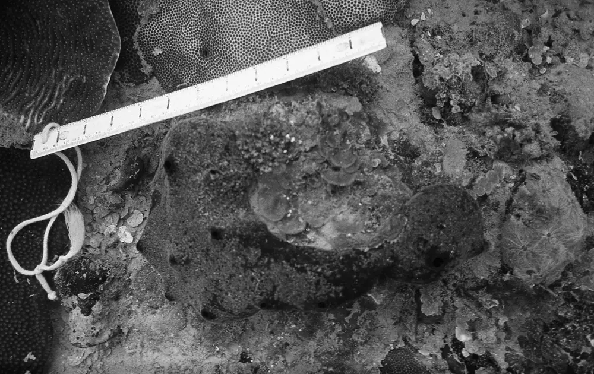{.lightbox group="discovery-bay-1966" description="**UUID: **b70b354f-f4c2-40cb-94e8-21752a61972b **Date: **1966-11-16 **Location: **Jamaica | Discovery Bay | Buoy Upper Slope **Longitude: **77.40908ºW **Latitude: **18.47322ºN **Photographer: **Eileen Graham **Copyright: **Trustees of the Natural History Museum (London, UK), CC-BY-4.0" alt="**UUID: **b70b354f-f4c2-40cb-94e8-21752a61972b **Date: **1966-11-16 **Location: **Jamaica | Discovery Bay | Buoy Upper Slope **Longitude: **77.40908ºW **Latitude: **18.47322ºN **Photographer: **Eileen Graham **Copyright: **Trustees of the Natural History Museum (London, UK), CC-BY-4.0"}

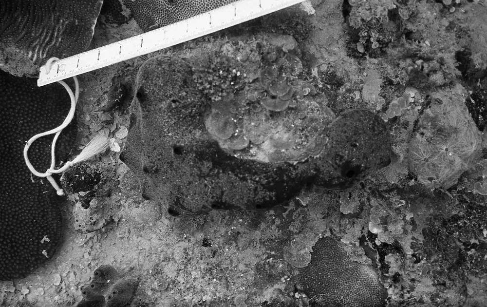{.lightbox group="discovery-bay-1966" description="**UUID: **7489d2e3-f761-4edc-a62e-b0588b66868d **Date: **1966-11-16 **Location: **Jamaica | Discovery Bay | Buoy Upper Slope **Longitude: **77.40908ºW **Latitude: **18.47322ºN **Photographer: **Eileen Graham **Copyright: **Trustees of the Natural History Museum (London, UK), CC-BY-4.0" alt="**UUID: **7489d2e3-f761-4edc-a62e-b0588b66868d **Date: **1966-11-16 **Location: **Jamaica | Discovery Bay | Buoy Upper Slope **Longitude: **77.40908ºW **Latitude: **18.47322ºN **Photographer: **Eileen Graham **Copyright: **Trustees of the Natural History Museum (London, UK), CC-BY-4.0"}

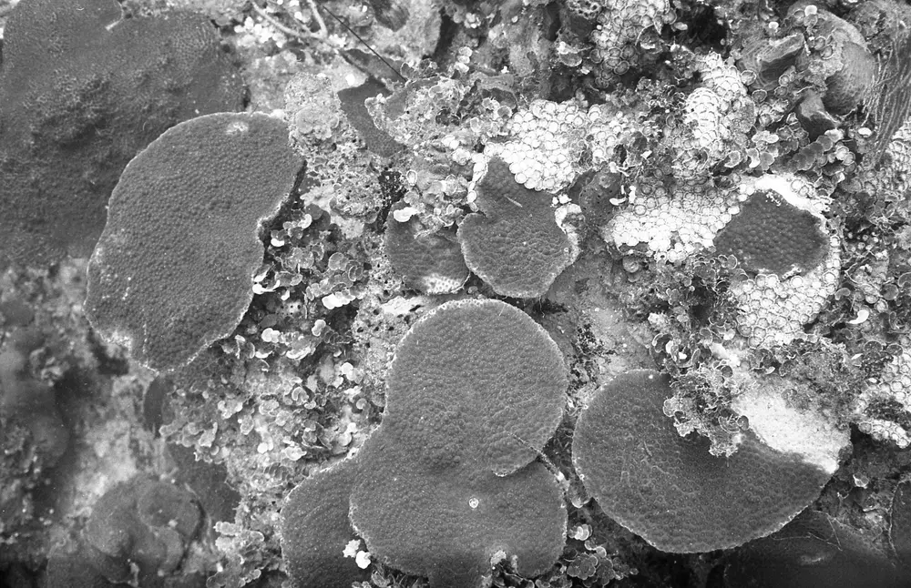{.lightbox group="discovery-bay-1966" description="**UUID: **6ce584e7-d22a-428a-aeaa-450bbd2bdee1 **Date: **1966-11-16 **Location: **Jamaica | Discovery Bay | Buoy Upper Slope **Longitude: **77.40908ºW **Latitude: **18.47322ºN **Photographer: **Eileen Graham **Copyright: **Trustees of the Natural History Museum (London, UK), CC-BY-4.0" alt="**UUID: **6ce584e7-d22a-428a-aeaa-450bbd2bdee1 **Date: **1966-11-16 **Location: **Jamaica | Discovery Bay | Buoy Upper Slope **Longitude: **77.40908ºW **Latitude: **18.47322ºN **Photographer: **Eileen Graham **Copyright: **Trustees of the Natural History Museum (London, UK), CC-BY-4.0"}

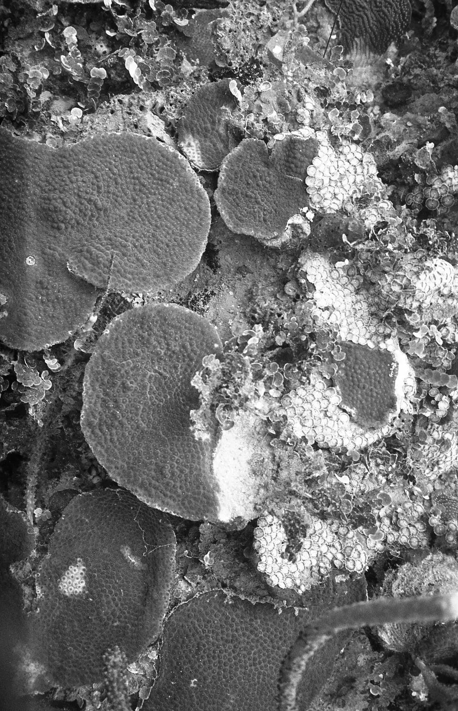{.lightbox group="discovery-bay-1966" description="**UUID: **23a67547-99c1-4966-ba38-08f4c38280bc **Date: **1966-11-16 **Location: **Jamaica | Discovery Bay | Buoy Upper Slope **Longitude: **77.40908ºW **Latitude: **18.47322ºN **Photographer: **Eileen Graham **Copyright: **Trustees of the Natural History Museum (London, UK), CC-BY-4.0" alt="**UUID: **23a67547-99c1-4966-ba38-08f4c38280bc **Date: **1966-11-16 **Location: **Jamaica | Discovery Bay | Buoy Upper Slope **Longitude: **77.40908ºW **Latitude: **18.47322ºN **Photographer: **Eileen Graham **Copyright: **Trustees of the Natural History Museum (London, UK), CC-BY-4.0"}

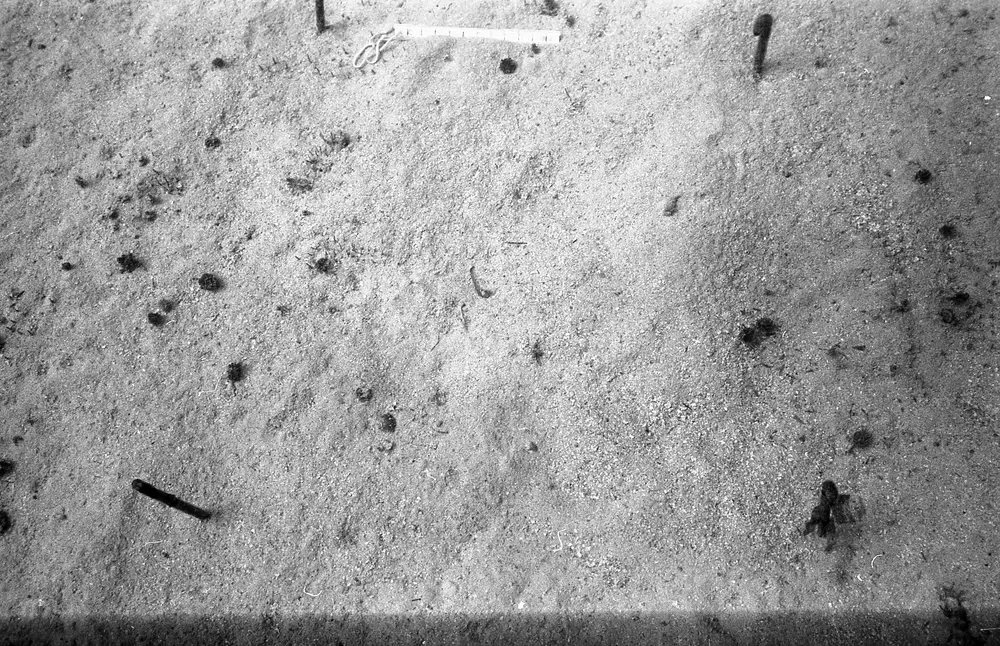{.lightbox group="discovery-bay-1966" description="**UUID: **9513e84f-e89d-4899-97a0-5458980b92db **Date: **1966-11-16 **Location: **Jamaica | Discovery Bay | Algal Plots **Longitude: **77.414ºW **Latitude: **18.473ºN **Photographer: **Eileen Graham **Copyright: **Trustees of the Natural History Museum (London, UK), CC-BY-4.0" alt="**UUID: **9513e84f-e89d-4899-97a0-5458980b92db **Date: **1966-11-16 **Location: **Jamaica | Discovery Bay | Algal Plots **Longitude: **77.414ºW **Latitude: **18.473ºN **Photographer: **Eileen Graham **Copyright: **Trustees of the Natural History Museum (London, UK), CC-BY-4.0"}

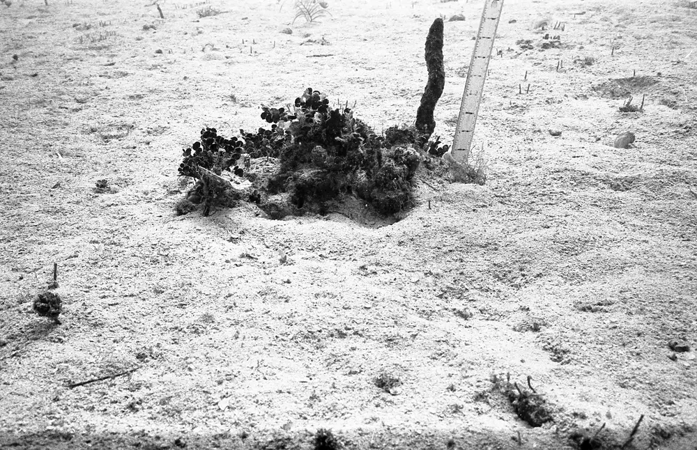{.lightbox group="discovery-bay-1966" description="**UUID: **da7132d6-3d53-47ee-adeb-1d46dca426ee **Date: **1966-11-16 **Location: **Jamaica | Discovery Bay | Algal Plots **Longitude: **77.414ºW **Latitude: **18.473ºN **Photographer: **Eileen Graham **Copyright: **Trustees of the Natural History Museum (London, UK), CC-BY-4.0" alt="**UUID: **da7132d6-3d53-47ee-adeb-1d46dca426ee **Date: **1966-11-16 **Location: **Jamaica | Discovery Bay | Algal Plots **Longitude: **77.414ºW **Latitude: **18.473ºN **Photographer: **Eileen Graham **Copyright: **Trustees of the Natural History Museum (London, UK), CC-BY-4.0"}

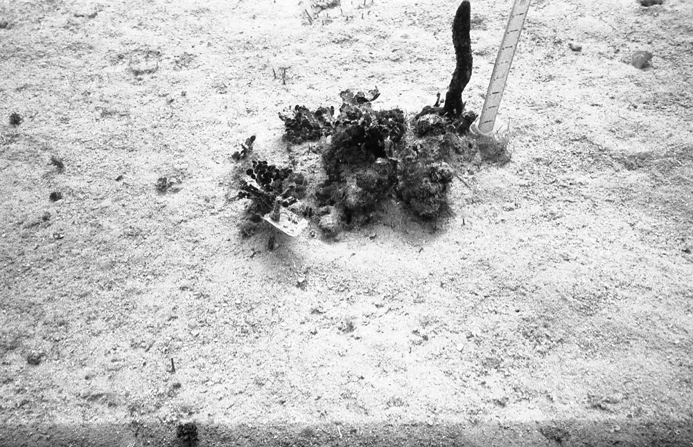{.lightbox group="discovery-bay-1966" description="**UUID: **6301c8df-ff98-4248-9982-96edb89a0ba4 **Date: **1966-11-16 **Location: **Jamaica | Discovery Bay | Algal Plots **Longitude: **77.414ºW **Latitude: **18.473ºN **Photographer: **Eileen Graham **Copyright: **Trustees of the Natural History Museum (London, UK), CC-BY-4.0" alt="**UUID: **6301c8df-ff98-4248-9982-96edb89a0ba4 **Date: **1966-11-16 **Location: **Jamaica | Discovery Bay | Algal Plots **Longitude: **77.414ºW **Latitude: **18.473ºN **Photographer: **Eileen Graham **Copyright: **Trustees of the Natural History Museum (London, UK), CC-BY-4.0"}

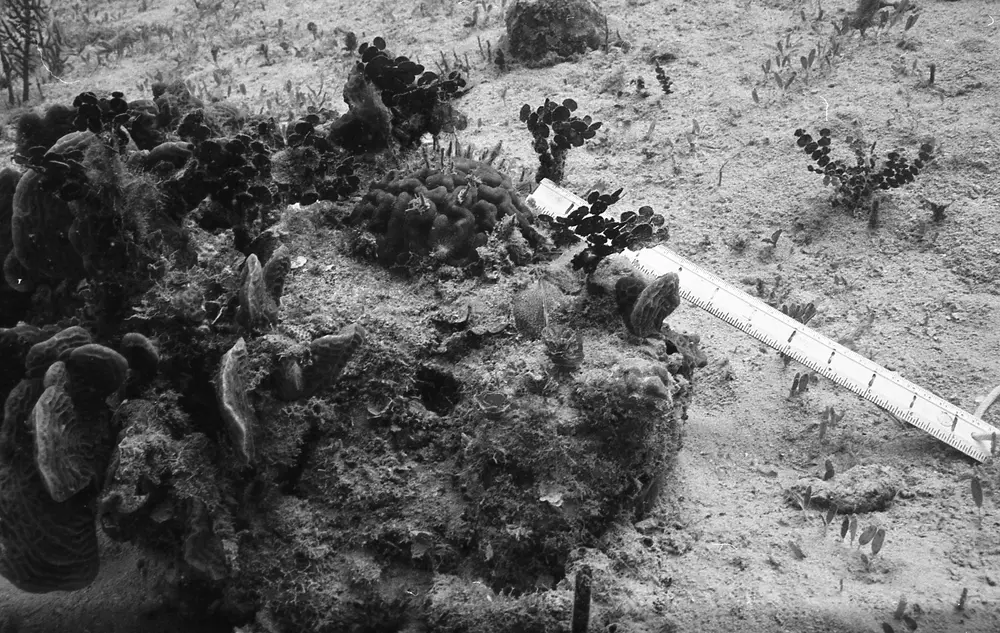{.lightbox group="discovery-bay-1966" description="**UUID: **d55e9567-e510-4c79-b467-ca98eb6f281d **Date: **1966-11-16 **Location: **Jamaica | Discovery Bay | Algal Plots **Longitude: **77.414ºW **Latitude: **18.473ºN **Photographer: **Eileen Graham **Copyright: **Trustees of the Natural History Museum (London, UK), CC-BY-4.0" alt="**UUID: **d55e9567-e510-4c79-b467-ca98eb6f281d **Date: **1966-11-16 **Location: **Jamaica | Discovery Bay | Algal Plots **Longitude: **77.414ºW **Latitude: **18.473ºN **Photographer: **Eileen Graham **Copyright: **Trustees of the Natural History Museum (London, UK), CC-BY-4.0"}

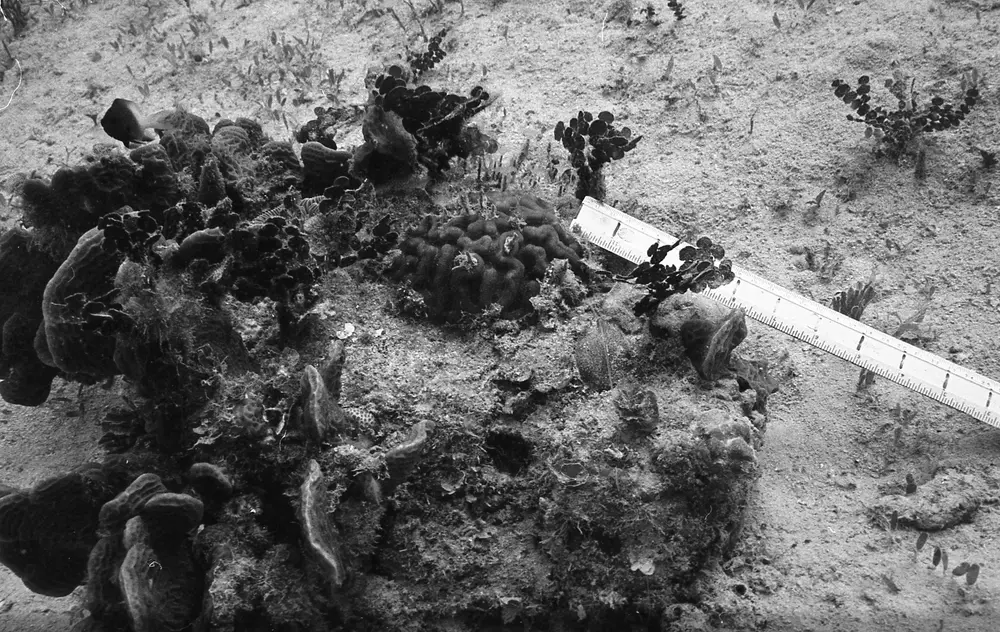{.lightbox group="discovery-bay-1966" description="**UUID: **7873d589-9d64-47b5-8a24-d1524af88a14 **Date: **1966-11-16 **Location: **Jamaica | Discovery Bay | Algal Plots **Longitude: **77.414ºW **Latitude: **18.473ºN **Photographer: **Eileen Graham **Copyright: **Trustees of the Natural History Museum (London, UK), CC-BY-4.0" alt="**UUID: **7873d589-9d64-47b5-8a24-d1524af88a14 **Date: **1966-11-16 **Location: **Jamaica | Discovery Bay | Algal Plots **Longitude: **77.414ºW **Latitude: **18.473ºN **Photographer: **Eileen Graham **Copyright: **Trustees of the Natural History Museum (London, UK), CC-BY-4.0"}

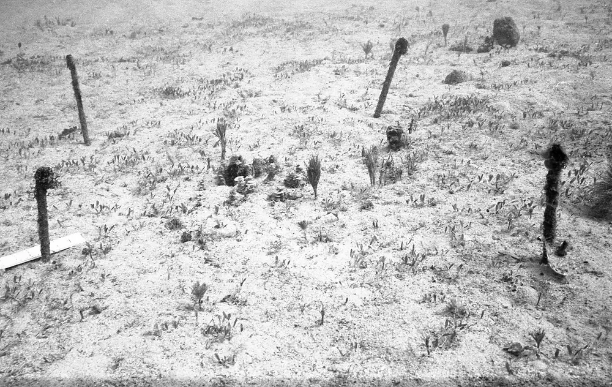{.lightbox group="discovery-bay-1966" description="**UUID: **fea1304f-a1ea-4721-9d4e-b5989bfd7082 **Date: **1966-11-16 **Location: **Jamaica | Discovery Bay | Algal Plots **Longitude: **77.414ºW **Latitude: **18.473ºN **Photographer: **Eileen Graham **Copyright: **Trustees of the Natural History Museum (London, UK), CC-BY-4.0" alt="**UUID: **fea1304f-a1ea-4721-9d4e-b5989bfd7082 **Date: **1966-11-16 **Location: **Jamaica | Discovery Bay | Algal Plots **Longitude: **77.414ºW **Latitude: **18.473ºN **Photographer: **Eileen Graham **Copyright: **Trustees of the Natural History Museum (London, UK), CC-BY-4.0"}

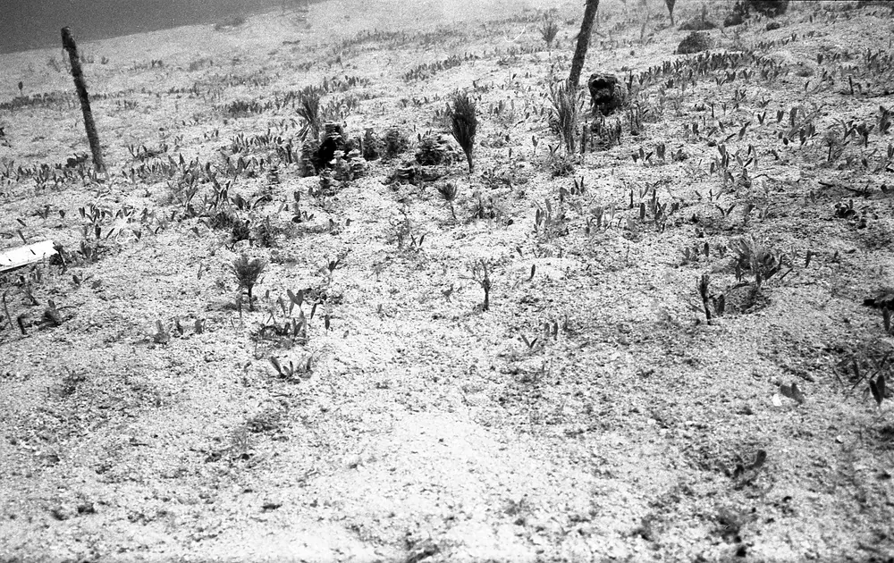{.lightbox group="discovery-bay-1966" description="**UUID: **8cd002b6-41af-40c2-9120-c17647d0ecde **Date: **1966-11-16 **Location: **Jamaica | Discovery Bay | Algal Plots **Longitude: **77.414ºW **Latitude: **18.473ºN **Photographer: **Eileen Graham **Copyright: **Trustees of the Natural History Museum (London, UK), CC-BY-4.0" alt="**UUID: **8cd002b6-41af-40c2-9120-c17647d0ecde **Date: **1966-11-16 **Location: **Jamaica | Discovery Bay | Algal Plots **Longitude: **77.414ºW **Latitude: **18.473ºN **Photographer: **Eileen Graham **Copyright: **Trustees of the Natural History Museum (London, UK), CC-BY-4.0"}

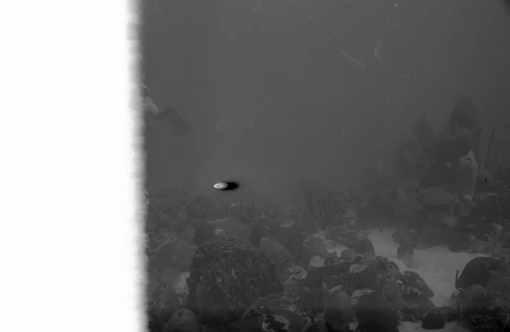{.lightbox group="discovery-bay-1966" description="**UUID: **ea1ca036-5714-48a2-a5bf-6576647ece58 **Date: **1967-05-03 **Location: **Jamaica | Discovery Bay | The Bull **Longitude: **77.38917ºW **Latitude: **18.46917ºN **Photographer: **Eileen Graham **Copyright: **Trustees of the Natural History Museum (London, UK), CC-BY-4.0" alt="**UUID: **ea1ca036-5714-48a2-a5bf-6576647ece58 **Date: **1967-05-03 **Location: **Jamaica | Discovery Bay | The Bull **Longitude: **77.38917ºW **Latitude: **18.46917ºN **Photographer: **Eileen Graham **Copyright: **Trustees of the Natural History Museum (London, UK), CC-BY-4.0"}

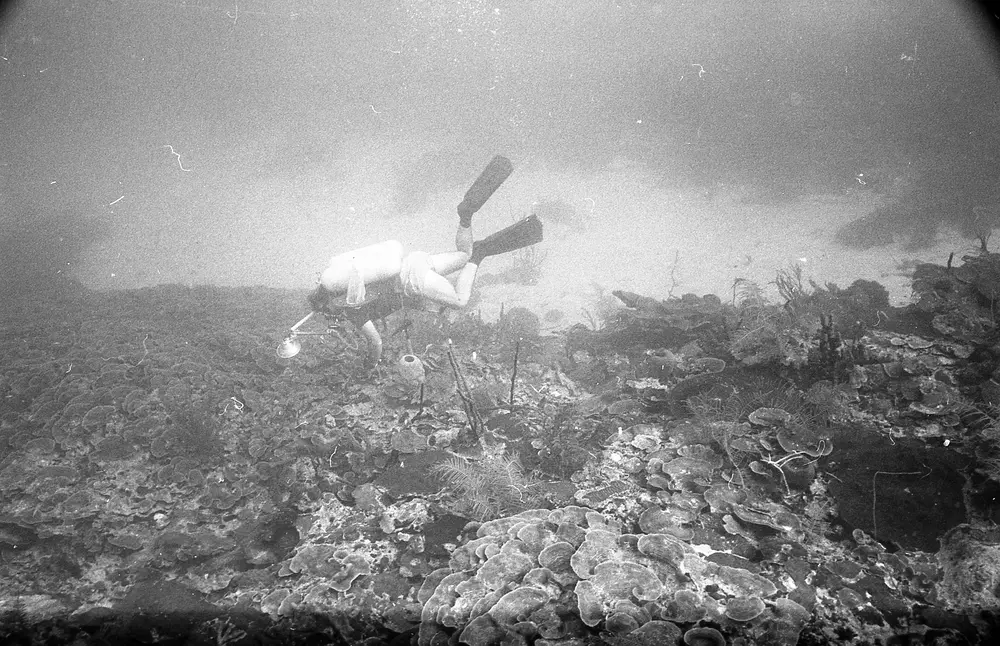{.lightbox group="discovery-bay-1966" description="**UUID: **bd4a1a15-9103-4af5-aaef-a9e55ca3fe12 **Date: **1967-05-03 **Location: **Jamaica | Discovery Bay | The Bull **Longitude: **77.38917ºW **Latitude: **18.46917ºN **Photographer: **Eileen Graham **Copyright: **Trustees of the Natural History Museum (London, UK), CC-BY-4.0" alt="**UUID: **bd4a1a15-9103-4af5-aaef-a9e55ca3fe12 **Date: **1967-05-03 **Location: **Jamaica | Discovery Bay | The Bull **Longitude: **77.38917ºW **Latitude: **18.46917ºN **Photographer: **Eileen Graham **Copyright: **Trustees of the Natural History Museum (London, UK), CC-BY-4.0"}

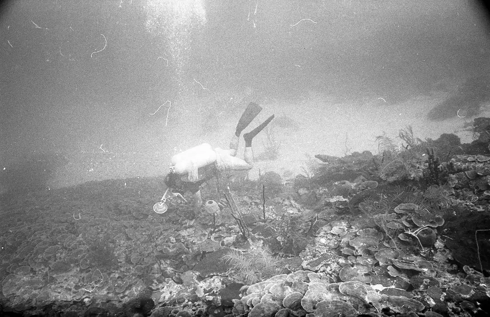{.lightbox group="discovery-bay-1966" description="**UUID: **0d9fe1f2-74ca-4062-8997-88e66e31d6f4 **Date: **1967-05-03 **Location: **Jamaica | Discovery Bay | The Bull **Longitude: **77.38917ºW **Latitude: **18.46917ºN **Photographer: **Eileen Graham **Copyright: **Trustees of the Natural History Museum (London, UK), CC-BY-4.0" alt="**UUID: **0d9fe1f2-74ca-4062-8997-88e66e31d6f4 **Date: **1967-05-03 **Location: **Jamaica | Discovery Bay | The Bull **Longitude: **77.38917ºW **Latitude: **18.46917ºN **Photographer: **Eileen Graham **Copyright: **Trustees of the Natural History Museum (London, UK), CC-BY-4.0"}

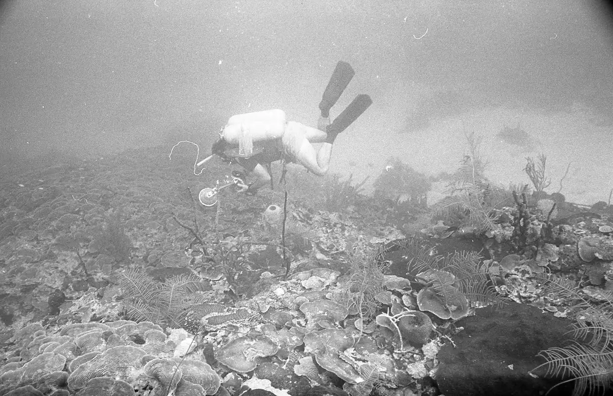{.lightbox group="discovery-bay-1966" description="**UUID: **adb14c71-1188-48ba-9efb-63dda124d580 **Date: **1967-05-03 **Location: **Jamaica | Discovery Bay | The Bull **Longitude: **77.38917ºW **Latitude: **18.46917ºN **Photographer: **Eileen Graham **Copyright: **Trustees of the Natural History Museum (London, UK), CC-BY-4.0" alt="**UUID: **adb14c71-1188-48ba-9efb-63dda124d580 **Date: **1967-05-03 **Location: **Jamaica | Discovery Bay | The Bull **Longitude: **77.38917ºW **Latitude: **18.46917ºN **Photographer: **Eileen Graham **Copyright: **Trustees of the Natural History Museum (London, UK), CC-BY-4.0"}

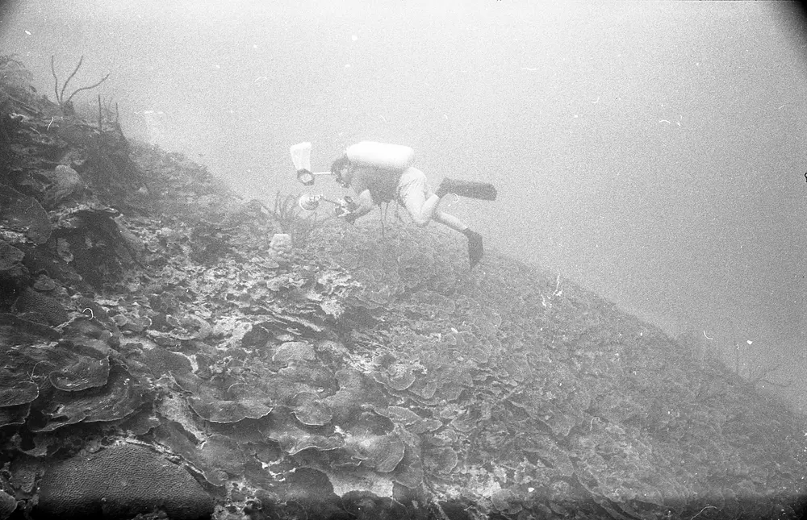{.lightbox group="discovery-bay-1966" description="**UUID: **8d266db4-492f-42d2-b07a-814cb254906e **Date: **1967-05-03 **Location: **Jamaica | Discovery Bay | The Bull **Longitude: **77.38917ºW **Latitude: **18.46917ºN **Photographer: **Eileen Graham **Copyright: **Trustees of the Natural History Museum (London, UK), CC-BY-4.0" alt="**UUID: **8d266db4-492f-42d2-b07a-814cb254906e **Date: **1967-05-03 **Location: **Jamaica | Discovery Bay | The Bull **Longitude: **77.38917ºW **Latitude: **18.46917ºN **Photographer: **Eileen Graham **Copyright: **Trustees of the Natural History Museum (London, UK), CC-BY-4.0"}

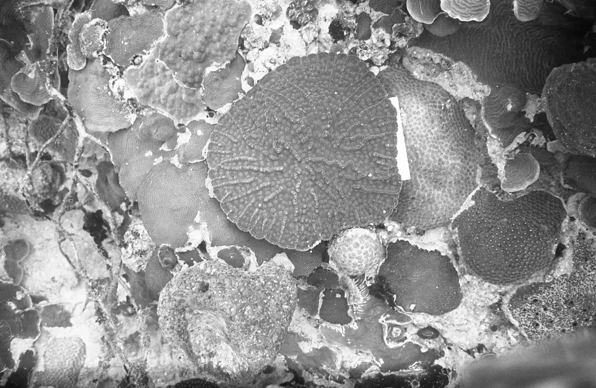{.lightbox group="discovery-bay-1966" description="**UUID: **a1cd29fa-b0ce-488f-aa10-b18eb0643b3a **Date: **1967-05-03 **Location: **Jamaica | Discovery Bay | The Bull **Longitude: **77.38917ºW **Latitude: **18.46917ºN **Photographer: **Eileen Graham **Copyright: **Trustees of the Natural History Museum (London, UK), CC-BY-4.0" alt="**UUID: **a1cd29fa-b0ce-488f-aa10-b18eb0643b3a **Date: **1967-05-03 **Location: **Jamaica | Discovery Bay | The Bull **Longitude: **77.38917ºW **Latitude: **18.46917ºN **Photographer: **Eileen Graham **Copyright: **Trustees of the Natural History Museum (London, UK), CC-BY-4.0"}

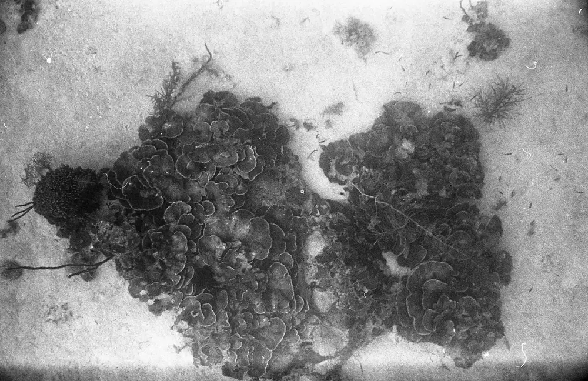{.lightbox group="discovery-bay-1966" description="**UUID: **ecb76f52-c2ef-4e37-92ec-f6ce0c6e7054 **Date: **1967-05-03 **Location: **Jamaica | Discovery Bay | The Bull **Longitude: **77.38917ºW **Latitude: **18.46917ºN **Photographer: **Eileen Graham **Copyright: **Trustees of the Natural History Museum (London, UK), CC-BY-4.0" alt="**UUID: **ecb76f52-c2ef-4e37-92ec-f6ce0c6e7054 **Date: **1967-05-03 **Location: **Jamaica | Discovery Bay | The Bull **Longitude: **77.38917ºW **Latitude: **18.46917ºN **Photographer: **Eileen Graham **Copyright: **Trustees of the Natural History Museum (London, UK), CC-BY-4.0"}

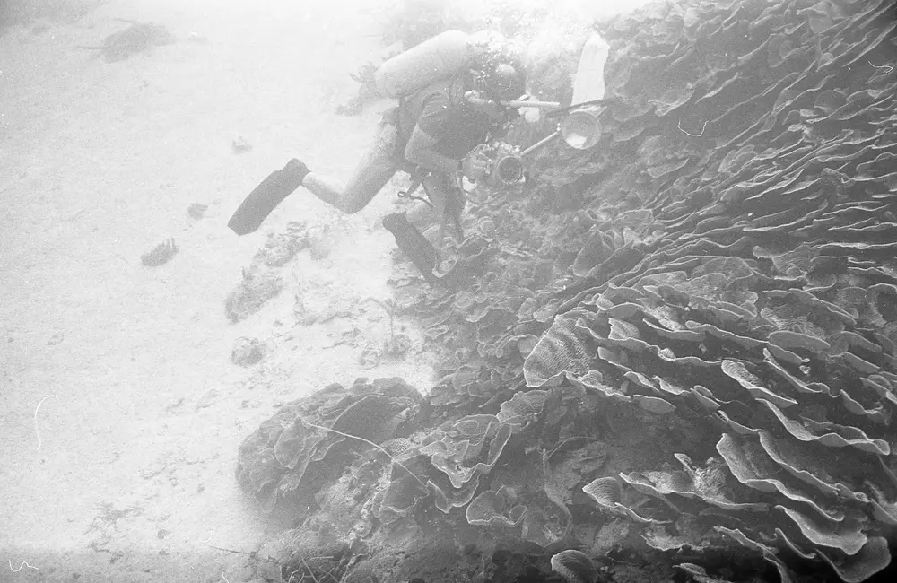{.lightbox group="discovery-bay-1966" description="**UUID: **fd32a066-08c2-4cac-9011-dbb082e0f37f **Date: **1967-05-03 **Location: **Jamaica | Discovery Bay | The Bull **Longitude: **77.38917ºW **Latitude: **18.46917ºN **Photographer: **Eileen Graham **Copyright: **Trustees of the Natural History Museum (London, UK), CC-BY-4.0" alt="**UUID: **fd32a066-08c2-4cac-9011-dbb082e0f37f **Date: **1967-05-03 **Location: **Jamaica | Discovery Bay | The Bull **Longitude: **77.38917ºW **Latitude: **18.46917ºN **Photographer: **Eileen Graham **Copyright: **Trustees of the Natural History Museum (London, UK), CC-BY-4.0"}

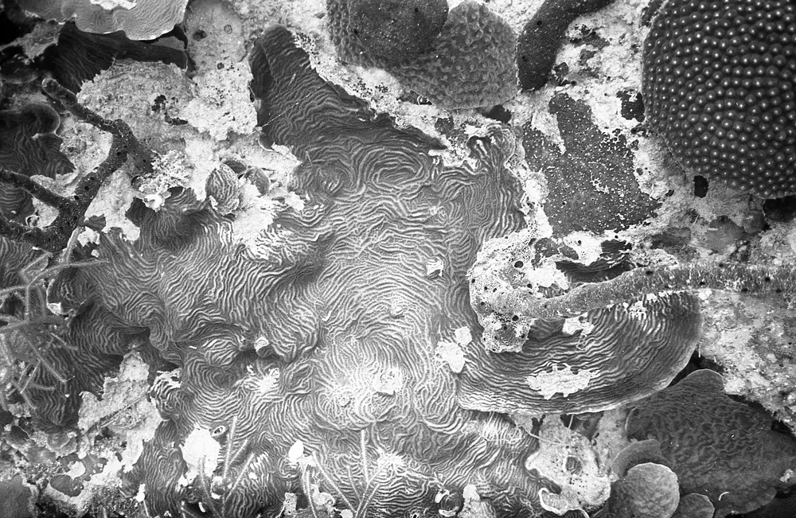{.lightbox group="discovery-bay-1966" description="**UUID: **63056ffe-9b7f-41bd-91b8-a46793408963 **Date: **1967-05-03 **Location: **Jamaica | Discovery Bay | The Bull **Longitude: **77.38917ºW **Latitude: **18.46917ºN **Photographer: **Eileen Graham **Copyright: **Trustees of the Natural History Museum (London, UK), CC-BY-4.0" alt="**UUID: **63056ffe-9b7f-41bd-91b8-a46793408963 **Date: **1967-05-03 **Location: **Jamaica | Discovery Bay | The Bull **Longitude: **77.38917ºW **Latitude: **18.46917ºN **Photographer: **Eileen Graham **Copyright: **Trustees of the Natural History Museum (London, UK), CC-BY-4.0"}

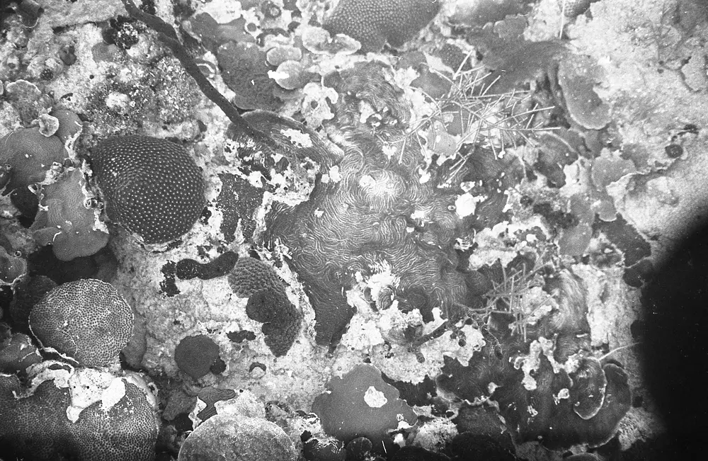{.lightbox group="discovery-bay-1966" description="**UUID: **314ec3dd-fcde-4162-8097-5d48394674d8 **Date: **1967-05-03 **Location: **Jamaica | Discovery Bay | The Bull **Longitude: **77.38917ºW **Latitude: **18.46917ºN **Photographer: **Eileen Graham **Copyright: **Trustees of the Natural History Museum (London, UK), CC-BY-4.0" alt="**UUID: **314ec3dd-fcde-4162-8097-5d48394674d8 **Date: **1967-05-03 **Location: **Jamaica | Discovery Bay | The Bull **Longitude: **77.38917ºW **Latitude: **18.46917ºN **Photographer: **Eileen Graham **Copyright: **Trustees of the Natural History Museum (London, UK), CC-BY-4.0"}

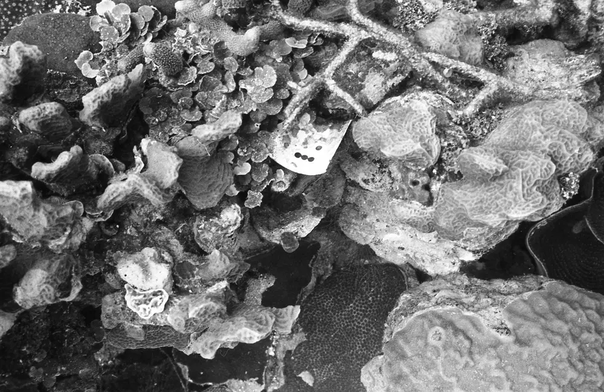{.lightbox group="discovery-bay-1966" description="**UUID: **9ac7606a-4c70-4477-ab61-dd81be380abb **Date: **1967-03-24 **Location: **Jamaica | Discovery Bay | Buoy Upper Slope **Longitude: **77.40908ºW **Latitude: **18.47322ºN **Photographer: **Eileen Graham **Copyright: **Trustees of the Natural History Museum (London, UK), CC-BY-4.0" alt="**UUID: **9ac7606a-4c70-4477-ab61-dd81be380abb **Date: **1967-03-24 **Location: **Jamaica | Discovery Bay | Buoy Upper Slope **Longitude: **77.40908ºW **Latitude: **18.47322ºN **Photographer: **Eileen Graham **Copyright: **Trustees of the Natural History Museum (London, UK), CC-BY-4.0"}

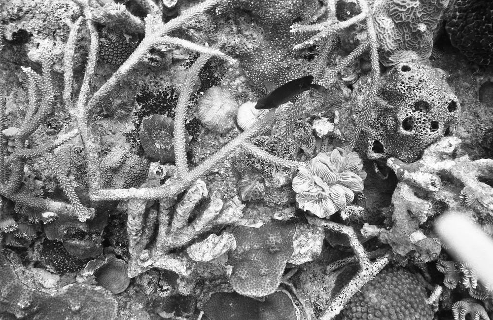{.lightbox group="discovery-bay-1966" description="**UUID: **23f739f2-3fda-4b0c-9546-f9001fca5fc5 **Date: **1967-03-24 **Location: **Jamaica | Discovery Bay | Buoy Upper Slope **Longitude: **77.40908ºW **Latitude: **18.47322ºN **Photographer: **Eileen Graham **Copyright: **Trustees of the Natural History Museum (London, UK), CC-BY-4.0" alt="**UUID: **23f739f2-3fda-4b0c-9546-f9001fca5fc5 **Date: **1967-03-24 **Location: **Jamaica | Discovery Bay | Buoy Upper Slope **Longitude: **77.40908ºW **Latitude: **18.47322ºN **Photographer: **Eileen Graham **Copyright: **Trustees of the Natural History Museum (London, UK), CC-BY-4.0"}

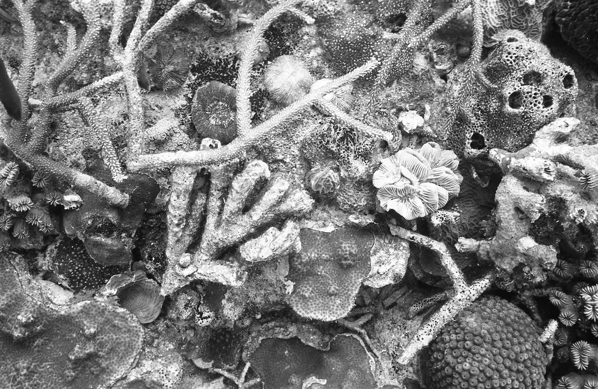{.lightbox group="discovery-bay-1966" description="**UUID: **3807ef9a-ac0e-4bd4-abd8-ecece9d8324e **Date: **1967-03-24 **Location: **Jamaica | Discovery Bay | Buoy Upper Slope **Longitude: **77.40908ºW **Latitude: **18.47322ºN **Photographer: **Eileen Graham **Copyright: **Trustees of the Natural History Museum (London, UK), CC-BY-4.0" alt="**UUID: **3807ef9a-ac0e-4bd4-abd8-ecece9d8324e **Date: **1967-03-24 **Location: **Jamaica | Discovery Bay | Buoy Upper Slope **Longitude: **77.40908ºW **Latitude: **18.47322ºN **Photographer: **Eileen Graham **Copyright: **Trustees of the Natural History Museum (London, UK), CC-BY-4.0"}

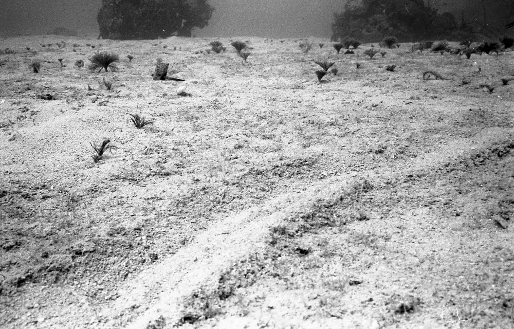{.lightbox group="discovery-bay-1966" description="**UUID: **20774363-faac-495e-bbf0-0d20236f93bf **Date: **1967-03-24 **Location: **Jamaica | Discovery Bay | Algal Plots **Longitude: **77.414ºW **Latitude: **18.473ºN **Photographer: **Eileen Graham **Copyright: **Trustees of the Natural History Museum (London, UK), CC-BY-4.0" alt="**UUID: **20774363-faac-495e-bbf0-0d20236f93bf **Date: **1967-03-24 **Location: **Jamaica | Discovery Bay | Algal Plots **Longitude: **77.414ºW **Latitude: **18.473ºN **Photographer: **Eileen Graham **Copyright: **Trustees of the Natural History Museum (London, UK), CC-BY-4.0"}

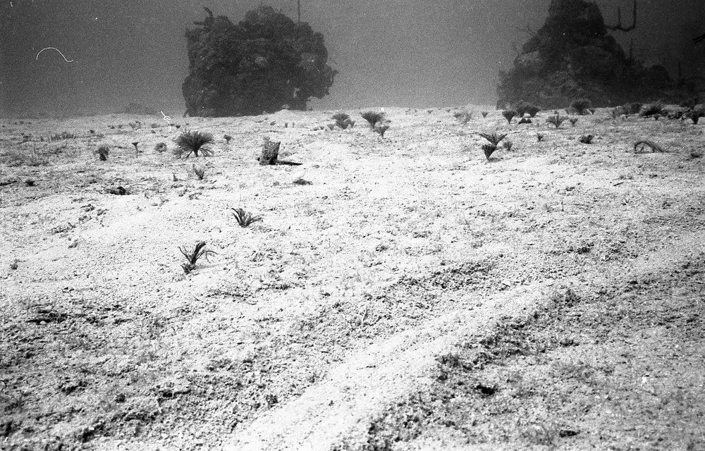{.lightbox group="discovery-bay-1966" description="**UUID: **326abf09-b51e-4d14-804a-2114bedacfc4 **Date: **1967-03-24 **Location: **Jamaica | Discovery Bay | Algal Plots **Longitude: **77.414ºW **Latitude: **18.473ºN **Photographer: **Eileen Graham **Copyright: **Trustees of the Natural History Museum (London, UK), CC-BY-4.0" alt="**UUID: **326abf09-b51e-4d14-804a-2114bedacfc4 **Date: **1967-03-24 **Location: **Jamaica | Discovery Bay | Algal Plots **Longitude: **77.414ºW **Latitude: **18.473ºN **Photographer: **Eileen Graham **Copyright: **Trustees of the Natural History Museum (London, UK), CC-BY-4.0"}

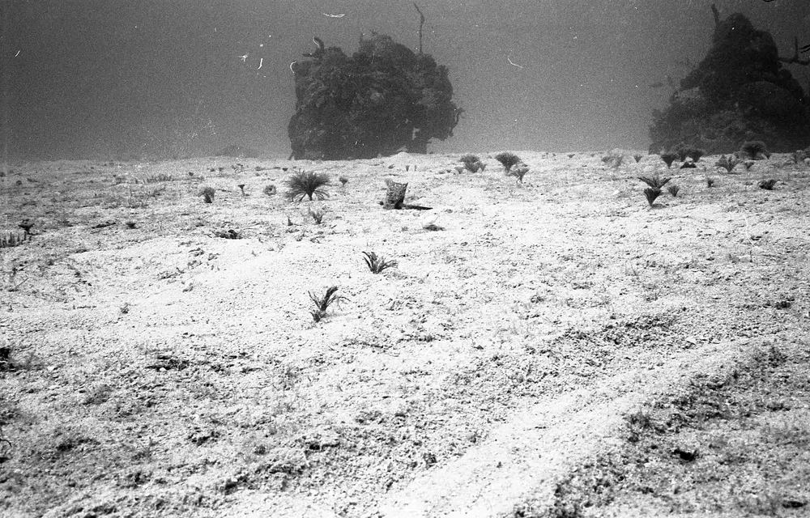{.lightbox group="discovery-bay-1966" description="**UUID: **4513b1d0-e0c2-4dd1-a944-97bf9a524bd6 **Date: **1967-03-24 **Location: **Jamaica | Discovery Bay | Algal Plots **Longitude: **77.414ºW **Latitude: **18.473ºN **Photographer: **Eileen Graham **Copyright: **Trustees of the Natural History Museum (London, UK), CC-BY-4.0" alt="**UUID: **4513b1d0-e0c2-4dd1-a944-97bf9a524bd6 **Date: **1967-03-24 **Location: **Jamaica | Discovery Bay | Algal Plots **Longitude: **77.414ºW **Latitude: **18.473ºN **Photographer: **Eileen Graham **Copyright: **Trustees of the Natural History Museum (London, UK), CC-BY-4.0"}

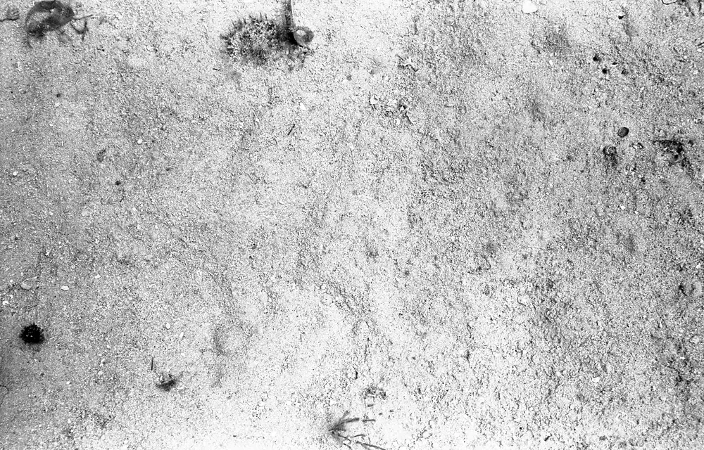{.lightbox group="discovery-bay-1966" description="**UUID: **b2c8ffb4-0b0e-4c2e-875e-b746c2a106a9 **Date: **1967-03-24 **Location: **Jamaica | Discovery Bay | Algal Plots **Longitude: **77.414ºW **Latitude: **18.473ºN **Photographer: **Eileen Graham **Copyright: **Trustees of the Natural History Museum (London, UK), CC-BY-4.0" alt="**UUID: **b2c8ffb4-0b0e-4c2e-875e-b746c2a106a9 **Date: **1967-03-24 **Location: **Jamaica | Discovery Bay | Algal Plots **Longitude: **77.414ºW **Latitude: **18.473ºN **Photographer: **Eileen Graham **Copyright: **Trustees of the Natural History Museum (London, UK), CC-BY-4.0"}

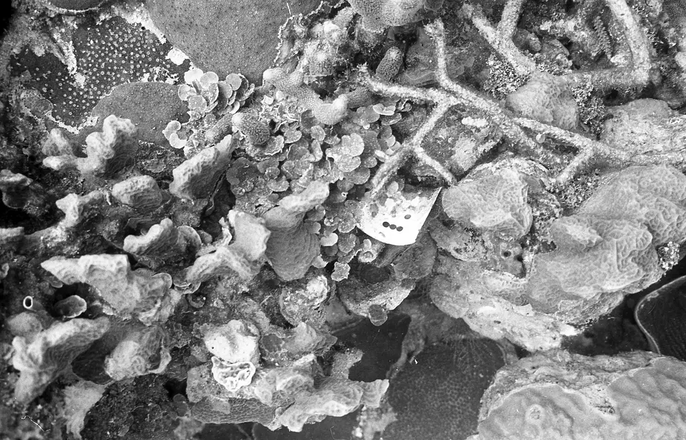{.lightbox group="discovery-bay-1966" description="**UUID: **20647e53-aa36-484e-863e-8000a4ed6e82 **Date: **1967-03-24 **Location: **Jamaica | Discovery Bay | Buoy Upper Slope **Longitude: **77.40908ºW **Latitude: **18.47322ºN **Photographer: **Eileen Graham **Copyright: **Trustees of the Natural History Museum (London, UK), CC-BY-4.0" alt="**UUID: **20647e53-aa36-484e-863e-8000a4ed6e82 **Date: **1967-03-24 **Location: **Jamaica | Discovery Bay | Buoy Upper Slope **Longitude: **77.40908ºW **Latitude: **18.47322ºN **Photographer: **Eileen Graham **Copyright: **Trustees of the Natural History Museum (London, UK), CC-BY-4.0"}

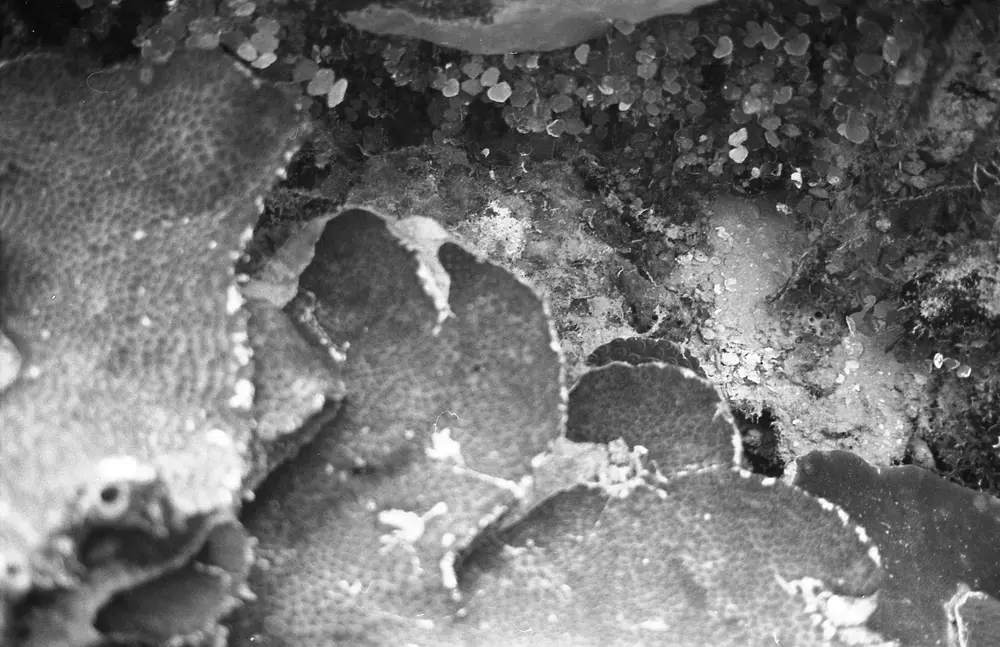{.lightbox group="discovery-bay-1966" description="**UUID: **3c22d374-36e5-4d56-aff8-b5cd658eea23 **Date: **1967-03-24 **Location: **Jamaica | Discovery Bay | Buoy Upper Slope **Longitude: **77.40908ºW **Latitude: **18.47322ºN **Photographer: **Eileen Graham **Copyright: **Trustees of the Natural History Museum (London, UK), CC-BY-4.0" alt="**UUID: **3c22d374-36e5-4d56-aff8-b5cd658eea23 **Date: **1967-03-24 **Location: **Jamaica | Discovery Bay | Buoy Upper Slope **Longitude: **77.40908ºW **Latitude: **18.47322ºN **Photographer: **Eileen Graham **Copyright: **Trustees of the Natural History Museum (London, UK), CC-BY-4.0"}

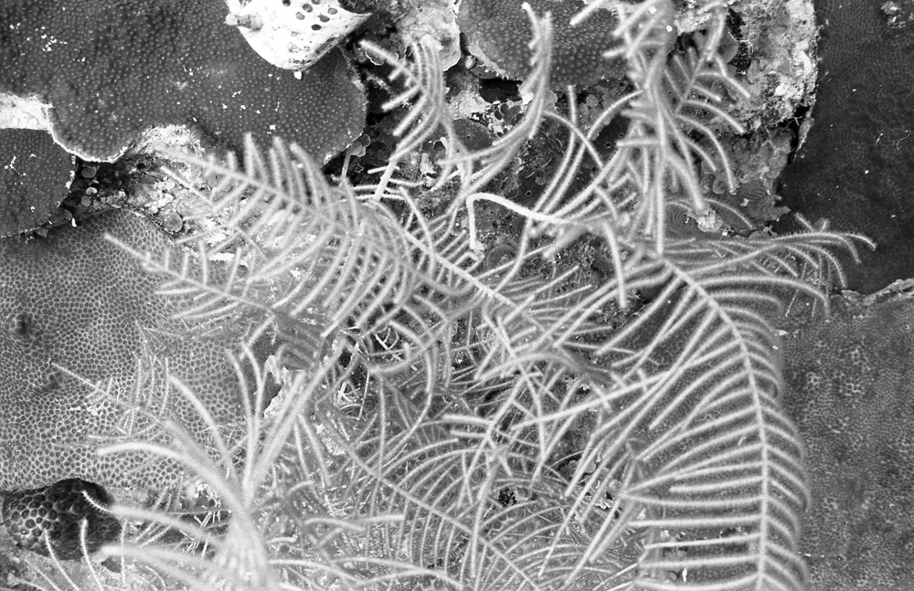{.lightbox group="discovery-bay-1966" description="**UUID: **77263b9c-5160-4df9-9a8f-d66dd35bb5a3 **Date: **1967-03-24 **Location: **Jamaica | Discovery Bay | Buoy Upper Slope **Longitude: **77.40908ºW **Latitude: **18.47322ºN **Photographer: **Eileen Graham **Copyright: **Trustees of the Natural History Museum (London, UK), CC-BY-4.0" alt="**UUID: **77263b9c-5160-4df9-9a8f-d66dd35bb5a3 **Date: **1967-03-24 **Location: **Jamaica | Discovery Bay | Buoy Upper Slope **Longitude: **77.40908ºW **Latitude: **18.47322ºN **Photographer: **Eileen Graham **Copyright: **Trustees of the Natural History Museum (London, UK), CC-BY-4.0"}

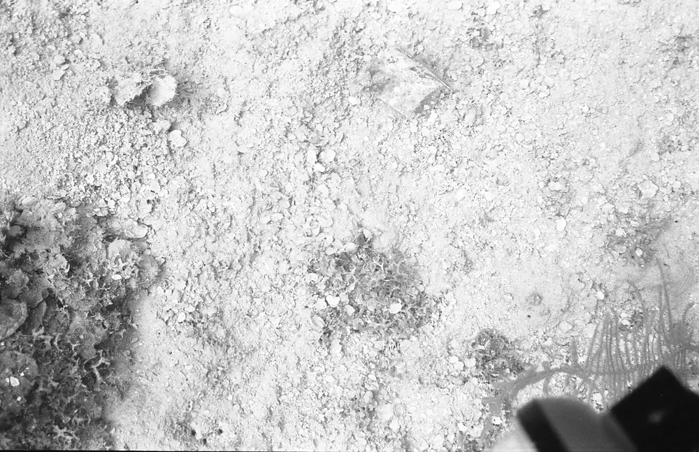{.lightbox group="discovery-bay-1966" description="**UUID: **464b0589-b556-4b5c-bc94-0e572ed853ae **Date: **1967-03-24 **Location: **Jamaica | Discovery Bay | Buoy Upper Slope **Longitude: **77.40908ºW **Latitude: **18.47322ºN **Photographer: **Eileen Graham **Copyright: **Trustees of the Natural History Museum (London, UK), CC-BY-4.0" alt="**UUID: **464b0589-b556-4b5c-bc94-0e572ed853ae **Date: **1967-03-24 **Location: **Jamaica | Discovery Bay | Buoy Upper Slope **Longitude: **77.40908ºW **Latitude: **18.47322ºN **Photographer: **Eileen Graham **Copyright: **Trustees of the Natural History Museum (London, UK), CC-BY-4.0"}

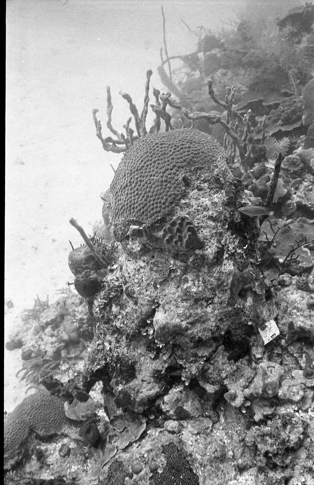{.lightbox group="discovery-bay-1966" description="**UUID: **4ab07860-eff6-42a2-b7db-c9ca2690803a **Date: **1967-03-24 **Location: **Jamaica | Discovery Bay | Buoy Upper Slope **Longitude: **77.40908ºW **Latitude: **18.47322ºN **Photographer: **Eileen Graham **Copyright: **Trustees of the Natural History Museum (London, UK), CC-BY-4.0" alt="**UUID: **4ab07860-eff6-42a2-b7db-c9ca2690803a **Date: **1967-03-24 **Location: **Jamaica | Discovery Bay | Buoy Upper Slope **Longitude: **77.40908ºW **Latitude: **18.47322ºN **Photographer: **Eileen Graham **Copyright: **Trustees of the Natural History Museum (London, UK), CC-BY-4.0"}

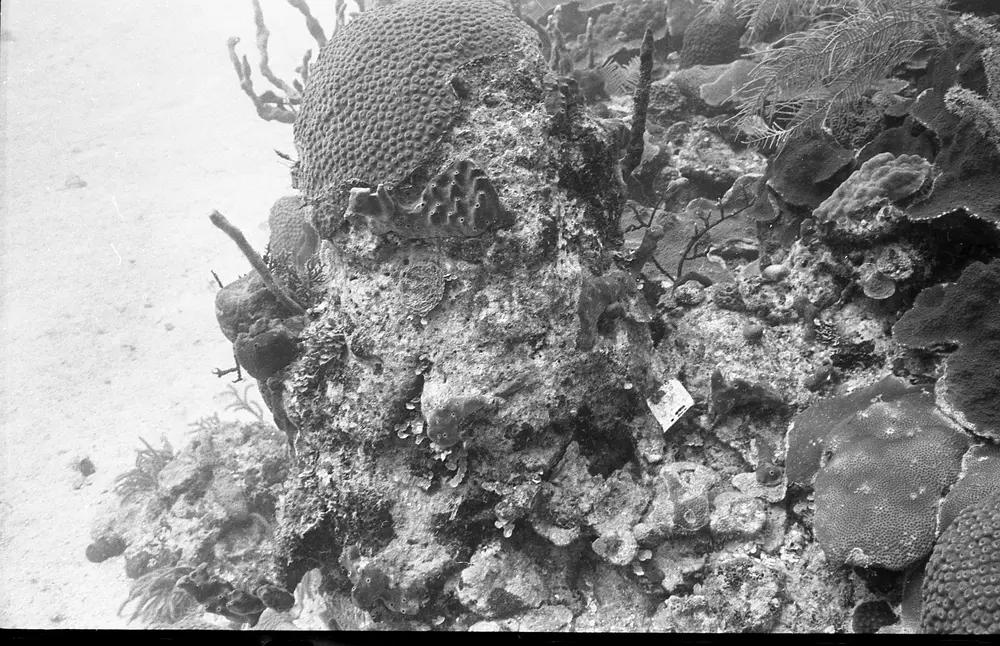{.lightbox group="discovery-bay-1966" description="**UUID: **6d68ef36-8181-4521-a97e-adcb9e3610b2 **Date: **1967-03-24 **Location: **Jamaica | Discovery Bay | Buoy Upper Slope **Longitude: **77.40908ºW **Latitude: **18.47322ºN **Photographer: **Eileen Graham **Copyright: **Trustees of the Natural History Museum (London, UK), CC-BY-4.0" alt="**UUID: **6d68ef36-8181-4521-a97e-adcb9e3610b2 **Date: **1967-03-24 **Location: **Jamaica | Discovery Bay | Buoy Upper Slope **Longitude: **77.40908ºW **Latitude: **18.47322ºN **Photographer: **Eileen Graham **Copyright: **Trustees of the Natural History Museum (London, UK), CC-BY-4.0"}

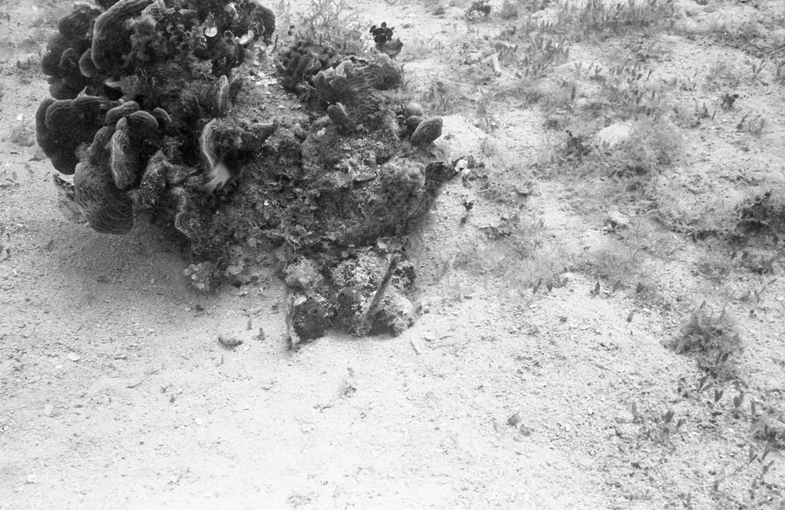{.lightbox group="discovery-bay-1966" description="**UUID: **85da2ce4-35da-4ee0-8e80-9a9cbf41b56c **Date: **1967-03-24 **Location: **Jamaica | Discovery Bay | Algal Plots **Longitude: **77.414ºW **Latitude: **18.473ºN **Photographer: **Eileen Graham **Copyright: **Trustees of the Natural History Museum (London, UK), CC-BY-4.0" alt="**UUID: **85da2ce4-35da-4ee0-8e80-9a9cbf41b56c **Date: **1967-03-24 **Location: **Jamaica | Discovery Bay | Algal Plots **Longitude: **77.414ºW **Latitude: **18.473ºN **Photographer: **Eileen Graham **Copyright: **Trustees of the Natural History Museum (London, UK), CC-BY-4.0"}

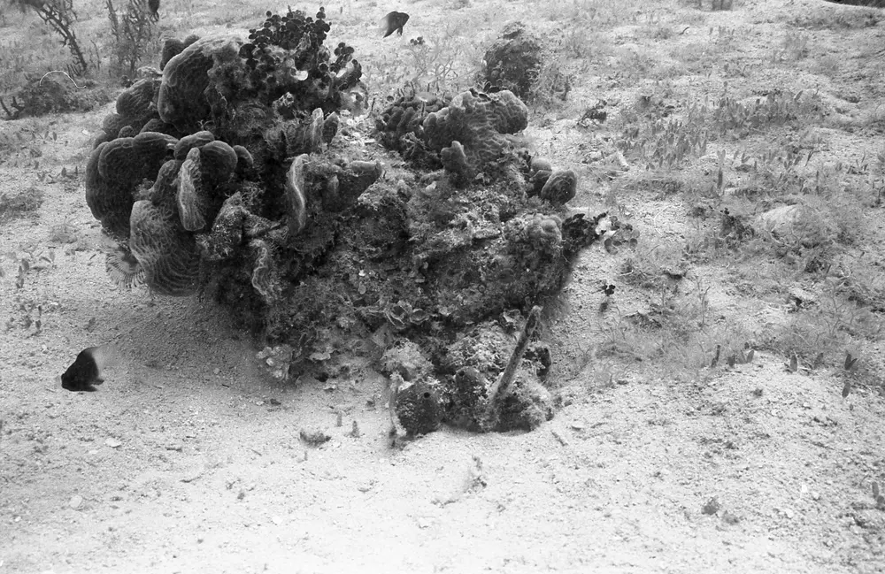{.lightbox group="discovery-bay-1966" description="**UUID: **e4b2837b-b831-4e70-9421-0abc9c2d9ad7 **Date: **1967-03-24 **Location: **Jamaica | Discovery Bay | Algal Plots **Longitude: **77.414ºW **Latitude: **18.473ºN **Photographer: **Eileen Graham **Copyright: **Trustees of the Natural History Museum (London, UK), CC-BY-4.0" alt="**UUID: **e4b2837b-b831-4e70-9421-0abc9c2d9ad7 **Date: **1967-03-24 **Location: **Jamaica | Discovery Bay | Algal Plots **Longitude: **77.414ºW **Latitude: **18.473ºN **Photographer: **Eileen Graham **Copyright: **Trustees of the Natural History Museum (London, UK), CC-BY-4.0"}

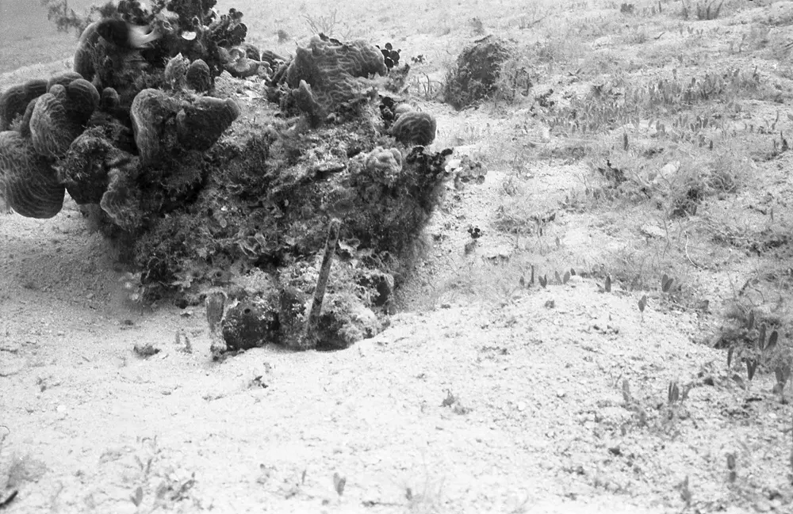{.lightbox group="discovery-bay-1966" description="**UUID: **5c4160a0-578d-4616-b8fd-4534a965f159 **Date: **1967-03-24 **Location: **Jamaica | Discovery Bay | Algal Plots **Longitude: **77.414ºW **Latitude: **18.473ºN **Photographer: **Eileen Graham **Copyright: **Trustees of the Natural History Museum (London, UK), CC-BY-4.0" alt="**UUID: **5c4160a0-578d-4616-b8fd-4534a965f159 **Date: **1967-03-24 **Location: **Jamaica | Discovery Bay | Algal Plots **Longitude: **77.414ºW **Latitude: **18.473ºN **Photographer: **Eileen Graham **Copyright: **Trustees of the Natural History Museum (London, UK), CC-BY-4.0"}

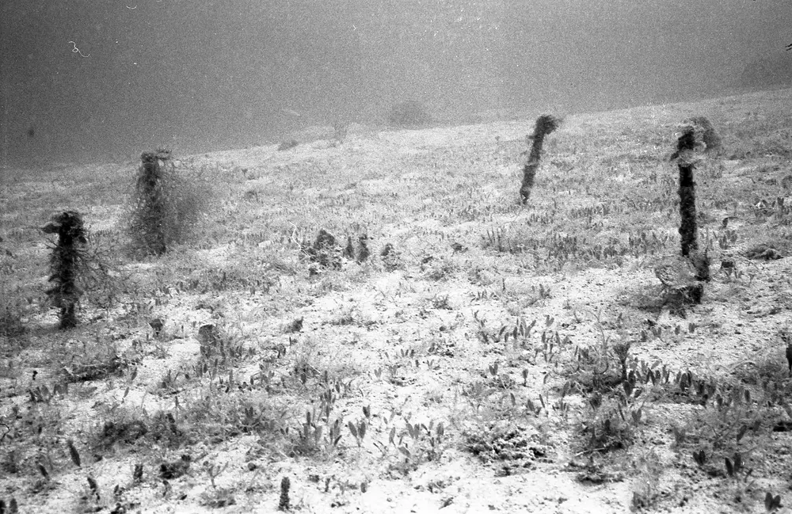{.lightbox group="discovery-bay-1966" description="**UUID: **e6d93aad-06f6-408c-8e7a-9b70cd397a3b **Date: **1967-03-24 **Location: **Jamaica | Discovery Bay | Algal Plots **Longitude: **77.414ºW **Latitude: **18.473ºN **Photographer: **Eileen Graham **Copyright: **Trustees of the Natural History Museum (London, UK), CC-BY-4.0" alt="**UUID: **e6d93aad-06f6-408c-8e7a-9b70cd397a3b **Date: **1967-03-24 **Location: **Jamaica | Discovery Bay | Algal Plots **Longitude: **77.414ºW **Latitude: **18.473ºN **Photographer: **Eileen Graham **Copyright: **Trustees of the Natural History Museum (London, UK), CC-BY-4.0"}

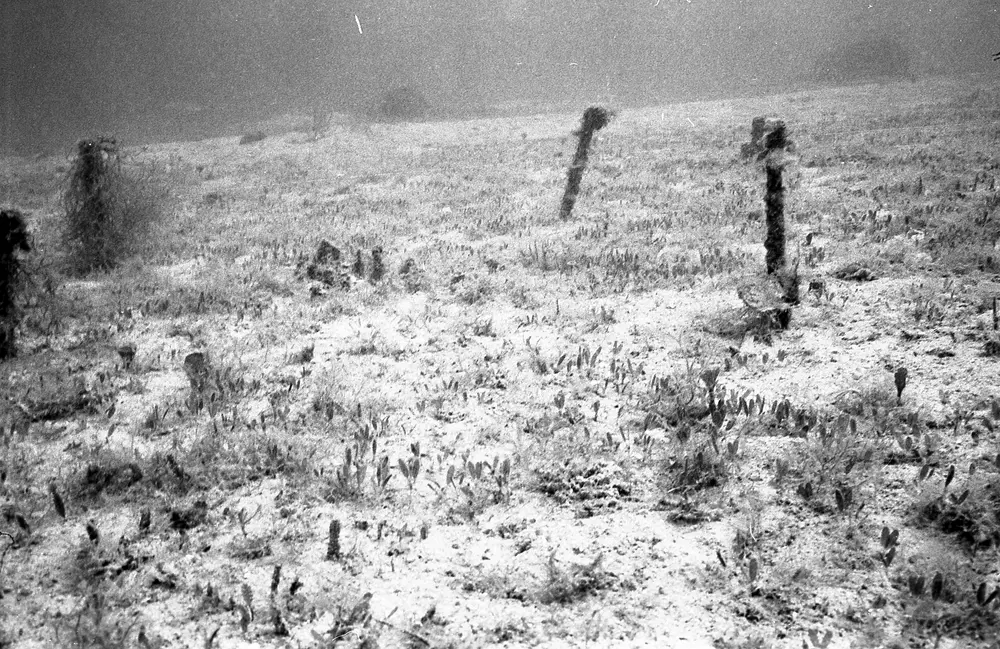{.lightbox group="discovery-bay-1966" description="**UUID: **a9b0f632-96e1-4e0b-8914-9abb92f8e2d0 **Date: **1967-03-24 **Location: **Jamaica | Discovery Bay | Algal Plots **Longitude: **77.414ºW **Latitude: **18.473ºN **Photographer: **Eileen Graham **Copyright: **Trustees of the Natural History Museum (London, UK), CC-BY-4.0" alt="**UUID: **a9b0f632-96e1-4e0b-8914-9abb92f8e2d0 **Date: **1967-03-24 **Location: **Jamaica | Discovery Bay | Algal Plots **Longitude: **77.414ºW **Latitude: **18.473ºN **Photographer: **Eileen Graham **Copyright: **Trustees of the Natural History Museum (London, UK), CC-BY-4.0"}

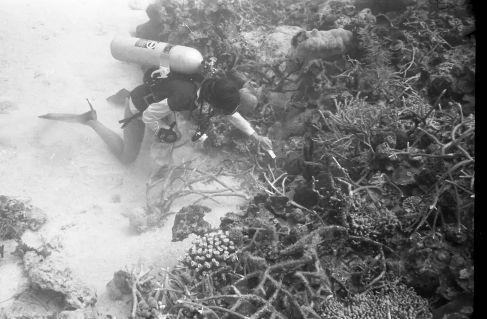{.lightbox group="discovery-bay-1966" description="**UUID: **45b6e38c-debc-4f72-a954-e625f0c30213 **Date: **1967-03-24 **Location: **Jamaica | Discovery Bay | Upper Buoy Terrace **Longitude: **77.40908ºW **Latitude: **18.47322ºN **Photographer: **Eileen Graham **Copyright: **Trustees of the Natural History Museum (London, UK), CC-BY-4.0" alt="**UUID: **45b6e38c-debc-4f72-a954-e625f0c30213 **Date: **1967-03-24 **Location: **Jamaica | Discovery Bay | Upper Buoy Terrace **Longitude: **77.40908ºW **Latitude: **18.47322ºN **Photographer: **Eileen Graham **Copyright: **Trustees of the Natural History Museum (London, UK), CC-BY-4.0"}

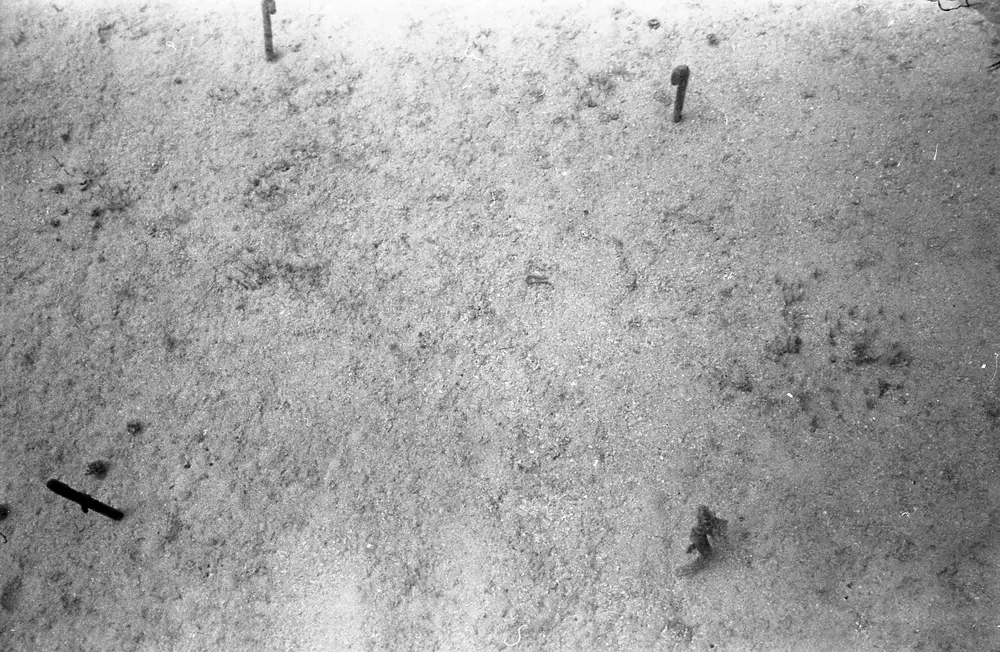{.lightbox group="discovery-bay-1966" description="**UUID: **b43694ae-2ff9-4658-b8c0-109458ec614a **Date: **1967-03-24 **Location: **Jamaica | Discovery Bay | Algal Plots **Longitude: **77.414ºW **Latitude: **18.473ºN **Photographer: **Eileen Graham **Copyright: **Trustees of the Natural History Museum (London, UK), CC-BY-4.0" alt="**UUID: **b43694ae-2ff9-4658-b8c0-109458ec614a **Date: **1967-03-24 **Location: **Jamaica | Discovery Bay | Algal Plots **Longitude: **77.414ºW **Latitude: **18.473ºN **Photographer: **Eileen Graham **Copyright: **Trustees of the Natural History Museum (London, UK), CC-BY-4.0"}

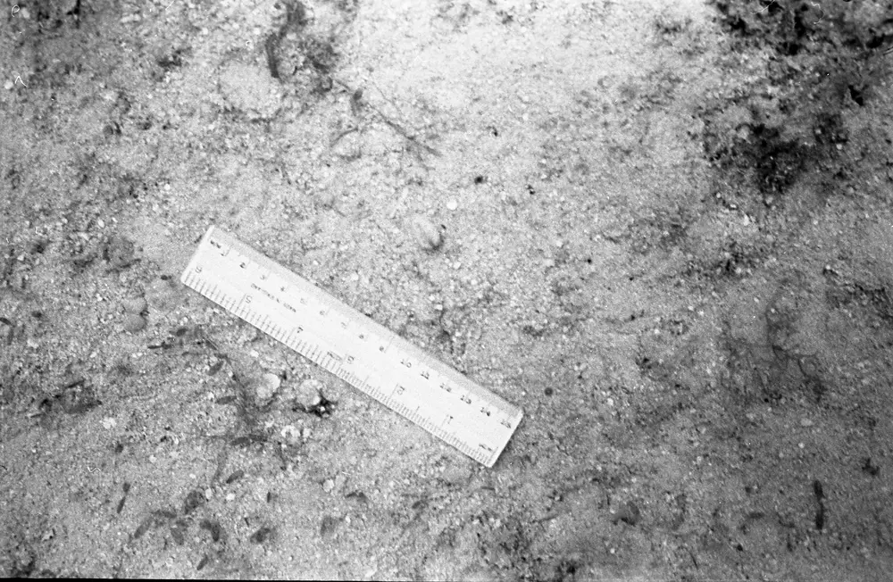{.lightbox group="discovery-bay-1966" description="**UUID: **aff5f7d7-7bc2-4f79-8c35-4ea674bf694f **Date: **1967-03-24 **Location: **Jamaica | Discovery Bay | Algal Plots **Longitude: **77.414ºW **Latitude: **18.473ºN **Photographer: **Eileen Graham **Copyright: **Trustees of the Natural History Museum (London, UK), CC-BY-4.0" alt="**UUID: **aff5f7d7-7bc2-4f79-8c35-4ea674bf694f **Date: **1967-03-24 **Location: **Jamaica | Discovery Bay | Algal Plots **Longitude: **77.414ºW **Latitude: **18.473ºN **Photographer: **Eileen Graham **Copyright: **Trustees of the Natural History Museum (London, UK), CC-BY-4.0"}

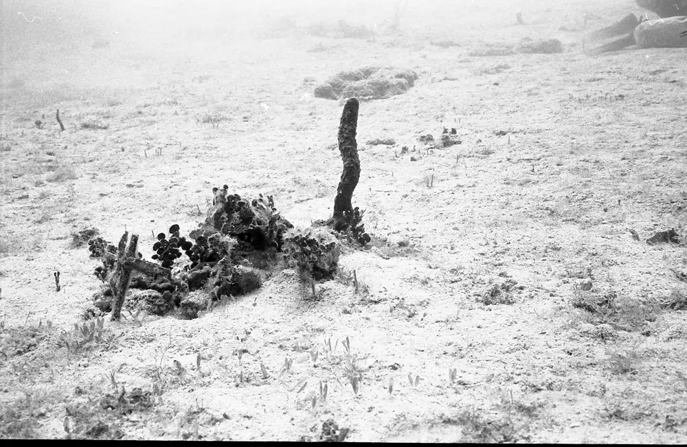{.lightbox group="discovery-bay-1966" description="**UUID: **ead249ee-f208-4c1c-b231-eb88d845e422 **Date: **1967-03-24 **Location: **Jamaica | Discovery Bay | Algal Plots **Longitude: **77.414ºW **Latitude: **18.473ºN **Photographer: **Eileen Graham **Copyright: **Trustees of the Natural History Museum (London, UK), CC-BY-4.0" alt="**UUID: **ead249ee-f208-4c1c-b231-eb88d845e422 **Date: **1967-03-24 **Location: **Jamaica | Discovery Bay | Algal Plots **Longitude: **77.414ºW **Latitude: **18.473ºN **Photographer: **Eileen Graham **Copyright: **Trustees of the Natural History Museum (London, UK), CC-BY-4.0"}

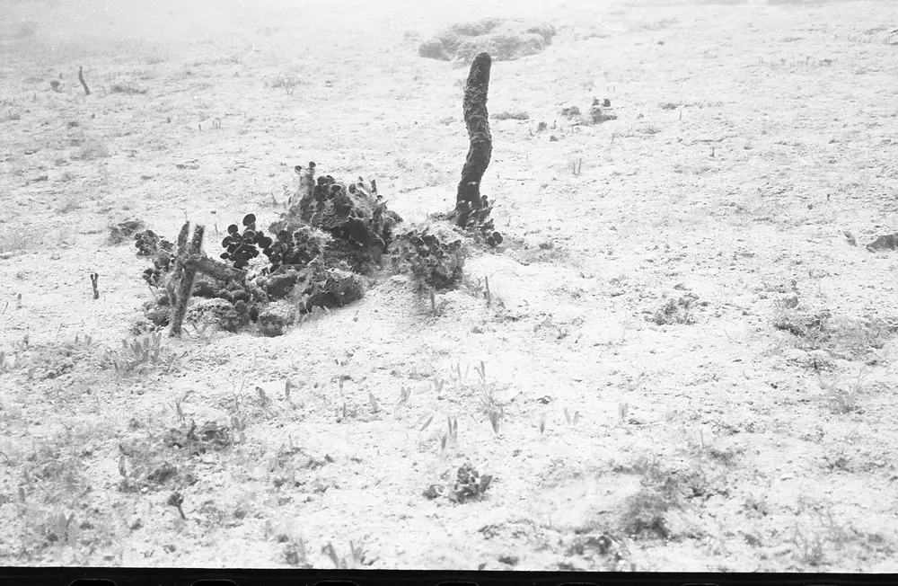{.lightbox group="discovery-bay-1966" description="**UUID: **7edae104-ddc5-4e7f-be2a-c5bfcde4b6e2 **Date: **1967-03-24 **Location: **Jamaica | Discovery Bay | Algal Plots **Longitude: **77.414ºW **Latitude: **18.473ºN **Photographer: **Eileen Graham **Copyright: **Trustees of the Natural History Museum (London, UK), CC-BY-4.0" alt="**UUID: **7edae104-ddc5-4e7f-be2a-c5bfcde4b6e2 **Date: **1967-03-24 **Location: **Jamaica | Discovery Bay | Algal Plots **Longitude: **77.414ºW **Latitude: **18.473ºN **Photographer: **Eileen Graham **Copyright: **Trustees of the Natural History Museum (London, UK), CC-BY-4.0"}

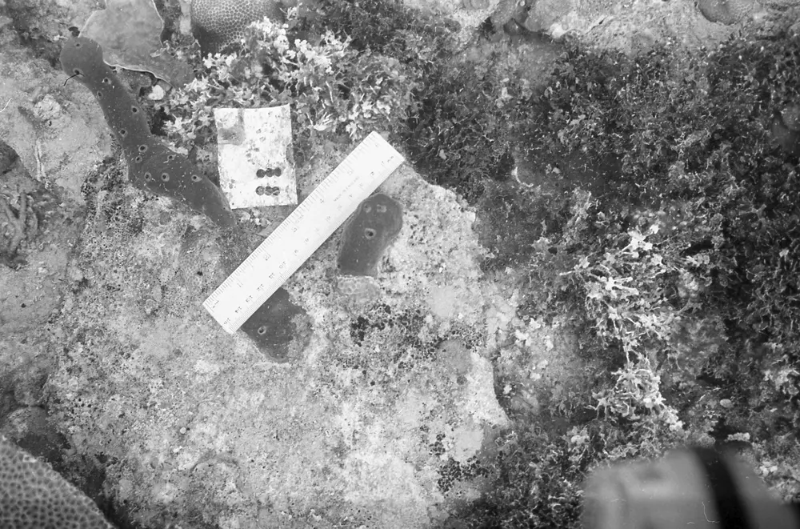{.lightbox group="discovery-bay-1966" description="**UUID: **69d9480b-c8cd-4186-920a-7dbd9295a54e **Date: **1967-04-16 **Location: **Jamaica | Discovery Bay | Buoy Upper Slope **Longitude: **77.40908ºW **Latitude: **18.47322ºN **Photographer: **Eileen Graham **Copyright: **Trustees of the Natural History Museum (London, UK), CC-BY-4.0" alt="**UUID: **69d9480b-c8cd-4186-920a-7dbd9295a54e **Date: **1967-04-16 **Location: **Jamaica | Discovery Bay | Buoy Upper Slope **Longitude: **77.40908ºW **Latitude: **18.47322ºN **Photographer: **Eileen Graham **Copyright: **Trustees of the Natural History Museum (London, UK), CC-BY-4.0"}

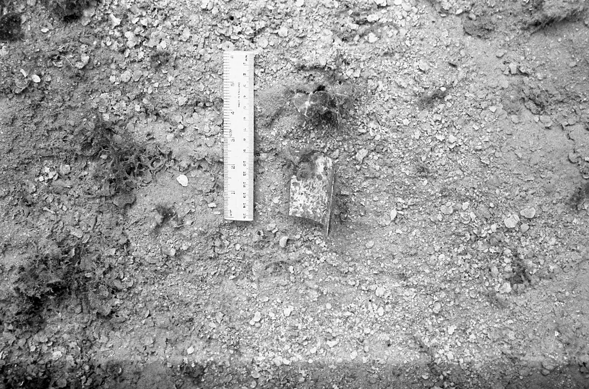{.lightbox group="discovery-bay-1966" description="**UUID: **c8a6afe1-f618-4111-8374-39e884cb4dec **Date: **1967-04-16 **Location: **Jamaica | Discovery Bay | Buoy Upper Slope **Longitude: **77.40908ºW **Latitude: **18.47322ºN **Photographer: **Eileen Graham **Copyright: **Trustees of the Natural History Museum (London, UK), CC-BY-4.0" alt="**UUID: **c8a6afe1-f618-4111-8374-39e884cb4dec **Date: **1967-04-16 **Location: **Jamaica | Discovery Bay | Buoy Upper Slope **Longitude: **77.40908ºW **Latitude: **18.47322ºN **Photographer: **Eileen Graham **Copyright: **Trustees of the Natural History Museum (London, UK), CC-BY-4.0"}

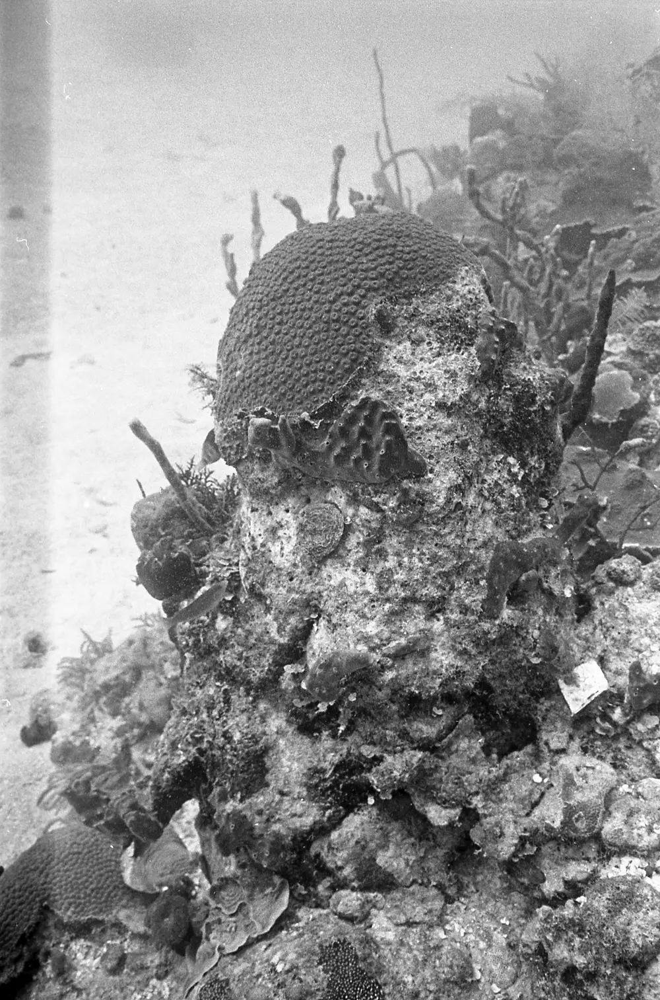{.lightbox group="discovery-bay-1966" description="**UUID: **5b25abe9-4205-4b81-a70a-a8c9040a5d12 **Date: **1967-04-16 **Location: **Jamaica | Discovery Bay | Buoy Upper Slope **Longitude: **77.40908ºW **Latitude: **18.47322ºN **Photographer: **Eileen Graham **Copyright: **Trustees of the Natural History Museum (London, UK), CC-BY-4.0" alt="**UUID: **5b25abe9-4205-4b81-a70a-a8c9040a5d12 **Date: **1967-04-16 **Location: **Jamaica | Discovery Bay | Buoy Upper Slope **Longitude: **77.40908ºW **Latitude: **18.47322ºN **Photographer: **Eileen Graham **Copyright: **Trustees of the Natural History Museum (London, UK), CC-BY-4.0"}

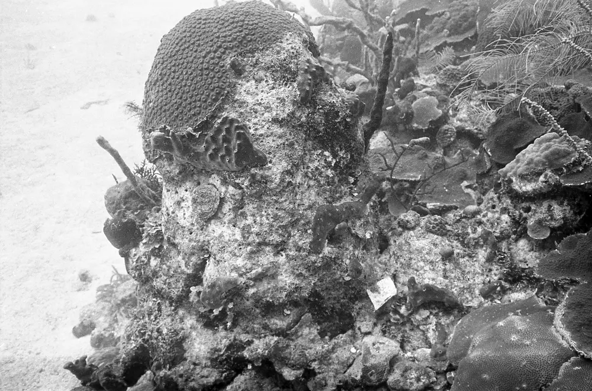{.lightbox group="discovery-bay-1966" description="**UUID: **e588197a-1d11-4643-94bf-c055d2ffead8 **Date: **1967-04-16 **Location: **Jamaica | Discovery Bay | Buoy Upper Slope **Longitude: **77.40908ºW **Latitude: **18.47322ºN **Photographer: **Eileen Graham **Copyright: **Trustees of the Natural History Museum (London, UK), CC-BY-4.0" alt="**UUID: **e588197a-1d11-4643-94bf-c055d2ffead8 **Date: **1967-04-16 **Location: **Jamaica | Discovery Bay | Buoy Upper Slope **Longitude: **77.40908ºW **Latitude: **18.47322ºN **Photographer: **Eileen Graham **Copyright: **Trustees of the Natural History Museum (London, UK), CC-BY-4.0"}

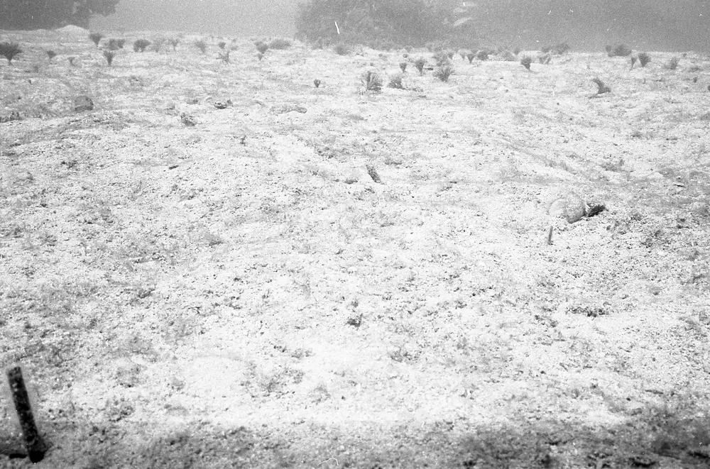{.lightbox group="discovery-bay-1966" description="**UUID: **5be94f7d-1b9b-4dad-940b-8a7c9abc821d **Date: **1967-04-16 **Location: **Jamaica | Discovery Bay | Algal Plots **Longitude: **77.414ºW **Latitude: **18.473ºN **Photographer: **Eileen Graham **Copyright: **Trustees of the Natural History Museum (London, UK), CC-BY-4.0" alt="**UUID: **5be94f7d-1b9b-4dad-940b-8a7c9abc821d **Date: **1967-04-16 **Location: **Jamaica | Discovery Bay | Algal Plots **Longitude: **77.414ºW **Latitude: **18.473ºN **Photographer: **Eileen Graham **Copyright: **Trustees of the Natural History Museum (London, UK), CC-BY-4.0"}

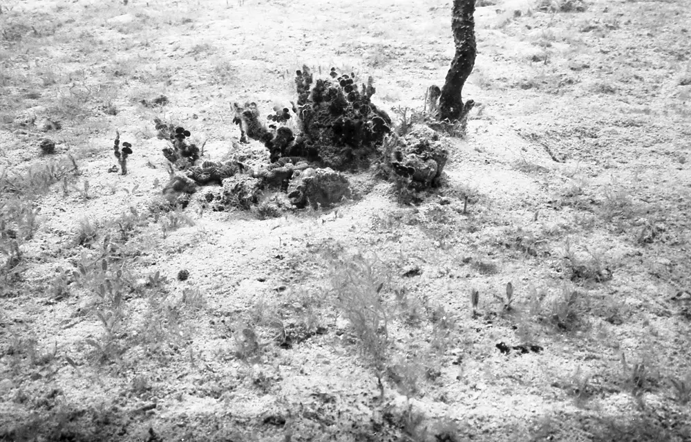{.lightbox group="discovery-bay-1966" description="**UUID: **19852fc6-e4e8-487a-9ad1-6747e549c2f8 **Date: **1967-04-16 **Location: **Jamaica | Discovery Bay | Algal Plots **Longitude: **77.414ºW **Latitude: **18.473ºN **Photographer: **Eileen Graham **Copyright: **Trustees of the Natural History Museum (London, UK), CC-BY-4.0" alt="**UUID: **19852fc6-e4e8-487a-9ad1-6747e549c2f8 **Date: **1967-04-16 **Location: **Jamaica | Discovery Bay | Algal Plots **Longitude: **77.414ºW **Latitude: **18.473ºN **Photographer: **Eileen Graham **Copyright: **Trustees of the Natural History Museum (London, UK), CC-BY-4.0"}

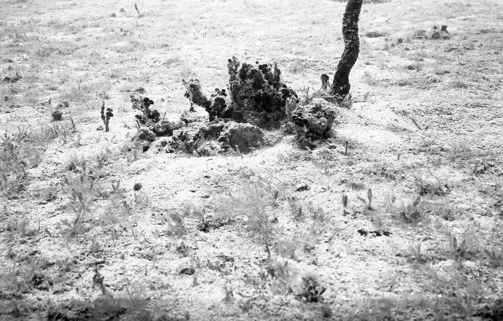{.lightbox group="discovery-bay-1966" description="**UUID: **6819ad9b-2197-4117-ae95-3cd648630677 **Date: **1967-04-16 **Location: **Jamaica | Discovery Bay | Algal Plots **Longitude: **77.414ºW **Latitude: **18.473ºN **Photographer: **Eileen Graham **Copyright: **Trustees of the Natural History Museum (London, UK), CC-BY-4.0" alt="**UUID: **6819ad9b-2197-4117-ae95-3cd648630677 **Date: **1967-04-16 **Location: **Jamaica | Discovery Bay | Algal Plots **Longitude: **77.414ºW **Latitude: **18.473ºN **Photographer: **Eileen Graham **Copyright: **Trustees of the Natural History Museum (London, UK), CC-BY-4.0"}

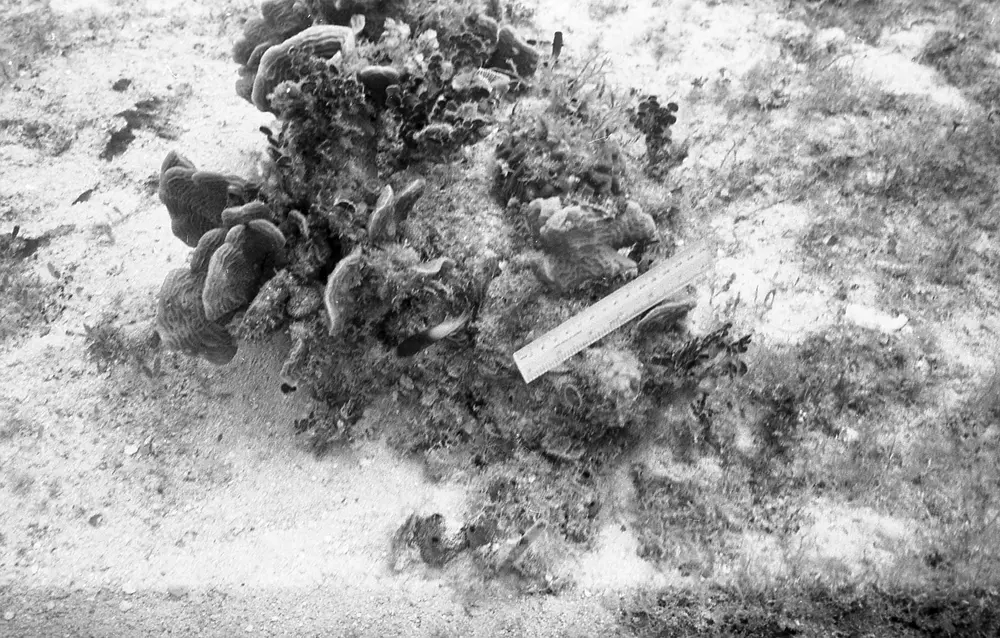{.lightbox group="discovery-bay-1966" description="**UUID: **9a8189e1-7fa6-4648-ab6f-7860fcf81ea7 **Date: **1967-04-16 **Location: **Jamaica | Discovery Bay | Algal Plots **Longitude: **77.414ºW **Latitude: **18.473ºN **Photographer: **Eileen Graham **Copyright: **Trustees of the Natural History Museum (London, UK), CC-BY-4.0" alt="**UUID: **9a8189e1-7fa6-4648-ab6f-7860fcf81ea7 **Date: **1967-04-16 **Location: **Jamaica | Discovery Bay | Algal Plots **Longitude: **77.414ºW **Latitude: **18.473ºN **Photographer: **Eileen Graham **Copyright: **Trustees of the Natural History Museum (London, UK), CC-BY-4.0"}

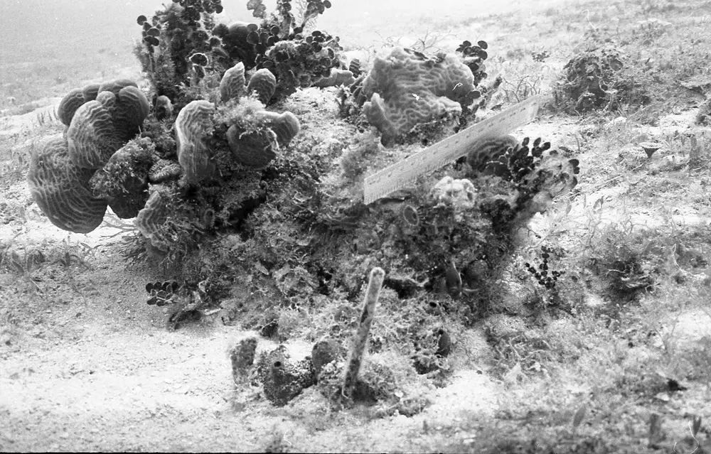{.lightbox group="discovery-bay-1966" description="**UUID: **90d93ab7-cc59-4cdc-b0e7-4cdb7b9df675 **Date: **1967-04-16 **Location: **Jamaica | Discovery Bay | Algal Plots **Longitude: **77.414ºW **Latitude: **18.473ºN **Photographer: **Eileen Graham **Copyright: **Trustees of the Natural History Museum (London, UK), CC-BY-4.0" alt="**UUID: **90d93ab7-cc59-4cdc-b0e7-4cdb7b9df675 **Date: **1967-04-16 **Location: **Jamaica | Discovery Bay | Algal Plots **Longitude: **77.414ºW **Latitude: **18.473ºN **Photographer: **Eileen Graham **Copyright: **Trustees of the Natural History Museum (London, UK), CC-BY-4.0"}

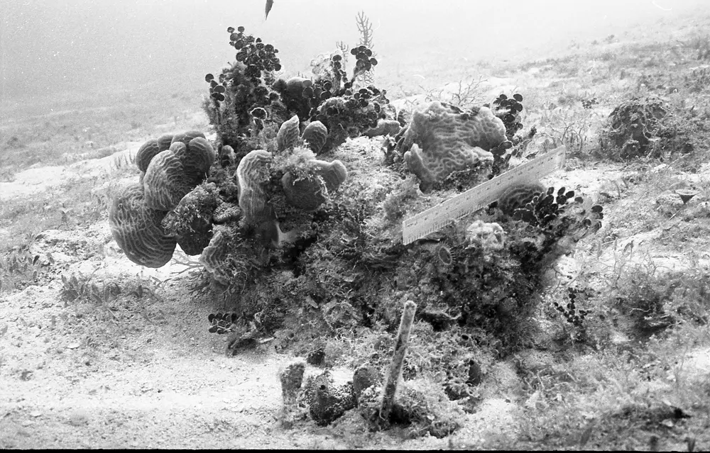{.lightbox group="discovery-bay-1966" description="**UUID: **c19d939d-393d-42f1-9df7-c933c3e393d0 **Date: **1967-04-16 **Location: **Jamaica | Discovery Bay | Algal Plots **Longitude: **77.414ºW **Latitude: **18.473ºN **Photographer: **Eileen Graham **Copyright: **Trustees of the Natural History Museum (London, UK), CC-BY-4.0" alt="**UUID: **c19d939d-393d-42f1-9df7-c933c3e393d0 **Date: **1967-04-16 **Location: **Jamaica | Discovery Bay | Algal Plots **Longitude: **77.414ºW **Latitude: **18.473ºN **Photographer: **Eileen Graham **Copyright: **Trustees of the Natural History Museum (London, UK), CC-BY-4.0"}

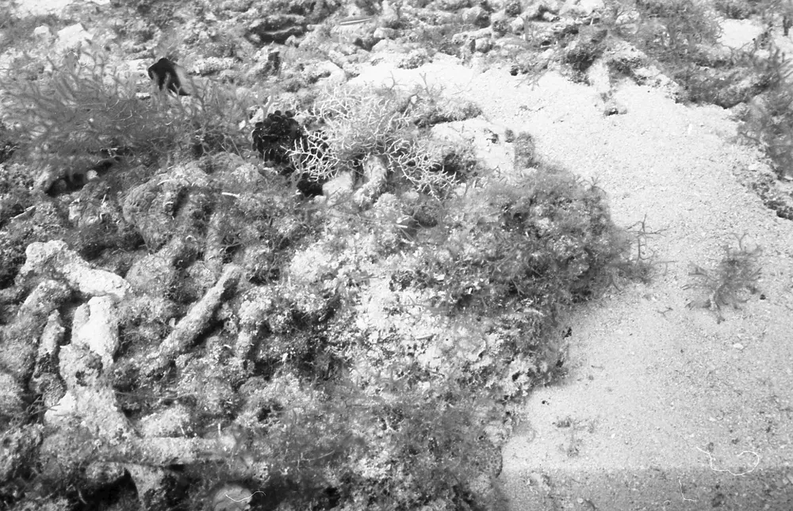{.lightbox group="discovery-bay-1966" description="**UUID: **e302cc2a-255e-49b7-b2ad-73eb0e46c4e7 **Date: **1967-04-16 **Location: **Jamaica | Discovery Bay | Algal Plots **Longitude: **77.414ºW **Latitude: **18.473ºN **Photographer: **Eileen Graham **Copyright: **Trustees of the Natural History Museum (London, UK), CC-BY-4.0" alt="**UUID: **e302cc2a-255e-49b7-b2ad-73eb0e46c4e7 **Date: **1967-04-16 **Location: **Jamaica | Discovery Bay | Algal Plots **Longitude: **77.414ºW **Latitude: **18.473ºN **Photographer: **Eileen Graham **Copyright: **Trustees of the Natural History Museum (London, UK), CC-BY-4.0"}

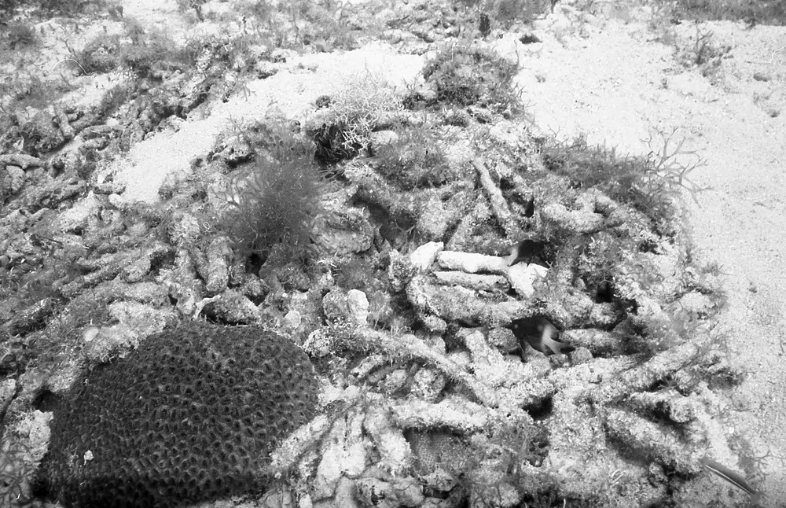{.lightbox group="discovery-bay-1966" description="**UUID: **494b1580-b9f9-4504-967d-1fd438efed80 **Date: **1967-04-16 **Location: **Jamaica | Discovery Bay | Algal Plots **Longitude: **77.414ºW **Latitude: **18.473ºN **Photographer: **Eileen Graham **Copyright: **Trustees of the Natural History Museum (London, UK), CC-BY-4.0" alt="**UUID: **494b1580-b9f9-4504-967d-1fd438efed80 **Date: **1967-04-16 **Location: **Jamaica | Discovery Bay | Algal Plots **Longitude: **77.414ºW **Latitude: **18.473ºN **Photographer: **Eileen Graham **Copyright: **Trustees of the Natural History Museum (London, UK), CC-BY-4.0"}

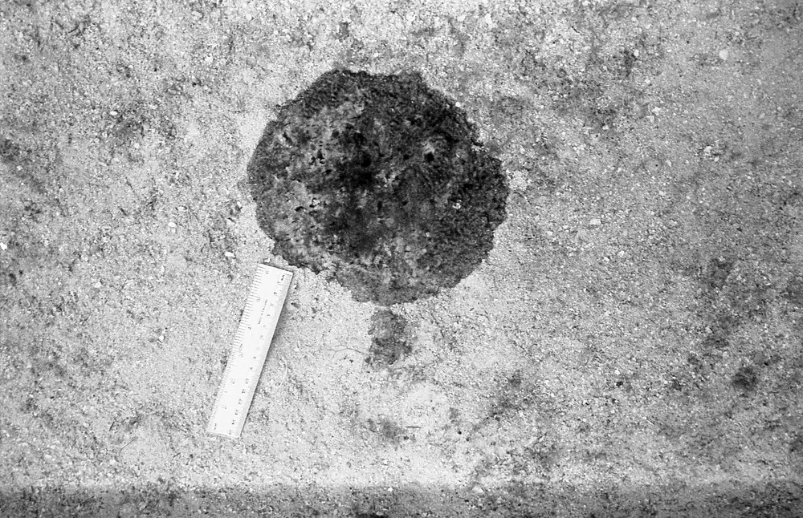{.lightbox group="discovery-bay-1966" description="**UUID: **3820da28-e373-4557-b9f0-11946be29bed **Date: **1967-04-16 **Location: **Jamaica | Discovery Bay | Algal Plots **Longitude: **77.414ºW **Latitude: **18.473ºN **Photographer: **Eileen Graham **Copyright: **Trustees of the Natural History Museum (London, UK), CC-BY-4.0" alt="**UUID: **3820da28-e373-4557-b9f0-11946be29bed **Date: **1967-04-16 **Location: **Jamaica | Discovery Bay | Algal Plots **Longitude: **77.414ºW **Latitude: **18.473ºN **Photographer: **Eileen Graham **Copyright: **Trustees of the Natural History Museum (London, UK), CC-BY-4.0"}

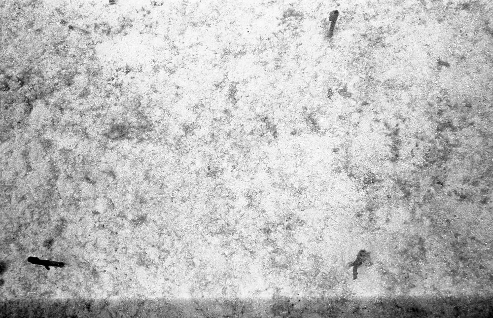{.lightbox group="discovery-bay-1966" description="**UUID: **293fa3f0-14ab-4629-b733-fc990ee2f4b1 **Date: **1967-04-16 **Location: **Jamaica | Discovery Bay | Algal Plots **Longitude: **77.414ºW **Latitude: **18.473ºN **Photographer: **Eileen Graham **Copyright: **Trustees of the Natural History Museum (London, UK), CC-BY-4.0" alt="**UUID: **293fa3f0-14ab-4629-b733-fc990ee2f4b1 **Date: **1967-04-16 **Location: **Jamaica | Discovery Bay | Algal Plots **Longitude: **77.414ºW **Latitude: **18.473ºN **Photographer: **Eileen Graham **Copyright: **Trustees of the Natural History Museum (London, UK), CC-BY-4.0"}

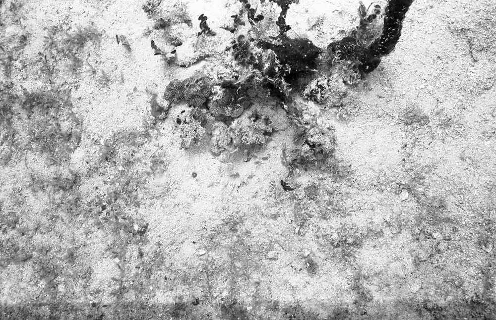{.lightbox group="discovery-bay-1966" description="**UUID: **e1c7ecab-1192-4048-abcb-c2b55f3b0cd4 **Date: **1967-04-16 **Location: **Jamaica | Discovery Bay | Algal Plots **Longitude: **77.414ºW **Latitude: **18.473ºN **Photographer: **Eileen Graham **Copyright: **Trustees of the Natural History Museum (London, UK), CC-BY-4.0" alt="**UUID: **e1c7ecab-1192-4048-abcb-c2b55f3b0cd4 **Date: **1967-04-16 **Location: **Jamaica | Discovery Bay | Algal Plots **Longitude: **77.414ºW **Latitude: **18.473ºN **Photographer: **Eileen Graham **Copyright: **Trustees of the Natural History Museum (London, UK), CC-BY-4.0"}

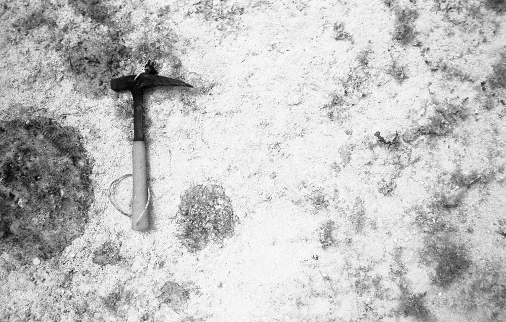{.lightbox group="discovery-bay-1966" description="**UUID: **34450c24-67af-42fd-822d-26462d836f84 **Date: **1967-04-23 **Location: **Jamaica | Discovery Bay | Algal Plots **Longitude: **77.414ºW **Latitude: **18.473ºN **Photographer: **Eileen Graham **Copyright: **Trustees of the Natural History Museum (London, UK), CC-BY-4.0" alt="**UUID: **34450c24-67af-42fd-822d-26462d836f84 **Date: **1967-04-23 **Location: **Jamaica | Discovery Bay | Algal Plots **Longitude: **77.414ºW **Latitude: **18.473ºN **Photographer: **Eileen Graham **Copyright: **Trustees of the Natural History Museum (London, UK), CC-BY-4.0"}

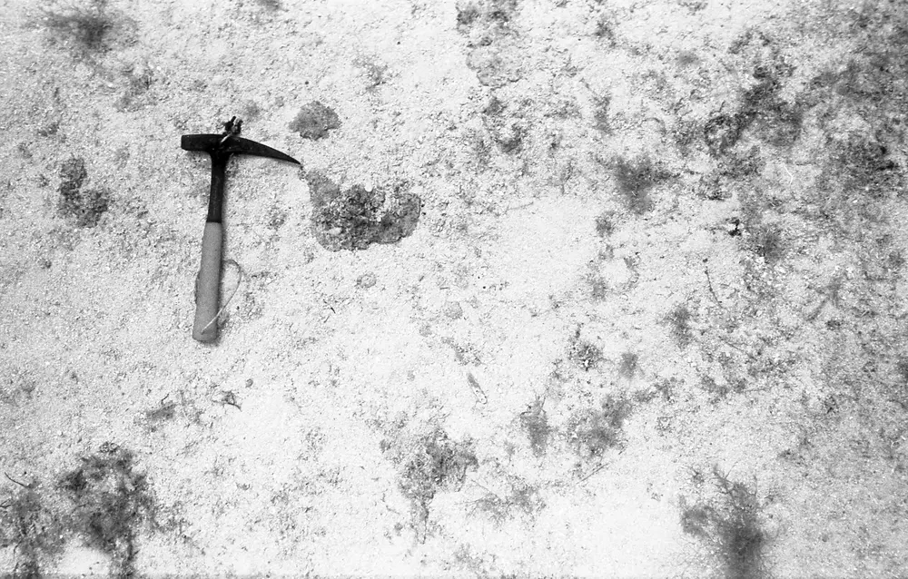{.lightbox group="discovery-bay-1966" description="**UUID: **e33004e3-a978-4b74-9081-adda341079dc **Date: **1967-04-23 **Location: **Jamaica | Discovery Bay | Algal Plots **Longitude: **77.414ºW **Latitude: **18.473ºN **Photographer: **Eileen Graham **Copyright: **Trustees of the Natural History Museum (London, UK), CC-BY-4.0" alt="**UUID: **e33004e3-a978-4b74-9081-adda341079dc **Date: **1967-04-23 **Location: **Jamaica | Discovery Bay | Algal Plots **Longitude: **77.414ºW **Latitude: **18.473ºN **Photographer: **Eileen Graham **Copyright: **Trustees of the Natural History Museum (London, UK), CC-BY-4.0"}

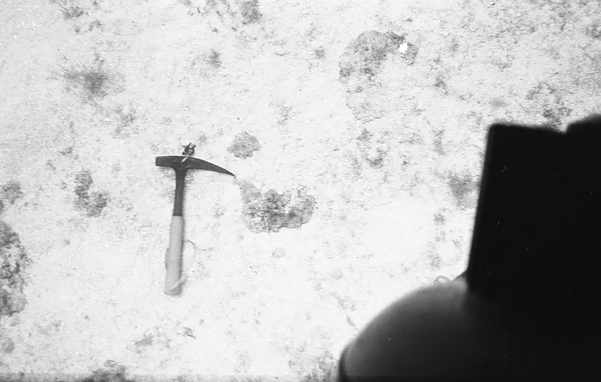{.lightbox group="discovery-bay-1966" description="**UUID: **4f444d54-56eb-4962-9060-4432b22eddf9 **Date: **1967-04-23 **Location: **Jamaica | Discovery Bay | Algal Plots **Longitude: **77.414ºW **Latitude: **18.473ºN **Photographer: **Eileen Graham **Copyright: **Trustees of the Natural History Museum (London, UK), CC-BY-4.0" alt="**UUID: **4f444d54-56eb-4962-9060-4432b22eddf9 **Date: **1967-04-23 **Location: **Jamaica | Discovery Bay | Algal Plots **Longitude: **77.414ºW **Latitude: **18.473ºN **Photographer: **Eileen Graham **Copyright: **Trustees of the Natural History Museum (London, UK), CC-BY-4.0"}

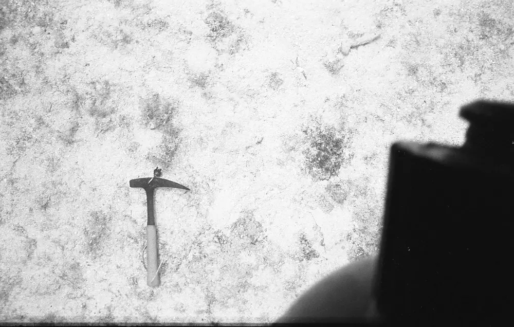{.lightbox group="discovery-bay-1966" description="**UUID: **beef7e84-8fad-406a-b8d2-3ff69fa16513 **Date: **1967-04-23 **Location: **Jamaica | Discovery Bay | Algal Plots **Longitude: **77.414ºW **Latitude: **18.473ºN **Photographer: **Eileen Graham **Copyright: **Trustees of the Natural History Museum (London, UK), CC-BY-4.0" alt="**UUID: **beef7e84-8fad-406a-b8d2-3ff69fa16513 **Date: **1967-04-23 **Location: **Jamaica | Discovery Bay | Algal Plots **Longitude: **77.414ºW **Latitude: **18.473ºN **Photographer: **Eileen Graham **Copyright: **Trustees of the Natural History Museum (London, UK), CC-BY-4.0"}

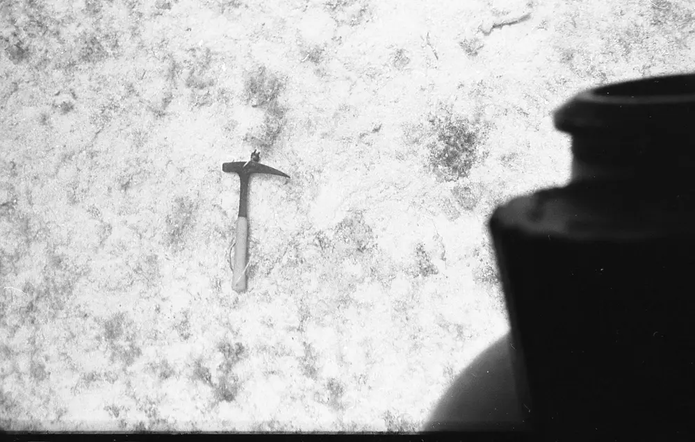{.lightbox group="discovery-bay-1966" description="**UUID: **6708ad6a-339a-47de-9f22-a76300cc55ab **Date: **1967-04-23 **Location: **Jamaica | Discovery Bay | Algal Plots **Longitude: **77.414ºW **Latitude: **18.473ºN **Photographer: **Eileen Graham **Copyright: **Trustees of the Natural History Museum (London, UK), CC-BY-4.0" alt="**UUID: **6708ad6a-339a-47de-9f22-a76300cc55ab **Date: **1967-04-23 **Location: **Jamaica | Discovery Bay | Algal Plots **Longitude: **77.414ºW **Latitude: **18.473ºN **Photographer: **Eileen Graham **Copyright: **Trustees of the Natural History Museum (London, UK), CC-BY-4.0"}

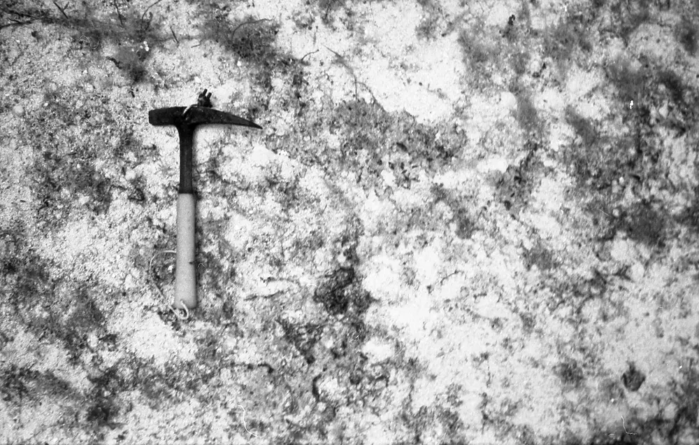{.lightbox group="discovery-bay-1966" description="**UUID: **53fa8102-9e1d-4187-9620-d30845e222ff **Date: **1967-04-23 **Location: **Jamaica | Discovery Bay | Algal Plots **Longitude: **77.414ºW **Latitude: **18.473ºN **Photographer: **Eileen Graham **Copyright: **Trustees of the Natural History Museum (London, UK), CC-BY-4.0" alt="**UUID: **53fa8102-9e1d-4187-9620-d30845e222ff **Date: **1967-04-23 **Location: **Jamaica | Discovery Bay | Algal Plots **Longitude: **77.414ºW **Latitude: **18.473ºN **Photographer: **Eileen Graham **Copyright: **Trustees of the Natural History Museum (London, UK), CC-BY-4.0"}

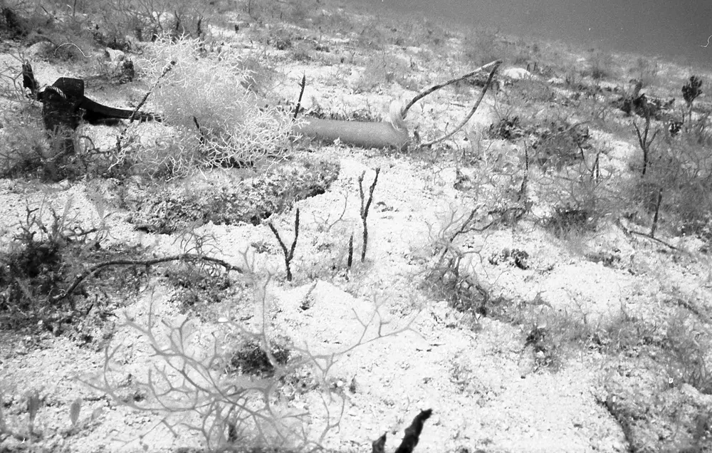{.lightbox group="discovery-bay-1966" description="**UUID: **56592621-8b10-4fa6-9e76-28d945823caf **Date: **1967-04-23 **Location: **Jamaica | Discovery Bay | Algal Plots **Longitude: **77.414ºW **Latitude: **18.473ºN **Photographer: **Eileen Graham **Copyright: **Trustees of the Natural History Museum (London, UK), CC-BY-4.0" alt="**UUID: **56592621-8b10-4fa6-9e76-28d945823caf **Date: **1967-04-23 **Location: **Jamaica | Discovery Bay | Algal Plots **Longitude: **77.414ºW **Latitude: **18.473ºN **Photographer: **Eileen Graham **Copyright: **Trustees of the Natural History Museum (London, UK), CC-BY-4.0"}

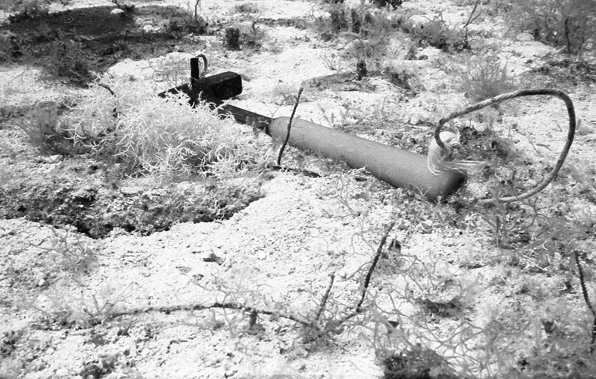{.lightbox group="discovery-bay-1966" description="**UUID: **df83a27d-0b73-4f89-84e2-5409a8ab00de **Date: **1967-04-23 **Location: **Jamaica | Discovery Bay | Algal Plots **Longitude: **77.414ºW **Latitude: **18.473ºN **Photographer: **Eileen Graham **Copyright: **Trustees of the Natural History Museum (London, UK), CC-BY-4.0" alt="**UUID: **df83a27d-0b73-4f89-84e2-5409a8ab00de **Date: **1967-04-23 **Location: **Jamaica | Discovery Bay | Algal Plots **Longitude: **77.414ºW **Latitude: **18.473ºN **Photographer: **Eileen Graham **Copyright: **Trustees of the Natural History Museum (London, UK), CC-BY-4.0"}

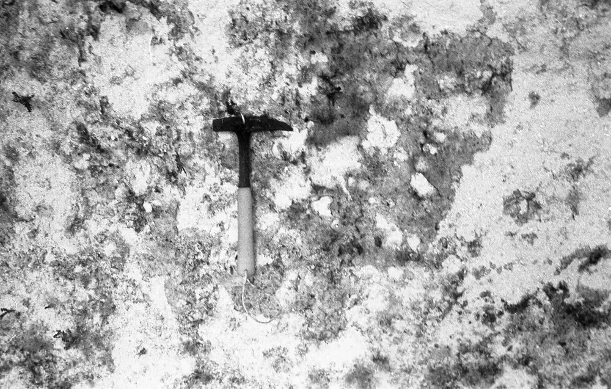{.lightbox group="discovery-bay-1966" description="**UUID: **23011fbb-b1dd-4048-b069-6c034cf26d83 **Date: **1967-04-23 **Location: **Jamaica | Discovery Bay | Algal Plots **Longitude: **77.414ºW **Latitude: **18.473ºN **Photographer: **Eileen Graham **Copyright: **Trustees of the Natural History Museum (London, UK), CC-BY-4.0" alt="**UUID: **23011fbb-b1dd-4048-b069-6c034cf26d83 **Date: **1967-04-23 **Location: **Jamaica | Discovery Bay | Algal Plots **Longitude: **77.414ºW **Latitude: **18.473ºN **Photographer: **Eileen Graham **Copyright: **Trustees of the Natural History Museum (London, UK), CC-BY-4.0"}

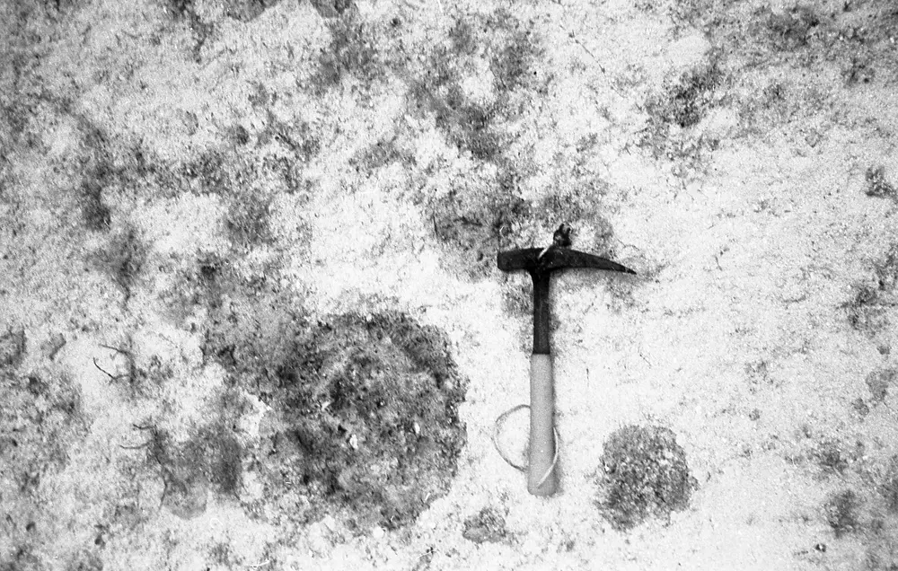{.lightbox group="discovery-bay-1966" description="**UUID: **53310e30-900c-4b00-b28c-ef05395a5003 **Date: **1967-04-23 **Location: **Jamaica | Discovery Bay | Algal Plots **Longitude: **77.414ºW **Latitude: **18.473ºN **Photographer: **Eileen Graham **Copyright: **Trustees of the Natural History Museum (London, UK), CC-BY-4.0" alt="**UUID: **53310e30-900c-4b00-b28c-ef05395a5003 **Date: **1967-04-23 **Location: **Jamaica | Discovery Bay | Algal Plots **Longitude: **77.414ºW **Latitude: **18.473ºN **Photographer: **Eileen Graham **Copyright: **Trustees of the Natural History Museum (London, UK), CC-BY-4.0"}

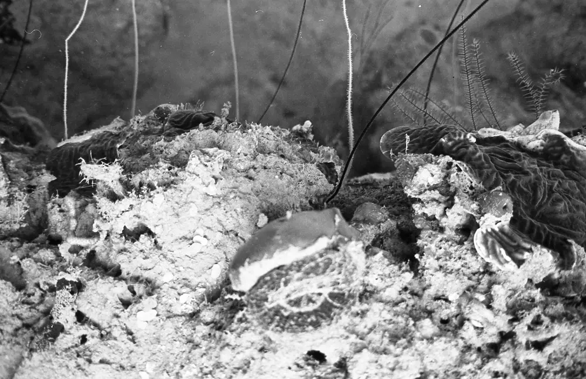{.lightbox group="discovery-bay-1966" description="**UUID: **e27ddb0f-4edd-4b3e-8851-02c97e9e9c2c **Date: **1967-05-18 **Location: **Jamaica | Discovery Bay | Pear Tree Bottom **Longitude: **77.35867ºW **Latitude: **18.4635ºN **Photographer: **Eileen Graham **Copyright: **Trustees of the Natural History Museum (London, UK), CC-BY-4.0" alt="**UUID: **e27ddb0f-4edd-4b3e-8851-02c97e9e9c2c **Date: **1967-05-18 **Location: **Jamaica | Discovery Bay | Pear Tree Bottom **Longitude: **77.35867ºW **Latitude: **18.4635ºN **Photographer: **Eileen Graham **Copyright: **Trustees of the Natural History Museum (London, UK), CC-BY-4.0"}

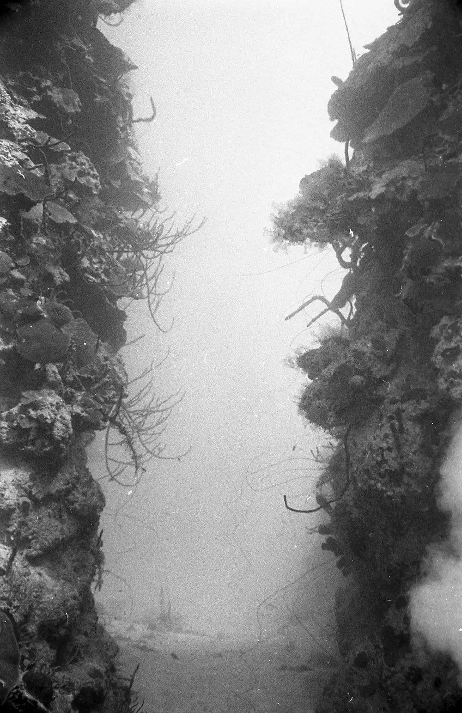{.lightbox group="discovery-bay-1966" description="**UUID: **4b7e301b-3bd6-4e22-8b3f-434398c75084 **Date: **1967-05-18 **Location: **Jamaica | Discovery Bay | Pear Tree Bottom **Longitude: **77.35867ºW **Latitude: **18.4635ºN **Photographer: **Eileen Graham **Copyright: **Trustees of the Natural History Museum (London, UK), CC-BY-4.0" alt="**UUID: **4b7e301b-3bd6-4e22-8b3f-434398c75084 **Date: **1967-05-18 **Location: **Jamaica | Discovery Bay | Pear Tree Bottom **Longitude: **77.35867ºW **Latitude: **18.4635ºN **Photographer: **Eileen Graham **Copyright: **Trustees of the Natural History Museum (London, UK), CC-BY-4.0"}

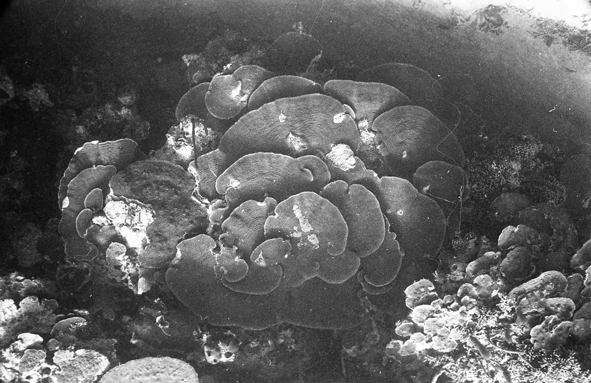{.lightbox group="discovery-bay-1966" description="**UUID: **a97ce4aa-00dc-460b-ae16-b439af32c31f **Date: **1967-05-18 **Location: **Jamaica | Discovery Bay | Pear Tree Bottom **Longitude: **77.35867ºW **Latitude: **18.4635ºN **Photographer: **Eileen Graham **Copyright: **Trustees of the Natural History Museum (London, UK), CC-BY-4.0" alt="**UUID: **a97ce4aa-00dc-460b-ae16-b439af32c31f **Date: **1967-05-18 **Location: **Jamaica | Discovery Bay | Pear Tree Bottom **Longitude: **77.35867ºW **Latitude: **18.4635ºN **Photographer: **Eileen Graham **Copyright: **Trustees of the Natural History Museum (London, UK), CC-BY-4.0"}

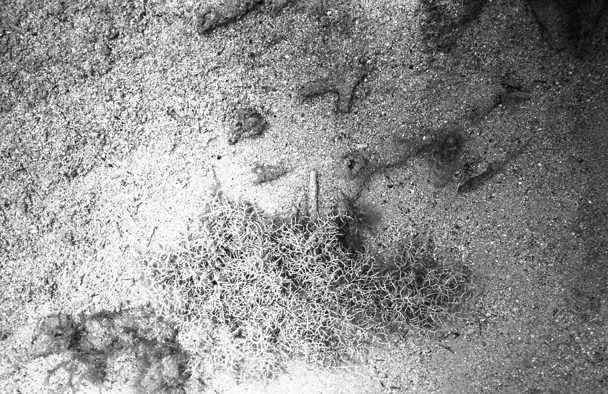{.lightbox group="discovery-bay-1966" description="**UUID: **763dcdb2-fce4-4e6f-829d-e3083d8a64c3 **Date: **1967-05-18 **Location: **Jamaica | Discovery Bay | Pear Tree Bottom **Longitude: **77.35867ºW **Latitude: **18.4635ºN **Photographer: **Eileen Graham **Copyright: **Trustees of the Natural History Museum (London, UK), CC-BY-4.0" alt="**UUID: **763dcdb2-fce4-4e6f-829d-e3083d8a64c3 **Date: **1967-05-18 **Location: **Jamaica | Discovery Bay | Pear Tree Bottom **Longitude: **77.35867ºW **Latitude: **18.4635ºN **Photographer: **Eileen Graham **Copyright: **Trustees of the Natural History Museum (London, UK), CC-BY-4.0"}

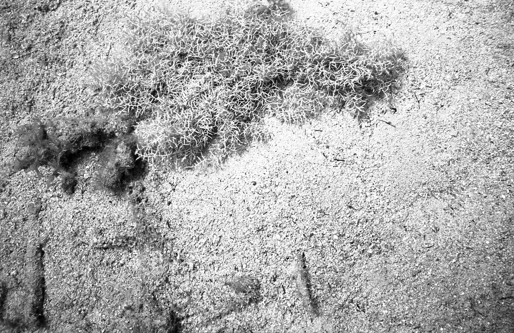{.lightbox group="discovery-bay-1966" description="**UUID: **494a4fd5-f907-479e-a7af-23b3c000dc42 **Date: **1967-05-18 **Location: **Jamaica | Discovery Bay | Pear Tree Bottom **Longitude: **77.35867ºW **Latitude: **18.4635ºN **Photographer: **Eileen Graham **Copyright: **Trustees of the Natural History Museum (London, UK), CC-BY-4.0" alt="**UUID: **494a4fd5-f907-479e-a7af-23b3c000dc42 **Date: **1967-05-18 **Location: **Jamaica | Discovery Bay | Pear Tree Bottom **Longitude: **77.35867ºW **Latitude: **18.4635ºN **Photographer: **Eileen Graham **Copyright: **Trustees of the Natural History Museum (London, UK), CC-BY-4.0"}

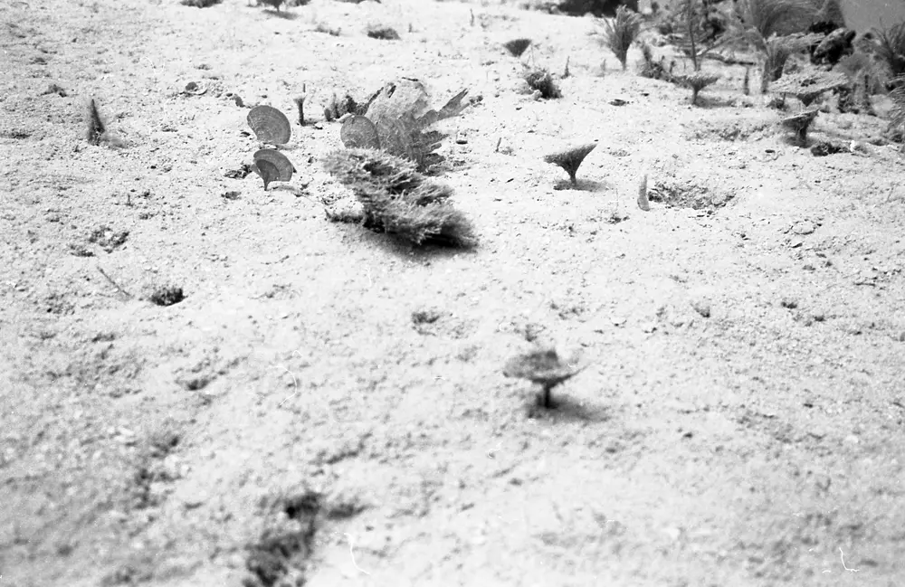{.lightbox group="discovery-bay-1966" description="**UUID: **73d04fdf-3539-47f6-9bad-095eaff14ef7 **Date: **1967-05-18 **Location: **Jamaica | Discovery Bay | Pear Tree Bottom **Longitude: **77.35867ºW **Latitude: **18.4635ºN **Photographer: **Eileen Graham **Copyright: **Trustees of the Natural History Museum (London, UK), CC-BY-4.0" alt="**UUID: **73d04fdf-3539-47f6-9bad-095eaff14ef7 **Date: **1967-05-18 **Location: **Jamaica | Discovery Bay | Pear Tree Bottom **Longitude: **77.35867ºW **Latitude: **18.4635ºN **Photographer: **Eileen Graham **Copyright: **Trustees of the Natural History Museum (London, UK), CC-BY-4.0"}

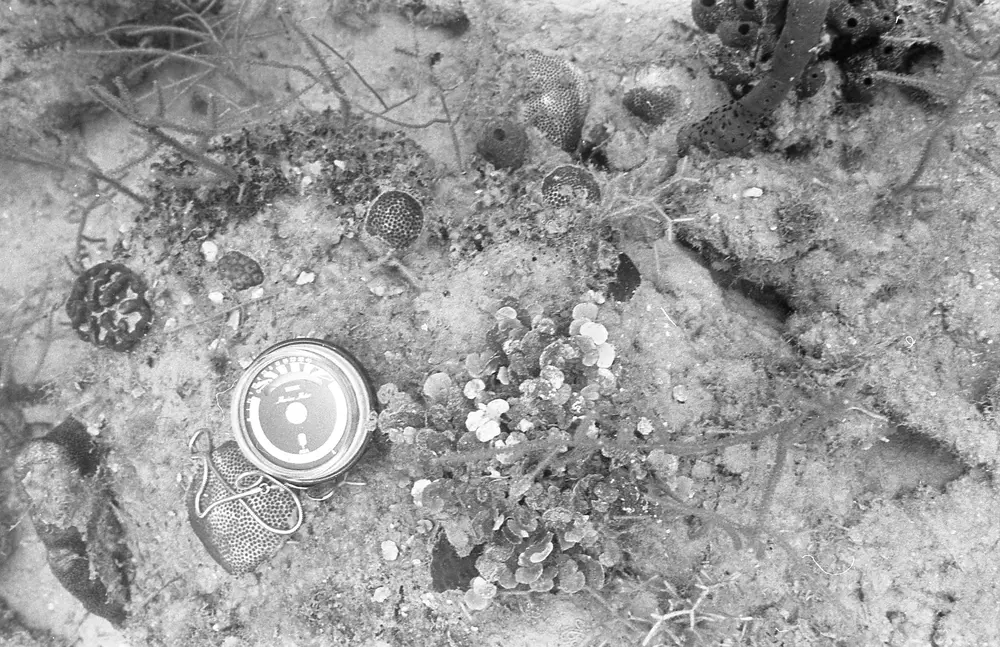{.lightbox group="discovery-bay-1966" description="**UUID: **fa6af9b4-498d-4a79-9abc-9c7b18892c18 **Date: **1967-05-18 **Location: **Jamaica | Discovery Bay | Pear Tree Bottom **Longitude: **77.35867ºW **Latitude: **18.4635ºN **Photographer: **Eileen Graham **Copyright: **Trustees of the Natural History Museum (London, UK), CC-BY-4.0" alt="**UUID: **fa6af9b4-498d-4a79-9abc-9c7b18892c18 **Date: **1967-05-18 **Location: **Jamaica | Discovery Bay | Pear Tree Bottom **Longitude: **77.35867ºW **Latitude: **18.4635ºN **Photographer: **Eileen Graham **Copyright: **Trustees of the Natural History Museum (London, UK), CC-BY-4.0"}

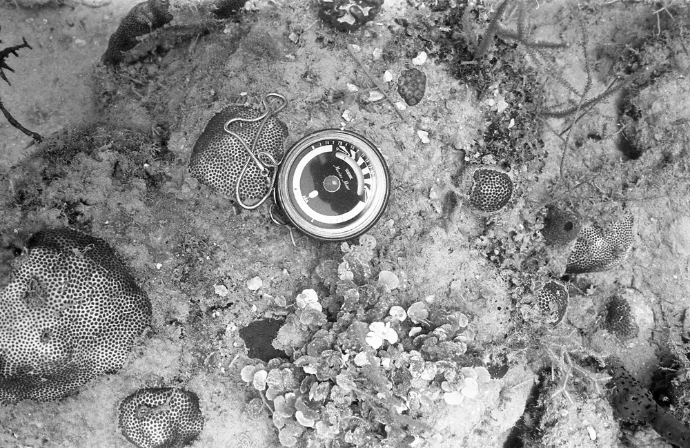{.lightbox group="discovery-bay-1966" description="**UUID: **a36c7448-e69b-4b6c-8fd0-b31c00b7cc59 **Date: **1967-05-18 **Location: **Jamaica | Discovery Bay | Pear Tree Bottom **Longitude: **77.35867ºW **Latitude: **18.4635ºN **Photographer: **Eileen Graham **Copyright: **Trustees of the Natural History Museum (London, UK), CC-BY-4.0" alt="**UUID: **a36c7448-e69b-4b6c-8fd0-b31c00b7cc59 **Date: **1967-05-18 **Location: **Jamaica | Discovery Bay | Pear Tree Bottom **Longitude: **77.35867ºW **Latitude: **18.4635ºN **Photographer: **Eileen Graham **Copyright: **Trustees of the Natural History Museum (London, UK), CC-BY-4.0"}

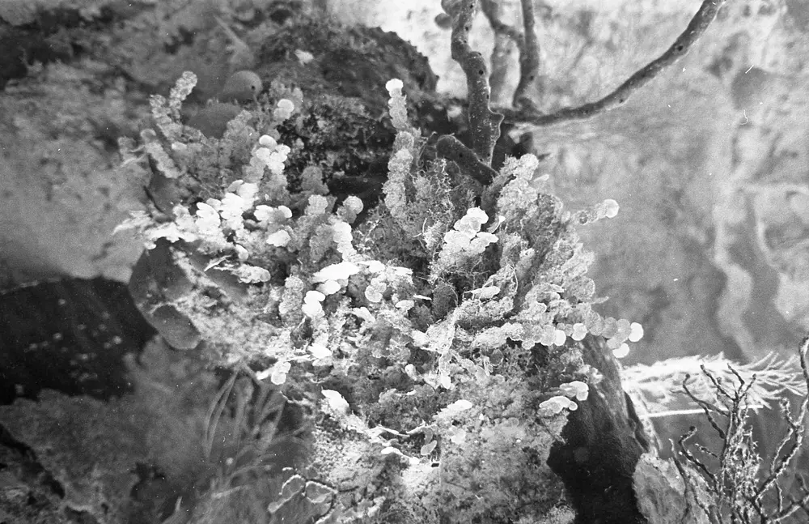{.lightbox group="discovery-bay-1966" description="**UUID: **0d7cfaf5-e60e-4476-99c4-62ebd343a6a2 **Date: **1967-05-18 **Location: **Jamaica | Discovery Bay | Pear Tree Bottom **Longitude: **77.35867ºW **Latitude: **18.4635ºN **Photographer: **Eileen Graham **Copyright: **Trustees of the Natural History Museum (London, UK), CC-BY-4.0" alt="**UUID: **0d7cfaf5-e60e-4476-99c4-62ebd343a6a2 **Date: **1967-05-18 **Location: **Jamaica | Discovery Bay | Pear Tree Bottom **Longitude: **77.35867ºW **Latitude: **18.4635ºN **Photographer: **Eileen Graham **Copyright: **Trustees of the Natural History Museum (London, UK), CC-BY-4.0"}

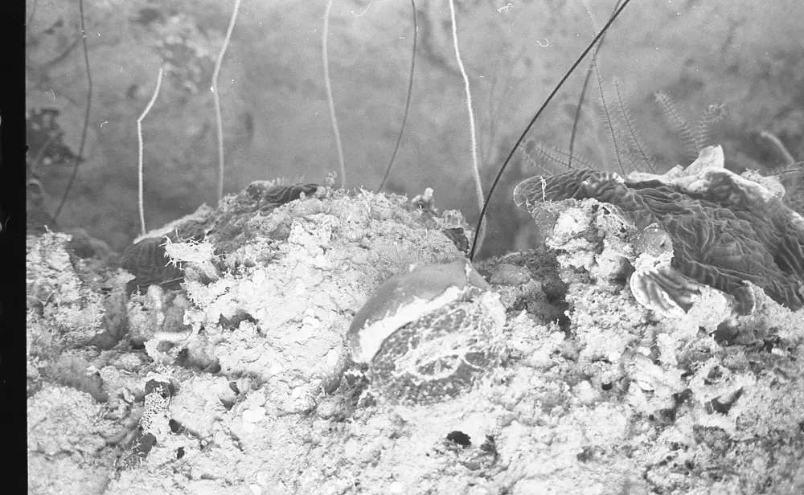{.lightbox group="discovery-bay-1966" description="**UUID: **fb10af2c-c9d8-41fe-b48b-92b3d180aa2f **Date: **1967-05-18 **Location: **Jamaica | Discovery Bay | Pear Tree Bottom **Longitude: **77.35867ºW **Latitude: **18.4635ºN **Photographer: **Eileen Graham **Copyright: **Trustees of the Natural History Museum (London, UK), CC-BY-4.0" alt="**UUID: **fb10af2c-c9d8-41fe-b48b-92b3d180aa2f **Date: **1967-05-18 **Location: **Jamaica | Discovery Bay | Pear Tree Bottom **Longitude: **77.35867ºW **Latitude: **18.4635ºN **Photographer: **Eileen Graham **Copyright: **Trustees of the Natural History Museum (London, UK), CC-BY-4.0"}

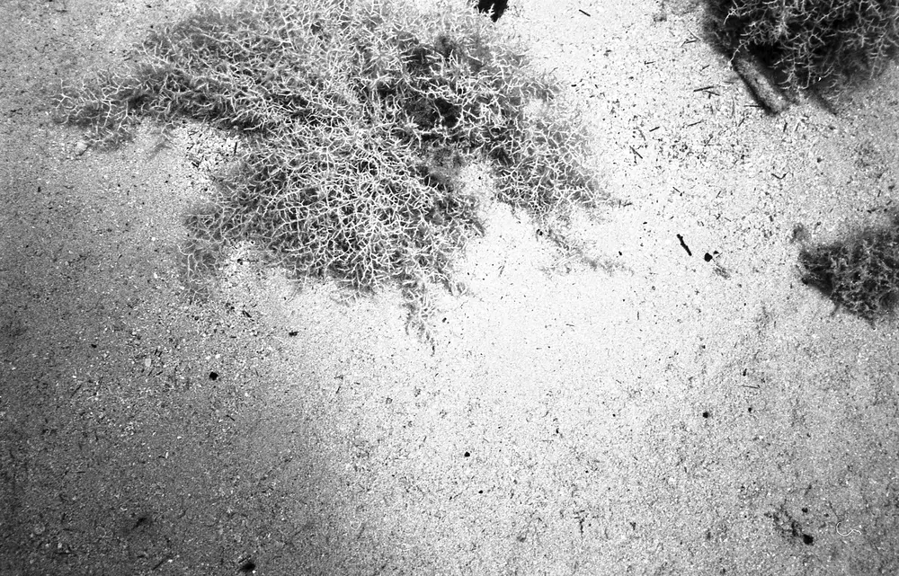{.lightbox group="discovery-bay-1966" description="**UUID: **1a70de3f-9321-4cba-b73c-c720dfeaa996 **Date: **1967-05-18 **Location: **Jamaica | Discovery Bay | Pear Tree Bottom **Longitude: **77.35867ºW **Latitude: **18.4635ºN **Photographer: **Eileen Graham **Copyright: **Trustees of the Natural History Museum (London, UK), CC-BY-4.0" alt="**UUID: **1a70de3f-9321-4cba-b73c-c720dfeaa996 **Date: **1967-05-18 **Location: **Jamaica | Discovery Bay | Pear Tree Bottom **Longitude: **77.35867ºW **Latitude: **18.4635ºN **Photographer: **Eileen Graham **Copyright: **Trustees of the Natural History Museum (London, UK), CC-BY-4.0"}

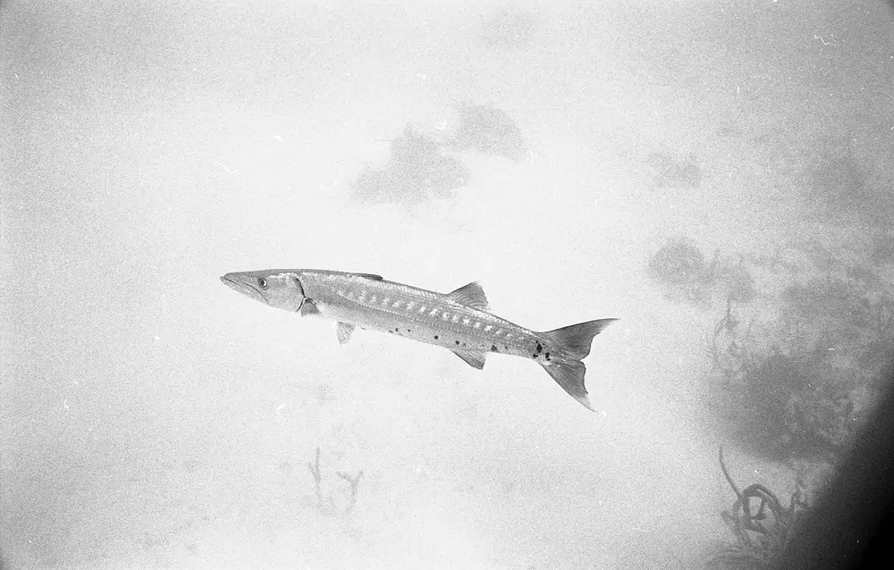{.lightbox group="discovery-bay-1966" description="**UUID: **e76c27c6-899a-4bf3-83a9-2e3fc40b8656 **Date: **1967-05-18 **Location: **Jamaica | Discovery Bay | Pear Tree Bottom **Longitude: **77.35867ºW **Latitude: **18.4635ºN **Photographer: **Eileen Graham **Copyright: **Trustees of the Natural History Museum (London, UK), CC-BY-4.0" alt="**UUID: **e76c27c6-899a-4bf3-83a9-2e3fc40b8656 **Date: **1967-05-18 **Location: **Jamaica | Discovery Bay | Pear Tree Bottom **Longitude: **77.35867ºW **Latitude: **18.4635ºN **Photographer: **Eileen Graham **Copyright: **Trustees of the Natural History Museum (London, UK), CC-BY-4.0"}

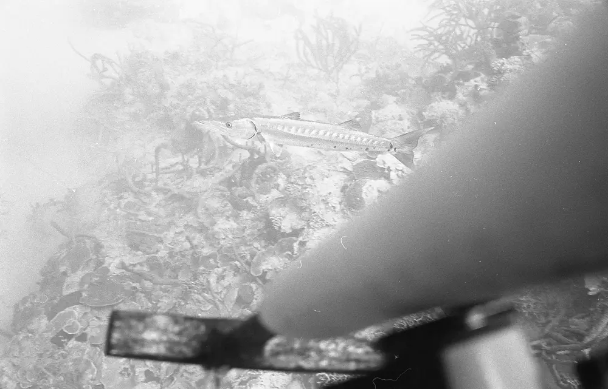{.lightbox group="discovery-bay-1966" description="**UUID: **a2976e59-dc00-4a7f-836e-f054d9dc1cfa **Date: **1967-05-18 **Location: **Jamaica | Discovery Bay | Pear Tree Bottom **Longitude: **77.35867ºW **Latitude: **18.4635ºN **Photographer: **Eileen Graham **Copyright: **Trustees of the Natural History Museum (London, UK), CC-BY-4.0" alt="**UUID: **a2976e59-dc00-4a7f-836e-f054d9dc1cfa **Date: **1967-05-18 **Location: **Jamaica | Discovery Bay | Pear Tree Bottom **Longitude: **77.35867ºW **Latitude: **18.4635ºN **Photographer: **Eileen Graham **Copyright: **Trustees of the Natural History Museum (London, UK), CC-BY-4.0"}

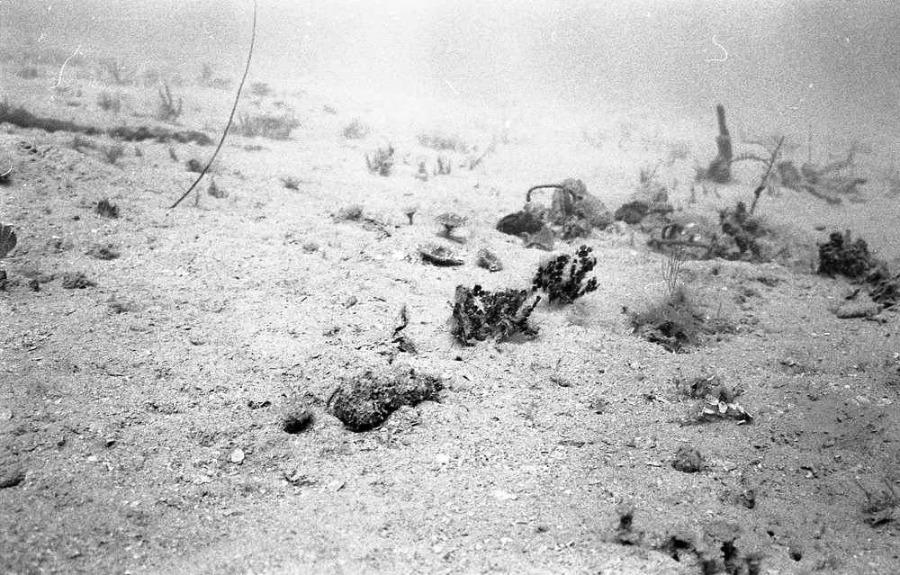{.lightbox group="discovery-bay-1966" description="**UUID: **f5e80cdd-dc32-47aa-837b-ffddbd7dbcbb **Date: **1967-05-18 **Location: **Jamaica | Discovery Bay | Pear Tree Bottom **Longitude: **77.35867ºW **Latitude: **18.4635ºN **Photographer: **Eileen Graham **Copyright: **Trustees of the Natural History Museum (London, UK), CC-BY-4.0" alt="**UUID: **f5e80cdd-dc32-47aa-837b-ffddbd7dbcbb **Date: **1967-05-18 **Location: **Jamaica | Discovery Bay | Pear Tree Bottom **Longitude: **77.35867ºW **Latitude: **18.4635ºN **Photographer: **Eileen Graham **Copyright: **Trustees of the Natural History Museum (London, UK), CC-BY-4.0"}

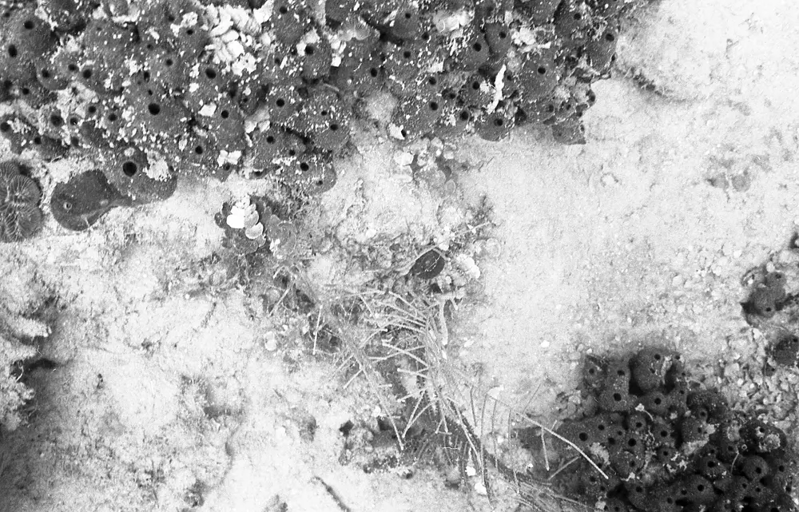{.lightbox group="discovery-bay-1966" description="**UUID: **e2f64360-3e65-4d52-b864-db6ae3ba0e18 **Date: **1967-05-18 **Location: **Jamaica | Discovery Bay | Pear Tree Bottom **Longitude: **77.35867ºW **Latitude: **18.4635ºN **Photographer: **Eileen Graham **Copyright: **Trustees of the Natural History Museum (London, UK), CC-BY-4.0" alt="**UUID: **e2f64360-3e65-4d52-b864-db6ae3ba0e18 **Date: **1967-05-18 **Location: **Jamaica | Discovery Bay | Pear Tree Bottom **Longitude: **77.35867ºW **Latitude: **18.4635ºN **Photographer: **Eileen Graham **Copyright: **Trustees of the Natural History Museum (London, UK), CC-BY-4.0"}

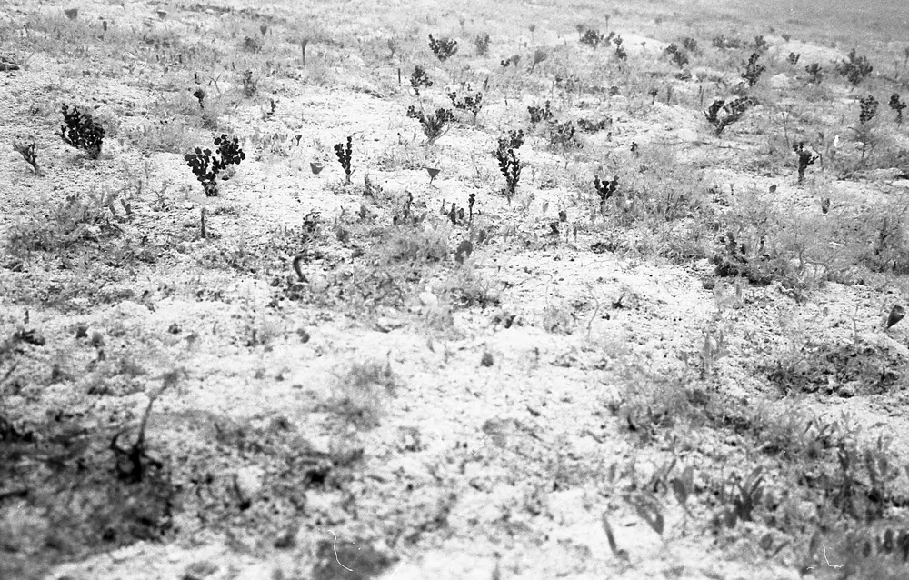{.lightbox group="discovery-bay-1966" description="**UUID: **dfb8548e-8dd5-4cf8-993b-abed589c6492 **Date: **1967-05-19 **Location: **Jamaica | Discovery Bay | Algal Plots **Longitude: **77.414ºW **Latitude: **18.473ºN **Photographer: **Eileen Graham **Copyright: **Trustees of the Natural History Museum (London, UK), CC-BY-4.0" alt="**UUID: **dfb8548e-8dd5-4cf8-993b-abed589c6492 **Date: **1967-05-19 **Location: **Jamaica | Discovery Bay | Algal Plots **Longitude: **77.414ºW **Latitude: **18.473ºN **Photographer: **Eileen Graham **Copyright: **Trustees of the Natural History Museum (London, UK), CC-BY-4.0"}

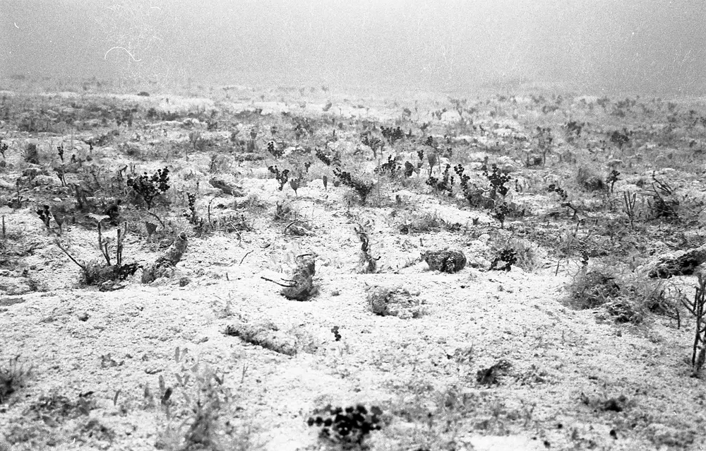{.lightbox group="discovery-bay-1966" description="**UUID: **314c0c94-4f03-4540-8710-8eb3b19c7d63 **Date: **1967-05-19 **Location: **Jamaica | Discovery Bay | Algal Plots **Longitude: **77.414ºW **Latitude: **18.473ºN **Photographer: **Eileen Graham **Copyright: **Trustees of the Natural History Museum (London, UK), CC-BY-4.0" alt="**UUID: **314c0c94-4f03-4540-8710-8eb3b19c7d63 **Date: **1967-05-19 **Location: **Jamaica | Discovery Bay | Algal Plots **Longitude: **77.414ºW **Latitude: **18.473ºN **Photographer: **Eileen Graham **Copyright: **Trustees of the Natural History Museum (London, UK), CC-BY-4.0"}

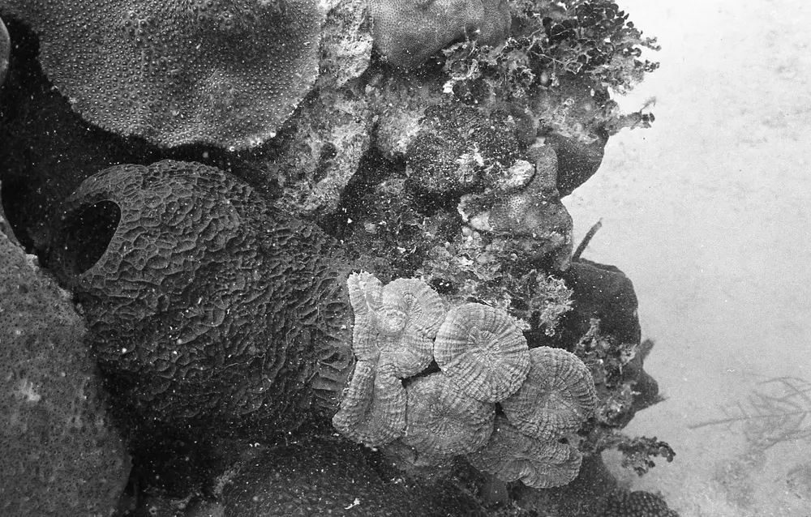{.lightbox group="discovery-bay-1966" description="**UUID: **b8eed4cd-e327-4949-8816-ae1de5267a19 **Date: **1967-05-19 **Location: **Jamaica | Discovery Bay | Buoy Upper Slope **Longitude: **77.40908ºW **Latitude: **18.47322ºN **Photographer: **Eileen Graham **Copyright: **Trustees of the Natural History Museum (London, UK), CC-BY-4.0" alt="**UUID: **b8eed4cd-e327-4949-8816-ae1de5267a19 **Date: **1967-05-19 **Location: **Jamaica | Discovery Bay | Buoy Upper Slope **Longitude: **77.40908ºW **Latitude: **18.47322ºN **Photographer: **Eileen Graham **Copyright: **Trustees of the Natural History Museum (London, UK), CC-BY-4.0"}

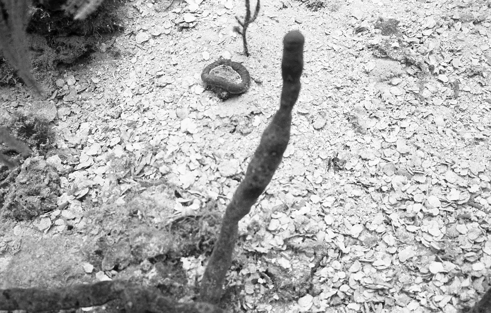{.lightbox group="discovery-bay-1966" description="**UUID: **82815d10-3b8b-43a2-a3e1-2fc613af3a8b **Date: **1967-05-19 **Location: **Jamaica | Discovery Bay | Buoy Upper Slope **Longitude: **77.40908ºW **Latitude: **18.47322ºN **Photographer: **Eileen Graham **Copyright: **Trustees of the Natural History Museum (London, UK), CC-BY-4.0" alt="**UUID: **82815d10-3b8b-43a2-a3e1-2fc613af3a8b **Date: **1967-05-19 **Location: **Jamaica | Discovery Bay | Buoy Upper Slope **Longitude: **77.40908ºW **Latitude: **18.47322ºN **Photographer: **Eileen Graham **Copyright: **Trustees of the Natural History Museum (London, UK), CC-BY-4.0"}

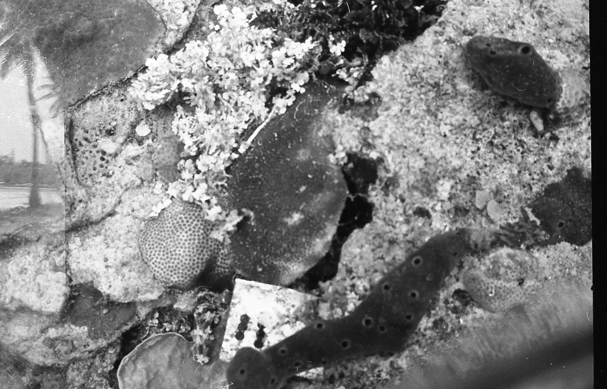{.lightbox group="discovery-bay-1966" description="**UUID: **ca1c7276-b922-416e-b83a-b2c7fbddd88d **Date: **1967-05-19 **Location: **Jamaica | Discovery Bay | Buoy Upper Slope **Longitude: **77.40908ºW **Latitude: **18.47322ºN **Photographer: **Eileen Graham **Copyright: **Trustees of the Natural History Museum (London, UK), CC-BY-4.0" alt="**UUID: **ca1c7276-b922-416e-b83a-b2c7fbddd88d **Date: **1967-05-19 **Location: **Jamaica | Discovery Bay | Buoy Upper Slope **Longitude: **77.40908ºW **Latitude: **18.47322ºN **Photographer: **Eileen Graham **Copyright: **Trustees of the Natural History Museum (London, UK), CC-BY-4.0"}

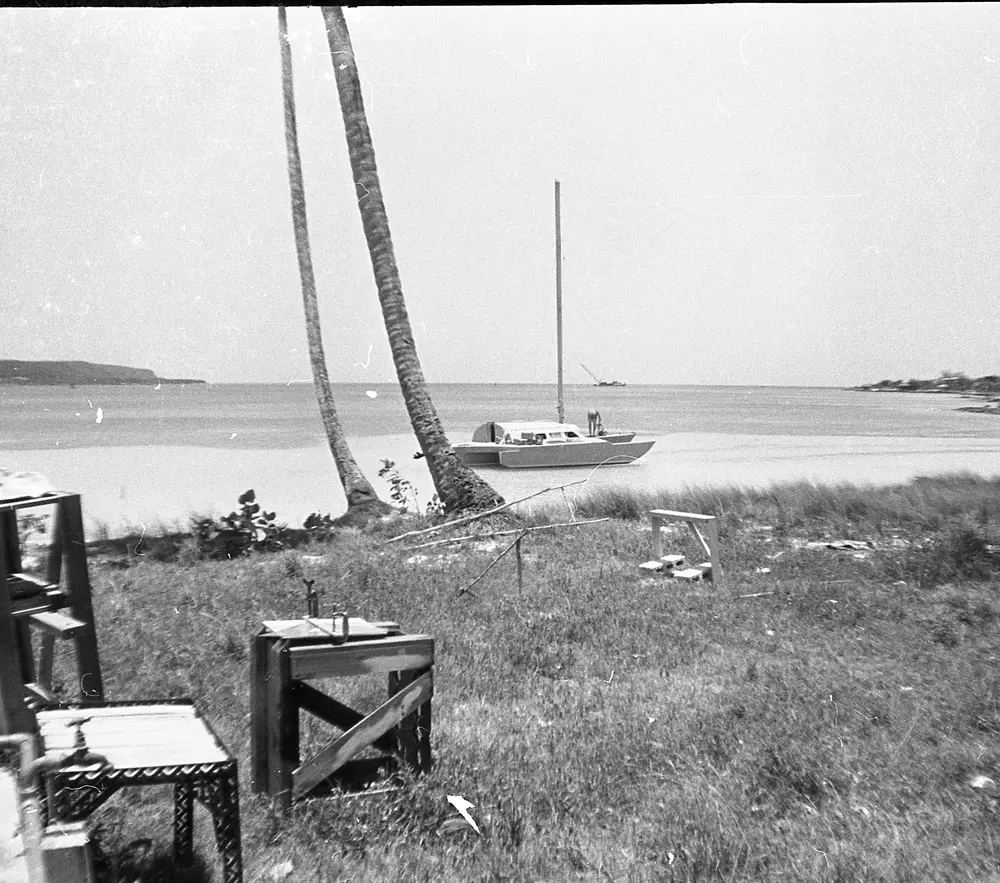{.lightbox group="discovery-bay-1966" description="**UUID: **0924f3a7-c973-46b9-b98d-32ab6d275cc3 **Date: **1967-05-19 **Location: **Jamaica | Discovery Bay | Onshore **Longitude: **77.41543ºW **Latitude: **18.468618ºN **Photographer: **Eileen Graham **Copyright: **Trustees of the Natural History Museum (London, UK), CC-BY-4.0" alt="**UUID: **0924f3a7-c973-46b9-b98d-32ab6d275cc3 **Date: **1967-05-19 **Location: **Jamaica | Discovery Bay | Onshore **Longitude: **77.41543ºW **Latitude: **18.468618ºN **Photographer: **Eileen Graham **Copyright: **Trustees of the Natural History Museum (London, UK), CC-BY-4.0"}

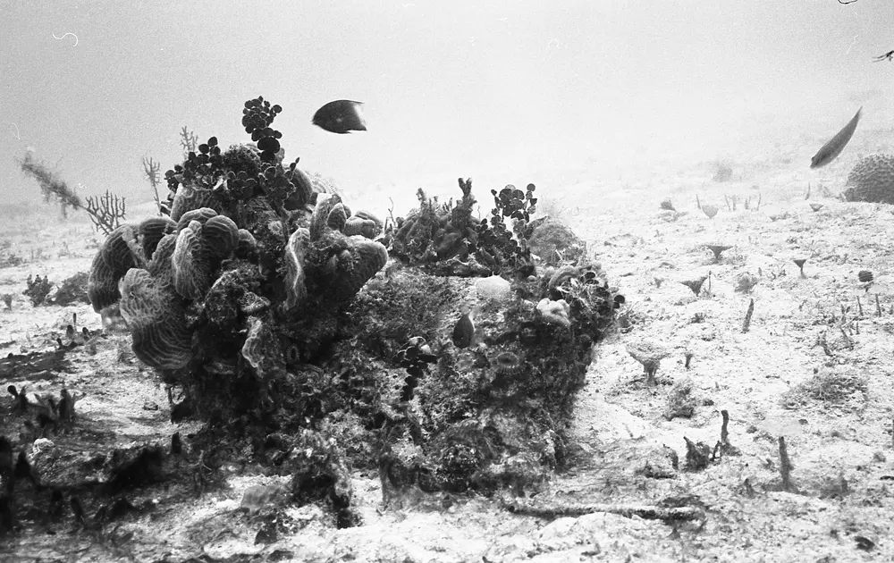{.lightbox group="discovery-bay-1966" description="**UUID: **a0127e38-4875-4881-890f-69f40c86cd3a **Date: **1967-05-26 **Location: **Jamaica | Discovery Bay | Algal Plots **Longitude: **77.414ºW **Latitude: **18.473ºN **Photographer: **Eileen Graham **Copyright: **Trustees of the Natural History Museum (London, UK), CC-BY-4.0" alt="**UUID: **a0127e38-4875-4881-890f-69f40c86cd3a **Date: **1967-05-26 **Location: **Jamaica | Discovery Bay | Algal Plots **Longitude: **77.414ºW **Latitude: **18.473ºN **Photographer: **Eileen Graham **Copyright: **Trustees of the Natural History Museum (London, UK), CC-BY-4.0"}

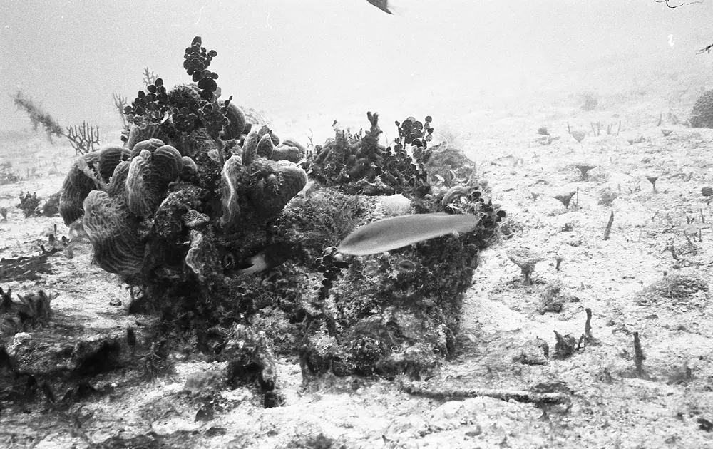{.lightbox group="discovery-bay-1966" description="**UUID: **bc0889ba-1283-42c7-aba8-3f6c2eaa4fe8 **Date: **1967-05-26 **Location: **Jamaica | Discovery Bay | Algal Plots **Longitude: **77.414ºW **Latitude: **18.473ºN **Photographer: **Eileen Graham **Copyright: **Trustees of the Natural History Museum (London, UK), CC-BY-4.0" alt="**UUID: **bc0889ba-1283-42c7-aba8-3f6c2eaa4fe8 **Date: **1967-05-26 **Location: **Jamaica | Discovery Bay | Algal Plots **Longitude: **77.414ºW **Latitude: **18.473ºN **Photographer: **Eileen Graham **Copyright: **Trustees of the Natural History Museum (London, UK), CC-BY-4.0"}

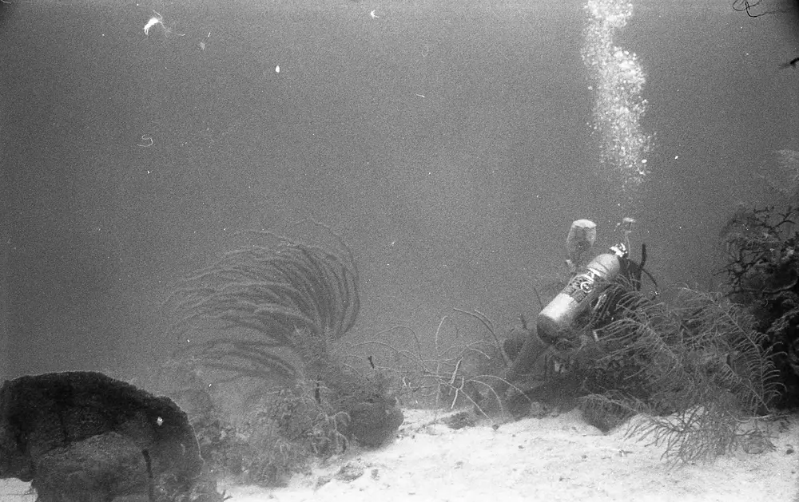{.lightbox group="discovery-bay-1966" description="**UUID: **2418201d-b1e8-4c67-aa17-e10fdfb13b59 **Date: **1967-05-26 **Location: **Jamaica | Discovery Bay | Pinnacle 1 Slope **Longitude: **77.41017ºW **Latitude: **18.47367ºN **Photographer: **Eileen Graham **Copyright: **Trustees of the Natural History Museum (London, UK), CC-BY-4.0" alt="**UUID: **2418201d-b1e8-4c67-aa17-e10fdfb13b59 **Date: **1967-05-26 **Location: **Jamaica | Discovery Bay | Pinnacle 1 Slope **Longitude: **77.41017ºW **Latitude: **18.47367ºN **Photographer: **Eileen Graham **Copyright: **Trustees of the Natural History Museum (London, UK), CC-BY-4.0"}

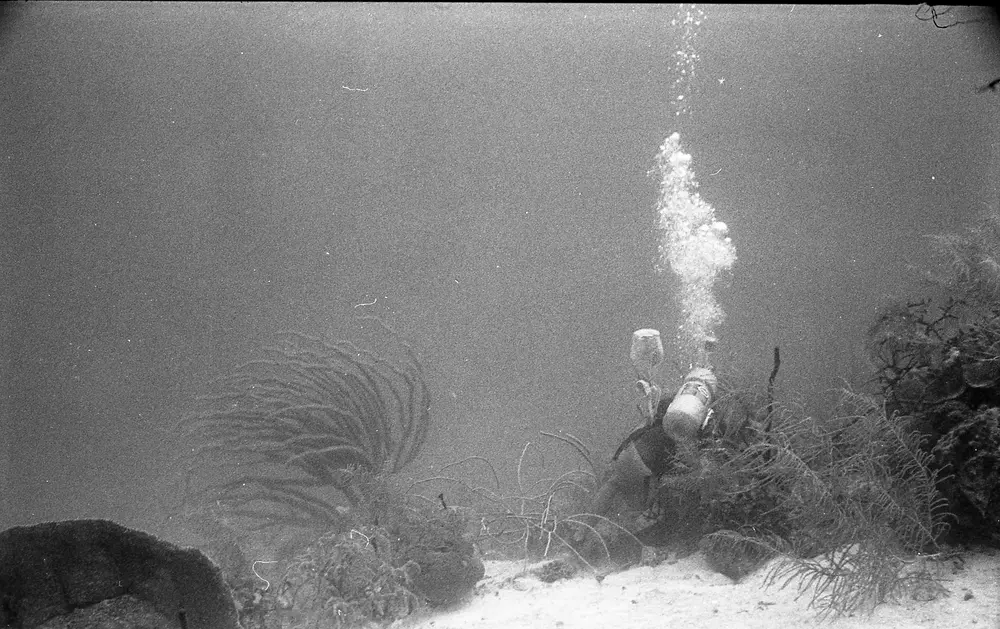{.lightbox group="discovery-bay-1966" description="**UUID: **1d616b1f-c6cf-40a4-8de8-a2138ec3bb4d **Date: **1967-05-26 **Location: **Jamaica | Discovery Bay | Pinnacle 1 Slope **Longitude: **77.41017ºW **Latitude: **18.47367ºN **Photographer: **Eileen Graham **Copyright: **Trustees of the Natural History Museum (London, UK), CC-BY-4.0" alt="**UUID: **1d616b1f-c6cf-40a4-8de8-a2138ec3bb4d **Date: **1967-05-26 **Location: **Jamaica | Discovery Bay | Pinnacle 1 Slope **Longitude: **77.41017ºW **Latitude: **18.47367ºN **Photographer: **Eileen Graham **Copyright: **Trustees of the Natural History Museum (London, UK), CC-BY-4.0"}

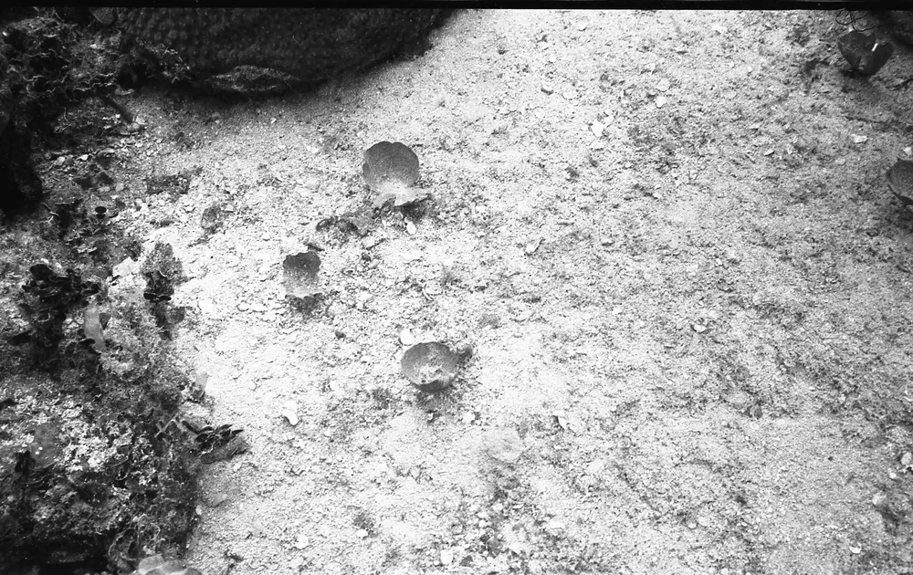{.lightbox group="discovery-bay-1966" description="**UUID: **aff7678a-999c-494e-95d0-7164a03ad5b9 **Date: **1967-05-26 **Location: **Jamaica | Discovery Bay | Pinnacle 1 Slope **Longitude: **77.41017ºW **Latitude: **18.47367ºN **Photographer: **Eileen Graham **Copyright: **Trustees of the Natural History Museum (London, UK), CC-BY-4.0" alt="**UUID: **aff7678a-999c-494e-95d0-7164a03ad5b9 **Date: **1967-05-26 **Location: **Jamaica | Discovery Bay | Pinnacle 1 Slope **Longitude: **77.41017ºW **Latitude: **18.47367ºN **Photographer: **Eileen Graham **Copyright: **Trustees of the Natural History Museum (London, UK), CC-BY-4.0"}

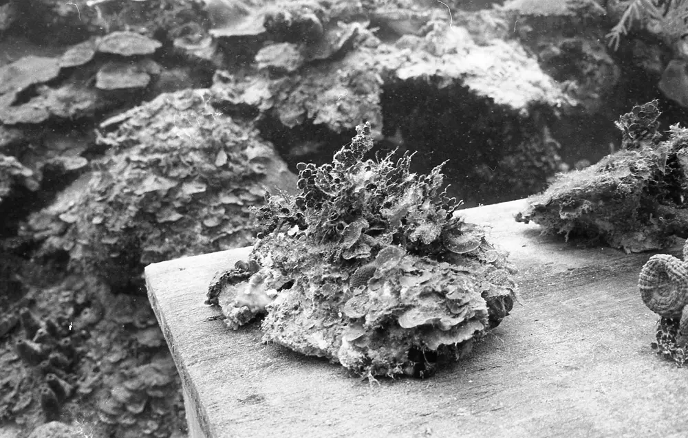{.lightbox group="discovery-bay-1966" description="**UUID: **1372c115-2761-4f18-934f-af6723af4842 **Date: **1967-05-26 **Location: **Jamaica | Discovery Bay | Pinnacle 1 Slope **Longitude: **77.41017ºW **Latitude: **18.47367ºN **Photographer: **Eileen Graham **Copyright: **Trustees of the Natural History Museum (London, UK), CC-BY-4.0" alt="**UUID: **1372c115-2761-4f18-934f-af6723af4842 **Date: **1967-05-26 **Location: **Jamaica | Discovery Bay | Pinnacle 1 Slope **Longitude: **77.41017ºW **Latitude: **18.47367ºN **Photographer: **Eileen Graham **Copyright: **Trustees of the Natural History Museum (London, UK), CC-BY-4.0"}

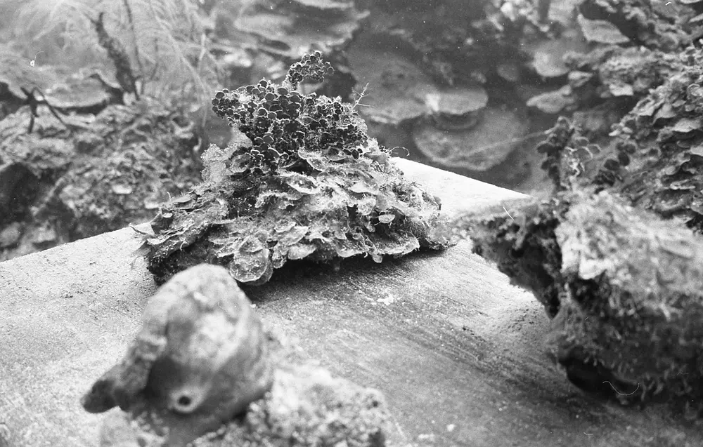{.lightbox group="discovery-bay-1966" description="**UUID: **1f0947cf-6597-40e2-a298-fc00f90f7dc5 **Date: **1967-05-26 **Location: **Jamaica | Discovery Bay | Pinnacle 1 Slope **Longitude: **77.41017ºW **Latitude: **18.47367ºN **Photographer: **Eileen Graham **Copyright: **Trustees of the Natural History Museum (London, UK), CC-BY-4.0" alt="**UUID: **1f0947cf-6597-40e2-a298-fc00f90f7dc5 **Date: **1967-05-26 **Location: **Jamaica | Discovery Bay | Pinnacle 1 Slope **Longitude: **77.41017ºW **Latitude: **18.47367ºN **Photographer: **Eileen Graham **Copyright: **Trustees of the Natural History Museum (London, UK), CC-BY-4.0"}

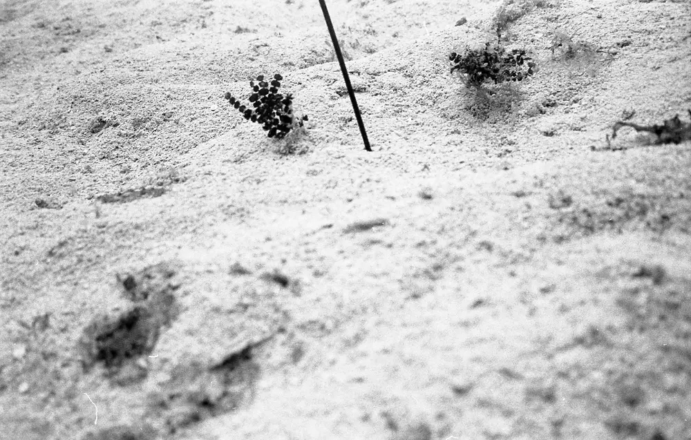{.lightbox group="discovery-bay-1966" description="**UUID: **5a58c98e-a556-4b7c-8900-6d1050ea4395 **Date: **1967-05-26 **Location: **Jamaica | Discovery Bay | Pinnacle 1 Slope **Longitude: **77.41017ºW **Latitude: **18.47367ºN **Photographer: **Eileen Graham **Copyright: **Trustees of the Natural History Museum (London, UK), CC-BY-4.0" alt="**UUID: **5a58c98e-a556-4b7c-8900-6d1050ea4395 **Date: **1967-05-26 **Location: **Jamaica | Discovery Bay | Pinnacle 1 Slope **Longitude: **77.41017ºW **Latitude: **18.47367ºN **Photographer: **Eileen Graham **Copyright: **Trustees of the Natural History Museum (London, UK), CC-BY-4.0"}

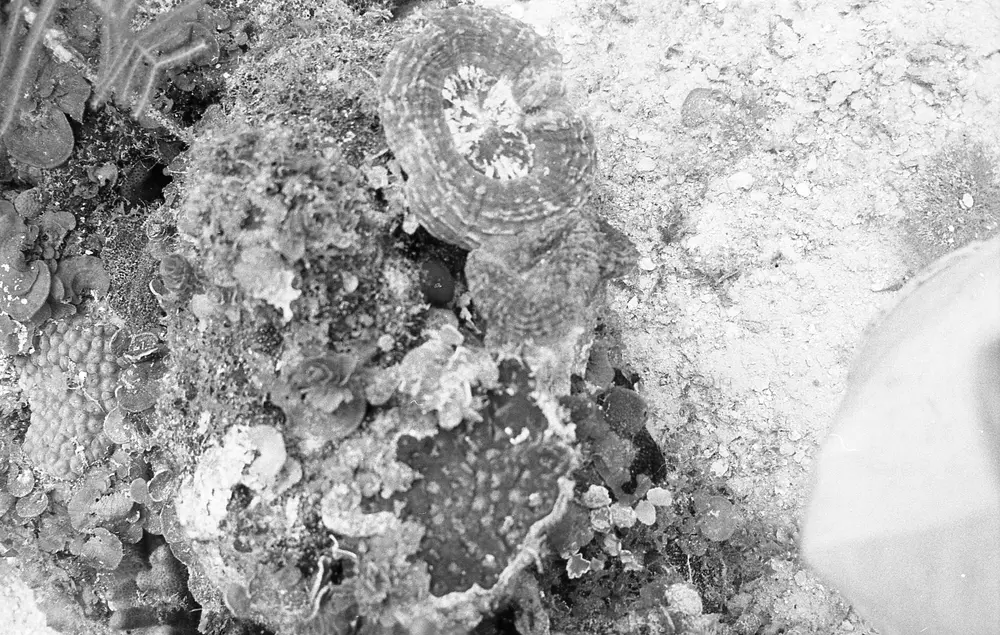{.lightbox group="discovery-bay-1966" description="**UUID: **167e735f-1b16-4867-923c-4f02f3fb266a **Date: **1967-05-26 **Location: **Jamaica | Discovery Bay | Pinnacle 1 Slope **Longitude: **77.41017ºW **Latitude: **18.47367ºN **Photographer: **Eileen Graham **Copyright: **Trustees of the Natural History Museum (London, UK), CC-BY-4.0" alt="**UUID: **167e735f-1b16-4867-923c-4f02f3fb266a **Date: **1967-05-26 **Location: **Jamaica | Discovery Bay | Pinnacle 1 Slope **Longitude: **77.41017ºW **Latitude: **18.47367ºN **Photographer: **Eileen Graham **Copyright: **Trustees of the Natural History Museum (London, UK), CC-BY-4.0"}

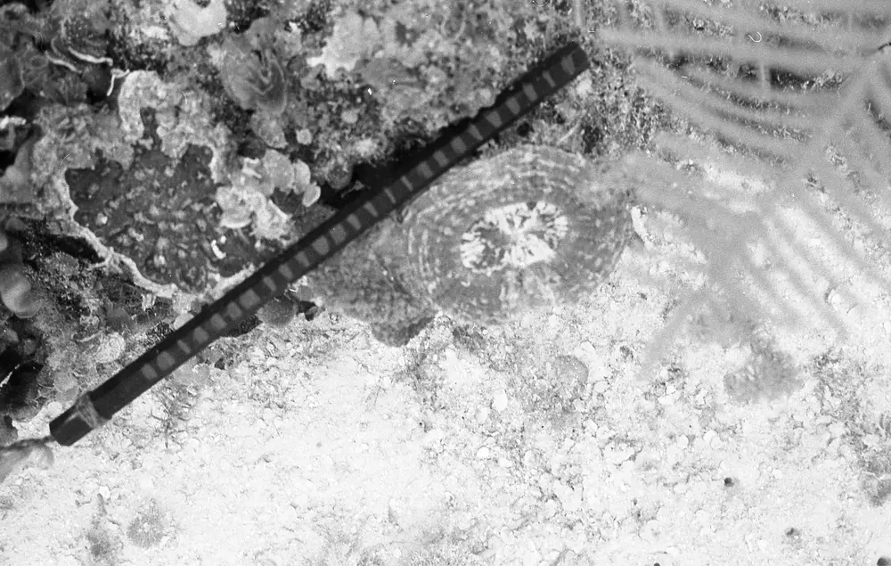{.lightbox group="discovery-bay-1966" description="**UUID: **7ec48de3-9d53-4aee-8004-a250d6541dda **Date: **1967-05-26 **Location: **Jamaica | Discovery Bay | Pinnacle 1 Slope **Longitude: **77.41017ºW **Latitude: **18.47367ºN **Photographer: **Eileen Graham **Copyright: **Trustees of the Natural History Museum (London, UK), CC-BY-4.0" alt="**UUID: **7ec48de3-9d53-4aee-8004-a250d6541dda **Date: **1967-05-26 **Location: **Jamaica | Discovery Bay | Pinnacle 1 Slope **Longitude: **77.41017ºW **Latitude: **18.47367ºN **Photographer: **Eileen Graham **Copyright: **Trustees of the Natural History Museum (London, UK), CC-BY-4.0"}

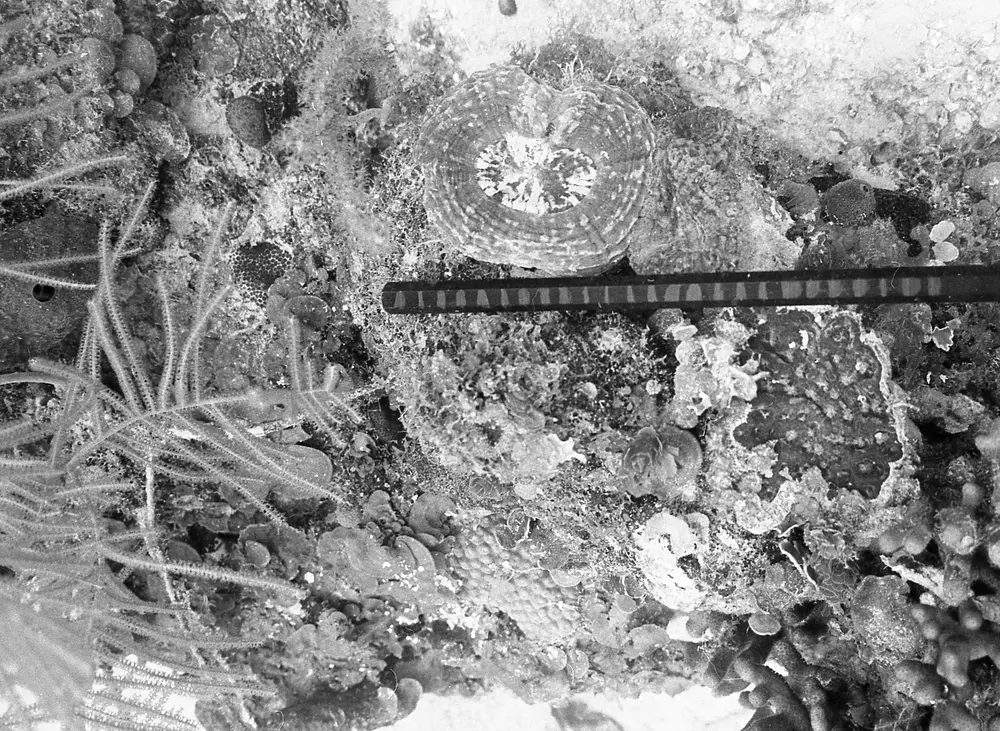{.lightbox group="discovery-bay-1966" description="**UUID: **b3ea9bb1-3aaa-478e-b8e0-78ef9e96c0bd **Date: **1967-05-26 **Location: **Jamaica | Discovery Bay | Pinnacle 1 Slope **Longitude: **77.41017ºW **Latitude: **18.47367ºN **Photographer: **Eileen Graham **Copyright: **Trustees of the Natural History Museum (London, UK), CC-BY-4.0" alt="**UUID: **b3ea9bb1-3aaa-478e-b8e0-78ef9e96c0bd **Date: **1967-05-26 **Location: **Jamaica | Discovery Bay | Pinnacle 1 Slope **Longitude: **77.41017ºW **Latitude: **18.47367ºN **Photographer: **Eileen Graham **Copyright: **Trustees of the Natural History Museum (London, UK), CC-BY-4.0"}

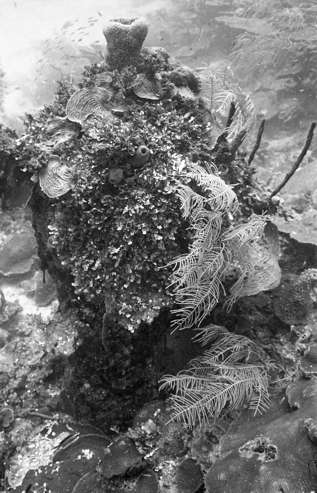{.lightbox group="discovery-bay-1966" description="**UUID: **2dbd4269-8e0d-4316-981a-61b405b2b90e **Date: **1967-05-29 **Location: **Jamaica | Discovery Bay | Pinnacle 1 Slope **Longitude: **77.41017ºW **Latitude: **18.47367ºN **Photographer: **Eileen Graham **Copyright: **Trustees of the Natural History Museum (London, UK), CC-BY-4.0" alt="**UUID: **2dbd4269-8e0d-4316-981a-61b405b2b90e **Date: **1967-05-29 **Location: **Jamaica | Discovery Bay | Pinnacle 1 Slope **Longitude: **77.41017ºW **Latitude: **18.47367ºN **Photographer: **Eileen Graham **Copyright: **Trustees of the Natural History Museum (London, UK), CC-BY-4.0"}

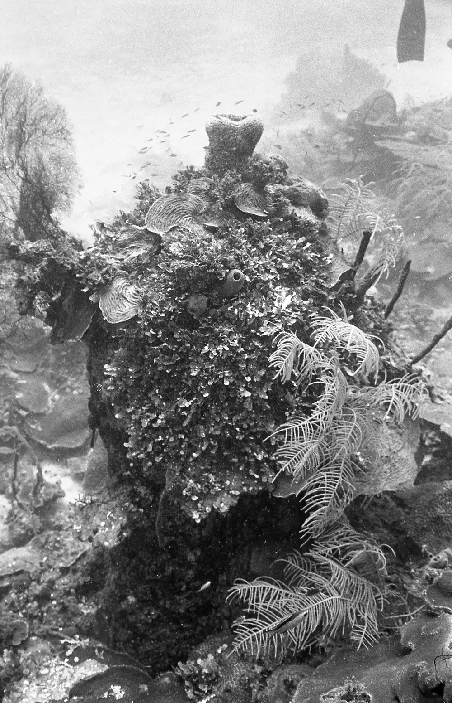{.lightbox group="discovery-bay-1966" description="**UUID: **db22c385-bdfa-40f7-811a-956cb45aae29 **Date: **1967-05-29 **Location: **Jamaica | Discovery Bay | Pinnacle 1 Slope **Longitude: **77.41017ºW **Latitude: **18.47367ºN **Photographer: **Eileen Graham **Copyright: **Trustees of the Natural History Museum (London, UK), CC-BY-4.0" alt="**UUID: **db22c385-bdfa-40f7-811a-956cb45aae29 **Date: **1967-05-29 **Location: **Jamaica | Discovery Bay | Pinnacle 1 Slope **Longitude: **77.41017ºW **Latitude: **18.47367ºN **Photographer: **Eileen Graham **Copyright: **Trustees of the Natural History Museum (London, UK), CC-BY-4.0"}

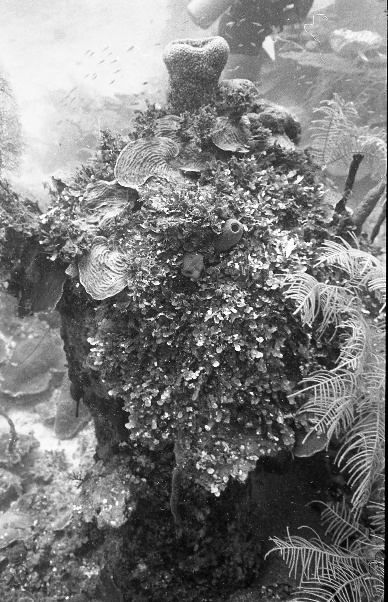{.lightbox group="discovery-bay-1966" description="**UUID: **389a734f-e91d-4216-b232-49241077a6f1 **Date: **1967-05-29 **Location: **Jamaica | Discovery Bay | Pinnacle 1 Slope **Longitude: **77.41017ºW **Latitude: **18.47367ºN **Photographer: **Eileen Graham **Copyright: **Trustees of the Natural History Museum (London, UK), CC-BY-4.0" alt="**UUID: **389a734f-e91d-4216-b232-49241077a6f1 **Date: **1967-05-29 **Location: **Jamaica | Discovery Bay | Pinnacle 1 Slope **Longitude: **77.41017ºW **Latitude: **18.47367ºN **Photographer: **Eileen Graham **Copyright: **Trustees of the Natural History Museum (London, UK), CC-BY-4.0"}

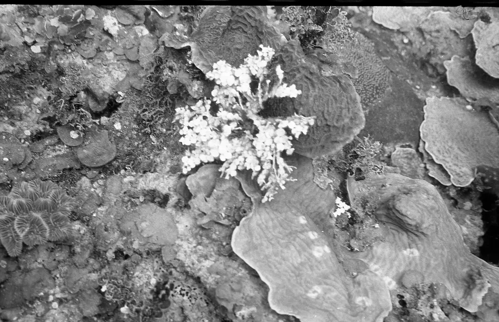{.lightbox group="discovery-bay-1966" description="**UUID: **dc590440-fbf8-4eb3-87ae-04b74ba4c240 **Date: **1967-05-29 **Location: **Jamaica | Discovery Bay | Pinnacle 1 Slope **Longitude: **77.41017ºW **Latitude: **18.47367ºN **Photographer: **Eileen Graham **Copyright: **Trustees of the Natural History Museum (London, UK), CC-BY-4.0" alt="**UUID: **dc590440-fbf8-4eb3-87ae-04b74ba4c240 **Date: **1967-05-29 **Location: **Jamaica | Discovery Bay | Pinnacle 1 Slope **Longitude: **77.41017ºW **Latitude: **18.47367ºN **Photographer: **Eileen Graham **Copyright: **Trustees of the Natural History Museum (London, UK), CC-BY-4.0"}

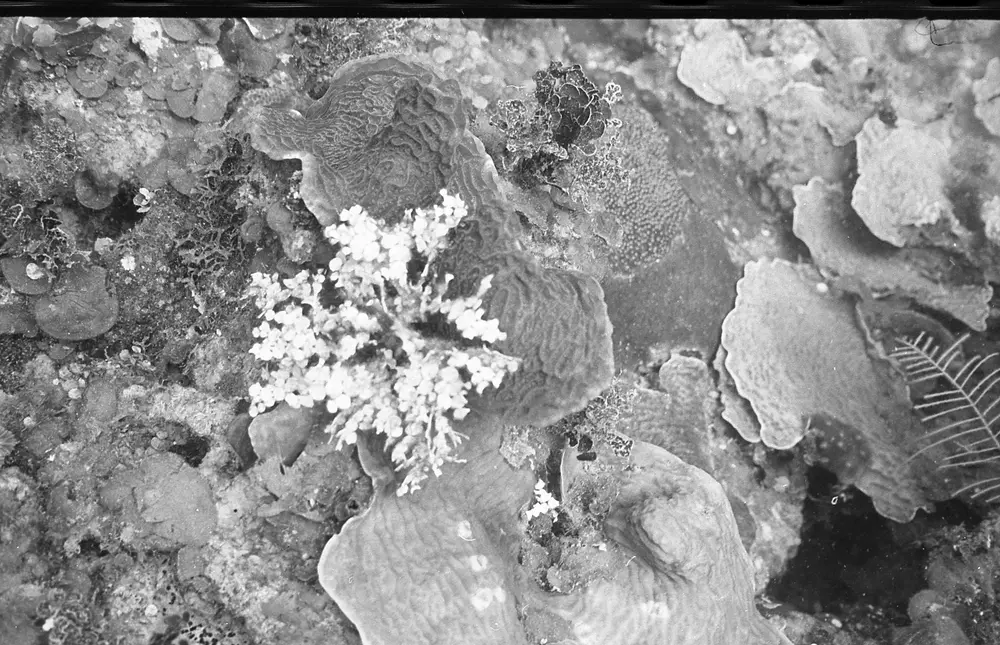{.lightbox group="discovery-bay-1966" description="**UUID: **89acf769-e2ed-414c-8d6c-de8f6ae40026 **Date: **1967-05-29 **Location: **Jamaica | Discovery Bay | Pinnacle 1 Slope **Longitude: **77.41017ºW **Latitude: **18.47367ºN **Photographer: **Eileen Graham **Copyright: **Trustees of the Natural History Museum (London, UK), CC-BY-4.0" alt="**UUID: **89acf769-e2ed-414c-8d6c-de8f6ae40026 **Date: **1967-05-29 **Location: **Jamaica | Discovery Bay | Pinnacle 1 Slope **Longitude: **77.41017ºW **Latitude: **18.47367ºN **Photographer: **Eileen Graham **Copyright: **Trustees of the Natural History Museum (London, UK), CC-BY-4.0"}

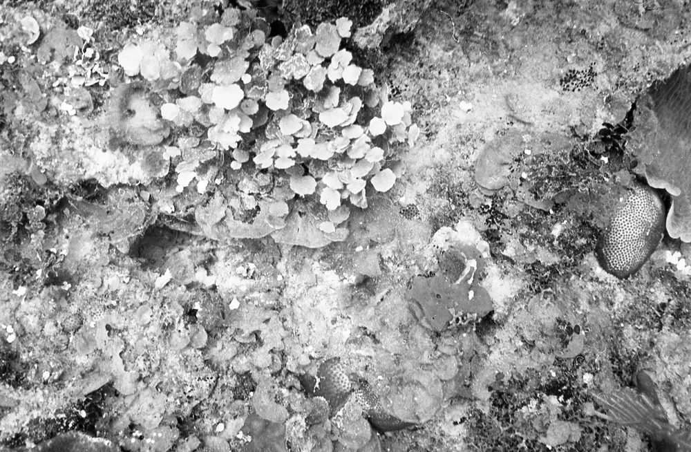{.lightbox group="discovery-bay-1966" description="**UUID: **9ce6cabe-479a-43be-96e1-c2fe67215252 **Date: **1967-05-29 **Location: **Jamaica | Discovery Bay | Pinnacle 1 Slope **Longitude: **77.41017ºW **Latitude: **18.47367ºN **Photographer: **Eileen Graham **Copyright: **Trustees of the Natural History Museum (London, UK), CC-BY-4.0" alt="**UUID: **9ce6cabe-479a-43be-96e1-c2fe67215252 **Date: **1967-05-29 **Location: **Jamaica | Discovery Bay | Pinnacle 1 Slope **Longitude: **77.41017ºW **Latitude: **18.47367ºN **Photographer: **Eileen Graham **Copyright: **Trustees of the Natural History Museum (London, UK), CC-BY-4.0"}

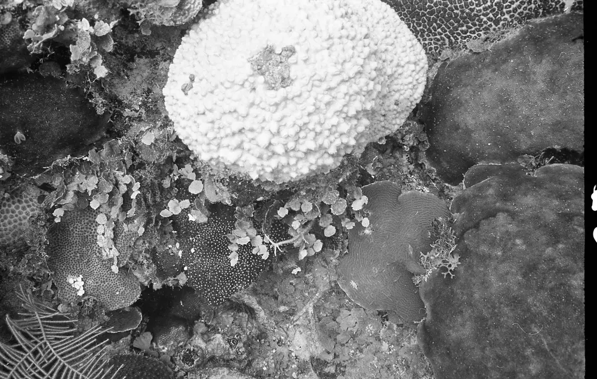{.lightbox group="discovery-bay-1966" description="**UUID: **d6ca2265-11c8-46fa-a279-655660724b29 **Date: **1967-05-29 **Location: **Jamaica | Discovery Bay | Pinnacle 1 Slope **Longitude: **77.41017ºW **Latitude: **18.47367ºN **Photographer: **Eileen Graham **Copyright: **Trustees of the Natural History Museum (London, UK), CC-BY-4.0" alt="**UUID: **d6ca2265-11c8-46fa-a279-655660724b29 **Date: **1967-05-29 **Location: **Jamaica | Discovery Bay | Pinnacle 1 Slope **Longitude: **77.41017ºW **Latitude: **18.47367ºN **Photographer: **Eileen Graham **Copyright: **Trustees of the Natural History Museum (London, UK), CC-BY-4.0"}

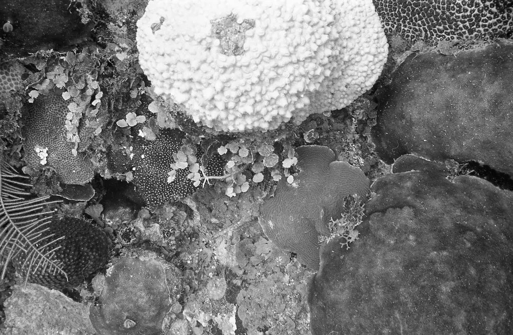{.lightbox group="discovery-bay-1966" description="**UUID: **39bf7738-c654-4057-8757-86aa043af55b **Date: **1967-05-29 **Location: **Jamaica | Discovery Bay | Pinnacle 1 Slope **Longitude: **77.41017ºW **Latitude: **18.47367ºN **Photographer: **Eileen Graham **Copyright: **Trustees of the Natural History Museum (London, UK), CC-BY-4.0" alt="**UUID: **39bf7738-c654-4057-8757-86aa043af55b **Date: **1967-05-29 **Location: **Jamaica | Discovery Bay | Pinnacle 1 Slope **Longitude: **77.41017ºW **Latitude: **18.47367ºN **Photographer: **Eileen Graham **Copyright: **Trustees of the Natural History Museum (London, UK), CC-BY-4.0"}

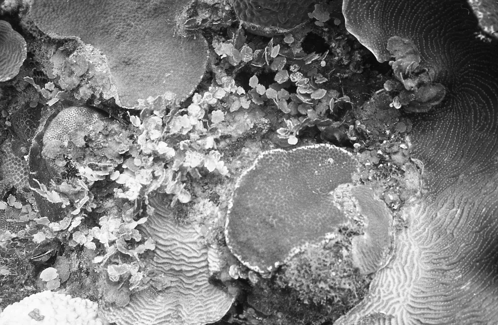{.lightbox group="discovery-bay-1966" description="**UUID: **5d6e5e3c-063f-48a8-a87b-721aa8a51b3b **Date: **1967-05-29 **Location: **Jamaica | Discovery Bay | Pinnacle 1 Slope **Longitude: **77.41017ºW **Latitude: **18.47367ºN **Photographer: **Eileen Graham **Copyright: **Trustees of the Natural History Museum (London, UK), CC-BY-4.0" alt="**UUID: **5d6e5e3c-063f-48a8-a87b-721aa8a51b3b **Date: **1967-05-29 **Location: **Jamaica | Discovery Bay | Pinnacle 1 Slope **Longitude: **77.41017ºW **Latitude: **18.47367ºN **Photographer: **Eileen Graham **Copyright: **Trustees of the Natural History Museum (London, UK), CC-BY-4.0"}

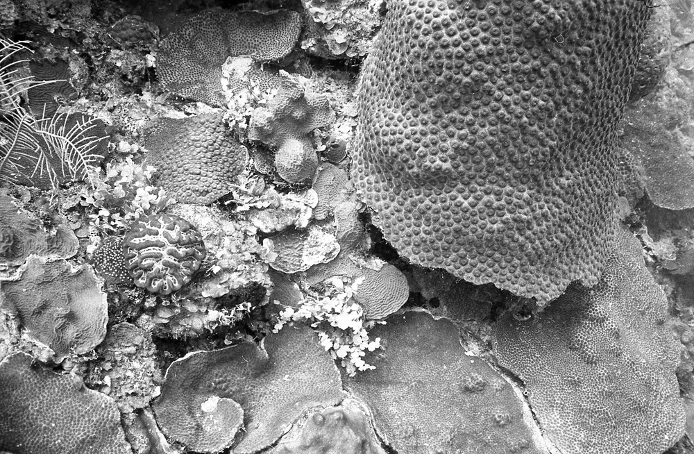{.lightbox group="discovery-bay-1966" description="**UUID: **f619045f-1d21-4e24-8925-2d83c8a3a4f2 **Date: **1967-05-29 **Location: **Jamaica | Discovery Bay | Pinnacle 1 Slope **Longitude: **77.41017ºW **Latitude: **18.47367ºN **Photographer: **Eileen Graham **Copyright: **Trustees of the Natural History Museum (London, UK), CC-BY-4.0" alt="**UUID: **f619045f-1d21-4e24-8925-2d83c8a3a4f2 **Date: **1967-05-29 **Location: **Jamaica | Discovery Bay | Pinnacle 1 Slope **Longitude: **77.41017ºW **Latitude: **18.47367ºN **Photographer: **Eileen Graham **Copyright: **Trustees of the Natural History Museum (London, UK), CC-BY-4.0"}

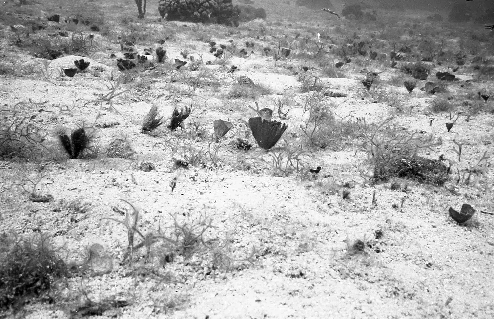{.lightbox group="discovery-bay-1966" description="**UUID: **777735fe-79f9-4e9c-b039-c6cd5c682f23 **Date: **1967-05-30 **Location: **Jamaica | Discovery Bay | Pinnacle 1 Sand Slope **Longitude: **77.41017ºW **Latitude: **18.47367ºN **Photographer: **Eileen Graham **Copyright: **Trustees of the Natural History Museum (London, UK), CC-BY-4.0" alt="**UUID: **777735fe-79f9-4e9c-b039-c6cd5c682f23 **Date: **1967-05-30 **Location: **Jamaica | Discovery Bay | Pinnacle 1 Sand Slope **Longitude: **77.41017ºW **Latitude: **18.47367ºN **Photographer: **Eileen Graham **Copyright: **Trustees of the Natural History Museum (London, UK), CC-BY-4.0"}

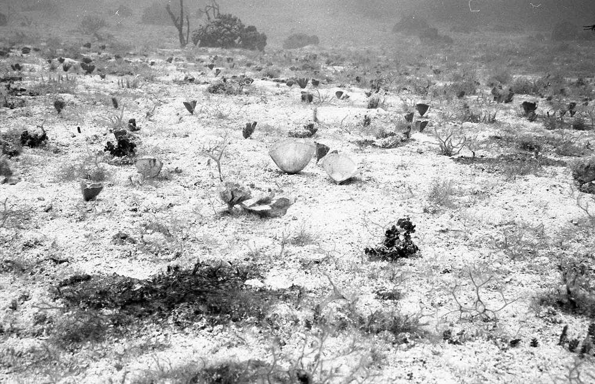{.lightbox group="discovery-bay-1966" description="**UUID: **8944ff81-e506-47c4-a417-59bc8b53c8dd **Date: **1967-05-30 **Location: **Jamaica | Discovery Bay | Pinnacle 1 Sand Slope **Longitude: **77.41017ºW **Latitude: **18.47367ºN **Photographer: **Eileen Graham **Copyright: **Trustees of the Natural History Museum (London, UK), CC-BY-4.0" alt="**UUID: **8944ff81-e506-47c4-a417-59bc8b53c8dd **Date: **1967-05-30 **Location: **Jamaica | Discovery Bay | Pinnacle 1 Sand Slope **Longitude: **77.41017ºW **Latitude: **18.47367ºN **Photographer: **Eileen Graham **Copyright: **Trustees of the Natural History Museum (London, UK), CC-BY-4.0"}

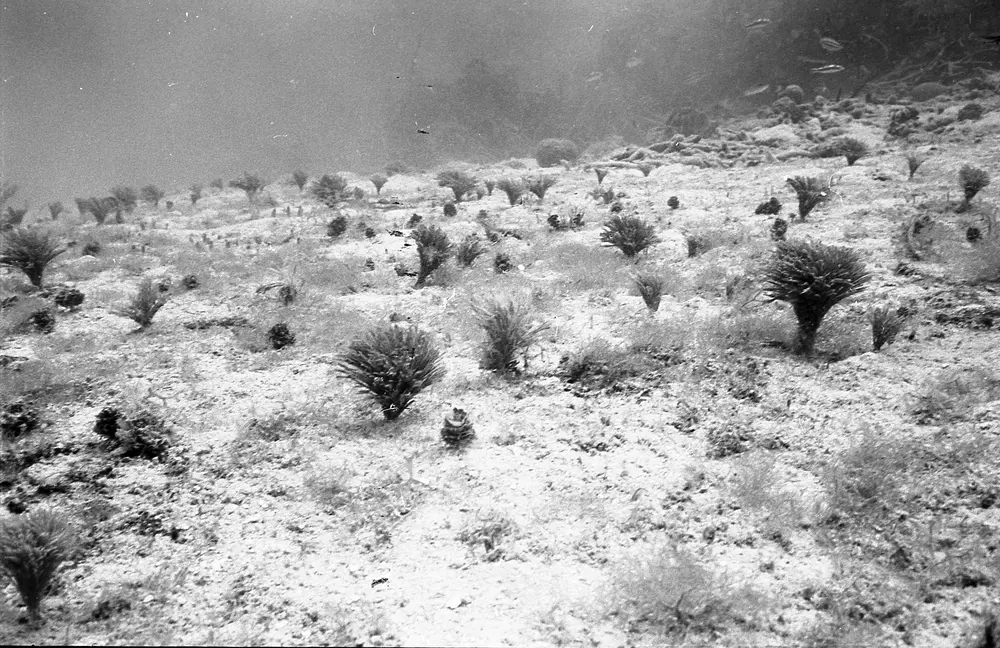{.lightbox group="discovery-bay-1966" description="**UUID: **d721e0d7-2b68-40e0-9bbb-5c82204f40df **Date: **1967-05-30 **Location: **Jamaica | Discovery Bay | Pinnacle 1 Sand Slope **Longitude: **77.41017ºW **Latitude: **18.47367ºN **Photographer: **Eileen Graham **Copyright: **Trustees of the Natural History Museum (London, UK), CC-BY-4.0" alt="**UUID: **d721e0d7-2b68-40e0-9bbb-5c82204f40df **Date: **1967-05-30 **Location: **Jamaica | Discovery Bay | Pinnacle 1 Sand Slope **Longitude: **77.41017ºW **Latitude: **18.47367ºN **Photographer: **Eileen Graham **Copyright: **Trustees of the Natural History Museum (London, UK), CC-BY-4.0"}

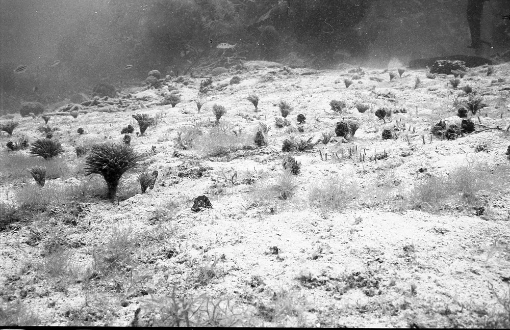{.lightbox group="discovery-bay-1966" description="**UUID: **927531a6-485d-40fb-9422-d1a6140e4652 **Date: **1967-05-30 **Location: **Jamaica | Discovery Bay | Pinnacle 1 Sand Slope **Longitude: **77.39ºW **Latitude: **18.47167ºN **Photographer: **Eileen Graham **Copyright: **Trustees of the Natural History Museum (London, UK), CC-BY-4.0" alt="**UUID: **927531a6-485d-40fb-9422-d1a6140e4652 **Date: **1967-05-30 **Location: **Jamaica | Discovery Bay | Pinnacle 1 Sand Slope **Longitude: **77.39ºW **Latitude: **18.47167ºN **Photographer: **Eileen Graham **Copyright: **Trustees of the Natural History Museum (London, UK), CC-BY-4.0"}

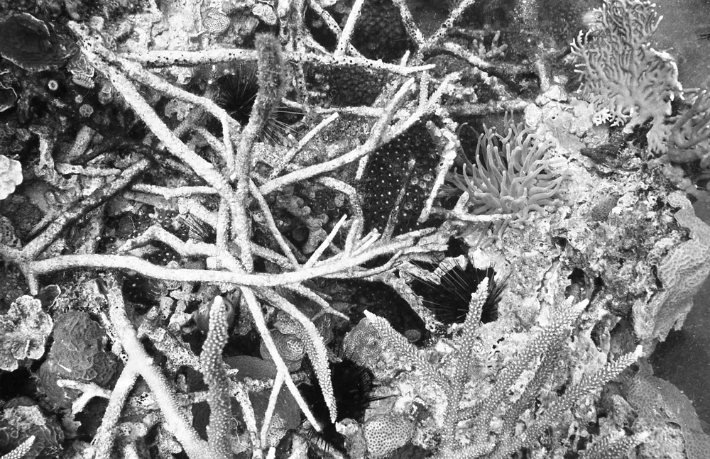{.lightbox group="discovery-bay-1966" description="**UUID: **7aaf4109-a0fe-4852-82dc-6376d5c78837 **Date: **1967-05-30 **Location: **Jamaica | Discovery Bay | Pinnacle 1 Slope **Longitude: **77.41017ºW **Latitude: **18.47367ºN **Photographer: **Eileen Graham **Copyright: **Trustees of the Natural History Museum (London, UK), CC-BY-4.0" alt="**UUID: **7aaf4109-a0fe-4852-82dc-6376d5c78837 **Date: **1967-05-30 **Location: **Jamaica | Discovery Bay | Pinnacle 1 Slope **Longitude: **77.41017ºW **Latitude: **18.47367ºN **Photographer: **Eileen Graham **Copyright: **Trustees of the Natural History Museum (London, UK), CC-BY-4.0"}

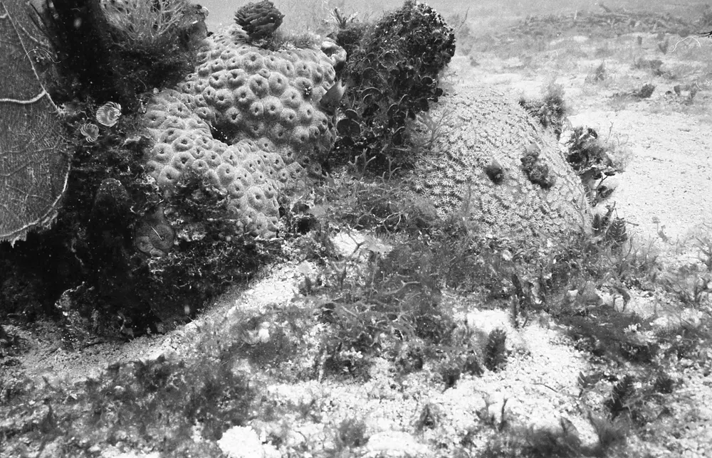{.lightbox group="discovery-bay-1966" description="**UUID: **65c271b3-62a9-4c6d-bad9-830161073c1f **Date: **1967-05-30 **Location: **Jamaica | Discovery Bay | Pinnacle 1 Slope **Longitude: **77.41017ºW **Latitude: **18.47367ºN **Photographer: **Eileen Graham **Copyright: **Trustees of the Natural History Museum (London, UK), CC-BY-4.0" alt="**UUID: **65c271b3-62a9-4c6d-bad9-830161073c1f **Date: **1967-05-30 **Location: **Jamaica | Discovery Bay | Pinnacle 1 Slope **Longitude: **77.41017ºW **Latitude: **18.47367ºN **Photographer: **Eileen Graham **Copyright: **Trustees of the Natural History Museum (London, UK), CC-BY-4.0"}

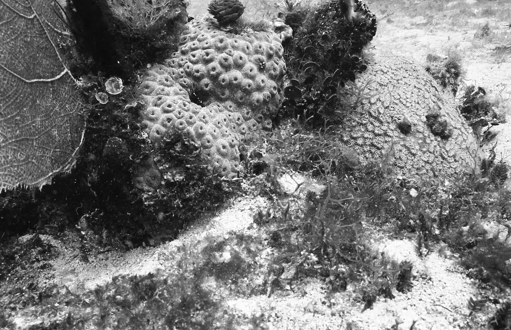{.lightbox group="discovery-bay-1966" description="**UUID: **63e52689-a4b5-4cbd-ab1f-cb74a7660d40 **Date: **1967-05-30 **Location: **Jamaica | Discovery Bay | Pinnacle 1 Slope **Longitude: **77.41017ºW **Latitude: **18.47367ºN **Photographer: **Eileen Graham **Copyright: **Trustees of the Natural History Museum (London, UK), CC-BY-4.0" alt="**UUID: **63e52689-a4b5-4cbd-ab1f-cb74a7660d40 **Date: **1967-05-30 **Location: **Jamaica | Discovery Bay | Pinnacle 1 Slope **Longitude: **77.41017ºW **Latitude: **18.47367ºN **Photographer: **Eileen Graham **Copyright: **Trustees of the Natural History Museum (London, UK), CC-BY-4.0"}

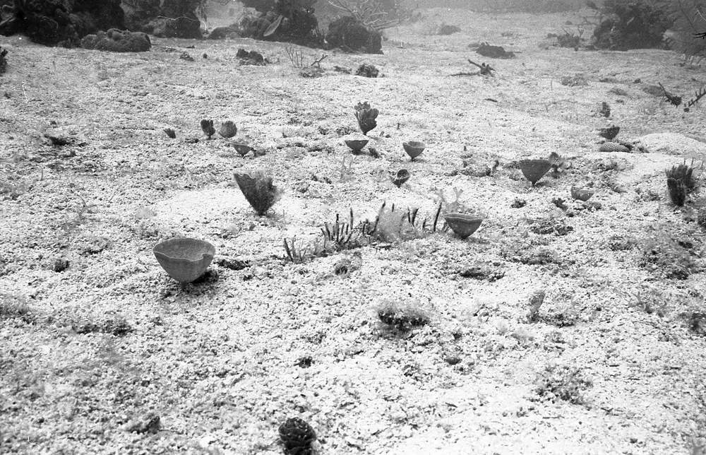{.lightbox group="discovery-bay-1966" description="**UUID: **d340b843-f9d0-4ca6-afa9-24259a6b271d **Date: **1967-05-30 **Location: **Jamaica | Discovery Bay | Pinnacle 1 Sand Slope **Longitude: **77.41017ºW **Latitude: **18.47367ºN **Photographer: **Eileen Graham **Copyright: **Trustees of the Natural History Museum (London, UK), CC-BY-4.0" alt="**UUID: **d340b843-f9d0-4ca6-afa9-24259a6b271d **Date: **1967-05-30 **Location: **Jamaica | Discovery Bay | Pinnacle 1 Sand Slope **Longitude: **77.41017ºW **Latitude: **18.47367ºN **Photographer: **Eileen Graham **Copyright: **Trustees of the Natural History Museum (London, UK), CC-BY-4.0"}

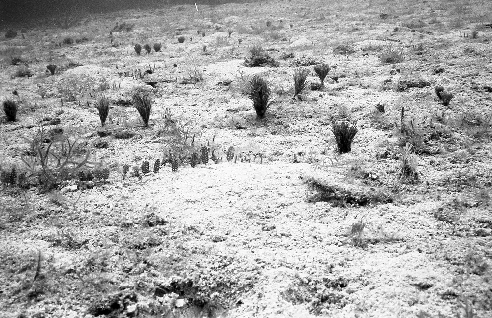{.lightbox group="discovery-bay-1966" description="**UUID: **23e8ddcd-3561-4b4a-85f2-01f7ceb25f8a **Date: **1967-05-30 **Location: **Jamaica | Discovery Bay | Pinnacle 1 Sand Slope **Longitude: **77.41017ºW **Latitude: **18.47367ºN **Photographer: **Eileen Graham **Copyright: **Trustees of the Natural History Museum (London, UK), CC-BY-4.0" alt="**UUID: **23e8ddcd-3561-4b4a-85f2-01f7ceb25f8a **Date: **1967-05-30 **Location: **Jamaica | Discovery Bay | Pinnacle 1 Sand Slope **Longitude: **77.41017ºW **Latitude: **18.47367ºN **Photographer: **Eileen Graham **Copyright: **Trustees of the Natural History Museum (London, UK), CC-BY-4.0"}

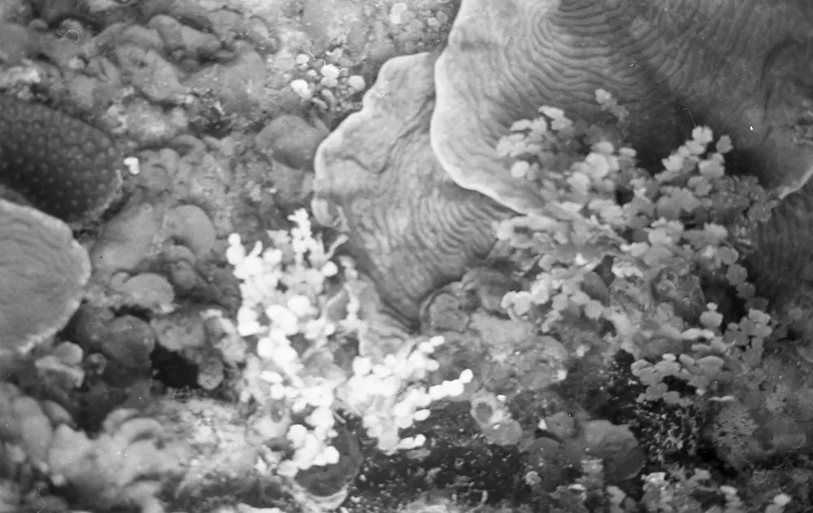{.lightbox group="discovery-bay-1966" description="**UUID: **d8c426dd-752c-459f-9fbd-e09b6e733a1d **Date: **1967-05-31 **Location: **Jamaica | Discovery Bay | Pinnacle 1 Slope **Longitude: **77.41017ºW **Latitude: **18.47367ºN **Photographer: **Eileen Graham **Copyright: **Trustees of the Natural History Museum (London, UK), CC-BY-4.0" alt="**UUID: **d8c426dd-752c-459f-9fbd-e09b6e733a1d **Date: **1967-05-31 **Location: **Jamaica | Discovery Bay | Pinnacle 1 Slope **Longitude: **77.41017ºW **Latitude: **18.47367ºN **Photographer: **Eileen Graham **Copyright: **Trustees of the Natural History Museum (London, UK), CC-BY-4.0"}

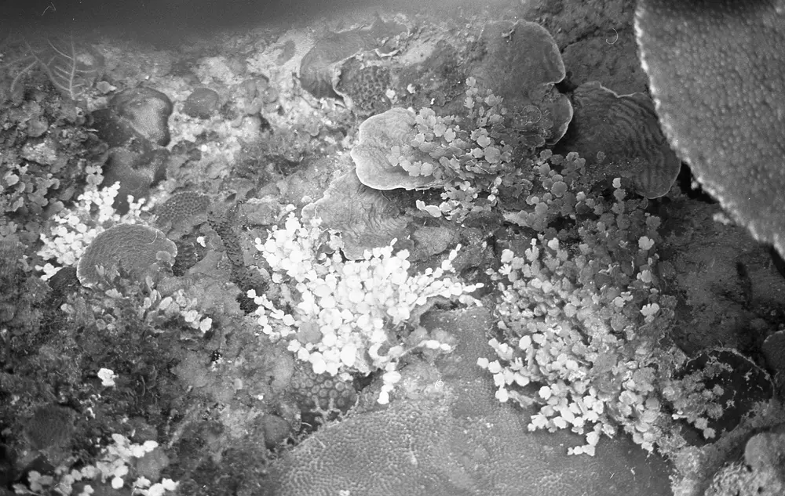{.lightbox group="discovery-bay-1966" description="**UUID: **b40a3920-2f52-4111-9387-eda348bc4301 **Date: **1967-05-31 **Location: **Jamaica | Discovery Bay | Pinnacle 1 Slope **Longitude: **77.41017ºW **Latitude: **18.47367ºN **Photographer: **Eileen Graham **Copyright: **Trustees of the Natural History Museum (London, UK), CC-BY-4.0" alt="**UUID: **b40a3920-2f52-4111-9387-eda348bc4301 **Date: **1967-05-31 **Location: **Jamaica | Discovery Bay | Pinnacle 1 Slope **Longitude: **77.41017ºW **Latitude: **18.47367ºN **Photographer: **Eileen Graham **Copyright: **Trustees of the Natural History Museum (London, UK), CC-BY-4.0"}

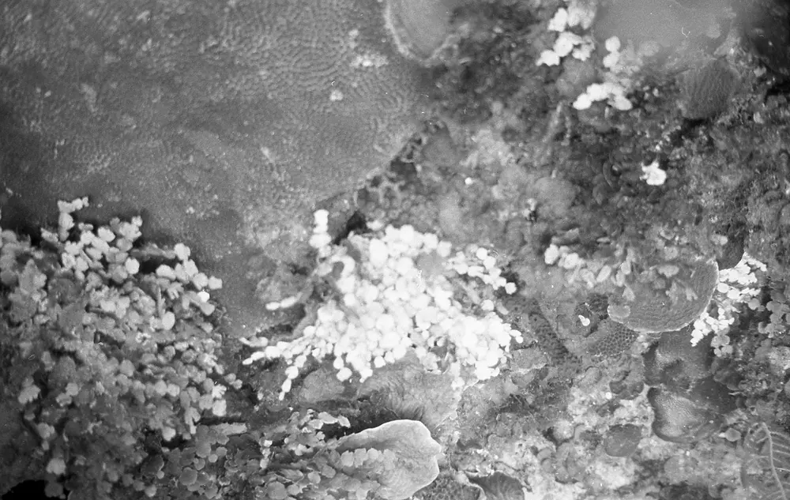{.lightbox group="discovery-bay-1966" description="**UUID: **1a8af45c-9c7a-4f1e-b83b-d0681aba8ccf **Date: **1967-05-31 **Location: **Jamaica | Discovery Bay | Pinnacle 1 Slope **Longitude: **77.41017ºW **Latitude: **18.47367ºN **Photographer: **Eileen Graham **Copyright: **Trustees of the Natural History Museum (London, UK), CC-BY-4.0" alt="**UUID: **1a8af45c-9c7a-4f1e-b83b-d0681aba8ccf **Date: **1967-05-31 **Location: **Jamaica | Discovery Bay | Pinnacle 1 Slope **Longitude: **77.41017ºW **Latitude: **18.47367ºN **Photographer: **Eileen Graham **Copyright: **Trustees of the Natural History Museum (London, UK), CC-BY-4.0"}

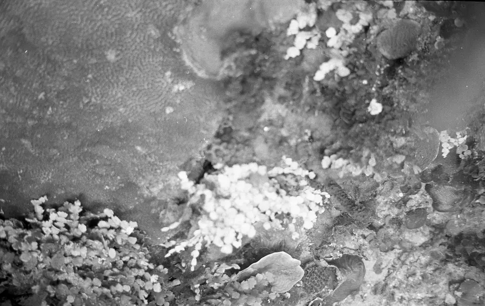{.lightbox group="discovery-bay-1966" description="**UUID: **9a940b0e-d6cf-4693-880d-3159f7d1e324 **Date: **1967-05-31 **Location: **Jamaica | Discovery Bay | Pinnacle 1 Slope **Longitude: **77.41017ºW **Latitude: **18.47367ºN **Photographer: **Eileen Graham **Copyright: **Trustees of the Natural History Museum (London, UK), CC-BY-4.0" alt="**UUID: **9a940b0e-d6cf-4693-880d-3159f7d1e324 **Date: **1967-05-31 **Location: **Jamaica | Discovery Bay | Pinnacle 1 Slope **Longitude: **77.41017ºW **Latitude: **18.47367ºN **Photographer: **Eileen Graham **Copyright: **Trustees of the Natural History Museum (London, UK), CC-BY-4.0"}

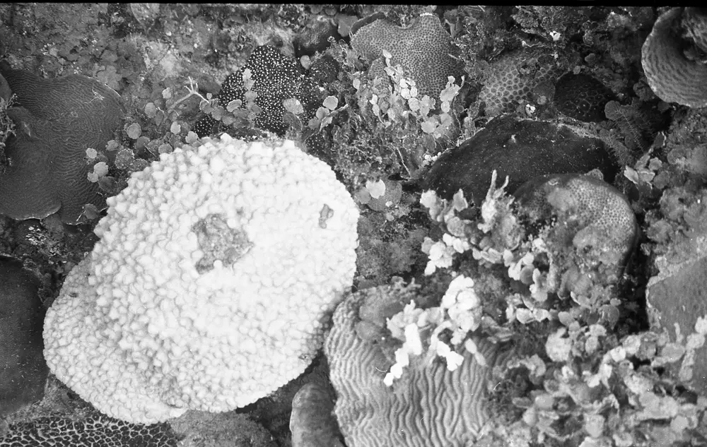{.lightbox group="discovery-bay-1966" description="**UUID: **cf4c684f-afe7-4365-b25a-d5e7f531fadc **Date: **1967-05-31 **Location: **Jamaica | Discovery Bay | Pinnacle 1 Slope **Longitude: **77.41017ºW **Latitude: **18.47367ºN **Photographer: **Eileen Graham **Copyright: **Trustees of the Natural History Museum (London, UK), CC-BY-4.0" alt="**UUID: **cf4c684f-afe7-4365-b25a-d5e7f531fadc **Date: **1967-05-31 **Location: **Jamaica | Discovery Bay | Pinnacle 1 Slope **Longitude: **77.41017ºW **Latitude: **18.47367ºN **Photographer: **Eileen Graham **Copyright: **Trustees of the Natural History Museum (London, UK), CC-BY-4.0"}

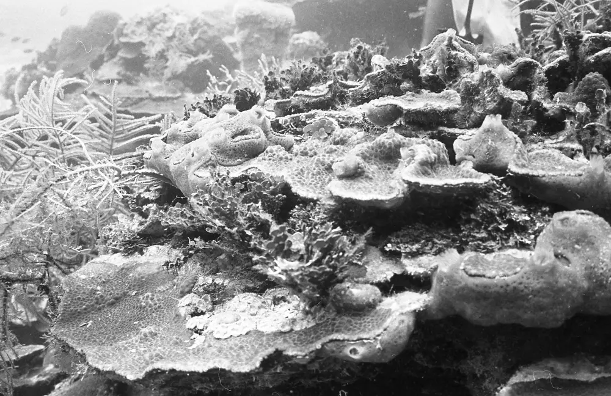{.lightbox group="discovery-bay-1966" description="**UUID: **405923d3-0305-4f75-afc7-e2410d558c0a **Date: **1967-05-31 **Location: **Jamaica | Discovery Bay | Pinnacle 1 Slope **Longitude: **77.41017ºW **Latitude: **18.47367ºN **Photographer: **Eileen Graham **Copyright: **Trustees of the Natural History Museum (London, UK), CC-BY-4.0" alt="**UUID: **405923d3-0305-4f75-afc7-e2410d558c0a **Date: **1967-05-31 **Location: **Jamaica | Discovery Bay | Pinnacle 1 Slope **Longitude: **77.41017ºW **Latitude: **18.47367ºN **Photographer: **Eileen Graham **Copyright: **Trustees of the Natural History Museum (London, UK), CC-BY-4.0"}

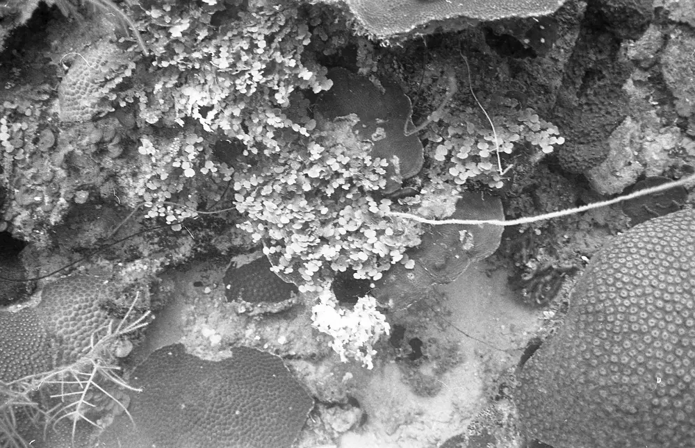{.lightbox group="discovery-bay-1966" description="**UUID: **02d70944-d939-4e66-a0e3-4ca5abd56e8b **Date: **1967-05-31 **Location: **Jamaica | Discovery Bay | Pinnacle 1 Slope **Longitude: **77.41017ºW **Latitude: **18.47367ºN **Photographer: **Eileen Graham **Copyright: **Trustees of the Natural History Museum (London, UK), CC-BY-4.0" alt="**UUID: **02d70944-d939-4e66-a0e3-4ca5abd56e8b **Date: **1967-05-31 **Location: **Jamaica | Discovery Bay | Pinnacle 1 Slope **Longitude: **77.41017ºW **Latitude: **18.47367ºN **Photographer: **Eileen Graham **Copyright: **Trustees of the Natural History Museum (London, UK), CC-BY-4.0"}

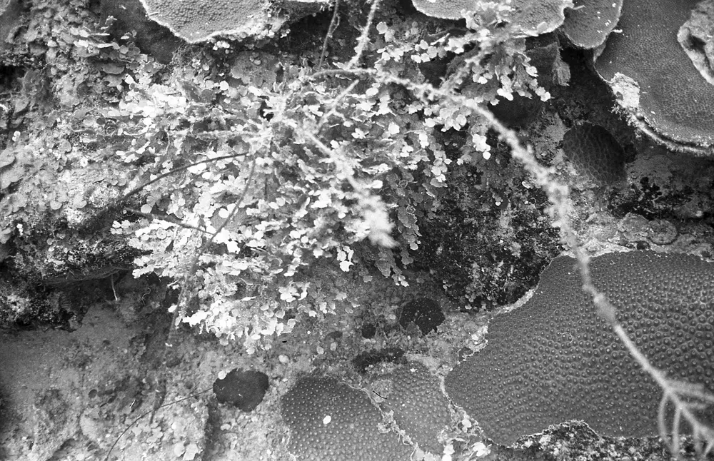{.lightbox group="discovery-bay-1966" description="**UUID: **34fc8aaa-185b-471a-af95-4674ca6bc189 **Date: **1967-05-31 **Location: **Jamaica | Discovery Bay | Pinnacle 1 Slope **Longitude: **77.41017ºW **Latitude: **18.47367ºN **Photographer: **Eileen Graham **Copyright: **Trustees of the Natural History Museum (London, UK), CC-BY-4.0" alt="**UUID: **34fc8aaa-185b-471a-af95-4674ca6bc189 **Date: **1967-05-31 **Location: **Jamaica | Discovery Bay | Pinnacle 1 Slope **Longitude: **77.41017ºW **Latitude: **18.47367ºN **Photographer: **Eileen Graham **Copyright: **Trustees of the Natural History Museum (London, UK), CC-BY-4.0"}

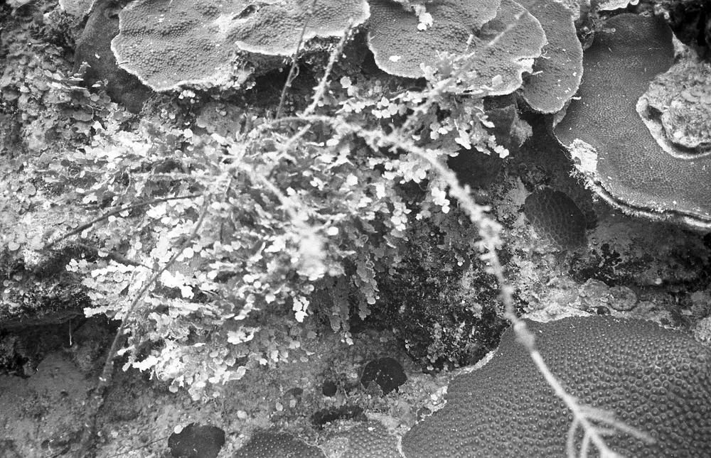{.lightbox group="discovery-bay-1966" description="**UUID: **b1f73dce-4b6e-4d1f-adbc-679de952abb0 **Date: **1967-05-31 **Location: **Jamaica | Discovery Bay | Pinnacle 1 Slope **Longitude: **77.41017ºW **Latitude: **18.47367ºN **Photographer: **Eileen Graham **Copyright: **Trustees of the Natural History Museum (London, UK), CC-BY-4.0" alt="**UUID: **b1f73dce-4b6e-4d1f-adbc-679de952abb0 **Date: **1967-05-31 **Location: **Jamaica | Discovery Bay | Pinnacle 1 Slope **Longitude: **77.41017ºW **Latitude: **18.47367ºN **Photographer: **Eileen Graham **Copyright: **Trustees of the Natural History Museum (London, UK), CC-BY-4.0"}

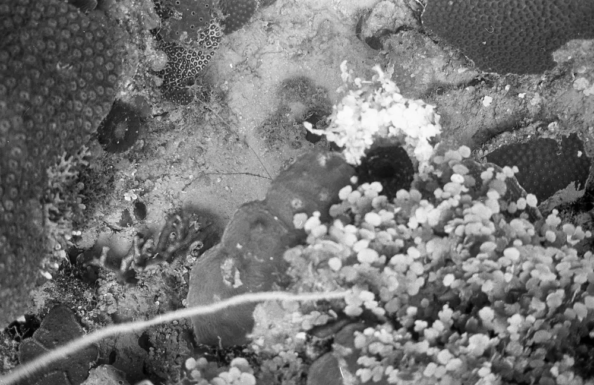{.lightbox group="discovery-bay-1966" description="**UUID: **0186f7c5-6d01-4f01-8121-57a597fcbe0c **Date: **1967-05-31 **Location: **Jamaica | Discovery Bay | Pinnacle 1 Slope **Longitude: **77.41017ºW **Latitude: **18.47367ºN **Photographer: **Eileen Graham **Copyright: **Trustees of the Natural History Museum (London, UK), CC-BY-4.0" alt="**UUID: **0186f7c5-6d01-4f01-8121-57a597fcbe0c **Date: **1967-05-31 **Location: **Jamaica | Discovery Bay | Pinnacle 1 Slope **Longitude: **77.41017ºW **Latitude: **18.47367ºN **Photographer: **Eileen Graham **Copyright: **Trustees of the Natural History Museum (London, UK), CC-BY-4.0"}

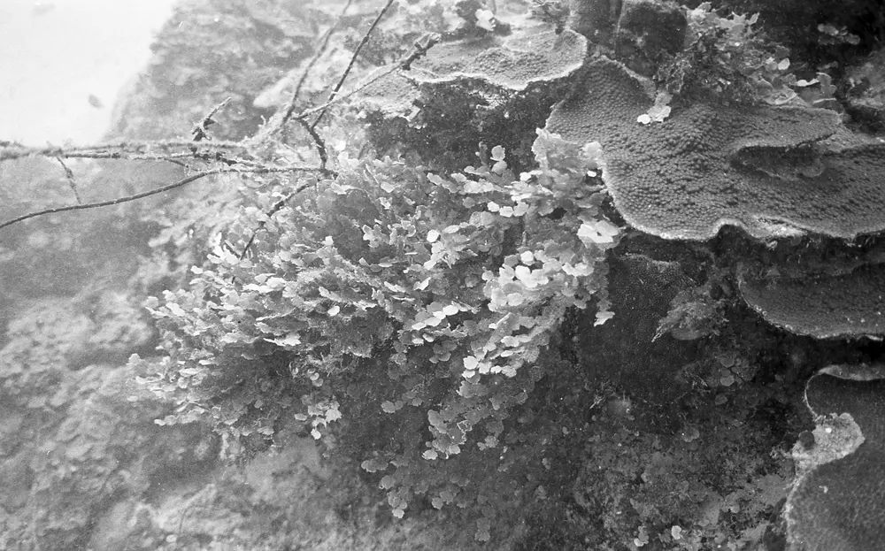{.lightbox group="discovery-bay-1966" description="**UUID: **3214840f-cc1b-4e77-b404-21c75e68dd9e **Date: **1967-05-31 **Location: **Jamaica | Discovery Bay | Pinnacle 1 Slope **Longitude: **77.41017ºW **Latitude: **18.47367ºN **Photographer: **Eileen Graham **Copyright: **Trustees of the Natural History Museum (London, UK), CC-BY-4.0" alt="**UUID: **3214840f-cc1b-4e77-b404-21c75e68dd9e **Date: **1967-05-31 **Location: **Jamaica | Discovery Bay | Pinnacle 1 Slope **Longitude: **77.41017ºW **Latitude: **18.47367ºN **Photographer: **Eileen Graham **Copyright: **Trustees of the Natural History Museum (London, UK), CC-BY-4.0"}

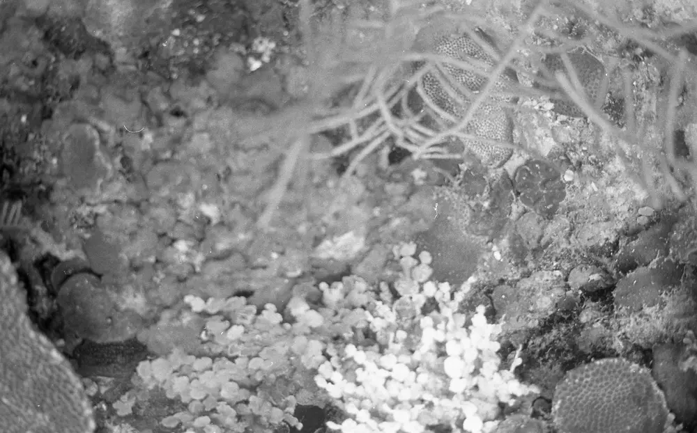{.lightbox group="discovery-bay-1966" description="**UUID: **31e8e5ec-0eef-4c64-b0f2-a35cf7b4af55 **Date: **1967-05-31 **Location: **Jamaica | Discovery Bay | Pinnacle 1 Slope **Longitude: **77.41017ºW **Latitude: **18.47367ºN **Photographer: **Eileen Graham **Copyright: **Trustees of the Natural History Museum (London, UK), CC-BY-4.0" alt="**UUID: **31e8e5ec-0eef-4c64-b0f2-a35cf7b4af55 **Date: **1967-05-31 **Location: **Jamaica | Discovery Bay | Pinnacle 1 Slope **Longitude: **77.41017ºW **Latitude: **18.47367ºN **Photographer: **Eileen Graham **Copyright: **Trustees of the Natural History Museum (London, UK), CC-BY-4.0"}

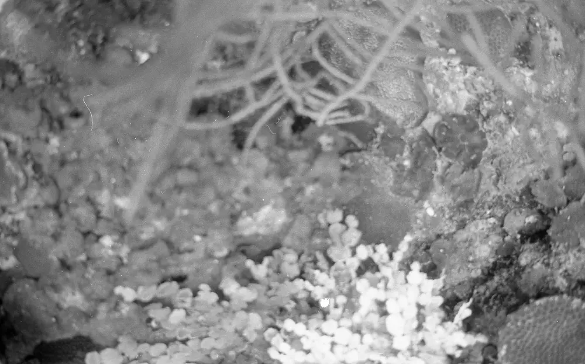{.lightbox group="discovery-bay-1966" description="**UUID: **b0cd2379-44da-4866-9d8c-733b07448b94 **Date: **1967-05-31 **Location: **Jamaica | Discovery Bay | Pinnacle 1 Slope **Longitude: **77.41017ºW **Latitude: **18.47367ºN **Photographer: **Eileen Graham **Copyright: **Trustees of the Natural History Museum (London, UK), CC-BY-4.0" alt="**UUID: **b0cd2379-44da-4866-9d8c-733b07448b94 **Date: **1967-05-31 **Location: **Jamaica | Discovery Bay | Pinnacle 1 Slope **Longitude: **77.41017ºW **Latitude: **18.47367ºN **Photographer: **Eileen Graham **Copyright: **Trustees of the Natural History Museum (London, UK), CC-BY-4.0"}

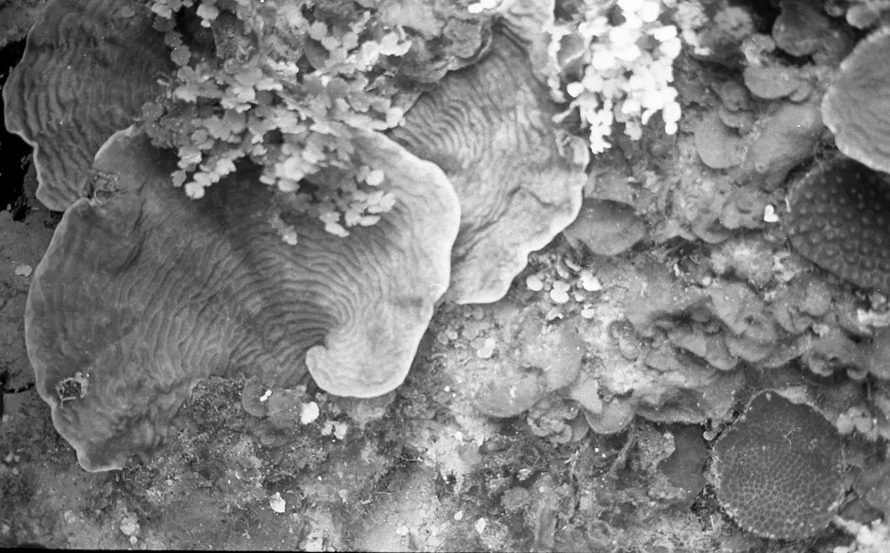{.lightbox group="discovery-bay-1966" description="**UUID: **b0410a01-ab2b-45ec-bc80-a533d9530736 **Date: **1967-05-31 **Location: **Jamaica | Discovery Bay | Pinnacle 1 Slope **Longitude: **77.41017ºW **Latitude: **18.47367ºN **Photographer: **Eileen Graham **Copyright: **Trustees of the Natural History Museum (London, UK), CC-BY-4.0" alt="**UUID: **b0410a01-ab2b-45ec-bc80-a533d9530736 **Date: **1967-05-31 **Location: **Jamaica | Discovery Bay | Pinnacle 1 Slope **Longitude: **77.41017ºW **Latitude: **18.47367ºN **Photographer: **Eileen Graham **Copyright: **Trustees of the Natural History Museum (London, UK), CC-BY-4.0"}

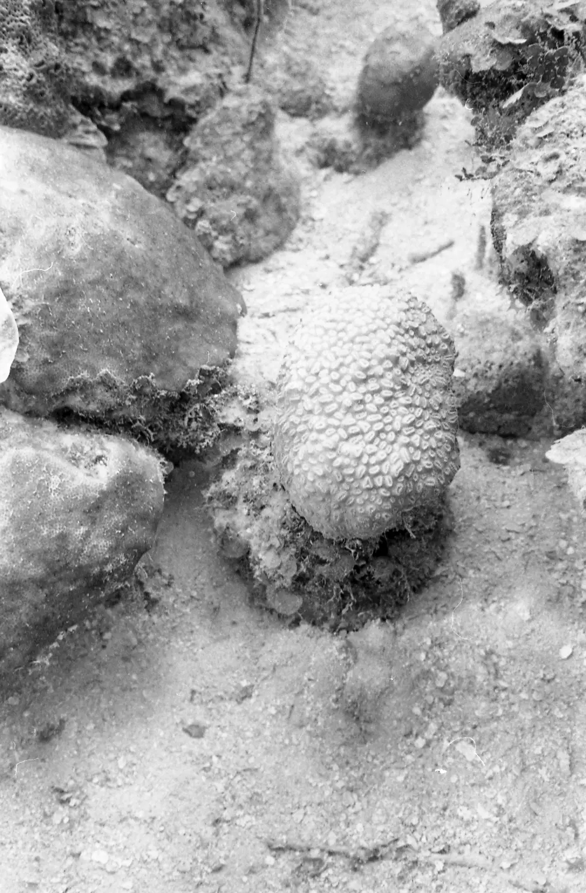{.lightbox group="discovery-bay-1966" description="**UUID: **5d8a72c6-c94b-41bc-9661-0a31eac7d11f **Date: **1967-09-06 **Location: **Jamaica | Discovery Bay | Buoy Upper Slope **Longitude: **77.40908ºW **Latitude: **18.47322ºN **Photographer: **Eileen Graham **Copyright: **Trustees of the Natural History Museum (London, UK), CC-BY-4.0" alt="**UUID: **5d8a72c6-c94b-41bc-9661-0a31eac7d11f **Date: **1967-09-06 **Location: **Jamaica | Discovery Bay | Buoy Upper Slope **Longitude: **77.40908ºW **Latitude: **18.47322ºN **Photographer: **Eileen Graham **Copyright: **Trustees of the Natural History Museum (London, UK), CC-BY-4.0"}

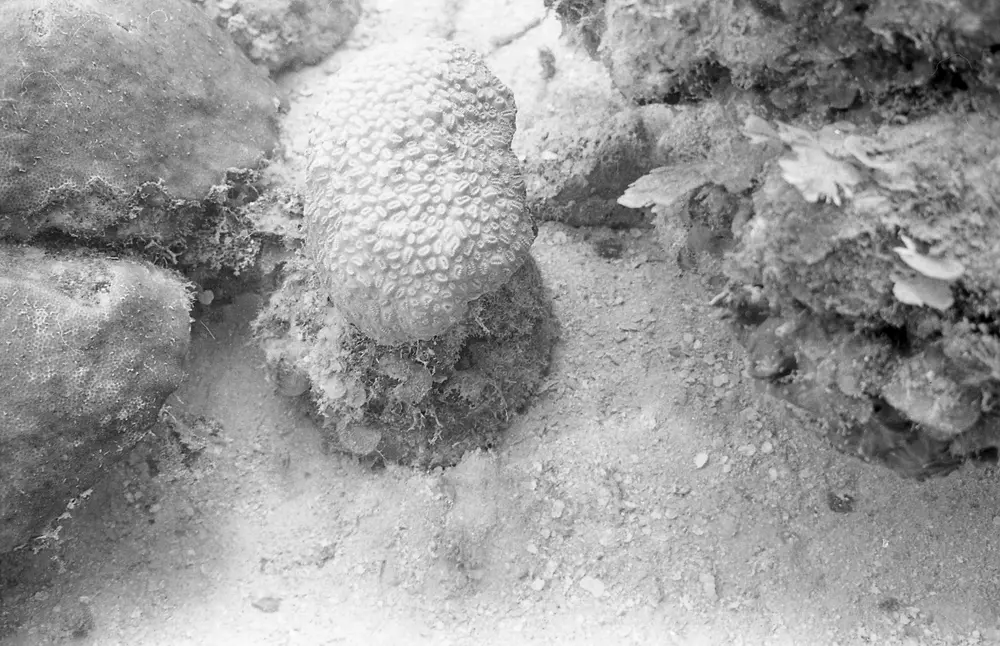{.lightbox group="discovery-bay-1966" description="**UUID: **a9fc9321-d796-4324-9b39-2b958b16fbad **Date: **1967-09-06 **Location: **Jamaica | Discovery Bay | Buoy Upper Slope **Longitude: **77.40908ºW **Latitude: **18.47322ºN **Photographer: **Eileen Graham **Copyright: **Trustees of the Natural History Museum (London, UK), CC-BY-4.0" alt="**UUID: **a9fc9321-d796-4324-9b39-2b958b16fbad **Date: **1967-09-06 **Location: **Jamaica | Discovery Bay | Buoy Upper Slope **Longitude: **77.40908ºW **Latitude: **18.47322ºN **Photographer: **Eileen Graham **Copyright: **Trustees of the Natural History Museum (London, UK), CC-BY-4.0"}

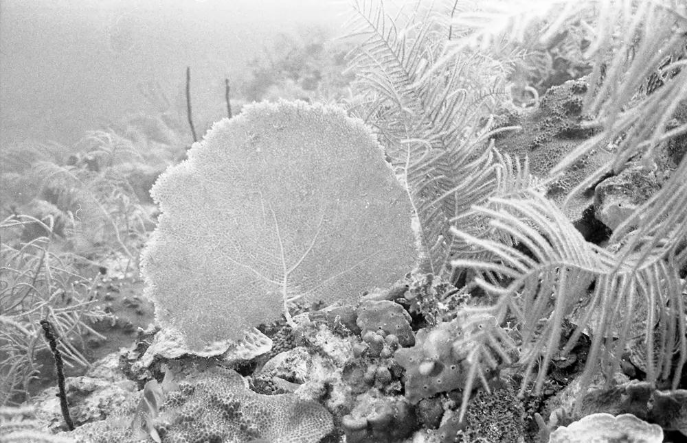{.lightbox group="discovery-bay-1966" description="**UUID: **7d433183-1b96-44cd-b462-88a7417420dd **Date: **1967-09-06 **Location: **Jamaica | Discovery Bay | Buoy Upper Slope **Longitude: **77.40908ºW **Latitude: **18.47322ºN **Photographer: **Eileen Graham **Copyright: **Trustees of the Natural History Museum (London, UK), CC-BY-4.0" alt="**UUID: **7d433183-1b96-44cd-b462-88a7417420dd **Date: **1967-09-06 **Location: **Jamaica | Discovery Bay | Buoy Upper Slope **Longitude: **77.40908ºW **Latitude: **18.47322ºN **Photographer: **Eileen Graham **Copyright: **Trustees of the Natural History Museum (London, UK), CC-BY-4.0"}

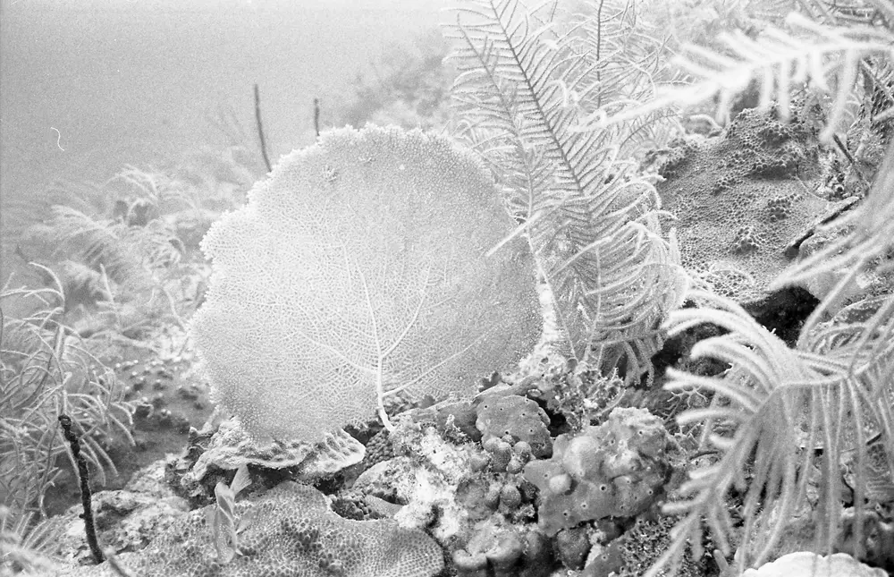{.lightbox group="discovery-bay-1966" description="**UUID: **2b3c2c7f-3c20-4341-9ce6-756fd22ecb16 **Date: **1967-09-06 **Location: **Jamaica | Discovery Bay | Buoy Upper Slope **Longitude: **77.40908ºW **Latitude: **18.47322ºN **Photographer: **Eileen Graham **Copyright: **Trustees of the Natural History Museum (London, UK), CC-BY-4.0" alt="**UUID: **2b3c2c7f-3c20-4341-9ce6-756fd22ecb16 **Date: **1967-09-06 **Location: **Jamaica | Discovery Bay | Buoy Upper Slope **Longitude: **77.40908ºW **Latitude: **18.47322ºN **Photographer: **Eileen Graham **Copyright: **Trustees of the Natural History Museum (London, UK), CC-BY-4.0"}

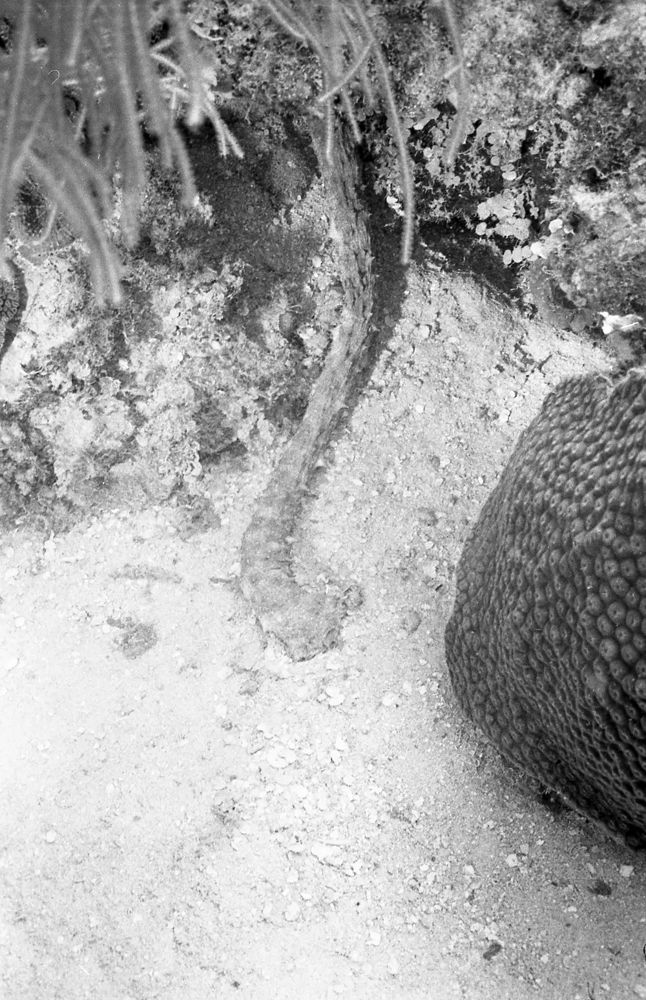{.lightbox group="discovery-bay-1966" description="**UUID: **a1754c2b-53ba-43be-b901-2a38a0dc0347 **Date: **1967-09-06 **Location: **Jamaica | Discovery Bay | Buoy Upper Slope **Longitude: **77.40908ºW **Latitude: **18.47322ºN **Photographer: **Eileen Graham **Copyright: **Trustees of the Natural History Museum (London, UK), CC-BY-4.0" alt="**UUID: **a1754c2b-53ba-43be-b901-2a38a0dc0347 **Date: **1967-09-06 **Location: **Jamaica | Discovery Bay | Buoy Upper Slope **Longitude: **77.40908ºW **Latitude: **18.47322ºN **Photographer: **Eileen Graham **Copyright: **Trustees of the Natural History Museum (London, UK), CC-BY-4.0"}

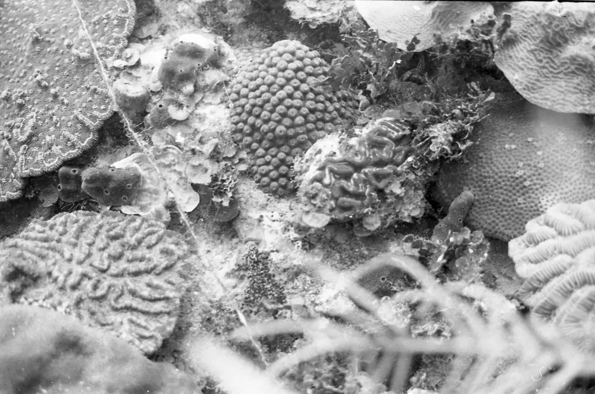{.lightbox group="discovery-bay-1966" description="**UUID: **068e5039-e447-4ada-82b1-46ae685240b4 **Date: **1967-09-06 **Location: **Jamaica | Discovery Bay | Buoy Upper Slope **Longitude: **77.40908ºW **Latitude: **18.47322ºN **Photographer: **Eileen Graham **Copyright: **Trustees of the Natural History Museum (London, UK), CC-BY-4.0" alt="**UUID: **068e5039-e447-4ada-82b1-46ae685240b4 **Date: **1967-09-06 **Location: **Jamaica | Discovery Bay | Buoy Upper Slope **Longitude: **77.40908ºW **Latitude: **18.47322ºN **Photographer: **Eileen Graham **Copyright: **Trustees of the Natural History Museum (London, UK), CC-BY-4.0"}

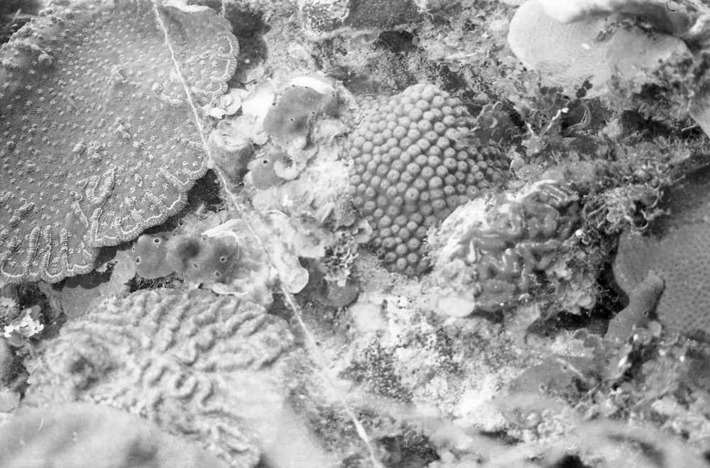{.lightbox group="discovery-bay-1966" description="**UUID: **77b24d47-a536-4b4c-92da-257d990648fd **Date: **1967-09-06 **Location: **Jamaica | Discovery Bay | Buoy Upper Slope **Longitude: **77.40908ºW **Latitude: **18.47322ºN **Photographer: **Eileen Graham **Copyright: **Trustees of the Natural History Museum (London, UK), CC-BY-4.0" alt="**UUID: **77b24d47-a536-4b4c-92da-257d990648fd **Date: **1967-09-06 **Location: **Jamaica | Discovery Bay | Buoy Upper Slope **Longitude: **77.40908ºW **Latitude: **18.47322ºN **Photographer: **Eileen Graham **Copyright: **Trustees of the Natural History Museum (London, UK), CC-BY-4.0"}

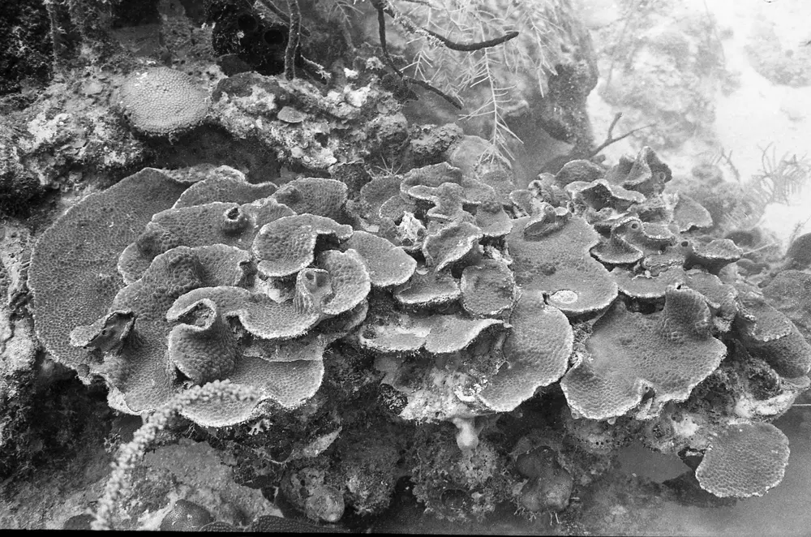{.lightbox group="discovery-bay-1966" description="**UUID: **a8e99a87-f685-4dc6-a674-ccc19335c41f **Date: **1967-09-06 **Location: **Jamaica | Discovery Bay | Buoy Upper Slope **Longitude: **77.40908ºW **Latitude: **18.47322ºN **Photographer: **Eileen Graham **Copyright: **Trustees of the Natural History Museum (London, UK), CC-BY-4.0" alt="**UUID: **a8e99a87-f685-4dc6-a674-ccc19335c41f **Date: **1967-09-06 **Location: **Jamaica | Discovery Bay | Buoy Upper Slope **Longitude: **77.40908ºW **Latitude: **18.47322ºN **Photographer: **Eileen Graham **Copyright: **Trustees of the Natural History Museum (London, UK), CC-BY-4.0"}

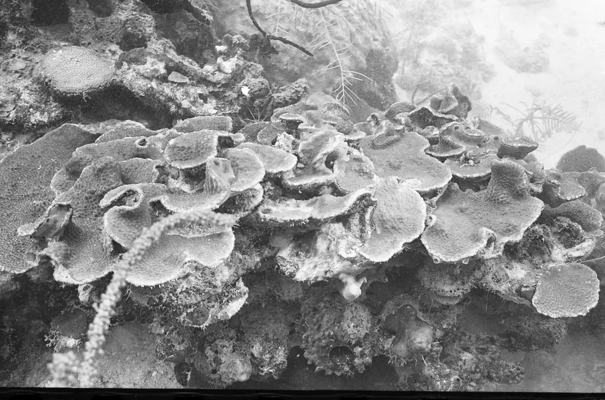{.lightbox group="discovery-bay-1966" description="**UUID: **39661af2-e7db-44b9-aa2b-77287b830e99 **Date: **1967-09-06 **Location: **Jamaica | Discovery Bay | Buoy Upper Slope **Longitude: **77.40908ºW **Latitude: **18.47322ºN **Photographer: **Eileen Graham **Copyright: **Trustees of the Natural History Museum (London, UK), CC-BY-4.0" alt="**UUID: **39661af2-e7db-44b9-aa2b-77287b830e99 **Date: **1967-09-06 **Location: **Jamaica | Discovery Bay | Buoy Upper Slope **Longitude: **77.40908ºW **Latitude: **18.47322ºN **Photographer: **Eileen Graham **Copyright: **Trustees of the Natural History Museum (London, UK), CC-BY-4.0"}

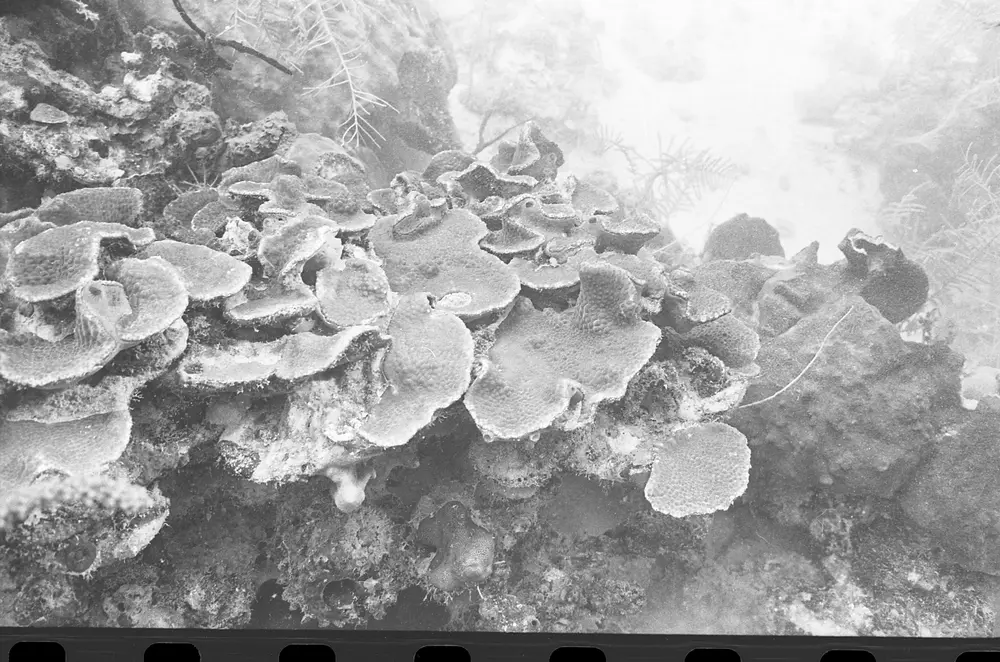{.lightbox group="discovery-bay-1966" description="**UUID: **d6a7d1da-a517-4c96-bc2e-3a632ef21e07 **Date: **1967-09-06 **Location: **Jamaica | Discovery Bay | Buoy Upper Slope **Longitude: **77.40908ºW **Latitude: **18.47322ºN **Photographer: **Eileen Graham **Copyright: **Trustees of the Natural History Museum (London, UK), CC-BY-4.0" alt="**UUID: **d6a7d1da-a517-4c96-bc2e-3a632ef21e07 **Date: **1967-09-06 **Location: **Jamaica | Discovery Bay | Buoy Upper Slope **Longitude: **77.40908ºW **Latitude: **18.47322ºN **Photographer: **Eileen Graham **Copyright: **Trustees of the Natural History Museum (London, UK), CC-BY-4.0"}

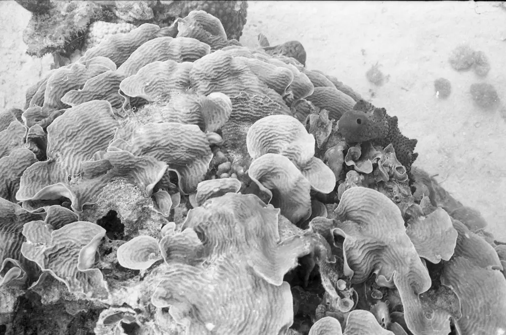{.lightbox group="discovery-bay-1966" description="**UUID: **c25e4399-2cd1-43bb-ab61-1c23906d925c **Date: **1967-09-06 **Location: **Jamaica | Discovery Bay | Buoy Upper Slope **Longitude: **77.40908ºW **Latitude: **18.47322ºN **Photographer: **Eileen Graham **Copyright: **Trustees of the Natural History Museum (London, UK), CC-BY-4.0" alt="**UUID: **c25e4399-2cd1-43bb-ab61-1c23906d925c **Date: **1967-09-06 **Location: **Jamaica | Discovery Bay | Buoy Upper Slope **Longitude: **77.40908ºW **Latitude: **18.47322ºN **Photographer: **Eileen Graham **Copyright: **Trustees of the Natural History Museum (London, UK), CC-BY-4.0"}

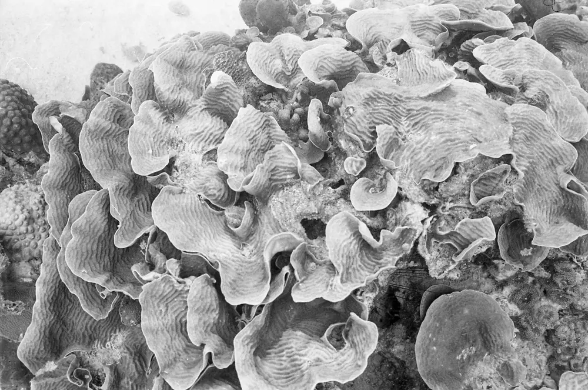{.lightbox group="discovery-bay-1966" description="**UUID: **8e0b9e42-7324-4255-90c9-6d576d683aaf **Date: **1967-09-06 **Location: **Jamaica | Discovery Bay | Buoy Upper Slope **Longitude: **77.40908ºW **Latitude: **18.47322ºN **Photographer: **Eileen Graham **Copyright: **Trustees of the Natural History Museum (London, UK), CC-BY-4.0" alt="**UUID: **8e0b9e42-7324-4255-90c9-6d576d683aaf **Date: **1967-09-06 **Location: **Jamaica | Discovery Bay | Buoy Upper Slope **Longitude: **77.40908ºW **Latitude: **18.47322ºN **Photographer: **Eileen Graham **Copyright: **Trustees of the Natural History Museum (London, UK), CC-BY-4.0"}

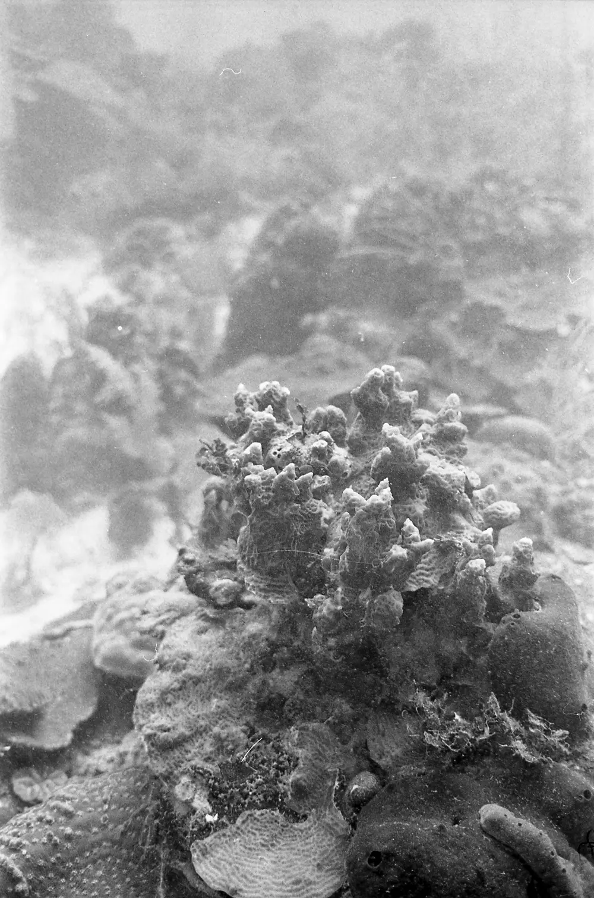{.lightbox group="discovery-bay-1966" description="**UUID: **1ec14448-f4fe-4210-81cb-c2f7b8639867 **Date: **1967-09-06 **Location: **Jamaica | Discovery Bay | Buoy Upper Slope **Longitude: **77.40908ºW **Latitude: **18.47322ºN **Photographer: **Eileen Graham **Copyright: **Trustees of the Natural History Museum (London, UK), CC-BY-4.0" alt="**UUID: **1ec14448-f4fe-4210-81cb-c2f7b8639867 **Date: **1967-09-06 **Location: **Jamaica | Discovery Bay | Buoy Upper Slope **Longitude: **77.40908ºW **Latitude: **18.47322ºN **Photographer: **Eileen Graham **Copyright: **Trustees of the Natural History Museum (London, UK), CC-BY-4.0"}

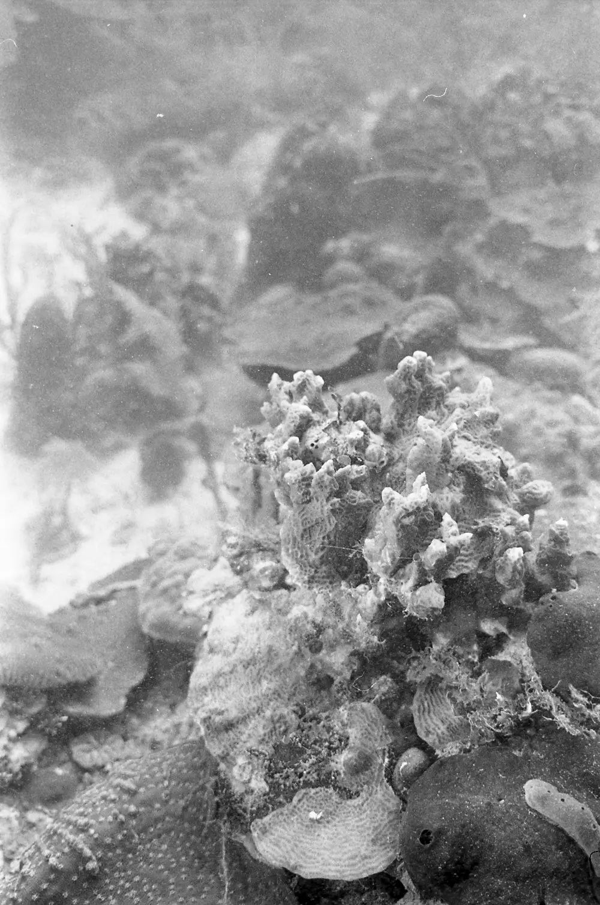{.lightbox group="discovery-bay-1966" description="**UUID: **9f24e905-3ea5-4b34-9bb9-e5d3ef69c9d8 **Date: **1967-09-06 **Location: **Jamaica | Discovery Bay | Buoy Upper Slope **Longitude: **77.40908ºW **Latitude: **18.47322ºN **Photographer: **Eileen Graham **Copyright: **Trustees of the Natural History Museum (London, UK), CC-BY-4.0" alt="**UUID: **9f24e905-3ea5-4b34-9bb9-e5d3ef69c9d8 **Date: **1967-09-06 **Location: **Jamaica | Discovery Bay | Buoy Upper Slope **Longitude: **77.40908ºW **Latitude: **18.47322ºN **Photographer: **Eileen Graham **Copyright: **Trustees of the Natural History Museum (London, UK), CC-BY-4.0"}

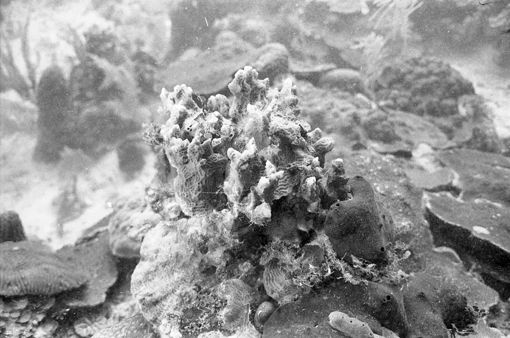{.lightbox group="discovery-bay-1966" description="**UUID: **a0792bda-dcd7-4b1e-8d27-dddcf280500f **Date: **1967-09-06 **Location: **Jamaica | Discovery Bay | Buoy Upper Slope **Longitude: **77.40908ºW **Latitude: **18.47322ºN **Photographer: **Eileen Graham **Copyright: **Trustees of the Natural History Museum (London, UK), CC-BY-4.0" alt="**UUID: **a0792bda-dcd7-4b1e-8d27-dddcf280500f **Date: **1967-09-06 **Location: **Jamaica | Discovery Bay | Buoy Upper Slope **Longitude: **77.40908ºW **Latitude: **18.47322ºN **Photographer: **Eileen Graham **Copyright: **Trustees of the Natural History Museum (London, UK), CC-BY-4.0"}

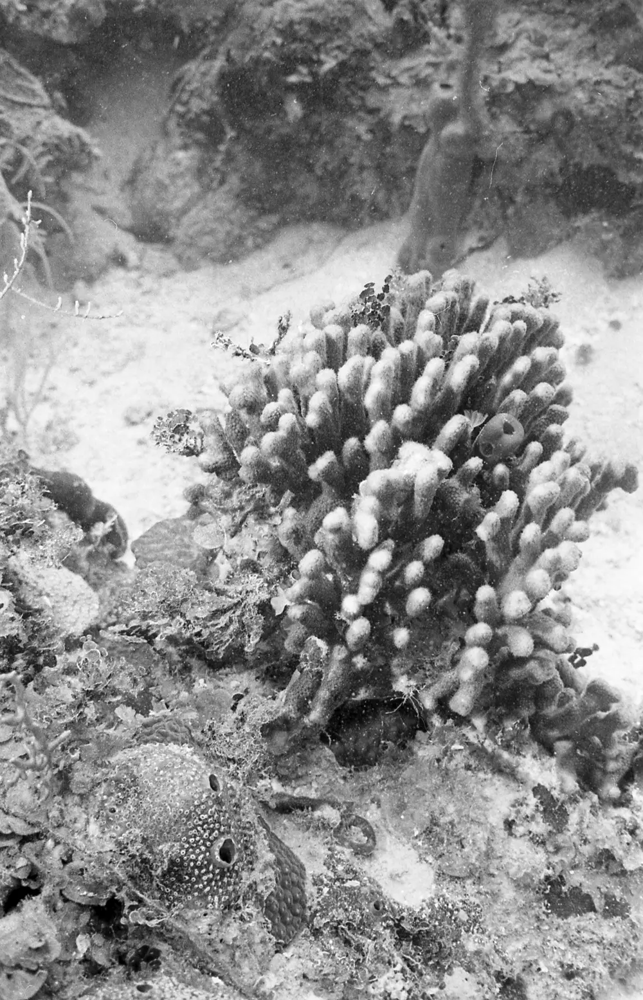{.lightbox group="discovery-bay-1966" description="**UUID: **a9cf2aa3-0dd3-42fc-9498-6ef4c71140be **Date: **1967-09-06 **Location: **Jamaica | Discovery Bay | Buoy Upper Slope **Longitude: **77.40908ºW **Latitude: **18.47322ºN **Photographer: **Eileen Graham **Copyright: **Trustees of the Natural History Museum (London, UK), CC-BY-4.0" alt="**UUID: **a9cf2aa3-0dd3-42fc-9498-6ef4c71140be **Date: **1967-09-06 **Location: **Jamaica | Discovery Bay | Buoy Upper Slope **Longitude: **77.40908ºW **Latitude: **18.47322ºN **Photographer: **Eileen Graham **Copyright: **Trustees of the Natural History Museum (London, UK), CC-BY-4.0"}

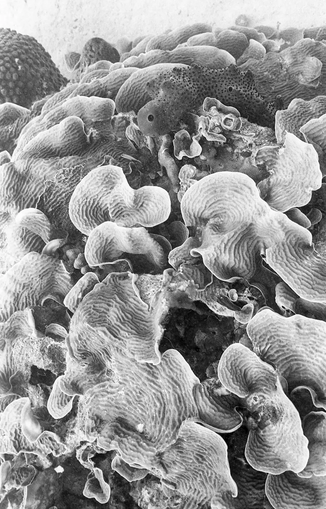{.lightbox group="discovery-bay-1966" description="**UUID: **61762b21-db4b-448d-9101-1dd00196a244 **Date: **1967-09-06 **Location: **Jamaica | Discovery Bay | Buoy Upper Slope **Longitude: **77.40908ºW **Latitude: **18.47322ºN **Photographer: **Eileen Graham **Copyright: **Trustees of the Natural History Museum (London, UK), CC-BY-4.0" alt="**UUID: **61762b21-db4b-448d-9101-1dd00196a244 **Date: **1967-09-06 **Location: **Jamaica | Discovery Bay | Buoy Upper Slope **Longitude: **77.40908ºW **Latitude: **18.47322ºN **Photographer: **Eileen Graham **Copyright: **Trustees of the Natural History Museum (London, UK), CC-BY-4.0"}

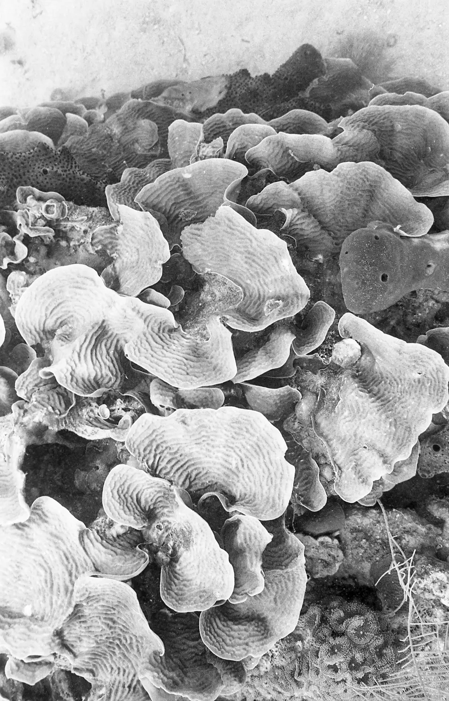{.lightbox group="discovery-bay-1966" description="**UUID: **86cba3ef-bdaf-4dbd-abab-10c44709eabe **Date: **1967-09-06 **Location: **Jamaica | Discovery Bay | Buoy Upper Slope **Longitude: **77.40908ºW **Latitude: **18.47322ºN **Photographer: **Eileen Graham **Copyright: **Trustees of the Natural History Museum (London, UK), CC-BY-4.0" alt="**UUID: **86cba3ef-bdaf-4dbd-abab-10c44709eabe **Date: **1967-09-06 **Location: **Jamaica | Discovery Bay | Buoy Upper Slope **Longitude: **77.40908ºW **Latitude: **18.47322ºN **Photographer: **Eileen Graham **Copyright: **Trustees of the Natural History Museum (London, UK), CC-BY-4.0"}

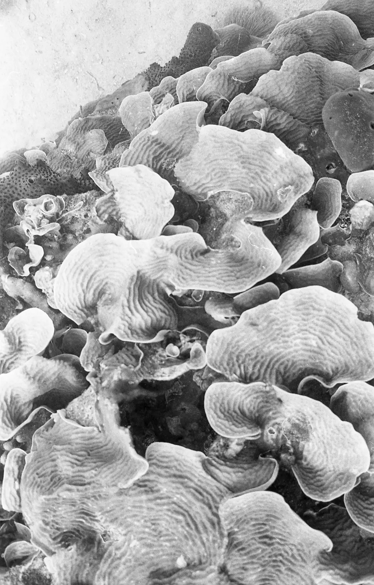{.lightbox group="discovery-bay-1966" description="**UUID: **4994fcde-2f0a-4f61-bfca-918301552d7b **Date: **1967-09-06 **Location: **Jamaica | Discovery Bay | Buoy Upper Slope **Longitude: **77.40908ºW **Latitude: **18.47322ºN **Photographer: **Eileen Graham **Copyright: **Trustees of the Natural History Museum (London, UK), CC-BY-4.0" alt="**UUID: **4994fcde-2f0a-4f61-bfca-918301552d7b **Date: **1967-09-06 **Location: **Jamaica | Discovery Bay | Buoy Upper Slope **Longitude: **77.40908ºW **Latitude: **18.47322ºN **Photographer: **Eileen Graham **Copyright: **Trustees of the Natural History Museum (London, UK), CC-BY-4.0"}

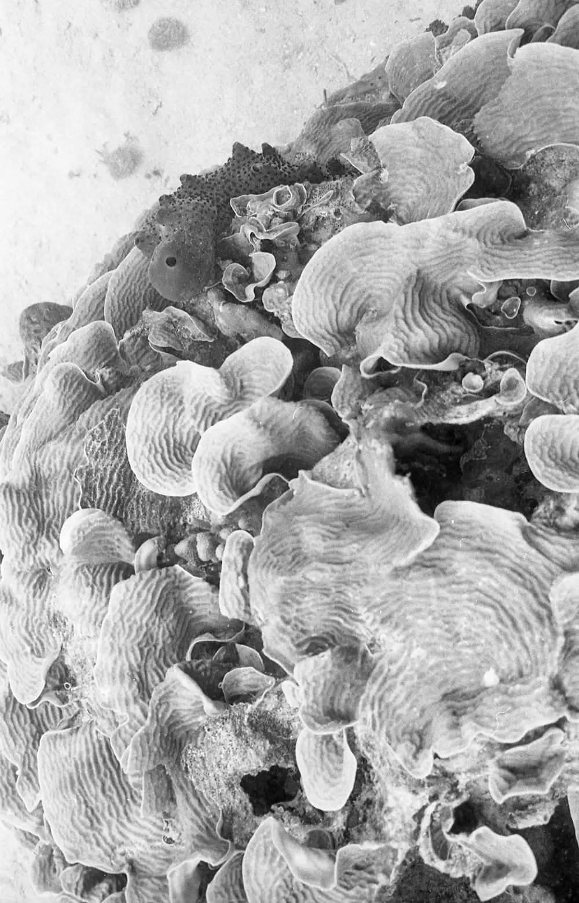{.lightbox group="discovery-bay-1966" description="**UUID: **a4b8ca3c-b52f-44d4-8758-2fbc120b31c6 **Date: **1967-09-06 **Location: **Jamaica | Discovery Bay | Buoy Upper Slope **Longitude: **77.40908ºW **Latitude: **18.47322ºN **Photographer: **Eileen Graham **Copyright: **Trustees of the Natural History Museum (London, UK), CC-BY-4.0" alt="**UUID: **a4b8ca3c-b52f-44d4-8758-2fbc120b31c6 **Date: **1967-09-06 **Location: **Jamaica | Discovery Bay | Buoy Upper Slope **Longitude: **77.40908ºW **Latitude: **18.47322ºN **Photographer: **Eileen Graham **Copyright: **Trustees of the Natural History Museum (London, UK), CC-BY-4.0"}

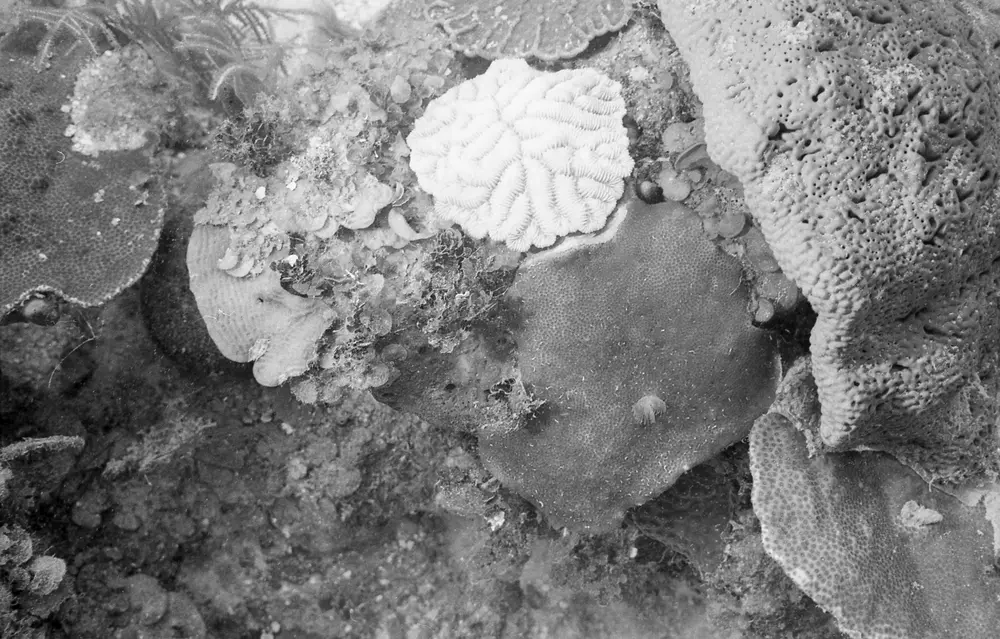{.lightbox group="discovery-bay-1966" description="**UUID: **8a0b2574-b9f2-4dd2-b3d2-f5bb9ea3ea3e **Date: **1967-09-06 **Location: **Jamaica | Discovery Bay | Buoy Upper Slope **Longitude: **77.40908ºW **Latitude: **18.47322ºN **Photographer: **Eileen Graham **Copyright: **Trustees of the Natural History Museum (London, UK), CC-BY-4.0" alt="**UUID: **8a0b2574-b9f2-4dd2-b3d2-f5bb9ea3ea3e **Date: **1967-09-06 **Location: **Jamaica | Discovery Bay | Buoy Upper Slope **Longitude: **77.40908ºW **Latitude: **18.47322ºN **Photographer: **Eileen Graham **Copyright: **Trustees of the Natural History Museum (London, UK), CC-BY-4.0"}

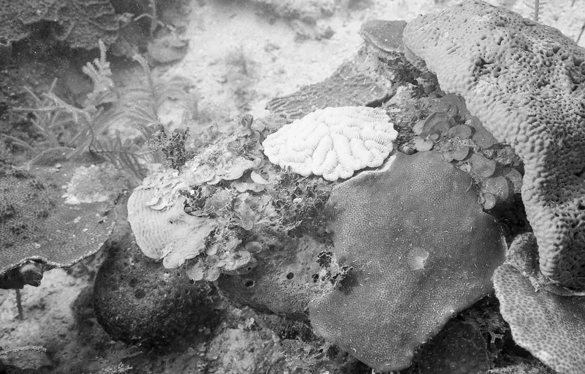{.lightbox group="discovery-bay-1966" description="**UUID: **aae2444e-7d50-4d7f-afd3-a81fea9d7d6b **Date: **1967-09-06 **Location: **Jamaica | Discovery Bay | Buoy Upper Slope **Longitude: **77.40908ºW **Latitude: **18.47322ºN **Photographer: **Eileen Graham **Copyright: **Trustees of the Natural History Museum (London, UK), CC-BY-4.0" alt="**UUID: **aae2444e-7d50-4d7f-afd3-a81fea9d7d6b **Date: **1967-09-06 **Location: **Jamaica | Discovery Bay | Buoy Upper Slope **Longitude: **77.40908ºW **Latitude: **18.47322ºN **Photographer: **Eileen Graham **Copyright: **Trustees of the Natural History Museum (London, UK), CC-BY-4.0"}

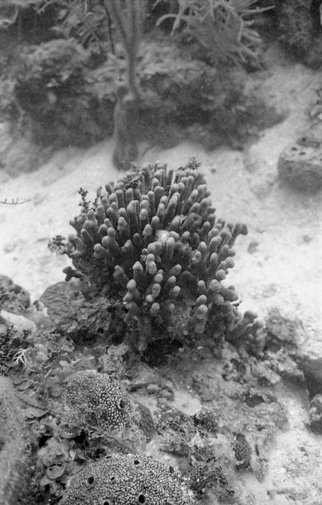{.lightbox group="discovery-bay-1966" description="**UUID: **f6dd3ecf-6960-4413-b347-464f935bf7ca **Date: **1967-09-06 **Location: **Jamaica | Discovery Bay | Buoy Upper Slope **Longitude: **77.40908ºW **Latitude: **18.47322ºN **Photographer: **Eileen Graham **Copyright: **Trustees of the Natural History Museum (London, UK), CC-BY-4.0" alt="**UUID: **f6dd3ecf-6960-4413-b347-464f935bf7ca **Date: **1967-09-06 **Location: **Jamaica | Discovery Bay | Buoy Upper Slope **Longitude: **77.40908ºW **Latitude: **18.47322ºN **Photographer: **Eileen Graham **Copyright: **Trustees of the Natural History Museum (London, UK), CC-BY-4.0"}

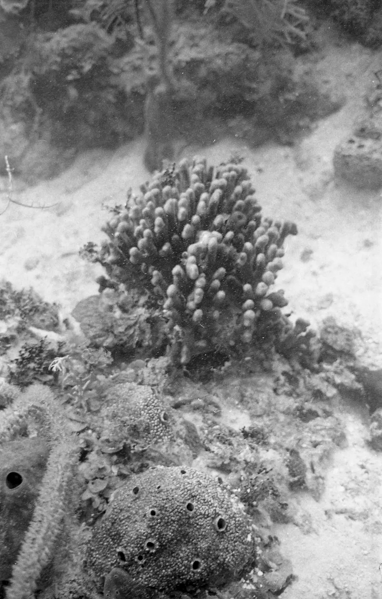{.lightbox group="discovery-bay-1966" description="**UUID: **4212863f-fa7b-4895-94ff-a4688fc51173 **Date: **1967-09-06 **Location: **Jamaica | Discovery Bay | Buoy Upper Slope **Longitude: **77.40908ºW **Latitude: **18.47322ºN **Photographer: **Eileen Graham **Copyright: **Trustees of the Natural History Museum (London, UK), CC-BY-4.0" alt="**UUID: **4212863f-fa7b-4895-94ff-a4688fc51173 **Date: **1967-09-06 **Location: **Jamaica | Discovery Bay | Buoy Upper Slope **Longitude: **77.40908ºW **Latitude: **18.47322ºN **Photographer: **Eileen Graham **Copyright: **Trustees of the Natural History Museum (London, UK), CC-BY-4.0"}

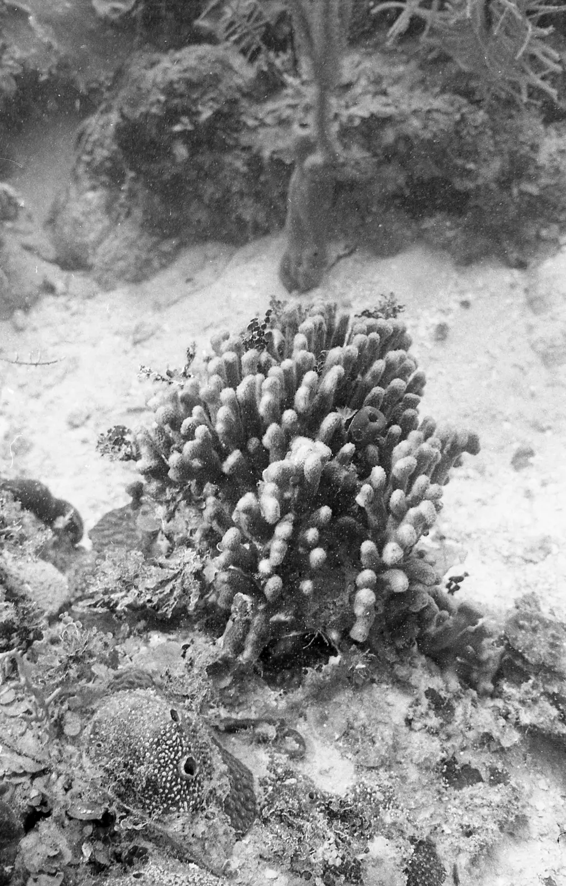{.lightbox group="discovery-bay-1966" description="**UUID: **c74bee38-6b09-4e67-80b3-ffa9b24db30b **Date: **1967-09-06 **Location: **Jamaica | Discovery Bay | Buoy Upper Slope **Longitude: **77.40908ºW **Latitude: **18.47322ºN **Photographer: **Eileen Graham **Copyright: **Trustees of the Natural History Museum (London, UK), CC-BY-4.0" alt="**UUID: **c74bee38-6b09-4e67-80b3-ffa9b24db30b **Date: **1967-09-06 **Location: **Jamaica | Discovery Bay | Buoy Upper Slope **Longitude: **77.40908ºW **Latitude: **18.47322ºN **Photographer: **Eileen Graham **Copyright: **Trustees of the Natural History Museum (London, UK), CC-BY-4.0"}

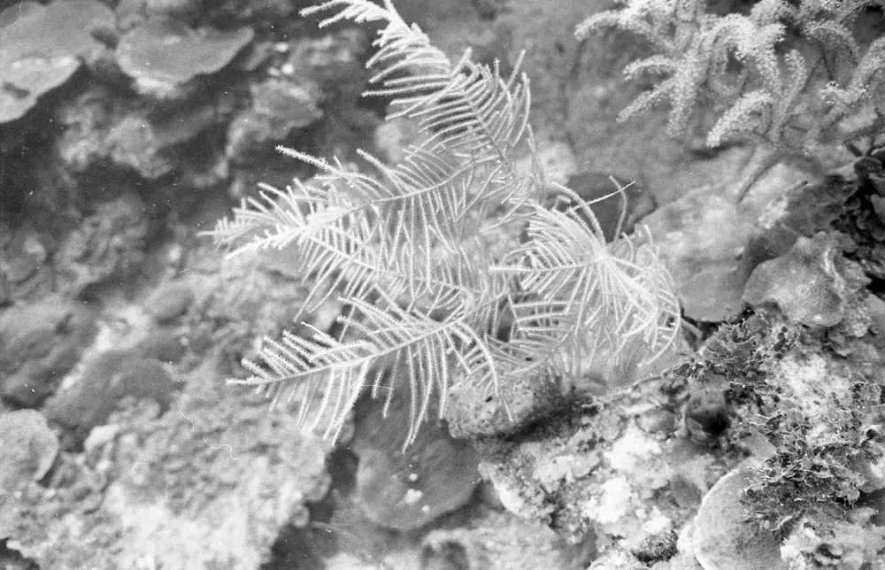{.lightbox group="discovery-bay-1966" description="**UUID: **060e65d5-069f-4953-8702-9980cd8cffa7 **Date: **1967-09-06 **Location: **Jamaica | Discovery Bay | Buoy Upper Slope **Longitude: **77.40908ºW **Latitude: **18.47322ºN **Photographer: **Eileen Graham **Copyright: **Trustees of the Natural History Museum (London, UK), CC-BY-4.0" alt="**UUID: **060e65d5-069f-4953-8702-9980cd8cffa7 **Date: **1967-09-06 **Location: **Jamaica | Discovery Bay | Buoy Upper Slope **Longitude: **77.40908ºW **Latitude: **18.47322ºN **Photographer: **Eileen Graham **Copyright: **Trustees of the Natural History Museum (London, UK), CC-BY-4.0"}

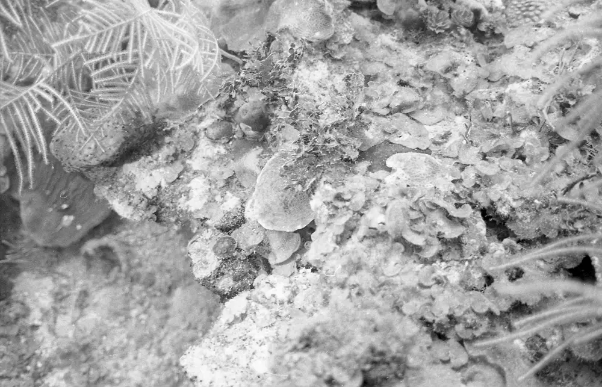{.lightbox group="discovery-bay-1966" description="**UUID: **ba7b253e-e71a-42ae-b720-6a7f5383d63d **Date: **1967-09-06 **Location: **Jamaica | Discovery Bay | Buoy Upper Slope **Longitude: **77.40908ºW **Latitude: **18.47322ºN **Photographer: **Eileen Graham **Copyright: **Trustees of the Natural History Museum (London, UK), CC-BY-4.0" alt="**UUID: **ba7b253e-e71a-42ae-b720-6a7f5383d63d **Date: **1967-09-06 **Location: **Jamaica | Discovery Bay | Buoy Upper Slope **Longitude: **77.40908ºW **Latitude: **18.47322ºN **Photographer: **Eileen Graham **Copyright: **Trustees of the Natural History Museum (London, UK), CC-BY-4.0"}

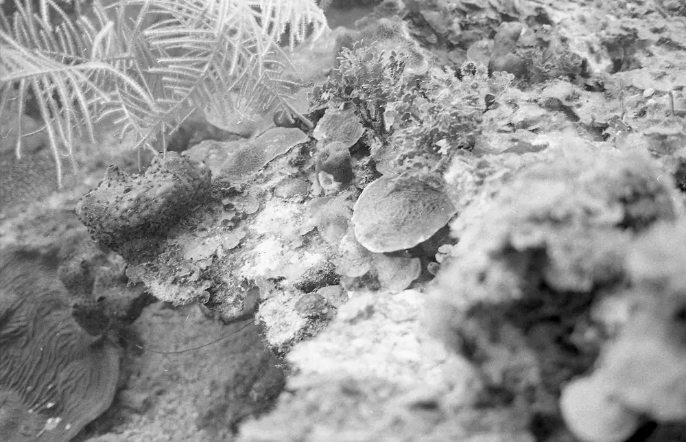{.lightbox group="discovery-bay-1966" description="**UUID: **af0bea6a-7a34-4316-b58d-05307ab5e2e5 **Date: **1967-09-06 **Location: **Jamaica | Discovery Bay | Buoy Upper Slope **Longitude: **77.40908ºW **Latitude: **18.47322ºN **Photographer: **Eileen Graham **Copyright: **Trustees of the Natural History Museum (London, UK), CC-BY-4.0" alt="**UUID: **af0bea6a-7a34-4316-b58d-05307ab5e2e5 **Date: **1967-09-06 **Location: **Jamaica | Discovery Bay | Buoy Upper Slope **Longitude: **77.40908ºW **Latitude: **18.47322ºN **Photographer: **Eileen Graham **Copyright: **Trustees of the Natural History Museum (London, UK), CC-BY-4.0"}

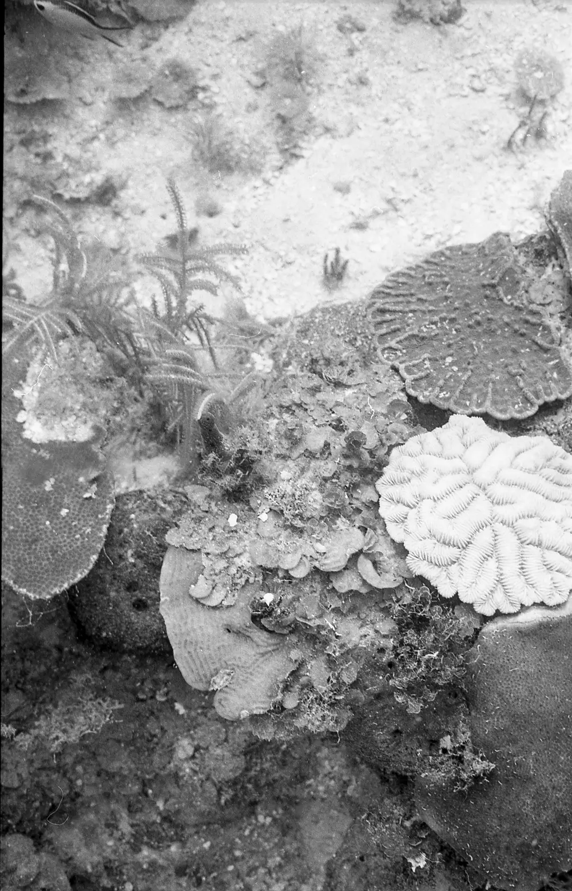{.lightbox group="discovery-bay-1966" description="**UUID: **89b1196e-394d-47b6-a3e8-b2355239f6bf **Date: **1967-09-06 **Location: **Jamaica | Discovery Bay | Buoy Upper Slope **Longitude: **77.40908ºW **Latitude: **18.47322ºN **Photographer: **Eileen Graham **Copyright: **Trustees of the Natural History Museum (London, UK), CC-BY-4.0" alt="**UUID: **89b1196e-394d-47b6-a3e8-b2355239f6bf **Date: **1967-09-06 **Location: **Jamaica | Discovery Bay | Buoy Upper Slope **Longitude: **77.40908ºW **Latitude: **18.47322ºN **Photographer: **Eileen Graham **Copyright: **Trustees of the Natural History Museum (London, UK), CC-BY-4.0"}

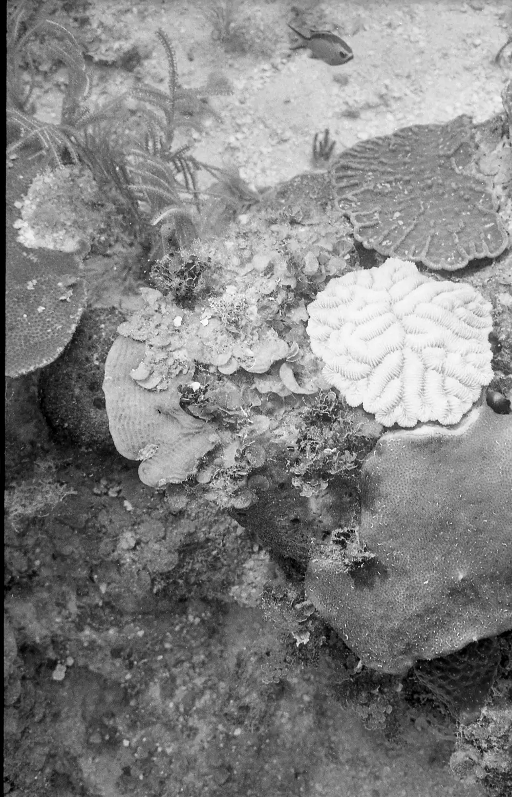{.lightbox group="discovery-bay-1966" description="**UUID: **d7a1702e-b002-4b84-a2d4-c3aaaaef9f82 **Date: **1967-09-06 **Location: **Jamaica | Discovery Bay | Buoy Upper Slope **Longitude: **77.40908ºW **Latitude: **18.47322ºN **Photographer: **Eileen Graham **Copyright: **Trustees of the Natural History Museum (London, UK), CC-BY-4.0" alt="**UUID: **d7a1702e-b002-4b84-a2d4-c3aaaaef9f82 **Date: **1967-09-06 **Location: **Jamaica | Discovery Bay | Buoy Upper Slope **Longitude: **77.40908ºW **Latitude: **18.47322ºN **Photographer: **Eileen Graham **Copyright: **Trustees of the Natural History Museum (London, UK), CC-BY-4.0"}

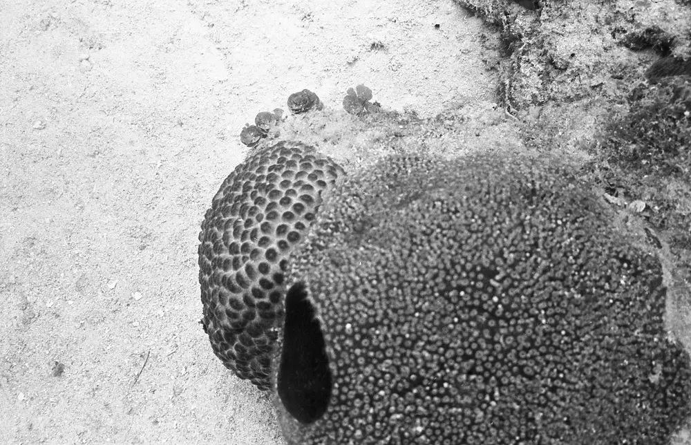{.lightbox group="discovery-bay-1966" description="**UUID: **c8cbbd49-7328-4924-889f-06c6ccfac4c0 **Date: **1967-06-13 **Location: **Jamaica | Discovery Bay | Buoy Upper Slope **Longitude: **77.40908ºW **Latitude: **18.47322ºN **Photographer: **Eileen Graham **Copyright: **Trustees of the Natural History Museum (London, UK), CC-BY-4.0" alt="**UUID: **c8cbbd49-7328-4924-889f-06c6ccfac4c0 **Date: **1967-06-13 **Location: **Jamaica | Discovery Bay | Buoy Upper Slope **Longitude: **77.40908ºW **Latitude: **18.47322ºN **Photographer: **Eileen Graham **Copyright: **Trustees of the Natural History Museum (London, UK), CC-BY-4.0"}

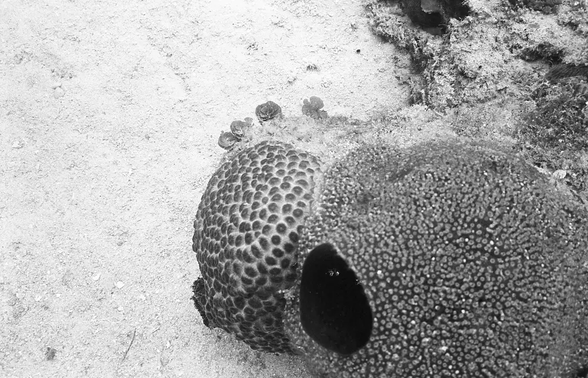{.lightbox group="discovery-bay-1966" description="**UUID: **2258842e-8477-4633-826c-3f4e8f69f63e **Date: **1967-06-13 **Location: **Jamaica | Discovery Bay | Buoy Upper Slope **Longitude: **77.40908ºW **Latitude: **18.47322ºN **Photographer: **Eileen Graham **Copyright: **Trustees of the Natural History Museum (London, UK), CC-BY-4.0" alt="**UUID: **2258842e-8477-4633-826c-3f4e8f69f63e **Date: **1967-06-13 **Location: **Jamaica | Discovery Bay | Buoy Upper Slope **Longitude: **77.40908ºW **Latitude: **18.47322ºN **Photographer: **Eileen Graham **Copyright: **Trustees of the Natural History Museum (London, UK), CC-BY-4.0"}

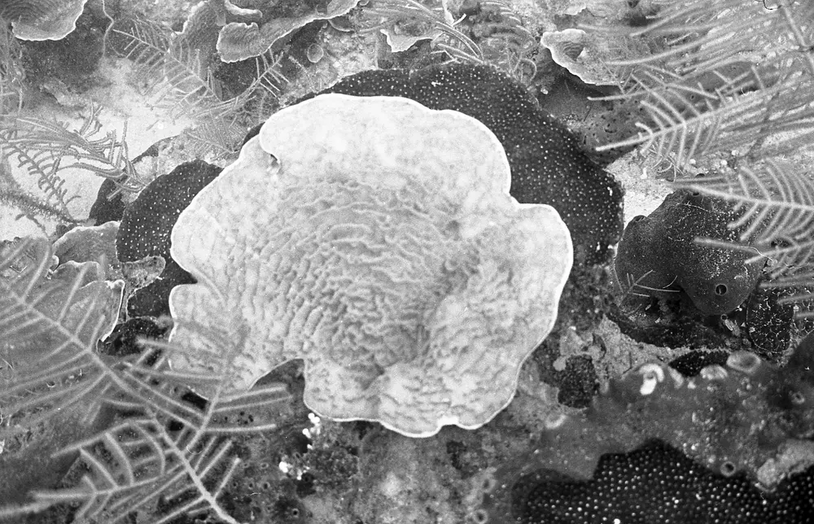{.lightbox group="discovery-bay-1966" description="**UUID: **558993d4-26cf-4afc-9363-850b930e46c1 **Date: **1967-06-13 **Location: **Jamaica | Discovery Bay | Buoy Upper Slope **Longitude: **77.40908ºW **Latitude: **18.47322ºN **Photographer: **Eileen Graham **Copyright: **Trustees of the Natural History Museum (London, UK), CC-BY-4.0" alt="**UUID: **558993d4-26cf-4afc-9363-850b930e46c1 **Date: **1967-06-13 **Location: **Jamaica | Discovery Bay | Buoy Upper Slope **Longitude: **77.40908ºW **Latitude: **18.47322ºN **Photographer: **Eileen Graham **Copyright: **Trustees of the Natural History Museum (London, UK), CC-BY-4.0"}

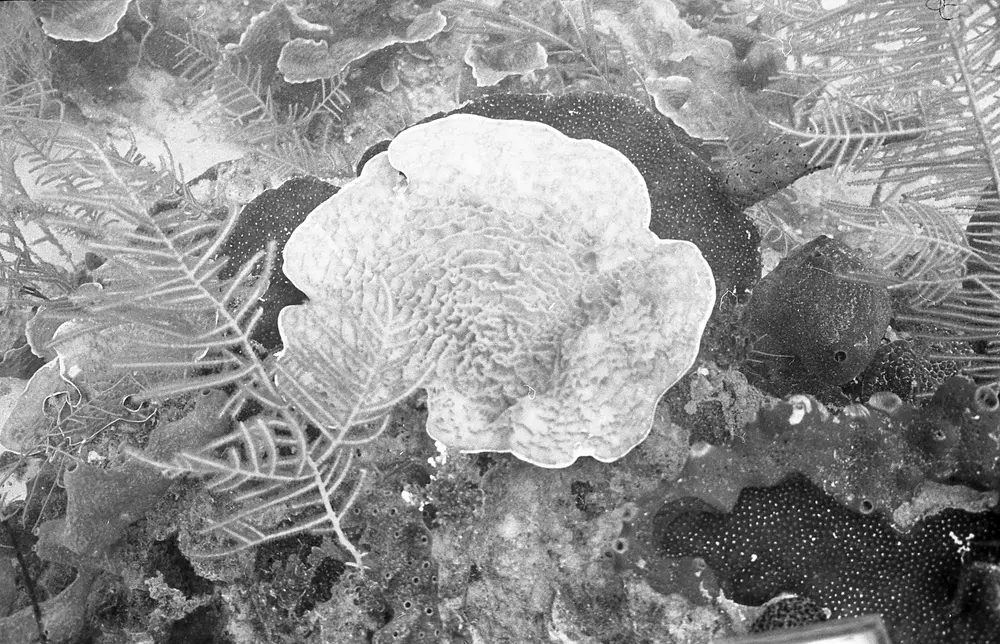{.lightbox group="discovery-bay-1966" description="**UUID: **06aaef23-5abf-4e3c-ab02-de0c19de313d **Date: **1967-06-13 **Location: **Jamaica | Discovery Bay | Buoy Upper Slope **Longitude: **77.40908ºW **Latitude: **18.47322ºN **Photographer: **Eileen Graham **Copyright: **Trustees of the Natural History Museum (London, UK), CC-BY-4.0" alt="**UUID: **06aaef23-5abf-4e3c-ab02-de0c19de313d **Date: **1967-06-13 **Location: **Jamaica | Discovery Bay | Buoy Upper Slope **Longitude: **77.40908ºW **Latitude: **18.47322ºN **Photographer: **Eileen Graham **Copyright: **Trustees of the Natural History Museum (London, UK), CC-BY-4.0"}

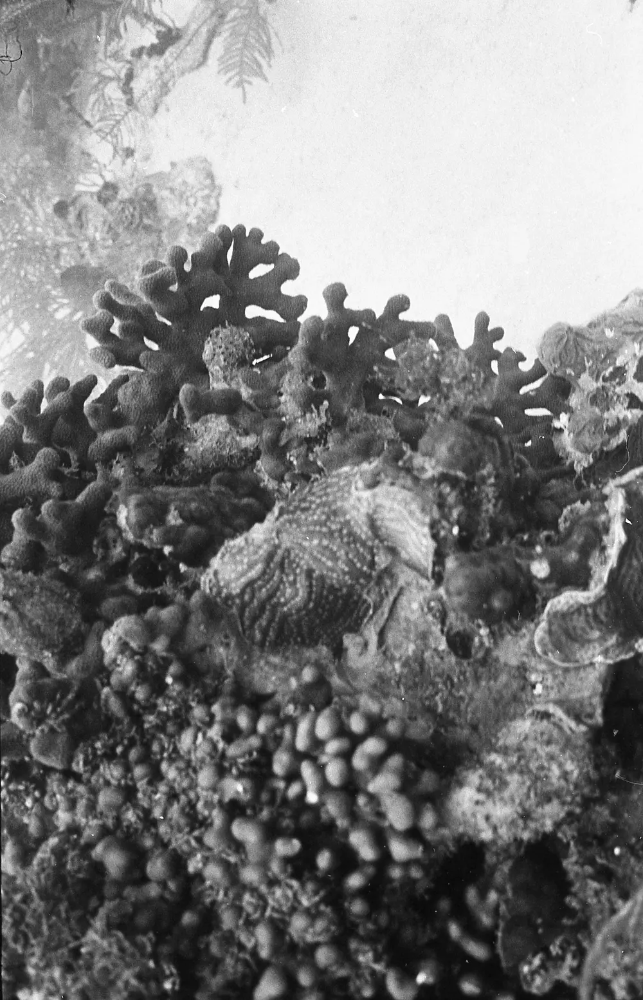{.lightbox group="discovery-bay-1966" description="**UUID: **4a191e50-a047-4314-8b20-e34f3127f026 **Date: **1967-06-13 **Location: **Jamaica | Discovery Bay | Buoy Upper Slope **Longitude: **77.40908ºW **Latitude: **18.47322ºN **Photographer: **Eileen Graham **Copyright: **Trustees of the Natural History Museum (London, UK), CC-BY-4.0" alt="**UUID: **4a191e50-a047-4314-8b20-e34f3127f026 **Date: **1967-06-13 **Location: **Jamaica | Discovery Bay | Buoy Upper Slope **Longitude: **77.40908ºW **Latitude: **18.47322ºN **Photographer: **Eileen Graham **Copyright: **Trustees of the Natural History Museum (London, UK), CC-BY-4.0"}

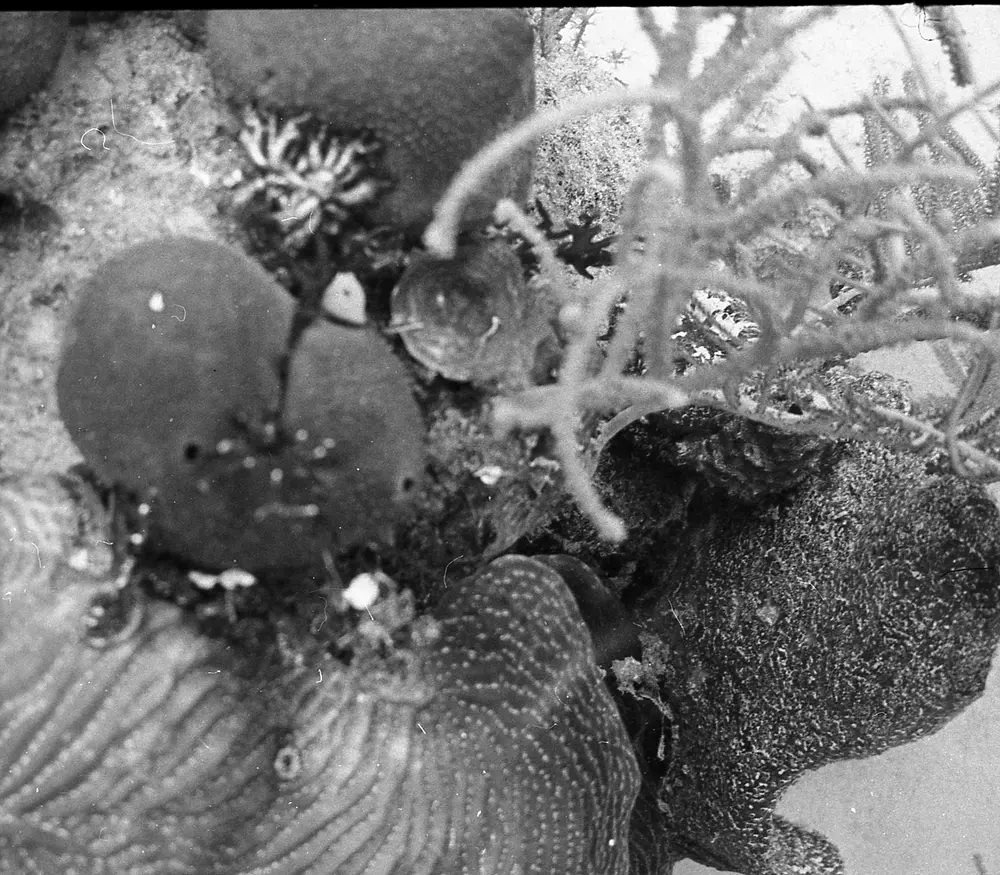{.lightbox group="discovery-bay-1966" description="**UUID: **71dd8128-e87f-439f-b966-d5d1d06f6d35 **Date: **1967-06-13 **Location: **Jamaica | Discovery Bay | Buoy Upper Slope **Longitude: **77.40908ºW **Latitude: **18.47322ºN **Photographer: **Eileen Graham **Copyright: **Trustees of the Natural History Museum (London, UK), CC-BY-4.0" alt="**UUID: **71dd8128-e87f-439f-b966-d5d1d06f6d35 **Date: **1967-06-13 **Location: **Jamaica | Discovery Bay | Buoy Upper Slope **Longitude: **77.40908ºW **Latitude: **18.47322ºN **Photographer: **Eileen Graham **Copyright: **Trustees of the Natural History Museum (London, UK), CC-BY-4.0"}

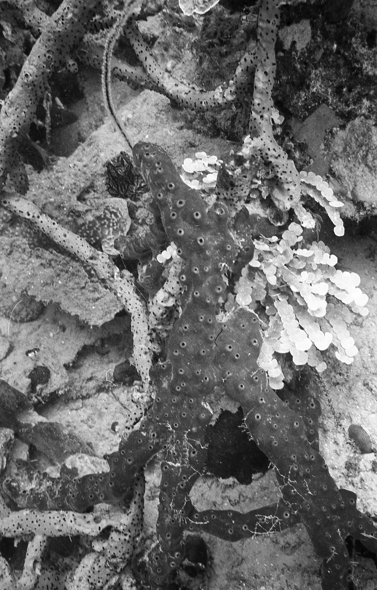{.lightbox group="discovery-bay-1966" description="**UUID: **d49428f9-5afb-496e-a4bf-d41236f9b96b **Date: **1967-06-15 **Location: **Jamaica | Discovery Bay | Pear Tree Bottom **Longitude: **77.35867ºW **Latitude: **18.4635ºN **Photographer: **Eileen Graham **Copyright: **Trustees of the Natural History Museum (London, UK), CC-BY-4.0" alt="**UUID: **d49428f9-5afb-496e-a4bf-d41236f9b96b **Date: **1967-06-15 **Location: **Jamaica | Discovery Bay | Pear Tree Bottom **Longitude: **77.35867ºW **Latitude: **18.4635ºN **Photographer: **Eileen Graham **Copyright: **Trustees of the Natural History Museum (London, UK), CC-BY-4.0"}

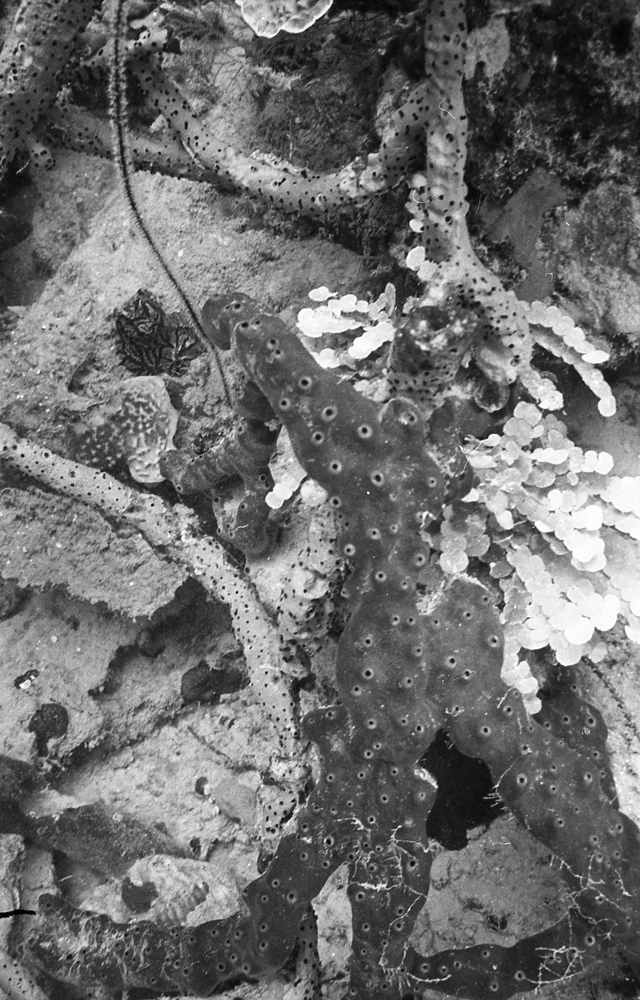{.lightbox group="discovery-bay-1966" description="**UUID: **a04ffd9b-6ee0-45aa-8597-11c145805bbf **Date: **1967-06-15 **Location: **Jamaica | Discovery Bay | Pear Tree Bottom **Longitude: **77.35867ºW **Latitude: **18.4635ºN **Photographer: **Eileen Graham **Copyright: **Trustees of the Natural History Museum (London, UK), CC-BY-4.0" alt="**UUID: **a04ffd9b-6ee0-45aa-8597-11c145805bbf **Date: **1967-06-15 **Location: **Jamaica | Discovery Bay | Pear Tree Bottom **Longitude: **77.35867ºW **Latitude: **18.4635ºN **Photographer: **Eileen Graham **Copyright: **Trustees of the Natural History Museum (London, UK), CC-BY-4.0"}

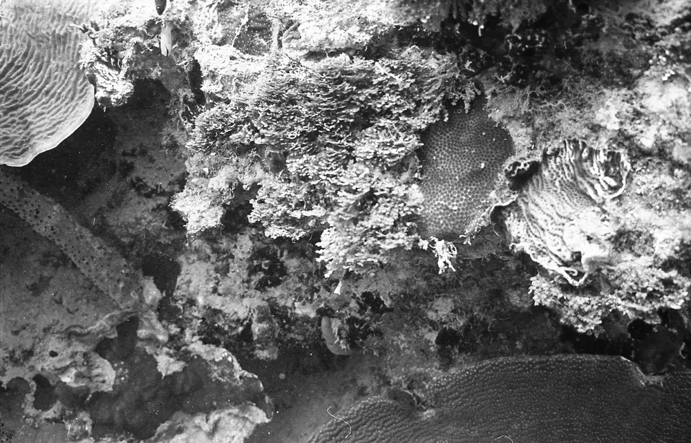{.lightbox group="discovery-bay-1966" description="**UUID: **84a5b73c-82a3-4c8b-a5e3-2cbaa67376cf **Date: **1967-06-15 **Location: **Jamaica | Discovery Bay | Pear Tree Bottom **Longitude: **77.35867ºW **Latitude: **18.4635ºN **Photographer: **Eileen Graham **Copyright: **Trustees of the Natural History Museum (London, UK), CC-BY-4.0" alt="**UUID: **84a5b73c-82a3-4c8b-a5e3-2cbaa67376cf **Date: **1967-06-15 **Location: **Jamaica | Discovery Bay | Pear Tree Bottom **Longitude: **77.35867ºW **Latitude: **18.4635ºN **Photographer: **Eileen Graham **Copyright: **Trustees of the Natural History Museum (London, UK), CC-BY-4.0"}

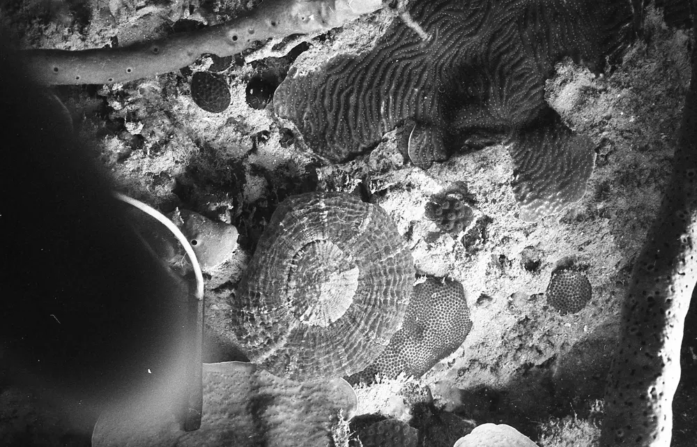{.lightbox group="discovery-bay-1966" description="**UUID: **6b4f4a29-a5bc-4a6c-9375-6cb77f5da32f **Date: **1967-06-15 **Location: **Jamaica | Discovery Bay | Pear Tree Bottom **Longitude: **77.35867ºW **Latitude: **18.4635ºN **Photographer: **Eileen Graham **Copyright: **Trustees of the Natural History Museum (London, UK), CC-BY-4.0" alt="**UUID: **6b4f4a29-a5bc-4a6c-9375-6cb77f5da32f **Date: **1967-06-15 **Location: **Jamaica | Discovery Bay | Pear Tree Bottom **Longitude: **77.35867ºW **Latitude: **18.4635ºN **Photographer: **Eileen Graham **Copyright: **Trustees of the Natural History Museum (London, UK), CC-BY-4.0"}

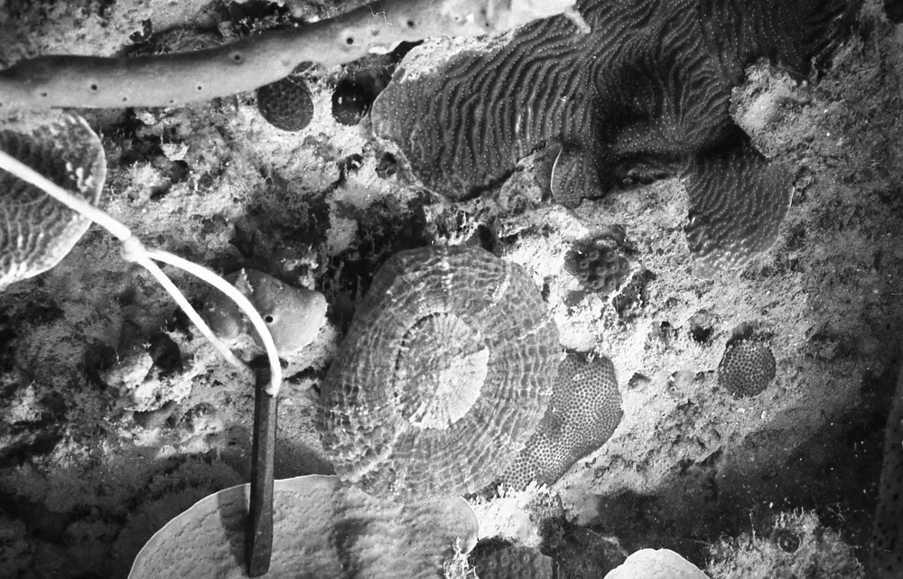{.lightbox group="discovery-bay-1966" description="**UUID: **12240c84-c11d-425b-954f-9302ff1afaf3 **Date: **1967-06-15 **Location: **Jamaica | Discovery Bay | Pear Tree Bottom **Longitude: **77.35867ºW **Latitude: **18.4635ºN **Photographer: **Eileen Graham **Copyright: **Trustees of the Natural History Museum (London, UK), CC-BY-4.0" alt="**UUID: **12240c84-c11d-425b-954f-9302ff1afaf3 **Date: **1967-06-15 **Location: **Jamaica | Discovery Bay | Pear Tree Bottom **Longitude: **77.35867ºW **Latitude: **18.4635ºN **Photographer: **Eileen Graham **Copyright: **Trustees of the Natural History Museum (London, UK), CC-BY-4.0"}

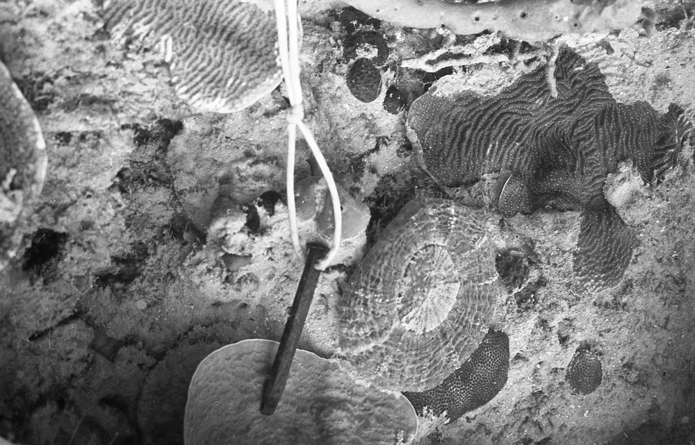{.lightbox group="discovery-bay-1966" description="**UUID: **02228aa7-52b0-4f7a-88f3-181f24d8aa61 **Date: **1967-06-15 **Location: **Jamaica | Discovery Bay | Pear Tree Bottom **Longitude: **77.35867ºW **Latitude: **18.4635ºN **Photographer: **Eileen Graham **Copyright: **Trustees of the Natural History Museum (London, UK), CC-BY-4.0" alt="**UUID: **02228aa7-52b0-4f7a-88f3-181f24d8aa61 **Date: **1967-06-15 **Location: **Jamaica | Discovery Bay | Pear Tree Bottom **Longitude: **77.35867ºW **Latitude: **18.4635ºN **Photographer: **Eileen Graham **Copyright: **Trustees of the Natural History Museum (London, UK), CC-BY-4.0"}

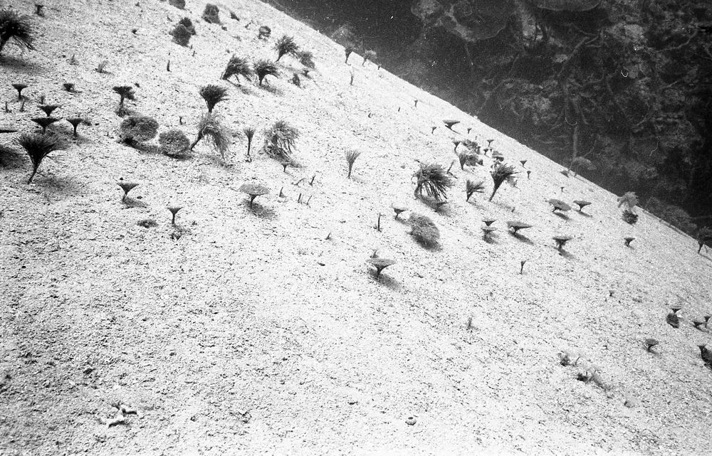{.lightbox group="discovery-bay-1966" description="**UUID: **cc8d6b15-2f60-48a5-a0a0-5fe86b7d8c0d **Date: **1967-06-15 **Location: **Jamaica | Discovery Bay | Pear Tree Bottom **Longitude: **77.35867ºW **Latitude: **18.4635ºN **Photographer: **Eileen Graham **Copyright: **Trustees of the Natural History Museum (London, UK), CC-BY-4.0" alt="**UUID: **cc8d6b15-2f60-48a5-a0a0-5fe86b7d8c0d **Date: **1967-06-15 **Location: **Jamaica | Discovery Bay | Pear Tree Bottom **Longitude: **77.35867ºW **Latitude: **18.4635ºN **Photographer: **Eileen Graham **Copyright: **Trustees of the Natural History Museum (London, UK), CC-BY-4.0"}

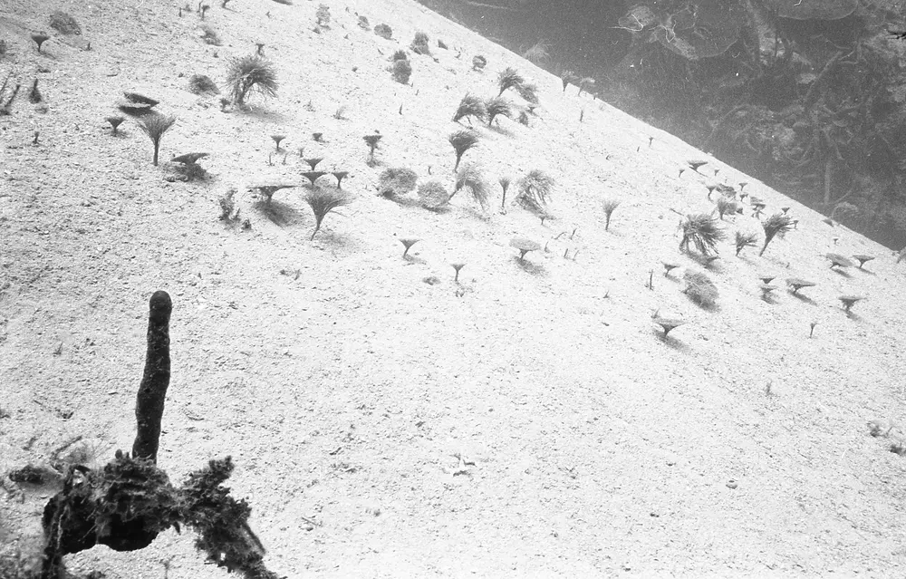{.lightbox group="discovery-bay-1966" description="**UUID: **64551470-456a-4250-a7de-ba9a01e3658f **Date: **1967-06-15 **Location: **Jamaica | Discovery Bay | Pear Tree Bottom **Longitude: **77.35867ºW **Latitude: **18.4635ºN **Photographer: **Eileen Graham **Copyright: **Trustees of the Natural History Museum (London, UK), CC-BY-4.0" alt="**UUID: **64551470-456a-4250-a7de-ba9a01e3658f **Date: **1967-06-15 **Location: **Jamaica | Discovery Bay | Pear Tree Bottom **Longitude: **77.35867ºW **Latitude: **18.4635ºN **Photographer: **Eileen Graham **Copyright: **Trustees of the Natural History Museum (London, UK), CC-BY-4.0"}

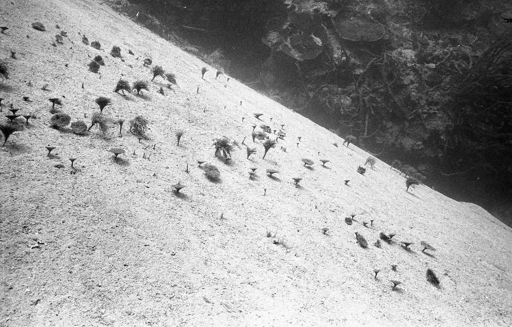{.lightbox group="discovery-bay-1966" description="**UUID: **f51a64e2-0bc3-47fb-85f1-7b2ef5e71bf4 **Date: **1967-06-15 **Location: **Jamaica | Discovery Bay | Pear Tree Bottom **Longitude: **77.35867ºW **Latitude: **18.4635ºN **Photographer: **Eileen Graham **Copyright: **Trustees of the Natural History Museum (London, UK), CC-BY-4.0" alt="**UUID: **f51a64e2-0bc3-47fb-85f1-7b2ef5e71bf4 **Date: **1967-06-15 **Location: **Jamaica | Discovery Bay | Pear Tree Bottom **Longitude: **77.35867ºW **Latitude: **18.4635ºN **Photographer: **Eileen Graham **Copyright: **Trustees of the Natural History Museum (London, UK), CC-BY-4.0"}

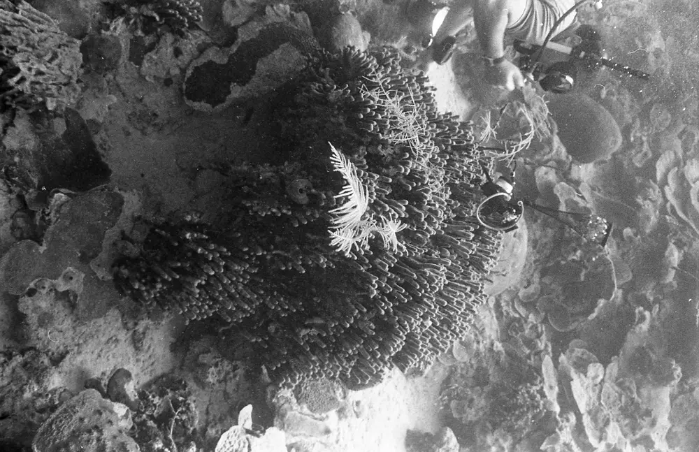{.lightbox group="discovery-bay-1966" description="**UUID: **2a87b3b5-cdd7-4517-8207-a93b3c5417ee **Date: **1967-06-16 **Location: **Jamaica | Discovery Bay | Pear Tree Bottom **Longitude: **77.35867ºW **Latitude: **18.4635ºN **Photographer: **Eileen Graham **Copyright: **Trustees of the Natural History Museum (London, UK), CC-BY-4.0" alt="**UUID: **2a87b3b5-cdd7-4517-8207-a93b3c5417ee **Date: **1967-06-16 **Location: **Jamaica | Discovery Bay | Pear Tree Bottom **Longitude: **77.35867ºW **Latitude: **18.4635ºN **Photographer: **Eileen Graham **Copyright: **Trustees of the Natural History Museum (London, UK), CC-BY-4.0"}

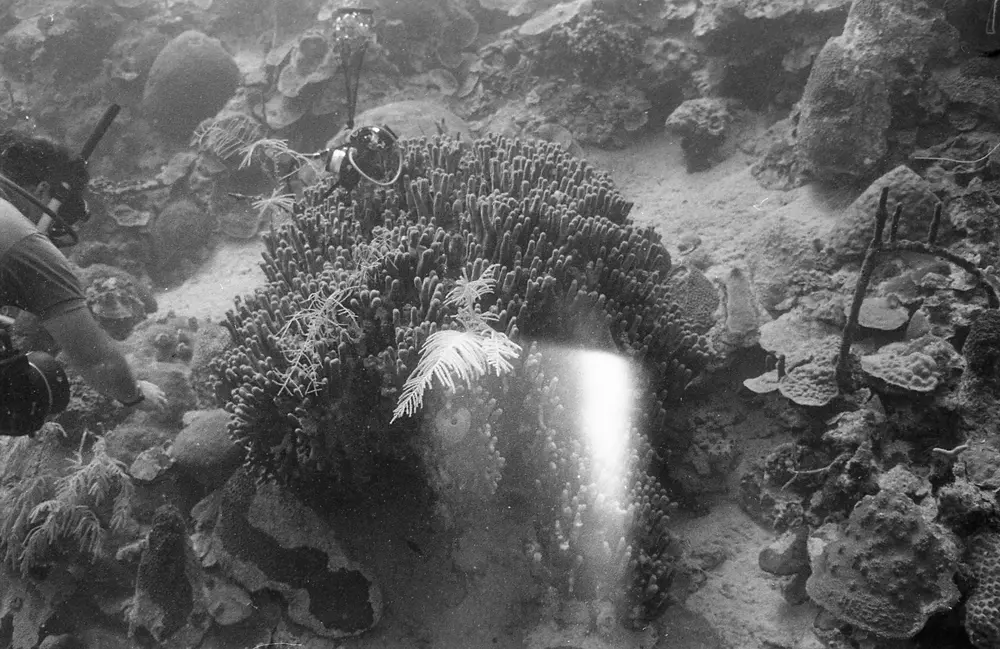{.lightbox group="discovery-bay-1966" description="**UUID: **0dae502f-11a7-464c-85a3-9e540e251dc2 **Date: **1967-06-16 **Location: **Jamaica | Discovery Bay | Pear Tree Bottom **Longitude: **77.35867ºW **Latitude: **18.4635ºN **Photographer: **Eileen Graham **Copyright: **Trustees of the Natural History Museum (London, UK), CC-BY-4.0" alt="**UUID: **0dae502f-11a7-464c-85a3-9e540e251dc2 **Date: **1967-06-16 **Location: **Jamaica | Discovery Bay | Pear Tree Bottom **Longitude: **77.35867ºW **Latitude: **18.4635ºN **Photographer: **Eileen Graham **Copyright: **Trustees of the Natural History Museum (London, UK), CC-BY-4.0"}

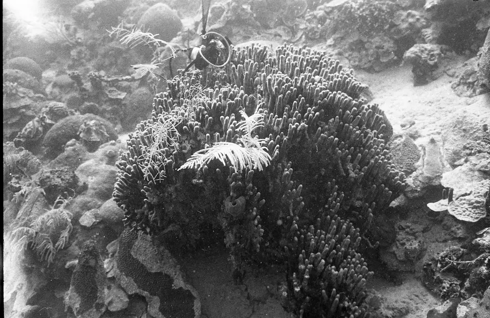{.lightbox group="discovery-bay-1966" description="**UUID: **e564fbc0-6012-4e38-8768-d8c8fed45e96 **Date: **1967-06-16 **Location: **Jamaica | Discovery Bay | Pear Tree Bottom **Longitude: **77.35867ºW **Latitude: **18.4635ºN **Photographer: **Eileen Graham **Copyright: **Trustees of the Natural History Museum (London, UK), CC-BY-4.0" alt="**UUID: **e564fbc0-6012-4e38-8768-d8c8fed45e96 **Date: **1967-06-16 **Location: **Jamaica | Discovery Bay | Pear Tree Bottom **Longitude: **77.35867ºW **Latitude: **18.4635ºN **Photographer: **Eileen Graham **Copyright: **Trustees of the Natural History Museum (London, UK), CC-BY-4.0"}

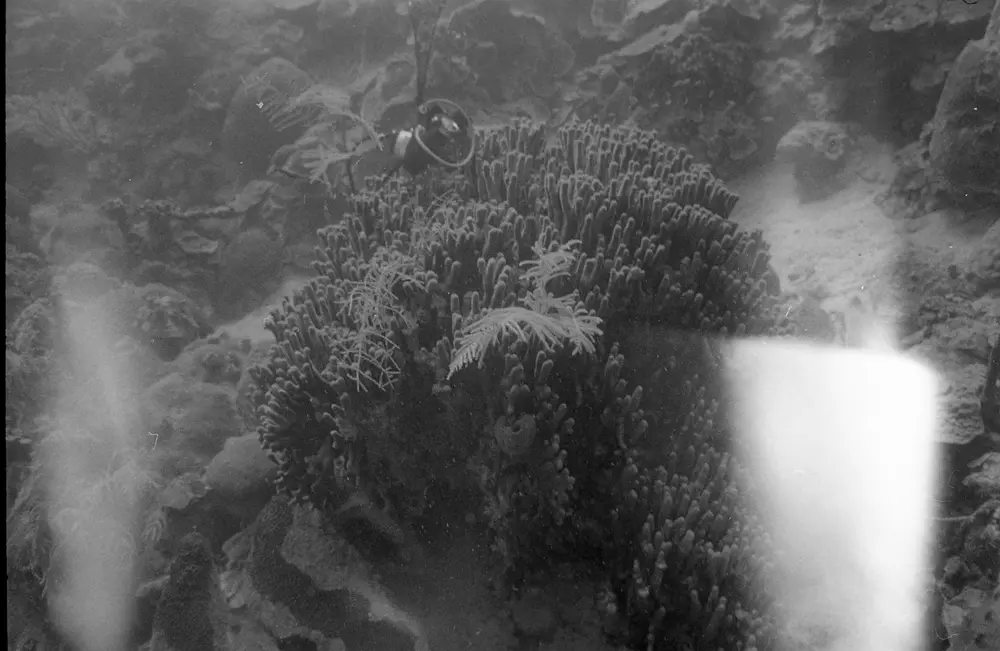{.lightbox group="discovery-bay-1966" description="**UUID: **8b843535-db7f-42bd-8a2d-74818148b09c **Date: **1967-06-16 **Location: **Jamaica | Discovery Bay | Pear Tree Bottom **Longitude: **77.35867ºW **Latitude: **18.4635ºN **Photographer: **Eileen Graham **Copyright: **Trustees of the Natural History Museum (London, UK), CC-BY-4.0" alt="**UUID: **8b843535-db7f-42bd-8a2d-74818148b09c **Date: **1967-06-16 **Location: **Jamaica | Discovery Bay | Pear Tree Bottom **Longitude: **77.35867ºW **Latitude: **18.4635ºN **Photographer: **Eileen Graham **Copyright: **Trustees of the Natural History Museum (London, UK), CC-BY-4.0"}

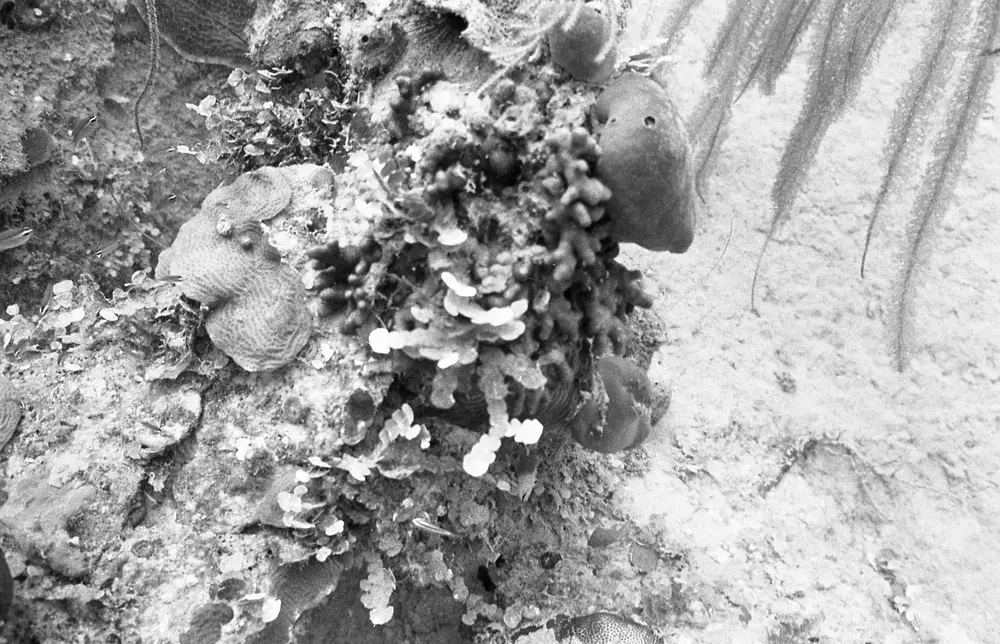{.lightbox group="discovery-bay-1966" description="**UUID: **25abaf9e-d5ab-485a-b4ad-02ea84b6e14e **Date: **1967-06-16 **Location: **Jamaica | Discovery Bay | Pear Tree Bottom **Longitude: **77.35867ºW **Latitude: **18.4635ºN **Photographer: **Eileen Graham **Copyright: **Trustees of the Natural History Museum (London, UK), CC-BY-4.0" alt="**UUID: **25abaf9e-d5ab-485a-b4ad-02ea84b6e14e **Date: **1967-06-16 **Location: **Jamaica | Discovery Bay | Pear Tree Bottom **Longitude: **77.35867ºW **Latitude: **18.4635ºN **Photographer: **Eileen Graham **Copyright: **Trustees of the Natural History Museum (London, UK), CC-BY-4.0"}

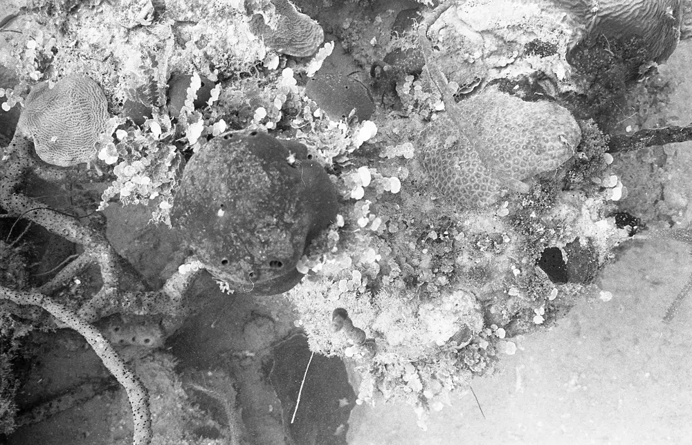{.lightbox group="discovery-bay-1966" description="**UUID: **792759bb-9b2f-4e3f-b597-4b4983d66076 **Date: **1967-06-16 **Location: **Jamaica | Discovery Bay | Pear Tree Bottom **Longitude: **77.35867ºW **Latitude: **18.4635ºN **Photographer: **Eileen Graham **Copyright: **Trustees of the Natural History Museum (London, UK), CC-BY-4.0" alt="**UUID: **792759bb-9b2f-4e3f-b597-4b4983d66076 **Date: **1967-06-16 **Location: **Jamaica | Discovery Bay | Pear Tree Bottom **Longitude: **77.35867ºW **Latitude: **18.4635ºN **Photographer: **Eileen Graham **Copyright: **Trustees of the Natural History Museum (London, UK), CC-BY-4.0"}

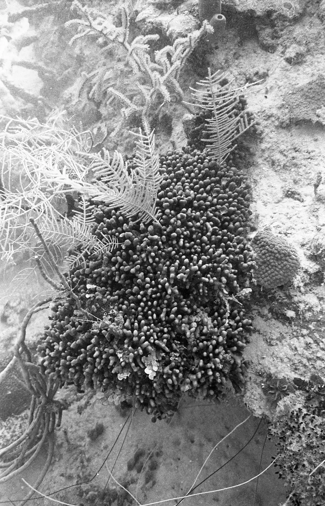{.lightbox group="discovery-bay-1966" description="**UUID: **31048748-51c4-4760-9f4c-b619a55beb8c **Date: **1967-06-16 **Location: **Jamaica | Discovery Bay | Pear Tree Bottom **Longitude: **77.35867ºW **Latitude: **18.4635ºN **Photographer: **Eileen Graham **Copyright: **Trustees of the Natural History Museum (London, UK), CC-BY-4.0" alt="**UUID: **31048748-51c4-4760-9f4c-b619a55beb8c **Date: **1967-06-16 **Location: **Jamaica | Discovery Bay | Pear Tree Bottom **Longitude: **77.35867ºW **Latitude: **18.4635ºN **Photographer: **Eileen Graham **Copyright: **Trustees of the Natural History Museum (London, UK), CC-BY-4.0"}

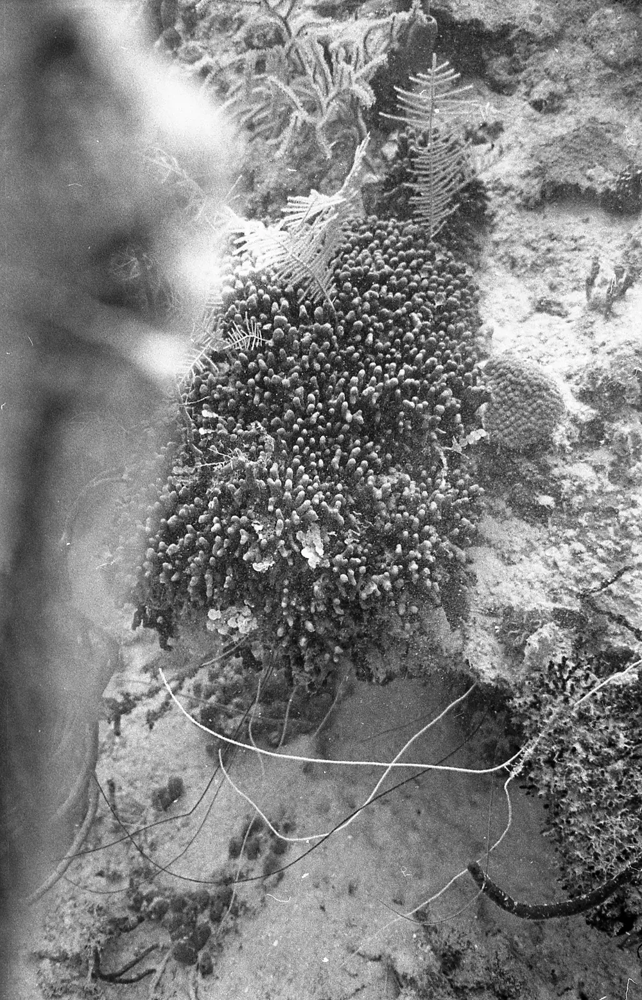{.lightbox group="discovery-bay-1966" description="**UUID: **1fa9fa63-89d3-45f4-84be-ecb442c35653 **Date: **1967-06-16 **Location: **Jamaica | Discovery Bay | Pear Tree Bottom **Longitude: **77.35867ºW **Latitude: **18.4635ºN **Photographer: **Eileen Graham **Copyright: **Trustees of the Natural History Museum (London, UK), CC-BY-4.0" alt="**UUID: **1fa9fa63-89d3-45f4-84be-ecb442c35653 **Date: **1967-06-16 **Location: **Jamaica | Discovery Bay | Pear Tree Bottom **Longitude: **77.35867ºW **Latitude: **18.4635ºN **Photographer: **Eileen Graham **Copyright: **Trustees of the Natural History Museum (London, UK), CC-BY-4.0"}

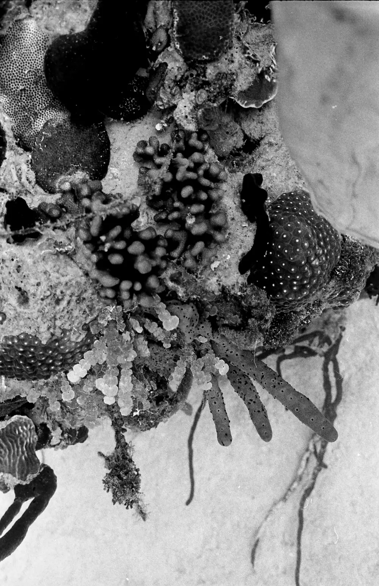{.lightbox group="discovery-bay-1966" description="**UUID: **0120efe1-0db9-4819-8e5b-1b827643e18e **Date: **1967-06-16 **Location: **Jamaica | Discovery Bay | Pear Tree Bottom **Longitude: **77.35867ºW **Latitude: **18.4635ºN **Photographer: **Eileen Graham **Copyright: **Trustees of the Natural History Museum (London, UK), CC-BY-4.0" alt="**UUID: **0120efe1-0db9-4819-8e5b-1b827643e18e **Date: **1967-06-16 **Location: **Jamaica | Discovery Bay | Pear Tree Bottom **Longitude: **77.35867ºW **Latitude: **18.4635ºN **Photographer: **Eileen Graham **Copyright: **Trustees of the Natural History Museum (London, UK), CC-BY-4.0"}

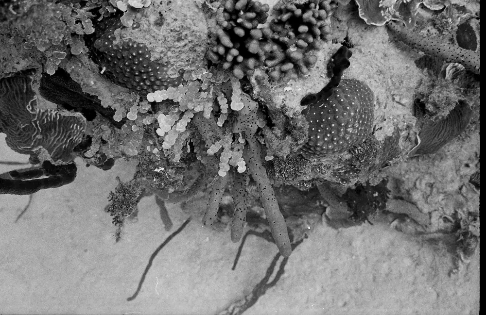{.lightbox group="discovery-bay-1966" description="**UUID: **d4c79508-4282-4ac4-b0a2-4656412e51fd **Date: **1967-06-16 **Location: **Jamaica | Discovery Bay | Pear Tree Bottom **Longitude: **77.35867ºW **Latitude: **18.4635ºN **Photographer: **Eileen Graham **Copyright: **Trustees of the Natural History Museum (London, UK), CC-BY-4.0" alt="**UUID: **d4c79508-4282-4ac4-b0a2-4656412e51fd **Date: **1967-06-16 **Location: **Jamaica | Discovery Bay | Pear Tree Bottom **Longitude: **77.35867ºW **Latitude: **18.4635ºN **Photographer: **Eileen Graham **Copyright: **Trustees of the Natural History Museum (London, UK), CC-BY-4.0"}

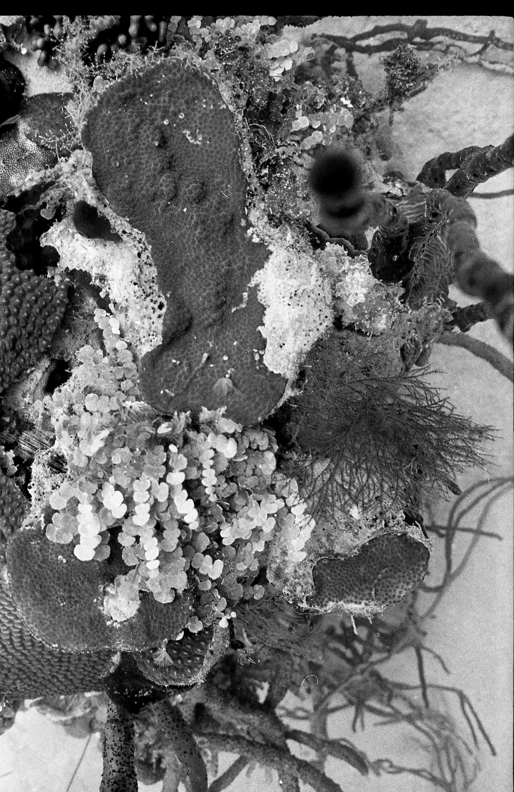{.lightbox group="discovery-bay-1966" description="**UUID: **6bddc4c3-8316-452a-8c6e-2b0a31294972 **Date: **1967-06-16 **Location: **Jamaica | Discovery Bay | Pear Tree Bottom **Longitude: **77.35867ºW **Latitude: **18.4635ºN **Photographer: **Eileen Graham **Copyright: **Trustees of the Natural History Museum (London, UK), CC-BY-4.0" alt="**UUID: **6bddc4c3-8316-452a-8c6e-2b0a31294972 **Date: **1967-06-16 **Location: **Jamaica | Discovery Bay | Pear Tree Bottom **Longitude: **77.35867ºW **Latitude: **18.4635ºN **Photographer: **Eileen Graham **Copyright: **Trustees of the Natural History Museum (London, UK), CC-BY-4.0"}

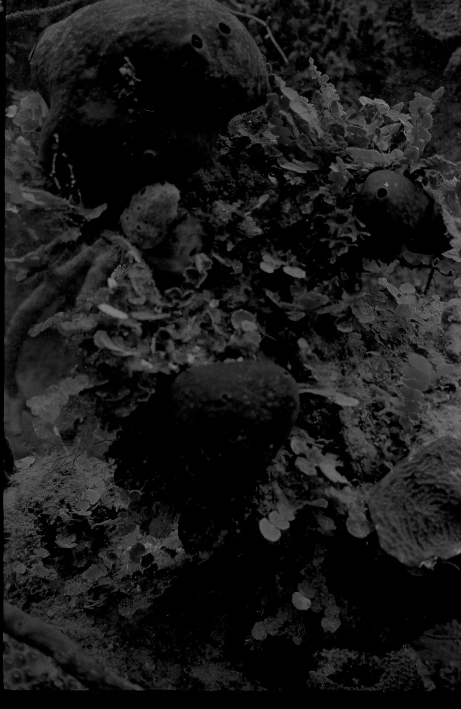{.lightbox group="discovery-bay-1966" description="**UUID: **d344f4f3-c1d0-4fe1-94c4-38c326ccafc0 **Date: **1967-06-16 **Location: **Jamaica | Discovery Bay | Pear Tree Bottom **Longitude: **77.35867ºW **Latitude: **18.4635ºN **Photographer: **Eileen Graham **Copyright: **Trustees of the Natural History Museum (London, UK), CC-BY-4.0" alt="**UUID: **d344f4f3-c1d0-4fe1-94c4-38c326ccafc0 **Date: **1967-06-16 **Location: **Jamaica | Discovery Bay | Pear Tree Bottom **Longitude: **77.35867ºW **Latitude: **18.4635ºN **Photographer: **Eileen Graham **Copyright: **Trustees of the Natural History Museum (London, UK), CC-BY-4.0"}

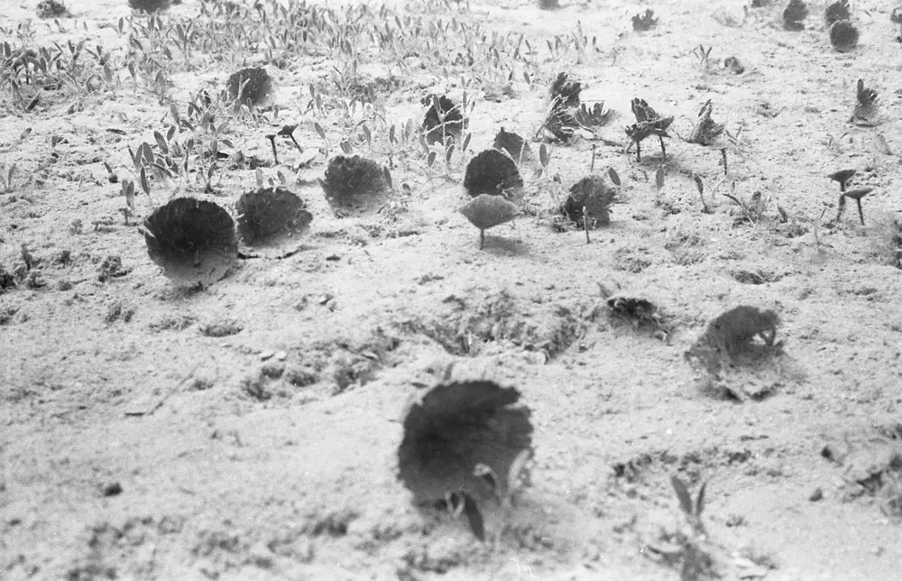{.lightbox group="discovery-bay-1966" description="**UUID: **4354ad48-3136-492a-a018-8577b870e357 **Date: **1967-06-16 **Location: **Jamaica | Discovery Bay | Pear Tree Bottom **Longitude: **77.35867ºW **Latitude: **18.4635ºN **Photographer: **Eileen Graham **Copyright: **Trustees of the Natural History Museum (London, UK), CC-BY-4.0" alt="**UUID: **4354ad48-3136-492a-a018-8577b870e357 **Date: **1967-06-16 **Location: **Jamaica | Discovery Bay | Pear Tree Bottom **Longitude: **77.35867ºW **Latitude: **18.4635ºN **Photographer: **Eileen Graham **Copyright: **Trustees of the Natural History Museum (London, UK), CC-BY-4.0"}

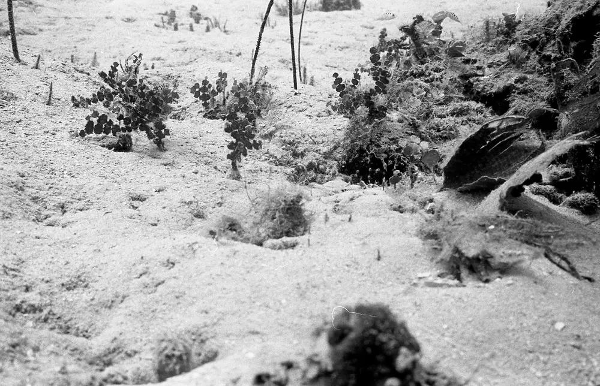{.lightbox group="discovery-bay-1966" description="**UUID: **68383cd1-c4f3-4987-830d-9e324b897860 **Date: **1967-06-16 **Location: **Jamaica | Discovery Bay | Pear Tree Bottom **Longitude: **77.35867ºW **Latitude: **18.4635ºN **Photographer: **Eileen Graham **Copyright: **Trustees of the Natural History Museum (London, UK), CC-BY-4.0" alt="**UUID: **68383cd1-c4f3-4987-830d-9e324b897860 **Date: **1967-06-16 **Location: **Jamaica | Discovery Bay | Pear Tree Bottom **Longitude: **77.35867ºW **Latitude: **18.4635ºN **Photographer: **Eileen Graham **Copyright: **Trustees of the Natural History Museum (London, UK), CC-BY-4.0"}

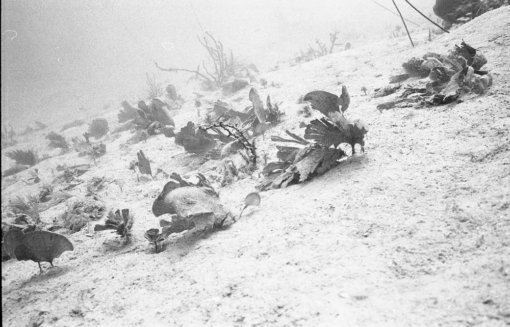{.lightbox group="discovery-bay-1966" description="**UUID: **d6a9e17f-0a07-4867-806a-de5e570b57de **Date: **1967-06-16 **Location: **Jamaica | Discovery Bay | Pear Tree Bottom **Longitude: **77.35867ºW **Latitude: **18.4635ºN **Photographer: **Eileen Graham **Copyright: **Trustees of the Natural History Museum (London, UK), CC-BY-4.0" alt="**UUID: **d6a9e17f-0a07-4867-806a-de5e570b57de **Date: **1967-06-16 **Location: **Jamaica | Discovery Bay | Pear Tree Bottom **Longitude: **77.35867ºW **Latitude: **18.4635ºN **Photographer: **Eileen Graham **Copyright: **Trustees of the Natural History Museum (London, UK), CC-BY-4.0"}

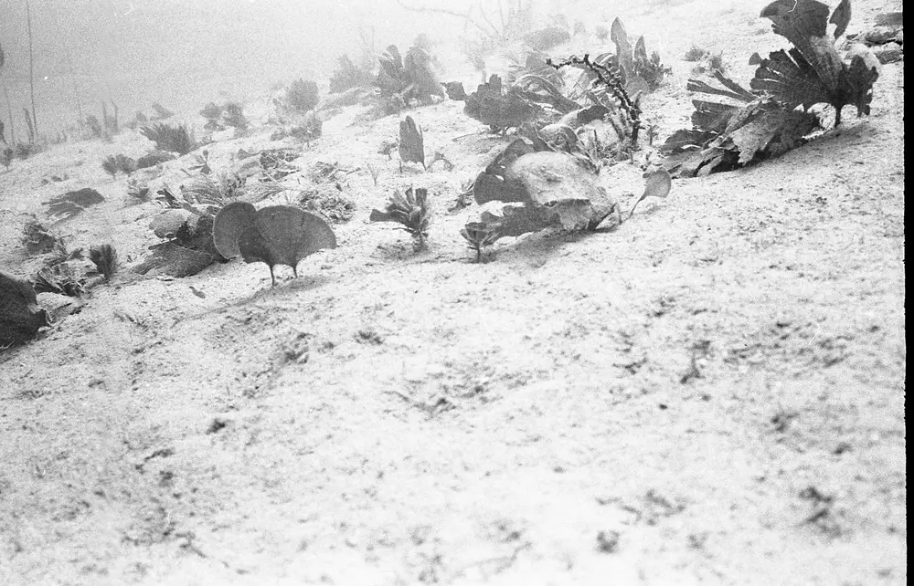{.lightbox group="discovery-bay-1966" description="**UUID: **1344b681-056a-4d04-9249-1f9e366d2d2e **Date: **1967-06-16 **Location: **Jamaica | Discovery Bay | Pear Tree Bottom **Longitude: **77.35867ºW **Latitude: **18.4635ºN **Photographer: **Eileen Graham **Copyright: **Trustees of the Natural History Museum (London, UK), CC-BY-4.0" alt="**UUID: **1344b681-056a-4d04-9249-1f9e366d2d2e **Date: **1967-06-16 **Location: **Jamaica | Discovery Bay | Pear Tree Bottom **Longitude: **77.35867ºW **Latitude: **18.4635ºN **Photographer: **Eileen Graham **Copyright: **Trustees of the Natural History Museum (London, UK), CC-BY-4.0"}

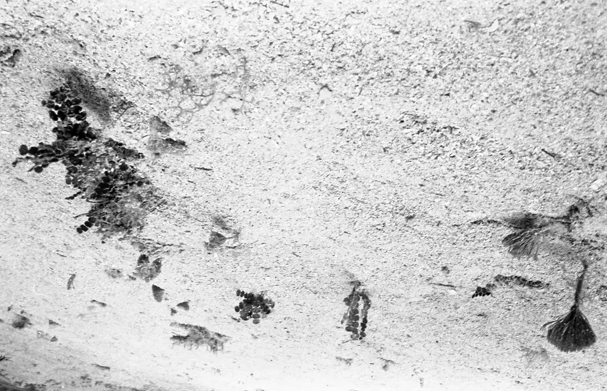{.lightbox group="discovery-bay-1966" description="**UUID: **52960e07-4bf2-45af-a9d0-728b5713817b **Date: **1967-06-16 **Location: **Jamaica | Discovery Bay | Pear Tree Bottom **Longitude: **77.35867ºW **Latitude: **18.4635ºN **Photographer: **Eileen Graham **Copyright: **Trustees of the Natural History Museum (London, UK), CC-BY-4.0" alt="**UUID: **52960e07-4bf2-45af-a9d0-728b5713817b **Date: **1967-06-16 **Location: **Jamaica | Discovery Bay | Pear Tree Bottom **Longitude: **77.35867ºW **Latitude: **18.4635ºN **Photographer: **Eileen Graham **Copyright: **Trustees of the Natural History Museum (London, UK), CC-BY-4.0"}

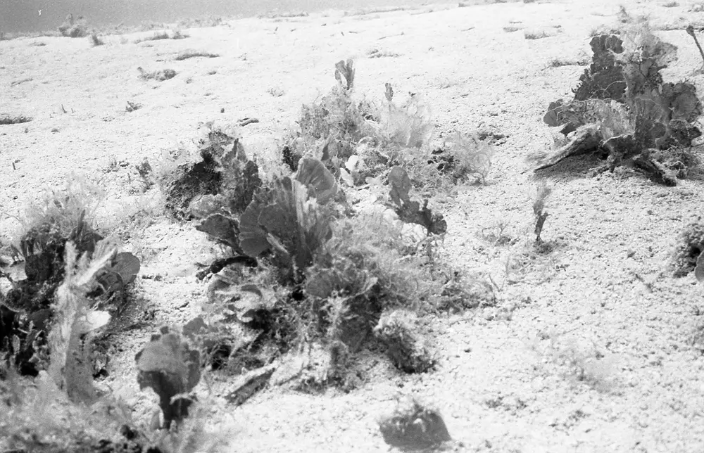{.lightbox group="discovery-bay-1966" description="**UUID: **a043ba83-1a52-4a4b-976b-2fad8f29aa27 **Date: **1967-06-16 **Location: **Jamaica | Discovery Bay | Pear Tree Bottom **Longitude: **77.35867ºW **Latitude: **18.4635ºN **Photographer: **Eileen Graham **Copyright: **Trustees of the Natural History Museum (London, UK), CC-BY-4.0" alt="**UUID: **a043ba83-1a52-4a4b-976b-2fad8f29aa27 **Date: **1967-06-16 **Location: **Jamaica | Discovery Bay | Pear Tree Bottom **Longitude: **77.35867ºW **Latitude: **18.4635ºN **Photographer: **Eileen Graham **Copyright: **Trustees of the Natural History Museum (London, UK), CC-BY-4.0"}

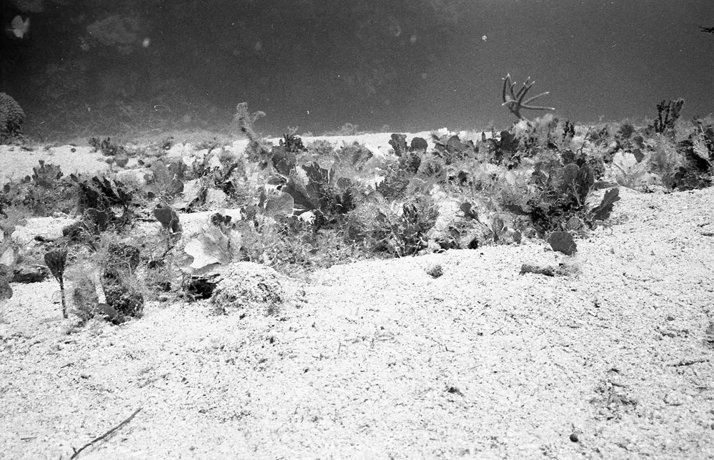{.lightbox group="discovery-bay-1966" description="**UUID: **0341d463-0fce-4d26-9610-524be57e8493 **Date: **1967-06-16 **Location: **Jamaica | Discovery Bay | Pear Tree Bottom **Longitude: **77.35867ºW **Latitude: **18.4635ºN **Photographer: **Eileen Graham **Copyright: **Trustees of the Natural History Museum (London, UK), CC-BY-4.0" alt="**UUID: **0341d463-0fce-4d26-9610-524be57e8493 **Date: **1967-06-16 **Location: **Jamaica | Discovery Bay | Pear Tree Bottom **Longitude: **77.35867ºW **Latitude: **18.4635ºN **Photographer: **Eileen Graham **Copyright: **Trustees of the Natural History Museum (London, UK), CC-BY-4.0"}

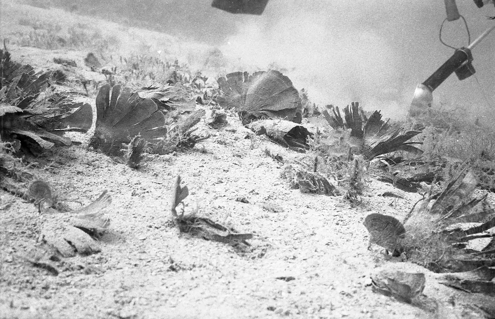{.lightbox group="discovery-bay-1966" description="**UUID: **06eee838-eec1-4711-9f0a-4508a7863b1b **Date: **1967-06-16 **Location: **Jamaica | Discovery Bay | Pear Tree Bottom **Longitude: **77.35867ºW **Latitude: **18.4635ºN **Photographer: **Eileen Graham **Copyright: **Trustees of the Natural History Museum (London, UK), CC-BY-4.0" alt="**UUID: **06eee838-eec1-4711-9f0a-4508a7863b1b **Date: **1967-06-16 **Location: **Jamaica | Discovery Bay | Pear Tree Bottom **Longitude: **77.35867ºW **Latitude: **18.4635ºN **Photographer: **Eileen Graham **Copyright: **Trustees of the Natural History Museum (London, UK), CC-BY-4.0"}

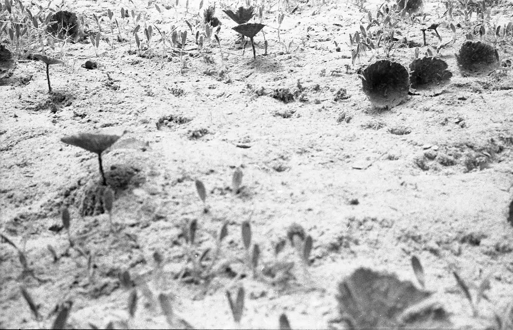{.lightbox group="discovery-bay-1966" description="**UUID: **d40f65e2-d092-4914-9a47-2d2b9c74f0e4 **Date: **1967-06-16 **Location: **Jamaica | Discovery Bay | Pear Tree Bottom **Longitude: **77.35867ºW **Latitude: **18.4635ºN **Photographer: **Eileen Graham **Copyright: **Trustees of the Natural History Museum (London, UK), CC-BY-4.0" alt="**UUID: **d40f65e2-d092-4914-9a47-2d2b9c74f0e4 **Date: **1967-06-16 **Location: **Jamaica | Discovery Bay | Pear Tree Bottom **Longitude: **77.35867ºW **Latitude: **18.4635ºN **Photographer: **Eileen Graham **Copyright: **Trustees of the Natural History Museum (London, UK), CC-BY-4.0"}

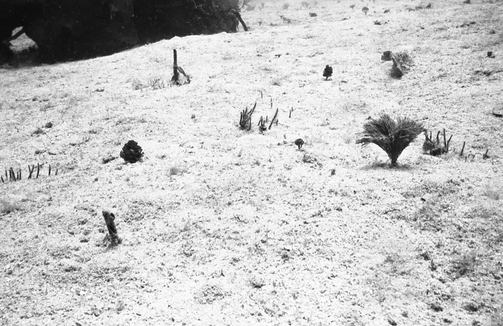{.lightbox group="discovery-bay-1966" description="**UUID: **c4adf23f-931f-4aea-ac2d-5501f0e7a529 **Date: **1967-06-22 **Location: **Jamaica | Discovery Bay | Algal Plots **Longitude: **77.414ºW **Latitude: **18.473ºN **Photographer: **Eileen Graham **Copyright: **Trustees of the Natural History Museum (London, UK), CC-BY-4.0" alt="**UUID: **c4adf23f-931f-4aea-ac2d-5501f0e7a529 **Date: **1967-06-22 **Location: **Jamaica | Discovery Bay | Algal Plots **Longitude: **77.414ºW **Latitude: **18.473ºN **Photographer: **Eileen Graham **Copyright: **Trustees of the Natural History Museum (London, UK), CC-BY-4.0"}

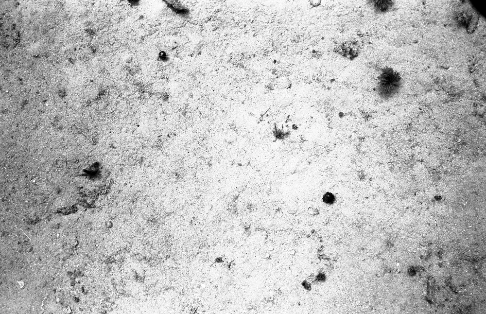{.lightbox group="discovery-bay-1966" description="**UUID: **88a27fb0-a165-4c07-91f8-3daeac9dda22 **Date: **1967-06-22 **Location: **Jamaica | Discovery Bay | Algal Plots **Longitude: **77.414ºW **Latitude: **18.473ºN **Photographer: **Eileen Graham **Copyright: **Trustees of the Natural History Museum (London, UK), CC-BY-4.0" alt="**UUID: **88a27fb0-a165-4c07-91f8-3daeac9dda22 **Date: **1967-06-22 **Location: **Jamaica | Discovery Bay | Algal Plots **Longitude: **77.414ºW **Latitude: **18.473ºN **Photographer: **Eileen Graham **Copyright: **Trustees of the Natural History Museum (London, UK), CC-BY-4.0"}

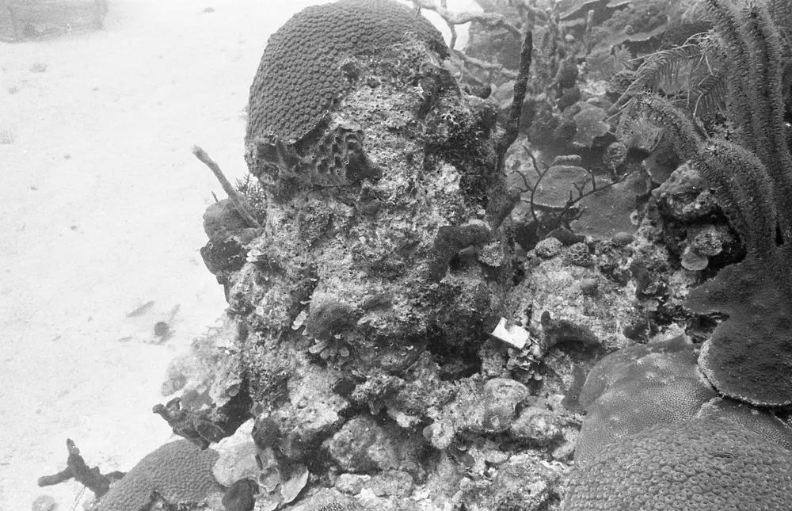{.lightbox group="discovery-bay-1966" description="**UUID: **64bf10af-4cf1-4b69-939b-abe64c44fe90 **Date: **1967-06-22 **Location: **Jamaica | Discovery Bay | Buoy Upper Slope **Longitude: **77.40908ºW **Latitude: **18.47322ºN **Photographer: **Eileen Graham **Copyright: **Trustees of the Natural History Museum (London, UK), CC-BY-4.0" alt="**UUID: **64bf10af-4cf1-4b69-939b-abe64c44fe90 **Date: **1967-06-22 **Location: **Jamaica | Discovery Bay | Buoy Upper Slope **Longitude: **77.40908ºW **Latitude: **18.47322ºN **Photographer: **Eileen Graham **Copyright: **Trustees of the Natural History Museum (London, UK), CC-BY-4.0"}

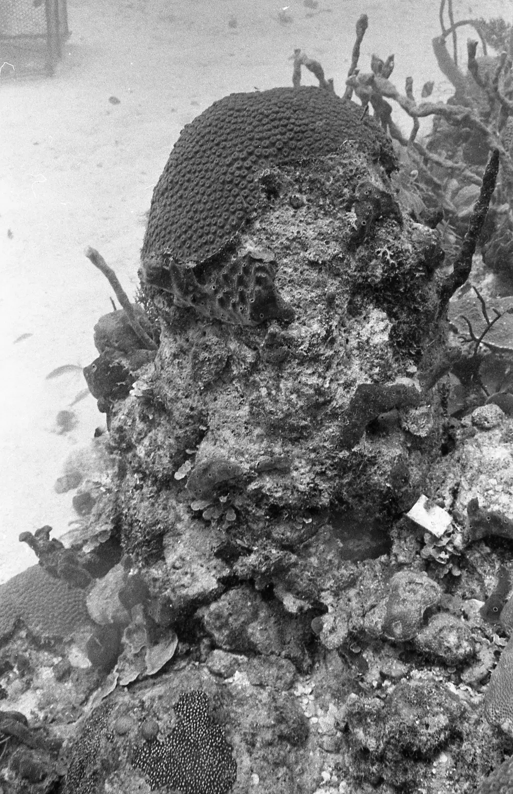{.lightbox group="discovery-bay-1966" description="**UUID: **71d9b27f-2194-41e9-8336-3d16d474e448 **Date: **1967-06-22 **Location: **Jamaica | Discovery Bay | Buoy Upper Slope **Longitude: **77.40908ºW **Latitude: **18.47322ºN **Photographer: **Eileen Graham **Copyright: **Trustees of the Natural History Museum (London, UK), CC-BY-4.0" alt="**UUID: **71d9b27f-2194-41e9-8336-3d16d474e448 **Date: **1967-06-22 **Location: **Jamaica | Discovery Bay | Buoy Upper Slope **Longitude: **77.40908ºW **Latitude: **18.47322ºN **Photographer: **Eileen Graham **Copyright: **Trustees of the Natural History Museum (London, UK), CC-BY-4.0"}

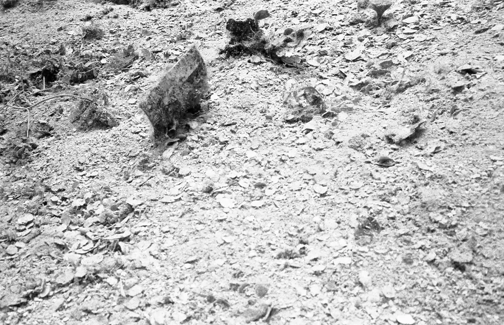{.lightbox group="discovery-bay-1966" description="**UUID: **e46496bc-1a67-4c3a-a4fd-28fabd747723 **Date: **1967-06-22 **Location: **Jamaica | Discovery Bay | Buoy Upper Slope **Longitude: **77.40908ºW **Latitude: **18.47322ºN **Photographer: **Eileen Graham **Copyright: **Trustees of the Natural History Museum (London, UK), CC-BY-4.0" alt="**UUID: **e46496bc-1a67-4c3a-a4fd-28fabd747723 **Date: **1967-06-22 **Location: **Jamaica | Discovery Bay | Buoy Upper Slope **Longitude: **77.40908ºW **Latitude: **18.47322ºN **Photographer: **Eileen Graham **Copyright: **Trustees of the Natural History Museum (London, UK), CC-BY-4.0"}

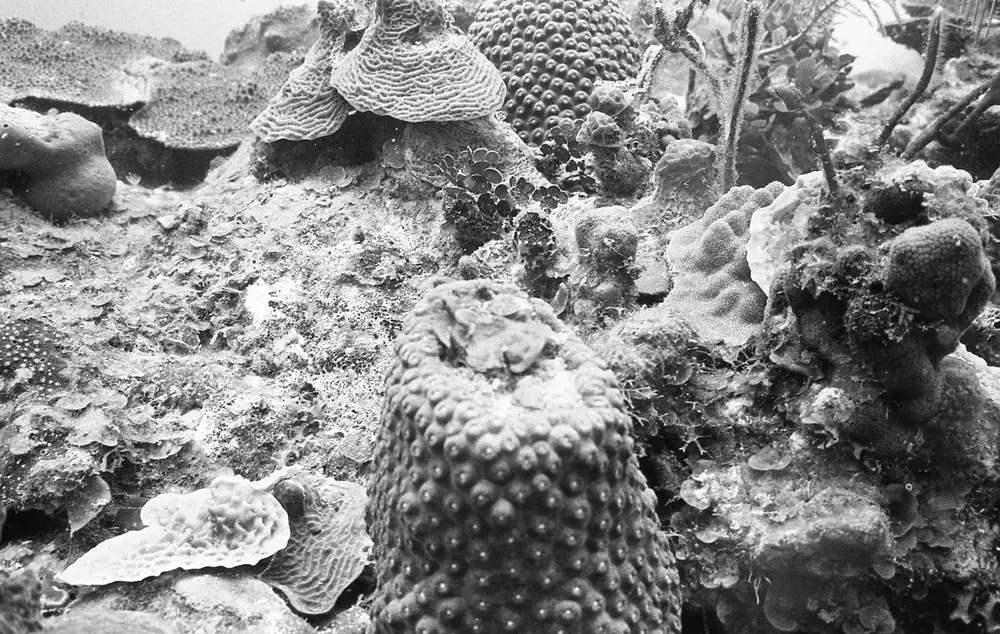{.lightbox group="discovery-bay-1966" description="**UUID: **ad64a564-1ce1-48c8-a639-ace078038979 **Date: **1967-06-22 **Location: **Jamaica | Discovery Bay | Buoy Upper Slope **Longitude: **77.40908ºW **Latitude: **18.47322ºN **Photographer: **Eileen Graham **Copyright: **Trustees of the Natural History Museum (London, UK), CC-BY-4.0" alt="**UUID: **ad64a564-1ce1-48c8-a639-ace078038979 **Date: **1967-06-22 **Location: **Jamaica | Discovery Bay | Buoy Upper Slope **Longitude: **77.40908ºW **Latitude: **18.47322ºN **Photographer: **Eileen Graham **Copyright: **Trustees of the Natural History Museum (London, UK), CC-BY-4.0"}

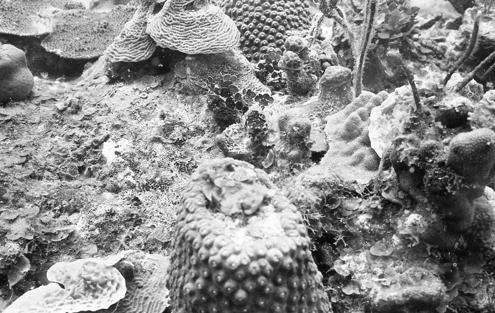{.lightbox group="discovery-bay-1966" description="**UUID: **317c1170-f72f-4a9c-bef1-4b7128a5a29e **Date: **1967-06-22 **Location: **Jamaica | Discovery Bay | Buoy Upper Slope **Longitude: **77.40908ºW **Latitude: **18.47322ºN **Photographer: **Eileen Graham **Copyright: **Trustees of the Natural History Museum (London, UK), CC-BY-4.0" alt="**UUID: **317c1170-f72f-4a9c-bef1-4b7128a5a29e **Date: **1967-06-22 **Location: **Jamaica | Discovery Bay | Buoy Upper Slope **Longitude: **77.40908ºW **Latitude: **18.47322ºN **Photographer: **Eileen Graham **Copyright: **Trustees of the Natural History Museum (London, UK), CC-BY-4.0"}

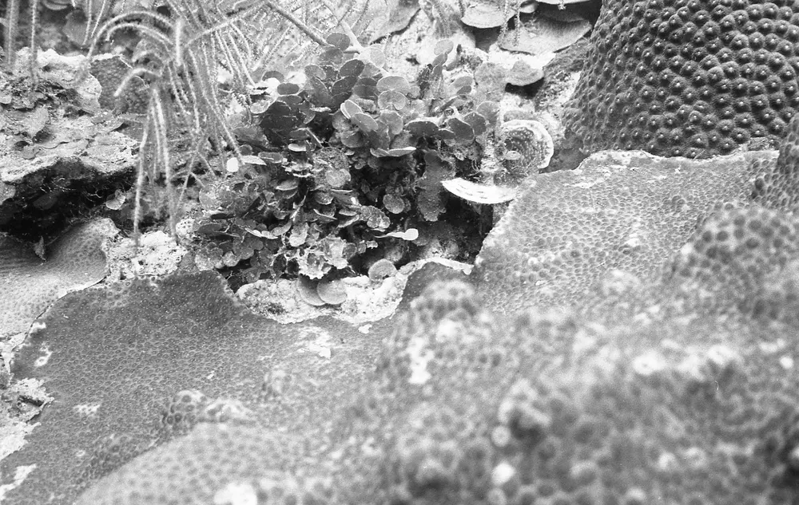{.lightbox group="discovery-bay-1966" description="**UUID: **31e9189b-c1aa-4115-a619-77ca3b1e477d **Date: **1967-06-22 **Location: **Jamaica | Discovery Bay | Buoy Upper Slope **Longitude: **77.40908ºW **Latitude: **18.47322ºN **Photographer: **Eileen Graham **Copyright: **Trustees of the Natural History Museum (London, UK), CC-BY-4.0" alt="**UUID: **31e9189b-c1aa-4115-a619-77ca3b1e477d **Date: **1967-06-22 **Location: **Jamaica | Discovery Bay | Buoy Upper Slope **Longitude: **77.40908ºW **Latitude: **18.47322ºN **Photographer: **Eileen Graham **Copyright: **Trustees of the Natural History Museum (London, UK), CC-BY-4.0"}

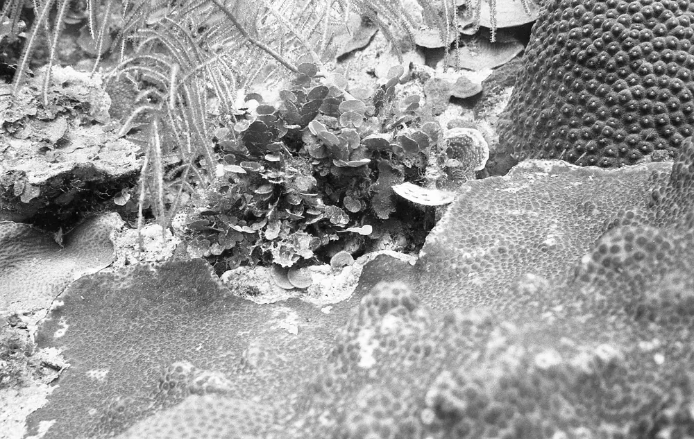{.lightbox group="discovery-bay-1966" description="**UUID: **50fbb4d3-89db-45c9-8a62-f371f4398a7e **Date: **1967-06-22 **Location: **Jamaica | Discovery Bay | Buoy Upper Slope **Longitude: **77.40908ºW **Latitude: **18.47322ºN **Photographer: **Eileen Graham **Copyright: **Trustees of the Natural History Museum (London, UK), CC-BY-4.0" alt="**UUID: **50fbb4d3-89db-45c9-8a62-f371f4398a7e **Date: **1967-06-22 **Location: **Jamaica | Discovery Bay | Buoy Upper Slope **Longitude: **77.40908ºW **Latitude: **18.47322ºN **Photographer: **Eileen Graham **Copyright: **Trustees of the Natural History Museum (London, UK), CC-BY-4.0"}

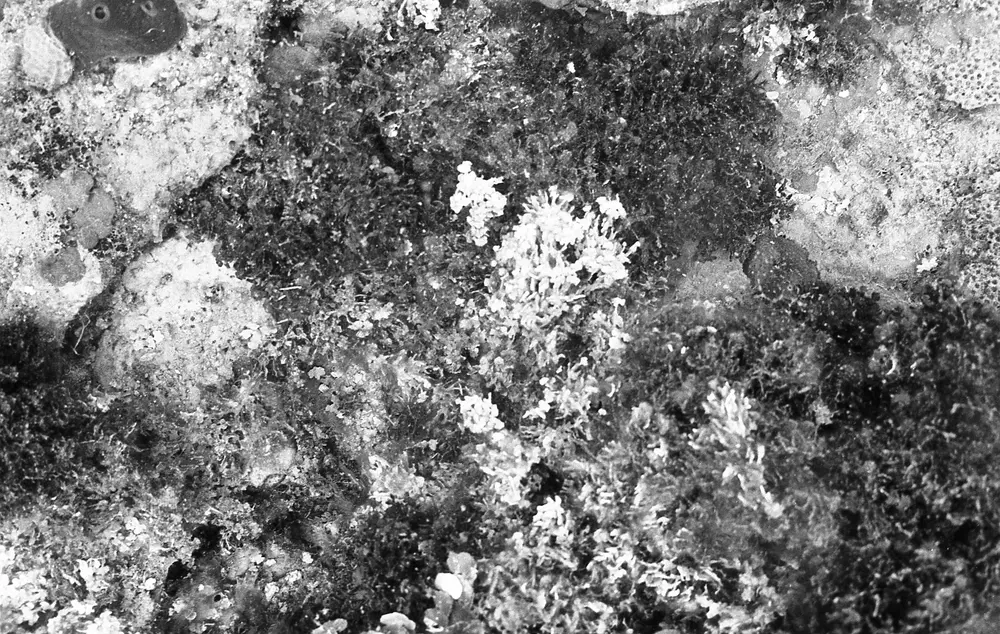{.lightbox group="discovery-bay-1966" description="**UUID: **7e62abe0-9cd1-4f4e-8f98-8cca3c6fd094 **Date: **1967-06-22 **Location: **Jamaica | Discovery Bay | Buoy Upper Slope **Longitude: **77.40908ºW **Latitude: **18.47322ºN **Photographer: **Eileen Graham **Copyright: **Trustees of the Natural History Museum (London, UK), CC-BY-4.0" alt="**UUID: **7e62abe0-9cd1-4f4e-8f98-8cca3c6fd094 **Date: **1967-06-22 **Location: **Jamaica | Discovery Bay | Buoy Upper Slope **Longitude: **77.40908ºW **Latitude: **18.47322ºN **Photographer: **Eileen Graham **Copyright: **Trustees of the Natural History Museum (London, UK), CC-BY-4.0"}

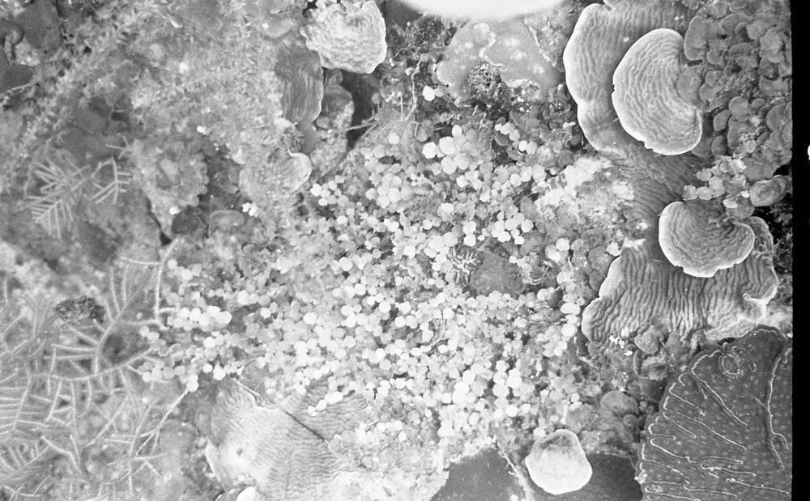{.lightbox group="discovery-bay-1966" description="**UUID: **7e03c333-3a59-4cfc-a009-58e575f8baf3 **Date: **1967-06-22 **Location: **Jamaica | Discovery Bay | Buoy Upper Slope **Longitude: **77.40908ºW **Latitude: **18.47322ºN **Photographer: **Eileen Graham **Copyright: **Trustees of the Natural History Museum (London, UK), CC-BY-4.0" alt="**UUID: **7e03c333-3a59-4cfc-a009-58e575f8baf3 **Date: **1967-06-22 **Location: **Jamaica | Discovery Bay | Buoy Upper Slope **Longitude: **77.40908ºW **Latitude: **18.47322ºN **Photographer: **Eileen Graham **Copyright: **Trustees of the Natural History Museum (London, UK), CC-BY-4.0"}

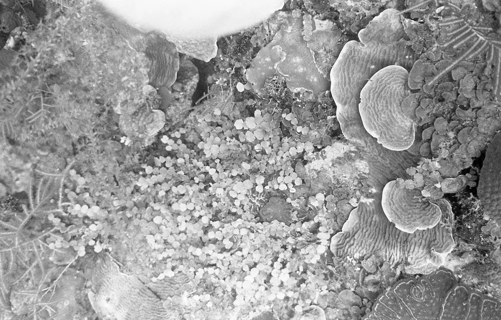{.lightbox group="discovery-bay-1966" description="**UUID: **681d1c10-e705-483f-860b-42658487e63d **Date: **1967-06-22 **Location: **Jamaica | Discovery Bay | Buoy Upper Slope **Longitude: **77.40908ºW **Latitude: **18.47322ºN **Photographer: **Eileen Graham **Copyright: **Trustees of the Natural History Museum (London, UK), CC-BY-4.0" alt="**UUID: **681d1c10-e705-483f-860b-42658487e63d **Date: **1967-06-22 **Location: **Jamaica | Discovery Bay | Buoy Upper Slope **Longitude: **77.40908ºW **Latitude: **18.47322ºN **Photographer: **Eileen Graham **Copyright: **Trustees of the Natural History Museum (London, UK), CC-BY-4.0"}

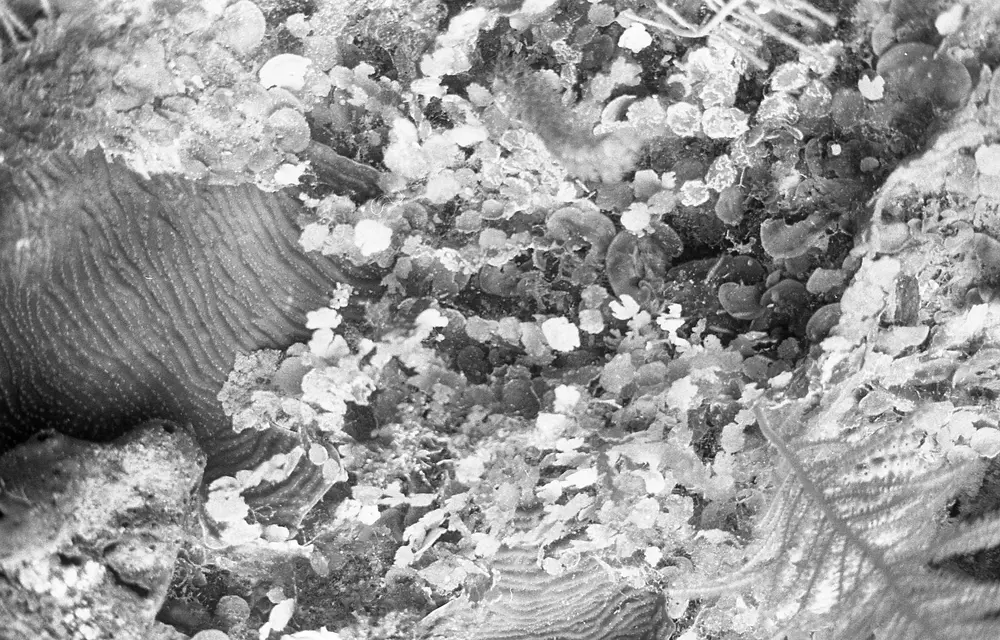{.lightbox group="discovery-bay-1966" description="**UUID: **295ccc03-e587-4de2-a48b-e70a5374ed08 **Date: **1967-06-22 **Location: **Jamaica | Discovery Bay | Buoy Upper Slope **Longitude: **77.40908ºW **Latitude: **18.47322ºN **Photographer: **Eileen Graham **Copyright: **Trustees of the Natural History Museum (London, UK), CC-BY-4.0" alt="**UUID: **295ccc03-e587-4de2-a48b-e70a5374ed08 **Date: **1967-06-22 **Location: **Jamaica | Discovery Bay | Buoy Upper Slope **Longitude: **77.40908ºW **Latitude: **18.47322ºN **Photographer: **Eileen Graham **Copyright: **Trustees of the Natural History Museum (London, UK), CC-BY-4.0"}

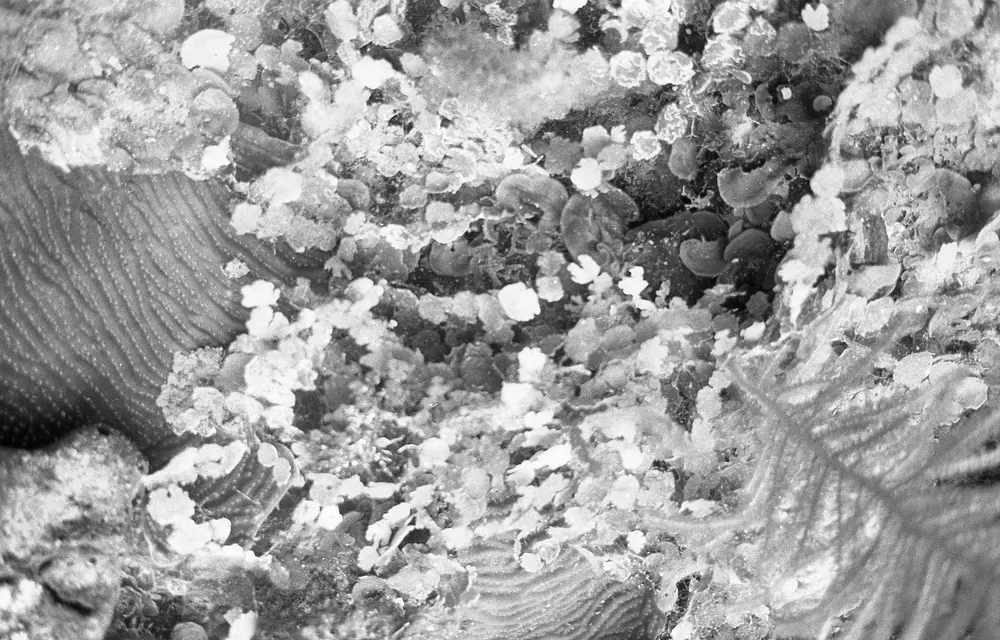{.lightbox group="discovery-bay-1966" description="**UUID: **b589d5f1-3a30-479d-9f87-f1406f152675 **Date: **1967-06-22 **Location: **Jamaica | Discovery Bay | Buoy Upper Slope **Longitude: **77.40908ºW **Latitude: **18.47322ºN **Photographer: **Eileen Graham **Copyright: **Trustees of the Natural History Museum (London, UK), CC-BY-4.0" alt="**UUID: **b589d5f1-3a30-479d-9f87-f1406f152675 **Date: **1967-06-22 **Location: **Jamaica | Discovery Bay | Buoy Upper Slope **Longitude: **77.40908ºW **Latitude: **18.47322ºN **Photographer: **Eileen Graham **Copyright: **Trustees of the Natural History Museum (London, UK), CC-BY-4.0"}

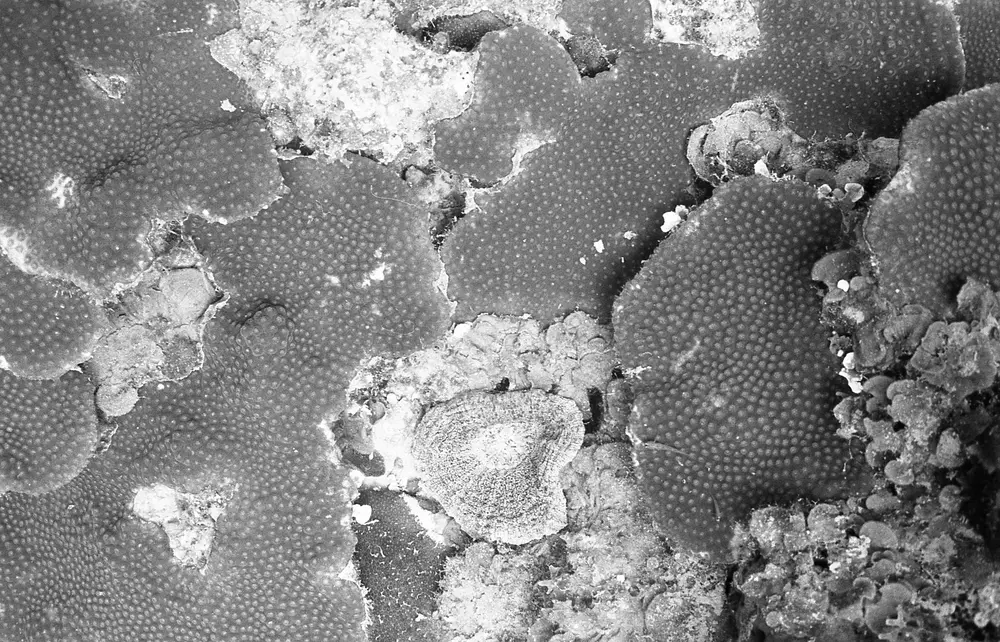{.lightbox group="discovery-bay-1966" description="**UUID: **8178a734-86df-41ce-8554-e8a6743f9713 **Date: **1967-06-22 **Location: **Jamaica | Discovery Bay | Buoy Upper Slope **Longitude: **77.40908ºW **Latitude: **18.47322ºN **Photographer: **Eileen Graham **Copyright: **Trustees of the Natural History Museum (London, UK), CC-BY-4.0" alt="**UUID: **8178a734-86df-41ce-8554-e8a6743f9713 **Date: **1967-06-22 **Location: **Jamaica | Discovery Bay | Buoy Upper Slope **Longitude: **77.40908ºW **Latitude: **18.47322ºN **Photographer: **Eileen Graham **Copyright: **Trustees of the Natural History Museum (London, UK), CC-BY-4.0"}

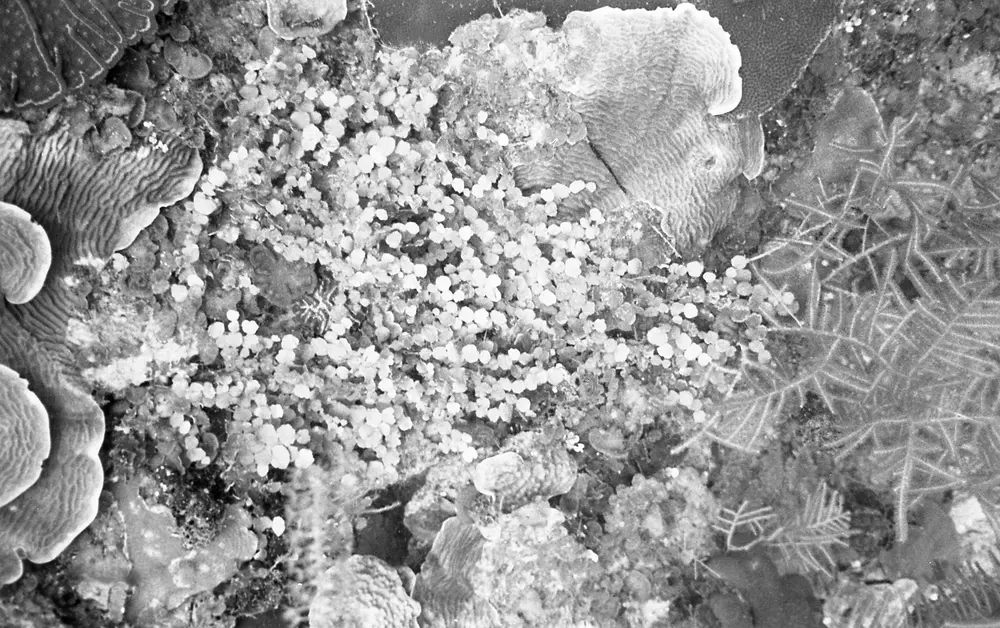{.lightbox group="discovery-bay-1966" description="**UUID: **5ea273e0-2c21-4b4a-9eaf-56db2413bf52 **Date: **1967-06-22 **Location: **Jamaica | Discovery Bay | Buoy Upper Slope **Longitude: **77.40908ºW **Latitude: **18.47322ºN **Photographer: **Eileen Graham **Copyright: **Trustees of the Natural History Museum (London, UK), CC-BY-4.0" alt="**UUID: **5ea273e0-2c21-4b4a-9eaf-56db2413bf52 **Date: **1967-06-22 **Location: **Jamaica | Discovery Bay | Buoy Upper Slope **Longitude: **77.40908ºW **Latitude: **18.47322ºN **Photographer: **Eileen Graham **Copyright: **Trustees of the Natural History Museum (London, UK), CC-BY-4.0"}

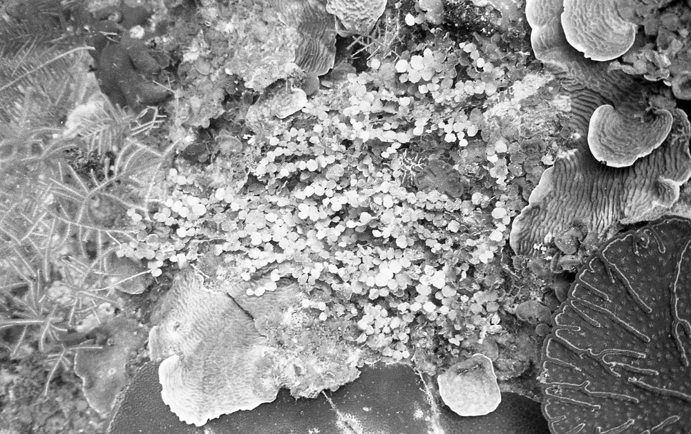{.lightbox group="discovery-bay-1966" description="**UUID: **9641e52c-b4df-47d1-93f8-c0dbd6510e44 **Date: **1967-06-22 **Location: **Jamaica | Discovery Bay | Buoy Upper Slope **Longitude: **77.40908ºW **Latitude: **18.47322ºN **Photographer: **Eileen Graham **Copyright: **Trustees of the Natural History Museum (London, UK), CC-BY-4.0" alt="**UUID: **9641e52c-b4df-47d1-93f8-c0dbd6510e44 **Date: **1967-06-22 **Location: **Jamaica | Discovery Bay | Buoy Upper Slope **Longitude: **77.40908ºW **Latitude: **18.47322ºN **Photographer: **Eileen Graham **Copyright: **Trustees of the Natural History Museum (London, UK), CC-BY-4.0"}

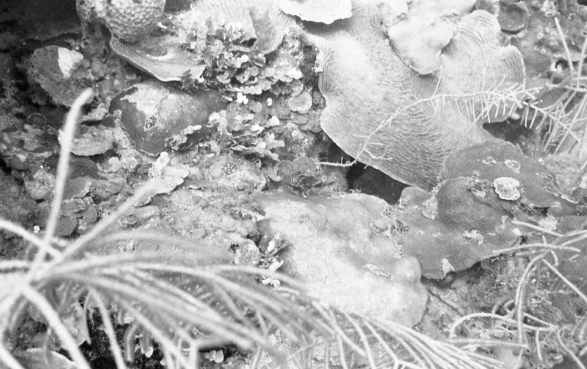{.lightbox group="discovery-bay-1966" description="**UUID: **3d1e3749-fd63-4424-911c-6ac18f2a9e8d **Date: **1967-06-22 **Location: **Jamaica | Discovery Bay | Buoy Upper Slope **Longitude: **77.40908ºW **Latitude: **18.47322ºN **Photographer: **Eileen Graham **Copyright: **Trustees of the Natural History Museum (London, UK), CC-BY-4.0" alt="**UUID: **3d1e3749-fd63-4424-911c-6ac18f2a9e8d **Date: **1967-06-22 **Location: **Jamaica | Discovery Bay | Buoy Upper Slope **Longitude: **77.40908ºW **Latitude: **18.47322ºN **Photographer: **Eileen Graham **Copyright: **Trustees of the Natural History Museum (London, UK), CC-BY-4.0"}

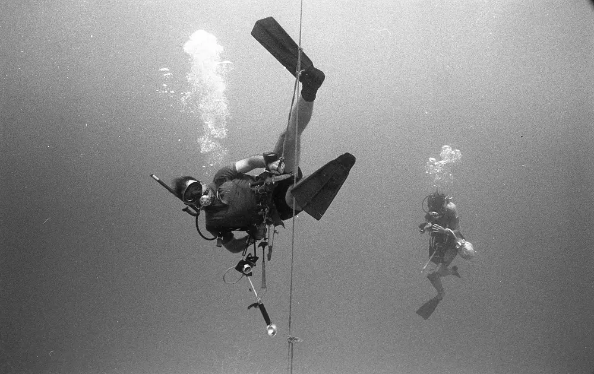{.lightbox group="discovery-bay-1966" description="**UUID: **3cfcf515-eb06-4153-9bbd-0d6f0ad4f16b **Date: **1967-06-22 **Location: **Jamaica | Discovery Bay | Buoy Mooring (1960s) **Longitude: **77.40908ºW **Latitude: **18.47322ºN **Photographer: **Eileen Graham **Copyright: **Trustees of the Natural History Museum (London, UK), CC-BY-4.0" alt="**UUID: **3cfcf515-eb06-4153-9bbd-0d6f0ad4f16b **Date: **1967-06-22 **Location: **Jamaica | Discovery Bay | Buoy Mooring (1960s) **Longitude: **77.40908ºW **Latitude: **18.47322ºN **Photographer: **Eileen Graham **Copyright: **Trustees of the Natural History Museum (London, UK), CC-BY-4.0"}

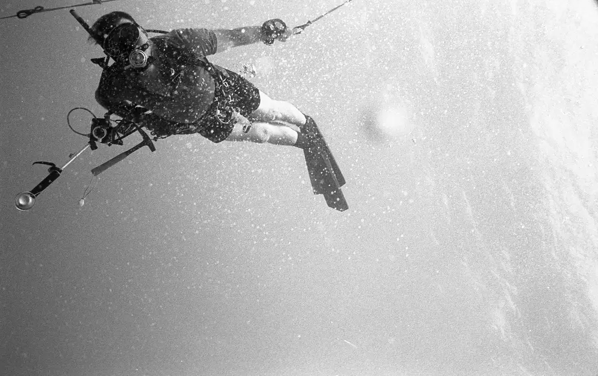{.lightbox group="discovery-bay-1966" description="**UUID: **ff042e52-749a-4f98-ac2a-9c3a5a63c1be **Date: **1967-06-22 **Location: **Jamaica | Discovery Bay | Buoy Mooring (1960s) **Longitude: **77.40908ºW **Latitude: **18.47322ºN **Photographer: **Eileen Graham **Copyright: **Trustees of the Natural History Museum (London, UK), CC-BY-4.0" alt="**UUID: **ff042e52-749a-4f98-ac2a-9c3a5a63c1be **Date: **1967-06-22 **Location: **Jamaica | Discovery Bay | Buoy Mooring (1960s) **Longitude: **77.40908ºW **Latitude: **18.47322ºN **Photographer: **Eileen Graham **Copyright: **Trustees of the Natural History Museum (London, UK), CC-BY-4.0"}

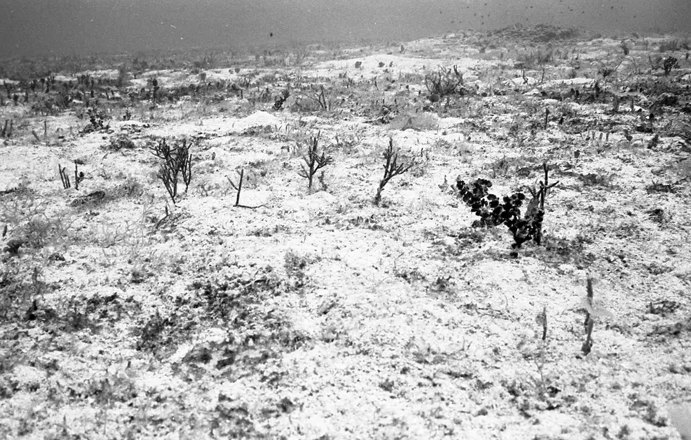{.lightbox group="discovery-bay-1966" description="**UUID: **9df15ab2-dfdc-4e26-a9c2-2f3c6d858828 **Date: **1967-01-07 **Location: **Jamaica | Discovery Bay | Pinnacle 1 Sand Slope **Longitude: **77.41017ºW **Latitude: **18.47367ºN **Photographer: **Eileen Graham **Copyright: **Trustees of the Natural History Museum (London, UK), CC-BY-4.0" alt="**UUID: **9df15ab2-dfdc-4e26-a9c2-2f3c6d858828 **Date: **1967-01-07 **Location: **Jamaica | Discovery Bay | Pinnacle 1 Sand Slope **Longitude: **77.41017ºW **Latitude: **18.47367ºN **Photographer: **Eileen Graham **Copyright: **Trustees of the Natural History Museum (London, UK), CC-BY-4.0"}

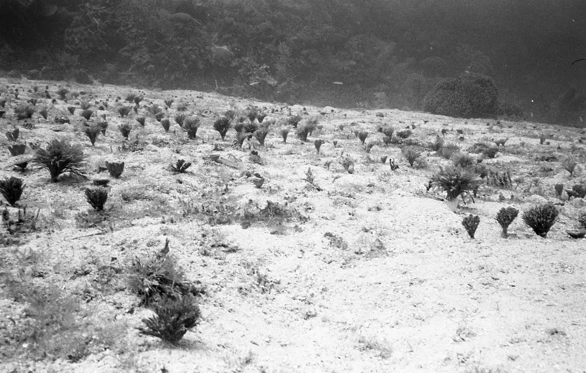{.lightbox group="discovery-bay-1966" description="**UUID: **bbfb1a46-2c0e-4f0f-b683-11e8c453eef5 **Date: **1967-01-07 **Location: **Jamaica | Discovery Bay | Pinnacle 1 Sand Slope **Longitude: **77.41017ºW **Latitude: **18.47367ºN **Photographer: **Eileen Graham **Copyright: **Trustees of the Natural History Museum (London, UK), CC-BY-4.0" alt="**UUID: **bbfb1a46-2c0e-4f0f-b683-11e8c453eef5 **Date: **1967-01-07 **Location: **Jamaica | Discovery Bay | Pinnacle 1 Sand Slope **Longitude: **77.41017ºW **Latitude: **18.47367ºN **Photographer: **Eileen Graham **Copyright: **Trustees of the Natural History Museum (London, UK), CC-BY-4.0"}

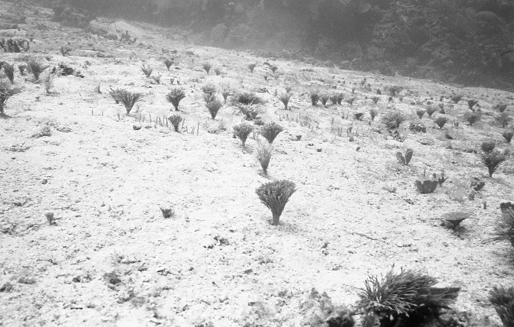{.lightbox group="discovery-bay-1966" description="**UUID: **cd2893ec-bfd9-4860-85ca-98746ae74b23 **Date: **1967-01-07 **Location: **Jamaica | Discovery Bay | Pinnacle 1 Sand Slope **Longitude: **77.41017ºW **Latitude: **18.47367ºN **Photographer: **Eileen Graham **Copyright: **Trustees of the Natural History Museum (London, UK), CC-BY-4.0" alt="**UUID: **cd2893ec-bfd9-4860-85ca-98746ae74b23 **Date: **1967-01-07 **Location: **Jamaica | Discovery Bay | Pinnacle 1 Sand Slope **Longitude: **77.41017ºW **Latitude: **18.47367ºN **Photographer: **Eileen Graham **Copyright: **Trustees of the Natural History Museum (London, UK), CC-BY-4.0"}

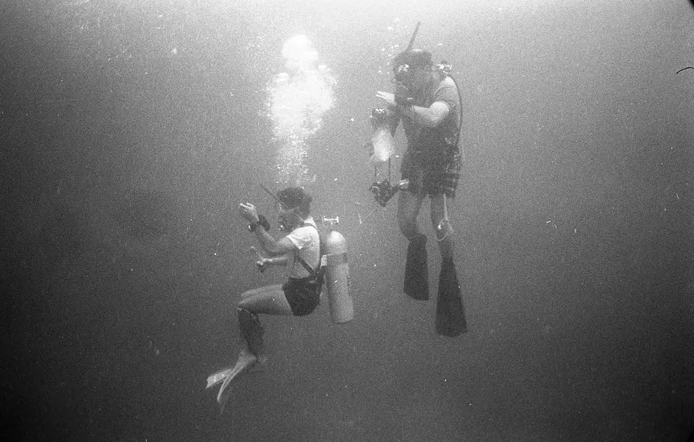{.lightbox group="discovery-bay-1966" description="**UUID: **8af43ddf-b47c-45bf-8321-24956c9d1ff3 **Date: **1967-01-07 **Location: **Jamaica | Discovery Bay | Buoy Mooring (1960s) **Longitude: **77.40908ºW **Latitude: **18.47322ºN **Photographer: **Eileen Graham **Copyright: **Trustees of the Natural History Museum (London, UK), CC-BY-4.0" alt="**UUID: **8af43ddf-b47c-45bf-8321-24956c9d1ff3 **Date: **1967-01-07 **Location: **Jamaica | Discovery Bay | Buoy Mooring (1960s) **Longitude: **77.40908ºW **Latitude: **18.47322ºN **Photographer: **Eileen Graham **Copyright: **Trustees of the Natural History Museum (London, UK), CC-BY-4.0"}

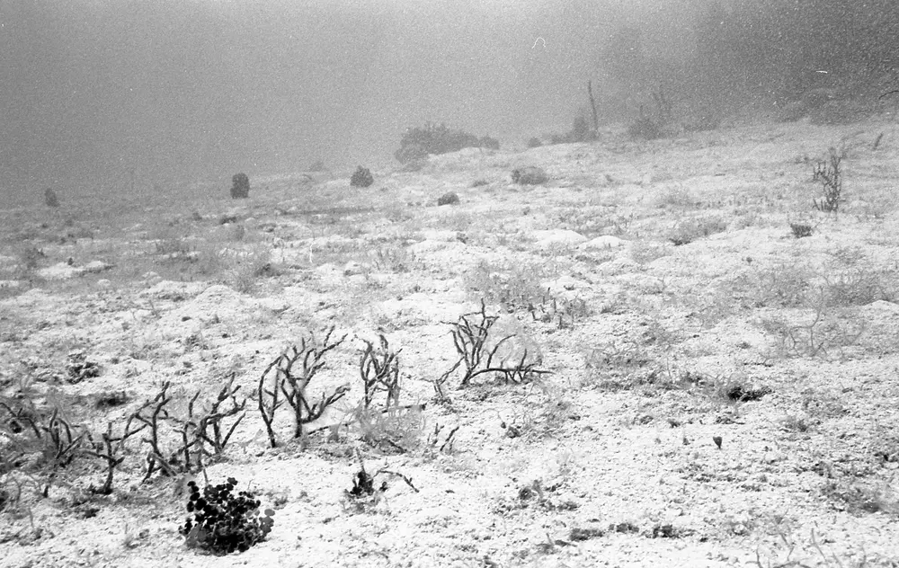{.lightbox group="discovery-bay-1966" description="**UUID: **a5e87bba-1d96-4b3f-92a6-fad5bdc89243 **Date: **1967-01-07 **Location: **Jamaica | Discovery Bay | Pinnacle 1 Sand Slope **Longitude: **77.41017ºW **Latitude: **18.47367ºN **Photographer: **Eileen Graham **Copyright: **Trustees of the Natural History Museum (London, UK), CC-BY-4.0" alt="**UUID: **a5e87bba-1d96-4b3f-92a6-fad5bdc89243 **Date: **1967-01-07 **Location: **Jamaica | Discovery Bay | Pinnacle 1 Sand Slope **Longitude: **77.41017ºW **Latitude: **18.47367ºN **Photographer: **Eileen Graham **Copyright: **Trustees of the Natural History Museum (London, UK), CC-BY-4.0"}

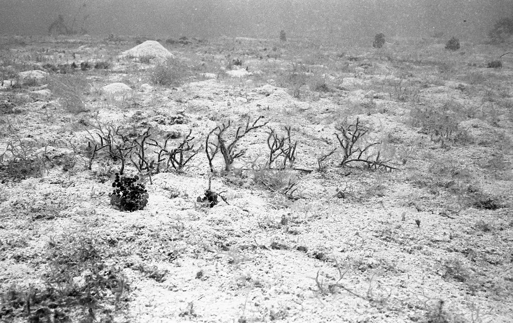{.lightbox group="discovery-bay-1966" description="**UUID: **ac6d8eb5-0475-447c-99ea-f27bb85657dc **Date: **1967-01-07 **Location: **Jamaica | Discovery Bay | Pinnacle 1 Sand Slope **Longitude: **77.41017ºW **Latitude: **18.47367ºN **Photographer: **Eileen Graham **Copyright: **Trustees of the Natural History Museum (London, UK), CC-BY-4.0" alt="**UUID: **ac6d8eb5-0475-447c-99ea-f27bb85657dc **Date: **1967-01-07 **Location: **Jamaica | Discovery Bay | Pinnacle 1 Sand Slope **Longitude: **77.41017ºW **Latitude: **18.47367ºN **Photographer: **Eileen Graham **Copyright: **Trustees of the Natural History Museum (London, UK), CC-BY-4.0"}

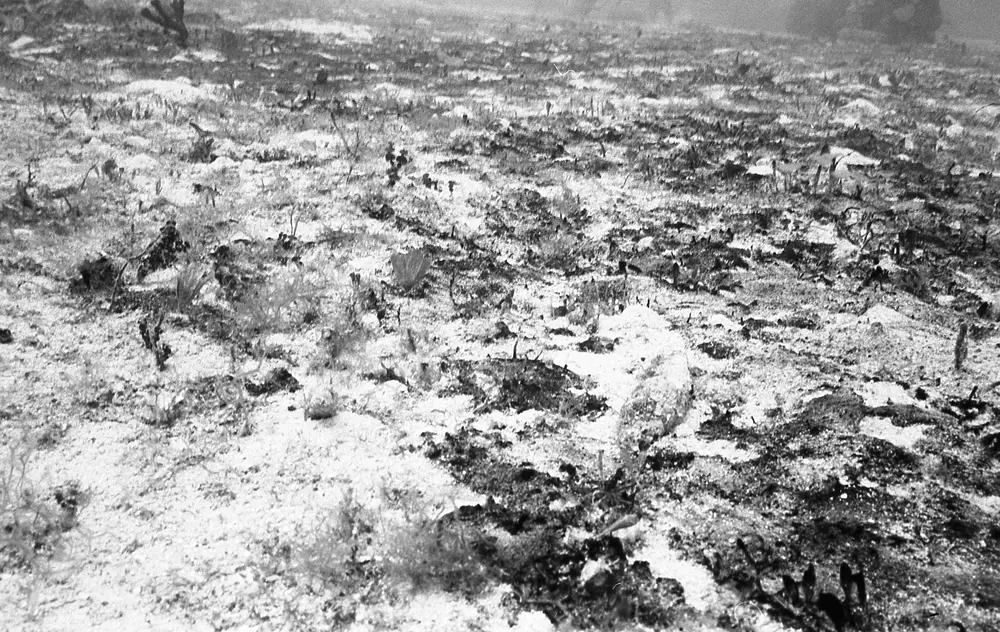{.lightbox group="discovery-bay-1966" description="**UUID: **34792f74-b6b9-40a5-b393-aa6cc1ba913c **Date: **1967-01-07 **Location: **Jamaica | Discovery Bay | Pinnacle 1 Sand Slope **Longitude: **77.41017ºW **Latitude: **18.47367ºN **Photographer: **Eileen Graham **Copyright: **Trustees of the Natural History Museum (London, UK), CC-BY-4.0" alt="**UUID: **34792f74-b6b9-40a5-b393-aa6cc1ba913c **Date: **1967-01-07 **Location: **Jamaica | Discovery Bay | Pinnacle 1 Sand Slope **Longitude: **77.41017ºW **Latitude: **18.47367ºN **Photographer: **Eileen Graham **Copyright: **Trustees of the Natural History Museum (London, UK), CC-BY-4.0"}

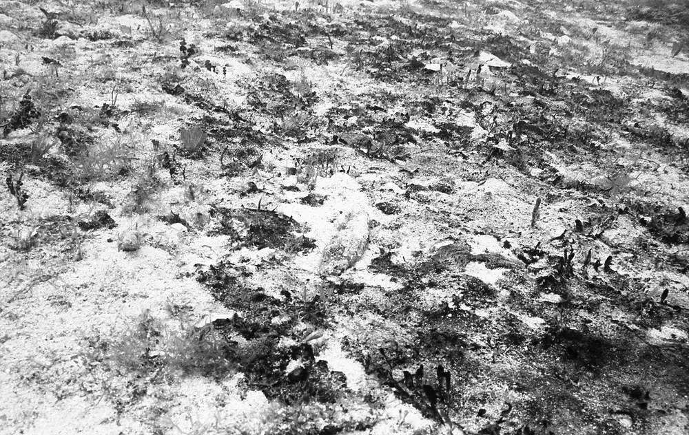{.lightbox group="discovery-bay-1966" description="**UUID: **28d5baab-517e-466d-bdeb-dfa9d750eef8 **Date: **1967-01-07 **Location: **Jamaica | Discovery Bay | Pinnacle 1 Sand Slope **Longitude: **77.41017ºW **Latitude: **18.47367ºN **Photographer: **Eileen Graham **Copyright: **Trustees of the Natural History Museum (London, UK), CC-BY-4.0" alt="**UUID: **28d5baab-517e-466d-bdeb-dfa9d750eef8 **Date: **1967-01-07 **Location: **Jamaica | Discovery Bay | Pinnacle 1 Sand Slope **Longitude: **77.41017ºW **Latitude: **18.47367ºN **Photographer: **Eileen Graham **Copyright: **Trustees of the Natural History Museum (London, UK), CC-BY-4.0"}

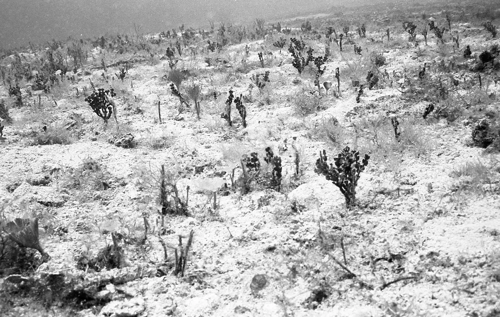{.lightbox group="discovery-bay-1966" description="**UUID: **17e02869-b214-4d12-8e35-a35a2552d3fe **Date: **1967-01-07 **Location: **Jamaica | Discovery Bay | Pinnacle 1 Sand Slope **Longitude: **77.41017ºW **Latitude: **18.47367ºN **Photographer: **Eileen Graham **Copyright: **Trustees of the Natural History Museum (London, UK), CC-BY-4.0" alt="**UUID: **17e02869-b214-4d12-8e35-a35a2552d3fe **Date: **1967-01-07 **Location: **Jamaica | Discovery Bay | Pinnacle 1 Sand Slope **Longitude: **77.41017ºW **Latitude: **18.47367ºN **Photographer: **Eileen Graham **Copyright: **Trustees of the Natural History Museum (London, UK), CC-BY-4.0"}

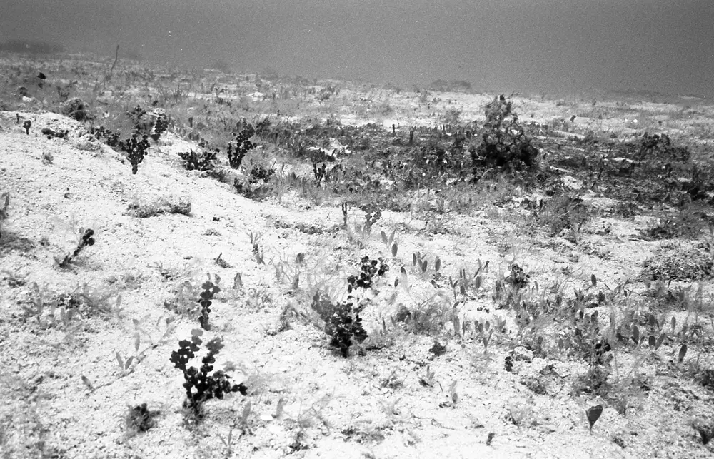{.lightbox group="discovery-bay-1966" description="**UUID: **13d2c614-d05b-4f3b-b2eb-c2a7d35e1777 **Date: **1967-04-07 **Location: **Jamaica | Discovery Bay | Algal Plots **Longitude: **77.414ºW **Latitude: **18.473ºN **Photographer: **Eileen Graham **Copyright: **Trustees of the Natural History Museum (London, UK), CC-BY-4.0" alt="**UUID: **13d2c614-d05b-4f3b-b2eb-c2a7d35e1777 **Date: **1967-04-07 **Location: **Jamaica | Discovery Bay | Algal Plots **Longitude: **77.414ºW **Latitude: **18.473ºN **Photographer: **Eileen Graham **Copyright: **Trustees of the Natural History Museum (London, UK), CC-BY-4.0"}

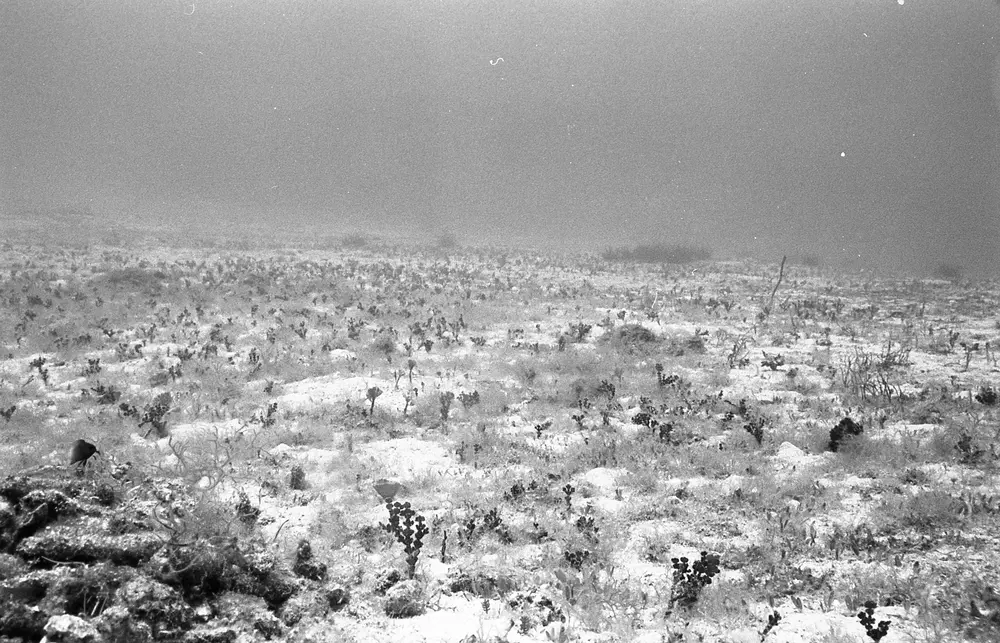{.lightbox group="discovery-bay-1966" description="**UUID: **6c0f1a4f-d793-4e6e-90a5-fe8c834c8a9a **Date: **1967-04-07 **Location: **Jamaica | Discovery Bay | Algal Plots **Longitude: **77.414ºW **Latitude: **18.473ºN **Photographer: **Eileen Graham **Copyright: **Trustees of the Natural History Museum (London, UK), CC-BY-4.0" alt="**UUID: **6c0f1a4f-d793-4e6e-90a5-fe8c834c8a9a **Date: **1967-04-07 **Location: **Jamaica | Discovery Bay | Algal Plots **Longitude: **77.414ºW **Latitude: **18.473ºN **Photographer: **Eileen Graham **Copyright: **Trustees of the Natural History Museum (London, UK), CC-BY-4.0"}

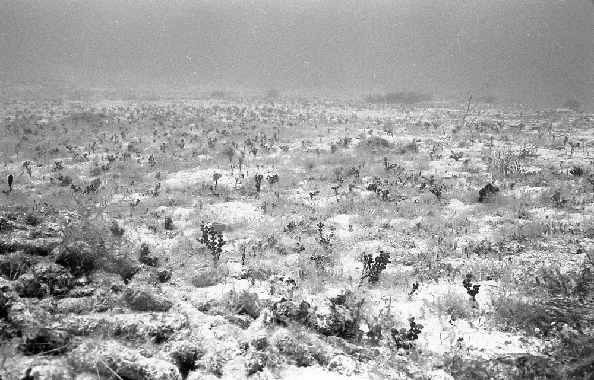{.lightbox group="discovery-bay-1966" description="**UUID: **31a32054-f6ca-4c7c-a776-eadd398c6b57 **Date: **1967-04-07 **Location: **Jamaica | Discovery Bay | Algal Plots **Longitude: **77.414ºW **Latitude: **18.473ºN **Photographer: **Eileen Graham **Copyright: **Trustees of the Natural History Museum (London, UK), CC-BY-4.0" alt="**UUID: **31a32054-f6ca-4c7c-a776-eadd398c6b57 **Date: **1967-04-07 **Location: **Jamaica | Discovery Bay | Algal Plots **Longitude: **77.414ºW **Latitude: **18.473ºN **Photographer: **Eileen Graham **Copyright: **Trustees of the Natural History Museum (London, UK), CC-BY-4.0"}

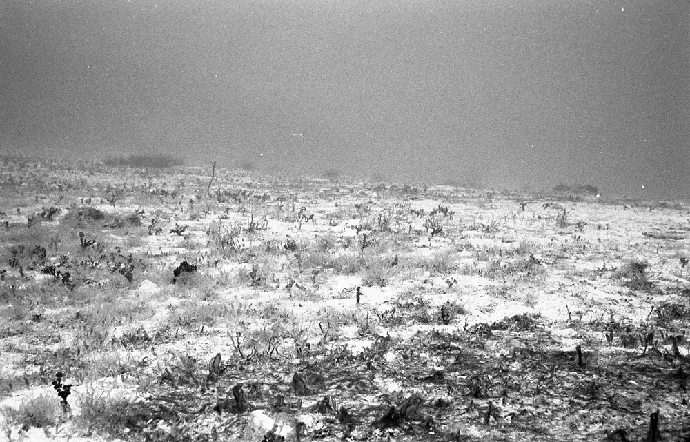{.lightbox group="discovery-bay-1966" description="**UUID: **c8c6aa89-d5e0-4792-8216-0d4fa2dff946 **Date: **1967-04-07 **Location: **Jamaica | Discovery Bay | Algal Plots **Longitude: **77.414ºW **Latitude: **18.473ºN **Photographer: **Eileen Graham **Copyright: **Trustees of the Natural History Museum (London, UK), CC-BY-4.0" alt="**UUID: **c8c6aa89-d5e0-4792-8216-0d4fa2dff946 **Date: **1967-04-07 **Location: **Jamaica | Discovery Bay | Algal Plots **Longitude: **77.414ºW **Latitude: **18.473ºN **Photographer: **Eileen Graham **Copyright: **Trustees of the Natural History Museum (London, UK), CC-BY-4.0"}

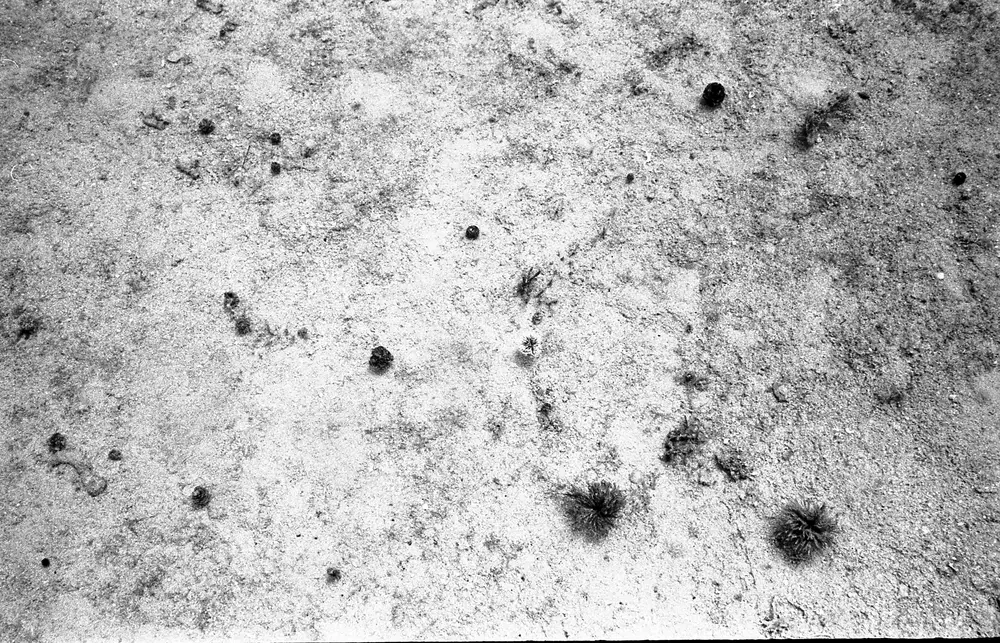{.lightbox group="discovery-bay-1966" description="**UUID: **beb3aa2e-9e19-4d56-b8f9-637902aa5a7d **Date: **1967-04-07 **Location: **Jamaica | Discovery Bay | Algal Plots **Longitude: **77.414ºW **Latitude: **18.473ºN **Photographer: **Eileen Graham **Copyright: **Trustees of the Natural History Museum (London, UK), CC-BY-4.0" alt="**UUID: **beb3aa2e-9e19-4d56-b8f9-637902aa5a7d **Date: **1967-04-07 **Location: **Jamaica | Discovery Bay | Algal Plots **Longitude: **77.414ºW **Latitude: **18.473ºN **Photographer: **Eileen Graham **Copyright: **Trustees of the Natural History Museum (London, UK), CC-BY-4.0"}

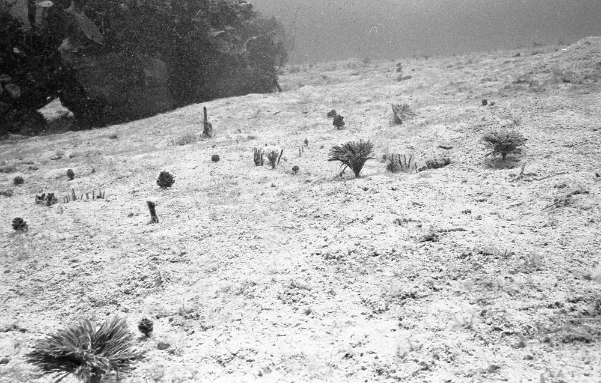{.lightbox group="discovery-bay-1966" description="**UUID: **2f31b878-22cb-4a13-abf4-dabd5e0df9f9 **Date: **1967-04-07 **Location: **Jamaica | Discovery Bay | Algal Plots **Longitude: **77.414ºW **Latitude: **18.473ºN **Photographer: **Eileen Graham **Copyright: **Trustees of the Natural History Museum (London, UK), CC-BY-4.0" alt="**UUID: **2f31b878-22cb-4a13-abf4-dabd5e0df9f9 **Date: **1967-04-07 **Location: **Jamaica | Discovery Bay | Algal Plots **Longitude: **77.414ºW **Latitude: **18.473ºN **Photographer: **Eileen Graham **Copyright: **Trustees of the Natural History Museum (London, UK), CC-BY-4.0"}

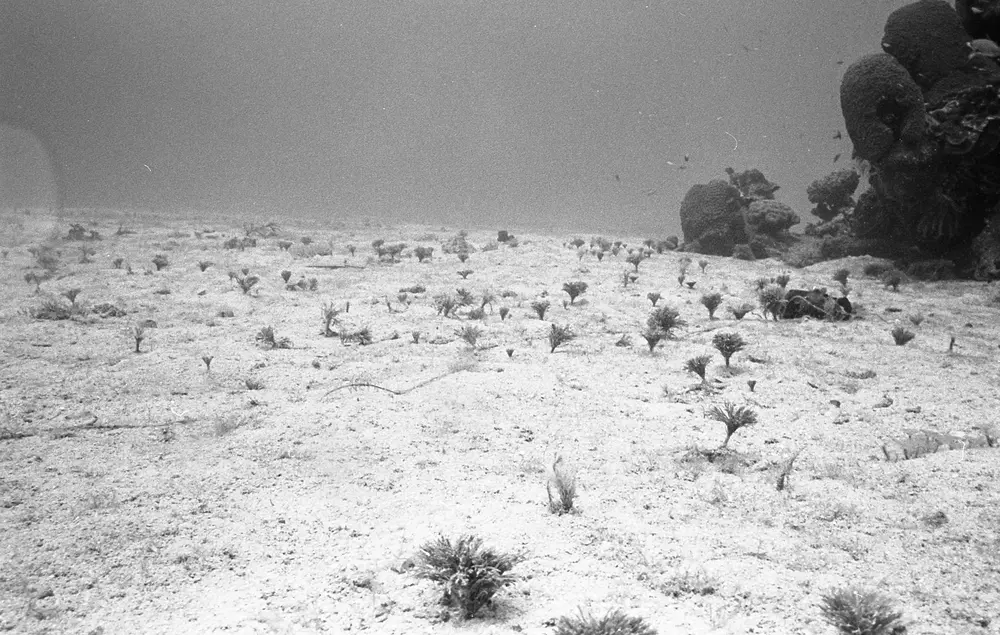{.lightbox group="discovery-bay-1966" description="**UUID: **777b7de9-f12a-4cd6-b58e-75ef9307b948 **Date: **1967-04-07 **Location: **Jamaica | Discovery Bay | Algal Plots **Longitude: **77.414ºW **Latitude: **18.473ºN **Photographer: **Eileen Graham **Copyright: **Trustees of the Natural History Museum (London, UK), CC-BY-4.0" alt="**UUID: **777b7de9-f12a-4cd6-b58e-75ef9307b948 **Date: **1967-04-07 **Location: **Jamaica | Discovery Bay | Algal Plots **Longitude: **77.414ºW **Latitude: **18.473ºN **Photographer: **Eileen Graham **Copyright: **Trustees of the Natural History Museum (London, UK), CC-BY-4.0"}

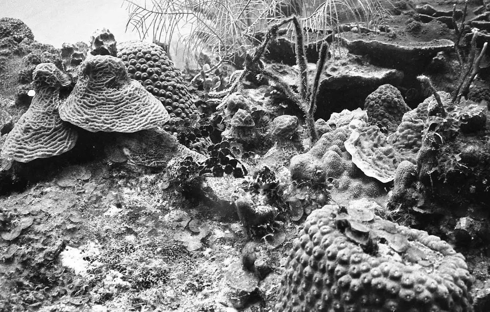{.lightbox group="discovery-bay-1966" description="**UUID: **913759ed-12c3-4c2e-a6ba-c12d40c63271 **Date: **1967-04-07 **Location: **Jamaica | Discovery Bay | Buoy Upper Slope **Longitude: **77.40908ºW **Latitude: **18.47322ºN **Photographer: **Eileen Graham **Copyright: **Trustees of the Natural History Museum (London, UK), CC-BY-4.0" alt="**UUID: **913759ed-12c3-4c2e-a6ba-c12d40c63271 **Date: **1967-04-07 **Location: **Jamaica | Discovery Bay | Buoy Upper Slope **Longitude: **77.40908ºW **Latitude: **18.47322ºN **Photographer: **Eileen Graham **Copyright: **Trustees of the Natural History Museum (London, UK), CC-BY-4.0"}

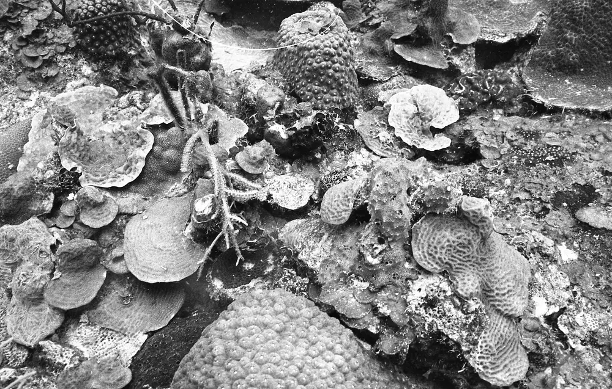{.lightbox group="discovery-bay-1966" description="**UUID: **248707fe-1207-4d1d-9587-bb487457622e **Date: **1967-04-07 **Location: **Jamaica | Discovery Bay | Buoy Upper Slope **Longitude: **77.40908ºW **Latitude: **18.47322ºN **Photographer: **Eileen Graham **Copyright: **Trustees of the Natural History Museum (London, UK), CC-BY-4.0" alt="**UUID: **248707fe-1207-4d1d-9587-bb487457622e **Date: **1967-04-07 **Location: **Jamaica | Discovery Bay | Buoy Upper Slope **Longitude: **77.40908ºW **Latitude: **18.47322ºN **Photographer: **Eileen Graham **Copyright: **Trustees of the Natural History Museum (London, UK), CC-BY-4.0"}

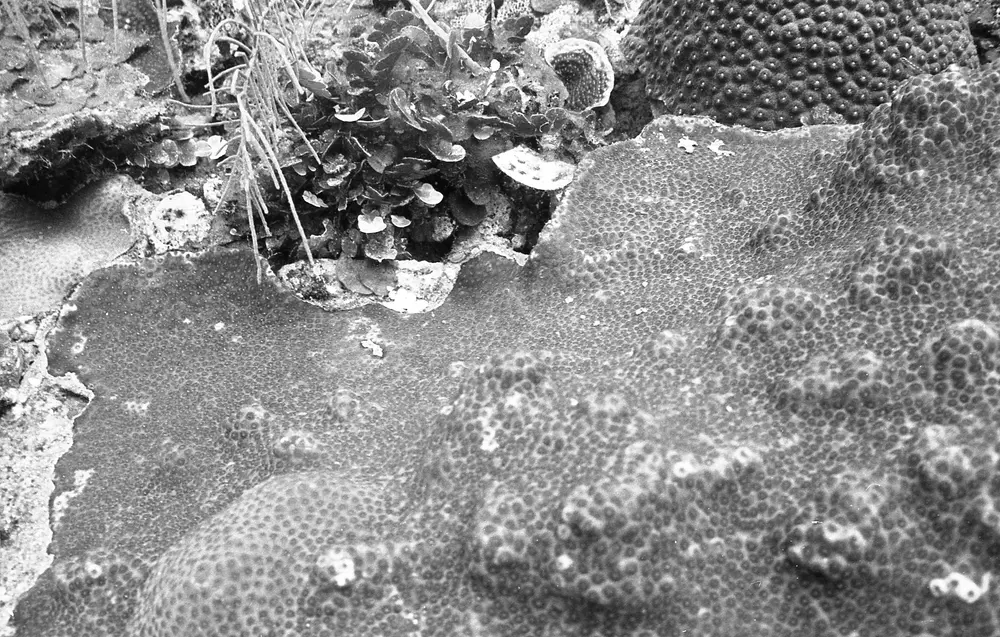{.lightbox group="discovery-bay-1966" description="**UUID: **74545a14-002d-4f8f-9e54-faa7cafc1536 **Date: **1967-04-07 **Location: **Jamaica | Discovery Bay | Buoy Upper Slope **Longitude: **77.40908ºW **Latitude: **18.47322ºN **Photographer: **Eileen Graham **Copyright: **Trustees of the Natural History Museum (London, UK), CC-BY-4.0" alt="**UUID: **74545a14-002d-4f8f-9e54-faa7cafc1536 **Date: **1967-04-07 **Location: **Jamaica | Discovery Bay | Buoy Upper Slope **Longitude: **77.40908ºW **Latitude: **18.47322ºN **Photographer: **Eileen Graham **Copyright: **Trustees of the Natural History Museum (London, UK), CC-BY-4.0"}

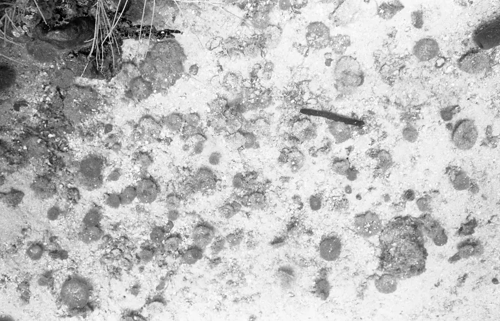{.lightbox group="discovery-bay-1966" description="**UUID: **344a03b1-a0e0-4c58-bfa8-ccd892843442 **Date: **1967-04-07 **Location: **Jamaica | Discovery Bay | Algal Plots **Longitude: **77.414ºW **Latitude: **18.473ºN **Photographer: **Eileen Graham **Copyright: **Trustees of the Natural History Museum (London, UK), CC-BY-4.0" alt="**UUID: **344a03b1-a0e0-4c58-bfa8-ccd892843442 **Date: **1967-04-07 **Location: **Jamaica | Discovery Bay | Algal Plots **Longitude: **77.414ºW **Latitude: **18.473ºN **Photographer: **Eileen Graham **Copyright: **Trustees of the Natural History Museum (London, UK), CC-BY-4.0"}

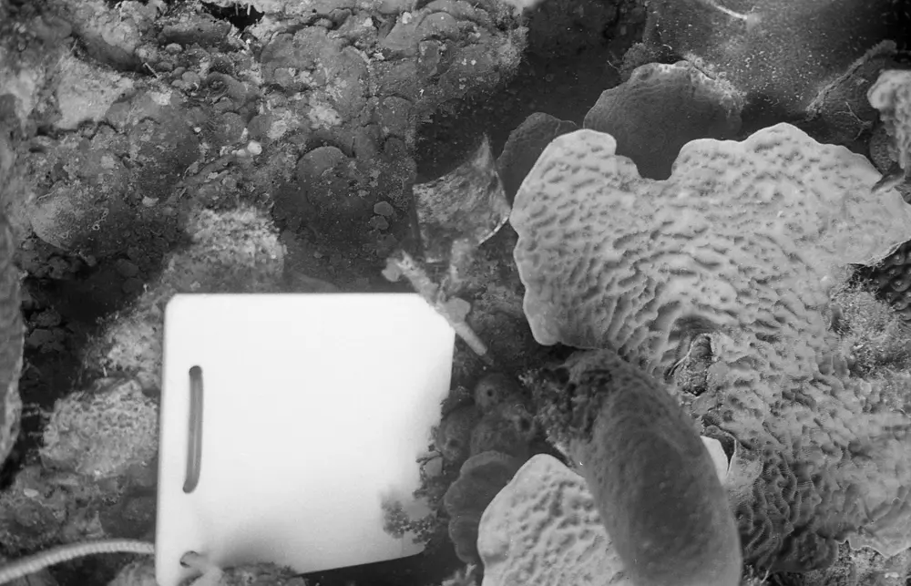{.lightbox group="discovery-bay-1966" description="**UUID: **ef961d0c-f181-4e8a-8a6f-509bb2003a67 **Date: **1967-04-07 **Location: **Jamaica | Discovery Bay | Buoy Upper Slope **Longitude: **77.40908ºW **Latitude: **18.47322ºN **Photographer: **Eileen Graham **Copyright: **Trustees of the Natural History Museum (London, UK), CC-BY-4.0" alt="**UUID: **ef961d0c-f181-4e8a-8a6f-509bb2003a67 **Date: **1967-04-07 **Location: **Jamaica | Discovery Bay | Buoy Upper Slope **Longitude: **77.40908ºW **Latitude: **18.47322ºN **Photographer: **Eileen Graham **Copyright: **Trustees of the Natural History Museum (London, UK), CC-BY-4.0"}

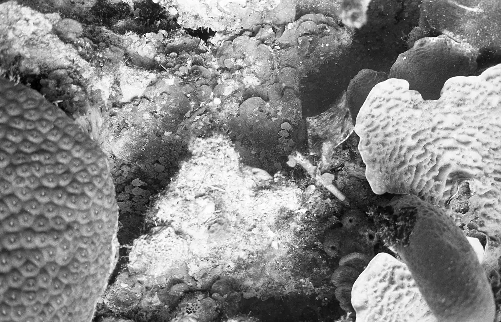{.lightbox group="discovery-bay-1966" description="**UUID: **ab4373ab-c961-41e0-8673-49a0989b3214 **Date: **1967-04-07 **Location: **Jamaica | Discovery Bay | Buoy Upper Slope **Longitude: **77.40908ºW **Latitude: **18.47322ºN **Photographer: **Eileen Graham **Copyright: **Trustees of the Natural History Museum (London, UK), CC-BY-4.0" alt="**UUID: **ab4373ab-c961-41e0-8673-49a0989b3214 **Date: **1967-04-07 **Location: **Jamaica | Discovery Bay | Buoy Upper Slope **Longitude: **77.40908ºW **Latitude: **18.47322ºN **Photographer: **Eileen Graham **Copyright: **Trustees of the Natural History Museum (London, UK), CC-BY-4.0"}

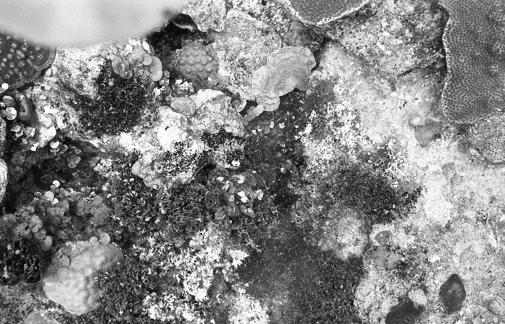{.lightbox group="discovery-bay-1966" description="**UUID: **0a783c32-eaf3-4a58-ae0d-add3457cdf99 **Date: **1967-04-07 **Location: **Jamaica | Discovery Bay | Buoy Upper Slope **Longitude: **77.40908ºW **Latitude: **18.47322ºN **Photographer: **Eileen Graham **Copyright: **Trustees of the Natural History Museum (London, UK), CC-BY-4.0" alt="**UUID: **0a783c32-eaf3-4a58-ae0d-add3457cdf99 **Date: **1967-04-07 **Location: **Jamaica | Discovery Bay | Buoy Upper Slope **Longitude: **77.40908ºW **Latitude: **18.47322ºN **Photographer: **Eileen Graham **Copyright: **Trustees of the Natural History Museum (London, UK), CC-BY-4.0"}

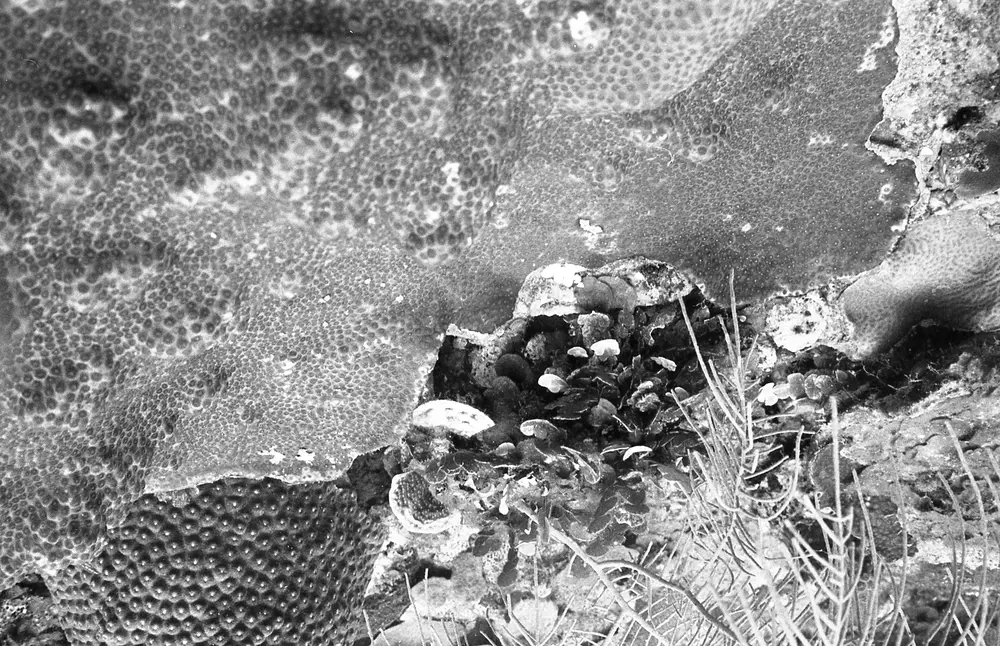{.lightbox group="discovery-bay-1966" description="**UUID: **919acb8a-a1f8-4760-b16b-f03fb0cc766e **Date: **1967-04-07 **Location: **Jamaica | Discovery Bay | Buoy Upper Slope **Longitude: **77.40908ºW **Latitude: **18.47322ºN **Photographer: **Eileen Graham **Copyright: **Trustees of the Natural History Museum (London, UK), CC-BY-4.0" alt="**UUID: **919acb8a-a1f8-4760-b16b-f03fb0cc766e **Date: **1967-04-07 **Location: **Jamaica | Discovery Bay | Buoy Upper Slope **Longitude: **77.40908ºW **Latitude: **18.47322ºN **Photographer: **Eileen Graham **Copyright: **Trustees of the Natural History Museum (London, UK), CC-BY-4.0"}

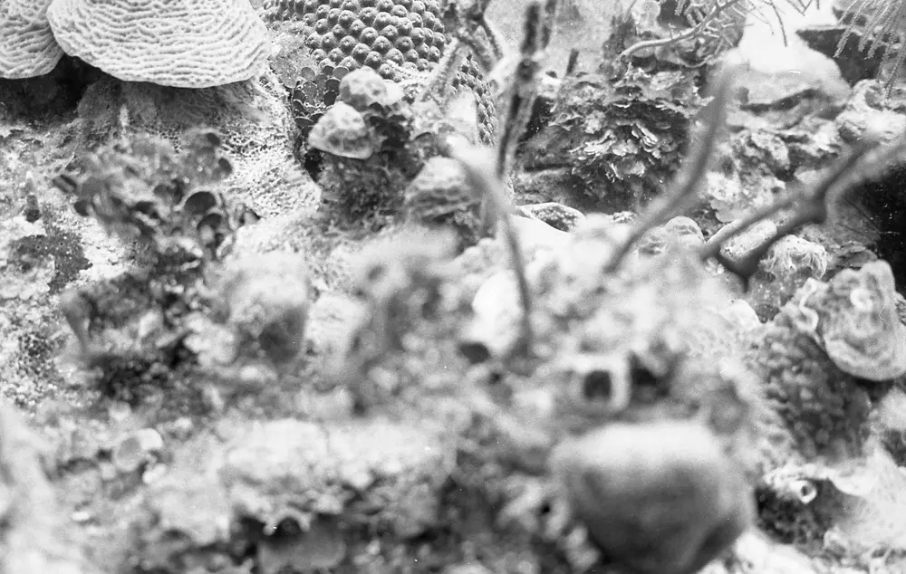{.lightbox group="discovery-bay-1966" description="**UUID: **97741d06-ef7a-4fc5-b0f5-88291f3abecf **Date: **1967-04-07 **Location: **Jamaica | Discovery Bay | Buoy Upper Slope **Longitude: **77.40908ºW **Latitude: **18.47322ºN **Photographer: **Eileen Graham **Copyright: **Trustees of the Natural History Museum (London, UK), CC-BY-4.0" alt="**UUID: **97741d06-ef7a-4fc5-b0f5-88291f3abecf **Date: **1967-04-07 **Location: **Jamaica | Discovery Bay | Buoy Upper Slope **Longitude: **77.40908ºW **Latitude: **18.47322ºN **Photographer: **Eileen Graham **Copyright: **Trustees of the Natural History Museum (London, UK), CC-BY-4.0"}

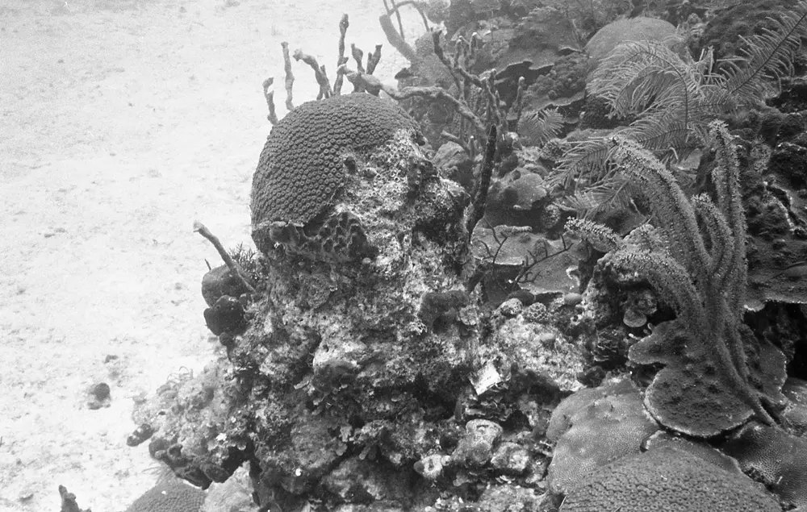{.lightbox group="discovery-bay-1966" description="**UUID: **e9e1a2c2-0bec-4a0c-a585-20e0c94a5d1b **Date: **1967-04-07 **Location: **Jamaica | Discovery Bay | Buoy Upper Slope **Longitude: **77.40908ºW **Latitude: **18.47322ºN **Photographer: **Eileen Graham **Copyright: **Trustees of the Natural History Museum (London, UK), CC-BY-4.0" alt="**UUID: **e9e1a2c2-0bec-4a0c-a585-20e0c94a5d1b **Date: **1967-04-07 **Location: **Jamaica | Discovery Bay | Buoy Upper Slope **Longitude: **77.40908ºW **Latitude: **18.47322ºN **Photographer: **Eileen Graham **Copyright: **Trustees of the Natural History Museum (London, UK), CC-BY-4.0"}

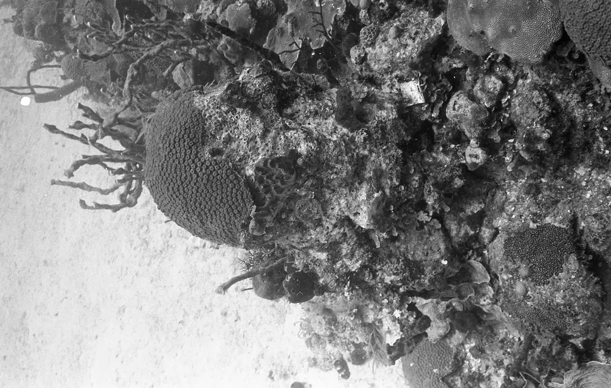{.lightbox group="discovery-bay-1966" description="**UUID: **c8f0db59-f7a3-4d8c-a56f-f28dd9ba5bac **Date: **1967-04-07 **Location: **Jamaica | Discovery Bay | Buoy Upper Slope **Longitude: **77.40908ºW **Latitude: **18.47322ºN **Photographer: **Eileen Graham **Copyright: **Trustees of the Natural History Museum (London, UK), CC-BY-4.0" alt="**UUID: **c8f0db59-f7a3-4d8c-a56f-f28dd9ba5bac **Date: **1967-04-07 **Location: **Jamaica | Discovery Bay | Buoy Upper Slope **Longitude: **77.40908ºW **Latitude: **18.47322ºN **Photographer: **Eileen Graham **Copyright: **Trustees of the Natural History Museum (London, UK), CC-BY-4.0"}

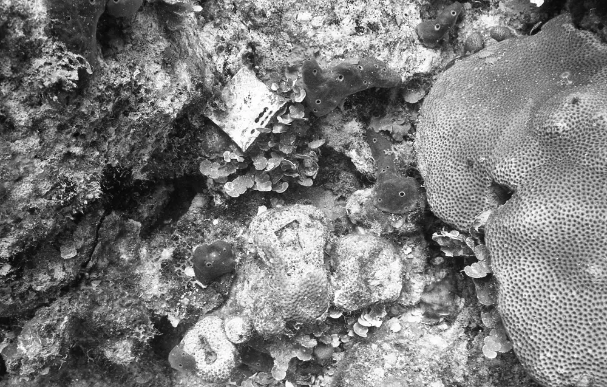{.lightbox group="discovery-bay-1966" description="**UUID: **05065787-5590-4085-8817-e7a2e970435a **Date: **1967-04-07 **Location: **Jamaica | Discovery Bay | Buoy Upper Slope **Longitude: **77.40908ºW **Latitude: **18.47322ºN **Photographer: **Eileen Graham **Copyright: **Trustees of the Natural History Museum (London, UK), CC-BY-4.0" alt="**UUID: **05065787-5590-4085-8817-e7a2e970435a **Date: **1967-04-07 **Location: **Jamaica | Discovery Bay | Buoy Upper Slope **Longitude: **77.40908ºW **Latitude: **18.47322ºN **Photographer: **Eileen Graham **Copyright: **Trustees of the Natural History Museum (London, UK), CC-BY-4.0"}

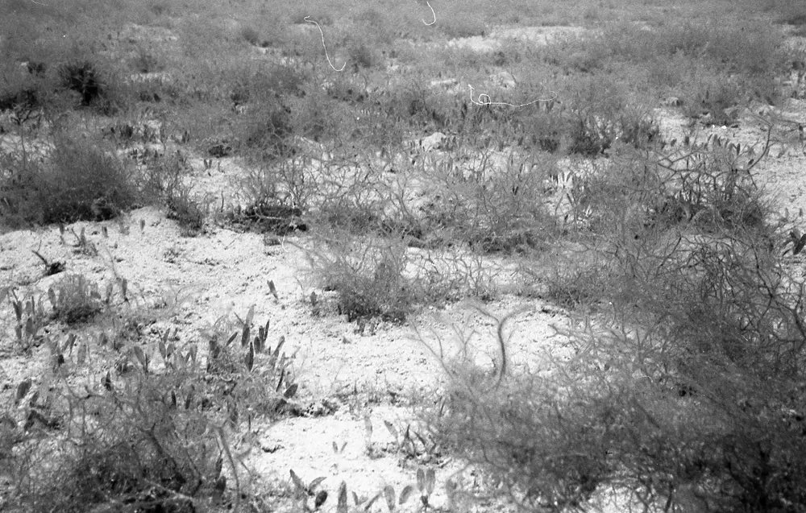{.lightbox group="discovery-bay-1966" description="**UUID: **0fc3d0a4-94fe-4af0-82f9-38071249fcb3 **Date: **1967-04-07 **Location: **Jamaica | Discovery Bay | Algal Plots **Longitude: **77.414ºW **Latitude: **18.473ºN **Photographer: **Eileen Graham **Copyright: **Trustees of the Natural History Museum (London, UK), CC-BY-4.0" alt="**UUID: **0fc3d0a4-94fe-4af0-82f9-38071249fcb3 **Date: **1967-04-07 **Location: **Jamaica | Discovery Bay | Algal Plots **Longitude: **77.414ºW **Latitude: **18.473ºN **Photographer: **Eileen Graham **Copyright: **Trustees of the Natural History Museum (London, UK), CC-BY-4.0"}

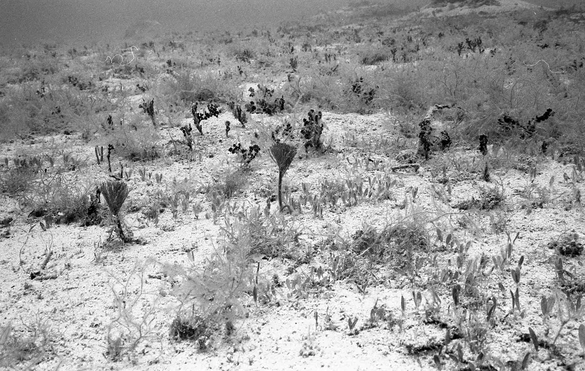{.lightbox group="discovery-bay-1966" description="**UUID: **68f439af-5863-4f24-9b33-a89a548480fa **Date: **1967-04-07 **Location: **Jamaica | Discovery Bay | Algal Plots **Longitude: **77.414ºW **Latitude: **18.473ºN **Photographer: **Eileen Graham **Copyright: **Trustees of the Natural History Museum (London, UK), CC-BY-4.0" alt="**UUID: **68f439af-5863-4f24-9b33-a89a548480fa **Date: **1967-04-07 **Location: **Jamaica | Discovery Bay | Algal Plots **Longitude: **77.414ºW **Latitude: **18.473ºN **Photographer: **Eileen Graham **Copyright: **Trustees of the Natural History Museum (London, UK), CC-BY-4.0"}

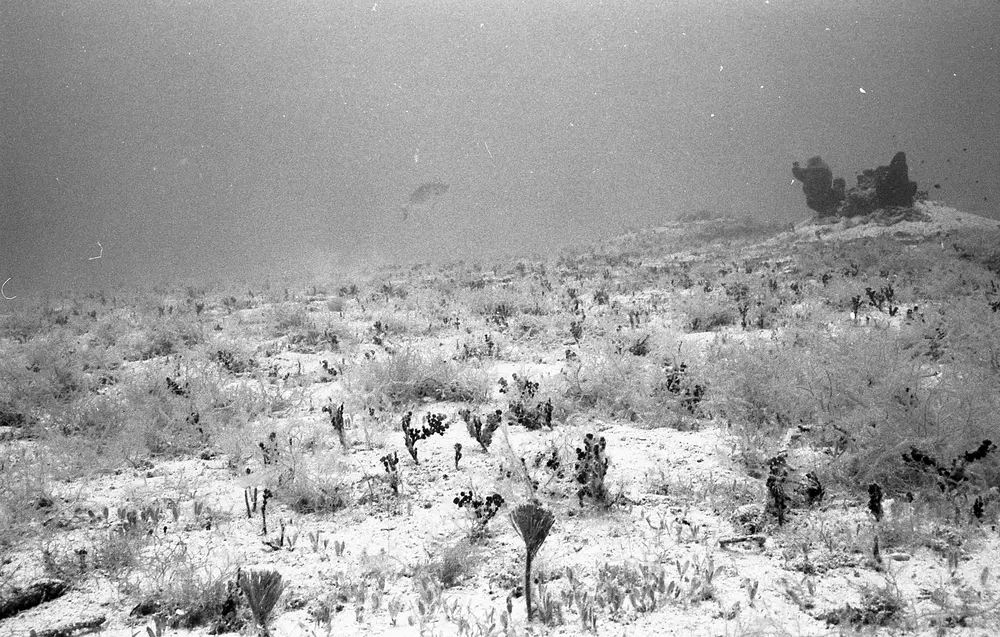{.lightbox group="discovery-bay-1966" description="**UUID: **7de26ee4-9725-47b5-9c0d-2fa41423657a **Date: **1967-04-07 **Location: **Jamaica | Discovery Bay | Algal Plots **Longitude: **77.414ºW **Latitude: **18.473ºN **Photographer: **Eileen Graham **Copyright: **Trustees of the Natural History Museum (London, UK), CC-BY-4.0" alt="**UUID: **7de26ee4-9725-47b5-9c0d-2fa41423657a **Date: **1967-04-07 **Location: **Jamaica | Discovery Bay | Algal Plots **Longitude: **77.414ºW **Latitude: **18.473ºN **Photographer: **Eileen Graham **Copyright: **Trustees of the Natural History Museum (London, UK), CC-BY-4.0"}

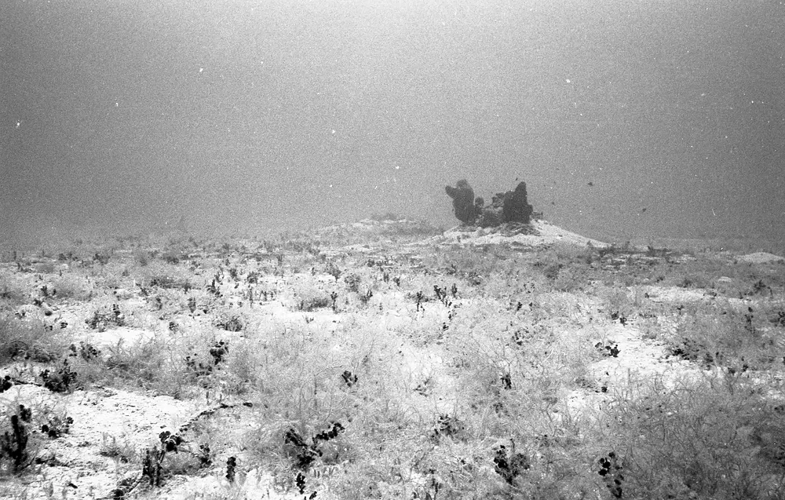{.lightbox group="discovery-bay-1966" description="**UUID: **185cc9b7-7b59-46c5-9fee-6524b545c43e **Date: **1967-04-07 **Location: **Jamaica | Discovery Bay | Algal Plots **Longitude: **77.414ºW **Latitude: **18.473ºN **Photographer: **Eileen Graham **Copyright: **Trustees of the Natural History Museum (London, UK), CC-BY-4.0" alt="**UUID: **185cc9b7-7b59-46c5-9fee-6524b545c43e **Date: **1967-04-07 **Location: **Jamaica | Discovery Bay | Algal Plots **Longitude: **77.414ºW **Latitude: **18.473ºN **Photographer: **Eileen Graham **Copyright: **Trustees of the Natural History Museum (London, UK), CC-BY-4.0"}

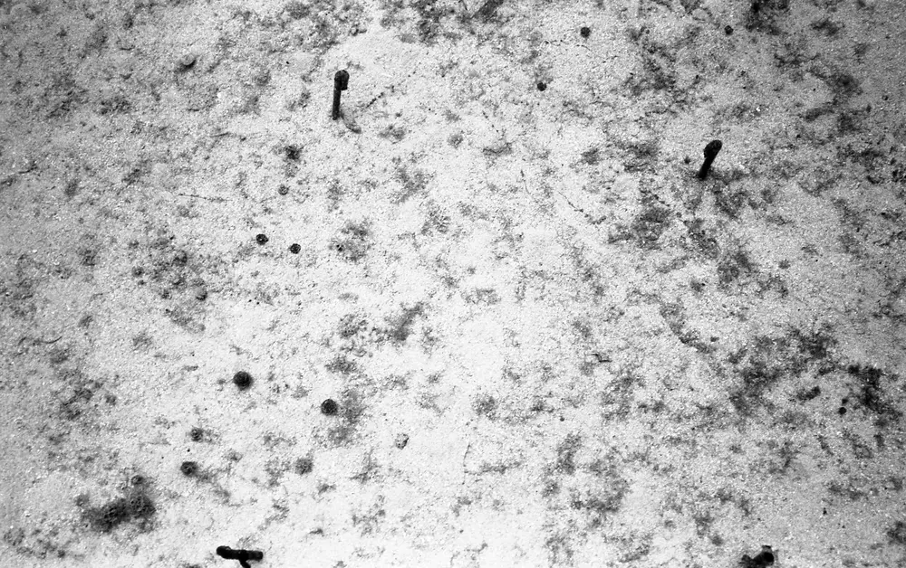{.lightbox group="discovery-bay-1966" description="**UUID: **c39fb4b1-cd6b-4265-bd1f-e6de88ac2230 **Date: **1967-04-07 **Location: **Jamaica | Discovery Bay | Algal Plots **Longitude: **77.414ºW **Latitude: **18.473ºN **Photographer: **Eileen Graham **Copyright: **Trustees of the Natural History Museum (London, UK), CC-BY-4.0" alt="**UUID: **c39fb4b1-cd6b-4265-bd1f-e6de88ac2230 **Date: **1967-04-07 **Location: **Jamaica | Discovery Bay | Algal Plots **Longitude: **77.414ºW **Latitude: **18.473ºN **Photographer: **Eileen Graham **Copyright: **Trustees of the Natural History Museum (London, UK), CC-BY-4.0"}

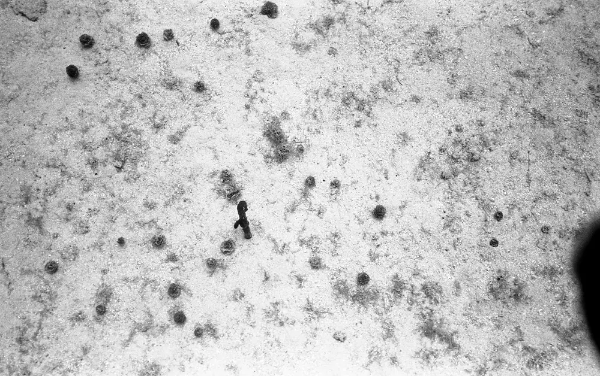{.lightbox group="discovery-bay-1966" description="**UUID: **bd50b381-4997-456e-821d-a0399eda3030 **Date: **1967-04-07 **Location: **Jamaica | Discovery Bay | Algal Plots **Longitude: **77.414ºW **Latitude: **18.473ºN **Photographer: **Eileen Graham **Copyright: **Trustees of the Natural History Museum (London, UK), CC-BY-4.0" alt="**UUID: **bd50b381-4997-456e-821d-a0399eda3030 **Date: **1967-04-07 **Location: **Jamaica | Discovery Bay | Algal Plots **Longitude: **77.414ºW **Latitude: **18.473ºN **Photographer: **Eileen Graham **Copyright: **Trustees of the Natural History Museum (London, UK), CC-BY-4.0"}

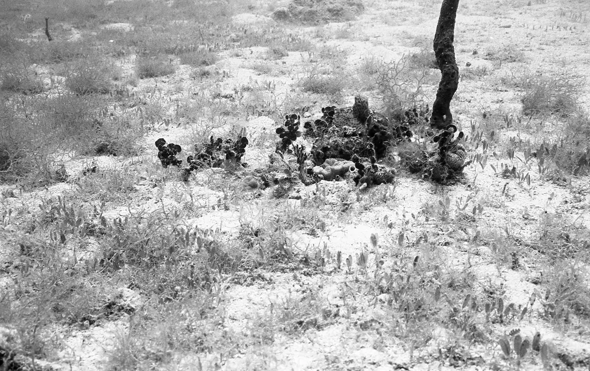{.lightbox group="discovery-bay-1966" description="**UUID: **211e93c3-aa20-4d7e-b07a-6e957123b77c **Date: **1967-04-07 **Location: **Jamaica | Discovery Bay | Algal Plots **Longitude: **77.414ºW **Latitude: **18.473ºN **Photographer: **Eileen Graham **Copyright: **Trustees of the Natural History Museum (London, UK), CC-BY-4.0" alt="**UUID: **211e93c3-aa20-4d7e-b07a-6e957123b77c **Date: **1967-04-07 **Location: **Jamaica | Discovery Bay | Algal Plots **Longitude: **77.414ºW **Latitude: **18.473ºN **Photographer: **Eileen Graham **Copyright: **Trustees of the Natural History Museum (London, UK), CC-BY-4.0"}

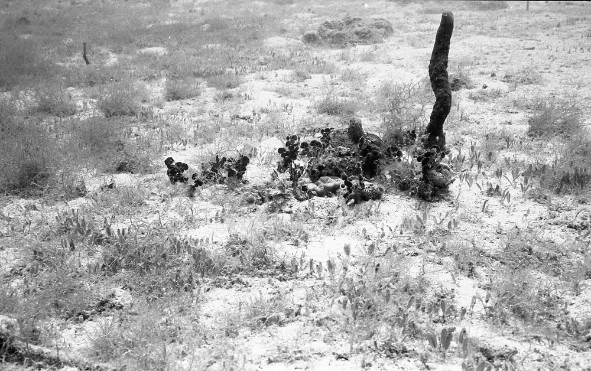{.lightbox group="discovery-bay-1966" description="**UUID: **bbfe9b66-ae22-402d-bf1a-ccbf43669894 **Date: **1967-04-07 **Location: **Jamaica | Discovery Bay | Algal Plots **Longitude: **77.414ºW **Latitude: **18.473ºN **Photographer: **Eileen Graham **Copyright: **Trustees of the Natural History Museum (London, UK), CC-BY-4.0" alt="**UUID: **bbfe9b66-ae22-402d-bf1a-ccbf43669894 **Date: **1967-04-07 **Location: **Jamaica | Discovery Bay | Algal Plots **Longitude: **77.414ºW **Latitude: **18.473ºN **Photographer: **Eileen Graham **Copyright: **Trustees of the Natural History Museum (London, UK), CC-BY-4.0"}

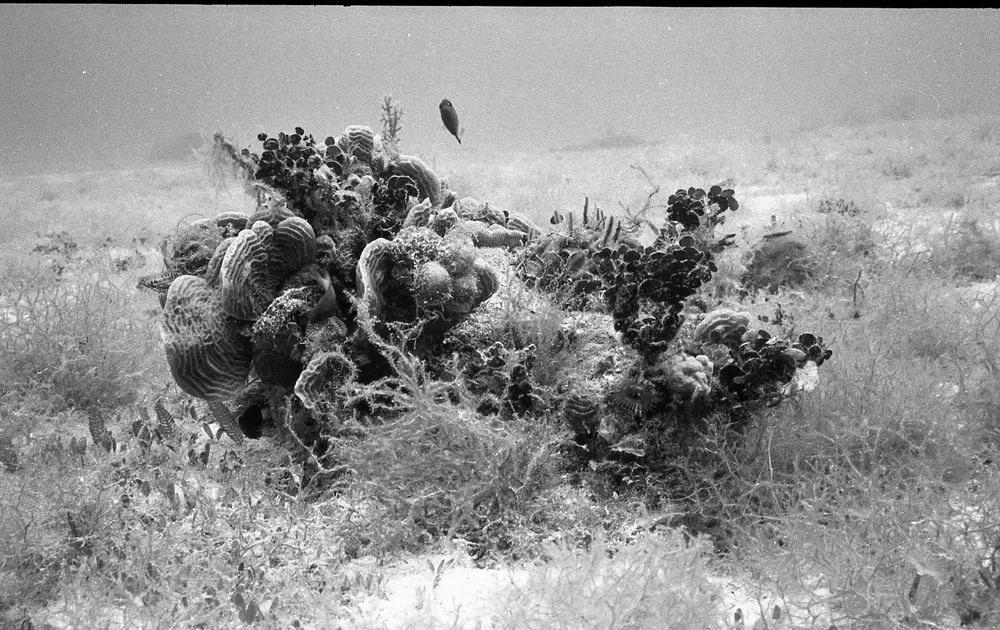{.lightbox group="discovery-bay-1966" description="**UUID: **73b9045e-a404-4784-8b30-a4136d8f6e09 **Date: **1967-04-07 **Location: **Jamaica | Discovery Bay | Algal Plots **Longitude: **77.414ºW **Latitude: **18.473ºN **Photographer: **Eileen Graham **Copyright: **Trustees of the Natural History Museum (London, UK), CC-BY-4.0" alt="**UUID: **73b9045e-a404-4784-8b30-a4136d8f6e09 **Date: **1967-04-07 **Location: **Jamaica | Discovery Bay | Algal Plots **Longitude: **77.414ºW **Latitude: **18.473ºN **Photographer: **Eileen Graham **Copyright: **Trustees of the Natural History Museum (London, UK), CC-BY-4.0"}

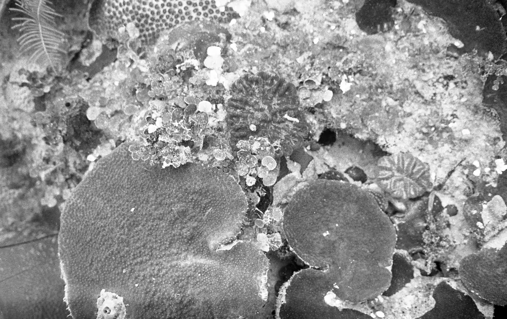{.lightbox group="discovery-bay-1966" description="**UUID: **3db74847-1def-44da-9eb6-40da1229d904 **Date: **1966-12-11 **Location: **Jamaica | Discovery Bay | Pinnacle 1 Slope **Longitude: **77.41017ºW **Latitude: **18.47367ºN **Photographer: **Eileen Graham **Copyright: **Trustees of the Natural History Museum (London, UK), CC-BY-4.0" alt="**UUID: **3db74847-1def-44da-9eb6-40da1229d904 **Date: **1966-12-11 **Location: **Jamaica | Discovery Bay | Pinnacle 1 Slope **Longitude: **77.41017ºW **Latitude: **18.47367ºN **Photographer: **Eileen Graham **Copyright: **Trustees of the Natural History Museum (London, UK), CC-BY-4.0"}

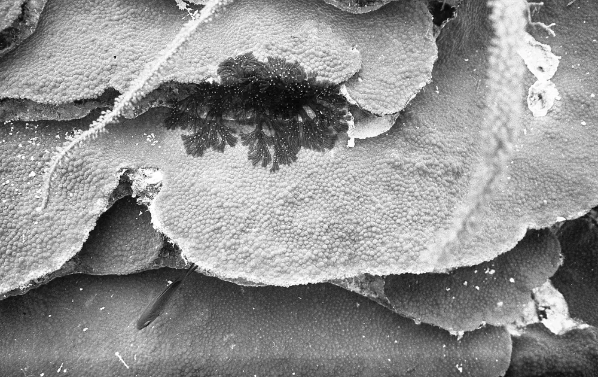{.lightbox group="discovery-bay-1966" description="**UUID: **e3b0909c-c4c6-431b-94c5-380ed7ef236d **Date: **1966-12-11 **Location: **Jamaica | Discovery Bay | Pinnacle 1 Slope **Longitude: **77.41017ºW **Latitude: **18.47367ºN **Photographer: **Eileen Graham **Copyright: **Trustees of the Natural History Museum (London, UK), CC-BY-4.0" alt="**UUID: **e3b0909c-c4c6-431b-94c5-380ed7ef236d **Date: **1966-12-11 **Location: **Jamaica | Discovery Bay | Pinnacle 1 Slope **Longitude: **77.41017ºW **Latitude: **18.47367ºN **Photographer: **Eileen Graham **Copyright: **Trustees of the Natural History Museum (London, UK), CC-BY-4.0"}

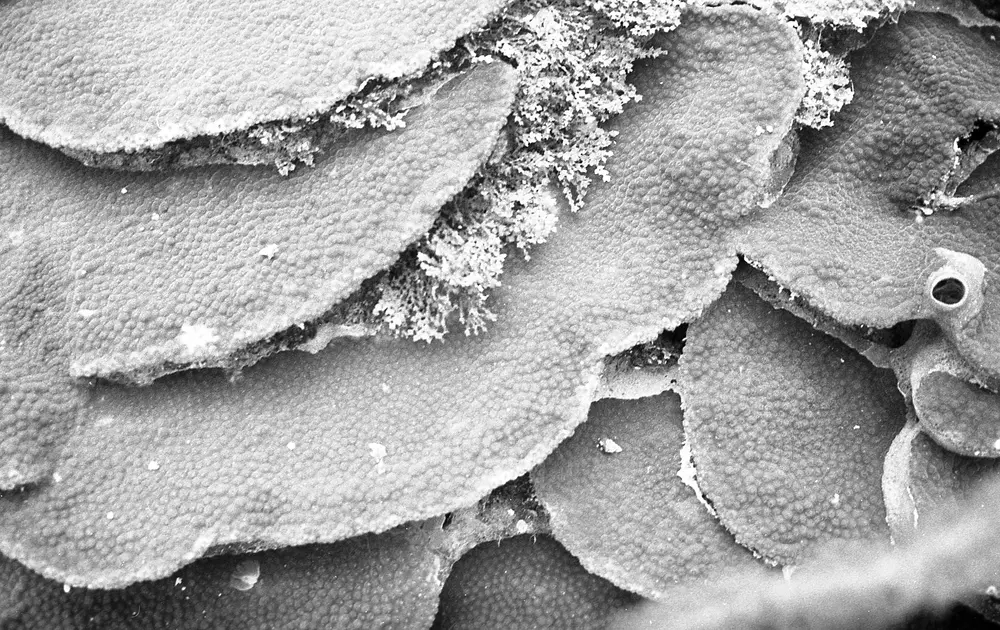{.lightbox group="discovery-bay-1966" description="**UUID: **8576ceb6-d768-482c-ad77-54ac928cd40d **Date: **1966-12-11 **Location: **Jamaica | Discovery Bay | Pinnacle 1 Slope **Longitude: **77.41017ºW **Latitude: **18.47367ºN **Photographer: **Eileen Graham **Copyright: **Trustees of the Natural History Museum (London, UK), CC-BY-4.0" alt="**UUID: **8576ceb6-d768-482c-ad77-54ac928cd40d **Date: **1966-12-11 **Location: **Jamaica | Discovery Bay | Pinnacle 1 Slope **Longitude: **77.41017ºW **Latitude: **18.47367ºN **Photographer: **Eileen Graham **Copyright: **Trustees of the Natural History Museum (London, UK), CC-BY-4.0"}

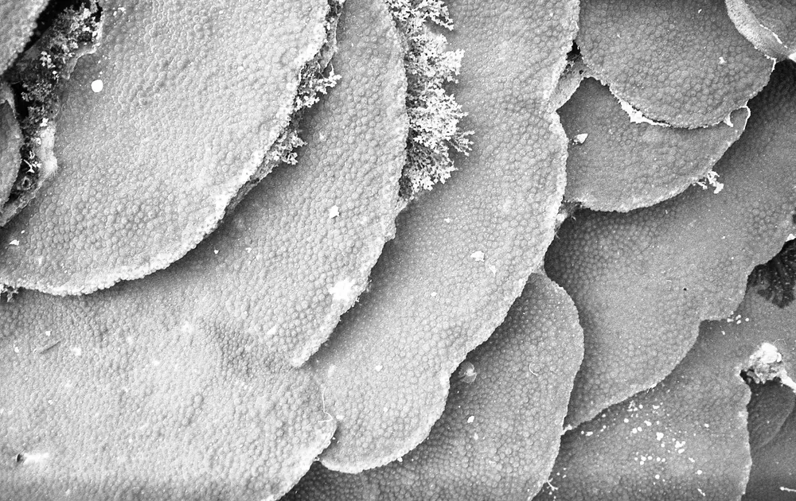{.lightbox group="discovery-bay-1966" description="**UUID: **be54f346-6b00-453e-aae2-71b14c9b6854 **Date: **1966-12-11 **Location: **Jamaica | Discovery Bay | Pinnacle 1 Slope **Longitude: **77.41017ºW **Latitude: **18.47367ºN **Photographer: **Eileen Graham **Copyright: **Trustees of the Natural History Museum (London, UK), CC-BY-4.0" alt="**UUID: **be54f346-6b00-453e-aae2-71b14c9b6854 **Date: **1966-12-11 **Location: **Jamaica | Discovery Bay | Pinnacle 1 Slope **Longitude: **77.41017ºW **Latitude: **18.47367ºN **Photographer: **Eileen Graham **Copyright: **Trustees of the Natural History Museum (London, UK), CC-BY-4.0"}

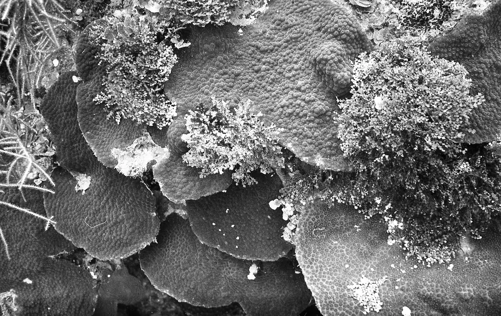{.lightbox group="discovery-bay-1966" description="**UUID: **534e2240-2aca-4131-b571-f970979226b4 **Date: **1966-12-11 **Location: **Jamaica | Discovery Bay | Pinnacle 1 Slope **Longitude: **77.41017ºW **Latitude: **18.47367ºN **Photographer: **Eileen Graham **Copyright: **Trustees of the Natural History Museum (London, UK), CC-BY-4.0" alt="**UUID: **534e2240-2aca-4131-b571-f970979226b4 **Date: **1966-12-11 **Location: **Jamaica | Discovery Bay | Pinnacle 1 Slope **Longitude: **77.41017ºW **Latitude: **18.47367ºN **Photographer: **Eileen Graham **Copyright: **Trustees of the Natural History Museum (London, UK), CC-BY-4.0"}

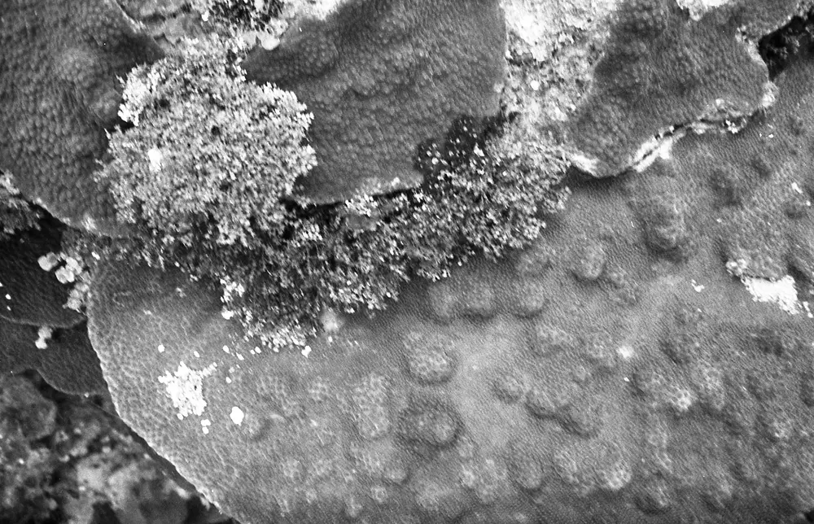{.lightbox group="discovery-bay-1966" description="**UUID: **8fa36f33-6988-4c70-8aa7-76a334677981 **Date: **1966-12-11 **Location: **Jamaica | Discovery Bay | Pinnacle 1 Slope **Longitude: **77.41017ºW **Latitude: **18.47367ºN **Photographer: **Eileen Graham **Copyright: **Trustees of the Natural History Museum (London, UK), CC-BY-4.0" alt="**UUID: **8fa36f33-6988-4c70-8aa7-76a334677981 **Date: **1966-12-11 **Location: **Jamaica | Discovery Bay | Pinnacle 1 Slope **Longitude: **77.41017ºW **Latitude: **18.47367ºN **Photographer: **Eileen Graham **Copyright: **Trustees of the Natural History Museum (London, UK), CC-BY-4.0"}

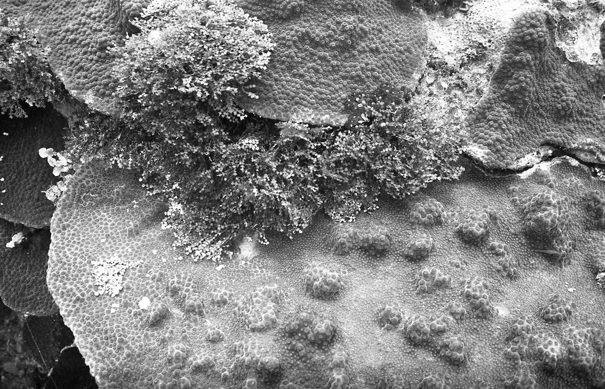{.lightbox group="discovery-bay-1966" description="**UUID: **902f7033-18c3-47fc-8753-fd5e59a56eb5 **Date: **1966-12-11 **Location: **Jamaica | Discovery Bay | Pinnacle 1 Slope **Longitude: **77.41017ºW **Latitude: **18.47367ºN **Photographer: **Eileen Graham **Copyright: **Trustees of the Natural History Museum (London, UK), CC-BY-4.0" alt="**UUID: **902f7033-18c3-47fc-8753-fd5e59a56eb5 **Date: **1966-12-11 **Location: **Jamaica | Discovery Bay | Pinnacle 1 Slope **Longitude: **77.41017ºW **Latitude: **18.47367ºN **Photographer: **Eileen Graham **Copyright: **Trustees of the Natural History Museum (London, UK), CC-BY-4.0"}

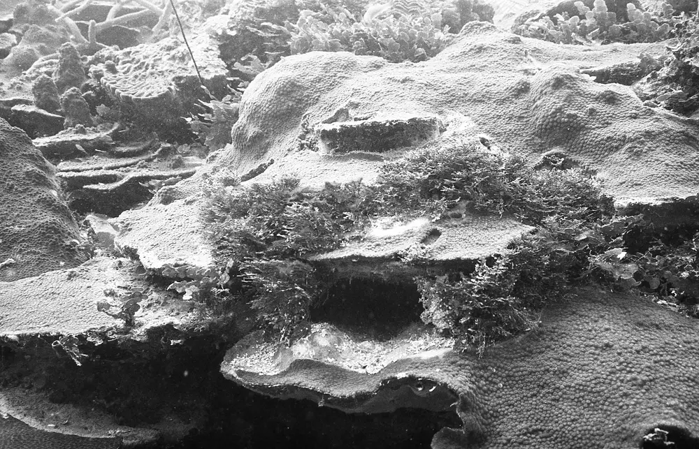{.lightbox group="discovery-bay-1966" description="**UUID: **717c476f-d863-4593-8896-91f7d2f41c10 **Date: **1966-12-11 **Location: **Jamaica | Discovery Bay | Pinnacle 1 Slope **Longitude: **77.41017ºW **Latitude: **18.47367ºN **Photographer: **Eileen Graham **Copyright: **Trustees of the Natural History Museum (London, UK), CC-BY-4.0" alt="**UUID: **717c476f-d863-4593-8896-91f7d2f41c10 **Date: **1966-12-11 **Location: **Jamaica | Discovery Bay | Pinnacle 1 Slope **Longitude: **77.41017ºW **Latitude: **18.47367ºN **Photographer: **Eileen Graham **Copyright: **Trustees of the Natural History Museum (London, UK), CC-BY-4.0"}

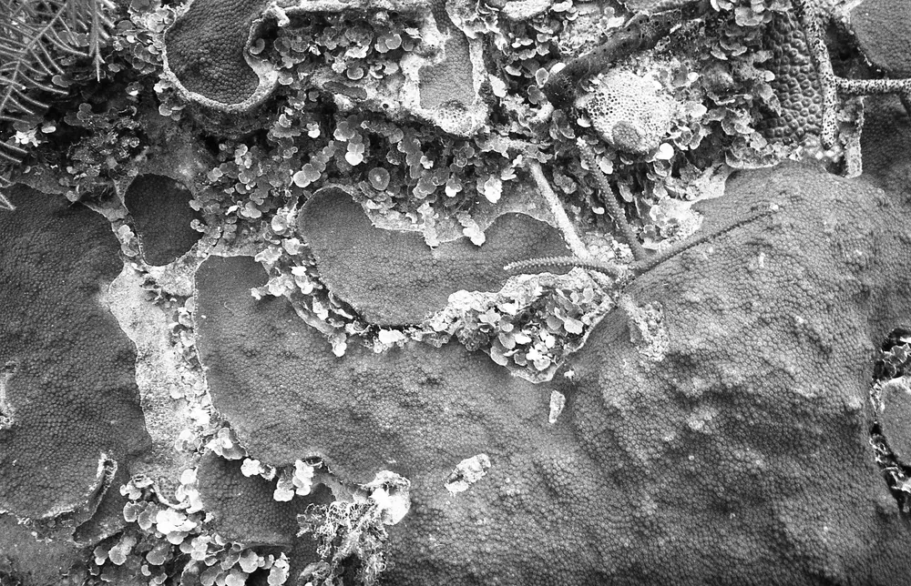{.lightbox group="discovery-bay-1966" description="**UUID: **af0b52b9-383b-4d26-94aa-90c69186f0af **Date: **1966-12-11 **Location: **Jamaica | Discovery Bay | Pinnacle 1 Slope **Longitude: **77.41017ºW **Latitude: **18.47367ºN **Photographer: **Eileen Graham **Copyright: **Trustees of the Natural History Museum (London, UK), CC-BY-4.0" alt="**UUID: **af0b52b9-383b-4d26-94aa-90c69186f0af **Date: **1966-12-11 **Location: **Jamaica | Discovery Bay | Pinnacle 1 Slope **Longitude: **77.41017ºW **Latitude: **18.47367ºN **Photographer: **Eileen Graham **Copyright: **Trustees of the Natural History Museum (London, UK), CC-BY-4.0"}

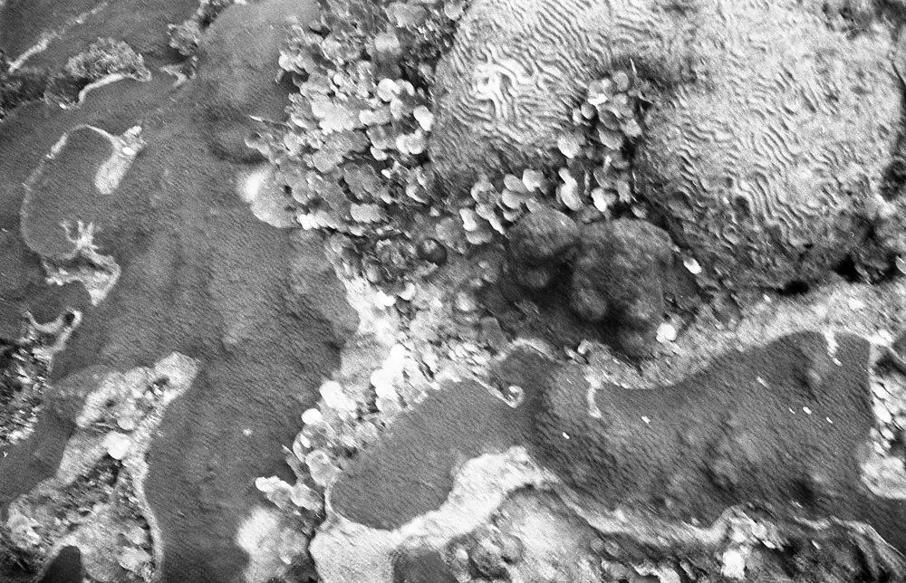{.lightbox group="discovery-bay-1966" description="**UUID: **da228aaf-43d7-4621-a68f-f298186a2ca8 **Date: **1966-12-11 **Location: **Jamaica | Discovery Bay | Pinnacle 1 Slope **Longitude: **77.41017ºW **Latitude: **18.47367ºN **Photographer: **Eileen Graham **Copyright: **Trustees of the Natural History Museum (London, UK), CC-BY-4.0" alt="**UUID: **da228aaf-43d7-4621-a68f-f298186a2ca8 **Date: **1966-12-11 **Location: **Jamaica | Discovery Bay | Pinnacle 1 Slope **Longitude: **77.41017ºW **Latitude: **18.47367ºN **Photographer: **Eileen Graham **Copyright: **Trustees of the Natural History Museum (London, UK), CC-BY-4.0"}

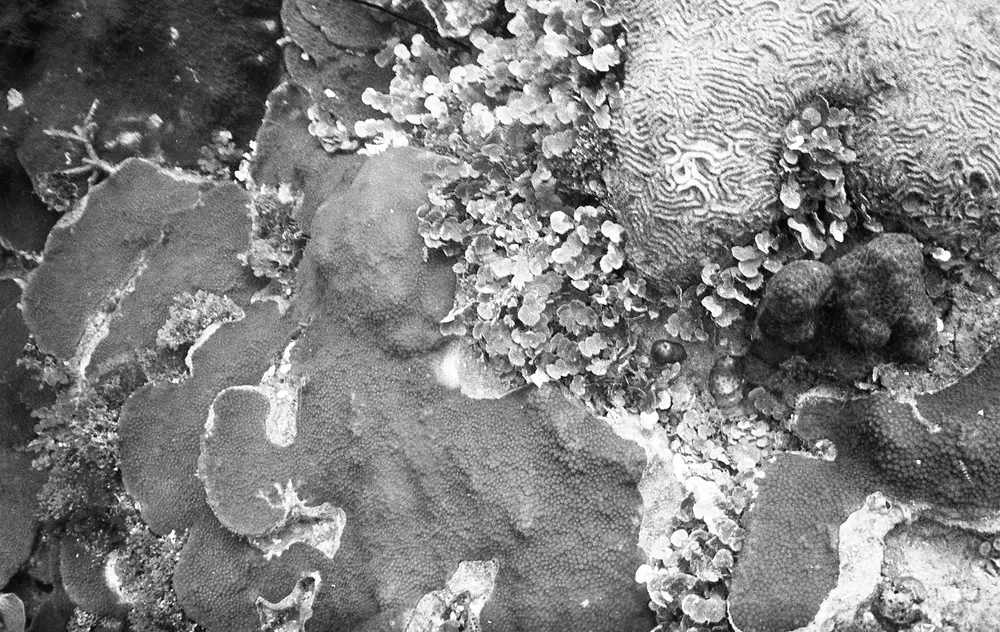{.lightbox group="discovery-bay-1966" description="**UUID: **c37bb717-c7fb-485a-9d7a-63a3ea0f66a9 **Date: **1966-12-11 **Location: **Jamaica | Discovery Bay | Pinnacle 1 Slope **Longitude: **77.41017ºW **Latitude: **18.47367ºN **Photographer: **Eileen Graham **Copyright: **Trustees of the Natural History Museum (London, UK), CC-BY-4.0" alt="**UUID: **c37bb717-c7fb-485a-9d7a-63a3ea0f66a9 **Date: **1966-12-11 **Location: **Jamaica | Discovery Bay | Pinnacle 1 Slope **Longitude: **77.41017ºW **Latitude: **18.47367ºN **Photographer: **Eileen Graham **Copyright: **Trustees of the Natural History Museum (London, UK), CC-BY-4.0"}

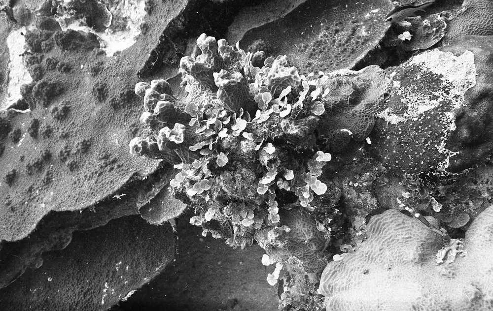{.lightbox group="discovery-bay-1966" description="**UUID: **269122ce-1edc-4ecc-a1a7-26d89feb0573 **Date: **1966-12-11 **Location: **Jamaica | Discovery Bay | Pinnacle 1 Slope **Longitude: **77.41017ºW **Latitude: **18.47367ºN **Photographer: **Eileen Graham **Copyright: **Trustees of the Natural History Museum (London, UK), CC-BY-4.0" alt="**UUID: **269122ce-1edc-4ecc-a1a7-26d89feb0573 **Date: **1966-12-11 **Location: **Jamaica | Discovery Bay | Pinnacle 1 Slope **Longitude: **77.41017ºW **Latitude: **18.47367ºN **Photographer: **Eileen Graham **Copyright: **Trustees of the Natural History Museum (London, UK), CC-BY-4.0"}

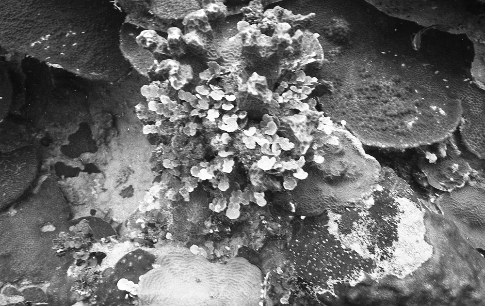{.lightbox group="discovery-bay-1966" description="**UUID: **32dcc3cd-620d-4862-b8c3-a6fedf9c82bd **Date: **1966-12-11 **Location: **Jamaica | Discovery Bay | Pinnacle 1 Slope **Longitude: **77.41017ºW **Latitude: **18.47367ºN **Photographer: **Eileen Graham **Copyright: **Trustees of the Natural History Museum (London, UK), CC-BY-4.0" alt="**UUID: **32dcc3cd-620d-4862-b8c3-a6fedf9c82bd **Date: **1966-12-11 **Location: **Jamaica | Discovery Bay | Pinnacle 1 Slope **Longitude: **77.41017ºW **Latitude: **18.47367ºN **Photographer: **Eileen Graham **Copyright: **Trustees of the Natural History Museum (London, UK), CC-BY-4.0"}

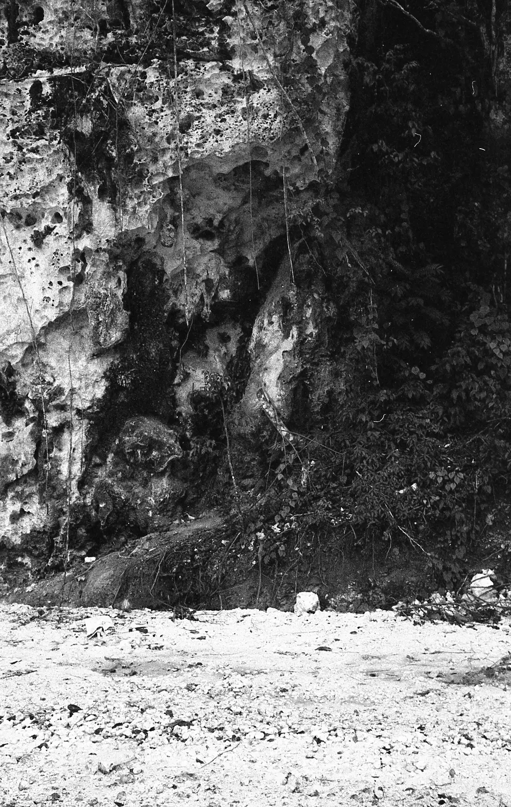{.lightbox group="discovery-bay-1966" description="**UUID: **f9076884-7c33-455e-913a-b891f50c2901 **Date: **1966-12-11 **Location: **Jamaica | Discovery Bay | Onshore **Longitude: **77.41543ºW **Latitude: **18.468618ºN **Photographer: **Eileen Graham **Copyright: **Trustees of the Natural History Museum (London, UK), CC-BY-4.0" alt="**UUID: **f9076884-7c33-455e-913a-b891f50c2901 **Date: **1966-12-11 **Location: **Jamaica | Discovery Bay | Onshore **Longitude: **77.41543ºW **Latitude: **18.468618ºN **Photographer: **Eileen Graham **Copyright: **Trustees of the Natural History Museum (London, UK), CC-BY-4.0"}

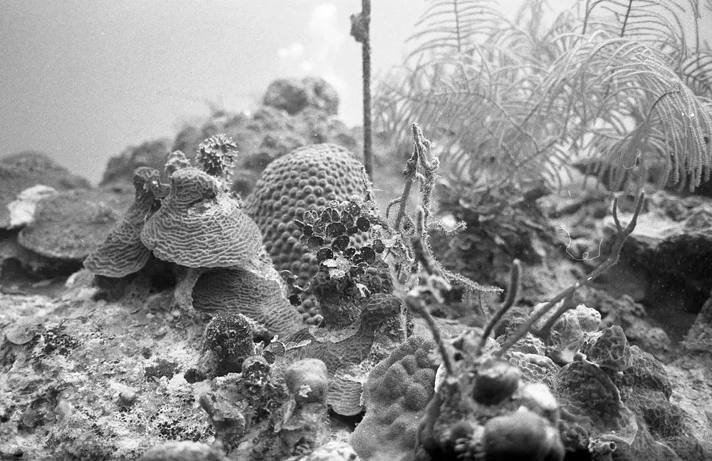{.lightbox group="discovery-bay-1966" description="**UUID: **87ef979a-e851-413a-9498-9dbe5045779a **Date: **1966-12-12 **Location: **Jamaica | Discovery Bay | Buoy Upper Slope **Longitude: **77.40908ºW **Latitude: **18.47322ºN **Photographer: **Eileen Graham **Copyright: **Trustees of the Natural History Museum (London, UK), CC-BY-4.0" alt="**UUID: **87ef979a-e851-413a-9498-9dbe5045779a **Date: **1966-12-12 **Location: **Jamaica | Discovery Bay | Buoy Upper Slope **Longitude: **77.40908ºW **Latitude: **18.47322ºN **Photographer: **Eileen Graham **Copyright: **Trustees of the Natural History Museum (London, UK), CC-BY-4.0"}

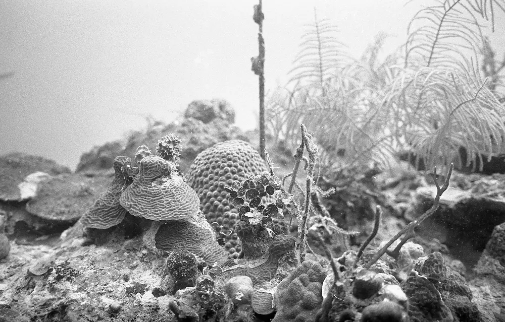{.lightbox group="discovery-bay-1966" description="**UUID: **0973e99f-9a56-4229-80aa-29b2710fa269 **Date: **1966-12-12 **Location: **Jamaica | Discovery Bay | Buoy Upper Slope **Longitude: **77.40908ºW **Latitude: **18.47322ºN **Photographer: **Eileen Graham **Copyright: **Trustees of the Natural History Museum (London, UK), CC-BY-4.0" alt="**UUID: **0973e99f-9a56-4229-80aa-29b2710fa269 **Date: **1966-12-12 **Location: **Jamaica | Discovery Bay | Buoy Upper Slope **Longitude: **77.40908ºW **Latitude: **18.47322ºN **Photographer: **Eileen Graham **Copyright: **Trustees of the Natural History Museum (London, UK), CC-BY-4.0"}

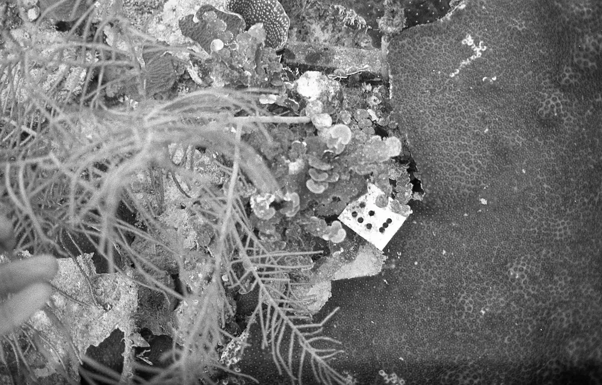{.lightbox group="discovery-bay-1966" description="**UUID: **94e74ce9-4862-4556-a748-f6ab42c8c553 **Date: **1966-12-12 **Location: **Jamaica | Discovery Bay | Buoy Upper Slope **Longitude: **77.40908ºW **Latitude: **18.47322ºN **Photographer: **Eileen Graham **Copyright: **Trustees of the Natural History Museum (London, UK), CC-BY-4.0" alt="**UUID: **94e74ce9-4862-4556-a748-f6ab42c8c553 **Date: **1966-12-12 **Location: **Jamaica | Discovery Bay | Buoy Upper Slope **Longitude: **77.40908ºW **Latitude: **18.47322ºN **Photographer: **Eileen Graham **Copyright: **Trustees of the Natural History Museum (London, UK), CC-BY-4.0"}

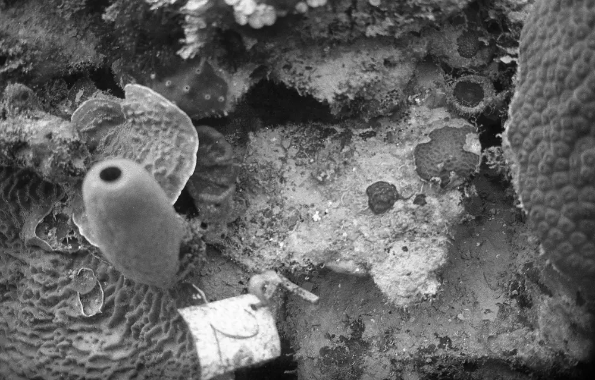{.lightbox group="discovery-bay-1966" description="**UUID: **450ab4b6-177a-4518-817f-aaf520e6a807 **Date: **1966-12-12 **Location: **Jamaica | Discovery Bay | Buoy Upper Slope **Longitude: **77.40908ºW **Latitude: **18.47322ºN **Photographer: **Eileen Graham **Copyright: **Trustees of the Natural History Museum (London, UK), CC-BY-4.0" alt="**UUID: **450ab4b6-177a-4518-817f-aaf520e6a807 **Date: **1966-12-12 **Location: **Jamaica | Discovery Bay | Buoy Upper Slope **Longitude: **77.40908ºW **Latitude: **18.47322ºN **Photographer: **Eileen Graham **Copyright: **Trustees of the Natural History Museum (London, UK), CC-BY-4.0"}

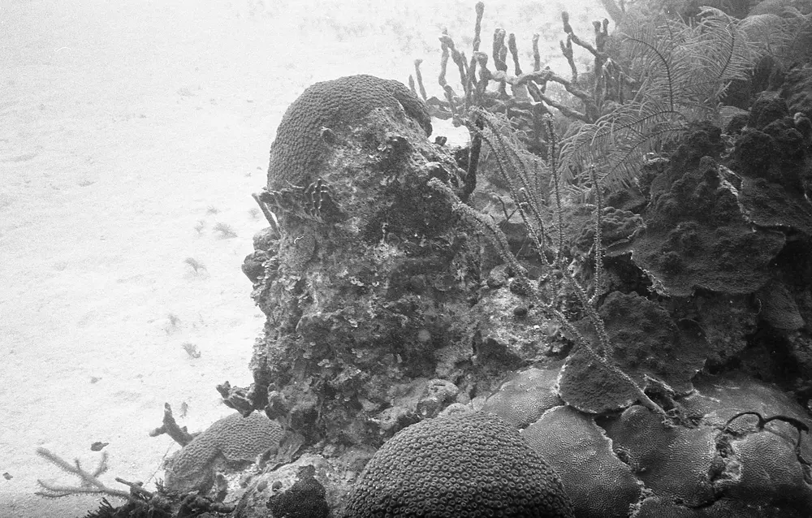{.lightbox group="discovery-bay-1966" description="**UUID: **965d5cb7-d1a3-41fb-ad34-401b4d2defeb **Date: **1966-12-12 **Location: **Jamaica | Discovery Bay | Buoy Upper Slope **Longitude: **77.40908ºW **Latitude: **18.47322ºN **Photographer: **Eileen Graham **Copyright: **Trustees of the Natural History Museum (London, UK), CC-BY-4.0" alt="**UUID: **965d5cb7-d1a3-41fb-ad34-401b4d2defeb **Date: **1966-12-12 **Location: **Jamaica | Discovery Bay | Buoy Upper Slope **Longitude: **77.40908ºW **Latitude: **18.47322ºN **Photographer: **Eileen Graham **Copyright: **Trustees of the Natural History Museum (London, UK), CC-BY-4.0"}

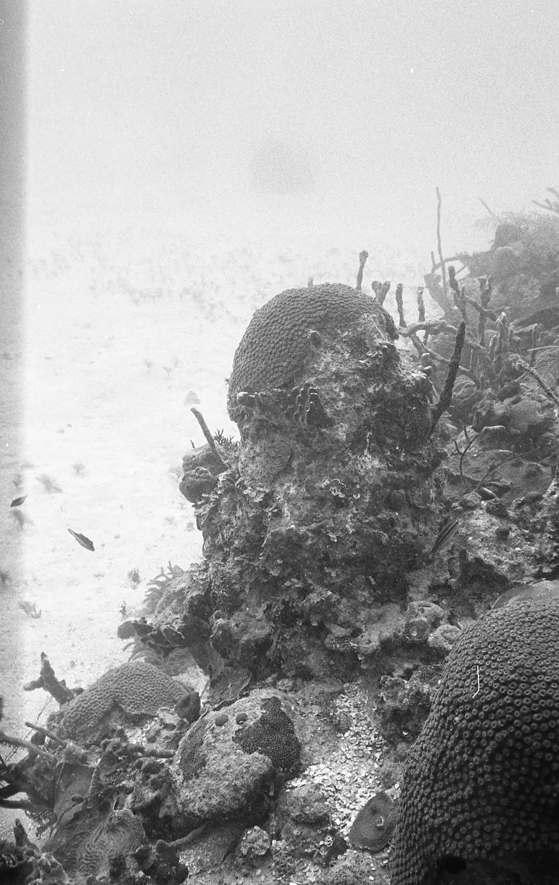{.lightbox group="discovery-bay-1966" description="**UUID: **abad3738-d235-45fc-8ed9-9210c76eaabe **Date: **1966-12-12 **Location: **Jamaica | Discovery Bay | Buoy Upper Slope **Longitude: **77.40908ºW **Latitude: **18.47322ºN **Photographer: **Eileen Graham **Copyright: **Trustees of the Natural History Museum (London, UK), CC-BY-4.0" alt="**UUID: **abad3738-d235-45fc-8ed9-9210c76eaabe **Date: **1966-12-12 **Location: **Jamaica | Discovery Bay | Buoy Upper Slope **Longitude: **77.40908ºW **Latitude: **18.47322ºN **Photographer: **Eileen Graham **Copyright: **Trustees of the Natural History Museum (London, UK), CC-BY-4.0"}

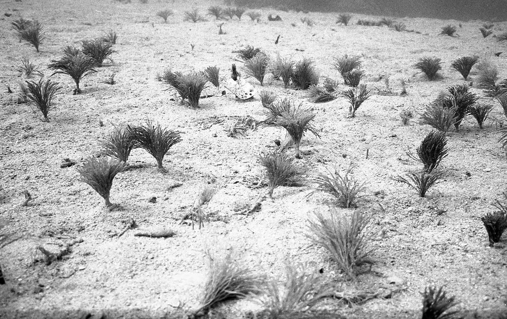{.lightbox group="discovery-bay-1966" description="**UUID: **6e353b52-48f3-4aa2-9ca7-da4690212619 **Date: **1966-12-12 **Location: **Jamaica | Discovery Bay | Algal Plots **Longitude: **77.414ºW **Latitude: **18.473ºN **Photographer: **Eileen Graham **Copyright: **Trustees of the Natural History Museum (London, UK), CC-BY-4.0" alt="**UUID: **6e353b52-48f3-4aa2-9ca7-da4690212619 **Date: **1966-12-12 **Location: **Jamaica | Discovery Bay | Algal Plots **Longitude: **77.414ºW **Latitude: **18.473ºN **Photographer: **Eileen Graham **Copyright: **Trustees of the Natural History Museum (London, UK), CC-BY-4.0"}

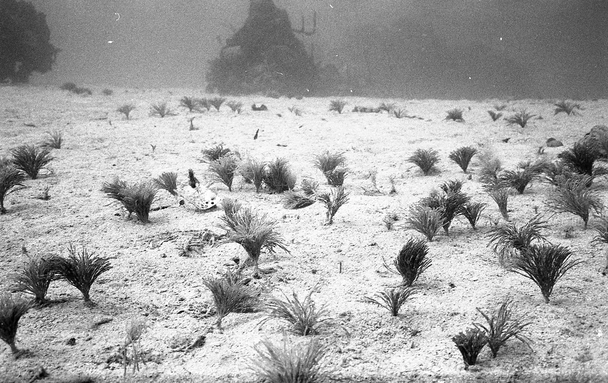{.lightbox group="discovery-bay-1966" description="**UUID: **5cb65ed1-bb73-4e16-896c-95729fe5bdba **Date: **1966-12-12 **Location: **Jamaica | Discovery Bay | Algal Plots **Longitude: **77.414ºW **Latitude: **18.473ºN **Photographer: **Eileen Graham **Copyright: **Trustees of the Natural History Museum (London, UK), CC-BY-4.0" alt="**UUID: **5cb65ed1-bb73-4e16-896c-95729fe5bdba **Date: **1966-12-12 **Location: **Jamaica | Discovery Bay | Algal Plots **Longitude: **77.414ºW **Latitude: **18.473ºN **Photographer: **Eileen Graham **Copyright: **Trustees of the Natural History Museum (London, UK), CC-BY-4.0"}

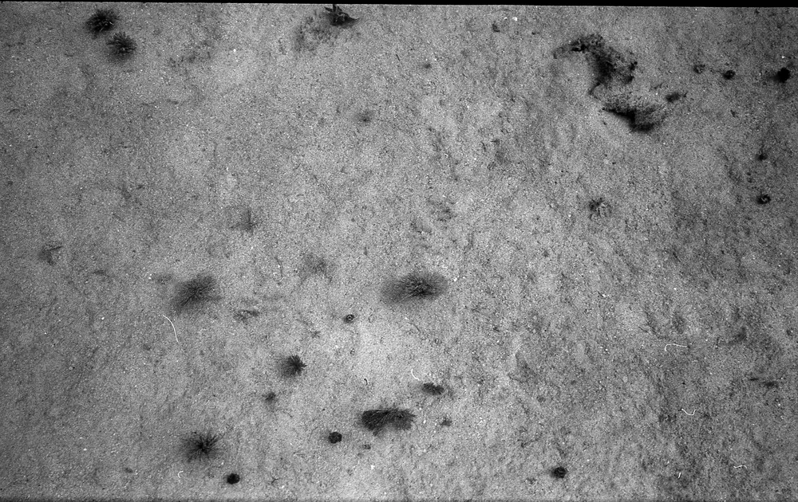{.lightbox group="discovery-bay-1966" description="**UUID: **0de49540-2287-4063-b093-1f3603852f87 **Date: **1966-12-12 **Location: **Jamaica | Discovery Bay | Algal Plots **Longitude: **77.414ºW **Latitude: **18.473ºN **Photographer: **Eileen Graham **Copyright: **Trustees of the Natural History Museum (London, UK), CC-BY-4.0" alt="**UUID: **0de49540-2287-4063-b093-1f3603852f87 **Date: **1966-12-12 **Location: **Jamaica | Discovery Bay | Algal Plots **Longitude: **77.414ºW **Latitude: **18.473ºN **Photographer: **Eileen Graham **Copyright: **Trustees of the Natural History Museum (London, UK), CC-BY-4.0"}

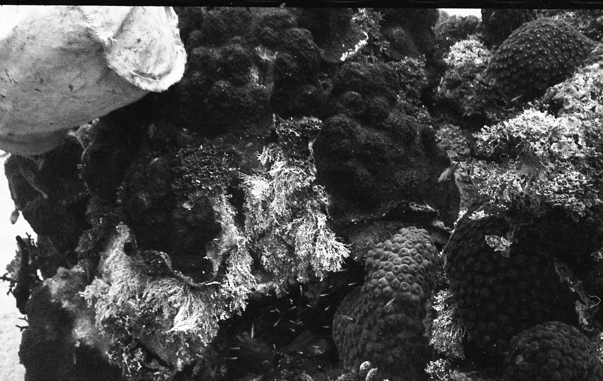{.lightbox group="discovery-bay-1966" description="**UUID: **c3404e10-0da1-42db-a517-c6b8ff813ec2 **Date: **1966-12-12 **Location: **Jamaica | Discovery Bay | Buoy Upper Slope **Longitude: **77.40908ºW **Latitude: **18.47322ºN **Photographer: **Eileen Graham **Copyright: **Trustees of the Natural History Museum (London, UK), CC-BY-4.0" alt="**UUID: **c3404e10-0da1-42db-a517-c6b8ff813ec2 **Date: **1966-12-12 **Location: **Jamaica | Discovery Bay | Buoy Upper Slope **Longitude: **77.40908ºW **Latitude: **18.47322ºN **Photographer: **Eileen Graham **Copyright: **Trustees of the Natural History Museum (London, UK), CC-BY-4.0"}

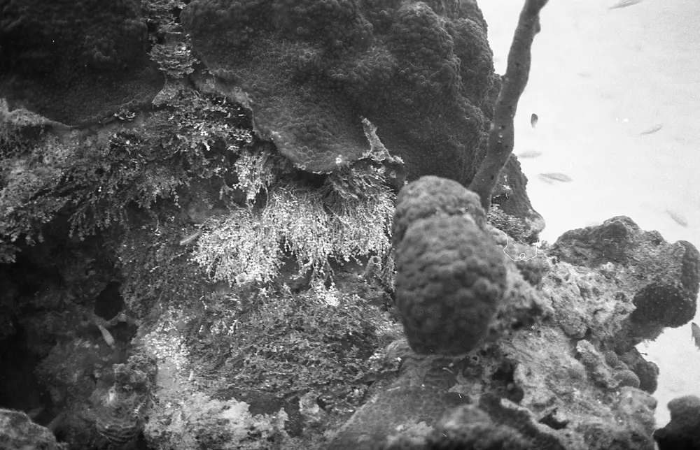{.lightbox group="discovery-bay-1966" description="**UUID: **8587f568-e3ff-4ae0-bb6d-daf76bf98a84 **Date: **1966-12-12 **Location: **Jamaica | Discovery Bay | Buoy Upper Slope **Longitude: **77.40908ºW **Latitude: **18.47322ºN **Photographer: **Eileen Graham **Copyright: **Trustees of the Natural History Museum (London, UK), CC-BY-4.0" alt="**UUID: **8587f568-e3ff-4ae0-bb6d-daf76bf98a84 **Date: **1966-12-12 **Location: **Jamaica | Discovery Bay | Buoy Upper Slope **Longitude: **77.40908ºW **Latitude: **18.47322ºN **Photographer: **Eileen Graham **Copyright: **Trustees of the Natural History Museum (London, UK), CC-BY-4.0"}

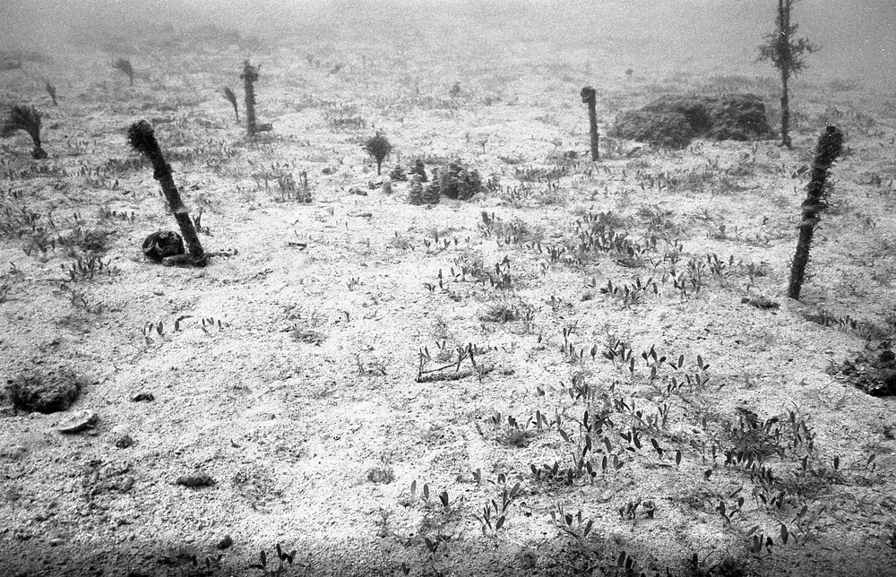{.lightbox group="discovery-bay-1966" description="**UUID: **aa8ef057-ac2b-4a45-8423-772b14bcc4b9 **Date: **1966-12-12 **Location: **Jamaica | Discovery Bay | Algal Plots **Longitude: **77.414ºW **Latitude: **18.473ºN **Photographer: **Eileen Graham **Copyright: **Trustees of the Natural History Museum (London, UK), CC-BY-4.0" alt="**UUID: **aa8ef057-ac2b-4a45-8423-772b14bcc4b9 **Date: **1966-12-12 **Location: **Jamaica | Discovery Bay | Algal Plots **Longitude: **77.414ºW **Latitude: **18.473ºN **Photographer: **Eileen Graham **Copyright: **Trustees of the Natural History Museum (London, UK), CC-BY-4.0"}

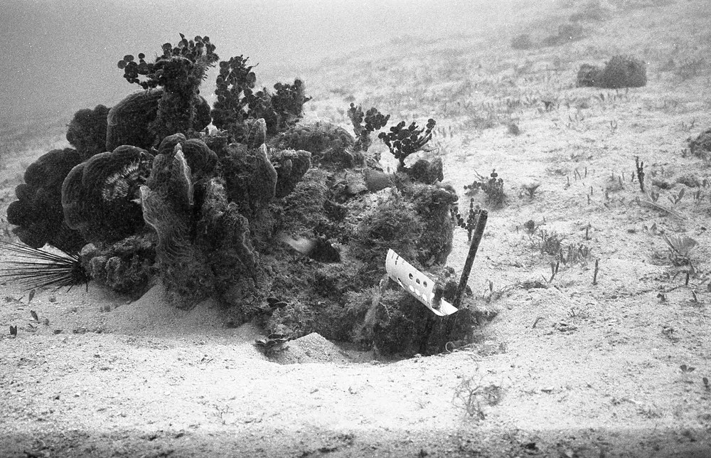{.lightbox group="discovery-bay-1966" description="**UUID: **354f9d02-f0db-49e6-a8c9-184e95ce36fc **Date: **1966-12-12 **Location: **Jamaica | Discovery Bay | Algal Plots **Longitude: **77.414ºW **Latitude: **18.473ºN **Photographer: **Eileen Graham **Copyright: **Trustees of the Natural History Museum (London, UK), CC-BY-4.0" alt="**UUID: **354f9d02-f0db-49e6-a8c9-184e95ce36fc **Date: **1966-12-12 **Location: **Jamaica | Discovery Bay | Algal Plots **Longitude: **77.414ºW **Latitude: **18.473ºN **Photographer: **Eileen Graham **Copyright: **Trustees of the Natural History Museum (London, UK), CC-BY-4.0"}

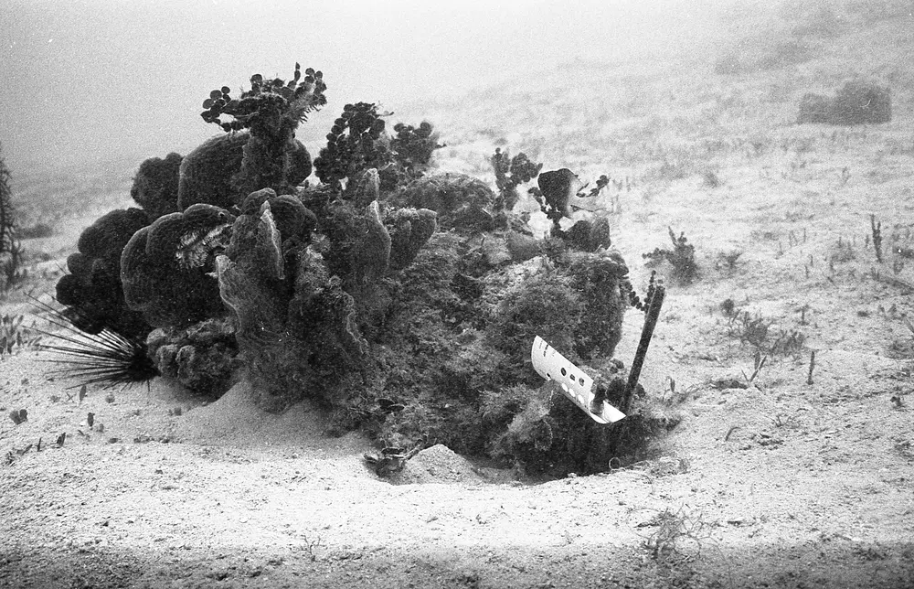{.lightbox group="discovery-bay-1966" description="**UUID: **51bcdf7b-2ee2-4f87-ac27-ea38adb1f63a **Date: **1966-12-12 **Location: **Jamaica | Discovery Bay | Algal Plots **Longitude: **77.414ºW **Latitude: **18.473ºN **Photographer: **Eileen Graham **Copyright: **Trustees of the Natural History Museum (London, UK), CC-BY-4.0" alt="**UUID: **51bcdf7b-2ee2-4f87-ac27-ea38adb1f63a **Date: **1966-12-12 **Location: **Jamaica | Discovery Bay | Algal Plots **Longitude: **77.414ºW **Latitude: **18.473ºN **Photographer: **Eileen Graham **Copyright: **Trustees of the Natural History Museum (London, UK), CC-BY-4.0"}

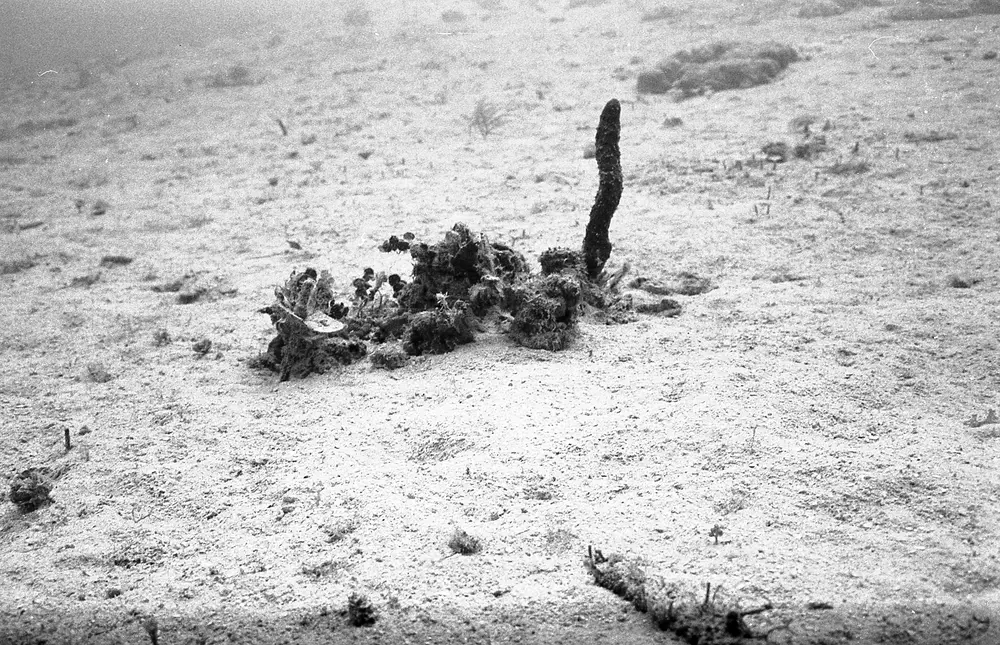{.lightbox group="discovery-bay-1966" description="**UUID: **34140ae9-a082-4d6b-bc35-ecb460ddf7d6 **Date: **1966-12-12 **Location: **Jamaica | Discovery Bay | Algal Plots **Longitude: **77.414ºW **Latitude: **18.473ºN **Photographer: **Eileen Graham **Copyright: **Trustees of the Natural History Museum (London, UK), CC-BY-4.0" alt="**UUID: **34140ae9-a082-4d6b-bc35-ecb460ddf7d6 **Date: **1966-12-12 **Location: **Jamaica | Discovery Bay | Algal Plots **Longitude: **77.414ºW **Latitude: **18.473ºN **Photographer: **Eileen Graham **Copyright: **Trustees of the Natural History Museum (London, UK), CC-BY-4.0"}

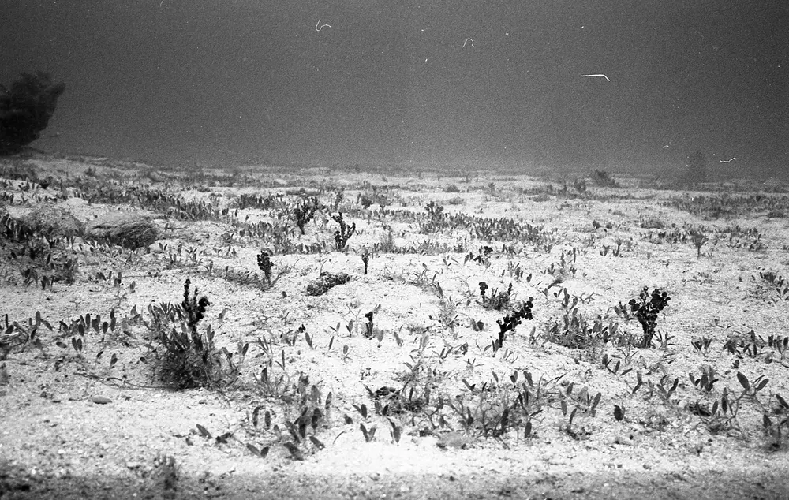{.lightbox group="discovery-bay-1966" description="**UUID: **260e41f9-1dd7-4e94-8314-5935b6f15666 **Date: **1966-12-12 **Location: **Jamaica | Discovery Bay | Algal Plots **Longitude: **77.414ºW **Latitude: **18.473ºN **Photographer: **Eileen Graham **Copyright: **Trustees of the Natural History Museum (London, UK), CC-BY-4.0" alt="**UUID: **260e41f9-1dd7-4e94-8314-5935b6f15666 **Date: **1966-12-12 **Location: **Jamaica | Discovery Bay | Algal Plots **Longitude: **77.414ºW **Latitude: **18.473ºN **Photographer: **Eileen Graham **Copyright: **Trustees of the Natural History Museum (London, UK), CC-BY-4.0"}

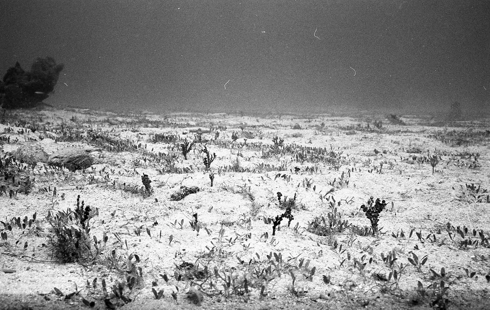{.lightbox group="discovery-bay-1966" description="**UUID: **6ce2fac9-d826-47f1-843f-719f39bd9a6c **Date: **1966-12-12 **Location: **Jamaica | Discovery Bay | Algal Plots **Longitude: **77.414ºW **Latitude: **18.473ºN **Photographer: **Eileen Graham **Copyright: **Trustees of the Natural History Museum (London, UK), CC-BY-4.0" alt="**UUID: **6ce2fac9-d826-47f1-843f-719f39bd9a6c **Date: **1966-12-12 **Location: **Jamaica | Discovery Bay | Algal Plots **Longitude: **77.414ºW **Latitude: **18.473ºN **Photographer: **Eileen Graham **Copyright: **Trustees of the Natural History Museum (London, UK), CC-BY-4.0"}

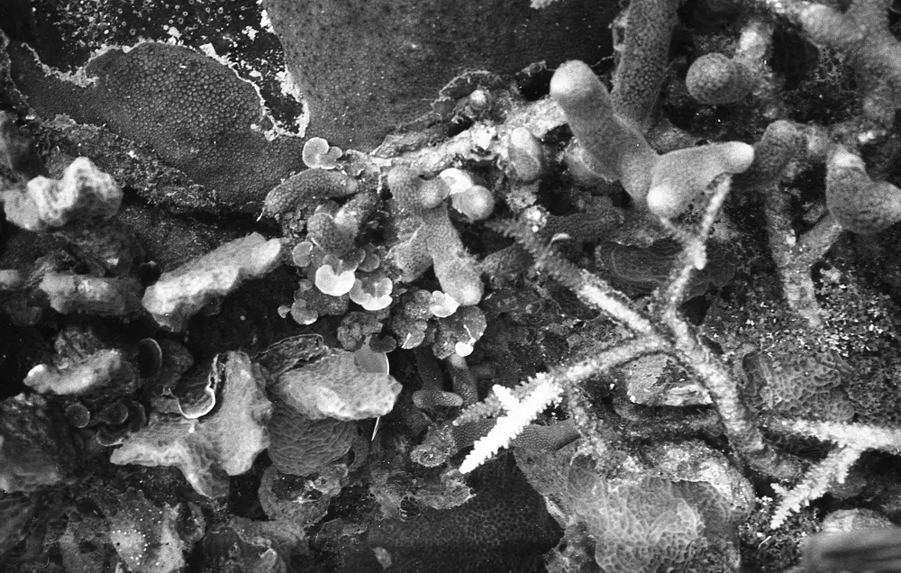{.lightbox group="discovery-bay-1966" description="**UUID: **640a226d-816d-4280-bf7d-e5d6c1c41be7 **Date: **1966-12-12 **Location: **Jamaica | Discovery Bay | Buoy Upper Slope **Longitude: **77.40908ºW **Latitude: **18.47322ºN **Photographer: **Eileen Graham **Copyright: **Trustees of the Natural History Museum (London, UK), CC-BY-4.0" alt="**UUID: **640a226d-816d-4280-bf7d-e5d6c1c41be7 **Date: **1966-12-12 **Location: **Jamaica | Discovery Bay | Buoy Upper Slope **Longitude: **77.40908ºW **Latitude: **18.47322ºN **Photographer: **Eileen Graham **Copyright: **Trustees of the Natural History Museum (London, UK), CC-BY-4.0"}

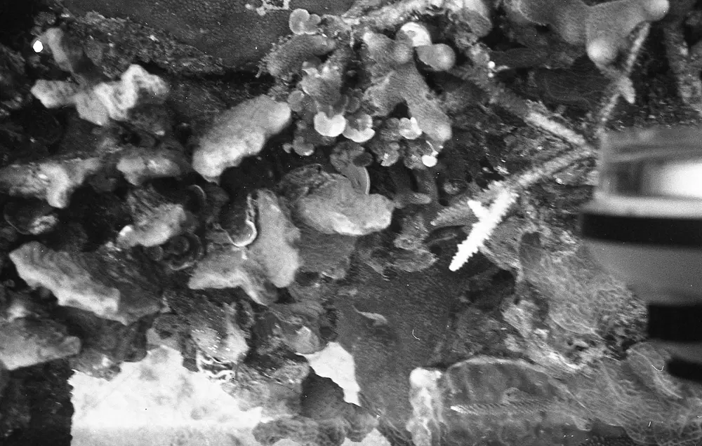{.lightbox group="discovery-bay-1966" description="**UUID: **89a16ba8-f41d-4cf4-9a70-b54df27f34c0 **Date: **1966-12-12 **Location: **Jamaica | Discovery Bay | Buoy Upper Slope **Longitude: **77.40908ºW **Latitude: **18.47322ºN **Photographer: **Eileen Graham **Copyright: **Trustees of the Natural History Museum (London, UK), CC-BY-4.0" alt="**UUID: **89a16ba8-f41d-4cf4-9a70-b54df27f34c0 **Date: **1966-12-12 **Location: **Jamaica | Discovery Bay | Buoy Upper Slope **Longitude: **77.40908ºW **Latitude: **18.47322ºN **Photographer: **Eileen Graham **Copyright: **Trustees of the Natural History Museum (London, UK), CC-BY-4.0"}

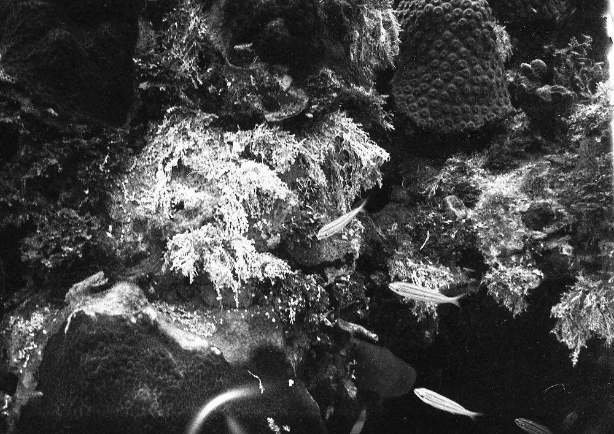{.lightbox group="discovery-bay-1966" description="**UUID: **3f894a6c-59f4-4a2f-bd03-6935e4097c9c **Date: **1966-12-12 **Location: **Jamaica | Discovery Bay | Buoy Upper Slope **Longitude: **77.40908ºW **Latitude: **18.47322ºN **Photographer: **Eileen Graham **Copyright: **Trustees of the Natural History Museum (London, UK), CC-BY-4.0" alt="**UUID: **3f894a6c-59f4-4a2f-bd03-6935e4097c9c **Date: **1966-12-12 **Location: **Jamaica | Discovery Bay | Buoy Upper Slope **Longitude: **77.40908ºW **Latitude: **18.47322ºN **Photographer: **Eileen Graham **Copyright: **Trustees of the Natural History Museum (London, UK), CC-BY-4.0"}

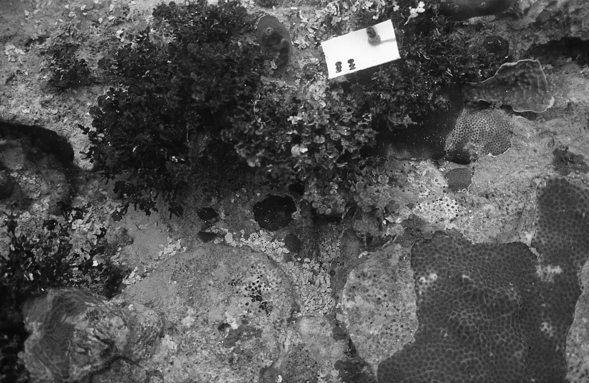{.lightbox group="discovery-bay-1966" description="**UUID: **57d0de09-9a32-4962-9ee5-c87033958b45 **Date: **1966-12-27 **Location: **Jamaica | Discovery Bay | Buoy Upper Slope **Longitude: **77.40908ºW **Latitude: **18.47322ºN **Photographer: **Eileen Graham **Copyright: **Trustees of the Natural History Museum (London, UK), CC-BY-4.0" alt="**UUID: **57d0de09-9a32-4962-9ee5-c87033958b45 **Date: **1966-12-27 **Location: **Jamaica | Discovery Bay | Buoy Upper Slope **Longitude: **77.40908ºW **Latitude: **18.47322ºN **Photographer: **Eileen Graham **Copyright: **Trustees of the Natural History Museum (London, UK), CC-BY-4.0"}

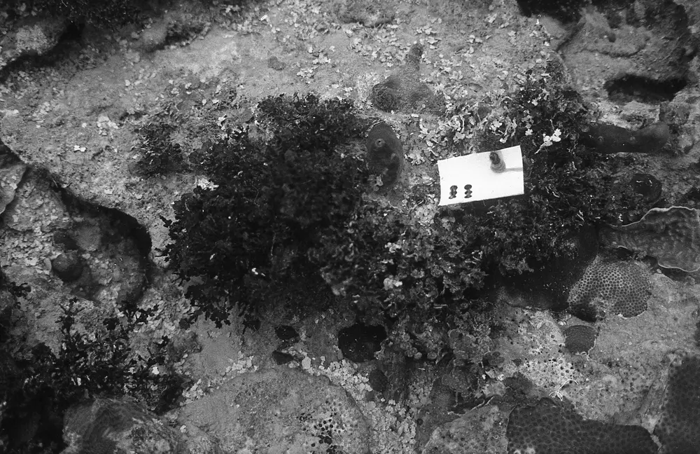{.lightbox group="discovery-bay-1966" description="**UUID: **35d2bed3-9833-4903-82b7-e654c6eab3cb **Date: **1966-12-27 **Location: **Jamaica | Discovery Bay | Buoy Upper Slope **Longitude: **77.40908ºW **Latitude: **18.47322ºN **Photographer: **Eileen Graham **Copyright: **Trustees of the Natural History Museum (London, UK), CC-BY-4.0" alt="**UUID: **35d2bed3-9833-4903-82b7-e654c6eab3cb **Date: **1966-12-27 **Location: **Jamaica | Discovery Bay | Buoy Upper Slope **Longitude: **77.40908ºW **Latitude: **18.47322ºN **Photographer: **Eileen Graham **Copyright: **Trustees of the Natural History Museum (London, UK), CC-BY-4.0"}

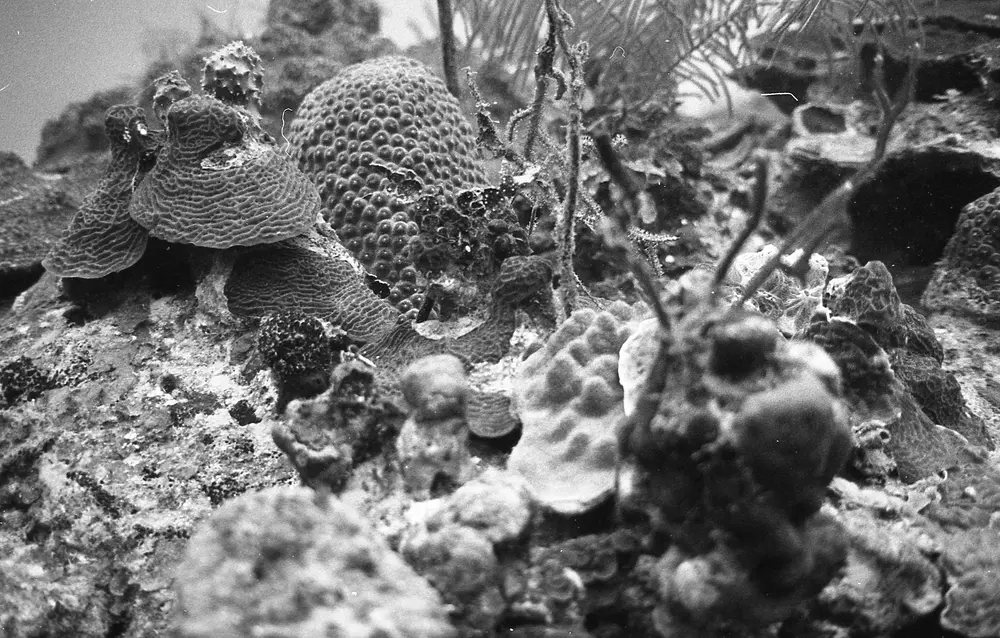{.lightbox group="discovery-bay-1966" description="**UUID: **1a8b0c56-1794-4e45-a67a-5e06adb8ae55 **Date: **1966-12-27 **Location: **Jamaica | Discovery Bay | Buoy Upper Slope **Longitude: **77.40908ºW **Latitude: **18.47322ºN **Photographer: **Eileen Graham **Copyright: **Trustees of the Natural History Museum (London, UK), CC-BY-4.0" alt="**UUID: **1a8b0c56-1794-4e45-a67a-5e06adb8ae55 **Date: **1966-12-27 **Location: **Jamaica | Discovery Bay | Buoy Upper Slope **Longitude: **77.40908ºW **Latitude: **18.47322ºN **Photographer: **Eileen Graham **Copyright: **Trustees of the Natural History Museum (London, UK), CC-BY-4.0"}

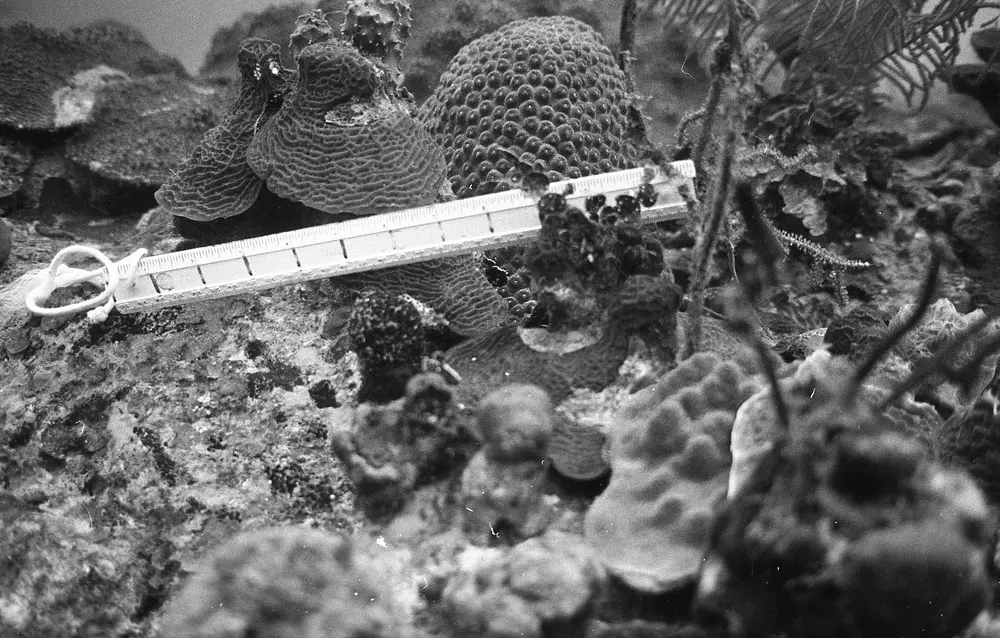{.lightbox group="discovery-bay-1966" description="**UUID: **ca0b8dfb-7830-44a1-ab4a-932dd3b98df4 **Date: **1966-12-27 **Location: **Jamaica | Discovery Bay | Buoy Upper Slope **Longitude: **77.40908ºW **Latitude: **18.47322ºN **Photographer: **Eileen Graham **Copyright: **Trustees of the Natural History Museum (London, UK), CC-BY-4.0" alt="**UUID: **ca0b8dfb-7830-44a1-ab4a-932dd3b98df4 **Date: **1966-12-27 **Location: **Jamaica | Discovery Bay | Buoy Upper Slope **Longitude: **77.40908ºW **Latitude: **18.47322ºN **Photographer: **Eileen Graham **Copyright: **Trustees of the Natural History Museum (London, UK), CC-BY-4.0"}

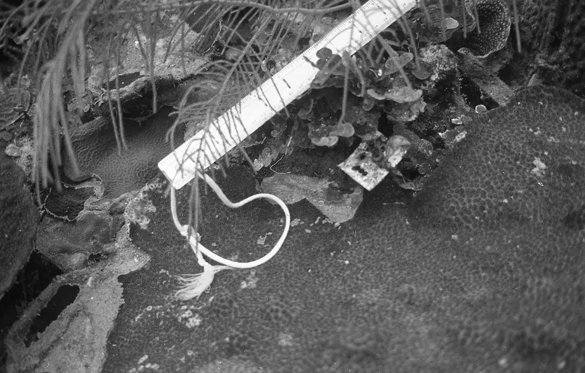{.lightbox group="discovery-bay-1966" description="**UUID: **b6d451b6-a707-463b-9feb-c5b047ce33b7 **Date: **1966-12-27 **Location: **Jamaica | Discovery Bay | Buoy Upper Slope **Longitude: **77.40908ºW **Latitude: **18.47322ºN **Photographer: **Eileen Graham **Copyright: **Trustees of the Natural History Museum (London, UK), CC-BY-4.0" alt="**UUID: **b6d451b6-a707-463b-9feb-c5b047ce33b7 **Date: **1966-12-27 **Location: **Jamaica | Discovery Bay | Buoy Upper Slope **Longitude: **77.40908ºW **Latitude: **18.47322ºN **Photographer: **Eileen Graham **Copyright: **Trustees of the Natural History Museum (London, UK), CC-BY-4.0"}

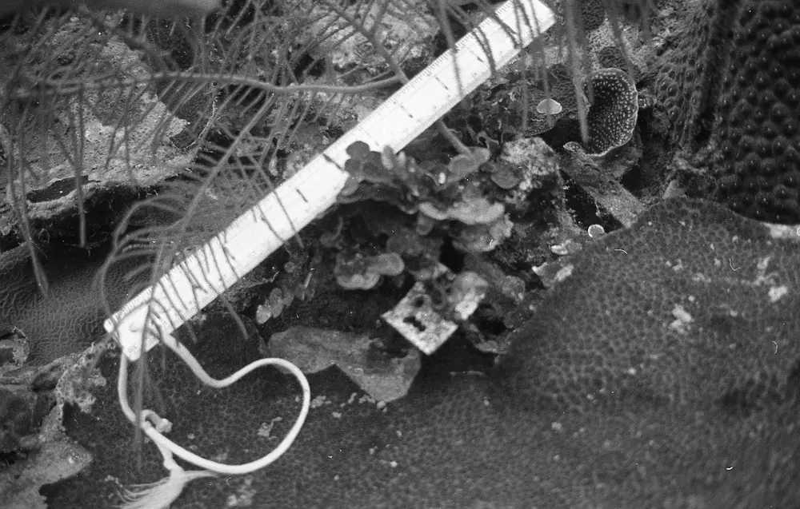{.lightbox group="discovery-bay-1966" description="**UUID: **b4452210-c9e8-4f8a-80a1-c8553375b353 **Date: **1966-12-27 **Location: **Jamaica | Discovery Bay | Buoy Upper Slope **Longitude: **77.40908ºW **Latitude: **18.47322ºN **Photographer: **Eileen Graham **Copyright: **Trustees of the Natural History Museum (London, UK), CC-BY-4.0" alt="**UUID: **b4452210-c9e8-4f8a-80a1-c8553375b353 **Date: **1966-12-27 **Location: **Jamaica | Discovery Bay | Buoy Upper Slope **Longitude: **77.40908ºW **Latitude: **18.47322ºN **Photographer: **Eileen Graham **Copyright: **Trustees of the Natural History Museum (London, UK), CC-BY-4.0"}

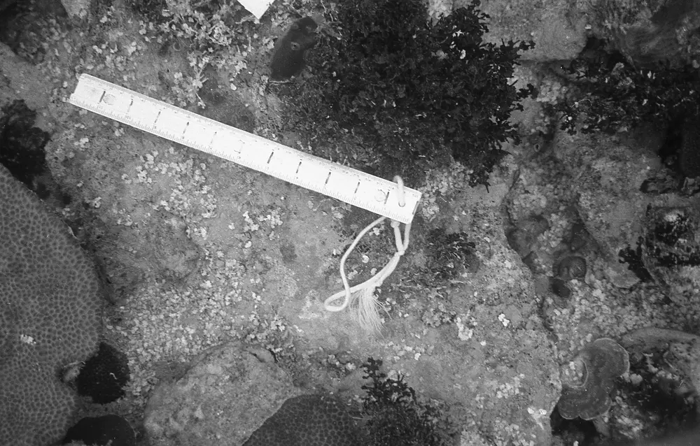{.lightbox group="discovery-bay-1966" description="**UUID: **a2b499dd-9c64-4c31-a07d-9ce92a9fa9bb **Date: **1966-12-27 **Location: **Jamaica | Discovery Bay | Buoy Upper Slope **Longitude: **77.40908ºW **Latitude: **18.47322ºN **Photographer: **Eileen Graham **Copyright: **Trustees of the Natural History Museum (London, UK), CC-BY-4.0" alt="**UUID: **a2b499dd-9c64-4c31-a07d-9ce92a9fa9bb **Date: **1966-12-27 **Location: **Jamaica | Discovery Bay | Buoy Upper Slope **Longitude: **77.40908ºW **Latitude: **18.47322ºN **Photographer: **Eileen Graham **Copyright: **Trustees of the Natural History Museum (London, UK), CC-BY-4.0"}

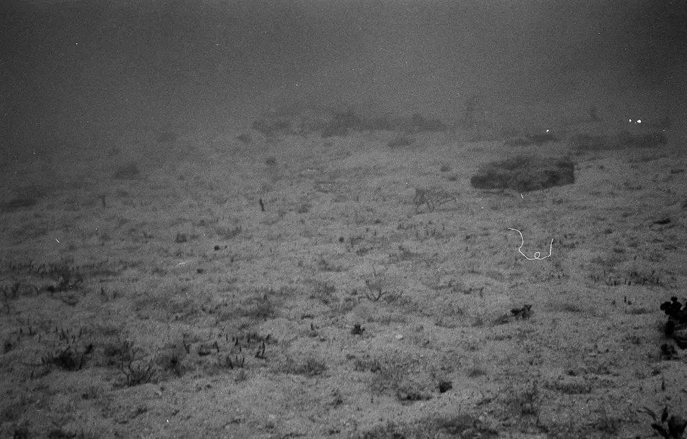{.lightbox group="discovery-bay-1966" description="**UUID: **18bcd7c5-3816-4e37-89b3-d6f2c178ed89 **Date: **1966-12-27 **Location: **Jamaica | Discovery Bay | Algal Plots **Longitude: **77.414ºW **Latitude: **18.473ºN **Photographer: **Eileen Graham **Copyright: **Trustees of the Natural History Museum (London, UK), CC-BY-4.0" alt="**UUID: **18bcd7c5-3816-4e37-89b3-d6f2c178ed89 **Date: **1966-12-27 **Location: **Jamaica | Discovery Bay | Algal Plots **Longitude: **77.414ºW **Latitude: **18.473ºN **Photographer: **Eileen Graham **Copyright: **Trustees of the Natural History Museum (London, UK), CC-BY-4.0"}

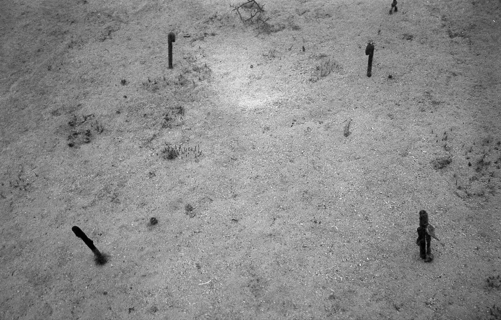{.lightbox group="discovery-bay-1966" description="**UUID: **67f25e28-b0e9-48bc-9194-fe8bdd4c2ee7 **Date: **1966-12-27 **Location: **Jamaica | Discovery Bay | Algal Plots **Longitude: **77.414ºW **Latitude: **18.473ºN **Photographer: **Eileen Graham **Copyright: **Trustees of the Natural History Museum (London, UK), CC-BY-4.0" alt="**UUID: **67f25e28-b0e9-48bc-9194-fe8bdd4c2ee7 **Date: **1966-12-27 **Location: **Jamaica | Discovery Bay | Algal Plots **Longitude: **77.414ºW **Latitude: **18.473ºN **Photographer: **Eileen Graham **Copyright: **Trustees of the Natural History Museum (London, UK), CC-BY-4.0"}

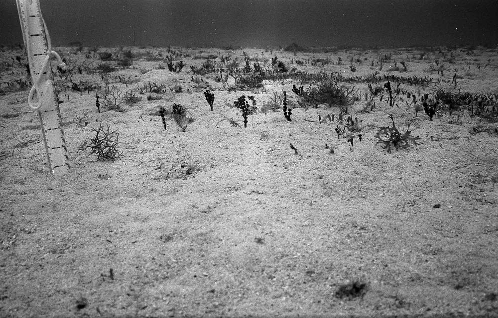{.lightbox group="discovery-bay-1966" description="**UUID: **6b9aae7e-8983-4649-ad66-d80e49b96ac7 **Date: **1966-12-27 **Location: **Jamaica | Discovery Bay | Algal Plots **Longitude: **77.414ºW **Latitude: **18.473ºN **Photographer: **Eileen Graham **Copyright: **Trustees of the Natural History Museum (London, UK), CC-BY-4.0" alt="**UUID: **6b9aae7e-8983-4649-ad66-d80e49b96ac7 **Date: **1966-12-27 **Location: **Jamaica | Discovery Bay | Algal Plots **Longitude: **77.414ºW **Latitude: **18.473ºN **Photographer: **Eileen Graham **Copyright: **Trustees of the Natural History Museum (London, UK), CC-BY-4.0"}

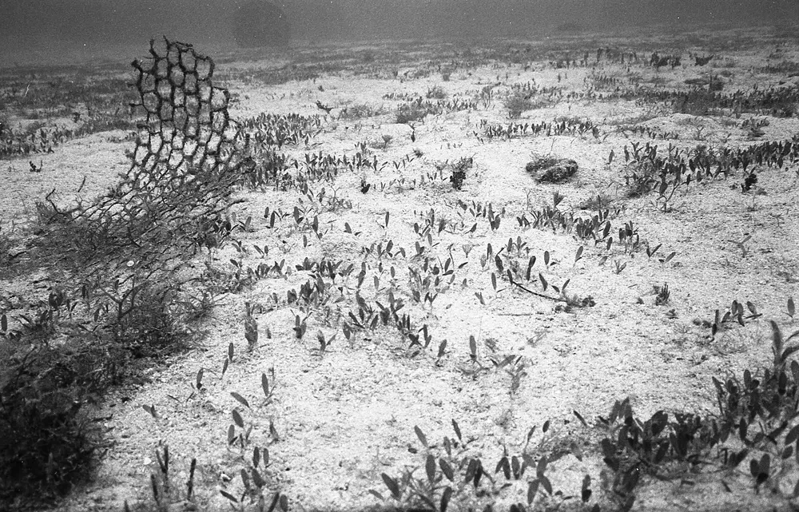{.lightbox group="discovery-bay-1966" description="**UUID: **69fda7c9-c1a8-4204-a0da-66c9c3af4978 **Date: **1966-12-27 **Location: **Jamaica | Discovery Bay | Algal Plots **Longitude: **77.414ºW **Latitude: **18.473ºN **Photographer: **Eileen Graham **Copyright: **Trustees of the Natural History Museum (London, UK), CC-BY-4.0" alt="**UUID: **69fda7c9-c1a8-4204-a0da-66c9c3af4978 **Date: **1966-12-27 **Location: **Jamaica | Discovery Bay | Algal Plots **Longitude: **77.414ºW **Latitude: **18.473ºN **Photographer: **Eileen Graham **Copyright: **Trustees of the Natural History Museum (London, UK), CC-BY-4.0"}

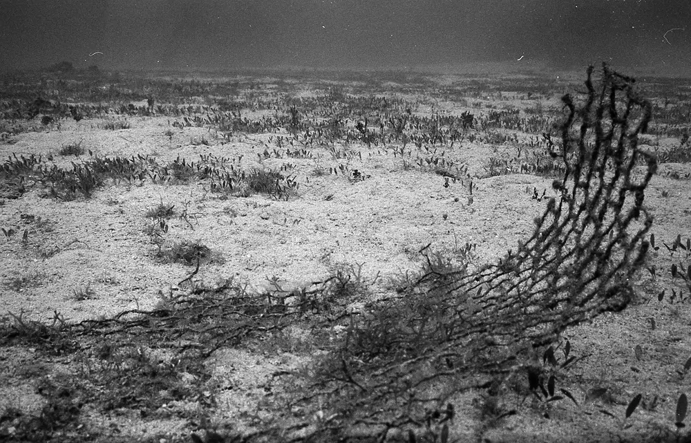{.lightbox group="discovery-bay-1966" description="**UUID: **6697e355-f3aa-41cd-820b-44d5ddc2d827 **Date: **1966-12-27 **Location: **Jamaica | Discovery Bay | Algal Plots **Longitude: **77.414ºW **Latitude: **18.473ºN **Photographer: **Eileen Graham **Copyright: **Trustees of the Natural History Museum (London, UK), CC-BY-4.0" alt="**UUID: **6697e355-f3aa-41cd-820b-44d5ddc2d827 **Date: **1966-12-27 **Location: **Jamaica | Discovery Bay | Algal Plots **Longitude: **77.414ºW **Latitude: **18.473ºN **Photographer: **Eileen Graham **Copyright: **Trustees of the Natural History Museum (London, UK), CC-BY-4.0"}

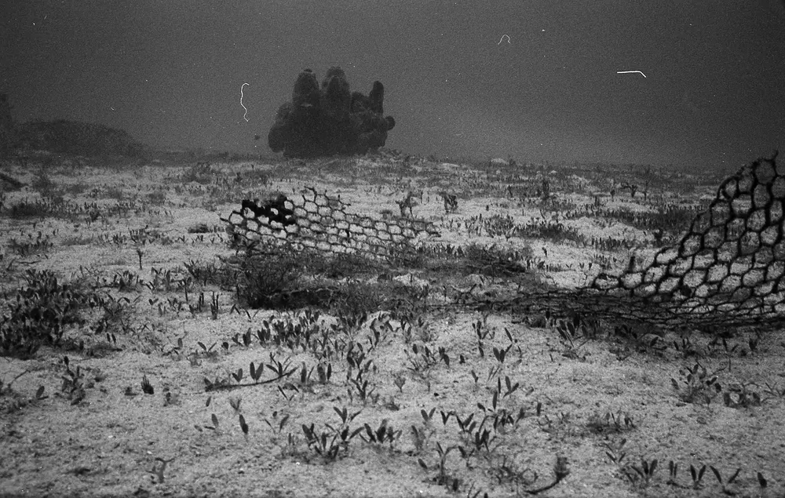{.lightbox group="discovery-bay-1966" description="**UUID: **21feaffa-941f-42d8-bb50-21e167a348d5 **Date: **1966-12-27 **Location: **Jamaica | Discovery Bay | Algal Plots **Longitude: **77.414ºW **Latitude: **18.473ºN **Photographer: **Eileen Graham **Copyright: **Trustees of the Natural History Museum (London, UK), CC-BY-4.0" alt="**UUID: **21feaffa-941f-42d8-bb50-21e167a348d5 **Date: **1966-12-27 **Location: **Jamaica | Discovery Bay | Algal Plots **Longitude: **77.414ºW **Latitude: **18.473ºN **Photographer: **Eileen Graham **Copyright: **Trustees of the Natural History Museum (London, UK), CC-BY-4.0"}

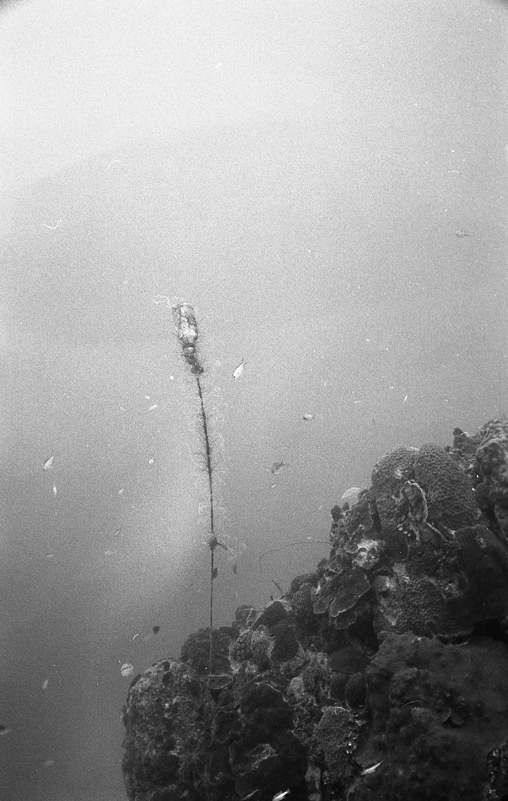{.lightbox group="discovery-bay-1966" description="**UUID: **82c4b9a8-7fef-4190-a24a-a0bf6a745aab **Date: **1966-12-27 **Location: **Jamaica | Discovery Bay | Buoy Upper Slope **Longitude: **77.40908ºW **Latitude: **18.47322ºN **Photographer: **Eileen Graham **Copyright: **Trustees of the Natural History Museum (London, UK), CC-BY-4.0" alt="**UUID: **82c4b9a8-7fef-4190-a24a-a0bf6a745aab **Date: **1966-12-27 **Location: **Jamaica | Discovery Bay | Buoy Upper Slope **Longitude: **77.40908ºW **Latitude: **18.47322ºN **Photographer: **Eileen Graham **Copyright: **Trustees of the Natural History Museum (London, UK), CC-BY-4.0"}

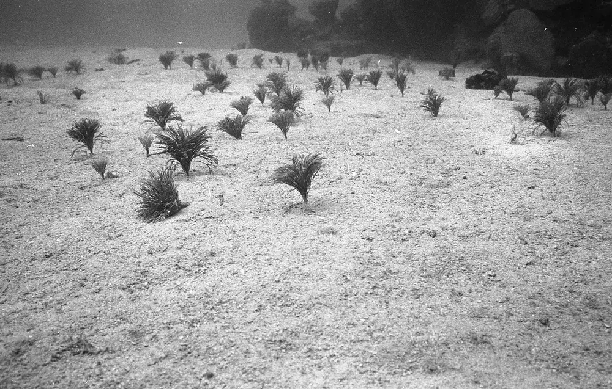{.lightbox group="discovery-bay-1966" description="**UUID: **a1d5c2be-8707-41ad-bd56-64986aa60c0d **Date: **1966-12-27 **Location: **Jamaica | Discovery Bay | Algal Plots **Longitude: **77.414ºW **Latitude: **18.473ºN **Photographer: **Eileen Graham **Copyright: **Trustees of the Natural History Museum (London, UK), CC-BY-4.0" alt="**UUID: **a1d5c2be-8707-41ad-bd56-64986aa60c0d **Date: **1966-12-27 **Location: **Jamaica | Discovery Bay | Algal Plots **Longitude: **77.414ºW **Latitude: **18.473ºN **Photographer: **Eileen Graham **Copyright: **Trustees of the Natural History Museum (London, UK), CC-BY-4.0"}

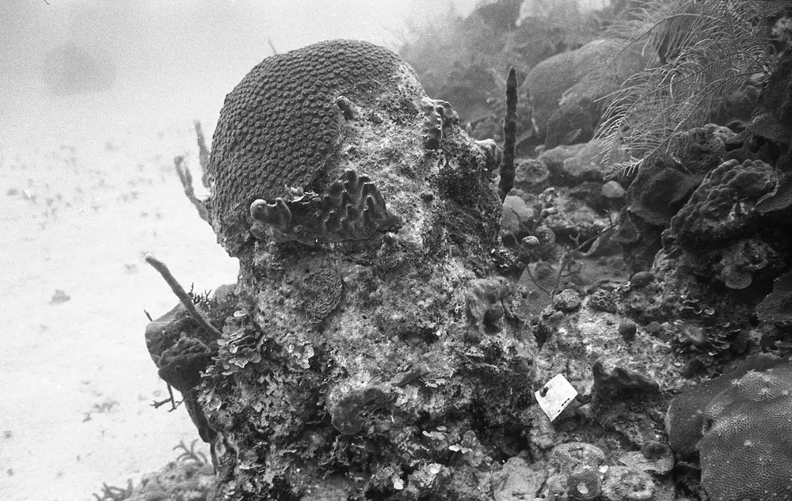{.lightbox group="discovery-bay-1966" description="**UUID: **312c498b-0e58-4869-8766-bff0af08927d **Date: **1966-12-27 **Location: **Jamaica | Discovery Bay | Buoy Upper Slope **Longitude: **77.40908ºW **Latitude: **18.47322ºN **Photographer: **Eileen Graham **Copyright: **Trustees of the Natural History Museum (London, UK), CC-BY-4.0" alt="**UUID: **312c498b-0e58-4869-8766-bff0af08927d **Date: **1966-12-27 **Location: **Jamaica | Discovery Bay | Buoy Upper Slope **Longitude: **77.40908ºW **Latitude: **18.47322ºN **Photographer: **Eileen Graham **Copyright: **Trustees of the Natural History Museum (London, UK), CC-BY-4.0"}

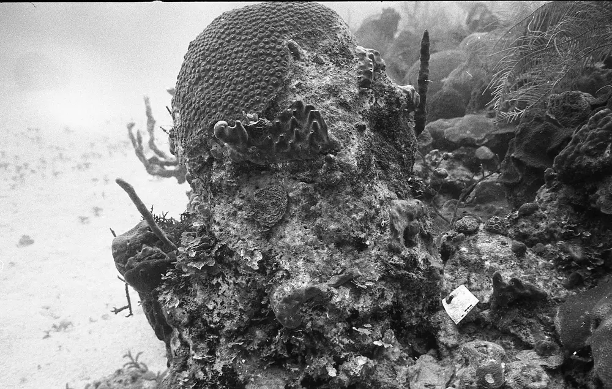{.lightbox group="discovery-bay-1966" description="**UUID: **b4d6cc24-46be-4e81-af08-2ec4c5919738 **Date: **1966-12-27 **Location: **Jamaica | Discovery Bay | Buoy Upper Slope **Longitude: **77.40908ºW **Latitude: **18.47322ºN **Photographer: **Eileen Graham **Copyright: **Trustees of the Natural History Museum (London, UK), CC-BY-4.0" alt="**UUID: **b4d6cc24-46be-4e81-af08-2ec4c5919738 **Date: **1966-12-27 **Location: **Jamaica | Discovery Bay | Buoy Upper Slope **Longitude: **77.40908ºW **Latitude: **18.47322ºN **Photographer: **Eileen Graham **Copyright: **Trustees of the Natural History Museum (London, UK), CC-BY-4.0"}

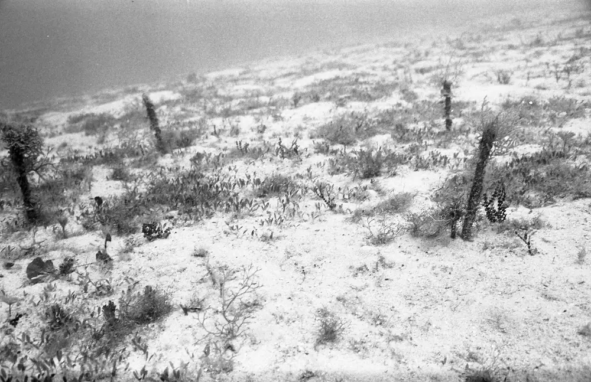{.lightbox group="discovery-bay-1966" description="**UUID: **835fecee-2d43-4487-9241-80e9582be585 **Date: **1967-01-13 **Location: **Jamaica | Discovery Bay | Algal Plots **Longitude: **77.414ºW **Latitude: **18.473ºN **Photographer: **Eileen Graham **Copyright: **Trustees of the Natural History Museum (London, UK), CC-BY-4.0" alt="**UUID: **835fecee-2d43-4487-9241-80e9582be585 **Date: **1967-01-13 **Location: **Jamaica | Discovery Bay | Algal Plots **Longitude: **77.414ºW **Latitude: **18.473ºN **Photographer: **Eileen Graham **Copyright: **Trustees of the Natural History Museum (London, UK), CC-BY-4.0"}

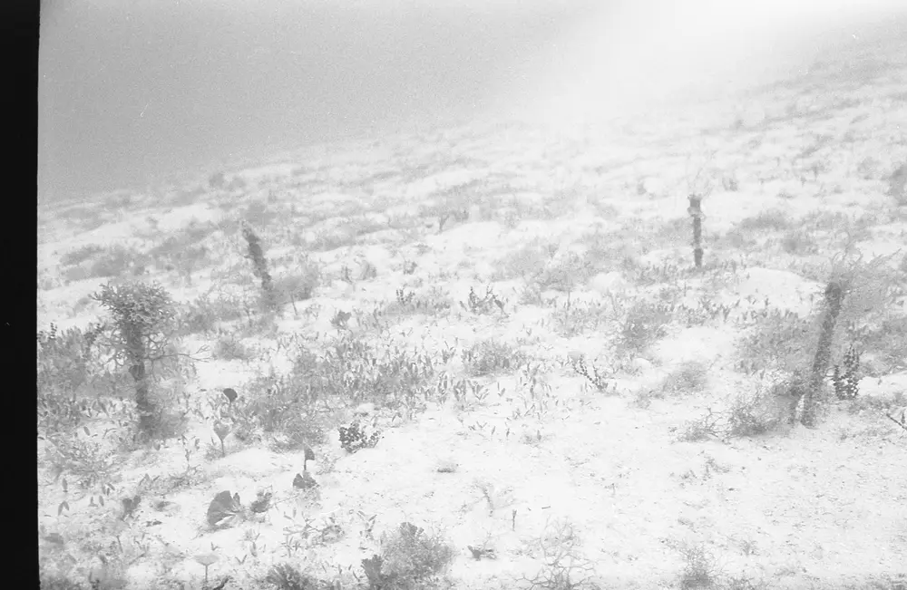{.lightbox group="discovery-bay-1966" description="**UUID: **d147ee74-ebdc-46aa-91dc-764f1f82ccb2 **Date: **1967-01-13 **Location: **Jamaica | Discovery Bay | Algal Plots **Longitude: **77.414ºW **Latitude: **18.473ºN **Photographer: **Eileen Graham **Copyright: **Trustees of the Natural History Museum (London, UK), CC-BY-4.0" alt="**UUID: **d147ee74-ebdc-46aa-91dc-764f1f82ccb2 **Date: **1967-01-13 **Location: **Jamaica | Discovery Bay | Algal Plots **Longitude: **77.414ºW **Latitude: **18.473ºN **Photographer: **Eileen Graham **Copyright: **Trustees of the Natural History Museum (London, UK), CC-BY-4.0"}

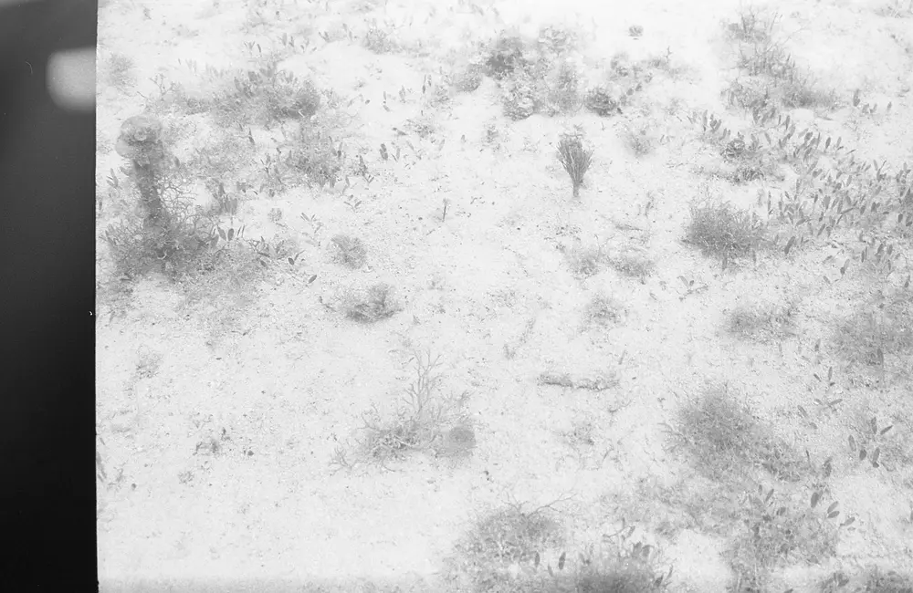{.lightbox group="discovery-bay-1966" description="**UUID: **2eba467a-2826-4e86-9f0b-cf40ef74303f **Date: **1967-01-13 **Location: **Jamaica | Discovery Bay | Algal Plots **Longitude: **77.414ºW **Latitude: **18.473ºN **Photographer: **Eileen Graham **Copyright: **Trustees of the Natural History Museum (London, UK), CC-BY-4.0" alt="**UUID: **2eba467a-2826-4e86-9f0b-cf40ef74303f **Date: **1967-01-13 **Location: **Jamaica | Discovery Bay | Algal Plots **Longitude: **77.414ºW **Latitude: **18.473ºN **Photographer: **Eileen Graham **Copyright: **Trustees of the Natural History Museum (London, UK), CC-BY-4.0"}

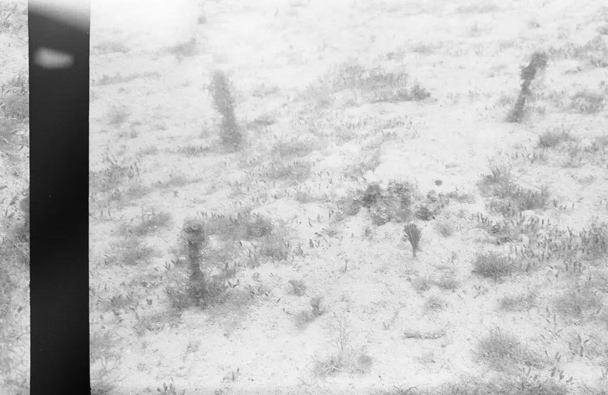{.lightbox group="discovery-bay-1966" description="**UUID: **93a9db18-ee8a-4ad5-94fe-6bff6d1662fe **Date: **1967-01-13 **Location: **Jamaica | Discovery Bay | Algal Plots **Longitude: **77.414ºW **Latitude: **18.473ºN **Photographer: **Eileen Graham **Copyright: **Trustees of the Natural History Museum (London, UK), CC-BY-4.0" alt="**UUID: **93a9db18-ee8a-4ad5-94fe-6bff6d1662fe **Date: **1967-01-13 **Location: **Jamaica | Discovery Bay | Algal Plots **Longitude: **77.414ºW **Latitude: **18.473ºN **Photographer: **Eileen Graham **Copyright: **Trustees of the Natural History Museum (London, UK), CC-BY-4.0"}

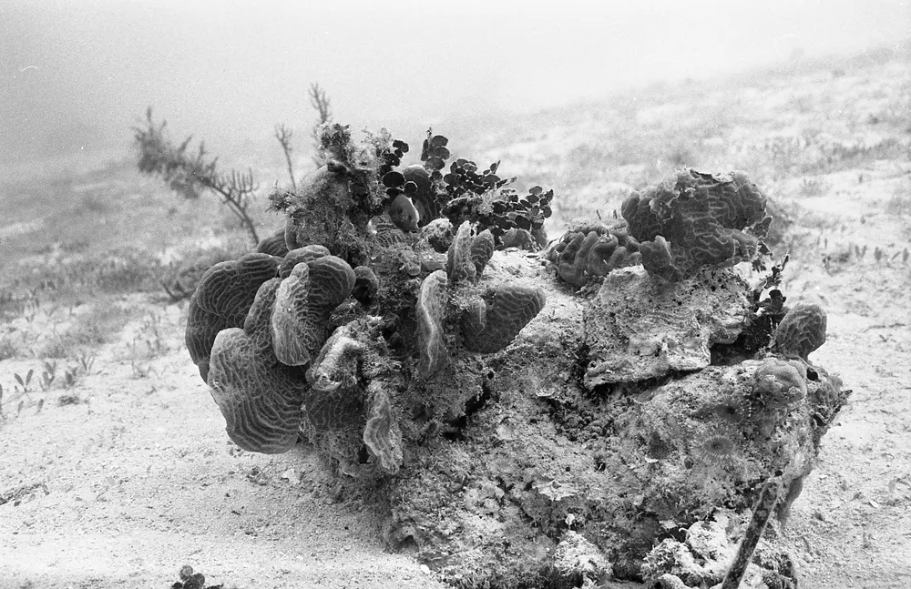{.lightbox group="discovery-bay-1966" description="**UUID: **a820ca53-d308-4d6b-8017-a039a85451e6 **Date: **1967-01-13 **Location: **Jamaica | Discovery Bay | Algal Plots **Longitude: **77.414ºW **Latitude: **18.473ºN **Photographer: **Eileen Graham **Copyright: **Trustees of the Natural History Museum (London, UK), CC-BY-4.0" alt="**UUID: **a820ca53-d308-4d6b-8017-a039a85451e6 **Date: **1967-01-13 **Location: **Jamaica | Discovery Bay | Algal Plots **Longitude: **77.414ºW **Latitude: **18.473ºN **Photographer: **Eileen Graham **Copyright: **Trustees of the Natural History Museum (London, UK), CC-BY-4.0"}

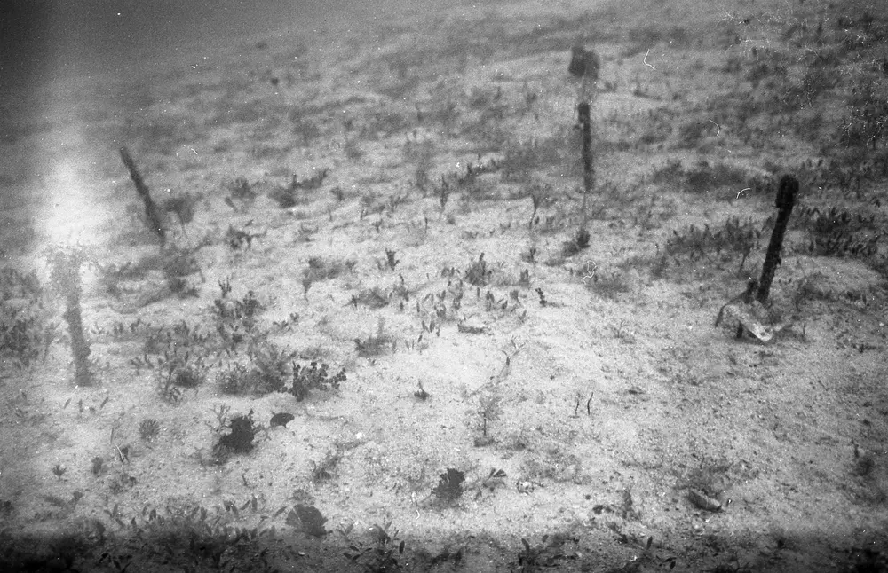{.lightbox group="discovery-bay-1966" description="**UUID: **7f1b64b2-84f8-486a-9141-07ce66611737 **Date: **1967-01-13 **Location: **Jamaica | Discovery Bay | Algal Plots **Longitude: **77.414ºW **Latitude: **18.473ºN **Photographer: **Eileen Graham **Copyright: **Trustees of the Natural History Museum (London, UK), CC-BY-4.0" alt="**UUID: **7f1b64b2-84f8-486a-9141-07ce66611737 **Date: **1967-01-13 **Location: **Jamaica | Discovery Bay | Algal Plots **Longitude: **77.414ºW **Latitude: **18.473ºN **Photographer: **Eileen Graham **Copyright: **Trustees of the Natural History Museum (London, UK), CC-BY-4.0"}

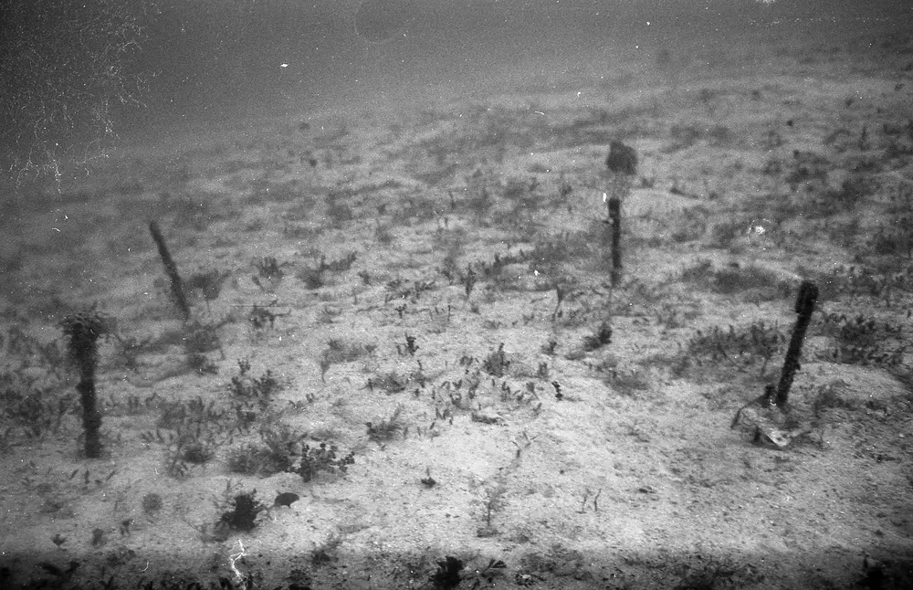{.lightbox group="discovery-bay-1966" description="**UUID: **f4d38d24-88ed-4197-9887-11c68db9005f **Date: **1967-01-13 **Location: **Jamaica | Discovery Bay | Algal Plots **Longitude: **77.414ºW **Latitude: **18.473ºN **Photographer: **Eileen Graham **Copyright: **Trustees of the Natural History Museum (London, UK), CC-BY-4.0" alt="**UUID: **f4d38d24-88ed-4197-9887-11c68db9005f **Date: **1967-01-13 **Location: **Jamaica | Discovery Bay | Algal Plots **Longitude: **77.414ºW **Latitude: **18.473ºN **Photographer: **Eileen Graham **Copyright: **Trustees of the Natural History Museum (London, UK), CC-BY-4.0"}

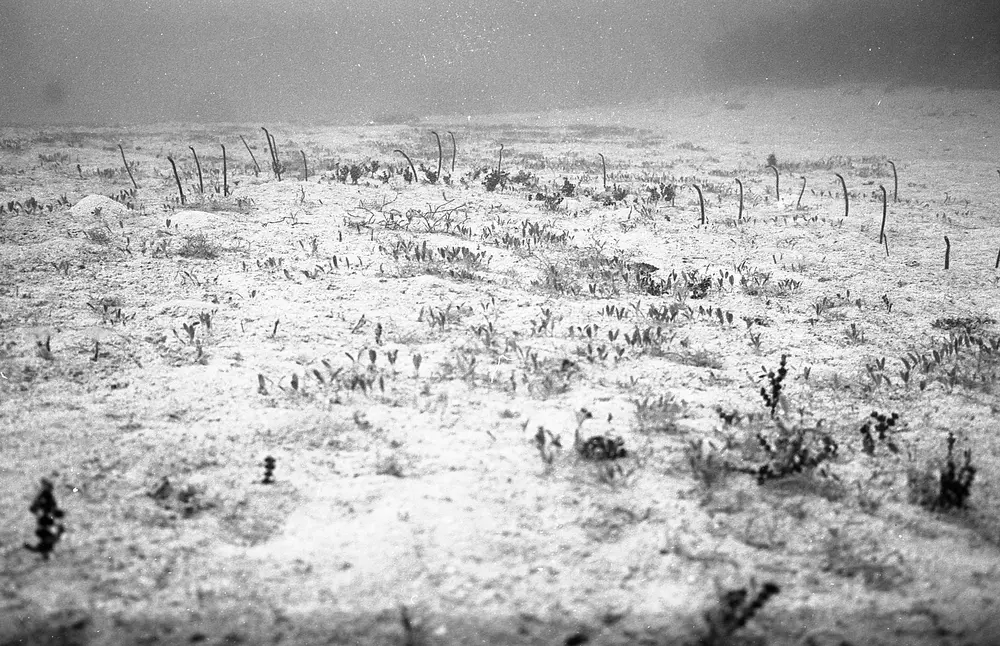{.lightbox group="discovery-bay-1966" description="**UUID: **f242de97-9e32-439e-b44d-67ab676634cd **Date: **1967-01-13 **Location: **Jamaica | Discovery Bay | Algal Plots **Longitude: **77.414ºW **Latitude: **18.473ºN **Photographer: **Eileen Graham **Copyright: **Trustees of the Natural History Museum (London, UK), CC-BY-4.0" alt="**UUID: **f242de97-9e32-439e-b44d-67ab676634cd **Date: **1967-01-13 **Location: **Jamaica | Discovery Bay | Algal Plots **Longitude: **77.414ºW **Latitude: **18.473ºN **Photographer: **Eileen Graham **Copyright: **Trustees of the Natural History Museum (London, UK), CC-BY-4.0"}

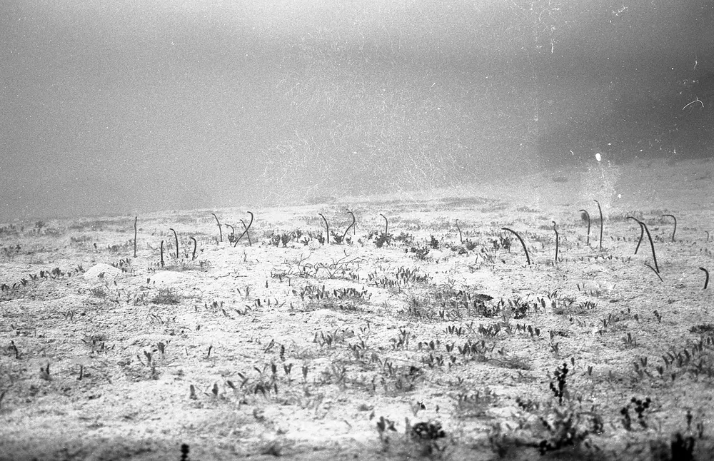{.lightbox group="discovery-bay-1966" description="**UUID: **b8ebc3b9-a37b-4260-9b10-dc4fb81752e3 **Date: **1967-01-13 **Location: **Jamaica | Discovery Bay | Algal Plots **Longitude: **77.414ºW **Latitude: **18.473ºN **Photographer: **Eileen Graham **Copyright: **Trustees of the Natural History Museum (London, UK), CC-BY-4.0" alt="**UUID: **b8ebc3b9-a37b-4260-9b10-dc4fb81752e3 **Date: **1967-01-13 **Location: **Jamaica | Discovery Bay | Algal Plots **Longitude: **77.414ºW **Latitude: **18.473ºN **Photographer: **Eileen Graham **Copyright: **Trustees of the Natural History Museum (London, UK), CC-BY-4.0"}

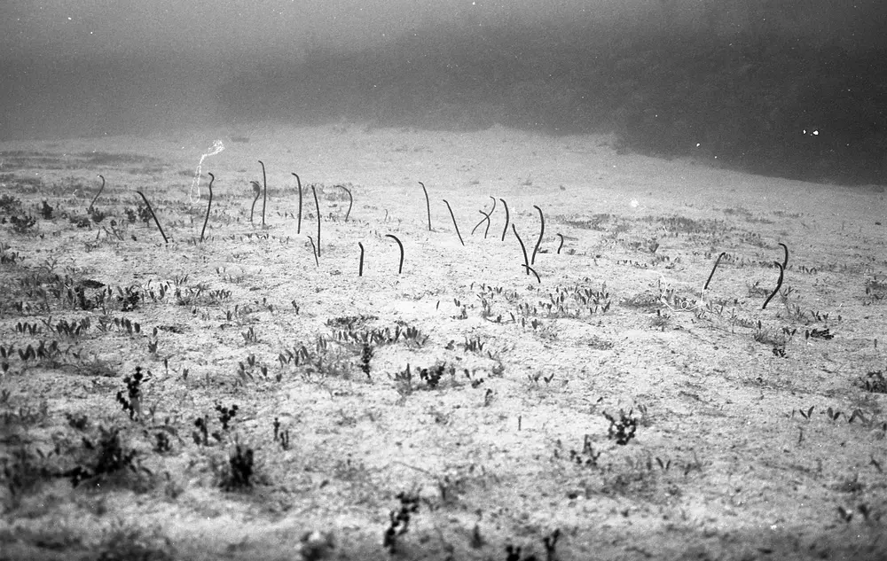{.lightbox group="discovery-bay-1966" description="**UUID: **66ef9fdb-2201-4bc5-b7b0-467ff02c6f2d **Date: **1967-01-13 **Location: **Jamaica | Discovery Bay | Algal Plots **Longitude: **77.414ºW **Latitude: **18.473ºN **Photographer: **Eileen Graham **Copyright: **Trustees of the Natural History Museum (London, UK), CC-BY-4.0" alt="**UUID: **66ef9fdb-2201-4bc5-b7b0-467ff02c6f2d **Date: **1967-01-13 **Location: **Jamaica | Discovery Bay | Algal Plots **Longitude: **77.414ºW **Latitude: **18.473ºN **Photographer: **Eileen Graham **Copyright: **Trustees of the Natural History Museum (London, UK), CC-BY-4.0"}

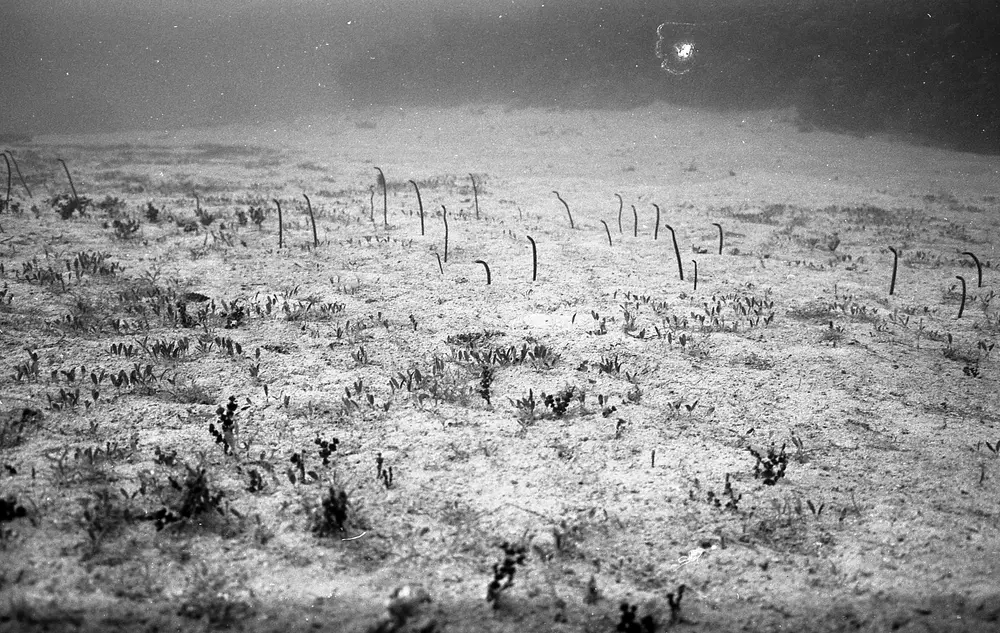{.lightbox group="discovery-bay-1966" description="**UUID: **6283047f-0ec3-4b62-a1d4-81bacb7a762e **Date: **1967-01-13 **Location: **Jamaica | Discovery Bay | Algal Plots **Longitude: **77.414ºW **Latitude: **18.473ºN **Photographer: **Eileen Graham **Copyright: **Trustees of the Natural History Museum (London, UK), CC-BY-4.0" alt="**UUID: **6283047f-0ec3-4b62-a1d4-81bacb7a762e **Date: **1967-01-13 **Location: **Jamaica | Discovery Bay | Algal Plots **Longitude: **77.414ºW **Latitude: **18.473ºN **Photographer: **Eileen Graham **Copyright: **Trustees of the Natural History Museum (London, UK), CC-BY-4.0"}

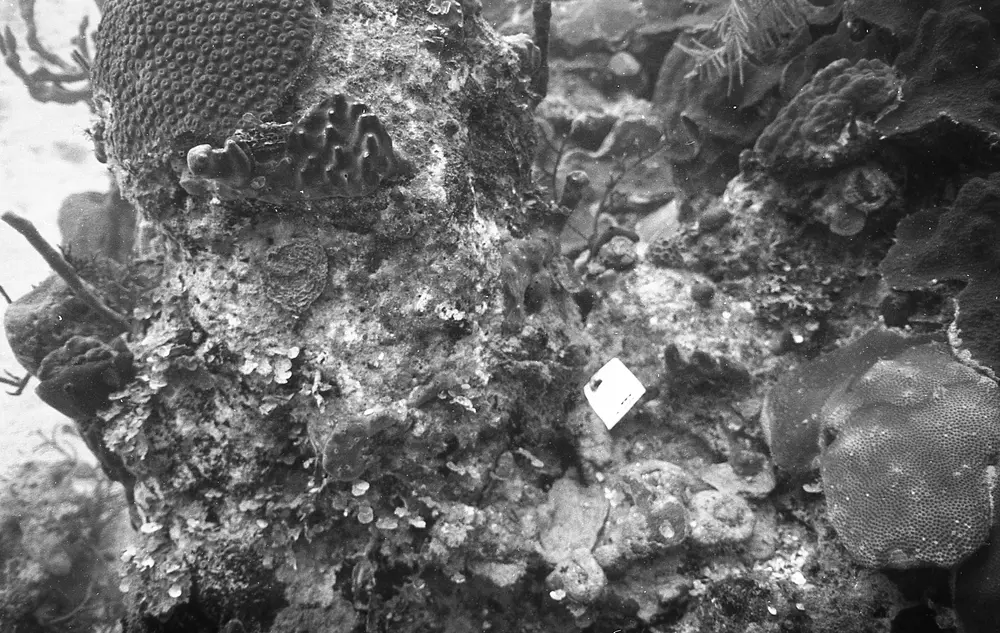{.lightbox group="discovery-bay-1966" description="**UUID: **6d92dbf8-bf81-4e2c-9f9a-f893402716d1 **Date: **1967-01-13 **Location: **Jamaica | Discovery Bay | Buoy Upper Slope **Longitude: **77.40908ºW **Latitude: **18.47322ºN **Photographer: **Eileen Graham **Copyright: **Trustees of the Natural History Museum (London, UK), CC-BY-4.0" alt="**UUID: **6d92dbf8-bf81-4e2c-9f9a-f893402716d1 **Date: **1967-01-13 **Location: **Jamaica | Discovery Bay | Buoy Upper Slope **Longitude: **77.40908ºW **Latitude: **18.47322ºN **Photographer: **Eileen Graham **Copyright: **Trustees of the Natural History Museum (London, UK), CC-BY-4.0"}

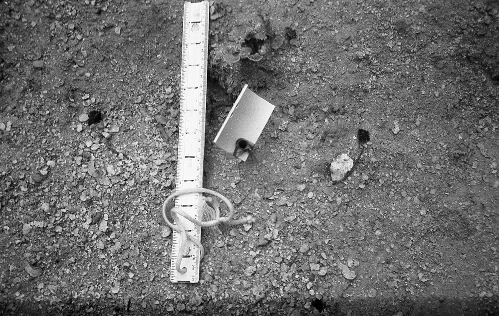{.lightbox group="discovery-bay-1966" description="**UUID: **efcbc669-25ad-4261-94ad-25c4285b3854 **Date: **1967-01-13 **Location: **Jamaica | Discovery Bay | Algal Plots **Longitude: **77.414ºW **Latitude: **18.473ºN **Photographer: **Eileen Graham **Copyright: **Trustees of the Natural History Museum (London, UK), CC-BY-4.0" alt="**UUID: **efcbc669-25ad-4261-94ad-25c4285b3854 **Date: **1967-01-13 **Location: **Jamaica | Discovery Bay | Algal Plots **Longitude: **77.414ºW **Latitude: **18.473ºN **Photographer: **Eileen Graham **Copyright: **Trustees of the Natural History Museum (London, UK), CC-BY-4.0"}

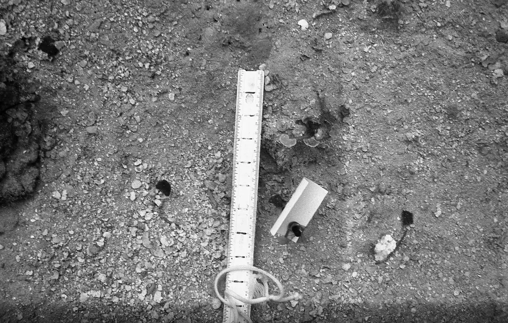{.lightbox group="discovery-bay-1966" description="**UUID: **781f8eef-355a-4176-bf94-7e923ec14668 **Date: **1967-01-13 **Location: **Jamaica | Discovery Bay | Algal Plots **Longitude: **77.414ºW **Latitude: **18.473ºN **Photographer: **Eileen Graham **Copyright: **Trustees of the Natural History Museum (London, UK), CC-BY-4.0" alt="**UUID: **781f8eef-355a-4176-bf94-7e923ec14668 **Date: **1967-01-13 **Location: **Jamaica | Discovery Bay | Algal Plots **Longitude: **77.414ºW **Latitude: **18.473ºN **Photographer: **Eileen Graham **Copyright: **Trustees of the Natural History Museum (London, UK), CC-BY-4.0"}

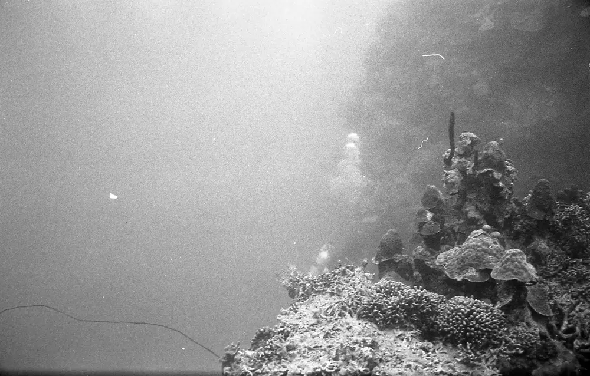{.lightbox group="discovery-bay-1966" description="**UUID: **ce97c2ef-4f90-4abe-8f01-d3c5e372b245 **Date: **1966-12-06 **Location: **Jamaica | Discovery Bay | Eaton Hall **Longitude: **77.334ºW **Latitude: **18.467ºN **Photographer: **Eileen Graham **Copyright: **Trustees of the Natural History Museum (London, UK), CC-BY-4.0" alt="**UUID: **ce97c2ef-4f90-4abe-8f01-d3c5e372b245 **Date: **1966-12-06 **Location: **Jamaica | Discovery Bay | Eaton Hall **Longitude: **77.334ºW **Latitude: **18.467ºN **Photographer: **Eileen Graham **Copyright: **Trustees of the Natural History Museum (London, UK), CC-BY-4.0"}

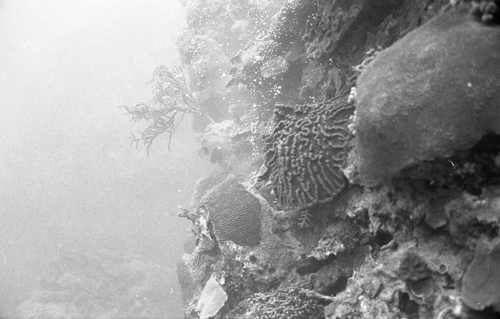{.lightbox group="discovery-bay-1966" description="**UUID: **c04570a5-b805-4caf-862f-37f9b3e76915 **Date: **1966-12-06 **Location: **Jamaica | Discovery Bay | Eaton Hall **Longitude: **77.334ºW **Latitude: **18.467ºN **Photographer: **Eileen Graham **Copyright: **Trustees of the Natural History Museum (London, UK), CC-BY-4.0" alt="**UUID: **c04570a5-b805-4caf-862f-37f9b3e76915 **Date: **1966-12-06 **Location: **Jamaica | Discovery Bay | Eaton Hall **Longitude: **77.334ºW **Latitude: **18.467ºN **Photographer: **Eileen Graham **Copyright: **Trustees of the Natural History Museum (London, UK), CC-BY-4.0"}

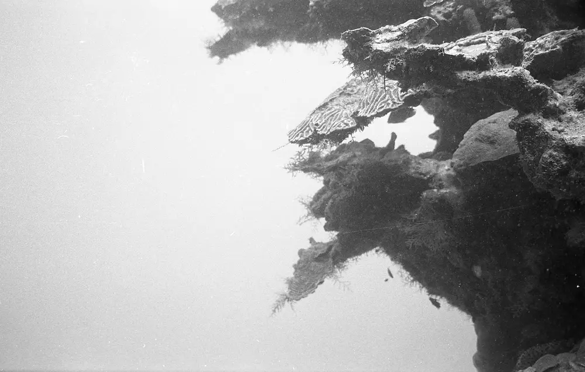{.lightbox group="discovery-bay-1966" description="**UUID: **5df2b44e-c2b5-4803-84eb-3736df689787 **Date: **1966-12-06 **Location: **Jamaica | Discovery Bay | Eaton Hall **Longitude: **77.334ºW **Latitude: **18.467ºN **Photographer: **Eileen Graham **Copyright: **Trustees of the Natural History Museum (London, UK), CC-BY-4.0" alt="**UUID: **5df2b44e-c2b5-4803-84eb-3736df689787 **Date: **1966-12-06 **Location: **Jamaica | Discovery Bay | Eaton Hall **Longitude: **77.334ºW **Latitude: **18.467ºN **Photographer: **Eileen Graham **Copyright: **Trustees of the Natural History Museum (London, UK), CC-BY-4.0"}

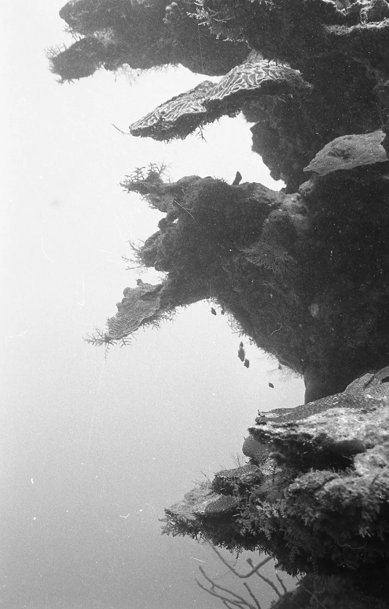{.lightbox group="discovery-bay-1966" description="**UUID: **80fee278-7ab3-4b47-8914-7fee85256268 **Date: **1966-12-06 **Location: **Jamaica | Discovery Bay | Eaton Hall **Longitude: **77.334ºW **Latitude: **18.467ºN **Photographer: **Eileen Graham **Copyright: **Trustees of the Natural History Museum (London, UK), CC-BY-4.0" alt="**UUID: **80fee278-7ab3-4b47-8914-7fee85256268 **Date: **1966-12-06 **Location: **Jamaica | Discovery Bay | Eaton Hall **Longitude: **77.334ºW **Latitude: **18.467ºN **Photographer: **Eileen Graham **Copyright: **Trustees of the Natural History Museum (London, UK), CC-BY-4.0"}

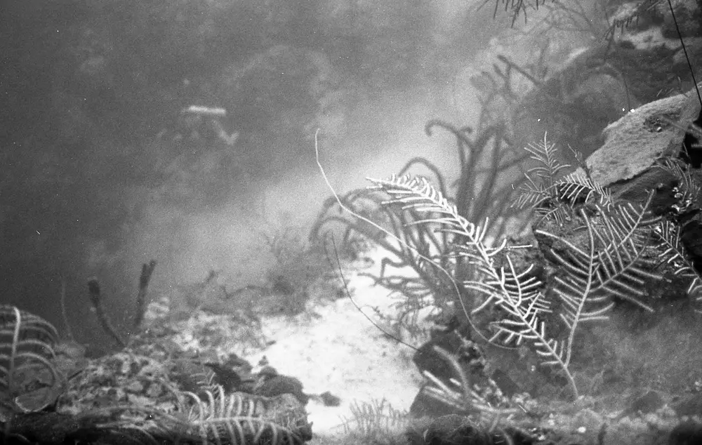{.lightbox group="discovery-bay-1966" description="**UUID: **f447d184-269f-43cc-8a8d-089041075724 **Date: **1967-01-14 **Location: **Jamaica | Discovery Bay | Buoy Deep **Longitude: **77.40908ºW **Latitude: **18.47325ºN **Photographer: **Eileen Graham **Copyright: **Trustees of the Natural History Museum (London, UK), CC-BY-4.0" alt="**UUID: **f447d184-269f-43cc-8a8d-089041075724 **Date: **1967-01-14 **Location: **Jamaica | Discovery Bay | Buoy Deep **Longitude: **77.40908ºW **Latitude: **18.47325ºN **Photographer: **Eileen Graham **Copyright: **Trustees of the Natural History Museum (London, UK), CC-BY-4.0"}

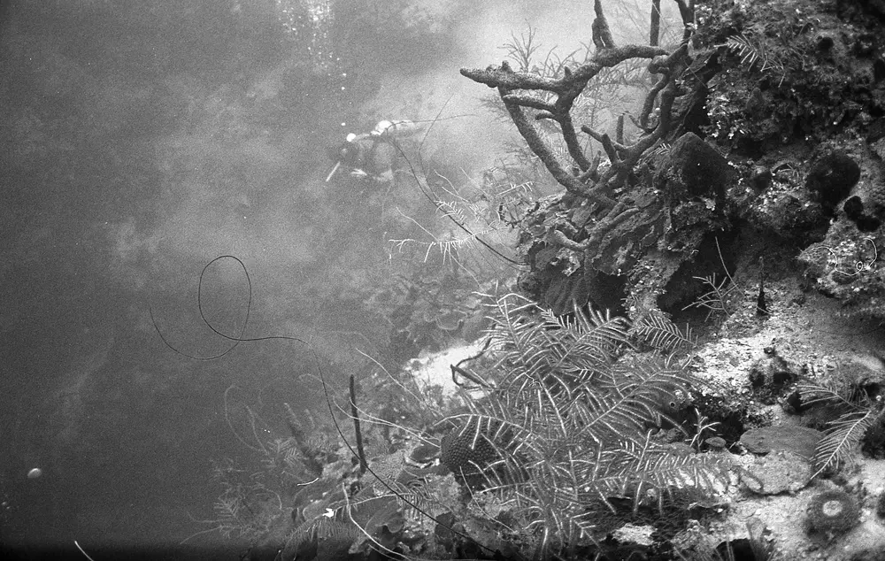{.lightbox group="discovery-bay-1966" description="**UUID: **2403fa2b-59a4-4b63-8706-07080dad9544 **Date: **1967-01-14 **Location: **Jamaica | Discovery Bay | Buoy Deep **Longitude: **77.40908ºW **Latitude: **18.47325ºN **Photographer: **Eileen Graham **Copyright: **Trustees of the Natural History Museum (London, UK), CC-BY-4.0" alt="**UUID: **2403fa2b-59a4-4b63-8706-07080dad9544 **Date: **1967-01-14 **Location: **Jamaica | Discovery Bay | Buoy Deep **Longitude: **77.40908ºW **Latitude: **18.47325ºN **Photographer: **Eileen Graham **Copyright: **Trustees of the Natural History Museum (London, UK), CC-BY-4.0"}

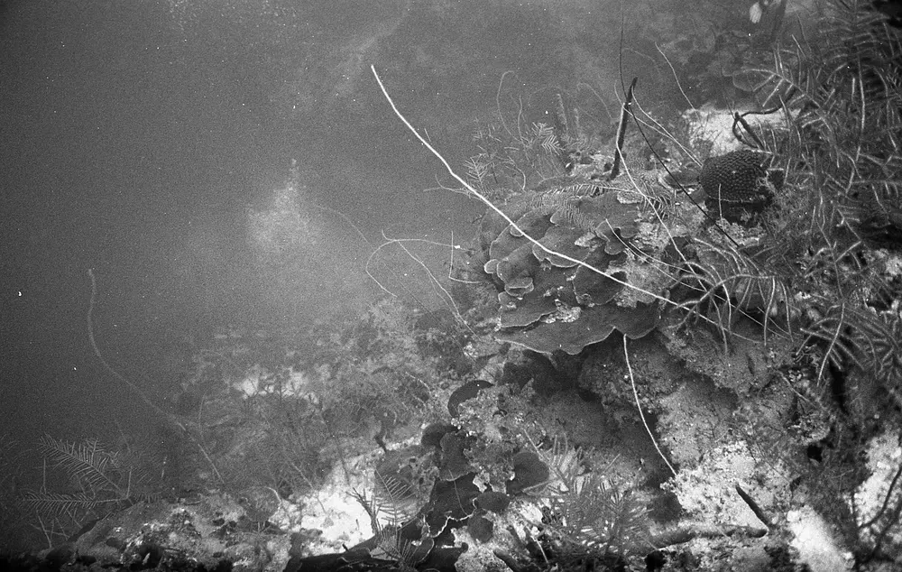{.lightbox group="discovery-bay-1966" description="**UUID: **5521bdc9-a937-4ef6-b0c2-22c91a7d4f49 **Date: **1967-01-14 **Location: **Jamaica | Discovery Bay | Buoy Deep **Longitude: **77.40908ºW **Latitude: **18.47325ºN **Photographer: **Eileen Graham **Copyright: **Trustees of the Natural History Museum (London, UK), CC-BY-4.0" alt="**UUID: **5521bdc9-a937-4ef6-b0c2-22c91a7d4f49 **Date: **1967-01-14 **Location: **Jamaica | Discovery Bay | Buoy Deep **Longitude: **77.40908ºW **Latitude: **18.47325ºN **Photographer: **Eileen Graham **Copyright: **Trustees of the Natural History Museum (London, UK), CC-BY-4.0"}

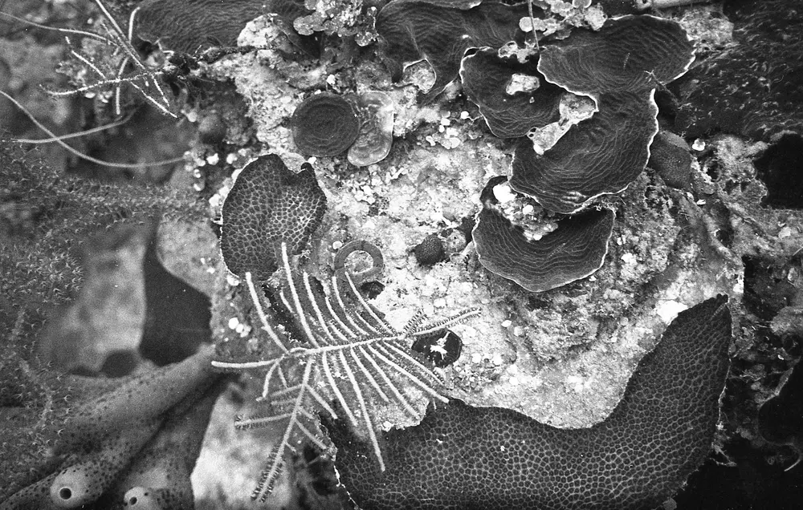{.lightbox group="discovery-bay-1966" description="**UUID: **2370c0d8-ce09-406a-b7af-283c3c6b99d5 **Date: **1967-01-14 **Location: **Jamaica | Discovery Bay | Buoy Deep **Longitude: **77.40908ºW **Latitude: **18.47325ºN **Photographer: **Eileen Graham **Copyright: **Trustees of the Natural History Museum (London, UK), CC-BY-4.0" alt="**UUID: **2370c0d8-ce09-406a-b7af-283c3c6b99d5 **Date: **1967-01-14 **Location: **Jamaica | Discovery Bay | Buoy Deep **Longitude: **77.40908ºW **Latitude: **18.47325ºN **Photographer: **Eileen Graham **Copyright: **Trustees of the Natural History Museum (London, UK), CC-BY-4.0"}

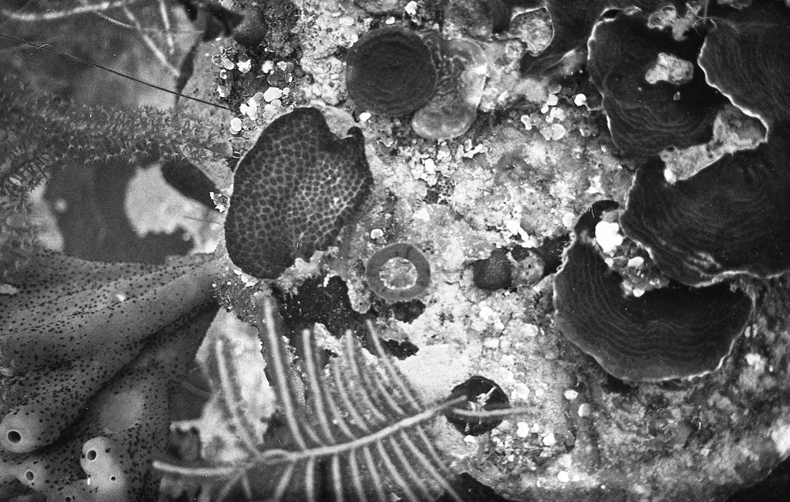{.lightbox group="discovery-bay-1966" description="**UUID: **8a16aa1e-4a62-4e5b-9c9e-205550c6ede9 **Date: **1967-01-14 **Location: **Jamaica | Discovery Bay | Buoy Deep **Longitude: **77.40908ºW **Latitude: **18.47325ºN **Photographer: **Eileen Graham **Copyright: **Trustees of the Natural History Museum (London, UK), CC-BY-4.0" alt="**UUID: **8a16aa1e-4a62-4e5b-9c9e-205550c6ede9 **Date: **1967-01-14 **Location: **Jamaica | Discovery Bay | Buoy Deep **Longitude: **77.40908ºW **Latitude: **18.47325ºN **Photographer: **Eileen Graham **Copyright: **Trustees of the Natural History Museum (London, UK), CC-BY-4.0"}

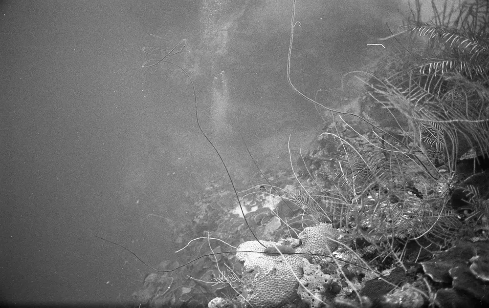{.lightbox group="discovery-bay-1966" description="**UUID: **f65ffdb1-793a-4786-93f5-49d03cface03 **Date: **1967-01-14 **Location: **Jamaica | Discovery Bay | Buoy Deep **Longitude: **77.40908ºW **Latitude: **18.47325ºN **Photographer: **Eileen Graham **Copyright: **Trustees of the Natural History Museum (London, UK), CC-BY-4.0" alt="**UUID: **f65ffdb1-793a-4786-93f5-49d03cface03 **Date: **1967-01-14 **Location: **Jamaica | Discovery Bay | Buoy Deep **Longitude: **77.40908ºW **Latitude: **18.47325ºN **Photographer: **Eileen Graham **Copyright: **Trustees of the Natural History Museum (London, UK), CC-BY-4.0"}

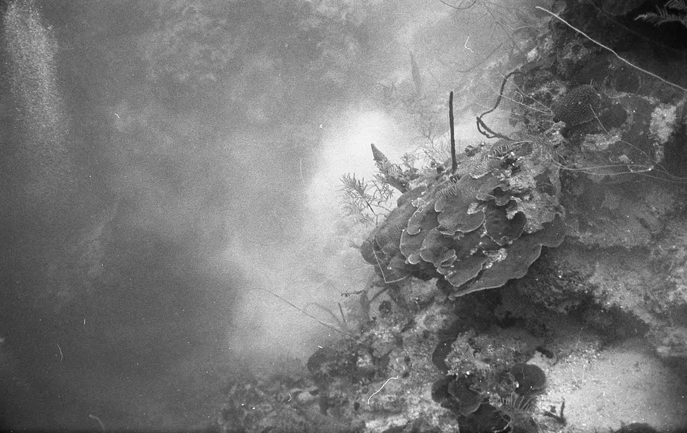{.lightbox group="discovery-bay-1966" description="**UUID: **bf3c7948-ffe1-4928-8407-2985f00bbaa0 **Date: **1967-01-14 **Location: **Jamaica | Discovery Bay | Buoy Deep **Longitude: **77.40908ºW **Latitude: **18.47325ºN **Photographer: **Eileen Graham **Copyright: **Trustees of the Natural History Museum (London, UK), CC-BY-4.0" alt="**UUID: **bf3c7948-ffe1-4928-8407-2985f00bbaa0 **Date: **1967-01-14 **Location: **Jamaica | Discovery Bay | Buoy Deep **Longitude: **77.40908ºW **Latitude: **18.47325ºN **Photographer: **Eileen Graham **Copyright: **Trustees of the Natural History Museum (London, UK), CC-BY-4.0"}

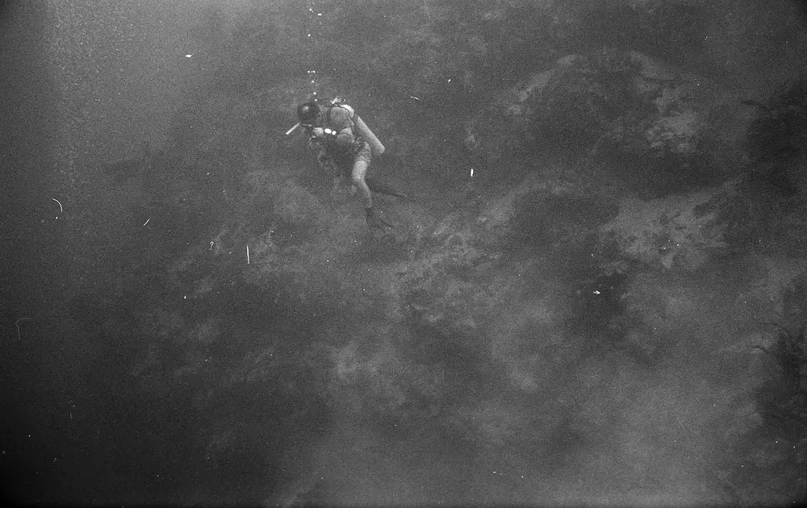{.lightbox group="discovery-bay-1966" description="**UUID: **5cde55b5-e789-4085-b9a6-b8357bd6087a **Date: **1967-01-14 **Location: **Jamaica | Discovery Bay | Buoy Deep **Longitude: **77.40908ºW **Latitude: **18.47325ºN **Photographer: **Eileen Graham **Copyright: **Trustees of the Natural History Museum (London, UK), CC-BY-4.0" alt="**UUID: **5cde55b5-e789-4085-b9a6-b8357bd6087a **Date: **1967-01-14 **Location: **Jamaica | Discovery Bay | Buoy Deep **Longitude: **77.40908ºW **Latitude: **18.47325ºN **Photographer: **Eileen Graham **Copyright: **Trustees of the Natural History Museum (London, UK), CC-BY-4.0"}

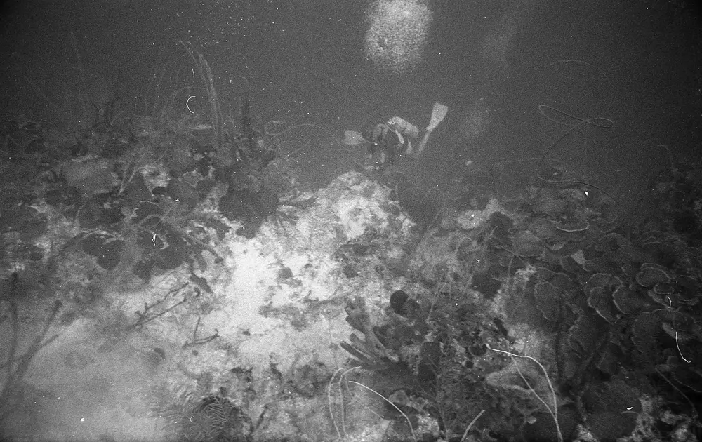{.lightbox group="discovery-bay-1966" description="**UUID: **5b4bb700-0192-437c-8cfc-27f017912286 **Date: **1967-01-14 **Location: **Jamaica | Discovery Bay | Buoy Deep **Longitude: **77.40908ºW **Latitude: **18.47325ºN **Photographer: **Eileen Graham **Copyright: **Trustees of the Natural History Museum (London, UK), CC-BY-4.0" alt="**UUID: **5b4bb700-0192-437c-8cfc-27f017912286 **Date: **1967-01-14 **Location: **Jamaica | Discovery Bay | Buoy Deep **Longitude: **77.40908ºW **Latitude: **18.47325ºN **Photographer: **Eileen Graham **Copyright: **Trustees of the Natural History Museum (London, UK), CC-BY-4.0"}

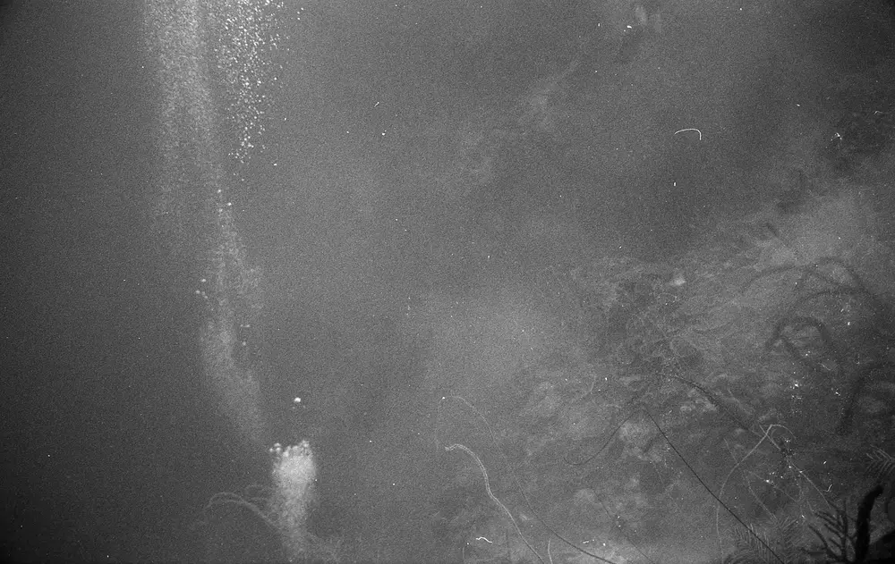{.lightbox group="discovery-bay-1966" description="**UUID: **78845ca7-9d8b-463a-bef4-1f8514a1ec07 **Date: **1967-01-14 **Location: **Jamaica | Discovery Bay | Buoy Deep **Longitude: **77.40908ºW **Latitude: **18.47325ºN **Photographer: **Eileen Graham **Copyright: **Trustees of the Natural History Museum (London, UK), CC-BY-4.0" alt="**UUID: **78845ca7-9d8b-463a-bef4-1f8514a1ec07 **Date: **1967-01-14 **Location: **Jamaica | Discovery Bay | Buoy Deep **Longitude: **77.40908ºW **Latitude: **18.47325ºN **Photographer: **Eileen Graham **Copyright: **Trustees of the Natural History Museum (London, UK), CC-BY-4.0"}

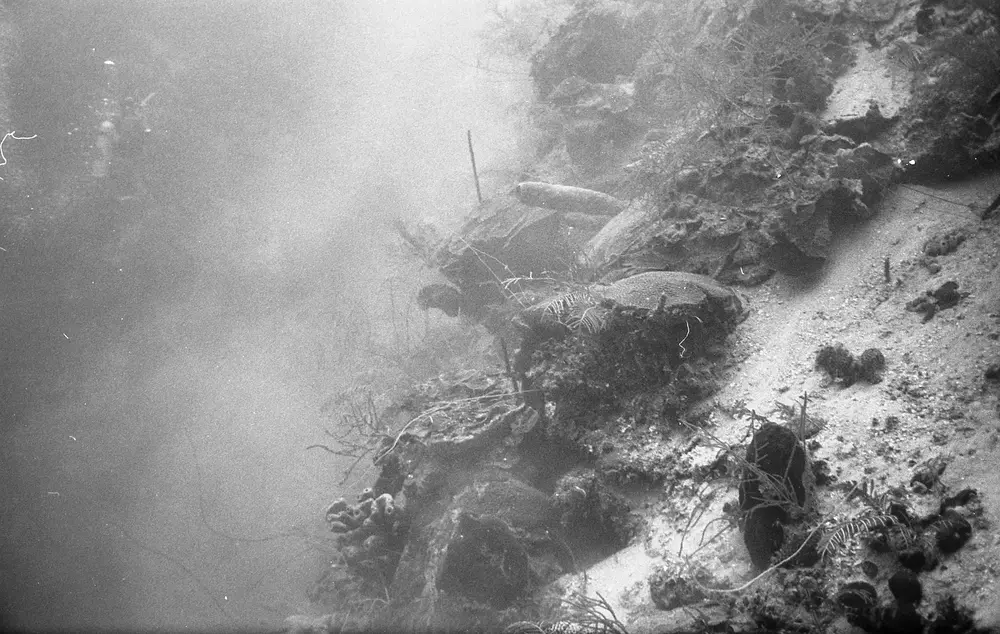{.lightbox group="discovery-bay-1966" description="**UUID: **11c5c2f8-6f36-429c-b7be-518e7296bb41 **Date: **1967-01-14 **Location: **Jamaica | Discovery Bay | Buoy Deep **Longitude: **77.40908ºW **Latitude: **18.47325ºN **Photographer: **Eileen Graham **Copyright: **Trustees of the Natural History Museum (London, UK), CC-BY-4.0" alt="**UUID: **11c5c2f8-6f36-429c-b7be-518e7296bb41 **Date: **1967-01-14 **Location: **Jamaica | Discovery Bay | Buoy Deep **Longitude: **77.40908ºW **Latitude: **18.47325ºN **Photographer: **Eileen Graham **Copyright: **Trustees of the Natural History Museum (London, UK), CC-BY-4.0"}

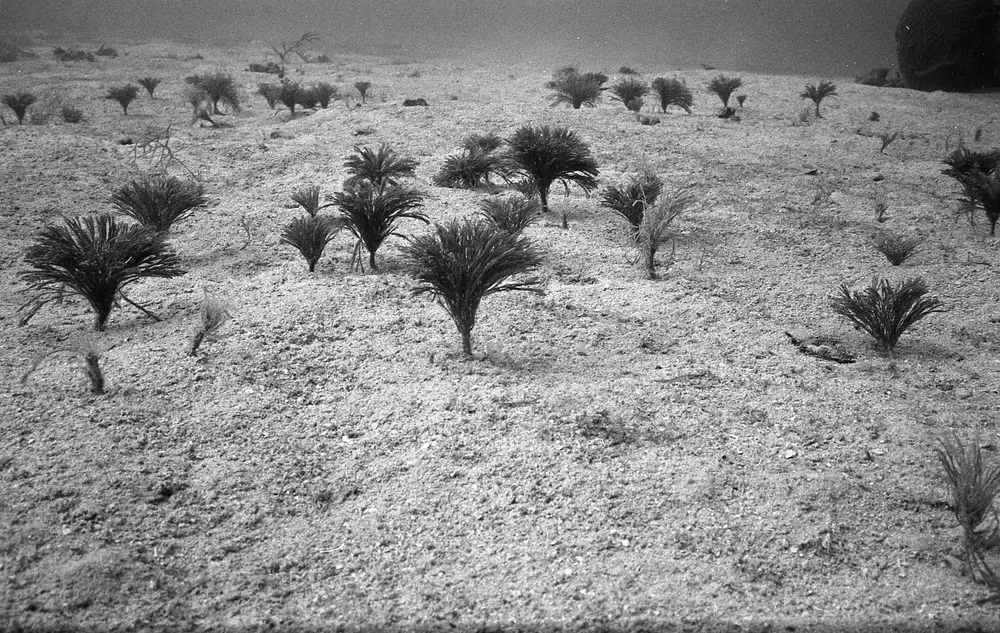{.lightbox group="discovery-bay-1966" description="**UUID: **f63d19fe-ea2a-4a51-a1cc-cf013229269d **Date: **1967-01-14 **Location: **Jamaica | Discovery Bay | Algal Plots **Longitude: **77.414ºW **Latitude: **18.473ºN **Photographer: **Eileen Graham **Copyright: **Trustees of the Natural History Museum (London, UK), CC-BY-4.0" alt="**UUID: **f63d19fe-ea2a-4a51-a1cc-cf013229269d **Date: **1967-01-14 **Location: **Jamaica | Discovery Bay | Algal Plots **Longitude: **77.414ºW **Latitude: **18.473ºN **Photographer: **Eileen Graham **Copyright: **Trustees of the Natural History Museum (London, UK), CC-BY-4.0"}

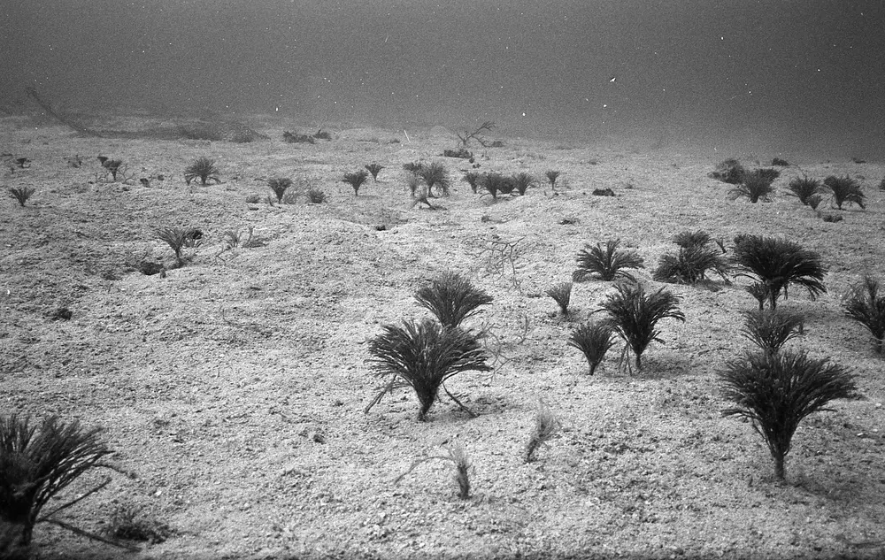{.lightbox group="discovery-bay-1966" description="**UUID: **75a2ae46-6b33-4042-a198-dbd6ea08ead1 **Date: **1967-01-14 **Location: **Jamaica | Discovery Bay | Algal Plots **Longitude: **77.414ºW **Latitude: **18.473ºN **Photographer: **Eileen Graham **Copyright: **Trustees of the Natural History Museum (London, UK), CC-BY-4.0" alt="**UUID: **75a2ae46-6b33-4042-a198-dbd6ea08ead1 **Date: **1967-01-14 **Location: **Jamaica | Discovery Bay | Algal Plots **Longitude: **77.414ºW **Latitude: **18.473ºN **Photographer: **Eileen Graham **Copyright: **Trustees of the Natural History Museum (London, UK), CC-BY-4.0"}

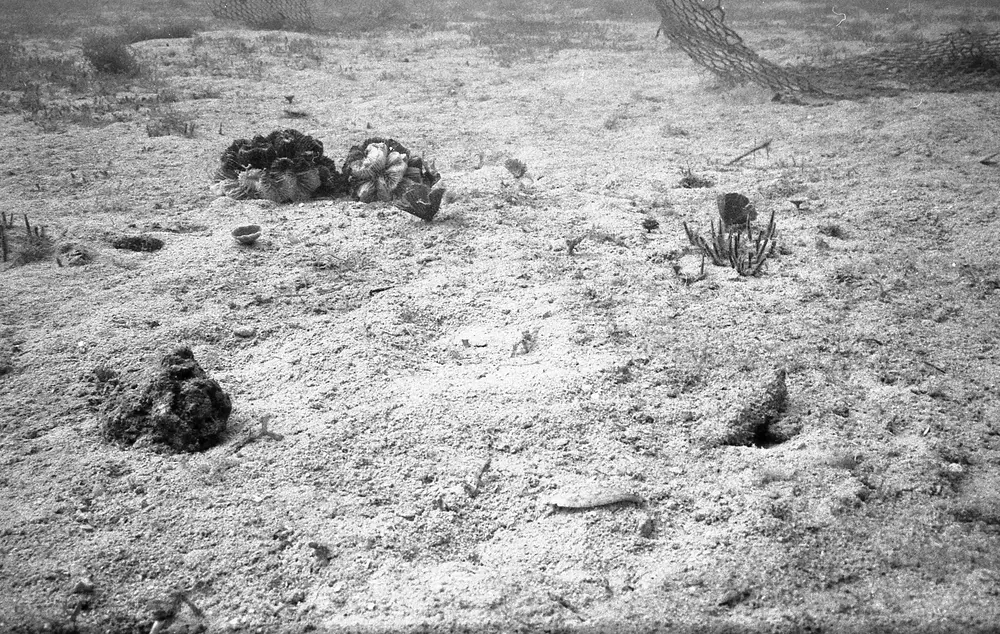{.lightbox group="discovery-bay-1966" description="**UUID: **cefbc2a5-d964-40e4-af39-1642ef466d5b **Date: **1967-01-14 **Location: **Jamaica | Discovery Bay | Algal Plots **Longitude: **77.414ºW **Latitude: **18.473ºN **Photographer: **Eileen Graham **Copyright: **Trustees of the Natural History Museum (London, UK), CC-BY-4.0" alt="**UUID: **cefbc2a5-d964-40e4-af39-1642ef466d5b **Date: **1967-01-14 **Location: **Jamaica | Discovery Bay | Algal Plots **Longitude: **77.414ºW **Latitude: **18.473ºN **Photographer: **Eileen Graham **Copyright: **Trustees of the Natural History Museum (London, UK), CC-BY-4.0"}

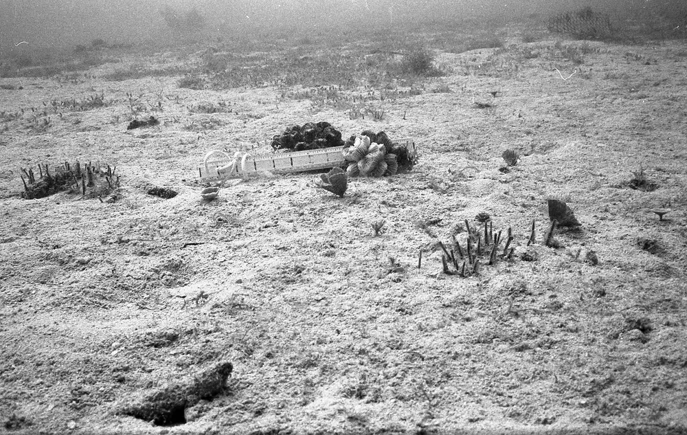{.lightbox group="discovery-bay-1966" description="**UUID: **5d2a8033-6f90-43e0-8184-89a75f6126bb **Date: **1967-01-14 **Location: **Jamaica | Discovery Bay | Algal Plots **Longitude: **77.414ºW **Latitude: **18.473ºN **Photographer: **Eileen Graham **Copyright: **Trustees of the Natural History Museum (London, UK), CC-BY-4.0" alt="**UUID: **5d2a8033-6f90-43e0-8184-89a75f6126bb **Date: **1967-01-14 **Location: **Jamaica | Discovery Bay | Algal Plots **Longitude: **77.414ºW **Latitude: **18.473ºN **Photographer: **Eileen Graham **Copyright: **Trustees of the Natural History Museum (London, UK), CC-BY-4.0"}

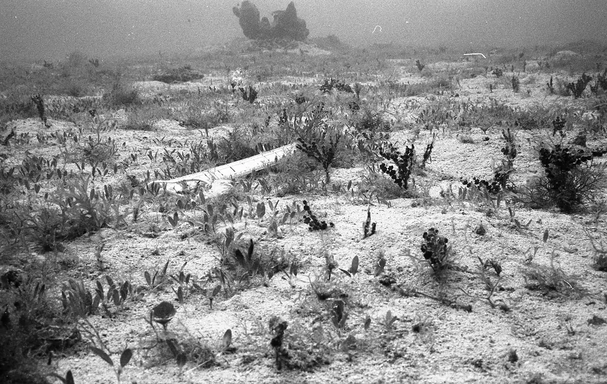{.lightbox group="discovery-bay-1966" description="**UUID: **6dbe39f4-11ca-4f10-8bcb-f5d530af4629 **Date: **1967-01-14 **Location: **Jamaica | Discovery Bay | Algal Plots **Longitude: **77.414ºW **Latitude: **18.473ºN **Photographer: **Eileen Graham **Copyright: **Trustees of the Natural History Museum (London, UK), CC-BY-4.0" alt="**UUID: **6dbe39f4-11ca-4f10-8bcb-f5d530af4629 **Date: **1967-01-14 **Location: **Jamaica | Discovery Bay | Algal Plots **Longitude: **77.414ºW **Latitude: **18.473ºN **Photographer: **Eileen Graham **Copyright: **Trustees of the Natural History Museum (London, UK), CC-BY-4.0"}

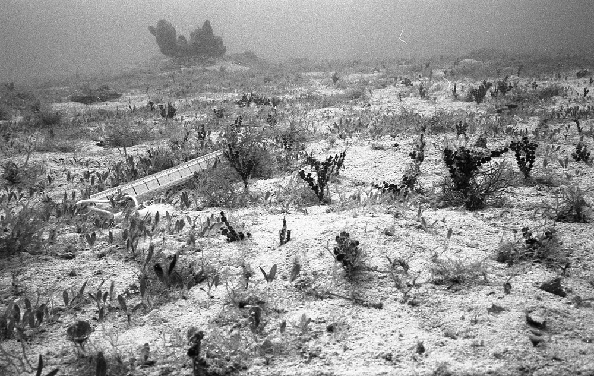{.lightbox group="discovery-bay-1966" description="**UUID: **61862deb-8c03-47ea-a22b-c05efccc2869 **Date: **1967-01-14 **Location: **Jamaica | Discovery Bay | Algal Plots **Longitude: **77.414ºW **Latitude: **18.473ºN **Photographer: **Eileen Graham **Copyright: **Trustees of the Natural History Museum (London, UK), CC-BY-4.0" alt="**UUID: **61862deb-8c03-47ea-a22b-c05efccc2869 **Date: **1967-01-14 **Location: **Jamaica | Discovery Bay | Algal Plots **Longitude: **77.414ºW **Latitude: **18.473ºN **Photographer: **Eileen Graham **Copyright: **Trustees of the Natural History Museum (London, UK), CC-BY-4.0"}

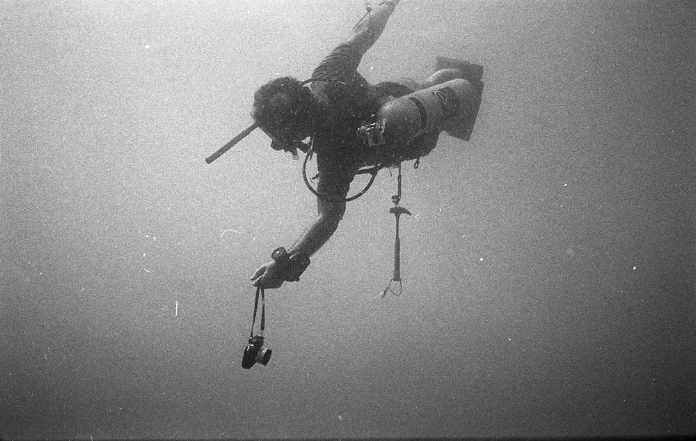{.lightbox group="discovery-bay-1966" description="**UUID: **dcb8039e-77c6-4c96-a077-3f14a85bf93d **Date: **1967-01-14 **Location: **Jamaica | Discovery Bay | Buoy Mooring (1960s) **Longitude: **77.40908ºW **Latitude: **18.47322ºN **Photographer: **Eileen Graham **Copyright: **Trustees of the Natural History Museum (London, UK), CC-BY-4.0" alt="**UUID: **dcb8039e-77c6-4c96-a077-3f14a85bf93d **Date: **1967-01-14 **Location: **Jamaica | Discovery Bay | Buoy Mooring (1960s) **Longitude: **77.40908ºW **Latitude: **18.47322ºN **Photographer: **Eileen Graham **Copyright: **Trustees of the Natural History Museum (London, UK), CC-BY-4.0"}

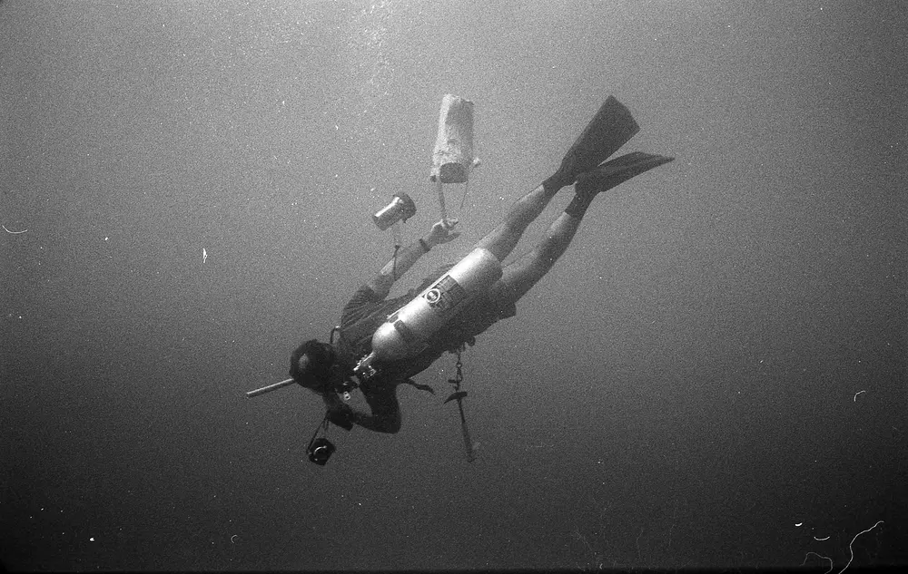{.lightbox group="discovery-bay-1966" description="**UUID: **0006d9b1-e74b-473c-b0c0-44e71c83d233 **Date: **1967-01-14 **Location: **Jamaica | Discovery Bay | Buoy Mooring (1960s) **Longitude: **77.40908ºW **Latitude: **18.47322ºN **Photographer: **Eileen Graham **Copyright: **Trustees of the Natural History Museum (London, UK), CC-BY-4.0" alt="**UUID: **0006d9b1-e74b-473c-b0c0-44e71c83d233 **Date: **1967-01-14 **Location: **Jamaica | Discovery Bay | Buoy Mooring (1960s) **Longitude: **77.40908ºW **Latitude: **18.47322ºN **Photographer: **Eileen Graham **Copyright: **Trustees of the Natural History Museum (London, UK), CC-BY-4.0"}

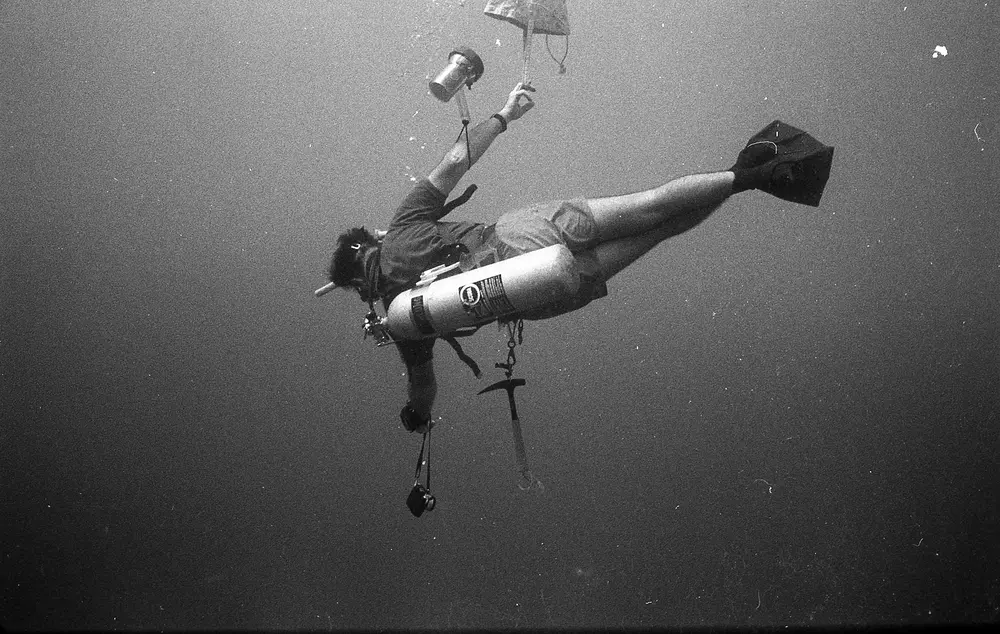{.lightbox group="discovery-bay-1966" description="**UUID: **341fc387-3e12-4e9b-ac06-0ec56338e731 **Date: **1967-01-14 **Location: **Jamaica | Discovery Bay | Buoy Mooring (1960s) **Longitude: **77.40908ºW **Latitude: **18.47322ºN **Photographer: **Eileen Graham **Copyright: **Trustees of the Natural History Museum (London, UK), CC-BY-4.0" alt="**UUID: **341fc387-3e12-4e9b-ac06-0ec56338e731 **Date: **1967-01-14 **Location: **Jamaica | Discovery Bay | Buoy Mooring (1960s) **Longitude: **77.40908ºW **Latitude: **18.47322ºN **Photographer: **Eileen Graham **Copyright: **Trustees of the Natural History Museum (London, UK), CC-BY-4.0"}

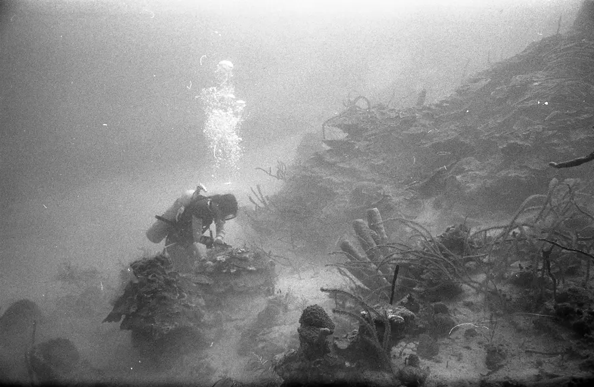{.lightbox group="discovery-bay-1966" description="**UUID: **09d5c55e-979c-4b38-89ed-f215223862bc **Date: **1967-01-18 **Location: **Jamaica | Discovery Bay | Buoy Upper Slope **Longitude: **77.40908ºW **Latitude: **18.47322ºN **Photographer: **Eileen Graham **Copyright: **Trustees of the Natural History Museum (London, UK), CC-BY-4.0" alt="**UUID: **09d5c55e-979c-4b38-89ed-f215223862bc **Date: **1967-01-18 **Location: **Jamaica | Discovery Bay | Buoy Upper Slope **Longitude: **77.40908ºW **Latitude: **18.47322ºN **Photographer: **Eileen Graham **Copyright: **Trustees of the Natural History Museum (London, UK), CC-BY-4.0"}

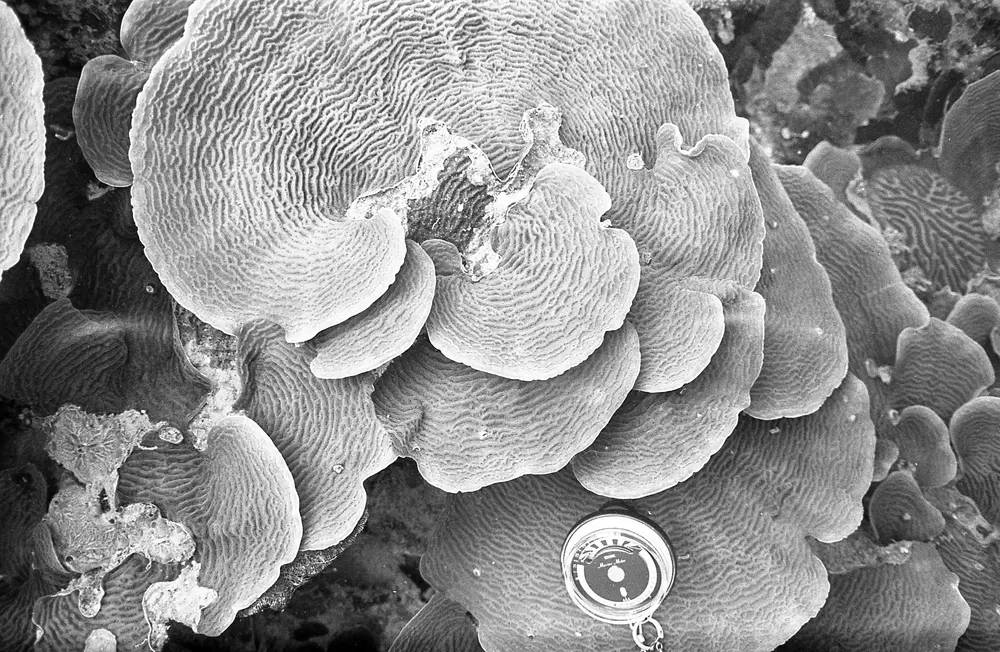{.lightbox group="discovery-bay-1966" description="**UUID: **aac599c6-5162-4b76-885d-3adc5ebb7604 **Date: **1967-01-18 **Location: **Jamaica | Discovery Bay | Buoy Upper Slope **Longitude: **77.40908ºW **Latitude: **18.47322ºN **Photographer: **Eileen Graham **Copyright: **Trustees of the Natural History Museum (London, UK), CC-BY-4.0" alt="**UUID: **aac599c6-5162-4b76-885d-3adc5ebb7604 **Date: **1967-01-18 **Location: **Jamaica | Discovery Bay | Buoy Upper Slope **Longitude: **77.40908ºW **Latitude: **18.47322ºN **Photographer: **Eileen Graham **Copyright: **Trustees of the Natural History Museum (London, UK), CC-BY-4.0"}

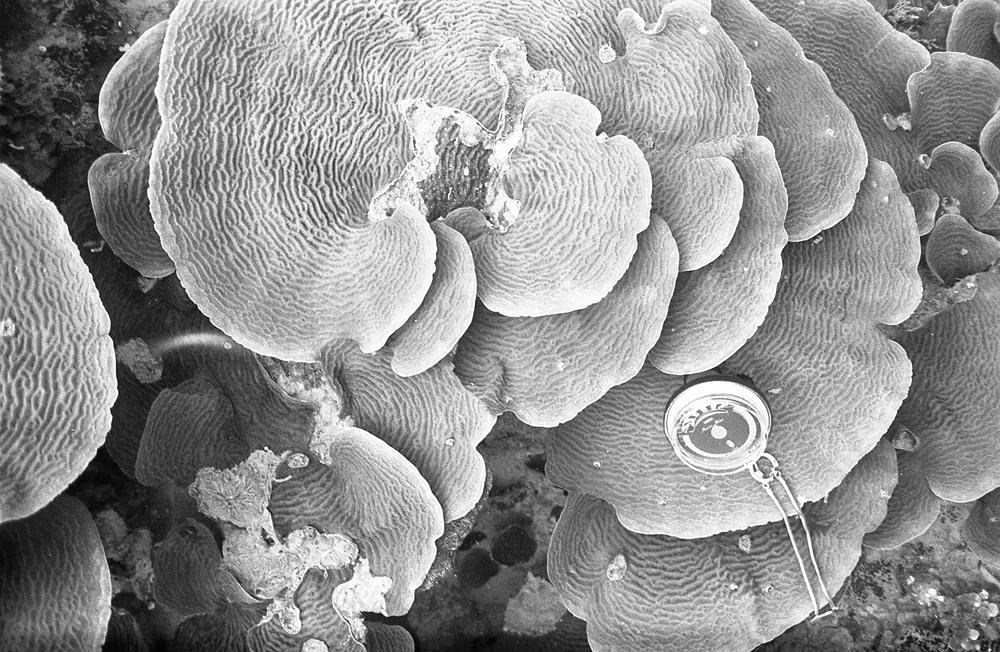{.lightbox group="discovery-bay-1966" description="**UUID: **19e56a4a-6d2f-416d-b211-c718c324e6de **Date: **1967-01-18 **Location: **Jamaica | Discovery Bay | Buoy Upper Slope **Longitude: **77.40908ºW **Latitude: **18.47322ºN **Photographer: **Eileen Graham **Copyright: **Trustees of the Natural History Museum (London, UK), CC-BY-4.0" alt="**UUID: **19e56a4a-6d2f-416d-b211-c718c324e6de **Date: **1967-01-18 **Location: **Jamaica | Discovery Bay | Buoy Upper Slope **Longitude: **77.40908ºW **Latitude: **18.47322ºN **Photographer: **Eileen Graham **Copyright: **Trustees of the Natural History Museum (London, UK), CC-BY-4.0"}

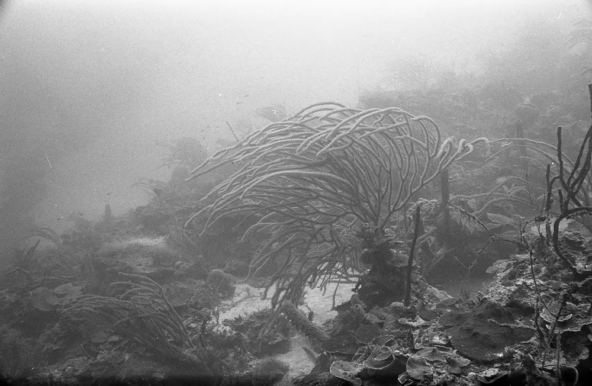{.lightbox group="discovery-bay-1966" description="**UUID: **af95d805-4eb1-4648-86c6-a4d6e3d7b818 **Date: **1967-01-18 **Location: **Jamaica | Discovery Bay | Buoy Upper Slope **Longitude: **77.40908ºW **Latitude: **18.47322ºN **Photographer: **Eileen Graham **Copyright: **Trustees of the Natural History Museum (London, UK), CC-BY-4.0" alt="**UUID: **af95d805-4eb1-4648-86c6-a4d6e3d7b818 **Date: **1967-01-18 **Location: **Jamaica | Discovery Bay | Buoy Upper Slope **Longitude: **77.40908ºW **Latitude: **18.47322ºN **Photographer: **Eileen Graham **Copyright: **Trustees of the Natural History Museum (London, UK), CC-BY-4.0"}

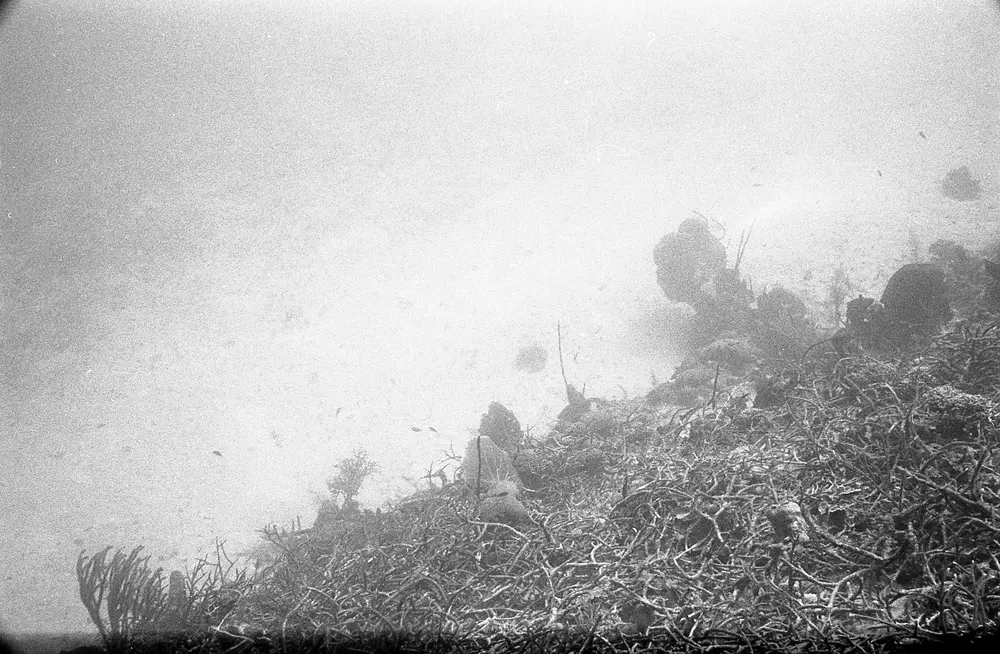{.lightbox group="discovery-bay-1966" description="**UUID: **bbadd85b-f469-4699-8a42-87695526ae85 **Date: **1967-01-18 **Location: **Jamaica | Discovery Bay | Upper Buoy Escarpment **Longitude: **77.409ºW **Latitude: **18.4726ºN **Photographer: **Eileen Graham **Copyright: **Trustees of the Natural History Museum (London, UK), CC-BY-4.0" alt="**UUID: **bbadd85b-f469-4699-8a42-87695526ae85 **Date: **1967-01-18 **Location: **Jamaica | Discovery Bay | Upper Buoy Escarpment **Longitude: **77.409ºW **Latitude: **18.4726ºN **Photographer: **Eileen Graham **Copyright: **Trustees of the Natural History Museum (London, UK), CC-BY-4.0"}

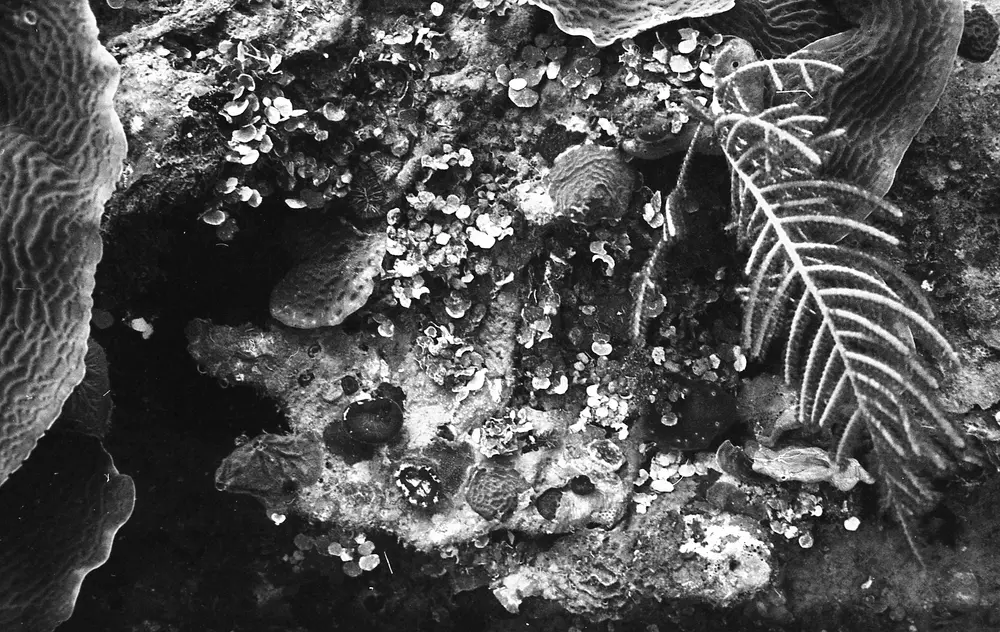{.lightbox group="discovery-bay-1966" description="**UUID: **7259f43c-a937-431d-8919-c3e6e67afe51 **Date: **1967-01-18 **Location: **Jamaica | Discovery Bay | Buoy Upper Slope **Longitude: **77.40908ºW **Latitude: **18.47322ºN **Photographer: **Eileen Graham **Copyright: **Trustees of the Natural History Museum (London, UK), CC-BY-4.0" alt="**UUID: **7259f43c-a937-431d-8919-c3e6e67afe51 **Date: **1967-01-18 **Location: **Jamaica | Discovery Bay | Buoy Upper Slope **Longitude: **77.40908ºW **Latitude: **18.47322ºN **Photographer: **Eileen Graham **Copyright: **Trustees of the Natural History Museum (London, UK), CC-BY-4.0"}

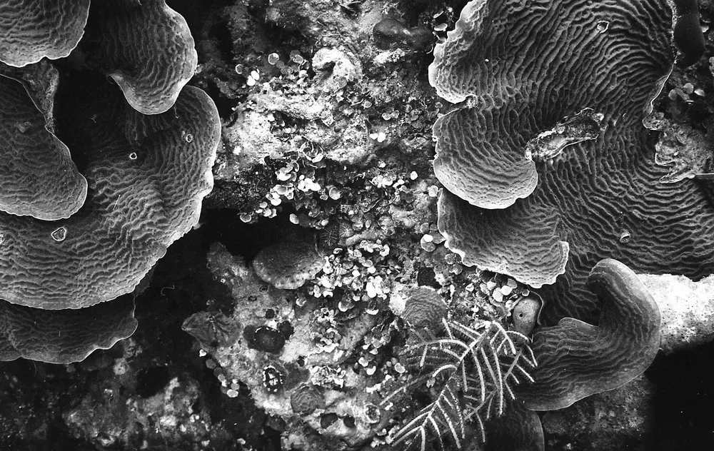{.lightbox group="discovery-bay-1966" description="**UUID: **3d0a0f55-c027-4003-8c96-7772ea4bc173 **Date: **1967-01-18 **Location: **Jamaica | Discovery Bay | Buoy Upper Slope **Longitude: **77.40908ºW **Latitude: **18.47322ºN **Photographer: **Eileen Graham **Copyright: **Trustees of the Natural History Museum (London, UK), CC-BY-4.0" alt="**UUID: **3d0a0f55-c027-4003-8c96-7772ea4bc173 **Date: **1967-01-18 **Location: **Jamaica | Discovery Bay | Buoy Upper Slope **Longitude: **77.40908ºW **Latitude: **18.47322ºN **Photographer: **Eileen Graham **Copyright: **Trustees of the Natural History Museum (London, UK), CC-BY-4.0"}

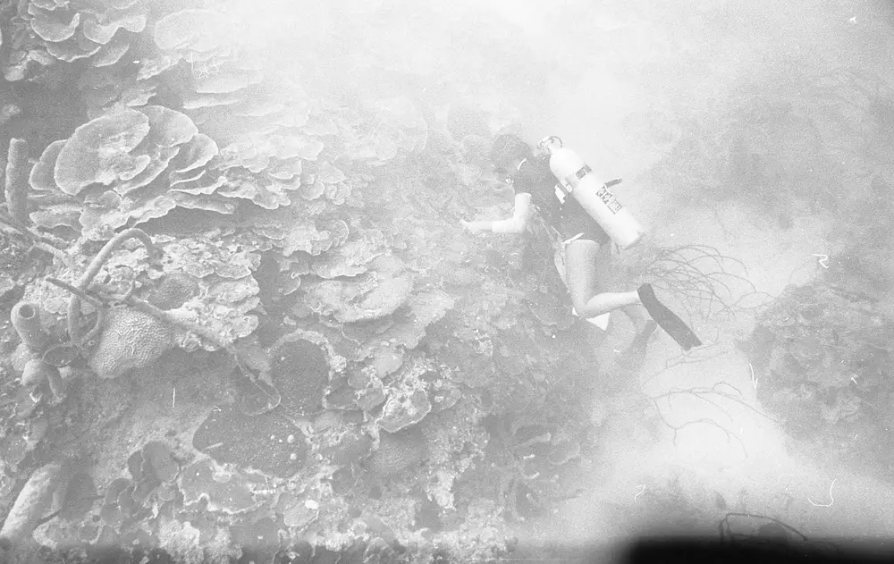{.lightbox group="discovery-bay-1966" description="**UUID: **4cebdc1e-79c3-4d02-b0ae-c2ae14aabe29 **Date: **1967-01-18 **Location: **Jamaica | Discovery Bay | Buoy Upper Slope **Longitude: **77.40908ºW **Latitude: **18.47322ºN **Photographer: **Eileen Graham **Copyright: **Trustees of the Natural History Museum (London, UK), CC-BY-4.0" alt="**UUID: **4cebdc1e-79c3-4d02-b0ae-c2ae14aabe29 **Date: **1967-01-18 **Location: **Jamaica | Discovery Bay | Buoy Upper Slope **Longitude: **77.40908ºW **Latitude: **18.47322ºN **Photographer: **Eileen Graham **Copyright: **Trustees of the Natural History Museum (London, UK), CC-BY-4.0"}

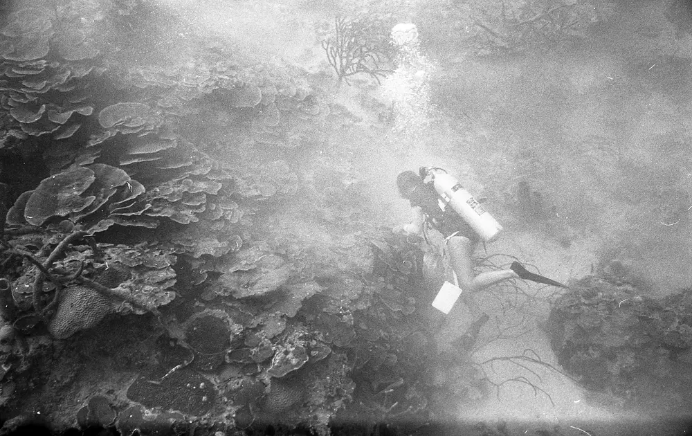{.lightbox group="discovery-bay-1966" description="**UUID: **24a60376-a640-4d99-908b-083b58c642d0 **Date: **1967-01-18 **Location: **Jamaica | Discovery Bay | Buoy Upper Slope **Longitude: **77.40908ºW **Latitude: **18.47322ºN **Photographer: **Eileen Graham **Copyright: **Trustees of the Natural History Museum (London, UK), CC-BY-4.0" alt="**UUID: **24a60376-a640-4d99-908b-083b58c642d0 **Date: **1967-01-18 **Location: **Jamaica | Discovery Bay | Buoy Upper Slope **Longitude: **77.40908ºW **Latitude: **18.47322ºN **Photographer: **Eileen Graham **Copyright: **Trustees of the Natural History Museum (London, UK), CC-BY-4.0"}

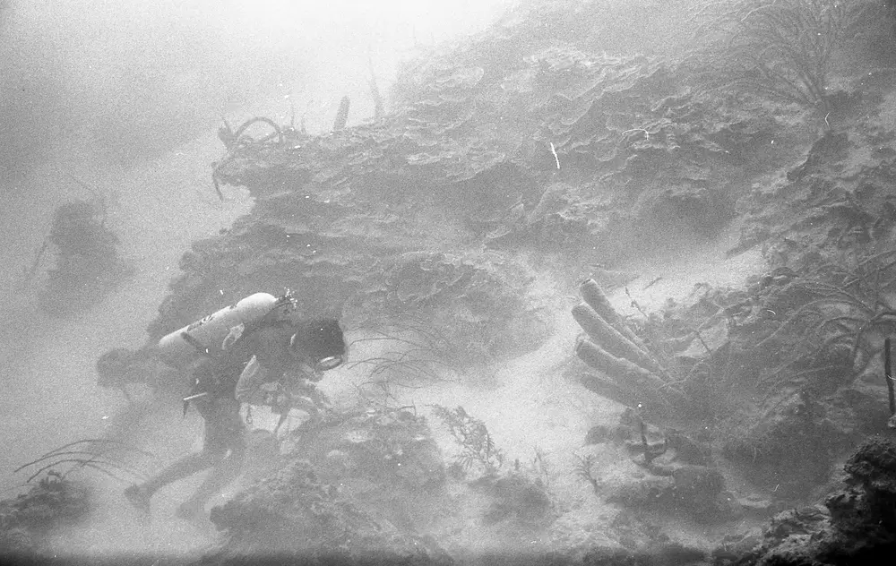{.lightbox group="discovery-bay-1966" description="**UUID: **38df4249-e9fd-4219-a4a5-81ff546a17cb **Date: **1967-01-18 **Location: **Jamaica | Discovery Bay | Buoy Upper Slope **Longitude: **77.40908ºW **Latitude: **18.47322ºN **Photographer: **Eileen Graham **Copyright: **Trustees of the Natural History Museum (London, UK), CC-BY-4.0" alt="**UUID: **38df4249-e9fd-4219-a4a5-81ff546a17cb **Date: **1967-01-18 **Location: **Jamaica | Discovery Bay | Buoy Upper Slope **Longitude: **77.40908ºW **Latitude: **18.47322ºN **Photographer: **Eileen Graham **Copyright: **Trustees of the Natural History Museum (London, UK), CC-BY-4.0"}

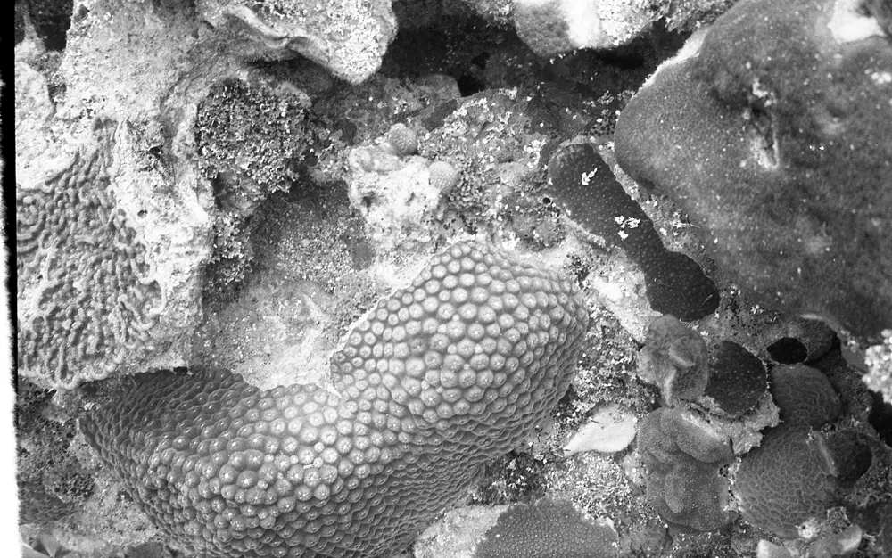{.lightbox group="discovery-bay-1966" description="**UUID: **03bcfb90-a061-45d1-8b95-96c13b0ef778 **Date: **1967-01-18 **Location: **Jamaica | Discovery Bay | Buoy Upper Slope **Longitude: **77.40908ºW **Latitude: **18.47322ºN **Photographer: **Eileen Graham **Copyright: **Trustees of the Natural History Museum (London, UK), CC-BY-4.0" alt="**UUID: **03bcfb90-a061-45d1-8b95-96c13b0ef778 **Date: **1967-01-18 **Location: **Jamaica | Discovery Bay | Buoy Upper Slope **Longitude: **77.40908ºW **Latitude: **18.47322ºN **Photographer: **Eileen Graham **Copyright: **Trustees of the Natural History Museum (London, UK), CC-BY-4.0"}

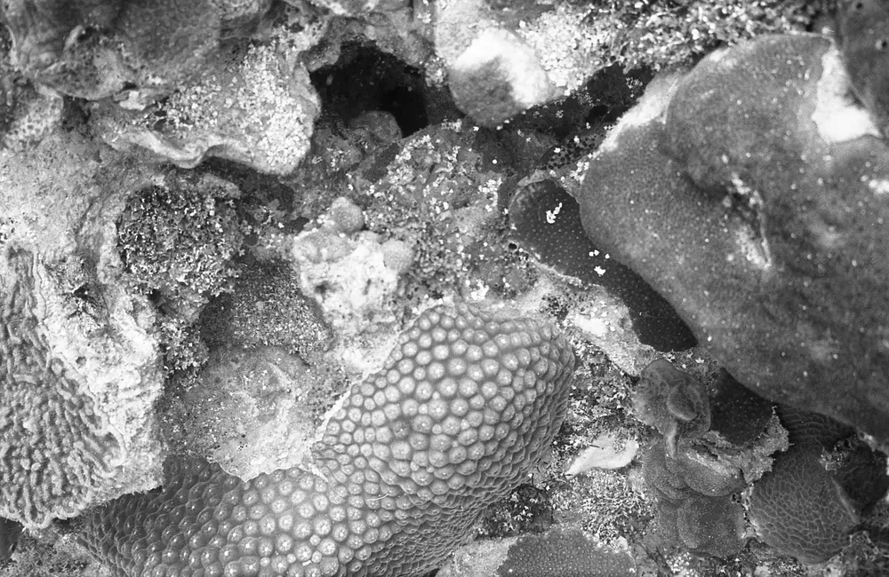{.lightbox group="discovery-bay-1966" description="**UUID: **28ebab54-caac-4348-afe9-905721c5513f **Date: **1967-01-18 **Location: **Jamaica | Discovery Bay | Buoy Upper Slope **Longitude: **77.40908ºW **Latitude: **18.47322ºN **Photographer: **Eileen Graham **Copyright: **Trustees of the Natural History Museum (London, UK), CC-BY-4.0" alt="**UUID: **28ebab54-caac-4348-afe9-905721c5513f **Date: **1967-01-18 **Location: **Jamaica | Discovery Bay | Buoy Upper Slope **Longitude: **77.40908ºW **Latitude: **18.47322ºN **Photographer: **Eileen Graham **Copyright: **Trustees of the Natural History Museum (London, UK), CC-BY-4.0"}

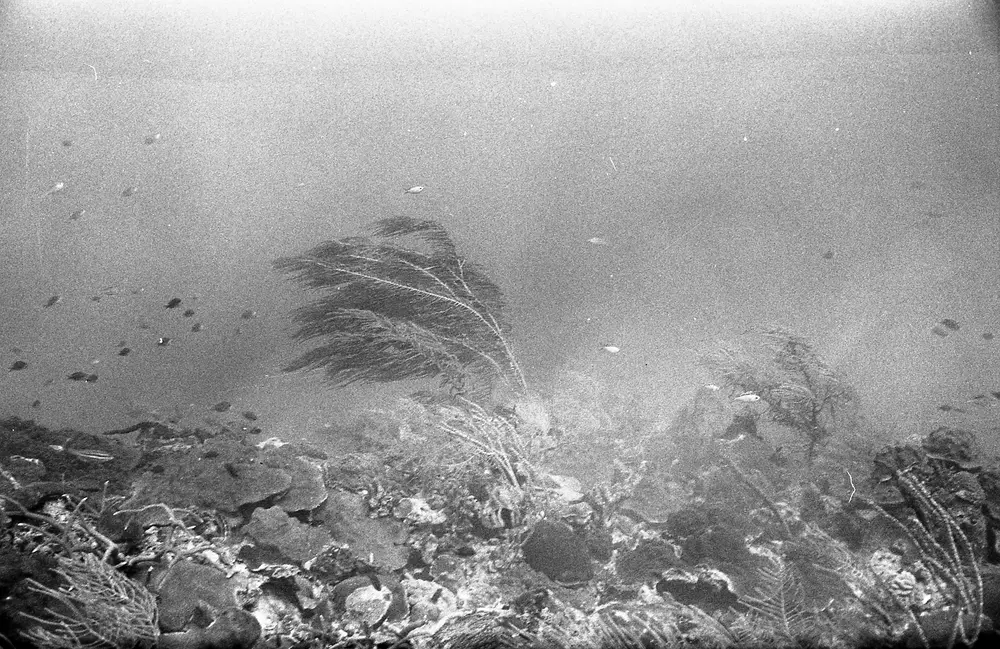{.lightbox group="discovery-bay-1966" description="**UUID: **787b7066-e0dd-4ce3-b644-fa90246380e8 **Date: **1967-01-18 **Location: **Jamaica | Discovery Bay | Buoy Upper Slope **Longitude: **77.40908ºW **Latitude: **18.47322ºN **Photographer: **Eileen Graham **Copyright: **Trustees of the Natural History Museum (London, UK), CC-BY-4.0" alt="**UUID: **787b7066-e0dd-4ce3-b644-fa90246380e8 **Date: **1967-01-18 **Location: **Jamaica | Discovery Bay | Buoy Upper Slope **Longitude: **77.40908ºW **Latitude: **18.47322ºN **Photographer: **Eileen Graham **Copyright: **Trustees of the Natural History Museum (London, UK), CC-BY-4.0"}

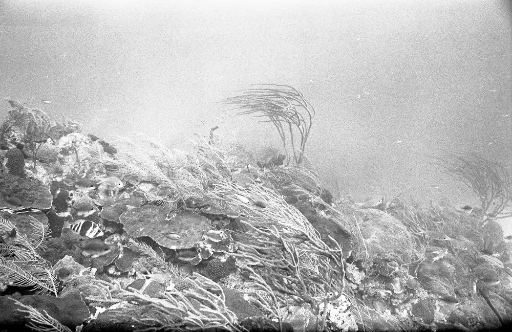{.lightbox group="discovery-bay-1966" description="**UUID: **7326fc60-8652-4010-aa24-2db0287e8d1a **Date: **1967-01-18 **Location: **Jamaica | Discovery Bay | Buoy Upper Slope **Longitude: **77.40908ºW **Latitude: **18.47322ºN **Photographer: **Eileen Graham **Copyright: **Trustees of the Natural History Museum (London, UK), CC-BY-4.0" alt="**UUID: **7326fc60-8652-4010-aa24-2db0287e8d1a **Date: **1967-01-18 **Location: **Jamaica | Discovery Bay | Buoy Upper Slope **Longitude: **77.40908ºW **Latitude: **18.47322ºN **Photographer: **Eileen Graham **Copyright: **Trustees of the Natural History Museum (London, UK), CC-BY-4.0"}

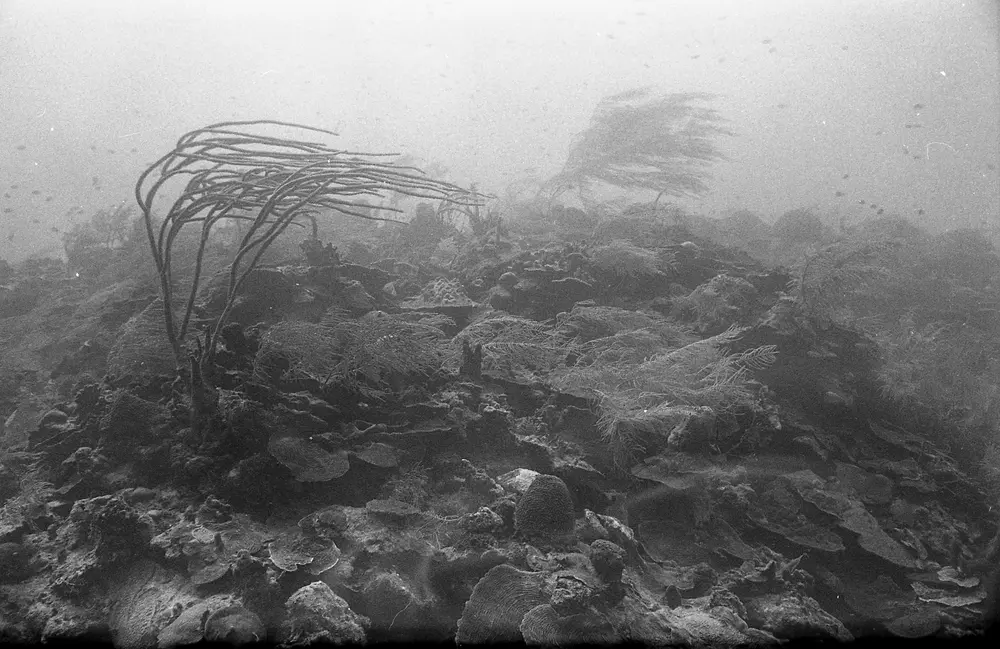{.lightbox group="discovery-bay-1966" description="**UUID: **e1f87e1f-2594-4fb2-8a53-7d67d7ffcd1d **Date: **1967-01-18 **Location: **Jamaica | Discovery Bay | Buoy Upper Slope **Longitude: **77.40908ºW **Latitude: **18.47322ºN **Photographer: **Eileen Graham **Copyright: **Trustees of the Natural History Museum (London, UK), CC-BY-4.0" alt="**UUID: **e1f87e1f-2594-4fb2-8a53-7d67d7ffcd1d **Date: **1967-01-18 **Location: **Jamaica | Discovery Bay | Buoy Upper Slope **Longitude: **77.40908ºW **Latitude: **18.47322ºN **Photographer: **Eileen Graham **Copyright: **Trustees of the Natural History Museum (London, UK), CC-BY-4.0"}

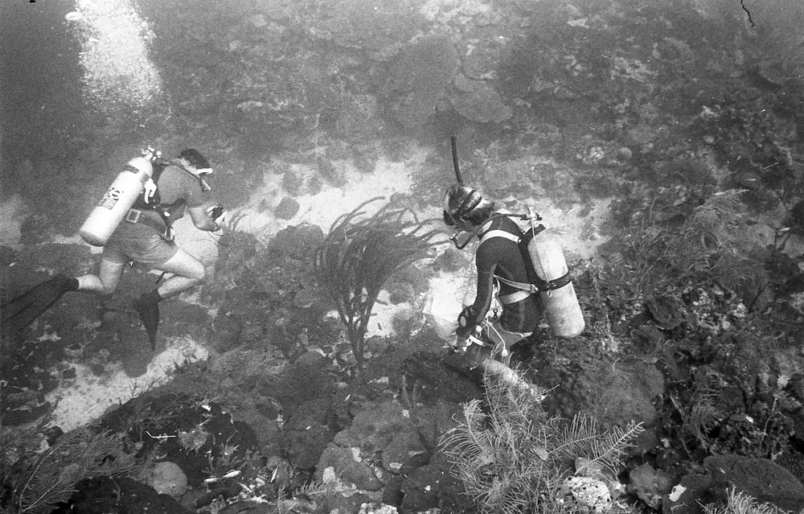{.lightbox group="discovery-bay-1966" description="**UUID: **026081a9-0ba7-45f0-acc1-a9b1660f09c0 **Date: **1967-01-21 **Location: **Jamaica | Discovery Bay | Buoy Upper Slope **Longitude: **77.40908ºW **Latitude: **18.47322ºN **Photographer: **Eileen Graham **Copyright: **Trustees of the Natural History Museum (London, UK), CC-BY-4.0" alt="**UUID: **026081a9-0ba7-45f0-acc1-a9b1660f09c0 **Date: **1967-01-21 **Location: **Jamaica | Discovery Bay | Buoy Upper Slope **Longitude: **77.40908ºW **Latitude: **18.47322ºN **Photographer: **Eileen Graham **Copyright: **Trustees of the Natural History Museum (London, UK), CC-BY-4.0"}

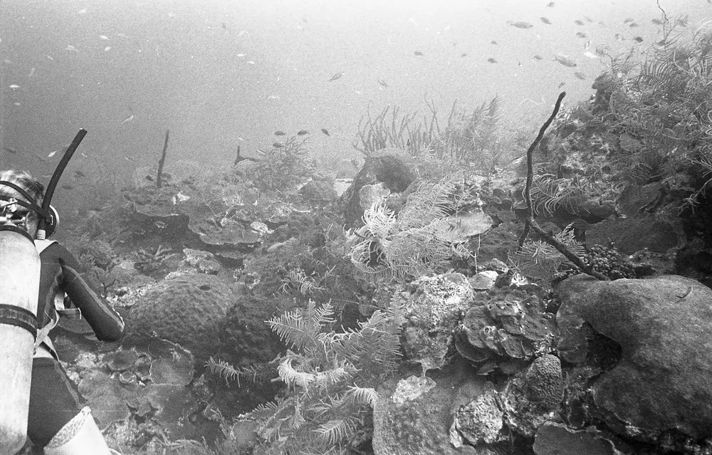{.lightbox group="discovery-bay-1966" description="**UUID: **2d2ccfd3-28be-4d58-b45f-7ae1b12f7596 **Date: **1967-01-21 **Location: **Jamaica | Discovery Bay | Buoy Upper Slope **Longitude: **77.40908ºW **Latitude: **18.47322ºN **Photographer: **Eileen Graham **Copyright: **Trustees of the Natural History Museum (London, UK), CC-BY-4.0" alt="**UUID: **2d2ccfd3-28be-4d58-b45f-7ae1b12f7596 **Date: **1967-01-21 **Location: **Jamaica | Discovery Bay | Buoy Upper Slope **Longitude: **77.40908ºW **Latitude: **18.47322ºN **Photographer: **Eileen Graham **Copyright: **Trustees of the Natural History Museum (London, UK), CC-BY-4.0"}

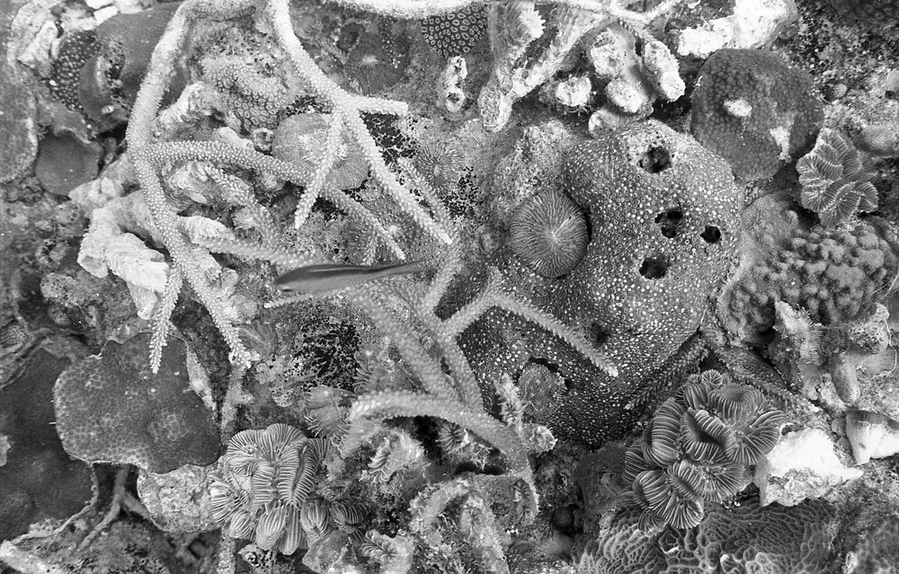{.lightbox group="discovery-bay-1966" description="**UUID: **56ce4a57-a412-49f7-b8ee-4d5190cdfa76 **Date: **1967-01-21 **Location: **Jamaica | Discovery Bay | Buoy Upper Slope **Longitude: **77.40908ºW **Latitude: **18.47322ºN **Photographer: **Eileen Graham **Copyright: **Trustees of the Natural History Museum (London, UK), CC-BY-4.0" alt="**UUID: **56ce4a57-a412-49f7-b8ee-4d5190cdfa76 **Date: **1967-01-21 **Location: **Jamaica | Discovery Bay | Buoy Upper Slope **Longitude: **77.40908ºW **Latitude: **18.47322ºN **Photographer: **Eileen Graham **Copyright: **Trustees of the Natural History Museum (London, UK), CC-BY-4.0"}

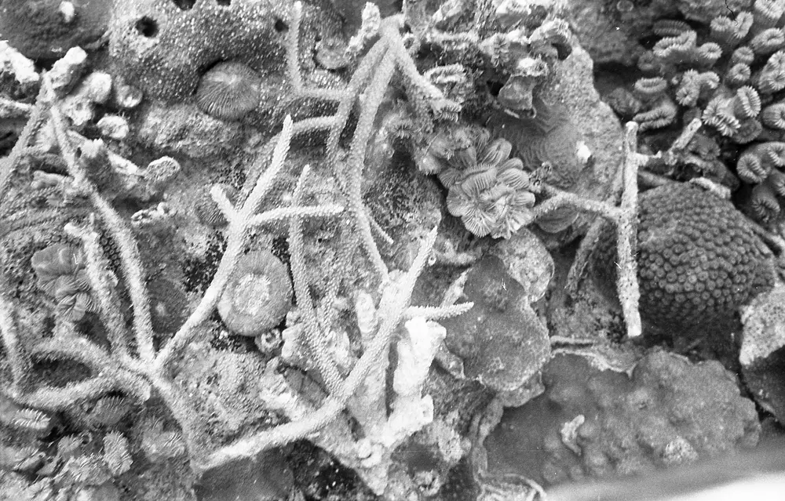{.lightbox group="discovery-bay-1966" description="**UUID: **24e684f4-93b7-429b-bb6c-3869d41e7474 **Date: **1967-01-21 **Location: **Jamaica | Discovery Bay | Buoy Upper Slope **Longitude: **77.40908ºW **Latitude: **18.47322ºN **Photographer: **Eileen Graham **Copyright: **Trustees of the Natural History Museum (London, UK), CC-BY-4.0" alt="**UUID: **24e684f4-93b7-429b-bb6c-3869d41e7474 **Date: **1967-01-21 **Location: **Jamaica | Discovery Bay | Buoy Upper Slope **Longitude: **77.40908ºW **Latitude: **18.47322ºN **Photographer: **Eileen Graham **Copyright: **Trustees of the Natural History Museum (London, UK), CC-BY-4.0"}

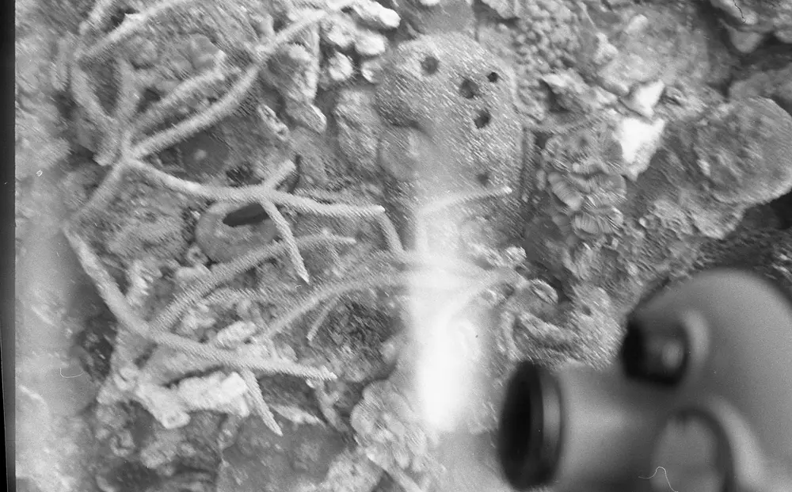{.lightbox group="discovery-bay-1966" description="**UUID: **a464a5b7-9837-4fa0-97ab-3d4ea721fc6e **Date: **1967-01-21 **Location: **Jamaica | Discovery Bay | Buoy Upper Slope **Longitude: **77.40908ºW **Latitude: **18.47322ºN **Photographer: **Eileen Graham **Copyright: **Trustees of the Natural History Museum (London, UK), CC-BY-4.0" alt="**UUID: **a464a5b7-9837-4fa0-97ab-3d4ea721fc6e **Date: **1967-01-21 **Location: **Jamaica | Discovery Bay | Buoy Upper Slope **Longitude: **77.40908ºW **Latitude: **18.47322ºN **Photographer: **Eileen Graham **Copyright: **Trustees of the Natural History Museum (London, UK), CC-BY-4.0"}

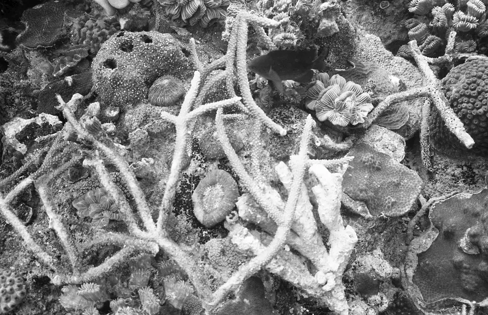{.lightbox group="discovery-bay-1966" description="**UUID: **f483c2cd-8169-4d27-8c98-5558bea8c3ca **Date: **1967-01-21 **Location: **Jamaica | Discovery Bay | Buoy Upper Slope **Longitude: **77.40908ºW **Latitude: **18.47322ºN **Photographer: **Eileen Graham **Copyright: **Trustees of the Natural History Museum (London, UK), CC-BY-4.0" alt="**UUID: **f483c2cd-8169-4d27-8c98-5558bea8c3ca **Date: **1967-01-21 **Location: **Jamaica | Discovery Bay | Buoy Upper Slope **Longitude: **77.40908ºW **Latitude: **18.47322ºN **Photographer: **Eileen Graham **Copyright: **Trustees of the Natural History Museum (London, UK), CC-BY-4.0"}

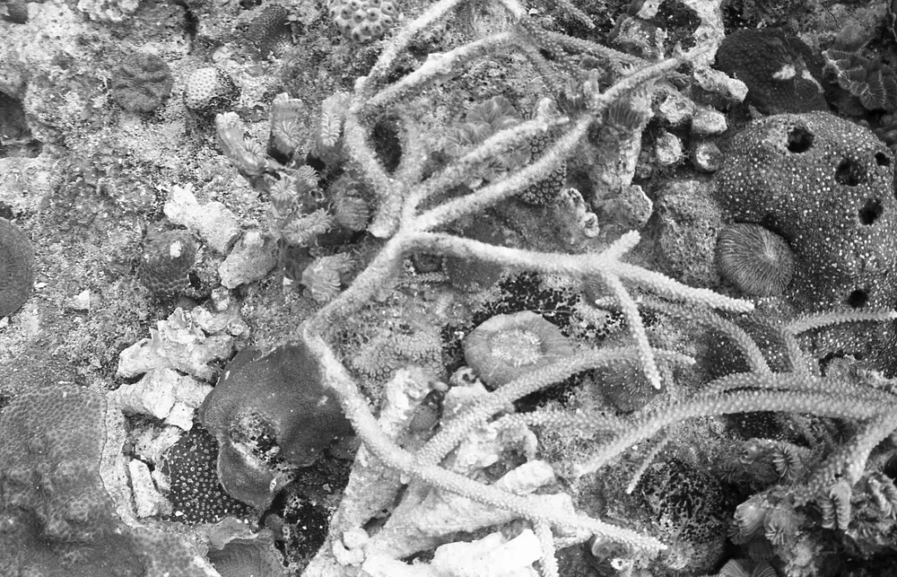{.lightbox group="discovery-bay-1966" description="**UUID: **79e82e0e-a0de-4e14-807c-3b97157fc7ee **Date: **1967-01-21 **Location: **Jamaica | Discovery Bay | Buoy Upper Slope **Longitude: **77.40908ºW **Latitude: **18.47322ºN **Photographer: **Eileen Graham **Copyright: **Trustees of the Natural History Museum (London, UK), CC-BY-4.0" alt="**UUID: **79e82e0e-a0de-4e14-807c-3b97157fc7ee **Date: **1967-01-21 **Location: **Jamaica | Discovery Bay | Buoy Upper Slope **Longitude: **77.40908ºW **Latitude: **18.47322ºN **Photographer: **Eileen Graham **Copyright: **Trustees of the Natural History Museum (London, UK), CC-BY-4.0"}

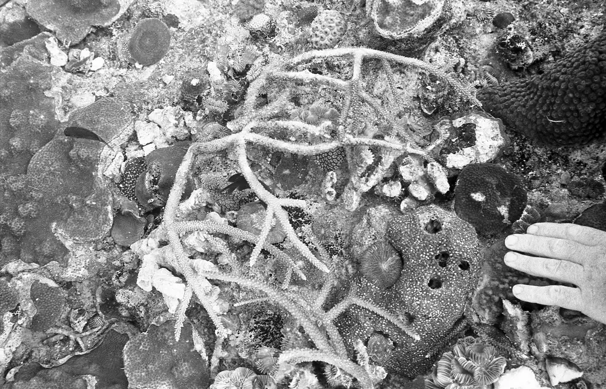{.lightbox group="discovery-bay-1966" description="**UUID: **3359c086-3095-4d7a-aec8-12f9f7f1b782 **Date: **1967-01-21 **Location: **Jamaica | Discovery Bay | Buoy Upper Slope **Longitude: **77.40908ºW **Latitude: **18.47322ºN **Photographer: **Eileen Graham **Copyright: **Trustees of the Natural History Museum (London, UK), CC-BY-4.0" alt="**UUID: **3359c086-3095-4d7a-aec8-12f9f7f1b782 **Date: **1967-01-21 **Location: **Jamaica | Discovery Bay | Buoy Upper Slope **Longitude: **77.40908ºW **Latitude: **18.47322ºN **Photographer: **Eileen Graham **Copyright: **Trustees of the Natural History Museum (London, UK), CC-BY-4.0"}

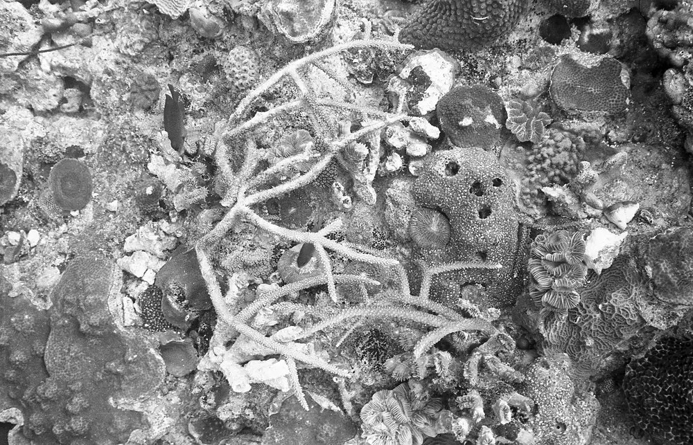{.lightbox group="discovery-bay-1966" description="**UUID: **d8f664a3-88c3-4532-b180-2dde4a73e7cd **Date: **1967-01-21 **Location: **Jamaica | Discovery Bay | Buoy Upper Slope **Longitude: **77.40908ºW **Latitude: **18.47322ºN **Photographer: **Eileen Graham **Copyright: **Trustees of the Natural History Museum (London, UK), CC-BY-4.0" alt="**UUID: **d8f664a3-88c3-4532-b180-2dde4a73e7cd **Date: **1967-01-21 **Location: **Jamaica | Discovery Bay | Buoy Upper Slope **Longitude: **77.40908ºW **Latitude: **18.47322ºN **Photographer: **Eileen Graham **Copyright: **Trustees of the Natural History Museum (London, UK), CC-BY-4.0"}

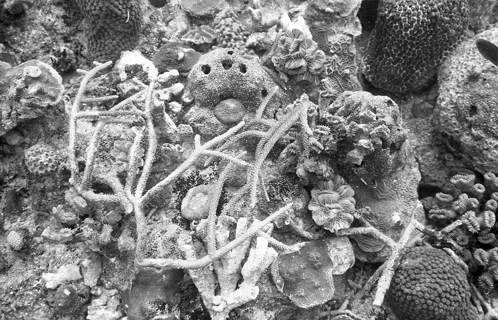{.lightbox group="discovery-bay-1966" description="**UUID: **9ab49228-3208-4415-bf44-402762161703 **Date: **1967-01-21 **Location: **Jamaica | Discovery Bay | Buoy Upper Slope **Longitude: **77.40908ºW **Latitude: **18.47322ºN **Photographer: **Eileen Graham **Copyright: **Trustees of the Natural History Museum (London, UK), CC-BY-4.0" alt="**UUID: **9ab49228-3208-4415-bf44-402762161703 **Date: **1967-01-21 **Location: **Jamaica | Discovery Bay | Buoy Upper Slope **Longitude: **77.40908ºW **Latitude: **18.47322ºN **Photographer: **Eileen Graham **Copyright: **Trustees of the Natural History Museum (London, UK), CC-BY-4.0"}

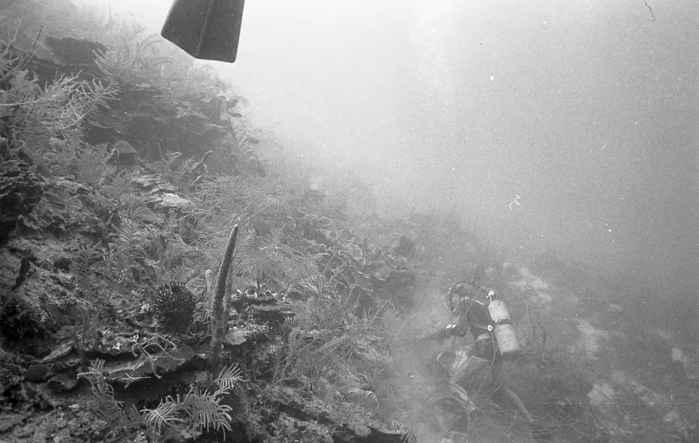{.lightbox group="discovery-bay-1966" description="**UUID: **eff36bda-457b-42e8-af48-5ea387759a9a **Date: **1967-01-21 **Location: **Jamaica | Discovery Bay | Buoy Deep **Longitude: **77.40908ºW **Latitude: **18.47325ºN **Photographer: **Eileen Graham **Copyright: **Trustees of the Natural History Museum (London, UK), CC-BY-4.0" alt="**UUID: **eff36bda-457b-42e8-af48-5ea387759a9a **Date: **1967-01-21 **Location: **Jamaica | Discovery Bay | Buoy Deep **Longitude: **77.40908ºW **Latitude: **18.47325ºN **Photographer: **Eileen Graham **Copyright: **Trustees of the Natural History Museum (London, UK), CC-BY-4.0"}

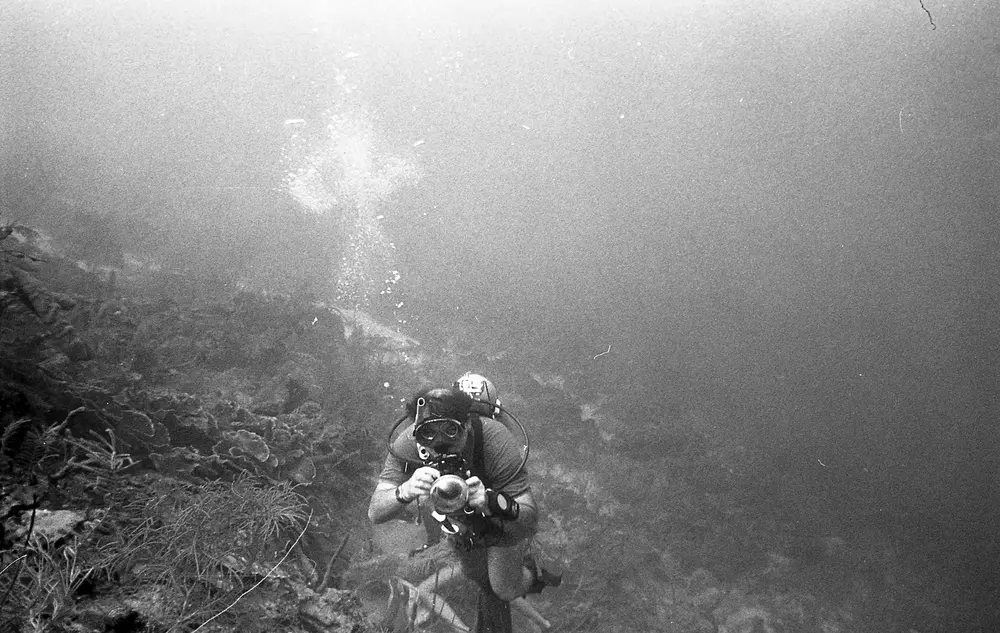{.lightbox group="discovery-bay-1966" description="**UUID: **b7075bd1-bc1e-41a9-8c4b-910f69fe4d41 **Date: **1967-01-21 **Location: **Jamaica | Discovery Bay | Buoy Deep **Longitude: **77.40908ºW **Latitude: **18.47325ºN **Photographer: **Eileen Graham **Copyright: **Trustees of the Natural History Museum (London, UK), CC-BY-4.0" alt="**UUID: **b7075bd1-bc1e-41a9-8c4b-910f69fe4d41 **Date: **1967-01-21 **Location: **Jamaica | Discovery Bay | Buoy Deep **Longitude: **77.40908ºW **Latitude: **18.47325ºN **Photographer: **Eileen Graham **Copyright: **Trustees of the Natural History Museum (London, UK), CC-BY-4.0"}

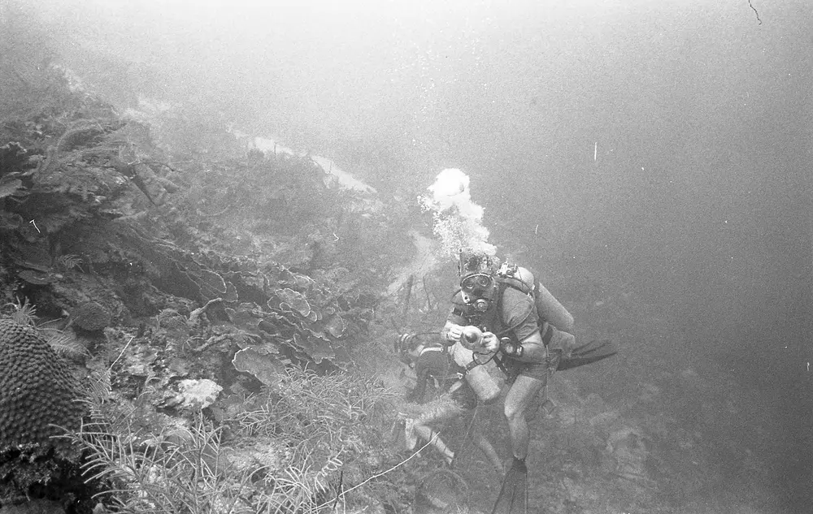{.lightbox group="discovery-bay-1966" description="**UUID: **88b11615-1c13-48be-837c-34feabac5a97 **Date: **1967-01-21 **Location: **Jamaica | Discovery Bay | Buoy Deep **Longitude: **77.40908ºW **Latitude: **18.47325ºN **Photographer: **Eileen Graham **Copyright: **Trustees of the Natural History Museum (London, UK), CC-BY-4.0" alt="**UUID: **88b11615-1c13-48be-837c-34feabac5a97 **Date: **1967-01-21 **Location: **Jamaica | Discovery Bay | Buoy Deep **Longitude: **77.40908ºW **Latitude: **18.47325ºN **Photographer: **Eileen Graham **Copyright: **Trustees of the Natural History Museum (London, UK), CC-BY-4.0"}

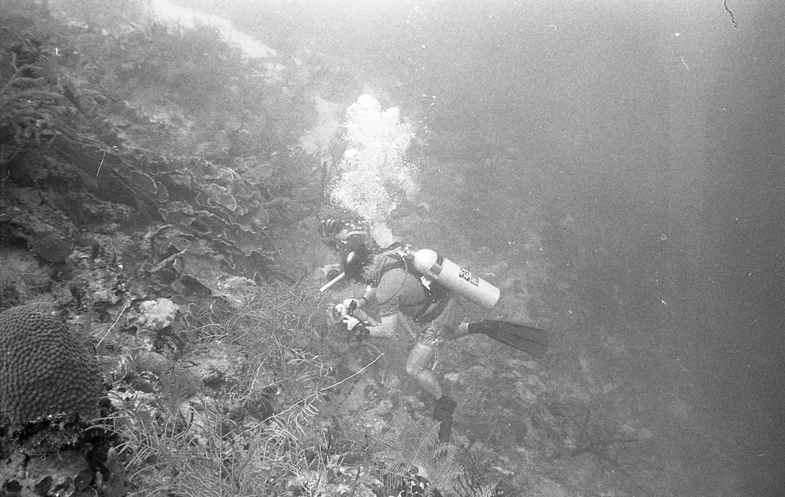{.lightbox group="discovery-bay-1966" description="**UUID: **e7ec15ea-f4c9-4e3c-bd2b-42db7caadb9d **Date: **1967-01-21 **Location: **Jamaica | Discovery Bay | Buoy Deep **Longitude: **77.40908ºW **Latitude: **18.47325ºN **Photographer: **Eileen Graham **Copyright: **Trustees of the Natural History Museum (London, UK), CC-BY-4.0" alt="**UUID: **e7ec15ea-f4c9-4e3c-bd2b-42db7caadb9d **Date: **1967-01-21 **Location: **Jamaica | Discovery Bay | Buoy Deep **Longitude: **77.40908ºW **Latitude: **18.47325ºN **Photographer: **Eileen Graham **Copyright: **Trustees of the Natural History Museum (London, UK), CC-BY-4.0"}

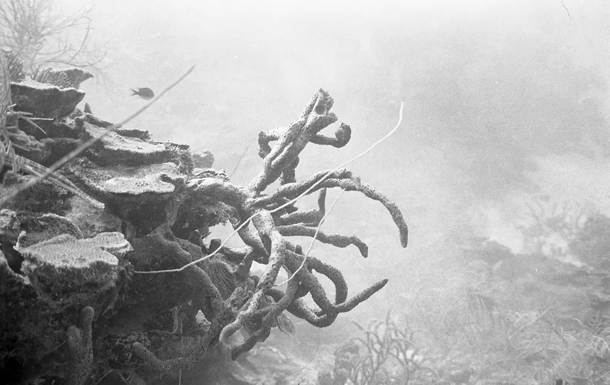{.lightbox group="discovery-bay-1966" description="**UUID: **f59f2d35-3ba0-474c-8929-3fae5c964883 **Date: **1967-01-21 **Location: **Jamaica | Discovery Bay | Buoy Upper Slope **Longitude: **77.40908ºW **Latitude: **18.47322ºN **Photographer: **Eileen Graham **Copyright: **Trustees of the Natural History Museum (London, UK), CC-BY-4.0" alt="**UUID: **f59f2d35-3ba0-474c-8929-3fae5c964883 **Date: **1967-01-21 **Location: **Jamaica | Discovery Bay | Buoy Upper Slope **Longitude: **77.40908ºW **Latitude: **18.47322ºN **Photographer: **Eileen Graham **Copyright: **Trustees of the Natural History Museum (London, UK), CC-BY-4.0"}

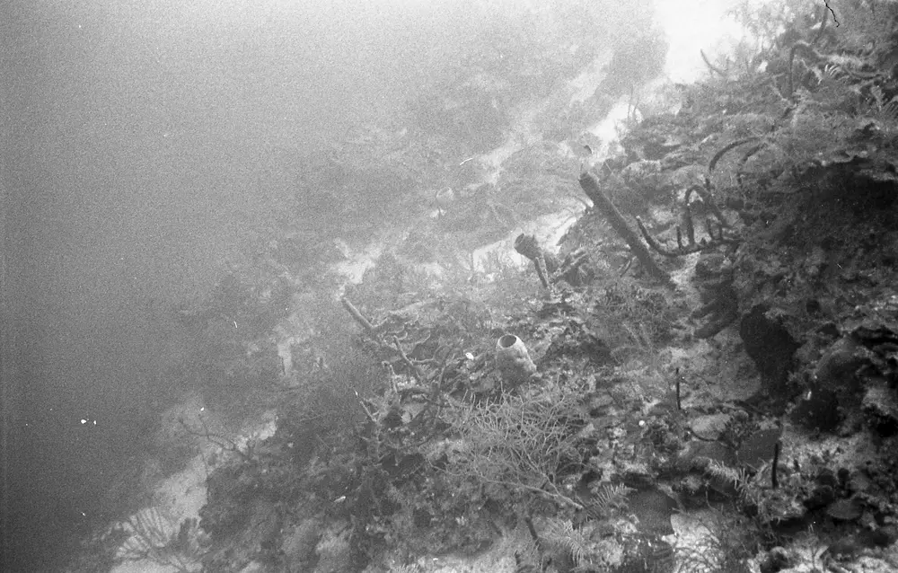{.lightbox group="discovery-bay-1966" description="**UUID: **8372ef93-504f-4bff-9959-be68ee92a694 **Date: **1967-01-21 **Location: **Jamaica | Discovery Bay | Buoy Deep **Longitude: **77.40908ºW **Latitude: **18.47325ºN **Photographer: **Eileen Graham **Copyright: **Trustees of the Natural History Museum (London, UK), CC-BY-4.0" alt="**UUID: **8372ef93-504f-4bff-9959-be68ee92a694 **Date: **1967-01-21 **Location: **Jamaica | Discovery Bay | Buoy Deep **Longitude: **77.40908ºW **Latitude: **18.47325ºN **Photographer: **Eileen Graham **Copyright: **Trustees of the Natural History Museum (London, UK), CC-BY-4.0"}

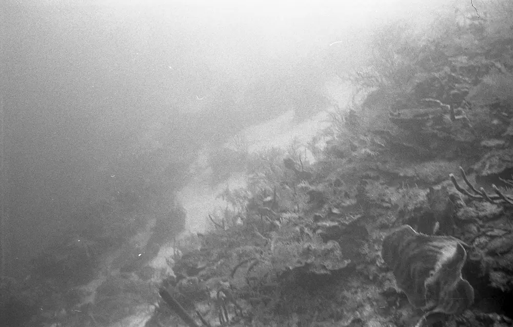{.lightbox group="discovery-bay-1966" description="**UUID: **f171962e-cb87-498c-a4ee-e772ccc26e54 **Date: **1967-01-21 **Location: **Jamaica | Discovery Bay | Buoy Deep **Longitude: **77.40908ºW **Latitude: **18.47325ºN **Photographer: **Eileen Graham **Copyright: **Trustees of the Natural History Museum (London, UK), CC-BY-4.0" alt="**UUID: **f171962e-cb87-498c-a4ee-e772ccc26e54 **Date: **1967-01-21 **Location: **Jamaica | Discovery Bay | Buoy Deep **Longitude: **77.40908ºW **Latitude: **18.47325ºN **Photographer: **Eileen Graham **Copyright: **Trustees of the Natural History Museum (London, UK), CC-BY-4.0"}

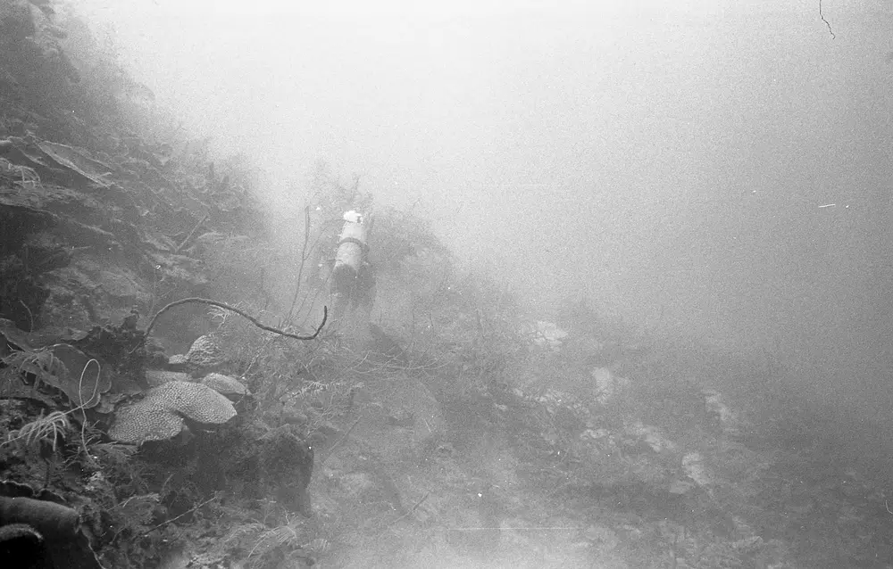{.lightbox group="discovery-bay-1966" description="**UUID: **81de465d-500d-4589-b410-85d8644b0169 **Date: **1967-01-21 **Location: **Jamaica | Discovery Bay | Buoy Deep **Longitude: **77.40908ºW **Latitude: **18.47325ºN **Photographer: **Eileen Graham **Copyright: **Trustees of the Natural History Museum (London, UK), CC-BY-4.0" alt="**UUID: **81de465d-500d-4589-b410-85d8644b0169 **Date: **1967-01-21 **Location: **Jamaica | Discovery Bay | Buoy Deep **Longitude: **77.40908ºW **Latitude: **18.47325ºN **Photographer: **Eileen Graham **Copyright: **Trustees of the Natural History Museum (London, UK), CC-BY-4.0"}

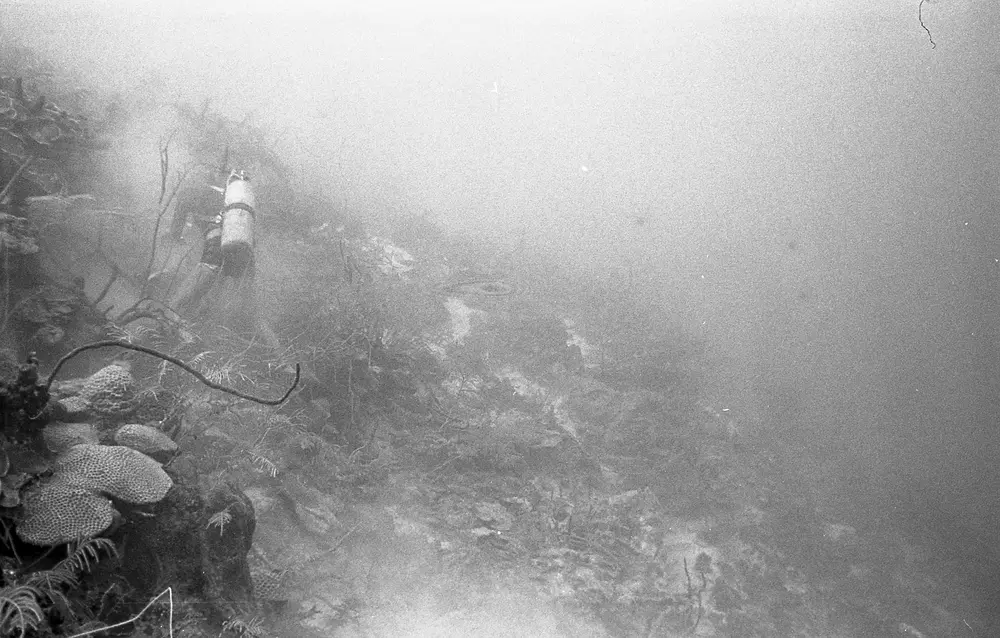{.lightbox group="discovery-bay-1966" description="**UUID: **76bb5165-94f8-4cb5-abe4-7406a3e311c3 **Date: **1967-01-21 **Location: **Jamaica | Discovery Bay | Buoy Deep **Longitude: **77.40908ºW **Latitude: **18.47325ºN **Photographer: **Eileen Graham **Copyright: **Trustees of the Natural History Museum (London, UK), CC-BY-4.0" alt="**UUID: **76bb5165-94f8-4cb5-abe4-7406a3e311c3 **Date: **1967-01-21 **Location: **Jamaica | Discovery Bay | Buoy Deep **Longitude: **77.40908ºW **Latitude: **18.47325ºN **Photographer: **Eileen Graham **Copyright: **Trustees of the Natural History Museum (London, UK), CC-BY-4.0"}

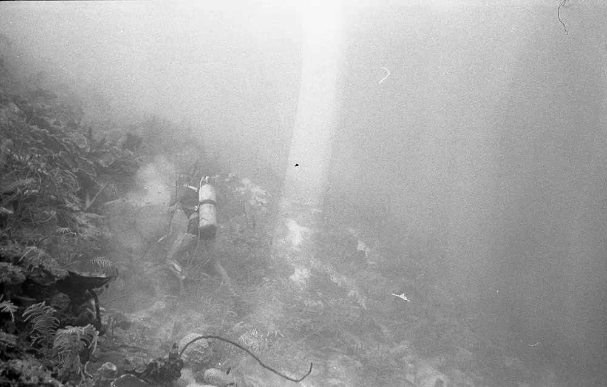{.lightbox group="discovery-bay-1966" description="**UUID: **9ccf5bde-7bb8-4ee9-a39e-a2880f2d7637 **Date: **1967-01-21 **Location: **Jamaica | Discovery Bay | Buoy Deep **Longitude: **77.40908ºW **Latitude: **18.47325ºN **Photographer: **Eileen Graham **Copyright: **Trustees of the Natural History Museum (London, UK), CC-BY-4.0" alt="**UUID: **9ccf5bde-7bb8-4ee9-a39e-a2880f2d7637 **Date: **1967-01-21 **Location: **Jamaica | Discovery Bay | Buoy Deep **Longitude: **77.40908ºW **Latitude: **18.47325ºN **Photographer: **Eileen Graham **Copyright: **Trustees of the Natural History Museum (London, UK), CC-BY-4.0"}

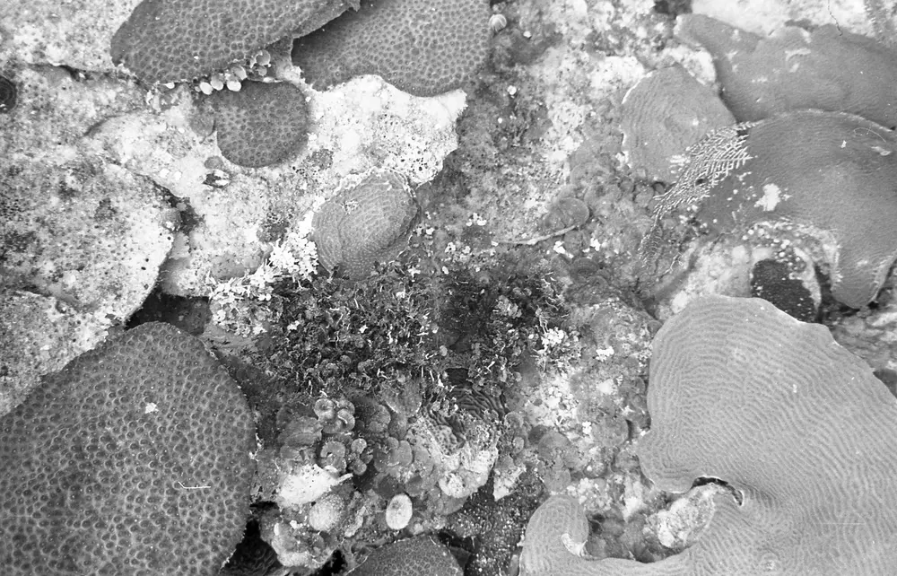{.lightbox group="discovery-bay-1966" description="**UUID: **7376b63f-6610-4a38-9d3b-aa0bd425ab00 **Date: **1967-01-21 **Location: **Jamaica | Discovery Bay | Buoy Upper Slope **Longitude: **77.40908ºW **Latitude: **18.47322ºN **Photographer: **Eileen Graham **Copyright: **Trustees of the Natural History Museum (London, UK), CC-BY-4.0" alt="**UUID: **7376b63f-6610-4a38-9d3b-aa0bd425ab00 **Date: **1967-01-21 **Location: **Jamaica | Discovery Bay | Buoy Upper Slope **Longitude: **77.40908ºW **Latitude: **18.47322ºN **Photographer: **Eileen Graham **Copyright: **Trustees of the Natural History Museum (London, UK), CC-BY-4.0"}

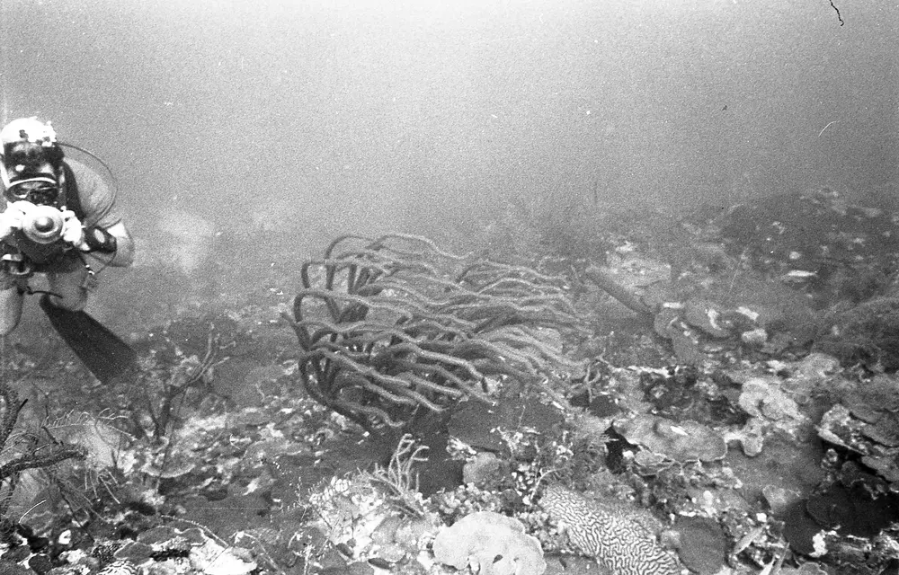{.lightbox group="discovery-bay-1966" description="**UUID: **a58215e5-4f6e-4191-adae-5c1b942a6aba **Date: **1967-01-21 **Location: **Jamaica | Discovery Bay | Buoy Upper Slope **Longitude: **77.40908ºW **Latitude: **18.47322ºN **Photographer: **Eileen Graham **Copyright: **Trustees of the Natural History Museum (London, UK), CC-BY-4.0" alt="**UUID: **a58215e5-4f6e-4191-adae-5c1b942a6aba **Date: **1967-01-21 **Location: **Jamaica | Discovery Bay | Buoy Upper Slope **Longitude: **77.40908ºW **Latitude: **18.47322ºN **Photographer: **Eileen Graham **Copyright: **Trustees of the Natural History Museum (London, UK), CC-BY-4.0"}

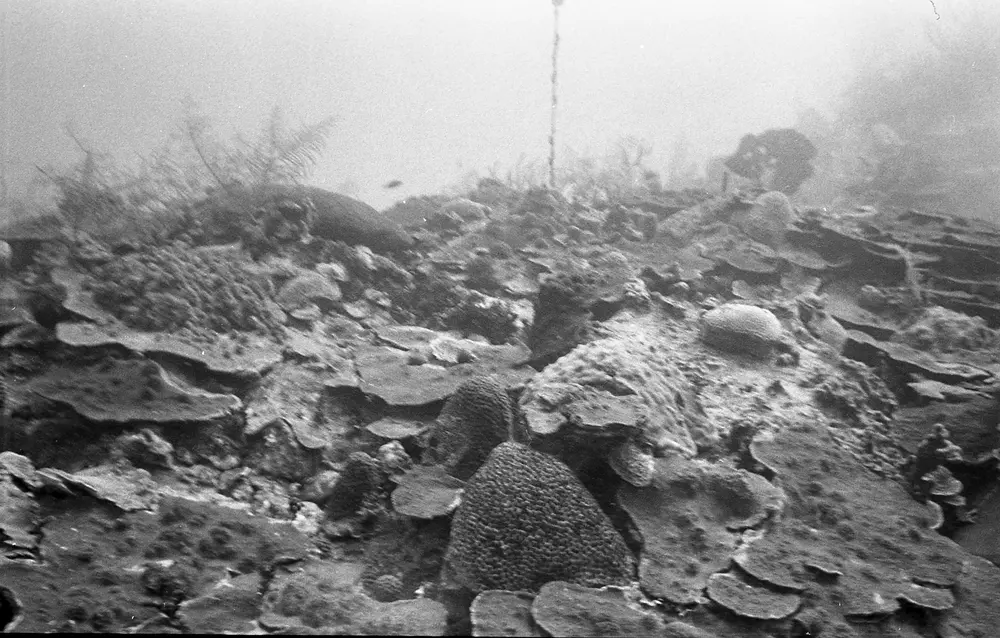{.lightbox group="discovery-bay-1966" description="**UUID: **80b7db56-4084-4ea3-8ce9-d4291408e27e **Date: **1967-01-21 **Location: **Jamaica | Discovery Bay | Buoy Upper Slope **Longitude: **77.40908ºW **Latitude: **18.47322ºN **Photographer: **Eileen Graham **Copyright: **Trustees of the Natural History Museum (London, UK), CC-BY-4.0" alt="**UUID: **80b7db56-4084-4ea3-8ce9-d4291408e27e **Date: **1967-01-21 **Location: **Jamaica | Discovery Bay | Buoy Upper Slope **Longitude: **77.40908ºW **Latitude: **18.47322ºN **Photographer: **Eileen Graham **Copyright: **Trustees of the Natural History Museum (London, UK), CC-BY-4.0"}

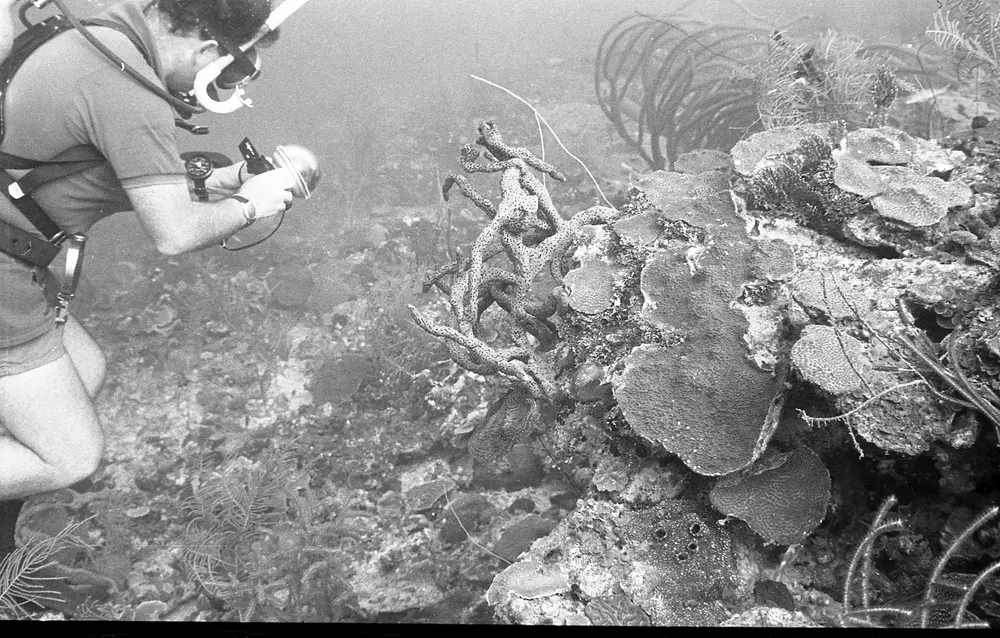{.lightbox group="discovery-bay-1966" description="**UUID: **797e86f8-6154-4ca5-b3c4-cefa7850ee8b **Date: **1967-01-21 **Location: **Jamaica | Discovery Bay | Buoy Upper Slope **Longitude: **77.40908ºW **Latitude: **18.47322ºN **Photographer: **Eileen Graham **Copyright: **Trustees of the Natural History Museum (London, UK), CC-BY-4.0" alt="**UUID: **797e86f8-6154-4ca5-b3c4-cefa7850ee8b **Date: **1967-01-21 **Location: **Jamaica | Discovery Bay | Buoy Upper Slope **Longitude: **77.40908ºW **Latitude: **18.47322ºN **Photographer: **Eileen Graham **Copyright: **Trustees of the Natural History Museum (London, UK), CC-BY-4.0"}

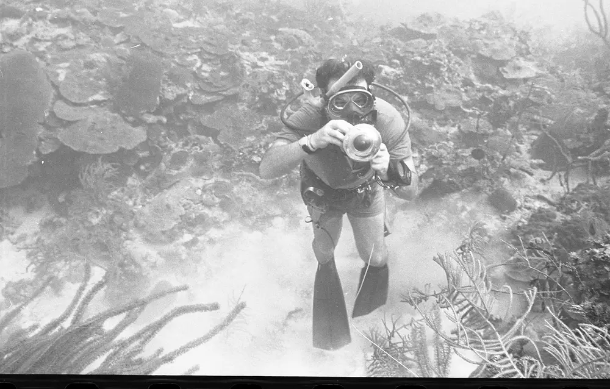{.lightbox group="discovery-bay-1966" description="**UUID: **7cc3dd41-3ecc-4ae8-bd8e-37e29aba7f74 **Date: **1967-01-21 **Location: **Jamaica | Discovery Bay | Buoy Upper Slope **Longitude: **77.40908ºW **Latitude: **18.47322ºN **Photographer: **Eileen Graham **Copyright: **Trustees of the Natural History Museum (London, UK), CC-BY-4.0" alt="**UUID: **7cc3dd41-3ecc-4ae8-bd8e-37e29aba7f74 **Date: **1967-01-21 **Location: **Jamaica | Discovery Bay | Buoy Upper Slope **Longitude: **77.40908ºW **Latitude: **18.47322ºN **Photographer: **Eileen Graham **Copyright: **Trustees of the Natural History Museum (London, UK), CC-BY-4.0"}

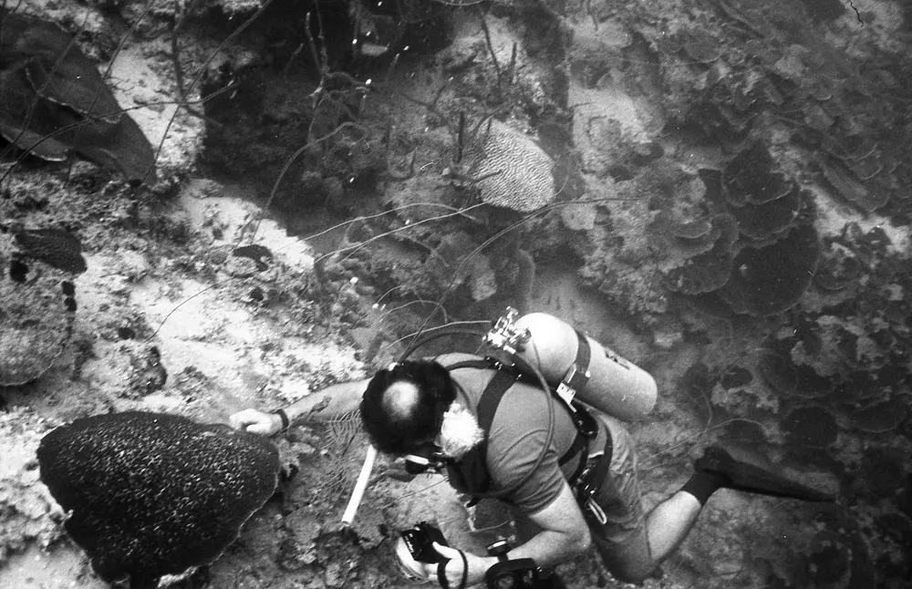{.lightbox group="discovery-bay-1966" description="**UUID: **0857c96e-f7be-4f67-87ef-e88d4599b4c9 **Date: **1967-01-22 **Location: **Jamaica | Discovery Bay | Buoy Deep **Longitude: **77.40908ºW **Latitude: **18.47325ºN **Photographer: **Eileen Graham **Copyright: **Trustees of the Natural History Museum (London, UK), CC-BY-4.0" alt="**UUID: **0857c96e-f7be-4f67-87ef-e88d4599b4c9 **Date: **1967-01-22 **Location: **Jamaica | Discovery Bay | Buoy Deep **Longitude: **77.40908ºW **Latitude: **18.47325ºN **Photographer: **Eileen Graham **Copyright: **Trustees of the Natural History Museum (London, UK), CC-BY-4.0"}

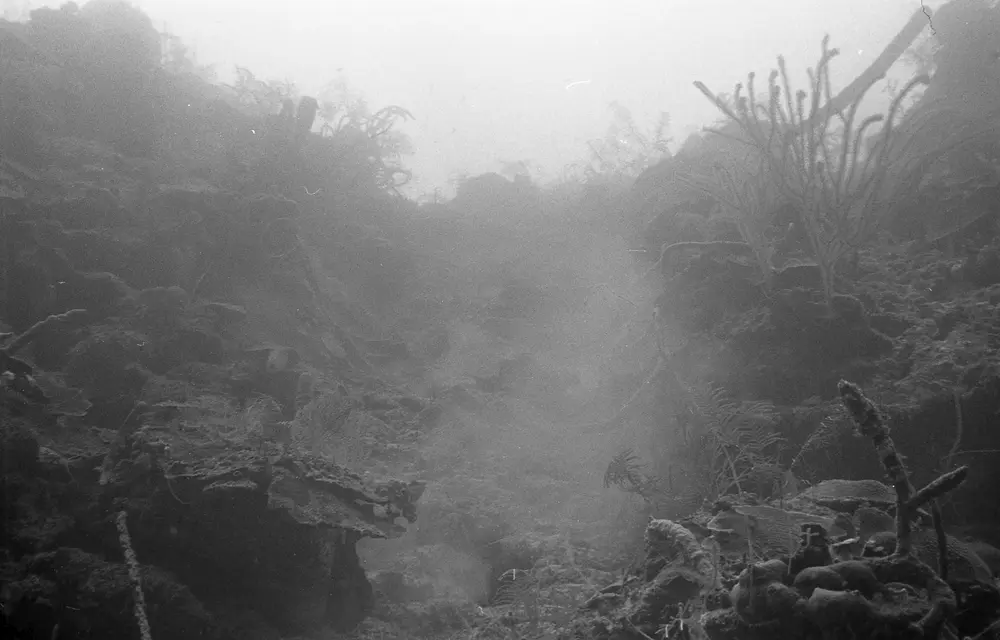{.lightbox group="discovery-bay-1966" description="**UUID: **6e916a5f-1289-4449-8d0c-5771a6b27ac0 **Date: **1967-01-22 **Location: **Jamaica | Discovery Bay | Buoy Deep **Longitude: **77.40908ºW **Latitude: **18.47325ºN **Photographer: **Eileen Graham **Copyright: **Trustees of the Natural History Museum (London, UK), CC-BY-4.0" alt="**UUID: **6e916a5f-1289-4449-8d0c-5771a6b27ac0 **Date: **1967-01-22 **Location: **Jamaica | Discovery Bay | Buoy Deep **Longitude: **77.40908ºW **Latitude: **18.47325ºN **Photographer: **Eileen Graham **Copyright: **Trustees of the Natural History Museum (London, UK), CC-BY-4.0"}

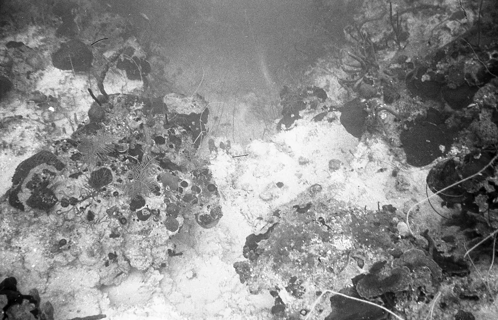{.lightbox group="discovery-bay-1966" description="**UUID: **d3520d79-6a06-458a-a29a-b4e70b4c04aa **Date: **1967-01-22 **Location: **Jamaica | Discovery Bay | Buoy Deep **Longitude: **77.40908ºW **Latitude: **18.47325ºN **Photographer: **Eileen Graham **Copyright: **Trustees of the Natural History Museum (London, UK), CC-BY-4.0" alt="**UUID: **d3520d79-6a06-458a-a29a-b4e70b4c04aa **Date: **1967-01-22 **Location: **Jamaica | Discovery Bay | Buoy Deep **Longitude: **77.40908ºW **Latitude: **18.47325ºN **Photographer: **Eileen Graham **Copyright: **Trustees of the Natural History Museum (London, UK), CC-BY-4.0"}

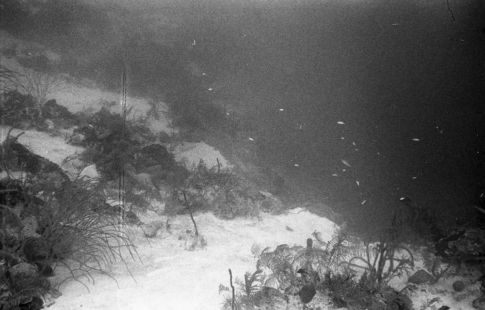{.lightbox group="discovery-bay-1966" description="**UUID: **f1155f97-67d7-48a5-bd5e-86d2a75e5d54 **Date: **1967-01-22 **Location: **Jamaica | Discovery Bay | Buoy Deep **Longitude: **77.40908ºW **Latitude: **18.47325ºN **Photographer: **Eileen Graham **Copyright: **Trustees of the Natural History Museum (London, UK), CC-BY-4.0" alt="**UUID: **f1155f97-67d7-48a5-bd5e-86d2a75e5d54 **Date: **1967-01-22 **Location: **Jamaica | Discovery Bay | Buoy Deep **Longitude: **77.40908ºW **Latitude: **18.47325ºN **Photographer: **Eileen Graham **Copyright: **Trustees of the Natural History Museum (London, UK), CC-BY-4.0"}

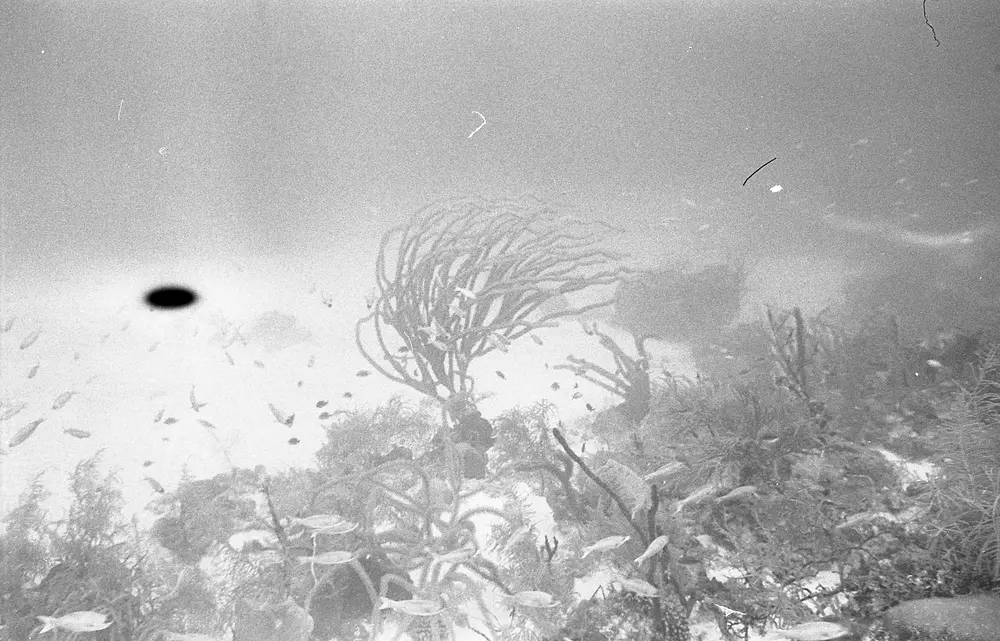{.lightbox group="discovery-bay-1966" description="**UUID: **dc79199f-0cde-4e9d-923f-2e4b46a3540d **Date: **1967-01-22 **Location: **Jamaica | Discovery Bay | Buoy Upper Slope **Longitude: **77.40908ºW **Latitude: **18.47322ºN **Photographer: **Eileen Graham **Copyright: **Trustees of the Natural History Museum (London, UK), CC-BY-4.0" alt="**UUID: **dc79199f-0cde-4e9d-923f-2e4b46a3540d **Date: **1967-01-22 **Location: **Jamaica | Discovery Bay | Buoy Upper Slope **Longitude: **77.40908ºW **Latitude: **18.47322ºN **Photographer: **Eileen Graham **Copyright: **Trustees of the Natural History Museum (London, UK), CC-BY-4.0"}

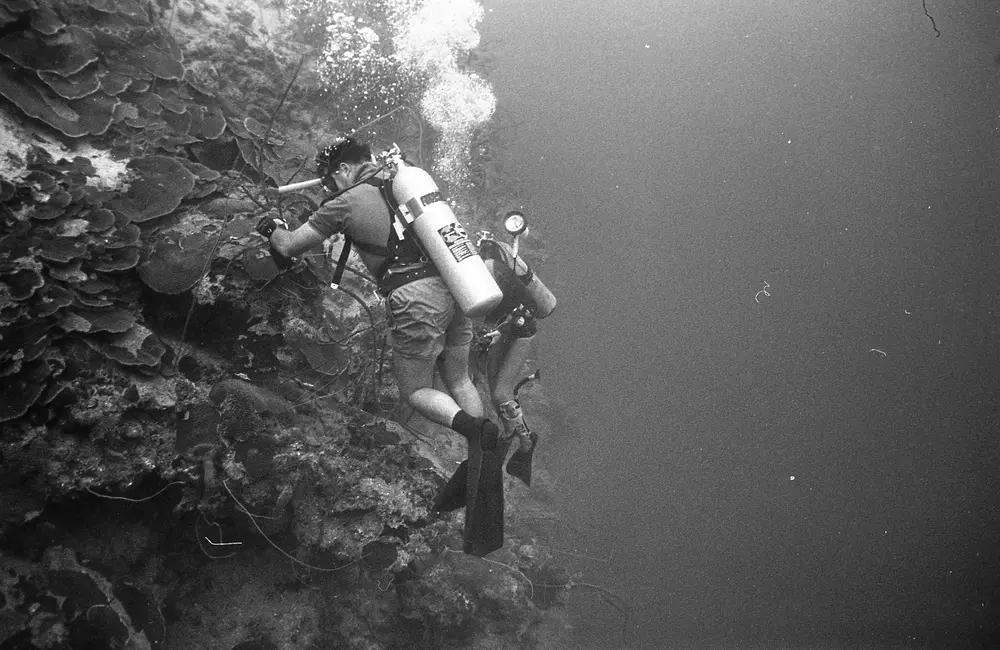{.lightbox group="discovery-bay-1966" description="**UUID: **c76ddb8d-d0de-4527-9013-c0ddaa774b39 **Date: **1967-01-22 **Location: **Jamaica | Discovery Bay | Buoy Deep **Longitude: **77.40908ºW **Latitude: **18.47325ºN **Photographer: **Eileen Graham **Copyright: **Trustees of the Natural History Museum (London, UK), CC-BY-4.0" alt="**UUID: **c76ddb8d-d0de-4527-9013-c0ddaa774b39 **Date: **1967-01-22 **Location: **Jamaica | Discovery Bay | Buoy Deep **Longitude: **77.40908ºW **Latitude: **18.47325ºN **Photographer: **Eileen Graham **Copyright: **Trustees of the Natural History Museum (London, UK), CC-BY-4.0"}

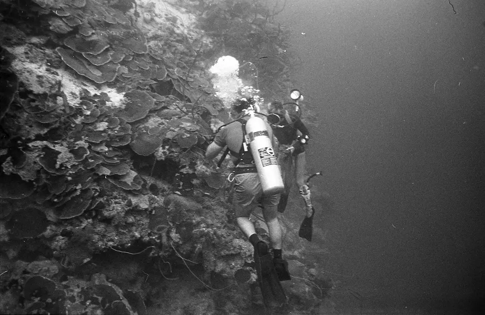{.lightbox group="discovery-bay-1966" description="**UUID: **e2aab2d9-c4b8-4b7e-9204-8316d26ca82a **Date: **1967-01-22 **Location: **Jamaica | Discovery Bay | Buoy Deep **Longitude: **77.40908ºW **Latitude: **18.47325ºN **Photographer: **Eileen Graham **Copyright: **Trustees of the Natural History Museum (London, UK), CC-BY-4.0" alt="**UUID: **e2aab2d9-c4b8-4b7e-9204-8316d26ca82a **Date: **1967-01-22 **Location: **Jamaica | Discovery Bay | Buoy Deep **Longitude: **77.40908ºW **Latitude: **18.47325ºN **Photographer: **Eileen Graham **Copyright: **Trustees of the Natural History Museum (London, UK), CC-BY-4.0"}

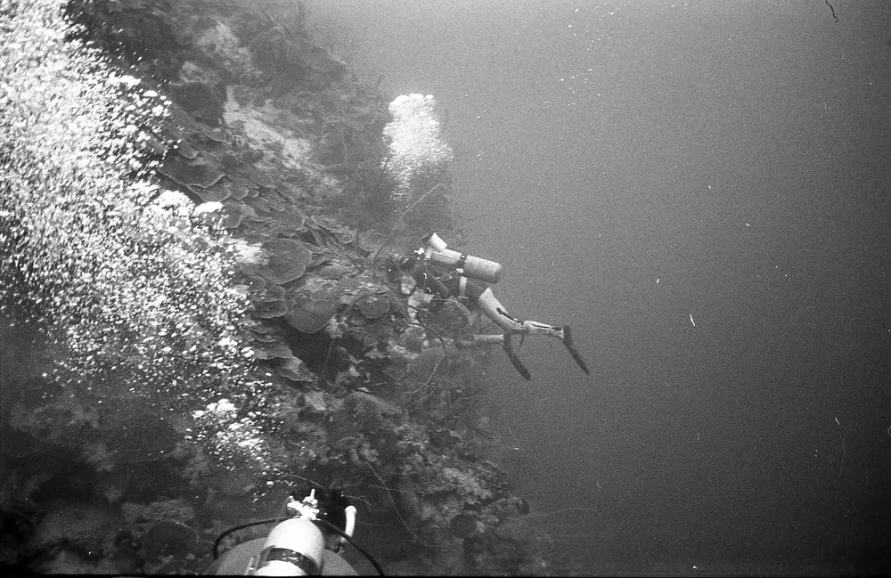{.lightbox group="discovery-bay-1966" description="**UUID: **55246fe0-252c-4f25-b7b1-81efb5d2b6c5 **Date: **1967-01-22 **Location: **Jamaica | Discovery Bay | Buoy Deep **Longitude: **77.40908ºW **Latitude: **18.47325ºN **Photographer: **Eileen Graham **Copyright: **Trustees of the Natural History Museum (London, UK), CC-BY-4.0" alt="**UUID: **55246fe0-252c-4f25-b7b1-81efb5d2b6c5 **Date: **1967-01-22 **Location: **Jamaica | Discovery Bay | Buoy Deep **Longitude: **77.40908ºW **Latitude: **18.47325ºN **Photographer: **Eileen Graham **Copyright: **Trustees of the Natural History Museum (London, UK), CC-BY-4.0"}

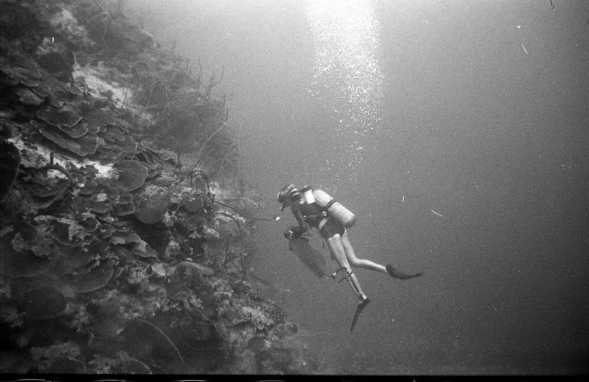{.lightbox group="discovery-bay-1966" description="**UUID: **5ef18ac5-036d-443a-8f10-bb6aac5404d5 **Date: **1967-01-22 **Location: **Jamaica | Discovery Bay | Buoy Deep **Longitude: **77.40908ºW **Latitude: **18.47325ºN **Photographer: **Eileen Graham **Copyright: **Trustees of the Natural History Museum (London, UK), CC-BY-4.0" alt="**UUID: **5ef18ac5-036d-443a-8f10-bb6aac5404d5 **Date: **1967-01-22 **Location: **Jamaica | Discovery Bay | Buoy Deep **Longitude: **77.40908ºW **Latitude: **18.47325ºN **Photographer: **Eileen Graham **Copyright: **Trustees of the Natural History Museum (London, UK), CC-BY-4.0"}

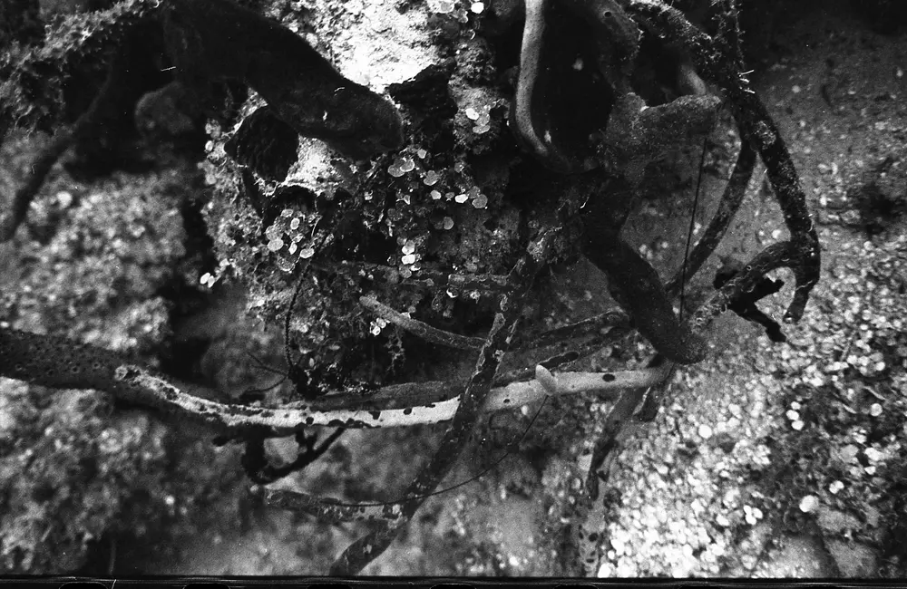{.lightbox group="discovery-bay-1966" description="**UUID: **92c87c5a-3967-43c1-8c1d-550fa27c4122 **Date: **1967-01-22 **Location: **Jamaica | Discovery Bay | Buoy Deep **Longitude: **77.40908ºW **Latitude: **18.47325ºN **Photographer: **Eileen Graham **Copyright: **Trustees of the Natural History Museum (London, UK), CC-BY-4.0" alt="**UUID: **92c87c5a-3967-43c1-8c1d-550fa27c4122 **Date: **1967-01-22 **Location: **Jamaica | Discovery Bay | Buoy Deep **Longitude: **77.40908ºW **Latitude: **18.47325ºN **Photographer: **Eileen Graham **Copyright: **Trustees of the Natural History Museum (London, UK), CC-BY-4.0"}

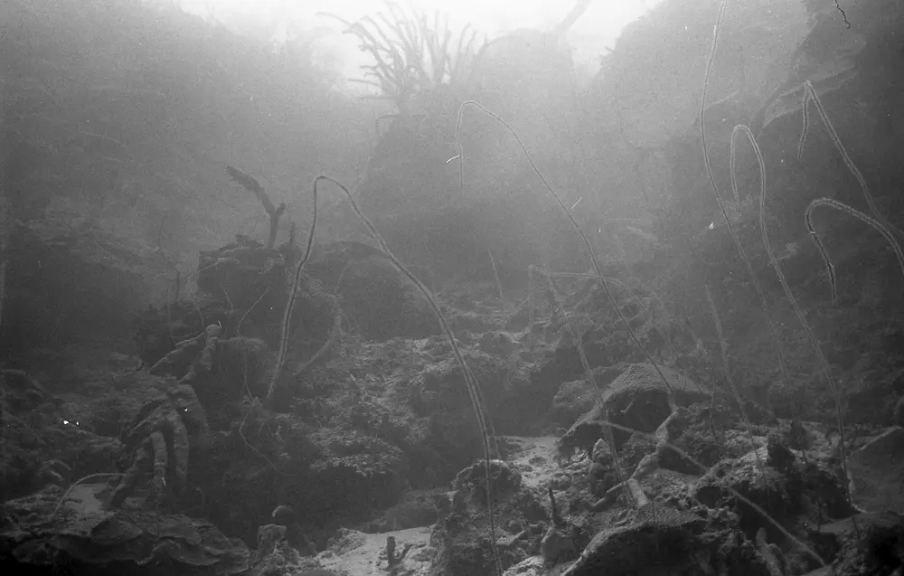{.lightbox group="discovery-bay-1966" description="**UUID: **c144ef8b-d2fa-406d-8895-be9cd0203325 **Date: **1967-01-22 **Location: **Jamaica | Discovery Bay | Buoy Deep **Longitude: **77.40908ºW **Latitude: **18.47325ºN **Photographer: **Eileen Graham **Copyright: **Trustees of the Natural History Museum (London, UK), CC-BY-4.0" alt="**UUID: **c144ef8b-d2fa-406d-8895-be9cd0203325 **Date: **1967-01-22 **Location: **Jamaica | Discovery Bay | Buoy Deep **Longitude: **77.40908ºW **Latitude: **18.47325ºN **Photographer: **Eileen Graham **Copyright: **Trustees of the Natural History Museum (London, UK), CC-BY-4.0"}

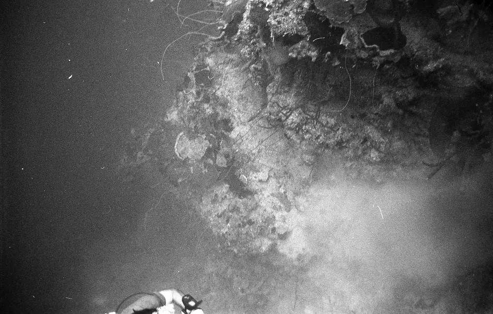{.lightbox group="discovery-bay-1966" description="**UUID: **d5a0bbd4-3646-43a7-8654-1a45991ee466 **Date: **1967-01-22 **Location: **Jamaica | Discovery Bay | Buoy Deep **Longitude: **77.40908ºW **Latitude: **18.47325ºN **Photographer: **Eileen Graham **Copyright: **Trustees of the Natural History Museum (London, UK), CC-BY-4.0" alt="**UUID: **d5a0bbd4-3646-43a7-8654-1a45991ee466 **Date: **1967-01-22 **Location: **Jamaica | Discovery Bay | Buoy Deep **Longitude: **77.40908ºW **Latitude: **18.47325ºN **Photographer: **Eileen Graham **Copyright: **Trustees of the Natural History Museum (London, UK), CC-BY-4.0"}

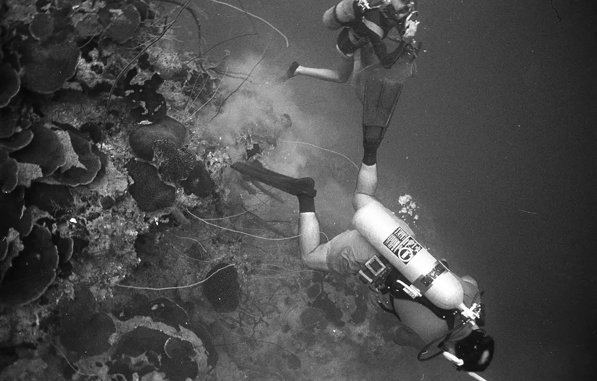{.lightbox group="discovery-bay-1966" description="**UUID: **4e39721f-8d99-4f7d-a368-6674e0411fd4 **Date: **1967-01-22 **Location: **Jamaica | Discovery Bay | Buoy Deep **Longitude: **77.40908ºW **Latitude: **18.47325ºN **Photographer: **Eileen Graham **Copyright: **Trustees of the Natural History Museum (London, UK), CC-BY-4.0" alt="**UUID: **4e39721f-8d99-4f7d-a368-6674e0411fd4 **Date: **1967-01-22 **Location: **Jamaica | Discovery Bay | Buoy Deep **Longitude: **77.40908ºW **Latitude: **18.47325ºN **Photographer: **Eileen Graham **Copyright: **Trustees of the Natural History Museum (London, UK), CC-BY-4.0"}

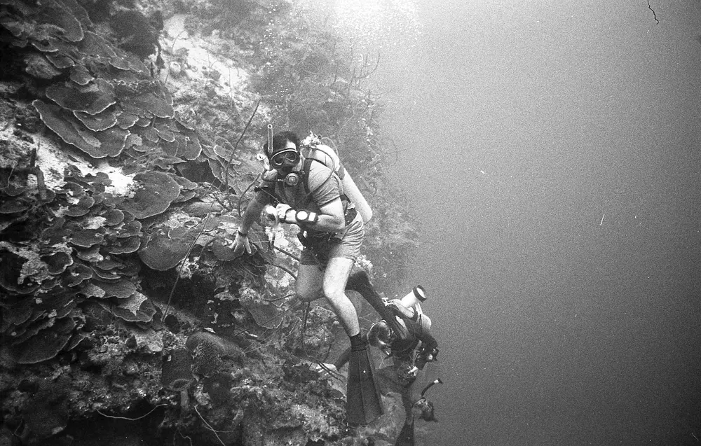{.lightbox group="discovery-bay-1966" description="**UUID: **43397871-d840-4ecb-9962-c76e3761acd4 **Date: **1967-01-22 **Location: **Jamaica | Discovery Bay | Buoy Deep **Longitude: **77.40908ºW **Latitude: **18.47325ºN **Photographer: **Eileen Graham **Copyright: **Trustees of the Natural History Museum (London, UK), CC-BY-4.0" alt="**UUID: **43397871-d840-4ecb-9962-c76e3761acd4 **Date: **1967-01-22 **Location: **Jamaica | Discovery Bay | Buoy Deep **Longitude: **77.40908ºW **Latitude: **18.47325ºN **Photographer: **Eileen Graham **Copyright: **Trustees of the Natural History Museum (London, UK), CC-BY-4.0"}

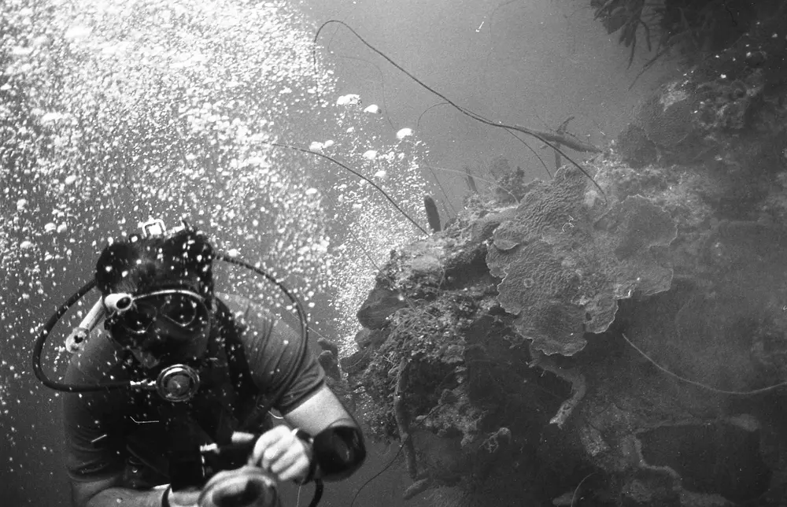{.lightbox group="discovery-bay-1966" description="**UUID: **9a05f4f0-f252-40f2-a90b-30d4edd2547a **Date: **1967-01-22 **Location: **Jamaica | Discovery Bay | Buoy Deep **Longitude: **77.40908ºW **Latitude: **18.47325ºN **Photographer: **Eileen Graham **Copyright: **Trustees of the Natural History Museum (London, UK), CC-BY-4.0" alt="**UUID: **9a05f4f0-f252-40f2-a90b-30d4edd2547a **Date: **1967-01-22 **Location: **Jamaica | Discovery Bay | Buoy Deep **Longitude: **77.40908ºW **Latitude: **18.47325ºN **Photographer: **Eileen Graham **Copyright: **Trustees of the Natural History Museum (London, UK), CC-BY-4.0"}

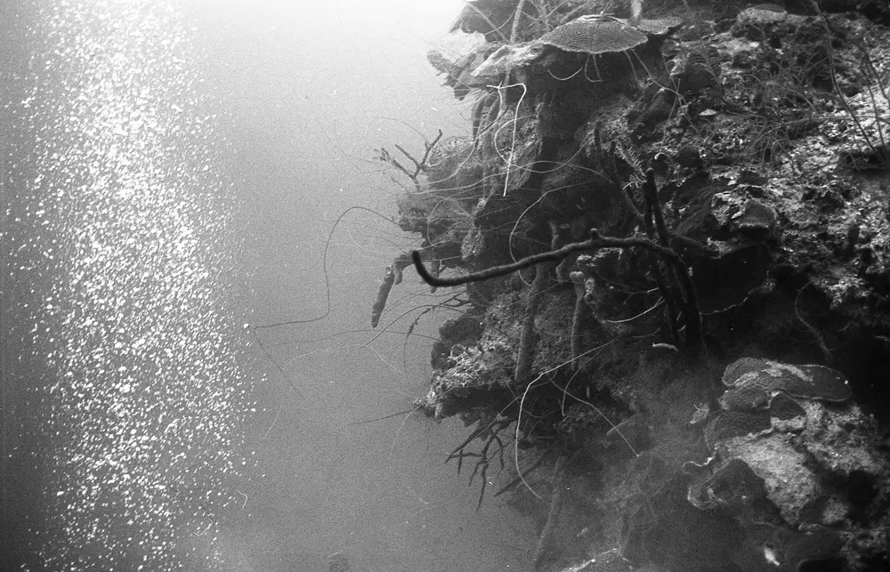{.lightbox group="discovery-bay-1966" description="**UUID: **d42581fe-8ddc-4d9e-9137-def8f2fd82bd **Date: **1967-01-22 **Location: **Jamaica | Discovery Bay | Buoy Deep **Longitude: **77.40908ºW **Latitude: **18.47325ºN **Photographer: **Eileen Graham **Copyright: **Trustees of the Natural History Museum (London, UK), CC-BY-4.0" alt="**UUID: **d42581fe-8ddc-4d9e-9137-def8f2fd82bd **Date: **1967-01-22 **Location: **Jamaica | Discovery Bay | Buoy Deep **Longitude: **77.40908ºW **Latitude: **18.47325ºN **Photographer: **Eileen Graham **Copyright: **Trustees of the Natural History Museum (London, UK), CC-BY-4.0"}

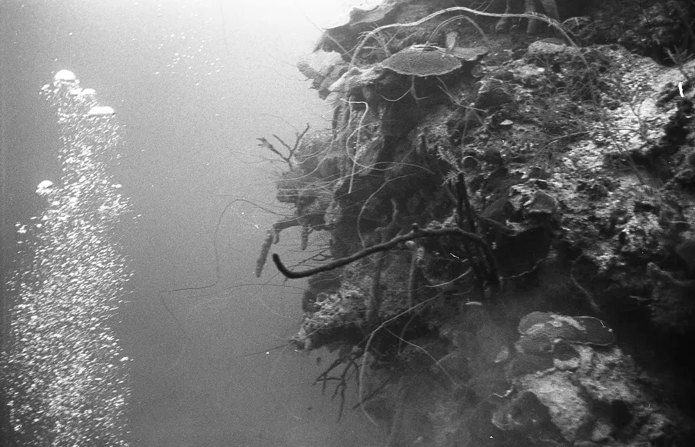{.lightbox group="discovery-bay-1966" description="**UUID: **04b746e6-393e-4fdd-9c74-dca57a09992b **Date: **1967-01-22 **Location: **Jamaica | Discovery Bay | Buoy Deep **Longitude: **77.40908ºW **Latitude: **18.47325ºN **Photographer: **Eileen Graham **Copyright: **Trustees of the Natural History Museum (London, UK), CC-BY-4.0" alt="**UUID: **04b746e6-393e-4fdd-9c74-dca57a09992b **Date: **1967-01-22 **Location: **Jamaica | Discovery Bay | Buoy Deep **Longitude: **77.40908ºW **Latitude: **18.47325ºN **Photographer: **Eileen Graham **Copyright: **Trustees of the Natural History Museum (London, UK), CC-BY-4.0"}

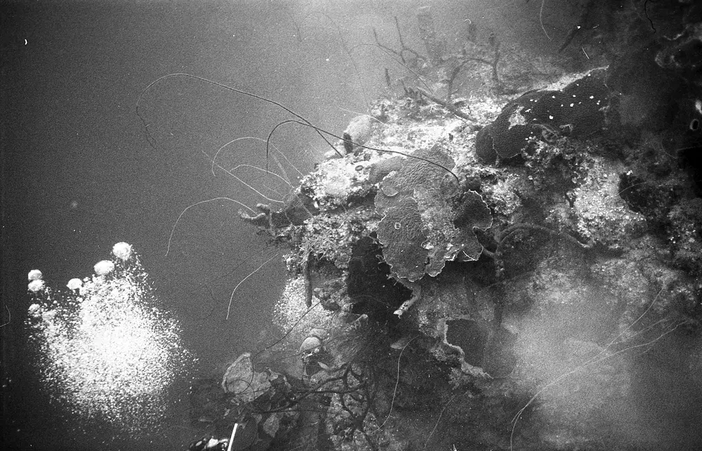{.lightbox group="discovery-bay-1966" description="**UUID: **0c3dfa22-b1aa-4fc9-9738-1364d5aaa13b **Date: **1967-01-22 **Location: **Jamaica | Discovery Bay | Buoy Deep **Longitude: **77.40908ºW **Latitude: **18.47325ºN **Photographer: **Eileen Graham **Copyright: **Trustees of the Natural History Museum (London, UK), CC-BY-4.0" alt="**UUID: **0c3dfa22-b1aa-4fc9-9738-1364d5aaa13b **Date: **1967-01-22 **Location: **Jamaica | Discovery Bay | Buoy Deep **Longitude: **77.40908ºW **Latitude: **18.47325ºN **Photographer: **Eileen Graham **Copyright: **Trustees of the Natural History Museum (London, UK), CC-BY-4.0"}

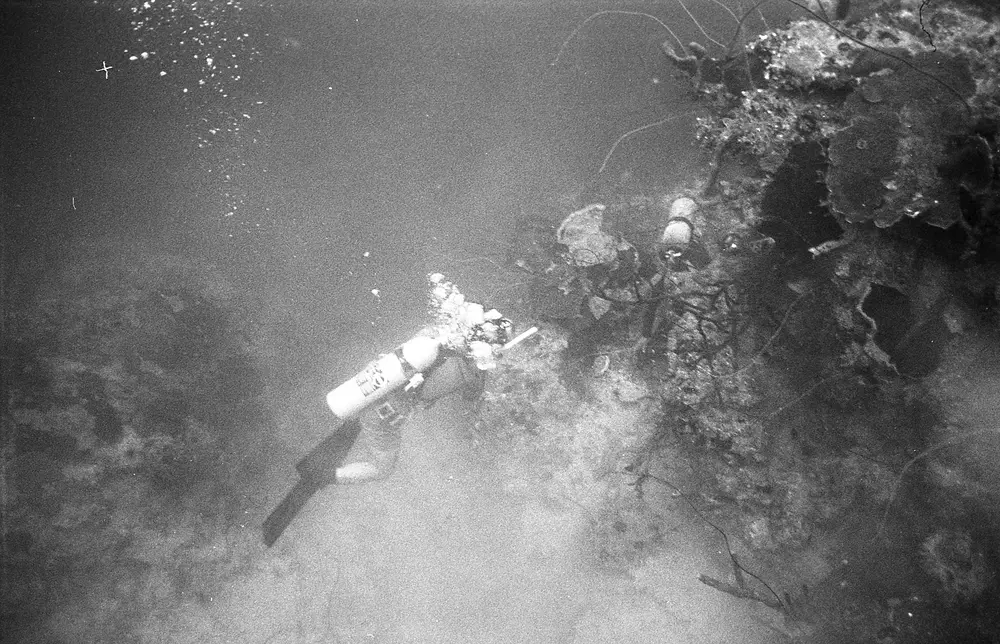{.lightbox group="discovery-bay-1966" description="**UUID: **93ac4e1d-593f-44d7-b9aa-0c2c2d308052 **Date: **1967-01-22 **Location: **Jamaica | Discovery Bay | Buoy Deep **Longitude: **77.40908ºW **Latitude: **18.47325ºN **Photographer: **Eileen Graham **Copyright: **Trustees of the Natural History Museum (London, UK), CC-BY-4.0" alt="**UUID: **93ac4e1d-593f-44d7-b9aa-0c2c2d308052 **Date: **1967-01-22 **Location: **Jamaica | Discovery Bay | Buoy Deep **Longitude: **77.40908ºW **Latitude: **18.47325ºN **Photographer: **Eileen Graham **Copyright: **Trustees of the Natural History Museum (London, UK), CC-BY-4.0"}

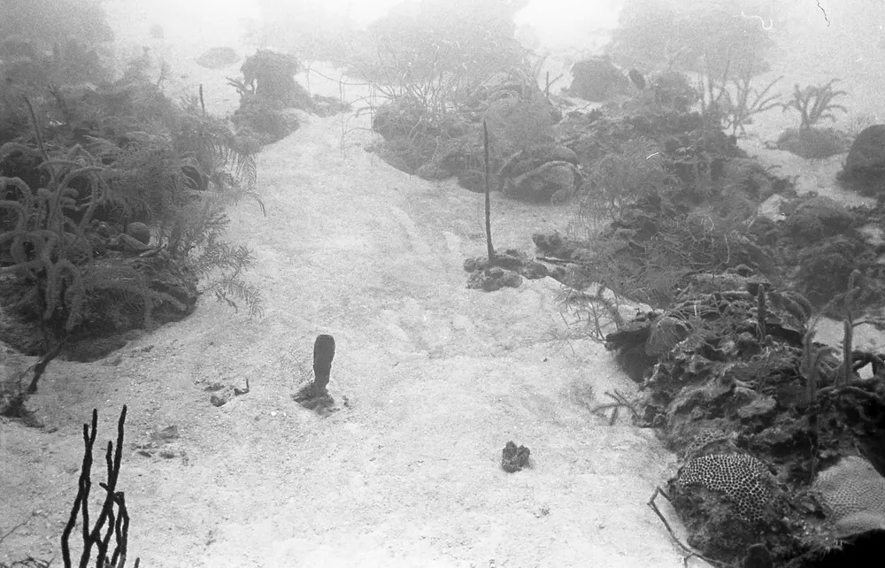{.lightbox group="discovery-bay-1966" description="**UUID: **07eb5244-792e-4337-8587-669db9483b59 **Date: **1967-01-22 **Location: **Jamaica | Discovery Bay | Buoy Deep **Longitude: **77.40908ºW **Latitude: **18.47325ºN **Photographer: **Eileen Graham **Copyright: **Trustees of the Natural History Museum (London, UK), CC-BY-4.0" alt="**UUID: **07eb5244-792e-4337-8587-669db9483b59 **Date: **1967-01-22 **Location: **Jamaica | Discovery Bay | Buoy Deep **Longitude: **77.40908ºW **Latitude: **18.47325ºN **Photographer: **Eileen Graham **Copyright: **Trustees of the Natural History Museum (London, UK), CC-BY-4.0"}

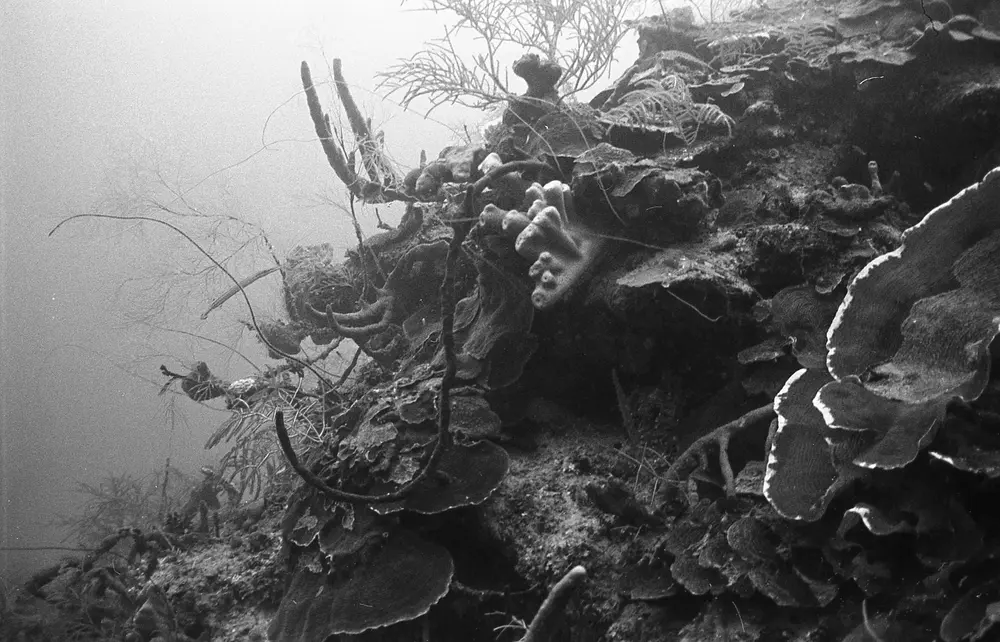{.lightbox group="discovery-bay-1966" description="**UUID: **5a557140-ba9b-4686-89b4-409140d2b8dc **Date: **1967-01-22 **Location: **Jamaica | Discovery Bay | Buoy Deep **Longitude: **77.40908ºW **Latitude: **18.47325ºN **Photographer: **Eileen Graham **Copyright: **Trustees of the Natural History Museum (London, UK), CC-BY-4.0" alt="**UUID: **5a557140-ba9b-4686-89b4-409140d2b8dc **Date: **1967-01-22 **Location: **Jamaica | Discovery Bay | Buoy Deep **Longitude: **77.40908ºW **Latitude: **18.47325ºN **Photographer: **Eileen Graham **Copyright: **Trustees of the Natural History Museum (London, UK), CC-BY-4.0"}

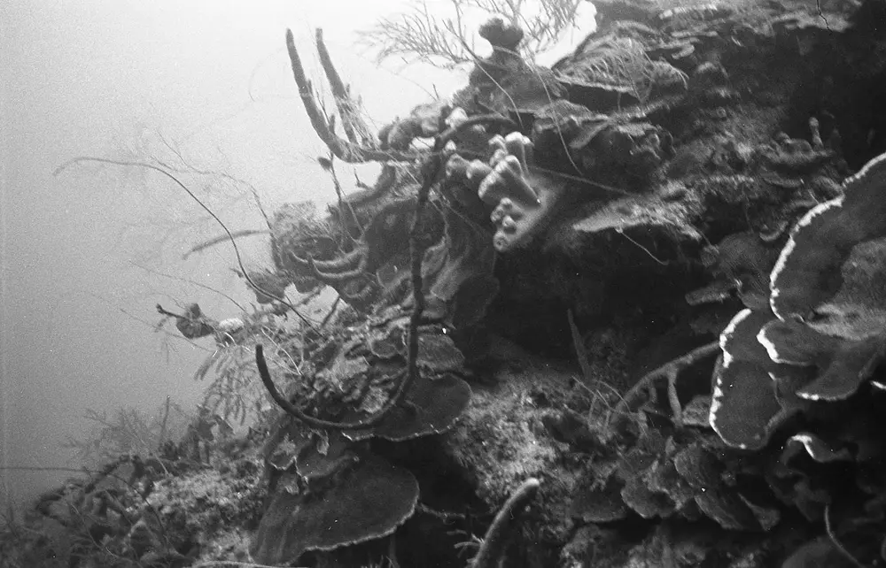{.lightbox group="discovery-bay-1966" description="**UUID: **9363e93c-568d-4344-9c53-42a2b0c62202 **Date: **1967-01-22 **Location: **Jamaica | Discovery Bay | Buoy Deep **Longitude: **77.40908ºW **Latitude: **18.47325ºN **Photographer: **Eileen Graham **Copyright: **Trustees of the Natural History Museum (London, UK), CC-BY-4.0" alt="**UUID: **9363e93c-568d-4344-9c53-42a2b0c62202 **Date: **1967-01-22 **Location: **Jamaica | Discovery Bay | Buoy Deep **Longitude: **77.40908ºW **Latitude: **18.47325ºN **Photographer: **Eileen Graham **Copyright: **Trustees of the Natural History Museum (London, UK), CC-BY-4.0"}

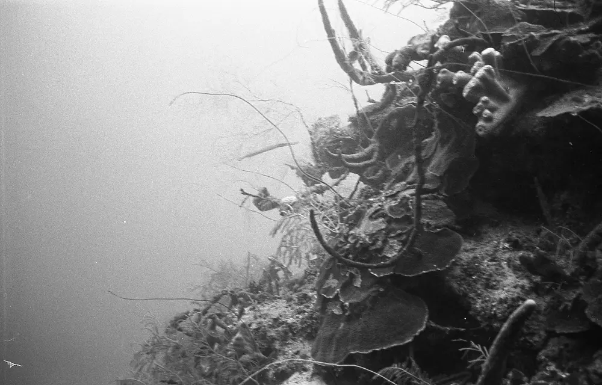{.lightbox group="discovery-bay-1966" description="**UUID: **ed070110-a650-40c3-9f07-6bc4366bb869 **Date: **1967-01-22 **Location: **Jamaica | Discovery Bay | Buoy Deep **Longitude: **77.40908ºW **Latitude: **18.47325ºN **Photographer: **Eileen Graham **Copyright: **Trustees of the Natural History Museum (London, UK), CC-BY-4.0" alt="**UUID: **ed070110-a650-40c3-9f07-6bc4366bb869 **Date: **1967-01-22 **Location: **Jamaica | Discovery Bay | Buoy Deep **Longitude: **77.40908ºW **Latitude: **18.47325ºN **Photographer: **Eileen Graham **Copyright: **Trustees of the Natural History Museum (London, UK), CC-BY-4.0"}

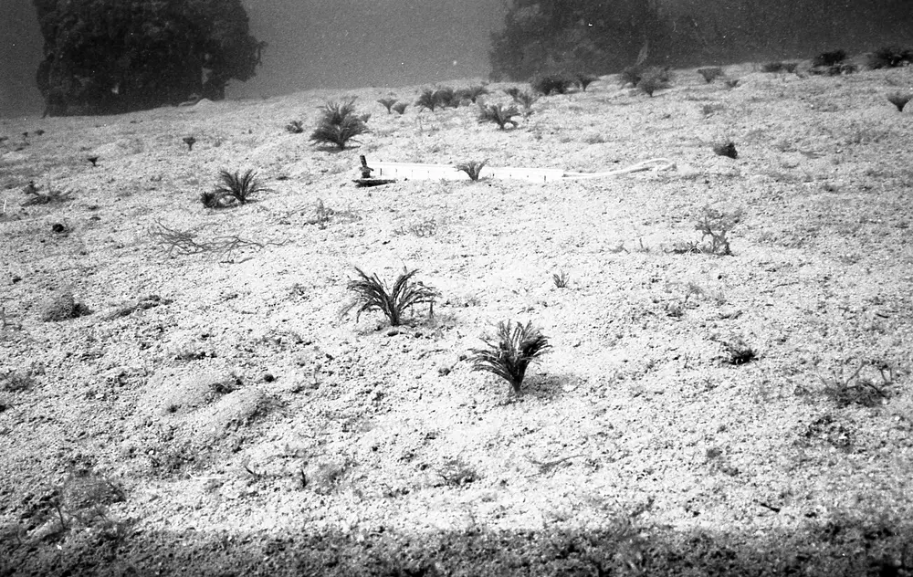{.lightbox group="discovery-bay-1966" description="**UUID: **c7a2c983-5e18-413f-9d18-5f8d34553f42 **Date: **1967-09-02 **Location: **Jamaica | Discovery Bay | Algal Plots **Longitude: **77.414ºW **Latitude: **18.473ºN **Photographer: **Eileen Graham **Copyright: **Trustees of the Natural History Museum (London, UK), CC-BY-4.0" alt="**UUID: **c7a2c983-5e18-413f-9d18-5f8d34553f42 **Date: **1967-09-02 **Location: **Jamaica | Discovery Bay | Algal Plots **Longitude: **77.414ºW **Latitude: **18.473ºN **Photographer: **Eileen Graham **Copyright: **Trustees of the Natural History Museum (London, UK), CC-BY-4.0"}

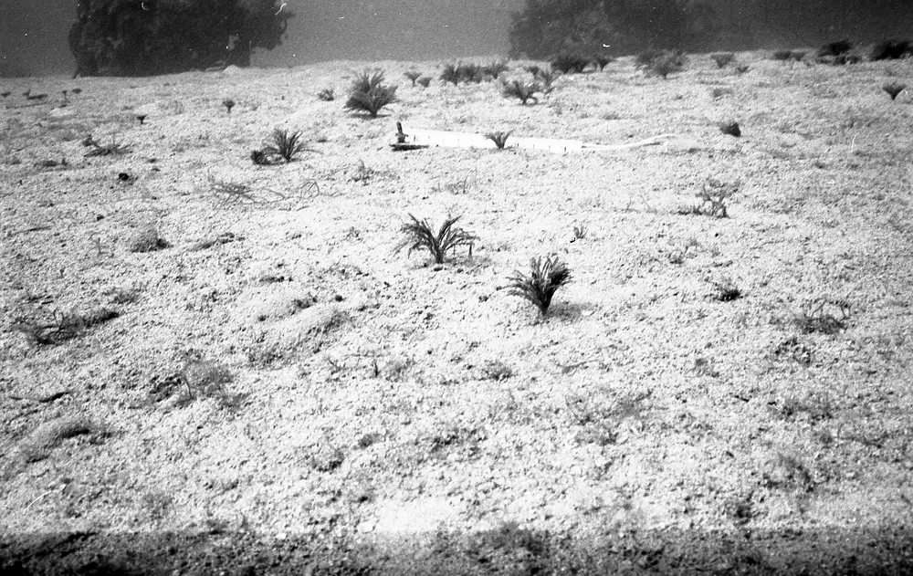{.lightbox group="discovery-bay-1966" description="**UUID: **4ae86797-858f-431c-967c-46ec8a395551 **Date: **1967-09-02 **Location: **Jamaica | Discovery Bay | Algal Plots **Longitude: **77.414ºW **Latitude: **18.473ºN **Photographer: **Eileen Graham **Copyright: **Trustees of the Natural History Museum (London, UK), CC-BY-4.0" alt="**UUID: **4ae86797-858f-431c-967c-46ec8a395551 **Date: **1967-09-02 **Location: **Jamaica | Discovery Bay | Algal Plots **Longitude: **77.414ºW **Latitude: **18.473ºN **Photographer: **Eileen Graham **Copyright: **Trustees of the Natural History Museum (London, UK), CC-BY-4.0"}

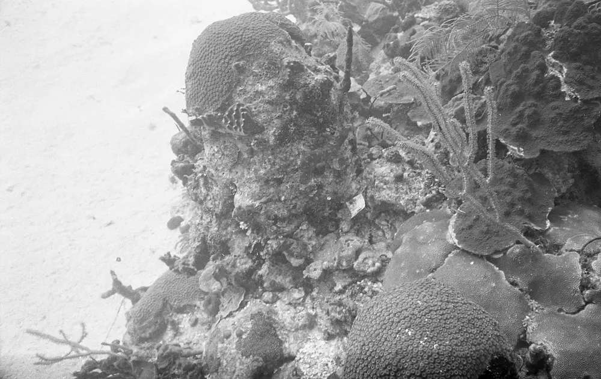{.lightbox group="discovery-bay-1966" description="**UUID: **aad3aed0-dac9-4e3e-a31c-f6bd9af42d7c **Date: **1967-09-02 **Location: **Jamaica | Discovery Bay | Buoy Upper Slope **Longitude: **77.40908ºW **Latitude: **18.47322ºN **Photographer: **Eileen Graham **Copyright: **Trustees of the Natural History Museum (London, UK), CC-BY-4.0" alt="**UUID: **aad3aed0-dac9-4e3e-a31c-f6bd9af42d7c **Date: **1967-09-02 **Location: **Jamaica | Discovery Bay | Buoy Upper Slope **Longitude: **77.40908ºW **Latitude: **18.47322ºN **Photographer: **Eileen Graham **Copyright: **Trustees of the Natural History Museum (London, UK), CC-BY-4.0"}

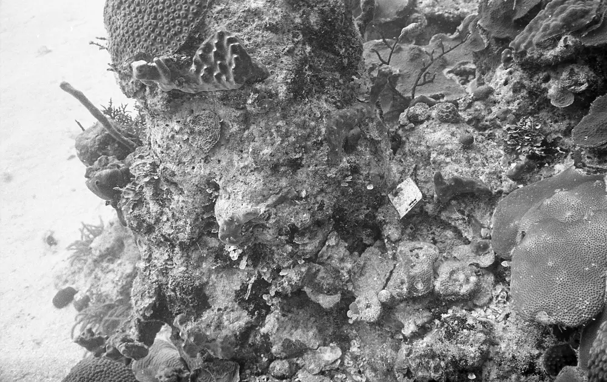{.lightbox group="discovery-bay-1966" description="**UUID: **972f165b-4a40-40b6-933f-977898d32cdf **Date: **1967-09-02 **Location: **Jamaica | Discovery Bay | Buoy Upper Slope **Longitude: **77.40908ºW **Latitude: **18.47322ºN **Photographer: **Eileen Graham **Copyright: **Trustees of the Natural History Museum (London, UK), CC-BY-4.0" alt="**UUID: **972f165b-4a40-40b6-933f-977898d32cdf **Date: **1967-09-02 **Location: **Jamaica | Discovery Bay | Buoy Upper Slope **Longitude: **77.40908ºW **Latitude: **18.47322ºN **Photographer: **Eileen Graham **Copyright: **Trustees of the Natural History Museum (London, UK), CC-BY-4.0"}

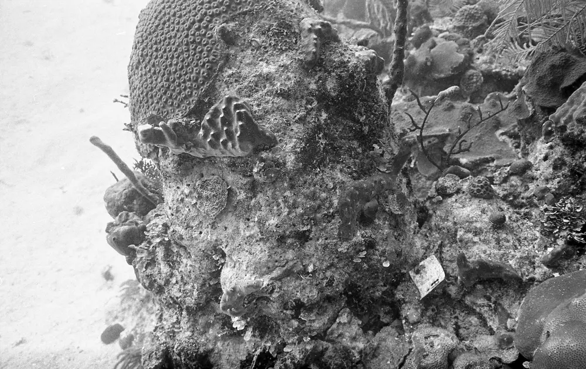{.lightbox group="discovery-bay-1966" description="**UUID: **09be0b49-dda1-4f55-81dc-d669ded452a9 **Date: **1967-09-02 **Location: **Jamaica | Discovery Bay | Buoy Upper Slope **Longitude: **77.40908ºW **Latitude: **18.47322ºN **Photographer: **Eileen Graham **Copyright: **Trustees of the Natural History Museum (London, UK), CC-BY-4.0" alt="**UUID: **09be0b49-dda1-4f55-81dc-d669ded452a9 **Date: **1967-09-02 **Location: **Jamaica | Discovery Bay | Buoy Upper Slope **Longitude: **77.40908ºW **Latitude: **18.47322ºN **Photographer: **Eileen Graham **Copyright: **Trustees of the Natural History Museum (London, UK), CC-BY-4.0"}

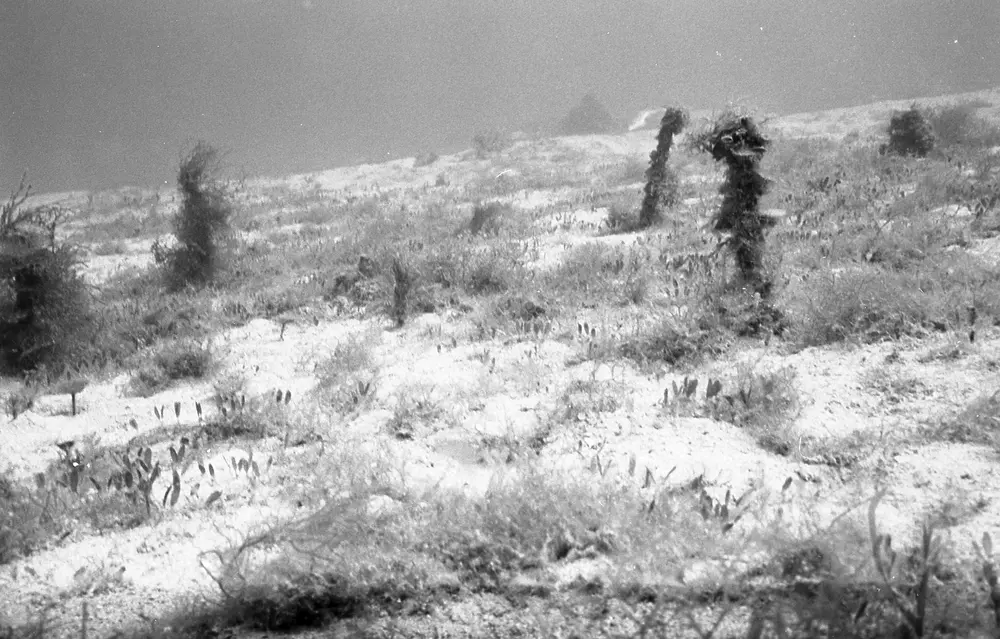{.lightbox group="discovery-bay-1966" description="**UUID: **20179647-0487-4407-acf9-86bd687394dd **Date: **1967-09-02 **Location: **Jamaica | Discovery Bay | Algal Plots **Longitude: **77.414ºW **Latitude: **18.473ºN **Photographer: **Eileen Graham **Copyright: **Trustees of the Natural History Museum (London, UK), CC-BY-4.0" alt="**UUID: **20179647-0487-4407-acf9-86bd687394dd **Date: **1967-09-02 **Location: **Jamaica | Discovery Bay | Algal Plots **Longitude: **77.414ºW **Latitude: **18.473ºN **Photographer: **Eileen Graham **Copyright: **Trustees of the Natural History Museum (London, UK), CC-BY-4.0"}

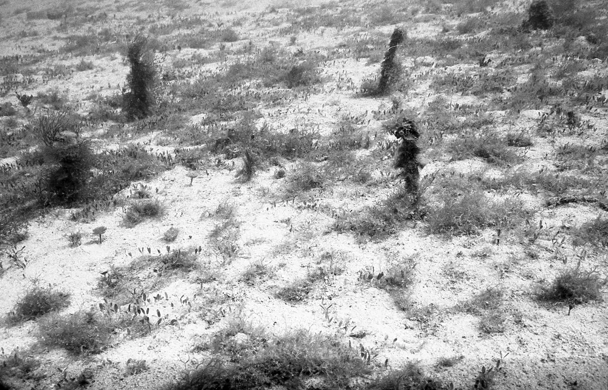{.lightbox group="discovery-bay-1966" description="**UUID: **36451431-2f09-4827-98ba-cb394e3f152f **Date: **1967-09-02 **Location: **Jamaica | Discovery Bay | Algal Plots **Longitude: **77.414ºW **Latitude: **18.473ºN **Photographer: **Eileen Graham **Copyright: **Trustees of the Natural History Museum (London, UK), CC-BY-4.0" alt="**UUID: **36451431-2f09-4827-98ba-cb394e3f152f **Date: **1967-09-02 **Location: **Jamaica | Discovery Bay | Algal Plots **Longitude: **77.414ºW **Latitude: **18.473ºN **Photographer: **Eileen Graham **Copyright: **Trustees of the Natural History Museum (London, UK), CC-BY-4.0"}

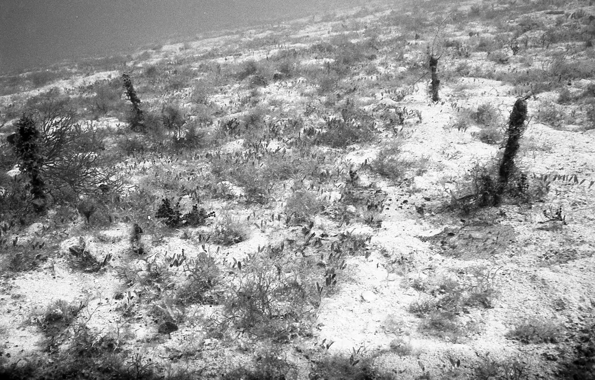{.lightbox group="discovery-bay-1966" description="**UUID: **a2bbfa99-7f35-4771-96be-b974eca3d66e **Date: **1967-09-02 **Location: **Jamaica | Discovery Bay | Algal Plots **Longitude: **77.414ºW **Latitude: **18.473ºN **Photographer: **Eileen Graham **Copyright: **Trustees of the Natural History Museum (London, UK), CC-BY-4.0" alt="**UUID: **a2bbfa99-7f35-4771-96be-b974eca3d66e **Date: **1967-09-02 **Location: **Jamaica | Discovery Bay | Algal Plots **Longitude: **77.414ºW **Latitude: **18.473ºN **Photographer: **Eileen Graham **Copyright: **Trustees of the Natural History Museum (London, UK), CC-BY-4.0"}

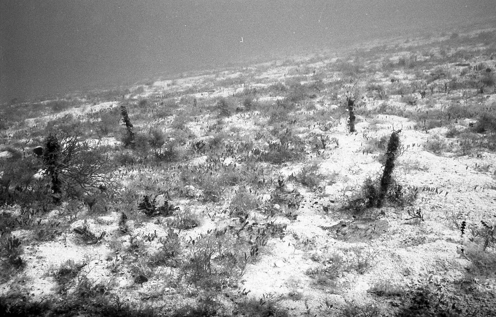{.lightbox group="discovery-bay-1966" description="**UUID: **b11f0ca7-8162-4aab-a8f5-48bcd036b252 **Date: **1967-09-02 **Location: **Jamaica | Discovery Bay | Algal Plots **Longitude: **77.414ºW **Latitude: **18.473ºN **Photographer: **Eileen Graham **Copyright: **Trustees of the Natural History Museum (London, UK), CC-BY-4.0" alt="**UUID: **b11f0ca7-8162-4aab-a8f5-48bcd036b252 **Date: **1967-09-02 **Location: **Jamaica | Discovery Bay | Algal Plots **Longitude: **77.414ºW **Latitude: **18.473ºN **Photographer: **Eileen Graham **Copyright: **Trustees of the Natural History Museum (London, UK), CC-BY-4.0"}

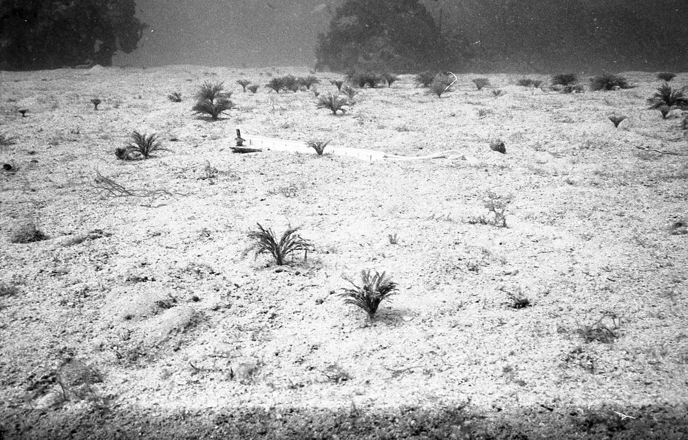{.lightbox group="discovery-bay-1966" description="**UUID: **fbc72506-5de0-40ba-a05b-15cb8cc3fc19 **Date: **1967-09-02 **Location: **Jamaica | Discovery Bay | Algal Plots **Longitude: **77.414ºW **Latitude: **18.473ºN **Photographer: **Eileen Graham **Copyright: **Trustees of the Natural History Museum (London, UK), CC-BY-4.0" alt="**UUID: **fbc72506-5de0-40ba-a05b-15cb8cc3fc19 **Date: **1967-09-02 **Location: **Jamaica | Discovery Bay | Algal Plots **Longitude: **77.414ºW **Latitude: **18.473ºN **Photographer: **Eileen Graham **Copyright: **Trustees of the Natural History Museum (London, UK), CC-BY-4.0"}

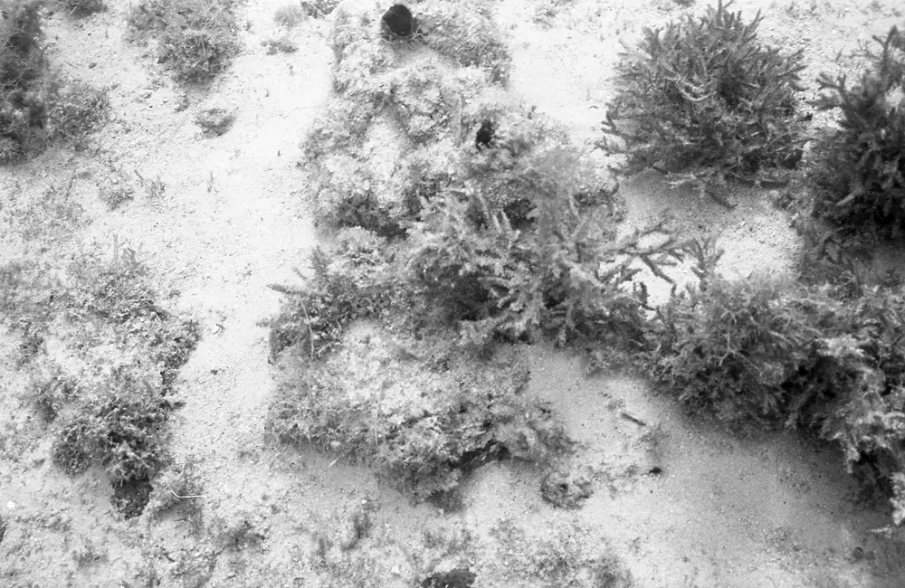{.lightbox group="discovery-bay-1966" description="**UUID: **e2c7e305-0469-4eef-b42e-cee4cb245c04 **Date: **1967-09-02 **Location: **Jamaica | Discovery Bay | Algal Plots **Longitude: **77.414ºW **Latitude: **18.473ºN **Photographer: **Eileen Graham **Copyright: **Trustees of the Natural History Museum (London, UK), CC-BY-4.0" alt="**UUID: **e2c7e305-0469-4eef-b42e-cee4cb245c04 **Date: **1967-09-02 **Location: **Jamaica | Discovery Bay | Algal Plots **Longitude: **77.414ºW **Latitude: **18.473ºN **Photographer: **Eileen Graham **Copyright: **Trustees of the Natural History Museum (London, UK), CC-BY-4.0"}

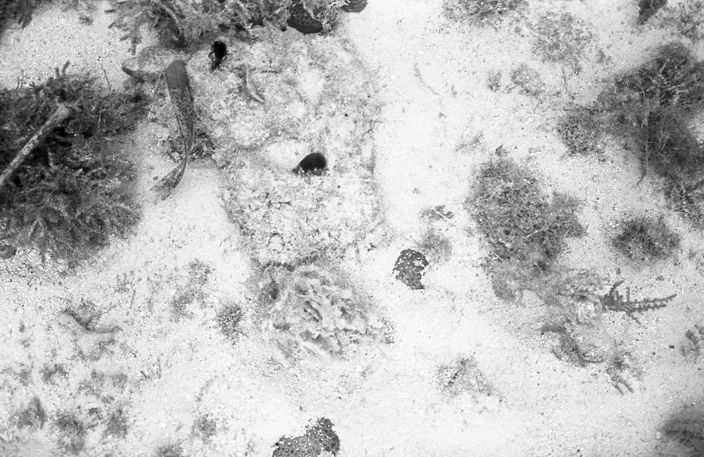{.lightbox group="discovery-bay-1966" description="**UUID: **225a5c11-4b81-46e1-a779-5eb3b3eec8f1 **Date: **1967-09-02 **Location: **Jamaica | Discovery Bay | Algal Plots **Longitude: **77.414ºW **Latitude: **18.473ºN **Photographer: **Eileen Graham **Copyright: **Trustees of the Natural History Museum (London, UK), CC-BY-4.0" alt="**UUID: **225a5c11-4b81-46e1-a779-5eb3b3eec8f1 **Date: **1967-09-02 **Location: **Jamaica | Discovery Bay | Algal Plots **Longitude: **77.414ºW **Latitude: **18.473ºN **Photographer: **Eileen Graham **Copyright: **Trustees of the Natural History Museum (London, UK), CC-BY-4.0"}

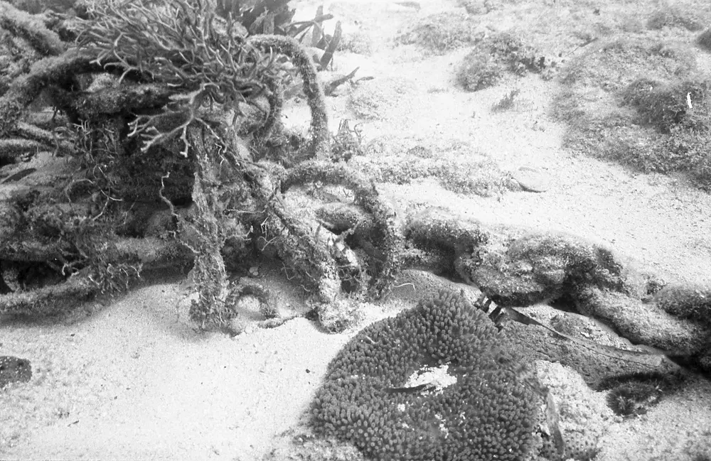{.lightbox group="discovery-bay-1966" description="**UUID: **c0f17705-e7f7-403a-919b-c938ad7983f3 **Date: **1967-09-02 **Location: **Jamaica | Discovery Bay | Algal Plots **Longitude: **77.414ºW **Latitude: **18.473ºN **Photographer: **Eileen Graham **Copyright: **Trustees of the Natural History Museum (London, UK), CC-BY-4.0" alt="**UUID: **c0f17705-e7f7-403a-919b-c938ad7983f3 **Date: **1967-09-02 **Location: **Jamaica | Discovery Bay | Algal Plots **Longitude: **77.414ºW **Latitude: **18.473ºN **Photographer: **Eileen Graham **Copyright: **Trustees of the Natural History Museum (London, UK), CC-BY-4.0"}

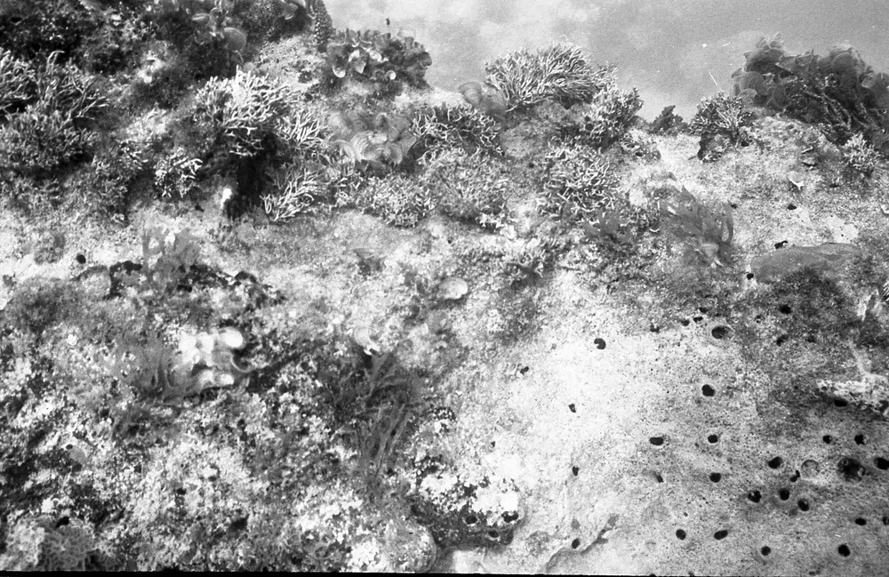{.lightbox group="discovery-bay-1966" description="**UUID: **7d9bc41a-7ffe-4442-8a8d-97c9ac69cb4a **Date: **1967-09-02 **Location: **Jamaica | Discovery Bay | Algal Plots **Longitude: **77.414ºW **Latitude: **18.473ºN **Photographer: **Eileen Graham **Copyright: **Trustees of the Natural History Museum (London, UK), CC-BY-4.0" alt="**UUID: **7d9bc41a-7ffe-4442-8a8d-97c9ac69cb4a **Date: **1967-09-02 **Location: **Jamaica | Discovery Bay | Algal Plots **Longitude: **77.414ºW **Latitude: **18.473ºN **Photographer: **Eileen Graham **Copyright: **Trustees of the Natural History Museum (London, UK), CC-BY-4.0"}

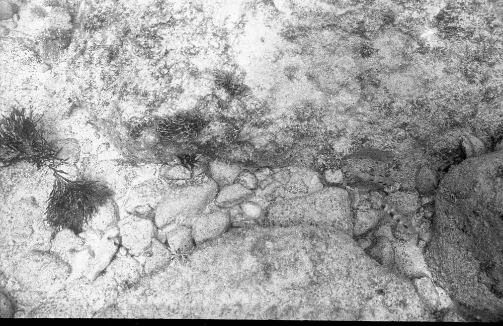{.lightbox group="discovery-bay-1966" description="**UUID: **47604157-43ed-4d94-82d8-3cd23ed015b3 **Date: **1967-09-02 **Location: **Jamaica | Discovery Bay | Algal Plots **Longitude: **77.414ºW **Latitude: **18.473ºN **Photographer: **Eileen Graham **Copyright: **Trustees of the Natural History Museum (London, UK), CC-BY-4.0" alt="**UUID: **47604157-43ed-4d94-82d8-3cd23ed015b3 **Date: **1967-09-02 **Location: **Jamaica | Discovery Bay | Algal Plots **Longitude: **77.414ºW **Latitude: **18.473ºN **Photographer: **Eileen Graham **Copyright: **Trustees of the Natural History Museum (London, UK), CC-BY-4.0"}

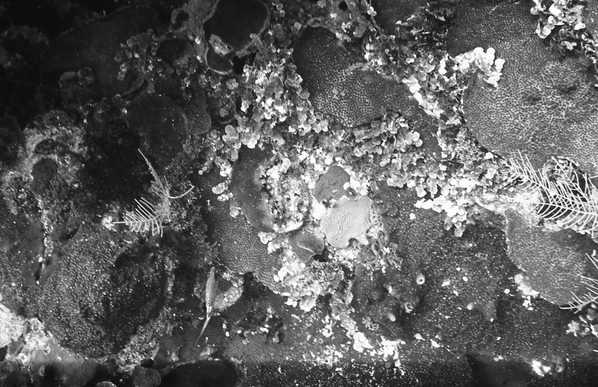{.lightbox group="discovery-bay-1966" description="**UUID: **28f4a0e5-256b-4ed4-981c-57eb784c0b95 **Date: **1967-10-02 **Location: **Jamaica | Discovery Bay | Pinnacle 1 Slope **Longitude: **77.41017ºW **Latitude: **18.47367ºN **Photographer: **Eileen Graham **Copyright: **Trustees of the Natural History Museum (London, UK), CC-BY-4.0" alt="**UUID: **28f4a0e5-256b-4ed4-981c-57eb784c0b95 **Date: **1967-10-02 **Location: **Jamaica | Discovery Bay | Pinnacle 1 Slope **Longitude: **77.41017ºW **Latitude: **18.47367ºN **Photographer: **Eileen Graham **Copyright: **Trustees of the Natural History Museum (London, UK), CC-BY-4.0"}

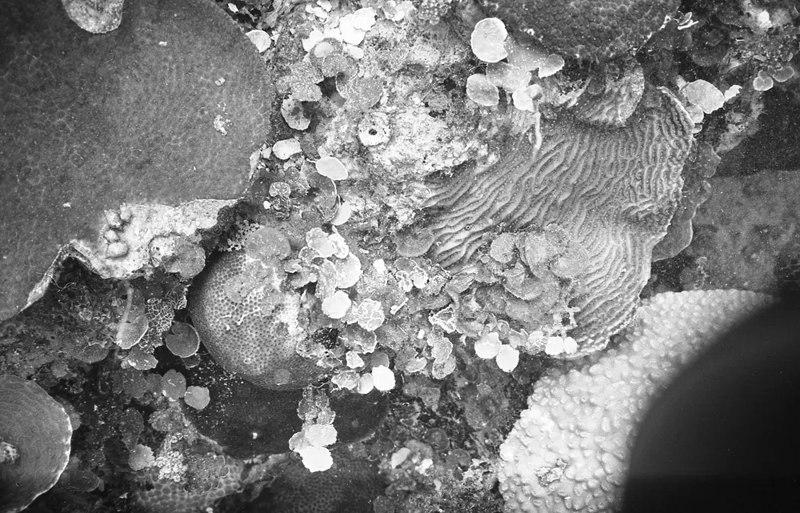{.lightbox group="discovery-bay-1966" description="**UUID: **261fb03f-8f22-4b69-b13d-a064a50d0629 **Date: **1967-10-02 **Location: **Jamaica | Discovery Bay | Pinnacle 1 Slope **Longitude: **77.41017ºW **Latitude: **18.47367ºN **Photographer: **Eileen Graham **Copyright: **Trustees of the Natural History Museum (London, UK), CC-BY-4.0" alt="**UUID: **261fb03f-8f22-4b69-b13d-a064a50d0629 **Date: **1967-10-02 **Location: **Jamaica | Discovery Bay | Pinnacle 1 Slope **Longitude: **77.41017ºW **Latitude: **18.47367ºN **Photographer: **Eileen Graham **Copyright: **Trustees of the Natural History Museum (London, UK), CC-BY-4.0"}

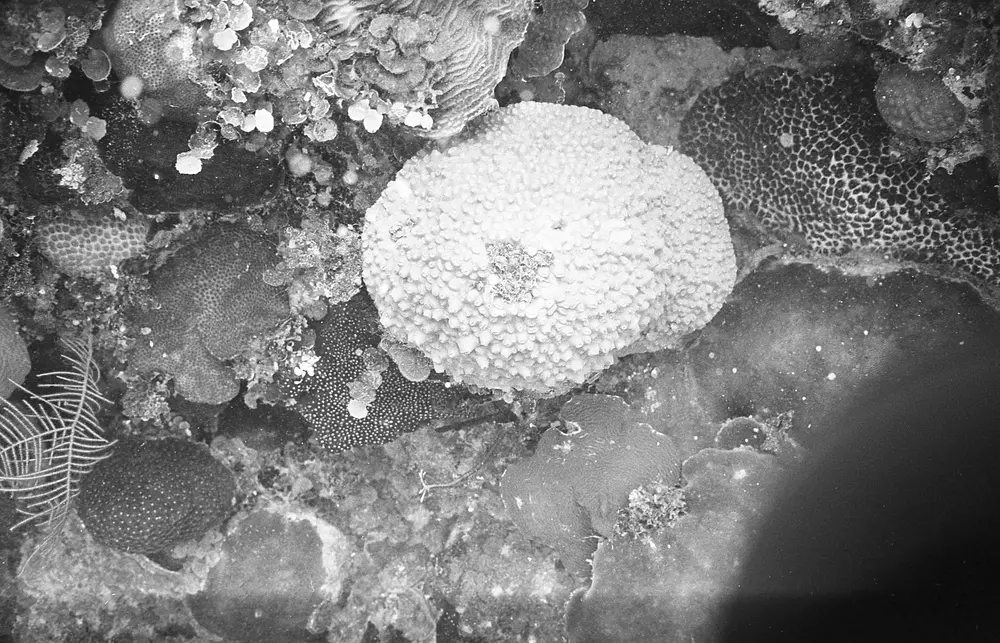{.lightbox group="discovery-bay-1966" description="**UUID: **06d5151c-4576-460d-93f2-90313c787a22 **Date: **1967-10-02 **Location: **Jamaica | Discovery Bay | Pinnacle 1 Slope **Longitude: **77.41017ºW **Latitude: **18.47367ºN **Photographer: **Eileen Graham **Copyright: **Trustees of the Natural History Museum (London, UK), CC-BY-4.0" alt="**UUID: **06d5151c-4576-460d-93f2-90313c787a22 **Date: **1967-10-02 **Location: **Jamaica | Discovery Bay | Pinnacle 1 Slope **Longitude: **77.41017ºW **Latitude: **18.47367ºN **Photographer: **Eileen Graham **Copyright: **Trustees of the Natural History Museum (London, UK), CC-BY-4.0"}

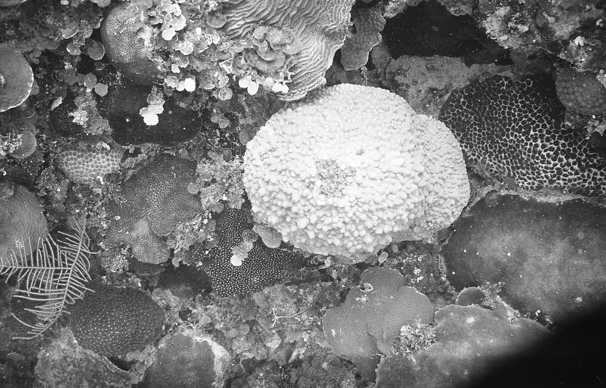{.lightbox group="discovery-bay-1966" description="**UUID: **4f50fe45-4d96-4315-9016-6dc1408e6b02 **Date: **1967-10-02 **Location: **Jamaica | Discovery Bay | Pinnacle 1 Slope **Longitude: **77.41017ºW **Latitude: **18.47367ºN **Photographer: **Eileen Graham **Copyright: **Trustees of the Natural History Museum (London, UK), CC-BY-4.0" alt="**UUID: **4f50fe45-4d96-4315-9016-6dc1408e6b02 **Date: **1967-10-02 **Location: **Jamaica | Discovery Bay | Pinnacle 1 Slope **Longitude: **77.41017ºW **Latitude: **18.47367ºN **Photographer: **Eileen Graham **Copyright: **Trustees of the Natural History Museum (London, UK), CC-BY-4.0"}

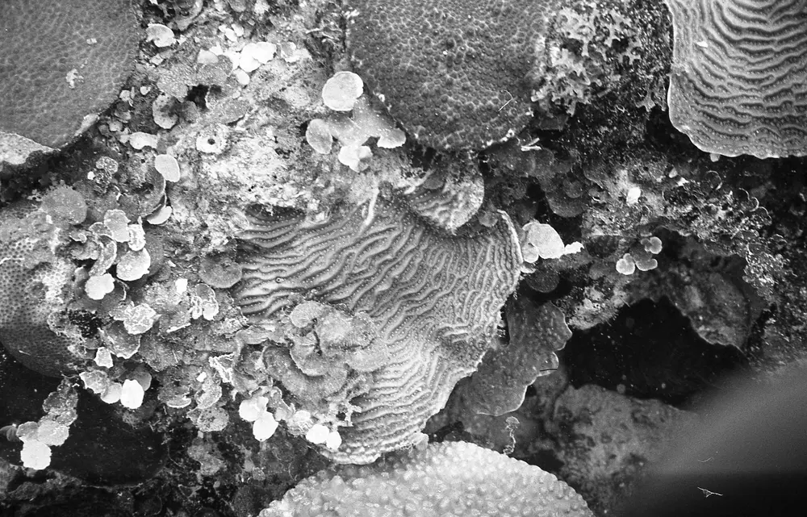{.lightbox group="discovery-bay-1966" description="**UUID: **b7625f70-1ce0-44a1-aa59-56f68415c352 **Date: **1967-10-02 **Location: **Jamaica | Discovery Bay | Pinnacle 1 Slope **Longitude: **77.41017ºW **Latitude: **18.47367ºN **Photographer: **Eileen Graham **Copyright: **Trustees of the Natural History Museum (London, UK), CC-BY-4.0" alt="**UUID: **b7625f70-1ce0-44a1-aa59-56f68415c352 **Date: **1967-10-02 **Location: **Jamaica | Discovery Bay | Pinnacle 1 Slope **Longitude: **77.41017ºW **Latitude: **18.47367ºN **Photographer: **Eileen Graham **Copyright: **Trustees of the Natural History Museum (London, UK), CC-BY-4.0"}

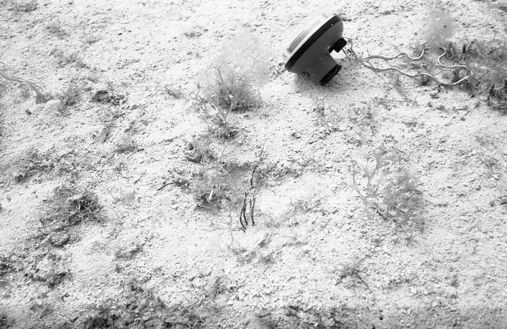{.lightbox group="discovery-bay-1966" description="**UUID: **c59bf4d2-1bbb-40bc-b0f4-c93c828ce78b **Date: **1967-10-02 **Location: **Jamaica | Discovery Bay | Pinnacle 1 Slope **Longitude: **77.41017ºW **Latitude: **18.47367ºN **Photographer: **Eileen Graham **Copyright: **Trustees of the Natural History Museum (London, UK), CC-BY-4.0" alt="**UUID: **c59bf4d2-1bbb-40bc-b0f4-c93c828ce78b **Date: **1967-10-02 **Location: **Jamaica | Discovery Bay | Pinnacle 1 Slope **Longitude: **77.41017ºW **Latitude: **18.47367ºN **Photographer: **Eileen Graham **Copyright: **Trustees of the Natural History Museum (London, UK), CC-BY-4.0"}

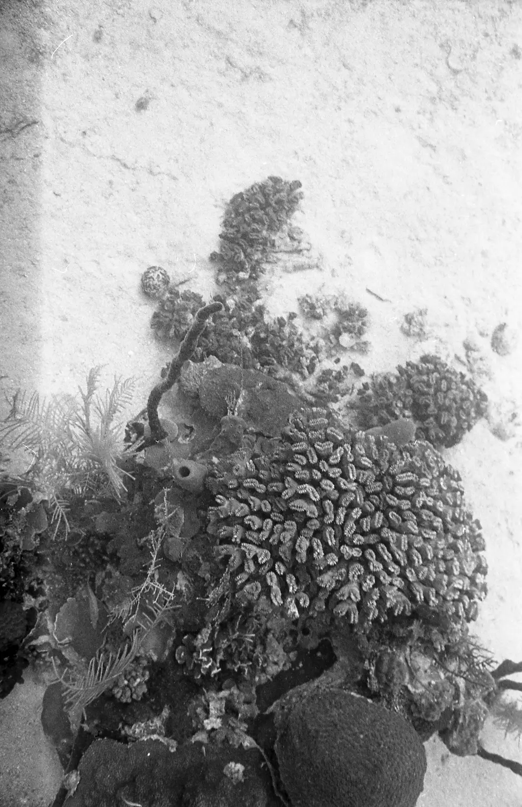{.lightbox group="discovery-bay-1966" description="**UUID: **7f83e43d-e496-47da-a54e-2d4f66941a97 **Date: **1967-10-02 **Location: **Jamaica | Discovery Bay | Pinnacle 1 Slope **Longitude: **77.41017ºW **Latitude: **18.47367ºN **Photographer: **Eileen Graham **Copyright: **Trustees of the Natural History Museum (London, UK), CC-BY-4.0" alt="**UUID: **7f83e43d-e496-47da-a54e-2d4f66941a97 **Date: **1967-10-02 **Location: **Jamaica | Discovery Bay | Pinnacle 1 Slope **Longitude: **77.41017ºW **Latitude: **18.47367ºN **Photographer: **Eileen Graham **Copyright: **Trustees of the Natural History Museum (London, UK), CC-BY-4.0"}

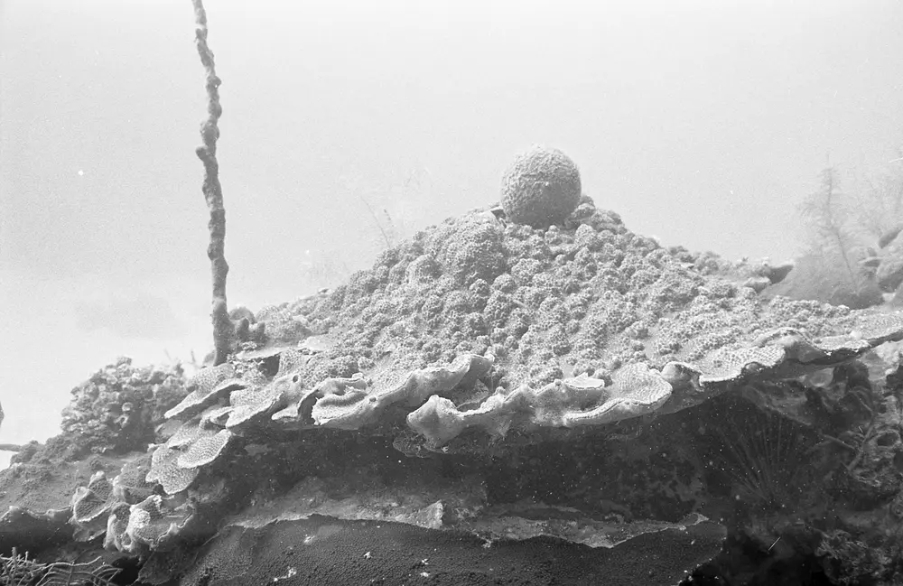{.lightbox group="discovery-bay-1966" description="**UUID: **e5856f4a-27e5-408b-b885-6e0ff99551fe **Date: **1967-10-02 **Location: **Jamaica | Discovery Bay | Pinnacle 1 Slope **Longitude: **77.41017ºW **Latitude: **18.47367ºN **Photographer: **Eileen Graham **Copyright: **Trustees of the Natural History Museum (London, UK), CC-BY-4.0" alt="**UUID: **e5856f4a-27e5-408b-b885-6e0ff99551fe **Date: **1967-10-02 **Location: **Jamaica | Discovery Bay | Pinnacle 1 Slope **Longitude: **77.41017ºW **Latitude: **18.47367ºN **Photographer: **Eileen Graham **Copyright: **Trustees of the Natural History Museum (London, UK), CC-BY-4.0"}

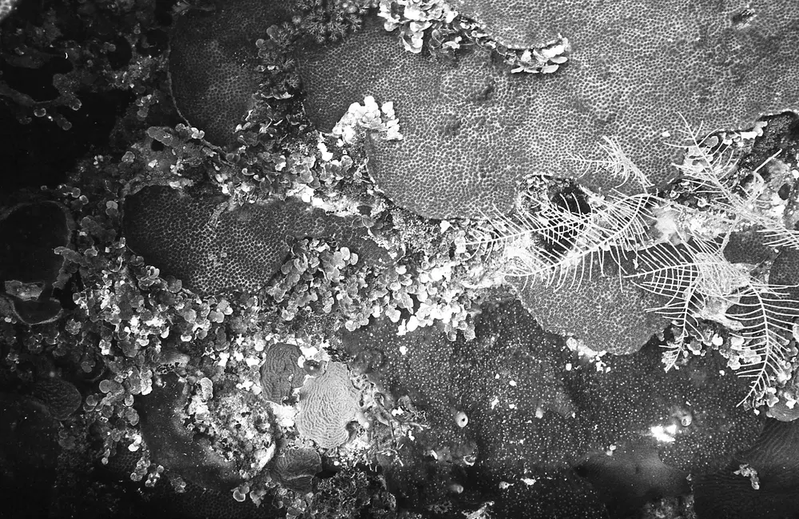{.lightbox group="discovery-bay-1966" description="**UUID: **0db6c4b2-11ca-4c2b-9714-d98d03272f99 **Date: **1967-10-02 **Location: **Jamaica | Discovery Bay | Pinnacle 1 Slope **Longitude: **77.41017ºW **Latitude: **18.47367ºN **Photographer: **Eileen Graham **Copyright: **Trustees of the Natural History Museum (London, UK), CC-BY-4.0" alt="**UUID: **0db6c4b2-11ca-4c2b-9714-d98d03272f99 **Date: **1967-10-02 **Location: **Jamaica | Discovery Bay | Pinnacle 1 Slope **Longitude: **77.41017ºW **Latitude: **18.47367ºN **Photographer: **Eileen Graham **Copyright: **Trustees of the Natural History Museum (London, UK), CC-BY-4.0"}

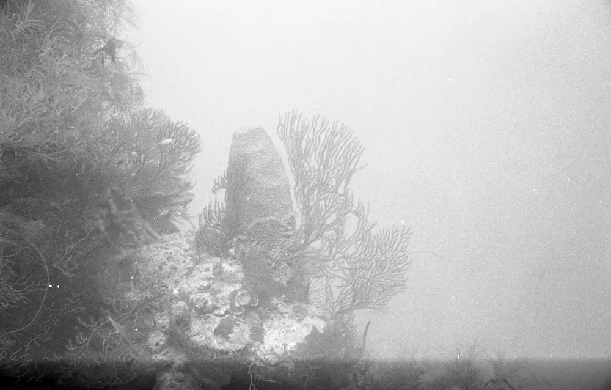{.lightbox group="discovery-bay-1966" description="**UUID: **babdfcbc-1472-40d0-8c3a-105d8645ce1c **Date: **1967-11-02 **Location: **Jamaica | Discovery Bay | Rio Bueno **Longitude: **77.4599ºW **Latitude: **18.4789ºN **Photographer: **Eileen Graham **Copyright: **Trustees of the Natural History Museum (London, UK), CC-BY-4.0" alt="**UUID: **babdfcbc-1472-40d0-8c3a-105d8645ce1c **Date: **1967-11-02 **Location: **Jamaica | Discovery Bay | Rio Bueno **Longitude: **77.4599ºW **Latitude: **18.4789ºN **Photographer: **Eileen Graham **Copyright: **Trustees of the Natural History Museum (London, UK), CC-BY-4.0"}

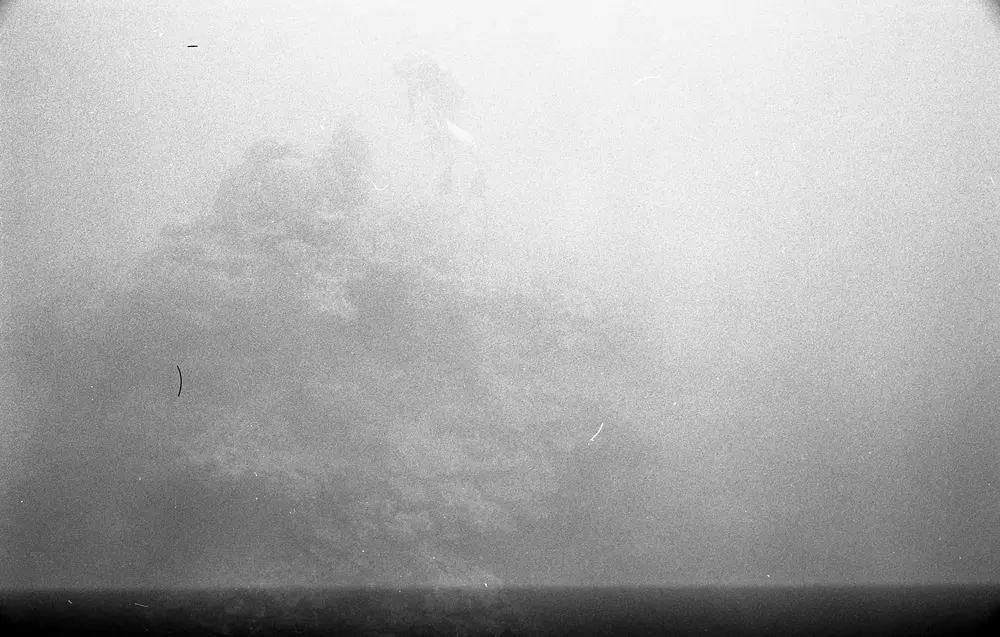{.lightbox group="discovery-bay-1966" description="**UUID: **b897e572-893b-421f-9c5d-472202def18c **Date: **1967-11-02 **Location: **Jamaica | Discovery Bay | Rio Bueno **Longitude: **77.4599ºW **Latitude: **18.4789ºN **Photographer: **Eileen Graham **Copyright: **Trustees of the Natural History Museum (London, UK), CC-BY-4.0" alt="**UUID: **b897e572-893b-421f-9c5d-472202def18c **Date: **1967-11-02 **Location: **Jamaica | Discovery Bay | Rio Bueno **Longitude: **77.4599ºW **Latitude: **18.4789ºN **Photographer: **Eileen Graham **Copyright: **Trustees of the Natural History Museum (London, UK), CC-BY-4.0"}

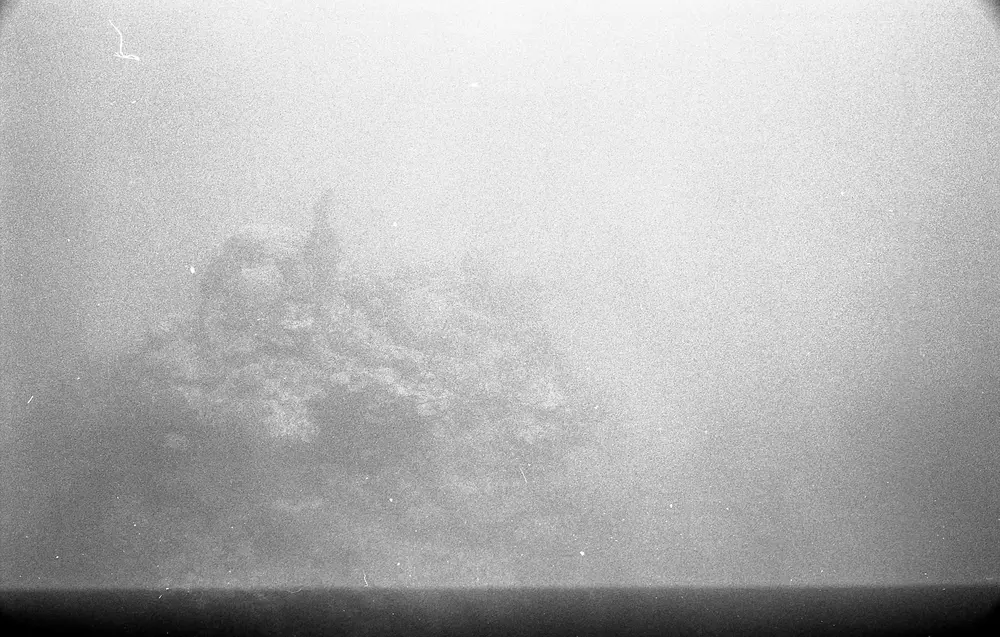{.lightbox group="discovery-bay-1966" description="**UUID: **64e23eb5-c959-417e-8ac0-cdd138587f94 **Date: **1967-11-02 **Location: **Jamaica | Discovery Bay | Rio Bueno **Longitude: **77.4599ºW **Latitude: **18.4789ºN **Photographer: **Eileen Graham **Copyright: **Trustees of the Natural History Museum (London, UK), CC-BY-4.0" alt="**UUID: **64e23eb5-c959-417e-8ac0-cdd138587f94 **Date: **1967-11-02 **Location: **Jamaica | Discovery Bay | Rio Bueno **Longitude: **77.4599ºW **Latitude: **18.4789ºN **Photographer: **Eileen Graham **Copyright: **Trustees of the Natural History Museum (London, UK), CC-BY-4.0"}

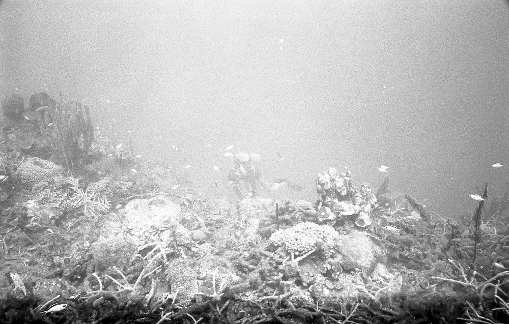{.lightbox group="discovery-bay-1966" description="**UUID: **70bc5959-32f5-4a4e-9628-76ca4abf82d7 **Date: **1967-11-02 **Location: **Jamaica | Discovery Bay | Rio Bueno **Longitude: **77.4599ºW **Latitude: **18.4789ºN **Photographer: **Eileen Graham **Copyright: **Trustees of the Natural History Museum (London, UK), CC-BY-4.0" alt="**UUID: **70bc5959-32f5-4a4e-9628-76ca4abf82d7 **Date: **1967-11-02 **Location: **Jamaica | Discovery Bay | Rio Bueno **Longitude: **77.4599ºW **Latitude: **18.4789ºN **Photographer: **Eileen Graham **Copyright: **Trustees of the Natural History Museum (London, UK), CC-BY-4.0"}

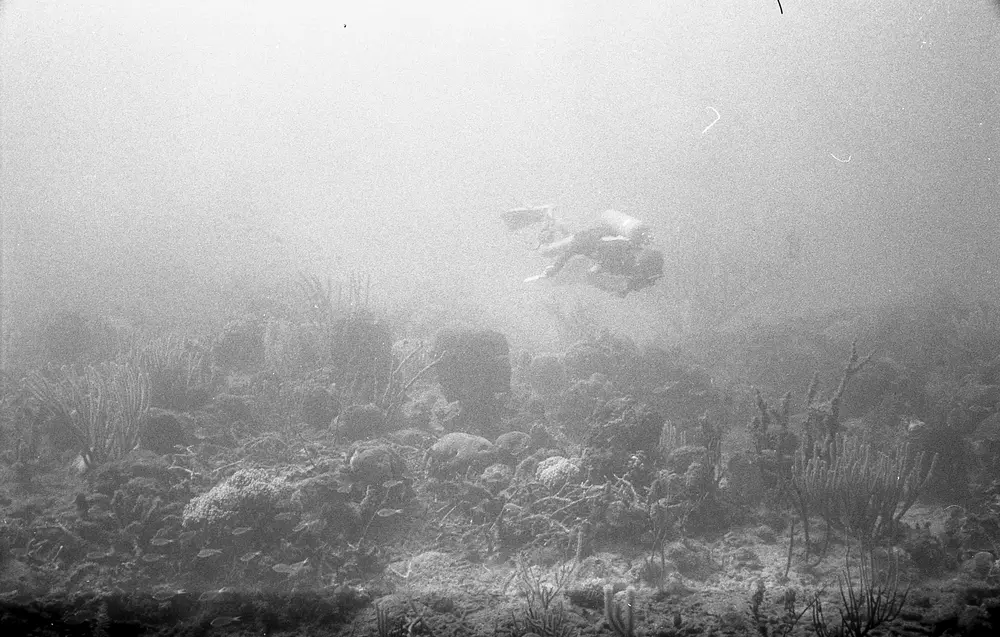{.lightbox group="discovery-bay-1966" description="**UUID: **66d7cb37-999a-4310-bc24-2410f2fc8fc8 **Date: **1967-11-02 **Location: **Jamaica | Discovery Bay | Rio Bueno **Longitude: **77.4599ºW **Latitude: **18.4789ºN **Photographer: **Eileen Graham **Copyright: **Trustees of the Natural History Museum (London, UK), CC-BY-4.0" alt="**UUID: **66d7cb37-999a-4310-bc24-2410f2fc8fc8 **Date: **1967-11-02 **Location: **Jamaica | Discovery Bay | Rio Bueno **Longitude: **77.4599ºW **Latitude: **18.4789ºN **Photographer: **Eileen Graham **Copyright: **Trustees of the Natural History Museum (London, UK), CC-BY-4.0"}

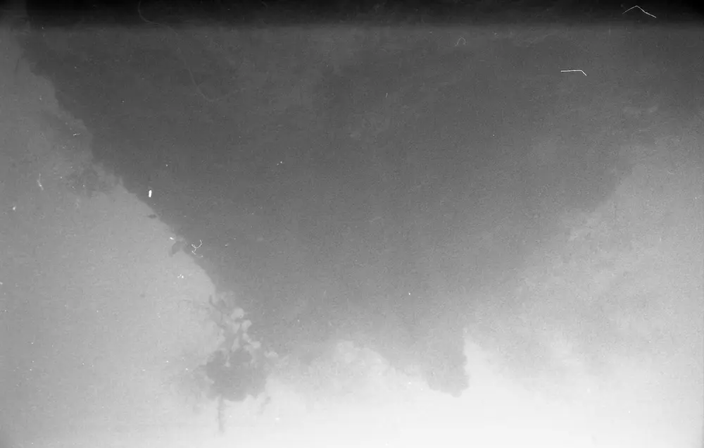{.lightbox group="discovery-bay-1966" description="**UUID: **f8eadcda-5211-4232-b9d2-8ad786b83456 **Date: **1967-11-02 **Location: **Jamaica | Discovery Bay | Rio Bueno **Longitude: **77.4599ºW **Latitude: **18.4789ºN **Photographer: **Eileen Graham **Copyright: **Trustees of the Natural History Museum (London, UK), CC-BY-4.0" alt="**UUID: **f8eadcda-5211-4232-b9d2-8ad786b83456 **Date: **1967-11-02 **Location: **Jamaica | Discovery Bay | Rio Bueno **Longitude: **77.4599ºW **Latitude: **18.4789ºN **Photographer: **Eileen Graham **Copyright: **Trustees of the Natural History Museum (London, UK), CC-BY-4.0"}

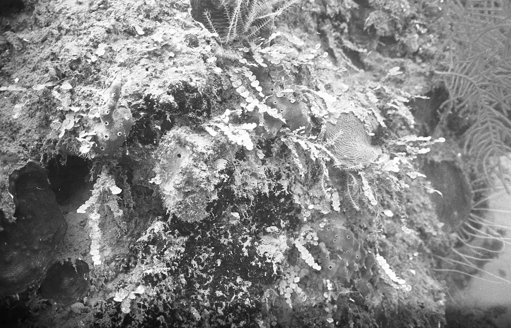{.lightbox group="discovery-bay-1966" description="**UUID: **2af0a465-7b20-4d05-b986-0d48aad700f5 **Date: **1967-11-02 **Location: **Jamaica | Discovery Bay | Rio Bueno **Longitude: **77.4599ºW **Latitude: **18.4789ºN **Photographer: **Eileen Graham **Copyright: **Trustees of the Natural History Museum (London, UK), CC-BY-4.0" alt="**UUID: **2af0a465-7b20-4d05-b986-0d48aad700f5 **Date: **1967-11-02 **Location: **Jamaica | Discovery Bay | Rio Bueno **Longitude: **77.4599ºW **Latitude: **18.4789ºN **Photographer: **Eileen Graham **Copyright: **Trustees of the Natural History Museum (London, UK), CC-BY-4.0"}

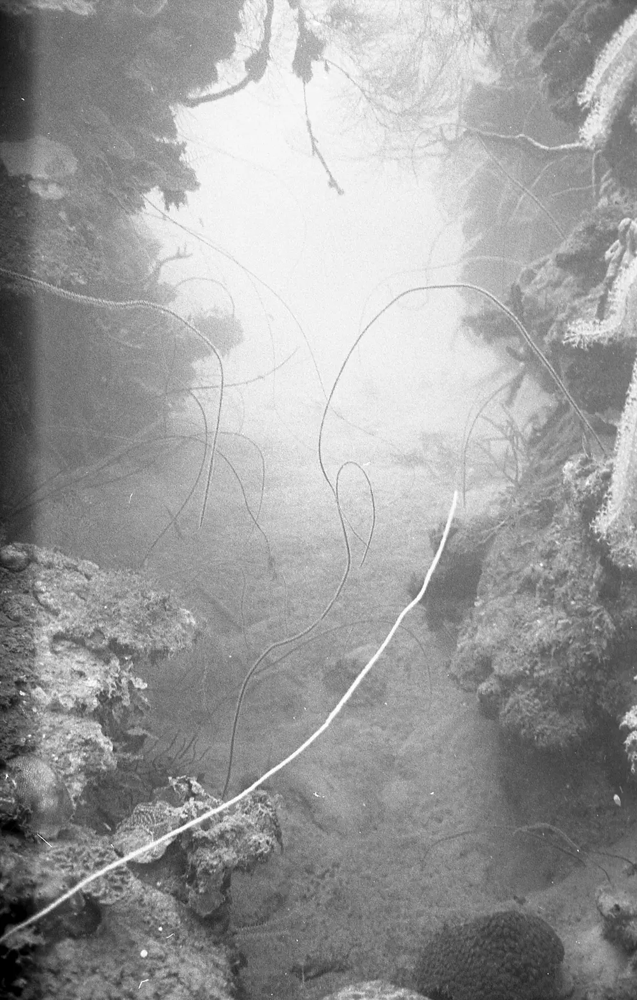{.lightbox group="discovery-bay-1966" description="**UUID: **071b79aa-0450-4392-b811-bde8b168f3fb **Date: **1967-11-02 **Location: **Jamaica | Discovery Bay | Rio Bueno **Longitude: **77.4599ºW **Latitude: **18.4789ºN **Photographer: **Eileen Graham **Copyright: **Trustees of the Natural History Museum (London, UK), CC-BY-4.0" alt="**UUID: **071b79aa-0450-4392-b811-bde8b168f3fb **Date: **1967-11-02 **Location: **Jamaica | Discovery Bay | Rio Bueno **Longitude: **77.4599ºW **Latitude: **18.4789ºN **Photographer: **Eileen Graham **Copyright: **Trustees of the Natural History Museum (London, UK), CC-BY-4.0"}

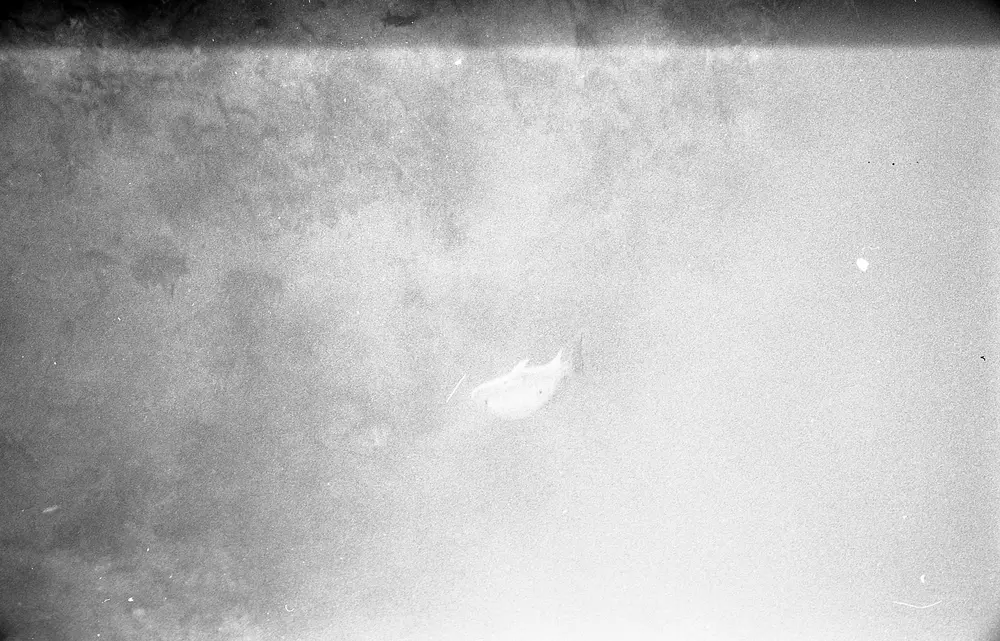{.lightbox group="discovery-bay-1966" description="**UUID: **9cd291e6-a531-4b60-85fa-949dfc879eac **Date: **1967-11-02 **Location: **Jamaica | Discovery Bay | Rio Bueno **Longitude: **77.4599ºW **Latitude: **18.4789ºN **Photographer: **Eileen Graham **Copyright: **Trustees of the Natural History Museum (London, UK), CC-BY-4.0" alt="**UUID: **9cd291e6-a531-4b60-85fa-949dfc879eac **Date: **1967-11-02 **Location: **Jamaica | Discovery Bay | Rio Bueno **Longitude: **77.4599ºW **Latitude: **18.4789ºN **Photographer: **Eileen Graham **Copyright: **Trustees of the Natural History Museum (London, UK), CC-BY-4.0"}

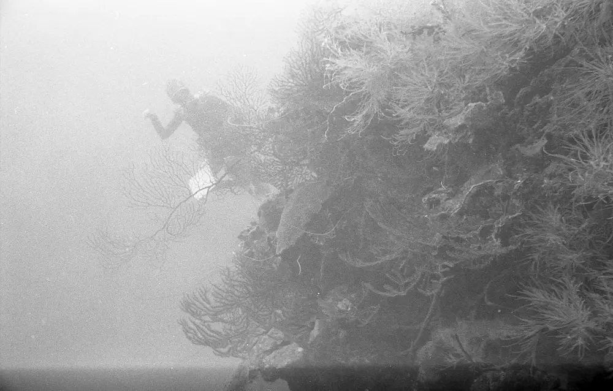{.lightbox group="discovery-bay-1966" description="**UUID: **8b2d9d73-b2cc-440a-9abf-ff2b8fae0eec **Date: **1967-11-02 **Location: **Jamaica | Discovery Bay | Rio Bueno **Longitude: **77.4599ºW **Latitude: **18.4789ºN **Photographer: **Eileen Graham **Copyright: **Trustees of the Natural History Museum (London, UK), CC-BY-4.0" alt="**UUID: **8b2d9d73-b2cc-440a-9abf-ff2b8fae0eec **Date: **1967-11-02 **Location: **Jamaica | Discovery Bay | Rio Bueno **Longitude: **77.4599ºW **Latitude: **18.4789ºN **Photographer: **Eileen Graham **Copyright: **Trustees of the Natural History Museum (London, UK), CC-BY-4.0"}

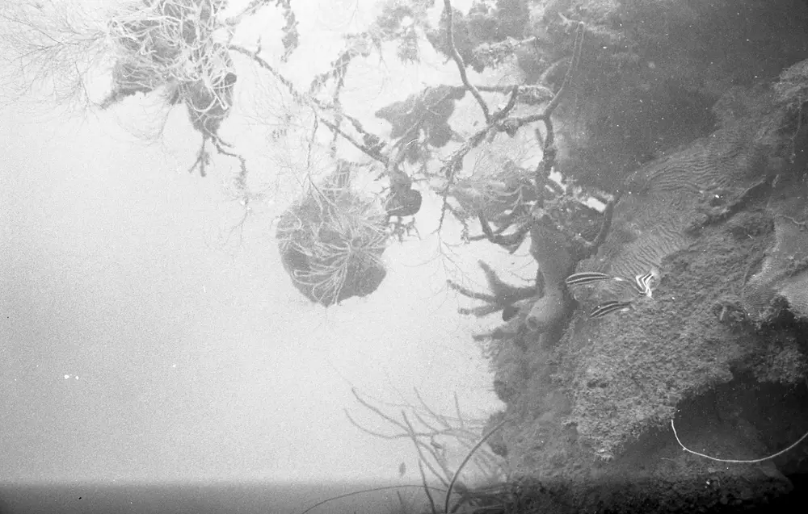{.lightbox group="discovery-bay-1966" description="**UUID: **ef1d2fbf-41cb-411b-9831-fcd722e9c794 **Date: **1967-11-02 **Location: **Jamaica | Discovery Bay | Rio Bueno **Longitude: **77.4599ºW **Latitude: **18.4789ºN **Photographer: **Eileen Graham **Copyright: **Trustees of the Natural History Museum (London, UK), CC-BY-4.0" alt="**UUID: **ef1d2fbf-41cb-411b-9831-fcd722e9c794 **Date: **1967-11-02 **Location: **Jamaica | Discovery Bay | Rio Bueno **Longitude: **77.4599ºW **Latitude: **18.4789ºN **Photographer: **Eileen Graham **Copyright: **Trustees of the Natural History Museum (London, UK), CC-BY-4.0"}

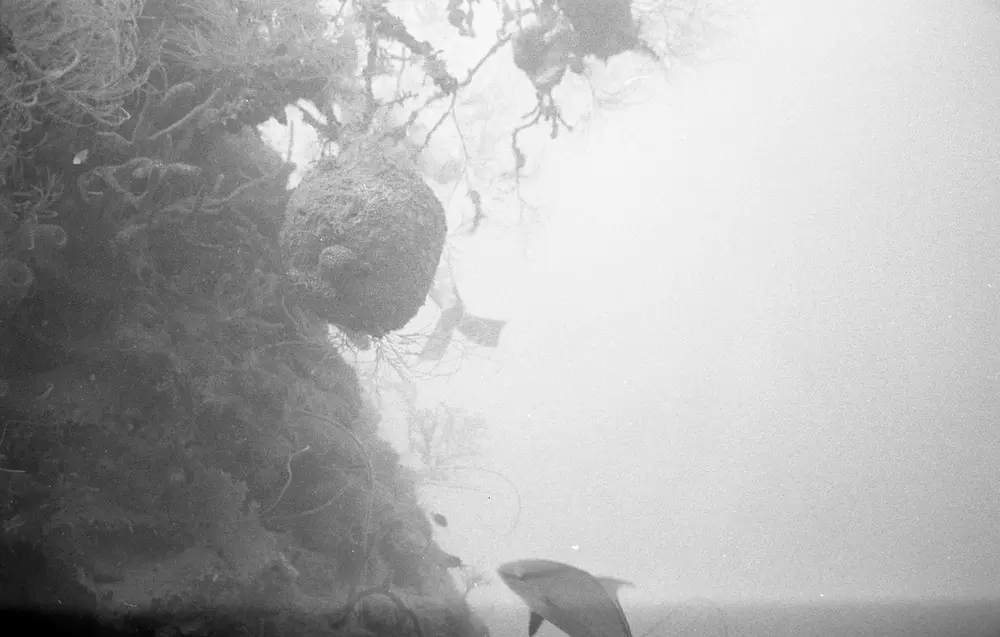{.lightbox group="discovery-bay-1966" description="**UUID: **aa9e5322-e50d-42b5-a813-456dc18930b3 **Date: **1967-11-02 **Location: **Jamaica | Discovery Bay | Rio Bueno **Longitude: **77.4599ºW **Latitude: **18.4789ºN **Photographer: **Eileen Graham **Copyright: **Trustees of the Natural History Museum (London, UK), CC-BY-4.0" alt="**UUID: **aa9e5322-e50d-42b5-a813-456dc18930b3 **Date: **1967-11-02 **Location: **Jamaica | Discovery Bay | Rio Bueno **Longitude: **77.4599ºW **Latitude: **18.4789ºN **Photographer: **Eileen Graham **Copyright: **Trustees of the Natural History Museum (London, UK), CC-BY-4.0"}

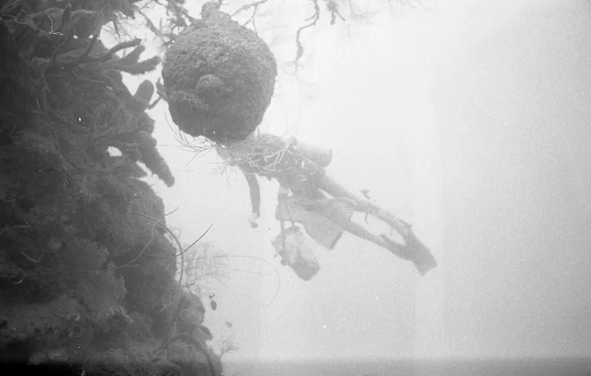{.lightbox group="discovery-bay-1966" description="**UUID: **6efdc421-d582-4ec0-8a8d-f6c63b05c159 **Date: **1967-11-02 **Location: **Jamaica | Discovery Bay | Rio Bueno **Longitude: **77.4599ºW **Latitude: **18.4789ºN **Photographer: **Eileen Graham **Copyright: **Trustees of the Natural History Museum (London, UK), CC-BY-4.0" alt="**UUID: **6efdc421-d582-4ec0-8a8d-f6c63b05c159 **Date: **1967-11-02 **Location: **Jamaica | Discovery Bay | Rio Bueno **Longitude: **77.4599ºW **Latitude: **18.4789ºN **Photographer: **Eileen Graham **Copyright: **Trustees of the Natural History Museum (London, UK), CC-BY-4.0"}

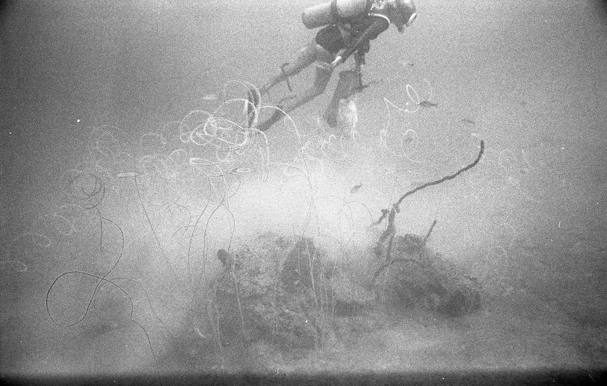{.lightbox group="discovery-bay-1966" description="**UUID: **ddfb9898-8589-4210-a452-d8ba284c0e88 **Date: **1967-11-02 **Location: **Jamaica | Discovery Bay | Rio Bueno **Longitude: **77.4599ºW **Latitude: **18.4789ºN **Photographer: **Eileen Graham **Copyright: **Trustees of the Natural History Museum (London, UK), CC-BY-4.0" alt="**UUID: **ddfb9898-8589-4210-a452-d8ba284c0e88 **Date: **1967-11-02 **Location: **Jamaica | Discovery Bay | Rio Bueno **Longitude: **77.4599ºW **Latitude: **18.4789ºN **Photographer: **Eileen Graham **Copyright: **Trustees of the Natural History Museum (London, UK), CC-BY-4.0"}

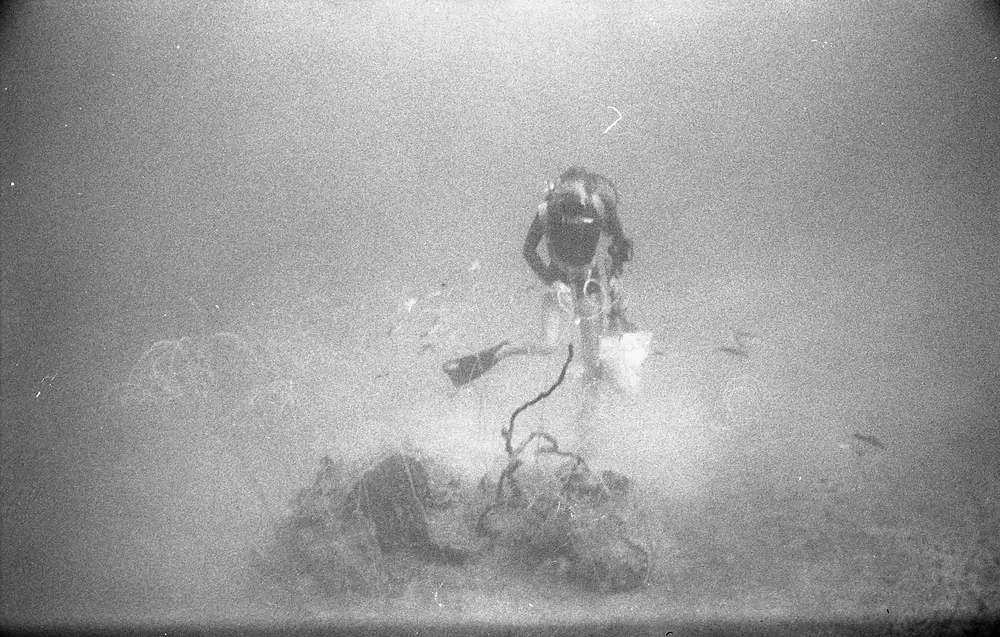{.lightbox group="discovery-bay-1966" description="**UUID: **8d9b2a3d-f6b0-48ab-8e23-462cb7c0e895 **Date: **1967-11-02 **Location: **Jamaica | Discovery Bay | Rio Bueno **Longitude: **77.4599ºW **Latitude: **18.4789ºN **Photographer: **Eileen Graham **Copyright: **Trustees of the Natural History Museum (London, UK), CC-BY-4.0" alt="**UUID: **8d9b2a3d-f6b0-48ab-8e23-462cb7c0e895 **Date: **1967-11-02 **Location: **Jamaica | Discovery Bay | Rio Bueno **Longitude: **77.4599ºW **Latitude: **18.4789ºN **Photographer: **Eileen Graham **Copyright: **Trustees of the Natural History Museum (London, UK), CC-BY-4.0"}

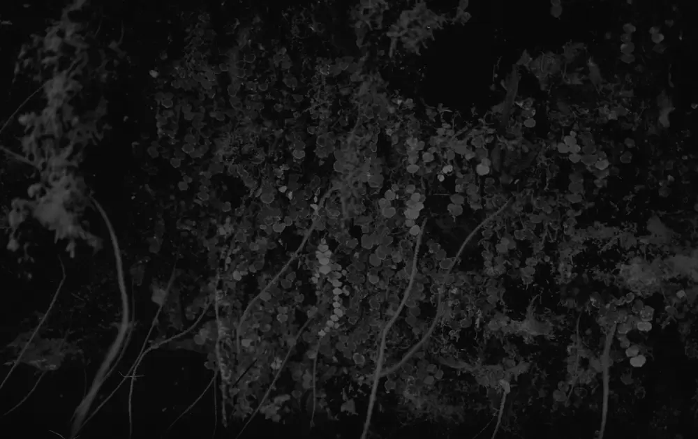{.lightbox group="discovery-bay-1966" description="**UUID: **0894a1f2-392d-4f5e-bdd9-2ccc967d81cd **Date: **1967-12-02 **Location: **Jamaica | Discovery Bay | Eaton Hall **Longitude: **77.334ºW **Latitude: **18.467ºN **Photographer: **Eileen Graham **Copyright: **Trustees of the Natural History Museum (London, UK), CC-BY-4.0" alt="**UUID: **0894a1f2-392d-4f5e-bdd9-2ccc967d81cd **Date: **1967-12-02 **Location: **Jamaica | Discovery Bay | Eaton Hall **Longitude: **77.334ºW **Latitude: **18.467ºN **Photographer: **Eileen Graham **Copyright: **Trustees of the Natural History Museum (London, UK), CC-BY-4.0"}

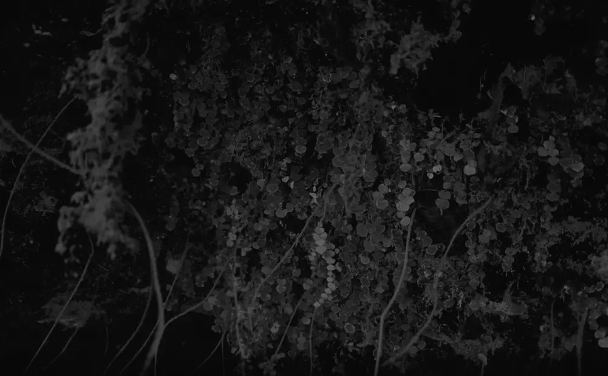{.lightbox group="discovery-bay-1966" description="**UUID: **fe0a0298-25b5-4deb-ac47-6f301d645303 **Date: **1967-12-02 **Location: **Jamaica | Discovery Bay | Eaton Hall **Longitude: **77.334ºW **Latitude: **18.467ºN **Photographer: **Eileen Graham **Copyright: **Trustees of the Natural History Museum (London, UK), CC-BY-4.0" alt="**UUID: **fe0a0298-25b5-4deb-ac47-6f301d645303 **Date: **1967-12-02 **Location: **Jamaica | Discovery Bay | Eaton Hall **Longitude: **77.334ºW **Latitude: **18.467ºN **Photographer: **Eileen Graham **Copyright: **Trustees of the Natural History Museum (London, UK), CC-BY-4.0"}

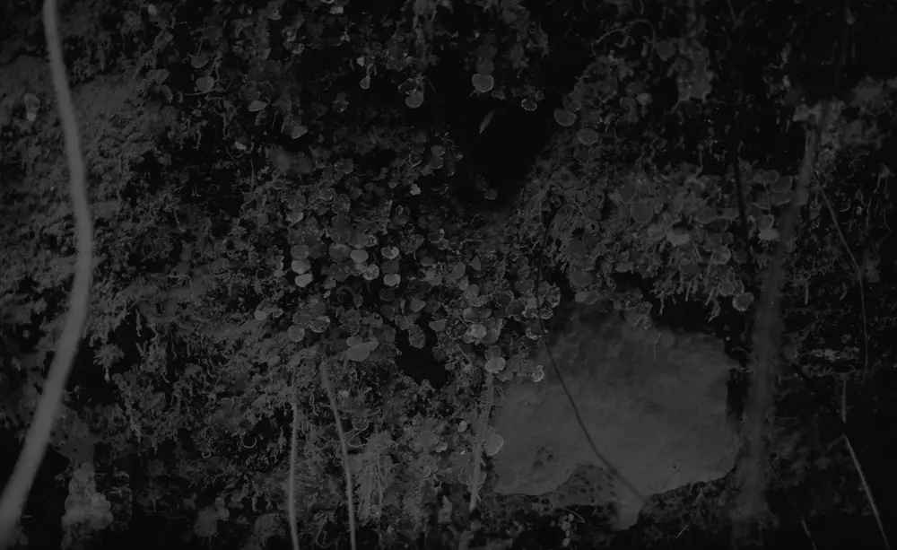{.lightbox group="discovery-bay-1966" description="**UUID: **4d25a846-2fdf-4458-a617-3f458a77625c **Date: **1967-12-02 **Location: **Jamaica | Discovery Bay | Eaton Hall **Longitude: **77.334ºW **Latitude: **18.467ºN **Photographer: **Eileen Graham **Copyright: **Trustees of the Natural History Museum (London, UK), CC-BY-4.0" alt="**UUID: **4d25a846-2fdf-4458-a617-3f458a77625c **Date: **1967-12-02 **Location: **Jamaica | Discovery Bay | Eaton Hall **Longitude: **77.334ºW **Latitude: **18.467ºN **Photographer: **Eileen Graham **Copyright: **Trustees of the Natural History Museum (London, UK), CC-BY-4.0"}

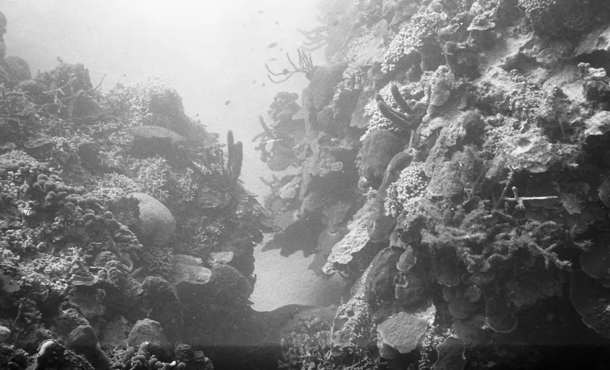{.lightbox group="discovery-bay-1966" description="**UUID: **f0fecf53-d83a-46f4-9c65-9c85de21e752 **Date: **1967-12-02 **Location: **Jamaica | Discovery Bay | Eaton Hall **Longitude: **77.334ºW **Latitude: **18.467ºN **Photographer: **Eileen Graham **Copyright: **Trustees of the Natural History Museum (London, UK), CC-BY-4.0" alt="**UUID: **f0fecf53-d83a-46f4-9c65-9c85de21e752 **Date: **1967-12-02 **Location: **Jamaica | Discovery Bay | Eaton Hall **Longitude: **77.334ºW **Latitude: **18.467ºN **Photographer: **Eileen Graham **Copyright: **Trustees of the Natural History Museum (London, UK), CC-BY-4.0"}

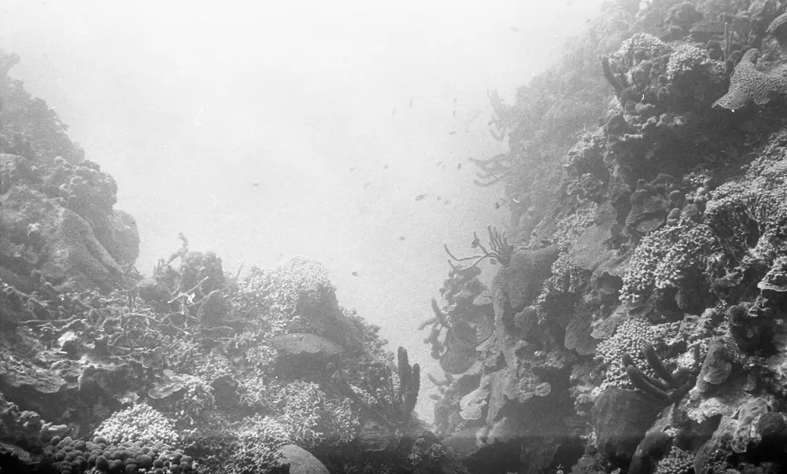{.lightbox group="discovery-bay-1966" description="**UUID: **0233cac0-dd95-4113-ab0c-26316625d5a7 **Date: **1967-12-02 **Location: **Jamaica | Discovery Bay | Eaton Hall **Longitude: **77.334ºW **Latitude: **18.467ºN **Photographer: **Eileen Graham **Copyright: **Trustees of the Natural History Museum (London, UK), CC-BY-4.0" alt="**UUID: **0233cac0-dd95-4113-ab0c-26316625d5a7 **Date: **1967-12-02 **Location: **Jamaica | Discovery Bay | Eaton Hall **Longitude: **77.334ºW **Latitude: **18.467ºN **Photographer: **Eileen Graham **Copyright: **Trustees of the Natural History Museum (London, UK), CC-BY-4.0"}

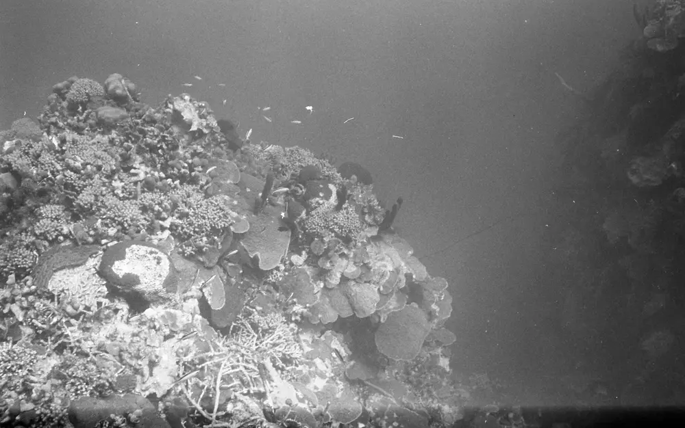{.lightbox group="discovery-bay-1966" description="**UUID: **7ab7966d-f188-42c7-88ea-5307f9b50420 **Date: **1967-12-02 **Location: **Jamaica | Discovery Bay | Eaton Hall **Longitude: **77.334ºW **Latitude: **18.467ºN **Photographer: **Eileen Graham **Copyright: **Trustees of the Natural History Museum (London, UK), CC-BY-4.0" alt="**UUID: **7ab7966d-f188-42c7-88ea-5307f9b50420 **Date: **1967-12-02 **Location: **Jamaica | Discovery Bay | Eaton Hall **Longitude: **77.334ºW **Latitude: **18.467ºN **Photographer: **Eileen Graham **Copyright: **Trustees of the Natural History Museum (London, UK), CC-BY-4.0"}

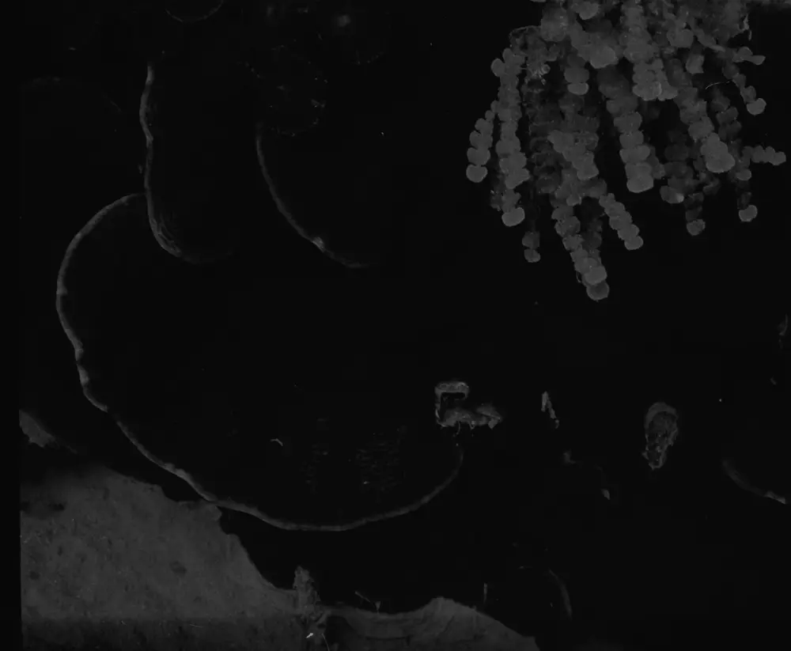{.lightbox group="discovery-bay-1966" description="**UUID: **5c78abf3-c93e-44a1-bdc2-55b11c7d6c8b **Date: **1967-12-02 **Location: **Jamaica | Discovery Bay | Eaton Hall **Longitude: **77.334ºW **Latitude: **18.467ºN **Photographer: **Eileen Graham **Copyright: **Trustees of the Natural History Museum (London, UK), CC-BY-4.0" alt="**UUID: **5c78abf3-c93e-44a1-bdc2-55b11c7d6c8b **Date: **1967-12-02 **Location: **Jamaica | Discovery Bay | Eaton Hall **Longitude: **77.334ºW **Latitude: **18.467ºN **Photographer: **Eileen Graham **Copyright: **Trustees of the Natural History Museum (London, UK), CC-BY-4.0"}

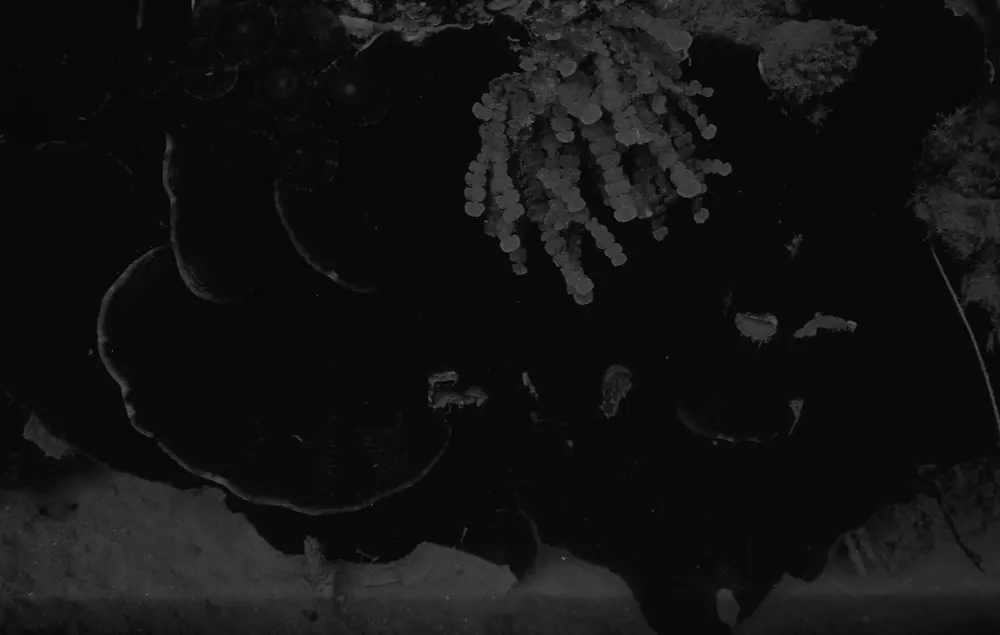{.lightbox group="discovery-bay-1966" description="**UUID: **a4942821-ec2b-4be8-8244-66b632f079db **Date: **1967-12-02 **Location: **Jamaica | Discovery Bay | Eaton Hall **Longitude: **77.334ºW **Latitude: **18.467ºN **Photographer: **Eileen Graham **Copyright: **Trustees of the Natural History Museum (London, UK), CC-BY-4.0" alt="**UUID: **a4942821-ec2b-4be8-8244-66b632f079db **Date: **1967-12-02 **Location: **Jamaica | Discovery Bay | Eaton Hall **Longitude: **77.334ºW **Latitude: **18.467ºN **Photographer: **Eileen Graham **Copyright: **Trustees of the Natural History Museum (London, UK), CC-BY-4.0"}

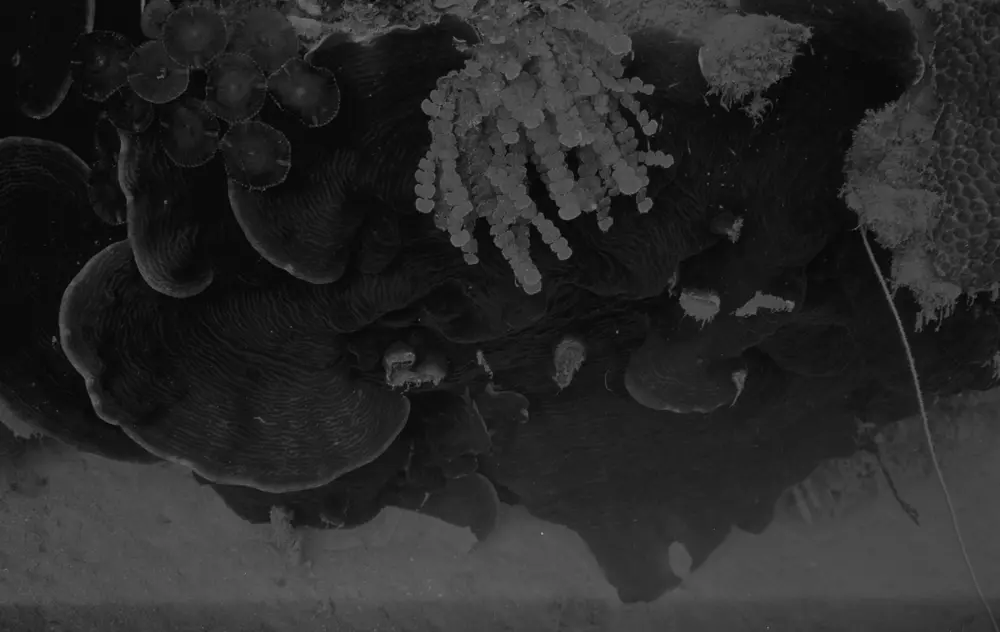{.lightbox group="discovery-bay-1966" description="**UUID: **478bc0a9-dbf1-4e91-80d4-cc6b625d3cb3 **Date: **1967-12-02 **Location: **Jamaica | Discovery Bay | Eaton Hall **Longitude: **77.334ºW **Latitude: **18.467ºN **Photographer: **Eileen Graham **Copyright: **Trustees of the Natural History Museum (London, UK), CC-BY-4.0" alt="**UUID: **478bc0a9-dbf1-4e91-80d4-cc6b625d3cb3 **Date: **1967-12-02 **Location: **Jamaica | Discovery Bay | Eaton Hall **Longitude: **77.334ºW **Latitude: **18.467ºN **Photographer: **Eileen Graham **Copyright: **Trustees of the Natural History Museum (London, UK), CC-BY-4.0"}

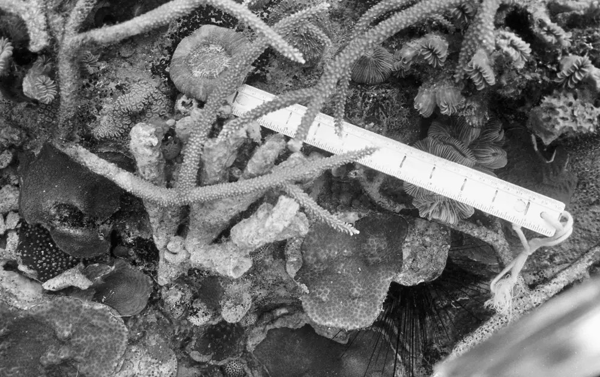{.lightbox group="discovery-bay-1966" description="**UUID: **5749e173-9b24-4eb6-8d10-56b8ba90b404 **Date: **1967-02-13 **Location: **Jamaica | Discovery Bay | Buoy Upper Slope **Longitude: **77.40908ºW **Latitude: **18.47322ºN **Photographer: **Eileen Graham **Copyright: **Trustees of the Natural History Museum (London, UK), CC-BY-4.0" alt="**UUID: **5749e173-9b24-4eb6-8d10-56b8ba90b404 **Date: **1967-02-13 **Location: **Jamaica | Discovery Bay | Buoy Upper Slope **Longitude: **77.40908ºW **Latitude: **18.47322ºN **Photographer: **Eileen Graham **Copyright: **Trustees of the Natural History Museum (London, UK), CC-BY-4.0"}

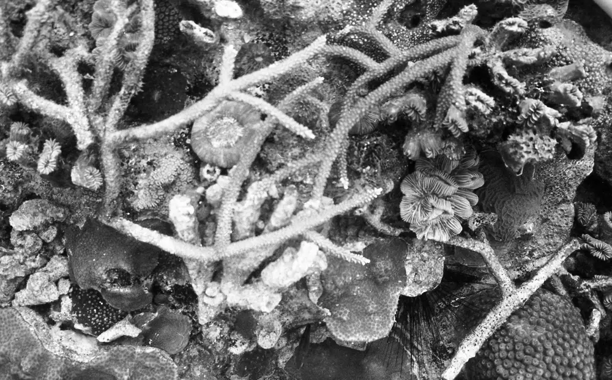{.lightbox group="discovery-bay-1966" description="**UUID: **0182f917-41bc-40e3-a90d-1c79757db499 **Date: **1967-02-13 **Location: **Jamaica | Discovery Bay | Buoy Upper Slope **Longitude: **77.40908ºW **Latitude: **18.47322ºN **Photographer: **Eileen Graham **Copyright: **Trustees of the Natural History Museum (London, UK), CC-BY-4.0" alt="**UUID: **0182f917-41bc-40e3-a90d-1c79757db499 **Date: **1967-02-13 **Location: **Jamaica | Discovery Bay | Buoy Upper Slope **Longitude: **77.40908ºW **Latitude: **18.47322ºN **Photographer: **Eileen Graham **Copyright: **Trustees of the Natural History Museum (London, UK), CC-BY-4.0"}

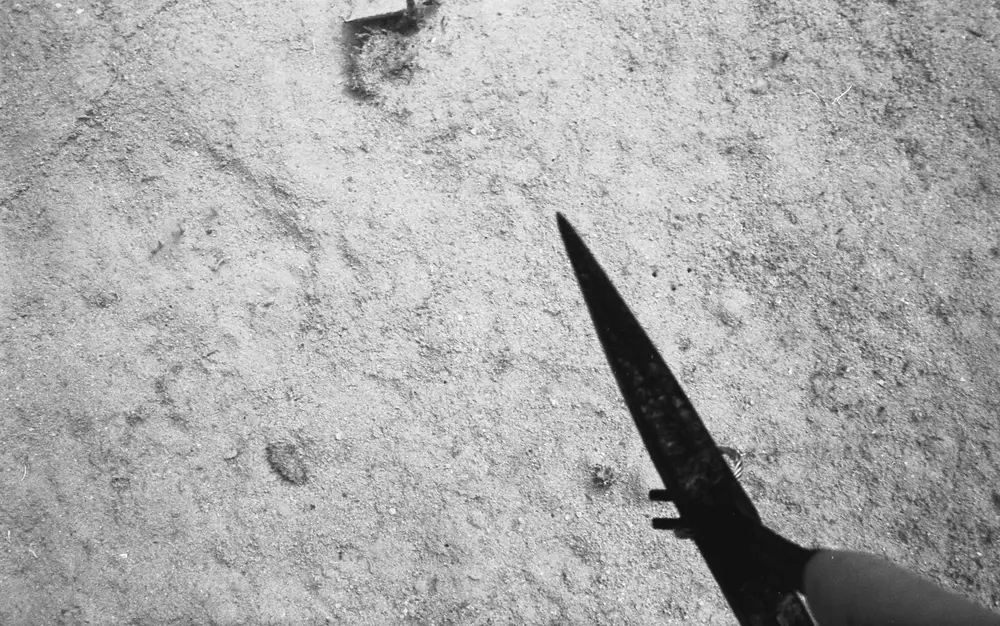{.lightbox group="discovery-bay-1966" description="**UUID: **33fe95e6-f9e1-429d-b1d2-cd3882f326a2 **Date: **1967-02-13 **Location: **Jamaica | Discovery Bay | Algal Plots **Longitude: **77.414ºW **Latitude: **18.473ºN **Photographer: **Eileen Graham **Copyright: **Trustees of the Natural History Museum (London, UK), CC-BY-4.0" alt="**UUID: **33fe95e6-f9e1-429d-b1d2-cd3882f326a2 **Date: **1967-02-13 **Location: **Jamaica | Discovery Bay | Algal Plots **Longitude: **77.414ºW **Latitude: **18.473ºN **Photographer: **Eileen Graham **Copyright: **Trustees of the Natural History Museum (London, UK), CC-BY-4.0"}

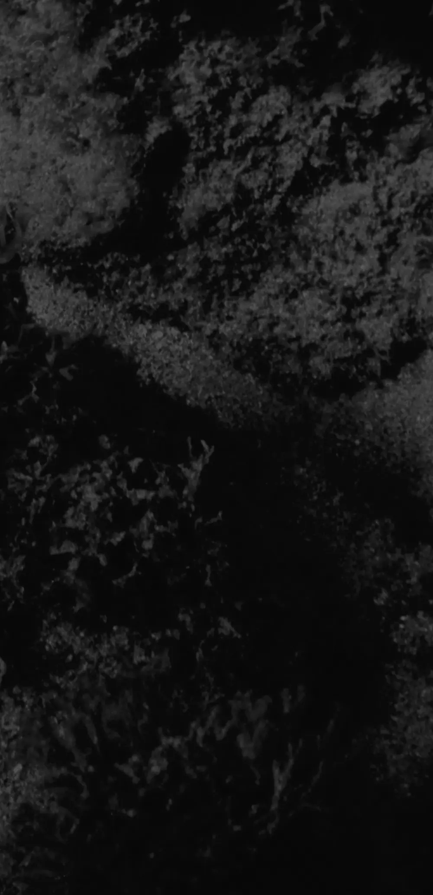{.lightbox group="discovery-bay-1966" description="**UUID: **57a50265-e41b-4a83-a715-439262dd1488 **Date: **1967-02-13 **Location: **Jamaica | Discovery Bay | Algal Plots **Longitude: **77.414ºW **Latitude: **18.473ºN **Photographer: **Eileen Graham **Copyright: **Trustees of the Natural History Museum (London, UK), CC-BY-4.0" alt="**UUID: **57a50265-e41b-4a83-a715-439262dd1488 **Date: **1967-02-13 **Location: **Jamaica | Discovery Bay | Algal Plots **Longitude: **77.414ºW **Latitude: **18.473ºN **Photographer: **Eileen Graham **Copyright: **Trustees of the Natural History Museum (London, UK), CC-BY-4.0"}

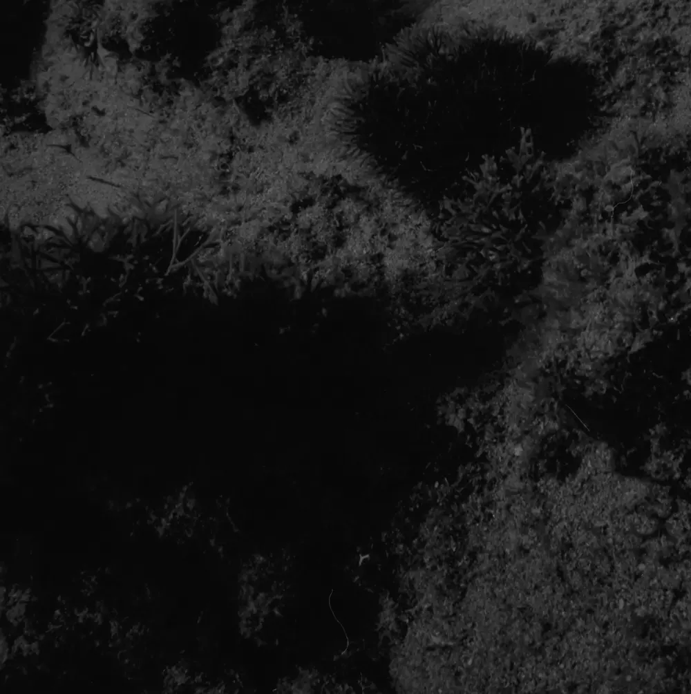{.lightbox group="discovery-bay-1966" description="**UUID: **f5fa12d7-5690-43c4-a2b8-ea00ee64c40e **Date: **1967-02-13 **Location: **Jamaica | Discovery Bay | Algal Plots **Longitude: **77.414ºW **Latitude: **18.473ºN **Photographer: **Eileen Graham **Copyright: **Trustees of the Natural History Museum (London, UK), CC-BY-4.0" alt="**UUID: **f5fa12d7-5690-43c4-a2b8-ea00ee64c40e **Date: **1967-02-13 **Location: **Jamaica | Discovery Bay | Algal Plots **Longitude: **77.414ºW **Latitude: **18.473ºN **Photographer: **Eileen Graham **Copyright: **Trustees of the Natural History Museum (London, UK), CC-BY-4.0"}

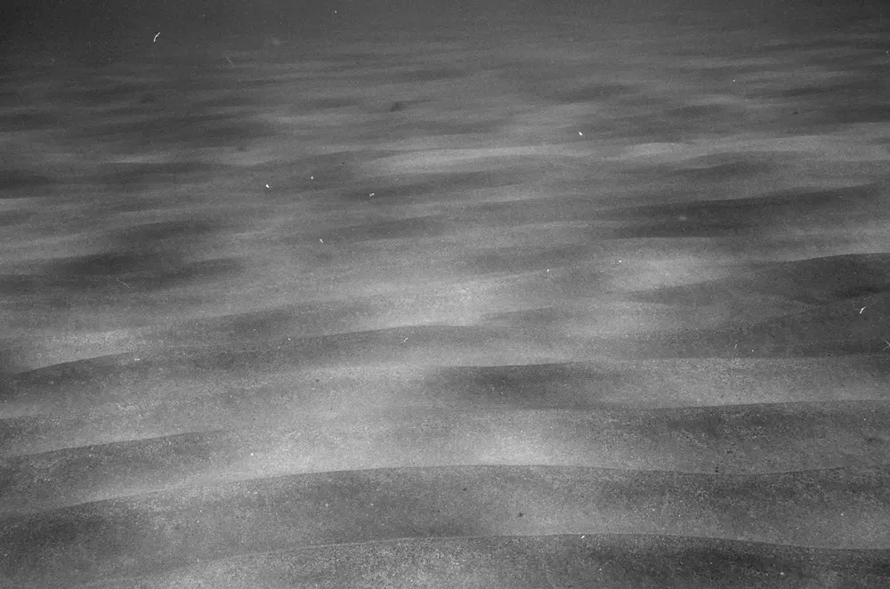{.lightbox group="discovery-bay-1966" description="**UUID: **811af62a-50d2-4558-bb6f-7899887e066d **Date: **1967-02-13 **Location: **Jamaica | Discovery Bay | Algal Plots **Longitude: **77.414ºW **Latitude: **18.473ºN **Photographer: **Eileen Graham **Copyright: **Trustees of the Natural History Museum (London, UK), CC-BY-4.0" alt="**UUID: **811af62a-50d2-4558-bb6f-7899887e066d **Date: **1967-02-13 **Location: **Jamaica | Discovery Bay | Algal Plots **Longitude: **77.414ºW **Latitude: **18.473ºN **Photographer: **Eileen Graham **Copyright: **Trustees of the Natural History Museum (London, UK), CC-BY-4.0"}

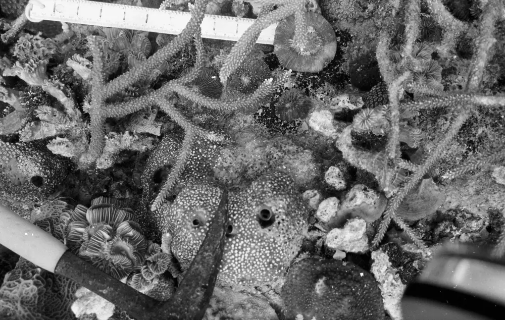{.lightbox group="discovery-bay-1966" description="**UUID: **64cb269f-d7a0-4f79-ba8a-c77347462a89 **Date: **1967-02-13 **Location: **Jamaica | Discovery Bay | Buoy Upper Slope **Longitude: **77.40908ºW **Latitude: **18.47322ºN **Photographer: **Eileen Graham **Copyright: **Trustees of the Natural History Museum (London, UK), CC-BY-4.0" alt="**UUID: **64cb269f-d7a0-4f79-ba8a-c77347462a89 **Date: **1967-02-13 **Location: **Jamaica | Discovery Bay | Buoy Upper Slope **Longitude: **77.40908ºW **Latitude: **18.47322ºN **Photographer: **Eileen Graham **Copyright: **Trustees of the Natural History Museum (London, UK), CC-BY-4.0"}

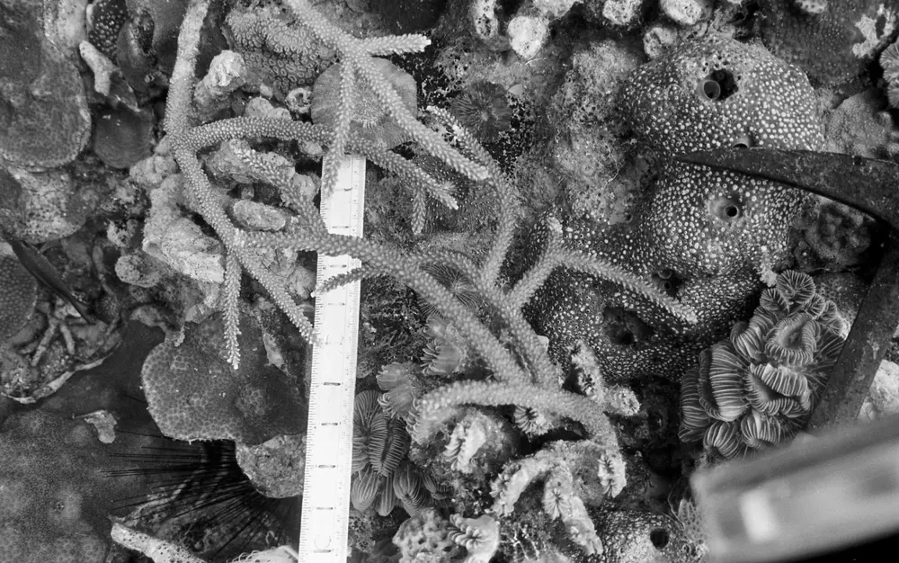{.lightbox group="discovery-bay-1966" description="**UUID: **ee103b4d-0d61-4237-aeb5-75124a8d36f5 **Date: **1967-02-13 **Location: **Jamaica | Discovery Bay | Buoy Upper Slope **Longitude: **77.40908ºW **Latitude: **18.47322ºN **Photographer: **Eileen Graham **Copyright: **Trustees of the Natural History Museum (London, UK), CC-BY-4.0" alt="**UUID: **ee103b4d-0d61-4237-aeb5-75124a8d36f5 **Date: **1967-02-13 **Location: **Jamaica | Discovery Bay | Buoy Upper Slope **Longitude: **77.40908ºW **Latitude: **18.47322ºN **Photographer: **Eileen Graham **Copyright: **Trustees of the Natural History Museum (London, UK), CC-BY-4.0"}

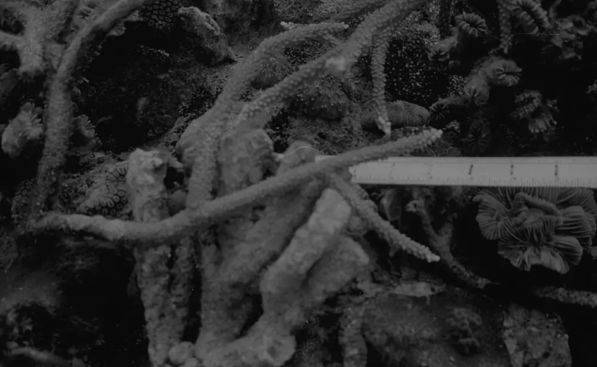{.lightbox group="discovery-bay-1966" description="**UUID: **fbb9549c-099d-41b6-b1da-6449880bf0fe **Date: **1967-02-13 **Location: **Jamaica | Discovery Bay | Buoy Upper Slope **Longitude: **77.40908ºW **Latitude: **18.47322ºN **Photographer: **Eileen Graham **Copyright: **Trustees of the Natural History Museum (London, UK), CC-BY-4.0" alt="**UUID: **fbb9549c-099d-41b6-b1da-6449880bf0fe **Date: **1967-02-13 **Location: **Jamaica | Discovery Bay | Buoy Upper Slope **Longitude: **77.40908ºW **Latitude: **18.47322ºN **Photographer: **Eileen Graham **Copyright: **Trustees of the Natural History Museum (London, UK), CC-BY-4.0"}

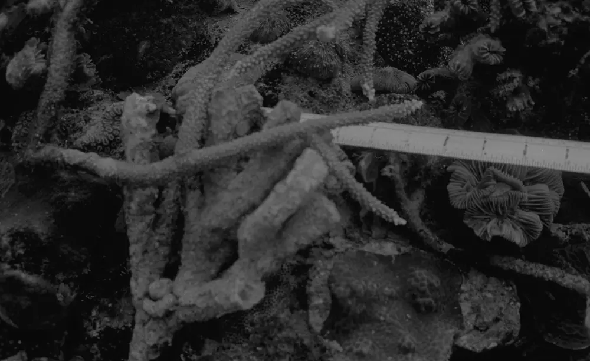{.lightbox group="discovery-bay-1966" description="**UUID: **d0a16c64-9318-4e17-adcd-6cd4cff942cd **Date: **1967-02-13 **Location: **Jamaica | Discovery Bay | Buoy Upper Slope **Longitude: **77.40908ºW **Latitude: **18.47322ºN **Photographer: **Eileen Graham **Copyright: **Trustees of the Natural History Museum (London, UK), CC-BY-4.0" alt="**UUID: **d0a16c64-9318-4e17-adcd-6cd4cff942cd **Date: **1967-02-13 **Location: **Jamaica | Discovery Bay | Buoy Upper Slope **Longitude: **77.40908ºW **Latitude: **18.47322ºN **Photographer: **Eileen Graham **Copyright: **Trustees of the Natural History Museum (London, UK), CC-BY-4.0"}

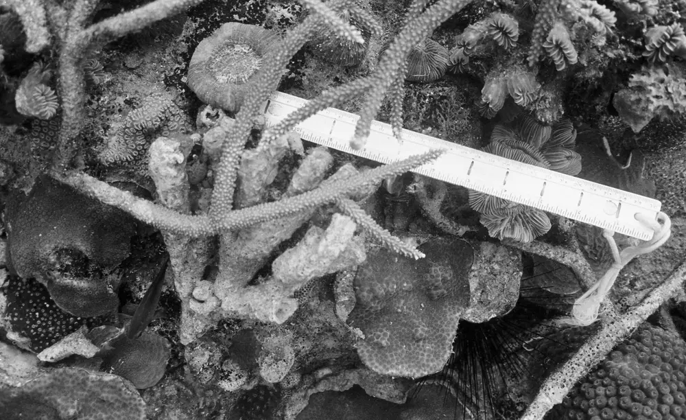{.lightbox group="discovery-bay-1966" description="**UUID: **40541da6-a678-433e-889f-94ac3b7dba0e **Date: **1967-02-13 **Location: **Jamaica | Discovery Bay | Buoy Upper Slope **Longitude: **77.40908ºW **Latitude: **18.47322ºN **Photographer: **Eileen Graham **Copyright: **Trustees of the Natural History Museum (London, UK), CC-BY-4.0" alt="**UUID: **40541da6-a678-433e-889f-94ac3b7dba0e **Date: **1967-02-13 **Location: **Jamaica | Discovery Bay | Buoy Upper Slope **Longitude: **77.40908ºW **Latitude: **18.47322ºN **Photographer: **Eileen Graham **Copyright: **Trustees of the Natural History Museum (London, UK), CC-BY-4.0"}

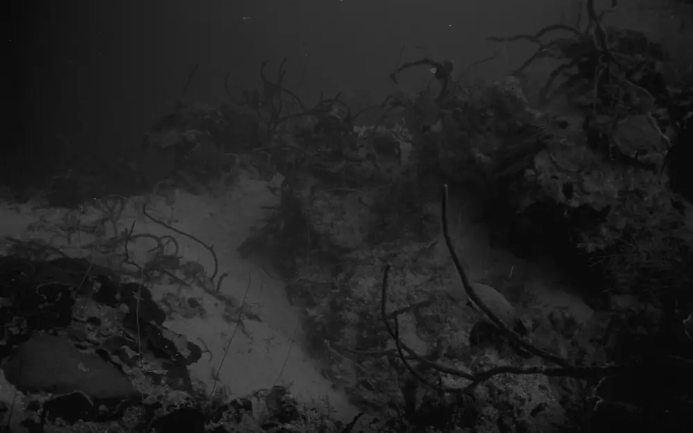{.lightbox group="discovery-bay-1966" description="**UUID: **b2674fda-90fa-47cb-8e0e-77f6976f7386 **Date: **1967-03-03 **Location: **Jamaica | Discovery Bay | Buoy Deep **Longitude: **77.40908ºW **Latitude: **18.47325ºN **Photographer: **Eileen Graham **Copyright: **Trustees of the Natural History Museum (London, UK), CC-BY-4.0" alt="**UUID: **b2674fda-90fa-47cb-8e0e-77f6976f7386 **Date: **1967-03-03 **Location: **Jamaica | Discovery Bay | Buoy Deep **Longitude: **77.40908ºW **Latitude: **18.47325ºN **Photographer: **Eileen Graham **Copyright: **Trustees of the Natural History Museum (London, UK), CC-BY-4.0"}

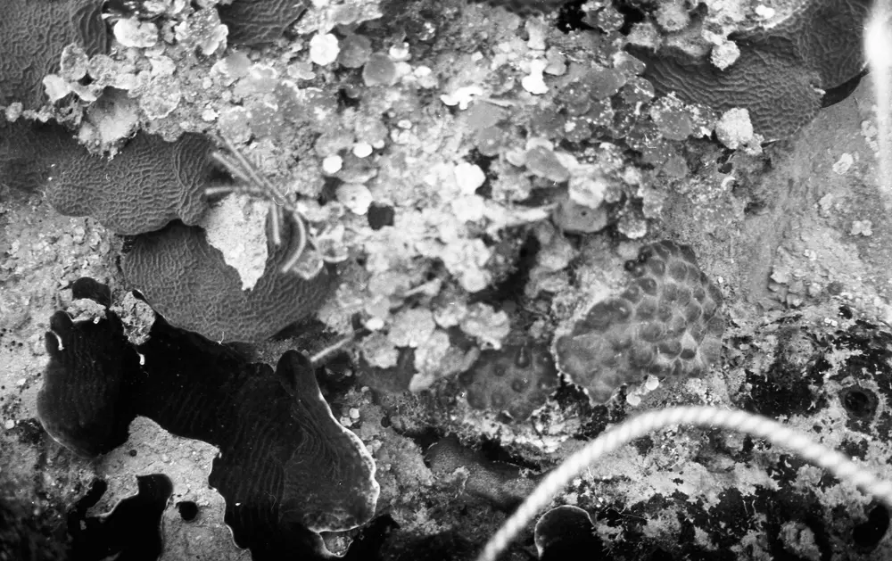{.lightbox group="discovery-bay-1966" description="**UUID: **d21df725-83f0-47ea-b963-87a65950c580 **Date: **1967-03-03 **Location: **Jamaica | Discovery Bay | Buoy Deep **Longitude: **77.40908ºW **Latitude: **18.47325ºN **Photographer: **Eileen Graham **Copyright: **Trustees of the Natural History Museum (London, UK), CC-BY-4.0" alt="**UUID: **d21df725-83f0-47ea-b963-87a65950c580 **Date: **1967-03-03 **Location: **Jamaica | Discovery Bay | Buoy Deep **Longitude: **77.40908ºW **Latitude: **18.47325ºN **Photographer: **Eileen Graham **Copyright: **Trustees of the Natural History Museum (London, UK), CC-BY-4.0"}

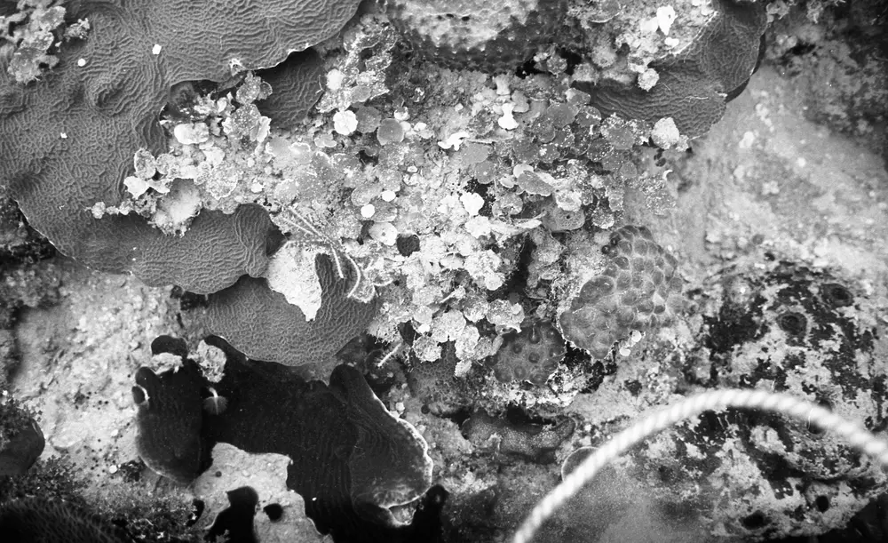{.lightbox group="discovery-bay-1966" description="**UUID: **37c58a3c-1a2a-47b5-9dab-41dbff525bb7 **Date: **1967-03-03 **Location: **Jamaica | Discovery Bay | Buoy Deep **Longitude: **77.40908ºW **Latitude: **18.47325ºN **Photographer: **Eileen Graham **Copyright: **Trustees of the Natural History Museum (London, UK), CC-BY-4.0" alt="**UUID: **37c58a3c-1a2a-47b5-9dab-41dbff525bb7 **Date: **1967-03-03 **Location: **Jamaica | Discovery Bay | Buoy Deep **Longitude: **77.40908ºW **Latitude: **18.47325ºN **Photographer: **Eileen Graham **Copyright: **Trustees of the Natural History Museum (London, UK), CC-BY-4.0"}

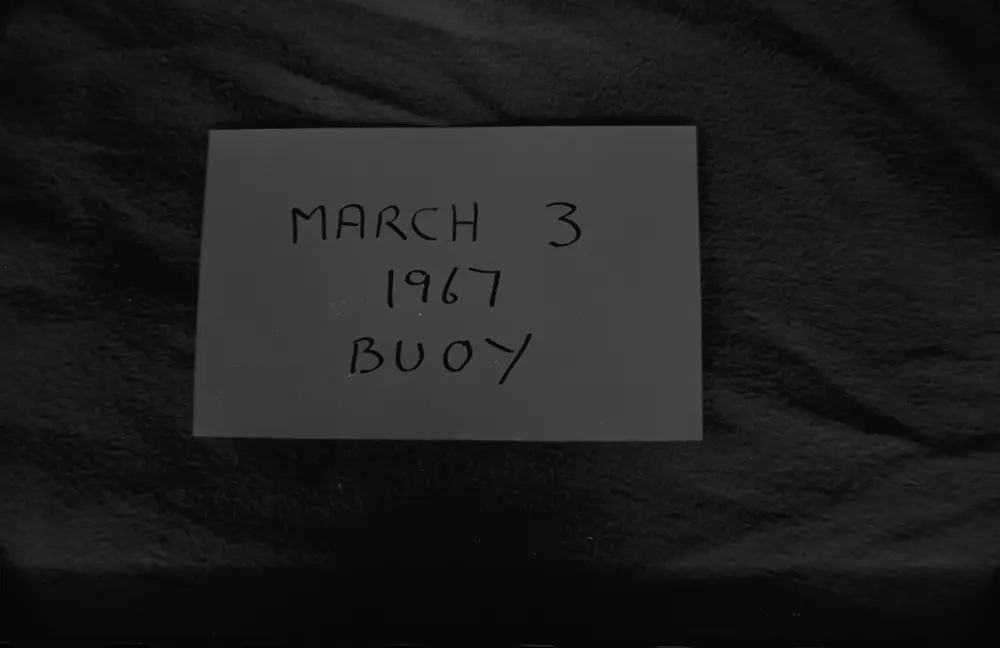{.lightbox group="discovery-bay-1966" description="**UUID: **b14d4cf7-d96f-4ce6-ba2b-ecbd945af0b7 **Date: **1967-03-03 **Location: **Jamaica | Discovery Bay | Buoy Deep **Longitude: **77.40908ºW **Latitude: **18.47325ºN **Photographer: **Eileen Graham **Copyright: **Trustees of the Natural History Museum (London, UK), CC-BY-4.0" alt="**UUID: **b14d4cf7-d96f-4ce6-ba2b-ecbd945af0b7 **Date: **1967-03-03 **Location: **Jamaica | Discovery Bay | Buoy Deep **Longitude: **77.40908ºW **Latitude: **18.47325ºN **Photographer: **Eileen Graham **Copyright: **Trustees of the Natural History Museum (London, UK), CC-BY-4.0"}

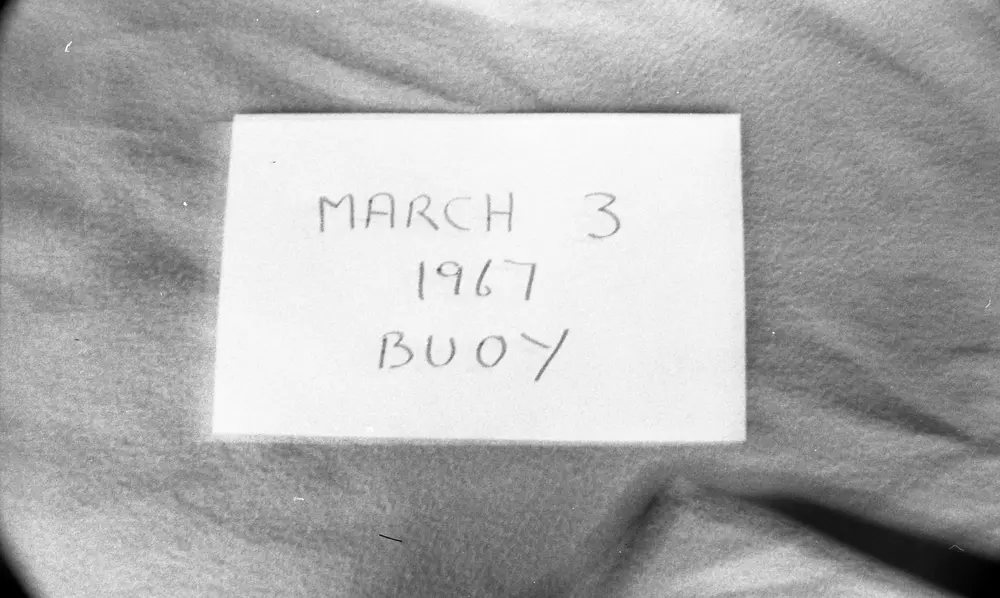{.lightbox group="discovery-bay-1966" description="**UUID: **addf1218-6d72-4949-9080-85131a48c649 **Date: **1967-03-03 **Location: **Jamaica | Discovery Bay | Buoy Deep **Longitude: **77.40908ºW **Latitude: **18.47325ºN **Photographer: **Eileen Graham **Copyright: **Trustees of the Natural History Museum (London, UK), CC-BY-4.0" alt="**UUID: **addf1218-6d72-4949-9080-85131a48c649 **Date: **1967-03-03 **Location: **Jamaica | Discovery Bay | Buoy Deep **Longitude: **77.40908ºW **Latitude: **18.47325ºN **Photographer: **Eileen Graham **Copyright: **Trustees of the Natural History Museum (London, UK), CC-BY-4.0"}

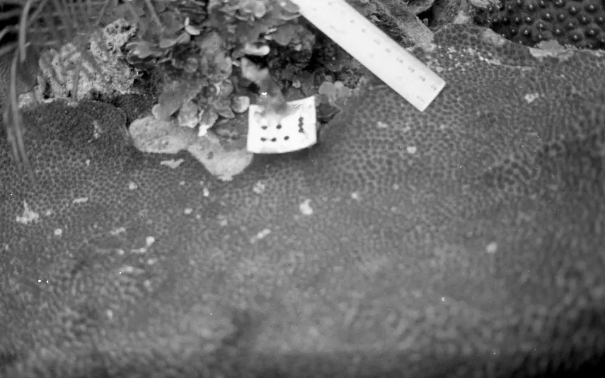{.lightbox group="discovery-bay-1966" description="**UUID: **9fee16b8-79f0-4e9b-b2fe-a5110fc09bb0 **Date: **1967-03-03 **Location: **Jamaica | Discovery Bay | Buoy Upper Slope **Longitude: **77.40908ºW **Latitude: **18.47322ºN **Photographer: **Eileen Graham **Copyright: **Trustees of the Natural History Museum (London, UK), CC-BY-4.0" alt="**UUID: **9fee16b8-79f0-4e9b-b2fe-a5110fc09bb0 **Date: **1967-03-03 **Location: **Jamaica | Discovery Bay | Buoy Upper Slope **Longitude: **77.40908ºW **Latitude: **18.47322ºN **Photographer: **Eileen Graham **Copyright: **Trustees of the Natural History Museum (London, UK), CC-BY-4.0"}

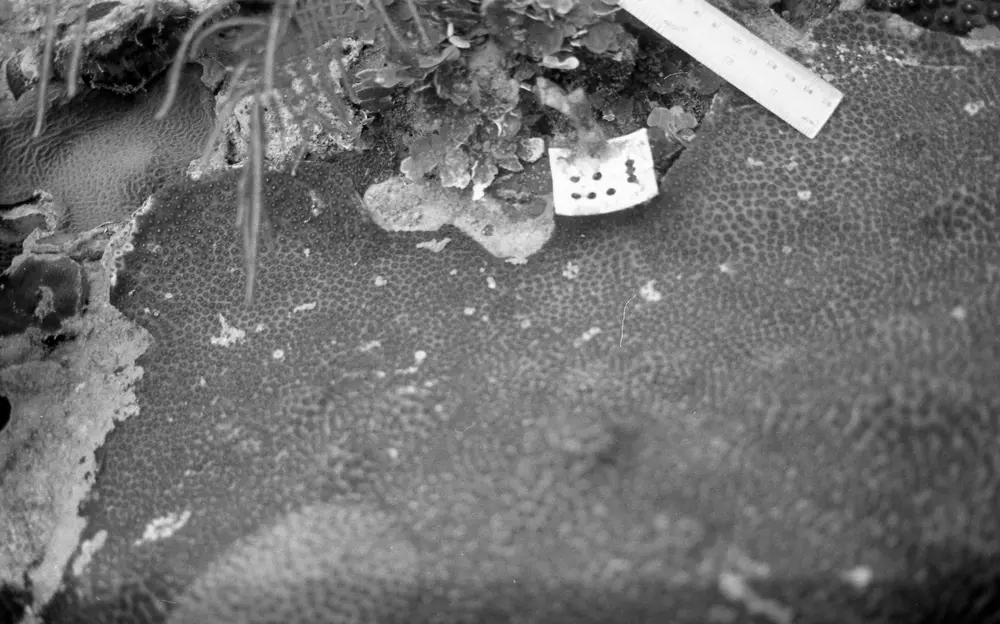{.lightbox group="discovery-bay-1966" description="**UUID: **8e5de13f-0f01-402d-8484-55ad716c08ff **Date: **1967-03-03 **Location: **Jamaica | Discovery Bay | Buoy Upper Slope **Longitude: **77.40908ºW **Latitude: **18.47322ºN **Photographer: **Eileen Graham **Copyright: **Trustees of the Natural History Museum (London, UK), CC-BY-4.0" alt="**UUID: **8e5de13f-0f01-402d-8484-55ad716c08ff **Date: **1967-03-03 **Location: **Jamaica | Discovery Bay | Buoy Upper Slope **Longitude: **77.40908ºW **Latitude: **18.47322ºN **Photographer: **Eileen Graham **Copyright: **Trustees of the Natural History Museum (London, UK), CC-BY-4.0"}

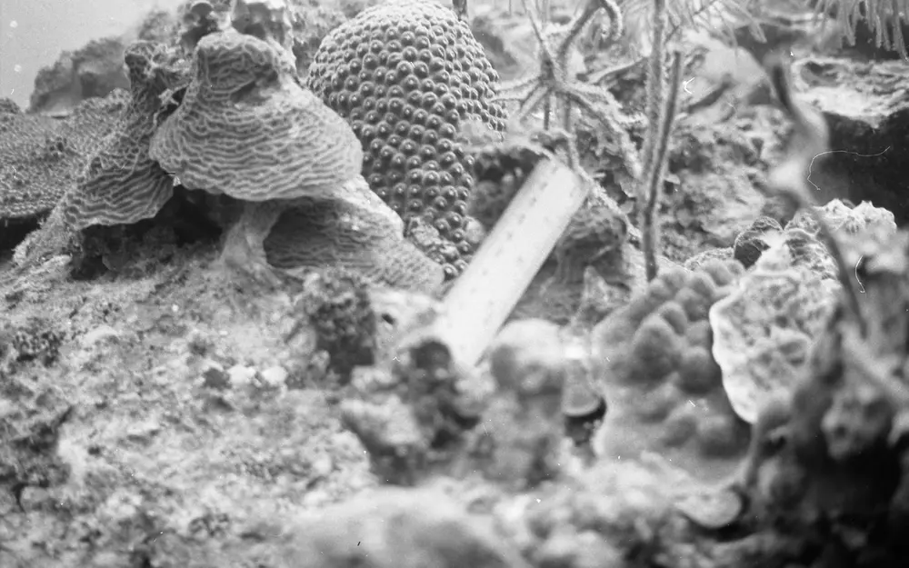{.lightbox group="discovery-bay-1966" description="**UUID: **a5fe7935-c7c4-4917-adec-b361f4f8bfb3 **Date: **1967-03-03 **Location: **Jamaica | Discovery Bay | Buoy Upper Slope **Longitude: **77.40908ºW **Latitude: **18.47322ºN **Photographer: **Eileen Graham **Copyright: **Trustees of the Natural History Museum (London, UK), CC-BY-4.0" alt="**UUID: **a5fe7935-c7c4-4917-adec-b361f4f8bfb3 **Date: **1967-03-03 **Location: **Jamaica | Discovery Bay | Buoy Upper Slope **Longitude: **77.40908ºW **Latitude: **18.47322ºN **Photographer: **Eileen Graham **Copyright: **Trustees of the Natural History Museum (London, UK), CC-BY-4.0"}

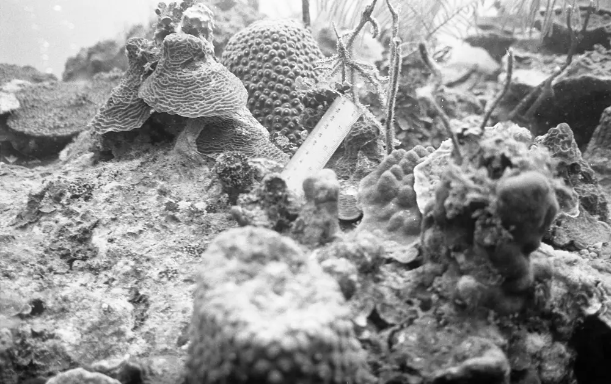{.lightbox group="discovery-bay-1966" description="**UUID: **f49f237b-df19-413c-b488-09ef65d8b04a **Date: **1967-03-03 **Location: **Jamaica | Discovery Bay | Buoy Upper Slope **Longitude: **77.40908ºW **Latitude: **18.47322ºN **Photographer: **Eileen Graham **Copyright: **Trustees of the Natural History Museum (London, UK), CC-BY-4.0" alt="**UUID: **f49f237b-df19-413c-b488-09ef65d8b04a **Date: **1967-03-03 **Location: **Jamaica | Discovery Bay | Buoy Upper Slope **Longitude: **77.40908ºW **Latitude: **18.47322ºN **Photographer: **Eileen Graham **Copyright: **Trustees of the Natural History Museum (London, UK), CC-BY-4.0"}

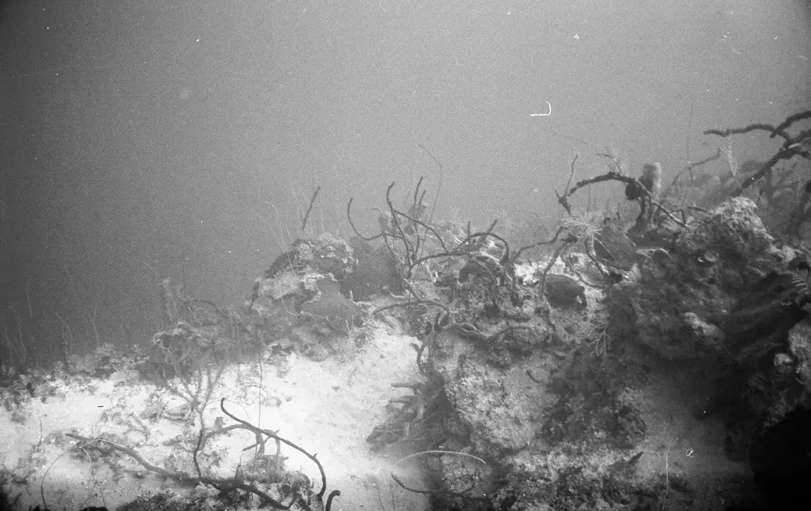{.lightbox group="discovery-bay-1966" description="**UUID: **79ddf965-514e-47bc-b897-7ef67484ac99 **Date: **1967-03-03 **Location: **Jamaica | Discovery Bay | Buoy Deep **Longitude: **77.40908ºW **Latitude: **18.47325ºN **Photographer: **Eileen Graham **Copyright: **Trustees of the Natural History Museum (London, UK), CC-BY-4.0" alt="**UUID: **79ddf965-514e-47bc-b897-7ef67484ac99 **Date: **1967-03-03 **Location: **Jamaica | Discovery Bay | Buoy Deep **Longitude: **77.40908ºW **Latitude: **18.47325ºN **Photographer: **Eileen Graham **Copyright: **Trustees of the Natural History Museum (London, UK), CC-BY-4.0"}

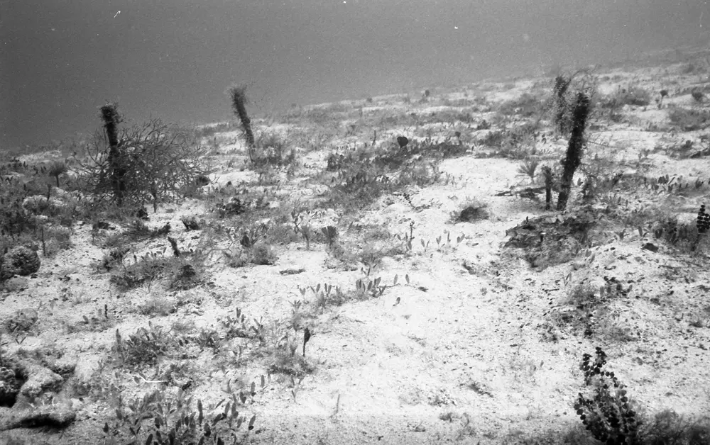{.lightbox group="discovery-bay-1966" description="**UUID: **bdd67e3d-91f2-4dbb-9ff0-75cde63b241e **Date: **1967-03-03 **Location: **Jamaica | Discovery Bay | Algal Plots **Longitude: **77.414ºW **Latitude: **18.473ºN **Photographer: **Eileen Graham **Copyright: **Trustees of the Natural History Museum (London, UK), CC-BY-4.0" alt="**UUID: **bdd67e3d-91f2-4dbb-9ff0-75cde63b241e **Date: **1967-03-03 **Location: **Jamaica | Discovery Bay | Algal Plots **Longitude: **77.414ºW **Latitude: **18.473ºN **Photographer: **Eileen Graham **Copyright: **Trustees of the Natural History Museum (London, UK), CC-BY-4.0"}

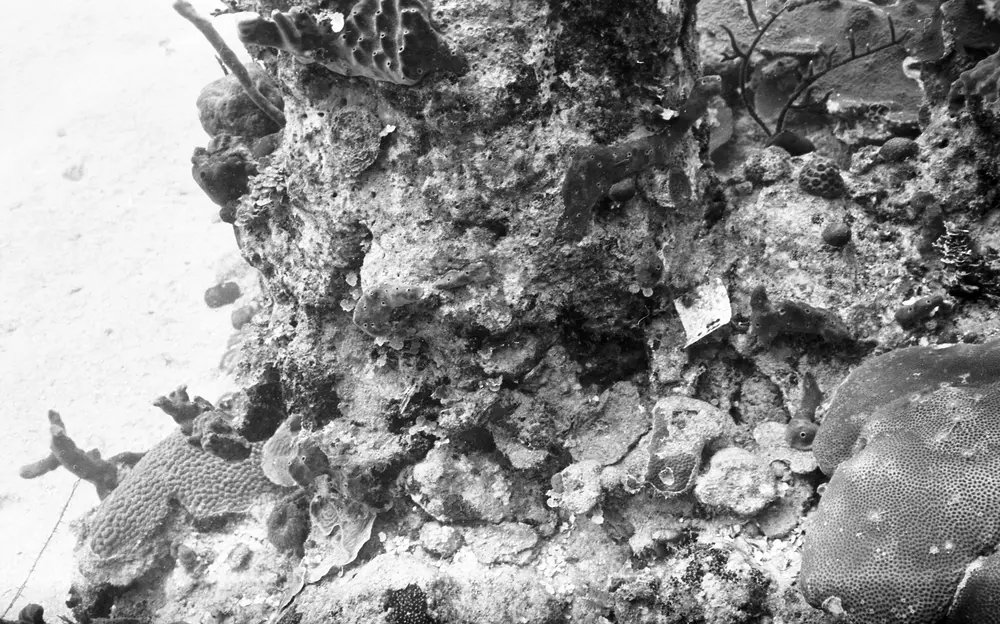{.lightbox group="discovery-bay-1966" description="**UUID: **bdb93161-545b-44e4-9959-57d0d874eaa6 **Date: **1967-03-03 **Location: **Jamaica | Discovery Bay | Buoy Upper Slope **Longitude: **77.40908ºW **Latitude: **18.47322ºN **Photographer: **Eileen Graham **Copyright: **Trustees of the Natural History Museum (London, UK), CC-BY-4.0" alt="**UUID: **bdb93161-545b-44e4-9959-57d0d874eaa6 **Date: **1967-03-03 **Location: **Jamaica | Discovery Bay | Buoy Upper Slope **Longitude: **77.40908ºW **Latitude: **18.47322ºN **Photographer: **Eileen Graham **Copyright: **Trustees of the Natural History Museum (London, UK), CC-BY-4.0"}

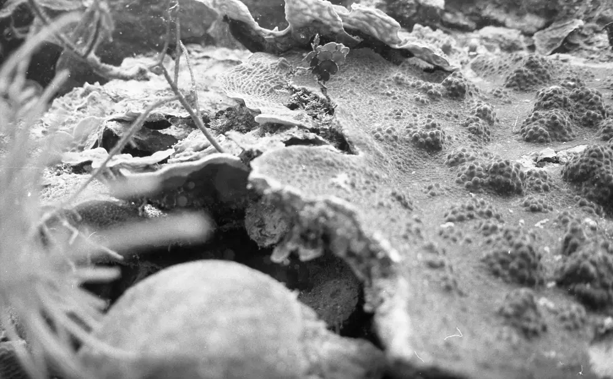{.lightbox group="discovery-bay-1966" description="**UUID: **a63978f2-6ec3-45a4-a148-061eac5b21f6 **Date: **1967-03-03 **Location: **Jamaica | Discovery Bay | Buoy Upper Slope **Longitude: **77.40908ºW **Latitude: **18.47322ºN **Photographer: **Eileen Graham **Copyright: **Trustees of the Natural History Museum (London, UK), CC-BY-4.0" alt="**UUID: **a63978f2-6ec3-45a4-a148-061eac5b21f6 **Date: **1967-03-03 **Location: **Jamaica | Discovery Bay | Buoy Upper Slope **Longitude: **77.40908ºW **Latitude: **18.47322ºN **Photographer: **Eileen Graham **Copyright: **Trustees of the Natural History Museum (London, UK), CC-BY-4.0"}

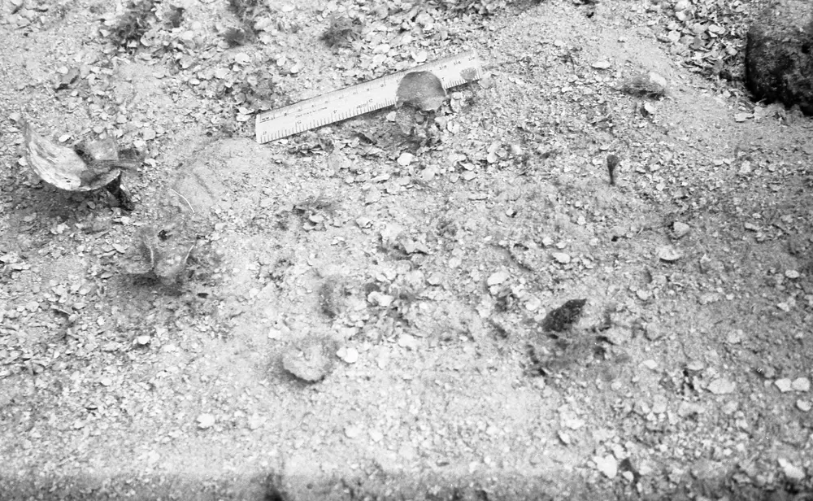{.lightbox group="discovery-bay-1966" description="**UUID: **396b1ecf-cfb4-4d31-b5e3-edcac84a222d **Date: **1967-03-03 **Location: **Jamaica | Discovery Bay | Algal Plots **Longitude: **77.414ºW **Latitude: **18.473ºN **Photographer: **Eileen Graham **Copyright: **Trustees of the Natural History Museum (London, UK), CC-BY-4.0" alt="**UUID: **396b1ecf-cfb4-4d31-b5e3-edcac84a222d **Date: **1967-03-03 **Location: **Jamaica | Discovery Bay | Algal Plots **Longitude: **77.414ºW **Latitude: **18.473ºN **Photographer: **Eileen Graham **Copyright: **Trustees of the Natural History Museum (London, UK), CC-BY-4.0"}

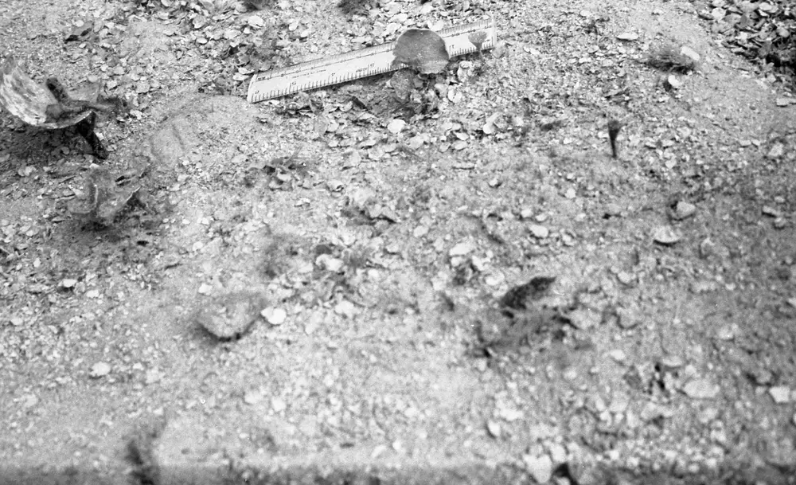{.lightbox group="discovery-bay-1966" description="**UUID: **56cfcd09-f576-44b7-868c-548232c75115 **Date: **1967-03-03 **Location: **Jamaica | Discovery Bay | Algal Plots **Longitude: **77.414ºW **Latitude: **18.473ºN **Photographer: **Eileen Graham **Copyright: **Trustees of the Natural History Museum (London, UK), CC-BY-4.0" alt="**UUID: **56cfcd09-f576-44b7-868c-548232c75115 **Date: **1967-03-03 **Location: **Jamaica | Discovery Bay | Algal Plots **Longitude: **77.414ºW **Latitude: **18.473ºN **Photographer: **Eileen Graham **Copyright: **Trustees of the Natural History Museum (London, UK), CC-BY-4.0"}

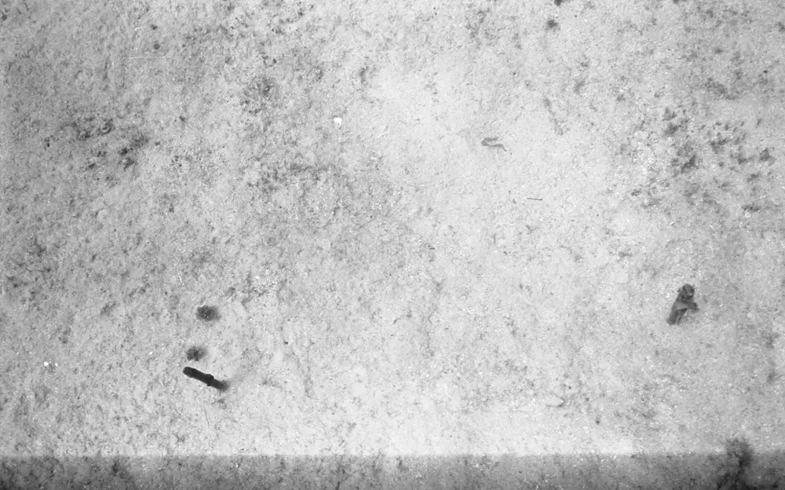{.lightbox group="discovery-bay-1966" description="**UUID: **9bfd7f52-81fa-4288-be24-367c3f43b472 **Date: **1967-03-03 **Location: **Jamaica | Discovery Bay | Algal Plots **Longitude: **77.414ºW **Latitude: **18.473ºN **Photographer: **Eileen Graham **Copyright: **Trustees of the Natural History Museum (London, UK), CC-BY-4.0" alt="**UUID: **9bfd7f52-81fa-4288-be24-367c3f43b472 **Date: **1967-03-03 **Location: **Jamaica | Discovery Bay | Algal Plots **Longitude: **77.414ºW **Latitude: **18.473ºN **Photographer: **Eileen Graham **Copyright: **Trustees of the Natural History Museum (London, UK), CC-BY-4.0"}

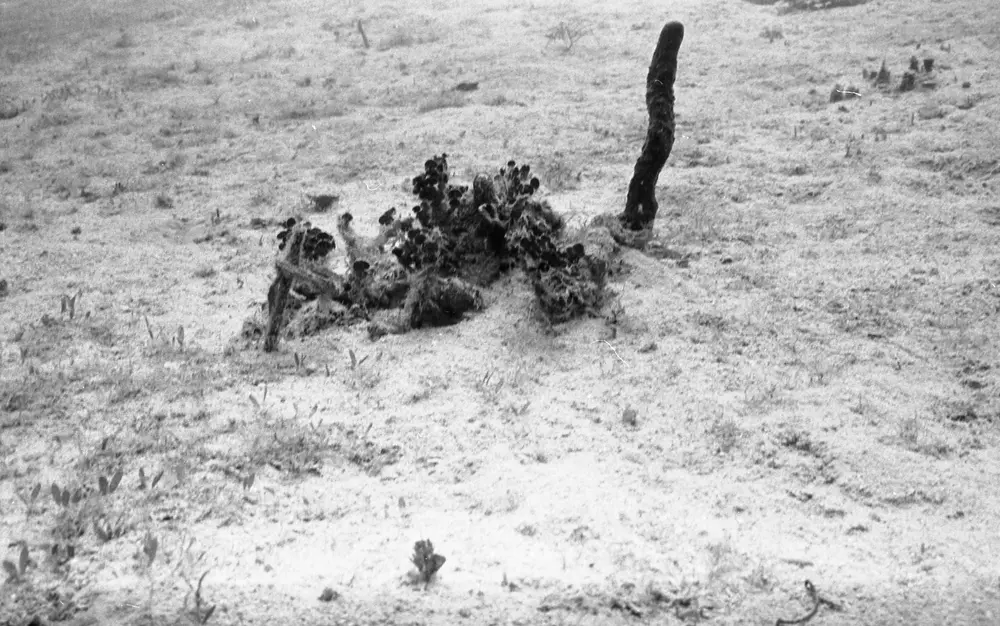{.lightbox group="discovery-bay-1966" description="**UUID: **79ff7d99-147c-4b85-93e4-1f45e8f76d7b **Date: **1967-03-03 **Location: **Jamaica | Discovery Bay | Algal Plots **Longitude: **77.414ºW **Latitude: **18.473ºN **Photographer: **Eileen Graham **Copyright: **Trustees of the Natural History Museum (London, UK), CC-BY-4.0" alt="**UUID: **79ff7d99-147c-4b85-93e4-1f45e8f76d7b **Date: **1967-03-03 **Location: **Jamaica | Discovery Bay | Algal Plots **Longitude: **77.414ºW **Latitude: **18.473ºN **Photographer: **Eileen Graham **Copyright: **Trustees of the Natural History Museum (London, UK), CC-BY-4.0"}

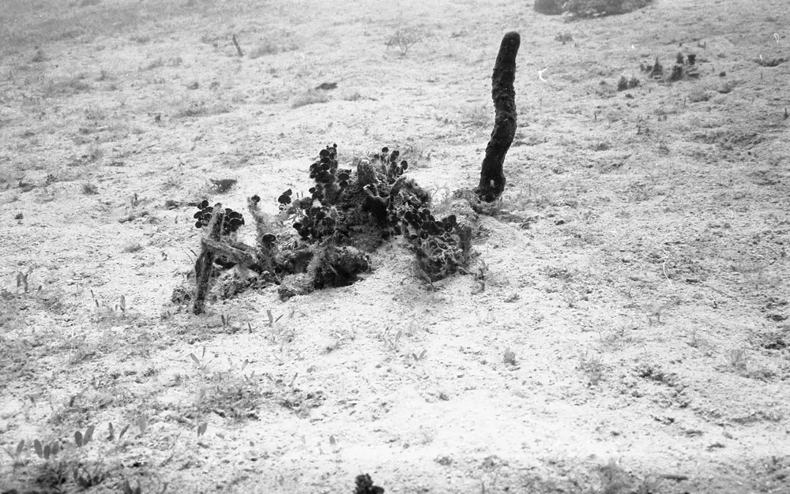{.lightbox group="discovery-bay-1966" description="**UUID: **dd0a275d-df64-4c4d-b162-bacbb58c8e03 **Date: **1967-03-03 **Location: **Jamaica | Discovery Bay | Algal Plots **Longitude: **77.414ºW **Latitude: **18.473ºN **Photographer: **Eileen Graham **Copyright: **Trustees of the Natural History Museum (London, UK), CC-BY-4.0" alt="**UUID: **dd0a275d-df64-4c4d-b162-bacbb58c8e03 **Date: **1967-03-03 **Location: **Jamaica | Discovery Bay | Algal Plots **Longitude: **77.414ºW **Latitude: **18.473ºN **Photographer: **Eileen Graham **Copyright: **Trustees of the Natural History Museum (London, UK), CC-BY-4.0"}

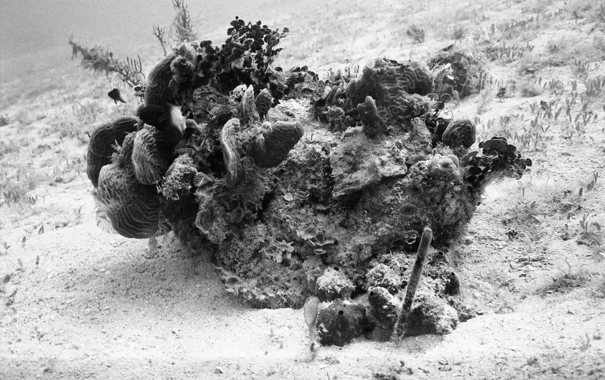{.lightbox group="discovery-bay-1966" description="**UUID: **08e3d43a-84df-4876-875c-49bc1d7acf67 **Date: **1967-03-03 **Location: **Jamaica | Discovery Bay | Algal Plots **Longitude: **77.414ºW **Latitude: **18.473ºN **Photographer: **Eileen Graham **Copyright: **Trustees of the Natural History Museum (London, UK), CC-BY-4.0" alt="**UUID: **08e3d43a-84df-4876-875c-49bc1d7acf67 **Date: **1967-03-03 **Location: **Jamaica | Discovery Bay | Algal Plots **Longitude: **77.414ºW **Latitude: **18.473ºN **Photographer: **Eileen Graham **Copyright: **Trustees of the Natural History Museum (London, UK), CC-BY-4.0"}

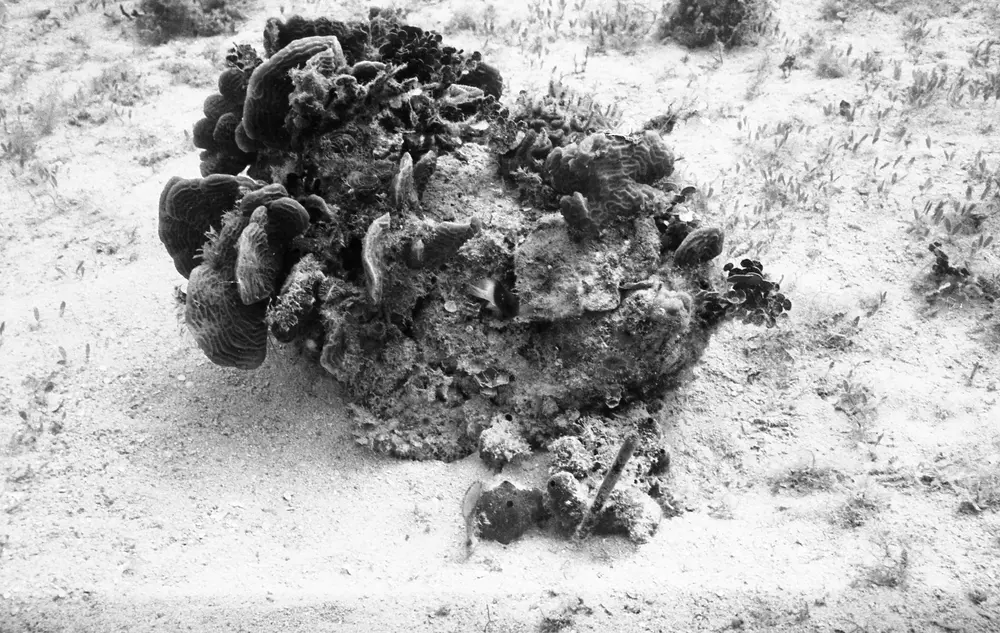{.lightbox group="discovery-bay-1966" description="**UUID: **86e560a6-ae1f-40c6-994f-25d3fb4f60fb **Date: **1967-03-03 **Location: **Jamaica | Discovery Bay | Algal Plots **Longitude: **77.414ºW **Latitude: **18.473ºN **Photographer: **Eileen Graham **Copyright: **Trustees of the Natural History Museum (London, UK), CC-BY-4.0" alt="**UUID: **86e560a6-ae1f-40c6-994f-25d3fb4f60fb **Date: **1967-03-03 **Location: **Jamaica | Discovery Bay | Algal Plots **Longitude: **77.414ºW **Latitude: **18.473ºN **Photographer: **Eileen Graham **Copyright: **Trustees of the Natural History Museum (London, UK), CC-BY-4.0"}

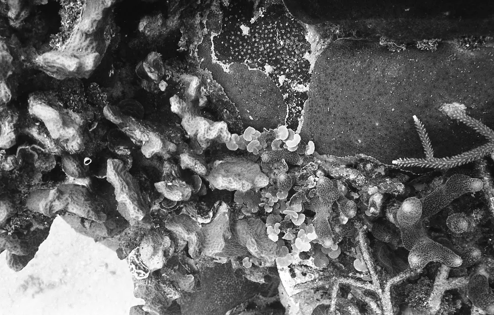{.lightbox group="discovery-bay-1966" description="**UUID: **c7bf6455-83a7-4ee9-9bc3-b1d7c8dfbcce **Date: **1967-03-03 **Location: **Jamaica | Discovery Bay | Buoy Upper Slope **Longitude: **77.40908ºW **Latitude: **18.47322ºN **Photographer: **Eileen Graham **Copyright: **Trustees of the Natural History Museum (London, UK), CC-BY-4.0" alt="**UUID: **c7bf6455-83a7-4ee9-9bc3-b1d7c8dfbcce **Date: **1967-03-03 **Location: **Jamaica | Discovery Bay | Buoy Upper Slope **Longitude: **77.40908ºW **Latitude: **18.47322ºN **Photographer: **Eileen Graham **Copyright: **Trustees of the Natural History Museum (London, UK), CC-BY-4.0"}

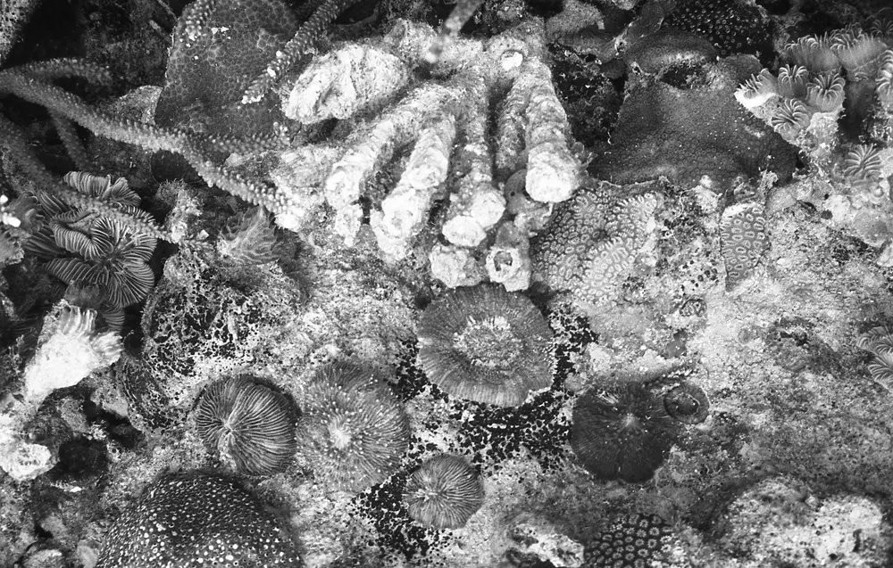{.lightbox group="discovery-bay-1966" description="**UUID: **dd6d2c6f-ea3f-4bdc-82c8-9307f36b4dcb **Date: **1967-03-03 **Location: **Jamaica | Discovery Bay | Buoy Upper Slope **Longitude: **77.40908ºW **Latitude: **18.47322ºN **Photographer: **Eileen Graham **Copyright: **Trustees of the Natural History Museum (London, UK), CC-BY-4.0" alt="**UUID: **dd6d2c6f-ea3f-4bdc-82c8-9307f36b4dcb **Date: **1967-03-03 **Location: **Jamaica | Discovery Bay | Buoy Upper Slope **Longitude: **77.40908ºW **Latitude: **18.47322ºN **Photographer: **Eileen Graham **Copyright: **Trustees of the Natural History Museum (London, UK), CC-BY-4.0"}

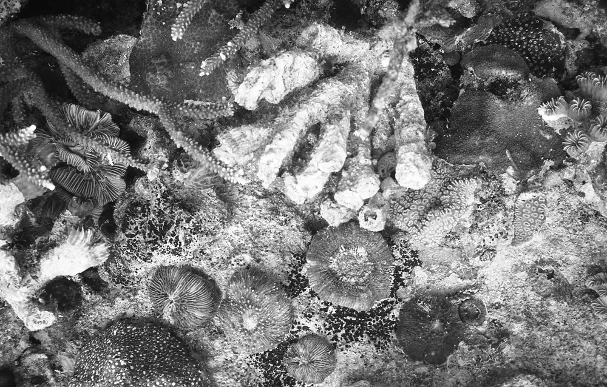{.lightbox group="discovery-bay-1966" description="**UUID: **cd3fd378-92b1-4e88-bbc6-380adcd1b557 **Date: **1967-03-03 **Location: **Jamaica | Discovery Bay | Buoy Upper Slope **Longitude: **77.40908ºW **Latitude: **18.47322ºN **Photographer: **Eileen Graham **Copyright: **Trustees of the Natural History Museum (London, UK), CC-BY-4.0" alt="**UUID: **cd3fd378-92b1-4e88-bbc6-380adcd1b557 **Date: **1967-03-03 **Location: **Jamaica | Discovery Bay | Buoy Upper Slope **Longitude: **77.40908ºW **Latitude: **18.47322ºN **Photographer: **Eileen Graham **Copyright: **Trustees of the Natural History Museum (London, UK), CC-BY-4.0"}

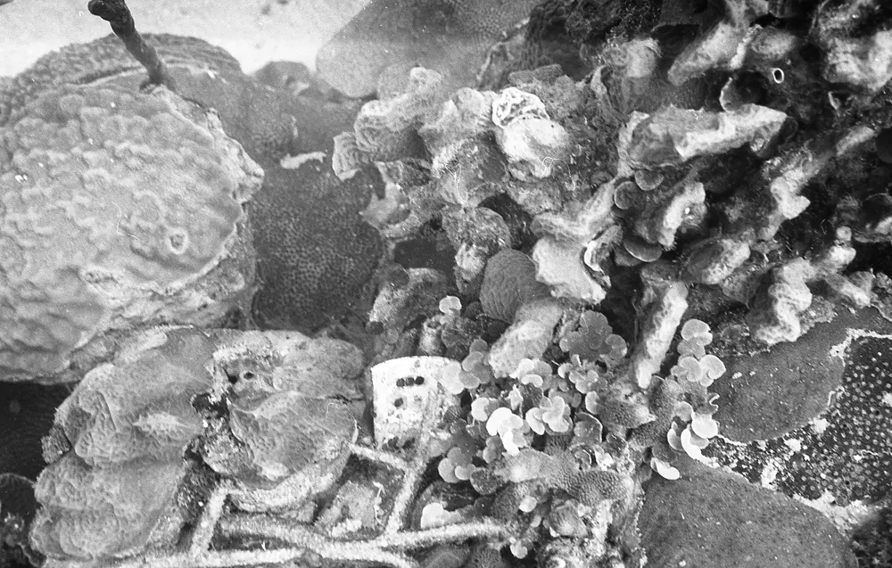{.lightbox group="discovery-bay-1966" description="**UUID: **95f9884b-eb06-4e3d-9cc0-16ea2e3e27d9 **Date: **1967-03-03 **Location: **Jamaica | Discovery Bay | Buoy Upper Slope **Longitude: **77.40908ºW **Latitude: **18.47322ºN **Photographer: **Eileen Graham **Copyright: **Trustees of the Natural History Museum (London, UK), CC-BY-4.0" alt="**UUID: **95f9884b-eb06-4e3d-9cc0-16ea2e3e27d9 **Date: **1967-03-03 **Location: **Jamaica | Discovery Bay | Buoy Upper Slope **Longitude: **77.40908ºW **Latitude: **18.47322ºN **Photographer: **Eileen Graham **Copyright: **Trustees of the Natural History Museum (London, UK), CC-BY-4.0"}

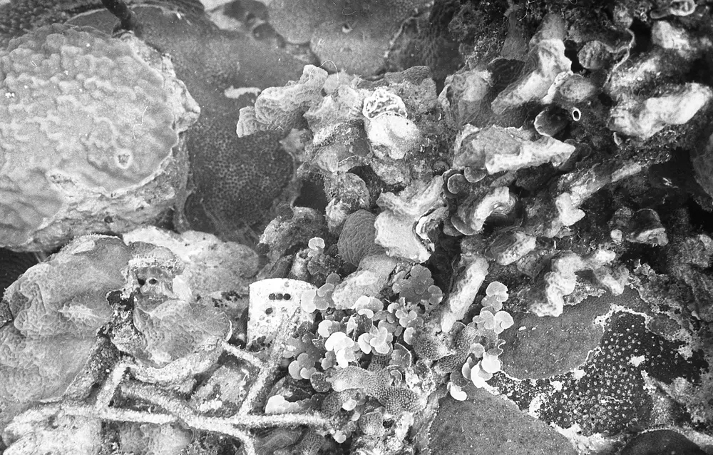{.lightbox group="discovery-bay-1966" description="**UUID: **a9989cde-3d6e-4346-b128-aa93cc6b46ca **Date: **1967-03-03 **Location: **Jamaica | Discovery Bay | Buoy Upper Slope **Longitude: **77.40908ºW **Latitude: **18.47322ºN **Photographer: **Eileen Graham **Copyright: **Trustees of the Natural History Museum (London, UK), CC-BY-4.0" alt="**UUID: **a9989cde-3d6e-4346-b128-aa93cc6b46ca **Date: **1967-03-03 **Location: **Jamaica | Discovery Bay | Buoy Upper Slope **Longitude: **77.40908ºW **Latitude: **18.47322ºN **Photographer: **Eileen Graham **Copyright: **Trustees of the Natural History Museum (London, UK), CC-BY-4.0"}

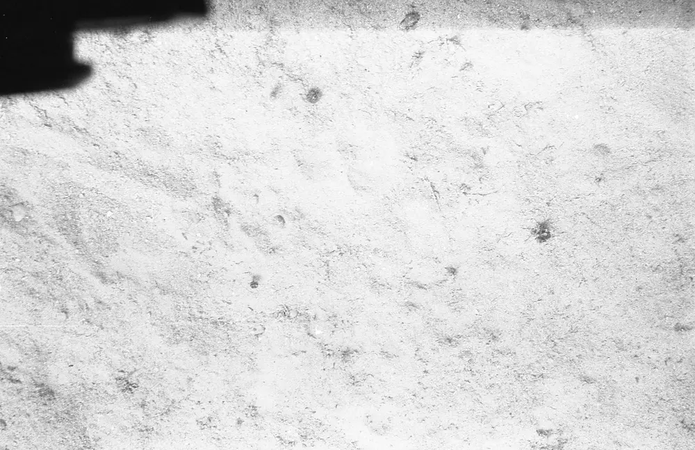{.lightbox group="discovery-bay-1966" description="**UUID: **c1ffc655-1de3-4e57-8255-c1347448f016 **Date: **1967-03-03 **Location: **Jamaica | Discovery Bay | Algal Plots **Longitude: **77.414ºW **Latitude: **18.473ºN **Photographer: **Eileen Graham **Copyright: **Trustees of the Natural History Museum (London, UK), CC-BY-4.0" alt="**UUID: **c1ffc655-1de3-4e57-8255-c1347448f016 **Date: **1967-03-03 **Location: **Jamaica | Discovery Bay | Algal Plots **Longitude: **77.414ºW **Latitude: **18.473ºN **Photographer: **Eileen Graham **Copyright: **Trustees of the Natural History Museum (London, UK), CC-BY-4.0"}

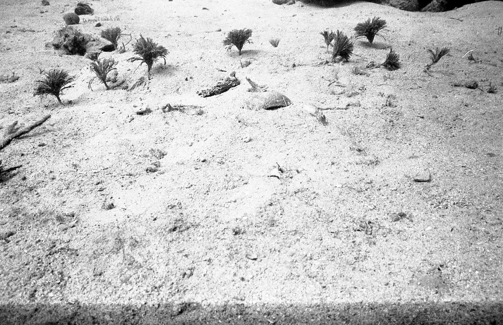{.lightbox group="discovery-bay-1966" description="**UUID: **7be88ae5-ae5f-4717-89dd-7aba7e56af2b **Date: **1967-03-03 **Location: **Jamaica | Discovery Bay | Algal Plots **Longitude: **77.414ºW **Latitude: **18.473ºN **Photographer: **Eileen Graham **Copyright: **Trustees of the Natural History Museum (London, UK), CC-BY-4.0" alt="**UUID: **7be88ae5-ae5f-4717-89dd-7aba7e56af2b **Date: **1967-03-03 **Location: **Jamaica | Discovery Bay | Algal Plots **Longitude: **77.414ºW **Latitude: **18.473ºN **Photographer: **Eileen Graham **Copyright: **Trustees of the Natural History Museum (London, UK), CC-BY-4.0"}

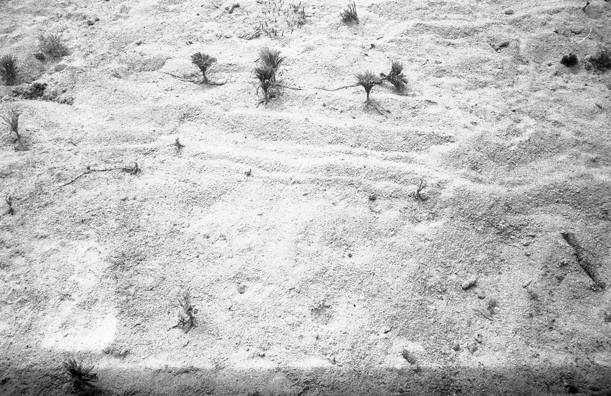{.lightbox group="discovery-bay-1966" description="**UUID: **44e45fe7-7101-42a4-975c-872a98bd68a1 **Date: **1967-03-03 **Location: **Jamaica | Discovery Bay | Algal Plots **Longitude: **77.414ºW **Latitude: **18.473ºN **Photographer: **Eileen Graham **Copyright: **Trustees of the Natural History Museum (London, UK), CC-BY-4.0" alt="**UUID: **44e45fe7-7101-42a4-975c-872a98bd68a1 **Date: **1967-03-03 **Location: **Jamaica | Discovery Bay | Algal Plots **Longitude: **77.414ºW **Latitude: **18.473ºN **Photographer: **Eileen Graham **Copyright: **Trustees of the Natural History Museum (London, UK), CC-BY-4.0"}

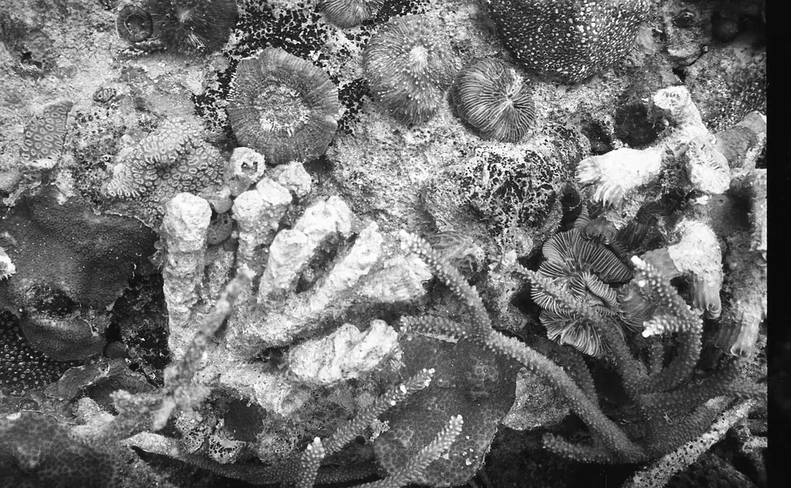{.lightbox group="discovery-bay-1966" description="**UUID: **8b4818f9-f2cb-4608-a6ed-8e0b6ee0e664 **Date: **1967-03-03 **Location: **Jamaica | Discovery Bay | Buoy Upper Slope **Longitude: **77.40908ºW **Latitude: **18.47322ºN **Photographer: **Eileen Graham **Copyright: **Trustees of the Natural History Museum (London, UK), CC-BY-4.0" alt="**UUID: **8b4818f9-f2cb-4608-a6ed-8e0b6ee0e664 **Date: **1967-03-03 **Location: **Jamaica | Discovery Bay | Buoy Upper Slope **Longitude: **77.40908ºW **Latitude: **18.47322ºN **Photographer: **Eileen Graham **Copyright: **Trustees of the Natural History Museum (London, UK), CC-BY-4.0"}

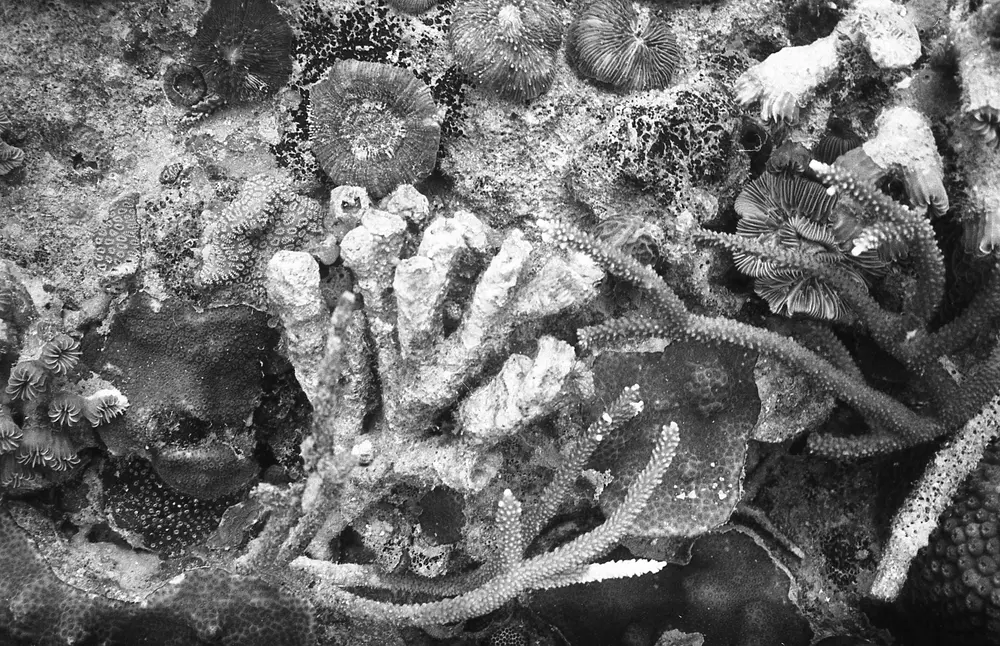{.lightbox group="discovery-bay-1966" description="**UUID: **d78a5010-5405-4bc4-b301-8a97a29ab262 **Date: **1967-03-03 **Location: **Jamaica | Discovery Bay | Buoy Upper Slope **Longitude: **77.40908ºW **Latitude: **18.47322ºN **Photographer: **Eileen Graham **Copyright: **Trustees of the Natural History Museum (London, UK), CC-BY-4.0" alt="**UUID: **d78a5010-5405-4bc4-b301-8a97a29ab262 **Date: **1967-03-03 **Location: **Jamaica | Discovery Bay | Buoy Upper Slope **Longitude: **77.40908ºW **Latitude: **18.47322ºN **Photographer: **Eileen Graham **Copyright: **Trustees of the Natural History Museum (London, UK), CC-BY-4.0"}

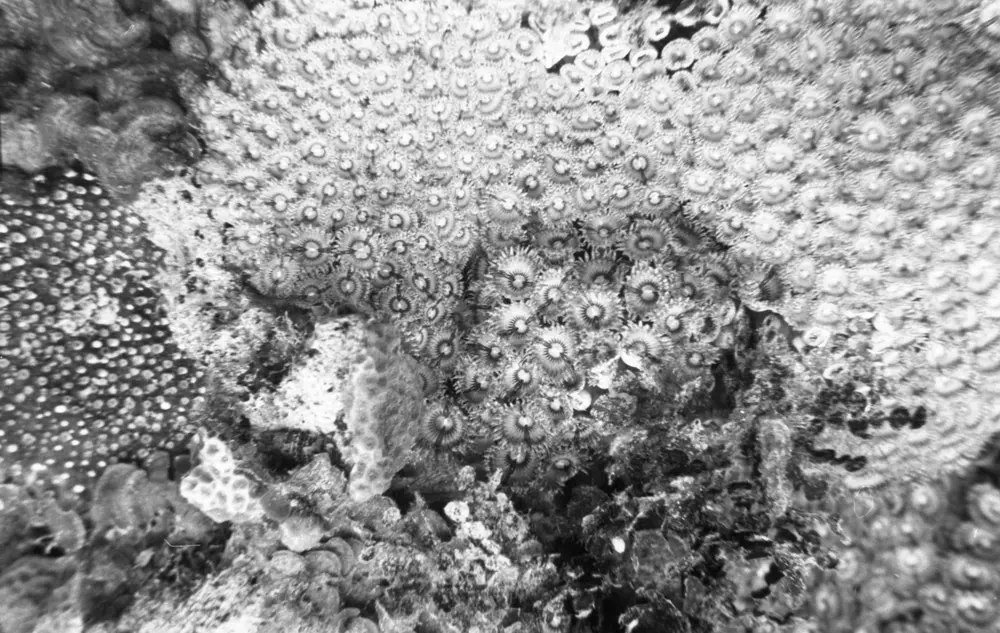{.lightbox group="discovery-bay-1966" description="**UUID: **3665e00b-a595-4440-9d12-ce70d969c379 **Date: **1968-01-22 **Location: **Jamaica | Discovery Bay | Buoy Upper Slope **Longitude: **77.40908ºW **Latitude: **18.47322ºN **Photographer: **Eileen Graham **Copyright: **Trustees of the Natural History Museum (London, UK), CC-BY-4.0" alt="**UUID: **3665e00b-a595-4440-9d12-ce70d969c379 **Date: **1968-01-22 **Location: **Jamaica | Discovery Bay | Buoy Upper Slope **Longitude: **77.40908ºW **Latitude: **18.47322ºN **Photographer: **Eileen Graham **Copyright: **Trustees of the Natural History Museum (London, UK), CC-BY-4.0"}

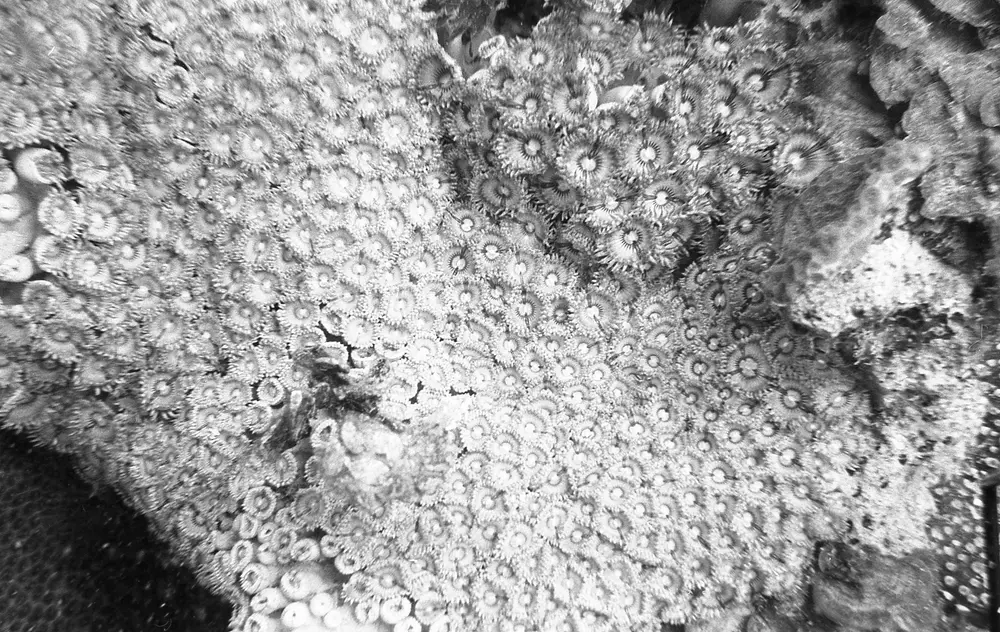{.lightbox group="discovery-bay-1966" description="**UUID: **72507b17-4683-42c2-b124-60c5cc54cccb **Date: **1968-01-22 **Location: **Jamaica | Discovery Bay | Buoy Upper Slope **Longitude: **77.40908ºW **Latitude: **18.47322ºN **Photographer: **Eileen Graham **Copyright: **Trustees of the Natural History Museum (London, UK), CC-BY-4.0" alt="**UUID: **72507b17-4683-42c2-b124-60c5cc54cccb **Date: **1968-01-22 **Location: **Jamaica | Discovery Bay | Buoy Upper Slope **Longitude: **77.40908ºW **Latitude: **18.47322ºN **Photographer: **Eileen Graham **Copyright: **Trustees of the Natural History Museum (London, UK), CC-BY-4.0"}

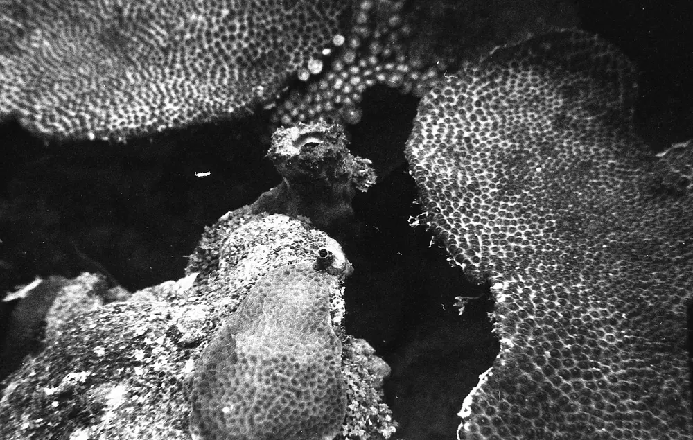{.lightbox group="discovery-bay-1966" description="**UUID: **62dbc2d3-f4f0-4d93-b455-f885a5d35c61 **Date: **1968-01-22 **Location: **Jamaica | Discovery Bay | Buoy Upper Slope **Longitude: **77.40908ºW **Latitude: **18.47322ºN **Photographer: **Eileen Graham **Copyright: **Trustees of the Natural History Museum (London, UK), CC-BY-4.0" alt="**UUID: **62dbc2d3-f4f0-4d93-b455-f885a5d35c61 **Date: **1968-01-22 **Location: **Jamaica | Discovery Bay | Buoy Upper Slope **Longitude: **77.40908ºW **Latitude: **18.47322ºN **Photographer: **Eileen Graham **Copyright: **Trustees of the Natural History Museum (London, UK), CC-BY-4.0"}

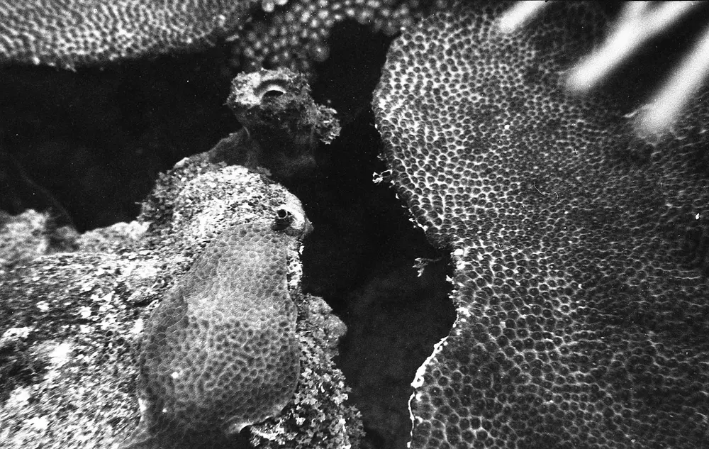{.lightbox group="discovery-bay-1966" description="**UUID: **3e7d108a-57b0-4981-8a19-c5b2a556a0c7 **Date: **1968-01-22 **Location: **Jamaica | Discovery Bay | Buoy Upper Slope **Longitude: **77.40908ºW **Latitude: **18.47322ºN **Photographer: **Eileen Graham **Copyright: **Trustees of the Natural History Museum (London, UK), CC-BY-4.0" alt="**UUID: **3e7d108a-57b0-4981-8a19-c5b2a556a0c7 **Date: **1968-01-22 **Location: **Jamaica | Discovery Bay | Buoy Upper Slope **Longitude: **77.40908ºW **Latitude: **18.47322ºN **Photographer: **Eileen Graham **Copyright: **Trustees of the Natural History Museum (London, UK), CC-BY-4.0"}

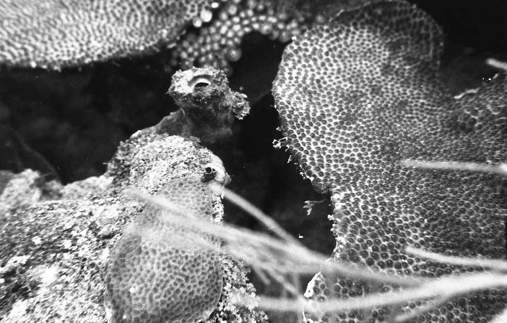{.lightbox group="discovery-bay-1966" description="**UUID: **20664b34-f75d-494c-b2f0-2679e847ddfa **Date: **1968-01-22 **Location: **Jamaica | Discovery Bay | Buoy Upper Slope **Longitude: **77.40908ºW **Latitude: **18.47322ºN **Photographer: **Eileen Graham **Copyright: **Trustees of the Natural History Museum (London, UK), CC-BY-4.0" alt="**UUID: **20664b34-f75d-494c-b2f0-2679e847ddfa **Date: **1968-01-22 **Location: **Jamaica | Discovery Bay | Buoy Upper Slope **Longitude: **77.40908ºW **Latitude: **18.47322ºN **Photographer: **Eileen Graham **Copyright: **Trustees of the Natural History Museum (London, UK), CC-BY-4.0"}

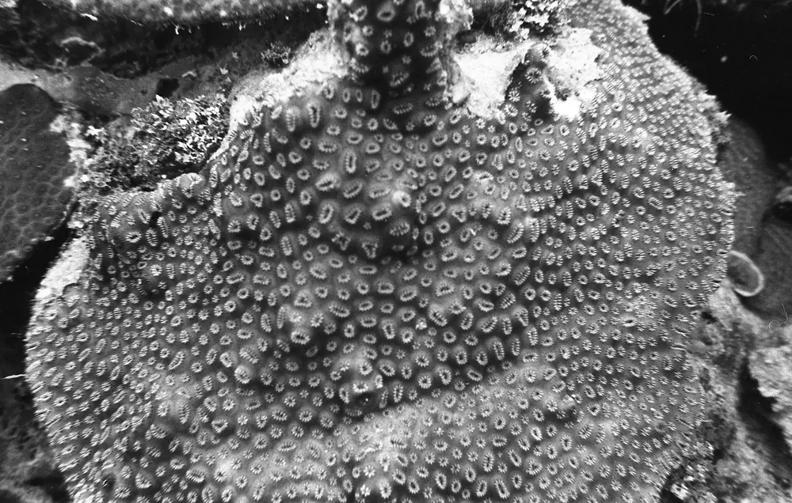{.lightbox group="discovery-bay-1966" description="**UUID: **2ed176ab-4a45-4e00-8d94-534489908a69 **Date: **1968-01-22 **Location: **Jamaica | Discovery Bay | Buoy Upper Slope **Longitude: **77.40908ºW **Latitude: **18.47322ºN **Photographer: **Eileen Graham **Copyright: **Trustees of the Natural History Museum (London, UK), CC-BY-4.0" alt="**UUID: **2ed176ab-4a45-4e00-8d94-534489908a69 **Date: **1968-01-22 **Location: **Jamaica | Discovery Bay | Buoy Upper Slope **Longitude: **77.40908ºW **Latitude: **18.47322ºN **Photographer: **Eileen Graham **Copyright: **Trustees of the Natural History Museum (London, UK), CC-BY-4.0"}

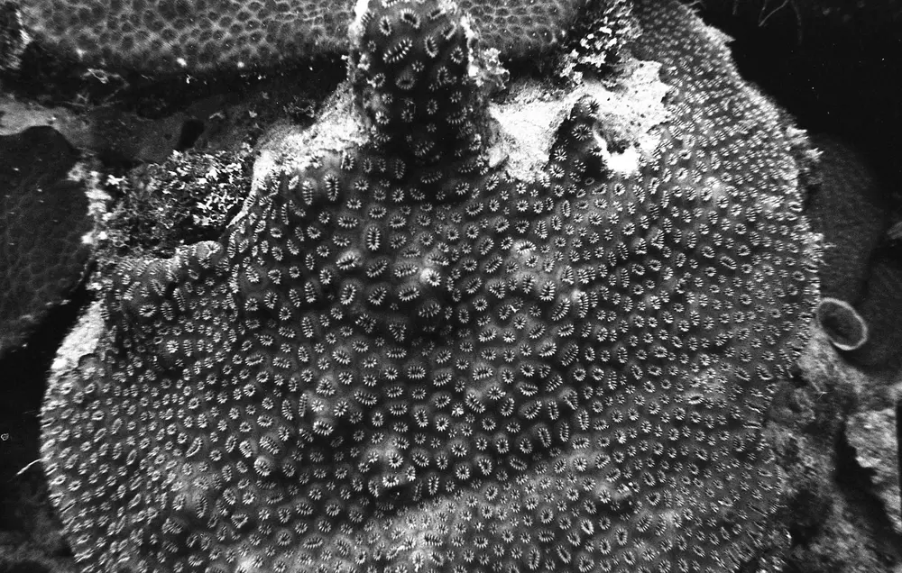{.lightbox group="discovery-bay-1966" description="**UUID: **fae32d15-b1d5-4276-843c-c6fbd4051fba **Date: **1968-01-22 **Location: **Jamaica | Discovery Bay | Buoy Upper Slope **Longitude: **77.40908ºW **Latitude: **18.47322ºN **Photographer: **Eileen Graham **Copyright: **Trustees of the Natural History Museum (London, UK), CC-BY-4.0" alt="**UUID: **fae32d15-b1d5-4276-843c-c6fbd4051fba **Date: **1968-01-22 **Location: **Jamaica | Discovery Bay | Buoy Upper Slope **Longitude: **77.40908ºW **Latitude: **18.47322ºN **Photographer: **Eileen Graham **Copyright: **Trustees of the Natural History Museum (London, UK), CC-BY-4.0"}

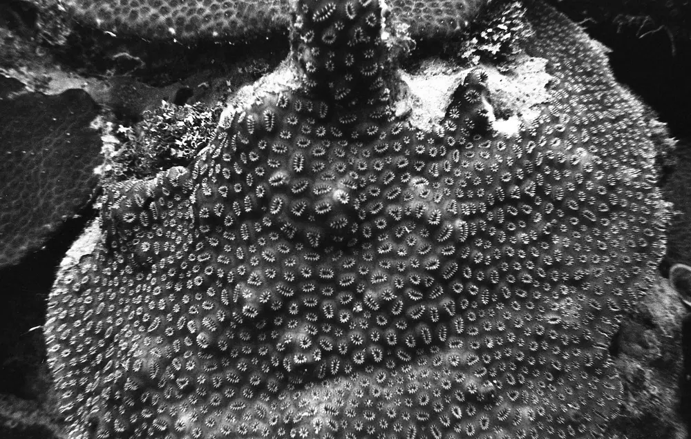{.lightbox group="discovery-bay-1966" description="**UUID: **96762b73-8552-4cbe-a8c6-7ce22bceab94 **Date: **1968-01-22 **Location: **Jamaica | Discovery Bay | Buoy Upper Slope **Longitude: **77.40908ºW **Latitude: **18.47322ºN **Photographer: **Eileen Graham **Copyright: **Trustees of the Natural History Museum (London, UK), CC-BY-4.0" alt="**UUID: **96762b73-8552-4cbe-a8c6-7ce22bceab94 **Date: **1968-01-22 **Location: **Jamaica | Discovery Bay | Buoy Upper Slope **Longitude: **77.40908ºW **Latitude: **18.47322ºN **Photographer: **Eileen Graham **Copyright: **Trustees of the Natural History Museum (London, UK), CC-BY-4.0"}

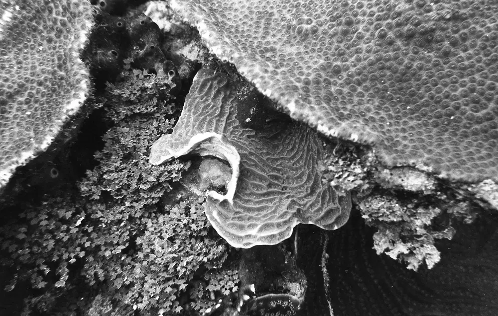{.lightbox group="discovery-bay-1966" description="**UUID: **7cf9b89b-6eb4-46c4-bf26-477095c3416f **Date: **1968-01-22 **Location: **Jamaica | Discovery Bay | Buoy Upper Slope **Longitude: **77.40908ºW **Latitude: **18.47322ºN **Photographer: **Eileen Graham **Copyright: **Trustees of the Natural History Museum (London, UK), CC-BY-4.0" alt="**UUID: **7cf9b89b-6eb4-46c4-bf26-477095c3416f **Date: **1968-01-22 **Location: **Jamaica | Discovery Bay | Buoy Upper Slope **Longitude: **77.40908ºW **Latitude: **18.47322ºN **Photographer: **Eileen Graham **Copyright: **Trustees of the Natural History Museum (London, UK), CC-BY-4.0"}

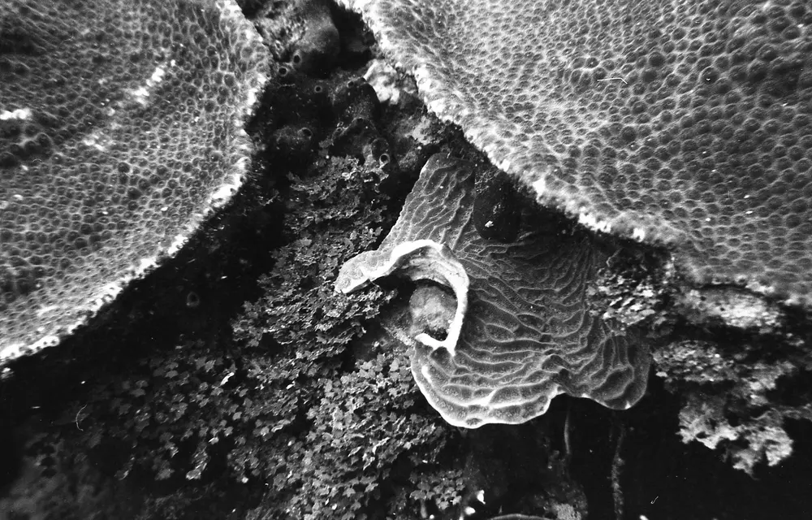{.lightbox group="discovery-bay-1966" description="**UUID: **f3ac19eb-8f36-4ab9-a94f-2cdafc90c193 **Date: **1968-01-22 **Location: **Jamaica | Discovery Bay | Buoy Upper Slope **Longitude: **77.40908ºW **Latitude: **18.47322ºN **Photographer: **Eileen Graham **Copyright: **Trustees of the Natural History Museum (London, UK), CC-BY-4.0" alt="**UUID: **f3ac19eb-8f36-4ab9-a94f-2cdafc90c193 **Date: **1968-01-22 **Location: **Jamaica | Discovery Bay | Buoy Upper Slope **Longitude: **77.40908ºW **Latitude: **18.47322ºN **Photographer: **Eileen Graham **Copyright: **Trustees of the Natural History Museum (London, UK), CC-BY-4.0"}

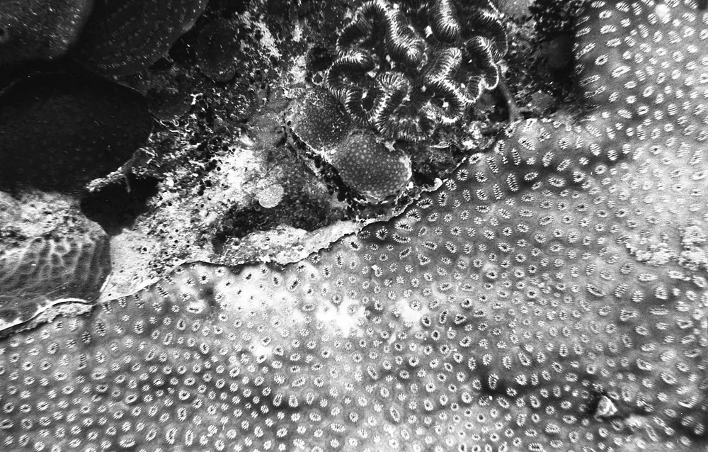{.lightbox group="discovery-bay-1966" description="**UUID: **eb3f2529-f1b6-48ff-9de6-1a90a91e12a8 **Date: **1968-01-22 **Location: **Jamaica | Discovery Bay | Buoy Upper Slope **Longitude: **77.40908ºW **Latitude: **18.47322ºN **Photographer: **Eileen Graham **Copyright: **Trustees of the Natural History Museum (London, UK), CC-BY-4.0" alt="**UUID: **eb3f2529-f1b6-48ff-9de6-1a90a91e12a8 **Date: **1968-01-22 **Location: **Jamaica | Discovery Bay | Buoy Upper Slope **Longitude: **77.40908ºW **Latitude: **18.47322ºN **Photographer: **Eileen Graham **Copyright: **Trustees of the Natural History Museum (London, UK), CC-BY-4.0"}

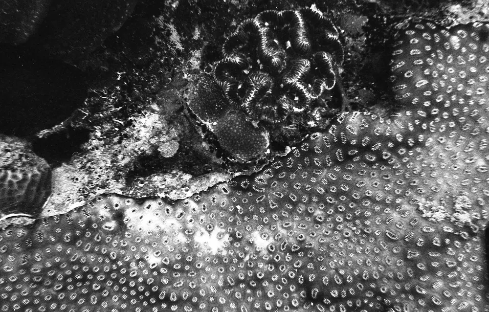{.lightbox group="discovery-bay-1966" description="**UUID: **8510a63b-cc39-4cfa-8742-87119c8a0345 **Date: **1968-01-22 **Location: **Jamaica | Discovery Bay | Buoy Upper Slope **Longitude: **77.40908ºW **Latitude: **18.47322ºN **Photographer: **Eileen Graham **Copyright: **Trustees of the Natural History Museum (London, UK), CC-BY-4.0" alt="**UUID: **8510a63b-cc39-4cfa-8742-87119c8a0345 **Date: **1968-01-22 **Location: **Jamaica | Discovery Bay | Buoy Upper Slope **Longitude: **77.40908ºW **Latitude: **18.47322ºN **Photographer: **Eileen Graham **Copyright: **Trustees of the Natural History Museum (London, UK), CC-BY-4.0"}

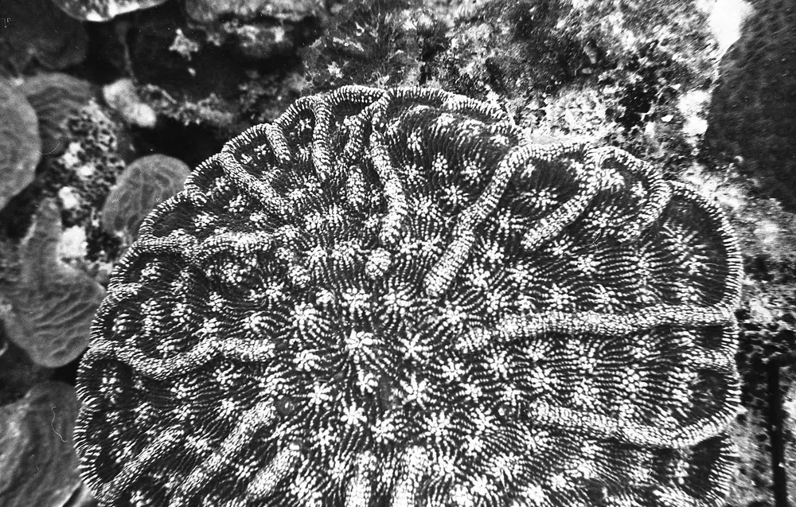{.lightbox group="discovery-bay-1966" description="**UUID: **ae4234fb-1236-4b30-97b5-e31e464ab00f **Date: **1968-01-22 **Location: **Jamaica | Discovery Bay | Buoy Upper Slope **Longitude: **77.40908ºW **Latitude: **18.47322ºN **Photographer: **Eileen Graham **Copyright: **Trustees of the Natural History Museum (London, UK), CC-BY-4.0" alt="**UUID: **ae4234fb-1236-4b30-97b5-e31e464ab00f **Date: **1968-01-22 **Location: **Jamaica | Discovery Bay | Buoy Upper Slope **Longitude: **77.40908ºW **Latitude: **18.47322ºN **Photographer: **Eileen Graham **Copyright: **Trustees of the Natural History Museum (London, UK), CC-BY-4.0"}

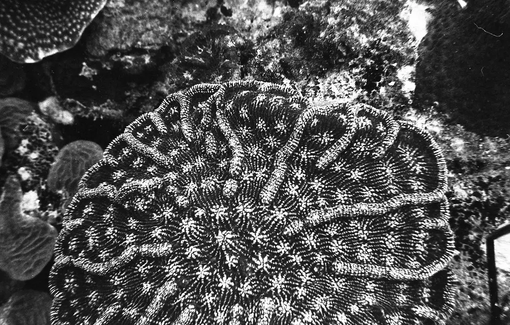{.lightbox group="discovery-bay-1966" description="**UUID: **e2ec27b7-66c3-4029-ae3f-19e76dc46ca4 **Date: **1968-01-22 **Location: **Jamaica | Discovery Bay | Buoy Upper Slope **Longitude: **77.40908ºW **Latitude: **18.47322ºN **Photographer: **Eileen Graham **Copyright: **Trustees of the Natural History Museum (London, UK), CC-BY-4.0" alt="**UUID: **e2ec27b7-66c3-4029-ae3f-19e76dc46ca4 **Date: **1968-01-22 **Location: **Jamaica | Discovery Bay | Buoy Upper Slope **Longitude: **77.40908ºW **Latitude: **18.47322ºN **Photographer: **Eileen Graham **Copyright: **Trustees of the Natural History Museum (London, UK), CC-BY-4.0"}

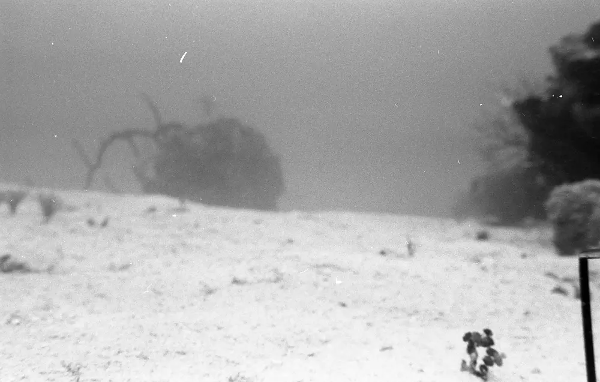{.lightbox group="discovery-bay-1966" description="**UUID: **404e720a-aa65-44ae-9d17-7e9867d81c65 **Date: **1968-01-22 **Location: **Jamaica | Discovery Bay | Algal Plots **Longitude: **77.414ºW **Latitude: **18.473ºN **Photographer: **Eileen Graham **Copyright: **Trustees of the Natural History Museum (London, UK), CC-BY-4.0" alt="**UUID: **404e720a-aa65-44ae-9d17-7e9867d81c65 **Date: **1968-01-22 **Location: **Jamaica | Discovery Bay | Algal Plots **Longitude: **77.414ºW **Latitude: **18.473ºN **Photographer: **Eileen Graham **Copyright: **Trustees of the Natural History Museum (London, UK), CC-BY-4.0"}

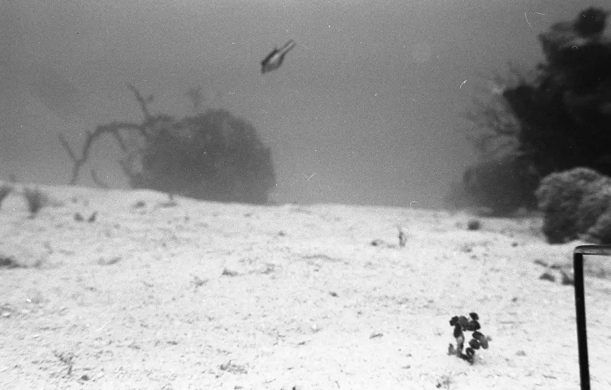{.lightbox group="discovery-bay-1966" description="**UUID: **f1510a8e-d4cb-4fd5-8436-2765d30ab131 **Date: **1968-01-22 **Location: **Jamaica | Discovery Bay | Algal Plots **Longitude: **77.414ºW **Latitude: **18.473ºN **Photographer: **Eileen Graham **Copyright: **Trustees of the Natural History Museum (London, UK), CC-BY-4.0" alt="**UUID: **f1510a8e-d4cb-4fd5-8436-2765d30ab131 **Date: **1968-01-22 **Location: **Jamaica | Discovery Bay | Algal Plots **Longitude: **77.414ºW **Latitude: **18.473ºN **Photographer: **Eileen Graham **Copyright: **Trustees of the Natural History Museum (London, UK), CC-BY-4.0"}

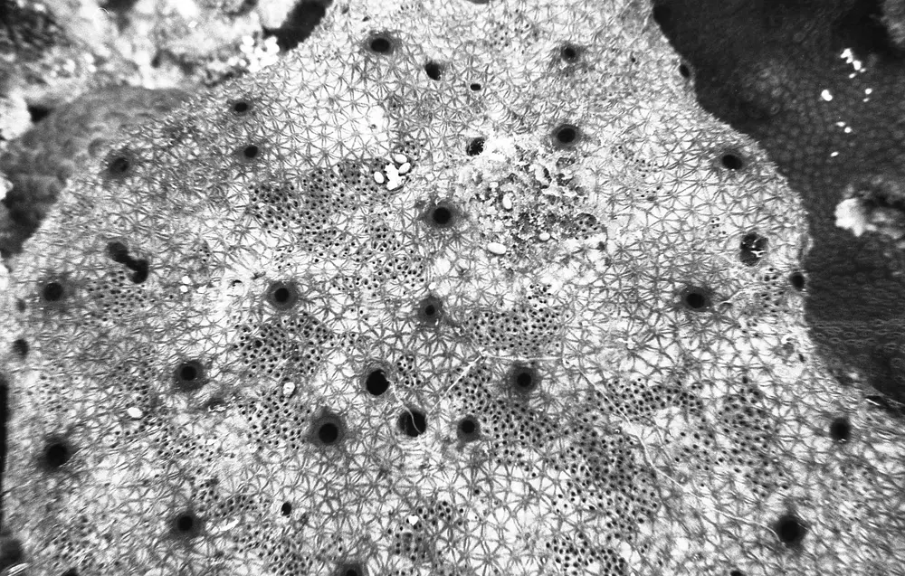{.lightbox group="discovery-bay-1966" description="**UUID: **9dbaea96-2b21-406b-950e-fc0a5e589b57 **Date: **1968-01-22 **Location: **Jamaica | Discovery Bay | Buoy Upper Slope **Longitude: **77.40908ºW **Latitude: **18.47322ºN **Photographer: **Eileen Graham **Copyright: **Trustees of the Natural History Museum (London, UK), CC-BY-4.0" alt="**UUID: **9dbaea96-2b21-406b-950e-fc0a5e589b57 **Date: **1968-01-22 **Location: **Jamaica | Discovery Bay | Buoy Upper Slope **Longitude: **77.40908ºW **Latitude: **18.47322ºN **Photographer: **Eileen Graham **Copyright: **Trustees of the Natural History Museum (London, UK), CC-BY-4.0"}

:::
